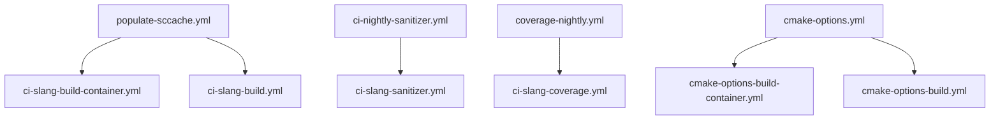
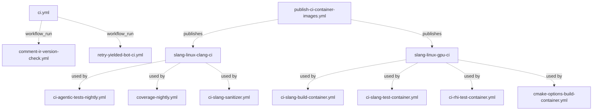

# GitHub Automation Map

This directory contains GitHub Actions workflows, local composite actions, and
their configuration. Workflow files live under `.github/workflows/`; local action
implementations live under `.github/actions/`.

Reusable workflows are YAML files with `on.workflow_call` and are invoked from
another workflow with `uses: ./.github/workflows/<file>.yml`.

When adding or removing a reusable workflow call, update this file and run:

```bash
actionlint -config-file .github/actionlint.yaml -shellcheck= -no-color
```

## Trigger Events

This table records the top-level GitHub event keys from each workflow's `on:`
block. Branch filters, path filters, activity `types`, schedules, and per-job
`if:` guards still live in the workflow YAML files.

| Event | Workflows |
| --- | --- |
| `pull_request` | `check-actionlint.yml`, `check-container-consistency.yml`, `check-formatting.yml`, `check-pr-label.yml`, `check-python-core.yml`, `check-spirv-generated.yml`, `check-toc.yml`, `ci.yml`, `publish-ci-container-images.yml` |
| `pull_request_target` | `add-pr-to-project.yml`, `ci-trigger-slangpy.yml`, `claude-pr-review.yml` |
| `merge_group` | `check-actionlint.yml`, `check-formatting.yml`, `check-python-core.yml`, `ci-trigger-slangpy.yml`, `ci.yml` |
| `push` | `check-container-consistency.yml`, `publish-ci-container-images.yml`, `push-benchmark-results.yml`, `release-linux-glibc-2-27.yml`, `release-linux-glibc-2-28.yml`, `release.yml` |
| `schedule` | `ci-agentic-tests-nightly.yml`, `ci-analytics.yml`, `ci-health.yml`, `ci-nightly-sanitizer.yml`, `cmake-options.yml`, `compile-perf-nightly.yml`, `compile-rtx-remix-shaders-nightly.yml`, `compile-sascha-willems-shaders-nightly.yml`, `coverage-nightly.yml`, `populate-sccache.yml`, `release-linux-glibc-2-27.yml`, `release-linux-glibc-2-28.yml`, `retry-yielded-bot-ci.yml`, `vk-gl-cts-nightly.yml` |
| `workflow_dispatch` | `add-issue-labels.yml`, `check-actionlint.yml`, `ci-agentic-tests-nightly.yml`, `ci-analytics.yml`, `ci-health.yml`, `ci-nightly-sanitizer.yml`, `ci-retry.yml`, `ci-trigger-slangpy.yml`, `ci.yml`, `claude-ci-analysis.yml`, `claude-pr-review.yml`, `claude.yml`, `cmake-options.yml`, `compile-perf-nightly.yml`, `compile-perf-release-sweep.yml`, `compile-rtx-remix-shaders-nightly.yml`, `compile-sascha-willems-shaders-nightly.yml`, `coverage-nightly.yml`, `populate-sccache.yml`, `publish-ci-container-images.yml`, `push-benchmark-results.yml`, `release-linux-glibc-2-27.yml`, `release-linux-glibc-2-28.yml`, `release.yml`, `retry-yielded-bot-ci.yml`, `update-spirv-tools.yml`, `vk-gl-cts-nightly.yml` |
| `workflow_call` | `ci-benchmark-test.yml`, `ci-compile-test.yml`, `ci-falcor-test.yml`, `ci-rhi-test-container.yml`, `ci-rhi-test.yml`, `ci-slang-build-container.yml`, `ci-slang-build.yml`, `ci-slang-coverage.yml`, `ci-slang-sanitizer.yml`, `ci-slang-test-container.yml`, `ci-slang-test.yml`, `cmake-options-build-container.yml`, `cmake-options-build.yml`, `materialx-test.yml` |
| `workflow_run` | `comment-ir-version-check.yml`, `retry-yielded-bot-ci.yml` |
| `repository_dispatch` | `format.yml`, `regenerate-cmdline-ref.yml`, `regenerate-toc.yml` |
| `issue_comment` | `claude.yml`, `slash-command-dispatch.yml` |
| `issues` | `add-issue-labels.yml`, `claude.yml` |
| `pull_request_review` | `claude.yml` |
| `pull_request_review_comment` | `claude.yml` |

## Event Vocabulary

| Event | Meaning in this repository |
| --- | --- |
| `pull_request` | Runs for PR activity such as open, update, reopen, or ready-for-review. Use this for checks that may inspect PR code with the restricted PR token/secrets model. |
| `pull_request_target` | Runs in the base repository context for PR activity, so repository secrets may be available even for fork PRs. These workflows must avoid checking out or executing untrusted PR code. |
| `merge_group` | Runs for GitHub merge queue batches before they merge to `master`. This is for checks that must pass on the exact queued merge-group commit. |
| `push` | Runs after refs are updated, usually `master` branch pushes or release tags in this repo. Path and branch/tag filters decide the exact scope. |
| `schedule` | Runs from a cron schedule in UTC. These are unattended maintenance, nightly, or weekly workflows. |
| `workflow_dispatch` | Manual button/API trigger. Some workflows define inputs for the operator to provide run IDs, PR numbers, date ranges, or recovery flags. |
| `workflow_call` | Reusable workflow entry point. These files are not started directly by GitHub events; another workflow calls them with `uses: ./.github/workflows/<file>.yml`. |
| `workflow_run` | Follows another workflow after it completes. In this repo, these watch `CI` to post artifacts/comments or retry yielded bot CI. |
| `repository_dispatch` | Custom API event, used here by slash-command plumbing to run follow-up workflows such as `/format` and `/regenerate-toc`. |
| `issue_comment` | Runs when an issue or PR conversation receives a comment. PR comments are still delivered as issue comments by GitHub. |
| `issues` | Runs for issue lifecycle events, such as newly opened issues. |
| `pull_request_review` | Runs when a PR review is submitted, edited, or dismissed, depending on the workflow's `types` filter. |
| `pull_request_review_comment` | Runs for inline PR review comments on code diff lines. |

## Workflow-To-Workflow Dependencies

Solid arrows are direct reusable-workflow calls through
`uses: ./.github/workflows/<file>.yml`. Dotted arrows are event or artifact
relationships.

### CI Entry Point

```mermaid
flowchart TB
    ci["ci.yml"]

    subgraph build["Build and sanitizer reusable workflows"]
        direction TB
        ciBuildContainer["ci-slang-build-container.yml"]
        ciBuild["ci-slang-build.yml"]
        ciSanitizer["ci-slang-sanitizer.yml"]
    end

    subgraph test["Test reusable workflows"]
        direction TB
        ciTestContainer["ci-slang-test-container.yml"]
        ciRhiContainer["ci-rhi-test-container.yml"]
        ciTest["ci-slang-test.yml"]
        ciRhi["ci-rhi-test.yml"]
    end

    subgraph integration["Integration and regression reusable workflows"]
        direction TB
        materialx["materialx-test.yml"]
        falcor["ci-falcor-test.yml"]
        compileTest["ci-compile-test.yml"]
        benchmarkTest["ci-benchmark-test.yml"]
    end

    ci --> ciBuildContainer
    ci --> ciBuild
    ci --> ciSanitizer
    ci --> ciTestContainer
    ci --> ciRhiContainer
    ci --> ciTest
    ci --> ciRhi
    ci --> materialx
    ci --> falcor
    ci --> compileTest
    ci --> benchmarkTest
```



### Other Reusable Workflow Callers



### Event And Container Image Relationships



## Reusable Workflows

| Reusable workflow | Called by | Local action dependencies |
| --- | --- | --- |
| `ci-benchmark-test.yml` | `ci.yml` | None |
| `ci-compile-test.yml` | `ci.yml` | None |
| `ci-falcor-test.yml` | `ci.yml` | None |
| `ci-rhi-test-container.yml` | `ci.yml` | `setup-vulkan-icd` |
| `ci-rhi-test.yml` | `ci.yml` | `common-test-setup` |
| `ci-slang-build-container.yml` | `ci.yml`, `populate-sccache.yml` | `check-disk-space`, `setup-sccache`, `setup-llvm-from-gcs` |
| `ci-slang-build.yml` | `ci.yml`, `populate-sccache.yml` | `setup-sccache`, `common-setup` |
| `ci-slang-coverage.yml` | `coverage-nightly.yml` | `check-disk-space`, `setup-llvm-from-gcs`, `common-setup` |
| `ci-slang-sanitizer.yml` | `ci.yml`, `ci-nightly-sanitizer.yml` | `setup-sccache`, `setup-llvm-from-gcs`, `common-setup` |
| `ci-slang-test-container.yml` | `ci.yml` | `setup-vulkan-icd` |
| `ci-slang-test.yml` | `ci.yml` | `common-test-setup` |
| `cmake-options-build-container.yml` | `cmake-options.yml` | None |
| `cmake-options-build.yml` | `cmake-options.yml` | `common-setup` |
| `materialx-test.yml` | `ci.yml` | `check-disk-space` |

## Event-Based Followers

These workflows are not called with `uses`, but they are still coupled to another
workflow through `workflow_run`.

| Workflow | Watches | Relationship |
| --- | --- | --- |
| `comment-ir-version-check.yml` | `CI` | Downloads `ir-version-check-results` from completed CI pull-request runs and posts/updates a PR comment. |
| `retry-yielded-bot-ci.yml` | `CI` | Reacts to completed CI runs and periodically retries yielded bot CI runs if the repository is quiet. |

## Container Image Dependencies

These workflows are coupled through GHCR image tags rather than `uses`.
`publish-ci-container-images.yml` validates image tag bumps on PRs and publishes
new images from `master`.

| Producer | Image | Consuming workflows |
| --- | --- | --- |
| `publish-ci-container-images.yml` | `ghcr.io/shader-slang/slang-linux-clang-ci:v1.0.1` | `ci-agentic-tests-nightly.yml`, `ci-slang-sanitizer.yml`, `coverage-nightly.yml` |
| `publish-ci-container-images.yml` | `ghcr.io/shader-slang/slang-linux-gpu-ci:v1.6.1` | `ci-rhi-test-container.yml`, `ci-slang-build-container.yml`, `ci-slang-test-container.yml`, `cmake-options-build-container.yml` |

`check-container-consistency.yml` verifies that the `slang-linux-gpu-ci` tag is
kept consistent across `*-container.yml` workflow files.

## Other Local Action Dependencies

These workflows do not call another workflow file, but they do depend on local
actions in `.github/actions/`.

| Workflow | Local action dependencies |
| --- | --- |
| `check-formatting.yml` | `format-setup` |
| `ci-agentic-tests-nightly.yml` | `setup-sccache`, `setup-llvm-from-gcs`, `common-setup` |
| `ci-rhi-test-container.yml` | `setup-vulkan-icd` |
| `ci-rhi-test.yml` | `common-test-setup` |
| `ci-slang-build-container.yml` | `check-disk-space`, `setup-sccache`, `setup-llvm-from-gcs` |
| `ci-slang-build.yml` | `setup-sccache`, `common-setup` |
| `ci-slang-coverage.yml` | `check-disk-space`, `setup-llvm-from-gcs`, `common-setup` |
| `ci-slang-sanitizer.yml` | `setup-sccache`, `setup-llvm-from-gcs`, `common-setup` |
| `ci-slang-test-container.yml` | `setup-vulkan-icd` |
| `ci-slang-test.yml` | `common-test-setup` |
| `claude-ci-analysis.yml` | `format-setup`, `claude-code-runner` |
| `claude-pr-review.yml` | `claude-code-runner` |
| `claude.yml` | `format-setup`, `claude-code-runner` |
| `cmake-options-build.yml` | `common-setup` |
| `compile-perf-nightly.yml` | `common-setup` |
| `compile-rtx-remix-shaders-nightly.yml` | `check-disk-space` |
| `compile-sascha-willems-shaders-nightly.yml` | `check-disk-space` |
| `materialx-test.yml` | `check-disk-space` |
| `push-benchmark-results.yml` | `common-setup` |
| `regenerate-cmdline-ref.yml` | `common-setup` |
| `release.yml` | `common-setup` |
| `vk-gl-cts-nightly.yml` | `common-setup` |

## Standalone Workflows

These workflows do not call local reusable workflows and do not use local
actions. They may still use third-party actions, GitHub APIs, secrets, external
repos, containers, or scripts in this repository.

| Workflow | Purpose |
| --- | --- |
| `add-issue-labels.yml` | Labels newly opened issues from org/team metadata. |
| `add-pr-to-project.yml` | Adds newly opened PRs to the project board and classifies their source. |
| `check-actionlint.yml` | Runs actionlint against GitHub Actions workflow files. |
| `check-pr-label.yml` | Requires exactly one breaking/non-breaking PR label. |
| `check-python-core.yml` | Parses `extras/**/*.py` with stock Python and checks for non-stdlib imports. |
| `check-spirv-generated.yml` | Verifies generated SPIRV-Tools files are current. |
| `check-toc.yml` | Checks the user-guide table of contents. |
| `ci-analytics.yml` | Collects CI job analytics into the analytics repository. |
| `ci-health.yml` | Publishes CI health data to the analytics repository. |
| `ci-retry.yml` | Manually waits for a run and reruns failed jobs. |
| `ci-trigger-slangpy.yml` | Triggers SlangPy CI for PRs and merge-queue entries. |
| `compile-perf-release-sweep.yml` | Manually resweeps release compile-performance history. |
| `format.yml` | Handles `/format` repository-dispatch commands. |
| `regenerate-toc.yml` | Handles `/regenerate-toc` repository-dispatch commands. |
| `release-linux-glibc-2-27.yml` | Builds the legacy Ubuntu 18 / glibc-compatible release package. |
| `release-linux-glibc-2-28.yml` | Builds manylinux glibc 2.28 release packages. |
| `slash-command-dispatch.yml` | Dispatches slash commands from PR comments. |
| `update-spirv-tools.yml` | Placeholder workflow for SPIRV-Tools tip-of-tree testing. |
