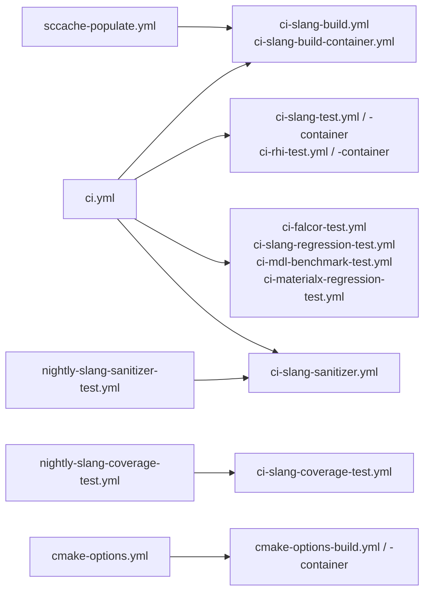
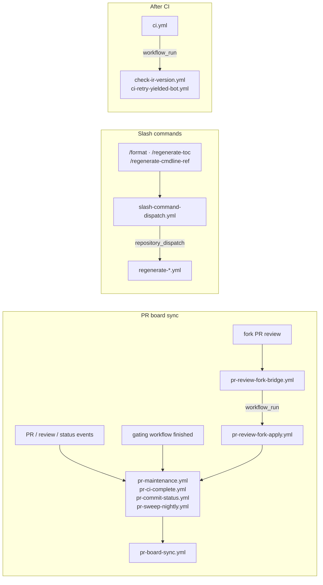

# GitHub Actions workflows

A map of the workflows in this directory, grouped by **when they run** and
**what they do**, so you can find the right file without opening each one.

Each `.yml` is the source of truth for its own behavior. This README records
only the shape of the system: what triggers a workflow, which workflows call
which, and why a group exists. Deliberately omitted are cron minutes, runner
pools, path filters, timeouts, and required-check names — those change often,
and the file (or repo settings) already states them.

## How the pieces fit

Most workflows are thin: a **caller** declares the trigger, and a **reusable**
workflow (`workflow_call`) holds the actual build/test logic, so one edit
changes every caller at once.

The other structural pattern is a **relay**: an event that cannot do the work
itself hands off to a second workflow that can. Either the first event lacks
permissions (a fork's code must never hold a write token), or the needed event
is not delivered at all, so a `workflow_run` on a completed workflow stands in
for it.

## Trigger vocabulary

| Trigger               | Meaning                                                                 |
| --------------------- | ----------------------------------------------------------------------- |
| `pull_request`        | Runs on an open PR, against a preview merge into the base branch.       |
| `merge_group`         | Re-runs in the merge queue, against the queue's tentative merge commit. |
| `pull_request_target` | PR events, run in the base repo's privileged context with secrets.      |
| `workflow_call`       | Reusable: invoked by another workflow, never triggered on its own.      |
| `workflow_run`        | Runs after a named workflow completes, privileged and without checkout. |
| `repository_dispatch` | Triggered by a slash command relayed from a PR comment.                 |
| `schedule`            | Cron-driven.                                                            |
| `workflow_dispatch`   | Run manually from the Actions tab.                                      |

## 1. PR gates

`ci.yml` is the build/test umbrella; it fans out into the reusable workflows
above and collapses the result into one aggregate job. The `check-*` workflows
are cheap, focused gates that run independently of it. Most are path-filtered so
they stay off PRs they cannot apply to.

**Per-PR versus merge queue.** A change is validated at two different commits.
`pull_request` tests your branch previewed against the base branch as it looked
then; `merge_group` re-tests after approval against the queue's tentative merge
commit — your change stacked on everything ahead of it in the queue — which is
what catches a conflict between two independently-green PRs.

**Running is not gating.** Only _required status checks_ block a merge, and the
required list is branch-protection configuration in repo settings, not something
this directory declares. A workflow with a `merge_group` trigger that is not
required will still run on a queue entry, but a failure there does not stop the
merge, and the run is left on the temporary `gh-readonly-queue/...` branch that
is deleted right after — so check the workflow's own run list, not the PR.

| Workflow                          | Per-PR | Merge queue | Purpose                                                   |
| --------------------------------- | ------ | ----------- | --------------------------------------------------------- |
| `ci.yml`                          | yes    | yes         | Build + test umbrella; aggregates into one gate job.      |
| `check-actionlint.yml`            | yes    | yes         | Lints the workflow YAML in this directory.                |
| `check-formatting.yml`            | yes    | yes         | Checks formatting; comment `/format` to auto-fix.         |
| `check-python-core.yml`           | yes    | yes         | Compile-checks the repo's Python scripts.                 |
| `check-submodules.yml`            | yes    | yes         | Verifies `external/**` submodule pins are reachable.      |
| `check-workflow-scripts.yml`      | yes    | yes         | Unit-tests the JavaScript the board-sync workflows embed. |
| `ci-slangpy-trigger-test.yml`     | yes    | yes         | Runs SlangPy's CI against this change.                    |
| `check-pr-label.yml`              | yes    | no          | Requires exactly one `pr:` classification label.          |
| `check-toc.yml`                   | yes    | no          | Checks the user-guide TOC; `/regenerate-toc` auto-fixes.  |
| `check-spirv-generated.yml`       | yes    | no          | Verifies committed SPIR-V generated files are current.    |
| `check-container-consistency.yml` | yes    | no          | Verifies the container workflows pin the same image.      |
| `reuse-compliance.yml`            | yes    | no          | REUSE/SPDX license-header check.                          |
| `claude-pr-review.yml`            | yes    | no          | Automated review of the PR diff. Advisory.                |

Two gates live as jobs **inside** `ci.yml` rather than as their own files, so
they can reuse an artifact CI already built: `check-cmdline-ref` and
`check-capability-atoms-ref`, which verify the generated reference docs still
match their sources.

One more file belongs to this group without appearing in the table, because it
has neither trigger: `check-ir-version.yml` runs on `workflow_run`, after a CI
run completes. It is the relay pattern — the IR-version check itself runs inside
CI, which uploads its result as an artifact, and this workflow then posts the PR
comment, because commenting needs a token the build job (possibly running a
fork's code) must not hold.

## 2. Reusable building blocks (`workflow_call`)

No trigger of their own; see the first diagram for who calls them. The
`*-container` variants run inside the Linux CI container images.

| Workflow                                                       | Purpose                                  |
| -------------------------------------------------------------- | ---------------------------------------- |
| `ci-slang-build.yml`, `ci-slang-build-container.yml`           | Build Slang for one matrix entry.        |
| `ci-slang-test.yml`, `ci-slang-test-container.yml`             | Run `slang-test` for one platform.       |
| `ci-rhi-test.yml`, `ci-rhi-test-container.yml`                 | Run the slang-rhi test suite.            |
| `ci-slang-sanitizer.yml`                                       | Sanitizer-instrumented build and test.   |
| `ci-slang-coverage-test.yml`                                   | Instrumented build plus coverage report. |
| `ci-falcor-test.yml`                                           | Compile Falcor's shaders.                |
| `ci-slang-regression-test.yml`                                 | Compile-regression suite.                |
| `ci-mdl-benchmark-test.yml`                                    | MDL benchmark run.                       |
| `ci-materialx-regression-test.yml`                             | MaterialX integration test.              |
| `cmake-options-build.yml`, `cmake-options-build-container.yml` | Build one CMake-option combination.      |
| `pr-board-sync.yml`                                            | The PR-board reconciliation engine.      |

## 3. Scheduled

Work too slow, too noisy, or too repetitive to gate a PR. Cadences are in each
file's `schedule:` block; the nightly hours are staggered so the heavy suites do
not compete for the same runners.

| Workflow                           | Cadence    | Purpose                                                      |
| ---------------------------------- | ---------- | ------------------------------------------------------------ |
| `ci-health.yml`                    | sub-hourly | Samples runner-cap saturation and publishes a health signal. |
| `sccache-populate.yml`             | sub-hourly | Builds master to keep the shared sccache warm for PRs.       |
| `ci-retry-yielded-bot.yml`         | hourly     | Reruns bot CI runs that yielded their runner slot.           |
| `nightly-slang-coverage-test.yml`  | nightly    | Full coverage run; publishes the report.                     |
| `nightly-slang-sanitizer-test.yml` | nightly    | Sanitizer run over the full test suite.                      |
| `nightly-remix-test.yml`           | nightly    | Compiles all RTX Remix shaders.                              |
| `nightly-slang-test.yml`           | nightly    | Runs the generated, doc-anchored suite under `docs/`.        |
| `nightly-slang-sascha-test.yml`    | nightly    | Compiles the Sascha Willems Vulkan sample shaders.           |
| `nightly-slang-vkglcts-test.yml`   | nightly    | Runs the Vulkan CTS with Slang as the shader compiler.       |
| `nightly-mdl-perf-test.yml`        | nightly    | Compile-performance suite for the MDL workloads.             |
| `ci-analytics.yml`                 | daily      | Collects CI run statistics and publishes them.               |
| `pr-sweep-nightly.yml`             | nightly    | Board-sync backstop over every open PR.                      |
| `cmake-options.yml`                | weekly     | Builds the matrix of non-default CMake option combinations.  |

## 4. PR board sync and bots

The `pr-*` files are thin callers around `pr-board-sync.yml`; each exists
because a different event is the only one carrying a particular signal, or the
only one carrying secrets for a fork PR. See the second diagram, and read
[`pr-board-sync.md`](pr-board-sync.md) before changing any of them.

| Workflow                                                | Purpose                                                      |
| ------------------------------------------------------- | ------------------------------------------------------------ |
| `pr-maintenance.yml`                                    | Board sync for PR and review events on origin PRs.           |
| `pr-ci-complete.yml`                                    | Board sync when a gating workflow finishes.                  |
| `pr-commit-status.yml`                                  | Board sync when an external commit status settles.           |
| `pr-review-fork-bridge.yml`, `pr-review-fork-apply.yml` | Two-stage relay for fork-PR reviews.                         |
| `issue-add-labels.yml`                                  | Labels new issues by the author's team membership.           |
| `claude.yml`                                            | The `@claude` assistant on issues and PRs.                   |
| `claude-ci-analysis.yml`                                | On demand: analyzes a CI failure and pushes a fix to the PR. |

## 5. Slash-command regenerators

`slash-command-dispatch.yml` turns an allow-listed comment into a
`repository_dispatch`. Each regenerator rebuilds its file and opens a follow-up
PR against your branch, so a failed check can be fixed without a local checkout.

| Workflow                     | Command                   | Regenerates                        |
| ---------------------------- | ------------------------- | ---------------------------------- |
| `regenerate-format.yml`      | `/format`                 | Formatting across the tree.        |
| `regenerate-toc.yml`         | `/regenerate-toc`         | The user-guide table of contents.  |
| `regenerate-cmdline-ref.yml` | `/regenerate-cmdline-ref` | The slangc command-line reference. |

## 6. Release, tag, and publishing

| Workflow                                                       | Trigger              | Purpose                                                                                                                                                                |
| -------------------------------------------------------------- | -------------------- | ---------------------------------------------------------------------------------------------------------------------------------------------------------------------- |
| `release.yml`                                                  | version tag          | Builds and publishes the release binaries.                                                                                                                             |
| `release-linux-glibc-2-27.yml`, `release-linux-glibc-2-28.yml` | version tag, nightly | Extra Linux builds against older glibc.                                                                                                                                |
| `container-publish-images.yml`                                 | `docker/**`          | Publishes the Linux CI container images. A PR validates the version contract only; it never builds a Dockerfile, since that would run PR code on a self-hosted runner. |
| `perf-push-benchmark-results.yml`                              | push to master       | Publishes MDL benchmark numbers.                                                                                                                                       |

## 7. Manual only

| Workflow                         | Purpose                                                     |
| -------------------------------- | ----------------------------------------------------------- |
| `ci-retry.yml`                   | Waits for a run to finish, then reruns its failed jobs.     |
| `perf-compile-release-sweep.yml` | Backfills compile-performance history across past releases. |
| `check-spirv-tools.yml`          | Placeholder for a SPIRV-Tools tip-of-tree check.            |

## 8. Composite actions

Shared step bundles in [`../actions/`](../actions/), used as
`uses: ./.github/actions/<name>`. Not workflows; they cannot be triggered.

| Action                | Purpose                                                    |
| --------------------- | ---------------------------------------------------------- |
| `common-setup`        | Setup shared by every build job.                           |
| `common-test-setup`   | Setup shared by every test job.                            |
| `setup-llvm-from-gcs` | Fetches prebuilt LLVM, building only on a cache miss.      |
| `setup-sccache`       | Installs and configures sccache.                           |
| `setup-vulkan-icd`    | Works around a driver-specific Vulkan ICD failure.         |
| `format-setup`        | Installs the formatting tools.                             |
| `check-disk-space`    | Fails a job early when free disk space is low.             |
| `claude-code-runner`  | Auth, setup, and result handling for the Claude workflows. |

## 9. Other files here

`pr-board-sync.md` is the design document for the board sync. `ci-examples.sh`
is a helper script the CI jobs call, not a workflow. Related configuration sits
one level up in `.github/`: `actionlint.yaml`, `cmake-options-matrix.json`,
`scripts/`, and `pr-board-sync-templates/`.
