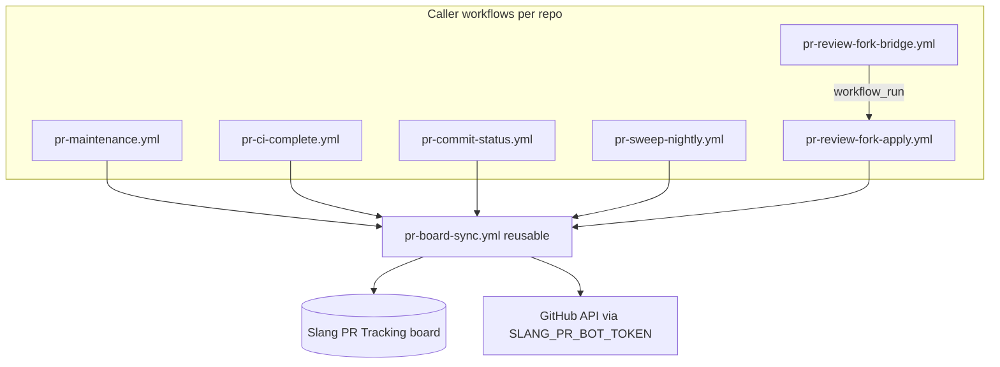

# PR board sync

Slang PRs on the shared **"Slang PR Tracking"** ProjectsV2 board are kept up to
date by a reusable GitHub Actions workflow,
[`pr-board-sync.yml`](pr-board-sync.yml), plus thin **caller** workflows that
declare triggers and pass one org secret. Every `shader-slang` repo can onboard
the same engine; see
[`../pr-board-sync-templates/README.md`](../pr-board-sync-templates/README.md)
for copy-me caller templates.

## What it does

For each open PR the workflow:

1. Adds the PR to the board (idempotent).
2. Classifies and sets **Source** (`Internal` / `Community` / `Bot`).
3. Recomputes **Status** from live PR state (`In Review`, `Revising`, `Snagged`,
   `Approved`, `Done`).
4. Backfills **assignee** and **reviewers** when the PR has no owner yet.
5. Assigns still-unassigned **linked (closing) issues** to the PR owner.
6. Co-assigns the **community author** on Community PRs (best-effort, after the
   owner is set).
7. Unrequests **ignored reviewers** (e.g. `bmillsNV`) on onboarding and when
   freshly assigning an owner — not on every sweep pass for already-assigned PRs.

All GitHub API calls use the org-level `SLANG_PR_BOT_TOKEN` PAT. Callers and the
reusable workflow set `permissions: {}` so the ambient `GITHUB_TOKEN` is unused.

## Architecture



### Callers in `shader-slang/slang`

| Workflow | Trigger | Mode | Notes |
| --- | --- | --- | --- |
| `pr-maintenance.yml` | `pull_request_target`, origin `pull_request_review`, `check_suite` | event | Fork reviews are skipped here and relayed below. |
| `pr-ci-complete.yml` | `workflow_run` (gating checks completed) | event | Actions CI does not emit usable `check_suite`. |
| `pr-commit-status.yml` | `status` (non-pending) | event | External statuses (`SlangPy Tests`, `license/cla`, …). |
| `pr-sweep-nightly.yml` | `schedule`, `workflow_dispatch` | **sweep** | Reconciles every open PR in the repo. |
| `pr-review-fork-bridge.yml` | fork `pull_request_review` | relay only | No secrets; completes to trigger apply. |
| `pr-review-fork-apply.yml` | `workflow_run` (bridge completed) | event | Privileged path for fork reviews. |

**Event mode** reconciles the single PR (or PRs for a commit SHA) that triggered
the run. **Sweep mode** lists every open PR in the repo and runs the same per-PR
engine on each — the periodic backstop for missed webhooks, failed runs, post-hoc
issue links, and board drift.

## Board semantics

This file documents the automation that updates the board. Maintainer-facing
semantics for the **Source** and **Status** fields live in
[`../../docs/maintainers/pr-review-board.md`](../../docs/maintainers/pr-review-board.md).

In implementation terms:

- The board's Source value is authoritative once set; automation only backfills
  Source when the board has none.
- `computeTarget()` maps observed PR state to Status for event and sweep mode.
- `Done` is terminal: once the board Status is `Done`, later events leave it
  unchanged.

## Assignment and reviewers

`reconcileAssignment()` runs only when the PR has **no assignee yet** (plus
linked-issue sync when already assigned). Skips human drafts (except Bot PRs) and
merge-queued PRs.

| Source | Assignee | Reviewers |
| --- | --- | --- |
| **Internal** | PR author | none |
| **Community / Bot** | see pick order below | assignee + top collaborator-not-owner, unless a real reviewer is already requested |

**Pick order** (Community/Bot):

1. Linked-issue assignee who is in the owners team.
2. Top **committer-signal** owner from changed files.
3. Maintainer team member (or `fallback_assignee`).

**Community PRs** also co-assign the external author (separate API call, best-effort).

**Ignored reviewers** (`bmillsNV`, …) are unrequested when a new owner is assigned
and on `opened`/`reopened` onboarding. Already-assigned PRs are not re-scanned
for ignored reviewers on sweep.

## Committer signal

Changed files are weighted by path (`source/slang/**` highest, `docs/**` lowest).
For each top file, recent default-branch history attributes LOC to committers
(bots and the PR author are never credited; bot-authored commits fall back to the
last approver of the introducing PR). A cheap total-LOC pass ranks candidates; a
per-file LOC tiebreak runs only when the top two are close.

The ranking/selection logic is inlined in `pr-board-sync.yml` (between
`extract-js:assignment:begin/end` markers). Unit tests extract that block at run
time:

```bash
node .github/scripts/pr-signal.test.js
node .github/scripts/pr-assign.test.js
```

## CI rollup

`prInfo()` reads the head commit's check rollup (Actions check runs + external
`StatusContext`). Summarized to `none` / `pending` / `failed` / `passed` /
`action_required`.

Because GitHub does not deliver `check_suite` for Actions-created suites:

- **Actions gating workflows** → `pr-ci-complete.yml` relays `workflow_run`.
- **External commit statuses** → `pr-commit-status.yml` relays `status`.
- **Non-Actions check suites** (if any) → `check_suite` in `pr-maintenance.yml`.

Commit-scoped events serialize on head SHA in the reusable workflow's concurrency
group.

## Fork PRs on public repos

| Event | Secret for fork PR? | Path |
| --- | --- | --- |
| `pull_request_target` | yes | `pr-maintenance.yml` → direct |
| `pull_request_review` | **no** | `pr-review-fork-bridge.yml` → `pr-review-fork-apply.yml` (`workflow_run`) |
| `workflow_run`, `status`, `schedule` | yes | respective callers → direct |

When `SLANG_PR_BOT_TOKEN` is unavailable, privileged steps skip cleanly (`HAS_TOKEN`).

## Required secret

**`SLANG_PR_BOT_TOKEN`** (org-level): Projects read+write, Members read; repo
Contents read, Pull requests write, Issues write, Metadata read.

## Safety

No checkout, no execution of PR code — metadata-only API calls. Safe under
`pull_request_target` and privileged `workflow_run` for fork PRs.
