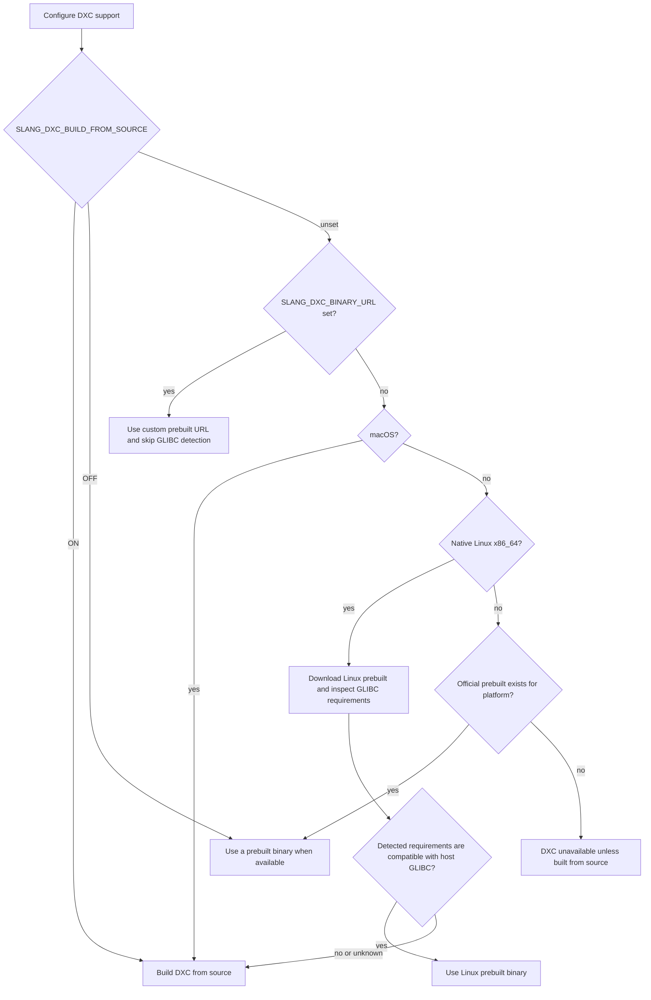

# Building Slang From Source

### TLDR

`cmake --workflow --preset release` to configure, build, and package a release
version of Slang.

## Prerequisites:

Please install:

- CMake (3.26 preferred, but 3.22 works[^1])
- A C++ compiler with support for C++17. GCC, Clang and MSVC are supported
- A CMake compatible backend, for example Visual Studio or Ninja
- Python3 (a dependency for building spirv-tools)

Optional dependencies for tests include

- CUDA
- OptiX
- NVAPI
- Aftermath
- X11

Other dependencies are sourced from submodules in the [./external](./external)
directory.

## Get the Source Code

Clone [this](https://github.com/shader-slang/slang) repository. Make sure to
fetch the submodules also.

```bash
git clone https://github.com/shader-slang/slang --recursive
```

You will need the git tags from this repository, otherwise versioning
information (including the Slang modules directory name and the library
filenames on macOS and Linux) will be incorrect. The above command should fetch
them for you, but if you're fetching from a fork you may need to explicitly
fetch the latest tags from the shader-slang repository with:

```bash
git fetch https://github.com/shader-slang/slang.git 'refs/tags/*:refs/tags/*'
```

## Configure and build

> This section assumes cmake 3.25 or greater, if you're on a lower version
> please see [building with an older cmake](#building-with-an-older-cmake)

For a Ninja based build system (all platforms) run:

```bash
cmake --preset default
cmake --build --preset releaseWithDebugInfo # or --preset debug, or --preset release
```

> Note: when using Ninja (default preset) on Windows, you need to make sure the `cmake` command is run from the Visual Studio Developer Command Prompt. If you are a coding agent trying to build Slang in a Windows sandbox, run `extras/win-sandbox-build.bat [debug|release|releaseWithDebugInfo|minSizeRel] [x64|arm64|Win32] [target...]` instead. It configures with the `vs2022-dev` preset, reuses locally cached dependencies to avoid network fetches, and defaults to building `slangc`, `slang-test`, and `slangi`.

For Visual Studio run:

```bash
cmake --preset vs2022 # or 'vs2019' or 'vs2026'
start devenv ./build/slang.sln # to optionally open the project in Visual Studio
cmake --build --preset releaseWithDebugInfo # to build from the CLI, could also use --preset release or --preset debug
```

There are also `*-dev` variants like `vs2022-dev` and `vs2026-dev` which turn on features to aid
debugging. The `vs2022-dev` preset writes to `build/windows-vs2022-dev`.

### WebAssembly build

In order to build WebAssembly build of Slang, Slang needs to be compiled with
[Emscripten SDK](https://github.com/emscripten-core/emsdk). You can find more
information about [Emscripten](https://emscripten.org/).

You need to clone the EMSDK repo. And you need to install and activate the latest.

```bash
git clone https://github.com/emscripten-core/emsdk.git
cd emsdk
```

For non-Windows platforms

```bash
./emsdk install latest
./emsdk activate latest
```

For Windows

```cmd
emsdk.bat install latest
emsdk.bat activate latest
```

After EMSDK is activated, Slang needs to be built in a cross compiling setup:

- build the `generators` target for the build platform
- configure the build with `emcmake` for the host platform
- build for the host platform.

> Note: For more details on cross compiling please refer to the
> [cross-compiling](docs/building.md#cross-compiling) section.

```bash
# Build generators.
cmake --workflow --preset generators --fresh
mkdir generators
cmake --install build --config Release --prefix generators --component generators

# Configure the build with emcmake.
# emcmake is available only when emsdk_env setup the environment correctly.
pushd ../emsdk
source ./emsdk_env # For Windows, emsdk_env.bat
popd
emcmake cmake -DSLANG_GENERATORS_PATH=generators/bin --preset emscripten -G "Ninja"

# Build slang-wasm.js and slang-wasm.wasm in build.em/Release/bin
cmake --build --preset emscripten --target slang-wasm
```

> Note: If the last build step fails, try running the command that `emcmake`
> outputs, directly.

### Android build

In order to build Slang for Android, you need the Android NDK installed and the `ANDROID_NDK_HOME` environment variable set to point to your NDK installation.

Android builds are a cross compiling setup, so build the generators for the build platform first:

```bash
# Build generators.
cmake --workflow --preset generators --fresh
mkdir generators
cmake --install build --prefix generators --component generators
```

Then configure and build for the desired architecture:

```bash
# ARM64 (arm64-v8a)
cmake --preset android-arm64 --fresh -DSLANG_GENERATORS_PATH=generators/bin
cmake --build --preset android-arm64-release

# x86_64
cmake --preset android-x86_64 --fresh -DSLANG_GENERATORS_PATH=generators/bin
cmake --build --preset android-x86_64-release
```

Other build presets are also provided for both architectures:

- `android-arm64-debug`
- `android-arm64-releaseWithDebugInfo`
- `android-x86_64-debug`
- `android-x86_64-releaseWithDebugInfo`

> Note: Android presets disable some features to reduce dependencies, including GFX, tests, slangd, replayer, LLVM, examples, xlib, CUDA, OptiX, NVAPI, and Aftermath.

## Installing

Build targets may be installed using cmake:

```bash
cmake --build . --target install
```

This should install `SlangConfig.cmake` that should allow `find_package` to work.
SlangConfig.cmake defines `SLANG_EXECUTABLE` variable that will point to `slangc`
executable and also define `slang::slang` target to be linked to.

For now, `slang::slang` is the only exported target defined in the config which can
be linked to.

Example usage

```cmake
find_package(slang REQUIRED PATHS ${your_cmake_install_prefix_path} NO_DEFAULT_PATH)
# slang_FOUND should be automatically set
target_link_libraries(yourLib PUBLIC
  slang::slang
)
```

## Testing

```bash
build/Debug/bin/slang-test
```

See the [documentation on testing](../tools/slang-test/README.md) for more information.

## Using sccache for faster rebuilds

[sccache](https://github.com/mozilla/sccache) caches compilation results so
that subsequent builds are significantly faster. To enable it, either set the
CMake option or the environment variable:

```bash
# Via CMake option
cmake --preset default -DSLANG_USE_SCCACHE=ON

# Via environment variable
SLANG_USE_SCCACHE=1 cmake --preset default
```

When sccache is enabled, precompiled headers are automatically disabled because
of a known incompatibility that causes linker errors. If
`CMAKE_C_COMPILER_LAUNCHER` or `CMAKE_CXX_COMPILER_LAUNCHER` is already set
(e.g. to ccache), the `SLANG_USE_SCCACHE` option is ignored to avoid conflicts.

## Debugging

See the [documentation on debugging](/docs/debugging.md).

## Distributing

### Versioned Libraries

As of v2025.21, the Slang libraries on **Mac** and **Linux** use versioned
filenames. The public ABI for Slang libraries in general is not currently
stable, so in accordance with semantic versioning conventions, the major
version number for dynamically linkable libraries is currently 0. Due to the
unstable ABI, releases are designed so that downstream users will be linked
against the fully versioned library filenames (e.g.,
`libslang-compiler.so.0.2025.21` instead of `libslang-compiler.so`).

Slang libraries for **Windows** do not have an explicit version in the
library filename, but the the same guidance about stability of the ABI applies.

Downstream users of Slang distributing their products as binaries should
therefor **on all platforms, including Windows** redistribute the Slang
libraries they linked against, or otherwise communicate the specific version
dependency to their users. It is _not the case_ that a user of your product can
just install any recent Slang release and have an installation of Slang that
works for any given binary.

## More niche topics

### CMake options

| Option                                | Default                       | Description                                                                                                                              |
| ------------------------------------- | ----------------------------- | ---------------------------------------------------------------------------------------------------------------------------------------- |
| `SLANG_VERSION`                       | Latest `v*` tag               | The project version, detected using git if available                                                                                     |
| `SLANG_DXC_BINARY_URL`                | Stable DXC release URL        | URL of the prebuilt DXC binary archive to download; overrides the default release URL and skips GLIBC auto-detection on Linux            |
| `SLANG_DXC_BUILD_FROM_SOURCE`         | Unset                         | `ON`: build DXC from source on Windows, Linux, and macOS; `OFF`: use prebuilt when available; unset: build from source on macOS and auto-select on native Linux x86_64 (see [DXC GLIBC auto-detection](#dxc-glibc-auto-detection)) |
| `SLANG_EMBED_CORE_MODULE`             | `TRUE`                        | Build slang with an embedded version of the core module                                                                                  |
| `SLANG_EMBED_CORE_MODULE_SOURCE`      | `TRUE`                        | Embed the core module source in the binary                                                                                               |
| `SLANG_ENABLE_DXIL`                   | `TRUE`                        | Enable generating DXIL using DXC                                                                                                         |
| `SLANG_ENABLE_ASAN`                   | `FALSE`                       | Enable ASAN (address sanitizer)                                                                                                          |
| `SLANG_ENABLE_COVERAGE`               | `FALSE`                       | Enable code coverage instrumentation                                                                                                     |
| `SLANG_ENABLE_FULL_IR_VALIDATION`     | `FALSE`                       | Enable full IR validation (SLOW!)                                                                                                        |
| `SLANG_ENABLE_VALIDATION_VM_BYTECODE` | `TRUE`                        | Enable VM bytecode validation in the bytecode interpreter. Disabling skips runtime safety checks for malformed bytecode.                 |
| `SLANG_ENABLE_IR_BREAK_ALLOC`         | `OFF` (Release), `ON` (Debug) | Enable IR BreakAlloc functionality for debugging.                                                                                        |
| `SLANG_ENABLE_GFX`                    | `TRUE`                        | Enable gfx targets (**deprecated**)                                                                                                      |
| `SLANG_ENABLE_SLANGD`                 | `TRUE`                        | Enable language server target                                                                                                            |
| `SLANG_ENABLE_SLANGC`                 | `TRUE`                        | Enable standalone compiler target                                                                                                        |
| `SLANG_ENABLE_SLANGI`                 | `TRUE`                        | Enable Slang interpreter target                                                                                                          |
| `SLANG_ENABLE_SLANGRT`                | `TRUE`                        | Enable runtime target                                                                                                                    |
| `SLANG_ENABLE_SLANG_GLSLANG`          | `TRUE`                        | Enable glslang dependency and slang-glslang wrapper target                                                                               |
| `SLANG_EMBED_SLANG_GLSLANG`           | `FALSE`                       | Link the slang-glslang wrapper into slang-compiler instead of runtime loading (see "Static linking")                                     |
| `SLANG_BUNDLE_STATIC_LIB`             | `FALSE`                       | Merge slang-compiler and all static libraries it links into one archive (requires SLANG_LIB_TYPE=STATIC)                                 |
| `SLANG_ENABLE_SLANG_PROXY`            | `TRUE`                        | Build the legacy `slang.dll` proxy and `libslang` symlink backward-compatibility outputs for `slang-compiler`                           |
| `SLANG_ENABLE_TESTS`                  | `TRUE`                        | Enable test targets, requires `SLANG_ENABLE_SLANG_RHI`; some tests require other CMake options                                           |
| `SLANG_ENABLE_EXAMPLES`               | `TRUE`                        | Enable example targets, requires SLANG_ENABLE_SLANG_RHI                                                                                  |
| `SLANG_ENABLE_REPLAYER`               | `TRUE`                        | Enable slang-replay tool                                                                                                                 |
| `SLANG_ENABLE_PCH`                    | `TRUE`                        | Enable precompiled headers for faster builds (auto-disabled when using sccache)                                                          |
| `SLANG_STANDARD_MODULE_DEVELOP_BUILD` | `TRUE`                        | Enable development build for standard modules (enables `UNIT_TEST` macro); disable for release builds                                    |
| `SLANG_LIB_TYPE`                      | `SHARED`                      | How to build the slang library                                                                                                           |
| `SLANG_ENABLE_RELEASE_DEBUG_INFO`     | `TRUE`                        | Enable generating debug info for Release configs                                                                                         |
| `SLANG_ENABLE_RELEASE_LTO`            | `FALSE`                       | Enable LTO for Release builds                                                                                                            |
| `SLANG_ENABLE_SPLIT_DEBUG_INFO`       | `TRUE`                        | Enable generating split debug info for Debug and RelWithDebInfo configs                                                                  |
| `SLANG_SLANG_LLVM_FLAVOR`             | `FETCH_BINARY_IF_POSSIBLE`    | How to set up llvm support                                                                                                               |
| `SLANG_SLANG_LLVM_BINARY_URL`         | System dependent              | URL specifying the location of the slang-llvm prebuilt library                                                                           |
| `SLANG_USE_SCCACHE`                   | `FALSE`                       | Use sccache as compiler launcher (auto-disables PCH)                                                                                     |
| `SLANG_GENERATORS_PATH`               | ``                            | Path to an installed `all-generators` target for cross compilation                                                                       |
| `SLANG_IGNORE_ABORT_MSG`              | `FALSE`                       | Suppress the Windows modal abort dialog at compile time (baked into all built executables; recommended for unattended/LLM-driven builds) |

#### DXC GLIBC auto-detection

When `SLANG_DXC_BUILD_FROM_SOURCE` is unset on native Linux x86_64 (and
`SLANG_DXC_BINARY_URL` is not set), CMake downloads the prebuilt DXC binary at
configure time and inspects the GLIBC requirements of both `libdxcompiler.so`
and `libdxil.so`. If either library requires a newer GLIBC than the system
provides, or if the requirement or system GLIBC version cannot be detected, DXC
is built from source instead. Successful detection results are cached in stamp
files so subsequent reconfigures are fast. For example, if a DXC Linux prebuilt
requires GLIBC 2.38 and the host provides an older GLIBC, CMake selects the
source-build path. On macOS, Microsoft does not publish a prebuilt DXC package,
so the default configuration builds DXC from source unless
`SLANG_DXC_BINARY_URL` is set to a custom archive.



- `ON`: build DXC from source on Windows, Linux, and macOS; on other platforms, DXC is unavailable.
- `OFF`: use the prebuilt binary when one is available and skip the GLIBC check; on
  non-x86_64 Linux and macOS, DXC is unavailable unless `SLANG_DXC_BINARY_URL`
  is set to a custom prebuilt for that architecture/platform.
- unset on native non-x86_64 Linux (e.g. ARM64): DXC is unavailable because no official prebuilt binary exists; set `ON` to build DXC from source.
- unset on macOS: build DXC from source unless `SLANG_DXC_BINARY_URL` is set to a custom prebuilt.
- unset while cross-compiling for Linux x86_64: skip GLIBC detection because the target system cannot be probed at configure time.

The source-build path clones DXC plus LLVM/Clang submodules on the first run
and can take tens of minutes to configure and build; later reconfigures and
incremental builds use stamp files and build outputs to skip repeated work.

#### Optional backend and test dependencies

The following options relate to optional dependencies for additional backends
and running additional tests. Left unchanged they are auto detected, however
they can be set to `OFF` to prevent their usage, or set to `ON` to make it an
error if they can't be found.

| Option                   | CMake hints                    | Notes                                                                                        |
| ------------------------ | ------------------------------ | -------------------------------------------------------------------------------------------- |
| `SLANG_ENABLE_CUDA`      | `CUDAToolkit_ROOT` `CUDA_PATH` | Enable running tests with the CUDA backend, doesn't affect the targets Slang itself supports |
| `SLANG_ENABLE_OPTIX`     | `Optix_ROOT_DIR`               | Requires CUDA                                                                                |
| `SLANG_ENABLE_NVAPI`     | `NVAPI_ROOT_DIR`               | Only available for builds targeting Windows                                                  |
| `SLANG_ENABLE_AFTERMATH` | `Aftermath_ROOT_DIR`           | Enable Aftermath in GFX, and add aftermath crash example to project                          |
| `SLANG_ENABLE_XLIB`      |                                | Build gfx and platform with Xlib to support windowed apps on Linux                           |

### Advanced options

| Option                              | Default                              | Description                                                                                                                 |
| ----------------------------------- | ------------------------------------ | --------------------------------------------------------------------------------------------------------------------------- |
| `SLANG_ENABLE_DX_ON_VK`             | `FALSE`                              | Enable running the DX11 and DX12 tests on non-WARP Windows platforms via vkd3d-proton, requires system-provided d3d headers |
| `SLANG_ENABLE_SLANG_RHI`            | `TRUE`                               | Enable building and using [slang-rhi](https://github.com/shader-slang/slang-rhi) for tests                                  |
| `SLANG_USE_SYSTEM_MINIZ`            | `FALSE`                              | Build using system Miniz library instead of the bundled version in [./external](./external)                                 |
| `SLANG_USE_SYSTEM_LZ4`              | `FALSE`                              | Build using system LZ4 library instead of the bundled version in [./external](./external)                                   |
| `SLANG_USE_SYSTEM_VULKAN_HEADERS`   | `FALSE`                              | Build using system Vulkan headers instead of the bundled version in [./external](./external)                                |
| `SLANG_USE_SYSTEM_SPIRV_HEADERS`    | `FALSE`                              | Build using system SPIR-V headers instead of the bundled version in [./external](./external)                                |
| `SLANG_USE_SYSTEM_UNORDERED_DENSE`  | `FALSE`                              | Build using system unordered dense instead of the bundled version in [./external](./external)                               |
| `SLANG_USE_SYSTEM_SPIRV_TOOLS`      | `FALSE`                              | Build using system SPIR-V tools library instead of the bundled version in [./external](./external)                          |
| `SLANG_USE_SYSTEM_GLSLANG`          | `FALSE`                              | Build using system glslang library instead of the bundled version in [./external](./external)                               |
| `SLANG_SPIRV_HEADERS_INCLUDE_DIR`   | ``                                   | Use this specific path to SPIR-V headers instead of the bundled version in [./external](./external)                         |
| `SLANG_ENABLE_SPIRV_TOOLS_MIMALLOC` | `FALSE` (`TRUE` on Windows)          | Enable mimalloc allocator for SPIRV-Tools to improve compilation performance                                                |
| `SLANG_EXCLUDE_DAWN`                | `FALSE` on Windows, `TRUE` elsewhere | Exclude Dawn WebGPU support from the build                                                                                  |
| `SLANG_EXCLUDE_TINT`                | `FALSE`                              | Exclude slang-tint from the build (only relevant on Windows x64)                                                            |
| `SLANG_ENABLE_TIME_TRACE`           | `FALSE`                              | Enable Clang time trace profiling for build analysis (Clang only)                                                           |

### LLVM Support

There are several options for getting llvm-support:

- Use a prebuilt binary slang-llvm library:
  `-DSLANG_SLANG_LLVM_FLAVOR=FETCH_BINARY` or `-DSLANG_SLANG_LLVM_FLAVOR=FETCH_BINARY_IF_POSSIBLE` (this is the default)
  - You can set `SLANG_SLANG_LLVM_BINARY_URL` to point to a local
    `libslang-llvm.so/slang-llvm.dll` or set it to a URL of an zip/archive
    containing such a file
  - If this isn't set then the build system constructs the download URL from
    the current git tag (e.g. `v2025.21`). Git tags must be available locally;
    if they are missing the build will warn and skip slang-llvm. Fetch them
    with `git fetch --tags` (or
    `git fetch https://github.com/shader-slang/slang.git 'refs/tags/*:refs/tags/*'`
    when cloning from a fork).
  - If `SLANG_SLANG_LLVM_BINARY_URL` is `FETCH_BINARY_IF_POSSIBLE` then in
    the case that a prebuilt binary can't be found then the build will proceed
    as though `DISABLE` was chosen
- Use a system supplied LLVM: `-DSLANG_SLANG_LLVM_FLAVOR=USE_SYSTEM_LLVM`, you
  must have llvm-21.1 and a matching libclang installed. It's important that
  either:
  - You don't end up linking to a dynamic libllvm.so, this will almost
    certainly cause multiple versions of LLVM to be loaded at runtime,
    leading to errors like `opt: CommandLine Error: Option
'asm-macro-max-nesting-depth' registered more than once!`. Avoid this by
    compiling LLVM without the dynamic library.
  - Anything else which may be linked in (for example Mesa, also dynamically
    loads the same llvm object)
- Do not enable LLVM support: `-DSLANG_SLANG_LLVM_FLAVOR=DISABLE`

To build only a standalone slang-llvm, you can run:

```bash
cmake --workflow --preset slang-llvm
```

This will generate `build/dist-release/slang-slang-llvm.zip` containing the
library. This, of course, uses the system LLVM to build slang-llvm, otherwise
it would just be a convoluted way to download a prebuilt binary.

### Cross compiling

Slang generates some code at build time, using generators build from this
codebase. Due to this, for cross compilation one must already have built these
generators for the build platform. Build them with the `generators` preset, and
pass the install path to the cross building CMake invocation using
`SLANG_GENERATORS_PATH`

Non-Windows platforms:

```bash
# build the generators
cmake --workflow --preset generators --fresh
mkdir build-platform-generators
cmake --install build --config Release --prefix build-platform-generators --component generators
# reconfigure, pointing to these generators
# Here is also where you should set up any cross compiling environment
cmake \
  --preset default \
  --fresh \
  -DSLANG_GENERATORS_PATH=build-platform-generators/bin \
  -Dwhatever-other-necessary-options-for-your-cross-build \
  # for example \
  -DCMAKE_C_COMPILER=my-arch-gcc \
  -DCMAKE_CXX_COMPILER=my-arch-g++
# perform the final build
cmake --workflow --preset release
```

Windows

```bash
# build the generators
cmake --workflow --preset generators --fresh
mkdir build-platform-generators
cmake --install build --config Release --prefix build-platform-generators --component generators
# reconfigure, pointing to these generators
# Here is also where you should set up any cross compiling environment
# For example
./vcvarsamd64_arm64.bat
cmake \
  --preset default \
  --fresh \
  -DSLANG_GENERATORS_PATH=build-platform-generators/bin \
  -Dwhatever-other-necessary-options-for-your-cross-build
# perform the final build
cmake --workflow --preset release
```

### Example cross compiling with MSVC to windows-aarch64

One option is to build using the ninja generator, which requires providing the
native and cross environments via `vcvarsall.bat`

```bash
vcvarsall.bat
cmake --workflow --preset generators --fresh
mkdir generators
cmake --install build --prefix generators --component generators
vsvarsall.bat x64_arm64
cmake --preset default --fresh -DSLANG_GENERATORS_PATH=generators/bin
cmake --workflow --preset release
```

Another option is to build using the Visual Studio generator which can find
this automatically

```
cmake --preset vs2022 # or --preset vs2019, vs2026
cmake --build --preset generators # to build from the CLI
cmake --install build --prefix generators --component generators
rm -rf build # The Visual Studio generator will complain if this is left over from a previous build
cmake --preset vs2022 --fresh -A arm64 -DSLANG_GENERATORS_PATH=generators/bin
cmake --build --preset release
```

### Nix

This repository contains a [Nix](https://nixos.org/)
[flake](https://wiki.nixos.org/wiki/Flakes) (not officially supported or
tested), which provides the necessary prerequisites for local development. Also,
if you use [direnv](https://direnv.net/), you can run the following commands to
have the Nix environment automatically activate when you enter your clone of
this repository:

```bash
echo 'use flake' > .envrc
direnv allow
```

## Building with an older CMake

Because older CMake versions don't support all the features we want to use in
CMakePresets, you'll have to do without the presets. Something like the following

```bash
cmake -B build -G Ninja
cmake --build build -j
```

## Specific supported compiler versions

<!---
Please keep the exact formatting '_Foo_ xx.yy is tested in CI' as there is a
script which checks that this is still up to date.
-->

_GCC_ 11.4 and 13.3 are tested in CI and is the recommended minimum version. GCC 10 is
supported on a best-effort basis, i.e. PRs supporting this version are
encouraged but it isn't a continuously maintained setup.

_MSVC_ 19 is tested in CI and is the recommended minimum version.

_Clang_ 17.0 is tested in CI and is the recommended minimum version.

## Static linking against libslang-compiler

To build statically, set the `SLANG_LIB_TYPE` flag in CMake to `STATIC`.

If linking against a static `libslang-compiler.a` you will need to link against some
dependencies also if you're not already incorporating them into your project.

```
${SLANG_DIR}/build/Release/lib/libslang-compiler.a
${SLANG_DIR}/build/Release/lib/libcompiler-core.a
${SLANG_DIR}/build/Release/lib/libcore.a
${SLANG_DIR}/build/external/miniz/libminiz.a
${SLANG_DIR}/build/external/lz4/build/cmake/liblz4.a
```

### Bundling everything into one archive

`SLANG_LIB_TYPE=STATIC` produces `libslang-compiler.a`, but that archive is not usable on
its own — linking it also requires `core`, `compiler-core`, `slang-glslang-static`,
`glslang`, the three SPIRV-Tools archives, `miniz`, `lz4` and `cmark-gfm`. That list is an
internal detail that changes between releases, and the installed package cannot even
describe it: `slang_add_target` wraps private dependencies in `$<BUILD_LOCAL_INTERFACE:...>`
to keep them out of the export set, so the installed `slang::slang` target has an empty
`INTERFACE_LINK_LIBRARIES`.

`SLANG_BUNDLE_STATIC_LIB=ON` merges all of them into a single `libslang-static.a` (or
`slang-static.lib`), installed next to the other libraries. A consumer then links one
archive and the C++ runtime:

```bash
c++ -std=c++17 -DSLANG_STATIC -I<prefix>/include main.cpp \
    <prefix>/lib/libslang-static.a -lstdc++ -lm -lpthread -ldl
```

`-DSLANG_STATIC` matters: without it `slang.h` defaults to `SLANG_DYNAMIC`, which on MSVC
decorates the API with `__declspec(dllimport)` and fails to link. Swap `-lstdc++` for
`-static-libstdc++ -static-libgcc` if you want the result to depend only on libc.

Notes:

- The option requires `SLANG_LIB_TYPE=STATIC` and fails configuration otherwise.
- Merging is flat, not nested: the output holds every member object, so the linker resolves
  symbols across the whole set. Colliding member names are fine (SPIRV-Tools and
  SPIRV-Tools-opt both contain a `basic_block.cpp.o`); only extraction with `ar x` would
  clobber one with the other.
- Archives are merged with `ar -M` (GNU/LLVM), `libtool -static` (Apple) or `lib.exe`
  (MSVC). Other toolchains fail configuration with an explicit message rather than
  producing a broken archive.
- `libslang-compiler.a` is still installed alongside the bundle. A static distribution only
  needs `libslang-static.a` and can drop the rest.
- Release builds keep debug info by default, so the bundle is large (over 1 GB) until it is
  stripped — `strip --strip-debug` brings it down by more than an order of magnitude. Build
  with `-DSLANG_ENABLE_RELEASE_DEBUG_INFO=OFF` if you never want it.
- Do not combine this with `SLANG_ENABLE_RELEASE_LTO=ON`. LTO fills the archive with
  compiler IR instead of object code, which only links with a matching compiler version.

### Removing the runtime dependency on slang-glslang

`SLANG_LIB_TYPE=STATIC` gives you a static `libslang-compiler.a`, but it does not by
itself give you a self-contained compiler. Slang emits SPIR-V natively, so a plain
`-O0 -target spirv` compile needs nothing else. Four things do reach for the
`slang-glslang` module, which is normally loaded from disk at runtime:

- running the SPIRV-Tools optimizer, for any optimization level above `-O0`,
- linking several SPIR-V modules together, when precompiled/embedded downstream
  modules are used,
- SPIR-V validation (`SLANG_RUN_SPIRV_VALIDATION=1`),
- emitting separate SPIR-V debug info, and disassembly for `-target spirv-asm`.

Set `SLANG_EMBED_SLANG_GLSLANG=ON` to compile that wrapper (and with it glslang and
SPIRV-Tools) into a `slang-glslang-static` archive that is linked into
`slang-compiler`. The compiler then resolves those entry points directly instead of
calling into the OS loader, so no `slang-glslang` shared library needs to be shipped or
found. Combine it with `SLANG_ENABLE_SLANG_GLSLANG=OFF` so the now-redundant module
target is not built as well.

A fully static SPIR-V/WGSL compiler configures roughly like this:

```bash
cmake --preset default \
  -DSLANG_LIB_TYPE=STATIC \
  -DSLANG_EMBED_SLANG_GLSLANG=ON \
  -DSLANG_ENABLE_SLANG_GLSLANG=OFF \
  -DSLANG_BUNDLE_STATIC_LIB=ON \
  -DSLANG_SLANG_LLVM_FLAVOR=DISABLE \
  -DSLANG_ENABLE_DXIL=OFF \
  -DSLANG_ENABLE_GFX=OFF \
  -DSLANG_ENABLE_SLANG_RHI=OFF \
  -DSLANG_ENABLE_TESTS=OFF \
  -DSLANG_ENABLE_EXAMPLES=OFF \
  -DSLANG_ENABLE_REPLAYER=OFF \
  -DSLANG_EXCLUDE_TINT=ON
```

On Windows also pass `-DSLANG_EXCLUDE_DAWN=ON` (it defaults to `OFF` there and fetches
`webgpu_dawn.dll`) and `-DSLANG_ENABLE_SPIRV_TOOLS_MIMALLOC=OFF` (it defaults to `ON`
there and links a replacement allocator into the archive). Keep
`CMAKE_MSVC_RUNTIME_LIBRARY` consistent across the whole build, including the glslang
and SPIRV-Tools subprojects.

Caveats:

- WGSL is emitted natively, but the `wgsl-spirv` target still goes through the
  `slang-tint` shared library, which is only distributed as a prebuilt binary and
  cannot be embedded.
- The GLSL compatibility module (`import glsl;`) is still _preferred_ from the separate
  `slang-glsl-module` shared library, but it is not required: when that library and the
  on-disk cache are both unavailable, `slang-api.cpp` falls back to
  `compileBuiltinModule(GLSL, 0)` and compiles it from embedded source. Omitting it costs
  startup time on sessions created with `enableGLSL`, not functionality.
- Statically linked or not, the standard modules under
  `lib/slang-standard-module-<version>/` are still loaded from disk if a shader imports
  them (`slang.neural`, `experimental.workgraph`, ...). `getStandardModuleDirPath()` in
  `slang-session.cpp` locates them next to whichever binary contains
  `slang_createGlobalSession`, which for a static build is the host executable, so that
  directory has to be deployed alongside it. See the note below on excluding them.
- The `slang-glslang` module is built with `-Wl,--exclude-libs,ALL`, which keeps the
  glslang and SPIRV-Tools symbols private. The static archive cannot do that at link
  time, so a `SHARED` build that also sets `SLANG_EMBED_SLANG_GLSLANG=ON` may re-export
  some of them. If your application links its own copy of SPIRV-Tools, expect
  duplicate-symbol conflicts.

#### The standard modules are excluded from a static distribution

The standard modules are the one part of Slang that a static link cannot absorb. They are
pre-compiled `.slang-module` data files, not code, and `findStandardModulePath()` resolves
them by looking for `<dir-of-slang_createGlobalSession>/slang-standard-module-<version>/`
on disk at import time. Linking Slang into a host binary does not change that; it only
moves the directory the compiler searches, from next to `libslang-compiler.so` to next to
the host executable.

For a static distribution whose whole point is a single self-contained binary, shipping a
5.9 MB sibling directory defeats the exercise, and build systems that consume a static
library (Cargo, in particular) have no supported way to place data files next to the final
executable. So a static release built from this branch deliberately ships **only** the
library and headers, and drops `slang.neural` and `experimental.workgraph`.

The cost is bounded and explicit: a shader that says `import slang.neural;` or
`import experimental.workgraph;` gets a module-not-found diagnostic instead of compiling.
Nothing else is affected — `findStandardModulePath()` returns an empty path when the
directory is missing, and the core module is embedded in the binary
(`SLANG_EMBED_CORE_MODULE`), so ordinary SPIR-V and WGSL compilation needs no files on
disk at all.

Both modules are built and installed unconditionally today
(`add_custom_target(... ALL ...)` plus an unconditional `install()` in
`source/standard-modules/neural/CMakeLists.txt` and
`source/standard-modules/experimental/CMakeLists.txt`), so excluding them is currently a
packaging step: omit `lib/slang-standard-module-<version>/` when assembling the release
archive. If the build-time cost matters, gating both `add_subdirectory()` calls in
`source/standard-modules/CMakeLists.txt` behind an option is the natural follow-up.

## Deprecation of libslang and slang.dll filenames

In Slang v2025.21, the primary library for Slang was renamed, from
`libslang.so` and `slang.dll` to `libslang-compiler.so` and
`slang-compiler.dll`. (A similar change was made for macOS.) The reason behind
this change was to address a conflict on the Linux target, where the S-Lang
library of the same name is commonly preinstalled on Linux distributions. The
same issue affected macOS, to a lesser extent, where the S-Lang library could
be installed via `brew`. To make the Slang library name predictable and
simplify downstream build logic, the Slang library name was changed on all
platforms.

A change like this requires a period of transition, so on a **temporary**
basis: Linux and macOS packages now include symlinks from the old filename to
the new one. For Windows, a proxy library is provided with the old name, that
redirects all functions to the new `slang-compiler.dll`. The rationale here is
that applications with a complex dependency graph may have some components
still temporarily using `slang.dll`, while others have been updated to use
`slang-compiler.dll`. Using a proxy library for `slang.dll` ensures that all
components are using the same library, and avoids any potential state or
heap-related issues from an executable sharing data structures between the two
libraries.

These backwards compatability affordances, namely the proxy `slang.dll` and
`slang.lib` (for Windows) and the `libslang.so` and `libslang.dylib` symlinks
(for Linux and macOS), **will be removed at the end of 2026**. Until that time,
they will be present in the github release packages for downstream use.
Downstream packaging may or may not choose to distribute them, at their
discretion. **We strongly encourage downstream users of Slang to move to the
new library names as soon as they are able.**

## Notes

[^1] below 3.25, CMake lacks the ability to mark directories as being
system directories (https://cmake.org/cmake/help/latest/prop_tgt/SYSTEM.html#prop_tgt:SYSTEM),
this leads to an inability to suppress warnings originating in the
dependencies in `./external`, so be prepared for some additional warnings.
