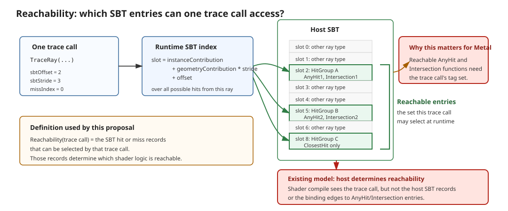
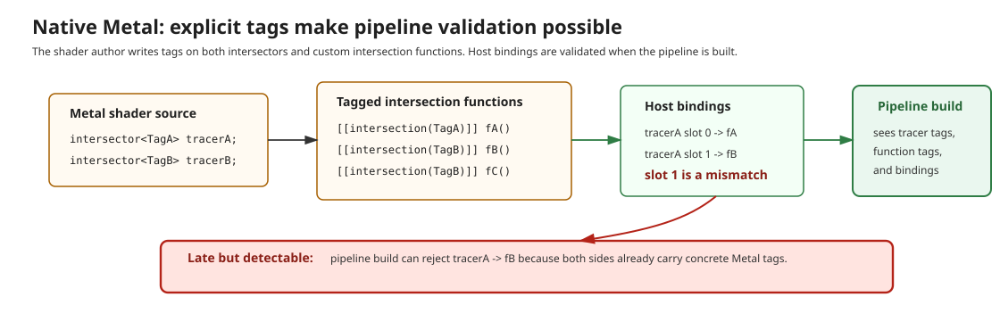
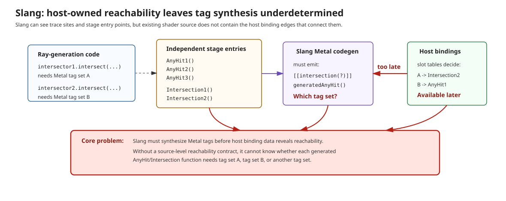
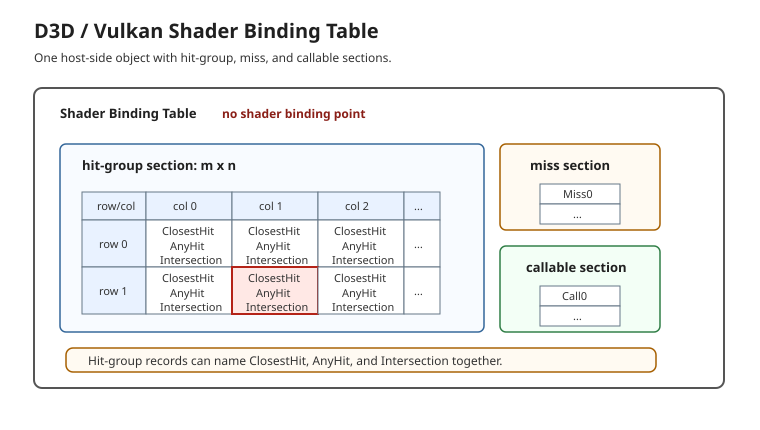
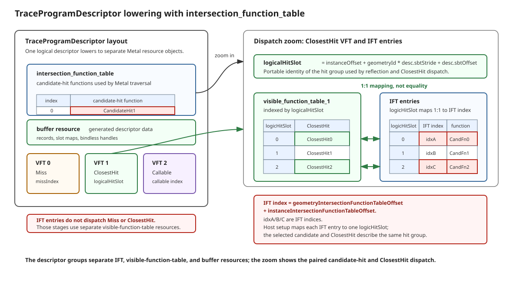
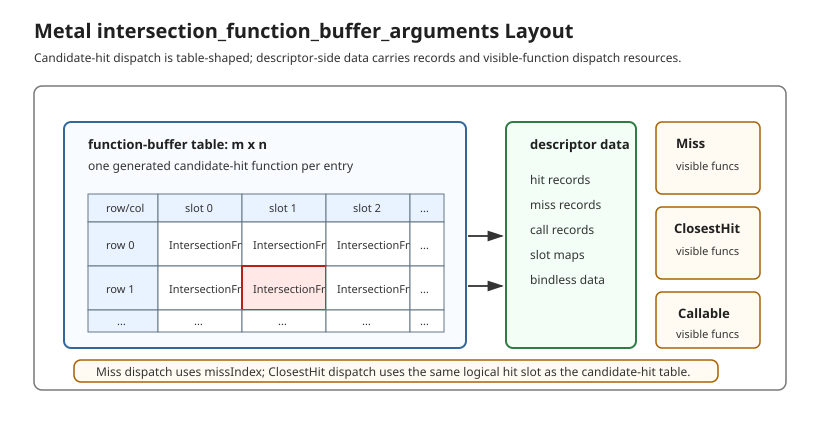
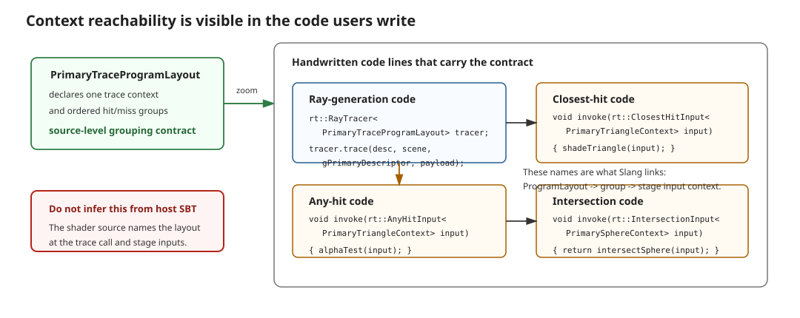

# Slang Pipeline Ray Tracing API Proposal: Structural Dispatch

Status: draft proposal

Scope: pipeline ray tracing only. Inline ray tracing and ray queries are intentionally out of
scope for this first design.

This proposal sketches a new Slang ray tracing API that treats Metal as a first-class target
while preserving the D3D and Vulkan pipeline model. The central idea is to make the shader source
declare a conceptual shader binding table, or SBT, as structured Slang types. D3D and Vulkan can
continue to use the native host-created SBT. Metal can use the same structure to synthesize the
post-trace *ClosestHit* and *Miss* dispatch logic that Metal programmers normally write by hand.

Catalog
-------

- [1. Challenges Extending Current Slang Ray Tracing To Metal](#1-challenges-extending-current-slang-ray-tracing-to-metal)
  - [1.1 Dispatch Model Gap](#11-dispatch-model-gap)
  - [1.2 Metal Function Table And Function Buffer Resource Mismatch](#12-metal-function-table-and-function-buffer-resource-mismatch)
  - [1.3 Metal Tag List And Reachability](#13-metal-tag-list-and-reachability)
  - [1.4 Reserved Challenges](#14-reserved-challenges)
- [2. Proposed API Sketch](#2-proposed-api-sketch)
  - [2.1 Overview](#21-overview)
  - [2.2 Detailed Component Descriptions](#22-detailed-component-descriptions)
    - [2.2.1 Resolving The Dispatch Model Gap With A Conceptual SBT](#221-resolving-the-dispatch-model-gap-with-a-conceptual-sbt)
    - [2.2.2 Resolving The Metal Function Table And Function Buffer Resource Mismatch With TraceProgramDescriptor](#222-resolving-the-metal-function-table-and-function-buffer-resource-mismatch-with-traceprogramdescriptor)
      - [2.2.2.1 Lowering `TraceProgramDescriptor` With `intersection_function_table`](#2221-lowering-traceprogramdescriptor-with-intersection_function_table)
      - [2.2.2.2 Future Lowering To `intersection_function_buffer_arguments`](#2222-future-lowering-to-intersection_function_buffer_arguments)
    - [2.2.3 Resolving The Metal Tag-List Issue With Inferred Stage Requirements](#223-resolving-the-metal-tag-list-issue-with-inferred-stage-requirements)
  - [2.3 Writing Stages As Interface-Conforming Types](#23-writing-stages-as-interface-conforming-types)
    - [2.3.1 Hit-Group Composition And Target Mapping](#231-hit-group-composition-and-target-mapping)
  - [2.4 Acceleration-Structure Topology And Portability](#24-acceleration-structure-topology-and-portability)
  - [2.5 Inferring The Metal Tag List](#25-inferring-the-metal-tag-list)
    - [2.5.1 Type-Directed Inference](#251-type-directed-inference)
    - [2.5.2 Reachability-Directed Inference](#252-reachability-directed-inference)
    - [2.5.3 Capability-Directed Inference](#253-capability-directed-inference)
    - [2.5.4 Lowering-Directed Inference](#254-lowering-directed-inference)
    - [2.5.5 Complete Tag Coverage And Conflict Validation](#255-complete-tag-coverage-and-conflict-validation)
- [3. Migration Examples](#3-migration-examples)
  - [3.1 Migrating Existing Metal Code To The New API](#31-migrating-existing-metal-code-to-the-new-api)
  - [3.2 Migrating Existing Slang D3D/Vulkan Ray Tracing Code](#32-migrating-existing-slang-d3dvulkan-ray-tracing-code)
  - [3.3 Host Reflection Patterns](#33-host-reflection-patterns)
- [4. Open Design Questions](#4-open-design-questions)

## 1. Challenges Extending Current Slang Ray Tracing To Metal

### 1.1 Dispatch Model Gap

D3D and Vulkan expose ray tracing as a pipeline-stage model. A trace call enters traversal, and
the driver or hardware uses host-created SBT records to select *Miss*, *AnyHit*, *Intersection*,
and *ClosestHit* shaders. The *ClosestHit* function is not directly called from ray-generation
source.

Metal exposes a different model. `intersector.intersect(...)` returns an `intersection_result`.
*AnyHit* and custom *Intersection* behavior can still be dispatched during traversal through Metal's
function table or function buffer, but *Miss* and *ClosestHit* are ordinary post-trace shader logic
written by the user.

Figure 1 shows the key mismatch: D3D/Vulkan assign stage dispatch to the host SBT and the
driver/hardware, while Metal assigns *Miss* and *ClosestHit* dispatch to shader code after
`intersect(...)` returns. A portable Slang API needs enough structure to synthesize that Metal
post-trace dispatch without changing the native D3D/Vulkan model.

<a id="fig-dispatch-model-gap"></a>


*Figure 1. Dispatch model gap: D3D and Vulkan select pipeline stages through host-created SBT records, while Metal requires user-written post-trace dispatch for Miss and ClosestHit.*

### 1.2 Metal Function Table And Function Buffer Resource Mismatch

Metal introduces `intersection_function_table` and `intersection_function_buffer_arguments`
resource objects that are visible to shader code and must be bound from host code when traversal
needs custom *Intersection* behavior. This is different from the D3D/Vulkan SBT model. The SBT is
built by host code, but it is not a shader-visible resource and shader code does not declare a
binding point for it.

This creates an asymmetric programming model. Metal shader code may need a parameter that
represents a function table or function buffer. D3D/Vulkan shader code has no corresponding
parameter, even though host code still needs to build SBT records. A portable Slang API therefore
needs a way to describe this logical binding without forcing D3D/Vulkan targets to expose a fake
shader resource.

### 1.3 Metal Tag List And Reachability

This proposal uses the term **reachability** to describe the shader binding table entries that a
single trace call can access. The trace call supplies dispatch parameters, traversal contributes
geometry and instance information, and the ray-tracing implementation combines those inputs to
select one of the SBT records. Those selectable records are the entries reachable from that trace
call.

In existing D3D/Vulkan-style ray tracing models, this reachability is determined by host-created
binding data. The shader source contains the trace call, but the SBT records and the binding edges
from those records to *AnyHit*, *Intersection*, *ClosestHit*, and *Miss* shaders are provided by
host code.
Therefore, as shown in Figure 2, the complete reachability set is not known from shader source at
ordinary compile time.

<a id="fig-reachability-definition"></a>


*Figure 2. Reachability definition: the reachable entries are the SBT records one trace call can select at runtime, but in the existing model that set is determined by host-created binding data.*

Metal adds a second constraint: each custom *Intersection* function reachable from an intersector
must have a compatible `[[intersection(...)]]` tag list. Native Metal can validate a mismatch at
pipeline build time because the user writes both the intersector tags and the function tags in
source. Figure 3 shows why this works: pipeline build sees the intersector tags, function tags,
and host bindings together.

<a id="fig-native-metal-tag-validation"></a>


*Figure 3. Native Metal tag validation: the user-authored tag lists give pipeline build enough information to reject incompatible host bindings.*

Slang does not currently expose that Metal tag system. When lowering *AnyHit* or *Intersection*
entry points to Metal, Slang must synthesize `[[intersection(...)]]` tags for the generated Metal
functions. The compiler can see trace sites and stage entry points, but in the existing model it
cannot see the host binding edges that determine which stage entries are reachable from each trace
site.

Figure 4 shows the information-flow problem. If two trace sites lower to different Metal tag
sets, and several *AnyHit* or *Intersection* entries may be bound by the host, the compiler cannot
know whether a generated function needs tag set A, tag set B, or another tag set. Emitting no tag,
or emitting a tag inferred from the wrong trace site, can make the generated Metal pipeline fail
to build.

<a id="fig-slang-tag-synthesis-gap"></a>


*Figure 4. Slang tag synthesis gap: Slang must emit Metal `[[intersection(...)]]` tags before host binding data reveals which AnyHit or Intersection entries are reachable from each trace site.*

### 1.4 Reserved Challenges

Other details remain important, but they are not the main shape of this proposal:

- Metal has multiple `intersect(...)` overload families, including no-dispatch, function-table,
  and function-buffer forms.
- Device user data should be modeled in a way that maps to non-pointer targets.

Those issues can be handled after the dispatch and tag-reachability model is settled.

## 2. Proposed API Sketch

### 2.1 Overview

The primary capability introduced by this proposal is the ability to declare a logical SBT object
and explicitly describe its layout in shader source. This declaration becomes a target-independent
source of truth that is visible to both the compiler and host reflection.

The design builds that capability in the following order:

1. Express ray tracing stage shaders as types. Hit, *Miss*, and *Callable* shader logic is written
   as structs that implement Slang interfaces instead of only as free-standing shader entry points.
   Representing a stage as a type allows an SBT group declaration to refer to it directly.
2. Declare the SBT layout. `ITraceProgramLayout` maps hit, *Miss*, and *Callable* shader groups to
   logical SBT slots. `RayTracer<ProgramLayout>`, where
   `ProgramLayout : ITraceProgramLayout`, names this layout at a trace site, enabling Slang to
   synthesize Metal post-trace dispatch.
3. Connect the layout through context types. The trace context carries the shared payload and
   traversal shape, while each hit context identifies its primitive. Reachable uses of
   primitive-specific stage properties let Slang infer the Metal data tags.
4. Declare the logical SBT object.
   `TraceProgramDescriptor<ProgramLayout>`, where `ProgramLayout : ITraceProgramLayout`, represents
   the value-level object described by the layout and is supplied to the trace operation.

Host code can reflect `ITraceProgramLayout` to build D3D/Vulkan SBT records or Metal function
tables/function buffers from the same grouping contract, so the layout logic does not need to be
duplicated outside shader source. Figure 5 gives a high-level view of this API shape.

<a id="fig-api-overview"></a>


*Figure 5. Proposed API overview: shader source combines interface-conforming stage types, trace contexts, and group metadata into an `ITraceProgramLayout`; host code reflects that same layout to build D3D/Vulkan SBT records and Metal function tables/function buffers.*

### 2.2 Detailed Component Descriptions

#### 2.2.1 Resolving The Dispatch Model Gap With A Conceptual SBT

The proposal resolves the dispatch-model gap by giving Slang a small set of compiler-recognized
layout intrinsics. These intrinsics let shader source describe the logical structure of an SBT:
which stage functions form a group, which groups belong to each SBT section, and the slots those
groups occupy in their sections.

These types describe layout only. They do not perform ray traversal, contain shader-record data,
or expose a native SBT as a shader-visible resource.

Simplified layout-intrinsic shape:

```slang
namespace rt
{
    public interface IShaderGroupSlot
    {
        static const int index;
    }

    public interface IHitGroup
    {
        associatedtype Slot : IShaderGroupSlot;
        associatedtype Context : IHitContext;

        associatedtype ClosestHit : IClosestHitShader<Context>;
        associatedtype AnyHit : IAnyHitShader<Context>;
        associatedtype Intersection : IIntersectionStage<Context>;
    }

    public interface IMissGroup
    {
        associatedtype Slot : IShaderGroupSlot;
        associatedtype Context : IMissGroupContext;
        associatedtype Miss : IMissShader<Context>;
    }

    public interface ICallableGroup
    {
        associatedtype Slot : IShaderGroupSlot;
        ...
    }

    public interface IHitGroupList<TraceContext>
        where TraceContext : ITraceContext
    { ... }

    public interface IMissGroupList<TraceContext>
        where TraceContext : ITraceContext
    { ... }

    public interface ICallableGroupList<TraceContext>
        where TraceContext : ITraceContext
    { ... }

    public struct HitGroupList<TraceContext, each TGroup> : IHitGroupList<TraceContext>
        where TraceContext : ITraceContext
        where TGroup : IHitGroup
        where expand each TGroup.Context.TraceContext == TraceContext
    { ... }

    public struct MissGroupList<TraceContext, each TGroup> : IMissGroupList<TraceContext>
        where TraceContext : ITraceContext
        where TGroup : IMissGroup
    { ... }

    public struct CallableGroupList<TraceContext, each TGroup> : ICallableGroupList<TraceContext>
        where TraceContext : ITraceContext
        where TGroup : ICallableGroup
    { ... }

    public interface ITraceProgramLayout
    {
        associatedtype TraceContext : ITraceContext;
        associatedtype MissGroups : IMissGroupList<TraceContext>;
        associatedtype HitGroups : IHitGroupList<TraceContext>;
        associatedtype CallableGroups : ICallableGroupList<TraceContext>;
    }
}
```

Each group interface describes one logical SBT record and names its slot in the corresponding SBT
section. A hit group names its *ClosestHit* stage and the types representing its optional *AnyHit*
and *Intersection* behavior. *Miss* and *Callable* groups name the corresponding single-stage
records. The group-list types declare which records belong to the three SBT sections, and
`ITraceProgramLayout` combines those sections into one source-level schema.

| Layout intrinsic | Describes |
| --- | --- |
| `IShaderGroupSlot` | A record index within the corresponding SBT section |
| `IHitGroup` | One hit-group slot with *ClosestHit* and optional *AnyHit*/*Intersection* behavior |
| `IMissGroup` | One *Miss* slot and its *Miss* stage |
| `ICallableGroup` | One *Callable* slot and its *Callable* stage |
| `HitGroupList`, `MissGroupList`, `CallableGroupList` | The records present in each SBT section |
| `ITraceProgramLayout` | The complete logical SBT layout for one trace context |

The *AnyHit* and *Intersection* associated types do not require executable stages. Built-in
placeholder types such as `NoAnyHit` and `NoIntersection` satisfy the group contract while
representing their absence. Slang recognizes these placeholders and omits the corresponding native
shader or function entries during lowering.

The group list and the group slot have complementary roles: the list declares that a group belongs
to the layout, while the group's `IShaderGroupSlot` type declares where its record resides. Together
they give the compiler and host reflection a finite mapping from SBT record indices to shader
groups without requiring either side to recover that mapping from arbitrary control flow. Slots
are zero-based and must be unique within their SBT section. The explicit slot, rather than list
position, is authoritative, so reordering declarations does not renumber SBT records.

For D3D and Vulkan, host code reflects the declared groups and constructs each native hit, *Miss*,
and *Callable* record at its declared slot. Native ray tracing continues to perform stage
selection through the host-created SBT.

For Metal, Slang uses the same declared group membership and slots to synthesize the *Miss* and
*ClosestHit* dispatch that Metal does not provide natively. Actual *AnyHit* and *Intersection*
shader types identify the traversal-time functions represented in the target-specific resources
described in the next subsection.

An alternative would be to infer the SBT layout by analyzing user-written Metal-style dispatch
code. That would make reflection depend on control-flow analysis and would make small shader-code
changes capable of changing the inferred host contract. Explicit layout intrinsics keep the SBT
schema finite, reviewable, and directly reflectable.

#### 2.2.2 Resolving The Metal Function Table And Function Buffer Resource Mismatch With TraceProgramDescriptor

Metal introduces `intersection_function_table` and `intersection_function_buffer_arguments`
resource objects that can be visible to shader code and bound from host code. D3D and Vulkan
instead use an SBT. The SBT is also built by host code, but it is not a shader-visible resource, so
shader code does not declare an SBT binding point.

D3D and Vulkan do not expose an equivalent shader-visible function table or function buffer.
Their comparable structure is the host-created SBT. It is useful to view the SBT as one
host-side database with separate hit-group, *Miss*, and *Callable* sections. A hit-group record can
name *ClosestHit*, *AnyHit*, and *Intersection* shaders together, while the *Miss* and *Callable*
sections are one-dimensional lists.

Figure 6 shows the SBT baseline that the portable layout is trying to preserve. The native
D3D/Vulkan SBT is one host-side object with hit-group, *Miss*, and *Callable* sections.

<a id="fig-d3d-vulkan-sbt-layout"></a>


*Figure 6. D3D/Vulkan SBT layout: one host-side object contains hit-group, miss, and callable sections, and shader code has no SBT binding point.*

The previous subsection already makes the two sides share the same conceptual layout through
`ITraceProgramLayout`. Host code can reflect the layout to build the target-side records. The
remaining mismatch is purely about binding. Metal needs a shader-visible resource for the
function table or function buffer path, while D3D/Vulkan need no corresponding shader parameter.

The proposed answer is to introduce an opaque descriptor type:

```slang
struct TraceProgramDescriptor<ProgramLayout>
    where ProgramLayout : ITraceProgramLayout
{
}
```

`TraceProgramDescriptor<ProgramLayout>` is best understood as a `ParameterBlock`-like abstraction
whose contents are synthesized by the compiler. It represents one value-level handle to a group of
parameters and resources, rather than one particular native resource. Its empty body is
intentional: the concrete contents are not fixed at the point where this generic type is declared.

When the final program is specialized with a concrete `ProgramLayout`, the compiler can determine
the reachable shader groups, the data needed by their records, and the resources required by the
selected target lowering. It then synthesizes the concrete parameter layout represented by
`TraceProgramDescriptor<ProgramLayout>`. Different program-layout specializations may therefore
produce different descriptor contents and reflection layouts while using the same source-level
abstraction. `ProgramLayout` provides the trace context through its associated types; the descriptor
does not declare a second trace context of its own.

On D3D and Vulkan, specialization does not need to materialize
`TraceProgramDescriptor<ProgramLayout>` as a shader-visible resource. The native SBT remains a
host-side object, as shown in Figure 6.
Host code still uses the same `ProgramLayout` reflection to build hit-group, *Miss*, and *Callable*
SBT records, but shader code does not receive a Metal-style function-table or function-buffer
object.

On Metal, specialization materializes `TraceProgramDescriptor<ProgramLayout>` as the physical
resources needed by the Metal traversal path. The first version lowers the opaque descriptor with
an ordinary `intersection_function_table`. A possible future
`intersection_function_buffer_arguments` lowering has the same source-level contract but a
different target-side binding structure.

##### 2.2.2.1 Lowering `TraceProgramDescriptor` With `intersection_function_table`

For the ordinary Metal function-table path, `TraceProgramDescriptor<ProgramLayout>` lowers to a
group of shader-visible Metal resource objects. It does not lower to, and is not equivalent to, an
`intersection_function_table` alone. The complete lowering contains an
`intersection_function_table`, generated visible-function tables, and a generated data buffer.

**Native Layout**

The lowered descriptor has the following conceptual layout:

```text
TraceProgramDescriptor<ProgramLayout>
    intersection_function_table<generatedTags>
        populated entry metalIFTIndex -> generated candidate-hit function
                               // AnyHit / custom Intersection behavior only
                               // mapped 1:1 to a logicalHitSlot

    visible_function_table<generated Miss functions>
        entry missIndex -> generated Miss function

    visible_function_table<generated ClosestHit functions>
        entry logicalHitSlot -> generated ClosestHit function

    visible_function_table<generated Callable functions>
        entry callableIndex -> generated Callable function

    buffer<generated descriptor data>
        records, slot maps, and bindless resource handles
```

There are at most three generated visible-function-table resource objects in the descriptor:
`visible_function_table_0` is the *Miss* table, `visible_function_table_1` is the *ClosestHit*
table, and `visible_function_table_2` is the *Callable* table. They and the generated data buffer
are separate components of the `TraceProgramDescriptor` lowering, not entries in the native IFT.

Figure 7 supplements this layout with the dispatch relationship between the *ClosestHit* table and
the IFT entries.

<a id="fig-intersection-function-table-layout"></a>


*Figure 7. Ordinary intersection function table lowering: the left side shows the complete TraceProgramDescriptor layout, consisting of an IFT, three visible-function tables, and a generated data buffer. The right side zooms into the paired dispatch between the ClosestHit visible-function table and IFT entries. A 1:1 mapping connects native IFT entries to logical hit slots. Miss and Callable visible-function tables use independent indices.*

**Lowering Strategy**

The compiler expands the opaque source-level descriptor into those Metal resource objects and uses
each object for its distinct role. The IFT is passed to Metal traversal for candidate-hit dispatch.
The generated visible-function tables perform *Miss*, *ClosestHit*, and *Callable* dispatch, while
the generated data buffer carries record data shared by those functions. The generated Metal-side
use can be thought of as:

```slang
// Internal Metal-shaped pseudocode.
let table = descriptor.__intersectionFunctionTable;
let descriptorData = descriptor.__descriptorDataBuffer;
let missFns = descriptor.__missFunctionTable;
let closestHitFns = descriptor.__closestHitFunctionTable;

let result = metalIntersector.intersect(desc.ray, scene, table, payload);

if (result.isNone)
{
    missFns[desc.missIndex](payload, descriptorData, desc.missIndex);
}
else
{
    uint logicalHitSlot =
        instanceOffset + geometryId * desc.sbtStride + desc.sbtOffset;

    closestHitFns[logicalHitSlot](payload, descriptorData, logicalHitSlot, result);
}
```

**Gaps, Fixes, And Constraints**

- **Gap 1: Native function-table entries do not dispatch every ray-tracing stage.** A populated
  entry selects candidate-hit behavior generated from *AnyHit* filtering or custom *Intersection*
  logic. A triangle or curve group without *AnyHit* has no populated IFT entry. IFT entries do not
  dispatch *Miss* or *ClosestHit*. Slang fixes this by lowering *Miss* and *ClosestHit* to separate
  generated visible-function-table resource objects carried by the descriptor lowering.

  **Constraint:** the host or Slang runtime must populate those generated visible-function tables
  as part of the `TraceProgramDescriptor` lowering. The *Miss*, *ClosestHit*, and *Callable*
  entries can be queried from the `ProgramLayout` reflection data described in the previous
  section. *Miss* uses `desc.missIndex`, *ClosestHit* uses `logicalHitSlot`, and *Callable* uses its
  own index.

- **Gap 2: Native function-table indexing is not the portable hit-slot formula.** Ordinary
  `intersection_function_table` traversal does not use `RayTraversalDesc.sbtOffset` or
  `RayTraversalDesc.sbtStride` when selecting candidate-hit functions. Metal selects an IFT entry
  from acceleration-structure offsets:

  ```text
  metalIFTIndex =
      geometryIntersectionFunctionTableOffset +
      instanceIntersectionFunctionTableOffset
  ```

  Slang treats `logicalHitSlot` as the portable identity of the hit group:

  ```text
  logicalHitSlot = instanceOffset + geometryId * desc.sbtStride + desc.sbtOffset
  ```

  **Constraint:** the host must construct acceleration-structure function-table offsets and function
  table contents so every `metalIFTIndex` selected by traversal maps to exactly one
  `logicalHitSlot`. The numbers do not need to be equal. What matters is that the selected
  candidate-hit function and the generated *ClosestHit* visible function represent the same logical
  hit group:

  ```text
  intersection_function_table[metalIFTIndex]
      -> generated AnyHit / custom Intersection candidate function
      -> maps to logicalHitSlot

  visible_function_table_1[logicalHitSlot]
      -> generated ClosestHit function
  ```

  Separate `TraceProgramDescriptor` values per ray type are also a natural way to keep this
  mapping simple.

**Concrete Example**

Suppose one trace call uses `desc.sbtStride = 2`, `desc.sbtOffset = 1`, and logical
`instanceOffset = 0`. The portable logical slots are:

```text
logicalHitSlot(geometry 0) = 0 + geometryId 0 * 2 + 1 = 1
logicalHitSlot(geometry 1) = 0 + geometryId 1 * 2 + 1 = 3
```

The Metal IFT indices do not need to be `1` and `3`. They only need a 1:1 mapping back to logical
slots `1` and `3`:

```text
instance:
    instanceIntersectionFunctionTableOffset = 8

geometry 0:
    geometryIntersectionFunctionTableOffset = 0
    metalIFTIndex = 0 + 8 = 8
    maps to logicalHitSlot 1

geometry 1:
    geometryIntersectionFunctionTableOffset = 4
    metalIFTIndex = 4 + 8 = 12
    maps to logicalHitSlot 3

intersection_function_table[8]  -> candidate function for logicalHitSlot 1
intersection_function_table[12] -> candidate function for logicalHitSlot 3

visible_function_table_1[1] -> ClosestHit for logicalHitSlot 1
visible_function_table_1[3] -> ClosestHit for logicalHitSlot 3
```

##### 2.2.2.2 Future Lowering To `intersection_function_buffer_arguments`

This lowering is reserved for a future API version and is not part of the first implementation.

The Metal 4 function-buffer path represents candidate-hit dispatch with an
`intersection_function_buffer_arguments` resource object rather than an ordinary
`intersection_function_table` resource object. Figure 8 shows both the function-buffer layout and
the descriptor-side data needed for generated *Miss*, *ClosestHit*, and *Callable* dispatch.

<a id="fig-intersection-function-buffer-layout"></a>


*Figure 8. Metal function-buffer lowering: `intersection_function_buffer_arguments` carries the candidate-hit table, while descriptor-side data carries records and visible-function dispatch resources for Miss, ClosestHit, and Callable dispatch.*

**Native Layout**

The native function-buffer argument describes the traversal-time candidate-hit table:

```text
intersection_function_buffer_arguments:
    intersection_function_buffer      -> raw table of generated candidate-hit functions
    intersection_function_buffer_size -> byte size of that table
    intersection_function_stride      -> byte stride between table entries
```

The function-buffer table still only contains candidate-hit behavior: *AnyHit* filtering and custom
*Intersection* logic. Descriptor-side data carries the rest of the portable trace program state:
records, slot maps, bindless resources, and generated visible-function tables for *Miss*,
*ClosestHit*, and *Callable* dispatch.

**Lowering Strategy**

When the compiler lowers `TraceProgramDescriptor<ProgramLayout>` to this function-buffer path, it
can be thought of as:

```text
TraceProgramDescriptor<ProgramLayout>
    intersection_function_buffer_arguments:
        intersection_function_buffer      -> table of generated candidate-hit functions
        intersection_function_buffer_size -> byte size of the table
        intersection_function_stride      -> byte stride between entries

    generated descriptor-side data:
        records
        slot maps
        bindless resource handles
        visible-function table for Miss
        visible-function table for ClosestHit
        visible-function table for Callable
```

The generated Metal-side use can be thought of as:

```slang
// Internal Metal-shaped pseudocode.
let ifbArgs = descriptor.__intersectionFunctionBufferArguments;
let descriptorData = descriptor.__generatedDescriptorData;
let missFns = descriptorData.missVisibleFunctions;
let closestHitFns = descriptorData.closestHitVisibleFunctions;

metalIntersector.set_base_id(desc.sbtOffset);
metalIntersector.set_geometry_multiplier(desc.sbtStride);

let result = metalIntersector.intersect(desc.ray, scene, ifbArgs, descriptorData, payload);

if (result.isNone)
{
    missFns[desc.missIndex](payload, descriptorData, desc.missIndex);
}
else
{
    uint logicalHitSlot =
        instanceOffset + geometryId * desc.sbtStride + desc.sbtOffset;

    closestHitFns[logicalHitSlot](payload, descriptorData, logicalHitSlot, result);
}
```

**Gaps, Fixes, And Constraints**

- **Gap 1: The function buffer still does not dispatch every ray-tracing stage.** Like ordinary
  `intersection_function_table`, the function-buffer table dispatches candidate-hit behavior, not
  *Miss* or *ClosestHit*. Slang fixes this by keeping candidate-hit functions in the function buffer
  and lowering *Miss*, *ClosestHit*, and *Callable* to generated visible-function tables in
  descriptor-side data.

  **Constraint:** the host or Slang runtime must populate the generated visible-function tables
  from the `ProgramLayout` reflection data described in the previous section. *Miss* uses
  `desc.missIndex`, *ClosestHit* uses `logicalHitSlot`, and *Callable* uses its own index.

- **Gap 2: The host must still build a target-side candidate-hit table.** The function-buffer form
  is closer to the D3D/Vulkan SBT model than ordinary `intersection_function_table`, because the
  table representation includes an explicit stride. Conceptually, this lets the backend model the
  portable hit slot directly:

  ```text
  logicalHitSlot = instanceOffset + geometryId * desc.sbtStride + desc.sbtOffset
  ```

  **Constraint:** the host or Slang runtime must populate the function buffer consistently with the
  reflected `ProgramLayout` hit groups and with the exact Metal IFB indexing rules. The same
  logical slot should select both the candidate-hit function and the generated *ClosestHit* visible
  function:

  ```text
  functionBuffer[logicalHitSlot]
      -> generated AnyHit / custom Intersection candidate function

  visible_function_table_1[logicalHitSlot]
      -> generated ClosestHit function
  ```

**Concrete Example**

Suppose one trace call uses `desc.sbtStride = 2`, `desc.sbtOffset = 1`, and logical
`instanceOffset = 0`. The portable logical slots are the same as in the ordinary function-table
example:

```text
logicalHitSlot(geometry 0) = 0 + geometryId 0 * 2 + 1 = 1
logicalHitSlot(geometry 1) = 0 + geometryId 1 * 2 + 1 = 3
```

For the function-buffer lowering, the host or Slang runtime can lay out the candidate-hit table by
logical hit slot:

```text
functionBuffer[0] -> unused or default candidate function
functionBuffer[1] -> candidate function for logicalHitSlot 1
functionBuffer[2] -> unused or default candidate function
functionBuffer[3] -> candidate function for logicalHitSlot 3

visible_function_table_1[1] -> ClosestHit for logicalHitSlot 1
visible_function_table_1[3] -> ClosestHit for logicalHitSlot 3
```

The physical byte address of each function-buffer entry is derived from
`intersection_function_buffer` plus `logicalHitSlot * intersection_function_stride`, subject to the
exact Metal IFB traversal rules. The useful difference from ordinary function-table lowering is
that the function-buffer table can be organized directly around the portable slot calculation,
instead of requiring a separate `metalIFTIndex` to `logicalHitSlot` mapping.

#### 2.2.3 Resolving The Metal Tag-List Issue With Inferred Stage Requirements

With the descriptor abstraction separated, the tag-list issue still needs a way to answer: "which
trace object and reachable stages contribute requirements to one shared Metal signature?" A trace
context defines the trace-wide properties of a trace family:

```slang
interface ITraceContext
{
    associatedtype Payload;
    associatedtype AccelerationStructure : IAccelerationStructure;
    associatedtype Motion;
}
```

A hit group context specializes the trace context with a primitive kind and a record type:

```slang
interface IHitContext
{
    associatedtype TraceContext : ITraceContext;
    associatedtype Primitive : IIntersectionPrimitive;
    associatedtype Record;
}
```

The primitive kind determines which primitive-specific stage properties are legal. For example,
the built-in `triangle` property is only present on a triangle input:

```slang
public extension<Context> AnyHitInput<Context>
    where Context : IHitContext
    where Context.Primitive == TrianglePrimitive
{
    public property TriangleHitAttributes triangle
    {
        get { return __rtAnyHitTriangle<Context>(); }
    }
}
```

Using this compiler-known property contributes `triangle_data` to the Metal requirements. The
corresponding `curve` property is constrained to `CurvePrimitive` and contributes `curve_data`.
Merely declaring a triangle or curve hit group does not add either tag.

A trace program layout connects the ray tracer and every grouped shader through the same trace
context:

```slang
struct PrimaryTraceContext : rt::ITraceContext
{
    typealias Payload = RadiancePayload;
    typealias AccelerationStructure = rt::AccelerationStructure;
    typealias Motion = rt::NoMotion;
}

struct PrimaryTriangleContext : rt::IHitContext
{
    typealias TraceContext = PrimaryTraceContext;
    typealias Primitive = rt::TrianglePrimitive;
    typealias Record = PrimaryHitRecord;
}

struct PrimaryMissContext : rt::IMissGroupContext
{
    typealias TraceContext = PrimaryTraceContext;
    typealias Record = PrimaryMissRecord;
}

struct PrimaryMissGroup : rt::IMissGroup
{
    typealias Slot = rt::MissSlot<0>;
    typealias Context = PrimaryMissContext;
    typealias Miss = PrimaryMiss;
}

struct PrimaryTriangleGroup : rt::IHitGroup
{
    typealias Slot = rt::HitGroupSlot<0>;
    typealias Context = PrimaryTriangleContext;
    typealias ClosestHit = PrimaryTriangleClosestHit;
    typealias AnyHit = PrimaryTriangleAnyHit;
    typealias Intersection = rt::NoIntersection<PrimaryTriangleContext>;
}

struct PrimaryTraceProgramLayout : rt::ITraceProgramLayout
{
    typealias TraceContext = PrimaryTraceContext;

    typealias MissGroups = rt::MissGroupList<
        TraceContext,
        PrimaryMissGroup>;

    typealias HitGroups = rt::HitGroupList<
        TraceContext,
        PrimaryTriangleGroup>;

    typealias CallableGroups = rt::NoCallableGroups<TraceContext>;
}

rt::TraceProgramDescriptor<PrimaryTraceProgramLayout> gPrimaryDescriptor;

[shader("raygeneration")]
void rayGen()
{
    RadiancePayload payload;
    rt::RayTracer<PrimaryTraceProgramLayout> tracer;
    tracer.trace(desc, scene, gPrimaryDescriptor, payload);
}
```

This gives the compiler a source-level relationship:

- `RayTracer<PrimaryTraceProgramLayout>` identifies one `ITraceProgramLayout`.
- `PrimaryTraceProgramLayout.TraceContext` defines the trace-wide traversal requirements.
- Every group in `PrimaryTraceProgramLayout.HitGroups` is constrained to that trace context.
- Each hit context fixes the primitive kind for its reachable stage structs.
- Reachable uses of compiler-known stage properties contribute Metal data requirements.

Slang unions those data requirements, combines them with the trace-wide traversal requirements and
the selected compilation capabilities, and emits one normalized tag signature. The same ordered
signature is used for the intersector, result type, function table, and every generated
intersection function.

Figure 9 zooms into the handwritten code lines that carry the contract: the trace call names the
program layout, and each stage `invoke(...)` method names the input context it accepts.

<a id="fig-context-reachability"></a>


*Figure 9. Context reachability contract: the user-written trace call and stage `invoke(...)` signatures give the compiler a source-visible relationship between `RayTracer<ProgramLayout>`, the trace-wide context, hit groups, and stage input types.*

This does not prove that arbitrary host data is correct. If the host builds an SBT or Metal
function table that violates the reflected program layout, the program can still be wrong. The
goal is to make the shader-side contract explicit enough that:

- Slang can infer Metal data tags from reachable stage operations.
- Slang can reject shader declarations that are inconsistent inside the program layout.
- Reflection can expose the expected table to host code.
- Validation layers or Slang runtime helpers can compare host records against the reflected
  contract.

### 2.3 Writing Stages As Interface-Conforming Types

In the new model, *Miss*, *ClosestHit*, *AnyHit*, and *Intersection* logic are not written as
independent entry points. They are written as ordinary structs that conform to built-in stage
interfaces.

Example:

```slang
struct PrimaryTriangleClosestHit
    : rt::IClosestHitShader<PrimaryTriangleContext>
{
    void invoke(rt::ClosestHitInput<PrimaryTriangleContext> input)
    {
        input.payload.color = float4(input.distance, 0.0, 0.0, 1.0);
    }
}

struct PrimaryTriangleAnyHit
    : rt::IAnyHitShader<PrimaryTriangleContext>
{
    void invoke(rt::AnyHitInput<PrimaryTriangleContext> input)
    {
        if (isTransparent(input.triangle))
            input.ignoreHit();
    }
}

struct PrimarySphereIntersection
    : rt::IIntersectionShader<PrimarySphereContext>
{
    void invoke(rt::IntersectionInput<PrimarySphereContext> input)
    {
        SphereHitAttributes attr;
        float t = intersectSphere(input, attr);
        input.reportHit(t, attr);
    }
}
```

The compiler is responsible for lowering these structs to the target form:

- D3D and Vulkan: generated native entry points and hit groups, connected to SBT records.
- Metal: generated intersection functions for *AnyHit* and custom *Intersection* behavior, plus
  generated post-trace *Miss* and *ClosestHit* visible-function dispatch.

The user writes one source-level model. The target backend chooses the appropriate pipeline shape.

#### 2.3.1 Hit-Group Composition And Target Mapping

The source model must distinguish a source stage from a function generated for a target. D3D and
Vulkan have native hit groups and native *AnyHit*, *ClosestHit*, and *Intersection* stages. Metal
has none of those stages as separate pipeline entry points: it has traversal-time
`[[intersection(...)]]` functions and a returned closest result. Slang therefore validates source
hit-group composition first, then maps that valid composition to each target.

The current primitive types allow these source stages:

| Primitive | Source *Intersection* | Source *AnyHit* | Source *ClosestHit* |
| --- | --- | --- | --- |
| `TrianglePrimitive` | Prohibited; intersection is fixed function | Optional | Optional |
| `[require(metal)] CurvePrimitive` | Prohibited; intersection is fixed function | Optional | Optional |
| `BoundingBoxPrimitive<Attributes>` | Required to define the procedural primitive | Optional | Optional |

In compact form, the valid combinations are exactly:

```text
TrianglePrimitive
    x { NoAnyHit, AnyHit }
    x { NoClosestHit, ClosestHit }

CurvePrimitive
    x { NoAnyHit, AnyHit }
    x { NoClosestHit, ClosestHit }

BoundingBoxPrimitive<Attributes> + Intersection
    x { NoAnyHit, AnyHit }
    x { NoClosestHit, ClosestHit }
```

All stages in one hit group use the same primitive context and hit-data type. For a bounding-box
group, the source *Intersection* produces the custom hit data subsequently read by its *AnyHit* and
*ClosestHit* stages. `NoAnyHit`, `NoClosestHit`, and `NoIntersection` are source placeholders only;
they do not consume native shader entries.

The following table is exhaustive for candidate-generation and filtering. Each row has two valid
variants: with or without *ClosestHit*. On D3D/Vulkan, a present *ClosestHit* becomes the native
hit-group stage. On Metal, it becomes post-trace visible-function dispatch; when it is absent,
Slang emits no such dispatch.

| Source primitive and candidate stages | D3D/Vulkan lowering | Metal lowering |
| --- | --- | --- |
| Triangle, no *AnyHit* | Native triangle hit group; fixed-function triangle test | Built-in triangle test; no IFT entry |
| Triangle + *AnyHit* | Native triangle hit group with native *AnyHit* | Lower the source *AnyHit* to a generated `[[intersection(triangle)]]` function and put that function in the IFT |
| Curve, no *AnyHit* | Reject by capability | Built-in curve test; no IFT entry |
| Curve + *AnyHit* | Reject by capability | Lower the source *AnyHit* to a generated `[[intersection(curve)]]` function and put that function in the IFT |
| Bounding box + *Intersection* | Native procedural hit group with native *Intersection* | Lower the source *Intersection* to a generated `[[intersection(bounding_box)]]` function and put that function in the IFT; lower its `reportHit` operations as described below |
| Bounding box + *Intersection* + *AnyHit* | Native procedural hit group; `ReportHit`/`OpReportIntersectionKHR` invokes native *AnyHit* | Generate one `[[intersection(bounding_box)]]` function for the hit group; lower the source *Intersection* into it and route every `reportHit` through the source *AnyHit* |

The Metal binding unit is the **generated candidate function for the whole hit group**, not an
individual source *AnyHit* or *Intersection* stage. Each hit group therefore reflects at most one
Metal candidate function:

| Source hit-group stages | Reflected Metal candidate function |
| --- | --- |
| Triangle/curve without *AnyHit* | None |
| Triangle/curve with *AnyHit* | Generated function containing *AnyHit* |
| Bounding box with *Intersection* only | Generated function containing *Intersection* |
| Bounding box with *Intersection* and *AnyHit* | One generated function containing *Intersection*, with each reported candidate routed through *AnyHit* |

The host never decides whether to bind *AnyHit*, *Intersection*, or both, and it never combines
those stages itself. Slang performs that composition and reflection exposes only the resulting
Metal candidate function. If it is non-null, the host installs it as the hit group's IFT entry. In
parallel, reflection exposes the generated *ClosestHit* visible function, if present, for the
post-trace visible-function table.

The D3D/Vulkan column describes their portable core pipeline models. The composition rules follow
the [DXR hit-group contract](https://microsoft.github.io/DirectX-Specs/d3d/Raytracing.html#hit-groups)
and Vulkan's
[`VkRayTracingShaderGroupCreateInfoKHR`](https://docs.vulkan.org/refpages/latest/refpages/source/VkRayTracingShaderGroupCreateInfoKHR.html)
valid-usage rules. The Metal mappings follow its native triangle, bounding-box, and curve geometry
[model](https://developer.apple.com/videos/play/wwdc2023/10128/). The proposal deliberately
capability-gates `CurvePrimitive` to Metal; support for another target's optional curve-like
primitive extension would require a separate capability and lowering.

Neither shader source nor generated shader code directly calls a Metal `[[intersection(...)]]`
function. The host or Slang runtime installs it in the `intersection_function_table`, and Slang
passes that table to `intersector.intersect(...)`. During traversal, Metal calculates the IFT
index from the acceleration-structure offsets and invokes the selected entry. This is separate
from the visible-function tables that Slang uses for post-trace *Miss*, *ClosestHit*, and
*Callable* dispatch.

Despite its name, a generated Metal `[[intersection(triangle)]]` or
`[[intersection(curve)]]` function does not calculate the primitive intersection. Metal's built-in
test has already produced a candidate. The selected IFT entry reconstructs the source
`AnyHitInput`, runs *AnyHit*, and maps `ignoreHit()` to rejection and
`acceptHitAndEndSearch()` to acceptance with traversal termination. It therefore implements source
*AnyHit* filtering; it does not represent a source custom *Intersection* stage.

**Lowering `reportHit` on Metal**

A source bounding-box *Intersection* may call `reportHit(t, attributes)` zero, one, or multiple
times. An overload accepts the native hit-kind value. D3D lowers this operation to `ReportHit`,
and Vulkan lowers it to `OpReportIntersectionKHR`. Metal has no equivalent operation: one
`[[intersection(bounding_box)]]` invocation returns at most one candidate. Slang therefore lowers
the source operation into a local candidate accumulator inside the generated Metal function.

For each source `reportHit(t, attributes)`, the generated function:

1. Checks the candidate against the active ray interval. The local current-maximum distance starts
   at the `[[max_distance]]` input, is inclusive for bounding-box reports, and is updated after
   every accepted closer or equal-distance report. Later reads of the current ray bound observe
   the updated value.
2. Runs the source *AnyHit* when the hit group has one and the candidate is non-opaque.
3. Returns `false` to the source *Intersection* when *AnyHit* calls `ignoreHit()`; otherwise it
   records the candidate and returns `true`, unless traversal is terminated as described below.
4. Updates the local current-closest distance, hit kind, and attributes after an accepted
   candidate.
5. Stops the source *Intersection* and traversal when *AnyHit* calls
   `acceptHitAndEndSearch()`.

After the source *Intersection* finishes, the generated Metal function returns the closest
accepted candidate accumulated during that invocation. If no report was accepted, it returns
`accept_intersection = false`. Otherwise, it returns the candidate distance and the appropriate
`accept_intersection` and `continue_search` values. The generated ray-data state retains the
accepted candidate's attributes and hit kind so generated post-trace *ClosestHit* dispatch
observes the same values.

This transformation preserves the important `ReportHit` control-flow contract: *AnyHit* executes
once for every reported non-opaque candidate, and the Boolean result of `reportHit` is available to
the remainder of the source *Intersection*. It is not equivalent to running *Intersection* to
completion and then invoking *AnyHit* once.

Consequently, the public *Intersection* contract exposes `reportHit` instead of returning one
candidate value. A return-only contract could not represent zero or multiple reports or reproduce
the Boolean control-flow result of native `ReportHit`.

The generated candidate function is specialized per concrete hit group. If two groups reuse the
same source *Intersection* type with different *AnyHit* types, Slang generates two candidate
functions so each `reportHit` operation routes to the *AnyHit* selected by its group.

**Concrete Generated-Function Example**

Suppose a bounding-box hit group contains the following source stages:

```slang
struct SphereIntersection : rt::IIntersectionShader<SphereContext>
{
    void invoke(rt::IntersectionInput<SphereContext> input)
    {
        float tNear;
        float tFar;
        if (!intersectSphere(input.objectSpaceRay, tNear, tFar))
            return;

        SphereAttributes nearAttributes = makeAttributes(tNear);
        if (input.reportHit(tNear, 1, nearAttributes))
            return;

        // The near surface was outside the active interval or was rejected by
        // AnyHit. The far surface may still be a valid candidate.
        SphereAttributes farAttributes = makeAttributes(tFar);
        input.reportHit(tFar, 2, farAttributes);
    }
}

struct SphereAnyHit : rt::IAnyHitShader<SphereContext>
{
    void invoke(rt::AnyHitInput<SphereContext> input)
    {
        if (shouldDiscard(input.attributes))
            input.ignoreHit();
    }
}
```

For Metal, Slang generates one IFT entry for this whole hit group. The following is Metal-shaped
pseudocode; `runSphereAnyHit` and `generatedReportHit` illustrate compiler-expanded control flow,
not separately bound Metal functions:

```metal
AnyHitDecision runSphereAnyHit(
    float distance,
    uint hitKind,
    SphereAttributes attributes,
    ray_data GeneratedRayState& state)
{
    if (shouldDiscard(attributes))
        return AnyHitDecision::ignore;
    return AnyHitDecision::acceptAndContinue;
}

bool generatedReportHit(
    thread LocalCandidate& local,
    float distance,
    uint hitKind,
    SphereAttributes attributes,
    bool opaque,
    ray_data GeneratedRayState& state)
{
    if (distance < local.minDistance || distance > local.currentMaxDistance)
        return false;

    AnyHitDecision decision = opaque
        ? AnyHitDecision::acceptAndContinue
        : runSphereAnyHit(distance, hitKind, attributes, state);
    if (decision == AnyHitDecision::ignore)
        return false;

    local.hasCandidate = true;
    local.currentMaxDistance = distance;
    local.distance = distance;
    local.hitKind = hitKind;
    local.attributes = attributes;
    local.endSearch = decision == AnyHitDecision::acceptAndEndSearch;
    return true;
}

[[intersection(bounding_box)]]
MetalIntersectionResult generatedSphereHitGroupCandidate(
    float minDistance [[min_distance]],
    float maxDistance [[max_distance]],
    bool opaque [[opaque]],
    ray_data GeneratedRayState& generatedRayState [[payload]])
{
    LocalCandidate local = makeEmptyCandidate(minDistance, maxDistance);

    // Lowered body of SphereIntersection.invoke().
    float tNear;
    float tFar;
    if (intersectSphere(objectSpaceRay, tNear, tFar))
    {
        SphereAttributes nearAttributes = makeAttributes(tNear);
        bool nearAccepted = generatedReportHit(
            local, tNear, 1, nearAttributes, opaque, generatedRayState);

        if (!nearAccepted)
        {
            SphereAttributes farAttributes = makeAttributes(tFar);
            generatedReportHit(
                local, tFar, 2, farAttributes, opaque, generatedRayState);
        }
    }

    if (!local.hasCandidate)
        return rejectIntersection();

    generatedRayState.committedAttributes = local.attributes;
    generatedRayState.committedHitKind = local.hitKind;
    return acceptIntersection(
        local.distance,
        /* continueSearch = */ !local.endSearch);
}
```

This pattern is useful for a closed procedural surface such as a sphere. The near root is normally
the desired hit. If it is rejected by *AnyHit*, `reportHit` returns `false`, so the *Intersection*
can offer the far root instead. If the near root is accepted, `reportHit` returns `true` and the
source function returns without doing unnecessary work. An accept-and-end decision also exits the
remaining source *Intersection* logic and returns `continue_search = false`.

The host sees and binds only the generated result:

```text
IFT[metalIFTIndex]                = generatedSphereHitGroupCandidate
ClosestHitVFT[logicalHitSlot]     = generatedSphereClosestHit
```

There is no separately bound Metal *AnyHit* function. Changing the source contract from one return
value to `reportHit` fixes the composition because every candidate-reporting point is now explicit:
Slang can insert the paired *AnyHit* decision at that point, return its Boolean result to the
source *Intersection*, and still collapse all accepted local reports into the one candidate that a
Metal `[[intersection(bounding_box)]]` function can return.

Conversely, a bounding box without a source *Intersection* is invalid: neither D3D/Vulkan nor the
proposed Metal lowering has a primitive test that can turn the box into an actual hit.

The lowering must respect native opacity and ray flags: source *AnyHit* is not invoked when a
candidate is treated as opaque. A program that relies on *AnyHit* filtering must not configure the
corresponding geometry or trace as opaque.

### 2.4 Acceleration-Structure Topology And Portability

D3D and Vulkan trace a fixed TLAS-to-BLAS hierarchy. Metal additionally supports direct
primitive-AS traversal and nested instance acceleration structures. The source model makes this
portability boundary explicit:

```slang
struct AccelerationStructure : IAccelerationStructure { }

[require(metal)]
struct MultiLevelAccelerationStructure<let maxLevelCount : int> : IAccelerationStructure
{ }
```

`AccelerationStructure` is the portable two-level acceleration-structure type. The counted type is
Metal-only and requires `1 <= maxLevelCount <= 32`. At one level, lowering drops both `instancing`
and `max_levels` for direct primitive-AS traversal. At two or more levels, it emits `instancing` and
`max_levels<maxLevelCount>` (Metal 3.1+). The capability system rejects this type on D3D and
Vulkan.

### 2.5 Inferring The Metal Tag List

Shader authors do not write Metal tag lists. Slang derives them from the program layout, reachable
stage operations, selected compilation capabilities, and target lowering. These are separate
semantic axes. Topology and lowering select one trace-wide mode, the primitive selector is chosen
independently for each generated function, and optional data requirements are combined by set
union. Motion selects one valid trace-wide configuration, which may contain both motion tags.

#### 2.5.1 Type-Directed Inference

`TraceContext.AccelerationStructure` determines the traversal topology. `AccelerationStructure`
contributes `instancing`. `MultiLevelAccelerationStructure<1>` contributes no topology tag, while
`MultiLevelAccelerationStructure<N>` for `N >= 2` contributes `instancing` and `max_levels<N>`.
Because one trace context has one `AccelerationStructure` type, a program cannot infer two
different level counts.

`TraceContext.Motion` similarly contributes `primitive_motion`, `instance_motion`, both, or
neither. `IHitContext.Primitive` selects exactly one of `triangle`, `bounding_box`, or `curve` for
each generated `[[intersection(...)]]` function. The primitive selector belongs to that function;
it is not unioned into the trace-wide tag list.

#### 2.5.2 Reachability-Directed Inference

Reachable uses of compiler-known input properties contribute target requirements:

- `ClosestHitInput.triangle` and `AnyHitInput.triangle` contribute `triangle_data`;
- `ClosestHitInput.curve` and `AnyHitInput.curve` contribute `curve_data`; and
- `AnyHitInput.worldSpaceOrigin`, `AnyHitInput.worldSpaceDirection`,
  `IntersectionInput.worldSpaceOrigin`, and `IntersectionInput.worldSpaceDirection` contribute
  `world_space_data` on Metal.

The same world-space properties are also available on `ClosestHitInput` and `MissInput`. D3D and
Vulkan lower all four stage-input forms to native world-ray builtins. Metal lowers the *AnyHit* and
*Intersection* forms to `[[world_space_origin]]` and `[[world_space_direction]]`, but supplies the
*ClosestHit* and *Miss* forms from the original `RayTraversalDesc.ray` during generated post-trace
dispatch. Therefore, only candidate-stage uses infer `world_space_data`.

Tag-producing requirements are unioned across all reachable stages. A trace program may therefore
validly contain both `triangle_data` and `curve_data`. The input-property constraints reject an
operation when its hit context has the wrong primitive. Candidate-stage world-space properties
require an instanced acceleration structure on Metal; post-trace world-space properties do not.

#### 2.5.3 Capability-Directed Inference

The selected compilation capabilities contribute `extended_limits`. This capability represents an
enabled build mode, not merely device support. Metal lowering emits the tag and reflection reports
the requirement so the host builds matching acceleration structures. D3D and Vulkan emit no
corresponding shader tag and validate their native limits on the host.

#### 2.5.4 Lowering-Directed Inference

The first version always uses `intersection_function_table`, which needs no lowering tag. A future
intersection-function-buffer lowering will contribute `intersection_function_buffer`; providing
function-buffer user data will additionally contribute `user_data`. The compiler rejects
`user_data` without the function-buffer lowering. These two tags are therefore covered by the
model, but are outside the first-version signature.

#### 2.5.5 Complete Tag Coverage And Conflict Validation

The following table accounts for every Metal ray-tracing tag and the primitive selector used by
`[[intersection(...)]]`:

| Metal item | Semantic axis | Inference source | Combination and validation rule |
| --- | --- | --- | --- |
| `triangle`, `bounding_box`, `curve` | Per-function primitive selector | `IHitContext.Primitive` | Exactly one selector is emitted per generated function. Primitive-specific properties are type-constrained. |
| `instancing` | Acceleration-structure topology | `TraceContext.AccelerationStructure` | One acceleration-structure type determines the topology for the entire trace program. |
| `max_levels<N>` | Acceleration-structure topology | `MultiLevelAccelerationStructure<N>`, `N >= 2` | Implies `instancing`; the compiler validates one level count in Metal's supported range. |
| `primitive_motion` | Motion configuration | `TraceContext.Motion` | Selected as part of one trace-wide configuration; may coexist with `instance_motion`. The compiler validates target support. |
| `instance_motion` | Motion configuration | `TraceContext.Motion` | May coexist with `primitive_motion`, but requires `instancing`; otherwise compilation fails. |
| `triangle_data` | Shared optional data | Reachable use of `ClosestHitInput.triangle` or `AnyHitInput.triangle` | Unioned with other data requirements. Both properties are available only for `TrianglePrimitive`. |
| `curve_data` | Shared optional data | Reachable use of `ClosestHitInput.curve` or `AnyHitInput.curve` | Unioned with other data requirements. Both properties are available only for `CurvePrimitive`. |
| `world_space_data` | Shared optional data | Reachable use of `AnyHitInput.worldSpaceOrigin`, `AnyHitInput.worldSpaceDirection`, `IntersectionInput.worldSpaceOrigin`, or `IntersectionInput.worldSpaceDirection` | Unioned with other data requirements, but requires an instanced acceleration structure. *ClosestHit* and *Miss* uses do not add this tag. |
| `extended_limits` | Build capability | Compilation capability set | Added only when that mode is selected and reflected to the host; unsupported targets are diagnosed. |
| `intersection_function_buffer` | Lowering mode | Future function-buffer lowering | One trace-wide lowering selects IFB instead of an ordinary IFT; IFB is unavailable in the first version. |
| `user_data` | Function-buffer data | Future function-buffer user-data argument | Unioned into an IFB signature and requires `intersection_function_buffer`; otherwise compilation fails. |

Slang first builds a normalized trace-wide requirement set:

```text
SharedMetalTags = normalize(
    TraceContext.AccelerationStructure.sharedRequirements,
    TraceContext.Motion.requirements,
    union(ReachableStage.requirements),
    SelectedCapabilities.requirements,
    Lowering.requirements)
```

The backend then projects that semantic set onto each native declaration. The Metal acceleration-
structure parameter receives only its valid topology and motion tags. For the first-version IFT
lowering, the intersector, result, function table, and every generated intersection function
receive the same ordered shared tag list; each intersection function additionally receives its own
primitive selector. A future IFB lowering uses the corresponding IFB-compatible declarations.

Before emission, Slang validates all dependency rules, target availability, and program-wide
single-choice axes. As a result, compatible requirements are normalized into one signature, while
an incompatible combination is reported at compile time rather than producing conflicting Metal
tag lists. Host code can still violate the reflected contract by binding an incompatible
acceleration structure or function table; that separate problem requires host or runtime
validation.

## 3. Migration Examples

### 3.1 Migrating Existing Metal Code To The New API

Existing Metal users often write post-trace logic directly:

```metal
kernel void rayGen(...)
{
    intersector<instancing, triangle_data> tracer;
    tracer.assume_geometry_type(geometry_type::triangle);

    auto result = tracer.intersect(ray, scene, intersectionFunctionBuffer, payload);

    if (result.type == intersection_type::none)
    {
        miss(payload);
    }
    else
    {
        uint slot = result.geometry_id;

        switch (slot)
        {
        case 0: shadeOpaqueTriangle(payload, result); break;
        case 1: shadeAlphaTriangle(payload, result); break;
        case 2: shadeProceduralSphere(payload, result); break;
        }
    }
}
```

With the proposed API, the user moves the manually dispatched operations into stage structs and
declares the trace program layout structurally. Each group declares its portable logical slot:

```slang
struct PrimaryMissGroup : rt::IMissGroup
{
    typealias Slot = rt::MissSlot<0>;
    typealias Context = PrimaryMissContext;
    typealias Miss = PrimaryMiss;
}

struct PrimaryOpaqueTriangleGroup : rt::IHitGroup
{
    typealias Slot = rt::HitGroupSlot<0>;
    typealias Context = PrimaryTriangleContext;
    typealias ClosestHit = PrimaryOpaqueTriangleClosestHit;
    typealias AnyHit = rt::NoAnyHit<PrimaryTriangleContext>;
    typealias Intersection = rt::NoIntersection<PrimaryTriangleContext>;
}

struct PrimaryAlphaTriangleGroup : rt::IHitGroup
{
    typealias Slot = rt::HitGroupSlot<1>;
    typealias Context = PrimaryTriangleContext;
    typealias ClosestHit = PrimaryAlphaTriangleClosestHit;
    typealias AnyHit = PrimaryAlphaTriangleAnyHit;
    typealias Intersection = rt::NoIntersection<PrimaryTriangleContext>;
}

struct PrimarySphereGroup : rt::IHitGroup
{
    typealias Slot = rt::HitGroupSlot<2>;
    typealias Context = PrimarySphereContext;
    typealias ClosestHit = PrimarySphereClosestHit;
    typealias AnyHit = rt::NoAnyHit<PrimarySphereContext>;
    typealias Intersection = PrimarySphereIntersection;
}

struct PrimaryTraceProgramLayout : rt::ITraceProgramLayout
{
    typealias TraceContext = PrimaryTraceContext;

    typealias MissGroups = rt::MissGroupList<
        TraceContext,
        PrimaryMissGroup>;             // MissSlot<0>

    typealias HitGroups = rt::HitGroupList<
        TraceContext,
        PrimaryOpaqueTriangleGroup,     // HitGroupSlot<0>
        PrimaryAlphaTriangleGroup,      // HitGroupSlot<1>
        PrimarySphereGroup>;            // HitGroupSlot<2>

    typealias CallableGroups = rt::NoCallableGroups<TraceContext>;
}

rt::TraceProgramDescriptor<PrimaryTraceProgramLayout> gPrimaryDescriptor;
```

Ray-generation code becomes:

```slang
[shader("raygeneration")]
void rayGen()
{
    RadiancePayload payload;

    rt::RayTraversalDesc desc;
    desc.ray = makeRay();
    desc.instanceMask = 0xff;
    desc.sbtOffset = 0;
    desc.sbtStride = 1;
    desc.missIndex = 0;

    rt::RayTracer<PrimaryTraceProgramLayout> tracer;
    tracer.trace(desc, scene, gPrimaryDescriptor, payload);
}
```

For Metal, Slang generates code that is equivalent to the user's old post-trace dispatch, but the
source of truth is now `PrimaryTraceProgramLayout.HitGroups` and
`PrimaryTraceProgramLayout.MissGroups`. The generated dispatch uses Metal visible functions for
*Miss* and *ClosestHit* rather than emitting one large switch containing every stage body.

Metal host migration:

1. Query `PrimaryTraceProgramLayout` through Slang reflection.
2. Populate the generated *Miss* and *ClosestHit* visible-function tables in the
   `TraceProgramDescriptor` lowering from the reflected *Miss* and hit-group slots.
3. For each hit group with a reflected Metal candidate function, put that generated function in
   the ordinary `intersection_function_table`. The host does not bind source *AnyHit* and
   *Intersection* stages separately.
4. Choose native Metal IFT indices for each reachable logical hit slot and build
   acceleration-structure function-table offsets so traversal selects the corresponding native
   index. The native IFT index and logical hit slot do not need to be numerically equal, but the
   mapping must be 1:1.

This keeps each generated Metal candidate function aligned with Slang's generated visible-function
dispatch for *Miss* and *ClosestHit*.

### 3.2 Migrating Existing Slang D3D/Vulkan Ray Tracing Code

Existing Slang code usually has independent pipeline entry points:

```slang
[shader("raygeneration")]
void rayGen()
{
    RadiancePayload payload;

    TraceRay(
        scene,
        flags,
        instanceMask,
        rayContributionToHitGroupIndex,
        multiplierForGeometryContributionToHitGroupIndex,
        missShaderIndex,
        ray,
        payload);
}

[shader("miss")]
void miss(inout RadiancePayload payload)
{
    payload.color = backgroundColor;
}

[shader("closesthit")]
void closestHit(inout RadiancePayload payload, BuiltInTriangleIntersectionAttributes attr)
{
    payload.color = shadeTriangle(attr);
}
```

The migrated shader keeps the same conceptual data, but moves stage bodies into typed structs:

```slang
struct PrimaryMissContext : rt::IMissGroupContext
{
    typealias TraceContext = PrimaryTraceContext;
    typealias Record = PrimaryMissRecord;
}

struct PrimaryMiss : rt::IMissShader<PrimaryMissContext>
{
    void invoke(rt::MissInput<PrimaryMissContext> input)
    {
        input.payload.color = backgroundColor;
    }
}

struct PrimaryTriangleClosestHit
    : rt::IClosestHitShader<PrimaryTriangleContext>
{
    void invoke(rt::ClosestHitInput<PrimaryTriangleContext> input)
    {
        input.payload.color = shadeTriangle(input.triangle);
    }
}
```

The old trace parameters map directly to fields in `RayTraversalDesc`:

```slang
rt::TraceProgramDescriptor<PrimaryTraceProgramLayout> gPrimaryDescriptor;

rt::RayTraversalDesc desc;
desc.ray = ray;
desc.instanceMask = instanceMask;
desc.sbtOffset = rayContributionToHitGroupIndex;
desc.sbtStride = multiplierForGeometryContributionToHitGroupIndex;
desc.missIndex = missShaderIndex;

rt::RayTracer<PrimaryTraceProgramLayout> tracer;
tracer.trace(desc, scene, gPrimaryDescriptor, payload);
```

D3D/Vulkan host migration:

1. Query `PrimaryTraceProgramLayout` through Slang reflection.
2. For each reflected *Miss* group, add a *Miss* record at its declared slot.
3. For each reflected hit group, add a hit group record at its declared slot.
4. Populate any reflected shader-record or local-root data associated with the *Miss*, hit, and
   *Callable* groups.
5. Use the same application data that previously produced `rayContributionToHitGroupIndex`,
   `multiplierForGeometryContributionToHitGroupIndex`, and `missShaderIndex`.

The native SBT model is not replaced, and `TraceProgramDescriptor<PrimaryTraceProgramLayout>` does
not need to become a shader-visible resource on D3D/Vulkan. The new shader declarations make the
intended SBT layout visible to Slang, which enables Metal lowering and gives host code a single
reflected contract.

### 3.3 Host Reflection Patterns

The reflection API shape is not finalized. The expected information is:

```cpp
struct ReflectedTraceProgramLayout
{
    TypeReflection* traceContextType;
    List<ReflectedMissGroup> missGroups;
    List<ReflectedHitGroup> hitGroups;
    List<ReflectedCallableGroup> callableGroups;
};

struct ReflectedMissGroup
{
    int slot;
    TypeReflection* contextType;
    TypeReflection* recordType;
    EntryPointReflection* generatedMissEntryPoint;
};

struct ReflectedHitGroup
{
    int slot;
    TypeReflection* contextType;
    TypeReflection* recordType;
    TypeReflection* intersectionAttributesType;

    // D3D/Vulkan native hit-group entries.
    EntryPointReflection* nativeClosestHitEntryPoint;
    EntryPointReflection* nativeAnyHitEntryPoint;
    EntryPointReflection* nativeIntersectionEntryPoint;

    // Metal functions synthesized for the whole hit group.
    EntryPointReflection* metalCandidateFunction;
    EntryPointReflection* metalClosestHitVisibleFunction;
};

struct ReflectedCallableGroup
{
    int slot;
    TypeReflection* contextType;
    TypeReflection* recordType;
    EntryPointReflection* generatedCallableEntryPoint;
};
```

The helper names in the following examples are illustrative; the reflection API shape and runtime
ownership model are still open design questions.

Pattern A: D3D/Vulkan native SBT.

```cpp
auto programLayout = reflection->findTraceProgramLayout("PrimaryTraceProgramLayout");

for (auto miss : programLayout.missGroups)
{
    sbt.setMissRecord(
        miss.slot,
        miss.generatedMissEntryPoint,
        buildShaderRecordData(miss.recordType));
}

for (auto hit : programLayout.hitGroups)
{
    sbt.setHitGroup(
        hit.slot,
        hit.nativeClosestHitEntryPoint,
        hit.nativeAnyHitEntryPoint,
        hit.nativeIntersectionEntryPoint,
        buildShaderRecordData(hit.recordType));
}

for (auto callable : programLayout.callableGroups)
{
    sbt.setCallableRecord(
        callable.slot,
        callable.generatedCallableEntryPoint,
        buildShaderRecordData(callable.recordType));
}
```

The application still controls geometry contribution, instance contribution, stride, and offset.
The reflected slots tell the application which shader group belongs at each SBT slot, while the
reflected record types tell it what local-root/shader-record data each record expects.

Pattern B: Future Metal intersection function buffer.

```cpp
auto programLayout = reflection->findTraceProgramLayout("PrimaryTraceProgramLayout");

for (auto miss : programLayout.missGroups)
{
    descriptor.setGeneratedMissVisibleFunction(
        miss.slot,
        miss.generatedMissEntryPoint);
    descriptor.setMissRecordData(
        miss.slot,
        buildShaderRecordData(miss.recordType));
}

for (auto hit : programLayout.hitGroups)
{
    descriptor.setGeneratedClosestHitVisibleFunction(
        hit.slot,
        hit.metalClosestHitVisibleFunction);

    if (hit.metalCandidateFunction)
    {
        functionBuffer.setFunction(
            hit.slot,
            hit.metalCandidateFunction);
    }

    descriptor.setHitRecordData(
        hit.slot,
        buildShaderRecordData(hit.recordType));
}

for (auto callable : programLayout.callableGroups)
{
    descriptor.setGeneratedCallableVisibleFunction(
        callable.slot,
        callable.generatedCallableEntryPoint);
    descriptor.setCallableRecordData(
        callable.slot,
        buildShaderRecordData(callable.recordType));
}
```

This pattern is reserved for a future API version. For function-buffer lowering, the candidate-hit
table is organized by the same logical slots used
by generated *ClosestHit* dispatch. The host does not author custom post-trace dispatch logic for
Metal, but the `TraceProgramDescriptor` lowering may expose generated visible-function table and
record resources that the host or Slang runtime populates from the reflected program layout.

Pattern C: Metal intersection function table.

Metal's ordinary function table path uses the same reflected `ProgramLayout`, but candidate-hit
selection is driven by acceleration-structure function-table offsets instead of directly by
`RayTraversalDesc.sbtOffset` and `RayTraversalDesc.sbtStride`. Host setup must therefore align the
ordinary function-table entries with the logical hit-group slots used by generated *ClosestHit*
visible-function dispatch.

```cpp
auto programLayout = reflection->findTraceProgramLayout("PrimaryTraceProgramLayout");

for (auto miss : programLayout.missGroups)
{
    descriptor.setGeneratedMissVisibleFunction(
        miss.slot,
        miss.generatedMissEntryPoint);
    descriptor.setMissRecordData(
        miss.slot,
        buildShaderRecordData(miss.recordType));
}

for (auto hit : programLayout.hitGroups)
{
    descriptor.setGeneratedClosestHitVisibleFunction(
        hit.slot,
        hit.metalClosestHitVisibleFunction);

    if (hit.metalCandidateFunction)
    {
        uint metalIFTIndex = engineLayout.chooseMetalFunctionTableIndex(hit.slot);
        functionTable.setFunction(
            metalIFTIndex,
            hit.metalCandidateFunction);

        engineLayout.recordMetalFunctionTableMapping(
            hit.slot,
            metalIFTIndex);
    }

    descriptor.setHitRecordData(
        hit.slot,
        buildShaderRecordData(hit.recordType));
}

for (auto callable : programLayout.callableGroups)
{
    descriptor.setGeneratedCallableVisibleFunction(
        callable.slot,
        callable.generatedCallableEntryPoint);
    descriptor.setCallableRecordData(
        callable.slot,
        buildShaderRecordData(callable.recordType));
}
```

This is valid when the engine also builds geometry and instance acceleration-structure metadata
so traversal selects the same `metalIFTIndex` for primitives that post-trace dispatch will map to
`hit.slot`. The mapping from `metalIFTIndex` to `hit.slot` must be 1:1, but the numbers do not
need to be equal. *Callable* and *Miss* visible-function tables do not use this hit-slot mapping:
*Miss* is indexed by `missIndex`, and *Callable* uses its own index.

Pattern D: Manual host construction without reflection.

A developer can still build the table by reading the shader source if the project chooses a fixed
layout convention:

```slang
typealias HitGroups = rt::HitGroupList<
    TraceContext,
    PrimaryOpaqueTriangleGroup,     // HitGroupSlot<0>
    PrimaryAlphaTriangleGroup,      // HitGroupSlot<1>
    PrimarySphereGroup>;            // HitGroupSlot<2>
```

Reflection is strongly preferred because it removes duplicated source-of-truth in host code and
enables validation, but the layout is intentionally visible and reviewable in shader source.

## 4. Open Design Questions

- Exact reflection API names and ownership model.
- Exact generated entry-point naming rules for D3D and Vulkan.
- Whether and how to add Metal intersection-function-buffer lowering after the first version.
- How much runtime validation Slang should provide between reflected `ITraceProgramLayout` data and
  host-created SBT or Metal descriptor state.
