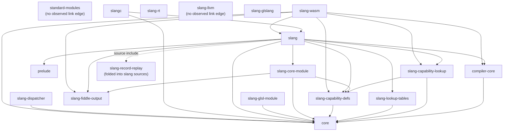

# Dependency Graph

This document captures the static link dependencies among the major
subsystems of the Slang source tree, derived from the
`slang_add_target(... LINK_WITH_PRIVATE ...)` and
`LINK_WITH_PUBLIC` clauses in the per-directory
[CMakeLists.txt](../../../../source) files. The granularity is
**subsystem level** (one node per `source/<subsystem>/`), not file
level; for the file-level inventory consult
[module-map.md](module-map.md).

The intended reader wants to predict what is at risk when changing a
specific subsystem.

## Edges (intra-project only)

External dependencies (`miniz`, `lz4_static`, `Threads::Threads`,
`unordered_dense`, `SPIRV-Headers`, `SPIRV-Tools-opt`, `SPIRV-Tools-link`,
`SPIRV`, `glslang`, `${CMAKE_DL_LIBS}`) are omitted from the diagram
to keep it focused on internal structure. They are listed in the
notes per node.

Three subsystems present in [module-map.md](module-map.md) appear
above without ordinary `LINK_WITH_*` edges:

- **`source/standard-modules/`** — its
  [CMakeLists.txt](../../../../source/standard-modules/CMakeLists.txt)
  only `configure_file`s a config header and `add_subdirectory`s the
  `neural` module; it does not declare a link target of its own. The
  module products are shipped as standalone `.slang-module` files.
- **`source/slang-record-replay/`** — has no `CMakeLists.txt` of
  its own; the sources are pulled directly into `slang` via the
  `SLANG_RECORD_REPLAY_SYSTEM` variable in
  [source/slang/CMakeLists.txt lines
  164-167](../../../../source/slang/CMakeLists.txt) (dashed edge
  above).
- **`source/slang-llvm/`** — has no `CMakeLists.txt` of its own.
  `slang-llvm` is produced out-of-tree (or downloaded as a prebuilt
  binary controlled by `SLANG_SLANG_LLVM_FLAVOR` in the root
  [CMakeLists.txt](../../../../CMakeLists.txt) around line 355); no
  in-source target links against it directly.

## Edge citations

Every solid edge in the diagram is justified by a `LINK_WITH_PUBLIC`
or `LINK_WITH_PRIVATE` clause in the cited file.

| Edge | Cited CMakeLists.txt | Clause |
| --- | --- | --- |
| `compiler-core → core` | [source/compiler-core/CMakeLists.txt](../../../../source/compiler-core/CMakeLists.txt) | `LINK_WITH_PRIVATE core` |
| `capability-lookup → core` | [source/slang/CMakeLists.txt](../../../../source/slang/CMakeLists.txt) | `LINK_WITH_PRIVATE core` on the `slang-capability-lookup` target |
| `capability-lookup → capability-defs` | [source/slang/CMakeLists.txt](../../../../source/slang/CMakeLists.txt) | `LINK_WITH_PRIVATE slang-capability-defs` on the `slang-capability-lookup` target |
| `capability-defs → core` | [source/slang/CMakeLists.txt](../../../../source/slang/CMakeLists.txt) | `LINK_WITH_PUBLIC core` on the `slang-capability-defs` target |
| `lookup-tables → core` | [source/slang/CMakeLists.txt](../../../../source/slang/CMakeLists.txt) | `LINK_WITH_PRIVATE core` on the `slang-lookup-tables` target |
| `core-module → core`, `core-module → capability-defs`, `core-module → fiddle-output` | [source/slang-core-module/CMakeLists.txt](../../../../source/slang-core-module/CMakeLists.txt) | `LINK_WITH_PRIVATE core slang-capability-defs slang-fiddle-output` |
| `glsl-module → core` | [source/slang-glsl-module/CMakeLists.txt](../../../../source/slang-glsl-module/CMakeLists.txt) | `LINK_WITH_PRIVATE core` |
| `slang → {core, prelude, compiler-core, capability-defs, capability-lookup, fiddle-output, lookup-tables, core-module}` | [source/slang/CMakeLists.txt](../../../../source/slang/CMakeLists.txt) | The `slang_add_target(slang ... LINK_WITH_*)` clause near the bottom of the file; `prelude` is a private include dep, not a static link, but is listed here to match `module-map.md` |
| `slangc → core`, `slangc → slang` | [source/slangc/CMakeLists.txt](../../../../source/slangc/CMakeLists.txt) | `LINK_WITH_PRIVATE core slang` |
| `slang-dispatcher → core` | [source/slang-dispatcher/CMakeLists.txt](../../../../source/slang-dispatcher/CMakeLists.txt) | `LINK_WITH_PRIVATE core` |
| `slang-wasm → {slang, core, compiler-core, capability-defs, capability-lookup, fiddle-output}` | [source/slang-wasm/CMakeLists.txt](../../../../source/slang-wasm/CMakeLists.txt) | `LINK_WITH_PRIVATE` clause on the wasm target |

The dashed edge `slang -.-> slang-record-replay` is justified by the
source-list inclusion at
[source/slang/CMakeLists.txt lines
164-167](../../../../source/slang/CMakeLists.txt), not by a
`LINK_WITH_*` clause.

External dependencies (visible in
[CMakeLists.txt](../../../../source/core/CMakeLists.txt) and friends but
not shown in the diagram):

- `coreLib` (`core`): `miniz`, `lz4_static`, `Threads::Threads`,
  `unordered_dense`, `${CMAKE_DL_LIBS}`.
- `slangLib` (`slang`) and `slang-wasm`: `SPIRV-Headers`, plus
  `miniz` / `lz4_static` for the wasm target.
- `slang-rt`: `miniz`, `lz4_static`, `Threads`, `unordered_dense`,
  `${CMAKE_DL_LIBS}` — note the absence of any internal Slang library
  dependency. `slang-rt` is shipped alongside the compiler but does
  not consume the compiler's own code (cite
  [source/slang-rt/CMakeLists.txt](../../../../source/slang-rt/CMakeLists.txt)).
- `slang-glslang`: `glslang`, `SPIRV`, `SPIRV-Tools-opt`,
  `SPIRV-Tools-link` (cite
  [source/slang-glslang/CMakeLists.txt](../../../../source/slang-glslang/CMakeLists.txt)).
- `slang-lookup-tables`: `SPIRV-Headers`.

## Notable invariants

The layering above implies several invariants. Each is justified by a
specific build file.

- **`source/core/` does not depend on any other internal subsystem.**
  Its `slang_add_target(... LINK_WITH_PRIVATE miniz lz4_static
  Threads::Threads ...)` block in
  [source/core/CMakeLists.txt](../../../../source/core/CMakeLists.txt)
  lists only external libraries.
- **`source/compiler-core/` may depend on `source/core/` but not on
  `source/slang/`.** The corresponding block in
  [source/compiler-core/CMakeLists.txt](../../../../source/compiler-core/CMakeLists.txt)
  contains `LINK_WITH_PRIVATE core` only.
- **`source/slang/` (the main `slang` library) is the only target that
  pulls in the AST/IR/emit/check sources.** Every other binary that
  needs compilation services (such as `slangc`,
  [source/slangc/CMakeLists.txt](../../../../source/slangc/CMakeLists.txt))
  links against `slang` rather than reaching into individual files.
- **The capability subsystem is split into two libraries.**
  `slang-capability-defs` is the generated header library and
  `slang-capability-lookup` is the generated source library; the main
  `slang` target consumes both
  ([source/slang/CMakeLists.txt](../../../../source/slang/CMakeLists.txt)).
- **The core module is linked optionally.** The choice between
  `slang-embedded-core-module` and `slang-no-embedded-core-module` is
  controlled by the CMake option `SLANG_EMBED_CORE_MODULE` and
  expressed as a generator expression in
  [source/slang/CMakeLists.txt](../../../../source/slang/CMakeLists.txt).
- **`slang-rt` does not depend on the compiler.** The runtime is
  shipped alongside emitted CPU-target output, and its
  `LINK_WITH_PRIVATE` list contains no compiler internals.
- **Public headers in [include/](../../../../include) must not include
  private headers from [source/](../../../../source).** This is not a
  build-system constraint but a project rule (see
  [CLAUDE.md](../../../../CLAUDE.md)); preserving it is what allows
  downstream users to consume only `include/slang.h`.

## Cycles and known irregularities

No link-level cycles are observed in the per-directory CMake files.
The closest thing to an irregularity is the `slang-common-objects`
indirection in
[source/slang/CMakeLists.txt](../../../../source/slang/CMakeLists.txt):
when configured in some modes the same source files are compiled into
an object library and then re-linked into both
`slang-without-embedded-core-module` and the main `slang` library,
which is a build-system convenience for shipping a "compiler with no
embedded core module" generator alongside the user-facing `slang`.

## Where to go next

- For the file-level breakdown of each subsystem, see
  [module-map.md](module-map.md).
- For runtime data flow rather than build dependencies, follow the
  pipeline starting at [../pipeline/overview.md](../pipeline/overview.md).
