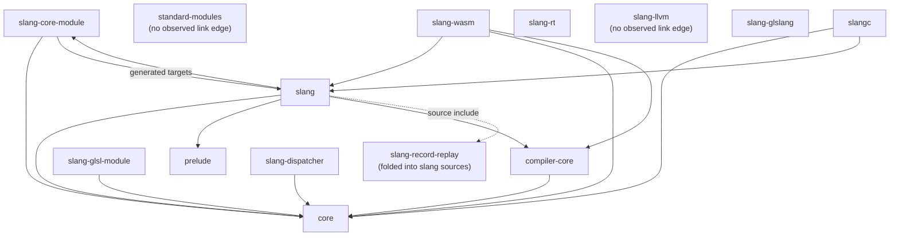

# Dependency Graph

This document captures the static link dependencies among the major
subsystems of the Slang source tree, derived from the
`slang_add_target(... LINK_WITH_PRIVATE ...)` and
`LINK_WITH_PUBLIC` clauses in the per-directory
[CMakeLists.txt](../../../../source) files. The granularity is
**subsystem level** (one node per `source/<subsystem>/`), not file
level; for the file-level inventory consult
[module-map.md](module-map.md).

The intended reader wants to predict what is at risk when changing a
specific subsystem.

## Edges (intra-project only)

External dependencies (`miniz`, `lz4_static`, `Threads::Threads`,
`unordered_dense`, `fast_float`, `SPIRV-Headers`, `SPIRV-Tools-opt`,
`SPIRV-Tools-link`, `SPIRV`, `glslang`, `${CMAKE_DL_LIBS}`) are omitted
from the diagram
to keep it focused on internal structure. The most significant ones
are summarized in the notes per node below; the per-node notes are
not an exhaustive list of every external link dependency.

```mermaid
flowchart TB
    coreLib[core]
    compilerCore[compiler-core]
    prelude[prelude]
    coreModule[slang-core-module]
    glslModule[slang-glsl-module]
    standardModules["standard-modules<br/>(no observed link edge)"]
    slangLib[slang]
    slangRecordReplay["slang-record-replay<br/>(folded into slang sources)"]
    slangc[slangc]
    slangDispatcher[slang-dispatcher]
    slangRt[slang-rt]
    slangLlvm["slang-llvm<br/>(no observed link edge)"]
    slangGlslang[slang-glslang]
    slangWasm[slang-wasm]

    compilerCore --> coreLib
    coreModule --> coreLib
    coreModule -->|generated targets| slangLib
    glslModule --> coreLib

    slangLib --> coreLib
    slangLib --> prelude
    slangLib --> compilerCore
    slangLib --> coreModule
    slangLib -.->|source include| slangRecordReplay

    slangc --> coreLib
    slangc --> slangLib

    slangDispatcher --> coreLib

    slangWasm --> slangLib
    slangWasm --> coreLib
    slangWasm --> compilerCore
```

Inside `source/slang/` the build also defines four generated-code
targets that the diagram deliberately does not show as separate
subsystems: `slang-fiddle-output` (FIDDLE-generated AST/IR support),
`slang-capability-defs` and `slang-capability-lookup` (the generated
capability tables), and `slang-lookup-tables` (generated SPIR-V and
similar lookups). They are declared in
[source/slang/CMakeLists.txt](../../../../source/slang/CMakeLists.txt)
and are consumed by `slang` and `slang-wasm`. They also explain the
`slang-core-module → slang` edge above: `source/slang-core-module/`
links `slang-capability-defs` and `slang-fiddle-output`, so it depends
on generated artefacts owned by `source/slang/` without linking the
compiler library itself.

Three subsystems present in [module-map.md](module-map.md) appear
above without ordinary `LINK_WITH_*` edges:

- **`source/standard-modules/`** — its
  [CMakeLists.txt](../../../../source/standard-modules/CMakeLists.txt)
  only `configure_file`s a config header and `add_subdirectory`s the
  `neural` and `experimental` modules; it does not declare a link
  target of its own. The module products are shipped as standalone
  `.slang-module` files.
- **`source/slang-record-replay/`** — has no `CMakeLists.txt` of
  its own; the sources are pulled directly into `slang` via the
  `SLANG_RECORD_REPLAY_SYSTEM` variable in
  [source/slang/CMakeLists.txt lines
  164-167](../../../../source/slang/CMakeLists.txt) (dashed edge
  above).
- **`source/slang-llvm/`** — has no `CMakeLists.txt` of its own.
  `slang-llvm` is produced out-of-tree (or downloaded as a prebuilt
  binary controlled by `SLANG_SLANG_LLVM_FLAVOR` in the root
  [CMakeLists.txt](../../../../CMakeLists.txt) lines 385-401); no
  in-source target links against it directly.

## Edge citations

Every solid edge in the diagram is justified by a `LINK_WITH_PUBLIC`
or `LINK_WITH_PRIVATE` clause in the cited file.

| Edge | Cited CMakeLists.txt | Clause |
| --- | --- | --- |
| `compiler-core → core` | [source/compiler-core/CMakeLists.txt](../../../../source/compiler-core/CMakeLists.txt) | `LINK_WITH_PRIVATE core` |
| `core-module → core`, `core-module → slang` (generated targets) | [source/slang-core-module/CMakeLists.txt](../../../../source/slang-core-module/CMakeLists.txt) | `LINK_WITH_PRIVATE core slang-capability-defs slang-fiddle-output` |
| `glsl-module → core` | [source/slang-glsl-module/CMakeLists.txt](../../../../source/slang-glsl-module/CMakeLists.txt) | `LINK_WITH_PRIVATE core` |
| `slang → {core, prelude, compiler-core, core-module}`, plus the generated targets in `source/slang/` | [source/slang/CMakeLists.txt](../../../../source/slang/CMakeLists.txt) | The `slang_add_target(slang ... LINK_WITH_*)` clause near the bottom of the file; `prelude` is a private include dep, not a static link, but is listed here to match `module-map.md` |
| `slangc → core`, `slangc → slang` | [source/slangc/CMakeLists.txt](../../../../source/slangc/CMakeLists.txt) | `LINK_WITH_PRIVATE core slang` |
| `slang-dispatcher → core` | [source/slang-dispatcher/CMakeLists.txt](../../../../source/slang-dispatcher/CMakeLists.txt) | `LINK_WITH_PRIVATE core` |
| `slang-wasm → {slang, core, compiler-core}`, plus the generated targets in `source/slang/` | [source/slang-wasm/CMakeLists.txt](../../../../source/slang-wasm/CMakeLists.txt) | `LINK_WITH_PRIVATE miniz lz4_static slang core compiler-core slang-capability-defs slang-capability-lookup slang-fiddle-output slang-lookup-tables` on the wasm target |

The dashed edge `slang -.-> slang-record-replay` is justified by the
source-list inclusion at
[source/slang/CMakeLists.txt lines
164-167](../../../../source/slang/CMakeLists.txt), not by a
`LINK_WITH_*` clause.

External dependencies (visible in
[CMakeLists.txt](../../../../source/core/CMakeLists.txt) and friends but
not shown in the diagram):

- `coreLib` (`core`): `miniz`, `lz4_static`, `Threads::Threads`,
  `unordered_dense`, `${CMAKE_DL_LIBS}`, and — only when
  `SLANG_ENABLE_MIMALLOC` is set — `mimalloc-static`, linked `PUBLIC`
  together with a `PUBLIC SLANG_ENABLE_MIMALLOC=1` compile definition
  so dependents see the same allocator choice
  ([source/core/CMakeLists.txt](../../../../source/core/CMakeLists.txt)).
  The configure step hard-fails if the `mimalloc-static` target is not
  available.
- `compilerCore` (`compiler-core`): `fast_float` (fast floating-point
  parsing), in addition to its internal `core` link; see the
  `LINK_WITH_PRIVATE core fast_float` clause in
  [source/compiler-core/CMakeLists.txt](../../../../source/compiler-core/CMakeLists.txt).
- `slangLib` (`slang`) and `slang-wasm`: `SPIRV-Headers`, plus
  `miniz` / `lz4_static` for the wasm target.
- `slang-rt`: `miniz`, `lz4_static`, `Threads`, `unordered_dense`,
  `${CMAKE_DL_LIBS}` — note the absence of any internal Slang library
  dependency. `slang-rt` is shipped alongside the compiler and links
  none of the compiler's libraries, but it is not wholly independent of
  the compiler's source: its
  [CMakeLists.txt](../../../../source/slang-rt/CMakeLists.txt) passes
  `EXTRA_SOURCE_DIRS ${slang_SOURCE_DIR}/source/core`, which recompiles
  the `source/core/` sources into the runtime with
  `SLANG_RT_DYNAMIC_EXPORT` defined, and
  `INCLUDE_DIRECTORIES_PRIVATE ${slang_SOURCE_DIR}/source` so those
  sources resolve the project's direct-path includes such as
  `#include "core/slang-basic.h"`.
- `slang-glslang`: `glslang`, `SPIRV`, `SPIRV-Tools-opt`,
  `SPIRV-Tools-link` (cite
  [source/slang-glslang/CMakeLists.txt](../../../../source/slang-glslang/CMakeLists.txt)).
- `slang-lookup-tables`: `SPIRV-Headers`.

## Notable invariants

The layering above implies several invariants. Each is justified by a
specific build file.

- **`source/core/` does not depend on any other internal subsystem.**
  Its `slang_add_target(... LINK_WITH_PRIVATE miniz lz4_static
  Threads::Threads ...)` block in
  [source/core/CMakeLists.txt](../../../../source/core/CMakeLists.txt)
  lists only external libraries.
- **`source/compiler-core/` may depend on `source/core/` but not on
  `source/slang/`.** The corresponding block in
  [source/compiler-core/CMakeLists.txt](../../../../source/compiler-core/CMakeLists.txt)
  contains `LINK_WITH_PRIVATE core` only.
- **`source/slang/` is the only subsystem that pulls in the
  AST/IR/emit/check sources.** The concrete source-owning target is
  `slang` itself in a non-embedded build, or `slang-common-objects` when
  `SLANG_EMBED_CORE_MODULE` is on and both library targets are declared
  `NO_SOURCE`
  ([source/slang/CMakeLists.txt](../../../../source/slang/CMakeLists.txt)).
  Every other binary that
  needs compilation services (such as `slangc`,
  [source/slangc/CMakeLists.txt](../../../../source/slangc/CMakeLists.txt))
  links against `slang` rather than reaching into individual files.
- **The capability subsystem is split into two libraries.**
  `slang-capability-defs` is the generated header library and
  `slang-capability-lookup` is the generated source library; the main
  `slang` target consumes both
  ([source/slang/CMakeLists.txt](../../../../source/slang/CMakeLists.txt)).
- **The core module is linked optionally.** The choice between
  `slang-embedded-core-module` and `slang-no-embedded-core-module` is
  controlled by the CMake option `SLANG_EMBED_CORE_MODULE` and
  expressed as a generator expression in
  [source/slang/CMakeLists.txt](../../../../source/slang/CMakeLists.txt).
  When the option is off *and* `SLANG_LIB_TYPE` is `SHARED`, the same
  file adds a `generate_core_module_cache` target that runs the
  `slang-core-module-cache` tool over the freshly linked library and the
  archive produced by `generate_core_module`
  (`core_module_archive_without_timestamp` in
  [source/slang-core-module/CMakeLists.txt](../../../../source/slang-core-module/CMakeLists.txt)),
  writing a `slang-core-module.bin` next to the library. This is a
  build-order dependency on a target under
  [tools/](../../../../tools), not a link edge, and it makes the
  library's on-disk timestamp part of the cache's validity.
- **`slang-rt` does not depend on the compiler.** The runtime is
  shipped alongside emitted CPU-target output, and its
  `LINK_WITH_PRIVATE` list contains no compiler internals.
- **Public headers in [include/](../../../../include) must not include
  private headers from [source/](../../../../source).** This is not a
  build-system constraint but a project rule (see
  [CLAUDE.md](../../../../CLAUDE.md)); preserving it is what allows
  downstream users to consume only `include/slang.h`.

## Cycles and known irregularities

No link-level cycles are observed in the per-directory CMake files.

Two irregularities are worth knowing about. The first is that the
`slang` library reaches *upward* into the tools tree for headers:
[source/slang/CMakeLists.txt](../../../../source/slang/CMakeLists.txt)
adds `${slang_SOURCE_DIR}/tools` to `INCLUDE_DIRECTORIES_PRIVATE`, which
is what lets `slang-language-server.cpp` compile
`#include "platform/performance-counter.h"` from
[tools/platform/](../../../../tools/platform). No link edge accompanies
it — the header is used for its inline definitions — but it does mean
`tools/platform/` is not freely movable without touching the library.

The second is the `slang-common-objects`
indirection in
[source/slang/CMakeLists.txt](../../../../source/slang/CMakeLists.txt):
when configured in some modes the same source files are compiled into
an object library and then re-linked into both
`slang-without-embedded-core-module` and the main `slang` library,
which is a build-system convenience for shipping a "compiler with no
embedded core module" generator alongside the user-facing `slang`.

## Where to go next

- For the file-level breakdown of each subsystem, see
  [module-map.md](module-map.md).
- For runtime data flow rather than build dependencies, follow the
  pipeline starting at [../pipeline/overview.md](../pipeline/overview.md).
