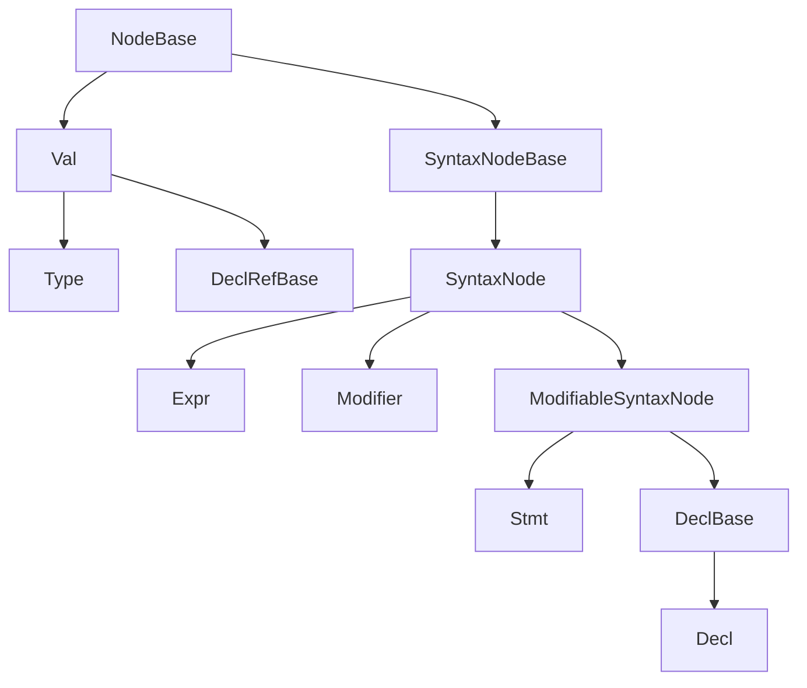

# AST Base Reference

This page describes the abstract roots of the Slang AST hierarchy: the
classes that every concrete AST node ultimately derives from. The
per-family pages ([declarations.md](declarations.md),
[expressions.md](expressions.md), [statements.md](statements.md),
[types.md](types.md), [modifiers.md](modifiers.md),
[values.md](values.md)) assume the reader already knows what
`NodeBase`, `SyntaxNode`, `Decl`, `Expr`, `Stmt`, `Modifier`, `Val`,
and `Type` are. This page is the place to learn that.

Audience: a developer who has read
[../pipeline/02-parse-ast.md](../pipeline/02-parse-ast.md) and wants
the per-class facts before drilling into a family page.

## Source

The abstract root hierarchy is declared in
[slang-ast-base.h](../../../../source/slang/slang-ast-base.h). Two
supporting headers belong to this layer:

- [slang-ast-forward-declarations.h](../../../../source/slang/slang-ast-forward-declarations.h)
  is a short checked-in header that wraps the `ASTNodeType` enum and a
  block of forward `class` declarations around FIDDLE-generated output
  it `#include`s (the `slang-ast-forward-declarations.h.fiddle` block).
  Both the enumerator list and the forward declarations are generated by
  iterating `Slang.NodeBase.subclasses`, so every `NodeBase` subclass —
  abstract intermediates such as `Decl` and `Expr` as well as concrete
  leaves — receives an enumerator, plus a trailing `CountOf`. The tag is
  what the `as<T>()` / `dynamicCast<T>()` infrastructure dispatches on.
- [slang-ast-support-types.h](../../../../source/slang/slang-ast-support-types.h)
  defines the non-node helper types that the AST API exposes
  (`DeclRef<T>`, `LookupResult`, `Modifiers`, `QualType`,
  `SubstitutionSet`, ...).

## Root hierarchy



Notes on the diagram:

- `NodeBase` is the root of every AST node. It carries an
  `astNodeType` tag and a back-pointer to the owning `ASTBuilder`.
- The diagram shows the relationships in
  [slang-ast-base.h](../../../../source/slang/slang-ast-base.h) only.
  All other abstract intermediates (`ContainerDecl`, `OperatorExpr`,
  `LoopStmt`, ...) live in the per-family headers and are documented
  in the corresponding family page's hierarchy diagram.
- `Scope` is a concrete `NodeBase` (not abstract). It is not a syntax
  node; it is created during parsing to support lookup and attached to
  container declarations (`Parser::PushScope` sets
  `ContainerDecl::ownedScope`).

## Roots

### NodeBase

The root of the entire AST hierarchy. Every node the `ASTBuilder`
allocates — declarations, statements, expressions, modifiers, types,
and values alike — ultimately derives from it, so it holds only the
state that all of them share: the runtime type tag and the owning
builder.

- Carries the `ASTNodeType astNodeType` discriminator and a pointer
  back to the `ASTBuilder` that allocated this node.
- The `ASTNodeType` enum is FIDDLE-generated in
  [slang-ast-forward-declarations.h](../../../../source/slang/slang-ast-forward-declarations.h);
  every subclass, abstract or concrete, receives a tag at build time.
  This is what powers `as<T>()` / `dynamicCast<T>()` on AST nodes, via
  `NodeBase::getClass()`, which turns the tag back into a
  `SyntaxClass<NodeBase>`.
- Not a syntax node — it has no source location. Subclasses that
  represent textual syntax derive from `SyntaxNodeBase` instead.

Fields declared at this level:

- `astNodeType: ASTNodeType` — discriminator tag set by the
  `ASTBuilder` at construction.
- `_astBuilder: ASTBuilder*` (private) — the AST builder this node
  belongs to.

Family page: (no dedicated family page)

### SyntaxNode (SyntaxNodeBase)

A second-level abstract base that adds no state of its own. Its parent
`SyntaxNodeBase` (also declared in
[slang-ast-base.h](../../../../source/slang/slang-ast-base.h)) is the
abstract base for nodes that correspond to actual source text and so
carry a `loc: SourceLoc`; `SyntaxNodeBase` is the common ancestor of
every parsed AST node, and `SyntaxNode` is its only direct subclass.
`Expr` and `Modifier` derive directly from `SyntaxNode`;
`ModifiableSyntaxNode` derives from it too and adds modifier storage,
which is where the modifiable/non-modifiable split happens.

Fields declared at this level:

- (no additional state; `loc: SourceLoc` is inherited from
  `SyntaxNodeBase`)

Family page: (no dedicated family page)

### DeclBase (ModifiableSyntaxNode)

An intermediate that represents either a single declaration or a
group of declarations. It has exactly two subclasses: the abstract
`Decl` below, and a concrete group node declared in
[slang-ast-decl.h](../../../../source/slang/slang-ast-decl.h), which the
parser produces when one piece of syntax declares several names; see
[declarations.md](declarations.md) for that node.

A comma-separated declaration is the everyday case:

```slang
int a = 1, b = 2;
static const int P = 3, Q = 4;
```

Each of these lines declares two independent `Decl`s — `a` and `b`,
`P` and `Q`. Because the group node is itself a
`ModifiableSyntaxNode`, the modifiers written once in front of the
group apply to every name it declares: `P` and `Q` are both
`static const`. A struct's fields group the same way (`int x, y;`).

Fields declared at this level:

- (no additional state)

Family page: (no dedicated family page)

### Decl (DeclBase)

The abstract base for every single declaration (function, variable,
type, parameter, generic parameter, ...). Carries a name, the parent
`ContainerDecl`, a check state, and capability requirements.

Fields declared at this level:

- `parentDecl: ContainerDecl*` — containing declaration, set during
  parsing. A declaration is keyed by its parent as well as by its
  name, so the same simple name declared in two different containers
  stays distinguishable at a member-access site; `Decl::isChildOf`
  walks this pointer.
- `nameAndLoc: NameLoc` — the declared name paired with the source
  location of the *name token* rather than of the declaration as a
  whole (`getNameLoc()` returns `nameAndLoc.loc`), which is why a
  conflicting-declaration diagnostic puts its caret under the name.
- `inferredCapabilityRequirements: CapabilitySetVal*` — capability set
  inferred during checking. Alongside it,
  `capabilityRequirementProvenance` records, for each atom, the decl
  reference that caused the requirement, so a capability diagnostic
  can point back at the use that introduced it; see
  [../pipeline/03-semantic-check.md](../pipeline/03-semantic-check.md).
- `checkState: DeclCheckStateExt` — tracks which checking phases have
  completed for this declaration; `setCheckState` asserts that the
  state only ever advances. Nothing in program text observes the
  field directly — it is the bookkeeping behind the `DeclCheckState`
  sequence described in
  [../pipeline/03-semantic-check.md](../pipeline/03-semantic-check.md).

Family page: [declarations.md](declarations.md)

### ModifiableSyntaxNode (SyntaxNode)

The abstract base for syntax nodes that can carry modifiers (`Stmt`
and `DeclBase`). Owns a `Modifiers` list and exposes
`findModifier<T>()` / `hasModifier<T>()` filters.

Fields declared at this level:

- `modifiers: Modifiers` — the linked list of modifiers attached to
  this node.

Family page: (no dedicated family page)

### Stmt (ModifiableSyntaxNode)

The abstract base for every statement node. It declares no state of
its own; deriving from `ModifiableSyntaxNode` is what gives statements
a source location and a `Modifiers` list, which is why attributes can
be written in front of a statement at all.

Fields declared at this level:

- (no additional state)

Family page: [statements.md](statements.md)

### Expr (SyntaxNode)

The abstract base for every expression node. Carries a `QualType`
that is filled in by semantic checking.

Fields declared at this level:

- `type: QualType` — the type assigned to the expression by the
  checker; null on freshly-parsed expressions. A `QualType` is more
  than a `Type*`: its `isLeftValue` flag records whether the
  expression denotes storage, which is what makes `f() = 5` a
  *left of `=` is not an l-value* error rather than a type error.
- `checked: bool` — flag set when the checker has finished with this
  expression.

Family page: [expressions.md](expressions.md)

### Modifier (SyntaxNode)

The abstract base for every modifier and attribute node. Modifiers
form an intrusive linked list attached to a `ModifiableSyntaxNode`.

Fields declared at this level:

- `next: Modifier*` — next modifier in the linked list on the same
  piece of syntax.
- `keywordName: Name*` — the keyword (or attribute name) that
  introduced this modifier. The spelling is retained rather than
  reduced to an anonymous node, and it is the spelling an attribute
  diagnostic quotes back (`unknown attribute 'NoSuchAttributeXyz'`);
  `getKeywordNameAndLoc()` pairs it with the modifier's own `loc`.

Family page: [modifiers.md](modifiers.md)

### Val (NodeBase)

The abstract base for compile-time *values*. `Val`s are deduplicated
(hash-consed) by the `ASTBuilder`, are not syntax nodes (no
`SourceLoc`), and use a generic operand list (`m_operands`) rather
than per-class fields. `Val` subclasses include `Type`, `DeclRefBase`,
the `IntVal` family, and the `Witness` family. `DeclRefBase` (declared
in [slang-ast-base.h](../../../../source/slang/slang-ast-base.h)) is a
reference to a declaration with optional generic substitutions; it is
itself a `Val` so that decl-refs can be hash-consed, and the
user-facing template `DeclRef<T>` (in
[slang-ast-support-types.h](../../../../source/slang/slang-ast-support-types.h))
is a thin typed wrapper around a `DeclRefBase*`. The non-Type `Val`
subhierarchy, including `DeclRefBase`, is documented in
[values.md](values.md).

Fields declared at this level:

- `m_operands: List<ValNodeOperand>` — generic operand list used by
  the `Val` deduplication and substitution machinery.

Family page: [values.md](values.md) (covers the non-Type subhierarchy)

### Type (Val)

The abstract base for every type-as-Val. Every Slang type the front
end works with is a `Type`, including resolved type references,
arithmetic types, generic-parameter types, and function types.

Fields declared at this level:

- `m_astBuilderForReflection: ASTBuilder*` — kept for the reflection
  API only; not used for semantic checking.

Family page: [types.md](types.md)

## Support types

These non-node types are declared in
[slang-ast-support-types.h](../../../../source/slang/slang-ast-support-types.h)
and appear pervasively in the AST API. They are not `NodeBase`
subclasses; they are helpers that wrap or describe nodes.

| Name | Header | Purpose |
| --- | --- | --- |
| `DeclRef<T>` | [slang-ast-support-types.h](../../../../source/slang/slang-ast-support-types.h) | Typed wrapper around `DeclRefBase*`; the API instantiates it at the concrete declaration classes catalogued in [declarations.md](declarations.md). |
| `Modifiers` | [slang-ast-support-types.h](../../../../source/slang/slang-ast-support-types.h) | Intrusive linked list of modifiers attached to a `ModifiableSyntaxNode`. |
| `QualType` | [slang-ast-support-types.h](../../../../source/slang/slang-ast-support-types.h) | A `Type*` together with l-value/r-value and qualifier information; the type carried by `Expr`. |
| `SubstitutionSet` | [slang-ast-support-types.h](../../../../source/slang/slang-ast-support-types.h) | The set of generic / existential substitutions used to specialize a `Val`. Holds the substituting `declRef: DeclRefBase*`, a `packExpansionIndex: int` for substituting inside an `expand each T` pattern, and a `substitutionCache: SubstitutionCache*` that memoizes one substitution operation (see the note below the table). |
| `LookupResult`, `LookupResultItem` | [slang-ast-support-types.h](../../../../source/slang/slang-ast-support-types.h) | Result of a name lookup; can hold zero, one, or several decl-refs together with how each was reached. |
| `NameLoc` | [slang-ast-support-types.h](../../../../source/slang/slang-ast-support-types.h) | Pairs a `Name*` with the `SourceLoc` where it appeared; used directly by `Decl::nameAndLoc`. |
| `TypeExp` | [slang-ast-support-types.h](../../../../source/slang/slang-ast-support-types.h) | A type expression as written by the user (an `Expr` plus the resolved `Type*`). |
| `WitnessTable` | [slang-ast-support-types.h](../../../../source/slang/slang-ast-support-types.h) | A compile-time table of interface-requirement-to-implementation mappings; see the entry in [../glossary.md](../glossary.md). |
| `SyntaxClass<T>` | [slang-ast-support-types.h](../../../../source/slang/slang-ast-support-types.h) | Reflection-style handle to a concrete AST class, used by the visitor and `as<T>()` infrastructure. |
| `KnownBuiltinDeclName` | [slang-ast-support-types.h](../../../../source/slang/slang-ast-support-types.h) | Enum of built-in declaration names (`GeometryStreamAppend`, `DispatchMesh`, `IDifferentiable`, ...). The core module tags each such declaration with its enumerator using the `[KnownBuiltin(n)]` attribute (`attribute_syntax [KnownBuiltin(name : int)]` in [core.meta.slang](../../../../source/slang/core.meta.slang)), so the compiler locates the declaration by enum comparison rather than by string comparison. Membership is not only a lookup speed-up — it gates behavior: `isDifferentiableInterfaceBuiltin` is the authoritative definition of the differentiable-interface family (`IDifferentiable`, `IDifferentiablePtr`, `IForwardDifferentiable`, `IBackwardDifferentiable`, `IBwdCallable`), whose conformance witness-table entries the linker defers when a program does not use auto-diff. `getKnownBuiltinDeclNameFromString` maps a spelling to the enumerator. |
| `BuiltinOperationKind` | [slang-ast-support-types.h](../../../../source/slang/slang-ast-support-types.h) | Enum tagging a builtin operator (`Add`, `Sub`, `Less`, ...) recognized by the operator fast path. Stored on the synthesized builtin-operator expression node (see [expressions.md](expressions.md)) and on its constant-folded counterpart (see [values.md](values.md)); mapped from operator-name + `OperatorArity` by `getBuiltinOperationKindFromString`. Integer values are part of the serialized/mangled form (append-only). |
| `printDiagnosticArg` / `getDiagnosticPos` | [slang-ast-support-types.h](../../../../source/slang/slang-ast-support-types.h) | Free-function diagnostic helpers: `printDiagnosticArg` overloads format a `Decl` / `Type` / `TypeExp` / `QualType` / `Val` / `DeclRefBase` into a diagnostic message, and `getDiagnosticPos` overloads recover the `SourceLoc` to anchor a diagnostic at. |
| `Scope` | [slang-ast-base.h](../../../../source/slang/slang-ast-base.h) | Name-lookup data structure; technically a `NodeBase` but used as a helper rather than a syntax node. Created during parsing and attached to container declarations. |

`SubstitutionSet::substitutionCache` points at a `SubstitutionCache`,
which is only forward-declared in
[slang-ast-support-types.h](../../../../source/slang/slang-ast-support-types.h);
its definition is not in this page's watched paths, so the description
above is limited to what the declaration site says. The type is defined
in
[slang-ast-substitution.h](../../../../source/slang/slang-ast-substitution.h),
together with the
`substituteValWithCache` helper that installs a cache for the outermost
`substituteImpl` call and propagates it through copies of the
`SubstitutionSet`. That path should be added to this document's
`watched_paths` in the manifest if the page is to describe the caching
behavior in more detail.

## See also

- [../pipeline/02-parse-ast.md](../pipeline/02-parse-ast.md) — how the
  parser builds an AST from these roots.
- [../pipeline/03-semantic-check.md](../pipeline/03-semantic-check.md)
  — how the checker fills in `QualType`, `checkState`, decl-refs.
- [declarations.md](declarations.md), [expressions.md](expressions.md),
  [statements.md](statements.md), [types.md](types.md),
  [modifiers.md](modifiers.md), [values.md](values.md) — concrete leaf
  nodes grouped by family root.
- [../glossary.md](../glossary.md) — short definitions for `ASTBuilder`,
  `decl-ref`, `source-loc`, `witness table`, etc.
