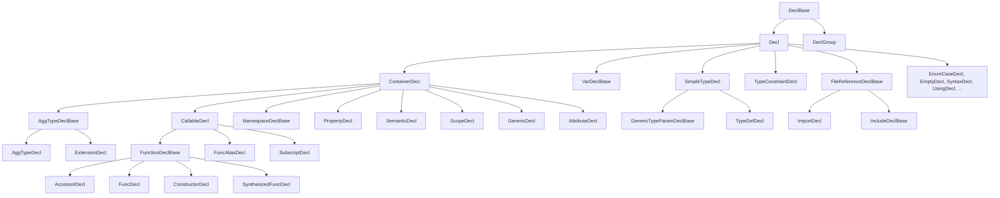

# Declarations Reference

The reference for every concrete `Decl` and `DeclBase` subclass in the
Slang AST. The abstract roots `DeclBase` and `Decl` are documented in
[base.md](base.md); this page covers their concrete descendants.

Audience: a contributor reading or writing front-end code who needs to
know what fields a particular declaration carries and which parser
function emits it.

## Source

All declarations in this page are declared in
[slang-ast-decl.h](../../../../source/slang/slang-ast-decl.h). The parser
functions that produce them live in
[slang-parser.cpp](../../../../source/slang/slang-parser.cpp); the
top-level dispatch is `parseDecl()` and the syntax-decl table is
`SyntaxParseInfo` (see
[../syntax-reference/keywords-and-builtins.md](../syntax-reference/keywords-and-builtins.md)).

## Family hierarchy

Abstract intermediates declared in `slang-ast-decl.h` together with
the bases inherited from [base.md](base.md):

The abstract bases appear here but not in the `## Nodes` table; they
carry no FIDDLE concrete tag. Concrete leaves below.

## Nodes

| Class | Parent | Key fields | Grammar | Summary |
| --- | --- | --- | --- | --- |
| `DeclGroup` | `DeclBase` | `decls: List<Decl*>` | (none) | Wraps multiple declarations parsed as a single group (e.g. `int a, b;`). |
| `UnresolvedDecl` | `Decl` | (no additional state) | (none) | Placeholder used during deserialization before the real decl is bound. |
| `VarDecl` | `VarDeclBase` | `type: TypeExp`, `initExpr: Expr*` | [variable declaration](../syntax-reference/grammar.md#declarations) | Ordinary mutable variable: local, global, or member. |
| `LetDecl` | `VarDecl` | (inherits) | [variable declaration](../syntax-reference/grammar.md#declarations) | `let` variable; immutable. |
| `ParamDecl` | `VarDeclBase` | (inherits) | [parameter](../syntax-reference/grammar.md#declarations) | Function / initializer / subscript parameter. |
| `ModernParamDecl` | `ParamDecl` | (inherits) | [parameter](../syntax-reference/grammar.md#declarations) | Modern-syntax parameter; immutable unless `out`/`inout`. |
| `GlobalGenericValueParamDecl` | `VarDeclBase` | (inherits) | [generic-value param](../syntax-reference/grammar.md#top-level-structure) | Module-level existential value parameter (not a type parameter). |
| `GenericValueParamDecl` | `VarDeclBase` | `parameterIndex: int` | [generic-value param](../syntax-reference/grammar.md#declarations) | A value parameter of a `GenericDecl`. |
| `GenericValuePackParamDecl` | `VarDeclBase` | `parameterIndex: int` | [generic-value param](../syntax-reference/grammar.md#declarations) | A value-pack parameter of a `GenericDecl`. |
| `ExtensionDecl` | `AggTypeDeclBase` | `targetType: TypeExp` | [extension](../syntax-reference/grammar.md#declarations) | `extension T { ... }`; attaches new members to an existing type. |
| `StructDecl` | `AggTypeDecl` | `m_membersVisibleInCtor` | [struct](../syntax-reference/grammar.md#declarations) | User-defined struct. |
| `SynthesizedStructDecl` | `AggTypeDecl` | `operands: List<Val*>`, `irOp: uint32_t` | (none) | Struct synthesized during checking (e.g. for tuples). |
| `ClassDecl` | `AggTypeDecl` | (inherits) | [class](../syntax-reference/grammar.md#declarations) | User-defined class (reference type). |
| `GLSLInterfaceBlockDecl` | `AggTypeDecl` | (inherits) | [interface block](../syntax-reference/grammar.md#declarations) | GLSL-style interface block (uniform/buffer/in/out). |
| `EnumDecl` | `AggTypeDecl` | `tagType: Type*` | [enum](../syntax-reference/grammar.md#declarations) | `enum` declaration. |
| `EnumCaseDecl` | `Decl` | `type: TypeExp`, `tagExpr: Expr*`, `tagVal: IntVal*` | [enum case](../syntax-reference/grammar.md#declarations) | A single case inside an `enum`. |
| `ThisTypeDecl` | `AggTypeDecl` | (inherits) | (none) | Synthetic member of `InterfaceDecl` representing the abstract `This` type. |
| `InterfaceDecl` | `AggTypeDecl` | (inherits) | [interface](../syntax-reference/grammar.md#declarations) | `interface IFoo { ... }`. |
| `ThisTypeConstraintDecl` | `TypeConstraintDecl` | `base: TypeExp` | (none) | Constraint that `This : I` for an interface requirement. |
| `InheritanceDecl` | `TypeConstraintDecl` | `base: TypeExp`, `witnessTable: RefPtr<WitnessTable>` | [inheritance clause](../syntax-reference/grammar.md#declarations) | An inheritance clause (`: IFoo`); stores the witness table after checking. |
| `TypeDefDecl` | `SimpleTypeDecl` | `type: TypeExp` | [typedef](../syntax-reference/grammar.md#declarations) | `typedef X Y;`. |
| `TypeAliasDecl` | `TypeDefDecl` | (inherits) | [typealias](../syntax-reference/grammar.md#declarations) | `typealias Y = X;` (modern alias syntax). |
| `AssocTypeDecl` | `AggTypeDecl` | (inherits) | [associatedtype](../syntax-reference/grammar.md#declarations) | `associatedtype T` inside an interface. |
| `GlobalGenericParamDecl` | `AggTypeDecl` | (inherits) | [generic type param](../syntax-reference/grammar.md#top-level-structure) | Module-level type parameter (`type_param`). |
| `ScopeDecl` | `ContainerDecl` | (inherits) | (none) | Anonymous scope used by block statements and similar constructs. |
| `FuncAliasDecl` | `CallableDecl` | `targetDeclRef: DeclRef<CallableDecl>` | [func alias](../syntax-reference/grammar.md#declarations) | Function alias / re-export of an existing callable. |
| `ConstructorDecl` | `FunctionDeclBase` | `m_flavor: int` (UserDefined / SynthesizedDefault / SynthesizedMemberInit) | [constructor](../syntax-reference/grammar.md#declarations) | `__init` / synthesized constructor. |
| `LambdaDecl` | `StructDecl` | `funcDecl: FunctionDeclBase*` | [lambda](../syntax-reference/grammar.md#expressions) | The closure-struct produced by a lambda expression. |
| `SubscriptDecl` | `CallableDecl` | (inherits) | [subscript](../syntax-reference/grammar.md#declarations) | `__subscript` (callable used by `a[i]`). |
| `PropertyDecl` | `ContainerDecl` | `type: TypeExp` | [property](../syntax-reference/grammar.md#declarations) | Property whose body holds `GetterDecl`/`SetterDecl`/`RefAccessorDecl`. |
| `GetterDecl` | `AccessorDecl` | (inherits) | [accessor](../syntax-reference/grammar.md#declarations) | `get` accessor on a property or subscript. |
| `SetterDecl` | `AccessorDecl` | (inherits) | [accessor](../syntax-reference/grammar.md#declarations) | `set` accessor. |
| `RefAccessorDecl` | `AccessorDecl` | (inherits) | [accessor](../syntax-reference/grammar.md#declarations) | `ref` accessor (returns by reference). |
| `SemanticDecl` | `ContainerDecl` | (inherits) | [semantic decl](../syntax-reference/grammar.md#declarations) | Declaration of a `: SV_*`-style semantic; holds its accessor decls. |
| `SemanticGetterDecl` | `Decl` | `type: TypeExp` | (none) | Typed `get : <type>` accessor inside a `SemanticDecl`. |
| `SemanticSetterDecl` | `Decl` | `type: TypeExp` | (none) | Typed `set : <type>` accessor inside a `SemanticDecl`. |
| `FuncDecl` | `FunctionDeclBase` | (inherits) | [function](../syntax-reference/grammar.md#declarations) | Ordinary function declaration. |
| `SynthesizedFuncDecl` | `FunctionDeclBase` | `operands: List<Val*>`, `irOp: uint32_t` | (none) | Function synthesized during checking; carries the target IR opcode. |
| `FuncExtensionDecl` | `Decl` | `targetExpr: Expr*`, `innerFunc: FuncDecl*` | [func_extension](../syntax-reference/grammar.md#declarations) | `__func_extension fwd_diff(foo)(...)` shorthand for attaching a custom derivative / `__apply` to an existing function; desugars to an `ExtensionDecl` during checking. |
| `NamespaceDecl` | `NamespaceDeclBase` | (inherits) | [namespace](../syntax-reference/grammar.md#top-level-structure) | `namespace { ... }`. |
| `ModuleDecl` | `NamespaceDeclBase` | `module: Module*`, `languageVersion`, `defaultVisibility`, ... | [module](../syntax-reference/grammar.md#top-level-structure) | Top-level declaration of a translation unit / module. |
| `FileDecl` | `ContainerDecl` | (no additional state) | (none) | Transparent per-source-file scope inside a `ModuleDecl`. |
| `UsingDecl` | `Decl` | `arg: Expr*`, `scope: Scope*` | [using](../syntax-reference/grammar.md#top-level-structure) | `using` / bring-into-scope declaration. |
| `FileReferenceDeclBase` | `Decl` | `moduleNameAndLoc: NameLoc`, `scope: Scope*` | (none) | Common base for import/include declarations; not used directly. |
| `ImportDecl` | `FileReferenceDeclBase` | `importedModuleDecl: ModuleDecl*` | [import](../syntax-reference/grammar.md#top-level-structure) | `import M;`. |
| `IncludeDecl` | `IncludeDeclBase` | `fileDecl: FileDecl*` | [__include](../syntax-reference/grammar.md#top-level-structure) | `__include`-style file inclusion. |
| `ImplementingDecl` | `IncludeDeclBase` | `fileDecl: FileDecl*` | [__implementing](../syntax-reference/grammar.md#top-level-structure) | `__implementing` companion to module files. |
| `ModuleDeclarationDecl` | `Decl` | (no additional state) | [module decl](../syntax-reference/grammar.md#top-level-structure) | The `module M;` form that names the module of the current file. |
| `RequireCapabilityDecl` | `Decl` | (no additional state) | [require capability](../syntax-reference/grammar.md#top-level-structure) | `require_capability` declaration; expressed as a decl so it can be exported. |
| `GenericDecl` | `ContainerDecl` | `inner: Decl*`, `_cachedArgsForDefaultSubstitution` | [generics](../syntax-reference/grammar.md#declarations) | Generic wrapper: the parameter list lives as members; `inner` is the genericized decl. |
| `InterfaceDefaultImplDecl` | `GenericDecl` | `thisTypeDecl: GenericTypeParamDecl*`, `thisTypeConstraintDecl` | (none) | Synthetic generic that wraps a default implementation of an interface requirement. |
| `GenericTypeParamDecl` | `GenericTypeParamDeclBase` | `initType: TypeExp` | [generic type param](../syntax-reference/grammar.md#declarations) | A type parameter of a `GenericDecl`. |
| `GenericTypePackParamDecl` | `GenericTypeParamDeclBase` | (inherits) | [generic type-pack param](../syntax-reference/grammar.md#declarations) | A variadic type-pack parameter. |
| `GenericTypeConstraintDecl` | `TypeConstraintDecl` | `sub: TypeExp`, `sup: TypeExp`, `isEqualityConstraint: bool` | [where clause](../syntax-reference/grammar.md#constraints-solved-at-check-time) | A generic constraint `T : U` or `T == U`. |
| `TypeCoercionConstraintDecl` | `Decl` | `fromType: TypeExp`, `toType: TypeExp` | [where clause](../syntax-reference/grammar.md#constraints-solved-at-check-time) | A coercion constraint in a `where` clause. |
| `NonEmptyPackConstraintDecl` | `Decl` | `packExpr: Expr*` | [where clause](../syntax-reference/grammar.md#constraints-solved-at-check-time) | Constraint that a type pack is non-empty. |
| `HasDiffTypeInfoConstraintDecl` | `Decl` | `type: TypeExp` | [where clause](../syntax-reference/grammar.md#constraints-solved-at-check-time) | Differentiable-type constraint. |
| `EmptyDecl` | `Decl` | (no additional state) | (none) | An empty declaration that exists only to carry modifiers (e.g. GLSL `layout(...) in;`). |
| `SyntaxDecl` | `Decl` | `syntaxClass: SyntaxClass<NodeBase>`, `parseCallback: SyntaxParseCallback` | (none) | Binds a keyword to a parser callback; see `## Notable nodes` and [../syntax-reference/keywords-and-builtins.md](../syntax-reference/keywords-and-builtins.md). |
| `AttributeDecl` | `ContainerDecl` | `syntaxClass: SyntaxClass<NodeBase>` | [attribute](../syntax-reference/grammar.md#attributes-and-decorations) | Declares an attribute (`[name(args)]`); its body is the parameter list. |

## Notable nodes

### GenericDecl

The wrapper that turns any inner declaration into a generic. The
parser parses the parameter list as `ContainerDecl` members of the
`GenericDecl` itself; the inner declaration sits in
`GenericDecl::inner`. This indirection is what lets the rest of the
front end treat a generic as "the inner decl with a parameter list",
rather than threading generic-parameter handling through every other
`Decl` class. See
[../pipeline/02-parse-ast.md](../pipeline/02-parse-ast.md) for the
two-pass parsing strategy that produces this shape.

### ExtensionDecl

Parsed wherever a `struct`-like declaration is parsed, but
semantically attaches members to an existing type
(`ExtensionDecl::targetType`). The attachment is resolved by name
lookup during checking, which is why `targetType` is stored as a
`TypeExp` rather than a resolved `Type*` at parse time.

### FuncExtensionDecl

A lightweight shorthand parsed from `__func_extension` (gated behind
`-experimental-feature`) that attaches a custom forward derivative
(`fwd_diff`), backward derivative (`bwd_diff`), or custom forward
pass (`__apply`) to an existing function without modifying its
definition. The parser stores the target as a higher-order `Expr*`
(e.g. a `ForwardDifferentiateExpr` wrapping the function reference)
and the user-written body as an `innerFunc: FuncDecl*`; semantic
checking desugars the whole thing into an `ExtensionDecl` so the
rest of the pipeline never sees the shorthand. The IR lowering
visitor treats the `FuncExtensionDecl` itself as ignored
(`IGNORED_CASE` in
[slang-lower-to-ir.cpp](../../../../source/slang/slang-lower-to-ir.cpp)).

### AggTypeDecl, StructDecl, ClassDecl, EnumDecl

`AggTypeDecl` is the shared abstract base for declarations of named
aggregate types. `StructDecl` is the value-type variant, `ClassDecl`
is a reference-type aggregate, and `EnumDecl` is the tagged-union
form (with its cases as `EnumCaseDecl` children). All three share
container behaviour (members, inheritance clauses, generics) so most
type-related machinery is shared. `SynthesizedStructDecl` is produced
by the checker when it needs to materialize an anonymous aggregate
(e.g. for a tuple or a captured-environment lambda struct).

### InheritanceDecl

A pseudo-member of an aggregate decl that records one entry in the
type's `: Base, IFoo` inheritance list. After checking,
`witnessTable` records how the containing type satisfies each
requirement of the base interface; this is the connection point
between the declaration AST and the witness-table machinery covered
in [values.md](values.md) and
[../cross-cutting/ir-instructions.md](../cross-cutting/ir-instructions.md).

### SyntaxDecl and the syntax-as-declaration model

`SyntaxDecl` is the AST representation of a keyword binding produced
by `__syntax`. The lexer does not hard-code most keywords; instead the
core module file
[core.meta.slang](../../../../source/slang/core.meta.slang) declares each
keyword via `__syntax` and the parser uses the resulting `SyntaxDecl`
chain to map an identifier to the correct AST node class
(`syntaxClass`) and parser callback (`parseCallback`). See
[../syntax-reference/keywords-and-builtins.md](../syntax-reference/keywords-and-builtins.md)
for the full mechanism.

### NamespaceDecl, ModuleDecl, FileDecl

The three layers of the module / file / namespace nesting:
`ModuleDecl` is the root for a translation unit; `FileDecl` is a
transparent per-source-file scope underneath the module (used so that
several `.slang` files can compose into one module while still
attributing diagnostics to a file); `NamespaceDecl` is the
user-declared `namespace { ... }`. Multiple textual namespace
declarations with the same name in one module are collapsed into one
`NamespaceDecl` during parsing.

### EnumDecl and EnumCaseDecl

An `EnumDecl` is treated as an `AggTypeDecl` so that enum types can
have conformances and member functions like any other type.
`EnumCaseDecl` is *not* an `AggTypeDecl`; each case is a regular
`Decl` carrying its tag value and (after checking) the type of the
enclosing enum.

### AccessorDecl family

`GetterDecl`, `SetterDecl`, and `RefAccessorDecl` model the accessors
on a `PropertyDecl` or `SubscriptDecl`. The parser will synthesize a
default `GetterDecl` for `PropertyDecl`s that have an initializer but
no explicit accessor block. The body of each accessor is parsed
lazily, like any other function body, by the two-stage parser.

### RequirementDecl-style nodes inside InterfaceDecl

Interface requirements are not a separate `Decl` class — an
interface requirement is whatever `Decl` was written inside the
interface body (a `FuncDecl`, `PropertyDecl`, `AssocTypeDecl`, ...).
The checker distinguishes interface requirements from regular members
via `isInterfaceRequirement(Decl*)` (declared at the bottom of
[slang-ast-decl.h](../../../../source/slang/slang-ast-decl.h)) rather
than by class.

## See also

- [base.md](base.md) — abstract roots (`DeclBase`, `Decl`,
  `ContainerDecl` family relationships).
- [expressions.md](expressions.md) — many decls embed `Expr*`
  initializers, `Stmt*` bodies, and `TypeExp` annotations.
- [modifiers.md](modifiers.md) — visibility, intrinsics, attributes
  that attach to declarations.
- [values.md](values.md) — `WitnessTable` referenced by
  `InheritanceDecl` and `GenericTypeConstraintDecl`.
- [../pipeline/02-parse-ast.md](../pipeline/02-parse-ast.md) —
  parsing of declarations (entry points such as `parseDecl`,
  `parseAggTypeDecl`, `parseGenericDecl`).
- [../pipeline/03-semantic-check.md](../pipeline/03-semantic-check.md)
  — declaration checking and witness-table construction.
- [../syntax-reference/grammar.md#declarations](../syntax-reference/grammar.md#declarations)
  — the grammar productions matching this page.
