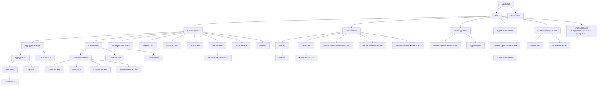

# Declarations Reference

The reference for every concrete `Decl` and `DeclBase` subclass in the
Slang AST, written for a contributor reading or writing front-end code
who needs to know what fields a particular declaration carries and
which parser function emits it. The abstract roots `DeclBase` and
`Decl` are declared in
[slang-ast-base.h](../../../../source/slang/slang-ast-base.h) and
documented in [base.md](base.md); this page covers their concrete
descendants, which are declared in
[slang-ast-decl.h](../../../../source/slang/slang-ast-decl.h).

## Source

All declarations in this page are declared in
[slang-ast-decl.h](../../../../source/slang/slang-ast-decl.h). The parser
functions that produce them live in
[slang-parser.cpp](../../../../source/slang/slang-parser.cpp); the
top-level dispatch is `ParseDecl` and the syntax-decl table is the
`SyntaxParseInfo` array `g_parseSyntaxEntries` (see
[../syntax-reference/keywords-and-builtins.md](../syntax-reference/keywords-and-builtins.md)).
Not every class here has a parser: a number of them are synthesized by
semantic checking, and those rows carry `(none)` in the `Grammar`
column below.

## Family hierarchy

Abstract intermediates declared in `slang-ast-decl.h` together with
the bases inherited from [base.md](base.md):


```mermaid
flowchart TD
  DeclBase --> Decl
  DeclBase --> DeclGroup
  Decl --> ContainerDecl
  Decl --> VarDeclBase
  Decl --> SimpleTypeDecl
  Decl --> TypeConstraintDecl
  Decl --> FileReferenceDeclBase
  Decl --> OtherDecl["EnumCaseDecl, EmptyDecl, SyntaxDecl, UsingDecl, ..."]
  ContainerDecl --> AggTypeDeclBase
  ContainerDecl --> CallableDecl
  ContainerDecl --> NamespaceDeclBase
  ContainerDecl --> PropertyDecl
  ContainerDecl --> SemanticDecl
  ContainerDecl --> ScopeDecl
  ContainerDecl --> GenericDecl
  ContainerDecl --> AttributeDecl
  ContainerDecl --> FileDecl
  AggTypeDeclBase --> AggTypeDecl
  AggTypeDeclBase --> ExtensionDecl
  AggTypeDecl --> StructDecl
  AggTypeDecl --> ClassDecl
  StructDecl --> LambdaDecl
  CallableDecl --> FunctionDeclBase
  CallableDecl --> FuncAliasDecl
  CallableDecl --> SubscriptDecl
  FunctionDeclBase --> AccessorDecl
  FunctionDeclBase --> FuncDecl
  FunctionDeclBase --> ConstructorDecl
  FunctionDeclBase --> SynthesizedFuncDecl
  VarDeclBase --> VarDecl
  VarDeclBase --> ParamDecl
  VarDeclBase --> GlobalGenericValueParamDecl
  VarDeclBase --> GenericValueParamDecl
  VarDeclBase --> GenericValuePackParamDecl
  VarDecl --> LetDecl
  ParamDecl --> ModernParamDecl
  SimpleTypeDecl --> GenericTypeParamDeclBase
  SimpleTypeDecl --> TypeDefDecl
  TypeConstraintDecl --> GenericTypeConstraintDecl
  GenericTypeConstraintDecl --> FuncConstraintDecl
  GenericDecl --> InterfaceDefaultImplDecl
  FileReferenceDeclBase --> ImportDecl
  FileReferenceDeclBase --> IncludeDeclBase
```

The classes declared with `FIDDLE(abstract)` — `ContainerDecl`,
`VarDeclBase`, `AggTypeDeclBase`, `AggTypeDecl`, `TypeConstraintDecl`,
`SimpleTypeDecl`, `CallableDecl`, `FunctionDeclBase`, `AccessorDecl`,
`NamespaceDeclBase`, `IncludeDeclBase`, `GenericTypeParamDeclBase` —
appear here but not in the `## Nodes` table. `FileReferenceDeclBase` is
the one intermediate in this diagram that is declared with a plain
`FIDDLE()`, so it is a concrete class and does have a table row even
though nothing constructs it directly. Concrete leaves below.

## Nodes

| Class                                    | Parent                      | Key fields                                                                                                                         | Grammar                                                                               | Summary                                                                                                                                                                |
| ---------------------------------------- | --------------------------- | ---------------------------------------------------------------------------------------------------------------------------------- | ------------------------------------------------------------------------------------- | ---------------------------------------------------------------------------------------------------------------------------------------------------------------------- |
| `DeclGroup`                              | `DeclBase`                  | `decls: List<Decl*>`                                                                                                               | [declaration group](../syntax-reference/grammar.md#declarations)                      | Wraps multiple declarations parsed as a single group (e.g. `int a, b;`).                                                                                               |
| `UnresolvedDecl`                         | `Decl`                      | (no additional state)                                                                                                              | (none)                                                                                | (unclear) — declared, and named by `printDiagnosticArg`, but no code in `source/` constructs one; see the note in `## Notable nodes`.                                  |
| `VarDecl`                                | `VarDeclBase`               | `type: TypeExp`, `initExpr: Expr*`                                                                                                 | [variable declaration](../syntax-reference/grammar.md#declarations)                   | Ordinary mutable variable: local, global, or member.                                                                                                                   |
| `LetDecl`                                | `VarDecl`                   | (inherits)                                                                                                                         | [variable declaration](../syntax-reference/grammar.md#declarations)                   | `let` variable; immutable.                                                                                                                                             |
| `ParamDecl`                              | `VarDeclBase`               | (inherits)                                                                                                                         | [parameter](../syntax-reference/grammar.md#function-style-declarations)               | Function / initializer / subscript parameter.                                                                                                                          |
| `ModernParamDecl`                        | `ParamDecl`                 | (inherits)                                                                                                                         | [parameter](../syntax-reference/grammar.md#function-style-declarations)               | Modern-syntax (name-first) parameter; immutable unless `out`/`inout`.                                                                                                  |
| `GlobalGenericValueParamDecl`            | `VarDeclBase`               | (inherits)                                                                                                                         | [`__generic_value_param`](../syntax-reference/grammar.md#declarations)                | Module-level existential value parameter (not a type parameter); bound by an external specialization argument — see `## Notable nodes`.                                |
| `GenericValueParamDecl`                  | `VarDeclBase`               | `parameterIndex: int`                                                                                                              | [generic-value param](../syntax-reference/grammar.md#generics-and-where-clauses)      | A value parameter of a `GenericDecl`.                                                                                                                                  |
| `GenericValuePackParamDecl`              | `VarDeclBase`               | `parameterIndex: int`                                                                                                              | [generic-value-pack param](../syntax-reference/grammar.md#generics-and-where-clauses) | A value-pack parameter of a `GenericDecl` (`let each N`).                                                                                                              |
| `ExtensionDecl`                          | `AggTypeDeclBase`           | `targetType: TypeExp`                                                                                                              | [extension](../syntax-reference/grammar.md#type-defining-declarations)                | `extension T { ... }`; attaches new members to an existing type.                                                                                                       |
| `StructDecl`                             | `AggTypeDecl`               | `m_membersVisibleInCtor: HashSet<VarDeclBase*>`                                                                                    | [struct](../syntax-reference/grammar.md#type-defining-declarations)                   | User-defined struct.                                                                                                                                                   |
| `SynthesizedStructDecl`                  | `AggTypeDecl`               | `operands: List<Val*>`, `irOp: uint32_t`                                                                                           | (none)                                                                                | Struct synthesized during checking (e.g. for tuples).                                                                                                                  |
| `ClassDecl`                              | `AggTypeDecl`               | (inherits)                                                                                                                         | [class](../syntax-reference/grammar.md#type-defining-declarations)                    | User-defined class (reference type).                                                                                                                                   |
| `GLSLInterfaceBlockDecl`                 | `AggTypeDecl`               | (inherits)                                                                                                                         | (none)                                                                                | GLSL-style interface block (uniform/buffer/in/out); no parser production reaches it — see `## Notable nodes`.                                                          |
| `EnumDecl`                               | `AggTypeDecl`               | `tagType: Type*`                                                                                                                   | [enum](../syntax-reference/grammar.md#type-defining-declarations)                     | `enum` declaration.                                                                                                                                                    |
| `EnumCaseDecl`                           | `Decl`                      | `type: TypeExp`, `tagExpr: Expr*`, `tagVal: IntVal*`                                                                               | [enum case](../syntax-reference/grammar.md#type-defining-declarations)                | A single case inside an `enum`.                                                                                                                                        |
| `ThisTypeDecl`                           | `AggTypeDecl`               | (inherits)                                                                                                                         | (none)                                                                                | Synthetic member of `InterfaceDecl` representing the abstract `This` type.                                                                                             |
| `InterfaceDecl`                          | `AggTypeDecl`               | (inherits)                                                                                                                         | [interface](../syntax-reference/grammar.md#type-defining-declarations)                | `interface IFoo { ... }`.                                                                                                                                              |
| `ThisTypeConstraintDecl`                 | `TypeConstraintDecl`        | `base: TypeExp`                                                                                                                    | (none)                                                                                | Constraint that `This : I` for an interface requirement.                                                                                                               |
| `InheritanceDecl`                        | `TypeConstraintDecl`        | `base: TypeExp`, `witnessTable: RefPtr<WitnessTable>`, `witnessVal: Witness*`                                                      | [inheritance clause](../syntax-reference/grammar.md#type-defining-declarations)       | An inheritance clause (`: IFoo`); stores the witness table after checking.                                                                                             |
| `TypeDefDecl`                            | `SimpleTypeDecl`            | `type: TypeExp`                                                                                                                    | [typedef](../syntax-reference/grammar.md#type-defining-declarations)                  | `typedef X Y;`.                                                                                                                                                        |
| `TypeAliasDecl`                          | `TypeDefDecl`               | (inherits)                                                                                                                         | [typealias](../syntax-reference/grammar.md#type-defining-declarations)                | `typealias Y = X;` (modern alias syntax).                                                                                                                              |
| `AssocTypeDecl`                          | `AggTypeDecl`               | (inherits)                                                                                                                         | [associatedtype](../syntax-reference/grammar.md#type-defining-declarations)           | `associatedtype T` inside an interface.                                                                                                                                |
| `GlobalGenericParamDecl`                 | `AggTypeDecl`               | (inherits)                                                                                                                         | [`type_param`](../syntax-reference/grammar.md#declarations)                           | Module-level type parameter (`type_param`); bound by an external specialization argument — see `## Notable nodes`.                                                     |
| `ScopeDecl`                              | `ContainerDecl`             | (inherits)                                                                                                                         | [block scope](../syntax-reference/grammar.md#statements)                              | Anonymous scope created by the parser for block statements, loop headers, and lambda parameter lists.                                                                  |
| `FuncAliasDecl`                          | `CallableDecl`              | `targetDeclRef: DeclRef<CallableDecl>`                                                                                             | (none)                                                                                | Alias member naming an existing callable; synthesized during checking (e.g. the `fwd_diff` member of a derivative extension), not parsed.                              |
| `ConstructorDecl`                        | `FunctionDeclBase`          | `m_flavor: int` (UserDefined / SynthesizedDefault / SynthesizedMemberInit)                                                         | [constructor](../syntax-reference/grammar.md#function-style-declarations)             | `__init` / synthesized constructor.                                                                                                                                    |
| `LambdaDecl`                             | `StructDecl`                | `funcDecl: FunctionDeclBase*`                                                                                                      | (none)                                                                                | Closure struct synthesized by the checker from a `LambdaExpr`; the parser produces the expression, not this decl.                                                      |
| `SubscriptDecl`                          | `CallableDecl`              | (inherits)                                                                                                                         | [subscript](../syntax-reference/grammar.md#function-style-declarations)               | `__subscript` (callable used by `a[i]`); named with the internal `operator[]` name from `getSubscriptOperatorName`.                                                    |
| `PropertyDecl`                           | `ContainerDecl`             | `type: TypeExp`                                                                                                                    | [property](../syntax-reference/grammar.md#function-style-declarations)                | Property whose body holds `GetterDecl`/`SetterDecl`/`RefAccessorDecl`.                                                                                                 |
| `GetterDecl`                             | `AccessorDecl`              | (inherits)                                                                                                                         | [accessor](../syntax-reference/grammar.md#function-style-declarations)                | `get` accessor on a property or subscript.                                                                                                                             |
| `SetterDecl`                             | `AccessorDecl`              | (inherits)                                                                                                                         | [accessor](../syntax-reference/grammar.md#function-style-declarations)                | `set` accessor.                                                                                                                                                        |
| `RefAccessorDecl`                        | `AccessorDecl`              | (inherits)                                                                                                                         | [accessor](../syntax-reference/grammar.md#function-style-declarations)                | `ref` accessor (returns by reference).                                                                                                                                 |
| `SemanticDecl`                           | `ContainerDecl`             | (inherits)                                                                                                                         | [`semantic`](../syntax-reference/grammar.md#declarations)                             | Declaration of a `: SV_*`-style semantic; holds its accessor decls.                                                                                                    |
| `SemanticGetterDecl`                     | `Decl`                      | `type: TypeExp`                                                                                                                    | [`semantic`](../syntax-reference/grammar.md#declarations)                             | Typed `get : <type>` accessor parsed inside a `SemanticDecl` by `parseSemanticAccessorDecl`.                                                                           |
| `SemanticSetterDecl`                     | `Decl`                      | `type: TypeExp`                                                                                                                    | [`semantic`](../syntax-reference/grammar.md#declarations)                             | Typed `set : <type>` accessor parsed inside a `SemanticDecl`.                                                                                                          |
| `FuncDecl`                               | `FunctionDeclBase`          | (inherits)                                                                                                                         | [function](../syntax-reference/grammar.md#function-style-declarations)                | Ordinary function declaration.                                                                                                                                         |
| `SynthesizedFuncDecl`                    | `FunctionDeclBase`          | `operands: List<Val*>`, `irOp: uint32_t`                                                                                           | (none)                                                                                | Function synthesized during checking; carries the target IR opcode.                                                                                                    |
| `FuncExtensionDecl`                      | `Decl`                      | `targetExpr: Expr*`, `innerFunc: FuncDecl*`                                                                                        | [`__func_extension`](../syntax-reference/grammar.md#function-style-declarations)      | `__func_extension fwd_diff(foo)(...)` shorthand for attaching a custom derivative / `__apply` to an existing function; desugars to an `ExtensionDecl` during checking. |
| `NamespaceDecl`                          | `NamespaceDeclBase`         | (inherits)                                                                                                                         | [namespace](../syntax-reference/grammar.md#top-level-structure)                       | `namespace { ... }`.                                                                                                                                                   |
| `ModuleDecl`                             | `NamespaceDeclBase`         | `module: Module*`, `languageVersion: SlangLanguageVersion`, `defaultVisibility: DeclVisibility` ...plus 2 more; see header         | [module](../syntax-reference/grammar.md#top-level-structure)                          | Top-level declaration of a translation unit / module.                                                                                                                  |
| `FileDecl`                               | `ContainerDecl`             | (no additional state)                                                                                                              | [`__file_decl`](../syntax-reference/grammar.md#top-level-structure)                   | Transparent per-source-file scope inside a `ModuleDecl`.                                                                                                               |
| `UsingDecl`                              | `Decl`                      | `arg: Expr*`, `scope: Scope*`                                                                                                      | [using](../syntax-reference/grammar.md#top-level-structure)                           | `using` / bring-into-scope declaration.                                                                                                                                |
| `FileReferenceDeclBase`                  | `Decl`                      | `moduleNameAndLoc: NameLoc`, `scope: Scope*`                                                                                       | (none)                                                                                | Common base for import/include declarations; concrete, but nothing constructs it directly.                                                                             |
| `ImportDecl`                             | `FileReferenceDeclBase`     | `importedModuleDecl: ModuleDecl*`                                                                                                  | [import](../syntax-reference/grammar.md#top-level-structure)                          | `import M;`.                                                                                                                                                           |
| `IncludeDecl`                            | `IncludeDeclBase`           | `fileDecl: FileDecl*` (from `IncludeDeclBase`)                                                                                     | [`__include`](../syntax-reference/grammar.md#top-level-structure)                     | `__include`-style file inclusion.                                                                                                                                      |
| `ImplementingDecl`                       | `IncludeDeclBase`           | `fileDecl: FileDecl*` (from `IncludeDeclBase`)                                                                                     | [`implementing`](../syntax-reference/grammar.md#top-level-structure)                  | `implementing M;` companion to module files.                                                                                                                           |
| `ModuleDeclarationDecl`                  | `Decl`                      | (no additional state)                                                                                                              | [module header](../syntax-reference/grammar.md#top-level-structure)                   | The `module M;` form that names the module of the current file.                                                                                                        |
| `RequireCapabilityDecl`                  | `Decl`                      | (no additional state)                                                                                                              | [`__require_capability`](../syntax-reference/grammar.md#user-defined-syntax)          | `__require_capability` declaration; expressed as a decl so it can be exported.                                                                                         |
| `GenericDecl`                            | `ContainerDecl`             | `inner: Decl*`, `_cachedArgsForDefaultSubstitution: List<Val*>`                                                                    | [generics](../syntax-reference/grammar.md#generics-and-where-clauses)                 | Generic wrapper: the parameter list lives as members; `inner` is the genericized decl.                                                                                 |
| `InterfaceDefaultImplDecl`               | `GenericDecl`               | `thisTypeDecl: GenericTypeParamDecl*`, `thisTypeConstraintDecl: GenericTypeConstraintDecl*`                                        | (none)                                                                                | Generic over `This` that the parser builds by re-parsing an interface member that had a default body; it has no surface syntax of its own.                             |
| `GenericTypeParamDecl`                   | `GenericTypeParamDeclBase`  | `initType: TypeExp`                                                                                                                | [generic type param](../syntax-reference/grammar.md#generics-and-where-clauses)       | A type parameter of a `GenericDecl`.                                                                                                                                   |
| `GenericTypePackParamDecl`               | `GenericTypeParamDeclBase`  | (inherits)                                                                                                                         | [generic type-pack param](../syntax-reference/grammar.md#generics-and-where-clauses)  | A variadic type-pack parameter (`each T`).                                                                                                                             |
| `GenericTypeConstraintDecl`              | `TypeConstraintDecl`        | `sub: TypeExp`, `sup: TypeExp`, `isEqualityConstraint: bool`, `pathResolutionTable: RefPtr<WitnessTable>`                          | [where clause](../syntax-reference/grammar.md#generics-and-where-clauses)             | A constraint `T : U` or `T == U`; produced by a generic `where` / `<T : I>` clause, an interface `__constraint`, or a relocated `associatedtype` bound.                |
| `FuncConstraintDecl`                     | `GenericTypeConstraintDecl` | `callableRequirementDeclRef: DeclRef<CallableDecl>`                                                                                | (none)                                                                                | Synthesized interface requirement constraining a callable requirement as a type (e.g. `This.f : IForwardDifferentiableFunc<This.f>`); never produced by the parser.    |
| `TypeCoercionConstraintDecl`             | `Decl`                      | `fromType: TypeExp`, `toType: TypeExp`                                                                                             | [where clause](../syntax-reference/grammar.md#generics-and-where-clauses)             | A coercion constraint `where To(From)`, optionally followed by `implicit`.                                                                                             |
| `NonEmptyPackConstraintDecl`             | `Decl`                      | `packExpr: Expr*`                                                                                                                  | [where clause](../syntax-reference/grammar.md#generics-and-where-clauses)             | Constraint that a type pack is non-empty (`where nonempty(Pack)`).                                                                                                     |
| `GenericVariadicPackCountConstraintDecl` | `Decl`                      | `packExpr: Expr*`, `packDeclRef: DeclRef<Decl>`, `expectedCountVal: IntVal*`, `actualCountVal: IntVal*` ...plus 2 more; see header | [where clause](../syntax-reference/grammar.md#generics-and-where-clauses)             | Constraint that a variadic pack's element count equals a value (`where countof(Pack) == N`).                                                                           |
| `HasDiffTypeInfoConstraintDecl`          | `Decl`                      | `type: TypeExp`                                                                                                                    | [where clause](../syntax-reference/grammar.md#generics-and-where-clauses)             | Differentiable-type constraint (`where __hasDiffTypeInfo(T)`).                                                                                                         |
| `EmptyDecl`                              | `Decl`                      | (no additional state)                                                                                                              | [`__ignored_block`](../syntax-reference/grammar.md#declarations)                      | An empty declaration that exists only to carry modifiers (e.g. GLSL `layout(...) in;`), and the result of `__ignored_block` / `__transparent_block`.                   |
| `SyntaxDecl`                             | `Decl`                      | `syntaxClass: SyntaxClass<NodeBase>`, `parseCallback: SyntaxParseCallback`                                                         | [`syntax`](../syntax-reference/grammar.md#user-defined-syntax)                        | Binds a keyword to a parser callback; see `## Notable nodes` and [../syntax-reference/keywords-and-builtins.md](../syntax-reference/keywords-and-builtins.md).         |
| `AttributeDecl`                          | `ContainerDecl`             | `syntaxClass: SyntaxClass<NodeBase>`                                                                                               | [`attribute_syntax`](../syntax-reference/grammar.md#user-defined-syntax)              | Binds the spelling `[name(args)]` to an AST attribute class the compiler already knows; its body is the parameter list.                                                |

## Notable nodes

### GenericDecl

The wrapper that turns any inner declaration into a generic. The
parser parses the parameter list as `ContainerDecl` members of the
`GenericDecl` itself; the inner declaration sits in
`GenericDecl::inner`. This indirection is what lets the rest of the
front end treat a generic as "the inner decl with a parameter list",
rather than threading generic-parameter handling through every other
`Decl` class. See
[../pipeline/02-parse-ast.md](../pipeline/02-parse-ast.md) for the
two-pass parsing strategy that produces this shape.
`InterfaceDefaultImplDecl` is a `GenericDecl` subclass the parser
builds for an interface member that was written with a body: rather
than keep the body on the requirement,
`parseInterfaceDefaultCallableAsExplicitGeneric` re-parses the member
inside a fresh generic whose single parameter is `This` (recorded in
`thisTypeDecl`) constrained to the enclosing interface (recorded in
`thisTypeConstraintDecl`), renames it to `<name>$defaultImpl`, and
marks the original requirement with a
`HasInterfaceDefaultImplModifier`.

### ExtensionDecl

Parsed by `parseExtensionDecl` from the `extension` / `__extension`
keyword and given a `struct`-like body, but semantically it attaches
members to an existing type
(`ExtensionDecl::targetType`). The attachment is resolved by name
lookup during checking, which is why `targetType` is stored as a
`TypeExp` rather than a resolved `Type*` at parse time.

### FuncExtensionDecl

A lightweight shorthand parsed from `__func_extension` that attaches a
custom forward derivative (`fwd_diff`), backward derivative
(`bwd_diff`), or custom forward pass (`__apply`) to an existing
function without modifying its definition. The parser stores the target
as a higher-order `Expr*`
(e.g. a `ForwardDifferentiateExpr` wrapping the function reference)
and the user-written body as an `innerFunc: FuncDecl*`. The node does
not survive the front end: it is desugared into an `ExtensionDecl`, so
the rest of the pipeline never sees the shorthand. See
[../pipeline/03-semantic-check.md](../pipeline/03-semantic-check.md)
for the feature gating and desugaring rules.

### AggTypeDecl, StructDecl, ClassDecl, EnumDecl

`AggTypeDecl` is the shared abstract base for declarations of named
aggregate types. `StructDecl` is the value-type variant, `ClassDecl`
is a reference-type aggregate, and `EnumDecl` is the enumeration
form, whose `EnumCaseDecl` children each carry a tag expression and
value rather than a variant payload. All three share
container behaviour (members, inheritance clauses, generics) so most
type-related machinery is shared. Two fields live on `AggTypeDecl`
itself and so apply to all of them: `typeTags: TypeTag` (the
`Unsized` / `Incomplete` / `LinkTimeSized` / `Opaque` /
`NonAddressable` bits) and `aliasedType: TypeExp`, which holds the
right-hand side of the link-time alias spelling
`struct FooAlias : IFoo = Foo;`. `SynthesizedStructDecl` is produced
by the checker when it needs to materialize an anonymous aggregate
(e.g. for a tuple).

### InheritanceDecl

A pseudo-member of an aggregate decl that records one entry in the
type's `: Base, IFoo` inheritance list. After checking,
`witnessTable` records how the containing type satisfies each
requirement of the base interface; this is the connection point
between the declaration AST and the witness-table machinery covered
in [values.md](values.md) and
[../cross-cutting/ir-instructions.md](../cross-cutting/ir-instructions.md).

### SyntaxDecl and the syntax-as-declaration model

`SyntaxDecl` is the AST representation of a keyword binding. The lexer
does not recognize alphabetic keywords; instead
`populateBaseLanguageModule` in
[slang-parser.cpp](../../../../source/slang/slang-parser.cpp) walks the
`g_parseSyntaxEntries` table at startup and creates one `SyntaxDecl`
per entry in the base-language scope, so the parser maps an identifier
to the correct AST node class (`syntaxClass`) and parser callback
(`parseCallback`) through ordinary name lookup. The `syntax` keyword
(`parseSyntaxDecl`) lets core-module source such as
[core.meta.slang](../../../../source/slang/core.meta.slang) add further
bindings — it is used there for modifier keywords like `constexpr` and
`globallycoherent`. See
[../syntax-reference/keywords-and-builtins.md](../syntax-reference/keywords-and-builtins.md)
for the full mechanism.

`attribute_syntax`, which produces an `AttributeDecl`, is the parallel
facility for attributes, and it binds a spelling rather than defining
one. `parseAttributeSyntaxDecl` resolves the `: <class>` clause with
`ASTBuilder::findSyntaxClass`, so the right-hand side must name an AST
node class the compiler was built with; the parser then runs no
attribute-specific logic at all, and the attribute's checking —
including which declarations it may be placed on — comes from that C++
class. A user module can therefore add a new _spelling_ for an
existing attribute class, but not a genuinely new attribute. All 126
`attribute_syntax` declarations in the tree ship with the compiler:
108 in [core.meta.slang](../../../../source/slang/core.meta.slang),
8 in [diff.meta.slang](../../../../source/slang/diff.meta.slang),
8 in [workgraph.slang](../../../../source/standard-modules/experimental/workgraph.slang),
and 2 in [hlsl.meta.slang](../../../../source/slang/hlsl.meta.slang).

### NamespaceDecl, ModuleDecl, FileDecl

The three layers of the module / file / namespace nesting:
`ModuleDecl` is the root for a translation unit; `FileDecl` is a
transparent per-source-file scope underneath the module (used so that
several `.slang` files can compose into one module while still
attributing diagnostics to a file); `NamespaceDecl` is the
user-declared `namespace { ... }`. That transparency belongs to the
file scopes the compiler builds, not to the node itself:
`parseFileDecl` gives a hand-written `__file_decl { ... }` the same
private scope any other container gets, so its members are not visible
to the rest of the file. The `FileDecl` an `__include` or
`implementing` produces is the one recorded in
`IncludeDeclBase::fileDecl`, and it is that decl whose scope gets
spliced into the module's lookup chain by
`addSiblingScopeForContainerDecl`, declared alongside the node classes
in [slang-ast-decl.h](../../../../source/slang/slang-ast-decl.h).
Multiple textual namespace declarations with the same name in one
module are collapsed into one `NamespaceDecl` during parsing. `ModuleDecl` also carries the two
fields that decide default visibility for everything inside it:
`languageVersion: SlangLanguageVersion` (which stays at
`SLANG_LANGUAGE_VERSION_DEFAULT` — the legacy language — unless the
file uses a visibility modifier or a construct such as `module` /
`__include` / `implementing`) and `defaultVisibility: DeclVisibility`,
which starts at `DeclVisibility::Internal`. The rules those fields
drive, including the Slang 2026 rule that an unmodified aggregate
member inherits the aggregate's effective visibility, are in
[../name-resolution/visibility.md](../name-resolution/visibility.md).

### EnumDecl and EnumCaseDecl

An `EnumDecl` is treated as an `AggTypeDecl` so that enum types can
have conformances and member functions like any other type.
`EnumCaseDecl` is _not_ an `AggTypeDecl`; each case is a regular
`Decl` carrying its tag value and (after checking) the type of the
enclosing enum. The tag type is written where a base list would go —
`enum E : uint8_t { A, B }` — and `parseEnumDecl` does not treat it
specially: it calls the same `parseOptionalInheritanceClause` a struct
uses, so the tag type and any interface conformances arrive side by
side as `InheritanceDecl` children. `EnumDecl::tagType` is never set
by the parser; checking is what picks the tag type out of that
inheritance list and fills the field in.

### AccessorDecl family

`GetterDecl`, `SetterDecl`, and `RefAccessorDecl` model the accessors
on a `PropertyDecl` or `SubscriptDecl`. The parser only creates an
accessor when an explicit `get`/`set`/`ref` keyword is present:
`parseStorageDeclBody` takes either a braced list of accessor
declarations or a bare `;`, and `parseAccessorDecl` rejects any member
of that braced list that does not begin with one of the three
keywords, so a body made of statements —
`property int p { return v; }` — is a parse error rather than an
implicit getter. The two forms that write _no_ accessor, the empty
body `{ }` and the semicolon form `property int p;`, both leave the
declaration with no accessor member at all; that is the case recorded
to be treated like `{ get; }`, and semantic checking later
materializes the implicit `GetterDecl`. It is what makes
`property int p { }` a well-formed get-only interface requirement.
The body of each accessor is parsed
lazily, like any other function body, by the two-stage parser.

### SemanticDecl

A `semantic` declaration introduces a name usable in the `: Name`
position of a field or parameter, and unlike a property its accessors
carry a type instead of a body. `parseSemanticDecl` reads
`semantic <name>` and then requires a braced body, and
`parseSemanticAccessorDecl` accepts only `get : <type>;` and
`set : <type>;` inside it, producing a `SemanticGetterDecl` or a
`SemanticSetterDecl`. Both halves of the surface are needed for the
declaration to have an effect:

```slang
semantic MySem { get : int; }
struct S { int v : MySem; }
```

### RequirementDecl-style nodes inside InterfaceDecl

Interface requirements are not a separate `Decl` class — an
interface requirement is whatever `Decl` was written inside the
interface body (a `FuncDecl`, `PropertyDecl`, `AssocTypeDecl`, ...).
The checker distinguishes interface requirements from regular members
via `isInterfaceRequirement(Decl*)` (declared at the bottom of
[slang-ast-decl.h](../../../../source/slang/slang-ast-decl.h)) rather
than by class. The one requirement that does have a class of its own is
`FuncConstraintDecl`, described below — and it exists because the
checker, not the user, writes that requirement.

### AssocTypeDecl

An `AssocTypeDecl` is the `associatedtype T` declaration written inside
an interface body. It derives from `AggTypeDecl`, so it is a container
in its own right rather than a leaf name, and it adds no fields of its
own. `parseAssocType` in
[slang-parser.cpp](../../../../source/slang/slang-parser.cpp) creates
it, reads the name, and then hands any constraint clause to
`parseOptionalGenericConstraints`; when the associated type sits
directly inside an `InterfaceDecl`, the constraint is redirected to
that interface so it becomes a sibling of the associated type instead
of a child, which is why the `: IBar` and `where A : IBar` spellings
produce identical ASTs.

### GenericTypeConstraintDecl as an interface requirement

A `GenericTypeConstraintDecl` is not only the product of a generic
`where` clause or `<T : I>` parameter bound — inside an interface body
it is also a constraint _requirement_ of that interface, refining the
implicit `This` type and/or associated types inherited from base
interfaces. It is one of five constraint classes, and
`maybeParseGenericConstraints` in
[slang-parser.cpp](../../../../source/slang/slang-parser.cpp) decides
which one a `where` term produces:

- `where T : IBar` (a comma-separated list of supertypes is allowed,
  producing one decl per supertype) and `where T == U` →
  `GenericTypeConstraintDecl`, with the `==` spelling setting
  `isEqualityConstraint`;
- `where nonempty(Pack)` → `NonEmptyPackConstraintDecl`;
- `where countof(Pack) == N` → `GenericVariadicPackCountConstraintDecl`
  (the reversed spelling `N == countof(Pack)` is recognized only to
  report `Diagnostics::VariadicPackCountConstraintRequiresCountofOnLeft`);
- `where __hasDiffTypeInfo(T)` → `HasDiffTypeInfoConstraintDecl`;
- `where To(From)` → `TypeCoercionConstraintDecl`, whose `toType` is
  the type before the parentheses and `fromType` the one inside; a
  trailing `implicit` keyword attaches an `ImplicitConversionModifier`.

Every spelling except `__hasDiffTypeInfo` also accepts a leading
`optional`; the subtype, equality, `nonempty`, and pack-count branches
attach an `OptionalConstraintModifier` for it, while the coercion
branch consumes the keyword without recording it. Two
predicates in
[slang-ast-decl.h](../../../../source/slang/slang-ast-decl.h) classify
the resulting decls and are not interchangeable: `isConstraintDecl`
covers all five classes syntactically, while
`isGenericConstraintParameterDecl` is the narrower test for a
constraint that occupies a hidden argument slot of a generic — a
constraint that is a `GenericDecl`'s `inner` decl is the generic's
result, not one of its signature operands.

Three surface forms collapse to a `GenericTypeConstraintDecl` used as
an interface requirement, all parsed in
[slang-parser.cpp](../../../../source/slang/slang-parser.cpp):

- `__constraint <type> : <type>;` / `__constraint <type> == <type>;`,
  parsed by `parseInterfaceConstraintDecl` (registered in the
  `g_parseSyntaxEntries` table). The `OpEql` form sets
  `isEqualityConstraint`. For example, `interface IDerived : IBase {
__constraint DataType == This; }` asserts `This.DataType == This` for
  any conformer.
- An inheritance-style bound on an associated type
  (`associatedtype A : IBar`).
- A `where`-clause bound on an associated type
  (`associatedtype A where A : IBar`).

For the latter two, `parseAssocType` redirects the constraint to the
enclosing `InterfaceDecl` via the `constraintTarget` parameter of
`parseOptionalGenericConstraints`, so the resulting
`GenericTypeConstraintDecl` becomes a sibling of the associated type
rather than a child of it — the same representation `__constraint`
produces. Nesting validity is enforced centrally: a
`GenericTypeConstraintDecl` or `GenericVariadicPackCountConstraintDecl`
is permitted under an `InterfaceDecl` (as a requirement) and under a
`GenericDecl` (as a parameter sibling), checked by `isDeclAllowed` in
[slang-parser.cpp](../../../../source/slang/slang-parser.cpp).

### FuncConstraintDecl

A `FuncConstraintDecl` is a `GenericTypeConstraintDecl` that no parser
production creates; it is synthesized, which is why its `Grammar` cell
reads `(none)`. Like any `GenericTypeConstraintDecl` it carries a `sub`
and a `sup` type, and it adds one field of its own,
`callableRequirementDeclRef`, holding the decl-ref of the callable
requirement the constraint is about. Being a subclass of
`GenericTypeConstraintDecl` rather than a new class means it flows
through the same sibling subtype-constraint representation already used
for associated-type constraints. For when and why the front end creates
these nodes, see
[../pipeline/03-semantic-check.md](../pipeline/03-semantic-check.md).

### GlobalGenericParamDecl and GlobalGenericValueParamDecl

`type_param T;` and `__generic_value_param N : int;` are module-scope
declarations, not members of a `GenericDecl`:
`parseGlobalGenericTypeParamDecl` reads a name plus optional generic
constraints (`type_param T : IFoo;`), and
`parseGlobalGenericValueParamDecl` a name plus an optional `: <type>`
and `= <init>`. Neither takes an argument where it is written. Each
instead becomes a specialization parameter of the enclosing module —
flavor `GenericType` for the type form, `GenericValue` for the value
form — in `Module::_collectShaderParams`
([slang-check-shader.cpp](../../../../source/slang/slang-check-shader.cpp)),
and the binding arrives from outside, validated against those
parameters by `Module::_validateSpecializationArgsImpl` in the same
file.

Because the binding is external, compiling the module on its own
succeeds even when the parameter is used, and so does a target compile
of a file that declares one and never uses it. What needs the binding
is generating target code from a _use_: without one the compiler
reports `error[E38207]: global generic parameter used in code without a
concrete binding`, located at the declaration. The command-line
`-specialize` option does not supply it — that option feeds the last
entry point rather than the module — so using it for a module-level
parameter reports `error[E38025]: wrong number of specialization
arguments`.

### GLSLInterfaceBlockDecl

`GLSLInterfaceBlockDecl` has a parse function of its own,
`Parser::ParseGLSLInterfaceBlock`, but nothing calls it, so no source
spelling produces the node at this commit — hence the `(none)` in its
`Grammar` cell. The GLSL block spellings that `options.allowGLSLInput`
enables are desugared to other nodes instead: `uniform { ... }` goes
to `parseHLSLCBufferDeclWithLayout`, `buffer { ... }` to
`parseGLSLShaderStorageBufferDecl`, and a plain `in` / `out` block to
`ParseBufferBlockDecl` with an empty wrapper type name. Each of those
produces a `StructDecl` holding the members plus a `VarDecl` of that
type, marked with a `TransparentModifier` when the block declares no
instance name.

### UnresolvedDecl

`UnresolvedDecl` is declared in
[slang-ast-decl.h](../../../../source/slang/slang-ast-decl.h) with no
state of its own, and the only other mention of it anywhere under
`source/` is the `printDiagnosticArg(StringBuilder&, ASTNodeType)`
switch that spells its name for diagnostics. Nothing in the tree
constructs one, so its intended role cannot be established from the
watched paths, and its `Summary` in the table above is `(unclear)`
rather than a guess.

## See also

- [base.md](base.md) — abstract roots (`DeclBase`, `Decl`,
  `ContainerDecl` family relationships).
- [expressions.md](expressions.md) — many decls embed `Expr*`
  initializers, `Stmt*` bodies, and `TypeExp` annotations.
- [modifiers.md](modifiers.md) — visibility, intrinsics, attributes
  that attach to declarations.
- [values.md](values.md) — `WitnessTable` referenced by
  `InheritanceDecl` and `GenericTypeConstraintDecl`.
- [../pipeline/02-parse-ast.md](../pipeline/02-parse-ast.md) —
  parsing of declarations (entry points such as `ParseDecl`,
  `Parser::ParseStruct`, `parseDeclBody`, `parseGenericDecl`).
- [../pipeline/03-semantic-check.md](../pipeline/03-semantic-check.md)
  — declaration checking and witness-table construction.
- [../name-resolution/visibility.md](../name-resolution/visibility.md)
  — the rules driven by `ModuleDecl::languageVersion` and
  `ModuleDecl::defaultVisibility`.
- [../syntax-reference/grammar.md#declarations](../syntax-reference/grammar.md#declarations)
  — the grammar productions matching this page.
