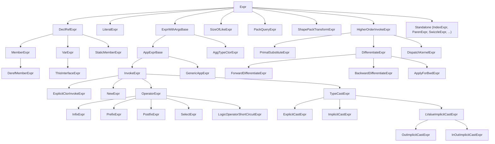

# Expressions Reference

The reference for every concrete `Expr` subclass in the Slang AST.
`Expr` itself is documented in [base.md](base.md#expr-syntaxnode).

Audience: a developer reading or modifying expression-handling code in
the parser, the checker, or the IR-lowering pipeline.

## Source

Concrete expression classes are declared in
[slang-ast-expr.h](../../../../source/slang/slang-ast-expr.h). Parsing
entry points are in
[slang-parser.cpp](../../../../source/slang/slang-parser.cpp); see
`parseExpression`, `parsePostfixExpression`, `parsePrefixExpression`,
and the precedence-climbing core `parseInfixExpressionWithPrecedence`.
Operator precedence is documented in
[../syntax-reference/grammar.md#expressions](../syntax-reference/grammar.md#expressions).

## Family hierarchy

## Nodes

| Class | Parent | Key fields | Grammar | Summary |
| --- | --- | --- | --- | --- |
| `IncompleteExpr` | `Expr` | (no additional state) | (none) | Placeholder for an expression position that the parser could not fill (after a syntax error). |
| `VarExpr` | `DeclRefExpr` | (inherits `declRef`, `name`, `scope`) | [primary](../syntax-reference/grammar.md#expressions) | A reference to a name; after lookup carries a resolved `DeclRef`. |
| `DefaultConstructExpr` | `Expr` | (no additional state) | (none) | Synthesized expression for a default-constructed value. |
| `OverloadedExpr` | `Expr` | `name: Name*`, `base: Expr*`, `lookupResult2: LookupResult` | (none) | An unresolved overload set after name lookup; collapsed by overload resolution. |
| `OverloadedExpr2` | `Expr` | `base: Expr*`, `candidateExprs: List<Expr*>` | (none) | Overload set carried as a list of candidate expressions instead of decl-refs. |
| `IntegerLiteralExpr` | `LiteralExpr` | `value: IntegerLiteralValue`, `suffixType: BaseType` | [integer literal](../syntax-reference/grammar.md#expressions) | Integer literal; suffix selects the base type. |
| `FloatingPointLiteralExpr` | `LiteralExpr` | `value: FloatingPointLiteralValue`, `suffixType: BaseType` | [float literal](../syntax-reference/grammar.md#expressions) | Floating-point literal. |
| `BoolLiteralExpr` | `LiteralExpr` | `value: bool` | [bool literal](../syntax-reference/grammar.md#expressions) | `true` or `false`. |
| `NullPtrLiteralExpr` | `LiteralExpr` | (no additional state) | [null literal](../syntax-reference/grammar.md#expressions) | `nullptr`. |
| `NoneLiteralExpr` | `LiteralExpr` | (no additional state) | [none literal](../syntax-reference/grammar.md#expressions) | `none` (empty optional). |
| `StringLiteralExpr` | `LiteralExpr` | `value: String` | [string literal](../syntax-reference/grammar.md#expressions) | String literal; concatenated runs of adjacent literals already merged. |
| `MakeArrayFromElementExpr` | `Expr` | (no additional state) | (none) | Synthesized: builds an array by replicating a single element. |
| `InitializerListExpr` | `Expr` | `args: List<Expr*>`, `useCStyleInitialization: bool` | [initializer list](../syntax-reference/grammar.md#expressions) | `{ a, b, c }` initializer list. |
| `GetArrayLengthExpr` | `Expr` | `arrayExpr: Expr*` | (none) | Synthesized: yields the length of an array expression. |
| `ExpandExpr` | `Expr` | `baseExpr: Expr*` | [pack expansion](../syntax-reference/grammar.md#expressions) | `expand E` over a type/value pack. |
| `EachExpr` | `Expr` | `baseExpr: Expr*` | [pack expansion](../syntax-reference/grammar.md#expressions) | `each E` inside an `expand`. |
| `AggTypeCtorExpr` | `ExprWithArgsBase` | `base: TypeExp`, `arguments: List<Expr*>` | (none) | Aggregate-type constructor; used internally during checking. |
| `InvokeExpr` | `AppExprBase` | `functionExpr: Expr*`, `arguments: List<Expr*>`, `argumentDelimeterLocs` | [call](../syntax-reference/grammar.md#expressions) | `f(...)`; also the post-resolution form of operator and cast expressions. |
| `ExplicitCtorInvokeExpr` | `InvokeExpr` | (inherits) | [constructor call](../syntax-reference/grammar.md#expressions) | Explicit `T(...)` constructor invocation. |
| `TryExpr` | `Expr` | `base: Expr*`, `tryClauseType` (Standard / Optional / Assert) | [try](../syntax-reference/grammar.md#expressions) | `try expr` wrapper for fallible calls. |
| `NewExpr` | `InvokeExpr` | (inherits) | [new](../syntax-reference/grammar.md#expressions) | `new T(...)`. |
| `OperatorExpr` | `InvokeExpr` | (inherits) | [operator](../syntax-reference/grammar.md#expressions) | Operator application reified as a call; abstract intermediate inferred from the source label. |
| `InfixExpr` | `OperatorExpr` | (inherits) | [infix operator](../syntax-reference/grammar.md#expressions) | Binary operator (`a + b`). |
| `PrefixExpr` | `OperatorExpr` | (inherits) | [prefix operator](../syntax-reference/grammar.md#expressions) | Unary prefix operator (`-a`, `!x`). |
| `PostfixExpr` | `OperatorExpr` | (inherits) | [postfix operator](../syntax-reference/grammar.md#expressions) | Unary postfix operator (`a++`). |
| `IndexExpr` | `Expr` | `baseExpression: Expr*`, `indexExprs: List<Expr*>` | [index](../syntax-reference/grammar.md#expressions) | `a[i]` (one or more indices). |
| `MemberExpr` | `DeclRefExpr` | `baseExpression: Expr*`, `memberOperatorLoc` | [member](../syntax-reference/grammar.md#expressions) | `a.b`. |
| `DerefMemberExpr` | `MemberExpr` | (inherits) | [pointer member](../syntax-reference/grammar.md#expressions) | `a->b`. |
| `StaticMemberExpr` | `DeclRefExpr` | `baseExpression: Expr*`, `memberOperatorLoc` | [static member](../syntax-reference/grammar.md#expressions) | `T::m` (member on a type). |
| `MatrixSwizzleExpr` | `Expr` | `base: Expr*`, `elementCount: int`, `elementCoords: MatrixCoord[4]` | (none) | Matrix swizzle (`m._m00_m11`). |
| `SwizzleExpr` | `Expr` | `base: Expr*`, `elementIndices: ShortList<uint32_t, 4>` | [swizzle](../syntax-reference/grammar.md#expressions) | Vector swizzle (`v.xyz`). |
| `MakeRefExpr` | `Expr` | `base: Expr*` | (none) | L-value to reference conversion. |
| `DerefExpr` | `Expr` | `base: Expr*` | [unary](../syntax-reference/grammar.md#expressions) | Pointer / pointer-like dereference. |
| `TypeCastExpr` | `InvokeExpr` | (inherits) | [cast](../syntax-reference/grammar.md#expressions) | Common base for type-casting expressions. |
| `ExplicitCastExpr` | `TypeCastExpr` | (inherits) | [cast](../syntax-reference/grammar.md#expressions) | `(T) e` written by the user. |
| `ImplicitCastExpr` | `TypeCastExpr` | (inherits) | (none) | Cast inserted by the checker. |
| `BuiltinCastExpr` | `Expr` | `base: Expr*` | (none) | Synthesized cast with no associated conversion function decl. |
| `LValueImplicitCastExpr` | `TypeCastExpr` | (inherits) | (none) | Implicit cast that preserves l-value-ness. |
| `OutImplicitCastExpr` | `LValueImplicitCastExpr` | (inherits) | (none) | Implicit cast applied to an `out` argument. |
| `InOutImplicitCastExpr` | `LValueImplicitCastExpr` | (inherits) | (none) | Implicit cast applied to an `inout` argument. |
| `CastToSuperTypeExpr` | `Expr` | `valueArg: Expr*`, `witnessArg: Val*` | (none) | Cast to a super-type (interface), carrying the conformance witness. |
| `IsTypeExpr` | `Expr` | `value: Expr*`, `typeExpr: TypeExp`, `witnessArg: Val*`, `constantVal: BoolLiteralExpr*` | [is](../syntax-reference/grammar.md#expressions) | `value is Type` runtime/compile-time type test. |
| `AsTypeExpr` | `Expr` | `value: Expr*`, `typeExpr: Expr*`, `witnessArg: Val*` | [as](../syntax-reference/grammar.md#expressions) | `value as Type` subtype cast. |
| `SizeOfExpr` | `SizeOfLikeExpr` | `value: Expr*`, `sizedType: Type*`, `dataLayout: Expr*` | [sizeof](../syntax-reference/grammar.md#expressions) | `sizeof(T)` / `sizeof(e)`. |
| `AlignOfExpr` | `SizeOfLikeExpr` | (inherits) | [alignof](../syntax-reference/grammar.md#expressions) | `alignof(T)`. |
| `CountOfExpr` | `SizeOfLikeExpr` | (inherits) | [countof](../syntax-reference/grammar.md#expressions) | `countof(T)` (element count of a static array). |
| `FirstExpr` | `PackQueryExpr` | `value: Expr*` | [pack query](../syntax-reference/grammar.md#expressions) | First element of a pack. |
| `LastExpr` | `PackQueryExpr` | `value: Expr*` | [pack query](../syntax-reference/grammar.md#expressions) | Last element of a pack. |
| `TrimFirstExpr` | `PackQueryExpr` | `value: Expr*` | [pack query](../syntax-reference/grammar.md#expressions) | Pack with the first element removed. |
| `TrimLastExpr` | `PackQueryExpr` | `value: Expr*` | [pack query](../syntax-reference/grammar.md#expressions) | Pack with the last element removed. |
| `ShapeConcatExpr` | `ShapePackTransformExpr` | `args: List<Expr*>` | [shape pack](../syntax-reference/grammar.md#expressions) | Concatenate shape packs. |
| `ShapePermuteExpr` | `ShapePackTransformExpr` | `args: List<Expr*>` | [shape pack](../syntax-reference/grammar.md#expressions) | Permute a shape pack. |
| `ShapeSwapExpr` | `ShapePackTransformExpr` | `args: List<Expr*>` | [shape pack](../syntax-reference/grammar.md#expressions) | Swap two shape-pack entries. |
| `ShapeReduceExpr` | `ShapePackTransformExpr` | `args: List<Expr*>` | [shape pack](../syntax-reference/grammar.md#expressions) | Reduce / fold over a shape pack. |
| `FloatBitCastExpr` | `Expr` | `value: Expr*` | [`__floatAsInt`](../syntax-reference/grammar.md#expressions) | Compile-time float-bits-as-int reinterpretation. |
| `AddressOfExpr` | `Expr` | `arg: Expr*` | [address-of](../syntax-reference/grammar.md#expressions) | `&e` (where supported). |
| `MakeOptionalExpr` | `Expr` | `value: Expr*`, `typeExpr: Expr*` | (none) | Wraps a value into an `Optional<T>` (or builds the empty optional). |
| `ModifierCastExpr` | `Expr` | `valueArg: Expr*` | (none) | Cast to the same type with different modifiers. |
| `SelectExpr` | `OperatorExpr` | (inherits) | [ternary](../syntax-reference/grammar.md#expressions) | `c ? a : b`. |
| `LogicOperatorShortCircuitExpr` | `OperatorExpr` | `flavor: Flavor` (And / Or) | [logical and-or](../syntax-reference/grammar.md#expressions) | `&&` / `\|\|` with short-circuit semantics preserved through checking. |
| `GenericAppExpr` | `AppExprBase` | `functionExpr: Expr*`, `arguments: List<Expr*>` | [generic application](../syntax-reference/grammar.md#expressions) | `g<...>` generic argument application. |
| `SharedTypeExpr` | `Expr` | `base: TypeExp` | (none) | Reused type-expression node when the same syntax represents two distinct declarations. |
| `AssignExpr` | `Expr` | `left: Expr*`, `right: Expr*` | [assignment](../syntax-reference/grammar.md#expressions) | `a = b`. |
| `ParenExpr` | `Expr` | `base: Expr*` | [parenthesized](../syntax-reference/grammar.md#expressions) | `(e)` preserved explicitly to keep rewriter output stable. |
| `TupleExpr` | `Expr` | `elements: List<Expr*>` | [tuple](../syntax-reference/grammar.md#expressions) | `(a, b, ...)` tuple construction. |
| `ThisExpr` | `Expr` | `scope: Scope*` | [this](../syntax-reference/grammar.md#expressions) | `this` of the enclosing aggregate type. |
| `ReturnValExpr` | `Expr` | `scope: Scope*` | (none) | Reference to the implicit `__return_val` for non-copyable return types. |
| `LetExpr` | `Expr` | `decl: VarDecl*`, `body: Expr*` | [let-expression](../syntax-reference/grammar.md#expressions) | `let x = ...; body` expression-form. |
| `ExtractExistentialValueExpr` | `Expr` | `declRef: DeclRef<VarDeclBase>` | (none) | Synthesized opening of an existential value (`some IFoo`). |
| `OpenRefExpr` | `Expr` | `innerExpr: Expr*` | (none) | Opens a reference value to its underlying l-value form. |
| `DetachExpr` | `Expr` | `inner: Expr*` | [no_diff](../syntax-reference/grammar.md#expressions) | Detaches an expression from a differentiation context. |
| `PrimalSubstituteExpr` | `HigherOrderInvokeExpr` | `baseFunction: Expr*` | [`__primal_subst`](../syntax-reference/grammar.md#expressions) | Selects the primal version of a function. |
| `ForwardDifferentiateExpr` | `DifferentiateExpr` | (inherits) | [`__fwd_diff`](../syntax-reference/grammar.md#expressions) | Selects the forward-mode derivative. |
| `BackwardDifferentiateExpr` | `DifferentiateExpr` | (inherits) | [`__bwd_diff`](../syntax-reference/grammar.md#expressions) | Selects the backward-mode derivative. |
| `ApplyForBwdExpr` | `DifferentiateExpr` | (inherits) | [`__apply`](../syntax-reference/grammar.md#expressions) | Selects the apply-for-backward form of a function, used in `__func_extension __apply` to expose a primal-pass-with-context companion to a custom `bwd_diff`. |
| `FuncAsTypeExpr` | `Expr` | `base: Expr*` | (none) | Treats a function expression as a type-of-function value. |
| `FuncTypeOfExpr` | `Expr` | `base: Expr*` | (none) | Yields the function type of a function-typed expression. |
| `DispatchKernelExpr` | `HigherOrderInvokeExpr` | `threadGroupSize: Expr*`, `dispatchSize: Expr*` | [`__dispatch_kernel`](../syntax-reference/grammar.md#expressions) | Host-side compute-kernel dispatch primitive. |
| `LambdaExpr` | `Expr` | `paramScopeDecl: ScopeDecl*`, `bodyStmt: Stmt*` | [lambda](../syntax-reference/grammar.md#expressions) | `(params) => { body }` lambda expression. |
| `TreatAsDifferentiableExpr` | `Expr` | `innerExpr: Expr*`, `flavor: Flavor` (NoDiff / Differentiable) | [`no_diff`](../syntax-reference/grammar.md#expressions) | Marks an inner call as differentiable or non-differentiable. |
| `ThisTypeExpr` | `Expr` | `scope: Scope*` | [This](../syntax-reference/grammar.md#types) | `This` keyword referring to the surrounding type. |
| `ThisInterfaceExpr` | `VarExpr` | (inherits) | [ThisInterface](../syntax-reference/grammar.md#types) | `ThisInterface` keyword referring to the interface itself. |
| `AndTypeExpr` | `Expr` | `left: TypeExp`, `right: TypeExp` | [conjunction type](../syntax-reference/grammar.md#types) | `T & U` conjunction-of-conformances type expression. |
| `ModifiedTypeExpr` | `Expr` | `modifiers: Modifiers`, `base: TypeExp` | [type modifier](../syntax-reference/grammar.md#types) | Type expression with modifier prefixes. |
| `PointerTypeExpr` | `Expr` | `base: TypeExp` | [pointer type](../syntax-reference/grammar.md#types) | `T*`. |
| `FuncTypeExpr` | `Expr` | `parameters: List<TypeExp>`, `result: TypeExp` | [function type](../syntax-reference/grammar.md#types) | `(T1, T2) -> R` function-type expression. |
| `TupleTypeExpr` | `Expr` | `members: List<TypeExp>` | [tuple type](../syntax-reference/grammar.md#types) | `(T1, T2, ...)` tuple-type expression. |
| `PackBranchTypeExpr` | `Expr` | `packOperand: TypeExp`, `emptyType: TypeExp`, `nonEmptyType: TypeExp` | (none) | Pack-conditional type expression. |
| `PartiallyAppliedGenericExpr` | `Expr` | `baseGenericDeclRef: DeclRef<GenericDecl>`, `knownGenericArgs: List<Val*>` | (none) | A generic applied to some but not all parameters; resolved by overload resolution. |
| `PackExpr` | `Expr` | `args: List<Expr*>` | (none) | Bundle of argument exprs matched to a pack parameter during overload resolution. |
| `SPIRVAsmExpr` | `Expr` | `insts: List<SPIRVAsmInst>` | [`spirv_asm` block](../syntax-reference/grammar.md#expressions) | Inline-SPIRV assembly expression. |

The helper struct types `SPIRVAsmOperand`, `SPIRVAsmInst`, and
`MatrixCoord` declared in the same header are *not* `Expr` subclasses
and therefore do not appear above; they are FIDDLE-tagged data
structures used as fields.

## Notable nodes

### InvokeExpr and the call / operator / cast unification

`InvokeExpr` is the post-resolution form of essentially every
"applied" syntax: explicit calls (`f(x)`), operator applications
(`a + b` arrives as an `InfixExpr` which derives from
`OperatorExpr` which derives from `InvokeExpr`), and casts
(`(T)x` arrives as `ExplicitCastExpr` which derives from
`TypeCastExpr` which derives from `InvokeExpr`). Overload resolution
treats them uniformly. The `originalFunctionExpr` field on
`AppExprBase` lets the checker remember what the user wrote before it
rewrote the function expression into a resolved decl-ref.

### OverloadedExpr and OverloadedExpr2

Name lookup can return more than one candidate; when it does, the
checker materializes the result as an `OverloadedExpr` (carrying a
`LookupResult` of decl-refs) or an `OverloadedExpr2` (carrying a list
of candidate expressions, e.g. for member-access overloads where each
candidate has a different base). Both are collapsed to a single
expression during overload resolution; if resolution fails, the
checker reports an "ambiguous" diagnostic. Neither node ever survives
into the IR.

### MemberExpr / StaticMemberExpr / DerefMemberExpr

`MemberExpr` represents `a.b` where `a` is a value; `StaticMemberExpr`
represents `T::b` where `T` is a type (or `T.b` on a type expression);
`DerefMemberExpr` represents `a->b` on pointer-like values. The
checker chooses between them by inspecting the type of the base
expression; the parser emits `MemberExpr` by default and the checker
may convert it.

### VarExpr and DeclRefExpr

After the lexer/parser, every identifier use starts life as a
`VarExpr` (which derives from `DeclRefExpr`). The `declRef` field is
filled in by lookup; until that point the node carries only `name`
and `scope`. `DeclRefExpr` is the abstract base shared by `VarExpr`,
`MemberExpr`, and `StaticMemberExpr` so the type-checker can treat
any name-resolution result uniformly.

### LiteralExpr family

`IntegerLiteralExpr`, `FloatingPointLiteralExpr`, `BoolLiteralExpr`,
`NullPtrLiteralExpr`, `NoneLiteralExpr`, and `StringLiteralExpr`
share `LiteralExpr` as a base. The base stores the originating
`Token` (so the source text and suffix are recoverable) and the
parsed `suffixType`. Adjacent string literals are merged at lex time
into a single `StringLiteralExpr` (see [tokens.md](../syntax-reference/tokens.md)).

### PartiallyAppliedGenericExpr

A consequence of Slang's two-stage parsing: `f<T>` can appear inside
an expression and the parser cannot tell whether it is a generic
application (yielding a `GenericAppExpr`) or a relational comparison.
When the parser commits to "generic application" but only some
parameters are explicitly supplied, the result is a
`PartiallyAppliedGenericExpr`; overload resolution fills in the rest
during checking.

### Differentiate-family expressions

`PrimalSubstituteExpr`, `ForwardDifferentiateExpr`,
`BackwardDifferentiateExpr`, and `DispatchKernelExpr` all derive from
`HigherOrderInvokeExpr`, signaling that they take a callable as their
primary operand. They are entry points for the autodiff machinery
described in [../pipeline/05-ir-passes.md](../pipeline/05-ir-passes.md);
the checker resolves which derivative variant to invoke.

### AsTypeExpr / IsTypeExpr / CastToSuperTypeExpr

These three expressions carry compile-time evidence in the form of a
`witnessArg: Val*` that establishes a subtype relationship. They are
the AST counterparts of the IR existential opcodes documented in
[../cross-cutting/ir-instructions.md](../cross-cutting/ir-instructions.md).
The `witnessArg` is populated by the checker; the parser leaves it
null.

### LambdaExpr and LambdaDecl

A lambda expression parses into a `LambdaExpr` plus a synthesized
`LambdaDecl` (see [declarations.md](declarations.md)). The
`LambdaDecl` carries the captured environment as a struct, and the
`LambdaExpr::bodyStmt` is the parser-built body that will be turned
into the lambda's function-body during checking.

### Type-expression family (PointerTypeExpr, FuncTypeExpr, TupleTypeExpr, AndTypeExpr, ModifiedTypeExpr, ThisTypeExpr)

These nodes are `Expr` subclasses even though they describe types,
because Slang parses type expressions through the same recursive
descent as value expressions and only resolves them to `Type` values
(see [types.md](types.md)) during checking. Each one wraps `TypeExp`
operands, which themselves bundle "expression as written" and
"resolved type" so the checker can produce both diagnostics and
canonical type identity.

## See also

- [base.md](base.md) — `Expr` base class fields (`type: QualType`,
  `checked`).
- [statements.md](statements.md) — `ExpressionStmt`, which wraps an
  `Expr` to use it as a statement.
- [types.md](types.md) — the `Type` family that type-expression nodes
  resolve to.
- [values.md](values.md) — `Witness` family that backs `witnessArg`
  on `IsTypeExpr` / `AsTypeExpr` / `CastToSuperTypeExpr`.
- [../pipeline/02-parse-ast.md](../pipeline/02-parse-ast.md) —
  expression parser and the two-stage-parsing handling of `<`.
- [../pipeline/03-semantic-check.md](../pipeline/03-semantic-check.md)
  — overload resolution, implicit cast insertion.
- [../pipeline/04-ast-to-ir.md](../pipeline/04-ast-to-ir.md) — how
  these expressions are lowered to IR instructions.
- [../syntax-reference/grammar.md#expressions](../syntax-reference/grammar.md#expressions)
  — operator precedence and the surface syntax.
