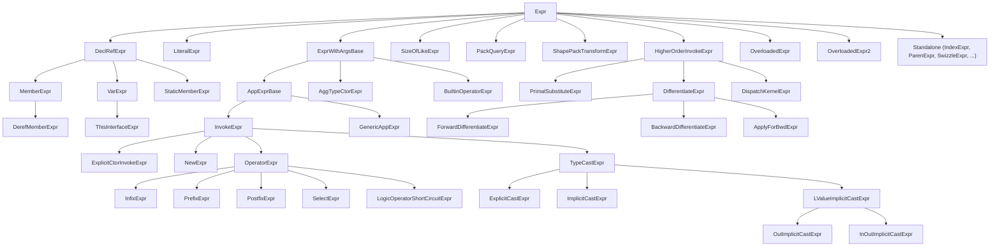

# Expressions Reference

The reference for every concrete `Expr` subclass in the Slang AST,
written for a developer reading or modifying expression-handling code
in the parser, the checker, or the IR-lowering pipeline. `Expr` itself
is *not* declared in the expression header: it lives in
[slang-ast-base.h](../../../../source/slang/slang-ast-base.h) and is
documented in [base.md](base.md#expr-syntaxnode).

## Source

Concrete expression classes are declared in
[slang-ast-expr.h](../../../../source/slang/slang-ast-expr.h), which
derives them all from the `Expr` base in
[slang-ast-base.h](../../../../source/slang/slang-ast-base.h). Parsing
entry points are in
[slang-parser.cpp](../../../../source/slang/slang-parser.cpp): the
public entry is `Parser::ParseExpression`, which delegates to the
precedence-climbing core `parseInfixExprWithPrecedence` and then down
through `parsePrefixExpr`, `parsePostfixExpr`, and `parseAtomicExpr`.
Many nodes are not reached through the operator ladder at all but
through the keyword-expression table built from `_makeParseExpr`
entries (`this`, `try`, `sizeof`, `__getAddress`, ...), which maps a
keyword to a dedicated parse callback. Operator precedence is
documented in
[../syntax-reference/grammar.md#expressions](../syntax-reference/grammar.md#expressions).

## Family hierarchy

```mermaid
flowchart TD
  Expr --> DeclRefExpr
  Expr --> LiteralExpr
  Expr --> ExprWithArgsBase
  Expr --> SizeOfLikeExpr
  Expr --> PackQueryExpr
  Expr --> ShapePackTransformExpr
  Expr --> HigherOrderInvokeExpr
  Expr --> OverloadedExpr
  Expr --> OverloadedExpr2
  Expr --> OtherExpr["Standalone (IndexExpr, ParenExpr, SwizzleExpr, ...)"]
  DeclRefExpr --> VarExpr
  DeclRefExpr --> MemberExpr
  DeclRefExpr --> StaticMemberExpr
  MemberExpr --> DerefMemberExpr
  VarExpr --> ThisInterfaceExpr
  ExprWithArgsBase --> AppExprBase
  ExprWithArgsBase --> AggTypeCtorExpr
  ExprWithArgsBase --> BuiltinOperatorExpr
  AppExprBase --> InvokeExpr
  AppExprBase --> GenericAppExpr
  InvokeExpr --> ExplicitCtorInvokeExpr
  InvokeExpr --> NewExpr
  InvokeExpr --> OperatorExpr
  InvokeExpr --> TypeCastExpr
  OperatorExpr --> InfixExpr
  OperatorExpr --> PrefixExpr
  OperatorExpr --> PostfixExpr
  OperatorExpr --> SelectExpr
  OperatorExpr --> LogicOperatorShortCircuitExpr
  TypeCastExpr --> ExplicitCastExpr
  TypeCastExpr --> ImplicitCastExpr
  TypeCastExpr --> LValueImplicitCastExpr
  LValueImplicitCastExpr --> OutImplicitCastExpr
  LValueImplicitCastExpr --> InOutImplicitCastExpr
  HigherOrderInvokeExpr --> PrimalSubstituteExpr
  HigherOrderInvokeExpr --> DifferentiateExpr
  HigherOrderInvokeExpr --> DispatchKernelExpr
  DifferentiateExpr --> ForwardDifferentiateExpr
  DifferentiateExpr --> BackwardDifferentiateExpr
  DifferentiateExpr --> ApplyForBwdExpr
```

## Nodes

| Class | Parent | Key fields | Grammar | Summary |
| --- | --- | --- | --- | --- |
| `IncompleteExpr` | `Expr` | (no additional state) | (none) | Placeholder for an expression position that the parser could not fill (after a syntax error). |
| `VarExpr` | `DeclRefExpr` | (inherits `declRef`, `name`, `scope`) | [primary](../syntax-reference/grammar.md#expressions) | A reference to a name; after lookup carries a resolved `DeclRef`. |
| `DefaultConstructExpr` | `Expr` | (no additional state) | (none) | Synthesized expression for a default-constructed value. |
| `OverloadedExpr` | `Expr` | `name: Name*`, `base: Expr*`, `lookupResult2: LookupResult` | (none) | An unresolved overload set after name lookup; collapsed by overload resolution. |
| `OverloadedExpr2` | `Expr` | `base: Expr*`, `candidateExprs: List<Expr*>` | (none) | Overload set carried as a list of candidate expressions instead of decl-refs. |
| `IntegerLiteralExpr` | `LiteralExpr` | `value: IntegerLiteralValue`, `signedMinimumIntException: bool` (plus inherited `suffixType: BaseType`) | [integer literal](../syntax-reference/grammar.md#literal-forms-vs-token-kinds) | Integer literal; suffix and magnitude select the base type. |
| `FloatingPointLiteralExpr` | `LiteralExpr` | `value: FloatingPointLiteralValue` (plus inherited `suffixType: BaseType`) | [float literal](../syntax-reference/grammar.md#literal-forms-vs-token-kinds) | Floating-point literal; `value` is the value as written, not rounded to `suffixType`. |
| `BoolLiteralExpr` | `LiteralExpr` | `value: bool` | [bool literal](../syntax-reference/grammar.md#literal-forms-vs-token-kinds) | `true` or `false`. |
| `NullPtrLiteralExpr` | `LiteralExpr` | (no additional state) | [null literal](../syntax-reference/grammar.md#literal-forms-vs-token-kinds) | `nullptr`. |
| `NoneLiteralExpr` | `LiteralExpr` | (no additional state) | [none literal](../syntax-reference/grammar.md#literal-forms-vs-token-kinds) | `none` (empty optional). |
| `StringLiteralExpr` | `LiteralExpr` | `value: String` | [string literal](../syntax-reference/grammar.md#literal-forms-vs-token-kinds) | String literal; concatenated runs of adjacent literals already merged. |
| `MakeArrayFromElementExpr` | `Expr` | (no additional state) | (none) | Synthesized: builds an array by replicating a single element. |
| `InitializerListExpr` | `Expr` | `args: List<Expr*>`, `useCStyleInitialization: bool` | [initializer list](../syntax-reference/grammar.md#expressions) | `{ a, b, c }` initializer list. |
| `GetArrayLengthExpr` | `Expr` | `arrayExpr: Expr*` | (none) | Synthesized: yields the length of an array expression. |
| `ExpandExpr` | `Expr` | `baseExpr: Expr*` | [pack expansion](../syntax-reference/grammar.md#types) | `expand E` over a type/value pack. |
| `EachExpr` | `Expr` | `baseExpr: Expr*` | [pack expansion](../syntax-reference/grammar.md#types) | `each E` inside an `expand`. |
| `AggTypeCtorExpr` | `ExprWithArgsBase` | `base: TypeExp`, `arguments: List<Expr*>` | (none) | Aggregate-type constructor; declared with checker support but no construction site (see the note below the table). |
| `BuiltinOperatorExpr` | `ExprWithArgsBase` | `op: BuiltinOperationKind`, `arguments: List<Expr*>` | (none) | Synthesized builtin operator on scalar/vector/matrix operands; carries the resolved operation kind directly (1 unary or 2 operands). |
| `InvokeExpr` | `AppExprBase` | `functionExpr: Expr*`, `arguments: List<Expr*>`, `argumentDelimeterLocs` | [call](../syntax-reference/grammar.md#expressions) | `f(...)`; also the post-resolution form of operator and cast expressions. |
| `ExplicitCtorInvokeExpr` | `InvokeExpr` | (inherits) | (none) | Synthesized constructor call; the marker tells the checker not to re-read a one-argument `T(x)` as a type coercion. |
| `TryExpr` | `Expr` | `base: Expr*`, `tryClauseType` (Standard / Optional / Assert) | [try](../syntax-reference/grammar.md#expressions) | `try expr` wrapper for fallible calls. |
| `NewExpr` | `InvokeExpr` | (inherits) | [new](../syntax-reference/grammar.md#expressions) | `new T(...)`. |
| `OperatorExpr` | `InvokeExpr` | (inherits) | [operator](../syntax-reference/grammar.md#expressions) | Operator application reified as a call; shared base for the infix, prefix, postfix, select, and short-circuit operator forms. |
| `InfixExpr` | `OperatorExpr` | (inherits) | [infix operator](../syntax-reference/grammar.md#expressions) | Binary operator (`a + b`). |
| `PrefixExpr` | `OperatorExpr` | (inherits) | [prefix operator](../syntax-reference/grammar.md#expressions) | Unary prefix operator (`-a`, `!x`). |
| `PostfixExpr` | `OperatorExpr` | (inherits) | [postfix operator](../syntax-reference/grammar.md#expressions) | Unary postfix operator (`a++`). |
| `IndexExpr` | `Expr` | `baseExpression: Expr*`, `indexExprs: List<Expr*>` | [index](../syntax-reference/grammar.md#expressions) | `a[i]` (one or more indices). |
| `MemberExpr` | `DeclRefExpr` | `baseExpression: Expr*`, `memberOperatorLoc` | [member](../syntax-reference/grammar.md#expressions) | `a.b`. |
| `DerefMemberExpr` | `MemberExpr` | (inherits) | [pointer member](../syntax-reference/grammar.md#expressions) | `a->b`. |
| `StaticMemberExpr` | `DeclRefExpr` | `baseExpression: Expr*`, `memberOperatorLoc` | [static member](../syntax-reference/grammar.md#expressions) | `T::m` (member on a type). |
| `MatrixSwizzleExpr` | `Expr` | `base: Expr*`, `elementCount: int`, `elementCoords: MatrixCoord[4]` | (none) | Matrix swizzle (`m._m00_m11`). |
| `SwizzleExpr` | `Expr` | `base: Expr*`, `elementIndices: ShortList<uint32_t, 4>` | (none) | Vector swizzle (`v.xyz`); the checker rewrites a `MemberExpr` on a vector into this. |
| `MakeRefExpr` | `Expr` | `base: Expr*` | (none) | L-value to reference conversion. |
| `DerefExpr` | `Expr` | `base: Expr*` | (none) | Pointer / pointer-like dereference; synthesized (a written `*p` parses as a `PrefixExpr`). |
| `TypeCastExpr` | `InvokeExpr` | (inherits) | [cast](../syntax-reference/grammar.md#expressions) | Common base for type-casting expressions. |
| `ExplicitCastExpr` | `TypeCastExpr` | (inherits) | [cast](../syntax-reference/grammar.md#expressions) | `(T) e` written by the user. |
| `ImplicitCastExpr` | `TypeCastExpr` | (inherits) | (none) | Cast inserted by the checker. |
| `BuiltinCastExpr` | `Expr` | `base: Expr*` | (none) | Synthesized cast with no associated conversion function decl. |
| `LValueImplicitCastExpr` | `TypeCastExpr` | (inherits) | (none) | Implicit cast that preserves l-value-ness. |
| `OutImplicitCastExpr` | `LValueImplicitCastExpr` | (inherits) | (none) | Implicit cast applied to an `out` argument. |
| `InOutImplicitCastExpr` | `LValueImplicitCastExpr` | (inherits) | (none) | Implicit cast applied to an `inout` argument. |
| `CastToSuperTypeExpr` | `Expr` | `valueArg: Expr*`, `witnessArg: Val*` | (none) | Cast to a super-type (interface), carrying the conformance witness. |
| `IsTypeExpr` | `Expr` | `value: Expr*`, `typeExpr: TypeExp`, `witnessArg: Val*`, `constantVal: BoolLiteralExpr*` | [is](../syntax-reference/grammar.md#expressions) | `value is Type` runtime/compile-time type test. |
| `AsTypeExpr` | `Expr` | `value: Expr*`, `typeExpr: Expr*`, `witnessArg: Val*` | [as](../syntax-reference/grammar.md#expressions) | `value as Type` subtype cast. |
| `SizeOfExpr` | `SizeOfLikeExpr` | `value: Expr*`, `sizedType: Type*`, `dataLayout: Expr*` | [sizeof](../syntax-reference/grammar.md#expressions) | `sizeof(e)`; the operand is an expression (a type name parses as one) and an optional second argument selects the data layout (see the note below the table). |
| `AlignOfExpr` | `SizeOfLikeExpr` | (inherits) | [alignof](../syntax-reference/grammar.md#expressions) | `alignof(e)`, same operand shape as `sizeof`. |
| `CountOfExpr` | `SizeOfLikeExpr` | (inherits) | [countof](../syntax-reference/grammar.md#expressions) | `countof(e)` (element count of an array or pack); takes a single operand, no data-layout argument. |
| `FirstExpr` | `PackQueryExpr` | `value: Expr*` | [pack query](../syntax-reference/grammar.md#expressions) | First element of a pack. |
| `LastExpr` | `PackQueryExpr` | `value: Expr*` | [pack query](../syntax-reference/grammar.md#expressions) | Last element of a pack. |
| `TrimFirstExpr` | `PackQueryExpr` | `value: Expr*` | [pack query](../syntax-reference/grammar.md#expressions) | Pack with the first element removed. |
| `TrimLastExpr` | `PackQueryExpr` | `value: Expr*` | [pack query](../syntax-reference/grammar.md#expressions) | Pack with the last element removed. |
| `ShapeConcatExpr` | `ShapePackTransformExpr` | `args: List<Expr*>` | [shape pack](../syntax-reference/grammar.md#expressions) | Concatenate shape packs. |
| `ShapePermuteExpr` | `ShapePackTransformExpr` | `args: List<Expr*>` | [shape pack](../syntax-reference/grammar.md#expressions) | Permute a shape pack. |
| `ShapeSwapExpr` | `ShapePackTransformExpr` | `args: List<Expr*>` | [shape pack](../syntax-reference/grammar.md#expressions) | Swap two shape-pack entries. |
| `ShapeReduceExpr` | `ShapePackTransformExpr` | `args: List<Expr*>` | [shape pack](../syntax-reference/grammar.md#expressions) | Reduce / fold over a shape pack. |
| `FloatBitCastExpr` | `Expr` | `value: Expr*` | [`__floatAsInt`](../syntax-reference/grammar.md#expressions) | Compile-time float-bits-as-int reinterpretation. |
| `AddressOfExpr` | `Expr` | `arg: Expr*` | [`__getAddress`](../syntax-reference/grammar.md#expressions) | `__getAddress(e)`; a written `&e` parses as a `PrefixExpr` instead. |
| `MakeOptionalExpr` | `Expr` | `value: Expr*`, `typeExpr: Expr*` | (none) | Wraps a value into an `Optional<T>` (or builds the empty optional). |
| `CastOptionalExpr` | `Expr` | `valueArg: Expr*`, `innerVarDecl: VarDecl*`, `innerCoercedExpr: Expr*` | (none) | Synthesized coercion from `Optional<T>` to `Optional<U>` when `T` converts to `U`. |
| `ModifierCastExpr` | `Expr` | `valueArg: Expr*` | (none) | Cast to the same type with different modifiers. |
| `SelectExpr` | `OperatorExpr` | (inherits) | [ternary](../syntax-reference/grammar.md#expressions) | `c ? a : b`. |
| `LogicOperatorShortCircuitExpr` | `OperatorExpr` | `flavor: Flavor` (And / Or) | (none) | Checker rewrite of the `&&` / `\|\|` `InfixExpr` that preserves short-circuit semantics. |
| `GenericAppExpr` | `AppExprBase` | `functionExpr: Expr*`, `arguments: List<Expr*>` | [generic application](../syntax-reference/grammar.md#expressions) | `g<...>` generic argument application. |
| `SharedTypeExpr` | `Expr` | `base: TypeExp` | [declarator list](../syntax-reference/grammar.md#variable--binding-declarations) | One type-expression node shared by several declarations, e.g. the `int` of `int a, b;`. |
| `AssignExpr` | `Expr` | `left: Expr*`, `right: Expr*` | [assignment](../syntax-reference/grammar.md#expressions) | `a = b`. |
| `ParenExpr` | `Expr` | `base: Expr*` | [parenthesized](../syntax-reference/grammar.md#expressions) | `(e)` preserved explicitly to keep rewriter output stable. |
| `TupleExpr` | `Expr` | `elements: List<Expr*>` | [tuple](../syntax-reference/grammar.md#expressions) | `()` or `(a, b, ...)` tuple construction; parsed only at language version 2026 or later (`-std 2026`), below which a `,` inside parentheses stays the comma operator. |
| `ThisExpr` | `Expr` | `scope: Scope*` | [this](../syntax-reference/grammar.md#expressions) | `this` of the enclosing aggregate type. |
| `ReturnValExpr` | `Expr` | `scope: Scope*` | [`__return_val`](../syntax-reference/grammar.md#expressions) | Reference to the implicit `__return_val` for non-copyable return types. |
| `LetExpr` | `Expr` | `decl: VarDecl*`, `body: Expr*` | (none) | Synthesized `let x = ...` binding wrapping a sub-expression; there is no surface let-expression syntax. |
| `ExtractExistentialValueExpr` | `Expr` | `declRef: DeclRef<VarDeclBase>` | (none) | Synthesized opening of an existential value (`some IFoo`). |
| `OpenRefExpr` | `Expr` | `innerExpr: Expr*` | (none) | Opens a reference value to its underlying l-value form. |
| `DetachExpr` | `Expr` | `inner: Expr*` | (none) | Synthesized during conversion to detach a value from a differentiation context. |
| `PrimalSubstituteExpr` | `HigherOrderInvokeExpr` | `baseFunction: Expr*` | (none) | Selects the primal version of a function; declared with checker support but no construction site (see the note below the table). |
| `ForwardDifferentiateExpr` | `DifferentiateExpr` | (inherits) | [`__fwd_diff`](../syntax-reference/grammar.md#expressions) | Selects the forward-mode derivative. |
| `BackwardDifferentiateExpr` | `DifferentiateExpr` | (inherits) | [`__bwd_diff`](../syntax-reference/grammar.md#expressions) | Selects the backward-mode derivative. |
| `ApplyForBwdExpr` | `DifferentiateExpr` | (inherits) | [`__apply`](../syntax-reference/grammar.md#expressions) | Selects the apply-for-backward form of a function, used in `__func_extension __apply` to expose a primal-pass-with-context companion to a custom `bwd_diff`. |
| `FuncAsTypeExpr` | `Expr` | `base: Expr*` | [`__func_as_type`](../syntax-reference/grammar.md#types) | Treats a function expression as a type-of-function value. |
| `FuncTypeOfExpr` | `Expr` | `base: Expr*` | (none) | Yields the function type of a function-typed expression; declared with checker support but no construction site (see the note below the table). |
| `DispatchKernelExpr` | `HigherOrderInvokeExpr` | `threadGroupSize: Expr*`, `dispatchSize: Expr*` | [`__dispatch_kernel`](../syntax-reference/grammar.md#expressions) | Host-side compute-kernel dispatch primitive. |
| `LambdaExpr` | `Expr` | `paramScopeDecl: ScopeDecl*`, `bodyStmt: Stmt*` | [lambda](../syntax-reference/grammar.md#expressions) | `(params) => body` lambda; the body is a block or a single expression. |
| `TreatAsDifferentiableExpr` | `Expr` | `innerExpr: Expr*`, `flavor: Flavor` (NoDiff / Differentiable) | [`no_diff`](../syntax-reference/grammar.md#expressions) | Marks an inner call as differentiable or non-differentiable. |
| `ThisTypeExpr` | `Expr` | `scope: Scope*` | (none) | Type expression for `This`; declared with visitor support but no construction site — a written `This` parses as an ordinary `VarExpr` named `This` (see the note below the table). |
| `ThisInterfaceExpr` | `VarExpr` | (inherits) | (none) | Parser-synthesized stand-in for the enclosing `interface` type in the `This : IFoo` constraint of an interface default implementation. |
| `AndTypeExpr` | `Expr` | `left: TypeExp`, `right: TypeExp` | [conjunction type](../syntax-reference/grammar.md#types) | `T & U` conjunction-of-conformances type expression. |
| `ModifiedTypeExpr` | `Expr` | `modifiers: Modifiers`, `base: TypeExp` | [type modifier](../syntax-reference/grammar.md#types) | Type expression with modifier prefixes. |
| `PointerTypeExpr` | `Expr` | `base: TypeExp` | [pointer type](../syntax-reference/grammar.md#types) | `T*`. |
| `FuncTypeExpr` | `Expr` | `parameters: List<TypeExp>`, `result: TypeExp` | [function type](../syntax-reference/grammar.md#types) | `functype(T1, T2) -> R` function-type expression; the `functype` keyword is part of the spelling. |
| `TupleTypeExpr` | `Expr` | `members: List<TypeExp>` | (none) | `(T1, T2, ...)` tuple-type expression; no type position spells it at this commit (see the type-expression callout). |
| `PackBranchTypeExpr` | `Expr` | `packOperand: TypeExp`, `emptyType: TypeExp`, `nonEmptyType: TypeExp` | [`__packBranch`](../syntax-reference/grammar.md#expressions) | Pack-conditional type expression; parsed from the `__packBranch` keyword expression. |
| `PartiallyAppliedGenericExpr` | `Expr` | `baseGenericDeclRef: DeclRef<GenericDecl>`, `providedOrdinaryArgs: List<Val*>` | (none) | A generic applied to some but not all parameters; resolved by overload resolution. |
| `PackExpr` | `Expr` | `args: List<Expr*>` | (none) | Bundle of argument exprs matched to a pack parameter during overload resolution. |
| `SPIRVAsmExpr` | `Expr` | `insts: List<SPIRVAsmInst>` | [`spirv_asm` block](../syntax-reference/grammar.md#expressions) | Inline-SPIRV assembly expression. |

The helper struct types `SPIRVAsmOperand`, `SPIRVAsmInst`, and
`MatrixCoord` declared in the same header are *not* `Expr` subclasses
and therefore do not appear above; they are FIDDLE-tagged data
structures used as fields.

Four classes in the table — `AggTypeCtorExpr`, `FuncTypeOfExpr`,
`ThisTypeExpr`, and `PrimalSubstituteExpr` — are declared and carry
checker/visitor entries, but nothing under `source/` constructs one at
this commit. They are listed for completeness; treat their descriptions
as the intent recorded in the header rather than as behavior a reader
can observe in a compile.

The optional second argument that `sizeof` and `alignof` accept after a
comma names a type implementing `IBufferDataLayout`; the implementations
declared in
[hlsl.meta.slang](../../../../source/slang/hlsl.meta.slang) are
`DefaultDataLayout`, `DefaultPushConstantDataLayout`,
`Std140DataLayout`, `Std430DataLayout`, `ScalarDataLayout`, and
`CDataLayout`. Omitting the argument selects the scalar layout, so
`sizeof(S)` and `sizeof(S, ScalarDataLayout)` report the same size while
`sizeof(S, Std140DataLayout)` need not. `countof` parses no such
argument.

## Notable nodes

### InvokeExpr and the call / operator / cast unification

`InvokeExpr` is the post-resolution form of essentially every
"applied" syntax: explicit calls (`f(x)`), operator applications
(`a + b` arrives as an `InfixExpr` which derives from
`OperatorExpr` which derives from `InvokeExpr`), and casts
(`(T)x` arrives as `ExplicitCastExpr` which derives from
`TypeCastExpr` which derives from `InvokeExpr`). Overload resolution
treats them uniformly. The `originalFunctionExpr` field on
`AppExprBase` lets the checker remember what the user wrote before it
rewrote the function expression into a resolved decl-ref.

### BuiltinOperatorExpr

`OperatorExpr` (and its `InfixExpr` / `PrefixExpr` / `PostfixExpr`
subclasses) is the post-parse form of `a OP b`, treated as a generic
`operator OP` call. When the checker's fast path
(`convertToBuiltinArithmeticOp`) recognizes that the operands are
builtin integer/floating-point/bool scalars, vectors, or
matrices, it instead produces a `BuiltinOperatorExpr` that stores the
resolved [`BuiltinOperationKind`](base.md) (`Add`, `Less`, ...)
directly. Because the operator-name → kind mapping happens exactly
once at creation, every downstream consumer — constant folding via
`BuiltinOperationIntVal` (see [values.md](values.md)), IR lowering,
and for-loop trip-count inference — reads the `op` field rather than
re-parsing an operator name. `arguments` holds one operand for a unary
operator or two for a binary one.

### OverloadedExpr and OverloadedExpr2

Name lookup can return more than one candidate; when it does, the
checker materializes the result as an `OverloadedExpr` (carrying a
`LookupResult` of decl-refs) or an `OverloadedExpr2` (carrying a list
of candidate expressions, e.g. for member-access overloads where each
candidate has a different base). Both are collapsed to a single
expression during overload resolution; if resolution fails, the
checker reports either a no-applicable-overload diagnostic or an
ambiguity diagnostic, depending on why it failed. Neither node ever survives
into the IR.

### MemberExpr / StaticMemberExpr / DerefMemberExpr

`MemberExpr` represents `a.b` where `a` is a value; `StaticMemberExpr`
represents `T::b` where `T` is a type (or `T.b` on a type expression);
`DerefMemberExpr` represents `a->b` on pointer-like values. The
parser already distinguishes the three surface forms: it emits
`StaticMemberExpr` for `::`, `MemberExpr` for `.`, and
`DerefMemberExpr` for `->`. Checking can additionally synthesize or
reinterpret a member access when the base resolves to a type-valued
expression — a `.` access on a vector, for example, becomes a
`SwizzleExpr` or `MatrixSwizzleExpr` rather than staying a
`MemberExpr`. The member name after `::` is read by
`ParseStaticMemberName`, which has one special case: `__subscript`
followed by another `::`, as in `Type::__subscript::get`, is
translated to the `operator[]` name that `SubscriptDecl` is registered
under, while a bare `Type::__subscript(...)` keeps the literal
identifier.

### VarExpr and DeclRefExpr

After the lexer/parser, every bare (unqualified) name expression starts
life as a `VarExpr` (which derives from `DeclRefExpr`); a name in member
position after `.`, `->`, or `::` is parsed straight into a
`MemberExpr`, `DerefMemberExpr`, or `StaticMemberExpr` instead. The
`declRef` field is
filled in by lookup; until that point the node carries only `name`
and `scope`. `DeclRefExpr` is the abstract base shared by `VarExpr`,
`MemberExpr`, and `StaticMemberExpr` so the type-checker can treat
any name-resolution result uniformly.

### LiteralExpr family

`IntegerLiteralExpr`, `FloatingPointLiteralExpr`, `BoolLiteralExpr`,
`NullPtrLiteralExpr`, `NoneLiteralExpr`, and `StringLiteralExpr`
share `LiteralExpr` as a base. The numeric, character, and string
literal paths store the originating `Token` on the base (so the source
text and suffix are recoverable) along with the parsed `suffixType`;
the keyword literals `true`, `false`, `nullptr`, and `none` are built
by keyword callbacks that record only the source location, leaving the
inherited token field unset. Adjacent string literals are merged during
expression parsing — after lexing produces adjacent string-literal
tokens — into a single `StringLiteralExpr` (see [tokens.md](../syntax-reference/tokens.md)).

Two details of numeric literals are easy to get wrong. First, a
`FloatingPointLiteralExpr` holds the value as written:
`parseFloatingPointLiteralExpr` asks `getFloatingPointLiteralValue` for
a `FloatingPointLiteralType` classification of the suffix (`Half`,
`Float`, `Double`, or the error kinds `BadSignificand` / `BadSuffix`),
maps it to `suffixType`, and stores the returned value unchanged — the
parser itself no longer rounds or clamps. When that helper reports
`isOutOfRange` or `precisionLost` the parser diagnoses it:
`float-literal-unrepresentable` (40009) for an over-range magnitude,
`float-literal-too-small` (40010) for an under-range one, and
`float-hex-literal-precision-lost` (40019) for a truncated hex
significand. All three are *warnings*, so the compile continues and the
already-converted value is what lands in `value` — `1e50f` warns and
stores `inf`. Second, a leading `-` or `+` is a
prefix operator, not part of the literal token, so `parsePrefixExpr`
folds the sign into a *copy* of the literal node; the
`signedMinimumIntException` flag on `IntegerLiteralExpr` exists so that
`-2147483648` and `-9223372036854775808` can be re-typed as `Int` /
`Int64` after that fold instead of being diagnosed as too large.

### PartiallyAppliedGenericExpr

This node is produced by overload checking, not by the parser. The
parser builds a `GenericAppExpr` for `f<...>` generic-application
syntax (`parseGenericApp` in
[slang-parser.cpp](../../../../source/slang/slang-parser.cpp)). When
overload resolution finds a generic candidate flagged
`IsPartiallyAppliedGeneric` — applied to fewer arguments than the
generic declares — it rewrites that candidate into a
`PartiallyAppliedGenericExpr`, preserving the explicitly supplied
ordinary-argument prefix and deferring inference of the remaining
arguments to a later pass.

### Differentiate-family expressions

`ForwardDifferentiateExpr`, `BackwardDifferentiateExpr`,
`ApplyForBwdExpr`, and `PrimalSubstituteExpr` all derive from
`HigherOrderInvokeExpr`, signaling that they take a callable as their
primary operand. The first three are parsed from the `fwd_diff` /
`__fwd_diff`, `bwd_diff` / `__bwd_diff`, and `__apply` keyword
expressions and are entry points for the autodiff machinery described
in [../pipeline/05-ir-passes.md](../pipeline/05-ir-passes.md);
`PrimalSubstituteExpr` has a checker visitor but no keyword and no
construction site. `DispatchKernelExpr` is
also a `HigherOrderInvokeExpr`, but it is unrelated to autodiff: it is
the host-side compute-kernel dispatch primitive
(`__dispatch_kernel(fn, threadGroupSize, dispatchSize)`).

### AsTypeExpr / IsTypeExpr / CastToSuperTypeExpr

These three expressions carry compile-time evidence in the form of a
`witnessArg: Val*` that establishes a subtype relationship. They are
the AST counterparts of the IR existential opcodes documented in
[../cross-cutting/ir-instructions.md](../cross-cutting/ir-instructions.md).
The `witnessArg` is populated by the checker; the parser leaves it
null.

### CastOptionalExpr

`CastOptionalExpr` is the implicit coercion from `Optional<T>` to
`Optional<U>` when `T` itself converts to `U`, and it is synthesized
only by conversion checking — there is no syntax for it. Its shape is
unusual because the conversion has to be applied to a value that may
not exist: `valueArg` is the source `Optional<T>`, `innerVarDecl` is a
synthetic `VarDecl` of type `T` that stands for the unwrapped value,
and `innerCoercedExpr` is the ordinary `T`-to-`U` coercion expression
built against that placeholder. How that shape is turned into code is
described in [../pipeline/04-ast-to-ir.md](../pipeline/04-ast-to-ir.md).
Any assignment or argument passing that puts an `Optional<T>` value
where an `Optional<U>` is wanted synthesizes it, provided the checker
would accept the bare `T`-to-`U` conversion on its own: it probes that
inner conversion with the ordinary coercion machinery and builds the
node only if the probe succeeds. Both a numeric conversion
(`Optional<int>` to `Optional<float>`) and an up-cast to an interface
(`Optional<Square>` to `Optional<IShape>`, for `Square : IShape`)
qualify.

### LambdaExpr and LambdaDecl

`parseLambdaExpr` produces only the `LambdaExpr`: the parameters go
into a fresh `ScopeDecl` (`paramScopeDecl`) parsed with the ordinary
`ParseParameter` syntax, and `bodyStmt` holds either the `{ ... }`
block or, for the single-expression form `(x) => x + 1`, a synthesized
`ReturnStmt` wrapping that expression, so `(int x) => { return x + 1; }`
and `(int x) => x + 1` build the same shape. There is no bare-identifier
parameter form — the parameter list always has parentheses, and the
lambda is recognized only when a balanced parenthesized group is
followed by `=>`, so in `x => x + 1` the bare `x` parses as an ordinary
expression and the `=>` after it is a parse error. The
closure struct `LambdaDecl` (see [declarations.md](declarations.md)),
which carries the captured environment, is created later by the
checker, not by the parser.

### Type-expression family (PointerTypeExpr, FuncTypeExpr, TupleTypeExpr, AndTypeExpr, ModifiedTypeExpr, PackBranchTypeExpr)

These nodes are `Expr` subclasses even though they describe types,
because Slang parses type expressions through the same recursive
descent as value expressions and only resolves them to `Type` values
(see [types.md](types.md)) during checking. Each one wraps `TypeExp`
operands, which themselves bundle "expression as written" and
"resolved type" so the checker can produce both diagnostics and
canonical type identity. Not every type keyword gets its own node: a
written `This` is parsed as a plain `VarExpr` whose name is `This` and
resolved by lookup, so the `ThisTypeExpr` class in the header is not
what a `This` in source becomes.

The surface spellings differ per node. `PointerTypeExpr` comes from a
`*` suffix on a type and `AndTypeExpr` from an infix `&`, both parsed as
type suffixes; `ModifiedTypeExpr` wraps a type written with modifier
prefixes; `PackBranchTypeExpr` is parsed from the `__packBranch` keyword
expression; and `FuncTypeExpr` requires the `functype` keyword —
`functype(T1, T2) -> R`, the form the callback parameters in
[hlsl.meta.slang](../../../../source/slang/hlsl.meta.slang) use (e.g.
`functype(T, T) -> T combineOp`). `TupleTypeExpr` is the exception: its
parser function and the type-specifier branch that would call it are
both compiled out in
[slang-parser.cpp](../../../../source/slang/slang-parser.cpp), so a
`(T1, T2)` tuple type has no accepted spelling at this commit and
nothing constructs the node.

## See also

- [base.md](base.md) — `Expr` base class fields (`type: QualType`,
  `checked`).
- [statements.md](statements.md) — `ExpressionStmt`, which wraps an
  `Expr` to use it as a statement.
- [types.md](types.md) — the `Type` family that type-expression nodes
  resolve to.
- [values.md](values.md) — `Witness` family that backs `witnessArg`
  on `IsTypeExpr` / `AsTypeExpr` / `CastToSuperTypeExpr`.
- [../pipeline/02-parse-ast.md](../pipeline/02-parse-ast.md) —
  expression parser and the two-stage-parsing handling of `<`.
- [../pipeline/03-semantic-check.md](../pipeline/03-semantic-check.md)
  — overload resolution, implicit cast insertion.
- [../pipeline/04-ast-to-ir.md](../pipeline/04-ast-to-ir.md) — how
  these expressions are lowered to IR instructions.
- [../syntax-reference/grammar.md#expressions](../syntax-reference/grammar.md#expressions)
  — operator precedence and the surface syntax.
