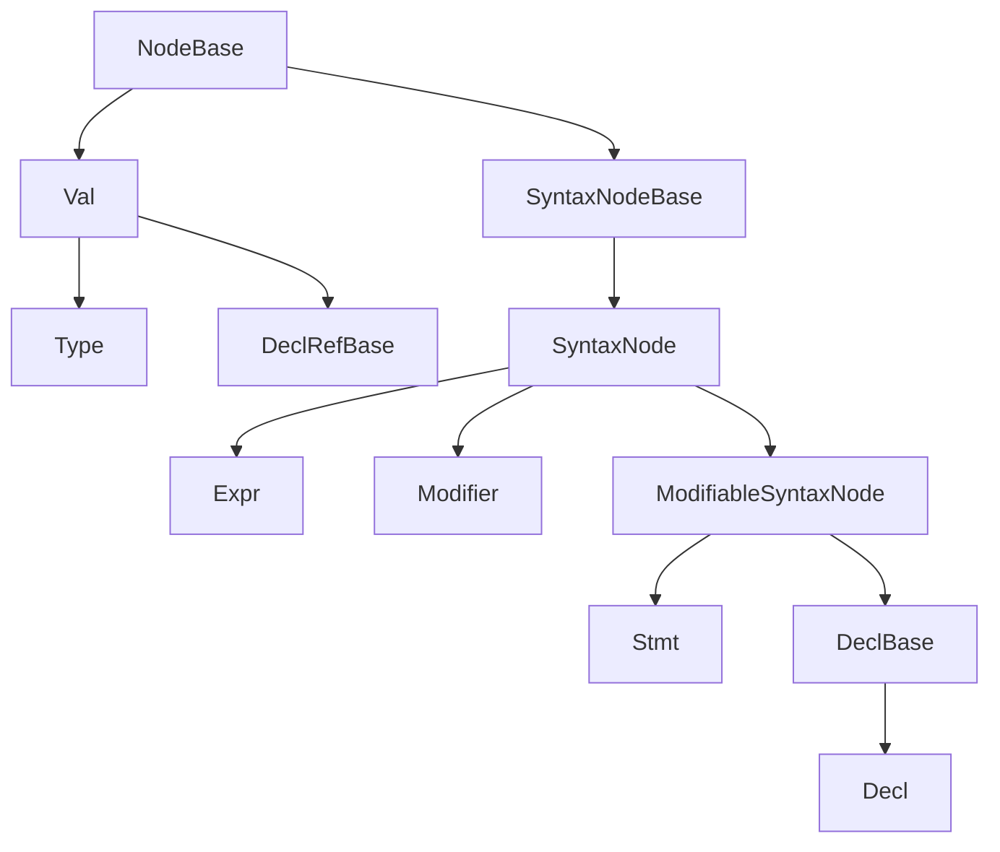

# AST Reference

This subtree of `docs/generated/design/` is a per-class reference for the
concrete AST node classes in the Slang front end, grouped by family. Each
family page tabulates every concrete (FIDDLE-declared) class whose C++
declaration lives in one AST header, and calls out the handful of
"notable" nodes that need more context than a table row can carry. The
audience is a contributor reading or writing parser, checker, or
IR-lowering code who needs to know what a given node carries and where it
comes from.

The pages here describe _shape_ — parent class, key fields, whether the
node is parsed or synthesized — rather than _behavior_. For how the AST
is built, see [../pipeline/02-parse-ast.md](../pipeline/02-parse-ast.md);
for what the checker does to it, see
[../pipeline/03-semantic-check.md](../pipeline/03-semantic-check.md); for
how it lowers to IR (which retires most of these nodes), see
[../pipeline/04-ast-to-ir.md](../pipeline/04-ast-to-ir.md). The surface
language the parsed nodes represent is documented in
[../syntax-reference/grammar.md](../syntax-reference/grammar.md), which is
also the target of the `Grammar` column on every family page.

## Family taxonomy

The diagram below is the root hierarchy declared in
[slang-ast-base.h](../../../../source/slang/slang-ast-base.h); the
per-family pages cover the concrete leaves under each root.

Three properties of this hierarchy are worth fixing in mind before
reading a family page:

- **Every root in the diagram is declared in
  [slang-ast-base.h](../../../../source/slang/slang-ast-base.h)** — including
  `Decl`, `Expr`, `Stmt`, `Type`, `Modifier`, and `Val`. No family page
  owns its own root class; the per-family header declares only the
  descendants. `Decl` itself is `FIDDLE(abstract)`, and the abstract
  intermediates _below_ these roots (`ContainerDecl`, `OperatorExpr`,
  `ScopeStmt`, ...) do live in the per-family headers.
- **`SyntaxNodeBase` is where source locations enter**, and `SyntaxNode`
  is its only direct subclass. The modifiable / non-modifiable split
  happens one level lower: `ModifiableSyntaxNode` derives _from_
  `SyntaxNode` and adds modifier storage, so `Stmt` and `DeclBase` can
  carry modifiers while `Expr` and `Modifier` cannot.
- **`Type` is a `Val`, not a direct `NodeBase` child**, which is why
  types are hash-consed and operand-encoded like every other `Val`.
  `DeclRefBase` is a `Val` for the same reason.

Where each root is documented:

- The roots themselves — `NodeBase`, `SyntaxNodeBase`,
  [`SyntaxNode`](base.md#syntaxnode-syntaxnodebase),
  [`ModifiableSyntaxNode`](base.md#modifiablesyntaxnode-syntaxnode),
  [`DeclBase`](base.md#declbase-modifiablesyntaxnode),
  [`Decl`](base.md#decl-declbase), [`Expr`](base.md#expr-syntaxnode),
  [`Stmt`](base.md#stmt-modifiablesyntaxnode),
  [`Modifier`](base.md#modifier-syntaxnode),
  [`Val`](base.md#val-nodebase), [`Type`](base.md#type-val) —
  plus the non-node support types (`DeclRef<T>`, `QualType`, `Modifiers`,
  `SubstitutionSet`, ...): [base.md](base.md).
- `Decl` and `DeclBase` leaves: [declarations.md](declarations.md).
- `Expr` leaves: [expressions.md](expressions.md).
- `Stmt` leaves: [statements.md](statements.md).
- `Type` leaves: [types.md](types.md).
- `Modifier` leaves, including the `AttributeBase` / `Attribute`
  subhierarchy: [modifiers.md](modifiers.md).
- `Val` leaves other than `Type` — the `DeclRefBase`
  ([`#declref-family`](values.md#declref-family)), `IntVal`
  ([`#intval-family`](values.md#intval-family)), `Witness`
  ([`#witness-family`](values.md#witness-family)), `ModifierVal`
  ([`#modifier-values`](values.md#modifier-values)) and `DifferentiateVal`
  ([`#differentiation-values`](values.md#differentiation-values))
  families, plus the standalone `UIntSetVal` and the
  [polynomial helpers](values.md#polynomial-helpers):
  [values.md](values.md).

## Pages

| Page                               | Family root                        | Owning header                                                         | Approx. concrete classes       |
| ---------------------------------- | ---------------------------------- | --------------------------------------------------------------------- | ------------------------------ |
| [base.md](base.md)                 | the abstract roots above           | [slang-ast-base.h](../../../../source/slang/slang-ast-base.h)         | (roots and support types only) |
| [declarations.md](declarations.md) | `Decl`, `DeclBase`                 | [slang-ast-decl.h](../../../../source/slang/slang-ast-decl.h)         | ~65                            |
| [expressions.md](expressions.md)   | `Expr`                             | [slang-ast-expr.h](../../../../source/slang/slang-ast-expr.h)         | ~95                            |
| [statements.md](statements.md)     | `Stmt`                             | [slang-ast-stmt.h](../../../../source/slang/slang-ast-stmt.h)         | ~30                            |
| [types.md](types.md)               | `Type` (itself a `Val`)            | [slang-ast-type.h](../../../../source/slang/slang-ast-type.h)         | ~120                           |
| [values.md](values.md)             | `Val` (non-`Type`)                 | [slang-ast-val.h](../../../../source/slang/slang-ast-val.h)           | ~65                            |
| [modifiers.md](modifiers.md)       | `Modifier` (incl. `AttributeBase`) | [slang-ast-modifier.h](../../../../source/slang/slang-ast-modifier.h) | ~265                           |

Each count is the number of `FIDDLE()`-declared concrete classes in that
owning header at the `source_commit` in this file's front-matter, rounded
to the nearest five. Classes declared `FIDDLE(abstract)`
are excluded from those counts; they appear only in
the hierarchy diagrams. The `declarations.md` count includes `DeclGroup`,
the only concrete `DeclBase` that is not a `Decl`. Note that the
FIDDLE-generated `ASTNodeType` enum is _not_ a count of these classes: it
carries a tag for every `NodeBase` subclass, abstract bases included.

The rounded figures give a sense of scale only; a header's class count
and its family page's `## Nodes` table need not agree exactly, and that
table is the authoritative list.

Two scope boundaries explain most "why is my node not on the page I
expected?" surprises:

- A Slang type declared in the core module with `__intrinsic_type` alone
  has **no** C++ `Type` subclass — it is an ordinary `DeclRefType` — so it
  does not appear in [types.md](types.md). Only a `__magic_type`
  declaration binds a dedicated C++ class. The work-graph record types
  (`NodeOutputArray` and friends) fall on the `__intrinsic_type` side and
  are documented in
  [../ir-reference/types.md](../ir-reference/types.md) instead.
- The _surface spelling_ of an attribute or modifier is not in the C++
  header either: it comes from `attribute_syntax` declarations in
  [core.meta.slang](../../../../source/slang/core.meta.slang) and, for the
  work-graph attributes, in
  [workgraph.slang](../../../../source/standard-modules/experimental/workgraph.slang).
  [modifiers.md](modifiers.md) quotes those spellings, and they do not
  always match the class name — `[Differentiable]`, for example, is a
  `BackwardDifferentiableAttribute`.

## Cross-cutting topics

The AST is touched by every front-end document in
`docs/generated/design/`. The following peer pages are the most direct
companions of this subtree:

- [../pipeline/02-parse-ast.md](../pipeline/02-parse-ast.md) — how the
  parser produces these nodes, including the two-stage
  declaration/body strategy that leaves function bodies as
  `UnparsedStmt` on the first pass.
- [../pipeline/03-semantic-check.md](../pipeline/03-semantic-check.md) —
  how the checker resolves names, fills in `QualType`, builds witnesses,
  and rewrites unresolved nodes (`OverloadedExpr`, `UncheckedAttribute`)
  into their resolved forms. This is also the phase that _creates_ many
  of the nodes marked `(none)` in the `Grammar` columns — though not all
  of them: `UnparsedStmt`, for instance, is a parser-built helper, and
  some `(none)` classes are declared with no live construction site at
  all.
- [../pipeline/04-ast-to-ir.md](../pipeline/04-ast-to-ir.md) — how AST
  nodes lower to Slang IR.
- [../name-resolution/index.md](../name-resolution/index.md) — the
  lookup, scope, visibility, and overload-resolution rules applied to
  the decl-refs and `LookupResult`s these nodes carry.
- [../syntax-reference/grammar.md](../syntax-reference/grammar.md) — the
  surface grammar the `Grammar` columns link into.
- [../syntax-reference/keywords-and-builtins.md](../syntax-reference/keywords-and-builtins.md)
  — Slang's syntax-as-declaration model, in which `SyntaxDecl` and
  `AttributeDecl` map a keyword or attribute name onto an AST class.
- [../cross-cutting/core-module.md](../cross-cutting/core-module.md) —
  how core-module declarations are bound to the C++ classes on these
  pages: `__magic_type` (via `MagicTypeModifier`) for types, and
  `attribute_syntax` (via `AttributeDecl`) for attributes.
- [../cross-cutting/diagnostics.md](../cross-cutting/diagnostics.md) —
  `SourceLoc`-bearing AST nodes are the carriers of most diagnostics.
- [../cross-cutting/ir-instructions.md](../cross-cutting/ir-instructions.md)
  and [../ir-reference/index.md](../ir-reference/index.md) — the IR side
  of the boundary: opcodes that consume AST witnesses and decl-refs, and
  the per-family opcode catalog.
- [../glossary.md](../glossary.md) — short definitions of `decl-ref`,
  `hash-consing`, `witness table`, `existential type`, `source-loc`,
  `ASTBuilder`, and related terms used throughout these pages.

## How to navigate

Start with [base.md](base.md) if you are new to the AST: it introduces
the roots and the support types (`DeclRef<T>`, `QualType`, `Modifiers`,
`SubstitutionSet`) that every family page assumes you already know.
Otherwise jump straight to the family page for the class you care about
— `Decl` to [declarations.md](declarations.md), `Expr` to
[expressions.md](expressions.md), and so on — and use the page's
`## Nodes` table to find the row for your class, with `## Notable nodes`
further down holding the prose callouts a row cannot capture.

Abstract intermediate classes never appear in a `## Nodes` table; they
are listed in each page's hierarchy diagram instead (`## Family
hierarchy` on the six family pages, `## Root hierarchy` on
[base.md](base.md)), so check the diagram before assuming a page is
stale. Read the `Grammar` column literally: a link points at the most
specific production in
[../syntax-reference/grammar.md](../syntax-reference/grammar.md) that
produces the node, while `(none)` means the class has no surface syntax
at all — usually because the checker synthesizes it, occasionally
because nothing in `source/` constructs it.
