# Modifiers and Attributes Reference

The reference for every concrete `Modifier` subclass in the Slang
AST, written for a contributor working in the parser, checker, or
backend emit who needs to know which class a particular `[attr]` or
keyword becomes, and where its semantic checking lives. `Modifier`
itself is documented in [base.md](base.md#modifier-syntaxnode).

Slang draws a deliberate distinction between two related families of
syntax:

- **Modifiers** are keyword-like markers without an argument list:
  `in`, `out`, `inout`, `const`, `static`, `uniform`,
  `globallycoherent`, `noperspective`, ... Each one is its own
  `Modifier` subclass.
- **Attributes** use the `[name(args)]` syntax and derive from
  `AttributeBase` (which itself derives from `Modifier`). Concrete
  attribute classes (`UnrollAttribute`, `NumThreadsAttribute`, ...)
  hold parsed arguments and any post-checking metadata.

Both are linked off `ModifiableSyntaxNode::modifiers` and walked with
`findModifier<T>()` / `hasModifier<T>()`.

## Source

Modifier classes are declared in
[slang-ast-modifier.h](../../../../source/slang/slang-ast-modifier.h),
on top of the `Modifier` / `ModifiableSyntaxNode` pair in
[slang-ast-base.h](../../../../source/slang/slang-ast-base.h).
Parsing happens in
[slang-parser.cpp](../../../../source/slang/slang-parser.cpp):
`parseAttributeName` and `ParseSquareBracketAttributes` handle the
`[name(args)]` form, and `parseUncheckedGLSLLayoutAttribute` handles
the valued entries of a GLSL `layout(...)` group. Attributes are
dispatched through the `AttributeDecl` table documented in
[../syntax-reference/keywords-and-builtins.md](../syntax-reference/keywords-and-builtins.md).

The *surface spelling* of an attribute is not declared in the C++
modifier header at all. It comes from `attribute_syntax` declarations in
four sources — three core-module `.meta.slang` files and one
experimental standard module: the bulk in
[core.meta.slang](../../../../source/slang/core.meta.slang), the
differentiability attributes in
[diff.meta.slang](../../../../source/slang/diff.meta.slang), the
Vulkan pointer attributes in
[hlsl.meta.slang](../../../../source/slang/hlsl.meta.slang), and the
work-graph attributes in the experimental standard module
[workgraph.slang](../../../../source/standard-modules/experimental/workgraph.slang).
The spellings quoted below were read from those four files, all of which
this page watches, so renaming a spelling marks the page stale.

## Family hierarchy

```mermaid
flowchart TD
  Modifier --> VisibilityModifier
  Modifier --> InModifier
  Modifier --> OutModifier
  Modifier --> ConstModifier
  Modifier --> InlineModifier
  Modifier --> BuiltinModifier
  Modifier --> AttributeBase
  Modifier --> HLSLSemantic
  Modifier --> InterpolationModeModifier
  Modifier --> MatrixLayoutModifier
  Modifier --> SimpleModifier
  Modifier --> TypeModifier
  Modifier --> GLSLLayoutModifierGroupMarker
  Modifier --> GLSLPreprocessorDirective
  Modifier --> HLSLGeometryShaderInputPrimitiveTypeModifier
  Modifier --> HLSLMeshShaderOutputModifier
  Modifier --> OtherModifier["IntrinsicOpModifier, TargetIntrinsicModifier, BuiltinTypeModifier, ..."]
  OutModifier --> InOutModifier
  VisibilityModifier --> PublicModifier
  VisibilityModifier --> PrivateModifier
  VisibilityModifier --> InternalModifier
  AttributeBase --> Attribute
  AttributeBase --> UncheckedAttribute
  AttributeBase --> UncheckedGLSLLayoutAttribute
  AttributeBase --> GLSLImplicitOffsetLayoutAttribute
  Attribute --> DifferentiableAttribute
  Attribute --> InheritanceControlAttribute
  Attribute --> GLSLSimpleIntegerLayoutAttribute
  Attribute --> OtherAttr["UnrollAttribute, NumThreadsAttribute, EntryPointAttribute, ..."]
  DifferentiableAttribute --> UserDefinedDerivativeAttribute
  DifferentiableAttribute --> DerivativeOfAttribute
  DifferentiableAttribute --> OtherDiff["TreatAsDifferentiableAttribute, ForwardDifferentiableAttribute, BackwardDifferentiableAttribute, ..."]
  HLSLSemantic --> HLSLLayoutSemantic
  HLSLSemantic --> HLSLSimpleSemantic
  HLSLSemantic --> RayPayloadAccessSemantic
  HLSLLayoutSemantic --> HLSLRegisterSemantic
  HLSLLayoutSemantic --> HLSLPackOffsetSemantic
  RayPayloadAccessSemantic --> RayPayloadReadSemantic
  RayPayloadAccessSemantic --> RayPayloadWriteSemantic
  TypeModifier --> WrappingTypeModifier
  TypeModifier --> ResourceElementFormatModifier
  TypeModifier --> NoDiffModifier
  ResourceElementFormatModifier --> UNormModifier
  ResourceElementFormatModifier --> SNormModifier
  MatrixLayoutModifier --> RowMajorLayoutModifier
  MatrixLayoutModifier --> ColumnMajorLayoutModifier
  HLSLGeometryShaderInputPrimitiveTypeModifier --> HLSLPointModifier
  HLSLGeometryShaderInputPrimitiveTypeModifier --> HLSLLineModifier
  HLSLGeometryShaderInputPrimitiveTypeModifier --> HLSLTriangleModifier
  HLSLGeometryShaderInputPrimitiveTypeModifier --> HLSLLineAdjModifier
  HLSLGeometryShaderInputPrimitiveTypeModifier --> HLSLTriangleAdjModifier
  HLSLMeshShaderOutputModifier --> HLSLVerticesModifier
  HLSLMeshShaderOutputModifier --> HLSLIndicesModifier
  HLSLMeshShaderOutputModifier --> HLSLPrimitivesModifier
```

Abstract intermediates: `VisibilityModifier`,
`GLSLLayoutModifierGroupMarker`, `HLSLSemantic`,
`MatrixLayoutModifier`, `RowMajorLayoutModifier`,
`ColumnMajorLayoutModifier`, `InterpolationModeModifier`,
`AttributeBase`, `InheritanceControlAttribute`.

## Nodes

Every attribute inherits `attributeDecl: AttributeDecl*`,
`originalIdentifierToken: Token`, and `args: List<Expr*>` from
`AttributeBase`, and every checked `Attribute` adds
`intArgVals: List<Val*>`. Many attribute classes declare no members of
their own and read their arguments straight out of those inherited
lists; those rows name the inherited `args: List<Expr*>` in the
**Key fields** column and leave the meaning of each argument to the
Summary column, while `(no additional state)` marks a class that carries
no data at all.

### Parameter-direction and storage-class modifiers

| Class | Parent | Key fields | Grammar | Summary |
| --- | --- | --- | --- | --- |
| `InModifier` | `Modifier` | (no additional state) | [parameter modifier](../syntax-reference/grammar.md#modifiers) | `in` parameter direction. |
| `OutModifier` | `Modifier` | (no additional state) | [parameter modifier](../syntax-reference/grammar.md#modifiers) | `out` parameter direction. |
| `InOutModifier` | `OutModifier` | (no additional state) | [parameter modifier](../syntax-reference/grammar.md#modifiers) | `inout` parameter direction (a refinement of `out`). |
| `RefModifier` | `Modifier` | (no additional state) | [parameter modifier](../syntax-reference/grammar.md#modifiers) | `ref` parameter passing mode. |
| `BorrowModifier` | `Modifier` | (no additional state) | [parameter modifier](../syntax-reference/grammar.md#modifiers) | `borrow` parameter passing mode. |
| `ConstModifier` | `Modifier` | (no additional state) | [storage class](../syntax-reference/grammar.md#modifiers) | `const`. |
| `InlineModifier` | `Modifier` | (no additional state) | [storage class](../syntax-reference/grammar.md#modifiers) | `inline`. |
| `ParamModifier` | `Modifier` | (no additional state) | (none) | Internal marker on synthesized parameters. |
| `ConstExprModifier` | `Modifier` | (no additional state) | [storage class](../syntax-reference/grammar.md#modifiers) | `constexpr`. |
| `ExternModifier` | `Modifier` | (no additional state) | [storage class](../syntax-reference/grammar.md#modifiers) | `extern` (link-time declaration). |
| `DynModifier` | `Modifier` | (no additional state) | (none) | Marks a dynamic-dispatch context. |
| `ExternCppModifier` | `Modifier` | (no additional state) | (none) | Marks `extern "C++"` mapping for record/replay. |

### Visibility modifiers

| Class | Parent | Key fields | Grammar | Summary |
| --- | --- | --- | --- | --- |
| `PublicModifier` | `VisibilityModifier` | (no additional state) | [visibility](../syntax-reference/grammar.md#modifiers) | `public`. |
| `PrivateModifier` | `VisibilityModifier` | (no additional state) | [visibility](../syntax-reference/grammar.md#modifiers) | `private`. |
| `InternalModifier` | `VisibilityModifier` | (no additional state) | [visibility](../syntax-reference/grammar.md#modifiers) | `internal` (default in modern Slang). |

### Override / require / export / import boilerplate

| Class | Parent | Key fields | Grammar | Summary |
| --- | --- | --- | --- | --- |
| `OverrideModifier` | `Modifier` | (no additional state) | (none) | `override` for interface-default overrides. |
| `IsOverridingModifier` | `Modifier` | `overridedDecl: Decl*` | (none) | Internal marker set by checking once an override is bound to the decl it overrides. |
| `RequireModifier` | `Modifier` | (no additional state) | (none) | `require` (interface requirement marker). |
| `BuiltinModifier` | `Modifier` | (no additional state) | (none) | Marks a declaration as part of the core module. |
| `HLSLExportModifier` | `Modifier` | (no additional state) | (none) | HLSL-style `export` keyword. |
| `ExportedModifier` | `Modifier` | (no additional state) | (none) | Marks an exported declaration. |
| `TransparentModifier` | `Modifier` | (no additional state) | (none) | Marks a member as transparent for name lookup. |
| `FromCoreModuleModifier` | `Modifier` | (no additional state) | (none) | Marks decls imported from the core module. |
| `PrefixModifier` | `Modifier` | (no additional state) | (none) | Marks an operator as prefix-arity. |
| `PostfixModifier` | `Modifier` | (no additional state) | (none) | Marks an operator as postfix-arity. |

### Compatibility and HLSL storage-class modifiers

| Class | Parent | Key fields | Grammar | Summary |
| --- | --- | --- | --- | --- |
| `HLSLEffectSharedModifier` | `Modifier` | (no additional state) | (none) | HLSL `shared` (effect-shared variable). |
| `HLSLGroupSharedModifier` | `Modifier` | (no additional state) | [HLSL storage](../syntax-reference/grammar.md#modifiers) | `groupshared`. |
| `HLSLStaticModifier` | `Modifier` | (no additional state) | [HLSL storage](../syntax-reference/grammar.md#modifiers) | `static`. |
| `HLSLUniformModifier` | `Modifier` | (no additional state) | [HLSL storage](../syntax-reference/grammar.md#modifiers) | `uniform`. |
| `HLSLVolatileModifier` | `Modifier` | (no additional state) | (none) | `volatile`. |
| `PreciseModifier` | `Modifier` | (no additional state) | (none) | `precise`. |

### Interpolation modes

| Class | Parent | Key fields | Grammar | Summary |
| --- | --- | --- | --- | --- |
| `HLSLNoInterpolationModifier` | `InterpolationModeModifier` | (no additional state) | [interpolation](../syntax-reference/grammar.md#modifiers) | `nointerpolation`. |
| `HLSLNoPerspectiveModifier` | `InterpolationModeModifier` | (no additional state) | [interpolation](../syntax-reference/grammar.md#modifiers) | `noperspective`. |
| `HLSLLinearModifier` | `InterpolationModeModifier` | (no additional state) | [interpolation](../syntax-reference/grammar.md#modifiers) | `linear`. |
| `HLSLSampleModifier` | `InterpolationModeModifier` | (no additional state) | [interpolation](../syntax-reference/grammar.md#modifiers) | `sample`. |
| `HLSLCentroidModifier` | `InterpolationModeModifier` | (no additional state) | [interpolation](../syntax-reference/grammar.md#modifiers) | `centroid`. |
| `PerVertexModifier` | `InterpolationModeModifier` | (no additional state) | [interpolation](../syntax-reference/grammar.md#modifiers) | `pervertex`. |

### Matrix layout modifiers

| Class | Parent | Key fields | Grammar | Summary |
| --- | --- | --- | --- | --- |
| `HLSLRowMajorLayoutModifier` | `RowMajorLayoutModifier` | (no additional state) | [matrix layout](../syntax-reference/grammar.md#modifiers) | HLSL `row_major`. |
| `HLSLColumnMajorLayoutModifier` | `ColumnMajorLayoutModifier` | (no additional state) | [matrix layout](../syntax-reference/grammar.md#modifiers) | HLSL `column_major`. |
| `GLSLRowMajorLayoutModifier` | `ColumnMajorLayoutModifier` | (no additional state) | [matrix layout](../syntax-reference/grammar.md#modifiers) | GLSL `row_major` (intentionally maps to *column* in Slang's convention). |
| `GLSLColumnMajorLayoutModifier` | `RowMajorLayoutModifier` | (no additional state) | [matrix layout](../syntax-reference/grammar.md#modifiers) | GLSL `column_major` (intentionally maps to *row* in Slang's convention). |

### HLSL geometry-shader input-primitive modifiers

| Class | Parent | Key fields | Grammar | Summary |
| --- | --- | --- | --- | --- |
| `HLSLGeometryShaderInputPrimitiveTypeModifier` | `Modifier` | (no additional state) | (none) | Common base for the geometry-shader input-primitive markers below. |
| `HLSLPointModifier` | `HLSLGeometryShaderInputPrimitiveTypeModifier` | (no additional state) | (none) | `point` (GS input). |
| `HLSLLineModifier` | `HLSLGeometryShaderInputPrimitiveTypeModifier` | (no additional state) | (none) | `line`. |
| `HLSLTriangleModifier` | `HLSLGeometryShaderInputPrimitiveTypeModifier` | (no additional state) | (none) | `triangle`. |
| `HLSLLineAdjModifier` | `HLSLGeometryShaderInputPrimitiveTypeModifier` | (no additional state) | (none) | `lineadj`. |
| `HLSLTriangleAdjModifier` | `HLSLGeometryShaderInputPrimitiveTypeModifier` | (no additional state) | (none) | `triangleadj`. |

### HLSL mesh-shader output / payload modifiers

| Class | Parent | Key fields | Grammar | Summary |
| --- | --- | --- | --- | --- |
| `HLSLMeshShaderOutputModifier` | `Modifier` | (no additional state) | (none) | Common base for the mesh-shader output-array markers below. |
| `HLSLVerticesModifier` | `HLSLMeshShaderOutputModifier` | (no additional state) | (none) | `vertices` (mesh shader). |
| `HLSLIndicesModifier` | `HLSLMeshShaderOutputModifier` | (no additional state) | (none) | `indices`. |
| `HLSLPrimitivesModifier` | `HLSLMeshShaderOutputModifier` | (no additional state) | (none) | `primitives`. |
| `HLSLPayloadModifier` | `Modifier` | (no additional state) | (none) | `payload` (amplification-shader payload). |

### HLSL semantics (`: SV_*`)

| Class | Parent | Key fields | Grammar | Summary |
| --- | --- | --- | --- | --- |
| `HLSLLayoutSemantic` | `HLSLSemantic` | `registerName: Token`, `componentMask: Token` | (none) | Base class for HLSL semantics that affect layout (register / packoffset). |
| `RayPayloadAccessSemantic` | `HLSLSemantic` | `stageNameTokens: List<Token>` | (none) | Base class for ray-payload read/write access semantics. |
| `HLSLSimpleSemantic` | `HLSLSemantic` | `name: Token` (on `HLSLSemantic`) | [semantic](../syntax-reference/grammar.md#declarations) | `: NAME` (no parenthesized arguments). |
| `HLSLRegisterSemantic` | `HLSLLayoutSemantic` | `spaceName: Token`, plus inherited `registerName` | [register binding](../syntax-reference/grammar.md#modifiers) | `: register(...)`. |
| `HLSLPackOffsetSemantic` | `HLSLLayoutSemantic` | `uniformOffset: int` | [pack offset](../syntax-reference/grammar.md#modifiers) | `: packoffset(...)`. |
| `RayPayloadReadSemantic` | `RayPayloadAccessSemantic` | (no additional state) | (none) | `: read(...)` ray-payload semantic. |
| `RayPayloadWriteSemantic` | `RayPayloadAccessSemantic` | (no additional state) | (none) | `: write(...)` ray-payload semantic. |

### GLSL preprocessor / layout / format

| Class | Parent | Key fields | Grammar | Summary |
| --- | --- | --- | --- | --- |
| `GLSLPrecisionModifier` | `Modifier` | (no additional state) | (none) | GLSL precision qualifier. |
| `GLSLModuleModifier` | `Modifier` | (no additional state) | (none) | Marker for GLSL-module-origin declarations. |
| `GLSLPreprocessorDirective` | `Modifier` | (no additional state) | (none) | Base class for GLSL preprocessor directives preserved in the AST. |
| `GLSLVersionDirective` | `GLSLPreprocessorDirective` | `versionNumberToken: Token`, `glslProfileToken: Token` | (none) | `#version` preprocessor directive carried as AST. |
| `GLSLExtensionDirective` | `GLSLPreprocessorDirective` | `extensionNameToken: Token`, `dispositionToken: Token` | (none) | `#extension` directive. |
| `GLSLLayoutModifierGroupBegin` | `GLSLLayoutModifierGroupMarker` | (no additional state) | (none) | Start marker of a `layout(...)` group. |
| `GLSLLayoutModifierGroupEnd` | `GLSLLayoutModifierGroupMarker` | (no additional state) | (none) | End marker of a `layout(...)` group. |
| `GLSLUnparsedLayoutModifier` | `Modifier` | (no additional state) | (none) | Raw text of a layout qualifier deferred to later parsing. |
| `GLSLBufferDataLayoutModifier` | `Modifier` | (no additional state) | (none) | Base for buffer-layout modifiers. |
| `GLSLStd140Modifier` | `GLSLBufferDataLayoutModifier` | (no additional state) | [layout(std140)](../syntax-reference/grammar.md#modifiers) | `std140`. |
| `GLSLStd430Modifier` | `GLSLBufferDataLayoutModifier` | (no additional state) | [layout(std430)](../syntax-reference/grammar.md#modifiers) | `std430`. |
| `GLSLScalarModifier` | `GLSLBufferDataLayoutModifier` | (no additional state) | (none) | `scalar` layout. |
| `GLSLBufferModifier` | `WrappingTypeModifier` | (no additional state) | (none) | `buffer` modifier on a type. |
| `GLSLWriteOnlyModifier` | `SimpleModifier` | (no additional state) | (none) | `writeonly`. |
| `GLSLReadOnlyModifier` | `SimpleModifier` | (no additional state) | (none) | `readonly`. |
| `GLSLVolatileModifier` | `SimpleModifier` | (no additional state) | (none) | GLSL `volatile`. |
| `GLSLRestrictModifier` | `SimpleModifier` | (no additional state) | (none) | `restrict`. |
| `GLSLPatchModifier` | `SimpleModifier` | (no additional state) | (none) | `patch` (tess input). |
| `GloballyCoherentModifier` | `SimpleModifier` | (no additional state) | (none) | `globallycoherent`. |
| `SimpleModifier` | `Modifier` | (no additional state) | (none) | Base for keyword-only modifiers parsed via the generic SimpleModifier path. |
| `MemoryQualifierSetModifier` | `Modifier` | `memoryQualifiers: uint32_t`, `memoryModifiers: List<Modifier*>` | (none) | Aggregated GLSL memory qualifiers (`coherent`, `volatile`, etc.) on a single decl. |

### Type modifiers (wrapping the type rather than the declaration)

| Class | Parent | Key fields | Grammar | Summary |
| --- | --- | --- | --- | --- |
| `TypeModifier` | `Modifier` | (no additional state) | (none) | Base for modifiers that semantically attach to a type. |
| `WrappingTypeModifier` | `TypeModifier` | (no additional state) | (none) | Type modifier that wraps a child type. |
| `ResourceElementFormatModifier` | `TypeModifier` | (no additional state) | (none) | Base for resource-element format modifiers. |
| `UNormModifier` | `ResourceElementFormatModifier` | (no additional state) | [unorm](../syntax-reference/grammar.md#modifiers) | `unorm`. |
| `SNormModifier` | `ResourceElementFormatModifier` | (no additional state) | [snorm](../syntax-reference/grammar.md#modifiers) | `snorm`. |
| `NoDiffModifier` | `TypeModifier` | (no additional state) | [no_diff](../syntax-reference/grammar.md#modifiers) | `no_diff` type modifier. |
| `BitFieldModifier` | `Modifier` | `width: IntegerLiteralValue`, `offset: IntegerLiteralValue`, `backingDeclRef: DeclRef<VarDecl>` | (none) | C-style bitfield specification on a member variable; `offset` and `backingDeclRef` are filled in during checking. |
| `DynamicUniformModifier` | `Modifier` | (no additional state) | (none) | Marks a parameter as dynamic-uniform. |

### Internal / synthesized modifiers

| Class | Parent | Key fields | Grammar | Summary |
| --- | --- | --- | --- | --- |
| `ToBeSynthesizedModifier` | `Modifier` | (no additional state) | (none) | Placeholder marking a decl that the checker should synthesize. |
| `SynthesizedModifier` | `Modifier` | `op: uint32_t`, `operands: List<Val*>` | (none) | Marks decls produced by checker synthesis. |
| `SynthesizedStaticLambdaFuncModifier` | `Modifier` | (no additional state) | (none) | Marks the static-lambda function synthesized for `LambdaDecl`. |
| `ExplicitlyDeclaredCapabilityModifier` | `Modifier` | `declaredCapabilityRequirements: CapabilitySetVal*` | (none) | Marks capability sets that were written by the user. |
| `LocalTempVarModifier` | `Modifier` | (no additional state) | (none) | Marks compiler-introduced local temporaries. |
| `ExistentialOpenedOnVarModifier` | `Modifier` | (no additional state) | (none) | Marks a variable as the result of opening an existential. |
| `VarReassignedModifier` | `Modifier` | (no additional state) | (none) | Marks a variable that has been re-assigned (data-flow info). |
| `ExtensionExternVarModifier` | `Modifier` | `originalDecl: DeclRef<Decl>` | (none) | Marks variables surfaced from an extension via `extern`. |
| `ActualGlobalModifier` | `Modifier` | (no additional state) | (none) | Marks the real backing decl behind a global generic. |
| `IgnoreForLookupModifier` | `Modifier` | (no additional state) | (none) | Hides a decl from ordinary name lookup. |
| `OptionalConstraintModifier` | `Modifier` | (no additional state) | (none) | Marks a constraint as optional during inference. |

### Intrinsic and target-binding modifiers

| Class | Parent | Key fields | Grammar | Summary |
| --- | --- | --- | --- | --- |
| `IntrinsicOpModifier` | `Modifier` | `opToken: Token`, `op: uint32_t` | (none) | Binds a decl to a Slang IR opcode (core-module intrinsics). |
| `TargetIntrinsicModifier` | `Modifier` | `targetToken: Token`, `definitionString: String`, `predicateToken: Token`, `scrutineeDeclRef: DeclRef<Decl>` | (none) | Binds a decl to a target-backend intrinsic. |
| `SpecializedForTargetModifier` | `Modifier` | `targetToken: Token` | (none) | Marks a decl as specialized for a target. |
| `RequiredGLSLExtensionModifier` | `Modifier` | `extensionNameToken: Token` | (none) | Marks a required GLSL extension. |
| `RequiredGLSLVersionModifier` | `Modifier` | `versionNumberToken: Token` | (none) | Marks the minimum GLSL version a decl requires. |
| `RequiredSPIRVVersionModifier` | `Modifier` | `version: SemanticVersion` | (none) | Marks the minimum SPIRV version. |
| `RequiredWGSLExtensionModifier` | `Modifier` | `extensionNameToken: Token` | (none) | Required WGSL extension. |
| `RequiredCUDASMVersionModifier` | `Modifier` | `version: SemanticVersion` | (none) | Required CUDA SM version. |
| `NVAPIMagicModifier` | `Modifier` | (no additional state) | (none) | NVAPI-magic binding flag. |
| `NVAPISlotModifier` | `Modifier` | `registerName: String`, `spaceName: String` | (none) | NVAPI slot binding, sourced from the `NV_SHADER_EXTN_SLOT` / `NV_SHADER_EXTN_REGISTER_SPACE` macros. |
| `BuiltinTypeModifier` | `Modifier` | `tag: BaseType` | (none) | Tags a decl as the canonical declaration of a built-in type. |
| `MagicTypeModifier` | `Modifier` | `magicName: String`, `tag: uint32_t`, `magicNodeType: SyntaxClass<NodeBase>` | (none) | Tags a decl as a magic type known to checker/IR-lowering. |
| `BuiltinRequirementModifier` | `Modifier` | `kind: BuiltinRequirementKind` | (none) | Tags interface requirements known to the compiler. |
| `IntrinsicTypeModifier` | `Modifier` | `irOp: uint32_t`, `irOperands: List<uint32_t>` | (none) | Tags a decl as an intrinsic type and names the IR opcode it lowers to. |
| `ImplicitConversionModifier` | `Modifier` | `cost: ConversionCost`, `builtinConversionKind: BuiltinConversionKind` | (none) | Marks an implicit conversion constructor and gives its ranking cost. |
| `AttributeTargetModifier` | `Modifier` | `syntaxClass: SyntaxClass<NodeBase>` | (none) | Internal modifier produced by `[__AttributeUsage(...)]`. |

### Implicit parameter-group machinery

| Class | Parent | Key fields | Grammar | Summary |
| --- | --- | --- | --- | --- |
| `ImplicitParameterGroupVariableModifier` | `Modifier` | (no additional state) | (none) | Internal marker on auto-introduced parameter-group variables. |
| `ImplicitParameterGroupElementTypeModifier` | `Modifier` | (no additional state) | (none) | Internal marker on auto-introduced element types. |
| `ParameterGroupReflectionName` | `Modifier` | `nameAndLoc: NameLoc` | (none) | Carries the reflection name for an implicit parameter group. |
| `SharedModifiers` | `Modifier` | (no additional state) | (none) | Aggregates modifiers shared between several decls (e.g. multiple declarators in one declaration). |
| `HasInterfaceDefaultImplModifier` | `Modifier` | `defaultImplDecl: Decl*` | (none) | Marks an interface as having default-implementation requirements. |

### Attributes (`AttributeBase` and `UncheckedAttribute`)

| Class | Parent | Key fields | Grammar | Summary |
| --- | --- | --- | --- | --- |
| `UncheckedAttribute` | `AttributeBase` | `scope: Scope*`, plus inherited `args` | [attribute](../syntax-reference/grammar.md#attributes-and-decorations) | Attribute as parsed before checking has resolved it to a concrete subclass; `scope` records where to look the name up. |
| `Attribute` | `AttributeBase` | `intArgVals: List<Val*>`, plus inherited `args` | [attribute](../syntax-reference/grammar.md#attributes-and-decorations) | Base for all checker-resolved attribute classes. |
| `UserDefinedAttribute` | `Attribute` | `attributeDecl: AttributeDecl*` (on `AttributeBase`) | [user attribute](../syntax-reference/grammar.md#attributes-and-decorations) | A user-declared attribute (introduced via `attribute_syntax`). |
| `AttributeUsageAttribute` | `Attribute` | `targetSyntaxClass: SyntaxClass<NodeBase>` | [AttributeUsage](../syntax-reference/grammar.md#attributes-and-decorations) | `[__AttributeUsage(target)]` declaring where an attribute may be applied. |

### Compile-time hint attributes (loops / branches / opt levels)

| Class | Parent | Key fields | Grammar | Summary |
| --- | --- | --- | --- | --- |
| `UnrollAttribute` | `Attribute` | `args: List<Expr*>` (inherited) | [unroll](../syntax-reference/grammar.md#attributes-and-decorations) | `[unroll(N)]`. |
| `ForceUnrollAttribute` | `Attribute` | `maxIterations: int32_t` | (none) | `[ForceUnroll]`. |
| `MaxItersAttribute` | `Attribute` | `value: IntVal*` | (none) | `[MaxIters(N)]`. |
| `InferredMaxItersAttribute` | `Attribute` | `inductionVar: DeclRef<Decl>`, `value: int32_t` | (none) | Iteration bound inferred by checking rather than written by the user. |
| `LoopAttribute` | `Attribute` | (no additional state) | (none) | `[loop]`. |
| `FastOptAttribute` | `Attribute` | (no additional state) | (none) | `[fastopt]`. |
| `AllowUAVConditionAttribute` | `Attribute` | (no additional state) | (none) | `[allow_uav_condition]`. |
| `BranchAttribute` | `Attribute` | (no additional state) | (none) | `[branch]`. |
| `FlattenAttribute` | `Attribute` | (no additional state) | (none) | `[flatten]`. |
| `ForceCaseAttribute` | `Attribute` | (no additional state) | (none) | `[forcecase]`. |
| `CallAttribute` | `Attribute` | (no additional state) | (none) | `[call]`. |
| `UnscopedEnumAttribute` | `Attribute` | (no additional state) | (none) | `[UnscopedEnum]`; added by the parser from the user-written attribute or implicitly when a non-generic plain `enum` is compiled with `-unscoped-enum`. |
| `EnumClassModifier` | `Modifier` | (no additional state) | (none) | Marker for `enum class` declarations; used to detect conflicting explicit scoped/unscoped enum declarations (no further semantics). |
| `FlagsAttribute` | `Attribute` | (no additional state) | (none) | `[Flags]`. |
| `NonDynamicUniformAttribute` | `Attribute` | (no additional state) | (none) | `[NonUniformReturn]`. |
| `UnsafeForceInlineEarlyAttribute` | `Attribute` | (no additional state) | (none) | `[__unsafeForceInlineEarly]`. |
| `ForceInlineAttribute` | `Attribute` | (no additional state) | [ForceInline](../syntax-reference/grammar.md#attributes-and-decorations) | `[ForceInline]`. |
| `NoInlineAttribute` | `Attribute` | (no additional state) | (none) | `[noinline]`. |
| `NoRefInlineAttribute` | `Attribute` | (no additional state) | (none) | `[noRefInline]`. |
| `PreferRecomputeAttribute` | `Attribute` | `sideEffectBehavior: SideEffectBehavior` | (none) | `[PreferRecompute]`; the nested enum selects whether side effects warn or are allowed. |
| `PreferCheckpointAttribute` | `Attribute` | (no additional state) | (none) | `[PreferCheckpoint]`. |
| `AlwaysFoldIntoUseSiteAttribute` | `Attribute` | (no additional state) | (none) | `[__AlwaysFoldIntoUseSiteAttribute]`. |
| `OverloadRankAttribute` | `Attribute` | `rank: int32_t` | (none) | `[OverloadRank(N)]`. |
| `SpecializeAttribute` | `Attribute` | (no additional state) | (none) | `[Specialize]`. |
| `KnownBuiltinAttribute` | `Attribute` | `name: IntVal*` | (none) | `[KnownBuiltin(name)]`; marks a decl as a known builtin. |
| `ReadNoneAttribute` | `Attribute` | (no additional state) | (none) | `[__readNone]`. |
| `MaximallyReconvergesAttribute` | `Attribute` | (no additional state) | (none) | `[MaximallyReconverges]`. |
| `QuadDerivativesAttribute` | `Attribute` | (no additional state) | (none) | `[QuadDerivatives]`. |
| `RequireFullQuadsAttribute` | `Attribute` | (no additional state) | (none) | `[RequireFullQuads]`. |
| `DeprecatedAttribute` | `Attribute` | `message: String` | (none) | `[deprecated(message)]`. |
| `RemovedSinceAttribute` | `Attribute` | `sinceVersion: int32_t`, `message: String` | (none) | `[RemovedSince(...)]`. |
| `NonCopyableTypeAttribute` | `Attribute` | (no additional state) | (none) | `[__NonCopyableType]`. |
| `NoSideEffectAttribute` | `Attribute` | (no additional state) | (none) | `[__NoSideEffect]`. |
| `BuiltinAttribute` | `Attribute` | (no additional state) | (none) | `[builtin]`. |
| `AutoDiffBuiltinAttribute` | `Attribute` | (no additional state) | (none) | `[__AutoDiffBuiltin]`; marks an autodiff builtin. |

### Capability / target attributes

| Class | Parent | Key fields | Grammar | Summary |
| --- | --- | --- | --- | --- |
| `RequireCapabilityAttribute` | `Attribute` | `capabilitySet: CapabilitySetVal*` | [require](../syntax-reference/grammar.md#attributes-and-decorations) | `[require(capability)]`; ties to the capability system in [../cross-cutting/targets.md](../cross-cutting/targets.md). |
| `RequiresNVAPIAttribute` | `Attribute` | (no additional state) | (none) | `[__requiresNVAPI]`. |
| `RequirePreludeAttribute` | `Attribute` | `capabilitySet: CapabilitySetVal*`, `prelude: String` | (none) | `[RequirePrelude(...)]`. |
| `AllowAttribute` | `Attribute` | `diagnostic: DiagnosticInfo const*` | (none) | `[allow("diagnostic-name")]`; suppresses one diagnostic. |
| `FormatAttribute` | `Attribute` | `format: ImageFormat` | (none) | `[format(...)]`, also spelled `[vk::image_format(...)]`. |
| `ExternAttribute` | `Attribute` | (no additional state) | (none) | `[__extern]`. |
| `ComInterfaceAttribute` | `Attribute` | `guid: String` | (none) | `[COM(guid)]`. |

### Layout / binding attributes

| Class | Parent | Key fields | Grammar | Summary |
| --- | --- | --- | --- | --- |
| `PushConstantAttribute` | `Attribute` | (no additional state) | (none) | `[push_constant]`. |
| `SpecializationConstantAttribute` | `Attribute` | (no additional state) | (none) | `[SpecializationConstant]`. |
| `VkConstantIdAttribute` | `Attribute` | `location: int` | (none) | `[vk::constant_id(...)]`, and the checked form of `layout(constant_id=N)`. |
| `ShaderRecordAttribute` | `Attribute` | (no additional state) | (none) | `[shader_record]`. |
| `GLSLBindingAttribute` | `Attribute` | `binding: int32_t`, `set: int32_t` | (none) | `[vk::binding(...)]` / `[gl::binding(...)]`; also the merged checked form of `layout(binding=..., set=...)`. |
| `VkAliasedPointerAttribute` | `Attribute` | (no additional state) | (none) | `[vk::aliased_pointer]`. |
| `VkRestrictPointerAttribute` | `Attribute` | (no additional state) | (none) | `[vk::restrict_pointer]`. |
| `GLSLOffsetLayoutAttribute` | `Attribute` | `offset: int64_t` | (none) | Checked form of `layout(offset=N)`. |
| `GLSLImplicitOffsetLayoutAttribute` | `AttributeBase` | (no additional state) | (none) | Placeholder the parser adds when a `layout(...)` group has no explicit `offset`; checking turns it into a `GLSLOffsetLayoutAttribute`. |
| `GLSLSimpleIntegerLayoutAttribute` | `Attribute` | `value: int32_t` | (none) | Base for integer-valued GLSL layout attributes. |
| `GLSLInputAttachmentIndexLayoutAttribute` | `Attribute` | `location: IntegerLiteralValue` | (none) | `[vk::input_attachment_index(...)]`. |
| `GLSLLocationAttribute` | `GLSLSimpleIntegerLayoutAttribute` | inherited `value: int32_t` | (none) | `[vk::location(...)]`. |
| `GLSLIndexAttribute` | `GLSLSimpleIntegerLayoutAttribute` | inherited `value: int32_t` | (none) | `[vk::index(...)]`. |
| `VkStructOffsetAttribute` | `GLSLSimpleIntegerLayoutAttribute` | inherited `value: int32_t` | (none) | `[vk_offset(...)]`. |
| `SPIRVInstructionOpAttribute` | `Attribute` | `args: List<Expr*>` (inherited) | (none) | `[vk::spirv_instruction(...)]`. |
| `SPIRVTargetEnv13Attribute` | `Attribute` | (no additional state) | (none) | `[spv_target_env_1_3]`. |
| `DisableArrayFlatteningAttribute` | `Attribute` | (no additional state) | (none) | `[disable_array_flattening]`. |
| `GLSLLayoutLocalSizeAttribute` | `Attribute` | `extents[3]: IntVal*`, `axisIsSpecConstId[3]: bool`, `specConstExtents[3]: DeclRef<VarDeclBase>` | (none) | `layout(local_size_*)` workgroup size. |
| `GLSLLayoutDerivativeGroupQuadAttribute` | `Attribute` | (no additional state) | (none) | `derivative_group_quadsNV` layout. |
| `GLSLLayoutDerivativeGroupLinearAttribute` | `Attribute` | (no additional state) | (none) | `derivative_group_linearNV` layout. |
| `GLSLRequireShaderInputParameterAttribute` | `Attribute` | `parameterNumber: uint32_t` | (none) | `[__GLSLRequireShaderInputParameter(N)]`; marks a required shader input. |

### Unchecked GLSL layout attributes

| Class | Parent | Key fields | Grammar | Summary |
| --- | --- | --- | --- | --- |
| `UncheckedGLSLLayoutAttribute` | `AttributeBase` | `args: List<Expr*>` (inherited) | (none) | Base for unchecked GLSL layout(...) entries. |
| `UncheckedGLSLBindingLayoutAttribute` | `UncheckedGLSLLayoutAttribute` | `args: List<Expr*>` (inherited) | (none) | `layout(binding=N)`. |
| `UncheckedGLSLSetLayoutAttribute` | `UncheckedGLSLLayoutAttribute` | `args: List<Expr*>` (inherited) | (none) | `layout(set=N)`. |
| `UncheckedGLSLOffsetLayoutAttribute` | `UncheckedGLSLLayoutAttribute` | `args: List<Expr*>` (inherited) | (none) | `layout(offset=N)`. |
| `UncheckedGLSLInputAttachmentIndexLayoutAttribute` | `UncheckedGLSLLayoutAttribute` | `args: List<Expr*>` (inherited) | (none) | `layout(input_attachment_index=N)`. |
| `UncheckedGLSLLocationLayoutAttribute` | `UncheckedGLSLLayoutAttribute` | `args: List<Expr*>` (inherited) | (none) | `layout(location=N)`. |
| `UncheckedGLSLIndexLayoutAttribute` | `UncheckedGLSLLayoutAttribute` | `args: List<Expr*>` (inherited) | (none) | `layout(index=N)`. |
| `UncheckedGLSLConstantIdAttribute` | `UncheckedGLSLLayoutAttribute` | `args: List<Expr*>` (inherited) | (none) | `layout(constant_id=N)`. |
| `UncheckedGLSLRayPayloadAttribute` | `UncheckedGLSLLayoutAttribute` | (no additional state) | (none) | `layout(ray_payload)`. |
| `UncheckedGLSLRayPayloadInAttribute` | `UncheckedGLSLLayoutAttribute` | (no additional state) | (none) | `layout(ray_payload_in)`. |
| `UncheckedGLSLHitObjectAttributesAttribute` | `UncheckedGLSLLayoutAttribute` | (no additional state) | (none) | `layout(hit_object_attributes)`. |
| `UncheckedGLSLCallablePayloadAttribute` | `UncheckedGLSLLayoutAttribute` | (no additional state) | (none) | `layout(callable_payload)`. |
| `UncheckedGLSLCallablePayloadInAttribute` | `UncheckedGLSLLayoutAttribute` | (no additional state) | (none) | `layout(callable_payload_in)`. |

### Stage-specific entry-point attributes

| Class | Parent | Key fields | Grammar | Summary |
| --- | --- | --- | --- | --- |
| `MaxTessFactorAttribute` | `Attribute` | `args: List<Expr*>` (inherited) | (none) | `[maxtessfactor(...)]`. |
| `OutputControlPointsAttribute` | `Attribute` | `args: List<Expr*>` (inherited) | (none) | `[outputcontrolpoints(...)]`. |
| `OutputTopologyAttribute` | `Attribute` | `args: List<Expr*>` (inherited) | (none) | `[outputtopology(...)]`. |
| `PartitioningAttribute` | `Attribute` | `args: List<Expr*>` (inherited) | (none) | `[partitioning(...)]`. |
| `PatchConstantFuncAttribute` | `Attribute` | `patchConstantFuncDecl: FuncDecl*` | (none) | `[patchconstantfunc(...)]`. |
| `DomainAttribute` | `Attribute` | `args: List<Expr*>` (inherited) | (none) | `[domain(...)]`. |
| `EarlyDepthStencilAttribute` | `Attribute` | (no additional state) | (none) | `[earlydepthstencil]`. |
| `Shader64BitIndexingAttribute` | `Attribute` | (no additional state) | (none) | `[Shader64BitIndexing]`. |
| `NumThreadsAttribute` | `Attribute` | `extents[3]: IntVal*`, `specConstExtents[3]: DeclRef<VarDeclBase>` | [numthreads](../syntax-reference/grammar.md#attributes-and-decorations) | `[numthreads(x,y,z)]` (also spelled `[NumThreads(...)]`); an axis is either a constant or a specialization constant. |
| `WaveSizeAttribute` | `Attribute` | `numLanes: IntVal*` | (none) | `[WaveSize(...)]`. |
| `MaxVertexCountAttribute` | `Attribute` | `value: int32_t` | (none) | `[maxvertexcount(...)]`. |
| `InstanceAttribute` | `Attribute` | `value: int32_t` | (none) | `[instance(count)]`. |
| `EntryPointAttribute` | `Attribute` | `capabilitySet: CapabilitySetVal*` | [shader](../syntax-reference/grammar.md#attributes-and-decorations) | `[shader("stage")]`. |
| `ExperimentalModuleAttribute` | `Attribute` | (no additional state) | (none) | `[ExperimentalModule]`. |
| `FunctionInterfaceAttribute` | `Attribute` | (no additional state) | (none) | `[__FunctionInterface]`. |

### Work-graph node attributes

Declared as `attribute_syntax` in
[workgraph.slang](../../../../source/standard-modules/experimental/workgraph.slang)
rather than in `core.meta.slang`.

| Class | Parent | Key fields | Grammar | Summary |
| --- | --- | --- | --- | --- |
| `NodeLaunchAttribute` | `Attribute` | `mode: String` | (none) | `[NodeLaunch("broadcasting" \| "thread" \| "coalescing")]`. |
| `NodeMaxDispatchGridAttribute` | `Attribute` | `x: IntVal*`, `y: IntVal*`, `z: IntVal*` | (none) | `[NodeMaxDispatchGrid(x,y,z)]`; upper bound for a dynamic grid. |
| `NodeDispatchGridAttribute` | `Attribute` | `x: IntVal*`, `y: IntVal*`, `z: IntVal*` | (none) | `[NodeDispatchGrid(x,y,z)]`; fixed grid size. |
| `MaxRecordsAttribute` | `Attribute` | `value: IntVal*` | (none) | `[MaxRecords(count)]`. |
| `NodeIDAttribute` | `Attribute` | `name: String`, `arrayIndex: IntVal*` | (none) | `[NodeID(name, arrayIndex = 0)]`. |
| `NodeIsProgramEntryAttribute` | `Attribute` | (no additional state) | (none) | `[NodeIsProgramEntry]`. |
| `AllowSparseNodesAttribute` | `Attribute` | (no additional state) | (none) | `[AllowSparseNodes]` on an output-node array parameter. |
| `NodeArraySizeAttribute` | `Attribute` | `count: IntVal*` | (none) | `[NodeArraySize(count)]`. |

### Ray-tracing attributes

| Class | Parent | Key fields | Grammar | Summary |
| --- | --- | --- | --- | --- |
| `VulkanRayPayloadAttribute` | `Attribute` | `location: int` | (none) | `[__vulkanRayPayload(location)]`; also the checked form of `layout(ray_payload)`. |
| `VulkanRayPayloadInAttribute` | `Attribute` | `location: int` | (none) | Checked form of `layout(ray_payload_in)`; no `attribute_syntax` spelling. |
| `VulkanCallablePayloadAttribute` | `Attribute` | `location: int` | (none) | `[__vulkanCallablePayload(location)]`; also the checked form of `layout(callable_payload)`. |
| `VulkanCallablePayloadInAttribute` | `Attribute` | `location: int` | (none) | Checked form of `layout(callable_payload_in)`; no `attribute_syntax` spelling. |
| `VulkanHitAttributesAttribute` | `Attribute` | (no additional state) | (none) | `[__vulkanHitAttributes]`. |
| `VulkanHitObjectAttributesAttribute` | `Attribute` | `location: int` | (none) | `[__vulkanHitObjectAttributes(location)]`; also the checked form of `layout(hit_object_attributes)`. |
| `RayPayloadAttribute` | `Attribute` | (no additional state) | (none) | Older HLSL `[raypayload]`. |

### Mutability / autodiff annotations

| Class | Parent | Key fields | Grammar | Summary |
| --- | --- | --- | --- | --- |
| `MutatingAttribute` | `Attribute` | (no additional state) | (none) | `[mutating]`. |
| `NonmutatingAttribute` | `Attribute` | (no additional state) | (none) | `[nonmutating]`. |
| `NoDiscardAttribute` | `Attribute` | (no additional state) | [attribute](../syntax-reference/grammar.md#attributes-and-decorations) | `[NoDiscard]`; flags a function whose result must not be discarded. |
| `ConstRefAttribute` | `Attribute` | (no additional state) | (none) | `[constref]`. |
| `RefAttribute` | `Attribute` | (no additional state) | (none) | `[__ref]`. |
| `AnyValueSizeAttribute` | `Attribute` | `size: int32_t` | (none) | `[anyValueSize(size)]`. |

### Differentiability attributes

| Class | Parent | Key fields | Grammar | Summary |
| --- | --- | --- | --- | --- |
| `DifferentiableAttribute` | `Attribute` | `m_associatedValMapping: OrderedDictionary<Val*, OrderedDictionary<SlangInt, Val*>>` | (none) | Base of the family; has no `attribute_syntax` spelling of its own and caches each type's `IDifferentiable` witness. |
| `TreatAsDifferentiableAttribute` | `DifferentiableAttribute` | (no additional state) | (none) | `[TreatAsDifferentiable]`. |
| `HasTrivialForwardDerivativeAttribute` | `DifferentiableAttribute` | (no additional state) | (none) | `[HasTrivialForwardDerivative]`. |
| `ForwardDifferentiableAttribute` | `DifferentiableAttribute` | (no additional state) | [ForwardDifferentiable](../syntax-reference/grammar.md#attributes-and-decorations) | `[ForwardDifferentiable]`. |
| `UserDefinedDerivativeAttribute` | `DifferentiableAttribute` | `funcExpr: Expr*` | (none) | Base for explicit-derivative attributes. |
| `ForwardDerivativeAttribute` | `UserDefinedDerivativeAttribute` | inherited `funcExpr: Expr*` | (none) | `[ForwardDerivative(fn)]`. |
| `DerivativeOfAttribute` | `DifferentiableAttribute` | `funcExpr: Expr*`, `backDeclRef: Expr*` | (none) | Base for "X is the derivative of Y" attributes. |
| `ForwardDerivativeOfAttribute` | `DerivativeOfAttribute` | inherited `funcExpr: Expr*` | (none) | `[ForwardDerivativeOf(fn)]`. |
| `BackwardDifferentiableAttribute` | `DifferentiableAttribute` | `maxOrder: int` | [Differentiable](../syntax-reference/grammar.md#attributes-and-decorations) | Produced by **both** `[BackwardDifferentiable(order = 0)]` and the plain `[Differentiable(order = 0)]`. |
| `BackwardDerivativeAttribute` | `UserDefinedDerivativeAttribute` | inherited `funcExpr: Expr*` | (none) | `[BackwardDerivative(fn)]`. |
| `BackwardDerivativeOfAttribute` | `DerivativeOfAttribute` | inherited `funcExpr: Expr*` | (none) | `[BackwardDerivativeOf(fn)]`. |
| `PrimalSubstituteAttribute` | `Attribute` | `funcExpr: Expr*` | (none) | `[PrimalSubstitute(fn)]`. |
| `PrimalSubstituteOfAttribute` | `Attribute` | `funcExpr: Expr*`, `backDeclRef: Expr*` | (none) | `[PrimalSubstituteOf(fn)]`. |
| `NoDiffThisAttribute` | `Attribute` | `isSynthesized: bool` | (none) | `[NoDiffThis]`; `isSynthesized` distinguishes a checker-added instance from a user-written one. |
| `DerivativeMemberAttribute` | `Attribute` | `memberDeclRef: DeclRefExpr*` | (none) | `[DerivativeMember(...)]`. |
| `MaybeDifferentiableAttribute` | `Attribute` | (no additional state) | (none) | `[MaybeDifferentiable]` on an interface requirement: an optional conformance to `IForwardDifferentiable<Self>` / `IBackwardDifferentiable<Self>`. |

### Inheritance-control attributes

| Class | Parent | Key fields | Grammar | Summary |
| --- | --- | --- | --- | --- |
| `OpenAttribute` | `InheritanceControlAttribute` | (no additional state) | (none) | `[open]`. |
| `SealedAttribute` | `InheritanceControlAttribute` | (no additional state) | (none) | `[sealed]`. |

### CUDA / Python / FFI attributes

| Class | Parent | Key fields | Grammar | Summary |
| --- | --- | --- | --- | --- |
| `DllImportAttribute` | `Attribute` | `modulePath: String, functionName: String` | (none) | `[DllImport(...)]`. |
| `DllExportAttribute` | `Attribute` | (no additional state) | (none) | `[DllExport]`. |
| `TorchEntryPointAttribute` | `Attribute` | (no additional state) | (none) | `[TorchEntryPoint]`. |
| `CudaDeviceExportAttribute` | `Attribute` | (no additional state) | (none) | `[CudaDeviceExport]` (also `[CUDADeviceExport]`). |
| `CudaKernelAttribute` | `Attribute` | (no additional state) | (none) | `[CudaKernel]` (also `[CUDAKernel]`). |
| `CudaHostAttribute` | `Attribute` | (no additional state) | (none) | `[CudaHost]` (also `[CUDAHost]`). |
| `AutoPyBindCudaAttribute` | `Attribute` | `fwdDiffFuncDeclRef: DeclRefExpr*`, `bwdDiffFuncDeclRef: DeclRefExpr*` | (none) | `[AutoPyBindCUDA]`. |
| `PyExportAttribute` | `Attribute` | `name: String` | (none) | `[PyExport(name)]`. |
| `DerivativeGroupQuadAttribute` | `Attribute` | (no additional state) | (none) | `[DerivativeGroupQuad]`. |
| `DerivativeGroupLinearAttribute` | `Attribute` | (no additional state) | (none) | `[DerivativeGroupLinear]`. |

## Notable nodes

### Modifiers vs Attributes

The split is by syntax: a *modifier* is a bare keyword that the
parser knows by name and immediately constructs the appropriate
`Modifier` subclass for; an *attribute* is an `[ident(args)]`
construct that the parser builds as an `UncheckedAttribute` and that
the checker then resolves to a concrete `Attribute` subclass by
looking up an `AttributeDecl` (see
[declarations.md](declarations.md)). Both ultimately end up linked
off `ModifiableSyntaxNode::modifiers`, so most consumer code does
not need to distinguish.

`ParseSquareBracketAttributes` accepts a few surface spellings that are
easy to miss. A group may be written either `[a]` or `[[a]]`, several
attributes may share one group, and the comma between them is optional,
so `[a, b]` and `[a b]` parse the same way. `parseAttributeName`
flattens a `::`-qualified name into a single identifier by replacing
each `::` with `_`, which is why the user-facing `[vk::binding(0)]`
resolves against an `AttributeDecl` registered under the name
`vk_binding`. A leading `::` becomes a leading `_`.

### IntrinsicOpModifier and the core module binding

`IntrinsicOpModifier` is the bridge between a Slang function
declaration in the core module and the Slang IR opcode it will lower
to. For example, the declaration of `sin` in
[core.meta.slang](../../../../source/slang/core.meta.slang) carries an
`IntrinsicOpModifier` whose `op` field is the IR opcode for `sin`; the
IR-lowering pass uses this modifier to emit the right opcode without
the lowering pass needing to know the function by name. See
[../cross-cutting/core-module.md](../cross-cutting/core-module.md).

### TargetIntrinsicModifier and SpecializedForTargetModifier

`TargetIntrinsicModifier` binds a function declaration to a textual
intrinsic on a specific backend (e.g. `"fma"` on HLSL,
`"OpExtInst ..."` on SPIRV); its `targetToken` names the target whose
capabilities select the binding. Separately, it can carry an optional
predicate, which guards the intrinsic using the declaration its
`scrutineeDeclRef` resolves to.
`SpecializedForTargetModifier` is a per-target marker placed on
function declarations that are specifically intended for a target
backend; the checker prefers them when emitting.

### GLSLLayout*Modifier family

GLSL's `layout(...)` qualifier compiles to a chain of layout
modifiers: a `GLSLLayoutModifierGroupBegin`, one entry per
qualifier (each a concrete subclass like
`UncheckedGLSLBindingLayoutAttribute`,
`UncheckedGLSLLocationLayoutAttribute`, etc.), and a
`GLSLLayoutModifierGroupEnd`. The "Unchecked" prefix denotes the
parser-time representation; the checker resolves each entry to an
`Attribute`-rooted equivalent (e.g.
`GLSLBindingAttribute`, `GLSLLocationAttribute`).

These modifiers are how a parameter's binding is *represented* in the
AST. A checked `GLSLBindingAttribute` holds the resolved
`binding: int32_t` and `set: int32_t` pair, and the HLSL side stores the
same information as tokens: `HLSLLayoutSemantic` holds
`registerName: Token` and `componentMask: Token`, and
`HLSLRegisterSemantic` adds `spaceName: Token` for the register space.
A modifier records only what the declaration said; the rules that turn
those values into an actual binding belong to checking and layout, see
[../pipeline/03-semantic-check.md](../pipeline/03-semantic-check.md).

### Visibility modifiers and language version

Whether a decl is `public`, `internal`, or `private` is encoded as a
`VisibilityModifier` subclass attached to the declaration. The
default depends on the module's `ModuleDecl::languageVersion` and
`defaultVisibility`: legacy Slang treats everything as `public`, the
modern language defaults to `internal`. See [declarations.md](declarations.md)
for `ModuleDecl` and
[../pipeline/03-semantic-check.md](../pipeline/03-semantic-check.md)
for visibility resolution.

### RequireCapabilityAttribute

`[require(...)]` ties a declaration to one or more
capability atoms; the checker uses these to verify that calls into
this declaration are well-formed under the surrounding capability
set. See [../cross-cutting/targets.md](../cross-cutting/targets.md)
for the capability system.

### Differentiable attribute family

The differentiability attributes form a small hierarchy under
`DifferentiableAttribute` (lines 1715-1762 of the header): marker
attributes (`[ForwardDifferentiable]`, `[BackwardDifferentiable]`)
describe *that* a function is differentiable,
`UserDefinedDerivativeAttribute` subclasses
(`[ForwardDerivative(fn)]`, `[BackwardDerivative(fn)]`) bind a
derivative function explicitly, and the `DerivativeOf` subclasses
(`[ForwardDerivativeOf(fn)]`, etc.) declare a function as the
derivative of another.

The class-to-spelling mapping is not one-to-one, which is easy to get
wrong when reading only the header. `DifferentiableAttribute` is an
abstract-in-practice base with no `attribute_syntax` of its own; the
plain `[Differentiable(order = 0)]` that most user code writes maps to
`BackwardDifferentiableAttribute`, exactly like the explicit
`[BackwardDifferentiable(order = 0)]`. Only `[ForwardDifferentiable]`
maps to `ForwardDifferentiableAttribute`.

The attribute is a front-end marker, not a fact that later stages
re-read. When checking accepts a `[Differentiable]` function `f`, it
synthesizes a conformance of the form
`extension __func_as_type(f) : IForwardDifferentiable<__func_as_type(f)>`,
and the checker's differentiability queries
(`SemanticsVisitor::isFuncForwardDifferentiable` and its backward
counterpart) hand back the resulting `SubtypeWitness*` rather than a
boolean read off the modifier. Downstream autodiff work keys off that
witness; see
[../pipeline/03-semantic-check.md](../pipeline/03-semantic-check.md)
and [../pipeline/05-ir-passes.md](../pipeline/05-ir-passes.md).

### Work-graph node attributes

The eight `Node*` / `MaxRecords` / `AllowSparseNodes` attribute classes
have their spellings declared outside `core.meta.slang`, in the
experimental
[workgraph.slang](../../../../source/standard-modules/experimental/workgraph.slang)
standard module; the differentiability attributes
(`diff.meta.slang`) and the Vulkan pointer attributes
(`hlsl.meta.slang`) are the other two such groups. Reading only `slang-ast-modifier.h` therefore gives no
hint of how they are spelled. Two of them are near-twins that are easy
to confuse: `NodeDispatchGridAttribute` records a grid size fixed in
the source, while `NodeMaxDispatchGridAttribute` records only an upper
bound for a grid supplied at launch. Both carry the same `x`/`y`/`z`
`IntVal*` triple, so the class, not the field shape, is what tells the
two apart.

### HLSL semantics

HLSL semantics (`: SV_Target`, `: register(t0)`, `: packoffset(c0)`)
are modeled as a small hierarchy under `HLSLSemantic`. The simple
form (`HLSLSimpleSemantic`) just stores a name; the layout-bearing
forms (`HLSLRegisterSemantic`, `HLSLPackOffsetSemantic`) carry a
register class, index, or offset. Ray-payload accessor semantics
(`RayPayloadReadSemantic`, `RayPayloadWriteSemantic`) sit alongside
the standard variants under `RayPayloadAccessSemantic`.

### Synthesized modifiers and checker state

Several modifiers carry no user-visible state and exist purely to
let the checker tag declarations with derived properties:
`ToBeSynthesizedModifier`, `SynthesizedModifier`,
`IgnoreForLookupModifier`, `VarReassignedModifier`, and
`ExistentialOpenedOnVarModifier` are examples. These never come from
user syntax; they are added by the checker and inspected later.

### MemoryQualifierSetModifier and GLSL memory qualifiers

GLSL allows several memory qualifiers (`coherent`, `volatile`,
`readonly`, `writeonly`, `restrict`) to be applied to the same
declaration. Rather than carrying each as a separate modifier, the
checker may aggregate them into a single `MemoryQualifierSetModifier`
with a bitmask of flags. The individual GLSL-prefixed modifiers
(`GLSLReadOnlyModifier`, `GLSLWriteOnlyModifier`, etc.) still exist
and may appear at parse time; checking merges them into the
aggregated form when convenient.

### Absent groupings: no HLSLAttribute or LayoutModifier base

There is no `HLSLAttribute`, `LayoutModifier`, or `HLSLLayoutModifier`
class; none of the three names appears anywhere under `source/`. HLSL
shader-stage attributes such as `NumThreadsAttribute` and
`EntryPointAttribute` derive directly from `Attribute` with no
HLSL-specific intermediate, and the layout-related roles are split
between `HLSLLayoutSemantic` (semantics that affect layout),
`MatrixLayoutModifier` (matrix storage layout), and the
`GLSLLayout*Modifier` group described above.

## See also

- [base.md](base.md) — `Modifier` base class.
- [declarations.md](declarations.md) — declarations that carry
  modifiers; `AttributeDecl` for attribute declarations.
- [expressions.md](expressions.md) — `ModifiedTypeExpr` carries an
  inline `Modifiers` list.
- [types.md](types.md) — `ModifiedType` Val that wraps a type with
  modifiers.
- [values.md](values.md) — `ModifierVal` family used inside
  `ModifiedType`.
- [../syntax-reference/grammar.md#modifiers](../syntax-reference/grammar.md#modifiers)
  — surface syntax for modifiers and attributes.
- [../cross-cutting/targets.md](../cross-cutting/targets.md) —
  capability system that interprets `RequireCapabilityAttribute`,
  `TargetIntrinsicModifier`, etc.
- [../cross-cutting/core-module.md](../cross-cutting/core-module.md)
  — how `IntrinsicOpModifier`, `BuiltinTypeModifier`,
  `MagicTypeModifier` bind core-module declarations.
