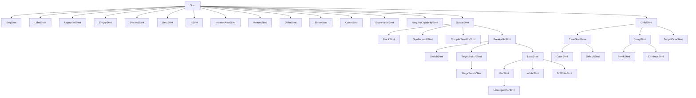

# Statements Reference

The reference for every concrete `Stmt` subclass in the Slang AST.
`Stmt` itself is documented in [base.md](base.md#stmt-modifiablesyntaxnode).

Audience: a contributor reading parser, checker, or IR-lowering code
that handles statements.

## Source

Statement classes are declared in
[slang-ast-stmt.h](../../../../source/slang/slang-ast-stmt.h). The
parser entry point is `parseStatement` in
[slang-parser.cpp](../../../../source/slang/slang-parser.cpp); the
function-body parsing happens lazily under the two-stage parsing
strategy explained in
[../pipeline/02-parse-ast.md](../pipeline/02-parse-ast.md).

## Family hierarchy

Statement nodes split along two axes: whether the statement
introduces a new lexical scope, and whether it can be the target of a
`break` (loops and `switch`) or `continue` (loops only). A separate
group of `ChildStmt`s holds statements that refer to an enclosing
`BreakableStmt`.

`BreakableStmt`s carry a `UniqueStmtIDNode* uniqueID` that
`ChildStmt`s reference via `targetOuterStmtID`. `UniqueStmtIDNode` is
declared in this header as a `Decl` subclass for serialization
convenience, even though it is not a real declaration; it is excluded
from the `## Nodes` table because it is not parsed as a statement.

## Nodes

| Class | Parent | Key fields | Grammar | Summary |
| --- | --- | --- | --- | --- |
| `SeqStmt` | `Stmt` | `stmts: List<Stmt*>` | (none) | A flat sequence of statements, used where a single statement is required (e.g. the body of an `if` written as multiple declarations). |
| `LabelStmt` | `Stmt` | `label: Token`, `innerStmt: Stmt*` | [labeled stmt](../syntax-reference/grammar.md#statements) | `label:` followed by a single statement. |
| `BlockStmt` | `ScopeStmt` | `body: Stmt*`, `closingSourceLoc` | [block](../syntax-reference/grammar.md#statements) | `{ ... }`; introduces a `ScopeDecl` for block-scoped declarations. |
| `UnparsedStmt` | `Stmt` | `tokens: List<Token>`, `sourceLanguage`, `currentScope`, `outerScope` | (none) | Reserved-content block deferred to a downstream compiler (e.g. inline HLSL). |
| `EmptyStmt` | `Stmt` | (no additional state) | [empty stmt](../syntax-reference/grammar.md#statements) | A bare `;`. |
| `DiscardStmt` | `Stmt` | (no additional state) | [discard](../syntax-reference/grammar.md#statements) | `discard` (fragment-shader pixel kill). |
| `DeclStmt` | `Stmt` | `decl: DeclBase*` | [decl stmt](../syntax-reference/grammar.md#statements) | A declaration used where a statement is expected (e.g. `int x = 1;` inside a body). |
| `IfStmt` | `Stmt` | `predicate: Expr*`, `positiveStatement: Stmt*`, `negativeStatement: Stmt*`, `afterLoc: SourceLoc` | [if](../syntax-reference/grammar.md#statements) | `if (...) ... else ...`. |
| `SwitchStmt` | `BreakableStmt` | `condition: Expr*`, `body: Stmt*` | [switch](../syntax-reference/grammar.md#statements) | `switch (cond) { ... }`. |
| `TargetCaseStmt` | `ChildStmt` | `capability: int32_t`, `capabilityToken: Token`, `body: Stmt*` | (none) | `case <capability>:` inside a `__target_switch`. |
| `TargetSwitchStmt` | `BreakableStmt` | `targetCases: List<TargetCaseStmt*>` | [__target_switch](../syntax-reference/grammar.md#statements) | Static dispatch by capability set. |
| `StageSwitchStmt` | `TargetSwitchStmt` | (inherits) | [__stage_switch](../syntax-reference/grammar.md#statements) | Static dispatch by pipeline stage. |
| `IntrinsicAsmStmt` | `Stmt` | `asmText: String`, `args: List<Expr*>` | (none) | Inline intrinsic-assembly statement used by core-module intrinsics. |
| `CaseStmt` | `CaseStmtBase` | `expr: Expr*`, `exprVal: Val*` | [case](../syntax-reference/grammar.md#statements) | `case <expr>:` inside a `switch`. |
| `DefaultStmt` | `CaseStmtBase` | (no additional state) | [default](../syntax-reference/grammar.md#statements) | `default:` inside a `switch`. |
| `GpuForeachStmt` | `ScopeStmt` | `device: Expr*`, `gridDims: Expr*`, `dispatchThreadID: VarDecl*`, `kernelCall: Expr*` | [gpu_foreach](../syntax-reference/grammar.md#statements) | Host-side compute-foreach over a grid. |
| `ForStmt` | `LoopStmt` | `initialStatement: Stmt*`, `predicateExpression: Expr*`, `sideEffectExpression: Expr*`, `statement: Stmt*` | [for](../syntax-reference/grammar.md#statements) | `for (init; cond; step) body`; the loop variable is scoped to the body. |
| `UnscopedForStmt` | `ForStmt` | (inherits) | (none) | Compatibility form for HLSL where the loop variable leaks into the surrounding scope. |
| `WhileStmt` | `LoopStmt` | `predicate: Expr*`, `statement: Stmt*` | [while](../syntax-reference/grammar.md#statements) | `while (cond) body`. |
| `DoWhileStmt` | `LoopStmt` | `statement: Stmt*`, `predicate: Expr*` | [do-while](../syntax-reference/grammar.md#statements) | `do body while (cond);`. |
| `CompileTimeForStmt` | `ScopeStmt` | `varDecl: VarDecl*`, `rangeBeginExpr`, `rangeEndExpr`, `rangeBeginVal`, `rangeEndVal`, `body: Stmt*` | [compile-time for](../syntax-reference/grammar.md#statements) | Range-based loop unrolled at compile time; emits no runtime loop. |
| `BreakStmt` | `JumpStmt` | `targetLabel: Token` | [break](../syntax-reference/grammar.md#statements) | `break` (optionally with a target label). |
| `ContinueStmt` | `JumpStmt` | (inherits) | [continue](../syntax-reference/grammar.md#statements) | `continue`. |
| `ReturnStmt` | `Stmt` | `expression: Expr*` | [return](../syntax-reference/grammar.md#statements) | `return` (optionally with an expression). |
| `DeferStmt` | `Stmt` | `statement: Stmt*` | [defer](../syntax-reference/grammar.md#statements) | `defer S;`; lowered to scope-exit handlers in the IR. |
| `ThrowStmt` | `Stmt` | `expression: Expr*` | [throw](../syntax-reference/grammar.md#statements) | `throw e;` for errorable functions. |
| `CatchStmt` | `Stmt` | `errorVar: ParamDecl*`, `tryBody: Stmt*`, `handleBody: Stmt*` | [try-catch](../syntax-reference/grammar.md#statements) | `try { ... } catch (e) { ... }` block; `errorVar == null` means a catch-all. |
| `ExpressionStmt` | `Stmt` | `expression: Expr*` | [expression stmt](../syntax-reference/grammar.md#statements) | An expression used for its side effects (`f();`, `a = b;`). |
| `RequireCapabilityStmt` | `Stmt` | `requiredCaps: List<Token>` | [require_capability](../syntax-reference/grammar.md#statements) | Statement-level capability requirement scoped to the enclosing function. |
| `UniqueStmtIDNode` | `Decl` | (no parsed state) | (none) | Synthesized identity helper that gives a statement a stable unique id; used by serialization and control-flow tracking rather than parsed as a statement. |

## Notable nodes

### BlockStmt and SeqStmt

`BlockStmt` is a `ScopeStmt`: it carries a `ScopeDecl* scopeDecl`
inherited from `ScopeStmt` so that block-local declarations participate
in lookup. `SeqStmt`, by contrast, is a flat container with no scope
of its own — it exists so that several statements can be presented
where a single `Stmt` slot is required, without introducing a new
scope. The parser uses `SeqStmt` to bundle parsed-together declarations
inside a single source statement (e.g. the canonical example is
multiple declarators in one `var` declaration).

### IfStmt

Holds the predicate and both branches as raw `Stmt*`. The
`negativeStatement` slot is null for an `if` without an `else`. The
`afterLoc` field records the source location immediately after the
`if` for diagnostic purposes (it is the location a language-server
client would jump to if the user navigates "after this `if`").

### SwitchStmt, CaseStmt, DefaultStmt

`SwitchStmt::body` is typically a `BlockStmt` containing a `SeqStmt`
of mixed `CaseStmt`, `DefaultStmt`, and other statements. The case
labels are not the parents of the statements that fall under them;
each `CaseStmt`/`DefaultStmt` is just a marker that the IR lowering
uses to slice the body into per-case blocks. `BreakStmt` inside a
`SwitchStmt` is matched via `BreakableStmt::uniqueID`.

### Loop family

`ForStmt`, `WhileStmt`, and `DoWhileStmt` all derive from `LoopStmt`,
which derives from `BreakableStmt` and `ScopeStmt`. `ForStmt::statement`
is the body; `initialStatement` is parsed as a statement (not an
expression) so that a `DeclStmt` can introduce loop variables.
`UnscopedForStmt` is the legacy HLSL form that does not scope the
loop variable to the body.

### CompileTimeForStmt

A range-based for whose bounds must be compile-time constants
(`rangeBeginVal` and `rangeEndVal` are `IntVal*` filled in by
checking). The IR lowering unrolls the loop and emits no runtime
loop instructions; the body is duplicated once per iteration. This
is the statement that backs Slang's `[ForceInline]`-style range
loops over generic value parameters.

### TargetSwitchStmt, StageSwitchStmt, TargetCaseStmt

A `TargetSwitchStmt` is a static dispatch chosen at compile time by
matching capabilities; each `TargetCaseStmt` carries an integer
capability index and a body. `StageSwitchStmt` is the same shape but
dispatches on pipeline stage rather than capability. Both are
resolved away during IR lowering; only one case body survives in the
emitted code.

### DeferStmt

Parses straightforwardly but is lowered specially: the statement is
not executed at the position it appears, but instead enqueued to run
when the enclosing scope exits (normally or via `return`/`break`/`throw`).
The IR pipeline materializes this as scope-exit handlers; see
[../pipeline/04-ast-to-ir.md](../pipeline/04-ast-to-ir.md).

### ThrowStmt and CatchStmt

The two halves of Slang's errorable-function model. A `CatchStmt`
holds both the protected body (`tryBody`) and the handler
(`handleBody`); the error parameter is a `ParamDecl` so that the
catch handler has a fully-typed local variable. A null `errorVar`
denotes a catch-all that does not bind the error value.

### DeclStmt and ExpressionStmt

These two boilerplate wrappers exist so that the statement grammar
remains uniform. `DeclStmt` lets any `DeclBase` appear in a statement
position (the canonical use is a local-variable declaration);
`ExpressionStmt` lets an arbitrary `Expr` be used for its side
effects. The checker validates each kind separately.

### LabelStmt and BreakStmt::targetLabel

Slang supports labeled statements and labeled breaks. `LabelStmt`
attaches a label token to an inner statement; `BreakStmt::targetLabel`
optionally names the enclosing labeled loop or switch to break out
of. Resolution of `targetLabel` to a `BreakableStmt::uniqueID` is
done by the checker.

### RequireCapabilityStmt

Asserts that the surrounding function requires the listed capability
atoms. The parser stores them as raw tokens; the checker resolves
each token to a capability via the capability system documented in
[../cross-cutting/targets.md](../cross-cutting/targets.md).

## See also

- [base.md](base.md) — `Stmt`, `ModifiableSyntaxNode` base classes.
- [declarations.md](declarations.md) — `DeclStmt` wraps any `DeclBase`.
- [expressions.md](expressions.md) — every `Expr*` slot in a
  statement.
- [../pipeline/02-parse-ast.md](../pipeline/02-parse-ast.md) — two-stage
  body parsing.
- [../pipeline/04-ast-to-ir.md](../pipeline/04-ast-to-ir.md) — IR
  lowering of `DeferStmt`, `ThrowStmt`, `CompileTimeForStmt`,
  `TargetSwitchStmt`.
- [../syntax-reference/grammar.md#statements](../syntax-reference/grammar.md#statements)
  — statement productions.
