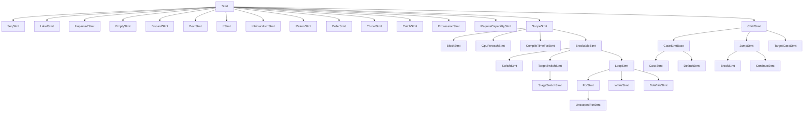

# Statements Reference

The reference for every concrete `Stmt` subclass in the Slang AST,
written for a contributor reading parser, checker, or IR-lowering code
that handles statements.
`Stmt` itself is documented in [base.md](base.md#stmt-modifiablesyntaxnode).

## Source

Statement classes are declared in
[slang-ast-stmt.h](../../../../source/slang/slang-ast-stmt.h). `Stmt`
itself is not declared there — it is one of the abstract roots in
[slang-ast-base.h](../../../../source/slang/slang-ast-base.h).

The parser entry point is `Parser::ParseStatement`
([slang-parser.cpp](../../../../source/slang/slang-parser.cpp) line
6914), a keyword-lookahead dispatcher that selects one of the
`Parse*Statement` / `parse*Stmt` helpers; `Parser::parseBlockStatement`
(line 7130) parses a `{ ... }` block. Function bodies are not parsed at
the same time as the declarations that own them: the parser runs in one
of two stages, `ParsingStage::Decl` or `ParsingStage::Body` (the
`ParsingStage` enum is at lines 86-90), and `parseOptBody` (line 2219)
records a `{`-delimited body as an `UnparsedStmt` instead of parsing it.
`parseUnparsedStmt` (line 9951) later re-enters with
`stage = ParsingStage::Body` and turns those tokens into a real
`BlockStmt`. See
[../pipeline/02-parse-ast.md](../pipeline/02-parse-ast.md) for the
surrounding two-stage strategy.

## Family hierarchy

Statement nodes split along two axes: whether the statement is a
`ScopeStmt` grouping — a structural base, only some of whose subclasses
are actually given a `ScopeDecl` — and whether it can be the target of a
`break` (loops and `switch`) or `continue` (loops only). A separate
group of `ChildStmt`s holds statements that refer to an enclosing
`BreakableStmt`.

```mermaid
flowchart TD
  Stmt --> SeqStmt
  Stmt --> LabelStmt
  Stmt --> UnparsedStmt
  Stmt --> EmptyStmt
  Stmt --> DiscardStmt
  Stmt --> DeclStmt
  Stmt --> IfStmt
  Stmt --> IntrinsicAsmStmt
  Stmt --> ReturnStmt
  Stmt --> DeferStmt
  Stmt --> ThrowStmt
  Stmt --> CatchStmt
  Stmt --> ExpressionStmt
  Stmt --> RequireCapabilityStmt
  Stmt --> ScopeStmt
  Stmt --> ChildStmt
  ScopeStmt --> BlockStmt
  ScopeStmt --> GpuForeachStmt
  ScopeStmt --> CompileTimeForStmt
  ScopeStmt --> BreakableStmt
  BreakableStmt --> SwitchStmt
  BreakableStmt --> TargetSwitchStmt
  BreakableStmt --> LoopStmt
  TargetSwitchStmt --> StageSwitchStmt
  LoopStmt --> ForStmt
  LoopStmt --> WhileStmt
  LoopStmt --> DoWhileStmt
  ForStmt --> UnscopedForStmt
  ChildStmt --> CaseStmtBase
  ChildStmt --> JumpStmt
  ChildStmt --> TargetCaseStmt
  CaseStmtBase --> CaseStmt
  CaseStmtBase --> DefaultStmt
  JumpStmt --> BreakStmt
  JumpStmt --> ContinueStmt
```

`BreakableStmt`s carry a `UniqueStmtIDNode* uniqueID` that
`ChildStmt`s reference via `targetOuterStmtID`. `UniqueStmtIDNode` is
declared in this header as a `Decl` subclass for serialization
convenience, even though it is not a real declaration; it is listed in
the `## Nodes` table as a helper because the header declares it with
`FIDDLE()`, even though it is not in the `Stmt` hierarchy and is not
parsed as a statement.

## Nodes

| Class | Parent | Key fields | Grammar | Summary |
| --- | --- | --- | --- | --- |
| `SeqStmt` | `Stmt` | `stmts: List<Stmt*>` | (none) | A flat sequence of statements, used where a single statement is required (e.g. the several statements of a `{ ... }` block). |
| `LabelStmt` | `Stmt` | `label: Token`, `innerStmt: Stmt*` | [labeled stmt](../syntax-reference/grammar.md#statements) | `label:` followed by a single statement. |
| `BlockStmt` | `ScopeStmt` | `body: Stmt*`, `closingSourceLoc: SourceLoc` | [block](../syntax-reference/grammar.md#statements) | `{ ... }`; introduces a `ScopeDecl` for block-scoped declarations. |
| `UnparsedStmt` | `Stmt` | `tokens: List<Token>`, `sourceLanguage: SourceLanguage`, `currentScope: Scope*`, `outerScope: Scope*` | (none) | A `{ ... }` function body captured as raw tokens during `ParsingStage::Decl`, to be re-parsed on demand. |
| `EmptyStmt` | `Stmt` | (no additional state) | [empty stmt](../syntax-reference/grammar.md#statements) | A bare `;`. |
| `DiscardStmt` | `Stmt` | (no additional state) | [discard](../syntax-reference/grammar.md#statements) | `discard` (fragment-shader pixel kill). |
| `DeclStmt` | `Stmt` | `decl: DeclBase*` | [decl stmt](../syntax-reference/grammar.md#statements) | A declaration used where a statement is expected (e.g. `int x = 1;` inside a body). |
| `IfStmt` | `Stmt` | `predicate: Expr*`, `positiveStatement: Stmt*`, `negativeStatement: Stmt*`, `afterLoc: SourceLoc` | [if](../syntax-reference/grammar.md#statements) | `if (...) ... else ...`; also the node an `if (let x = ...)` desugars into. |
| `SwitchStmt` | `BreakableStmt` | `condition: Expr*`, `body: Stmt*` | [switch](../syntax-reference/grammar.md#statements) | `switch (cond) { ... }`. |
| `TargetCaseStmt` | `ChildStmt` | `capability: int32_t`, `capabilityToken: Token`, `body: Stmt*` | [__target_switch](../syntax-reference/grammar.md#statements) | `case <capability>:` (or `default:`) inside a `__target_switch`; `capability` holds a `CapabilityName` code. |
| `TargetSwitchStmt` | `BreakableStmt` | `targetCases: List<TargetCaseStmt*>` | [__target_switch](../syntax-reference/grammar.md#statements) | Static dispatch by capability set. |
| `StageSwitchStmt` | `TargetSwitchStmt` | (inherits) | [__stage_switch](../syntax-reference/grammar.md#statements) | Static dispatch by pipeline stage. |
| `IntrinsicAsmStmt` | `Stmt` | `asmText: String`, `args: List<Expr*>` | [__intrinsic_asm](../syntax-reference/grammar.md#statements) | Inline intrinsic-assembly statement used by core-module intrinsics. |
| `CaseStmt` | `CaseStmtBase` | `expr: Expr*`, `exprVal: Val*` | [case](../syntax-reference/grammar.md#statements) | `case <expr>:` inside a `switch`. |
| `DefaultStmt` | `CaseStmtBase` | (no additional state) | [default](../syntax-reference/grammar.md#statements) | `default:` inside a `switch`. |
| `GpuForeachStmt` | `ScopeStmt` | `device: Expr*`, `gridDims: Expr*`, `dispatchThreadID: VarDecl*`, `kernelCall: Expr*` | [__GPU_FOREACH](../syntax-reference/grammar.md#statements) | Host-side compute-foreach over a grid, written as `__GPU_FOREACH(device, gridDims, LAMBDA(...) { ... })`. |
| `ForStmt` | `LoopStmt` | `initialStatement: Stmt*`, `sideEffectExpression: Expr*`, `predicateExpression: Expr*`, `statement: Stmt*` | [for](../syntax-reference/grammar.md#statements) | `for (init; cond; step) body`; the loop variable is scoped to the body. |
| `UnscopedForStmt` | `ForStmt` | (inherits) | [for](../syntax-reference/grammar.md#statements) | Same syntax as `ForStmt`, produced only for HLSL input, where the loop variable leaks into the surrounding scope. |
| `WhileStmt` | `LoopStmt` | `predicate: Expr*`, `statement: Stmt*` | [while](../syntax-reference/grammar.md#statements) | `while (cond) body`. |
| `DoWhileStmt` | `LoopStmt` | `statement: Stmt*`, `predicate: Expr*` | [do-while](../syntax-reference/grammar.md#statements) | `do body while (cond);`. |
| `CompileTimeForStmt` | `ScopeStmt` | `varDecl: VarDecl*`, `rangeBeginExpr: Expr*`, `rangeEndExpr: Expr*`, `body: Stmt*`; plus the checked `rangeBeginVal` / `rangeEndVal` `IntVal*`s | [compile-time for](../syntax-reference/grammar.md#statements) | Range-based loop unrolled at compile time; emits no runtime loop. |
| `BreakStmt` | `JumpStmt` | `targetLabel: Token` | [break](../syntax-reference/grammar.md#statements) | `break` (optionally with a target label). |
| `ContinueStmt` | `JumpStmt` | (inherits) | [continue](../syntax-reference/grammar.md#statements) | `continue`; unlike `break` it takes no label. |
| `ReturnStmt` | `Stmt` | `expression: Expr*` | [return](../syntax-reference/grammar.md#statements) | `return` (optionally with an expression). |
| `DeferStmt` | `Stmt` | `statement: Stmt*` | [defer](../syntax-reference/grammar.md#statements) | `defer S`; `statement` holds the deferred statement. |
| `ThrowStmt` | `Stmt` | `expression: Expr*` | [throw](../syntax-reference/grammar.md#statements) | `throw e` for errorable functions (`ParseThrowStatement` does not itself consume a trailing `;`). |
| `CatchStmt` | `Stmt` | `errorVar: ParamDecl*`, `tryBody: Stmt*`, `handleBody: Stmt*` | [do-catch](../syntax-reference/grammar.md#statements) | `do { ... } catch (e) { ... }`; `tryBody` is the protected body, `handleBody` the handler; `errorVar == null` means a catch-all. |
| `ExpressionStmt` | `Stmt` | `expression: Expr*` | [expression stmt](../syntax-reference/grammar.md#statements) | An expression used for its side effects (`f();`, `a = b;`). |
| `RequireCapabilityStmt` | `Stmt` | `requiredCaps: List<Token>` | [__requireCapability](../syntax-reference/grammar.md#statements) | `__requireCapability(...)`; statement-level capability requirement scoped to the enclosing function. |
| `UniqueStmtIDNode` | `Decl` | (no parsed state) | (none) | Synthesized identity helper that gives a statement a stable unique id; used by serialization and control-flow tracking rather than parsed as a statement. |

## Notable nodes

### BlockStmt and SeqStmt

`ScopeStmt` is the structural base shared by the control-flow
groupings that may own a lexical scope. Its single field,
`scopeDecl: ScopeDecl*`, is the container declaration that block-local
declarations are added to, so name lookup walking outward from a
statement finds them. Only four parser routines fill it in:
`Parser::parseBlockStatement` for `BlockStmt` (line 7141),
`Parser::ParseForStatement` for the scoped `for` (line 7417),
`parseGpuForeachStmt` (line 6738), and `parseCompileTimeForStmt`
(line 6858). `SwitchStmt` and `TargetSwitchStmt` inherit `ScopeStmt`
through `BreakableStmt` but leave `scopeDecl` null — a `switch` takes
its lexical scope from the `BlockStmt` the parser builds for its body
— and `WhileStmt` / `DoWhileStmt` introduce no scope of their own.
The whole `switch` body is therefore a single scope, which is visible
to a user: a variable declared under `case 1:` is still in scope under
`case 2:` and `default:`, and it shadows a same-named variable
declared outside the `switch` for the rest of the body.

`BlockStmt` is the simplest `ScopeStmt` — a `{ ... }` block whose
`body` is a *single* `Stmt`. `SeqStmt`, by contrast, is a flat container
with no scope of its own; it exists so that several statements can fill
a slot that holds only one `Stmt`. `Parser::parseBlockStatement` uses it
exactly that way: the first statement in a block becomes `body`
directly, and the second one causes a `SeqStmt` to be created and both
to be moved into it. An empty block gets an `EmptyStmt` body rather than
a null one. Two other places build a `SeqStmt`:
`Parser::parseIfLetStatement` (line 7284) and the per-case body loop in
`parseTargetSwitchStmtImpl` (line 6603).

### UnparsedStmt

An `UnparsedStmt` is not an exotic construct — it is the ordinary
first-stage representation of a function body. When the parser reaches
a `{` where a body is expected, `parseOptBody` (line 2219) does not
recurse into `parseBlockStatement`; it copies the tokens up to the
matching `}` into `UnparsedStmt::tokens` (terminated by a synthetic
end-of-file token) and records the two scopes that were in effect,
`currentScope` and `outerScope`. Callers such as the function-decl
parser at line 2410 treat the result as the decl's `body`.

The captured scopes are what makes the deferral safe: when the body is
finally needed, `parseUnparsedStmt` (line 9951) reinstalls them on a
fresh `Parser` configured with `stage = ParsingStage::Body` and calls
`parseBlockStatement`, so the body is parsed with exactly the lookup
environment it had at its original position. The result is a normal
`BlockStmt`, and an `UnparsedStmt` is not expected to survive into
later phases. The call site that triggers the re-parse lives in the
checker, outside this page's watched paths.

### IfStmt

Holds the predicate and both branches as raw `Stmt*`. The
`negativeStatement` slot is null for an `if` without an `else`. The
`afterLoc` field is the location the parser is looking at once both
branches have been consumed (`tokenReader.peekLoc()` at the end of
`Parser::parseIfStatement`, line 7373), i.e. the first token past the
whole `if`.

There is no dedicated node for `if let`. When `ParseStatement` sees
`let` two tokens after `if`, it calls `Parser::parseIfLetStatement`,
which desugars the form at parse time into a `SeqStmt` holding a
`DeclStmt` for a synthesized `$OptVar` binding followed by an ordinary
`IfStmt`; a second synthesized `LetDecl`, bound to `$OptVar.value`, is
prepended to the positive branch. A reader chasing `if let` through the
AST is therefore looking for `SeqStmt`, not a distinct class.

### SwitchStmt, CaseStmt, DefaultStmt

`SwitchStmt::body` is always a `BlockStmt` — `ParseSwitchStmt`
(line 6572) parses the `{ ... }` with `parseBlockStatement` — and that
block's body is normally a `SeqStmt` of mixed `CaseStmt`, `DefaultStmt`,
and other statements. The case labels are not the parents of the
statements that fall under them: `ParseCaseStmt` and `ParseDefaultStmt`
(lines 6584 and 6594) read only `case <expr> :` / `default :` and leave
the following statements as siblings, so each `CaseStmt`/`DefaultStmt`
is just a marker in the sequence. `BreakStmt` inside a `SwitchStmt` is
matched via `BreakableStmt::uniqueID`.

### Loop family

`ForStmt`, `WhileStmt`, and `DoWhileStmt` all derive from `LoopStmt`,
which derives from `BreakableStmt`, which in turn derives from
`ScopeStmt` — so every loop is `break`-able, though only `for` is given
a `ScopeDecl` of its own.
`ForStmt::statement` is the body; `initialStatement` is parsed as a
statement (not an expression) so that a `DeclStmt` can introduce loop
variables, and `Parser::ParseForStatement` (line 7392) diagnoses anything
that is not a `DeclStmt` or `ExpressionStmt` there, keeping the
constructed loop node so that parsing can recover. A block written in
that position — `for ({ int i = 0; } n < 3; n = n + 1)` — is the shape
that trips it, and what the user sees is `E20001`, "unexpected
statement, expected expression", reported on the offending statement.
`UnscopedForStmt` is the HLSL-compatibility form: the same function
creates it instead of a `ForStmt` when `getSourceLanguage()` is
`SourceLanguage::HLSL`, and in that case it fills in `scopeDecl` but
never pushes the scope, so the loop variable leaks into the surrounding
scope.

A `do` statement is parsed by `Parser::ParseDoStatement` (line 7516),
which parses the body first and only then decides what it built: a
following `while` produces a `DoWhileStmt`, a following `catch`
produces a `CatchStmt`, and anything else is an error.

### ReturnStmt

`return` is both a control-flow terminator and the carrier of the
function's result: `ReturnStmt::expression` is the returned `Expr*`,
or null for a bare `return` in a `void` function. The checker matches
the expression against the enclosing function's declared return type.

### CompileTimeForStmt

A range-based for whose bounds must be compile-time constants
(`rangeBeginVal` and `rangeEndVal` are `IntVal*` filled in by
checking). The parser produces it from the `$for (name in Range(...))`
syntax: `parseCompileTimeStmt` (line 6900) consumes the `$` and
`parseCompileTimeForStmt` (line 6854) the rest. `Range` is a required
literal keyword there — the parser reads it with `ReadToken("Range")`,
so any other identifier in that position is the parse error `E20004`,
"unexpected identifier, expected 'Range'". The one-argument form
`$for (i in Range(4))` leaves `rangeBeginExpr` null and iterates 0
through 3; a comma moves the first argument into `rangeBeginExpr`, so
`$for (i in Range(2, 5))` iterates 2 through 4 — the range is
half-open in both spellings. The loop variable is a `VarDecl` created
by the parser and added to the statement's own `ScopeDecl`, so the
body can refer to it.

### TargetSwitchStmt, StageSwitchStmt, TargetCaseStmt

A `TargetSwitchStmt` is a static dispatch chosen at compile time by
matching capabilities; each `TargetCaseStmt` carries a capability code
and a body. `StageSwitchStmt` is the same shape but dispatches on
pipeline stage rather than capability, and the two share a parser:
`parseTargetSwitchStmt` and `parseStageSwitchStmt` (lines 6699 and 6705)
differ only in which node they allocate before calling
`parseTargetSwitchStmtImpl`.

Two details of that shared implementation are not visible from the
table. First, the capability name is resolved during parsing:
`findCapabilityName` maps the token to a `CapabilityName`, which is
stored in `TargetCaseStmt::capability` as an `int32_t`, and an
unrecognized name is diagnosed immediately as
`Diagnostics::UnknownTargetName` — `E29110`,
`unknown target name '<name>'`. The case is still recorded, with
`capability` left at `CapabilityName::Invalid`, so semantic checking
reports a second error on the same label: `E36109`, "'Invalid' cannot
be used as a target_switch case." A `default:` label is recorded as a
`TargetCaseStmt` whose `capabilityToken` content has been emptied.
Second, labels stacked in front of one body (`case a: case b: ...`)
produce one `TargetCaseStmt` per label, all pointing at the *same*
body `Stmt`, so a consumer walking `targetCases` will see that body
more than once.

### DeferStmt

`Parser::ParseDeferStatement` (line 7571) reads the `defer` keyword and
then a single `Stmt` — so a deferred block needs no trailing semicolon —
and stores it in `DeferStmt::statement`. The node carries no other
state; when the deferred statement actually runs is decided by IR
lowering, not by the AST. Observably, it runs when the enclosing scope
exits — at the end of the block that contains the `defer`, and also
when the function leaves that scope early through a `return`. See
[../pipeline/04-ast-to-ir.md](../pipeline/04-ast-to-ir.md).

### ThrowStmt and CatchStmt

The two halves of Slang's errorable-function model. A `CatchStmt`
holds both the protected body (`tryBody`) and the handler
(`handleBody`); the error parameter is a `ParamDecl` so that the
catch handler has a fully-typed local variable. A null `errorVar`
denotes a catch-all that does not bind the error value.

Note that the statement-level spelling is `do { ... } catch (e) { ... }`
— there is no `try` statement; a `try` at statement position is routed
to `Parser::ParseExpressionStatement` because `try` is an expression
keyword. A `do` may be followed by several `catch` clauses, and
`Parser::ParseDoCatchStatement` (line 7482) chains them: it loops while
the next token is `catch`, using the `CatchStmt` it just built as the
`tryBody` of the next one, so `n` catch clauses become `n` nested
`CatchStmt`s and the outermost one is returned.

### DeclStmt, ExpressionStmt, and EmptyStmt

These boilerplate wrappers exist so that the statement grammar
remains uniform. `DeclStmt` lets any `DeclBase` appear in a statement
position (the canonical use is a local-variable declaration);
`ExpressionStmt` lets an arbitrary `Expr` be used for its side
effects. The checker validates each kind separately. `EmptyStmt` is
the node the parser emits for a bare `;`, so an empty statement slot
(for example, a loop body that is just `;`) still has a concrete
`Stmt`.

Choosing between the first two requires backtracking: for a statement
that starts with an identifier or `::`, `ParseStatement` speculatively
parses a type and, if an identifier follows, rewinds the token reader
and re-parses the whole thing as a declaration through
`Parser::parseVarDeclrStatement` (line 7237); otherwise it rewinds and
calls `ParseExpressionStatement`. A `;` immediately after an `if` is
suspicious rather than illegal, so that case still yields an `EmptyStmt`
but also reports `Diagnostics::UnintendedEmptyStatement` — the warning
`E20101`, "potentially unintended empty statement at this location; use
{} instead." Being a warning and not an error, it leaves the program
compiling.

### LabelStmt, BreakStmt, ContinueStmt, and DiscardStmt

Slang supports labeled statements and labeled breaks. `LabelStmt`
attaches a label token to an inner statement, and `ParseStatement`
selects `Parser::parseLabelStatement` (line 7227) when it sees an
identifier immediately followed by `:`; `BreakStmt::targetLabel`
optionally names the enclosing labeled loop or switch to break out
of. Resolution of `targetLabel` to a `BreakableStmt::uniqueID` is
done by semantic checking. `ContinueStmt` is the sibling `JumpStmt`
that restarts the nearest enclosing loop, and it accepts no label.
`DiscardStmt` is a
fragment-shader-only control-flow statement (`discard`) that kills the
current pixel and carries no operands.

### RequireCapabilityStmt

Asserts that the surrounding function requires the listed capability
atoms. `Parser::ParseRequireCapabilityStatement` (line 7601) recognizes
the `__requireCapability` keyword and validates each name as it is read,
via `findCapabilityName`; a name that does not resolve is dropped and
diagnosed as `Diagnostics::UnknownCapability` — `E36105`,
`unknown capability name '<name>'.` The accepted spelling inside a
function body is `__requireCapability(hlsl);`: the names are read as a
comma-separated list, so several atoms may be listed in one statement,
and the closing `)` must be followed by a `;`. Only the accepted tokens
are stored, still as raw `Token`s in `requiredCaps`, for the capability
system documented in
[../cross-cutting/targets.md](../cross-cutting/targets.md) to interpret.

## See also

- [base.md](base.md) — `Stmt`, `ModifiableSyntaxNode` base classes.
- [declarations.md](declarations.md) — `DeclStmt` wraps any `DeclBase`.
- [expressions.md](expressions.md) — every `Expr*` slot in a
  statement.
- [../pipeline/02-parse-ast.md](../pipeline/02-parse-ast.md) — two-stage
  body parsing.
- [../name-resolution/scopes.md](../name-resolution/scopes.md) — how the
  `ScopeDecl` a `ScopeStmt` owns participates in lookup.
- [../pipeline/04-ast-to-ir.md](../pipeline/04-ast-to-ir.md) — IR
  lowering of `DeferStmt`, `ThrowStmt`, `CompileTimeForStmt`,
  `TargetSwitchStmt`.
- [../syntax-reference/grammar.md#statements](../syntax-reference/grammar.md#statements)
  — statement productions.
