# Types Reference

The reference for every concrete `Type` subclass in the Slang AST,
written for a contributor reading checker or IR-lowering code that
inspects or constructs Slang types.

`Type` is internally a subclass of `Val`, not a direct child of
`NodeBase`; see [base.md](base.md#type-val) for the relationship. The
non-Type `Val` subhierarchy (decl-refs, integer values, witnesses,
modifier values) lives in [values.md](values.md).

## Source

Concrete type classes are declared in
[slang-ast-type.h](../../../../source/slang/slang-ast-type.h). The `Type`
and `Val` abstract bases are in
[slang-ast-base.h](../../../../source/slang/slang-ast-base.h), where
`Type` adds `getCanonicalType()` — a thin wrapper over `Val::resolve()` —
and the protected `m_astBuilderForReflection` back-pointer that exists
for the reflection API only. The sibling non-Type `Val` classes that show
up in type operands (`IntVal`s for extents, `SubtypeWitness`es for
conformance evidence) are declared in
[slang-ast-val.h](../../../../source/slang/slang-ast-val.h) and are
documented in [values.md](values.md).

The parsed type grammar enters through
[slang-parser.cpp](../../../../source/slang/slang-parser.cpp):
`_parseSimpleTypeSpec` reads the base type specifier,
`parsePostfixTypeSuffix` attaches array and pointer suffixes,
`parseFuncTypeExpr` builds function types, and `parseExpandExpr` /
`parseEachExpr` build the pack-expansion forms.

Many of the classes below are _magic types_: the C++ class carries the
behavior, but the declaration a user actually names is written in the
core module ([core.meta.slang](../../../../source/slang/core.meta.slang),
[hlsl.meta.slang](../../../../source/slang/hlsl.meta.slang), and the
GLSL/HLSL compatibility modules) and bound to the C++ class by a
`__magic_type(...)` attribute. Those module sources are not among this
page's watched paths, so a magic type added on the Slang side alone does
not mark this page stale; adding
[hlsl.meta.slang](../../../../source/slang/hlsl.meta.slang) to this
document's `watched_paths` in the manifest would close that gap.

To test whether an arbitrary `Type*` is a `DeclRefType` naming a
particular declaration, use the `isDeclRefTypeOf<T>` template declared
immediately after `DeclRefType` in
[slang-ast-type.h](../../../../source/slang/slang-ast-type.h) rather than
re-deriving the cast at the call site.

## Family hierarchy

```mermaid
flowchart TD
  NodeBase --> Val
  Val --> Type
  Type --> OverloadGroupType
  Type --> InitializerListType
  Type --> ErrorType
  Type --> BottomType
  Type --> DeclRefType
  Type --> TypeType
  Type --> NamedExpressionType
  Type --> FuncType
  Type --> AndType
  Type --> ModifiedType
  Type --> ExtractExistentialType
  Type --> ExistentialSpecializedType
  Type --> GenericDeclRefType
  Type --> NamespaceType
  Type --> PackTypeFamily["Pack / Each / Expand / FirstPackElement / ..."]
  DeclRefType --> ArithmeticExpressionType
  DeclRefType --> Fp8Type
  DeclRefType --> BFloat16Type
  DeclRefType --> BuiltinType
  DeclRefType --> ArrayExpressionType
  DeclRefType --> ConditionalType
  DeclRefType --> AtomicType
  DeclRefType --> TupleType
  DeclRefType --> ThisType
  ArithmeticExpressionType --> BasicExpressionType
  ArithmeticExpressionType --> VectorExpressionType
  ArithmeticExpressionType --> MatrixExpressionType
  ArithmeticExpressionType --> CoopVectorExpressionType
  ArithmeticExpressionType --> DifferentialPairType
  ArithmeticExpressionType --> DifferentialPtrPairType
  BuiltinType --> DataLayoutType
  BuiltinType --> ResourceType
  BuiltinType --> TextureShapeType
  BuiltinType --> StringTypeBase
  BuiltinType --> PtrTypeBase
  BuiltinType --> OptionalType
  BuiltinType --> NativeRefType
  BuiltinType --> SubpassInputType
  BuiltinType --> SamplerStateType
  BuiltinType --> UntypedResourceHandleType
  BuiltinType --> UntypedSamplerHandleType
  BuiltinType --> BuiltinGenericType
  BuiltinType --> OtherBuiltins["IBufferDataLayoutType, FeedbackType, TensorViewType, DynamicType, ..."]
  ResourceType --> TextureTypeBase
  TextureTypeBase --> TextureType
  TextureTypeBase --> GLSLImageType
  BuiltinGenericType --> PointerLikeType
  BuiltinGenericType --> HLSLStructuredBufferTypeBase
  BuiltinGenericType --> HLSLStreamOutputType
  BuiltinGenericType --> MeshOutputType
  PointerLikeType --> DescriptorHandleType
  PointerLikeType --> ParameterGroupType
  PointerLikeType --> GLSLShaderStorageBufferType
  ParameterGroupType --> UniformParameterGroupType
  ParameterGroupType --> VaryingParameterGroupType
  UniformParameterGroupType --> ConstantBufferType
  UniformParameterGroupType --> TextureBufferType
  UniformParameterGroupType --> ParameterBlockType
  PtrTypeBase --> PtrType
  PtrTypeBase --> ExplicitRefType
  PtrTypeBase --> ParamPassingModeType
  ParamPassingModeType --> OutParamTypeBase
  ParamPassingModeType --> RefParamType
  ParamPassingModeType --> BorrowInParamType
  OutParamTypeBase --> OutParamType
  OutParamTypeBase --> BorrowInOutParamType
```

Abstract intermediates: `ArithmeticExpressionType`, `Fp8Type`,
`BuiltinType`, `DataLayoutType`, `TextureShapeType`, `ResourceType`,
`TextureTypeBase`, `PointerLikeType`,
`HLSLStructuredBufferTypeBase`, `ParameterGroupType`,
`StringTypeBase`, `OutParamTypeBase`.

## Nodes

| Class                                        | Parent                         | Key fields                                                                                                      | Grammar                                                  | Summary                                                                                                                                                                                               |
| -------------------------------------------- | ------------------------------ | --------------------------------------------------------------------------------------------------------------- | -------------------------------------------------------- | ----------------------------------------------------------------------------------------------------------------------------------------------------------------------------------------------------- |
| `OverloadGroupType`                          | `Type`                         | (operand-encoded)                                                                                               | (none)                                                   | The pseudo-type of a reference to an overloaded name, i.e. one that lookup resolved to several candidates; collapsed by checking.                                                                     |
| `InitializerListType`                        | `Type`                         | (operand-encoded)                                                                                               | (none)                                                   | The pseudo-type of an initializer-list expression such as `{ a, b }`, before it has been coerced to a target type.                                                                                    |
| `ErrorType`                                  | `Type`                         | (operand-encoded)                                                                                               | (none)                                                   | The type of an expression that was erroneous, such as a use of an undeclared name; lets checking continue without cascading errors.                                                                   |
| `BottomType`                                 | `Type`                         | (operand-encoded)                                                                                               | (none)                                                   | The bottom/empty type that has no values; the result type of a function that can never return and the error type of one that cannot fail.                                                             |
| `DeclRefType`                                | `Type`                         | `declRef: DeclRef<Decl>`                                                                                        | [type ref](../syntax-reference/grammar.md#types)         | A type defined by reference to a declaration (`StructDecl`, `InterfaceDecl`, `EnumDecl`, ...).                                                                                                        |
| `TypeType`                                   | `Type`                         | `type: Type*`                                                                                                   | (none)                                                   | The type _of_ a type expression (i.e. the "kind" `Type`); `float` in `float(2)` has type `TypeType(float)`.                                                                                           |
| `NamedExpressionType`                        | `Type`                         | `declRef: DeclRef<TypeDefDecl>`                                                                                 | [typedef ref](../syntax-reference/grammar.md#types)      | A `typedef` / `typealias` alias; it prints under the alias name, but `getCanonicalType()` resolves it away to the aliased type.                                                                       |
| `NamespaceType`                              | `Type`                         | `declRef: DeclRef<NamespaceDeclBase>`                                                                           | (none)                                                   | The type of a namespace or module expression.                                                                                                                                                         |
| `GenericDeclRefType`                         | `Type`                         | `declRef: DeclRef<GenericDecl>`                                                                                 | (none)                                                   | A reference to a generic declaration without its arguments applied.                                                                                                                                   |
| `FuncType`                                   | `Type`                         | leading param `Type*` operands, then `result: Type*`, then `error: Type*`                                       | [function type](../syntax-reference/grammar.md#types)    | Function type with parameter types, result type, and error type.                                                                                                                                      |
| `BasicExpressionType`                        | `ArithmeticExpressionType`     | `baseType: BaseType` (`getBaseType()`)                                                                          | [basic type](../syntax-reference/grammar.md#types)       | Scalar built-in type: `int`, `uint`, `float`, `bool`, `void`, etc.                                                                                                                                    |
| `VectorExpressionType`                       | `ArithmeticExpressionType`     | `elementType: Type*, elementCount: IntVal*`                                                                     | [vector type](../syntax-reference/grammar.md#types)      | `vector<T,N>` / shorthand `float3`, `int4`, ...                                                                                                                                                       |
| `MatrixExpressionType`                       | `ArithmeticExpressionType`     | `elementType: Type*, rowCount: IntVal*, columnCount: IntVal*, layout: IntVal*`                                  | [matrix type](../syntax-reference/grammar.md#types)      | `matrix<T,R,C,L>` / `floatRxC`; also caches a private `rowType`.                                                                                                                                      |
| `CoopVectorExpressionType`                   | `ArithmeticExpressionType`     | `elementType: Type*, elementCount: IntVal*`                                                                     | (none)                                                   | Cooperative-vector type (subgroup-cooperative math).                                                                                                                                                  |
| `DifferentialPairType`                       | `ArithmeticExpressionType`     | `primalType: Type*` (`getPrimalType()`)                                                                         | (none)                                                   | Differential pair `__DifferentialPair<T>` used by autodiff.                                                                                                                                           |
| `DifferentialPtrPairType`                    | `ArithmeticExpressionType`     | `primalRefType: Type*` (`getPrimalRefType()`)                                                                   | (none)                                                   | Differential pair of pointers (for in-place gradients).                                                                                                                                               |
| `FloatE4M3Type`                              | `Fp8Type`                      | (operand-encoded)                                                                                               | (none)                                                   | 8-bit float with 4 exponent / 3 mantissa bits.                                                                                                                                                        |
| `FloatE5M2Type`                              | `Fp8Type`                      | (operand-encoded)                                                                                               | (none)                                                   | 8-bit float with 5 exponent / 2 mantissa bits.                                                                                                                                                        |
| `BFloat16Type`                               | `DeclRefType`                  | (operand-encoded)                                                                                               | (none)                                                   | 16-bit `bfloat`.                                                                                                                                                                                      |
| `ArrayExpressionType`                        | `DeclRefType`                  | `elementType: Type*, elementCount: IntVal*`                                                                     | [array type](../syntax-reference/grammar.md#types)       | Sized or unsized array of elements.                                                                                                                                                                   |
| `TupleType`                                  | `DeclRefType`                  | `members: Type*` (`getMemberCount()` / `getMember(i)`), `typePack: Type*`                                       | [tuple type](../syntax-reference/grammar.md#types)       | `(T1, T2, ...)` tuple.                                                                                                                                                                                |
| `ConditionalType`                            | `DeclRefType`                  | `valueType: Type*, hasValue: IntVal*`                                                                           | (none)                                                   | Compile-time conditional type.                                                                                                                                                                        |
| `AtomicType`                                 | `DeclRefType`                  | `elementType: Type*`                                                                                            | [type ref](../syntax-reference/grammar.md#types)         | `Atomic<T>`, the user-spellable wrapper over an `IAtomicable` element; its members are atomic intrinsics, so an update lowers to the target's atomic instruction rather than a load / modify / store. |
| `OptionalType`                               | `BuiltinType`                  | `valueType: Type*`                                                                                              | [optional type](../syntax-reference/grammar.md#types)    | `Optional<T>`.                                                                                                                                                                                        |
| `NativeRefType`                              | `BuiltinType`                  | `valueType: Type*` (`getValueType()`)                                                                           | (none)                                                   | Raw-pointer reference to a managed value.                                                                                                                                                             |
| `EnumTypeType`                               | `BuiltinType`                  | (operand-encoded)                                                                                               | (none)                                                   | The type of an `enum` type itself (its "kind").                                                                                                                                                       |
| `PtrTypeBase`                                | `BuiltinType`                  | `valueType: Type*, addressSpace: Val*, accessQualifier: Val*, dataLayout: Type*`                                | [pointer type](../syntax-reference/grammar.md#types)     | Concrete base for the pointer / reference / parameter-mode families; maps to a simple pointer at codegen.                                                                                             |
| `PtrType`                                    | `PtrTypeBase`                  | `valueType: Type* (inherited)`                                                                                  | [pointer type](../syntax-reference/grammar.md#types)     | `T*` raw pointer.                                                                                                                                                                                     |
| `ExplicitRefType`                            | `PtrTypeBase`                  | `valueType: Type* (inherited)`                                                                                  | (none)                                                   | `Ref<T>`, a reference type Slang code is allowed to name (unlike the parameter-mode wrappers).                                                                                                        |
| `ParamPassingModeType`                       | `PtrTypeBase`                  | (operand-encoded)                                                                                               | (none)                                                   | Common base for parameter-passing modes.                                                                                                                                                              |
| `OutParamType`                               | `OutParamTypeBase`             | (operand-encoded)                                                                                               | [out param](../syntax-reference/grammar.md#types)        | `out T` parameter type.                                                                                                                                                                               |
| `BorrowInOutParamType`                       | `OutParamTypeBase`             | (operand-encoded)                                                                                               | [inout param](../syntax-reference/grammar.md#types)      | `inout T` parameter type.                                                                                                                                                                             |
| `RefParamType`                               | `ParamPassingModeType`         | (operand-encoded)                                                                                               | (none)                                                   | `ref T` parameter type.                                                                                                                                                                               |
| `BorrowInParamType`                          | `ParamPassingModeType`         | (operand-encoded)                                                                                               | (none)                                                   | Immutable borrow input parameter, written `__constref` and printed as `borrow T`; an input-only counterpart of `inout`, not a `ref` mode.                                                             |
| `NullPtrType`                                | `BuiltinType`                  | (operand-encoded)                                                                                               | (none)                                                   | Type of `nullptr`.                                                                                                                                                                                    |
| `NoneType`                                   | `BuiltinType`                  | (operand-encoded)                                                                                               | (none)                                                   | Type of `none`.                                                                                                                                                                                       |
| `TextureType`                                | `TextureTypeBase`              | `elementType: Type*, sampleCount: Val*, format: Val*`                                                           | (none)                                                   | HLSL-flavor `Texture*<T>` (sampled).                                                                                                                                                                  |
| `GLSLImageType`                              | `TextureTypeBase`              | `elementType: Type*, sampleCount: Val*, format: Val*`                                                           | (none)                                                   | GLSL-flavor `image*` (storage).                                                                                                                                                                       |
| `TextureShape1DType`                         | `TextureShapeType`             | (operand-encoded)                                                                                               | (none)                                                   | Marker for 1D shape.                                                                                                                                                                                  |
| `TextureShape2DType`                         | `TextureShapeType`             | (operand-encoded)                                                                                               | (none)                                                   | Marker for 2D shape.                                                                                                                                                                                  |
| `TextureShape3DType`                         | `TextureShapeType`             | (operand-encoded)                                                                                               | (none)                                                   | Marker for 3D shape.                                                                                                                                                                                  |
| `TextureShapeCubeType`                       | `TextureShapeType`             | (operand-encoded)                                                                                               | (none)                                                   | Marker for cube shape.                                                                                                                                                                                |
| `TextureShapeBufferType`                     | `TextureShapeType`             | (operand-encoded)                                                                                               | (none)                                                   | Marker for buffer shape.                                                                                                                                                                              |
| `SubpassInputType`                           | `BuiltinType`                  | `elementType: Type*` (`getElementType()`)                                                                       | (none)                                                   | Vulkan subpass-input texture.                                                                                                                                                                         |
| `SamplerStateType`                           | `BuiltinType`                  | `flavor: SamplerStateFlavor` (`getFlavor()`)                                                                    | (none)                                                   | `SamplerState` / `SamplerComparisonState`.                                                                                                                                                            |
| `FeedbackType`                               | `BuiltinType`                  | `kind: FeedbackType::Kind` (`MinMip` / `MipRegionUsed`)                                                         | (none)                                                   | Sampler-feedback type.                                                                                                                                                                                |
| `RaytracingAccelerationStructureType`        | `UntypedBufferResourceType`    | (operand-encoded)                                                                                               | (none)                                                   | `RaytracingAccelerationStructure`.                                                                                                                                                                    |
| `GLSLInputAttachmentType`                    | `BuiltinType`                  | (operand-encoded)                                                                                               | (none)                                                   | GLSL input attachment.                                                                                                                                                                                |
| `DynamicResourceType`                        | `BuiltinType`                  | (operand-encoded)                                                                                               | (none)                                                   | Bindless / dynamic-resource handle.                                                                                                                                                                   |
| `DescriptorHandleType`                       | `PointerLikeType`              | `elementType: Type*` (inherited from `BuiltinGenericType`)                                                      | (none)                                                   | Bindless descriptor handle (`DescriptorHandle<T>`).                                                                                                                                                   |
| `UntypedResourceHandleType`                  | `BuiltinType`                  | (operand-encoded)                                                                                               | (none)                                                   | Opaque handle produced by `ResourceDescriptorHeap[i]`; wraps a `uint` heap index.                                                                                                                     |
| `UntypedSamplerHandleType`                   | `BuiltinType`                  | (operand-encoded)                                                                                               | (none)                                                   | Opaque handle produced by `SamplerDescriptorHeap[j]`; the sampler-side counterpart.                                                                                                                   |
| `TensorViewType`                             | `BuiltinType`                  | `elementType: Type*` (`getElementType()`)                                                                       | (none)                                                   | `TensorView` builtin over an element type.                                                                                                                                                            |
| `HLSLStructuredBufferType`                   | `HLSLStructuredBufferTypeBase` | (operand-encoded)                                                                                               | (none)                                                   | `StructuredBuffer<T>`.                                                                                                                                                                                |
| `HLSLRWStructuredBufferType`                 | `HLSLStructuredBufferTypeBase` | (operand-encoded)                                                                                               | (none)                                                   | `RWStructuredBuffer<T>`.                                                                                                                                                                              |
| `HLSLRasterizerOrderedStructuredBufferType`  | `HLSLStructuredBufferTypeBase` | (operand-encoded)                                                                                               | (none)                                                   | `RasterizerOrderedStructuredBuffer<T>`.                                                                                                                                                               |
| `HLSLAppendStructuredBufferType`             | `HLSLStructuredBufferTypeBase` | (operand-encoded)                                                                                               | (none)                                                   | `AppendStructuredBuffer<T>`.                                                                                                                                                                          |
| `HLSLConsumeStructuredBufferType`            | `HLSLStructuredBufferTypeBase` | (operand-encoded)                                                                                               | (none)                                                   | `ConsumeStructuredBuffer<T>`.                                                                                                                                                                         |
| `UntypedBufferResourceType`                  | `BuiltinType`                  | (operand-encoded)                                                                                               | (none)                                                   | Base for byte-address buffers and acceleration structures.                                                                                                                                            |
| `HLSLByteAddressBufferType`                  | `UntypedBufferResourceType`    | (operand-encoded)                                                                                               | (none)                                                   | `ByteAddressBuffer`.                                                                                                                                                                                  |
| `HLSLRWByteAddressBufferType`                | `UntypedBufferResourceType`    | (operand-encoded)                                                                                               | (none)                                                   | `RWByteAddressBuffer`.                                                                                                                                                                                |
| `HLSLRasterizerOrderedByteAddressBufferType` | `UntypedBufferResourceType`    | (operand-encoded)                                                                                               | (none)                                                   | `RasterizerOrderedByteAddressBuffer`.                                                                                                                                                                 |
| `GLSLAtomicUintType`                         | `BuiltinType`                  | (operand-encoded)                                                                                               | (none)                                                   | GLSL atomic counter.                                                                                                                                                                                  |
| `GLSLShaderStorageBufferType`                | `PointerLikeType`              | (operand-encoded)                                                                                               | (none)                                                   | GLSL SSBO.                                                                                                                                                                                            |
| `UniformParameterGroupType`                  | `ParameterGroupType`           | `elementType: Type*`, `layoutType: Type*` (`getLayoutType()`)                                                   | (none)                                                   | Common base for `ConstantBuffer<T>` and friends; carries the data-layout argument.                                                                                                                    |
| `VaryingParameterGroupType`                  | `ParameterGroupType`           | (operand-encoded)                                                                                               | (none)                                                   | Common base for GLSL input/output blocks.                                                                                                                                                             |
| `ConstantBufferType`                         | `UniformParameterGroupType`    | (operand-encoded)                                                                                               | (none)                                                   | `ConstantBuffer<T>` / HLSL `cbuffer`.                                                                                                                                                                 |
| `TextureBufferType`                          | `UniformParameterGroupType`    | (operand-encoded)                                                                                               | (none)                                                   | HLSL `tbuffer`.                                                                                                                                                                                       |
| `ParameterBlockType`                         | `UniformParameterGroupType`    | (operand-encoded)                                                                                               | (none)                                                   | Slang `ParameterBlock<T>`.                                                                                                                                                                            |
| `GLSLInputParameterGroupType`                | `VaryingParameterGroupType`    | (operand-encoded)                                                                                               | (none)                                                   | GLSL input variable block.                                                                                                                                                                            |
| `GLSLOutputParameterGroupType`               | `VaryingParameterGroupType`    | (operand-encoded)                                                                                               | (none)                                                   | GLSL output variable block.                                                                                                                                                                           |
| `IBufferDataLayoutType`                      | `BuiltinType`                  | (operand-encoded)                                                                                               | (none)                                                   | Layout-policy interface type.                                                                                                                                                                         |
| `DefaultDataLayoutType`                      | `DataLayoutType`               | (operand-encoded)                                                                                               | (none)                                                   | Slang default buffer layout.                                                                                                                                                                          |
| `DefaultPushConstantDataLayoutType`          | `DataLayoutType`               | (operand-encoded)                                                                                               | (none)                                                   | Default push-constant layout.                                                                                                                                                                         |
| `Std430DataLayoutType`                       | `DataLayoutType`               | (operand-encoded)                                                                                               | (none)                                                   | GLSL std430 layout.                                                                                                                                                                                   |
| `Std140DataLayoutType`                       | `DataLayoutType`               | (operand-encoded)                                                                                               | (none)                                                   | GLSL std140 layout.                                                                                                                                                                                   |
| `ScalarDataLayoutType`                       | `DataLayoutType`               | (operand-encoded)                                                                                               | (none)                                                   | Scalar block-layout policy (GLSL emit requires `GL_EXT_scalar_block_layout`).                                                                                                                         |
| `CDataLayoutType`                            | `DataLayoutType`               | (operand-encoded)                                                                                               | (none)                                                   | C-style layout.                                                                                                                                                                                       |
| `HLSLPatchType`                              | `BuiltinType`                  | `elementType: Type*, elementCount: IntVal*`                                                                     | (none)                                                   | Common base for HLSL patch types.                                                                                                                                                                     |
| `HLSLInputPatchType`                         | `HLSLPatchType`                | (operand-encoded)                                                                                               | (none)                                                   | `InputPatch<T,N>`.                                                                                                                                                                                    |
| `HLSLOutputPatchType`                        | `HLSLPatchType`                | (operand-encoded)                                                                                               | (none)                                                   | `OutputPatch<T,N>`.                                                                                                                                                                                   |
| `HLSLStreamOutputType`                       | `BuiltinGenericType`           | (operand-encoded)                                                                                               | (none)                                                   | Common base for geometry-shader stream outputs.                                                                                                                                                       |
| `HLSLPointStreamType`                        | `HLSLStreamOutputType`         | (operand-encoded)                                                                                               | (none)                                                   | `PointStream<T>`.                                                                                                                                                                                     |
| `HLSLLineStreamType`                         | `HLSLStreamOutputType`         | (operand-encoded)                                                                                               | (none)                                                   | `LineStream<T>`.                                                                                                                                                                                      |
| `HLSLTriangleStreamType`                     | `HLSLStreamOutputType`         | (operand-encoded)                                                                                               | (none)                                                   | `TriangleStream<T>`.                                                                                                                                                                                  |
| `MeshOutputType`                             | `BuiltinGenericType`           | `elementType: Type*, maxElementCount: IntVal*`                                                                  | (none)                                                   | Common base for mesh-shader output types.                                                                                                                                                             |
| `VerticesType`                               | `MeshOutputType`               | (operand-encoded)                                                                                               | (none)                                                   | Mesh-shader `vertices` output.                                                                                                                                                                        |
| `IndicesType`                                | `MeshOutputType`               | (operand-encoded)                                                                                               | (none)                                                   | Mesh-shader `indices` output.                                                                                                                                                                         |
| `PrimitivesType`                             | `MeshOutputType`               | (operand-encoded)                                                                                               | (none)                                                   | Mesh-shader `primitives` output.                                                                                                                                                                      |
| `StringType`                                 | `StringTypeBase`               | (operand-encoded)                                                                                               | (none)                                                   | The Slang `String` type.                                                                                                                                                                              |
| `NativeStringType`                           | `StringTypeBase`               | (operand-encoded)                                                                                               | (none)                                                   | Native `const char*`-style string.                                                                                                                                                                    |
| `DynamicType`                                | `BuiltinType`                  | (operand-encoded)                                                                                               | (none)                                                   | Dynamic-dispatch erased type.                                                                                                                                                                         |
| `BuiltinGenericType`                         | `BuiltinType`                  | `elementType: Type*` (`getElementType()`)                                                                       | (none)                                                   | Common base for built-in generic resource families.                                                                                                                                                   |
| `ThisType`                                   | `DeclRefType`                  | (interface decl-ref encoded)                                                                                    | (none)                                                   | Synthesized by checking to represent the `This` self type of an interface or extension.                                                                                                               |
| `ExtractExistentialType`                     | `Type`                         | `declRef: DeclRef<VarDeclBase>, originalInterfaceType: Type*, originalInterfaceDeclRef: DeclRef<InterfaceDecl>` | (none)                                                   | The "concrete inside" of an existential value, exposed after opening.                                                                                                                                 |
| `ExistentialSpecializedType`                 | `Type`                         | `baseType: Type*`, then `(val, witness)` operand pairs (`getArgCount()` / `getArg(i)`)                          | (none)                                                   | An existential specialized with concrete arguments and their witnesses.                                                                                                                               |
| `AndType`                                    | `Type`                         | `left: Type*, right: Type*`                                                                                     | [conjunction type](../syntax-reference/grammar.md#types) | `T & U` conformance-conjunction type.                                                                                                                                                                 |
| `ModifiedType`                               | `Type`                         | `base: Type*, modifiers: Val* (per index)`                                                                      | [type modifier](../syntax-reference/grammar.md#types)    | A base type with modifiers applied.                                                                                                                                                                   |
| `DifferentiableType`                         | `BuiltinType`                  | (operand-encoded)                                                                                               | (none)                                                   | Marker interface type for differentiable values.                                                                                                                                                      |
| `DifferentiablePtrType`                      | `BuiltinType`                  | (operand-encoded)                                                                                               | (none)                                                   | Marker for differentiable pointers.                                                                                                                                                                   |
| `DefaultInitializableType`                   | `BuiltinType`                  | (operand-encoded)                                                                                               | (none)                                                   | Marker for types that have a default constructor.                                                                                                                                                     |
| `FunctionBaseType`                           | `BuiltinType`                  | (operand-encoded)                                                                                               | (none)                                                   | Common interface base for callable types.                                                                                                                                                             |
| `DifferentiableFuncBaseType`                 | `BuiltinType`                  | (operand-encoded)                                                                                               | (none)                                                   | Base for differentiable-function interfaces.                                                                                                                                                          |
| `ForwardDiffFuncInterfaceType`               | `BuiltinType`                  | (operand-encoded)                                                                                               | (none)                                                   | Interface for forward-mode-differentiable functions.                                                                                                                                                  |
| `BwdCallableBaseType`                        | `BuiltinType`                  | (operand-encoded)                                                                                               | (none)                                                   | Base for backward-callable function types.                                                                                                                                                            |
| `BwdDiffFuncInterfaceType`                   | `BuiltinType`                  | (operand-encoded)                                                                                               | (none)                                                   | Interface for backward-mode-differentiable functions.                                                                                                                                                 |
| `LegacyBwdDiffFuncInterfaceType`             | `BuiltinType`                  | (operand-encoded)                                                                                               | (none)                                                   | Legacy backward-mode-differentiable interface.                                                                                                                                                        |
| `FwdDiffFuncType`                            | `BuiltinType`                  | (operand-encoded)                                                                                               | (none)                                                   | Concrete forward-mode-derivative function type.                                                                                                                                                       |
| `BwdDiffFuncType`                            | `BuiltinType`                  | (operand-encoded)                                                                                               | (none)                                                   | Concrete backward-mode-derivative function type.                                                                                                                                                      |
| `BwdCallableFuncType`                        | `BuiltinType`                  | (operand-encoded)                                                                                               | (none)                                                   | Backward-callable function type used during checking.                                                                                                                                                 |
| `ApplyForBwdFuncType`                        | `BuiltinType`                  | (operand-encoded)                                                                                               | (none)                                                   | Helper applied-for-backward function type.                                                                                                                                                            |
| `RematFuncType`                              | `BuiltinType`                  | (operand-encoded)                                                                                               | (none)                                                   | Rematerialization-helper function type.                                                                                                                                                               |
| `EachType`                                   | `Type`                         | `elementType: Type*` (`getElementType()`)                                                                       | [each](../syntax-reference/grammar.md#types)             | `each T` over a pack.                                                                                                                                                                                 |
| `ExpandType`                                 | `Type`                         | `patternType: Type*` plus captured-pack `Val*` operands                                                         | [expand](../syntax-reference/grammar.md#types)           | `expand` of a pattern over captured packs.                                                                                                                                                            |
| `PackBranchType`                             | `Type`                         | `packOperand: Val*, emptyType: Type*, nonEmptyType: Type*`                                                      | (none)                                                   | Pack-conditional type: selects a type depending on whether the pack is empty.                                                                                                                         |
| `FirstPackElementType`                       | `Type`                         | `basePack: Type*` (`getBasePack()`)                                                                             | (none)                                                   | First element of a pack.                                                                                                                                                                              |
| `LastPackElementType`                        | `Type`                         | `basePack: Type*` (`getBasePack()`)                                                                             | (none)                                                   | Last element of a pack.                                                                                                                                                                               |
| `TrimFirstTypePack`                          | `Type`                         | `basePack: Type*` (`getBasePack()`)                                                                             | (none)                                                   | Pack with the first element removed.                                                                                                                                                                  |
| `TrimLastTypePack`                           | `Type`                         | `basePack: Type*` (`getBasePack()`)                                                                             | (none)                                                   | Pack with the last element removed.                                                                                                                                                                   |
| `ConcreteTypePack`                           | `Type`                         | element `Type*` operands (`getTypeCount()` / `getElementType(i)`)                                               | (none)                                                   | Concrete (already-bound) type pack.                                                                                                                                                                   |
| `ValuePackType`                              | `Type`                         | `elementType: Type*` (`getElementType()`)                                                                       | (none)                                                   | The type of a generic value-pack parameter, e.g. `let each D : int`.                                                                                                                                  |

Note on "Key fields": `Type` is a `Val`, and `Val`s store their data
in the generic `m_operands: List<ValNodeOperand>` rather than as
per-class fields. Most concrete type classes therefore carry no
named C++ fields; their distinguishing data lives in their operand
list, accessed through `getOperand(i)` and the per-class accessors
named above. The rows that name accessors such as `getElementType()`
are describing operand slots, not declared members.

Two classes declare three real C++ members, and all of them are caches
rather than part of the value: `MatrixExpressionType` caches a
`rowType`, and `ExtractExistentialType` caches
`cachedThisTypeDeclRef: DeclRef<ThisTypeDecl>` and
`cachedSubtypeWitness: SubtypeWitness*`. The header states explicitly
that the `ExtractExistentialType` caches are filled in on demand, are
_not_ part of the logical value of the type, and must not be
serialized or hashed — which is what keeps hash-consing well defined
for that class (see
[values.md](values.md#hash-consing-and-the-astbuilder)).

## Notable nodes

### DeclRefType

By far the most common type. A `DeclRefType` carries a decl-ref to a
type declaration (`StructDecl`, `InterfaceDecl`, `EnumDecl`,
`TypeDefDecl`, `AssocTypeDecl`, ...) in operand slot 0, together with
whatever generic substitutions the decl-ref itself encodes. Almost
every user-declared type the front end sees is a `DeclRefType`; the
special-cased `Type` subclasses (`FuncType`, `AndType`, `ThisType`,
...) exist only for shapes that cannot be expressed through ordinary
declarations. Use `isDeclRefTypeOf<T>(type)` to ask whether a type is
a `DeclRefType` of a particular declaration class. See the `decl-ref`
entry in [../glossary.md](../glossary.md).

An important consequence: a core-module type only gets its own C++
class here when it is bound to one with `__magic_type(...)`. A builtin
declared with `__intrinsic_type(...)` alone — for example the
work-graph record types `NodeOutputArray` and `EmptyNodeOutputArray`
in
[workgraph.slang](../../../../source/standard-modules/experimental/workgraph.slang)
— has no `Type` subclass and is simply a `DeclRefType` naming the
core-module `struct`. Such types therefore have no row in the table
above; their compiler-side identity lives at the IR level instead
(see
[../cross-cutting/ir-instructions.md](../cross-cutting/ir-instructions.md)).

### BasicExpressionType, VectorExpressionType, MatrixExpressionType

The arithmetic-type leaves. They are `DeclRefType` descendants
because each is canonically introduced as a declaration in
[core.meta.slang](../../../../source/slang/core.meta.slang); the
dedicated subclasses exist so that arithmetic-specific helper APIs
(scalar-type-of, element-count, layout) can be exposed without
crawling the decl-ref.

Value boundaries belong to the leaf, not to the AST node. Each scalar
leaf is one fixed-width machine type, emitted once per `BaseType` tag
by the `__builtin_type` loop in
[core.meta.slang](../../../../source/slang/core.meta.slang), and its
operators are intrinsic ops, so arithmetic is the target's native
arithmetic at that width: an unsigned add past the top of the range
wraps rather than saturating or being diagnosed, so a `uint` holding
`0xFFFFFFFF` plus `1u` is `0`. The front end does step in for integer
_literals_: `_determineIntegerLiteralType` in
[slang-parser.cpp](../../../../source/slang/slang-parser.cpp) picks
the narrowest type that holds the value — `int`, then `int64`, for an
unsuffixed decimal — and diagnoses `IntegerLiteralTooLarge` for a
decimal literal past the range of `int64` instead of truncating it.

### ErrorType and BottomType

`ErrorType` is the type of any expression that failed to check, so
that downstream checking does not cascade. `BottomType` is the type
lattice's bottom element (semantically "no value"). `FuncType`
documents both of its uses: a function that can never return has the
bottom type as its result type, and a function that cannot fail has
the bottom type as its error type. Neither class declares operands, so
hash-consing gives each exactly one instance per `ASTBuilder`.

### ThisType and AssocTypeDecl

`ThisType` is the type of the `this` value inside a polymorphic
declaration. It is a `DeclRefType` referencing the interface's
synthetic `ThisTypeDecl` (see [declarations.md](declarations.md)), and
`ThisType::getInterfaceDeclRef()` recovers the interface it belongs
to. The combination is what lets generic specialization treat `This`
uniformly with concrete type substitution. An interface's associated
types work the same way: an `AssocTypeDecl` has no dedicated `Type`
class either, so `This.Foo` is an ordinary `DeclRefType` whose
decl-ref reaches the `AssocTypeDecl` through the conformance witness.

### ExtractExistentialType / ExistentialSpecializedType

`ExtractExistentialType` is the type one sees after "opening" an
existential (`some IFoo`) — it is a fresh, scope-local type that
witnesses subtyping against the interface. `ExistentialSpecializedType`
is its specialized counterpart used during IR lowering. Both are
documented further in
[../cross-cutting/ir-instructions.md](../cross-cutting/ir-instructions.md)
where the IR existential opcodes are catalogued.

### FuncType

The functional-type leaf: the operand list is the parameter types
followed by the result type and then the error type. A parameter's
qualifier is not stored beside its type — it _is_ part of the type,
because each parameter operand is the user-perceived type wrapped in a
parameter-mode type (`OutParamType` for `out T`,
`BorrowInOutParamType` for `inout T`, `RefParamType` for `ref T`), which
a caller must unwrap to recover the plain type and the passing mode. The
error-type slot is always present rather than optional: a callable that
cannot fail records the bottom type `Never` there, so only the failure
modes the type system models explicitly appear as a real error type.
Function-typed values
arise from `FuncTypeExpr`, from taking the address of a function, or
from higher-order expressions (see [expressions.md](expressions.md)).

### AndType

Represents an intersection of interface conformances: `T : IFoo & IBar`
yields an `AndType` of the two interface types. The checker uses
`AndType` to track conjunctive conformance requirements without
forcing the user to introduce a named composite interface.

### Resource and texture type families

The HLSL resource families (`TextureType`, `HLSLStructuredBufferType`
and its append/consume/RW variants, `ByteAddressBuffer` variants,
`ParameterBlockType`, `ConstantBufferType`) and the GLSL counterparts
(`GLSLImageType`, `GLSLShaderStorageBufferType`, the GLSL parameter
group types) are first-class types because each requires distinct
IR lowering and binding semantics on every backend. Most of them are
introduced through the core module and inherit from
`BuiltinGenericType` so that the generic-argument carrying machinery
is shared. The declarations that bind a user-nameable type to each of
these classes are the `__magic_type(TextureType)` and
`__magic_type(HLSLByteAddressBufferType)` intrinsics in
[hlsl.meta.slang](../../../../source/slang/hlsl.meta.slang), and the
`__magic_type(ConstantBufferType)`, `__magic_type(ParameterBlockType)`,
and `__magic_type(SamplerStateType, ...)` intrinsics in
[core.meta.slang](../../../../source/slang/core.meta.slang).

### UntypedResourceHandleType and UntypedSamplerHandleType

These two are the AST side of HLSL SM6.6 descriptor-heap indexing.
Writing `ResourceDescriptorHeap[i]` subscripts the core-module value
`ResourceDescriptorHeap`, whose type is the ordinary core-module struct
`__ResourceDescriptorHeapType`, and yields an `UntypedResourceHandle`;
`SamplerDescriptorHeap[j]` does the same through
`__SamplerDescriptorHeapType` and yields an `UntypedSamplerHandle`.
Only those two result types are magic: they are bound to
`UntypedResourceHandleType` and `UntypedSamplerHandleType` by
`__magic_type` in
[hlsl.meta.slang](../../../../source/slang/hlsl.meta.slang), while the
two heap structs themselves are plain `DeclRefType`s. The surface is
capability-gated: both heap subscripts and both handle constructors
carry `[require(glsl_hlsl_spirv_wgsl, descriptor_handle)]`, so writing
`ResourceDescriptorHeap[i]` outside that target set or without the
`descriptor_handle` capability is diagnosed. The gate is deliberately
repeated on the subscript so the diagnostic lands at the indexing site
rather than inside the core module. Each handle wraps
a single `uint` heap index and is deliberately untyped; the concrete
resource or sampler type is recovered from the target of the implicit
conversion, and the resource and sampler families are kept disjoint
because the per-kind conversions are declared separately. Both derive
from `BuiltinType` rather than `PointerLikeType`, because a handle is
not dereferenced to reach members of an element type. Neither type
survives to code emission — the handle is reduced back to its `uint`
heap index during IR lowering (see
[../cross-cutting/ir-instructions.md](../cross-cutting/ir-instructions.md)).

### Pack / variadic type family

`EachType`, `ExpandType`, `PackBranchType`,
`FirstPackElementType`/`LastPackElementType`,
`TrimFirstTypePack`/`TrimLastTypePack`, `ConcreteTypePack`,
`ValuePackType`: these together implement Slang's variadic /
type-pack support. They are mostly transient during checking; the
specialization machinery collapses them once a pack's arity becomes
known. The corresponding expression-level nodes live in
[expressions.md](expressions.md) (`ExpandExpr`, `EachExpr`,
`FirstExpr`/`LastExpr`/`TrimFirstExpr`/`TrimLastExpr`,
`ShapePackTransformExpr` family).

## See also

- [base.md](base.md) — `Val` / `Type` base classes and the operand
  encoding (`m_operands`).
- [values.md](values.md) — non-Type `Val`s (witnesses, integer
  values, substitutions) used in type operands.
- [declarations.md](declarations.md) — `StructDecl`, `InterfaceDecl`,
  `EnumDecl`, etc., that `DeclRefType` references.
- [expressions.md](expressions.md) — type-expression `Expr` nodes
  (`PointerTypeExpr`, `FuncTypeExpr`, ...) that resolve to types in
  this page.
- [modifiers.md](modifiers.md) — modifier nodes attached via
  `ModifiedType`.
- [../pipeline/02-parse-ast.md](../pipeline/02-parse-ast.md) — how the
  parser turns type syntax into type expressions, including the
  `_parseSimpleTypeSpec` and `parsePostfixTypeSuffix` entry points named
  in `## Source`.
- [../cross-cutting/ir-instructions.md](../cross-cutting/ir-instructions.md)
  — IR-level type opcodes and existential machinery.
- [../syntax-reference/grammar.md#types](../syntax-reference/grammar.md#types)
  — surface-syntax productions for types.
