# Values Reference

The reference for the **non-Type** `Val` subclasses in the Slang AST:
the `DeclRefBase` family, the `IntVal` family, the `Witness` family,
the `ModifierVal` family, the `DifferentiateVal` family, and a few
standalone Vals. It is for a contributor reading or writing checker /
IR-lowering code that touches compile-time values, conformance
witnesses, or generic specialization.

## Source

Non-Type `Val` classes are declared in
[slang-ast-val.h](../../../../source/slang/slang-ast-val.h). The `Val`
and `DeclRefBase` abstract bases are in
[slang-ast-base.h](../../../../source/slang/slang-ast-base.h). The
`Type` subhierarchy lives in [types.md](types.md); `Type` _is_ a
`Val`, but its concrete classes are documented there to keep this
page focused on the non-Type Vals.

The central operation on every class below is substitution.
`Val::substitute` and the lower-level `Val::substituteImpl` are
declared on `Val` in
[slang-ast-base.h](../../../../source/slang/slang-ast-base.h), and most
of the classes on this page provide a `_substituteImplOverride` that
rebuilds the node from substituted operands. The `SubstitutionSet`
those methods take is declared in
[slang-ast-support-types.h](../../../../source/slang/slang-ast-support-types.h),
but its two traversal members —
`SubstitutionSet::forEachGenericSubstitution` and
`SubstitutionSet::forEachSubstitutionArg` — are defined at the bottom
of [slang-ast-val.h](../../../../source/slang/slang-ast-val.h), and
show that a substitution set is a chain of `GenericAppDeclRef` and
`LookupDeclRef` links walked through `DeclRefBase::getBase()`. See
[Substitution and the substitution cache](#substitution-and-the-substitution-cache)
below.

Recall from [base.md](base.md#val-nodebase) that `Val`s are
hash-consed by the `ASTBuilder`: any two `Val`s built through
`ASTBuilder::getOrCreate` with the same discriminator and operand list
are the same `Val*`. The classes
listed below carry their data as generic
`m_operands: List<ValNodeOperand>`, not as per-class C++ fields; the
"Key fields" column therefore lists _operand slot_ semantics rather
than declared C++ fields, except for the few classes that add named
state (rare).

## Family hierarchy

```mermaid
flowchart TD
  Val --> Type
  Val --> DeclRefBase
  Val --> IntVal
  Val --> Witness
  Val --> ModifierVal
  Val --> DifferentiateVal
  Val --> UIntSetVal
  Val --> PolynomialIntValFactor
  Val --> PolynomialIntValTerm
  DeclRefBase --> DirectDeclRef
  DeclRefBase --> MemberDeclRef
  DeclRefBase --> LookupDeclRef
  DeclRefBase --> GenericAppDeclRef
  IntVal --> ConstantIntVal
  IntVal --> DeclRefIntVal
  IntVal --> TypeCastIntVal
  IntVal --> BuiltinOperationIntVal
  IntVal --> SizeOfLikeIntVal
  IntVal --> FirstIntVal
  IntVal --> LastIntVal
  IntVal --> ConcreteIntValPack
  IntVal --> TrimFirstIntValPack
  IntVal --> TrimLastIntValPack
  IntVal --> ShapeTransformIntValPack
  IntVal --> ExpandIntValPack
  IntVal --> EachIntVal
  IntVal --> WitnessLookupIntVal
  IntVal --> PolynomialIntVal
  IntVal --> ErrorIntVal
  SizeOfLikeIntVal --> SizeOfIntVal
  SizeOfLikeIntVal --> AlignOfIntVal
  SizeOfLikeIntVal --> CountOfIntVal
  ShapeTransformIntValPack --> ShapeConcatIntValPack
  ShapeTransformIntValPack --> ShapePermuteIntValPack
  ShapeTransformIntValPack --> ShapeSwapIntValPack
  ShapeTransformIntValPack --> ShapeReduceIntValPack
  Witness --> SubtypeWitness
  Witness --> TypeCoercionWitness
  Witness --> NoneWitness
  Witness --> HasDiffTypeInfoWitness
  Witness --> DeclaredVariadicPackCountWitness
  Witness --> ConcreteVariadicPackCountWitness
  Witness --> NonEmptyPackWitness
  SubtypeWitness --> TypePackSubtypeWitness
  SubtypeWitness --> EachSubtypeWitness
  SubtypeWitness --> FirstSubtypeWitness
  SubtypeWitness --> LastSubtypeWitness
  SubtypeWitness --> TrimFirstSubtypeWitness
  SubtypeWitness --> TrimLastSubtypeWitness
  SubtypeWitness --> PackBranchSubtypeWitness
  SubtypeWitness --> ExpandSubtypeWitness
  SubtypeWitness --> TypeEqualityWitness
  SubtypeWitness --> DeclaredSubtypeWitness
  SubtypeWitness --> DiffTypeInfoWitness
  SubtypeWitness --> HigherOrderDiffTypeTranslationWitness
  SubtypeWitness --> TransitiveSubtypeWitness
  SubtypeWitness --> ExtractExistentialSubtypeWitness
  SubtypeWitness --> DynamicSubtypeWitness
  TypeCoercionWitness --> BuiltinTypeCoercionWitness
  TypeCoercionWitness --> DeclRefTypeCoercionWitness
  ModifierVal --> TypeModifierVal
  TypeModifierVal --> ResourceFormatModifierVal
  TypeModifierVal --> NoDiffModifierVal
  ResourceFormatModifierVal --> UNormModifierVal
  ResourceFormatModifierVal --> SNormModifierVal
  DifferentiateVal --> ForwardDifferentiateVal
  DifferentiateVal --> BackwardDifferentiateVal
  DifferentiateVal --> BackwardDifferentiateIntermediateTypeVal
  DifferentiateVal --> BackwardDifferentiatePrimalVal
  DifferentiateVal --> BackwardDifferentiatePropagateVal
```

Abstract intermediates: `IntVal`, `SizeOfLikeIntVal`,
`ShapeTransformIntValPack`, `Witness`, `SubtypeWitness`,
`TypeCoercionWitness`.

## Nodes

### DeclRef family

`DeclRefBase` is the abstract base (declared in
[slang-ast-base.h](../../../../source/slang/slang-ast-base.h)); its
concrete subclasses below realise the different shapes a decl-ref
can take. The user-facing API is the template `DeclRef<T>`, declared
in [slang-ast-support-types.h](../../../../source/slang/slang-ast-support-types.h)
and described in [base.md](base.md#support-types).

The four shapes record _how_ a declaration was reached; they are not
four things a program can spell. `DirectDeclRef` and `MemberDeclRef`
differ only in whether the path to the declaration had to be written
out: a `DirectDeclRef` holds a bare `Decl` operand and so has nothing
to substitute, and a `MemberDeclRef` whose path is known to be static
folds back into one — `MemberDeclRef(DirectDeclRef(A), B)` becomes
`DirectDeclRef(B)`, per the comment at
[slang-ast-val.h](../../../../source/slang/slang-ast-val.h) lines
32-35. `GenericAppDeclRef` and `LookupDeclRef` are the two shapes that
add information beyond the path — an argument list and a
`SubtypeWitness` — and so are the two that can make decl-refs to the
same `Decl` denote different things.

| Class               | Parent        | Key fields                                                                                                      | Grammar | Summary                                                                                                |
| ------------------- | ------------- | --------------------------------------------------------------------------------------------------------------- | ------- | ------------------------------------------------------------------------------------------------------ |
| `DirectDeclRef`     | `DeclRefBase` | `decl: Decl` (`getDecl()`)                                                                                      | (none)  | A bare decl-ref to a `Decl` with no substitutions.                                                     |
| `MemberDeclRef`     | `DeclRefBase` | `decl: Decl`, `parent: DeclRefBase` (`getParentOperand()`)                                                      | (none)  | A decl-ref expressed relative to a parent decl-ref.                                                    |
| `LookupDeclRef`     | `DeclRefBase` | `decl: Decl` (the decl to look up), `lookupSource: Type`, `witness: SubtypeWitness`                             | (none)  | A decl-ref reached by lookup through a `SubtypeWitness` (used for interface-requirement satisfaction). |
| `GenericAppDeclRef` | `DeclRefBase` | `decl: Decl` (the inner decl), `genericDeclRef: DeclRefBase`, argument `Val` operands from slot 2 (`getArgs()`) | (none)  | A generic decl-ref with its arguments applied.                                                         |

### IntVal family

`IntVal` represents a compile-time integer value. Multiple kinds
exist because some forms (constants) are immediately reducible while
others (e.g. `DeclRefIntVal`) name an unsubstituted generic
parameter and only collapse to a constant after substitution.
Every `IntVal` stores its own `Type` in operand slot 0
(`IntVal::getType()`), so the "Key fields" column below lists only the
operands that follow that slot.

| Class                    | Parent                     | Key fields                                                                  | Grammar | Summary                                                                                                                                                                                                                  |
| ------------------------ | -------------------------- | --------------------------------------------------------------------------- | ------- | ------------------------------------------------------------------------------------------------------------------------------------------------------------------------------------------------------------------------ |
| `ConstantIntVal`         | `IntVal`                   | `value: IntegerLiteralValue` (`getValue()`)                                 | (none)  | A literal compile-time integer.                                                                                                                                                                                          |
| `DeclRefIntVal`          | `IntVal`                   | `declRef: DeclRef<VarDeclBase>` (to a value generic param)                  | (none)  | An unsubstituted generic value parameter.                                                                                                                                                                                |
| `TypeCastIntVal`         | `IntVal`                   | `base: Val` (`getBase()`)                                                   | (none)  | An integer cast to a different integer type (the target type is the node's own `type` operand), spelled as a conversion in a compile-time position — e.g. the array bound `int[int(N)]` over a `let N : uint` parameter. |
| `BuiltinOperationIntVal` | `IntVal`                   | `op: BuiltinOperationKind` (operand 1), arg `IntVal` operands (from slot 2) | (none)  | A still-symbolic builtin operator (e.g. `N / 2`); folds to a `ConstantIntVal` once its operands are concrete.                                                                                                            |
| `SizeOfIntVal`           | `SizeOfLikeIntVal`         | `valArg: Type` (`getValArg()`)                                              | (none)  | Compile-time `sizeof` of a type.                                                                                                                                                                                         |
| `AlignOfIntVal`          | `SizeOfLikeIntVal`         | `valArg: Type` (`getValArg()`)                                              | (none)  | Compile-time `alignof` of a type.                                                                                                                                                                                        |
| `CountOfIntVal`          | `SizeOfLikeIntVal`         | `valArg: Val` (`getValArg()`)                                               | (none)  | Compile-time `countof`; the argument is any `Val`, not only a type.                                                                                                                                                      |
| `FirstIntVal`            | `IntVal`                   | `basePack: Val`                                                             | (none)  | First element of an `IntVal` pack.                                                                                                                                                                                       |
| `LastIntVal`             | `IntVal`                   | `basePack: Val`                                                             | (none)  | Last element of an `IntVal` pack.                                                                                                                                                                                        |
| `ConcreteIntValPack`     | `IntVal`                   | element `IntVal` operands (`getCount()` / `getElement(i)`)                  | (none)  | An already-bound pack of integer values.                                                                                                                                                                                 |
| `TrimFirstIntValPack`    | `IntVal`                   | `basePack: Val`                                                             | (none)  | Pack with the first element removed.                                                                                                                                                                                     |
| `TrimLastIntValPack`     | `IntVal`                   | `basePack: Val`                                                             | (none)  | Pack with the last element removed.                                                                                                                                                                                      |
| `ShapeConcatIntValPack`  | `ShapeTransformIntValPack` | `leftPack: Val`, `rightPack: Val`, `axis: IntVal`                           | (none)  | Concatenate two `IntVal` packs along an axis.                                                                                                                                                                            |
| `ShapePermuteIntValPack` | `ShapeTransformIntValPack` | `valuePack: Val`, `orderPack: Val`                                          | (none)  | Permute an `IntVal` pack by an order pack.                                                                                                                                                                               |
| `ShapeSwapIntValPack`    | `ShapeTransformIntValPack` | `valuePack: Val`, `dim0: IntVal`, `dim1: IntVal`                            | (none)  | Swap two entries in an `IntVal` pack.                                                                                                                                                                                    |
| `ShapeReduceIntValPack`  | `ShapeTransformIntValPack` | `valuePack: Val`, `axis: IntVal`                                            | (none)  | Drop one axis from an `IntVal` pack.                                                                                                                                                                                     |
| `ExpandIntValPack`       | `IntVal`                   | `patternVal: Val` plus captured-pack operands                               | (none)  | An unexpanded value pattern over captured value packs (the value analogue of `ExpandType`).                                                                                                                              |
| `EachIntVal`             | `IntVal`                   | `basePack: Val`                                                             | (none)  | Indexes into a value pack during substitution using the substitution's `packExpansionIndex`.                                                                                                                             |
| `WitnessLookupIntVal`    | `IntVal`                   | `witness: SubtypeWitness`, `key: Decl` (`getKey()`)                         | (none)  | An integer value resolved through a witness-table lookup; spelled `T.Name` for a `static const int` interface requirement read through a type parameter's conformance, as `Shape.dimensions` is in `_Texture`.           |
| `PolynomialIntVal`       | `IntVal`                   | `constantTerm: IntegerLiteralValue` plus `PolynomialIntValTerm` operands    | (none)  | A polynomial in unsubstituted generic value parameters.                                                                                                                                                                  |
| `ErrorIntVal`            | `IntVal`                   | (type operand only)                                                         | (none)  | Error placeholder; lets checking continue when an integer value cannot be computed.                                                                                                                                      |

### Polynomial helpers

These are `Val`s (so they can be hash-consed) but are not `IntVal`s
themselves: they appear as operands of a `PolynomialIntVal`.

| Class                    | Parent | Key fields                                                                              | Grammar | Summary                                                                                           |
| ------------------------ | ------ | --------------------------------------------------------------------------------------- | ------- | ------------------------------------------------------------------------------------------------- |
| `PolynomialIntValFactor` | `Val`  | `param: IntVal`, `power: IntegerLiteralValue`                                           | (none)  | One factor `param^power` of a polynomial term.                                                    |
| `PolynomialIntValTerm`   | `Val`  | `constFactor: IntegerLiteralValue`, `paramFactors: OperandView<PolynomialIntValFactor>` | (none)  | One term of a `PolynomialIntVal`: a constant factor times a product of `PolynomialIntValFactor`s. |

### Witness family

`Witness`es are compile-time evidence that a subtyping relation
holds, that two types are equal, or that a coercion exists. They are
the things that get stored in `WitnessTable`s (see [base.md](base.md#support-types))
and that the checker passes around alongside generic substitutions.

#### Subtype witnesses

`SubtypeWitness` fixes operand slots 0 and 1 as the `sub` and `sup`
types (`getSub()` / `getSup()`), so the "Key fields" column lists only
the operands that follow them. The two differentiation witnesses
(`DiffTypeInfoWitness` and `HigherOrderDiffTypeTranslationWitness`)
are the exception: they use slot 0 for their own operand and do not
follow the `sub` / `sup` convention.

| Class                                   | Parent           | Key fields                                                                                                 | Grammar | Summary                                                                                                                     |
| --------------------------------------- | ---------------- | ---------------------------------------------------------------------------------------------------------- | ------- | --------------------------------------------------------------------------------------------------------------------------- |
| `DeclaredSubtypeWitness`                | `SubtypeWitness` | `declRef: DeclRef<Decl>` — the declaration that introduced the relation                                    | (none)  | Evidence reported by an in-scope declaration (an `InheritanceDecl`, or a `GenericTypeConstraintDecl` for a `where` clause). |
| `TransitiveSubtypeWitness`              | `SubtypeWitness` | `subToMid: SubtypeWitness`, `midToSup: SubtypeWitness`                                                     | (none)  | Subtype evidence obtained by composing two existing witnesses.                                                              |
| `TypeEqualityWitness`                   | `SubtypeWitness` | (`sub` / `sup` only)                                                                                       | (none)  | Evidence that two types are equal (a special case of subtyping that goes both ways).                                        |
| `ExtractExistentialSubtypeWitness`      | `SubtypeWitness` | `declRef: DeclRef<VarDeclBase>` — the opened existential value                                             | (none)  | Evidence carried by an opened existential value.                                                                            |
| `DynamicSubtypeWitness`                 | `SubtypeWitness` | (`sub` / `sup` only)                                                                                       | (none)  | Evidence that a user-supplied `__Dynamic` type argument satisfies an existential type parameter.                            |
| `TypePackSubtypeWitness`                | `SubtypeWitness` | per-element `SubtypeWitness` operands (`getCount()` / `getWitness(i)`)                                     | (none)  | Element-wise pack subtyping.                                                                                                |
| `EachSubtypeWitness`                    | `SubtypeWitness` | `patternTypeWitness: SubtypeWitness`                                                                       | (none)  | `each` over a pack witness.                                                                                                 |
| `FirstSubtypeWitness`                   | `SubtypeWitness` | `patternTypeWitness: SubtypeWitness`                                                                       | (none)  | First element of a pack witness.                                                                                            |
| `LastSubtypeWitness`                    | `SubtypeWitness` | `patternTypeWitness: SubtypeWitness`                                                                       | (none)  | Last element of a pack witness.                                                                                             |
| `TrimFirstSubtypeWitness`               | `SubtypeWitness` | `patternTypeWitness: SubtypeWitness`                                                                       | (none)  | Pack witness with the first element trimmed.                                                                                |
| `TrimLastSubtypeWitness`                | `SubtypeWitness` | `patternTypeWitness: SubtypeWitness`                                                                       | (none)  | Pack witness with the last element trimmed.                                                                                 |
| `PackBranchSubtypeWitness`              | `SubtypeWitness` | `packOperand: Val`, `emptyWitness: SubtypeWitness`, `nonEmptyWitness: SubtypeWitness`                      | (none)  | Pack-conditional subtype witness: selects a witness depending on whether the pack is empty.                                 |
| `ExpandSubtypeWitness`                  | `SubtypeWitness` | `patternTypeWitness: SubtypeWitness`                                                                       | (none)  | `expand` of a pattern witness.                                                                                              |
| `DiffTypeInfoWitness`                   | `SubtypeWitness` | `thisParamType: Type`, `thisTypeDiffWitness`, `returnTypeDiffWitness`, per-parameter witnesses from slot 3 | (none)  | Bundles the differential-type witnesses for a callable's `this`, return, and parameter types.                               |
| `HigherOrderDiffTypeTranslationWitness` | `SubtypeWitness` | `baseWitness: Witness`                                                                                     | (none)  | Evidence for higher-order differentiable-type translation.                                                                  |

#### Type-coercion witnesses

| Class                        | Parent                | Key fields                                                 | Grammar | Summary                                                |
| ---------------------------- | --------------------- | ---------------------------------------------------------- | ------- | ------------------------------------------------------ |
| `BuiltinTypeCoercionWitness` | `TypeCoercionWitness` | `fromType: Type`, `toType: Type`                           | (none)  | Coercion evidence for built-in conversions.            |
| `DeclRefTypeCoercionWitness` | `TypeCoercionWitness` | `fromType: Type`, `toType: Type`, `declRef: DeclRef<Decl>` | (none)  | Coercion evidence backed by a user-defined conversion. |

#### Other witnesses

| Class                              | Parent    | Key fields                                                 | Grammar | Summary                                                                                                             |
| ---------------------------------- | --------- | ---------------------------------------------------------- | ------- | ------------------------------------------------------------------------------------------------------------------- |
| `NoneWitness`                      | `Witness` | (no operands)                                              | (none)  | The "none" value of an optional constraint.                                                                         |
| `HasDiffTypeInfoWitness`           | `Witness` | `declRef: DeclRef<HasDiffTypeInfoConstraintDecl>`          | (none)  | Evidence carried by a `HasDiffTypeInfoConstraintDecl`.                                                              |
| `DeclaredVariadicPackCountWitness` | `Witness` | `declRef: DeclRef<GenericVariadicPackCountConstraintDecl>` | (none)  | Unsubstituted evidence for a variadic-pack count constraint, carried by a `GenericVariadicPackCountConstraintDecl`. |
| `ConcreteVariadicPackCountWitness` | `Witness` | `actualCount: IntVal`, `expectedCount: IntVal`             | (none)  | Evidence that a pack's actual element count matches the count a constraint expects.                                 |
| `NonEmptyPackWitness`              | `Witness` | `pack: Val`                                                | (none)  | Evidence that a type pack is non-empty.                                                                             |

### Modifier values

`ModifierVal` is a `Val` representation of a modifier that needs to
participate in deduplication (rather than the AST `Modifier`s that
live in [modifiers.md](modifiers.md)). These values are stored by
`ModifiedType` to track type-level modifiers; checking a
`ModifiedTypeExpr` is what produces them, by converting that
expression's syntax-level `Modifiers` into `Val`s before building the
`ModifiedType`.

Because the value ends up on the _type_, it stays there for the rest
of the compile, and every later decision made about that type sees
it. [core.meta.slang](../../../../source/slang/core.meta.slang)
declares `unorm` and `snorm` (lines 44-60 and 62-78) as marking a
buffer or texture element type as backed by normalized data, states
that the modifier does not change the semantics of a `float` or
vector that carries it, and notes that some platforms require the
qualifier while others operate correctly without it — so how much of
a `ResourceFormatModifierVal` survives into generated code is a
per-target decision. The modified element type is not interchangeable
with the unmodified one in those decisions: the core module's WGSL
texture check `__wgsl_check_texture_type` in
[hlsl.meta.slang](../../../../source/slang/hlsl.meta.slang) (lines
1130-1134) requires the texel type to be `float`, `int`, `uint` or a
vector of one of them, and a `unorm`-modified element type fails that
`static_assert` where the bare spelling passes. Which spelling each
target actually emits is decided in the emitters, which are not in
this page's `watched_paths`; see
[../pipeline/06-emit.md](../pipeline/06-emit.md).

| Class                       | Parent                      | Key fields    | Grammar | Summary                                                    |
| --------------------------- | --------------------------- | ------------- | ------- | ---------------------------------------------------------- |
| `ModifierVal`               | `Val`                       | (no operands) | (none)  | Concrete base for type-level modifier values.              |
| `TypeModifierVal`           | `ModifierVal`               | (no operands) | (none)  | Modifier that adjusts a type.                              |
| `ResourceFormatModifierVal` | `TypeModifierVal`           | (no operands) | (none)  | Modifier that constrains the storage format of a resource. |
| `UNormModifierVal`          | `ResourceFormatModifierVal` | (no operands) | (none)  | `unorm` resource format.                                   |
| `SNormModifierVal`          | `ResourceFormatModifierVal` | (no operands) | (none)  | `snorm` resource format.                                   |
| `NoDiffModifierVal`         | `TypeModifierVal`           | (no operands) | (none)  | `no_diff` type-level modifier.                             |

### Differentiation values

The `DifferentiateVal` family represents compile-time evidence of
how to differentiate a callable: every node stores just the `DeclRef` of
the function being differentiated, and the concrete subclass says which
derivative is meant — forward or backward mode, or one of the
backward-derivative artifacts (intermediate type, primal, propagate).
The corresponding surface syntax is `ForwardDifferentiateExpr` /
`BackwardDifferentiateExpr`, see [expressions.md](expressions.md).
The watched headers declare these shapes but contain no construction
site for them; naming the producer would require adding the semantic
checking sources to this page's `watched_paths`.

| Class                                      | Parent             | Key fields                          | Grammar | Summary                                                                                      |
| ------------------------------------------ | ------------------ | ----------------------------------- | ------- | -------------------------------------------------------------------------------------------- |
| `DifferentiateVal`                         | `Val`              | `func: DeclRef<Decl>` (`getFunc()`) | (none)  | Concrete base for differentiation Vals; represents the result of differentiating a function. |
| `ForwardDifferentiateVal`                  | `DifferentiateVal` | `func: DeclRef<Decl>`               | (none)  | Forward-mode derivative.                                                                     |
| `BackwardDifferentiateVal`                 | `DifferentiateVal` | `func: DeclRef<Decl>`               | (none)  | Backward-mode derivative.                                                                    |
| `BackwardDifferentiateIntermediateTypeVal` | `DifferentiateVal` | `func: DeclRef<Decl>`               | (none)  | Intermediate-type of a backward derivative.                                                  |
| `BackwardDifferentiatePrimalVal`           | `DifferentiateVal` | `func: DeclRef<Decl>`               | (none)  | Primal companion of a backward derivative.                                                   |
| `BackwardDifferentiatePropagateVal`        | `DifferentiateVal` | `func: DeclRef<Decl>`               | (none)  | Propagate-phase Val of a backward derivative.                                                |

### Misc Vals

| Class        | Parent | Key fields                            | Grammar | Summary                                             |
| ------------ | ------ | ------------------------------------- | ------- | --------------------------------------------------- |
| `UIntSetVal` | `Val`  | sequence of `ConstantIntVal` bitmasks | (none)  | A hash-consed bitset used by the capability system. |

## Notable nodes

### IntVal and why integer values are first-class Vals

Integer values appear in many places where a static value is needed:
array sizes (`int[N]`), generic value arguments, `countof` /
`sizeof` / `alignof` expressions, and capability-system bitsets.
Some of those positions need to remain abstract until a generic is
specialized — i.e. you might have a type like `int[N]` where `N` is
a generic parameter, not yet known. Modeling integer values as
`Val`s gives Slang a single substitutable-and-hash-consable
representation for both "fully known" and "still-symbolic" integers.
`ConstantIntVal` is the leaf for a known constant;
`DeclRefIntVal`, `WitnessLookupIntVal`, `BuiltinOperationIntVal`, and
`PolynomialIntVal` are the symbolic forms. `IntVal` also carries the
link-time-constant hooks `isLinkTimeVal()` / `linkTimeResolve()`, so a
value can stay symbolic past semantic checking and be resolved from a
mangled-name-to-value map at link time; a `DeclRefIntVal` whose
referenced declaration carries `ExternModifier` is the form that
reports itself as link-time, and `TypeCastIntVal`,
`BuiltinOperationIntVal`, and `PolynomialIntVal` propagate the property
through their operands.

### PolynomialIntVal and polynomial canonicalization

`PolynomialIntVal` stores a polynomial in zero or more unsubstituted
integer parameters: a constant plus a list of `PolynomialIntValTerm`s,
each of which is a coefficient times a product of
`PolynomialIntValFactor`s. The checker uses this representation so
that equations like `2*N + 3 == 3 + 2*N` resolve to the same
hash-consed `PolynomialIntVal*`, which is essential for type
equality on dependent array types.

### BuiltinOperationIntVal and the single-representation invariant

`BuiltinOperationIntVal` is the symbolic form of a builtin operator
whose operands are not all concrete yet — for example `N / 2` where
`N` is a generic value parameter. It identifies the operator by a
`BuiltinOperationKind` enum (stored in operand slot 1) rather than a
resolved operator `DeclRef`, so the same `IntVal` shape is used
whether the expression was rewritten by the fast path
(`BuiltinOperatorExpr`) or reached as a resolved operator call (`?:`,
`&&`, `||`, or operators on enum / generic operands). It re-evaluates
on substitution and folds to a `ConstantIntVal` once its operands
become concrete. By invariant it is never constructed for `+`, `-`,
`*`, or unary `-`: those are always a `PolynomialIntVal` so value
unification can canonicalize them, and the constructor
`SLANG_ASSERT`s this. (`BuiltinOperationKind` is documented in
[base.md](base.md#support-types).)

### Witness and witness-table evidence

A `Witness` is the "proof" portion of a conformance claim: whenever
the checker proves "`T : I`", it constructs a witness, which is
compile-time conformance evidence recorded during semantic checking
and consumed by later stages. `DeclaredSubtypeWitness`
represents the proof carried by an `InheritanceDecl` on `T`;
`TransitiveSubtypeWitness` represents the composition of two such
proofs along an inheritance chain; `TypeEqualityWitness` represents
the special case where the subtype relation is two-way equality. See
the `witness table` entry in [../glossary.md](../glossary.md).

### TypeEqualityWitness

`TypeEqualityWitness` is the identity proof that a type is a subtype of
itself, and the checker builds one (through
`SemanticsVisitor::createTypeEqualityWitness`, which calls
`ASTBuilder::getTypeEqualityWitness`) whenever a subtype obligation is
discharged because the two types are the same type rather than by an
inheritance step — the self facet of a non-decl-ref type in the
inheritance graph, and the opened/projected type produced when an
existential is unpacked, are the main cases. It is not the only way
equality evidence is spelled: a declared equality constraint such as
`where T == U` yields a `DeclaredSubtypeWitness` whose `isEquality()`
is true, which is a different class. Code that must accept either form
calls the `isTypeEqualityWitness` helper at the end of
[slang-ast-val.h](../../../../source/slang/slang-ast-val.h) (lines
1352-1388), which also looks through the pack witnesses. Every
construction site funnels through
`SemanticsVisitor::createTypeEqualityWitness` in
[slang-check-conformance.cpp](../../../../source/slang/slang-check-conformance.cpp)
(line 531), which just forwards to `ASTBuilder::getTypeEqualityWitness`.
Its callers are in
[slang-check-inheritance.cpp](../../../../source/slang/slang-check-inheritance.cpp):
line 699 builds the self facet of a non-decl-ref type, and lines 2024
and 2084 build the extracted and projected types of an opened
existential.

### SubtypeWitness across packs

`TypePackSubtypeWitness`, `EachSubtypeWitness`, the `First`/`Last`/
`TrimFirst`/`TrimLast` variants, `PackBranchSubtypeWitness`, and
`ExpandSubtypeWitness` mirror the type-pack operators (see
[types.md](types.md)) at the witness level. The checker carries
one witness per element of a type pack so that variadic generics can
be type-checked element-wise. Separately, the _count_ of a variadic
pack carries its own evidence: `DeclaredVariadicPackCountWitness`
holds the still-symbolic count from a
`GenericVariadicPackCountConstraintDecl`, and
`ConcreteVariadicPackCountWitness` pairs the count a bound pack
actually has (`actualCount: IntVal`) with the count the constraint
asks for (`expectedCount: IntVal`); the former resolves into the
latter once the pack is bound. Both operands of the concrete form are
`IntVal`s, so the witness is comparing counts rather than holding on
to the pack itself.

### ExtractExistentialSubtypeWitness

When an existential value is opened (e.g. inside a generic that takes
`some IFoo`), the checker manufactures an
`ExtractExistentialSubtypeWitness` proving that the freshly-introduced
opened-existential type conforms to the interface bound.

### DeclRef family and the four shapes a decl-ref can take

A `DeclRef<T>` is more than "pointer to `Decl`": it also records
_how_ the declaration was reached. `DirectDeclRef` is the simple
case. `MemberDeclRef` is "this member of this parent decl-ref".
`GenericAppDeclRef` wraps an existing decl-ref in generic-argument
substitutions. `LookupDeclRef` represents a decl found by
witness-table lookup — it carries a witness operand, so that
specializing the generic value also specializes the lookup. This
fan-out is why the user-facing `DeclRef<T>` template (in
[slang-ast-support-types.h](../../../../source/slang/slang-ast-support-types.h))
is just a typed wrapper around a `DeclRefBase*`.

### Hash-consing and the ASTBuilder

Almost every `Val` (and therefore almost every class on this page) is
hash-consed by `ASTBuilder::getOrCreate*` (and its many specialized
helpers). Two `Val`s created through those entry points with the same
dynamic class and the same operand list are guaranteed to be the same
`Val*`. The exception on this page is `DifferentiateVal`: its
`_substituteImplOverride` builds the substituted replacement with
`ASTBuilder::createByNodeType`, which instantiates the node directly
instead of consulting the `getOrCreate` cache, so two equal substituted
`DifferentiateVal`s can be distinct pointers. This means the
checker can use pointer equality as type / value equality, but it
also means _all_ operands must themselves be canonical — the
`Val::resolve()` machinery exists precisely to keep this invariant.
`Val::equals` is written in those terms: it succeeds when the two
pointers are identical or when their `resolve()` results are, and each
`Val` memoizes its resolved form in the private `m_resolvedVal` /
`m_resolvedValEpoch` pair declared in
[slang-ast-base.h](../../../../source/slang/slang-ast-base.h). The
surface consequence is that two differently-spelled compile-time
values compare equal exactly when they hash-cons to one node: inside
a generic over `let N : int`, `int[2*N+3]` and `int[3+2*N]` are the
same type and values of each are mutually assignable, which they
would not be if either spelling built a second node. Any
cache keyed on `Val*` identity — inside or outside the AST — is only
correct because one logical value has exactly one canonical
representation, which is why classes such as `BuiltinOperationIntVal`
assert away the possibility of a second spelling. See the `ASTBuilder`
and `hash-consing` entries in [../glossary.md](../glossary.md).

### Substitution and the substitution cache

Substitution is the operation that turns an unspecialized `Val` into a
specialized one: `Val::substitute` / `Val::substituteImpl` (declared on
`Val` in
[slang-ast-base.h](../../../../source/slang/slang-ast-base.h)) walk a
`SubstitutionSet` and rebuild the node from substituted operands, and
almost every class on this page supplies a `_substituteImplOverride`
for that purpose. Because `Val`s form a shared DAG, the same subtree is
reached many times during one substitution, so a `SubstitutionSet`
carries a `substitutionCache: SubstitutionCache*` that memoizes the
result of substituting a given `Val` under a given
`packExpansionIndex`. That field is declared in
[slang-ast-support-types.h](../../../../source/slang/slang-ast-support-types.h)
and the cache type itself, together with the `substituteValWithCache`
helper that installs a cache for the outermost substitution and
propagates it through copies of the `SubstitutionSet`, is defined in
[slang-ast-substitution.h](../../../../source/slang/slang-ast-substitution.h).
Neither of those headers is in this page's `watched_paths`, so the
description here is limited to what the declaration sites state; if
this page is to describe the caching in more detail, both should be
added to the manifest entry for `ast-reference/values.md`.

## See also

- [base.md](base.md) — `Val`, `DeclRefBase`, `Type`, `m_operands`.
- [types.md](types.md) — the rest of the `Val` family (the `Type`
  subhierarchy is documented there).
- [declarations.md](declarations.md) — `InheritanceDecl::witnessTable`
  and `GenericTypeConstraintDecl::pathResolutionTable` are populated
  with `Witness` instances from this page.
- [expressions.md](expressions.md) — expressions that carry witness
  operands (`IsTypeExpr`, `AsTypeExpr`, `CastToSuperTypeExpr`,
  `ForwardDifferentiateExpr`, ...).
- [modifiers.md](modifiers.md) — AST modifiers (compare with the
  `ModifierVal` subhierarchy here).
- [../pipeline/03-semantic-check.md](../pipeline/03-semantic-check.md)
  — the stage that builds almost every value on this page: conformance
  checking produces the `Witness` family, and constant folding and
  generic argument checking produce the `IntVal` family.
- [../cross-cutting/ir-instructions.md](../cross-cutting/ir-instructions.md)
  — IR opcodes that consume witnesses (existential extract, generic
  specialization).
- [../glossary.md](../glossary.md) — definitions of `decl-ref`,
  `hash-consing`, `witness table`, `existential type`.
