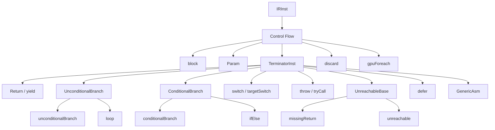

# Control Flow

This page is the per-opcode reference for Slang IR control-flow
opcodes: the `block` parent that owns the instructions of a basic
block, the `Param` opcode that carries block parameters (Slang IR's
phi-replacement), the `TerminatorInst` family of branches and
exits, and a handful of related opcodes that drive structured
control flow (`discard`, `gpuForeach`, `defer`).

The intended reader is a compiler engineer reading or writing an IR
pass that walks the CFG, or anyone trying to understand the join /
break encoding of a Slang `loop` or `ifElse`.

## Source

The control-flow opcodes live in two places in
[slang-ir-insts.lua](../../../../source/slang/slang-ir-insts.lua):
`block` is declared at line ~829 alongside the other module-level
parent opcodes, and `TerminatorInst` plus its children occupy
lines ~1291-1375. The `param` opcode is declared at line ~1055,
`discard` at line ~1377, and `gpuForeach` at line ~1482.

C++ wrappers are declared in
[slang-ir-insts.h](../../../../source/slang/slang-ir-insts.h). The
infrastructure they rely on (`IRInst`, the `IRBlock` traversal
helpers, `IRBuilder::emitBlock`, `IRBuilder::emitBranch`, ...) is in
[slang-ir.h](../../../../source/slang/slang-ir.h) and
[slang-ir.cpp](../../../../source/slang/slang-ir.cpp).

Lowering from the AST is driven by the statement-level visitors in
[slang-lower-to-ir.cpp](../../../../source/slang/slang-lower-to-ir.cpp):
`lowerStmt`, `visitBlockStmt`, `visitIfStmt`, `visitForStmt`,
`visitWhileStmt`, `visitDoWhileStmt`, `visitSwitchStmt`,
`visitReturnStmt`, `visitBreakStmt`, `visitContinueStmt`,
`visitDiscardStmt`, `visitDeferStmt`. The same visitors create the
`block`s, the `Param`s for `for` / `while` loop induction
variables, and the terminator that ends each block.

## Family hierarchy

## Opcodes

### Block and parameters

| Opcode | C++ wrapper | Operands | Flags | AST origin | Summary |
| --- | --- | --- | --- | --- | --- |
| `block` | `IRBlock` | (variadic) | P | Statement lowering in `slang-lower-to-ir.cpp` | Basic block; children are the instructions belonging to the block. |
| `param` | `IRParam` | (variadic) | | `ParamDecl` (function parameter) and SSA-from-statement lowering | Block-level parameter; always the first N children of its parent block. Slang IR's replacement for SSA `phi` nodes. |

### Terminators: returns and yields

| Opcode | C++ wrapper | Operands | Flags | AST origin | Summary |
| --- | --- | --- | --- | --- | --- |
| `return_val` | `Return` | `val` | | `ReturnStmt` in `slang-lower-to-ir.cpp` | Function return; ends the current block. |
| `yield` | — | `val` | | `generic` body lowering in `slang-lower-to-ir.cpp` | Yields the result value of a `generic` (i.e. terminates the single block of a generic). |

### Terminators: unconditional branches

| Opcode | C++ wrapper | Operands | Flags | AST origin | Summary |
| --- | --- | --- | --- | --- | --- |
| `unconditionalBranch` | `UnconditionalBranch` | (variadic, `min=1`) | | Sequential-statement lowering in `slang-lower-to-ir.cpp` | Jumps to a target block; any further operands are values bound to the target's `Param`s. |
| `loop` | `Loop` | (variadic, `min=3`) | | `ForStmt`, `WhileStmt`, `DoWhileStmt` in `slang-lower-to-ir.cpp` | Loop entry; operands are `<target> <breakLabel> <continueLabel>` followed by per-`Param` arguments. |

### Terminators: conditional branches

| Opcode | C++ wrapper | Operands | Flags | AST origin | Summary |
| --- | --- | --- | --- | --- | --- |
| `conditionalBranch` | `ConditionalBranch` | (variadic, `min=3`) | | (synthesized) | Two-way branch; operands are `condition, trueBlock, falseBlock`. Critical edges are forbidden — the targets cannot carry arguments. |
| `ifElse` | `IfElse` | (variadic, `min=4`) | | `IfStmt` in `slang-lower-to-ir.cpp` | Structured two-way branch; operands are `condition, trueBlock, falseBlock, mergeBlock`, where the explicit `mergeBlock` records the structured join. |

### Terminators: switches

| Opcode | C++ wrapper | Operands | Flags | AST origin | Summary |
| --- | --- | --- | --- | --- | --- |
| `switch` | `Switch` | (variadic, `min=3`) | | `SwitchStmt` in `slang-lower-to-ir.cpp` | Multi-way switch; operands are `value, breakLabel, defaultLabel, caseVal1, caseBlock1, ...`. |
| `targetSwitch` | — | (variadic, `min=1`) | | (synthesized) | Target-dispatching switch used by the multi-target lowering; operands are `breakLabel, targetName1, block1, ...`. |

### Terminators: error flow

| Opcode | C++ wrapper | Operands | Flags | AST origin | Summary |
| --- | --- | --- | --- | --- | --- |
| `throw` | — | `value` | | `ThrowStmt` in `slang-lower-to-ir.cpp` | Throws the operand as an error value, terminating the current block. |
| `tryCall` | — | (variadic, `min=3`) | | `TryExpr` in `slang-lower-to-ir.cpp` | Calls `callee` and branches to `successBlock` on a normal return or `failureBlock` on a throw. Operands: `successBlock: IRBlock, failureBlock: IRBlock, callee, args...`. |

### Terminators: no-continuation

| Opcode | C++ wrapper | Operands | Flags | AST origin | Summary |
| --- | --- | --- | --- | --- | --- |
| `missingReturn` | — | — | | (synthesized) | Marks a block that falls off the end of a non-`void` function; later passes diagnose or replace it with `unreachable`. |
| `unreachable` | — | — | | (synthesized) | Asserts that the block has no reachable continuation; the optimizer may delete code after it. |

### Terminators: defer and asm

| Opcode | C++ wrapper | Operands | Flags | AST origin | Summary |
| --- | --- | --- | --- | --- | --- |
| `defer` | — | `deferBlock: IRBlock, mergeBlock: IRBlock, scopeBlock: IRBlock` | | `DeferStmt` in `slang-lower-to-ir.cpp` | Records a deferred-action block whose body must run before the surrounding scope exits via `mergeBlock`. |
| `GenericAsm` | — | (variadic, `min=1`) | | (synthesized) | A generic inline-asm instruction whose semantics include terminating control flow (e.g. a backend-specific exit). |

### Other control-flow opcodes

| Opcode | C++ wrapper | Operands | Flags | AST origin | Summary |
| --- | --- | --- | --- | --- | --- |
| `discard` | — | — | | `DiscardStmt` in `slang-lower-to-ir.cpp` | HLSL `discard` for fragment shaders; ends pixel processing. Not technically a terminator in the IR sense — it sits in a block whose ordinary terminator follows. |
| `gpuForeach` | — | (variadic, `min=3`) | | `GpuForeachStmt` in `slang-lower-to-ir.cpp` | GPU_FOREACH-style loop opcode used by the host-shader lowering; pairs with a backend-specific kernel launch. |
| `RequirePrelude` | — | (variadic, `min=1`) | | (synthesized) | Marks an instruction as requiring a target-specific prelude snippet; technically a control-flow opcode by file position but functionally a backend hint. |
| `RequireTargetExtension` | — | `extension` | | (synthesized) | Marks an instruction as requiring a named target extension be enabled. |
| `RequireComputeDerivative` | — | — | | (synthesized) | Marks an entry point as needing compute-shader derivative support. |
| `StaticAssert` | — | `condition, message` | | `StaticAssertDecl` in `slang-lower-to-ir.cpp` | Compile-time assertion; consumed by IR passes, never reaches emit. |
| `Printf` | — | `format` | | `PrintfExpr` (HLSL `printf`) | Emits a runtime print operation; some backends model it as a side-effecting control-flow op. |
| `RequireMaximallyReconverges` | — | — | | (synthesized) | Marks an entry point as requiring the maximally-reconverges quad execution mode. |
| `RequireQuadDerivatives` | — | — | | (synthesized) | Marks an entry point as requiring the quad-derivatives execution mode. |

## Notable opcodes

### `block` and `Param`

A `block` is a parent instruction whose children form the body of
a basic block. The *first* N children of a block are always `Param`
opcodes — they declare the values that incoming branches must
supply. This is Slang IR's encoding of SSA: instead of a `phi`
opcode that gathers values from predecessor blocks, the
predecessor's `unconditionalBranch` carries one argument operand
per `Param`. The encoding makes the data-flow direction explicit
and avoids the need to update `phi` operands when blocks are
restructured.

### `loop`

`loop <body> <breakLabel> <continueLabel>` is the structured loop
terminator. The leading operand is the block to enter; `breakLabel`
is the block control returns to after a `break` (and is the
structured join point of the loop), and `continueLabel` is the
target of `continue` statements. Any operands beyond the first
three are arguments bound to the body block's `Param`s — this is
how loop-induction variables are encoded.

### `ifElse`

`ifElse <condition> <trueBlock> <falseBlock> <mergeBlock>` is the
structured two-way branch. The fourth operand, `mergeBlock`, is the
explicit structured-join point. It is the block where the
true / false arms reunite; downstream passes that recognize
structured control flow (e.g. emitters that produce HLSL or SPIR-V
structured constructs) read it directly rather than reconstructing
it from the CFG.

### `conditionalBranch` vs `ifElse`

Both encode a two-way conditional branch, but they serve different
roles. `conditionalBranch` is the lower-level form used inside
already-flattened control flow, has no explicit merge block, and
*forbids critical edges* — the two targets cannot themselves carry
arguments. `ifElse` is the structured form produced by the
front-end and consumed by structured emitters; the merge block
makes the structure explicit even after the rest of the body has
been transformed.

### `switch` and `targetSwitch`

`switch` is the standard multi-way switch: a scrutinee, a break
label, a default label, and zero or more `(caseValue, caseBlock)`
pairs. `targetSwitch` is the target-dispatch variant: its case
keys are *target names* (e.g. `"hlsl"`, `"glsl"`) rather than
runtime values, and it is consumed by the multi-target lowering
pass to pick the right concrete block for each target.

### `tryCall` and `throw`

`tryCall` is the call-site half of error handling: it dispatches to
one of two successor blocks depending on whether the callee returns
or throws. `throw` is the producer side. The error-handling pass
lowers the pair into a value-passing convention plus ordinary
`conditionalBranch` so backends without exception support can
still execute the IR.

### `defer`

`defer` records a deferred action block whose body runs before
control leaves the surrounding scope through `mergeBlock`. The
defer pass walks the CFG, finds every exit path from `scopeBlock`,
and inserts a copy of `deferBlock`'s body before each transition
out. After that pass, `defer` itself is gone from the IR.

### `discard`

`discard` is the HLSL fragment-shader instruction that ends pixel
processing without running later stages. Although it terminates
the pixel's *runtime* processing, it is *not* an IR terminator: it
sits as an ordinary side-effecting instruction inside a block, and
that block ends with whatever real terminator follows (typically
`Return` or `unreachable`).

## See also

- [../cross-cutting/ir-instructions.md](../cross-cutting/ir-instructions.md)
  — schema, op flags (notably `Parent` for `block`), the
  hoistable / global conventions.
- [structure.md](structure.md) — the `func` parent that owns the
  blocks, and `generic` whose body is a single block terminated by
  `yield`.
- [values.md](values.md) — `Var` / `Load` / `Store` and other
  value-producing opcodes that populate block bodies between
  `Param`s and the terminator.
- [../pipeline/04-ast-to-ir.md](../pipeline/04-ast-to-ir.md) — how
  statements lower into blocks, terminators, and `Param` values.
- [../pipeline/05-ir-passes.md](../pipeline/05-ir-passes.md) —
  dataflow, dominator, and CFG simplification passes that consume
  these opcodes.
- [../../../design/ir.md](../../../design/ir.md) — design rationale for
  block parameters vs. SSA `phi`, and for explicit structured-join
  operands on `loop` / `ifElse`.
- [../glossary.md](../glossary.md) — definitions of `block
  parameter`, `terminator instruction`, `parent instruction`,
  `single static assignment (SSA)`, `control-flow graph`.
