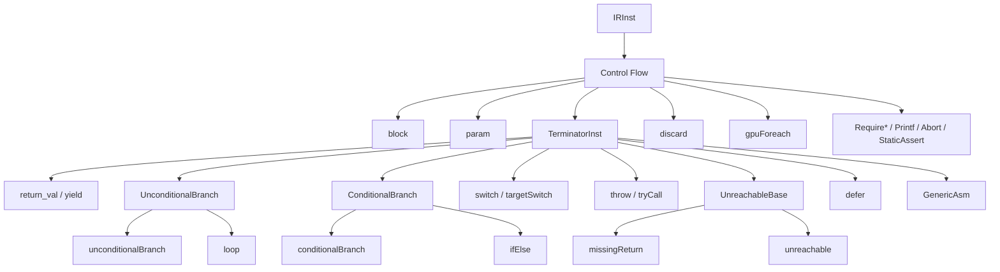

# Control Flow

This page is the per-opcode reference for Slang IR control-flow
opcodes: the `block` parent that owns the instructions of a basic
block, the `param` opcode that carries block parameters (Slang IR's
phi-replacement), the `TerminatorInst` family of branches and
exits, and the small group of non-terminator opcodes that sits
immediately after it in the instruction table (`discard`, the
`Require*` markers, `Printf`, `Abort`) plus `gpuForeach`.

The intended reader is a compiler engineer reading or writing an IR
pass that walks the CFG, or anyone trying to understand the join /
break encoding of a Slang `loop` or `ifElse`.

## Source

The control-flow opcodes live in three places in
[slang-ir-insts.lua](../../../../source/slang/slang-ir-insts.lua):
`block` is declared at line 944 alongside the other module-level
parent opcodes, `param` at line 1170, and `TerminatorInst` plus its
children occupy lines 1450-1535. `discard` follows immediately at
line 1536, the backend-hint group (`RequirePrelude`,
`RequireTargetExtension`, `RequireComputeDerivative`,
`StaticAssert`, `Printf`, `Abort`, `RequireMaximallyReconverges`,
`RequireQuadDerivatives`) at lines 1537-1547, and `gpuForeach` at
line 1642.

The C++ wrappers for the terminators are hand-written in
[slang-ir-insts.h](../../../../source/slang/slang-ir-insts.h)
(`IRReturn` line 2032 through `IRDefer` line 2193, plus
`IRGenericAsm` line 2911 and the `IRRequire*` / `IRStaticAssert`
wrappers that follow it), because they need `IRUse` members and
index arithmetic the generator cannot derive. Wrappers that are not
written out there — `IRUnreachableBase`, `IRMissingReturn`,
`IRUnreachable`, `IRDiscard`, `IRPrintf`, `IRAbort`,
`IRGpuForeach` — are generated from the Lua entry, so they exist
even though nothing declares them by hand; see
[../cross-cutting/ir-instructions.md](../cross-cutting/ir-instructions.md)
for how that generation works.

`IRTerminatorInst` (line 1156), `IRParam` (line 1170), `IRBlock`
(line 1205), and the `IREdge` helper (line 1178) are declared in
[slang-ir.h](../../../../source/slang/slang-ir.h); `IRBuilder`
itself is only forward-declared there and is declared in
[slang-ir-insts.h](../../../../source/slang/slang-ir-insts.h) at
line 3158. `emitBlock` is defined in
[slang-ir.cpp](../../../../source/slang/slang-ir.cpp) at line 5447;
the return and branch emitters (`emitBranch`, `emitLoop`,
`emitIfElse`, `emitSwitch`, ...) are in the same file at lines
6331-6560.

Lowering from the AST is driven by the statement-level visitors in
[slang-lower-to-ir.cpp](../../../../source/slang/slang-lower-to-ir.cpp):
`lowerStmt` (line 9970) dispatches to `visitBlockStmt` (8821),
`visitIfStmt` (8280), `visitForStmt` (8410), `visitWhileStmt`
(8544), `visitDoWhileStmt` (8629), `visitSwitchStmt` (9495),
`visitStageSwitchStmt` (9329), `visitTargetSwitchStmt` (9425),
`visitReturnStmt` (8831), `visitBreakStmt` (9059),
`visitContinueStmt` (9077), `visitDiscardStmt` (9053),
`visitDeferStmt` (8919), `visitThrowStmt` (8942),
`visitGpuForeachStmt` (8739), and `visitIntrinsicAsmStmt` (9470).
Expression lowering also creates control flow: `visitSelectExpr`
(7090), `visitLogicOperatorShortCircuitExpr` (7127), and
`visitExpandExpr` (6565).

Two things this page has to cite are outside its manifest
`watched_paths`, so changing them will not mark the page stale.
`IREdge::isCritical` is *declared* in `slang-ir.h` but *defined* in
[slang-ir-ssa.cpp](../../../../source/slang/slang-ir-ssa.cpp) at
line 1312, and the eight backend-hint opcodes are reached from
`__intrinsic_op` declarations in
[core.meta.slang](../../../../source/slang/core.meta.slang) and
[hlsl.meta.slang](../../../../source/slang/hlsl.meta.slang) rather
than from any statement visitor. Adding
`source/slang/slang-ir-ssa.cpp`, `source/slang/core.meta.slang`,
and `source/slang/hlsl.meta.slang` to this page's `watched_paths`
would close the gap.

## Family hierarchy

```mermaid
flowchart TD
  IRInst --> CF[Control Flow]
  CF --> blockNode[block]
  CF --> paramNode[param]
  CF --> TerminatorInst
  CF --> discardNode[discard]
  CF --> gpuForeachNode[gpuForeach]
  CF --> BackendHints["Require* / Printf / Abort / StaticAssert"]
  TerminatorInst --> SimpleReturns["return_val / yield"]
  TerminatorInst --> UnconditionalBranch
  TerminatorInst --> ConditionalBranch
  TerminatorInst --> SwitchOps["switch / targetSwitch"]
  TerminatorInst --> ErrorFlow["throw / tryCall"]
  TerminatorInst --> UnreachableBase
  TerminatorInst --> deferNode[defer]
  TerminatorInst --> GenericAsm
  UnconditionalBranch --> unconditionalBranchNode[unconditionalBranch]
  UnconditionalBranch --> loopNode[loop]
  ConditionalBranch --> conditionalBranchNode[conditionalBranch]
  ConditionalBranch --> ifElseNode[ifElse]
  UnreachableBase --> missingReturnNode[missingReturn]
  UnreachableBase --> unreachableNode[unreachable]
```

`UnconditionalBranch`, `ConditionalBranch`, and `UnreachableBase`
are abstract grouping entries: each becomes a contiguous opcode
range (`kIROp_FirstUnconditionalBranch` ...
`kIROp_LastUnconditionalBranch`, and so on) so that
`as<IRUnconditionalBranch>()` is a single range comparison.
`kIROp_FirstTerminatorInst` is `kIROp_Return` and
`kIROp_LastTerminatorInst` is `kIROp_Defer`, which is exactly why
`discard` — declared one line later in the Lua file — is *not* a
terminator.

## Opcodes

### Block and parameters

| Opcode | C++ wrapper | Operands | Flags | AST origin | Summary |
| --- | --- | --- | --- | --- | --- |
| `block` | `IRBlock` | — | P | — (structural container) | Basic block; its *children*, not its operands, are the instructions it owns. |
| `param` | `IRParam` | — | | `ParamDecl`, plus `SelectExpr` / `LogicOperatorShortCircuitExpr` / `TryExpr` result parameters introduced by `visitSelectExpr` (line 7989) and its peers on blocks opened by `startBlock` (line 8193) | Block-level parameter; always the first N children of its parent block. Slang IR's replacement for SSA `phi` nodes. |

### Terminators: returns and yields

| Opcode | C++ wrapper | Operands | Flags | AST origin | Summary |
| --- | --- | --- | --- | --- | --- |
| `return_val` | `IRReturn` | `val` | | `ReturnStmt` via `visitReturnStmt` (line 8831) | Function return; always carries exactly one operand, the void value for a `void` return. |
| `yield` | `IRYield` | `val` | | `ExpandExpr` via `visitExpandExpr` (line 6565) | Terminates the single block inside an `expand` instruction with that iteration's pattern value. |

### Terminators: unconditional branches

| Opcode | C++ wrapper | Operands | Flags | AST origin | Summary |
| --- | --- | --- | --- | --- | --- |
| `unconditionalBranch` | `IRUnconditionalBranch` | `target, args...` (`min=1`) | | `BreakStmt`, `ContinueStmt` via `visitBreakStmt` (line 9059) and `visitContinueStmt` (9077), plus fall-through between lowered statements | Jumps to a target block; operands after the first are bound to the target's `param`s. |
| `loop` | `IRLoop` | `target, breakBlock, continueBlock, args...` (`min=3`) | | `ForStmt`, `WhileStmt`, `DoWhileStmt`, `CatchStmt` via `visitForStmt` (line 8410), `visitWhileStmt` (8544), `visitDoWhileStmt` (8629), `visitCatchStmt` (8967) | Loop entry; the break and continue labels are explicit operands, and any further operands are target-block arguments. |

### Terminators: conditional branches

| Opcode | C++ wrapper | Operands | Flags | AST origin | Summary |
| --- | --- | --- | --- | --- | --- |
| `conditionalBranch` | `IRConditionalBranch` | `condition, trueBlock, falseBlock` (`min=3`) | | (synthesized) | Two-way branch with no structured join operand and no target arguments. |
| `ifElse` | `IRIfElse` | `condition, trueBlock, falseBlock, afterBlock` (`min=4`) | | `IfStmt` via `visitIfStmt` (line 8280), plus `SelectExpr`, `LogicOperatorShortCircuitExpr`, and every loop condition test | Structured two-way branch whose fourth operand records the reconvergence point. |

### Terminators: switches

| Opcode | C++ wrapper | Operands | Flags | AST origin | Summary |
| --- | --- | --- | --- | --- | --- |
| `switch` | `IRSwitch` | `condition, breakLabel, defaultLabel, caseValue/caseLabel pairs...` (`min=3`) | | `SwitchStmt` (`switch`), `StageSwitchStmt` (`__stage_switch`) via `visitSwitchStmt` (line 9495) and `visitStageSwitchStmt` (9329) | Multi-way switch; the case list is a set of (value, label) pairs reached through `getCaseValue` / `getCaseLabel`. |
| `targetSwitch` | `IRTargetSwitch` | `breakBlock, caseValue/caseBlock pairs...` (`min=1`) | | `TargetSwitchStmt` (`__target_switch`) via `visitTargetSwitchStmt` (line 9425) | Compile-time switch on the code-generation target; case values are `CapabilityName` integers, not runtime values. |

### Terminators: error flow

| Opcode | C++ wrapper | Operands | Flags | AST origin | Summary |
| --- | --- | --- | --- | --- | --- |
| `throw` | `IRThrow` | `value` | | `ThrowStmt` via `visitThrowStmt` (line 8942) | Throws the operand as an error value, terminating the current block. |
| `tryCall` | `IRTryCall` | `successBlock, failureBlock, callee, args...` (`min=3`) | | `TryExpr` via `visitTryExpr` (line 8020) | Calls `callee` and branches to `successBlock` on a normal return or `failureBlock` on a throw. |

### Terminators: no-continuation

| Opcode | C++ wrapper | Operands | Flags | AST origin | Summary |
| --- | --- | --- | --- | --- | --- |
| `missingReturn` | `IRMissingReturn` (generated) | — | | `FunctionDeclBase` body lowering in `lowerFuncDeclInContext` | Terminates the fall-off-the-end block of a value-returning function so a later dataflow check can diagnose it. |
| `unreachable` | `IRUnreachable` (generated) | — | | IR passes only, never AST lowering; `applySparseConditionalConstantPropagation` is the one that produces it before the first dump | Asserts that the block has no reachable continuation. |

### Terminators: defer and asm

| Opcode | C++ wrapper | Operands | Flags | AST origin | Summary |
| --- | --- | --- | --- | --- | --- |
| `defer` | `IRDefer` | `deferBlock, mergeBlock, scopeBlock` | | `DeferStmt` via `visitDeferStmt` (line 8919) | Records a deferred-action block whose body must run before the surrounding scope exits. |
| `GenericAsm` | `IRGenericAsm` | `asmText, args...` (`min=1`) | | `IntrinsicAsmStmt`, written as the statement `__intrinsic_asm "<text>";`, via `visitIntrinsicAsmStmt` (line 9470) | Inline target-specific text whose semantics include terminating control flow; `getAsm()` reads operand 0 as a string literal. |

### Other control-flow opcodes

None of the rows below is a `TerminatorInst`; they sit outside the
`kIROp_FirstTerminatorInst` / `kIROp_LastTerminatorInst` range and
appear as ordinary instructions inside a block.

| Opcode | C++ wrapper | Operands | Flags | AST origin | Summary |
| --- | --- | --- | --- | --- | --- |
| `discard` | `IRDiscard` (generated) | — | | `DiscardStmt` via `visitDiscardStmt` (line 9053) | HLSL `discard` for fragment shaders; ends pixel processing. |
| `gpuForeach` | `IRGpuForeach` (generated) | `device, gridDims, kernel, args...` (`min=3`) | | `GpuForeachStmt` via `visitGpuForeachStmt` (line 8739) | Host-side GPU dispatch loop; pairs with a backend-specific kernel launch. |
| `RequirePrelude` | `IRRequirePrelude` | `preludeText` (`min=1`) | | Call to `__requirePrelude` (`core.meta.slang`) | Requires that a target-specific prelude snippet be emitted. |
| `RequireTargetExtension` | `IRRequireTargetExtension` | `extension` | | Call to `__requireTargetExtension` (`core.meta.slang`, `hlsl.meta.slang`) | Requires that a named target extension be enabled. |
| `RequireComputeDerivative` | `IRRequireComputeDerivative` | — | | Call to `__requireComputeDerivative` (`core.meta.slang`) | Marks an entry point as needing compute-shader derivative support. |
| `StaticAssert` | `IRStaticAssert` | `condition, message` | | Call to `static_assert` (`core.meta.slang`) | Compile-time assertion; consumed before emit. |
| `Printf` | `IRPrintf` (generated) | `format, args...` | | Call to `printf` (`hlsl.meta.slang`) | Runtime print; the format string is operand 0 and the expanded pack follows. |
| `Abort` | `IRAbort` (generated) | `format, args...` | | Call to `abort` (`hlsl.meta.slang`) | Terminates shader execution with a formatted message (`VK_KHR_shader_abort`). |
| `RequireMaximallyReconverges` | `IRRequireMaximallyReconverges` | — | | Call to `__requireMaximallyReconverges` (`core.meta.slang`) | Marks an entry point as requiring the maximally-reconverges execution mode. |
| `RequireQuadDerivatives` | `IRRequireQuadDerivatives` | — | | Call to `__requireQuadDerivatives` (`core.meta.slang`) | Marks an entry point as requiring the quad-derivatives execution mode. |

## Notable opcodes

### What a lowering dump shows

`-dump-ir` prints its first snapshot under the label `LOWER-TO-IR`,
but that snapshot is not the raw output of the statement visitors.
`generateIRForTranslationUnit` runs a fixed block of mandatory passes
between the last visitor and the dump — `lowerErrorHandling` (line
15578), `lowerDefer` (15581), `constructSSA` (15605),
`applySparseConditionalConstantPropagation` (15606), `simplifyCFG`
(15611), `eliminateDeadCode` (15624) and mandatory early inlining
(15664) — and dumps only afterwards, at line 15797 of
[slang-lower-to-ir.cpp](../../../../source/slang/slang-lower-to-ir.cpp).
Three of the callouts below turn on that ordering: `throw`,
`tryCall`, and `defer` are emitted by lowering but are already gone
by the first dump; `unreachable` is never emitted by lowering but is
already present; and an arm that lowering gave a block of its own may
have been folded onto the merge block. Read an `AST origin` cell as a
claim about which visitor *constructs* an opcode, not as a promise
that a dump still contains it.

### `block` and `param`

A `block` is a parent instruction whose children form the body of a
basic block. The *first* N children of a block are always `param`
instructions — they declare the values that incoming branches must
supply — and `IRBlock::getFirstParam` / `getParams` /
`getOrdinaryInsts` in
[slang-ir.h](../../../../source/slang/slang-ir.h) rely on that
ordering. This is Slang IR's encoding of SSA: instead of a `phi`
opcode that gathers values from predecessor blocks, the
predecessor's `unconditionalBranch` carries one argument operand
per `param`, and `IRUnconditionalBranch::getArgs` (defined in
[slang-ir.cpp](../../../../source/slang/slang-ir.cpp) at line 767)
skips the leading label operands to find them: one for
`unconditionalBranch`, three for `loop`.

The front end already uses this convention rather than leaving it
entirely to `constructSSA`. A scalar `?:` (`visitSelectExpr`) and a
short-circuiting `&&` / `||`
(`visitLogicOperatorShortCircuitExpr`) each emit an `ifElse`, give
both arms an `unconditionalBranch` carrying the arm's value, and
then emit a `param` at the top of the after-block to receive it.

### `loop`

`loop <target> <breakBlock> <continueBlock>` is the structured loop
terminator, built by `IRBuilder::emitLoop`. The leading operand is
the block to enter; `breakBlock` is where control resumes after a
`break` (and is the structured reconvergence point of the loop),
and `continueBlock` is the target of `continue` statements.
`IRLoop` in
[slang-ir-insts.h](../../../../source/slang/slang-ir-insts.h)
exposes the second and third operands as `getBreakBlock()` and
`getContinueBlock()`. Any operands beyond the first three are
arguments bound to the target block's `param`s. `visitForStmt`
registers the break and continue labels in
`context->shared->breakLabels` / `continueLabels` keyed by the
statement's `uniqueID`, which is how `visitBreakStmt` and
`visitContinueStmt` find the right label without walking the CFG.

The three loop statements fill those operands differently.
`visitForStmt` creates a dedicated continue block (line 8435), so
target, `continueBlock`, and `breakBlock` are three distinct blocks.
`visitWhileStmt` uses the loop head itself as the continue label
(line 8568) and passes it as both the target and the continue
operand, so *every* `while` has `target == continueBlock`.
`visitDoWhileStmt` uses the trailing test block instead (line 8653)
and inverts the predicate — `emitNot` at line 8689, then
`emitIfElse(not(cond), breakBlock, merge, merge)` at line 8734 — so a
`do`-`while` leaves the loop when the *negated* test is true. A
`while (true)` keeps the shared head-and-continue block and leaves
its break block without a predecessor, which is why that block
carries `unreachable` by the time the loop is dumped.

### `ifElse`

`ifElse <condition> <trueBlock> <falseBlock> <afterBlock>` is the
structured two-way branch. The fourth operand is named `mergeBlock`
in the Lua comment but `afterBlock` in the C++ wrapper, whose
accessor is `IRIfElse::getAfterBlock()`; both names mean the block
where the two arms reconverge, and downstream consumers that need
structured control flow read it directly rather than rediscovering
it from the CFG.

Two convenience emitters produce degenerate `ifElse` shapes rather
than a distinct opcode. `IRBuilder::emitIf(val, trueBlock,
afterBlock)` calls `emitIfElse(val, trueBlock, afterBlock,
afterBlock)`, so an `if` with no `else` has `falseBlock ==
afterBlock`; `IRBuilder::emitLoopTest(val, bodyBlock, breakBlock)`
calls `emitIfElse(val, bodyBlock, breakBlock, bodyBlock)`, so a
loop-condition test has `afterBlock == trueBlock`. A pass that
assumes the four operands are four distinct blocks will be wrong on
both.

A third collapsed shape is not the emitters' doing. `visitIfStmt`
gives an `if`/`else` three fresh blocks (lines 8303-8309) however
empty its arms are, but the mandatory `simplifyCFG` folds away an arm
that does nothing except branch to the merge block. An `if` whose
*then* arm is empty and whose `else` arm is not therefore reaches a
dump as `trueBlock == afterBlock` — the mirror image of the else-less
shape, and one no convenience emitter produces.

### `conditionalBranch` vs `ifElse`

Both encode a two-way conditional branch, but they serve different
roles. `conditionalBranch` is the lower-level form used inside
already-flattened control flow and has no structured join operand.
Neither opcode can pass block arguments: `IRConditionalBranch`
declares exactly the three `IRUse` members `condition`,
`trueBlock`, and `falseBlock`, and only the `UnconditionalBranch`
subfamily implements `getArgs`. A predecessor that must supply a
value to a block `param` therefore has to reach that block through
an `unconditionalBranch`, which is what forces critical edges
(`IREdge::isCritical`, declared in
[slang-ir.h](../../../../source/slang/slang-ir.h) line 1193) to be
split before block parameters can be introduced. Nothing in AST
lowering emits `conditionalBranch`; it is introduced by IR passes.

### `switch` and `targetSwitch`

`IRSwitch` stores a scrutinee, a break label, a default label, and
then a flat run of `(caseValue, caseLabel)` pairs. That tail is
conceptually an unordered set of pairs, so read it through the
role-based accessors rather than doing operand arithmetic:
`getCaseCount()`, `getCaseValue(i)`, and `getCaseLabel(i)`. Two
`IRUse*`-returning forms exist alongside them —
`getCaseValueUse(i)` and `getCaseLabelUse(i)` — because
`getCaseValue` hands back the used *value*, which is enough to
inspect a case but not to rewrite one. Replacing a case key in
place needs the `IRUse` slot so that `IRUse::set` can unregister
the old operand from its use list and register the new one;
`legalizeBoolSwitch` in
[slang-ir-glsl-legalize.cpp](../../../../source/slang/slang-ir-glsl-legalize.cpp)
(line 5107) is the motivating consumer.

The condition may be a `bool` as far as the IR is concerned, but
some targets require an integer switch. The pass
`legalizeBoolSwitchForTargetsRequiringIntSwitch` (same file, line
5135) walks every block's terminator, and for each `IRSwitch` whose
condition has `IRBoolType` it inserts a bool-to-int cast, points
`switchInst->condition` at the cast, and rewrites each case key to
the matching `IRIntLit` (`true` to 1, `false` to 0). It release-
asserts that each case key is a bool-typed `IRConstant`, because a
`switch` on an `enum : bool` reaches this point with `IRIntLit`
case keys of bool type rather than `IRBoolLit`. The pass is
selected per target in
[slang-emit.cpp](../../../../source/slang/slang-emit.cpp); see
[../pipeline/05-ir-passes.md](../pipeline/05-ir-passes.md) for
where it sits in the pipeline.

`targetSwitch` is the compile-time variant: `IRTargetSwitch` reads
operand 0 as the break block and then `(caseValue, caseBlock)`
pairs through `getCaseValue(i)` and `getCaseBlock(i)`, where each
case value is the integer `CapabilityName` recorded by
`visitTargetSwitchStmt`.

### `tryCall` and `throw`

`tryCall` is the call-site half of error handling: it dispatches to
one of two successor blocks depending on whether the callee returns
or throws, and `IRTryCall::getArgs()` skips the three leading
operands to reach the call arguments. Lowering emits it from
`emitCallToVal` (line 846 of
[slang-lower-to-ir.cpp](../../../../source/slang/slang-lower-to-ir.cpp))
when the call has `TryClauseType::Standard`, then puts a `param` at
the top of the success block to receive the result value and, if
the enclosing code has no `CatchStmt` handler, a `param` plus a
`throw` in a synthesized failure block that rethrows.
`visitThrowStmt` only emits `throw` when no handler is in scope; if
one is, it emits an `unconditionalBranch` to the handler block
carrying the error value as a block argument.

Both opcodes are short-lived. `lowerErrorHandling`, called from
`generateIRForTranslationUnit` at line 15578 — before the first
`-dump-ir` snapshot — rewrites a throwing function into one that
returns a `Result<T, E>` value and turns each `tryCall` into an
ordinary `call` plus an `ifElse`. A surface program's error flow
therefore reaches every later reader as the `Result` opcodes
(`makeResultValue`, `makeResultError`, `isResultError`,
`getResultError`, `getResultValue`, declared at
[slang-ir-insts.lua](../../../../source/slang/slang-ir-insts.lua)
lines 1135-1139) rather than as `throw` and `tryCall`.

### `defer`

`defer` records a deferred action block. Its three operands are
read by role through the generated accessors `getDeferBlock()`,
`getMergeBlock()`, and `getScopeBlock()`. `visitDeferStmt` creates
the defer and merge blocks, emits the `defer`, lowers the deferred
statement into `deferBlock`, and terminates it with a branch to
`mergeBlock`; `scopeBlock` is whatever `context->scopeEndBlock`
was, which is how the deferred body learns which enclosing scope it
belongs to. `lowerDefer` then rewrites the construct so that later
passes need not be aware of it; it runs inside
`generateIRForTranslationUnit` at line 15581, ahead of the first
`-dump-ir` snapshot, so `defer` is not visible even there.

### `missingReturn` and `unreachable`

Both are `UnreachableBase` terminators with no operands, and the
difference is which one the compiler is allowed to complain about.
When `lowerFuncDeclInContext` finishes a function body and the
final block is still unterminated, a `void`-returning function gets
an implicit `return_val` of the void value, but a value-returning
function gets `missingReturn` (line 14361) precisely so a later
dataflow check can report the missing `return` if that block turns
out to be reachable. That check is `checkForMissingReturns`, run from
`generateIRForTranslationUnit` at line 15706 with the target left as
`CodeGenTarget::None` and warnings enabled, and run again per target
during emit. It reports at the `missingReturn`'s own source location,
which lands on the function signature rather than on the body:
warning 41010 (`missing-return`, "non-void function does not return
in all cases") where the target tolerates a missing return, and error
41009 (`missing-return-error`) where it does not.

`unreachable` carries no such obligation, and nothing in AST lowering
emits it —
[slang-lower-to-ir.cpp](../../../../source/slang/slang-lower-to-ir.cpp)
never calls `emitUnreachable`. It reaches a lowering dump only
through the mandatory passes: SCCP gives a block that still has uses
but has lost all its predecessors a body of exactly one
`unreachable`, which is what terminates the synthesized break block
of a `switch`, a `__target_switch`, or a `while (true)` whose arms
all diverge.

### Unreachable-code diagnostics come from lowering

Two `Diagnostics::UnreachableCode` sites live in
[slang-lower-to-ir.cpp](../../../../source/slang/slang-lower-to-ir.cpp),
not in the semantic checker. `startBlockIfNeeded` (line 8205) is
called before lowering each statement; if the current block is
already terminated, the statement it is about to lower has no label
to be branched to, so it diagnoses at line 8228 and then starts a
fresh block anyway. `lowerSwitchCases` (line 9223) diagnoses at
line 9315 for a statement that appears inside a `switch` body
before the first `case` or `default` label — Slang has no `goto`
into a switch body, so control cannot reach such a statement — and
sets `warnedUnreachableBeforeFirstCase` so the whole leading run
warns once.

### `discard`

`discard` is the HLSL fragment-shader instruction that ends pixel
processing without running later stages. Although it terminates the
pixel's *runtime* processing, it is *not* an IR terminator: its
opcode is one past `kIROp_LastTerminatorInst`, so `as<IRTerminatorInst>`
rejects it, and it sits as an ordinary instruction inside a block
that ends with whatever real terminator follows. `visitDiscardStmt`
(line 9059) emits nothing but the `discard`, so in the common
`if (...) discard;` shape the hosting block reads `discard` followed
by the `unconditionalBranch` to the post-`if` merge block.

Reaching `discard` from a non-fragment entry point is not an IR-level
error at all. The capability check rejects the entry point first,
with error 36107 (`entry-point-uses-unavailable-capability`,
"unavailable features in entry point") reported on the entry-point
declaration, so no `discard` opcode is ever built.

### `Abort`

`Abort` lowers from the `abort(format, args...)` builtin — an
`__intrinsic_op($(kIROp_Abort))` declared in `hlsl.meta.slang` —
and backs the `VK_KHR_shader_abort` extension. As emitted by the
front end it carries the format string plus a variadic argument
pack; SPIR-V legalization later repacks that tail into a single
message-struct operand. Like `discard`, `Abort` is not an IR
`TerminatorInst`: it sits in the post-`TerminatorInst`
backend-hint group with `Printf`.

### Moving and deleting control-flow instructions

Whether a pass may delete or relocate one of these instructions is
governed by `IRInst::mightHaveSideEffects`, declared in
[slang-ir.h](../../../../source/slang/slang-ir.h) at line 778 and
defined in
[slang-ir.cpp](../../../../source/slang/slang-ir.cpp) at line 9394.
It now takes two defaulted parameters: a `SideEffectAnalysisOptions
options`, and a `Dictionary<IRInst*, bool>* calleeSideEffectCache`.

Neither the terminators nor `discard`, `Printf`, or `Abort` has a
case in that function's `switch`, so they land in the conservative
`default:` arm and report `true` — which is what keeps dead-code
elimination from removing them.

The second parameter is a memo for the one case that does need
analysis, `kIROp_Call`: without it, each call-site query re-walks
the callee's use list, which is quadratic in the number of call
sites to a shared callee. The caller owns the dictionary, so a
simplification fixpoint can share one memo across its many DCE
invocations; the field is
`IRDeadCodeEliminationOptions::calleeSideEffectCache` in
[slang-ir-dce.h](../../../../source/slang/slang-ir-dce.h) (line
30), whose comment records the soundness condition: sharing is
valid only while no pass adds an `IRAnnotation` or removes a purity
decoration. Both mutations can turn a cached `false` into a wrong
answer — `doesCalleeHaveSideEffect` scans the callee's
`IRAnnotation` users for an effectful associated callee
([slang-ir-util.cpp](../../../../source/slang/slang-ir-util.cpp)
lines 1670-1709), so a stale `false` would let DCE delete a call
that has since become effectful. `IRBuilder::addAnnotation` carries
the matching warning at
[slang-ir-insts.h](../../../../source/slang/slang-ir-insts.h) lines
3620-3623. `simplifyIR` clears the memo at the top of each outer
iteration
([slang-ir-ssa-simplification.cpp](../../../../source/slang/slang-ir-ssa-simplification.cpp)
line 79), so each iteration also picks up the purity facts
`propagateFuncProperties` proved in the previous one.

## See also

- [../cross-cutting/ir-instructions.md](../cross-cutting/ir-instructions.md)
  — schema, op flags (notably `parent` for `block`), stable names,
  and the workflow for adding an opcode.
- [structure.md](structure.md) — the `func` parent that owns the
  blocks, and `generic`, whose body is a single block terminated by
  `return_val` (`findGenericReturnVal` in
  [slang-ir.cpp](../../../../source/slang/slang-ir.cpp) line 9888
  looks for exactly that).
- [misc.md](misc.md) — `expand` / `Each`, whose single block is the
  one place `yield` terminates.
- [values.md](values.md) — `Var` / `Load` / `Store` and other
  value-producing opcodes that populate block bodies between
  `param`s and the terminator.
- [../pipeline/04-ast-to-ir.md](../pipeline/04-ast-to-ir.md) — how
  statements lower into blocks, terminators, and `param` values.
- [../ast-reference/statements.md](../ast-reference/statements.md)
  — the AST statement classes named in the `AST origin` column.
- [../pipeline/05-ir-passes.md](../pipeline/05-ir-passes.md) —
  dataflow, dominator, and CFG simplification passes that consume
  these opcodes, including the bool-switch legalization above.
- [../../../design/ir.md](../../../design/ir.md) — design rationale for
  block parameters vs. SSA `phi`, and for explicit structured-join
  operands on `loop` / `ifElse`.
- [../glossary.md](../glossary.md) — definitions of `block
  parameter`, `terminator instruction`, `parent instruction`,
  `single static assignment (SSA)`, `control-flow graph`.
