# Decorations

This page is the per-opcode reference for the `Decoration` family —
the largest single family in
[slang-ir-insts.lua](../../../../source/slang/slang-ir-insts.lua),
spanning lines ~1591-2454. Decorations attach metadata to other IR
instructions: names, layout binding, control-flow hints,
target-specific intrinsic spellings, capability requirements,
inlining preferences, autodiff markers, and so on.

The intended reader is a compiler engineer reading IR around a
function, type, or variable and trying to identify what each
decoration says about it.

## Source

The opcodes live under the top-level `Decoration` entry of
[slang-ir-insts.lua](../../../../source/slang/slang-ir-insts.lua) at
line ~1591. Per-opcode info (names, operand counts) is registered
in
[slang-ir-insts-info.cpp](../../../../source/slang/slang-ir-insts-info.cpp).
C++ wrappers are declared in
[slang-ir-insts.h](../../../../source/slang/slang-ir-insts.h).
Infrastructure (op flags, `IRBuilder` helpers) is in
[slang-ir.h](../../../../source/slang/slang-ir.h) and
[slang-ir.cpp](../../../../source/slang/slang-ir.cpp).

Most decorations originate from AST-side modifiers and attributes:
`slang-check-modifier.cpp` validates them, and the helpers in
[slang-lower-to-ir.cpp](../../../../source/slang/slang-lower-to-ir.cpp)
(`applyModifiers*` family, `addNameHintDecoration`, ...) attach
them to the IR instruction produced by the corresponding
declaration. The autodiff markers, primal/diff annotations, and
SPIR-V backend hints are introduced by the IR passes
themselves.

## Family hierarchy

```mermaid
flowchart TD
  IRInst --> Decoration
  Decoration --> Naming["Naming and provenance"]
  Decoration --> LayoutBinding["Layout and binding"]
  Decoration --> LoopBranchHints["Loop and branch hints"]
  Decoration --> TargetSpecificDecoration
  Decoration --> CapAvail["Capability and availability"]
  Decoration --> IO["Interpolation and IO"]
  Decoration --> Stage["Entry-point / stage"]
  Decoration --> Linkage["Linkage and lifetime"]
  Decoration --> Inlining["Inlining and optimization"]
  Decoration --> AutoDiff["Differentiation markers"]
  Decoration --> SpecConform["Specialization and conformance"]
  Decoration --> SpvHints["SPIR-V backend hints"]
  Decoration --> Mesh["Mesh-shader and per-vertex"]
  Decoration --> Debug["Debug and reflection"]
  Decoration --> Misc["Other"]
  TargetSpecificDecoration --> TargetSpecificDefinitionDecoration
  TargetSpecificDecoration --> requirePreludeNode[requirePrelude]
  TargetSpecificDefinitionDecoration --> targetNode[target]
  TargetSpecificDefinitionDecoration --> targetIntrinsicNode[targetIntrinsic]
  AutoDiff --> AutodiffInstDecoration
  AutoDiff --> CheckpointHintDecoration
  AutodiffInstDecoration --> primalInst[primalInstDecoration]
  AutodiffInstDecoration --> diffInst[diffInstDecoration]
  AutodiffInstDecoration --> mixedDiffInst[mixedDiffInstDecoration]
  AutodiffInstDecoration --> RecomputeBlockDecoration
  Stage --> GeometryInputPrimitiveTypeDecoration
  IO --> MeshOutputDecoration
  IO --> StageAccessDecoration
```

## Opcodes

### Naming and provenance

| Opcode | C++ wrapper | Operands | Flags | AST origin | Summary |
| --- | --- | --- | --- | --- | --- |
| `nameHint` | `NameHintDecoration` | `nameOperand: IRStringLit` | | `NameModifier` and synthesized name preservation in `slang-lower-to-ir.cpp` | Carries a human-readable name across IR passes; backends use it for variable / function naming. |
| `highLevelDecl` | `HighLevelDeclDecoration` | `declOperand: IRPtrLit` | | `slang-lower-to-ir.cpp` lowering (records source `Decl*`) | Records a pointer to the originating AST `Decl` (debug / diagnostic aid). |
| `BuiltinDecoration` | — | — | | Core-module lowering | Marks an inst as a compiler-builtin. |
| `KnownBuiltinDecoration` | — | `nameOperand: IRIntLit` | | Core-module lowering | Names a builtin by enum tag so later passes can find it. |
| `UserTypeName` | `UserTypeNameDecoration` | `userTypeName: IRStringLit` | | `slang-lower-to-ir.cpp` (reflection metadata) | Records the original user type name for a shader parameter. |
| `COMInterface` | `ComInterfaceDecoration` | — | | `COMInterfaceAttribute` | Marks an interface as a COM interface declaration. |
| `COMWitnessDecoration` | — | `witnessTable` | | `slang-check-conformance.cpp` (COM conformance) | Marks a class type as a COM interface implementation. |
| `UserExtern` | `UserExternDecoration` | — | | `extern` declarations | Marks an inst as coming from user-side `extern`. |
| `transitory` | `TransitoryDecoration` | — | | (synthesized) | Marks an inst as transitory; should never survive into the output. |

### Layout and binding

| Opcode | C++ wrapper | Operands | Flags | AST origin | Summary |
| --- | --- | --- | --- | --- | --- |
| `layout` | `LayoutDecoration` | (variadic, `min=1`) | | Layout-pass output | Attaches a `Layout` opcode (see [metadata.md](metadata.md)) to a parameter or type. |
| `AlignedAddressDecoration` | `AlignedAddressDecoration` | `alignment` | | (synthesized) | Marks an address inst as aligned to a specific byte boundary. |
| `SizeAndAlignment` | `SizeAndAlignmentDecoration` | `layoutNameOperand, sizeOperand: IRIntLit, alignmentOperand: IRIntLit` | | (synthesized) | Records size/alignment of a type under a named layout. |
| `Offset` | `OffsetDecoration` | `layoutNameOperand, offsetOperand: IRIntLit` | | (synthesized) | Records the offset of a struct field under a named layout. |
| `packoffset` | `PackOffsetDecoration` | `registerOffset: IRIntLit, componentOffset: IRIntLit` | | `[packoffset(...)]` modifier | HLSL packoffset binding. |
| `glslLocation` | `GLSLLocationDecoration` | `location: IRIntLit` | | `[vk::location(...)]` modifier | GLSL / Vulkan location binding. |
| `glslOffset` | `GLSLOffsetDecoration` | `offset: IRIntLit` | | `[vk::offset(...)]` modifier | GLSL / Vulkan offset binding. |
| `vkStructOffset` | `VkStructOffsetDecoration` | `offset: IRIntLit` | | Vulkan struct-offset modifier | Vulkan struct-member offset. |
| `HasExplicitHLSLBinding` | `HasExplicitHLSLBindingDecoration` | — | | `register(...)` modifier | Marks a parameter as having an explicit HLSL register binding. |
| `BinaryInterfaceType` | `BinaryInterfaceTypeDecoration` | — | | (synthesized) | Marks a type as being used as a binary-interface type so `legalizeEmptyType` does not eliminate it. |
| `PhysicalType` | `PhysicalTypeDecoration` | (variadic, `min=1`) | | (synthesized) | Marks the physical lowered type of a logical value. |
| `output` | `GlobalOutputDecoration` | — | | `out` modifier on global parameter | Marks a global parameter as an output. |
| `input` | `GlobalInputDecoration` | — | | `in` modifier on global parameter | Marks a global parameter as an input. |
| `glslOuterArray` | `GLSLOuterArrayDecoration` | `outerArrayNameOperand: IRStringLit` | | GLSL legalization | Records the outer-array variable name for GLSL emission. |

### Loop and branch hints

| Opcode | C++ wrapper | Operands | Flags | AST origin | Summary |
| --- | --- | --- | --- | --- | --- |
| `branch` | `BranchDecoration` | — | | `[branch]` attribute | Hints the backend to emit a branching select. |
| `flatten` | `FlattenDecoration` | — | | `[flatten]` attribute | Hints the backend to flatten a conditional. |
| `loopControl` | `LoopControlDecoration` | `modeOperand: IRConstant` | | `[unroll]` / `[loop]` attributes | Records loop-control mode (unroll, loop, ...). |
| `loopMaxIters` | `LoopMaxItersDecoration` | (variadic, `min=1`) | | `[loop_count(...)]` attribute | Records the maximum-iteration bound for a loop. |
| `loopExitPrimalValue` | `LoopExitPrimalValueDecoration` | `targetInst, loopExitValInst` | | (synthesized by autodiff) | Records the primal value of an exit-condition for reverse-mode use. |
| `ForceUnroll` | `ForceUnrollDecoration` | — | | `[ForceUnroll]` attribute | Forces loop unrolling. |
| `loopCounterDecoration` | — | — | | (synthesized by autodiff) | Marks an instruction as a loop counter. |
| `loopCounterUpdateDecoration` | — | — | | (synthesized by autodiff) | Marks the per-iteration update of a loop counter. |

### Target-specific definition and intrinsics

| Opcode | C++ wrapper | Operands | Flags | AST origin | Summary |
| --- | --- | --- | --- | --- | --- |
| `target` | `TargetDecoration` | (variadic, `min=1`) | | `__target(...)` core-module markers | Marks a function as the implementation for one specific target. |
| `targetIntrinsic` | `TargetIntrinsicDecoration` | `target, definitionOperand: IRStringLit` | | `__target_intrinsic(...)` core-module markers | Carries the target-specific spelling of an intrinsic; cite the glossary for `target intrinsic`. |
| `requirePrelude` | `RequirePreludeDecoration` | (variadic, `min=2`) | | `__require_prelude(...)` core-module markers | Records a prelude snippet that the backend must include when the decorated function is reachable. |
| `intrinsicOp` | `IntrinsicOpDecoration` | `intrinsicOpOperand: IRIntLit` | | `__intrinsic_op(...)` core-module markers | Identifies the built-in IR opcode that implements an intrinsic. |
| `spirvOpDecoration` | `SPIRVOpDecoration` | (variadic, `min=1`) | | `__spirv_op(...)` core-module markers | Records the SPIR-V opcode for a function. |

### Capability and availability

| Opcode | C++ wrapper | Operands | Flags | AST origin | Summary |
| --- | --- | --- | --- | --- | --- |
| `requireCapabilityAtom` | `RequireCapabilityAtomDecoration` | `capabilityAtomOperand: IRConstant` | | `require(...)` / capability declarations | Requires one capability atom to be available. |
| `requireSPIRVVersion` | `RequireSPIRVVersionDecoration` | `SPIRVVersionOperand: IRConstant` | | SPIR-V version requirement | Records a minimum SPIR-V version. |
| `requireGLSLVersion` | `RequireGLSLVersionDecoration` | `languageVersionOperand: IRConstant` | | GLSL version requirement | Records a minimum GLSL version. |
| `requireGLSLExtension` | `RequireGLSLExtensionDecoration` | `extensionNameOperand: IRStringLit` | | GLSL extension requirement | Records a required GLSL extension. |
| `requireWGSLExtension` | `RequireWGSLExtensionDecoration` | `extensionNameOperand: IRStringLit` | | WGSL extension requirement | Records a required WGSL extension. |
| `requireCUDASMVersion` | `RequireCUDASMVersionDecoration` | `CUDASMVersionOperand: IRConstant` | | CUDA SM version requirement | Records a minimum CUDA SM version. |
| `availableInDownstreamIR` | `AvailableInDownstreamIRDecoration` | (variadic, `min=1`) | | (synthesized) | Marks an inst as available through the downstream-IR import. |
| `RequireSPIRVDescriptorIndexingExtensionDecoration` | — | — | | (synthesized) | Marks a function as requiring SPIR-V descriptor indexing. |
| `requiresNVAPI` | `RequiresNVAPIDecoration` | — | | NVAPI core-module markers | Requires NVAPI prelude when targeting D3D. |
| `nvapiMagic` | `NVAPIMagicDecoration` | `nameOperand: IRStringLit` | | NVAPI core-module markers | Marks an inst as part of the NVAPI magic naming. |
| `nvapiSlot` | `NVAPISlotDecoration` | `registerNameOperand: IRStringLit, spaceNameOperand: IRStringLit` | | NVAPI core-module markers | Records the NVAPI register/space binding. |

### Interpolation and shader IO

| Opcode | C++ wrapper | Operands | Flags | AST origin | Summary |
| --- | --- | --- | --- | --- | --- |
| `interpolationMode` | `InterpolationModeDecoration` | `modeOperand: IRConstant` | | `linear` / `noperspective` / etc. modifiers | Records the interpolation mode of a varying parameter. |
| `TargetSystemValue` | `TargetSystemValueDecoration` | `semanticOperand: IRStringLit, index: IRIntLit` | | `[vk::system_value(...)]` etc. | Records the target-specific system-value binding. |
| `semantic` | `SemanticDecoration` | `semanticNameOperand: IRStringLit, semanticIndexOperand: IRIntLit` | | `HLSLSimpleSemantic` and `HLSLLayoutSemantic` AST nodes | Records the HLSL semantic on a parameter or field. |
| `raypayload` | `RayPayloadDecoration` | — | | `[shader("anyhit"/"closesthit")]` ray-payload markers | Marks a parameter as a ray payload. |
| `vulkanRayPayload` | `VulkanRayPayloadDecoration` | — | | Vulkan raytracing payload | Marks a variable as a Vulkan ray payload (outgoing). |
| `vulkanRayPayloadIn` | `VulkanRayPayloadInDecoration` | — | | Vulkan raytracing payload | Marks a variable as a Vulkan ray payload (incoming). |
| `vulkanHitAttributes` | `VulkanHitAttributesDecoration` | — | | Vulkan raytracing hit attributes | Marks a variable as Vulkan hit attributes. |
| `vulkanHitObjectAttributes` | `VulkanHitObjectAttributesDecoration` | — | | Vulkan raytracing hit-object attributes | Marks a variable as Vulkan hit-object attributes. |
| `vulkanCallablePayload` | `VulkanCallablePayloadDecoration` | — | | Vulkan callable-shader payload | Marks a variable as a Vulkan callable payload (outgoing). |
| `vulkanCallablePayloadIn` | `VulkanCallablePayloadInDecoration` | — | | Vulkan callable-shader payload | Marks a variable as a Vulkan callable payload (incoming). |
| `earlyDepthStencil` | `EarlyDepthStencilDecoration` | — | | `[earlydepthstencil]` attribute | Requests early-depth-stencil test for a pixel shader. |
| `precise` | `PreciseDecoration` | — | | `precise` modifier | Requests bit-precise math. |
| `format` | `FormatDecoration` | `formatOperand: IRConstant` | | `[format(...)]` attribute | Records the image format for a UAV. |
| `perprimitive` | `GLSLPrimitivesRateDecoration` | — | | `[perprimitive]` modifier | GLSL `per_primitiveEXT` rate qualifier. |

### Mesh shader, geometry shader, and per-vertex

| Opcode | C++ wrapper | Operands | Flags | AST origin | Summary |
| --- | --- | --- | --- | --- | --- |
| `pointPrimitiveType` | `PointInputPrimitiveTypeDecoration` | — | | `[shader("geometry")]` point variant | Marks a geometry input as `point`. |
| `linePrimitiveType` | `LineInputPrimitiveTypeDecoration` | — | | Geometry shader `line` variant | Marks a geometry input as `line`. |
| `trianglePrimitiveType` | `TriangleInputPrimitiveTypeDecoration` | — | | Geometry shader `triangle` variant | Marks a geometry input as `triangle`. |
| `lineAdjPrimitiveType` | `LineAdjInputPrimitiveTypeDecoration` | — | | Geometry shader `lineadj` | Marks a geometry input as `lineadj`. |
| `triangleAdjPrimitiveType` | `TriangleAdjInputPrimitiveTypeDecoration` | — | | Geometry shader `triangleadj` | Marks a geometry input as `triangleadj`. |
| `streamOutputTypeDecoration` | `StreamOutputTypeDecoration` | `streamType: IRHLSLStreamOutputType` | | Geometry shader output declaration | Records the stream-output type. |
| `vertices` | `VerticesDecoration` | (variadic, `min=1`) | | Mesh-shader vertex output | Marks a parameter as the mesh-shader vertex output. |
| `indices` | `IndicesDecoration` | (variadic, `min=1`) | | Mesh-shader index output | Marks a parameter as the mesh-shader index output. |
| `primitives` | `PrimitivesDecoration` | (variadic, `min=1`) | | Mesh-shader primitive output | Marks a parameter as the mesh-shader primitive output. |
| `HLSLMeshPayloadDecoration` | `HLSLMeshPayloadDecoration` | — | | HLSL mesh-shader payload | Marks a parameter as the HLSL mesh-payload. |
| `PositionOutput` | `GLPositionOutputDecoration` | — | | `SV_Position` system value (output) | Marks a varying as the `gl_Position` output. |
| `PositionInput` | `GLPositionInputDecoration` | — | | `SV_Position` system value (input) | Marks a varying as the `gl_Position` input. |
| `PerVertex` | `PerVertexDecoration` | — | | `[pervertex]` (HLSL pixel-shader) | Marks a fragment-shader input as per-vertex. |
| `stageReadAccess` | `StageReadAccessDecoration` | — | | (synthesized) | Records the read-access stage of a resource. |
| `stageWriteAccess` | `StageWriteAccessDecoration` | — | | (synthesized) | Records the write-access stage of a resource. |

### Entry-point and stage

| Opcode | C++ wrapper | Operands | Flags | AST origin | Summary |
| --- | --- | --- | --- | --- | --- |
| `entryPoint` | `EntryPointDecoration` | `profileInst: IRIntLit, name: IRStringLit, moduleName?: IRStringLit` | | `[shader(...)]` attribute | Marks a function as an entry point with a given profile and name. |
| `entryPointParam` | `EntryPointParamDecoration` | `entryPoint: IRFunc` | | (synthesized) | Marks a global parameter that was moved from an entry-point parameter. |
| `patchConstantFunc` | `PatchConstantFuncDecoration` | `func: IRInst` | | `[patchconstantfunc(...)]` attribute | Records the hull-shader patch-constant function. |
| `maxTessFactor` | `MaxTessFactorDecoration` | `maxTessFactor: IRFloatLit` | | `[maxtessfactor(...)]` attribute | Records the maximum tessellation factor. |
| `outputControlPoints` | `OutputControlPointsDecoration` | `controlPointCount: IRIntLit` | | `[outputcontrolpoints(...)]` attribute | Records the hull-shader output control-point count. |
| `outputTopology` | `OutputTopologyDecoration` | `topology: IRStringLit, topologyTypeOperand: IRIntLit` | | `[outputtopology(...)]` attribute | Records the hull-shader output topology. |
| `partitioning` | `PartitioningDecoration` | `partitioning: IRStringLit` | | `[partitioning(...)]` attribute | Records the tessellation partitioning mode. |
| `domain` | `DomainDecoration` | `domain: IRStringLit` | | `[domain(...)]` attribute | Records the tessellation domain. |
| `maxVertexCount` | `MaxVertexCountDecoration` | `count: IRIntLit` | | `[maxvertexcount(...)]` attribute | Records the geometry-shader vertex-count limit. |
| `instance` | `InstanceDecoration` | `count: IRIntLit` | | `[instance(...)]` attribute | Records the geometry-shader instance count. |
| `numThreads` | `NumThreadsDecoration` | (variadic, `min=3`) | | `[numthreads(x,y,z)]` attribute | Records the compute-shader workgroup size. |
| `fpDenormalPreserve` | `FpDenormalPreserveDecoration` | `width: IRIntLit` | | FP denormal control attribute | Requests denormal-preserve behavior at a given precision. |
| `fpDenormalFlushToZero` | `FpDenormalFlushToZeroDecoration` | `width: IRIntLit` | | FP denormal control attribute | Requests denormal-flush-to-zero. |
| `waveSize` | `WaveSizeDecoration` | `numLanes: IRIntLit` | | `[WaveSize(...)]` attribute | Requests a specific wave size. |
| `DerivativeGroupQuad` | `DerivativeGroupQuadDecoration` | — | | Compute-shader derivative-group attribute | Quad-form derivative grouping. |
| `DerivativeGroupLinear` | `DerivativeGroupLinearDecoration` | — | | Compute-shader derivative-group attribute | Linear-form derivative grouping. |
| `MaximallyReconverges` | `MaximallyReconvergesDecoration` | — | | Quad-control execution mode | Requests maximal-reconvergence execution. |
| `QuadDerivatives` | `QuadDerivativesDecoration` | — | | Quad-control execution mode | Requests quad-derivative execution. |
| `RequireFullQuads` | `RequireFullQuadsDecoration` | — | | Quad-control execution mode | Requires full quads. |

### Linkage and lifetime

| Opcode | C++ wrapper | Operands | Flags | AST origin | Summary |
| --- | --- | --- | --- | --- | --- |
| `import` | `ImportDecoration` | (variadic, `min=1`) | | `import` declaration | Marks an inst as imported under a mangled name. |
| `export` | `ExportDecoration` | (variadic, `min=1`) | | `export` declaration | Marks an inst as exported under a mangled name. |
| `public` | `PublicDecoration` | — | | `public` modifier | Public visibility. |
| `hlslExport` | `HLSLExportDecoration` | — | | `[export]` attribute (HLSL libraries) | HLSL export. |
| `downstreamModuleExport` | `DownstreamModuleExportDecoration` | — | | (synthesized) | Marks an inst as exported through the downstream module bridge. |
| `downstreamModuleImport` | `DownstreamModuleImportDecoration` | — | | (synthesized) | Marks an inst as imported through the downstream module bridge. |
| `externCpp` | `ExternCppDecoration` | `nameOperand: IRStringLit` | | `__extern_cpp` modifier | Emits the function without C++ mangling. |
| `externC` | `ExternCDecoration` | — | | `extern "C"` modifier | Wraps a function in `extern "C"`. |
| `dllImport` | `DllImportDecoration` | `libraryNameOperand: IRStringLit, functionNameOperand: IRStringLit` | | `__dllimport` modifier | Generates dynamic-library load logic. |
| `dllExport` | `DllExportDecoration` | `functionNameOperand: IRStringLit` | | `__dllexport` modifier | Generates DLL-export wrapper. |
| `cudaDeviceExport` | `CudaDeviceExportDecoration` | (variadic, `min=1`) | | `__cuda_device_export` modifier | Exports a function as a CUDA `__device__` function. |
| `CudaKernel` | `CudaKernelDecoration` | — | | `[CudaKernel]` attribute | Marks a function as a CUDA kernel. |
| `CudaHost` | `CudaHostDecoration` | — | | `[CudaHost]` attribute | Marks a function as a CUDA host helper. |
| `TorchEntryPoint` | `TorchEntryPointDecoration` | `functionNameOperand: IRStringLit` | | `[TorchEntryPoint]` attribute | Marks a Torch / Slang interop entry point. |
| `AutoPyBindCUDA` | `AutoPyBindCudaDecoration` | `functionNameOperand: IRStringLit` | | `[AutoPyBindCUDA]` attribute | Generates Python bindings for a CUDA function. |
| `CudaKernelFwdDiffRef` | `CudaKernelForwardDerivativeDecoration` | `forwardDerivativeFunc?` | | (synthesized by autodiff) | Records the forward-mode derivative of a CUDA kernel. |
| `CudaKernelBwdDiffRef` | `CudaKernelBackwardDerivativeDecoration` | `backwardDerivativeFunc?` | | (synthesized by autodiff) | Records the reverse-mode derivative of a CUDA kernel. |
| `PyBindExportFuncInfo` | `AutoPyBindExportInfoDecoration` | — | | `[AutoPyBindCUDA]` lowering | Reflection info for Python binding generation. |
| `PyExportDecoration` | `PyExportDecoration` | `exportNameOperand: IRStringLit` | | `[PyExport(...)]` attribute | Marks a function as exported to Python. |
| `dependsOn` | `DependsOnDecoration` | (variadic, `min=1`) | | `[dependsOn(...)]` attribute | Adds an extra dependency edge to the parent inst. |
| `keepAlive` | `KeepAliveDecoration` | — | | `[keepAlive]` attribute or synthesized | Prevents DCE from eliminating the inst. |
| `TargetBuiltinVar` | `TargetBuiltinVarDecoration` | `builtinVarOperand: IRIntLit` | | (synthesized) | Marks a global variable as a target builtin variable. |

### Inlining and optimization

| Opcode | C++ wrapper | Operands | Flags | AST origin | Summary |
| --- | --- | --- | --- | --- | --- |
| `unsafeForceInlineEarly` | `UnsafeForceInlineEarlyDecoration` | — | | `[__unsafe_force_inline_early]` attribute | Inlines calls immediately after codegen. |
| `ForceInline` | `ForceInlineDecoration` | — | | `[ForceInline]` attribute | Inlines calls during normal IR passes. |
| `AllowPreTranslationInlining` | `AllowPreTranslationInliningDecoration` | — | | (synthesized) | Permits inlining after translation passes. |
| `noInline` | `NoInlineDecoration` | — | | `[noinline]` attribute | Suppresses inlining. |
| `noRefInline` | `NoRefInlineDecoration` | — | | (synthesized) | Suppresses inlining of reference-type calls. |
| `alwaysFold` | `AlwaysFoldIntoUseSiteDecoration` | — | | `[__alwaysFold]` attribute | Always fold call result into its use site. |
| `noSideEffect` | `NoSideEffectDecoration` | — | | `[__NoSideEffect]` attribute | Marks a callee as side-effect free. |
| `ignoreSideEffectsDecoration` | — | — | | (synthesized) | DCE may treat the call as side-effect free. |
| `NonDynamicUniformReturnDecoration` | — | — | | (synthesized) | Marks a function whose return value is never dynamically uniform. |
| `optimizableTypeDecoration` | — | — | | (synthesized) | Marks a type as eligible for field trimming. |
| `readNone` | `ReadNoneDecoration` | — | | `[readnone]` attribute | Marks a function as pure (no reads, no writes). |
| `DisableCopyEliminationDecoration` | — | — | | (synthesized) | Prevents copy-elimination on the inst. |
| `nonCopyable` | `NonCopyableTypeDecoration` | — | | `[NonCopyable]` modifier | Marks a type as non-copyable; SSA skips it. |
| `DynamicUniform` | `DynamicUniformDecoration` | — | | (synthesized) | Marks a value as dynamically uniform. |
| `bindExistentialSlots` | `BindExistentialSlotsDecoration` | — | | (synthesized) | Records existential-binding slot info. |
| `DefaultValue` | `DefaultValueDecoration` | (variadic, `min=1`) | | Default-value modifier | Records the default value of a parameter or member. |
| `InParamProxyVar` | `InParamProxyVarDecoration` | (variadic, `min=1`) | | (synthesized) | Marks a local var as the legacy-mutated form of an `in` parameter. |
| `TempCallArgImmutableVar` | `TempCallArgImmutableVarDecoration` | — | | (synthesized) | Marks a temporary used to materialize an immutable call argument. |
| `TempCallArgVar` | `TempCallArgVarDecoration` | — | | (synthesized) | Marks a temporary used to materialize a mutable call argument. |
| `GlobalVariableShadowingGlobalParameterDecoration` | — | (variadic, `min=2`) | | (synthesized) | Marks a global var that shadows a global parameter. |

### Specialization, conformance, and existentials

| Opcode | C++ wrapper | Operands | Flags | AST origin | Summary |
| --- | --- | --- | --- | --- | --- |
| `SpecializeDecoration` | — | — | | (synthesized) | Hints the specialization pass to specialize the inst. |
| `SpecializationDepthDecoration` | — | `specializationDepthOperand: IRIntLit` | | (synthesized) | Records how deeply specialized the inst is. |
| `SequentialIDDecoration` | — | `sequentialIdOperand: IRIntLit` | | (synthesized) | Stable integer ID used by `GetSequentialID`. |
| `DynamicDispatchWitnessDecoration` | — | — | | (synthesized) | Marks a witness table as participating in dynamic dispatch. |
| `StaticRequirementDecoration` | — | — | | (synthesized) | Marks an interface requirement as static. |
| `DispatchFuncDecoration` | — | `func` | | (synthesized) | Records the dispatch function for an interface call. |
| `TypeConstraintDecoration` | — | `constraintType` | | `GenericTypeConstraintDecl` lowering | Records the interface constraint of a generic parameter. |
| `ResultWitness` | `ResultWitnessDecoration` | `witness` | | (synthesized) | Records the original interface witness when a function used to return an existential. |
| `RTTI_typeSize` | `RTTITypeSizeDecoration` | `typeSizeOperand: IRIntLit` | | (synthesized) | Records the size used by an RTTI object. |
| `AnyValueSize` | `AnyValueSizeDecoration` | `sizeOperand: IRIntLit` | | (synthesized) | Records the `AnyValueType` blob size on a type. |
| `SpecializationConstantDecoration` | — | (variadic, `min=1`) | | `[SpecializationConstant]` attribute | Marks a global as a specialization constant. |

### Differentiation markers

| Opcode | C++ wrapper | Operands | Flags | AST origin | Summary |
| --- | --- | --- | --- | --- | --- |
| `AutoDiffOriginalValueDecoration` | — | `originalValue` | | (synthesized by autodiff) | Records the original (pre-transcribe) value. |
| `AutoDiffBuiltinDecoration` | — | — | | (synthesized by autodiff) | Marks a type as an autodiff built-in. |
| `BackwardDerivativePrimalContextDecoration` | — | `backwardDerivativePrimalContextVar` | | (synthesized by autodiff) | Records the primal-context variable of a reverse-mode function. |
| `BackwardDerivativePrimalReturnDecoration` | — | `backwardDerivativePrimalReturnValue` | | (synthesized by autodiff) | Records the primal-return value of a reverse-mode function. |
| `PrimalContextDecoration` | — | — | | (synthesized by autodiff) | Marks a parameter as the autodiff primal context. |
| `ParamsContextDecoration` | — | `value` | | (synthesized by autodiff) | Records the parameters context for autodiff. |
| `primalInstDecoration` | — | — | | (synthesized by autodiff) | Marks an inst as computing a primal value. |
| `diffInstDecoration` | `DifferentialInstDecoration` | `primalType: IRType, primalInst?, witness?` | | (synthesized by autodiff) | Marks an inst as computing a differential value, with link back to the primal inst. |
| `mixedDiffInstDecoration` | `MixedDifferentialInstDecoration` | `pairType: IRType` | | (synthesized by autodiff) | Marks an inst as computing both primal and differential. |
| `RecomputeBlockDecoration` | — | — | | (synthesized by autodiff) | Marks a block as a recomputation block. |
| `primalValueKey` | `PrimalValueStructKeyDecoration` | `firstKey: IRStructKey, secondKey: IRStructKey` | | (synthesized by autodiff) | Records the keys used to store a primal value in the intermediate-context struct. |
| `primalElementType` | `PrimalElementTypeDecoration` | `primalElementType` | | (synthesized by autodiff) | Records the primal element type of a forward-diffed `updateElement`. |
| `IntermediateContextFieldDifferentialTypeDecoration` | — | `differentialWitness` | | (synthesized by autodiff) | Records the differential type of an intermediate-context field. |
| `ReturnValueContextFieldDecoration` | — | — | | (synthesized by autodiff) | Marks an intermediate-context field as the return value. |
| `derivativeMemberDecoration` | — | `derivativeMemberStructKey` | | (synthesized by autodiff) | Cross-references a differential member of a type. |
| `treatCallAsDifferentiableDecoration` | — | — | | (synthesized by autodiff) | Forces a call to be treated as differentiable. |
| `differentiableCallDecoration` | — | — | | (synthesized by autodiff) | Marks a call as an explicitly differentiable invocation. |
| `PreferCheckpointDecoration` | — | — | | `[PreferCheckpoint]` attribute | Hints that the result should be checkpointed for reverse mode. |
| `PreferRecomputeDecoration` | — | — | | `[PreferRecompute]` attribute | Hints that the result should be recomputed for reverse mode. |
| `DifferentiableTypeDictionaryDecoration` | — | (children) | P | (synthesized by autodiff) | Parent of the per-type differentiable-type dictionary entries. |

### SPIR-V backend hints

| Opcode | C++ wrapper | Operands | Flags | AST origin | Summary |
| --- | --- | --- | --- | --- | --- |
| `spvBufferBlock` | `SPIRVBufferBlockDecoration` | — | | (synthesized for SPIR-V) | Requests SPIR-V `BufferBlock` decoration on a struct. |
| `spvBlock` | `SPIRVBlockDecoration` | — | | (synthesized for SPIR-V) | Requests SPIR-V `Block` decoration on a struct. |
| `NonUniformResource` | `SPIRVNonUniformResourceDecoration` | `SPIRVNonUniformResourceOperand: IRConstant` | | `NonUniformResourceIndex` lowering | Marks a SPIR-V inst as `NonUniform`. |
| `MemoryQualifierSetDecoration` | — | (variadic, `min=1`) | | Memory-qualifier modifiers | Records memory-qualifier flag bits. |

### Debug and reflection

| Opcode | C++ wrapper | Operands | Flags | AST origin | Summary |
| --- | --- | --- | --- | --- | --- |
| `DebugLocation` | `DebugLocationDecoration` | `source, line, col` | | (synthesized by debug-info pass) | Attaches a debug source location to an inst. |
| `DebugFunction` | `DebugFuncDecoration` | `debugFunc` | | (synthesized by debug-info pass) | Links a function to its `DebugFunction` metadata opcode. |
| `CounterBuffer` | `CounterBufferDecoration` | `counterBuffer` | | `[counter]` attribute | Records the associated UAV counter buffer. |

### Other

| Opcode | C++ wrapper | Operands | Flags | AST origin | Summary |
| --- | --- | --- | --- | --- | --- |
| `BitFieldAccessorDecoration` | — | (variadic, `min=3`) | | `[bitfield]` attribute | Records bitfield accessor info (backing key, width, offset). |
| `constructor` | `ConstructorDecoration` | (variadic, `min=1`) | | `__init` declaration | Marks a function as a constructor. |
| `method` | `MethodDecoration` | — | | Member-function declaration | Marks a function as a method. |
| `FloatingPointModeOverride` | `FloatingPointModeOverrideDecoration` | (variadic, `min=1`) | | FP-mode override attribute | Overrides the floating-point mode for one function. |
| `experimentalModule` | `ExperimentalModuleDecoration` | — | | `__experimental` modifier | Marks a module as experimental. |
| `DisallowSpecializationWithExistentialsDecoration` | — | — | | (synthesized) | Prevents specialization with existential arguments. |

## Notable opcodes

### `nameHint` / `NameHintDecoration`

`nameHint` carries a human-readable string through every IR pass.
Most generated debug output (IR dumps, error messages) and many
backends use `nameHint` to choose output variable / function
names. Pass authors should preserve `nameHint` on results when
rewriting an inst — losing it costs debuggability for no IR
correctness benefit.

### `layout` / `LayoutDecoration`

`layout` attaches a `Layout` opcode (documented in
[metadata.md](metadata.md)) to a parameter, type, or variable.
The `Layout` itself carries the offset / size / register binding
information; `layout` is the link that connects a parameter or
type back to its computed layout.

### `targetIntrinsic` / `TargetIntrinsicDecoration`

`targetIntrinsic` is the IR's encoding of "this function is
implemented by a target-specific spelling". The two operands are
a capability-set operand identifying the target(s) it applies to,
and an `IRStringLit` operand carrying the target-language source
code or instruction name. The same function inst can carry
several `targetIntrinsic` decorations — one per target. Backends
walk these decorations to pick the right spelling. See the
glossary entry for `target intrinsic`.

### `intrinsicOp` / `IntrinsicOpDecoration`

`intrinsicOp` is the IR's link from a built-in function declared
in the core module to the actual IR opcode that implements it.
Its single integer operand is the `kIROp_*` tag of the
implementing opcode; the inliner uses it to replace calls with
direct opcode emission when the target supports it.

### `KeepAliveDecoration`

`KeepAliveDecoration` is the DCE-suppression decoration. Insts
that carry it survive dead-code elimination even when no in-IR
use chain reaches them. The decoration is added both by the
front-end (for entry points, exports, ...) and by IR passes
that need to preserve insts across rewrites.

### `entryPoint` / `EntryPointDecoration`

`entryPoint` marks a function as a shader entry point. Its three
operands are the profile (an `IRIntLit` tag), the user-visible
name, and an optional module name. The link-time pass walks every
`entryPoint` decoration to select the functions exposed in the
final binary.

### `BackwardDerivativePrimalContextDecoration`

The reverse-mode autodiff machinery threads the recorded primal
state through a per-function "primal context" variable.
`BackwardDerivativePrimalContextDecoration` records that variable
on the function inst so that the unzip / propagate passes can find
it without re-deriving the data flow. The companion
`PrimalContextDecoration` marks the *parameter* in the propagate
function that receives the context value.

### `diffInstDecoration` / `mixedDiffInstDecoration`

These two autodiff decorations mark each transcribed
instruction with its role in the dual computation:
`diffInstDecoration` for pure differential insts (with a
`primalType` operand recording the type of the primal it pairs
with), `mixedDiffInstDecoration` for insts that compute both
primal and differential outputs (the `pairType` operand is the
`DifferentialPairType`). The unzip pass uses these markers to
split a mixed function into its primal-side and propagate-side
copies.

## See also

- [../cross-cutting/ir-instructions.md](../cross-cutting/ir-instructions.md)
  — schema, op flags, hoistable / parent conventions, and the
  "add an opcode" workflow that applies to decorations too.
- [metadata.md](metadata.md) — the `Layout` opcodes that
  `layout` decorations attach, and the `Attr` opcodes that
  attach to types via `AttributedType`.
- [differentiation.md](differentiation.md) — the autodiff
  *opcodes* that complement the autodiff *decorations*
  documented here.
- [resources-and-atomics.md](resources-and-atomics.md) — the
  resource and shader-IO opcodes that the binding / interpolation
  / mesh-shader decorations apply to.
- [../ast-reference/modifiers.md](../ast-reference/modifiers.md)
  — the AST-side modifiers that produce most of the decorations
  here.
- [../pipeline/04-ast-to-ir.md](../pipeline/04-ast-to-ir.md) —
  how AST modifiers are lowered into IR decorations.
- [../pipeline/05-ir-passes.md](../pipeline/05-ir-passes.md) —
  the passes that introduce the synthesized decorations
  (autodiff, linker, specialization, ...).
- [../pipeline/06-emit.md](../pipeline/06-emit.md) — how each
  backend consumes the decorations during emission.
- [../glossary.md](../glossary.md) — definitions of `decoration`,
  `target intrinsic`, `entry point`, `differential pair`.
