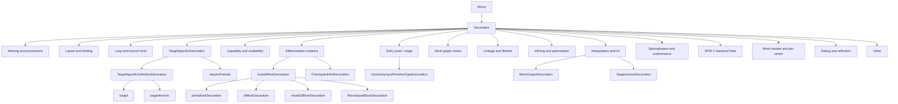

# Decorations

This page is the per-opcode reference for the `Decoration` family —
the largest single family in
[slang-ir-insts.lua](../../../../source/slang/slang-ir-insts.lua),
spanning lines 1752-2702 and holding 196 concrete opcodes at
`source_commit`. Decorations attach metadata to other IR
instructions: names, layout binding, control-flow hints,
target-specific intrinsic spellings, capability requirements,
inlining preferences, autodiff markers, and so on. The intended
reader is a compiler engineer reading IR around a function, type, or
variable and trying to identify what each decoration says about it.

## Source

The opcodes live under the top-level `Decoration` entry of
[slang-ir-insts.lua](../../../../source/slang/slang-ir-insts.lua) at
line 1752. Per-opcode info (mnemonics, fixed operand counts, op
flags) is registered in the generated `kIROps` table in
[slang-ir-insts-info.cpp](../../../../source/slang/slang-ir-insts-info.cpp).
C++ wrappers are declared in
[slang-ir-insts.h](../../../../source/slang/slang-ir-insts.h) —
mostly generated from the Lua entry, occasionally hand-written when
the accessors cannot be derived (see
[../cross-cutting/ir-instructions.md](../cross-cutting/ir-instructions.md)).
Infrastructure (op flags, `IRBuilder` helpers such as
`addSimpleDecoration<T>` and the per-decoration `add*Decoration`
emitters) is split between
[slang-ir.h](../../../../source/slang/slang-ir.h) for the op flags,
[slang-ir-insts.h](../../../../source/slang/slang-ir-insts.h) for
`addSimpleDecoration<T>` and most inline `add*Decoration` helpers, and
[slang-ir.cpp](../../../../source/slang/slang-ir.cpp) for the
out-of-line helper definitions such as `addLayoutDecoration`.

Most decorations originate from AST-side modifiers and attributes.
In
[slang-lower-to-ir.cpp](../../../../source/slang/slang-lower-to-ir.cpp)
the main producers are `addVarDecorations` (line 3114) for
parameters, fields, and global variables; `addLinkageDecoration`
(line 1522) for the import / export / public / extern family;
`addTargetIntrinsicDecorations` (line 13340),
`addSpecializedForTargetDecorations` (line 13321), and
`addTargetRequirementDecorations` (line 13420) for the
target-specific group; `lowerFuncDeclInContext` (line 13784) for
function- and entry-point-level attributes; and
`lowerFrontEndEntryPointToIR` (line 15198) for decorations that are
meaningful only on an entry point. The primal/diff transcription
markers, varying-parameter legalization markers, and SPIR-V backend
hints are introduced by the IR passes themselves, but some autodiff
markers do come from lowering: `visitTreatAsDifferentiableExpr` (line 5890) emits `TreatCallAsDifferentiableDecoration` and
`DifferentiableCallDecoration`, and the `[PreferCheckpoint]` /
`[PreferRecompute]` attributes lower at line 14604.

## Family hierarchy

```mermaid
flowchart TD
  IRInst --> Decoration
  Decoration --> Naming["Naming and provenance"]
  Decoration --> LayoutBinding["Layout and binding"]
  Decoration --> LoopBranchHints["Loop and branch hints"]
  Decoration --> TargetSpecificDecoration
  Decoration --> CapAvail["Capability and availability"]
  Decoration --> IO["Interpolation and IO"]
  Decoration --> Stage["Entry-point / stage"]
  Decoration --> WorkGraph["Work-graph nodes"]
  Decoration --> Linkage["Linkage and lifetime"]
  Decoration --> Inlining["Inlining and optimization"]
  Decoration --> AutoDiff["Differentiation markers"]
  Decoration --> SpecConform["Specialization and conformance"]
  Decoration --> SpvHints["SPIR-V backend hints"]
  Decoration --> Mesh["Mesh-shader and per-vertex"]
  Decoration --> Debug["Debug and reflection"]
  Decoration --> Misc["Other"]
  TargetSpecificDecoration --> TargetSpecificDefinitionDecoration
  TargetSpecificDecoration --> requirePreludeNode[requirePrelude]
  TargetSpecificDefinitionDecoration --> targetNode[target]
  TargetSpecificDefinitionDecoration --> targetIntrinsicNode[targetIntrinsic]
  AutoDiff --> AutodiffInstDecoration
  AutoDiff --> CheckpointHintDecoration
  AutodiffInstDecoration --> primalInst[primalInstDecoration]
  AutodiffInstDecoration --> diffInst[diffInstDecoration]
  AutodiffInstDecoration --> mixedDiffInst[mixedDiffInstDecoration]
  AutodiffInstDecoration --> RecomputeBlockDecoration
  Stage --> GeometryInputPrimitiveTypeDecoration
  IO --> MeshOutputDecoration
  IO --> StageAccessDecoration
```

## Opcodes

### Naming and provenance

| Opcode                   | C++ wrapper                 | Operands                    | Flags | AST origin                                                                                         | Summary                                                                                                                             |
| ------------------------ | --------------------------- | --------------------------- | ----- | -------------------------------------------------------------------------------------------------- | ----------------------------------------------------------------------------------------------------------------------------------- |
| `nameHint`               | `IRNameHintDecoration`      | `nameOperand: IRStringLit`  |       | Decl / parameter name, via `addNameHintDecoration` in `slang-lower-to-ir.cpp`                      | Carries a human-readable name across IR passes; backends use it for variable / function naming.                                     |
| `highLevelDecl`          | `IRHighLevelDeclDecoration` | `declOperand: IRPtrLit`     |       | `slang-lower-to-ir.cpp` lowering (records source `Decl*`)                                          | Records a pointer to the originating AST `Decl` (debug / diagnostic aid).                                                           |
| `BuiltinDecoration`      | `IRBuiltinDecoration`       | —                           |       | `[builtin]` attribute (`BuiltinAttribute`) on an `interface` declaration, via `visitInterfaceDecl` | Marks a core-module interface as a compiler builtin — for example the `IBufferDataLayout` that every `RWStructuredBuffer` links in. |
| `KnownBuiltinDecoration` | `IRKnownBuiltinDecoration`  | `nameOperand: IRIntLit`     |       | `[KnownBuiltin(name)]` attribute (`KnownBuiltinAttribute`)                                         | Names a builtin by enum tag so later passes can find it.                                                                            |
| `UserTypeName`           | `IRUserTypeNameDecoration`  | `userTypeName: IRStringLit` |       | (synthesized by the user-type-hint pass in `slang-ir-user-type-hint.cpp`)                          | Records the original user type name for a shader parameter.                                                                         |
| `COMInterface`           | `IRComInterfaceDecoration`  | —                           |       | `[COM(guid)]` attribute (`ComInterfaceAttribute`)                                                  | Marks an interface as a COM interface declaration.                                                                                  |
| `COMWitnessDecoration`   | `IRCOMWitnessDecoration`    | `witnessTable`              |       | (synthesized by the COM-method lowering pass in `slang-ir-lower-com-methods.cpp`)                  | Marks a class type as a COM interface implementation.                                                                               |
| `UserExtern`             | `IRUserExternDecoration`    | —                           |       | `extern` modifier on an imported decl, via `addLinkageDecoration`                                  | Marks an inst as coming from user-side `extern`.                                                                                    |
| `transitory`             | `IRTransitoryDecoration`    | —                           |       | (synthesized)                                                                                      | Marks an inst as transitory; should never survive into the output.                                                                  |

### Layout and binding

| Opcode                      | C++ wrapper                             | Operands                                                               | Flags | AST origin                                                                                    | Summary                                                                                             |
| --------------------------- | --------------------------------------- | ---------------------------------------------------------------------- | ----- | --------------------------------------------------------------------------------------------- | --------------------------------------------------------------------------------------------------- |
| `layout`                    | `IRLayoutDecoration`                    | (variadic, `min=1`)                                                    |       | Layout-pass output                                                                            | Attaches a `Layout` opcode (see [metadata.md](metadata.md)) to a parameter or type.                 |
| `AlignedAddressDecoration`  | `IRAlignedAddressDecoration`            | `alignment`                                                            |       | (synthesized)                                                                                 | Marks an address inst as aligned to a specific byte boundary.                                       |
| `SizeAndAlignment`          | `IRSizeAndAlignmentDecoration`          | `layoutNameOperand, sizeOperand: IRIntLit, alignmentOperand: IRIntLit` |       | (synthesized)                                                                                 | Records size/alignment of a type under a named layout.                                              |
| `Offset`                    | `IROffsetDecoration`                    | `layoutNameOperand, offsetOperand: IRIntLit`                           |       | (synthesized)                                                                                 | Records the offset of a struct field under a named layout.                                          |
| `packoffset`                | `IRPackOffsetDecoration`                | `registerOffset: IRIntLit, componentOffset: IRIntLit`                  |       | `packoffset(...)` HLSL semantic (`HLSLPackOffsetSemantic`)                                    | HLSL packoffset binding.                                                                            |
| `glslLocation`              | `IRGLSLLocationDecoration`              | `location: IRIntLit`                                                   |       | `[vk::location(N)]`, declared as `vk_location` in `core.meta.slang` (`GLSLLocationAttribute`) | GLSL / Vulkan location binding.                                                                     |
| `glslOffset`                | `IRGLSLOffsetDecoration`                | `offset: IRIntLit`                                                     |       | `GLSLOffsetLayoutAttribute` (GLSL `layout(offset=...)`)                                       | GLSL / Vulkan offset binding.                                                                       |
| `vkStructOffset`            | `IRVkStructOffsetDecoration`            | `offset: IRIntLit`                                                     |       | `[vk_offset(index)]` attribute (`VkStructOffsetAttribute`)                                    | Vulkan struct-member offset.                                                                        |
| `HasExplicitHLSLBinding`    | `IRHasExplicitHLSLBindingDecoration`    | —                                                                      |       | An `HLSLLayoutSemantic` (e.g. `register(...)`) on a global parameter                          | Marks a parameter as having an explicit HLSL register binding.                                      |
| `synthesizedParameterGroup` | `IRSynthesizedParameterGroupDecoration` | —                                                                      |       | (synthesized when entry-point or global uniforms are collected into a group)                  | Marks a parameter-group element struct as compiler-generated rather than source-authored.           |
| `BinaryInterfaceType`       | `IRBinaryInterfaceTypeDecoration`       | —                                                                      |       | (synthesized)                                                                                 | Marks a type as being used as a binary-interface type so `legalizeEmptyType` does not eliminate it. |
| `PhysicalType`              | `IRPhysicalTypeDecoration`              | (variadic, `min=1`)                                                    |       | (synthesized)                                                                                 | Marks the physical lowered type of a logical value.                                                 |
| `output`                    | `IRGlobalOutputDecoration`              | —                                                                      |       | `out` modifier on global parameter                                                            | Marks a global parameter as an output.                                                              |
| `input`                     | `IRGlobalInputDecoration`               | —                                                                      |       | `in` modifier on global parameter                                                             | Marks a global parameter as an input.                                                               |
| `glslOuterArray`            | `IRGLSLOuterArrayDecoration`            | `outerArrayNameOperand: IRStringLit`                                   |       | GLSL legalization                                                                             | Records the outer-array variable name for GLSL emission.                                            |

### Loop and branch hints

| Opcode                        | C++ wrapper                       | Operands                              | Flags | AST origin                                                                                                                                  | Summary                                                                      |
| ----------------------------- | --------------------------------- | ------------------------------------- | ----- | ------------------------------------------------------------------------------------------------------------------------------------------- | ---------------------------------------------------------------------------- |
| `branch`                      | `IRBranchDecoration`              | —                                     |       | `[branch]` attribute                                                                                                                        | Hints the backend to emit a branching select.                                |
| `flatten`                     | `IRFlattenDecoration`             | —                                     |       | `[flatten]` attribute                                                                                                                       | Hints the backend to flatten a conditional.                                  |
| `loopControl`                 | `IRLoopControlDecoration`         | `modeOperand: IRConstant`             |       | `[unroll]` / `[loop]` attributes                                                                                                            | Records loop-control mode (unroll, loop, ...).                               |
| `loopMaxIters`                | `IRLoopMaxItersDecoration`        | (variadic, `min=1`)                   |       | `[MaxIters(count)]` attribute (`MaxItersAttribute`)                                                                                         | Records the maximum-iteration bound for a loop.                              |
| `loopExitPrimalValue`         | `IRLoopExitPrimalValueDecoration` | `targetInst, loopExitValInst`         |       | (synthesized by autodiff)                                                                                                                   | Records the primal value of an exit-condition for reverse-mode use.          |
| `ForceUnroll`                 | `IRForceUnrollDecoration`         | — (builder appends `count: IRIntLit`) |       | `[ForceUnroll(count = 0)]` attribute (`ForceUnrollAttribute`), declared `__attributeTarget(LoopStmt)` and so valid only on a loop statement | Forces loop unrolling; the operand is the requested count, `0` when omitted. |
| `loopCounterDecoration`       | `IRLoopCounterDecoration`         | —                                     |       | (synthesized by autodiff)                                                                                                                   | Marks an instruction as a loop counter.                                      |
| `loopCounterUpdateDecoration` | `IRLoopCounterUpdateDecoration`   | —                                     |       | (synthesized by autodiff)                                                                                                                   | Marks the per-iteration update of a loop counter.                            |

### Target-specific definition and intrinsics

| Opcode              | C++ wrapper                   | Operands                                                                          | Flags | AST origin                                                                  | Summary                                                                                           |
| ------------------- | ----------------------------- | --------------------------------------------------------------------------------- | ----- | --------------------------------------------------------------------------- | ------------------------------------------------------------------------------------------------- |
| `target`            | `IRTargetDecoration`          | (variadic, `min=1`)                                                               |       | `__specialized_for_target(...)` modifier (`SpecializedForTargetModifier`)   | Marks a function as the implementation for one specific target.                                   |
| `targetIntrinsic`   | `IRTargetIntrinsicDecoration` | `target, definitionOperand: IRStringLit, predicate?: IRStringLit, typeScrutinee?` |       | `__target_intrinsic(...)` modifier (`TargetIntrinsicModifier`)              | Carries the target-specific spelling of an [intrinsic](../glossary.md).                           |
| `requirePrelude`    | `IRRequirePreludeDecoration`  | (variadic, `min=2`)                                                               |       | `[RequirePrelude(target, prelude)]` attribute                               | Records a prelude snippet that the backend must include when the decorated function is reachable. |
| `intrinsicOp`       | `IRIntrinsicOpDecoration`     | `intrinsicOpOperand: IRIntLit`                                                    |       | `__intrinsic_op(...)` modifier                                              | Identifies the built-in IR opcode that implements an intrinsic.                                   |
| `spirvOpDecoration` | `IRSPIRVOpDecoration`         | (variadic, `min=1`)                                                               |       | `[vk_spirv_instruction(op, set)]` attribute (`SPIRVInstructionOpAttribute`) | Records the SPIR-V opcode for a function.                                                         |

### Capability and availability

| Opcode                                              | C++ wrapper                                           | Operands                                                          | Flags | AST origin                                                                                                                                                       | Summary                                                                                                             |
| --------------------------------------------------- | ----------------------------------------------------- | ----------------------------------------------------------------- | ----- | ---------------------------------------------------------------------------------------------------------------------------------------------------------------- | ------------------------------------------------------------------------------------------------------------------- |
| `requireCapabilityAtom`                             | `IRRequireCapabilityAtomDecoration`                   | `capabilityAtomOperand: IRConstant`                               |       | Layout-IR lowering (`TargetProgram::createIRModuleForLayout`), from the entry point's _inferred_ capability set — not from a `[require(...)]` attribute directly | Requires one capability atom; only SPIR-V version and Metal-library atoms are recorded.                             |
| `requireSPIRVVersion`                               | `IRRequireSPIRVVersionDecoration`                     | `SPIRVVersionOperand: IRConstant`                                 |       | `__spirv_version` modifier (`RequiredSPIRVVersionModifier`)                                                                                                      | Records a minimum SPIR-V version.                                                                                   |
| `requireGLSLVersion`                                | `IRRequireGLSLVersionDecoration`                      | `languageVersionOperand: IRConstant`                              |       | `__glsl_version` modifier (`RequiredGLSLVersionModifier`)                                                                                                        | Records a minimum GLSL version.                                                                                     |
| `requireGLSLExtension`                              | `IRRequireGLSLExtensionDecoration`                    | `extensionNameOperand: IRStringLit`                               |       | `__glsl_extension` modifier (`RequiredGLSLExtensionModifier`)                                                                                                    | Records a required GLSL extension.                                                                                  |
| `requireWGSLExtension`                              | `IRRequireWGSLExtensionDecoration`                    | `extensionNameOperand: IRStringLit`                               |       | `__wgsl_extension` modifier (`RequiredWGSLExtensionModifier`)                                                                                                    | Records a required WGSL extension.                                                                                  |
| `requireCUDASMVersion`                              | `IRRequireCUDASMVersionDecoration`                    | `CUDASMVersionOperand: IRConstant`                                |       | `__cuda_sm_version` modifier (`RequiredCUDASMVersionModifier`)                                                                                                   | Records a minimum CUDA SM version.                                                                                  |
| `shader64BitIndexing`                               | `IRShader64BitIndexingDecoration`                     | —                                                                 |       | `[Shader64BitIndexing]` attribute, lifted onto the entry point from its inferred capability set                                                                  | Requests the SPIR-V `Shader64BitIndexingEXT` execution mode (plus its capability and extension) for an entry point. |
| `availableInDownstreamIR`                           | `IRAvailableInDownstreamIRDecoration`                 | (variadic, `min=1`)                                               |       | (synthesized)                                                                                                                                                    | Marks an inst as available through the downstream-IR import.                                                        |
| `RequireSPIRVDescriptorIndexingExtensionDecoration` | `IRRequireSPIRVDescriptorIndexingExtensionDecoration` | —                                                                 |       | (synthesized)                                                                                                                                                    | Marks a function as requiring SPIR-V descriptor indexing.                                                           |
| `requiresNVAPI`                                     | `IRRequiresNVAPIDecoration`                           | —                                                                 |       | NVAPI core-module markers                                                                                                                                        | Requires NVAPI prelude when targeting D3D.                                                                          |
| `nvapiMagic`                                        | `IRNVAPIMagicDecoration`                              | `nameOperand: IRStringLit`                                        |       | `NVAPIMagicModifier` on a core-module decl                                                                                                                       | Marks an inst as part of the NVAPI magic naming.                                                                    |
| `nvapiSlot`                                         | `IRNVAPISlotDecoration`                               | `registerNameOperand: IRStringLit, spaceNameOperand: IRStringLit` |       | NVAPI core-module markers                                                                                                                                        | Records the NVAPI register/space binding.                                                                           |

### Interpolation and shader IO

| Opcode                      | C++ wrapper                             | Operands                                                           | Flags | AST origin                                                                                                                                          | Summary                                                                                         |
| --------------------------- | --------------------------------------- | ------------------------------------------------------------------ | ----- | --------------------------------------------------------------------------------------------------------------------------------------------------- | ----------------------------------------------------------------------------------------------- |
| `interpolationMode`         | `IRInterpolationModeDecoration`         | `modeOperand: IRConstant` (an `IRInterpolationMode` value)         |       | `linear` / `noperspective` / etc. modifiers, via `addVarDecorations`                                                                                | Records the interpolation mode of a varying parameter; see the callout for the encoding.        |
| `TargetSystemValue`         | `IRTargetSystemValueDecoration`         | `semanticOperand: IRStringLit, index: IRIntLit`                    |       | (synthesized by varying-parameter and Metal legalization)                                                                                           | Records the target-specific system-value binding.                                               |
| `semantic`                  | `IRSemanticDecoration`                  | `semanticNameOperand: IRStringLit, semanticIndexOperand: IRIntLit` |       | `HLSLSimpleSemantic` and `HLSLLayoutSemantic` AST nodes                                                                                             | Records the HLSL semantic on a parameter or field.                                              |
| `raypayload`                | `IRRayPayloadDecoration`                | —                                                                  |       | `[raypayload]` attribute (`RayPayloadAttribute`)                                                                                                    | Marks a type as usable as a ray payload.                                                        |
| `vulkanRayPayload`          | `IRVulkanRayPayloadDecoration`          | — (builder appends `location: IRIntLit`)                           |       | `[__vulkanRayPayload(location)]` attribute                                                                                                          | Marks a variable as a Vulkan ray payload (outgoing).                                            |
| `vulkanRayPayloadIn`        | `IRVulkanRayPayloadInDecoration`        | — (builder appends `location: IRIntLit`)                           |       | `VulkanRayPayloadInAttribute` (GLSL `rayPayloadInEXT`)                                                                                              | Marks a variable as a Vulkan ray payload (incoming).                                            |
| `vulkanHitAttributes`       | `IRVulkanHitAttributesDecoration`       | —                                                                  |       | `[__vulkanHitAttributes]` attribute                                                                                                                 | Marks a variable as Vulkan hit attributes.                                                      |
| `vulkanHitObjectAttributes` | `IRVulkanHitObjectAttributesDecoration` | — (builder appends `location: IRIntLit`)                           |       | `[__vulkanHitObjectAttributes(location)]` attribute                                                                                                 | Marks a variable as Vulkan hit-object attributes.                                               |
| `vulkanCallablePayload`     | `IRVulkanCallablePayloadDecoration`     | — (builder appends `location: IRIntLit`)                           |       | `[__vulkanCallablePayload(location)]` attribute                                                                                                     | Marks a variable as a Vulkan callable payload (outgoing).                                       |
| `vulkanCallablePayloadIn`   | `IRVulkanCallablePayloadInDecoration`   | — (builder appends `location: IRIntLit`)                           |       | `VulkanCallablePayloadInAttribute` (GLSL `callableDataInEXT`)                                                                                       | Marks a variable as a Vulkan callable payload (incoming).                                       |
| `earlyDepthStencil`         | `IREarlyDepthStencilDecoration`         | —                                                                  |       | `[earlydepthstencil]` attribute                                                                                                                     | Requests early-depth-stencil test for a pixel shader.                                           |
| `glslFragDepthGreater`      | `IRGLSLFragDepthGreaterDecoration`      | —                                                                  |       | (synthesized by GLSL legalization from `SV_DepthGreaterEqual`)                                                                                      | Marks a fragment entry point whose `gl_FragDepth` only ever increases the fixed-function depth. |
| `glslFragDepthLess`         | `IRGLSLFragDepthLessDecoration`         | —                                                                  |       | (synthesized by GLSL legalization from `SV_DepthLessEqual`)                                                                                         | Marks a fragment entry point whose `gl_FragDepth` only ever decreases the fixed-function depth. |
| `precise`                   | `IRPreciseDecoration`                   | —                                                                  |       | `precise` modifier (`PreciseModifier`)                                                                                                              | Requests bit-precise math.                                                                      |
| `format`                    | `IRFormatDecoration`                    | `formatOperand: IRConstant`                                        |       | `[format("rgba32f")]` / `[vk_image_format("rgba32f")]` attribute (`FormatAttribute`); the argument is a format-name _string_, not a bare identifier | Records the image format for a UAV as the integer `ImageFormat` value the string resolves to.   |
| `perprimitive`              | `IRGLSLPrimitivesRateDecoration`        | —                                                                  |       | (synthesized by GLSL legalization in `slang-ir-glsl-legalize.cpp`)                                                                                  | GLSL `per_primitiveEXT` rate qualifier.                                                         |

### Mesh shader, geometry shader, and per-vertex

| Opcode                       | C++ wrapper                                 | Operands                             | Flags | AST origin                                                         | Summary                                                |
| ---------------------------- | ------------------------------------------- | ------------------------------------ | ----- | ------------------------------------------------------------------ | ------------------------------------------------------ |
| `pointPrimitiveType`         | `IRPointInputPrimitiveTypeDecoration`       | —                                    |       | `[shader("geometry")]` point variant                               | Marks a geometry input as `point`.                     |
| `linePrimitiveType`          | `IRLineInputPrimitiveTypeDecoration`        | —                                    |       | Geometry shader `line` variant                                     | Marks a geometry input as `line`.                      |
| `trianglePrimitiveType`      | `IRTriangleInputPrimitiveTypeDecoration`    | —                                    |       | Geometry shader `triangle` variant                                 | Marks a geometry input as `triangle`.                  |
| `lineAdjPrimitiveType`       | `IRLineAdjInputPrimitiveTypeDecoration`     | —                                    |       | Geometry shader `lineadj`                                          | Marks a geometry input as `lineadj`.                   |
| `triangleAdjPrimitiveType`   | `IRTriangleAdjInputPrimitiveTypeDecoration` | —                                    |       | Geometry shader `triangleadj`                                      | Marks a geometry input as `triangleadj`.               |
| `streamOutputTypeDecoration` | `IRStreamOutputTypeDecoration`              | `streamType: IRHLSLStreamOutputType` |       | Geometry shader output declaration                                 | Records the stream-output type.                        |
| `vertices`                   | `IRVerticesDecoration`                      | (variadic, `min=1`)                  |       | Mesh-shader vertex output                                          | Marks a parameter as the mesh-shader vertex output.    |
| `indices`                    | `IRIndicesDecoration`                       | (variadic, `min=1`)                  |       | Mesh-shader index output                                           | Marks a parameter as the mesh-shader index output.     |
| `primitives`                 | `IRPrimitivesDecoration`                    | (variadic, `min=1`)                  |       | Mesh-shader primitive output                                       | Marks a parameter as the mesh-shader primitive output. |
| `HLSLMeshPayloadDecoration`  | `IRHLSLMeshPayloadDecoration`               | —                                    |       | `payload` modifier (`HLSLPayloadModifier`)                         | Marks a parameter as the HLSL mesh-payload.            |
| `PositionOutput`             | `IRGLPositionOutputDecoration`              | —                                    |       | (synthesized by GLSL legalization from `SV_Position`)              | Marks a varying as the `gl_Position` output.           |
| `PositionInput`              | `IRGLPositionInputDecoration`               | —                                    |       | (synthesized by GLSL legalization from `SV_Position`)              | Marks a varying as the `gl_Position` input.            |
| `PerVertex`                  | `IRPerVertexDecoration`                     | —                                    |       | (synthesized by GLSL legalization in `slang-ir-glsl-legalize.cpp`) | Marks a fragment-shader input array as per-vertex.     |
| `stageReadAccess`            | `IRStageReadAccessDecoration`               | —                                    |       | (synthesized)                                                      | Records the read-access stage of a resource.           |
| `stageWriteAccess`           | `IRStageWriteAccessDecoration`              | —                                    |       | (synthesized)                                                      | Records the write-access stage of a resource.          |

### Entry-point and stage

| Opcode                  | C++ wrapper                         | Operands                                                             | Flags | AST origin                                                                | Summary                                                                |
| ----------------------- | ----------------------------------- | -------------------------------------------------------------------- | ----- | ------------------------------------------------------------------------- | ---------------------------------------------------------------------- |
| `entryPoint`            | `IREntryPointDecoration`            | `profileInst: IRIntLit, name: IRStringLit, moduleName?: IRStringLit` |       | `[shader(...)]` attribute                                                 | Marks a function as an entry point with a given profile and name.      |
| `entryPointParam`       | `IREntryPointParamDecoration`       | `entryPoint: IRFunc`                                                 |       | (synthesized)                                                             | Marks a global parameter that was moved from an entry-point parameter. |
| `patchConstantFunc`     | `IRPatchConstantFuncDecoration`     | `func: IRInst`                                                       |       | `[patchconstantfunc(...)]` attribute                                      | Records the hull-shader patch-constant function.                       |
| `maxTessFactor`         | `IRMaxTessFactorDecoration`         | `maxTessFactor: IRFloatLit`                                          |       | `[maxtessfactor(...)]` attribute                                          | Records the maximum tessellation factor.                               |
| `outputControlPoints`   | `IROutputControlPointsDecoration`   | `controlPointCount: IRIntLit`                                        |       | `[outputcontrolpoints(...)]` attribute                                    | Records the hull-shader output control-point count.                    |
| `outputTopology`        | `IROutputTopologyDecoration`        | `topology: IRStringLit, topologyTypeOperand: IRIntLit`               |       | `[outputtopology(...)]` attribute                                         | Records the hull-shader output topology.                               |
| `partitioning`          | `IRPartitioningDecoration`          | `partitioning: IRStringLit`                                          |       | `[partitioning(...)]` attribute                                           | Records the tessellation partitioning mode.                            |
| `domain`                | `IRDomainDecoration`                | `domain: IRStringLit`                                                |       | `[domain(...)]` attribute                                                 | Records the tessellation domain.                                       |
| `maxVertexCount`        | `IRMaxVertexCountDecoration`        | `count: IRIntLit`                                                    |       | `[maxvertexcount(...)]` attribute                                         | Records the geometry-shader vertex-count limit.                        |
| `instance`              | `IRInstanceDecoration`              | `count: IRIntLit`                                                    |       | `[instance(...)]` attribute                                               | Records the geometry-shader instance count.                            |
| `numThreads`            | `IRNumThreadsDecoration`            | (variadic, `min=3`)                                                  |       | `[numthreads(x,y,z)]` attribute                                           | Records the compute-shader workgroup size.                             |
| `fpDenormalPreserve`    | `IRFpDenormalPreserveDecoration`    | `width: IRIntLit`                                                    |       | (synthesized in `slang-emit.cpp` from the denormal-mode compiler options) | Requests denormal-preserve behavior at a given precision.              |
| `fpDenormalFlushToZero` | `IRFpDenormalFlushToZeroDecoration` | `width: IRIntLit`                                                    |       | (synthesized in `slang-emit.cpp` from the denormal-mode compiler options) | Requests denormal-flush-to-zero.                                       |
| `waveSize`              | `IRWaveSizeDecoration`              | `numLanes: IRIntLit`                                                 |       | `[WaveSize(numLanes)]` attribute                                          | Requests a specific wave size.                                         |
| `DerivativeGroupQuad`   | `IRDerivativeGroupQuadDecoration`   | —                                                                    |       | `[DerivativeGroupQuad]` attribute                                         | Quad-form derivative grouping.                                         |
| `DerivativeGroupLinear` | `IRDerivativeGroupLinearDecoration` | —                                                                    |       | `[DerivativeGroupLinear]` attribute                                       | Linear-form derivative grouping.                                       |
| `MaximallyReconverges`  | `IRMaximallyReconvergesDecoration`  | —                                                                    |       | `[MaximallyReconverges]` attribute                                        | Requests maximal-reconvergence execution.                              |
| `QuadDerivatives`       | `IRQuadDerivativesDecoration`       | —                                                                    |       | `[QuadDerivatives]` attribute                                             | Requests quad-derivative execution.                                    |
| `RequireFullQuads`      | `IRRequireFullQuadsDecoration`      | —                                                                    |       | `[RequireFullQuads]` attribute                                            | Requires full quads.                                                   |

### Work-graph nodes

The work-graph attributes are declared as `attribute_syntax` in
[workgraph.slang](../../../../source/standard-modules/experimental/workgraph.slang)
rather than in `core.meta.slang`; see
[../ast-reference/modifiers.md](../ast-reference/modifiers.md) for the
AST classes. The function-level ones are lowered by
`lowerFuncDeclInContext` (line 14473 onward) and the parameter-level
ones by `addVarDecorations` (line 3258 onward) in
[slang-lower-to-ir.cpp](../../../../source/slang/slang-lower-to-ir.cpp).

| Opcode                       | C++ wrapper                              | Operands                                  | Flags | AST origin                                                                                                 | Summary                                                                                    |
| ---------------------------- | ---------------------------------------- | ----------------------------------------- | ----- | ---------------------------------------------------------------------------------------------------------- | ------------------------------------------------------------------------------------------ |
| `nodeLaunch`                 | `IRNodeLaunchDecoration`                 | `mode: IRStringLit`                       |       | `[NodeLaunch("broadcasting" \| "thread" \| "coalescing")]` (`NodeLaunchAttribute`)                         | Records the node launch mode as a string so HLSL emit can re-spell it as a named constant. |
| `nodeMaxDispatchGrid`        | `IRNodeMaxDispatchGridDecoration`        | `x: IRIntLit, y: IRIntLit, z: IRIntLit`   |       | `[NodeMaxDispatchGrid(x,y,z)]` (`NodeMaxDispatchGridAttribute`)                                            | Upper bound on a broadcasting node's dispatch grid.                                        |
| `nodeDispatchGrid`           | `IRNodeDispatchGridDecoration`           | `x: IRIntLit, y: IRIntLit, z: IRIntLit`   |       | `[NodeDispatchGrid(x,y,z)]` (`NodeDispatchGridAttribute`)                                                  | Fixed dispatch-grid size for a broadcasting node.                                          |
| `maxRecords`                 | `IRMaxRecordsDecoration`                 | `count: IRIntLit`                         |       | `[MaxRecords(count)]` (`MaxRecordsAttribute`), on a node function or on an input / output record parameter | Maximum record count for the node or for that parameter.                                   |
| `nodeID`                     | `IRNodeIDDecoration`                     | `name: IRStringLit, arrayIndex: IRIntLit` |       | `[NodeID(name, arrayIndex = 0)]` (`NodeIDAttribute`), on a node function or an output parameter            | Overrides the node identifier (name and array index).                                      |
| `nodeIsProgramEntry`         | `IRNodeIsProgramEntryDecoration`         | —                                         |       | `[NodeIsProgramEntry]` (`NodeIsProgramEntryAttribute`)                                                     | Marks a node shader as a program entry point in the work graph.                            |
| `nodeArraySize`              | `IRNodeArraySizeDecoration`              | `count: IRIntLit`                         |       | `[NodeArraySize(count)]` (`NodeArraySizeAttribute`) on an output-node array parameter                      | Size of an output node array.                                                              |
| `allowSparseNodes`           | `IRAllowSparseNodesDecoration`           | —                                         |       | `[AllowSparseNodes]` (`AllowSparseNodesAttribute`) on an output-node array parameter                       | Permits unpopulated entries in an output node array.                                       |
| `workGraphRecordType`        | `IRWorkGraphRecordTypeDecoration`        | —                                         |       | — (no producer at `source_commit`)                                                                         | Reserved opcode identity; see the callout below.                                           |
| `workGraphRecordElementType` | `IRWorkGraphRecordElementTypeDecoration` | `elementType: IRType`                     |       | — (no producer at `source_commit`)                                                                         | Reserved opcode identity; see the callout below.                                           |

### Linkage and lifetime

| Opcode                   | C++ wrapper                                | Operands                                                            | Flags | AST origin                                                                            | Summary                                                         |
| ------------------------ | ------------------------------------------ | ------------------------------------------------------------------- | ----- | ------------------------------------------------------------------------------------- | --------------------------------------------------------------- |
| `import`                 | `IRImportDecoration`                       | (variadic, `min=1`)                                                 |       | `import` declaration                                                                  | Marks an inst as imported under a mangled name.                 |
| `export`                 | `IRExportDecoration`                       | (variadic, `min=1`)                                                 |       | `export` declaration                                                                  | Marks an inst as exported under a mangled name.                 |
| `public`                 | `IRPublicDecoration`                       | —                                                                   |       | `public` modifier (`PublicModifier`)                                                  | Public visibility.                                              |
| `hlslExport`             | `IRHLSLExportDecoration`                   | —                                                                   |       | `export` modifier (`HLSLExportModifier`)                                              | HLSL export.                                                    |
| `downstreamModuleExport` | `IRDownstreamModuleExportDecoration`       | —                                                                   |       | (synthesized)                                                                         | Marks an inst as exported through the downstream module bridge. |
| `downstreamModuleImport` | `IRDownstreamModuleImportDecoration`       | —                                                                   |       | (synthesized)                                                                         | Marks an inst as imported through the downstream module bridge. |
| `externCpp`              | `IRExternCppDecoration`                    | `nameOperand: IRStringLit`                                          |       | `__extern_cpp` modifier (`ExternCppModifier`)                                         | Emits the function without C++ mangling.                        |
| `externC`                | `IRExternCDecoration`                      | —                                                                   |       | (synthesized by the PyTorch/CUDA binding pass in `slang-ir-pytorch-cpp-binding.cpp`)  | Wraps a generated wrapper function in `extern "C"`.             |
| `dllImport`              | `IRDllImportDecoration`                    | `libraryNameOperand: IRStringLit, functionNameOperand: IRStringLit` |       | `[DllImport(modulePath)]` attribute                                                   | Generates dynamic-library load logic.                           |
| `dllExport`              | `IRDllExportDecoration`                    | `functionNameOperand: IRStringLit`                                  |       | `[DllExport]` attribute                                                               | Generates DLL-export wrapper.                                   |
| `cudaDeviceExport`       | `IRCudaDeviceExportDecoration`             | (variadic, `min=1`)                                                 |       | `[CudaDeviceExport]` attribute                                                        | Exports a function as a CUDA `__device__` function.             |
| `CudaKernel`             | `IRCudaKernelDecoration`                   | —                                                                   |       | `[CudaKernel]` attribute                                                              | Marks a function as a CUDA kernel.                              |
| `CudaHost`               | `IRCudaHostDecoration`                     | —                                                                   |       | `[CudaHost]` attribute                                                                | Marks a function as a CUDA host helper.                         |
| `TorchEntryPoint`        | `IRTorchEntryPointDecoration`              | `functionNameOperand: IRStringLit`                                  |       | `[TorchEntryPoint]` attribute                                                         | Marks a Torch / Slang interop entry point.                      |
| `AutoPyBindCUDA`         | `IRAutoPyBindCudaDecoration`               | `functionNameOperand: IRStringLit, fwdDiffFunc?, bwdDiffFunc?`      |       | `[AutoPyBindCUDA]` attribute                                                          | Generates Python bindings for a CUDA function.                  |
| `CudaKernelFwdDiffRef`   | `IRCudaKernelForwardDerivativeDecoration`  | `forwardDerivativeFunc?`                                            |       | (synthesized by autodiff)                                                             | Records the forward-mode derivative of a CUDA kernel.           |
| `CudaKernelBwdDiffRef`   | `IRCudaKernelBackwardDerivativeDecoration` | `backwardDerivativeFunc?`                                           |       | (synthesized by autodiff)                                                             | Records the reverse-mode derivative of a CUDA kernel.           |
| `PyBindExportFuncInfo`   | `IRAutoPyBindExportInfoDecoration`         | —                                                                   |       | `[AutoPyBindCUDA]` lowering                                                           | Reflection info for Python binding generation.                  |
| `PyExportDecoration`     | `IRPyExportDecoration`                     | `exportNameOperand: IRStringLit`                                    |       | `[PyExport(...)]` attribute                                                           | Marks a function as exported to Python.                         |
| `dependsOn`              | `IRDependsOnDecoration`                    | (variadic, `min=1`)                                                 |       | (synthesized by GLSL legalization when a function must keep a global parameter alive) | Adds an extra dependency edge to the parent inst.               |
| `keepAlive`              | `IRKeepAliveDecoration`                    | —                                                                   |       | (synthesized: `addLinkageDecoration`, witness-table lowering, and IR passes)          | Prevents DCE from eliminating the inst.                         |
| `TargetBuiltinVar`       | `IRTargetBuiltinVarDecoration`             | `builtinVarOperand: IRIntLit`                                       |       | (synthesized)                                                                         | Marks a global variable as a target builtin variable.           |

### Inlining and optimization

| Opcode                                             | C++ wrapper                                          | Operands            | Flags | AST origin                                     | Summary                                                            |
| -------------------------------------------------- | ---------------------------------------------------- | ------------------- | ----- | ---------------------------------------------- | ------------------------------------------------------------------ |
| `unsafeForceInlineEarly`                           | `IRUnsafeForceInlineEarlyDecoration`                 | —                   |       | `[__unsafeForceInlineEarly]` attribute         | Inlines calls immediately after codegen.                           |
| `ForceInline`                                      | `IRForceInlineDecoration`                            | —                   |       | `[ForceInline]` attribute                      | Inlines calls during normal IR passes.                             |
| `AllowPreTranslationInlining`                      | `IRAllowPreTranslationInliningDecoration`            | —                   |       | (synthesized)                                  | Permits inlining after translation passes.                         |
| `noInline`                                         | `IRNoInlineDecoration`                               | —                   |       | `[noinline]` attribute                         | Suppresses inlining.                                               |
| `noRefInline`                                      | `IRNoRefInlineDecoration`                            | —                   |       | (synthesized)                                  | Suppresses inlining of reference-type calls.                       |
| `alwaysFold`                                       | `IRAlwaysFoldIntoUseSiteDecoration`                  | —                   |       | `[__AlwaysFoldIntoUseSiteAttribute]` attribute | Always fold call result into its use site.                         |
| `noSideEffect`                                     | `IRNoSideEffectDecoration`                           | —                   |       | `[__NoSideEffect]` attribute                   | Marks a callee as side-effect free.                                |
| `ignoreSideEffectsDecoration`                      | `IRIgnoreSideEffectsDecoration`                      | —                   |       | (synthesized)                                  | DCE may treat the call as side-effect free.                        |
| `NonDynamicUniformReturnDecoration`                | `IRNonDynamicUniformReturnDecoration`                | —                   |       | (synthesized)                                  | Marks a function whose return value is never dynamically uniform.  |
| `optimizableTypeDecoration`                        | `IROptimizableTypeDecoration`                        | —                   |       | (synthesized)                                  | Marks a type as eligible for field trimming.                       |
| `readNone`                                         | `IRReadNoneDecoration`                               | —                   |       | `[__readNone]` attribute                       | Marks a function as pure (no reads, no writes).                    |
| `DisableCopyEliminationDecoration`                 | `IRDisableCopyEliminationDecoration`                 | —                   |       | (synthesized)                                  | Prevents copy-elimination on the inst.                             |
| `nonCopyable`                                      | `IRNonCopyableTypeDecoration`                        | —                   |       | `[__NonCopyableType]` attribute                | Marks a type as non-copyable; SSA skips it.                        |
| `DynamicUniform`                                   | `IRDynamicUniformDecoration`                         | —                   |       | (synthesized)                                  | Marks a value as dynamically uniform.                              |
| `bindExistentialSlots`                             | `IRBindExistentialSlotsDecoration`                   | —                   |       | (synthesized)                                  | Records existential-binding slot info.                             |
| `DefaultValue`                                     | `IRDefaultValueDecoration`                           | (variadic, `min=1`) |       | Default-value modifier                         | Records the default value of a parameter or member.                |
| `InParamProxyVar`                                  | `IRInParamProxyVarDecoration`                        | (variadic, `min=1`) |       | (synthesized)                                  | Marks a local var as the legacy-mutated form of an `in` parameter. |
| `TempCallArgImmutableVar`                          | `IRTempCallArgImmutableVarDecoration`                | —                   |       | (synthesized)                                  | Marks a temporary used to materialize an immutable call argument.  |
| `TempCallArgVar`                                   | `IRTempCallArgVarDecoration`                         | —                   |       | (synthesized)                                  | Marks a temporary used to materialize a mutable call argument.     |
| `GlobalVariableShadowingGlobalParameterDecoration` | `IRGlobalVariableShadowingGlobalParameterDecoration` | (variadic, `min=2`) |       | (synthesized)                                  | Marks a global var that shadows a global parameter.                |

### Specialization, conformance, and existentials

| Opcode                             | C++ wrapper                          | Operands                               | Flags | AST origin                                                                           | Summary                                                                                                                                                                                                                                      |
| ---------------------------------- | ------------------------------------ | -------------------------------------- | ----- | ------------------------------------------------------------------------------------ | -------------------------------------------------------------------------------------------------------------------------------------------------------------------------------------------------------------------------------------------- |
| `SpecializeDecoration`             | `IRSpecializeDecoration`             | —                                      |       | (synthesized)                                                                        | Hints the specialization pass to specialize the inst.                                                                                                                                                                                        |
| `SpecializationDepthDecoration`    | `IRSpecializationDepthDecoration`    | `specializationDepthOperand: IRIntLit` |       | (synthesized)                                                                        | Records how deeply specialized the inst is.                                                                                                                                                                                                  |
| `SequentialIDDecoration`           | `IRSequentialIDDecoration`           | `sequentialIdOperand: IRIntLit`        |       | (synthesized)                                                                        | Stable integer ID used by `GetSequentialID`.                                                                                                                                                                                                 |
| `DynamicDispatchWitnessDecoration` | `IRDynamicDispatchWitnessDecoration` | —                                      |       | (synthesized)                                                                        | Marks a witness table as participating in dynamic dispatch.                                                                                                                                                                                  |
| `StaticRequirementDecoration`      | `IRStaticRequirementDecoration`      | —                                      |       | (synthesized)                                                                        | Marks an interface requirement as static.                                                                                                                                                                                                    |
| `BuiltinRequirementDecoration`     | `IRBuiltinRequirementDecoration`     | `kindOperand: IRIntLit`                |       | `slang-lower-to-ir.cpp` (requirement-key lowering of a `BuiltinRequirementModifier`) | Marks an interface requirement key with the `BuiltinRequirementKind` role (e.g. `IDifferentiable.Differential`) of the built-in requirement it represents, so consumers identify it by role rather than by position in the requirement list. |
| `DispatchFuncDecoration`           | `IRDispatchFuncDecoration`           | `func`                                 |       | (synthesized)                                                                        | Records the dispatch function for an interface call.                                                                                                                                                                                         |
| `TypeConstraintDecoration`         | `IRTypeConstraintDecoration`         | `constraintType`                       |       | `GenericTypeConstraintDecl` lowering                                                 | Records the interface constraint of a generic parameter.                                                                                                                                                                                     |
| `ResultWitness`                    | `IRResultWitnessDecoration`          | `witness`                              |       | (synthesized)                                                                        | Records the original interface witness when a function used to return an existential.                                                                                                                                                        |
| `RTTI_typeSize`                    | `IRRTTITypeSizeDecoration`           | `typeSizeOperand: IRIntLit`            |       | (synthesized)                                                                        | Records the size used by an RTTI object.                                                                                                                                                                                                     |
| `AnyValueSize`                     | `IRAnyValueSizeDecoration`           | `sizeOperand: IRIntLit`                |       | (synthesized)                                                                        | Records the `AnyValueType` blob size on a type.                                                                                                                                                                                              |
| `SpecializationConstantDecoration` | `IRSpecializationConstantDecoration` | (variadic, `min=1`)                    |       | `[SpecializationConstant]` / `[vk_specialization_constant]` attribute                | Marks a global as a specialization constant.                                                                                                                                                                                                 |

### Differentiation markers

| Opcode                                               | C++ wrapper                                            | Operands                                        | Flags | AST origin                                                          | Summary                                                                             |
| ---------------------------------------------------- | ------------------------------------------------------ | ----------------------------------------------- | ----- | ------------------------------------------------------------------- | ----------------------------------------------------------------------------------- |
| `AutoDiffOriginalValueDecoration`                    | `IRAutoDiffOriginalValueDecoration`                    | `originalValue`                                 |       | (synthesized by autodiff)                                           | Records the original (pre-transcribe) value.                                        |
| `AutoDiffBuiltinDecoration`                          | `IRAutoDiffBuiltinDecoration`                          | —                                               |       | (synthesized by autodiff)                                           | Marks a type as an autodiff built-in.                                               |
| `BackwardDerivativePrimalContextDecoration`          | `IRBackwardDerivativePrimalContextDecoration`          | `backwardDerivativePrimalContextVar`            |       | (synthesized by autodiff)                                           | Records the primal-context variable of a reverse-mode function.                     |
| `BackwardDerivativePrimalReturnDecoration`           | `IRBackwardDerivativePrimalReturnDecoration`           | `backwardDerivativePrimalReturnValue`           |       | (synthesized by autodiff)                                           | Records the primal-return value of a reverse-mode function.                         |
| `PrimalContextDecoration`                            | `IRPrimalContextDecoration`                            | —                                               |       | (synthesized by autodiff)                                           | Marks a parameter as the autodiff primal context.                                   |
| `ParamsContextDecoration`                            | `IRParamsContextDecoration`                            | `value`                                         |       | (synthesized by autodiff)                                           | Records the parameters context for autodiff.                                        |
| `primalInstDecoration`                               | `IRPrimalInstDecoration`                               | —                                               |       | (synthesized by autodiff)                                           | Marks an inst as computing a primal value.                                          |
| `diffInstDecoration`                                 | `IRDifferentialInstDecoration`                         | `primalType: IRType, primalInst?, witness?`     |       | (synthesized by autodiff)                                           | Marks an inst as computing a differential value, with link back to the primal inst. |
| `mixedDiffInstDecoration`                            | `IRMixedDifferentialInstDecoration`                    | `pairType: IRType`                              |       | (synthesized by autodiff)                                           | Marks an inst as computing both primal and differential.                            |
| `RecomputeBlockDecoration`                           | `IRRecomputeBlockDecoration`                           | —                                               |       | (synthesized by autodiff)                                           | Marks a block as a recomputation block.                                             |
| `primalValueKey`                                     | `IRPrimalValueStructKeyDecoration`                     | `firstKey: IRStructKey, secondKey: IRStructKey` |       | (synthesized by autodiff)                                           | Records the keys used to store a primal value in the intermediate-context struct.   |
| `primalElementType`                                  | `IRPrimalElementTypeDecoration`                        | `primalElementType`                             |       | (synthesized by autodiff)                                           | Records the primal element type of a forward-diffed `updateElement`.                |
| `IntermediateContextFieldDifferentialTypeDecoration` | `IRIntermediateContextFieldDifferentialTypeDecoration` | `differentialWitness`                           |       | (synthesized by autodiff)                                           | Records the differential type of an intermediate-context field.                     |
| `ReturnValueContextFieldDecoration`                  | `IRReturnValueContextFieldDecoration`                  | —                                               |       | (synthesized by autodiff)                                           | Marks an intermediate-context field as the return value.                            |
| `derivativeMemberDecoration`                         | `IRDerivativeMemberDecoration`                         | `derivativeMemberStructKey`                     |       | `[DerivativeMember(memberName)]` attribute, plus autodiff synthesis | Cross-references a differential member of a type.                                   |
| `treatCallAsDifferentiableDecoration`                | `IRTreatCallAsDifferentiableDecoration`                | —                                               |       | (synthesized by autodiff)                                           | Forces a call to be treated as differentiable.                                      |
| `differentiableCallDecoration`                       | `IRDifferentiableCallDecoration`                       | —                                               |       | (synthesized by autodiff)                                           | Marks a call as an explicitly differentiable invocation.                            |
| `PreferCheckpointDecoration`                         | `IRPreferCheckpointDecoration`                         | —                                               |       | `[PreferCheckpoint]` attribute                                      | Hints that the result should be checkpointed for reverse mode.                      |
| `PreferRecomputeDecoration`                          | `IRPreferRecomputeDecoration`                          | `sideEffectBehavior: IRIntLit`                  |       | `[PreferRecompute(behavior)]` attribute                             | Hints that the result should be recomputed for reverse mode.                        |
| `DifferentiableTypeDictionaryDecoration`             | `IRDifferentiableTypeDictionaryDecoration`             | (children)                                      | P     | (synthesized by autodiff)                                           | Parent of the per-type differentiable-type dictionary entries.                      |

### SPIR-V backend hints

| Opcode                         | C++ wrapper                           | Operands                                     | Flags | AST origin                         | Summary                                               |
| ------------------------------ | ------------------------------------- | -------------------------------------------- | ----- | ---------------------------------- | ----------------------------------------------------- |
| `spvBufferBlock`               | `IRSPIRVBufferBlockDecoration`        | —                                            |       | (synthesized for SPIR-V)           | Requests SPIR-V `BufferBlock` decoration on a struct. |
| `spvBlock`                     | `IRSPIRVBlockDecoration`              | —                                            |       | (synthesized for SPIR-V)           | Requests SPIR-V `Block` decoration on a struct.       |
| `NonUniformResource`           | `IRSPIRVNonUniformResourceDecoration` | `SPIRVNonUniformResourceOperand: IRConstant` |       | `NonUniformResourceIndex` lowering | Marks a SPIR-V inst as `NonUniform`.                  |
| `MemoryQualifierSetDecoration` | `IRMemoryQualifierSetDecoration`      | (variadic, `min=1`)                          |       | Memory-qualifier modifiers         | Records memory-qualifier flag bits.                   |

### Debug and reflection

| Opcode          | C++ wrapper                 | Operands            | Flags | AST origin                                                                                                                | Summary                                                  |
| --------------- | --------------------------- | ------------------- | ----- | ------------------------------------------------------------------------------------------------------------------------- | -------------------------------------------------------- |
| `DebugLocation` | `IRDebugLocationDecoration` | `source, line, col` |       | (synthesized by debug-info pass)                                                                                          | Attaches a debug source location to an inst.             |
| `DebugFunction` | `IRDebugFuncDecoration`     | `debugFunc`         |       | (synthesized by debug-info pass)                                                                                          | Links a function to its `DebugFunction` metadata opcode. |
| `CounterBuffer` | `IRCounterBufferDecoration` | `counterBuffer`     |       | (synthesized when append/consume structured buffers are lowered in `slang-ir-lower-append-consume-structured-buffer.cpp`) | Records the associated UAV counter buffer.               |

### Other

| Opcode                                             | C++ wrapper                                          | Operands                                                      | Flags | AST origin                                                                                                 | Summary                                                                                                               |
| -------------------------------------------------- | ---------------------------------------------------- | ------------------------------------------------------------- | ----- | ---------------------------------------------------------------------------------------------------------- | --------------------------------------------------------------------------------------------------------------------- |
| `BitFieldAccessorDecoration`                       | `IRBitFieldAccessorDecoration`                       | (variadic, `min=3`)                                           |       | `BitFieldModifier` on the field owning an `AccessorDecl` (`int x : 3` syntax)                              | Records bitfield accessor info (backing key, width, offset).                                                          |
| `constructor`                                      | `IRConstructorDecoration`                            | (1 unnamed: an `IRBoolLit`, read by `getSynthesizedStatus()`) |       | `__init` declaration                                                                                       | Marks a function as a constructor; `true` means the compiler-synthesized default rather than a user-written `__init`. |
| `method`                                           | `IRMethodDecoration`                                 | —                                                             |       | Member-function declaration                                                                                | Marks a function as a method.                                                                                         |
| `FloatingPointModeOverride`                        | `IRFloatingPointModeOverrideDecoration`              | (variadic, `min=1`)                                           |       | (synthesized: forward-mode autodiff forces `FloatingPointMode::Fast` on the generated derivative function) | Overrides the floating-point mode for one function.                                                                   |
| `experimentalModule`                               | `IRExperimentalModuleDecoration`                     | —                                                             |       | `[ExperimentalModule]` attribute                                                                           | Marks a module as experimental.                                                                                       |
| `DisallowSpecializationWithExistentialsDecoration` | `IRDisallowSpecializationWithExistentialsDecoration` | —                                                             |       | (synthesized)                                                                                              | Prevents specialization with existential arguments.                                                                   |

## Notable opcodes

### `nameHint` / `NameHintDecoration`

`nameHint` carries a human-readable string through every IR pass.
Most generated debug output (IR dumps, error messages) and many
backends use `nameHint` to choose output variable / function
names. Pass authors should preserve `nameHint` on results when
rewriting an inst — losing it costs debuggability for no IR
correctness benefit.

### `layout` / `LayoutDecoration`

`layout` attaches a `Layout` opcode (documented in
[metadata.md](metadata.md)) to a parameter, type, or variable.
The `Layout` itself carries the offset / size / register binding
information; `layout` is the link that connects a parameter or
type back to its computed layout.

### `targetIntrinsic` / `TargetIntrinsicDecoration`

`targetIntrinsic` is the IR's encoding of "this function is
implemented by a target-specific spelling". The first two operands
are a capability-set operand identifying the target(s) it applies to,
and an `IRStringLit` operand carrying the target-language source
code or instruction name. A predicate-bearing target intrinsic adds
two more: an `IRStringLit` predicate and a type scrutinee, so
`IRBuilder::addTargetIntrinsicDecoration`
([slang-ir-insts.h](../../../../source/slang/slang-ir-insts.h) lines
4884-4903) builds either the two- or the four-operand form. The same
function inst can carry
several `targetIntrinsic` decorations — one per target. Backends
walk these decorations to pick the right spelling. See the
glossary entry for `target intrinsic`.

### `intrinsicOp` / `IntrinsicOpDecoration`

`intrinsicOp` is the IR's link from a built-in function declared
in the core module to the actual IR opcode that implements it.
Its single integer operand is the `kIROp_*` tag of the
implementing opcode; the inliner uses it to replace calls with
direct opcode emission when the target supports it.

### `branch` / `flatten` / `loopControl`

These are the control-flow hint decorations. `branch` and
`flatten` attach to a conditional (from the `[branch]` /
`[flatten]` attributes) and select the divergent vs. predicated
emission strategy; `loopControl` records the unroll / loop mode
(from `[unroll]` / `[loop]`). They carry no IR semantics of their
own — they flow through unchanged and are consumed by the backend
emit step to choose the corresponding target control-flow
construct.

### `KeepAliveDecoration`

`KeepAliveDecoration` is the DCE-suppression decoration. Insts
that carry it survive dead-code elimination even when no in-IR
use chain reaches them. The decoration is added both by the
front-end (for entry points, exports, ...) and by IR passes
that need to preserve insts across rewrites.

### `entryPoint` / `EntryPointDecoration`

`entryPoint` marks a function as a shader entry point. Its three
operands are the profile (an `IRIntLit` tag), the user-visible
name, and an optional module name. The tag is a `Profile::RawVal`,
not a bare stage code: `IREntryPointDecoration::getProfile`
([slang-ir-insts.h](../../../../source/slang/slang-ir-insts.h) line 355) rebuilds a `Profile` from it, and `Profile`
([slang-profile.h](../../../../source/slang/slang-profile.h) lines
68-115) packs the `ProfileVersion` in the high 16 bits and the
`Stage` in the low 16. An entry point compiled with `-stage vertex`
and no explicit profile version therefore prints as `1`, the raw
`Stage` value. The link-time pass walks every `entryPoint`
decoration to select the functions exposed in the final binary.

### `nodeLaunch` and the work-graph node decorations

`nodeLaunch` stores the launch mode as an `IRStringLit` (`"broadcasting"`,
`"thread"`, `"coalescing"`) rather than as an integer tag, so the
launch mode reaches the backends as a named constant rather than as a
positional value; see
[../pipeline/06-emit.md](../pipeline/06-emit.md) for how targets
consume it. The rest of the set follows the same
split as the surface syntax — `nodeMaxDispatchGrid` / `nodeDispatchGrid`
carry three `IRIntLit` extents, `nodeID` carries a name plus an array
index, and `nodeArraySize` / `allowSparseNodes` land on output-node-array
_parameters_ rather than on the node function (`maxRecords` and `nodeID`
can appear in either position). The record _types_ themselves are not
decorations: they are
the `WorkGraphRecordTypeBase` opcodes documented in
[types.md](types.md).

### `workGraphRecordType` / `workGraphRecordElementType`

These two opcodes are declared but have no producer or consumer at
`source_commit`; the Lua comment states that the names are kept
"reserved for stable IR serialization" because newer work-graph records
use the dedicated `Type.WorkGraphRecordTypeBase` opcodes instead. Both
have entries in
[slang-ir-insts-stable-names.lua](../../../../source/slang/slang-ir-insts-stable-names.lua),
which is what makes the reservation meaningful — a stable name is
assigned once and never reused, so retaining the entries keeps those
identities from being handed to a future, unrelated opcode.

### `shader64BitIndexing`

`shader64BitIndexing` is nullary and is attached only to an entry-point
function, by `lowerFrontEndEntryPointToIR`
([slang-lower-to-ir.cpp](../../../../source/slang/slang-lower-to-ir.cpp)
line 15198). It is not lowered from the `[Shader64BitIndexing]`
attribute directly. Instead lowering reads the entry point's
`inferredCapabilityRequirements` and looks for the
`spvShader64BitIndexingEXT` atom in _any_ alternative of the capability
set, which covers three spellings uniformly: the attribute written on
the entry point, the attribute written on a callee that the entry point
reaches through its call graph, and an explicit
`[require(spvShader64BitIndexingEXT)]`. The requirement is lifted to the
entry point because the matching SPIR-V `Shader64BitIndexingEXT`
execution mode is entry-point scoped and would be invalid on a callee.
For what the backend then emits from this decoration, see
[../pipeline/06-emit.md](../pipeline/06-emit.md).

### `synthesizedParameterGroup`

This nullary decoration marks a parameter-group element struct that the
compiler built itself — for example the struct produced when
entry-point `uniform` parameters are collected
(`slang-ir-entry-point-uniforms.cpp`) or when global uniforms are
wrapped (`slang-ir-collect-global-uniforms.cpp`). Diagnostics that only
make sense for a source-authored group, such as the warning that a
special type leaks out of a parameter group, are suppressed when it is
present. Type legalization propagates it when it rebuilds the struct, so
the marker survives the legalization rewrite.

Both producers are reachable from a few lines of ordinary code: an
entry point declared
`void computeMain(uniform float scale, uint3 tid : SV_DispatchThreadID)`
and compiled with `-target hlsl -entry computeMain` carries the marker
on its synthesized `EntryPointParams` struct, and moving `scale` to
file scope as a global `uniform float scale` moves it to
`GlobalParams` — but only because that global is _ordinary_ data,
since global collection is skipped when the global scope holds nothing
but resources
([slang-ir-collect-global-uniforms.cpp](../../../../source/slang/slang-ir-collect-global-uniforms.cpp)
lines 120-122). Both passes run during target lowering rather than AST
lowering, so neither struct is in the `LOWER-TO-IR` snapshot of a
`-dump-ir` trace; the decoration first appears under
`AFTER collectEntryPointUniformParams` or
`AFTER collectGlobalUniformParameters`.

### `interpolationMode`

The `modeOperand` is a plain integer `IRInterpolationMode` value, not
a bit mask: `Linear` 0, `NoPerspective` 1, `NoInterpolation` 2,
`Centroid` 3, `Sample` 4, `PerVertex` 5
([slang-ir-insts.h](../../../../source/slang/slang-ir-insts.h) lines
154-164). `addVarDecorations`
([slang-lower-to-ir.cpp](../../../../source/slang/slang-lower-to-ir.cpp)
lines 3125-3149) maps one source modifier to one value —
`linear`, `noperspective`, `nointerpolation`, `centroid`, `sample`,
and Slang's own `pervertex` respectively — so a dump that shows
`[interpolationMode(2 : Int)]` was written `nointerpolation`.

### `glslFragDepthGreater` / `glslFragDepthLess`

These two nullary decorations record a _constrained_ `gl_FragDepth`
output. They are not produced from a modifier directly; instead the
GLSL legalization pass in
[slang-ir-glsl-legalize.cpp](../../../../source/slang/slang-ir-glsl-legalize.cpp)
recognizes the HLSL `SV_DepthGreaterEqual` / `SV_DepthLessEqual`
system-value semantics on a fragment output and attaches the
matching decoration to the _entry-point function_ (not the
parameter). How each backend emits the resulting constrained depth
output is covered in
[../pipeline/06-emit.md](../pipeline/06-emit.md).

### `BackwardDerivativePrimalContextDecoration`

The reverse-mode autodiff machinery threads the recorded primal
state through a per-function "primal context" variable.
`BackwardDerivativePrimalContextDecoration` records that variable
on the function inst so that the unzip / propagate passes can find
it without re-deriving the data flow. The companion
`PrimalContextDecoration` marks the _parameter_ in the propagate
function that receives the context value.

### `diffInstDecoration` / `mixedDiffInstDecoration`

These two autodiff decorations mark each transcribed
instruction with its role in the dual computation:
`diffInstDecoration` for pure differential insts (with a
`primalType` operand recording the type of the primal it pairs
with), `mixedDiffInstDecoration` for insts that compute both
primal and differential outputs (the `pairType` operand is the
`DifferentialPairType`). The unzip pass uses these markers to
split a mixed function into its primal-side and propagate-side
copies.

### `BuiltinRequirementDecoration`

`BuiltinRequirementDecoration` tags an interface _requirement key_
with the `BuiltinRequirementKind` role (an `IRIntLit` operand) of
the built-in requirement it stands for — for example the
`Differential` type or differential-witness requirements of
`IDifferentiable`. It is attached during requirement-key lowering
in
[slang-lower-to-ir.cpp](../../../../source/slang/slang-lower-to-ir.cpp)
to the `IRBuiltinRequirementKey` produced for a requirement decl
that carries an AST `BuiltinRequirementModifier`. Unlike an
ordinary requirement, a recognized built-in requirement is keyed
by a hoistable `IRBuiltinRequirementKey` (deduplicated by
construction from its `kind` operand) rather than a per-decl
`StructKey`. The decoration lets later passes — notably autodiff
— locate a requirement entry by its role instead of by its
position in the interface's (semantically unordered) requirement
list. See [../glossary.md](../glossary.md) for `witness` and
requirement-key terminology.

## See also

- [../cross-cutting/ir-instructions.md](../cross-cutting/ir-instructions.md)
  — schema, op flags, hoistable / parent conventions, and the
  "add an opcode" workflow that applies to decorations too.
- [types.md](types.md) — the `WorkGraphRecordTypeBase` record
  types that the work-graph node decorations annotate.
- [metadata.md](metadata.md) — the `Layout` opcodes that
  `layout` decorations attach, and the `Attr` opcodes that
  attach to types via `AttributedType`.
- [differentiation.md](differentiation.md) — the autodiff
  _opcodes_ that complement the autodiff _decorations_
  documented here.
- [resources-and-atomics.md](resources-and-atomics.md) — the
  resource and shader-IO opcodes that the binding / interpolation
  / mesh-shader decorations apply to.
- [../ast-reference/modifiers.md](../ast-reference/modifiers.md)
  — the AST-side modifiers that produce most of the decorations
  here.
- [../pipeline/04-ast-to-ir.md](../pipeline/04-ast-to-ir.md) —
  how AST modifiers are lowered into IR decorations.
- [../pipeline/05-ir-passes.md](../pipeline/05-ir-passes.md) —
  the passes that introduce the synthesized decorations
  (autodiff, linker, specialization, ...).
- [../pipeline/06-emit.md](../pipeline/06-emit.md) — how each
  backend consumes the decorations during emission.
- [../glossary.md](../glossary.md) — definitions of `decoration`,
  `target intrinsic`, `entry point`, `differential pair`.
