# Differentiation

This page is the per-opcode reference for the Slang IR opcodes used
by the automatic-differentiation machinery: opcodes that construct and
project differential pairs, opcodes that ask for the forward- or
reverse-mode derivative of a function value, opcodes that bridge the
legacy combined-reverse-function representation onto the current
split form, and opcodes that support checkpointing and
rematerialization. The intended reader is a compiler engineer working
on the autodiff passes (`slang-ir-autodiff*.cpp`), on the translation
pass
([slang-ir-translate.cpp](../../../../source/slang/slang-ir-translate.cpp)),
or on emit paths that need to recognize a partially-differentiated IR
module.

Two conventions used in the tables below follow the sibling pages. A
`‡` in the **C++ wrapper** column means the `IRFoo` struct is written
out by hand in a header rather than generated from the Lua entry; see
[C++ wrappers: hand-written vs generated](#c-wrappers-hand-written-vs-generated).
A `†` in the **Operands** column means the Lua entry declares only
`min_operands`, so the generated wrapper carries no named accessors
and consumers call `getOperand(i)` directly.

## Source

The differential-pair construction and projection opcodes live in
three Lua intermediate groups at lines 1015-1046 of
[slang-ir-insts.lua](../../../../source/slang/slang-ir-insts.lua):
`MakeDifferentialPairBase` (1016-1027),
`DifferentialPairGetDifferentialBase` (1029-1038), and
`DifferentialPairGetPrimalBase` (1040-1046). Every opcode that
_translates_ a function value into some differentiated form lives
under the hoistable `TranslateBase` group at lines 2816-2855. The
checkpointing opcodes `checkpointObj`, `loopExitValue`, and
`ReportCheckpointStore` are at lines 1608-1625; `detachDerivative` is
at line 1152; the four reverse-mode placeholder opcodes are at lines
1256-1265; `DiffTypeInfo` is at lines 1123-1127. The built-in
requirement key sits next to the ordinary `key` entry at lines
925-931, and its matching decoration is at lines 2300-2309.

C++ wrappers are declared in
[slang-ir-insts.h](../../../../source/slang/slang-ir-insts.h) —
either by hand (the `IRTranslateBase` leaves at lines 647-737, the
pair bases and `IRDetachDerivative` at lines 2430-2464, the
checkpoint objects at lines 2054-2067, `IRBuiltinRequirementKey` and
`IRBuiltinRequirementDecoration` at lines 470-491) or by the FIDDLE
template at line 3116 of the same header.

Three distinct producers put these opcodes into a module.

The **core module** is the origin of every differential-pair opcode
and of `detachDerivative`. `DifferentialPair<T>` in
[core.meta.slang](../../../../source/slang/core.meta.slang) declares
its `__init` with `__intrinsic_op($(kIROp_MakeDifferentialPair))`
(line 786) and its `p` / `v` / `d` properties with
`DifferentialPairGetPrimal` / `DifferentialPairGetDifferential`
(lines 791, 797, 803); `DifferentialPtrPair<T>` declares the
corresponding pointer-flavored four (lines 877-894). The free
function `diffPair(primal, diff)` in
[diff.meta.slang](../../../../source/slang/diff.meta.slang) (line 1329) is a second spelling of `MakeDiffPair`, and `detach<T>(T x)`
(line 2081) is the origin of `detachDerivative`.

**Semantic checking** is the origin of most `TranslateBase` opcodes,
via a mechanism that is easy to miss because it does not appear as a
`visit*` method. `SynthesizedFuncDecl`
([slang-ast-decl.h](../../../../source/slang/slang-ast-decl.h) line 760) carries a `uint32_t irOp` field plus a `List<Val*> operands`;
[slang-check-decl.cpp](../../../../source/slang/slang-check-decl.cpp) synthesizes such decls while checking a
differentiable callable and stores the intended opcode in `irOp`.
Lowering then reads that field at line 13847 of
[slang-lower-to-ir.cpp](../../../../source/slang/slang-lower-to-ir.cpp),
lowers each `Val` operand, calls `emitIntrinsicInst` with
`(IROp)synFuncDecl->irOp`, and replaces the placeholder `IRFunc` with
the resulting inst. The sibling `SynthesizedStructDecl` path at line
12454 does the same thing for the reverse-mode _context types_, which
[types.md](types.md#differentiation-types) owns. The `AST origin`
column below names the checking function that sets `irOp`; all of
them go through this one lowering site.

**The autodiff passes themselves** produce the remainder. The
central consumer is `TranslationContext::maybeTranslateInst` in
[slang-ir-translate.cpp](../../../../source/slang/slang-ir-translate.cpp)
(line 40), which resolves each `TranslateBase` inst to a concrete
function or witness table and memoizes the result in the module's
translation dictionary; the per-opcode work lives in
[slang-ir-autodiff-fwd.cpp](../../../../source/slang/slang-ir-autodiff-fwd.cpp),
[slang-ir-autodiff-rev.cpp](../../../../source/slang/slang-ir-autodiff-rev.cpp),
[slang-ir-autodiff-unzip.cpp](../../../../source/slang/slang-ir-autodiff-unzip.cpp),
[slang-ir-autodiff-transpose.cpp](../../../../source/slang/slang-ir-autodiff-transpose.cpp),
and
[slang-ir-autodiff-primal-hoist.cpp](../../../../source/slang/slang-ir-autodiff-primal-hoist.cpp).
Note that there is no `slang-ir-autodiff-transcribe.cpp` at this
commit; the forward-mode transcription code lives inside
`slang-ir-autodiff-fwd.cpp`, linked above.

No opcode in this family produces target code. `finalizeAutoDiffPass`
([slang-ir-autodiff.cpp](../../../../source/slang/slang-ir-autodiff.cpp)
line 1174) runs `processPairTypes` to rewrite `MakeDiffPair` into a
`MakeStruct` and the two projections into field accesses, then
`removeDetachInsts` and `removeTypeAnnotations`; `lowerDiffTypeInfoInsts`
([slang-emit.cpp](../../../../source/slang/slang-emit.cpp) line 852)
would rewrite `DiffTypeInfo` into a `makeTuple` if any existed.
Both are gated on `requiredLoweringPassSet.autodiff`, which
`calcRequiredLoweringPassSet` (line 405 of the same file) sets on
seeing any `IRTranslateBase`, `IRTranslatedTypeBase`,
`IRDifferentialPairTypeBase`, or `IRMakeDifferentialPairBase` inst.
One opcode can nonetheless reach the emitter: `builtinRequirementKey`
is hoistable, so it may survive specialization as an unreferenced
global, and `ensureGlobalInst` in
[slang-emit-c-like.cpp](../../../../source/slang/slang-emit-c-like.cpp)
(line 5287) skips it explicitly as metadata that produces no code.

Related opcodes documented elsewhere: the differential-pair and
reverse-mode-context _types_ are in
[types.md](types.md#differentiation-types); the
`DifferentiableTypeAnnotation` and `DifferentiableTypeDictionaryItem`
annotation opcodes are in [misc.md](misc.md#annotations).

## Family hierarchy

```mermaid
flowchart TD
  IRInst --> MakeDifferentialPairBase
  IRInst --> DifferentialPairGetDifferentialBase
  IRInst --> DifferentialPairGetPrimalBase
  IRInst --> TranslateBase
  IRInst --> Ungrouped["Ungrouped autodiff opcodes"]
  MakeDifferentialPairBase --> MakeDiffPair
  MakeDifferentialPairBase --> MakeDiffRefPair
  DifferentialPairGetDifferentialBase --> GetDifferential
  DifferentialPairGetDifferentialBase --> GetDifferentialPtr
  DifferentialPairGetPrimalBase --> GetPrimal
  DifferentialPairGetPrimalBase --> GetPrimalRef
  TranslateBase --> FwdOps["Forward-mode operators"]
  TranslateBase --> RevOps["Reverse-mode operators"]
  TranslateBase --> LegacyBridge["Legacy-bridge operators"]
  TranslateBase --> WitnessSyn["Synthesized derivative witnesses"]
  Ungrouped --> Checkpointing["checkpointObj, loopExitValue, ReportCheckpointStore"]
  Ungrouped --> Placeholders["LoadReverseGradient, ReverseGradientDiffPairRef, PrimalParamRef, DiffParamRef"]
  Ungrouped --> detachDerivative
  Ungrouped --> DiffTypeInfo
  Ungrouped --> builtinRequirementKey
```



`TranslateBase` is the only abstract group with a large membership;
the three pair groups exist so that a consumer can write
`as<IRMakeDifferentialPairBase>(inst)` and match both the value and
pointer flavors at once — `calcRequiredLoweringPassSet` and
`processPairTypes` both rely on that.

## Opcodes

### Differential-pair construction

| Opcode            | C++ wrapper                 | Operands               | Flags | AST origin                                                                                             | Summary                                                       |
| ----------------- | --------------------------- | ---------------------- | ----- | ------------------------------------------------------------------------------------------------------ | ------------------------------------------------------------- |
| `MakeDiffPair`    | `IRMakeDifferentialPair`    | `primal, differential` |       | `DifferentialPair<T>.__init` and `diffPair(...)`, both `__intrinsic_op($(kIROp_MakeDifferentialPair))` | Bundles a value-typed primal with its differential.           |
| `MakeDiffRefPair` | `IRMakeDifferentialPtrPair` | `primal, differential` |       | `DifferentialPtrPair<T>.__init`, `__intrinsic_op($(kIROp_MakeDifferentialPtrPair))`                    | Bundles a pointer-typed primal with its differential pointer. |

### Differential-pair projection

`DifferentialPairGetDifferentialBase` projects the differential half;
`DifferentialPairGetPrimalBase` projects the primal half. Both
abstract bases supply a `getBase()` accessor for operand 0, so the
per-leaf operand name is only relevant to the generated leaf
accessors.

| Opcode               | C++ wrapper                            | Operands  | Flags | AST origin                                | Summary                                                    |
| -------------------- | -------------------------------------- | --------- | ----- | ----------------------------------------- | ---------------------------------------------------------- |
| `GetDifferential`    | `IRDifferentialPairGetDifferential`    | `pair`    |       | `DifferentialPair<T>.d` getter            | Reads the differential component of a `DifferentialPair`.  |
| `GetDifferentialPtr` | `IRDifferentialPtrPairGetDifferential` | † `min=1` |       | `DifferentialPtrPair<T>.d` getter         | Reads the differential pointer of a `DifferentialPtrPair`. |
| `GetPrimal`          | `IRDifferentialPairGetPrimal`          | `pair`    |       | `DifferentialPair<T>.p` / `.v` getters    | Reads the primal component of a `DifferentialPair`.        |
| `GetPrimalRef`       | `IRDifferentialPtrPairGetPrimal` ‡     | `ptrPair` |       | `DifferentialPtrPair<T>.p` / `.v` getters | Reads the primal pointer of a `DifferentialPtrPair`.       |

The four operand spellings are inconsistent for one logical role:
`GetDifferential` and `GetPrimal` name their single operand `pair`,
`GetPrimalRef` names it `ptrPair`, and `GetDifferentialPtr` names it
nothing at all. All four are the pair being projected, and all four
are reached through `getBase()` in practice.

### Differentiation operators

Everything in this section is a child of the hoistable
`TranslateBase` group, so identical translation requests dedupe to a
single IR value before the translation pass ever sees them. The dedupe
is keyed on the request itself — opcode plus operands — so it is the
_base function_ that decides identity, not the call site:

```slang
buf[0] = __fwd_diff(f)(DifferentialPair<float>(a, d)).d;
buf[1] = __fwd_diff(f)(DifferentialPair<float>(d, a)).p;
```

lowers to one `let %fwd = ForwardDifferentiate(%f)` that both `call`
insts share, however many times `__fwd_diff(f)` is written and
whatever arguments each call passes.

Every entry declares only `min_operands`, except `ForwardDifferentiate`
which also names `baseFn`.

#### Forward-mode

| Opcode                          | C++ wrapper                         | Operands  | Flags | AST origin                                                                                                                                            | Summary                                                                                                       |
| ------------------------------- | ----------------------------------- | --------- | ----- | ----------------------------------------------------------------------------------------------------------------------------------------------------- | ------------------------------------------------------------------------------------------------------------- |
| `ForwardDifferentiate`          | `IRForwardDifferentiate` ‡          | `baseFn`  | H     | `ForwardDifferentiateExpr` (`__fwd_diff(...)`) via `visitForwardDifferentiateExpr`; also `ForwardDifferentiateVal` via `visitForwardDifferentiateVal` | Asks for the forward-mode (JVP) derivative of a function value.                                               |
| `TrivialForwardDifferentiate`   | `IRTrivialForwardDifferentiate`     | † `min=1` | H     | `SynthesizedFuncDecl` `fwd_diff` created by `checkDifferentiableCallableCommon` for `[TreatAsDifferentiable]` / `[HasTrivialForwardDerivative]`       | Asks for a derivative that runs the primal and returns zero output differentials, ignoring incoming tangents. |
| `ForwardDifferentiatePropagate` | `IRForwardDifferentiatePropagate` ‡ | † `min=1` | H     | no AST origin — emitted by [slang-ir-autodiff-unzip.cpp](../../../../source/slang/slang-ir-autodiff-unzip.cpp) line 419                               | Forward-mode propagate function used while unzipping a reverse-mode body.                                     |

#### Reverse-mode

| Opcode                                  | C++ wrapper                               | Operands  | Flags | AST origin                                                                                                                                                                               | Summary                                                                                                          |
| --------------------------------------- | ----------------------------------------- | --------- | ----- | ---------------------------------------------------------------------------------------------------------------------------------------------------------------------------------------- | ---------------------------------------------------------------------------------------------------------------- |
| `BackwardDifferentiate`                 | `IRBackwardDifferentiate` ‡               | † `min=3` | H     | `BackwardDifferentiateVal` via `visitBackwardDifferentiateVal`; also created internally by the translation pass                                                                          | Asks for the whole reverse-mode bundle for a function value.                                                     |
| `BackwardDifferentiatePrimal`           | `IRBackwardDifferentiatePrimal` ‡         | † `min=1` | H     | `SynthesizedFuncDecl` `apply_bwd` from `checkDifferentiableCallableCommon`, `trySynthesizeDiffFuncRequirementWitness`, `checkDerivativeAttribute`; also `BackwardDifferentiatePrimalVal` | Primal-only phase: computes and returns the values the propagate phase will need.                                |
| `BackwardDifferentiatePropagate`        | `IRBackwardDifferentiatePropagate` ‡      | † `min=1` | H     | `SynthesizedFuncDecl` from `trySynthesizeDiffFuncRequirementWitness`; also `BackwardDifferentiatePropagateVal`                                                                           | Propagate phase: consumes the recorded context and an output adjoint, produces input adjoints.                   |
| `BackwardRemat`                         | `IRBackwardRemat`                         | † `min=1` | H     | `SynthesizedFuncDecl` `remat` from `checkDifferentiableCallableCommon`, `trySynthesizeDiffFuncRequirementWitness`, `checkDerivativeAttribute`                                            | Rematerialization phase: recomputes primal values from the minimal context instead of reading a full checkpoint. |
| `TrivialBackwardDifferentiate`          | `IRTrivialBackwardDifferentiate`          | † `min=1` | H     | no AST origin — built by the translation pass as the root of the trivial five-tuple                                                                                                      | Trivial-adjoint counterpart of `BackwardDifferentiate`.                                                          |
| `TrivialBackwardDifferentiatePrimal`    | `IRTrivialBackwardDifferentiatePrimal`    | † `min=1` | H     | `SynthesizedFuncDecl` from `checkDifferentiableCallableCommon` for `[TreatAsDifferentiable]`                                                                                             | Trivial primal phase.                                                                                            |
| `TrivialBackwardDifferentiatePropagate` | `IRTrivialBackwardDifferentiatePropagate` | † `min=1` | H     | `SynthesizedFuncDecl` from `trySynthesizeDiffFuncRequirementWitness`                                                                                                                     | Trivial propagate phase.                                                                                         |
| `TrivialBackwardRemat`                  | `IRTrivialBackwardRemat`                  | † `min=1` | H     | `SynthesizedFuncDecl` `remat` from `checkDifferentiableCallableCommon` for `[TreatAsDifferentiable]`                                                                                     | Trivial remat phase.                                                                                             |

None of these opcodes reaches target code, but the functions and types
the reverse-mode passes build from them do, under generated names a
reader will meet in emitted HLSL or CUDA. `generateName` in
[slang-ir-autodiff-rev.cpp](../../../../source/slang/slang-ir-autodiff-rev.cpp)
gives the propagate function the prefix `s_bwdProp_` (lines 405 and 726) and the full intermediate-context struct the prefix
`s_bwdCallableCtx_` (lines 314 and 727), so `f` yields `s_bwdProp_f`
alongside a `s_bwdCallableCtx_f` struct carrying the hoisted primal
state. Forward mode is the same shape one prefix over:
[slang-ir-autodiff-fwd.cpp](../../../../source/slang/slang-ir-autodiff-fwd.cpp)
line 2271 builds `s_fwd_<orig>`.

#### Legacy bridge

These opcodes map the historical "one function bundles primal and
propagate" representation onto the current split form. The
translation pass resolves the root `BackwardFromLegacyBwdDiffFunc`
and the three projection opcodes from a shared
`(targetFunc, legacyBwdDiffFunc)` operand pair, each projection
taking one element out of the resolved five-tuple.
`LegacyBackwardDifferentiate` does not follow that shape: it carries
three functions — `apply_bwd`, `remat`, and propagate — which
`maybeTranslateLegacyBackwardDerivative` in
[slang-ir-autodiff-rev.cpp](../../../../source/slang/slang-ir-autodiff-rev.cpp)
(lines 759-761) reads as operands 0, 1, and 2.

| Opcode                                   | C++ wrapper                                  | Operands  | Flags | AST origin                                                                                         | Summary                                                                |
| ---------------------------------------- | -------------------------------------------- | --------- | ----- | -------------------------------------------------------------------------------------------------- | ---------------------------------------------------------------------- |
| `LegacyBackwardDifferentiate`            | `IRLegacyBackwardDifferentiate`              | † `min=3` | H     | `SynthesizedFuncDecl` from `trySynthesizeDiffFuncRequirementWitness`                               | Old-style combined reverse-mode request.                               |
| `BackwardFromLegacyBwdDiffFunc`          | `IRBackwardFromLegacyBwdDiffFunc`            | † `min=2` | H     | no AST origin — built by the translation pass to root the legacy five-tuple                        | Reinterprets a legacy combined reverse function as the current bundle. |
| `BackwardPrimalFromLegacyBwdDiffFunc`    | `IRBackwardPrimalFromLegacyBwdDiffFunc` ‡    | † `min=2` | H     | `SynthesizedFuncDecl` from `_funcExtensionBackwardDiff` and `translateBwdDerivativeAttributeToAD2` | Projects the primal phase out of a legacy combined function.           |
| `BackwardRematFromLegacyBwdDiffFunc`     | `IRBackwardRematFromLegacyBwdDiffFunc`       | † `min=2` | H     | `SynthesizedFuncDecl` from `_funcExtensionBackwardDiff` and `translateBwdDerivativeAttributeToAD2` | Projects the remat phase.                                              |
| `BackwardPropagateFromLegacyBwdDiffFunc` | `IRBackwardPropagateFromLegacyBwdDiffFunc` ‡ | † `min=2` | H     | `SynthesizedFuncDecl` from `trySynthesizeDiffFuncRequirementWitness`                               | Projects the propagate phase.                                          |

#### Synthesized derivative witnesses

| Opcode                                                           | C++ wrapper                                                        | Operands  | Flags | AST origin                                                                                                                                                                                                              | Summary                                                                                                           |
| ---------------------------------------------------------------- | ------------------------------------------------------------------ | --------- | ----- | ----------------------------------------------------------------------------------------------------------------------------------------------------------------------------------------------------------------------- | ----------------------------------------------------------------------------------------------------------------- |
| `FunctionCopy`                                                   | `IRFunctionCopy`                                                   | † `min=1` | H     | `SynthesizedFuncDecl` from `_funcExtensionBackwardDiff`, `_funcExtensionApply`, `translateBwdDerivativeAttributeToAD2`                                                                                                  | Names an existing function as the body of a synthesized derivative member; translated to its own operand.         |
| `SynthesizedForwardDerivativeWitnessTable`                       | `IRSynthesizedForwardDerivativeWitnessTable`                       | † `min=1` | H     | `SynthesizedFuncDecl` from `trySynthesizeDiffFuncRequirementWitness` and `checkDifferentiableCallableCommon`; also emitted by [slang-ir-autodiff-fwd.cpp](../../../../source/slang/slang-ir-autodiff-fwd.cpp) line 3646 | Stands for an `IForwardDifferentiable` witness table that has to be built for a higher-order derivative.          |
| `SynthesizedBackwardDerivativeWitnessTable`                      | `IRSynthesizedBackwardDerivativeWitnessTable`                      | † `min=1` | H     | as above, plus [slang-ir-autodiff-fwd.cpp](../../../../source/slang/slang-ir-autodiff-fwd.cpp) line 3659                                                                                                                | Same, for `IBackwardDifferentiable`.                                                                              |
| `MakeIDifferentiableWitness`                                     | `IRMakeIDifferentiableWitness`                                     | † `min=1` | H     | no AST origin — emitted by [slang-ir-autodiff-fwd.cpp](../../../../source/slang/slang-ir-autodiff-fwd.cpp) line 101                                                                                                     | Requests an `IDifferentiable` witness for a `DifferentialPair` / `DifferentialPtrPair` type.                      |
| `SynthesizedBackwardDerivativeWitnessTableFromLegacyBwdDiffFunc` | `IRSynthesizedBackwardDerivativeWitnessTableFromLegacyBwdDiffFunc` | † `min=2` | H     | none at this commit — see [Opcodes with no producer at HEAD](#opcodes-with-no-producer-at-head)                                                                                                                         | Would bridge a legacy combined reverse function into the modern witness form.                                     |
| `IdentityRemat`                                                  | `IRIdentityRemat`                                                  | † `min=1` | H     | `SynthesizedFuncDecl` `remat` from `_funcExtensionApply`                                                                                                                                                                | Marks the remat phase as the identity, for a user-provided `__apply` whose `MinimalContext` is its `BwdCallable`. |

The `__func_extension` surface behind the `_funcExtensionApply` and
`_funcExtensionBackwardDiff` origins above is experimental and is
rejected in user code unless `-experimental-feature` is passed:
`visitFuncExtensionDecl` (lines 16258-16264 of
[slang-check-decl.cpp](../../../../source/slang/slang-check-decl.cpp))
diagnoses any `__func_extension` decl that neither sets that option nor
comes from the core module. The exemption is what lets core-module
meta code use the same syntax to attach conditional derivative
witnesses. `IdentityRemat` therefore has no non-experimental user
surface at all.

### Autodiff placeholders

Four opcodes were introduced for the reverse-mode splitting pass to
mark values that stand in for a gradient or for one half of an
`inout` parameter. None of them has a producer at this commit; see
[Opcodes with no producer at HEAD](#opcodes-with-no-producer-at-head).

| Opcode                       | C++ wrapper                      | Operands          | Flags | AST origin          | Summary                                                                                 |
| ---------------------------- | -------------------------------- | ----------------- | ----- | ------------------- | --------------------------------------------------------------------------------------- |
| `LoadReverseGradient`        | `IRLoadReverseGradient` ‡        | `value`           |       | no producer at HEAD | Placeholder for the accumulated derivative to pass as a nested call's `dOut` argument.  |
| `ReverseGradientDiffPairRef` | `IRReverseGradientDiffPairRef` ‡ | `primal, diff`    |       | no producer at HEAD | Placeholder pair carrying the primal and accumulated derivative of an `inout` argument. |
| `PrimalParamRef`             | `IRPrimalParamRef` ‡             | `referencedParam` |       | no producer at HEAD | Reference to an `inout` parameter for use in the primal half of a split function.       |
| `DiffParamRef`               | `IRDiffParamRef` ‡               | `referencedParam` |       | no producer at HEAD | Reference to an `inout` parameter for use in the back-prop half.                        |

### Differential type info

| Opcode         | C++ wrapper      | Operands | Flags | AST origin                                                                                      | Summary                                                                                                                            |
| -------------- | ---------------- | -------- | ----- | ----------------------------------------------------------------------------------------------- | ---------------------------------------------------------------------------------------------------------------------------------- |
| `DiffTypeInfo` | `IRDiffTypeInfo` | —        | H     | none at this commit — see [Opcodes with no producer at HEAD](#opcodes-with-no-producer-at-head) | Would hold the witness tables describing a function's differentiable types; `lowerDiffTypeInfoInsts` rewrites it to a `makeTuple`. |

### Built-in requirement keys

The `IDifferentiable` / `IBackwardDifferentiable` / `IBwdCallable`
interfaces are recognized by the compiler, and the autodiff passes
need to look their requirements up by _role_
(`BuiltinRequirementKind::DifferentialType`, `DAddFunc`,
`DifferentialWitness`, ...) rather than by entry position, which is
not part of the representation. `builtinRequirementKey` is the
hoistable requirement-key inst that carries that role, and
`BuiltinRequirementDecoration` is the matching decoration the lookup
helper scans for. Note that the Lua keys are lowercase-initial for
the key and capitalized for the decoration, while the generated
enumerators come from `struct_name`:
`kIROp_BuiltinRequirementKey` and
`kIROp_BuiltinRequirementDecoration`.

| Opcode                         | C++ wrapper                        | Operands                | Flags | AST origin                                                                                   | Summary                                                                                                      |
| ------------------------------ | ---------------------------------- | ----------------------- | ----- | -------------------------------------------------------------------------------------------- | ------------------------------------------------------------------------------------------------------------ |
| `builtinRequirementKey`        | `IRBuiltinRequirementKey` ‡        | `kindOperand: IRIntLit` | H     | any requirement decl carrying `BuiltinRequirementModifier`, via `getInterfaceRequirementKey` | Requirement key for a recognized built-in interface requirement, deduplicated by construction from its kind. |
| `BuiltinRequirementDecoration` | `IRBuiltinRequirementDecoration` ‡ | `kindOperand: IRIntLit` |       | attached alongside the key by `getInterfaceRequirementKey`                                   | Records which `BuiltinRequirementKind` a requirement key represents.                                         |

### Checkpointing and rematerialization

Reverse-mode autodiff frequently needs a primal value at a point
where it no longer naturally lives. These opcodes mark the
candidates so the primal-hoisting pass can decide between keeping a
value live and recomputing it.

| Opcode                  | C++ wrapper               | Operands                             | Flags | AST origin                                                                                                                            | Summary                                                                                                      |
| ----------------------- | ------------------------- | ------------------------------------ | ----- | ------------------------------------------------------------------------------------------------------------------------------------- | ------------------------------------------------------------------------------------------------------------ |
| `checkpointObj`         | `IRCheckpointObject` ‡    | † `min=1` (`getVal()`)               |       | no AST origin — emitted by [slang-ir-autodiff-unzip.cpp](../../../../source/slang/slang-ir-autodiff-unzip.cpp) lines 285-288          | Marks a value as a distinct copy for checkpointing, so hoisting can keep in-loop and out-of-loop uses apart. |
| `loopExitValue`         | `IRLoopExitValue` ‡       | † `min=1` (`getVal()`)               |       | no AST origin — emitted by [slang-ir-autodiff-primal-hoist.cpp](../../../../source/slang/slang-ir-autodiff-primal-hoist.cpp) line 393 | Records the value of an SSA variable at a loop exit so reverse mode can read it.                             |
| `ReportCheckpointStore` | `IRReportCheckpointStore` | `storedType, originalFunc, storeRef` |       | no AST origin — emitted by [slang-ir-autodiff-unzip.cpp](../../../../source/slang/slang-ir-autodiff-unzip.cpp) lines 994 and 1146     | Marker that a checkpoint store was inserted, consumed by the checkpoint-report emitter.                      |
| `detachDerivative`      | `IRDetachDerivative` ‡    | `value`                              |       | `detach<T>(T x)`, `__intrinsic_op($(kIROp_DetachDerivative))`; also `visitDetachExpr` and `visitTreatAsDifferentiableExpr`            | Returns its operand unchanged but blocks derivative propagation through it.                                  |

## Notable opcodes

### `MakeDiffPair`

`MakeDiffPair` is the IR encoding of constructing a differential pair
`{primal, differential}`; its result type is an
`IRDifferentialPairType` (see
[types.md](types.md#differentiation-types)). It is not
autodiff-internal: user code that writes
`DifferentialPair<float>(x, dx)` or `diffPair(x, dx)` gets one
directly, which is why `calcRequiredLoweringPassSet` marks a module
as needing the autodiff finalization passes on seeing any
`IRMakeDifferentialPairBase` even when the module never mentions
`fwd_diff` or `bwd_diff`. The forward-mode transcriber also inserts
`MakeDiffPair` whenever a primal flows alongside its derivative.
`processPairTypes` rewrites it into a `makeStruct` over the
auto-generated pair struct.

### `GetDifferential` / `GetPrimal`

`GetDifferential(pair)` and `GetPrimal(pair)` are the projections
that reverse `MakeDiffPair`. In source they are the `.d` and
`.p` / `.v` property getters on `DifferentialPair<T>`; in IR the
forward-mode transcriber emits them when it needs only one component
of a pair it or a callee bundled. `lowerPairAccess` in
[slang-ir-autodiff-pairs.cpp](../../../../source/slang/slang-ir-autodiff-pairs.cpp)
(line 480) rewrites all four projections into a field access on the
lowered pair struct, and `lowerMakePair` (line 448) rewrites both
constructors into a `makeStruct`; both are driven by
`processPairTypes` (line 592). No pass folds
`GetPrimal(MakeDiffPair(a, b))` down to `a` before that rewrite.
The `GetPrimalRef` / `GetDifferentialPtr` variants project the
pointer-flavored pairs built by `MakeDiffRefPair`.

### The translation dictionary and the five-tuple

`TranslateBase` opcodes are requests, not results. Each one is
resolved by `TranslationContext::maybeTranslateInst`, which first
consults the module's translation dictionary
(`IRCompilerDictionary`, created by `initializeTranslationDictionary`)
and memoizes whatever it produces, so a request is translated at most
once per module.

The interesting part is that reverse mode has a single root request.
`BackwardDifferentiate` translates to a `makeTuple` of five elements:
the primal function, the remat function, the propagate function, the
full intermediate-context type, and the minimal-context type. The
individual opcodes `BackwardDifferentiatePrimal`, `BackwardRemat`,
`BackwardDifferentiatePropagate`,
`BackwardDiffIntermediateContextType`, and
`BackwardDiffMinimalContextType` are each resolved by _synthesizing_ a
one-operand `BackwardDifferentiate` for the same base function,
translating that, and returning tuple element 0 through 4
respectively (lines 164-198 of
[slang-ir-translate.cpp](../../../../source/slang/slang-ir-translate.cpp)). The `Trivial*` family (lines 199-237) and
the `*FromLegacyBwdDiffFunc` family (lines 244-287) follow the same
shape with `TrivialBackwardDifferentiate` and
`BackwardFromLegacyBwdDiffFunc` as their roots. This is why the
individual phase opcodes need no operands beyond the base function:
the tuple index carries the phase.

Two consequences are worth knowing. The two context types resolved
this way belong to the Type family and are documented in
[types.md](types.md#backwarddiffintermediatecontexttype), even though
their resolution happens in the same switch as the function-valued
phases. And `TrivialBackwardDifferentiate` and
`BackwardFromLegacyBwdDiffFunc` are never produced from an AST decl —
they exist only as scratch roots that the translation pass builds for
itself.

### `ForwardDifferentiate`

`ForwardDifferentiate(baseFn)` names the JVP (Jacobian-vector
product) of `baseFn`. It is the one differentiation operator a user
can produce directly from an expression: `__fwd_diff(f)` parses to a
`ForwardDifferentiateExpr` and `visitForwardDifferentiateExpr`
(line 5865 of [slang-lower-to-ir.cpp](../../../../source/slang/slang-lower-to-ir.cpp)) emits the opcode. It is also
emitted when lowering a `ForwardDifferentiateVal` stored in a witness
table (line 2479). Because the opcode is hoistable, two `__fwd_diff`
references to the same function are the same IR value, and the
translation pass therefore builds the derivative once.

### `BackwardDifferentiate`

`BackwardDifferentiate` is the reverse-mode root request described
above. Its operand shape deserves care: the Lua entry declares
`min_operands = 3` and the hand-written `IRBackwardDifferentiate`
declares `getApplyFunc()`, `getContextType()`, and
`getBwdPropFunc()` reading operands 0, 1, and 2 — but every producer
at this commit builds the inst with exactly one operand.
`IRBuilder::emitBackwardDifferentiateInst`
([slang-ir.cpp](../../../../source/slang/slang-ir.cpp) line 3750)
passes a single `baseFn`, and the translation pass's own synthesized
root ([slang-ir-translate.cpp](../../../../source/slang/slang-ir-translate.cpp) line 173) passes `1, &operand`. None
of the three accessors has a caller. Treat the opcode as
single-operand; the declared count is descriptive only, because
`min_operands` becomes `IROpInfo::fixedArgCount`
([slang-ir.h](../../../../source/slang/slang-ir.h) line 101), which
nothing reads.

The user-facing `__bwd_diff` form does not reach IR: semantic
checking resolves `BackwardDifferentiateExpr` earlier, and
`visitBackwardDifferentiateExpr` (line 5959 of
[slang-lower-to-ir.cpp](../../../../source/slang/slang-lower-to-ir.cpp))
calls `SLANG_UNEXPECTED`. The same is true
of `PrimalSubstituteExpr` — `[PrimalSubstitute]` and
`[PrimalSubstituteOf]` are AST-level attributes declared in
[diff.meta.slang](../../../../source/slang/diff.meta.slang), and there is no `PrimalSubstitute` opcode.

### `BackwardDifferentiatePrimal`, `BackwardRemat`, and `BackwardDifferentiatePropagate`

These are the three function-valued phases of reverse mode, and they
are also the three members that `checkDifferentiableCallableCommon`
synthesizes on the `IBackwardDifferentiable` / `IBwdCallable`
extension it creates for a `[Differentiable]` callable: `apply_bwd`
gets `irOp = kIROp_BackwardDifferentiatePrimal`, `remat` gets
`kIROp_BackwardRemat`, and the propagate member comes from
requirement-witness synthesis. Differentiability therefore reaches
lowering as a _conformance_ rather than as a flag on the function —
[../pipeline/04-ast-to-ir.md](../pipeline/04-ast-to-ir.md) owns that
framing. When such a conformance is looked up later, the entry must
be found by requirement key (`findWitnessTableEntry` in
[slang-ir-util.h](../../../../source/slang/slang-ir-util.h)) or by
built-in role, never by position.

### Reverse-mode context

There is no opcode spelled `BackwardDiffPrimalContext` or
`BackwardDiffPropagateContext`. The reverse-mode context is carried
entirely by _type_ opcodes —
`BackwardDiffIntermediateContextType`,
`BackwardDiffMinimalContextType`, and their trivial and legacy
variants under `TranslatedTypeBase` — which
[types.md](types.md#backwarddiffintermediatecontexttype) documents.
Those types are produced from `SynthesizedStructDecl`s created next
to the `SynthesizedFuncDecl`s described above, and resolved as
elements 3 and 4 of the translation five-tuple.

### `builtinRequirementKey`

`builtinRequirementKey(kind)` is the IR-level key under which a
recognized built-in requirement is stored in and fetched from a
witness table. Unlike an ordinary `key` / `StructKey` — a distinct
global symbol per requirement decl, unified across modules by its
`key_<mangled>` linkage name — the built-in key is _hoistable_, so it
is deduplicated by construction from its `kind` operand. The same
logical requirement therefore resolves to one key inst whether it is
referenced from the canonical interface constraint, from a constraint
synthesized while building a type's `Differential`, or across the
precompiled-core-module boundary; no linkage decoration is needed
because identity comes from the operand.

`getInterfaceRequirementKey`
([slang-lower-to-ir.cpp](../../../../source/slang/slang-lower-to-ir.cpp)
line 1713) computes the role from the requirement's
`BuiltinRequirementModifier` — promoting, for example,
`DifferentialType` to `DifferentialWitness` when the requirement
being keyed is the associated _conformance_ rather than the
associated type — then calls `getBuiltinRequirementKey` and attaches
`BuiltinRequirementDecoration` (lines 1801-1807).
`getInterfaceEntryByBuiltinRequirement`
([slang-ir-autodiff.cpp](../../../../source/slang/slang-ir-autodiff.cpp)
line 229) scans that decoration to find an entry by role. Because a
built-in requirement can be reached through dynamic dispatch, the
`lookupKey` operand of `GetDispatcher` is typed as a plain `IRInst`
rather than `IRStructKey` (see the comment at lines 3218-3221 of
[slang-ir-insts.lua](../../../../source/slang/slang-ir-insts.lua)).

### `checkpointObj` and `ReportCheckpointStore`

`checkpointObj(value)` does not itself store anything; it makes a
_distinct copy_ of a value so that uses inside a loop body and uses
outside it can be hoisted independently, which is what the primal
value it wraps needs before the primal-hoisting pass can decide
whether to checkpoint or recompute it. The unzip pass wraps the
primal return value and the minimal-context value with it, and
[slang-ir-autodiff-primal-hoist.cpp](../../../../source/slang/slang-ir-autodiff-primal-hoist.cpp)
(line 2736) consumes it.

`ReportCheckpointStore(storedType, originalFunc, storeRef)` is the
diagnostic channel for the same machinery. Its `storeRef` operand is
a weak reference to the store or address inst; if the store is later
eliminated, the operand becomes `Poison`, and the reporting walk in
[slang-emit.cpp](../../../../source/slang/slang-emit.cpp) (line 271)
skips that entry instead of reporting a store that no longer exists.
Dead-code elimination gives that operand its weak status in
`isWeakReferenceOperand`
([slang-ir-dce.cpp](../../../../source/slang/slang-ir-dce.cpp) line
652), so a removed store is replaced with poison rather than held
alive by the marker; the marker itself survives only because the
conservative `mightHaveSideEffects` test in
`shouldInstBeLiveIfParentIsLive` (line 519) keeps it, and the
reporting walk removes it.

### `detachDerivative`

`detachDerivative(value)` returns its operand unchanged but blocks
derivative propagation through it, so the value looks constant to the
autodiff system. It has two spellings in source: the core-module
`detach<T>(T x)` intrinsic, and `no_diff` / `[TreatAsDifferentiable]`
applied to an expression — `visitTreatAsDifferentiableExpr` (line
5890 of [slang-lower-to-ir.cpp](../../../../source/slang/slang-lower-to-ir.cpp)) wraps a materialized `IRLoad` in a
`detachDerivative` so that `no_diff` behaves the same on local-array
indexing as on resource indexing. `removeDetachInsts`, called from
`finalizeAutoDiffPass`, deletes them once differentiation is done.

`no_diff` on a _parameter declaration_ is a different construct and
produces no `detachDerivative` inst at all. There it is a modifier, not
an expression: checking moves a `NoDiffModifierVal` off the parameter's
type onto the `ParamDecl` as a `NoDiffModifier` (lines 6736-6751 of
[slang-check-decl.cpp](../../../../source/slang/slang-check-decl.cpp),
with the same move for ordinary var decls at lines 2872-2878), and the
differentiability queries read it from either place
(`doesTypeHaveNoDiffModifier`, lines 5333 and 5338). The
attributed-type spelling that carries it is owned by
[types.md](types.md#differentiation-types).

### C++ wrappers: hand-written vs generated

Every opcode on this page has an `IR<struct_name>` wrapper; none is
wrapper-less. The FIDDLE template at line 3116 of
[slang-ir-insts.h](../../../../source/slang/slang-ir-insts.h) walks
the whole Lua tree through `getAllOtherInstStructsData` in
[slang-ir.h.lua](../../../../source/slang/slang-ir.h.lua) (line 152)
and emits a struct for every entry whose `IR<struct_name>` is not
already declared, so hand-written and generated wrappers are mutually
exclusive by construction — the test is literally
`if not Slang["IR" .. struct_name]`. Seventeen wrappers in this
family are hand-written (marked `‡` above): the seven
`IRTranslateBase` leaves that carry extra accessors or a doc comment,
`IRDifferentialPtrPairGetPrimal`,
`IRDetachDerivative`, `IRCheckpointObject`, `IRLoopExitValue`, the
four placeholder structs, `IRBuiltinRequirementKey`, and
`IRBuiltinRequirementDecoration`.

Two details matter when reading these wrappers. First, the FIDDLE
macro inside a hand-written struct still injects the isa-test, the
`kOp` enumerator, and the accessors derived from the Lua `operands`
list — so `IRForwardDifferentiate::getBaseFn()` exists even though
the header body does not spell it out, while an entry that declares
only `min_operands` yields no accessors at all. Second, several
hand-written leaves declare a bare `IRUse base;` member. That is not
extra storage: `IRInst::getOperands`
([slang-ir.cpp](../../../../source/slang/slang-ir.cpp) line 240)
assumes operands begin immediately after `sizeof(IRInst)`, so the
member aliases operand 0.

The two abstract pair bases are hand-written too, and their accessor
names differ from the Lua operand names of their leaves:
`IRMakeDifferentialPairBase` (line 2430) offers `getPrimalValue()` and
`getDifferentialValue()` where the leaf entries name their operands
`primal` and `differential`, and the two projection bases offer
`getBase()` where the leaves name their operand `pair` or `ptrPair`.
Consumers overwhelmingly use the base-class names, so prefer those
when reading pass code.

### Opcodes with no producer at HEAD

Six opcodes in this family are fully declared — Lua entry, wrapper,
stable name, and in some cases a builder helper and a consumer — but
nothing constructs them at `source_commit`. The rows are kept because
the opcodes are live in the enum and in
[slang-ir-insts-stable-names.lua](../../../../source/slang/slang-ir-insts-stable-names.lua),
so a reader who meets one in a `switch` still needs to know what it
would mean.

The four placeholders `LoadReverseGradient`,
`ReverseGradientDiffPairRef`, `PrimalParamRef`, and `DiffParamRef`
each have an `IRBuilder` helper declared in
[slang-ir-insts.h](../../../../source/slang/slang-ir-insts.h) (lines
4144-4147) and defined in
[slang-ir.cpp](../../../../source/slang/slang-ir.cpp) (lines
5503-5541), but no caller anywhere in `source/`. The first two are
still named in two consumer switches — the transposition pass lists
them among the opcodes that cannot affect a gradient
([slang-ir-autodiff-transpose.cpp](../../../../source/slang/slang-ir-autodiff-transpose.cpp)
line 1569), and
`IRInst::mightHaveSideEffects` (line 9394 of
[slang-ir.cpp](../../../../source/slang/slang-ir.cpp)) treats
them as side-effect-free — so removing them would be a visible
change; `PrimalParamRef` and `DiffParamRef` have neither producer nor
consumer.

`DiffTypeInfo` has a consumer but no producer. `lowerDiffTypeInfoInsts`
scans the module's global insts for it and rewrites each to a
`makeTuple`, and `calcRequiredLoweringPassSet` marks the module as
needing autodiff finalization on seeing one. The AST side of the
feature does exist — `__hasDiffTypeInfo(T)` parses to a
`HasDiffTypeInfoConstraintDecl` and is solved to a
`HasDiffTypeInfoWitness` — but `visitHasDiffTypeInfoWitness` (line
2670 of [slang-lower-to-ir.cpp](../../../../source/slang/slang-lower-to-ir.cpp)) lowers that witness to a void value,
and `emitGenericConstraintDecl` for the constraint emits a void
parameter, so no `DiffTypeInfo` inst is ever built.

`SynthesizedBackwardDerivativeWitnessTableFromLegacyBwdDiffFunc` is
the most thoroughly unused: the string `kIROp_SynthesizedBackwardDerivativeWitnessTableFromLegacyBwdDiffFunc`
appears nowhere in `source/` outside the Lua definition and the
stable-name table. It has neither a producer nor a consumer.

## See also

- [../cross-cutting/ir-instructions.md](../cross-cutting/ir-instructions.md)
  — schema, op flags, hoistable / parent conventions, and the
  "add an opcode" workflow.
- [types.md](types.md#differentiation-types) — the
  `DifferentialPairTypeBase` and `TranslatedTypeBase` type families
  these opcodes operate on, including the reverse-mode context types
  and the differentiated function types.
- [values.md](values.md#conversions) — the ordinary value-producing
  opcodes the autodiff passes leave in place, and the same
  hand-written-versus-generated wrapper discussion applied to a much
  larger family.
- [misc.md](misc.md#annotations) — `DifferentiableTypeAnnotation`
  and `DifferentiableTypeDictionaryItem`, the annotation opcodes the
  autodiff passes attach to types and that `removeTypeAnnotations`
  strips.
- [../pipeline/04-ast-to-ir.md](../pipeline/04-ast-to-ir.md) — how
  `[Differentiable]` becomes an interface conformance before lowering,
  and where `SynthesizedFuncDecl` fits in the lowering walk.
- [../pipeline/05-ir-passes.md](../pipeline/05-ir-passes.md) — the
  translation, forward, unzip, transpose, and primal-hoist passes that
  consume and produce the opcodes documented here.
- [../../../design/autodiff.md](../../../design/autodiff.md) — design
  rationale for the split into primal / propagate / remat phases and
  for the checkpointing model.
- [../glossary.md](../glossary.md) — definitions of `differential
pair`, `hoistable instruction`, `witness table`.
