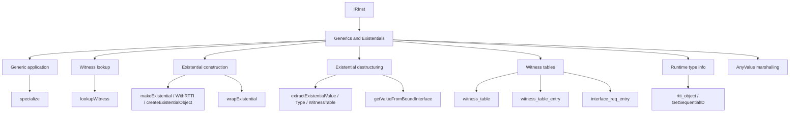

# Generics and Existentials

This page is the per-opcode reference for the Slang IR opcodes that
bind generic parameters to concrete types, look up interface
requirements through witness tables, construct and destructure
existential (interface-typed) values, carry runtime type information,
and bridge between specialized and unspecialized type contexts.

The intended reader is a compiler engineer working on the
specialization or existential-elimination passes, or anyone reading
IR around an interface dispatch and wondering what each opcode does.

## Source

The opcodes documented here are scattered through
[slang-ir-insts.lua](../../../../source/slang/slang-ir-insts.lua) rather
than living in a single contiguous group:

- `key` / `StructKey`, `global_generic_param`, `witness_table`,
  `indexedFieldKey`, `thisTypeWitness`, `TypeEqualityWitness`,
  `interface_req_entry`, and `witness_table_entry` appear around
  lines 816-1048 (interleaved with the structural opcodes also
  documented in [structure.md](structure.md)).
- `specialize`, `lookupWitness`, `GetSequentialID`,
  `bind_global_generic_param`, `globalValueRef`, `rtti_object`,
  `packAnyValue`, `unpackAnyValue` appear around lines 932-1041.
- `makeExistential`, `makeExistentialWithRTTI`,
  `createExistentialObject`, `wrapExistential`,
  `getValueFromBoundInterface`, `extractExistentialValue`,
  `extractExistentialType`, `extractExistentialWitnessTable`,
  `isNullExistential`, `extractTaggedUnionTag`,
  `extractTaggedUnionPayload` appear around lines 2460-2485.

C++ wrappers are declared in
[slang-ir-insts.h](../../../../source/slang/slang-ir-insts.h). The
opcodes are introduced both by
[slang-lower-to-ir.cpp](../../../../source/slang/slang-lower-to-ir.cpp)
(for user-written generic applications and casts to interface types)
and by the IR specialization passes (`slang-ir-specialize.cpp`,
`slang-ir-lower-existential.cpp`, `slang-ir-rtti-object-impl.cpp`).
The associated type opcodes (`BindExistentialsType`, `BoundInterface`,
`AnyValueType`, `DynamicType`, `RTTIPointerType`) live in
[types.md](types.md).

## Family hierarchy

## Opcodes

### Generic application

| Opcode | C++ wrapper | Operands | Flags | AST origin | Summary |
| --- | --- | --- | --- | --- | --- |
| `specialize` | — | `base, arg, ...` | H | `GenericAppExpr` in `slang-lower-to-ir.cpp` | Applies generic arguments to a generic value (function, type, or witness); hoistable so identical specializations dedupe. |
| `bind_global_generic_param` | — | `param: IRGlobalGenericParam, val: IRInst` | | (synthesized) | Binds a global generic parameter to a concrete value at link time. |
| `globalValueRef` | — | `value` | | (synthesized) | Wraps a reference to another global IR value so it can be carried across an IR-pass boundary that would otherwise rewrite the use. |
| `global_generic_param` | — | — | G | `GenericTypeParamDecl` (at module scope) | Declares a generic parameter at module level. |

### Witness lookup

| Opcode | C++ wrapper | Operands | Flags | AST origin | Summary |
| --- | --- | --- | --- | --- | --- |
| `lookupWitness` | `LookupWitnessMethod` | (variadic, `min=2`) | H | `MemberExpr` on an interface-typed value, via `slang-lower-to-ir.cpp` | Resolves an interface requirement through a witness table; operands are `witnessTable, requirementKey`. |

### Existential construction

`makeExistential` packs a value, its conforming type's witness
table, and (optionally) an explicit RTTI payload into an
existential value. `createExistentialObject` is the lower-level
form used after specialization, and `wrapExistential` smuggles a
specialized-type value through a generic boundary.

| Opcode | C++ wrapper | Operands | Flags | AST origin | Summary |
| --- | --- | --- | --- | --- | --- |
| `makeExistential` | `MakeExistential` | `value, witness` | | `CastToInterfaceExpr` in `slang-lower-to-ir.cpp` | Packs `value` plus the witness that its concrete type conforms to the target interface. |
| `makeExistentialWithRTTI` | `MakeExistentialWithRTTI` | `value, witness, typeRTTI` | | (synthesized) | Same as `makeExistential` but carrying the value's type as an explicit operand. |
| `createExistentialObject` | — | `typeID, value` | | (synthesized) | Lower-level existential constructor with a runtime type-id rather than a static witness. |
| `wrapExistential` | — | `wrappedValue` | | (synthesized) | Smuggles a value whose type is `BindExistentials<T, ...>` back to an unspecialized callee that expects `T`. |

### Existential destructuring

These opcodes are the three projections that reverse
`makeExistential`, plus a handful of helpers for downstream
processing.

| Opcode | C++ wrapper | Operands | Flags | AST origin | Summary |
| --- | --- | --- | --- | --- | --- |
| `extractExistentialValue` | `ExtractExistentialValue` | `existential` | | (synthesized) | Reads the packed concrete-typed value from an existential. |
| `extractExistentialType` | `ExtractExistentialType` | `existential` | H | (synthesized) | Reads the packed concrete type from an existential. |
| `extractExistentialWitnessTable` | `ExtractExistentialWitnessTable` | `existential` | H | (synthesized) | Reads the packed witness table from an existential. |
| `getValueFromBoundInterface` | `GetValueFromBoundInterface` | `value` | | (synthesized) | Reads the concrete-typed value out of a `BindInterface<I, T, w>` value. |
| `isNullExistential` | — | `val` | | (synthesized) | True if the existential value is the "null" placeholder; used to test for default-initialized interfaces. |
| `extractTaggedUnionTag` | — | `val` | | (synthesized) | Reads the discriminator of a tagged-union existential representation. |
| `extractTaggedUnionPayload` | — | `unionVal` | | (synthesized) | Reads the payload of a tagged-union existential representation. |

### Witness tables and witness facts

The structural opcodes that back interface dispatch are documented
in [structure.md](structure.md); only the ones the dispatch path
consumes directly are summarized here.

- `witness_table`, `witness_table_entry`, and `interface_req_entry`
  store the requirement-to-implementation mapping that
  `lookupWitness` walks. See
  [structure.md — witness tables and witness facts](structure.md).
- `thisTypeWitness` and `TypeEqualityWitness` are placeholder
  witnesses used by the type system to certify self-conformance and
  type equality.
- `key` (`StructKey`) and `indexedFieldKey` identify the
  requirement slots that witness tables key on; documented in
  [structure.md — struct internals](structure.md).

### Runtime type information

| Opcode | C++ wrapper | Operands | Flags | AST origin | Summary |
| --- | --- | --- | --- | --- | --- |
| `rtti_object` | `RTTIObject` | (variadic) | | (synthesized) | Materialized RTTI record for a type; produced by the RTTI-object pass. |
| `GetSequentialID` | — | `RTTIOperand` | H | (synthesized) | Returns a stable integer ID for an RTTI operand; used by dynamic-dispatch tables. |
| `GetDynamicResourceHeap` | — | — | H | (synthesized) | Returns the current dynamic-resource-heap value used for descriptor-handle decoding. |

### Type-flow specialization

The type-flow specialization pass replaces dynamic-dispatch through
interface witnesses with a tag-driven dispatch over a closed
set of conforming types, witness tables, functions, or generics.
Sets are hoistable and have canonical ordering; operands are stable
across passes.

#### Sets and set elements

| Opcode | C++ wrapper | Operands | Flags | AST origin | Summary |
| --- | --- | --- | --- | --- | --- |
| `TypeSet` | — | (variadic) | H | (synthesized) | Closed set of conforming types discovered by type-flow analysis. |
| `FuncSet` | — | (variadic) | H | (synthesized) | Closed set of functions sharing a func-type. |
| `WitnessTableSet` | — | (variadic) | H | (synthesized) | Closed set of witness tables for a common interface. |
| `GenericSet` | — | (variadic) | H | (synthesized) | Closed set of generic values for a common interface. |
| `UnboundedTypeElement` | — | `baseInterfaceType` | H | (synthesized) | Set element standing for an unbounded family of types conforming to an interface. |
| `UnboundedFuncElement` | — | `funcType` | H | (synthesized) | Set element standing for an unbounded family of functions of a given type. |
| `UnboundedWitnessTableElement` | — | `baseInterfaceType` | H | (synthesized) | Set element standing for an unbounded family of witness tables of a given interface. |
| `UnboundedGenericElement` | — | — | H | (synthesized) | Set element standing for an unbounded family of generics of a given interface. |
| `UninitializedTypeElement` | — | `baseInterfaceType` | H | (synthesized) | Set element standing for an uninitialized type (e.g. from `LoadFromUninitializedMemory`). |
| `UninitializedWitnessTableElement` | — | `baseInterfaceType` | H | (synthesized) | Set element standing for an uninitialized witness table. |
| `NoneTypeElement` | — | — | H | (synthesized) | Default "none" type element (used with `OptionalType`). |
| `NoneWitnessTableElement` | — | — | H | (synthesized) | Default "none" witness-table element (used with `OptionalType`). |

#### Tagged unions and tag operations

| Opcode | C++ wrapper | Operands | Flags | AST origin | Summary |
| --- | --- | --- | --- | --- | --- |
| `MakeTaggedUnion` | — | `tag, value` | | (synthesized) | Builds a tagged-union value from a tag and an untagged-union value. |
| `CastInterfaceToTaggedUnionPtr` | — | `ptr, witnessTableSet, typeSet` | | (synthesized) | Casts an interface-typed pointer to a tagged-union pointer with a known set. |
| `GetTagFromTaggedUnion` | — | `taggedUnionValue` | | (synthesized) | Extracts the witness-table tag from a tagged-union value. |
| `GetTypeTagFromTaggedUnion` | — | `taggedUnionValue` | | (synthesized) | Extracts the type tag from a tagged-union value. |
| `GetValueFromTaggedUnion` | — | `taggedUnionValue` | | (synthesized) | Extracts the untagged-union payload from a tagged-union value. |
| `GetTagForSuperSet` | — | `tag` | | (synthesized) | Translates a tag to its equivalent in a super-set. |
| `GetTagForSubSet` | — | `tag` | | (synthesized) | Translates a tag to its equivalent in a sub-set. |
| `GetTagForMappedSet` | — | `tag, lookupKey` | | (synthesized) | Translates a tag through a key-induced mapping between sets. |
| `GetTagForSpecializedSet` | — | `tag, specializationArgs...` | | (synthesized) | Translates a tag for a generic set into the corresponding specialized set. |
| `GetTagFromSequentialID` | — | (variadic) | | (synthesized) | Translates a sequential ID into a local set tag. |
| `GetSequentialIDFromTag` | — | (variadic) | | (synthesized) | Translates a local set tag into a sequential ID. |
| `GetElementFromTag` | — | `tag` | | (synthesized) | Resolves a tag back to its concrete set element. |
| `GetTagOfElementInSet` | — | `element, set` | H | (synthesized) | Returns the tag for a concrete element of a set. |

#### Dispatchers and existential specialization

| Opcode | C++ wrapper | Operands | Flags | AST origin | Summary |
| --- | --- | --- | --- | --- | --- |
| `GetDispatcher` | — | `witnessTableSet, lookupKey` | H | (synthesized) | Returns a dispatcher function for one requirement key over a witness-table set. |
| `GetSpecializedDispatcher` | — | `witnessTableSet, lookupKey, specializationArgs...` | H | (synthesized) | Returns a specialized dispatcher when the key points at a generic. |
| `SpecializeExistentialsInFunc` | — | `func, bindings...` | H | (synthesized) | Reference to a function with specific existential-parameter bindings; each binding is `VoidLit` for "any" or a type-flow info value. |
| `SpecializeExistentialsInType` | — | (variadic) | H | (synthesized) | Cache key for specialized `BindExistentialsType` results. |
| `WeakUse` | — | — | H | (synthesized) | Marker for a weak use that should not pin its operand; used by the type-flow pass. |
| `FuncTypeOf` | — | — | H | (synthesized) | Compile-time helper that returns the function type of its operand. |

### AnyValue marshalling

`AnyValue` is the type-erased value representation used when
existentials need to flow through code paths that do not know the
concrete type. `packAnyValue` / `unpackAnyValue` move values across
that boundary.

| Opcode | C++ wrapper | Operands | Flags | AST origin | Summary |
| --- | --- | --- | --- | --- | --- |
| `packAnyValue` | — | `value` | | (synthesized) | Packs a typed value into an `AnyValueType` blob. |
| `unpackAnyValue` | — | `value` | | (synthesized) | Reads a typed value out of an `AnyValueType` blob; type is determined by the result type of the op. |

## Notable opcodes

### `specialize`

`specialize(base, arg0, arg1, ...)` applies one or more generic
arguments to `base`, which may be a `generic` function, a generic
type, or a generic witness table. The opcode is hoistable, so two
references to the same `specialize` with the same arguments collapse
to one IR value. The specialization pass
(`slang-ir-specialize.cpp`) is what eventually replaces each
`specialize` with the concrete specialized definition. Until that
pass runs, the IR carries the unevaluated application as a
first-class value.

### `lookupWitness` / `LookupWitnessMethod`

`lookupWitness(witnessTable, requirementKey)` is the IR encoding of
an interface dispatch. The first operand is a `witness_table` value
(usually flowing in from the caller as a generic argument), and the
second is the `key` that identifies the requirement being called.
After specialization, both operands typically become statically
known and the opcode is replaced with a direct reference to the
satisfying definition.

### `makeExistential`

`makeExistential(value, witness)` packs a value of some concrete
type `C` and a witness that `C` conforms to the target interface
`I` into a single existential value of type `I`. The opcode is
the IR form of casting from a concrete type to an interface type.
`makeExistentialWithRTTI` is the variant used after specialization
when the type operand needs to be explicit; the two collapse to
one form during the existential-elimination pass.

### `wrapExistential`

`wrapExistential` is the inverse of `makeExistential` for the
"specialized value going into an unspecialized callee" direction:
given a value of type `BindExistentials<T, ...>` (where the
existential parameters have been bound to concrete types), it
produces a value of type `T` so that a generic callee that
expects `T` can be invoked. The pass that lowers
`BindExistentialsType` (see [types.md](types.md)) inserts
`wrapExistential` calls at the corresponding crossings.

### `witness_table` and `witness_table_entry`

`witness_table` is a hoistable parent opcode whose children are
`witness_table_entry` instructions, one per interface requirement.
Each entry maps a `requirementKey` (a `StructKey` declared on the
interface type) to a `satisfyingVal` (a function, type, or value)
that implements the requirement on the concrete type. The
combination of the two opcodes lets the same conforming type +
interface pair share one witness table across all uses without
losing the per-requirement information.

### `interface_req_entry`

`interface_req_entry` is the *interface-side* counterpart of
`witness_table_entry`: it sits inside an `InterfaceType` parent
opcode and declares the requirement. The `requirementKey` (a
`StructKey`) is what joins the two sides — every witness table for
the interface must have an entry keyed by the same `StructKey`.

### `rtti_object` and `GetSequentialID`

`rtti_object` materializes a runtime type-info record (one per
type used dynamically), and `GetSequentialID` returns a stable
integer index for an `rtti_object` operand. Together they let the
existential-elimination pass build a sparse runtime-dispatch table
keyed by integer rather than by pointer comparison.

### `packAnyValue` / `unpackAnyValue`

These two opcodes move values across the `AnyValueType` boundary.
The result type carries the size of the erased blob (see
[types.md](types.md) for `AnyValueType`'s `size` operand). The pass
that lowers existentials uses them whenever a value crosses a code
path that has been monomorphized for a generic existential
parameter but not for any specific concrete type.

## See also

- [../cross-cutting/ir-instructions.md](../cross-cutting/ir-instructions.md)
  — schema, op flags, hoistable / parent conventions.
- [types.md](types.md) — the type opcodes that the existential
  and generic opcodes operate on: `BindExistentialsType`,
  `BoundInterface`, `AnyValueType`, `DynamicType`,
  `RTTIPointerType`, `InterfaceType`.
- [structure.md](structure.md) — `module`, `func`, `generic`,
  `InterfaceType` (container side), `StructKey`, which the witness
  / requirement opcodes here reference.
- [values.md](values.md) — ordinary value-producing opcodes that
  surround the existential and generic opcodes (especially
  `BuiltinCast`, `bitCast`, `reinterpret`, all in `values.md`).
- [../pipeline/05-ir-passes.md](../pipeline/05-ir-passes.md) — the
  specialization pass that retires `specialize`, the
  existential-elimination pass that retires `makeExistential` and
  its projections, and the RTTI-object pass.
- [../../../design/existential-types.md](../../../design/existential-types.md)
  — design rationale for the existential model.
- [../../../design/decl-refs.md](../../../design/decl-refs.md) — the
  AST-side decl-ref machinery that ultimately produces `specialize`
  during lowering.
- [../glossary.md](../glossary.md) — definitions of `existential
  type`, `witness table`, `specialization`, `decl-ref`,
  `hoistable instruction`, `parent instruction`.
