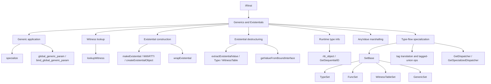

# Generics and Existentials

This page is the per-opcode reference for the Slang IR opcodes that
bind generic parameters to concrete types, look up interface
requirements through witness tables, construct and destructure
existential (interface-typed) values, carry runtime type information,
and drive the type-flow specialization machinery that turns dynamic
dispatch into tag-driven dispatch over a closed set. The intended
reader is a compiler engineer working on the specialization or
existential-elimination passes, or anyone reading IR around an
interface dispatch and wondering what each opcode does.

## Source

The opcodes documented here are scattered through
[slang-ir-insts.lua](../../../../source/slang/slang-ir-insts.lua)
rather than living in one contiguous group:

- `specialize` (line 1047), `lookupWitness` (1048), `GetSequentialID`
  (1055), `bind_global_generic_param` (1057) and `globalValueRef`
  (1062) sit among the ordinary value opcodes, as do `rtti_object`
  (1149), `packAnyValue` (1155) and `unpackAnyValue` (1156).
- `global_generic_param` (932) sits in the module-scope cluster
  alongside the requirement-key and witness-table opcodes that
  [structure.md](structure.md) owns.
- The existential construction and destructuring cluster runs from
  `makeExistential` (2708) to `extractTaggedUnionPayload` (2733).
- `GetDynamicResourceHeap` is at line 2815.
- The type-flow specialization opcodes run from the abstract `SetBase`
  group (3125) through `SpecializeExistentialsInType` (3384).

Two spelling conventions carry over from
[types.md](types.md). The generated `IROp` enumerator is `kIROp_` plus
the entry's **`struct_name`**, not its Lua key, so `key` becomes
`kIROp_StructKey`, `lookupWitness` becomes `kIROp_LookupWitnessMethod`
and `rtti_object` becomes `kIROp_RTTIObject`; the Lua key survives as
the mnemonic printed by `-dump-ir`. Where `struct_name` is omitted,
`process` at the bottom of the Lua file derives it from the key with
`to_pascal_case`.

**Every** opcode in this family has a C++ wrapper. Twenty-one of them
are hand-written `struct IRFoo` declarations — `IRSpecialize` (line
791), `IRLookupWitnessMethod` (808), `IRGetSequentialID` (820),
`IRGlobalValueRef` (838), `IRPackAnyValue` (846), `IRUnpackAnyValue`
(854), `IRRTTIObject` (2348), `IRGlobalGenericParam` (2364),
`IRBindGlobalGenericParam` (2372), `IRMakeExistential` (2543),
`IRMakeExistentialWithRTTI` (2551), `IRCreateExistentialObject`
(2560), `IRWrapExistential` (2567), `IRGetValueFromBoundInterface`
(2577), `IRExtractExistentialValue` (2583), `IRExtractExistentialType`
(2589), `IRExtractExistentialWitnessTable` (2595),
`IRIsNullExistential` (2601), the abstract `IRSetBase` (2966),
`IRWitnessTableSet` (3037) and `IRTypeSet` (3044), all in
[slang-ir-insts.h](../../../../source/slang/slang-ir-insts.h). Every
other wrapper on this page is emitted by the FIDDLE template near the
end of that header, which `getAllOtherInstStructsData` in
[slang-ir.h.lua](../../../../source/slang/slang-ir.h.lua) (line 152)
drives: it skips any entry whose `IR<struct_name>` is already defined
and emits the rest with an `isaImpl`, a `kOp` constant, and one
accessor per _named_ Lua operand. So `IRTypeEqualityWitness` gets
`getSubType()` / `getSuperType()` for free, while hand-written
`IRTypeSet` gets its `getCount()` / `getElement(i)` from `IRSetBase`
instead. See
[../cross-cutting/ir-instructions.md](../cross-cutting/ir-instructions.md)
for how that generation works.

Lowering from the AST is in
[slang-lower-to-ir.cpp](../../../../source/slang/slang-lower-to-ir.cpp).
The producers this page cites are `emitDeclRef` (line 14979), which
emits `specialize` for a `GenericAppDeclRef` (15086) and
`lookupWitness` for an interface requirement reached through a
`LookupDeclRef` (15144); `visitCastToSuperTypeExpr` (7275) for
`makeExistential`; `visitExtractExistentialValueExpr` (7679),
`visitExtractExistentialType` (2922) and
`visitExtractExistentialSubtypeWitness` (2931) for the three
existential projections; `visitTypeEqualityWitness` (2398);
`visitIsTypeExpr` (7420) for `GetSequentialID`; and
`visitGlobalGenericParamDecl` (10878) for `global_generic_param`.
Everything else on this page is introduced by an IR pass —
`slang-ir-specialize.cpp`, `slang-ir-bind-existentials.cpp`,
`slang-ir-lower-dynamic-dispatch-insts.cpp`,
`slang-ir-typeflow-specialize.cpp` and `slang-ir-typeflow-set.cpp` —
or by a core-module `__intrinsic_op` declaration.

`createExistentialObject` and `GetDynamicResourceHeap` are produced
from a core-module `__intrinsic_op` declaration rather than from a
`visit*` method, and `createExistentialObject` is additionally rebuilt
by `slang-ir-lower-dynamic-dispatch-insts.cpp` (line 1167).
Seven opcodes have **no producer at all** at `source_commit`:
`rtti_object`, `makeExistentialWithRTTI`, `extractTaggedUnionTag`,
`extractTaggedUnionPayload`, `UnboundedGenericElement`,
`GetDispatcher` and `GetSpecializedDispatcher` have an `IRBuilder`
emitter that nothing calls. Their rows record that rather than
attributing an origin.

The associated _type_ opcodes (`BindExistentialsType`,
`BoundInterface`, `AnyValueType`, `DynamicType`, `RTTIPointerType`,
`RTTIType`, `witness_table_t`) live in [types.md](types.md), as do the
four set-theoretic types (`UntaggedUnionType`, `ElementOfSetType`,
`SetTagType`, `TaggedUnionType`) that take the `*Set` opcodes
documented here as their operands — see
[types.md#set-theoretic-types](types.md#set-theoretic-types).

Besides the IR core, this page rests on
[slang-ir.h.lua](../../../../source/slang/slang-ir.h.lua) (the wrapper
and enumerator generation rules),
[slang-ir-util.h](../../../../source/slang/slang-ir-util.h) (line 397,
`findWitnessTableEntry`),
[slang-ir-specialize.h](../../../../source/slang/slang-ir-specialize.h)
(line 19, `SpecializationOptions::lowerWitnessLookups`), and the
core-module sources
[core.meta.slang](../../../../source/slang/core.meta.slang) and
[hlsl.meta.slang](../../../../source/slang/hlsl.meta.slang) that carry
the two `__intrinsic_op` origins.

## Family hierarchy


```mermaid
flowchart TD
  IRInst --> GenEx[Generics and Existentials]
  GenEx --> GenericApp[Generic application]
  GenEx --> WitnessLookup[Witness lookup]
  GenEx --> ExConstruct[Existential construction]
  GenEx --> ExDestruct[Existential destructuring]
  GenEx --> RTTI[Runtime type info]
  GenEx --> AnyValue[AnyValue marshalling]
  GenEx --> TypeFlow[Type-flow specialization]
  GenericApp --> specialize
  GenericApp --> globalGenericNode["global_generic_param / bind_global_generic_param"]
  WitnessLookup --> lookupWitness
  ExConstruct --> makeExistentialNode["makeExistential / WithRTTI / createExistentialObject"]
  ExConstruct --> wrapExistential
  ExDestruct --> extractExistential["extractExistentialValue / Type / WitnessTable"]
  ExDestruct --> getValueFromBoundInterface
  RTTI --> rtti_objectNode["rtti_object / GetSequentialID"]
  TypeFlow --> SetBase
  TypeFlow --> TagOps["tag translation and tagged-union ops"]
  TypeFlow --> Dispatchers["GetDispatcher / GetSpecializedDispatcher"]
  SetBase --> TypeSet
  SetBase --> FuncSet
  SetBase --> WitnessTableSet
  SetBase --> GenericSet
```

`SetBase` is the only abstract Lua parent entry in this family; the
other boxes group opcodes for the reader and do not correspond to Lua
entries.

## Opcodes

Two markers appear in the tables below, matching
[types.md](types.md):

- `†` on an operand name means the Lua entry does **not** declare that
  operand (it declares none, uses `min_operands`, or stops short of a
  variadic tail); the name and index come from the C++ wrapper's
  accessors or from the construction site, which are authoritative in
  that case.
- `‡` after a wrapper name means the wrapper is hand-written rather
  than FIDDLE-generated, so it has no auto-derived accessor per Lua
  operand and its accessor names may differ.

Flag codes are `H` hoistable, `P` parent, `G` global.

### Generic application

| Opcode                      | C++ wrapper                 | Operands                                   | Flags | AST origin                                                                                                                                                | Summary                                                                                                                                                                                        |
| --------------------------- | --------------------------- | ------------------------------------------ | ----- | --------------------------------------------------------------------------------------------------------------------------------------------------------- | ---------------------------------------------------------------------------------------------------------------------------------------------------------------------------------------------- |
| `specialize`                | `IRSpecialize`‡             | `base, args...`†                           | H     | any decl-ref carrying a `GenericAppDeclRef`, via `emitDeclRef` (line 15086)                                                                               | Applies generic arguments to a generic value (function, type, or witness table); hoistable, so identical specializations dedupe.                                                               |
| `global_generic_param`      | `IRGlobalGenericParam`‡     | —                                          | G     | `GlobalGenericParamDecl` (`visitGlobalGenericParamDecl`, line 10878) and `GlobalGenericValueParamDecl` (10885), plus each constraint decl parented by one | Declares a generic parameter at module scope; also documented as module-scope state in [structure.md](structure.md).                                                                           |
| `bind_global_generic_param` | `IRBindGlobalGenericParam`‡ | `param: IRGlobalGenericParam, val: IRInst` |       | `SpecializedComponentTypeIRGenContext::visitModule` (line 15844)                                                                                          | Binds a global generic parameter to a concrete value when a specialized component type is generated.                                                                                           |
| `globalValueRef`            | `IRGlobalValueRef`‡         | `value`                                    |       | [slang-ir-legalize-global-values.cpp](../../../../source/slang/slang-ir-legalize-global-values.cpp) line 229                                              | Non-hoistable "pin" that keeps a global value referenced from inside a function body, so dependent computation can be emitted locally on targets (e.g. SPIR-V) that forbid it at global scope. |

The Slang spelling that declares a `global_generic_param` is
`type_param T;` at module scope. Adding a constraint —
`type_param T : IFoo;` — lowers to _two_ module-scope parameters
rather than one: a `Type`-typed parameter for `T` and a
`witness_table_t(%IFoo)`-typed parameter for the conformance, one per
constraint, so a conjunction `type_param T : IFoo & IBar;` produces a
witness parameter for each half.

A module that actually _uses_ such a parameter cannot be compiled on
its own. `specializeGlobalGenericParameters`
([slang-ir-specialize.cpp](../../../../source/slang/slang-ir-specialize.cpp)
line 3273) reports every `global_generic_param` that still has a use
once specialization has run as
`UnspecializedGlobalGenericParamWithUses` (line 3350) — `E38207`,
"global generic parameter used in code without a concrete binding" —
so a `bind_global_generic_param` has to supply a value before code
generation. The message is emitted once per source declaration, not
once per lowered parameter: the reporting loop skips the synthesized
witness parameters unless they are the only ones left with a use.

### Witness lookup

| Opcode          | C++ wrapper              | Operands                                             | Flags | AST origin                                                                                                                                                                                                              | Summary                                                                                                                                   |
| --------------- | ------------------------ | ---------------------------------------------------- | ----- | ----------------------------------------------------------------------------------------------------------------------------------------------------------------------------------------------------------------------- | ----------------------------------------------------------------------------------------------------------------------------------------- |
| `lookupWitness` | `IRLookupWitnessMethod`‡ | `witnessTable, requirementKey`† (`min_operands = 2`) | H     | an interface requirement reached through a `LookupDeclRef`, via `emitDeclRef` (line 15144); also `visitWitnessLookupIntVal` (1980), `visitTransitiveSubtypeWitness` (2438) and `emitCastToInterfaceSuperTypeRec` (7255) | Resolves an interface requirement through a witness table; the two operands are read back by `getWitnessTable()` / `getRequirementKey()`. |

### Existential construction

`makeExistential` packs a value together with the witness that its
concrete type conforms to the target interface.
`createExistentialObject` is the runtime-tagged form used once
dispatch has been lowered to sequential IDs, and `wrapExistential`
smuggles a specialized-type value through an unspecialized boundary.

An existential whose concrete type is not statically known — one built
by `createExistentialObject` from a runtime type id, or read out of an
interface-typed global parameter, entry-point parameter or buffer
element — depends on the _linkage_ for the set of types it can hold.
`collectExistentialTables`
([slang-ir-typeflow-specialize.cpp](../../../../source/slang/slang-ir-typeflow-specialize.cpp)
line 8173) gathers the global `witness_table` insts of the interface's
`witness_table_t` type that survived linking; when it comes back empty
at a site that has to resolve the existential — an interface-typed
global parameter (line 1583), an interface-typed entry-point parameter
(line 3541), a `lookupWitness` still unresolved after specialization
(line 3506) — the pass reports `NoTypeConformancesFoundForInterface`
(`E50100`, "no type conformances found") and code generation stops. A
conformance that nothing else in the program references is forced into
the link with `slangc -conformance <Type>:<Interface>[=<id>]`; that is
what makes a `createDynamicObject` program compile.

| Opcode                    | C++ wrapper                  | Operands                     | Flags | AST origin                                                                                                                                                                                                                                                                                                                                                     | Summary                                                                                                                                                                                                                                                                        |
| ------------------------- | ---------------------------- | ---------------------------- | ----- | -------------------------------------------------------------------------------------------------------------------------------------------------------------------------------------------------------------------------------------------------------------------------------------------------------------------------------------------------------------- | ------------------------------------------------------------------------------------------------------------------------------------------------------------------------------------------------------------------------------------------------------------------------------ |
| `makeExistential`         | `IRMakeExistential`‡         | `value, witness`             |       | `CastToSuperTypeExpr` (`visitCastToSuperTypeExpr`, line 7275); also `assign` (10237) when storing back into an opened existential                                                                                                                                                                                                                              | Packs `value` plus the witness that its concrete type conforms to the target interface; accessors are `getWrappedValue()` / `getWitnessTable()`.                                                                                                                               |
| `makeExistentialWithRTTI` | `IRMakeExistentialWithRTTI`‡ | `value, witness, typeRTTI`   |       | **no producer at HEAD**                                                                                                                                                                                                                                                                                                                                        | Same as `makeExistential` but carrying the value's type as an explicit operand. `IRBuilder::emitMakeExistentialWithRTTI` ([slang-ir.cpp](../../../../source/slang/slang-ir.cpp) line 4972) has no caller at `source_commit`, though several passes still recognize the opcode. |
| `createExistentialObject` | `IRCreateExistentialObject`‡ | `typeID, value`              |       | core-module `createDynamicObject<T, U>(uint typeId, U value)` in [core.meta.slang](../../../../source/slang/core.meta.slang) (line 3382), declared with `__intrinsic_op($(kIROp_CreateExistentialObject))`; also rebuilt by [slang-ir-lower-dynamic-dispatch-insts.cpp](../../../../source/slang/slang-ir-lower-dynamic-dispatch-insts.cpp) (lines 1167, 1187) | Builds an existential from a runtime type id plus a value, rather than from a static witness.                                                                                                                                                                                  |
| `wrapExistential`         | `IRWrapExistential`‡         | `wrappedValue, slotArgs...`† |       | [slang-ir-bind-existentials.cpp](../../../../source/slang/slang-ir-bind-existentials.cpp) line 350 and [slang-ir-specialize.cpp](../../../../source/slang/slang-ir-specialize.cpp)                                                                                                                                                                             | Converts a value of type `BindExistentials<T, ...>` back to `T`; the `(type, witness)` slot pairs after operand 0 are read with `getSlotOperandCount()` / `getSlotOperand(i)`.                                                                                                 |

### Existential destructuring

These are the three projections that reverse `makeExistential`, plus a
handful of helpers for downstream processing.

| Opcode                           | C++ wrapper                         | Operands         | Flags | AST origin                                                                                                                                                  | Summary                                                                                                                                                                                                                                                                                           |
| -------------------------------- | ----------------------------------- | ---------------- | ----- | ----------------------------------------------------------------------------------------------------------------------------------------------------------- | ------------------------------------------------------------------------------------------------------------------------------------------------------------------------------------------------------------------------------------------------------------------------------------------------- |
| `extractExistentialValue`        | `IRExtractExistentialValue`‡        | `existential`    |       | `ExtractExistentialValueExpr` (`visitExtractExistentialValueExpr`, line 7679); also `visitCastToSuperTypeExpr` (7330)                                       | Reads the packed concrete-typed value from an existential.                                                                                                                                                                                                                                        |
| `extractExistentialType`         | `IRExtractExistentialType`‡         | `existential`    | H     | the `ExtractExistentialType` AST type (`visitExtractExistentialType`, line 2922)                                                                            | Reads the packed concrete type from an existential.                                                                                                                                                                                                                                               |
| `extractExistentialWitnessTable` | `IRExtractExistentialWitnessTable`‡ | `existential`    | H     | `ExtractExistentialSubtypeWitness` (`visitExtractExistentialSubtypeWitness`, line 2931)                                                                     | Reads the packed witness table from an existential.                                                                                                                                                                                                                                               |
| `getValueFromBoundInterface`     | `IRGetValueFromBoundInterface`‡     | `value`          |       | `IRBuilder::emitWrapExistential` ([slang-ir.cpp](../../../../source/slang/slang-ir.cpp) line 5013), which unwraps the box before rebuilding the existential | Reads the concrete-typed value out of a `BoundInterface<I, T, w>` value.                                                                                                                                                                                                                          |
| `isNullExistential`              | `IRIsNullExistential`‡              | `val`            |       | [slang-ir-lower-optional-type.cpp](../../../../source/slang/slang-ir-lower-optional-type.cpp) line 229                                                      | True when an existential holds the "null" placeholder; used to lower `Optional<ISomeInterface>`'s has-value test.                                                                                                                                                                                 |
| `extractTaggedUnionTag`          | `IRExtractTaggedUnionTag`           | `val`            |       | **no producer at HEAD**                                                                                                                                     | Reads the discriminator of a tagged-union existential representation. No caller of `IRBuilder::emitExtractTaggedUnionTag` ([slang-ir.cpp](../../../../source/slang/slang-ir.cpp) line 6609) at `source_commit`.                                                                                   |
| `extractTaggedUnionPayload`      | `IRExtractTaggedUnionPayload`       | `unionVal, tag`† |       | **no producer at HEAD**                                                                                                                                     | Reads the payload of a tagged-union existential representation. The Lua entry declares only `unionVal`, but `IRBuilder::emitExtractTaggedUnionPayload` ([slang-ir.cpp](../../../../source/slang/slang-ir.cpp) line 6617) builds it with a second `tag` operand. Also uncalled at `source_commit`. |

### Witness tables and witness facts

The opcodes that _store_ conformance — `witness_table`,
`witness_table_entry`, `interface_req_entry`, `thisTypeWitness`,
`TypeEqualityWitness`, `key` / `StructKey`, `builtinRequirementKey` and
`indexedFieldKey` — are defined structurally in
[structure.md](structure.md), which owns their operand shapes, flags
and AST origins. This page does not repeat those rows; what follows is
only the part a reader of a _dispatch_ site needs.

| Opcode                                       | Where it is defined                                           | Why it matters here                                                                                                                                                                                                                                                                                                                                                                                                                                                                                                                                                              |
| -------------------------------------------- | ------------------------------------------------------------- | -------------------------------------------------------------------------------------------------------------------------------------------------------------------------------------------------------------------------------------------------------------------------------------------------------------------------------------------------------------------------------------------------------------------------------------------------------------------------------------------------------------------------------------------------------------------------------- |
| `witness_table`                              | [structure.md](structure.md#witness-tables-and-witness-facts) | Operand 0 of a `lookupWitness`. Operand 0 of the table itself is the conforming concrete type; the interface it satisfies lives in the table's result type (`WitnessTableType`), read with `getConformanceType()`.                                                                                                                                                                                                                                                                                                                                                               |
| `witness_table_entry`                        | [structure.md](structure.md#witness-tables-and-witness-facts) | The keyed child that holds the satisfying value; resolving a `lookupWitness` substitutes that value, not the entry itself (`findWitnessTableEntry` returns `entry->getSatisfyingVal()`). Read it by key, never by position (below).                                                                                                                                                                                                                                                                                                                                              |
| `interface_req_entry`                        | [structure.md](structure.md#interface-internals)              | The interface-side half of the same key. An `InterfaceType` gets one entry per lowered interface _requirement_, which is not the same as per member — `shouldDeclBeTreatedAsInterfaceRequirement` ([slang-lower-to-ir.cpp](../../../../source/slang/slang-lower-to-ir.cpp) line 1676) excludes subscript, property and default-implementation declarations while their accessors are requirements in their own right. An associated-type bound such as `associatedtype A : IBar` is a _sibling_ requirement carrying a `WitnessTableType(bound)` value rather than a nested one. |
| `key` / `StructKey`, `builtinRequirementKey` | [structure.md](structure.md#struct-internals)                 | The two spellings a `requirementKey` operand can take. Because either can appear, the Lua schema and the generated accessors type the key operand as `IRInst`, not `IRStructKey`; the two `IRBuilder` dispatcher helpers still narrow their parameter to `IRStructKey*`.                                                                                                                                                                                                                                                                                                         |
| `thisTypeWitness`                            | [structure.md](structure.md#witness-tables-and-witness-facts) | The abstract witness that `ThisType` conforms to the enclosing interface; a `lookupWitness` through it stays abstract until specialization.                                                                                                                                                                                                                                                                                                                                                                                                                                      |
| `TypeEqualityWitness`                        | [structure.md](structure.md#witness-tables-and-witness-facts) | The witness form used when a constraint is discharged by a type-equality fact instead of an interface implementation. See the callout below for the generics angle.                                                                                                                                                                                                                                                                                                                                                                                                              |
| `indexedFieldKey`                            | [structure.md](structure.md#struct-internals)                 | Placeholder key for a tuple-like field; not part of interface dispatch.                                                                                                                                                                                                                                                                                                                                                                                                                                                                                                          |

The per-requirement rule is easiest to see on an interface whose
members do not map one-to-one onto requirements:

```slang
interface IHasProp
{
    property int val { get; set; }
    int plain(int x);
}
```

This lowers to an `interface` with exactly three `interface_req_entry`
children — keyed by `%IHasPropx5Fvalx5Fget`, `%IHasPropx5Fvalx5Fset`
and `%IHasPropx5Fplain` — and none for `val` itself:
`shouldDeclBeTreatedAsInterfaceRequirement` (line 1676) returns false
for a `PropertyDecl`, and the interface-lowering loop (line 12275)
then descends into the property's accessors and keys an entry off each
one. The `x5F` in those names is `scrubName`
([slang-ir.cpp](../../../../source/slang/slang-ir.cpp) line 7667)
escaping the `.` that a name hint uses as its separator.

Matching entries by name does not work for every requirement, though.
The sibling entry that a bound such as `associatedtype A : IBar`
produces is keyed off the synthesized constraint decl, which carries
no name, so `addNameHint`
([slang-lower-to-ir.cpp](../../../../source/slang/slang-lower-to-ir.cpp)
line 1657) adds no `NameHint` decoration and the key prints as a bare
`%N` — unlike the associated type's own key, which prints under its
hint.

Three rules govern how this page's opcodes read those structures.

**A witness table is an unordered key-to-value map.** Read an entry
with `findWitnessTableEntry(table, key)`, declared in
[slang-ir-util.h](../../../../source/slang/slang-ir-util.h) (line 397),
never by child position. Entry order is not part of the representation
and lowering does not guarantee it matches the `interface_req_entry`
order on the interface type.

**A `lookupWitness` is a first-class unevaluated value.** The IR
carries the lookup itself, not the value it will resolve to; for when
and how it is resolved, see
[../pipeline/05-ir-passes.md](../pipeline/05-ir-passes.md).

**A requirement can itself be generic.** When an interface requirement
is a `GenericDecl` — most commonly a differentiability constraint on a
generic interface method — lowering stores a requirement-local
`IRGeneric` as the witness-table entry value
(`lowerWitnessEntryValueInGenericWitnessTable`, line 11030, together
with the matching decl-side rule in `canDeclLowerToAGeneric`, line
14886). A use of such a requirement therefore reads
`specialize(lookupWitness(table, key), methodArgs...)` rather than a
flat `lookupWitness`. The intermediate lookup is typed `Generic`, not
a function type: `emitDeclRef` lowers the `specialize`'s base with
`IRBuilder::getGenericKind()` (line 15067) and passes that same type
to the `lookupWitness` it emits (line 15170), so the dump reads
`let %g : Generic = lookupWitness(table, key)` and only the
`specialize` wrapped around it is callable. See
[../pipeline/04-ast-to-ir.md](../pipeline/04-ast-to-ir.md) for the
lowering path.

### Runtime type information

| Opcode                   | C++ wrapper                | Operands                  | Flags | AST origin                                                                                                                                                                                                                                  | Summary                                                                                                                                                                                                                                                                                                                                                                                                                                    |
| ------------------------ | -------------------------- | ------------------------- | ----- | ------------------------------------------------------------------------------------------------------------------------------------------------------------------------------------------------------------------------------------------- | ------------------------------------------------------------------------------------------------------------------------------------------------------------------------------------------------------------------------------------------------------------------------------------------------------------------------------------------------------------------------------------------------------------------------------------------ |
| `rtti_object`            | `IRRTTIObject`‡            | `type`†                   |       | **no producer at HEAD**                                                                                                                                                                                                                     | Materialized runtime type-info record for the type in operand 0, with the details carried as `RTTI*Decoration`s. The Lua entry declares no operand; the header comment and `IRBuilder::emitMakeRTTIObject` ([slang-ir.cpp](../../../../source/slang/slang-ir.cpp) line 4681) supply it. Nothing calls that emitter at `source_commit`, so the opcode is currently produced by no pass, though the C++ and C-like emitters still handle it. |
| `GetSequentialID`        | `IRGetSequentialID`‡       | `RTTIOperand`             | H     | `IsTypeExpr` for an optional-constraint check (`visitIsTypeExpr`, line 7420; the opcode is emitted at line 7437); also [slang-ir-lower-dynamic-dispatch-insts.cpp](../../../../source/slang/slang-ir-lower-dynamic-dispatch-insts.cpp)      | Returns a stable `uint` ID for its operand. Despite the operand's Lua name, every caller passes a **witness table**, not an `rtti_object`.                                                                                                                                                                                                                                                                                                 |
| `GetDynamicResourceHeap` | `IRGetDynamicResourceHeap` | `bindingIndex: IRIntLit`† | H     | core-module `__getDynamicResourceHeap<T : IOpaqueDescriptor>(constexpr uint bindingIndex = 0)` in [hlsl.meta.slang](../../../../source/slang/hlsl.meta.slang) (line 27663), declared with `__intrinsic_op($(kIROp_GetDynamicResourceHeap))` | Yields the bindless descriptor-heap array of a given binding index; its result type is an array of the descriptor type. `lowerDynamicResourceHeap` ([slang-ir-lower-dynamic-resource-heap.cpp](../../../../source/slang/slang-ir-lower-dynamic-resource-heap.cpp) line 48) replaces it with a laid-out `global_param`, so it never reaches emit.                                                                                           |

### AnyValue marshalling

`AnyValue` is the type-erased value representation used when
existentials flow through code paths that do not know the concrete
type. `packAnyValue` / `unpackAnyValue` move values across that
boundary; the blob size is carried by the `AnyValueType` result type
(see [types.md](types.md)).

| Opcode           | C++ wrapper         | Operands | Flags | AST origin                                                                                                         | Summary                                                                                            |
| ---------------- | ------------------- | -------- | ----- | ------------------------------------------------------------------------------------------------------------------ | -------------------------------------------------------------------------------------------------- |
| `packAnyValue`   | `IRPackAnyValue`‡   | `value`  |       | [slang-ir-lower-result-type.cpp](../../../../source/slang/slang-ir-lower-result-type.cpp) and the type-flow passes | Packs a typed value into an `AnyValueType` blob.                                                   |
| `unpackAnyValue` | `IRUnpackAnyValue`‡ | `value`  |       | same passes                                                                                                        | Reads a typed value out of an `AnyValueType` blob; the concrete type is the result type of the op. |

### Type-flow specialization

The type-flow specialization pass
([slang-ir-typeflow-specialize.cpp](../../../../source/slang/slang-ir-typeflow-specialize.cpp))
replaces dynamic dispatch through interface witnesses with tag-driven
dispatch over a closed set of conforming types, witness tables,
functions, or generics.

#### Sets and set elements

Every set is hoistable, so set equality is inst identity. The Lua
comment on `SetBase` (line 3125) states the invariants the
representation depends on: a set has at least one operand, operands
must be concrete non-set insts, and operand order must be consistent.
`IRBuilder::getSet(IROp, const HashSet<IRInst*>&)`
([slang-ir.cpp](../../../../source/slang/slang-ir.cpp) line 7541)
maintains those invariants through a persistent unique-ID map; sets
should never be built operand-by-operand.

| Opcode                             | C++ wrapper                          | Operands            | Flags | AST origin                                                                                                                                                                   | Summary                                                                                                                                                                                                                                                                                  |
| ---------------------------------- | ------------------------------------ | ------------------- | ----- | ---------------------------------------------------------------------------------------------------------------------------------------------------------------------------- | ---------------------------------------------------------------------------------------------------------------------------------------------------------------------------------------------------------------------------------------------------------------------------------------- |
| `TypeSet`                          | `IRTypeSet`‡                         | `elements...`†      | H     | The type-flow specialization pass ([slang-ir-typeflow-specialize.cpp](../../../../source/slang/slang-ir-typeflow-specialize.cpp) line 728, via `IRBuilder::getSingletonSet`) | Closed set of conforming types discovered by type-flow analysis.                                                                                                                                                                                                                         |
| `FuncSet`                          | `IRFuncSet`                          | `elements...`†      | H     | The type-flow specialization pass ([slang-ir-typeflow-specialize.cpp](../../../../source/slang/slang-ir-typeflow-specialize.cpp) lines 746-780, via `IRBuilder::getSet`)     | Closed set of functions sharing a func-type.                                                                                                                                                                                                                                             |
| `WitnessTableSet`                  | `IRWitnessTableSet`‡                 | `elements...`†      | H     | The type-flow specialization pass ([slang-ir-typeflow-specialize.cpp](../../../../source/slang/slang-ir-typeflow-specialize.cpp) line 1601, via `IRBuilder::getSet`)         | Closed set of witness tables for a common interface.                                                                                                                                                                                                                                     |
| `GenericSet`                       | `IRGenericSet`                       | `elements...`†      | H     | The type-flow specialization pass ([slang-ir-typeflow-specialize.cpp](../../../../source/slang/slang-ir-typeflow-specialize.cpp) lines 748 and 770)                          | Closed set of generic values for a common interface.                                                                                                                                                                                                                                     |
| `UnboundedTypeElement`             | `IRUnboundedTypeElement`             | `baseInterfaceType` | H     | The type-flow specialization pass ([slang-ir-typeflow-specialize.cpp](../../../../source/slang/slang-ir-typeflow-specialize.cpp) lines 913 and 3652)                         | Element standing for an unbounded family of types conforming to an interface.                                                                                                                                                                                                            |
| `UnboundedFuncElement`             | `IRUnboundedFuncElement`             | —                   | H     | The type-flow specialization pass ([slang-ir-typeflow-specialize.cpp](../../../../source/slang/slang-ir-typeflow-specialize.cpp) lines 3397 and 4061)                        | Element standing for an unbounded family of functions. The Lua entry declares a `funcType` operand, but `IRBuilder::getUnboundedFuncElement` ([slang-ir-insts.h](../../../../source/slang/slang-ir-insts.h) line 4604) creates it with zero operands and no other producer supplies one. |
| `UnboundedWitnessTableElement`     | `IRUnboundedWitnessTableElement`     | `baseInterfaceType` | H     | The type-flow specialization pass ([slang-ir-typeflow-specialize.cpp](../../../../source/slang/slang-ir-typeflow-specialize.cpp) lines 3399 and 3601)                        | Element standing for an unbounded family of witness tables of a given interface.                                                                                                                                                                                                         |
| `UnboundedGenericElement`          | `IRUnboundedGenericElement`          | —                   | H     | **no producer at HEAD**                                                                                                                                                      | Element standing for an unbounded family of generics; `IRBuilder::getUnboundedGenericElement` ([slang-ir-insts.h](../../../../source/slang/slang-ir-insts.h) line 4610) has no caller, and the remaining references only classify or consume it.                                         |
| `UninitializedTypeElement`         | `IRUninitializedTypeElement`         | `baseInterfaceType` | H     | The type-flow specialization pass ([slang-ir-typeflow-specialize.cpp](../../../../source/slang/slang-ir-typeflow-specialize.cpp) line 920)                                   | Element standing for a possibly-garbage type (e.g. from `LoadFromUninitializedMemory`), kept so the pass can diagnose rather than mis-specialize.                                                                                                                                        |
| `UninitializedWitnessTableElement` | `IRUninitializedWitnessTableElement` | `baseInterfaceType` | H     | The type-flow specialization pass ([slang-ir-typeflow-specialize.cpp](../../../../source/slang/slang-ir-typeflow-specialize.cpp) lines 921 and 2417)                         | Uninitialized-witness-table counterpart.                                                                                                                                                                                                                                                 |
| `NoneTypeElement`                  | `IRNoneTypeElement`                  | —                   | H     | The type-flow specialization pass ([slang-ir-typeflow-specialize.cpp](../../../../source/slang/slang-ir-typeflow-specialize.cpp) lines 925 and 7944)                         | Default "none" type element, used with `OptionalType`.                                                                                                                                                                                                                                   |
| `NoneWitnessTableElement`          | `IRNoneWitnessTableElement`          | —                   | H     | The type-flow specialization pass ([slang-ir-typeflow-specialize.cpp](../../../../source/slang/slang-ir-typeflow-specialize.cpp) line 3245)                                  | Default "none" witness-table element, used with `OptionalType`.                                                                                                                                                                                                                          |

The four `Unbounded*` opcodes and the two `Uninitialized*` opcodes are
not sets — they are _elements_ of one. `IRSetBase::isUnbounded()` and
`containsUninitializedElement()`
([slang-ir-insts.h](../../../../source/slang/slang-ir-insts.h) lines
2973 and 3006) scan a set's operands for them, which is why
`TypeSet(A, B, UnboundedTypeElement(I))` reads as "A, B, and any other
type conforming to `I`".

An `Uninitialized*` element is what makes definite assignment a
requirement rather than a convention. When the witness-table set
reaching an `extractExistentialWitnessTable` carries one — because
some path into the interface object leaves it unassigned —
`analyzeExtractExistentialWitnessTable`
([slang-ir-typeflow-specialize.cpp](../../../../source/slang/slang-ir-typeflow-specialize.cpp)
line 3554) reports
`DynamicDispatchOnPotentiallyUninitializedExistential` (`E50101`, line 3592) and yields no info, instead of specializing against a set that
includes garbage. An interface local must therefore be assigned on
every path that reaches a dynamic dispatch on it.

#### Tagged unions and tag operations

| Opcode                          | C++ wrapper                       | Operands                        | Flags | AST origin                                                                                                                                                                                                                                                                                                      | Summary                                                                                                                                                       |
| ------------------------------- | --------------------------------- | ------------------------------- | ----- | --------------------------------------------------------------------------------------------------------------------------------------------------------------------------------------------------------------------------------------------------------------------------------------------------------------- | ------------------------------------------------------------------------------------------------------------------------------------------------------------- |
| `MakeTaggedUnion`               | `IRMakeTaggedUnion`               | `tag, value`                    |       | The type-flow specialization pass ([slang-ir-typeflow-specialize.cpp](../../../../source/slang/slang-ir-typeflow-specialize.cpp) lines 7185, 7301 and 7950)                                                                                                                                                     | Builds a `TaggedUnionType` value from a `SetTagType` tag and an `UntaggedUnionType` payload.                                                                  |
| `CastInterfaceToTaggedUnionPtr` | `IRCastInterfaceToTaggedUnionPtr` | `ptr, witnessTableSet, typeSet` |       | The type-flow specialization pass ([slang-ir-typeflow-specialize.cpp](../../../../source/slang/slang-ir-typeflow-specialize.cpp) lines 7360, 7650 and 7756)                                                                                                                                                     | Casts an interface-typed pointer to a tagged-union pointer; the two sets are carried on the cast so they survive replacement of the `TaggedUnionType` itself. |
| `GetTagFromTaggedUnion`         | `IRGetTagFromTaggedUnion`         | `taggedUnionValue`              |       | The type-flow specialization pass ([slang-ir-typeflow-specialize.cpp](../../../../source/slang/slang-ir-typeflow-specialize.cpp) lines 5910 and 8017)                                                                                                                                                           | Extracts the witness-table tag; result type is `SetTagType(witnessTableSet)`.                                                                                 |
| `GetTypeTagFromTaggedUnion`     | `IRGetTypeTagFromTaggedUnion`     | `taggedUnionValue`              |       | The type-flow specialization pass ([slang-ir-typeflow-specialize.cpp](../../../../source/slang/slang-ir-typeflow-specialize.cpp) line 5995) and [slang-ir-typeflow-set.cpp](../../../../source/slang/slang-ir-typeflow-set.cpp) (line 134)                                                                      | Extracts the type tag; result type is `SetTagType(typeSet)`.                                                                                                  |
| `GetValueFromTaggedUnion`       | `IRGetValueFromTaggedUnion`       | `taggedUnionValue`              |       | The type-flow specialization pass ([slang-ir-typeflow-specialize.cpp](../../../../source/slang/slang-ir-typeflow-specialize.cpp) lines 5934 and 7565)                                                                                                                                                           | Extracts the payload; result type is `UntaggedUnionType(typeSet)`, or the single element type when the type set is a singleton.                               |
| `GetTagForSuperSet`             | `IRGetTagForSuperSet`             | `tag`†                          |       | Set-conversion emission in [slang-ir-typeflow-set.cpp](../../../../source/slang/slang-ir-typeflow-set.cpp) (line 159)                                                                                                                                                                                           | Translates a tag to its equivalent in a super-set; source and destination sets are implied by the operand and result types.                                   |
| `GetTagForSubSet`               | `IRGetTagForSubSet`               | `tag`†                          |       | The type-flow specialization pass ([slang-ir-typeflow-specialize.cpp](../../../../source/slang/slang-ir-typeflow-specialize.cpp) line 8020)                                                                                                                                                                     | Translates a tag to its equivalent in a sub-set.                                                                                                              |
| `GetTagForMappedSet`            | `IRGetTagForMappedSet`            | `tag, lookupKey`†               |       | The type-flow specialization pass ([slang-ir-typeflow-specialize.cpp](../../../../source/slang/slang-ir-typeflow-specialize.cpp) line 5846)                                                                                                                                                                     | Translates a witness-table-set tag through the mapping a requirement key induces — the tag-domain replacement for a `lookupWitness`.                          |
| `GetTagForSpecializedSet`       | `IRGetTagForSpecializedSet`       | `tag, specializationArgs...`†   |       | The type-flow specialization pass ([slang-ir-typeflow-specialize.cpp](../../../../source/slang/slang-ir-typeflow-specialize.cpp) lines 7461 and 7523)                                                                                                                                                           | Translates a generic-set tag into the corresponding specialized set.                                                                                          |
| `GetTagFromSequentialID`        | `IRGetTagFromSequentialID`        | `interfaceType, sequentialID`†  |       | The type-flow specialization pass ([slang-ir-typeflow-specialize.cpp](../../../../source/slang/slang-ir-typeflow-specialize.cpp) line 7282) and dynamic-dispatch lowering ([slang-ir-lower-dynamic-dispatch-insts.cpp](../../../../source/slang/slang-ir-lower-dynamic-dispatch-insts.cpp) lines 1005 and 1135) | Converts a global sequential ID plus an interface type into a set-local tag.                                                                                  |
| `GetSequentialIDFromTag`        | `IRGetSequentialIDFromTag`        | `interfaceType, tag`†           |       | The type-flow specialization pass ([slang-ir-typeflow-specialize.cpp](../../../../source/slang/slang-ir-typeflow-specialize.cpp) line 7879) and dynamic-dispatch lowering ([slang-ir-lower-dynamic-dispatch-insts.cpp](../../../../source/slang/slang-ir-lower-dynamic-dispatch-insts.cpp) lines 1009 and 1180) | The inverse: a set-local tag back to a global sequential ID.                                                                                                  |
| `GetElementFromTag`             | `IRGetElementFromTag`             | `tag`                           |       | The specialization pass ([slang-ir-specialize.cpp](../../../../source/slang/slang-ir-specialize.cpp) line 3721)                                                                                                                                                                                                 | Resolves a tag to its concrete set element; result type is `ElementOfSetType(set)`.                                                                           |
| `GetTagOfElementInSet`          | `IRGetTagOfElementInSet`          | `element, set`†                 | H     | The type-flow specialization pass ([slang-ir-typeflow-specialize.cpp](../../../../source/slang/slang-ir-typeflow-specialize.cpp) lines 6518, 7163 and 7906)                                                                                                                                                     | Returns the tag for a concrete element of a set; the element must resolve to a concrete inst before lowering.                                                 |

#### Dispatchers and existential specialization

| Opcode                         | C++ wrapper                      | Operands                                             | Flags | AST origin                                                                                                                                                                         | Summary                                                                                                                                                                                                                                                                                                                                                                                                                                                   |
| ------------------------------ | -------------------------------- | ---------------------------------------------------- | ----- | ---------------------------------------------------------------------------------------------------------------------------------------------------------------------------------- | --------------------------------------------------------------------------------------------------------------------------------------------------------------------------------------------------------------------------------------------------------------------------------------------------------------------------------------------------------------------------------------------------------------------------------------------------------- |
| `GetDispatcher`                | `IRGetDispatcher`                | `witnessTableSet, lookupKey, paramBindings...`†      | H     | **no producer at HEAD**                                                                                                                                                            | Returns a `FuncType`-typed dispatcher for one requirement key over a witness-table set; the dispatcher's first parameter is a `SetTagType(witnessTableSet)`. `lookupKey` is typed `IRInst`, not `IRStructKey`, because a built-in requirement reached through dynamic dispatch uses a `BuiltinRequirementKey`. `IRBuilder::emitGetDispatcher` ([slang-ir-insts.h](../../../../source/slang/slang-ir-insts.h) line 4526) has no caller at `source_commit`. |
| `GetSpecializedDispatcher`     | `IRGetSpecializedDispatcher`     | `witnessTableSet, lookupKey, specializationArgs...`† | H     | **no producer at HEAD**                                                                                                                                                            | Same, for a key that points at a generic; `IRBuilder::emitGetSpecializedDispatcher` ([slang-ir-insts.h](../../../../source/slang/slang-ir-insts.h) line 4547) has no caller at `source_commit` either, though `lowerGetSpecializedDispatcher` still consumes the opcode.                                                                                                                                                                                  |
| `SpecializeExistentialsInFunc` | `IRSpecializeExistentialsInFunc` | `func, bindings...`†                                 | H     | The type-flow specialization pass ([slang-ir-typeflow-specialize.cpp](../../../../source/slang/slang-ir-typeflow-specialize.cpp) lines 4219 and 6589)                              | Reference to a function with specific existential-parameter bindings; one binding per parameter, `VoidLit` for "any".                                                                                                                                                                                                                                                                                                                                     |
| `SpecializeExistentialsInType` | `IRSpecializeExistentialsInType` | `baseType, bindings...`†                             | H     | The specialization pass ([slang-ir-specialize.cpp](../../../../source/slang/slang-ir-specialize.cpp) line 3061)                                                                    | Compiler-dictionary key for a specialized `BindExistentialsType` result.                                                                                                                                                                                                                                                                                                                                                                                  |
| `WeakUse`                      | `IRWeakUse`                      | `inst`†                                              | H     | The type-flow specialization pass ([slang-ir-typeflow-specialize.cpp](../../../../source/slang/slang-ir-typeflow-specialize.cpp) lines 1383 and 1411, via `IRBuilder::getWeakUse`) | Marker for a use that must not pin its operand; `IRBuilder::getWeakUse` ([slang-ir-insts.h](../../../../source/slang/slang-ir-insts.h) line 3628) supplies the single operand the Lua entry omits.                                                                                                                                                                                                                                                        |
| `FuncTypeOf`                   | `IRFuncTypeOf`                   | `funcAsType`†                                        | H     | `FwdDiffFuncType`, `BwdDiffFuncType`, `ApplyForBwdFuncType` and `BwdCallableFuncType`, all via `lowerFuncDependentType` (line 2498)                                                | Compile-time projection of a function's type, used so a func-dependent type can name a callable without embedding the callable itself.                                                                                                                                                                                                                                                                                                                    |

`FuncTypeOf` is the one row in this table that the type-flow
specialization pass does not produce. `lowerFuncDependentType`
([slang-lower-to-ir.cpp](../../../../source/slang/slang-lower-to-ir.cpp)
line 2498) is its only construction site anywhere in `source/`, so it
appears at lowering time and is reachable from ordinary source:
calling `fwd_diff` on a `[Differentiable]` function gives the result a
`FwdDiffFuncType`, and lowering that type wraps the original callable
in a `FuncTypeOf` rather than embedding the callable itself.

## Notable opcodes

### `specialize`

`specialize(base, arg0, arg1, ...)` applies one or more generic
arguments to `base`, which may be a `generic` function, a generic
type, or a generic witness table. The Lua entry declares only
`base, arg`, but `IRSpecialize`
([slang-ir-insts.h](../../../../source/slang/slang-ir-insts.h) line 791) exposes the whole tail through `getArgCount()` / `getArg(i)`, so
read the arguments through those rather than assuming a fixed arity.
The opcode is hoistable, so two references to the same generic with
the same arguments collapse to one IR value. The witness-table case is
the one that looks unlike the other two. A conformance declared on a
generic type — `struct Box<T> : IFoo` — puts the `InheritanceDecl`
under the generic, and `canDeclLowerToAGeneric`
([slang-lower-to-ir.cpp](../../../../source/slang/slang-lower-to-ir.cpp)
line 14886) returns true for one, so the conformance lowers to a
`generic %N : witness_table_t(%IFoo)`. Calling a constrained helper
`int use<U : IFoo>(U u, int x)` with `Box<int>` therefore emits a
_nested_ `specialize` in the outer call's argument list —
`call specialize(%use, specialize(%Box, Int), specialize(%boxWitness, Int))`
— where the second argument is the specialized type and the third the
specialized witness table. Note that a `generic` body ends in
`return_val`, not `yield` — `findGenericReturnVal`
([slang-ir.cpp](../../../../source/slang/slang-ir.cpp) line 9888)
casts the last block's terminator to an `IRReturn`. See
[structure.md](structure.md) for `generic` itself and
[control-flow.md](control-flow.md) for the `yield` terminator, which
closes an `expand` body instead.

### `lookupWitness` / `LookupWitnessMethod`

`lookupWitness(witnessTable, requirementKey)` is the IR encoding of an
interface dispatch. The first operand is a witness-table value, most
often flowing in from the caller as a generic argument or extracted
from an existential; the second is the requirement key. Both are read
back through `getWitnessTable()` / `getRequirementKey()` rather than
by index. Two things make the key operand less uniform than it looks:
it may be either a `StructKey` or a hoistable `BuiltinRequirementKey`,
which is why its static type is `IRInst`; and when the requirement is
itself generic, the value the lookup yields is an `IRGeneric` that the
use site must wrap in a `specialize`. A lookup whose table is a
`thisTypeWitness` stays abstract — `isAbstractWitnessTable`
([slang-lower-to-ir.cpp](../../../../source/slang/slang-lower-to-ir.cpp)
line 14940) recognizes that shape and recurses through nested lookups.

### `makeExistential`

`makeExistential(value, witness)` packs a value of some concrete type
`C` and a witness that `C` conforms to interface `I` into a single
value of type `I`. It is the IR form of a widening cast to an
interface type. The AST node it comes from is `CastToSuperTypeExpr` —
the same node that models any widening cast, not a dedicated
interface-cast class — so the lowering entry point is
`visitCastToSuperTypeExpr` rather than anything existential-specific.
When the cast crosses more than one inheritance step,
`emitCastToInterfaceSuperTypeRec` (line 7255) walks the transitive
witness first and feeds the resulting table in as operand 1.

### `wrapExistential`

`wrapExistential` handles the "specialized value going into an
unspecialized callee" direction: given a value of type
`BindExistentials<T, ...>` whose existential parameters have been
bound to concrete types, it produces a value of type `T` so a callee
that expects `T` can be invoked. Its shape is wider than the Lua entry
suggests — operand 0 is the wrapped value and the remaining operands
are `(concrete type, witness table)` slot pairs, read with
`getSlotOperandCount()` / `getSlotOperand(i)`.
`IRBuilder::emitWrapExistential`
([slang-ir.cpp](../../../../source/slang/slang-ir.cpp) line 4982)
short-circuits two cases at construction time: with zero slot
arguments it returns the value unchanged, and when the target type is
an `InterfaceType` it produces a `makeExistential` instead, so those
two forms never coexist as alternative spellings of the same value.

### `extractExistentialValue` / `extractExistentialType` / `extractExistentialWitnessTable`

These three projections reverse `makeExistential`. Given an
existential built from a concrete value, its type, and a witness,
`extractExistentialValue` recovers the packed value,
`extractExistentialType` recovers the packed type, and
`extractExistentialWitnessTable` recovers the conformance witness. The
type and witness-table projections are hoistable — their results are
determined purely by the existential operand, so repeated dispatches
through the same existential share one of each — whereas the value
projection is not. All three have real AST origins rather than being
pass-introduced: opening an existential in source
(`ExtractExistentialValueExpr`) produces the value projection, and the
corresponding checked `Type` and `SubtypeWitness` forms
(`ExtractExistentialType`, `ExtractExistentialSubtypeWitness`) produce
the other two through the `Val` lowering visitor.

### `TypeEqualityWitness`

`TypeEqualityWitness(subType, superType)` certifies that two types are
equal. It is the witness form used when a conformance constraint is
discharged by a type-equality fact rather than by an interface
implementation — for example when generic argument substitution makes
an associated type identical to a concrete type. Unlike most witness
facts on this page it is not pass-introduced: the checker's
`TypeEqualityWitness` `Val` lowers through `visitTypeEqualityWitness`
([slang-lower-to-ir.cpp](../../../../source/slang/slang-lower-to-ir.cpp)
line 2398), which calls `IRBuilder::getTypeEqualityWitness`
([slang-ir.cpp](../../../../source/slang/slang-ir.cpp) line 5308) with
the two types in that order. The opcode is hoistable, so a given
`subType` / `superType` pair resolves to a single witness inst.
[structure.md](structure.md) documents its structural row.

### `builtinRequirementKey` / `BuiltinRequirementKey`

`BuiltinRequirementKey` is the requirement-key variant used for a
requirement the front end recognizes as a built-in interface member —
the `Differential` associated type, `dzero`, or `dadd` of
`IDifferentiable`, for instance. Its structural definition belongs to
[structure.md](structure.md); what matters for dispatch is the
identity guarantee. Where an ordinary `key` / `StructKey` is a distinct
`global` symbol per requirement decl, unified across modules only
through its `key_<mangled>` linkage name, a `BuiltinRequirementKey` is
hoistable and its identity is its `kindOperand` (a
`BuiltinRequirementKind` integer). Two references to the same built-in
role therefore resolve to one key inst by construction — even when one
comes from the canonical interface constraint and another from a
constraint synthesized while building a type's `Differential`, and
across the precompiled-core-module boundary. That is what makes a
`lookupWitness` and its matching `witness_table_entry` agree without
either side relying on entry order. Because either key spelling can
appear, `GetDispatcher`'s `lookupKey` operand and
`getInterfaceRequirementKey`'s return type
([slang-lower-to-ir.cpp](../../../../source/slang/slang-lower-to-ir.cpp)
line 1713) are both `IRInst`, not `IRStructKey`.

### `GetSequentialID` and the RTTI opcodes

`GetSequentialID` returns a stable `uint` index for its operand, which
lets dynamic-dispatch lowering key a jump table by integer rather than
by pointer comparison. Its Lua operand is named `RTTIOperand`, but
every caller at `source_commit` passes a **witness table**:
`visitIsTypeExpr`
([slang-lower-to-ir.cpp](../../../../source/slang/slang-lower-to-ir.cpp)
line 7426) uses it for the _optional-constraint_ form, whose surface
has two halves — a constraint written `where optional T : IFoo` on the
generic, plus a `T is IFoo` test in the body. That pair lowers to a
`GetSequentialID` on the constraint's witness-table parameter compared
for inequality against the all-ones "none" sentinel (line 7443). A
run-time type test on an ordinary existential — `i is A` where `i` has
interface type — takes the other arm of the same visitor and emits
`IsType` instead (line 7452), with no `GetSequentialID` involved. The
other caller,
[slang-ir-lower-dynamic-dispatch-insts.cpp](../../../../source/slang/slang-ir-lower-dynamic-dispatch-insts.cpp),
assigns and reads per-table IDs through
`Linkage::mapMangledNameToRTTIObjectIndex`. The `rtti_object` opcode
that the operand name refers to is not currently produced by anything:
`IRBuilder::emitMakeRTTIObject` exists but has no caller, so the
runtime-type-info records the C++ and C-like emitters know how to
print are, at `source_commit`, unreachable.

### The `*Set` opcodes and the set-theoretic types

The four set opcodes are the _operands_ of the four set-theoretic
types documented in
[types.md#set-theoretic-types](types.md#set-theoretic-types), and the
split matters when reading type-flow IR.
`UntaggedUnionType`, `ElementOfSetType` and `SetTagType` are **not**
variadic — each takes exactly one `IRSetBase` operand, read with
`getSet()`. `TaggedUnionType` takes two, and its operand order is the
reverse of its own Lua comment: `IRBuilder::getTaggedUnionType(
IRWitnessTableSet* tables, IRTypeSet* types)`
([slang-ir-insts.h](../../../../source/slang/slang-ir-insts.h) line 4579) stores the witness-table set at operand 0 and the type set at
operand 1, matching `IRTaggedUnionType::getWitnessTableSet()` /
`getTypeSet()`. A tagged-union value is therefore a tag of type
`SetTagType(witnessTableSet)` paired with a payload of type
`UntaggedUnionType(typeSet)`, which is exactly the pair
`GetTagFromTaggedUnion` and `GetValueFromTaggedUnion` project back
out.

### `packAnyValue` / `unpackAnyValue`

These two opcodes move values across the `AnyValueType` boundary. The
result type carries the size of the erased blob (see
[types.md](types.md) for `AnyValueType`'s `size` operand). Two
unrelated lowerings use them: `Result<T, E>` legalization, which packs
the error value into a fixed-size blob so both arms of a result share
a representation, and the type-flow passes, which pack a concrete
value into an `UntaggedUnionType` payload when a tagged union's type
set is not a singleton.

## See also

- [../cross-cutting/ir-instructions.md](../cross-cutting/ir-instructions.md)
  — schema, op flags, wrapper generation, and the hoistable / global
  conventions that determine which opcodes here are deduplicated.
- [structure.md](structure.md) — `generic`, `witness_table`,
  `witness_table_entry`, `interface_req_entry`, `key` / `StructKey`,
  `builtinRequirementKey`, `thisTypeWitness`, `TypeEqualityWitness`
  and `indexedFieldKey`, whose structural definitions this page defers
  to.
- [types.md](types.md) — the type opcodes these opcodes operate on:
  `BindExistentialsType`, `BoundInterface`, `AnyValueType`,
  `DynamicType`, `RTTIPointerType`, `RTTIType`, `InterfaceType`,
  `witness_table_t`, and the
  [set-theoretic types](types.md#set-theoretic-types) that take the
  `*Set` opcodes as operands.
- [values.md](values.md) — the ordinary value opcodes that surround
  these, especially `BuiltinCast`, `bitCast` and `reinterpret`, which
  sit immediately after the existential cluster in the Lua file.
- [control-flow.md](control-flow.md) — `return_val`, which closes a
  `generic` body, and `yield`, which closes an `expand` body.
- [misc.md](misc.md) — the descriptor-heap load and handle-cast
  opcodes that neighbour `GetDynamicResourceHeap`, and the
  `CompilerDictionary*` opcodes that cache
  `SpecializeExistentialsInType` results.
- [differentiation.md](differentiation.md) — the autodiff opcodes
  whose requirements are keyed by `builtinRequirementKey` and whose
  func-dependent types carry a `FuncTypeOf` operand.
- [../pipeline/04-ast-to-ir.md](../pipeline/04-ast-to-ir.md) — how
  witness tables, requirement keys, generic interface requirements and
  associated-type bounds are built during lowering.
- [../pipeline/05-ir-passes.md](../pipeline/05-ir-passes.md) — the
  specialization pass that retires `specialize` and `lookupWitness`,
  the existential-binding pass that inserts `wrapExistential`, and the
  type-flow specialization pass that introduces the `*Set` machinery.
- [../ast-reference/declarations.md](../ast-reference/declarations.md)
  — `GlobalGenericParamDecl`, `GenericDecl`, `InterfaceDecl` and
  `InheritanceDecl` from the AST-origin column.
- [../../../design/existential-types.md](../../../design/existential-types.md)
  — design rationale for the existential model.
- [../../../design/decl-refs.md](../../../design/decl-refs.md) — the
  AST-side decl-ref machinery that produces `specialize` and
  `lookupWitness` during lowering.
- [../glossary.md](../glossary.md) — definitions of `existential
type`, `witness table`, `specialization`, `decl-ref`,
  `hoistable instruction`, `parent instruction`.
