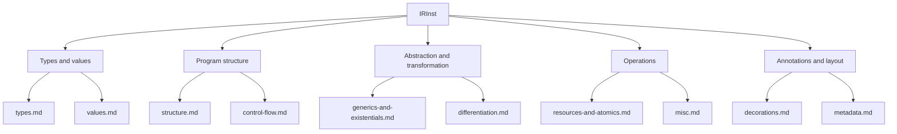

# IR Reference

This subtree of `docs/generated/design/` is a per-family reference for the
Slang Intermediate Representation. Every concrete opcode declared in
[../../../../source/slang/slang-ir-insts.lua](../../../../source/slang/slang-ir-insts.lua)
appears in a family page below, tabulated with its C++ wrapper
struct, its operand shape, its op-flags (`H` hoistable, `P` parent,
`G` global), the producer that constructs it, and a one-line summary.
Notable opcodes that carry semantics a table row cannot convey have
short call-outs further down each page. The intended reader is a
compiler developer who already knows roughly what they are looking for
and needs to find the opcode, its shape, and where it comes from.

The family pages are intentionally narrow: they describe _shape and
provenance_, not _behaviour of the passes that consume the IR_. For
the conventions every opcode obeys (schema, flag bits, hoistable/global
deduplication, module versioning, the workflow for adding a new opcode),
see [../cross-cutting/ir-instructions.md](../cross-cutting/ir-instructions.md).
For when AST nodes lower to IR and which lowering helpers run, see
[../pipeline/04-ast-to-ir.md](../pipeline/04-ast-to-ir.md). For what the
IR passes do afterwards, see
[../pipeline/05-ir-passes.md](../pipeline/05-ir-passes.md).

## Family taxonomy

## Pages

| Page                                                         | Family                                                                                                                                                                                                                                    | Lua entry root                                                                                                                                             | Approx. opcodes |
| ------------------------------------------------------------ | ----------------------------------------------------------------------------------------------------------------------------------------------------------------------------------------------------------------------------------------- | ---------------------------------------------------------------------------------------------------------------------------------------------------------- | --------------- |
| [types.md](types.md)                                         | Type instructions                                                                                                                                                                                                                         | `Type` (line 20), with the nested `BasicType` (22), `TranslatedTypeBase` (168), and `WorkGraphRecordTypeBase` (232) groups                                 | ~170            |
| [values.md](values.md)                                       | Constants, arithmetic, conversions (including the `DescriptorHandle<T>` conversions), memory, aggregate constructors, reshape/pack helpers, constexpr arithmetic/casts, string and native-pointer helpers                                 | `Constant` (line 953) plus top-level value opcodes; the `constexpr*` cluster starts at line 3408                                                           | ~150            |
| [structure.md](structure.md)                                 | Module structure: functions, generics, globals, structs, interfaces, witness tables                                                                                                                                                       | `GlobalValueWithCode` (line 885), `module` (line 942)                                                                                                      | ~20             |
| [control-flow.md](control-flow.md)                           | Block, parameters, branches, function exits, target / quad-execution `Require*` markers                                                                                                                                                   | `block` (line 944), `param` (line 1170), `TerminatorInst` (lines 1450-1535), the backend-hint group (1537-1547)                                            | ~30             |
| [generics-and-existentials.md](generics-and-existentials.md) | `specialize`, witness lookup, existential pack/unpack, RTTI, type-flow specialization (sets, tagged unions, dispatchers)                                                                                                                  | `specialize` (line 1047), `lookupWitness` (1048); the type-flow `SetBase` group at line 3125                                                               | ~50             |
| [resources-and-atomics.md](resources-and-atomics.md)         | Image/buffer/sampler ops, shader IO, atomics, barriers, fragment-shader interlocks, cooperative matrix/vector, wave intrinsics, raytracing, descriptor-heap loads, and the natural-layout `getNaturalStride` / `getNaturalAlignment` pair | `AtomicOperation` (line 1186) plus top-level resource opcodes                                                                                              | ~90             |
| [differentiation.md](differentiation.md)                     | Autodiff: differential pairs, forward/backward differentiate, reverse-mode contexts, autodiff placeholders, `DiffTypeInfo`                                                                                                                | `MakeDifferentialPairBase` (lines 1016-1046), `DiffTypeInfo` (1124), `TranslateBase` (2816-2855)                                                           | ~40             |
| [decorations.md](decorations.md)                             | Decoration family (metadata attached to instructions)                                                                                                                                                                                     | `Decoration` (line 1752)                                                                                                                                   | ~200            |
| [metadata.md](metadata.md)                                   | `Layout`, `Attr`, `Debug*`, `SPIRVAsmOperand`                                                                                                                                                                                             | `Layout` (line 2876), `Attr` (2909), the `Debug*` cluster (2974-3009), `SPIRVAsmOperand` (3016)                                                            | ~60             |
| [misc.md](misc.md)                                           | System opcodes (`nop`, `Unrecognized`), pack/expansion, type queries, compile-time size/align/count queries, storage casts, untyped descriptor-heap handle casts, liveness markers, tensor / runtime helpers, kernel launch               | Top-level miscellaneous opcodes, plus the `Undefined` (972), `BindingQuery` (1736), `CastStorageToLogicalBase` (2763), and `LiveRangeMarker` (2961) groups | ~70             |

The **Approx. opcodes** column is rounded to the nearest ten. It is
approximate for a second reason as well: a few rows on each page are
cross-links to an opcode's canonical listing on another page, so the
underlying row counts double-count those dual-role opcodes.

Two ownership splits are worth knowing before you pick a page, because
the obvious guess is wrong in both cases. The `DescriptorHandle<T>`
conversions live on [values.md](values.md), the _untyped_
descriptor-heap handle casts on
[misc.md](misc.md#untyped-descriptor-heap-handle-casts), and the
descriptor-heap loads on
[resources-and-atomics.md](resources-and-atomics.md). `getNaturalStride`
and `getNaturalAlignment` are documented on
[resources-and-atomics.md](resources-and-atomics.md#getnaturalstride-and-getnaturalalignment)
with the rest of the alignment/stride family, not with the
compile-time `sizeOf` / `alignOf` queries on [misc.md](misc.md).

Line numbers in the **Lua entry root** column refer to
[../../../../source/slang/slang-ir-insts.lua](../../../../source/slang/slang-ir-insts.lua),
which is 3609 lines at this commit; both the counts and the line
numbers drift as opcodes are added, removed, or moved between
families.

## How AST nodes lower to IR

The AST-origin column on every family page names the _producer_ that
constructs a given opcode: where that producer is AST lowering, the
citation is one of the roughly 230 `visit*` member functions in
[../../../../source/slang/slang-lower-to-ir.cpp](../../../../source/slang/slang-lower-to-ir.cpp)
(for example, `visitVarDecl` at line 11927 emits `var`), and the AST
side of that mapping is documented in the
[../ast-reference/](../ast-reference) subtree — chiefly
[../ast-reference/expressions.md](../ast-reference/expressions.md),
[../ast-reference/statements.md](../ast-reference/statements.md), and
[../ast-reference/declarations.md](../ast-reference/declarations.md).
Do not assume a visitor exists just because a parse-level AST class
does: there is no `visitInfixExpr`, because the `InfixExpr` the parser
builds for `a + b` is resolved during semantic checking into either a
`BuiltinOperatorExpr` (`visitBuiltinOperatorExpr`, line 7180) or an
ordinary `InvokeExpr` of a core-module function declared with
`__intrinsic_op` (`visitInvokeExpr`, line 7172). An opcode with no
direct AST source names its producing pass or function instead — an
`__intrinsic_op` declaration in
[../../../../source/slang/core.meta.slang](../../../../source/slang/core.meta.slang),
[../../../../source/slang/hlsl.meta.slang](../../../../source/slang/hlsl.meta.slang),
or [../../../../source/slang/diff.meta.slang](../../../../source/slang/diff.meta.slang),
or a named IR pass cited with the file and line that builds the
instruction — while an opcode that nothing in `source/` constructs is
marked **no producer at HEAD**. The old catch-alls `(synthesized)` and
a bare `—` are retired; see the column contract in
[../_meta/prompts/_common.md](../_meta/prompts/_common.md).

## Cross-cutting topics

- [../pipeline/04-ast-to-ir.md](../pipeline/04-ast-to-ir.md) —
  AST-to-IR lowering pipeline; how `IRBuilder`, `IRGenContext`, and
  the `visit*` methods translate AST into IR.
- [../pipeline/05-ir-passes.md](../pipeline/05-ir-passes.md) —
  the IR passes that legalize, specialize, and optimize the IR.
- [../pipeline/06-emit.md](../pipeline/06-emit.md) — how target
  emitters consume legalized IR.
- [../cross-cutting/ir-instructions.md](../cross-cutting/ir-instructions.md)
  — IR schema, op-flag conventions, hoistable/global deduplication,
  module versioning, and the workflow for adding a new opcode.
- [../cross-cutting/serialization.md](../cross-cutting/serialization.md)
  — how IR modules are serialized.
- [../cross-cutting/diagnostics.md](../cross-cutting/diagnostics.md)
  — IR instructions carry `SourceLoc`s through the diagnostic system.
- [../cross-cutting/targets.md](../cross-cutting/targets.md) — the
  target backends that consume legalized IR, and the per-target
  legalization that shapes which opcodes survive to emission.
- [../glossary.md](../glossary.md) — definitions of `IRInst`, `IROp`,
  `IRBuilder`, `IRModule`, `parent instruction`, `terminator
instruction`, `block parameter`, `decoration`, `hoistable
instruction`, `target intrinsic`, `differential pair`, `witness
table`, `existential type`, `specialization`, `single static
assignment (SSA)`.

## How to navigate

Start at [../cross-cutting/ir-instructions.md](../cross-cutting/ir-instructions.md)
if you are new to the IR: it covers the schema, op-flag bits, and
module versioning that every family page below assumes. Otherwise jump
straight to the family page for the opcode you care about; each one
opens with a `## Source` paragraph that links its Lua entry range and
states that page's own table conventions. Read the **AST origin** cell
as the name of the producer that actually constructs the opcode — a
`slang-lower-to-ir.cpp` visitor, a core-module `__intrinsic_op`
declaration, or a named IR pass — or as **no producer at HEAD** when
nothing in `source/` builds it. Abstract, grouping-only Lua entries
never appear as `## Opcodes` rows; they show up only in each page's
`## Family hierarchy` diagram.
