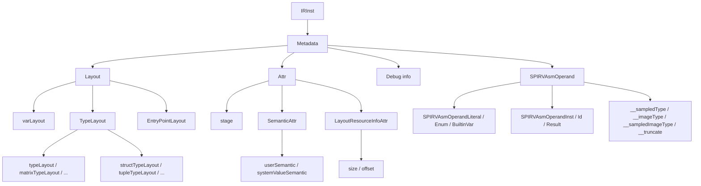

# Metadata

This page is the per-opcode reference for the IR families that carry
*metadata* about other instructions but are not part of the
[decorations](decorations.md) family: the `Layout` opcodes (layout
information for variables, types, and entry points), the `Attr`
opcodes (general-purpose IR attributes), the `Debug*` opcodes
(non-semantic debug info), and the `SPIRVAsmOperand` opcodes (typed
operands of inline SPIR-V asm blocks).

The intended reader is a compiler engineer who needs to interpret
layout, debug, or inline-asm metadata when reading IR or writing an
IR pass.

## Source

The four families live in distinct Lua entry groups in
[slang-ir-insts.lua](../../../../source/slang/slang-ir-insts.lua):
`Layout` at line ~2652, `Attr` at line ~2685, the `Debug*` opcodes
between lines ~2747 and ~2785, and `SPIRVAsmOperand` (with the
parent `SPIRVAsm` block) starting at line ~2786. C++ wrappers (where
they exist) are declared in
[slang-ir-insts.h](../../../../source/slang/slang-ir-insts.h). The
infrastructure used by these opcodes (op flags, `IRBuilder` helpers)
is in
[slang-ir.h](../../../../source/slang/slang-ir.h) and
[slang-ir.cpp](../../../../source/slang/slang-ir.cpp). Per-opcode
metadata such as instruction names and operand counts is registered in
[slang-ir-insts-info.cpp](../../../../source/slang/slang-ir-insts-info.cpp).
Most opcodes documented here are `(synthesized)` — they are
introduced by IR passes (layout, debug-info, SPIR-V asm lowering)
rather than by `slang-lower-to-ir.cpp` visitors.

## Family hierarchy

## Opcodes

### Layout family

`Layout` is the parent group; every child is hoistable so identical
layouts dedupe to a single IR value. Layout opcodes are introduced
by the layout pass
(`slang-ir-layout.cpp` and related files) and consumed during emit.

| Opcode | C++ wrapper | Operands | Flags | AST origin | Summary |
| --- | --- | --- | --- | --- | --- |
| `varLayout` | — | (variadic, `min=1`) | H | (synthesized) | Per-variable layout: contains offset and resource-binding attributes. |
| `typeLayout` | `TypeLayoutBase` | (variadic) | H | (synthesized) | Base of the type-layout hierarchy; carries size, alignment, and resource-usage attrs. |
| `parameterGroupTypeLayout` | — | (variadic, `min=2`) | H | (synthesized) | Layout for a parameter-group type (constant buffer, parameter block). |
| `arrayTypeLayout` | — | (variadic, `min=1`) | H | (synthesized) | Layout for an array type. |
| `streamOutputTypeLayout` | — | (variadic, `min=1`) | H | (synthesized) | Layout for a geometry-shader stream-output type. |
| `matrixTypeLayout` | — | (variadic, `min=1`) | H | (synthesized) | Layout for a matrix type; encodes row-major vs column-major. |
| `existentialTypeLayout` | — | (variadic) | H | (synthesized) | Layout for an existential / interface-typed value. |
| `structTypeLayout` | — | (variadic) | H | (synthesized) | Layout for a struct, owning `structFieldLayout` attribute children. |
| `tupleTypeLayout` | — | (variadic) | H | (synthesized) | Layout for a tuple type. |
| `structuredBufferTypeLayout` | — | (variadic, `min=1`) | H | (synthesized) | Layout for a structured-buffer resource. |
| `ptrTypeLayout` | `PointerTypeLayout` | (variadic) | H | (synthesized) | Layout for a pointer type. |
| `EntryPointLayout` | — | (variadic, `min=1`) | H | (synthesized) | Layout for an entry-point function (signature + per-stage info). |

### Attr family

`Attr` opcodes are general-purpose hoistable attributes attached to
other instructions. They appear primarily on layout opcodes (e.g.
`StructFieldLayoutAttr` is a child of `structTypeLayout`) and on
type opcodes via the `Attributed` type wrapper documented in
[types.md](types.md).

| Opcode | C++ wrapper | Operands | Flags | AST origin | Summary |
| --- | --- | --- | --- | --- | --- |
| `stage` | `StageAttr` | `stageOperand: IRIntLit` | H | (synthesized) | Tags an `EntryPointLayout` with its pipeline stage. |
| `structFieldLayout` | `StructFieldLayoutAttr` | `fieldKey, layout: IRVarLayout` | H | (synthesized) | One field's layout inside a `structTypeLayout`. |
| `tupleFieldLayout` | `TupleFieldLayoutAttr` | (variadic, `min=1`) | H | (synthesized) | One field's layout inside a `tupleTypeLayout`. |
| `caseLayout` | `CaseTypeLayoutAttr` | (variadic, `min=1`) | H | (synthesized) | Per-case layout inside an `existentialTypeLayout` / enum-style layout. |
| `unorm` | `UNormAttr` | — | H | `UNormModifier` (from `slang-check-modifier.cpp`) | Marks a value or layout as the UNORM-normalized form. |
| `snorm` | `SNormAttr` | — | H | `SNormModifier` | Marks a value or layout as the SNORM-normalized form. |
| `no_diff` | `NoDiffAttr` | — | H | `NoDiffModifier` (autodiff-related) | Marks a parameter as not contributing to derivative computation. |
| `nonuniform` | `NonUniformAttr` | — | H | `NonuniformResourceIndexModifier` | Marks a resource index value as non-uniform. |
| `Aligned` | `AlignedAttr` | `alignment` | H | (synthesized) | Records the alignment of a pointer or buffer member. |
| `MemoryScope` | `MemoryScopeAttr` | (variadic, `min=1`) | H | (synthesized) | Records the memory scope of an atomic / barrier operation. |
| `userSemantic` | `UserSemanticAttr` | (variadic, `min=2`) | H | `HLSLSemantic` AST node | User-defined HLSL semantic on a parameter or field. (`SemanticAttr` is the grouping parent of `userSemantic` and `systemValueSemantic`; it is not itself an opcode.) |
| `systemValueSemantic` | `SystemValueSemanticAttr` | (variadic, `min=2`) | H | `HLSLSimpleSemantic` (system-value variant) | System-value semantic (`SV_*`) on a parameter or field. |
| `size` | `TypeSizeAttr` | (variadic, `min=2`) | H | (synthesized) | Type-size record on a layout, keyed by resource kind. (`LayoutResourceInfoAttr` is the grouping parent of `size` and `offset`; it is not itself an opcode.) |
| `offset` | `VarOffsetAttr` | (variadic, `min=2`) | H | (synthesized) | Var-offset record on a `varLayout`, keyed by resource kind. |
| `FuncThrowType` | `FuncThrowTypeAttr` | `errorType: IRType` | H | (synthesized) | Records the error type of a throwing function. |

### Debug info family

Non-semantic debug-information opcodes used by the SPIR-V backend
(and CPU debug builds). Most are introduced by
`slang-ir-insert-debug-value-store.cpp` and the debug-info pass; a
few (`DebugCompilationUnit`, `DebugSource`) are emitted directly at
module top level. The opcodes mirror the SPIR-V NonSemantic.Shader
debug-info extension, but the page intentionally avoids citing
specific external instruction numbers — see the source for the exact
mapping.

| Opcode | C++ wrapper | Operands | Flags | AST origin | Summary |
| --- | --- | --- | --- | --- | --- |
| `DebugSource` | — | (variadic, `min=3`) | H | (synthesized) | Records the path and contents of a source file. |
| `DebugLine` | — | (variadic, `min=5`) | | (synthesized) | Pins an instruction to a source line/column range. |
| `DebugVar` | — | `name, type, scope, location` | | (synthesized) | Declares a user-visible variable for the debugger. |
| `DebugValue` | — | (variadic, `min=2`) | | `emitDebugValue` in `slang-ir-insert-debug-value-store.cpp` | Reports the current value of a `DebugVar`. |
| `DebugInlinedAt` | — | (variadic, `min=5`) | | (synthesized) | Records a callsite for inlined code. |
| `DebugFunction` | — | (variadic, `min=5`) | | (synthesized) | Declares a function for the debugger (name, scope, file). |
| `DebugInlinedVariable` | — | (variadic, `min=2`) | | (synthesized) | Declares a variable inside an inlined function instance. |
| `DebugScope` | — | (variadic, `min=2`) | | (synthesized) | Opens a debug scope (function, block, ...). |
| `DebugNoScope` | — | (variadic, `min=1`) | | (synthesized) | Marker that an instruction is outside any debug scope. |
| `DebugBuildIdentifier` | — | (variadic, `min=2`) | | (synthesized) | Records the build identifier of the compilation. |
| `DebugCompilationUnit` | — | `source` | H | (synthesized) | Declares the compilation unit, referencing a `DebugSource`. |
| `EmbeddedDownstreamIR` | — | `targetOperand: IRIntLit, blob: IRBlobLit` | | (synthesized) | Embeds a precompiled downstream IR blob for one target. |

### SPIR-V inline asm

The SPIR-V inline-asm machinery surfaces typed operands as IR
instructions so that the backend can substitute Slang IR values
into raw SPIR-V instructions emitted by `__intrinsic_asm`-style
intrinsics. `SPIRVAsm` is the parent container that owns
`SPIRVAsmInst` children; each `SPIRVAsmInst` references zero or
more `SPIRVAsmOperand` opcodes.

| Opcode | C++ wrapper | Operands | Flags | AST origin | Summary |
| --- | --- | --- | --- | --- | --- |
| `SPIRVAsm` | — | (variadic) | P | (synthesized) | Parent container of an inline-asm block; children are `SPIRVAsmInst`. |
| `SPIRVAsmInst` | — | (variadic, `min=1`) | | (synthesized) | One SPIR-V instruction inside a `SPIRVAsm` block. |
| `SPIRVAsmOperandLiteral` | — | (variadic, `min=1`) | H | (synthesized) | Literal value (integer or string) passed as a SPIR-V operand. (`SPIRVAsmOperand` is the grouping parent of every typed asm-operand kind below; it is not itself an opcode.) |
| `SPIRVAsmOperandInst` | — | (variadic, `min=1`) | | (synthesized) | Reference to a Slang `IRInst` (value or type); not hoistable so that asm-block rewrites can change uses. |
| `SPIRVAsmOperandConvertTexel` | — | (variadic, `min=1`) | | (synthesized) | Implicit texel-format conversion operand for image instructions. |
| `SPIRVAsmOperandRayPayloadFromLocation` | — | (variadic, `min=1`) | | (synthesized) | Late-resolving operand for a ray payload referenced by location. |
| `SPIRVAsmOperandRayAttributeFromLocation` | — | (variadic, `min=1`) | | (synthesized) | Late-resolving operand for a ray hit-attribute. |
| `SPIRVAsmOperandRayCallableFromLocation` | — | (variadic, `min=1`) | | (synthesized) | Late-resolving operand for a callable-shader payload. |
| `SPIRVAsmOperandEnum` | — | (variadic, `min=1`) | H | (synthesized) | Named SPIR-V enumerator (optionally with a typed constant id). |
| `SPIRVAsmOperandBuiltinVar` | — | (variadic, `min=1`) | H | (synthesized) | Reference to a SPIR-V built-in variable. |
| `SPIRVAsmOperandGLSL450Set` | — | — | H | (synthesized) | Reference to the GLSL.std.450 instruction set. |
| `SPIRVAsmOperandDebugPrintfSet` | — | — | H | (synthesized) | Reference to the NonSemantic.DebugPrintf instruction set. |
| `SPIRVAsmOperandId` | — | (variadic, `min=1`) | H | (synthesized) | Named id used to refer back to another instruction inside the same asm block. |
| `SPIRVAsmOperandResult` | — | — | H | (synthesized) | Marker for the place to insert the generated result operand. |
| `__truncate` | `SPIRVAsmOperandTruncate` | — | H | (synthesized) | Type-directed truncation operand. |
| `__entryPoint` | `SPIRVAsmOperandEntryPoint` | — | H | (synthesized) | Id of an entry point referencing the current function. |
| `__sampledType` | `SPIRVAsmOperandSampledType` | (variadic, `min=1`) | H | (synthesized) | Type function returning the sampled-component type. |
| `__imageType` | `SPIRVAsmOperandImageType` | (variadic, `min=1`) | H | (synthesized) | Type function returning the equivalent `OpTypeImage`. |
| `__sampledImageType` | `SPIRVAsmOperandSampledImageType` | (variadic, `min=1`) | H | (synthesized) | Type function returning the equivalent sampled-image type. |

## Notable opcodes

### `Layout`

`Layout` is the abstract parent of the entire layout-opcode family;
it never appears as a leaf instruction itself — only its children
(`varLayout`, `typeLayout`, `EntryPointLayout`, ...) are emitted.
The link that connects a laid-out variable, type, or entry-point
inst back to its computed layout is the `LayoutDecoration` opcode
documented in [decorations.md](decorations.md): the decoration's
operand is one of the concrete `Layout` children listed above. So a
reader walking IR follows a `layout` decoration to reach the
offset / size / binding data held by a `varLayout` or `typeLayout`.

### `varLayout` and `EntryPointLayout`

`varLayout` is the per-variable layout record produced by the layout
pass. Its operand list is structurally heterogeneous: the leading
operand is the type-layout reference, followed by zero or more
`offset` and `size` attribute children keyed by resource kind. The
backend reads these children to compute register / binding offsets.
`EntryPointLayout` plays the corresponding role for an entry point:
it owns a `varLayout` for the parameter group and a `stage`
attribute. Both layout opcodes are hoistable so identical layouts
collapse to one IR value, which is critical because the same struct
type can be laid out many times for many entry points.

### `userSemantic` vs `systemValueSemantic`

The two semantic attributes share the same operand shape
(`semanticName, index, ...`) but differ in what they tag: a
user-defined `[Semantic("Foo")]` lowers to `userSemantic`, while an
`SV_*` system value lowers to `systemValueSemantic`. The split lets
backends choose between user-defined naming and built-in slot
assignment without parsing the string at emit time.

### `DebugLine`

`DebugLine` pins an instruction to a `(file, startLine, startCol,
endLine, endCol)` range. The pass that inserts it walks the IR and
emits one `DebugLine` per change in source location, in the order
they should be reported to a debugger; it is *not* attached as a
decoration so that the location can flow with the instruction even
across CFG transformations.

### `DebugScope`

`DebugScope(scope, inlinedAt)` opens a debug lexical scope. Its
first operand references the enclosing scope — a `DebugFunction`
for a function-level scope, or another `DebugScope` for a nested
block — so scopes nest by chaining the `scope` operand up to the
owning `DebugFunction`. The second operand records the inlining
context (a `DebugInlinedAt`, or empty when the code is not
inlined). The companion `DebugNoScope` marks instructions that
sit outside any debug scope so the debugger does not associate
them with the surrounding lexical region.

### `EmbeddedDownstreamIR`

When precompiled libraries are embedded into a Slang module, each
target's compiled blob is stored under an `EmbeddedDownstreamIR`
opcode keyed by an `IRIntLit` target identifier. The serializer
preserves the blob byte-for-byte; the loader unpacks it lazily when
the target is requested.

### `SPIRVAsmOperandInst` (non-hoistable)

Most `SPIRVAsmOperand` kinds are hoistable so they dedupe to a single
IR value. `SPIRVAsmOperandInst` is the deliberate exception: it
references another Slang IR value, and IR passes need to be able to
rewrite that reference (for example, replace it with a transformed
value) without invalidating other asm blocks that referenced the
original. The comment in the Lua entry calls this out explicitly.

### `__sampledType` / `__imageType` / `__sampledImageType`

These three operand opcodes are *type functions*: their result is a
SPIR-V type computed from their operand at emit time. The backend
evaluates them lazily when emitting the surrounding `SPIRVAsmInst`,
which lets inline-asm authors write generic asm fragments that
adapt to the actual image / sampler types in scope.

## See also

- [../cross-cutting/ir-instructions.md](../cross-cutting/ir-instructions.md)
  — schema, op flags, hoistable / parent conventions, and the
  "add an opcode" workflow that applies equally to metadata opcodes.
- [decorations.md](decorations.md) — the much larger sibling family
  of metadata; `LayoutDecoration` in decorations points back to the
  `Layout` opcodes here.
- [../pipeline/05-ir-passes.md](../pipeline/05-ir-passes.md) — the
  layout pass and the debug-info insertion pass that introduce most
  of these opcodes.
- [../pipeline/06-emit.md](../pipeline/06-emit.md) — how the SPIR-V
  backend consumes `SPIRVAsm*` opcodes and the debug-info opcodes;
  how layout opcodes drive resource-binding emission.
- [../glossary.md](../glossary.md) — definitions of `hoistable
  instruction`, `parent instruction`, `decoration`, `target
  intrinsic`.
