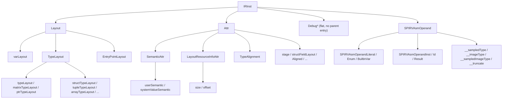

# Metadata

This page is the per-opcode reference for the IR families that carry
*metadata* about other instructions but are not part of the
[decorations](decorations.md) family: the `Layout` opcodes (layout
information for variables, types, and entry points), the `Attr`
opcodes (general-purpose IR attributes), the `Debug*` opcodes
(non-semantic debug info), and the `SPIRVAsmOperand` opcodes (typed
operands of inline SPIR-V asm blocks). Fifty-nine concrete opcodes
are catalogued below.

The intended reader is a compiler engineer who needs to interpret
layout, debug, or inline-asm metadata when reading IR or writing an
IR pass. Because these opcodes are almost all "records" rather than
computations, **operand position is the entire meaning**, and the
tables below give the position of each operand as the C++ accessors
read it — not as the Lua entry happens to spell it. Where the two
disagree, a callout in
[Notable opcodes](#notable-opcodes) says so.

## Source

The four families live in distinct Lua entry groups in
[slang-ir-insts.lua](../../../../source/slang/slang-ir-insts.lua):
`Layout` at line 2876, `Attr` at line 2909, the `Debug*` opcodes
between lines 2974 and 3009 (with `EmbeddedDownstreamIR` immediately
after at line 3011), and the inline-asm group starting with the
parent `SPIRVAsm` at line 3013 and `SPIRVAsmOperand` at line 3016.

Every opcode on this page has a C++ wrapper struct, and 38 of the 59
are hand-written in
[slang-ir-insts.h](../../../../source/slang/slang-ir-insts.h) rather
than generated. Those 38 are marked with a trailing `‡` in the
**C++ wrapper** column below. They are the layout and layout-attribute
wrappers (`IRAttr` at line 989, `IRParameterGroupTypeLayout` at
line 1240, `IRVarLayout` at line 1677, `IRAlignedAttr` at line 1810
and their neighbours), the eleven `IRDebug*` structs (lines
2711-2819), the inline-asm wrappers (`IRSPIRVAsmOperand` at line 2836,
`IRSPIRVAsm` at line 2901) and `IREmbeddedDownstreamIR` (line 2959).
The other 21 — `IRTypeLayoutBase`, the three `Attributed`-type marker
attributes, `IRNonUniformAttr`, and the sixteen concrete
`IRSPIRVAsmOperand*` leaves — are emitted by the FIDDLE template at
the end of that header. As
[../cross-cutting/ir-instructions.md](../cross-cutting/ir-instructions.md)
explains, naming the operands in the Lua entry is enough to get
typed accessors; an entry that instead declares only `min_operands`
gets no generated accessors, which is why the hand-written structs
exist.

Layout and layout-attribute opcodes are produced by AST-to-IR
lowering, not by an IR pass: `lowerTypeLayout` (line 16060),
`_lowerTypeLayoutCommon` (line 16023) and `lowerVarLayout`
(line 16235) in
[slang-lower-to-ir.cpp](../../../../source/slang/slang-lower-to-ir.cpp)
translate the front-end's `TypeLayout` / `VarLayout` / `EntryPointLayout`
objects into IR, all reached from
`TargetProgram::createIRModuleForLayout` (line 16353) — see
[../pipeline/04c-layout-ir.md](../pipeline/04c-layout-ir.md). The
whole `SPIRVAsm*` group comes from one visitor,
`visitSPIRVAsmExpr` (line 6137), in the same file. The `Debug*`
opcodes are split: lowering emits `DebugSource`,
`DebugCompilationUnit`, `DebugLine`, `DebugFunction`, `DebugVar`
and `DebugValue`; `slang-ir-inline.cpp` adds `DebugScope`,
`DebugNoScope`, `DebugInlinedAt` and further `DebugFunction`s;
`slang-ir-insert-debug-value-store.cpp` and
`slang-ir-legalize-types.cpp` add further `DebugVar` / `DebugValue`
pairs; and `linkAndOptimizeIR` in
[slang-emit.cpp](../../../../source/slang/slang-emit.cpp) (line 1032)
creates the single `DebugBuildIdentifier`. `DebugInlinedVariable` has
no producer at HEAD.

The builder side lives in
[slang-ir.cpp](../../../../source/slang/slang-ir.cpp):
`IRTypeLayout::Builder::addAttrs` (line 1147) is where a type
layout's size and alignment attributes are materialized, and the
`IRBuilder::get*Attr` / `IRBuilder::emitDebug*` families (lines
3535-3680 and 7395-7510) are the canonical creation points. Op
flags (`hoistable`, `parent`) are declared in
[slang-ir.h](../../../../source/slang/slang-ir.h); per-opcode
mnemonics and operand counts are registered in
[slang-ir-insts-info.cpp](../../../../source/slang/slang-ir-insts-info.cpp).

## Family hierarchy


```mermaid
flowchart TD
  IRInst --> LayoutFamily[Layout]
  IRInst --> AttrFamily[Attr]
  IRInst --> DebugFamily["Debug* (flat, no parent entry)"]
  IRInst --> SpirvAsmFamily[SPIRVAsmOperand]
  LayoutFamily --> VarLayoutNode[varLayout]
  LayoutFamily --> TypeLayout
  LayoutFamily --> EntryPointLayoutNode[EntryPointLayout]
  TypeLayout --> ScalarTypeLayouts["typeLayout / matrixTypeLayout / ptrTypeLayout"]
  TypeLayout --> AggregateTypeLayouts["structTypeLayout / tupleTypeLayout / arrayTypeLayout / ..."]
  AttrFamily --> SemanticAttrFamily[SemanticAttr]
  AttrFamily --> LayoutResourceInfoAttrFamily[LayoutResourceInfoAttr]
  AttrFamily --> TypeAlignmentNode[TypeAlignment]
  AttrFamily --> OtherAttrs["stage / structFieldLayout / Aligned / ..."]
  SemanticAttrFamily --> userSemanticNode["userSemantic / systemValueSemantic"]
  LayoutResourceInfoAttrFamily --> sizeOffsetNode["size / offset"]
  SpirvAsmFamily --> LiteralOperands["SPIRVAsmOperandLiteral / Enum / BuiltinVar"]
  SpirvAsmFamily --> InstOperands["SPIRVAsmOperandInst / Id / Result"]
  SpirvAsmFamily --> TypeFunctions["__sampledType / __imageType / __sampledImageType / __truncate"]
```

`Layout`, `TypeLayout`, `Attr`, `SemanticAttr`,
`LayoutResourceInfoAttr` and `SPIRVAsmOperand` are abstract grouping
entries: they define a contiguous opcode range so `as<IRAttr>()` is a
range comparison, but no instruction ever carries one of those
opcodes. The `Debug*` opcodes are *not* grouped under a common parent
entry — they are eleven sibling top-level entries, so there is no
`as<IRDebugInst>()`.

## Opcodes

In the `Operands` column, a trailing `?` marks an operand that may be
absent, and `+ attrs` marks the variable-length tail of attribute
instructions that layout opcodes carry after their fixed operands. In
the `Flags` column, `H` is hoistable and `P` is parent.

### Layout family

`Layout` is the parent group and sets `hoistable = true`, which every
child inherits, so identical layouts dedupe to a single IR value —
important because the same struct type is laid out once per entry
point. A laid-out instruction is connected to its layout by the
`LayoutDecoration` opcode described in [decorations.md](decorations.md).

| Opcode | C++ wrapper | Operands | Flags | AST origin | Summary |
| --- | --- | --- | --- | --- | --- |
| `varLayout` | `IRVarLayout`‡ | `typeLayout`, + attrs (`offset`, semantic, `stage`) | H | `VarLayout` (via `lowerVarLayout`) | Per-variable layout: a type layout plus resource-kind-keyed offsets. |
| `typeLayout` | `IRTypeLayoutBase` | + attrs only | H | `TypeLayout` (fallback case of `lowerTypeLayout`) | Generic type layout used when no specialized sub-opcode applies. |
| `parameterGroupTypeLayout` | `IRParameterGroupTypeLayout`‡ | `containerVarLayout, elementVarLayout, offsetElementTypeLayout`, + attrs | H | `ParameterGroupTypeLayout` | Layout for a constant buffer / parameter block. |
| `arrayTypeLayout` | `IRArrayTypeLayout`‡ | `elementTypeLayout`, + attrs | H | `ArrayTypeLayout` | Layout for an array type; element stride is derived, not stored. |
| `streamOutputTypeLayout` | `IRStreamOutputTypeLayout`‡ | `elementTypeLayout`, + attrs | H | `StreamOutputTypeLayout` | Layout for a geometry-shader stream-output type. |
| `matrixTypeLayout` | `IRMatrixTypeLayout`‡ | `mode: IRIntLit`, + attrs | H | `MatrixTypeLayout` | Layout for a matrix type; operand 0 is a `MatrixLayoutMode` — `1` row-major, `2` column-major. |
| `existentialTypeLayout` | `IRExistentialTypeLayout`‡ | + attrs only | H | `ExistentialTypeLayout` | Layout for an existential / interface-typed value. |
| `structTypeLayout` | `IRStructTypeLayout`‡ | + `structFieldLayout` attrs | H | `StructTypeLayout` | Layout for a struct; one field attr per field, in declaration order. |
| `tupleTypeLayout` | `IRTupleTypeLayout`‡ | + `tupleFieldLayout` attrs | H | **no producer at HEAD** | Layout for a tuple type; nothing calls `IRTupleTypeLayout::Builder` at `source_commit`. |
| `structuredBufferTypeLayout` | `IRStructuredBufferTypeLayout`‡ | `elementTypeLayout`, + attrs | H | `StructuredBufferTypeLayout` | Layout for a structured-buffer resource. |
| `ptrTypeLayout` | `IRPointerTypeLayout`‡ | + attrs only | H | `PointerTypeLayout` | Layout for a pointer type; the pointee layout is deliberately not stored. |
| `EntryPointLayout` | `IREntryPointLayout`‡ | `paramsLayout: IRVarLayout, resultLayout: IRVarLayout` | H | `EntryPointLayout` (via `lowerEntryPointLayout`, line 16307) | Layout for an entry point: parameter-struct layout plus result layout. |

The `AST origin` column names the front-end class each row is lowered
from, which does not say what a shader author writes to reach it. The
minimal Slang surface for each is: any shader parameter for
`varLayout`, and every entry point for `EntryPointLayout`; a
`cbuffer` block or a `ConstantBuffer<T>` for
`parameterGroupTypeLayout`; a `struct` used as a laid-out type for
`structTypeLayout`; a `RWStructuredBuffer<T>` for
`structuredBufferTypeLayout`, whose element type `T` gets the
fallback `typeLayout`; an array field such as `float arr[4]` for
`arrayTypeLayout`; a matrix field such as `float4x4 m` for
`matrixTypeLayout`; a pointer field such as `float* p` for
`ptrTypeLayout`; an interface-typed field such as `ILight light` for
`existentialTypeLayout`; and an `inout TriangleStream<T>` parameter of
a geometry entry point for `streamOutputTypeLayout`.
`matrixTypeLayout` is the one row whose shape depends on a compile
option rather than on the declaration: `-matrix-layout-row-major` and
`-matrix-layout-column-major` select the `1` and `2` mode operands.

### Attr family

`Attr` opcodes are general-purpose hoistable attributes. Most appear
in the operand tail of a layout opcode (`size`, `offset`,
`TypeAlignment`, `structFieldLayout`, semantics, `stage`); `unorm`,
`snorm` and `no_diff` appear inside the `Attributed` type wrapper
documented in [types.md](types.md); and `Aligned` / `MemoryScope`
appear in the operand tail of a `load` / `store`.

The public Slang surface for that last pair is the core-module
`loadAligned` / `storeAligned` and `loadCoherent` / `storeCoherent`
wrappers; `__align_attr` and `__memoryscope_attr` are `internal`
helpers those wrappers call, not something a shader author writes.
The coherent pair is declared `[require(SPV_KHR_vulkan_memory_model)]`
([core.meta.slang](../../../../source/slang/core.meta.slang)
lines 1570 and 1582), and
`getMemoryAccessOperandsOfLoadStore`
([slang-emit-spirv.cpp](../../../../source/slang/slang-emit-spirv.cpp)
line 8793) fails an assertion if a `MemoryScope` reaches it without
the Vulkan memory model selected.

| Opcode | C++ wrapper | Operands | Flags | AST origin | Summary |
| --- | --- | --- | --- | --- | --- |
| `stage` | `IRStageAttr`‡ | `stageOperand: IRIntLit` | H | `VarLayout::stage` (via `IRVarLayout::Builder::setStage`) | Tags a `varLayout` with the pipeline stage it belongs to; the literal is a `Stage` enumerator, so a compute entry point prints as `stage(6 : Int)`. |
| `structFieldLayout` | `IRStructFieldLayoutAttr`‡ | `fieldKey, layout: IRVarLayout` | H | `StructTypeLayout` field list | One field's layout inside a `structTypeLayout`. |
| `tupleFieldLayout` | `IRTupleFieldLayoutAttr`‡ | `layout: IRTypeLayout` | H | **no producer at HEAD** | One field's layout inside a `tupleTypeLayout`; its only construction site is the uncalled `IRTupleTypeLayout::Builder::addAttrsImpl`, see the callout below. |
| `caseLayout` | `IRCaseTypeLayoutAttr`‡ | `typeLayout: IRTypeLayout` | H | **no producer at HEAD** | Per-case layout for a union-style layout; `getCaseTypeLayoutAttr` has no caller at `source_commit`. |
| `unorm` | `IRUNormAttr` | — | H | `UNormModifierVal` (line 3017) | Marks a type as the UNORM-normalized form. |
| `snorm` | `IRSNormAttr` | — | H | `SNormModifierVal` (line 3023) | Marks a type as the SNORM-normalized form. |
| `no_diff` | `IRNoDiffAttr` | — | H | `NoDiffModifierVal` (line 3029) | Marks a type as not contributing to derivative computation. |
| `nonuniform` | `IRNonUniformAttr` | — | H | Call specialization (`slang-ir-specialize-function-call.cpp`, line 618) | Marks a resource index as non-uniform. |
| `Aligned` | `IRAlignedAttr`‡ | `alignment` | H | Core-module `loadAligned` / `storeAligned` (`core.meta.slang` lines 1536, 1550), via the internal `__align_attr` (`__intrinsic_op`, line 1516); also `IRBuilder::emitLoad` / `emitStore` (`slang-ir.cpp` lines 5564, 5627) | Access alignment of a `load` / `store`, not of a type layout. |
| `MemoryScope` | `IRMemoryScopeAttr`‡ | `memoryScope` | H | Core-module `loadCoherent` / `storeCoherent` (`core.meta.slang` lines 1586, 1573), via the internal `__memoryscope_attr` (`__intrinsic_op`, line 1557); also `IRBuilder::emitStore` (`slang-ir.cpp` line 5641) | Memory scope of a coherent `load` / `store`; read by `getMemoryScope()`. |
| `userSemantic` | `IRUserSemanticAttr`‡ | `name: IRStringLit, index: IRIntLit` | H | `VarLayout::semanticName` | User-defined HLSL semantic on a parameter or field. |
| `systemValueSemantic` | `IRSystemValueSemanticAttr`‡ | `name: IRStringLit, index: IRIntLit` | H | `VarLayout::systemValueSemantic` | System-value semantic (`SV_*`) on a parameter or field. |
| `size` | `IRTypeSizeAttr`‡ | `kind: IRIntLit, size: IRIntLit` | H | `TypeLayout::resourceInfos` | Resource usage of a type layout for one `LayoutResourceKind`. |
| `offset` | `IRVarOffsetAttr`‡ | `kind: IRIntLit, offset: IRIntLit, space: IRIntLit?` | H | `VarLayout::resourceInfos` | Binding offset of a `varLayout` for one `LayoutResourceKind`. |
| `TypeAlignment` | `IRTypeAlignmentAttr`‡ | `alignment: IRIntLit, kind: IRIntLit?` | H | `TypeLayout::uniformAlignment` (via `_lowerTypeLayoutCommon`) | Alignment of a type layout in one layout unit; **alignment-first**, see below. |
| `FuncThrowType` | `IRFuncThrowTypeAttr`‡ | `errorType: IRType` | H | Throwing-function lowering (lines 2736, 4808) | Records the error type of a function declared `throws`. |

### Debug info family

Non-semantic debug information, consumed mainly by the SPIR-V
backend. `DebugSource`, `DebugCompilationUnit`, `DebugLine`,
`DebugFunction`, `DebugVar` and `DebugValue` are emitted during
AST-to-IR lowering; `slang-ir-inline.cpp` adds `DebugScope`,
`DebugNoScope`, `DebugInlinedAt` and further `DebugFunction`s when it
inlines a call; `slang-ir-insert-debug-value-store.cpp` and
`slang-ir-legalize-types.cpp` add further `DebugVar` / `DebugValue`
pairs. Only `DebugSource` and `DebugCompilationUnit` are hoistable.

None of these opcodes exist unless debug information is requested, and
the requested `DebugInfoLevel` selects *which* of them exist, so a
reader looking for a particular record has to compile at a high enough
level to see it. `-g` with no suffix is `Standard`; `-g0`..`-g3` name
the level explicitly. At `None` (`-g0`) lowering emits nothing —
[slang-lower-to-ir.cpp](../../../../source/slang/slang-lower-to-ir.cpp)
line 15458 gates the whole `DebugSource` loop, and `linkAndOptimizeIR`
additionally runs `stripDebugInfo` over anything that arrived from a
linked module
([slang-emit.cpp](../../../../source/slang/slang-emit.cpp) line 1053).
`Minimal` (`-g1`) produces `DebugSource` (with an **empty** text
operand), `DebugLine`, `DebugFunction`, and — once the inliner has run
— `DebugScope`, `DebugNoScope` and `DebugInlinedAt`. `Standard` (`-g`,
`-g2`) and `Maximal` (`-g3`) add two records' worth of detail:
`DebugSource` carries the file's text (line 15471), and each
non-included source file gets a `DebugCompilationUnit` (line 15481).
Those two levels are also what enable the variable-level records —
the `insertDebugValueStore` pass runs only at `Standard` or above
(line 15596), as does the `DebugVar` emitted for a `let` declaration
(line 11977), so `DebugVar` and `DebugValue` never appear at `-g1`.
`-debug-info-include-source` is the one exception to
the level rule: it embeds the source text into `DebugSource` even at
`Minimal`.

| Opcode | C++ wrapper | Operands | Flags | AST origin | Summary |
| --- | --- | --- | --- | --- | --- |
| `DebugSource` | `IRDebugSource`‡ | `fileName, source, isIncludedFile` | H | `getOrEmitDebugSource` in lowering | Records a source file's path, embedded text, and include status; operand 1 is the *whole* file, empty at `-g1`. |
| `DebugCompilationUnit` | `IRDebugCompilationUnit`‡ | `source` | H | Lowering (`emitDebugCompilationUnit`) | Declares the compilation unit, referencing a `DebugSource`. |
| `DebugLine` | `IRDebugLine`‡ | `source, lineStart, lineEnd, colStart, colEnd` | | `maybeEmitDebugLine` in lowering (line 9907) | Pins an instruction to a source line/column range. |
| `DebugVar` | `IRDebugVar`‡ | `source, line, col, argIndex?` | | Lowering (line 11975) and the debug-value-store pass | Declares a user-visible variable; result type is `Ptr<T>`. |
| `DebugValue` | `IRDebugValue`‡ | `debugVar, value` | | Lowering (line 11986) and the debug-value-store pass | Reports the current value of a `DebugVar`. |
| `DebugInlinedAt` | `IRDebugInlinedAt`‡ | `line, col, file, debugFunc, outerInlinedAt?` | | `slang-ir-inline.cpp` | Records one frame of an inlining chain. |
| `DebugFunction` | `IRDebugFunction`‡ | `name, line, col, file, debugType, parentScope?` | | Lowering (line 14712) and `slang-ir-inline.cpp` | Declares a function for the debugger; linked by `DebugFuncDecoration`. |
| `DebugInlinedVariable` | `IRDebugInlinedVariable`‡ | `variable, inlinedAt` | | **no producer at HEAD** | Variable inside an inlined instance; `emitDebugInlinedVariable` has no caller at `source_commit`. |
| `DebugScope` | `IRDebugScope`‡ | `scope, inlinedAt` | | `slang-ir-inline.cpp` | Opens a debug lexical scope. |
| `DebugNoScope` | `IRDebugNoScope`‡ | (emitted with none; see below) | | `slang-ir-inline.cpp` | Marks that following instructions are outside any debug scope. |
| `DebugBuildIdentifier` | `IRDebugBuildIdentifier`‡ | `buildIdentifier, flags` | | `linkAndOptimizeIR` (`slang-emit.cpp`, line 1031), only under `-separate-debug-info` | Records the build identifier of the compilation. |
| `EmbeddedDownstreamIR` | `IREmbeddedDownstreamIR`‡ | `targetOperand: IRIntLit, blob: IRBlobLit` | | Precompilation of a translation unit (`slang-compiler-tu.cpp`, line 230) | Embeds a precompiled downstream blob for one `CodeGenTarget`. |

### SPIR-V inline asm

The inline-asm machinery surfaces typed operands as IR instructions
so the backend can substitute Slang IR values into raw SPIR-V.
`SPIRVAsm` is a `parent` instruction owning `SPIRVAsmInst` children;
each `SPIRVAsmInst` takes its opcode as operand 0 and its SPIR-V
operands as the remaining operands
(`getOpcodeOperand()` / `getSPIRVOperands()`). Every opcode in this
group is produced by `visitSPIRVAsmExpr`, so the AST origin for all
of them is `SPIRVAsmExpr`; the column below names the
`SPIRVAsmOperand` *kind* in the AST expression that selects each one.

The block's printed form follows from those two facts. `SPIRVAsm` is
dumped by `dumpIRParentInst`
([slang-ir.cpp](../../../../source/slang/slang-ir.cpp) line 8041) as a
typed one-line header followed by an indented brace block, and every
`SPIRVAsmOperand` is folded into its use site by
`shouldFoldInstIntoUses` (line 7822), so the operand instructions
print *inside* their `SPIRVAsmInst` rather than as separately numbered
definitions above it. A two-instruction block
(`%tmp : $$float = OpFMul $x $x; result:$$float = OpExtInst glsl450
Sqrt %tmp`) reaches the dump as:

```
SPIRVAsm %8 : Float
{
  SPIRVAsmInst(133 : UInt, Float, %"tmp", ...)
  SPIRVAsmInst(12 : UInt, Float, result, SPIRVAsmOperandGLSL450Set, 31 : UInt, %"tmp")
}
```

Operand 0 of each child is the SPIR-V opcode number (`133` is
`OpFMul`, `12` is `OpExtInst`), and the tokens after it are the folded
operand instructions in source order.

| Opcode | C++ wrapper | Operands | Flags | AST origin | Summary |
| --- | --- | --- | --- | --- | --- |
| `SPIRVAsm` | `IRSPIRVAsm`‡ | — (children are `SPIRVAsmInst`) | P | `SPIRVAsmExpr` | Parent container of one inline-asm block. |
| `SPIRVAsmInst` | `IRSPIRVAsmInst`‡ | `opcodeOperand, operands...` | | `SPIRVAsmExpr` (per instruction) | One SPIR-V instruction inside a `SPIRVAsm` block. |
| `SPIRVAsmOperandLiteral` | `IRSPIRVAsmOperandLiteral` | `value` | H | `SPIRVAsmOperand::Literal` | Literal string or 32-bit integer emitted directly as an operand. |
| `SPIRVAsmOperandInst` | `IRSPIRVAsmOperandInst`‡ | `value` | | `SPIRVAsmOperand::SlangValue` / `SlangValueAddr` / `SlangType` | Reference to a Slang value or type; deliberately not hoistable. |
| `SPIRVAsmOperandConvertTexel` | `IRSPIRVAsmOperandConvertTexel` | `value` | | `SPIRVAsmOperand::ConvertTexel` | Implicit texel-format conversion for an image store. |
| `SPIRVAsmOperandRayPayloadFromLocation` | `IRSPIRVAsmOperandRayPayloadFromLocation` | `value` | | `SPIRVAsmOperand::RayPayloadFromLocation` | Late-resolving operand for a ray payload referenced by location. |
| `SPIRVAsmOperandRayAttributeFromLocation` | `IRSPIRVAsmOperandRayAttributeFromLocation` | `value` | | `SPIRVAsmOperand::RayAttributeFromLocation` | Late-resolving operand for a ray hit attribute. |
| `SPIRVAsmOperandRayCallableFromLocation` | `IRSPIRVAsmOperandRayCallableFromLocation` | `value` | | `SPIRVAsmOperand::RayCallableFromLocation` | Late-resolving operand for a callable-shader payload. |
| `SPIRVAsmOperandEnum` | `IRSPIRVAsmOperandEnum` | `value, constantType?` | H | `SPIRVAsmOperand::NamedValue` / `SlangImmediateValue` | Named enumerator; the optional second operand requests a constant id instead of a literal. |
| `SPIRVAsmOperandBuiltinVar` | `IRSPIRVAsmOperandBuiltinVar` | `builtinKind` | H | `SPIRVAsmOperand::BuiltinVar` | Reference to a SPIR-V built-in variable. |
| `SPIRVAsmOperandGLSL450Set` | `IRSPIRVAsmOperandGLSL450Set` | — | H | `SPIRVAsmOperand::GLSL450Set` | Reference to the GLSL.std.450 instruction set. |
| `SPIRVAsmOperandDebugPrintfSet` | `IRSPIRVAsmOperandDebugPrintfSet` | — | H | `SPIRVAsmOperand::NonSemanticDebugPrintfExtSet` | Reference to the NonSemantic.DebugPrintf instruction set. |
| `SPIRVAsmOperandId` | `IRSPIRVAsmOperandId` | `name: IRStringLit` | H | `SPIRVAsmOperand::Id` | Named id used to refer to another instruction's result in the same block. |
| `SPIRVAsmOperandResult` | `IRSPIRVAsmOperandResult` | — | H | `SPIRVAsmOperand::ResultMarker` | Marks where the generated result operand is inserted. |
| `__truncate` | `IRSPIRVAsmOperandTruncate` | — | H | `SPIRVAsmOperand::TruncateMarker` | Type-directed truncation pseudo-opcode; valid as an instruction's opcode operand. |
| `__entryPoint` | `IRSPIRVAsmOperandEntryPoint` | — | H | `SPIRVAsmOperand::EntryPoint` | Id of an entry point that references the current function. |
| `__sampledType` | `IRSPIRVAsmOperandSampledType` | `value` | H | `SPIRVAsmOperand::SampledType` | Type function: the result type of sampling an image of this component type. |
| `__imageType` | `IRSPIRVAsmOperandImageType` | `value` | H | `SPIRVAsmOperand::ImageType` | Type function: the equivalent `OpTypeImage` of a sampled-image value. |
| `__sampledImageType` | `IRSPIRVAsmOperandSampledImageType` | `value` | H | `SPIRVAsmOperand::SampledImageType` | Type function: the equivalent sampled-image type. |

## Notable opcodes

### `Layout`

`Layout` is the abstract parent of the entire layout family; it never
appears as a leaf instruction. What connects a laid-out variable,
type, or entry-point inst back to its computed layout is the
`LayoutDecoration` opcode documented in
[decorations.md](decorations.md), whose single operand is one of the
concrete `Layout` children above (`IRLayoutDecoration::getLayout()`,
[slang-ir-insts.h](../../../../source/slang/slang-ir-insts.h)
line 1778). A reader walking IR therefore follows a layout decoration
to reach the offset, size and alignment data.

In a dump that walk is two hops between distant lines, because a
decoration prints as a bracketed line above the instruction it
decorates while its operand is a separate module-scope definition:

```
[layout(%12)]
let  %5 : ... = global_param
...
let  %12 : Void = varLayout(%13, %14)
let  %14 : Void = offset(...)
```

The layout insts carry a `Void` result type — they are records, not
values — and are never folded into their use sites, so the `%N` in the
decoration is always a reference to a definition printed elsewhere.

### `varLayout` and `EntryPointLayout`

`varLayout` has one fixed operand — the type layout, read by
`getTypeLayout()` — followed by a variable-length tail of attributes:
`offset` records keyed by resource kind, at most one semantic
attribute, and at most one `stage`. `IRVarLayout::Builder` in
[slang-ir.cpp](../../../../source/slang/slang-ir.cpp) is what enforces
"at most one semantic": `lowerVarLayout` (line 16235 of
[slang-lower-to-ir.cpp](../../../../source/slang/slang-lower-to-ir.cpp))
checks the system-value semantic first and only falls back to the
user semantic, because the AST-level `VarLayout` encodes both when a
system-value semantic is present. `EntryPointLayout` is different in
shape: it has exactly two fixed operands and no attribute tail, the
parameters layout (`getParamsLayout()`) and the result layout
(`getResultLayout()`), both `IRVarLayout`s. The result layout covers
only the return value, not `out` / `inout` parameters.

### `TypeAlignment` — the operand-order exception

`TypeAlignment` records how a type layout is aligned within one
layout unit, and it is the one attribute on this page that does
**not** follow the kind-first convention. `size` and `offset` are
children of `LayoutResourceInfoAttr`, whose base accessor
`getResourceKindInst()` reads operand 0; `TypeAlignment` is a direct
child of `Attr` instead, and `IRTypeAlignmentAttr`
([slang-ir-insts.h](../../../../source/slang/slang-ir-insts.h)
line 1071) reads the **alignment** from operand 0 and the layout unit
from an **optional** operand 1. When the unit operand is absent it
means `LayoutResourceKind::Uniform` (bytes), so
`IRBuilder::getTypeAlignmentAttr` emits the one-operand form for the
common byte case to keep a single canonical encoding for hoisting.
Reading operand 0 as a resource kind — the reflex that `size` and
`offset` teach — yields an alignment value interpreted as a kind
enumerator, so this exception matters. The Lua entry is
`{ TypeAlignment = { struct_name = "TypeAlignmentAttr", min_operands = 1 } }`;
declaring only `min_operands` is exactly why the wrapper has to be
hand-written rather than generated, since a generated wrapper would
name operand 0 by whatever the Lua called it and could not express
the optional tail.

An absent `TypeAlignment` means alignment `1`, mirroring the way an
absent `size` means size `0` — `IRTypeLayout::getAlignment` returns
`1` on a miss. `IRTypeLayout::Builder::addAttrs`
([slang-ir.cpp](../../../../source/slang/slang-ir.cpp) line 1147)
therefore emits an attribute only when the alignment exceeds 1 *and*
the unit is occupied, and it emits all `size` attributes before all
`TypeAlignment` attributes: `getSizeAttrs()` and `getAlignmentAttrs()`
both use `findAttrs`, which stops at the first operand of a different
type, so interleaving the two kinds would truncate the enumeration.
The value comes from the front end via `_lowerTypeLayoutCommon`
(line 16023 of
[slang-lower-to-ir.cpp](../../../../source/slang/slang-lower-to-ir.cpp)),
which forwards `TypeLayout::uniformAlignment` whenever the layout
occupies the byte unit.

Do not confuse `TypeAlignment` with the older `Aligned` attribute:
`Aligned` is attached to a `load` or `store` to describe that access,
and is created by `IRBuilder::emitLoad` / `emitStore`, not by any
layout builder. Stride is not stored at all — `IRTypeLayout::getStrideInBytes`
and `IRArrayTypeLayout::getElementStrideInBytes` derive it by rounding
the byte size up to the byte alignment, so a `float[N]` in a constant
buffer strides by 16 because the *array's* alignment is 16 even
though the element reports 4.

### `size` and `offset`

Both are `LayoutResourceInfoAttr` children and both put the
`LayoutResourceKind` in operand 0. Neither operand prints as anything
but a bare integer, so both encodings have to be known to read a dump.

`LayoutResourceKind` is a typedef of `slang::ParameterCategory`, and
the values that turn up in practice are `2` constant buffer, `3`
shader resource, `4` unordered access, `5` varying input, `6` varying
output, `7` sampler state, `8` uniform (plain bytes), `9`
descriptor-table slot and `12` register space. So a
`size(8 : Int, 16 : Int)` is sixteen *bytes*, while a
`size(9 : Int, 2 : Int)` beside it is two *descriptor slots* — the
second number changes unit with the first.

`size` stores a `LayoutSize` raw value in operand 1, which is why
`IRTypeSizeAttr::getSize()` goes through `LayoutSize::fromRaw` — the
encoding distinguishes a finite size from an unsized (infinite) or
unknown extent, and `getFiniteSize()` asserts finiteness.
`IRBuilder::getTypeSizeAttr`
([slang-ir.cpp](../../../../source/slang/slang-ir.cpp) line 7404)
writes `unsafeGetRaw()` straight into a signed `IRIntLit`, so the two
non-finite cases surface as negative literals: an unsized extent
prints as `-1` and an invalid one as `-2`. An unbounded array such as
`Texture2D gTex[]` reports `-1` there; it is a sentinel, not a
negative count. `offset` stores the offset in operand 1 and, only when
it is non-zero, a register space in operand 2; `getSpace()` returns 0
when that operand is missing.

### `tupleFieldLayout` and `caseLayout`

These two attributes have builders and wrappers but no producer in
the tree at `source_commit`: nothing calls
`IRTupleTypeLayout::Builder`'s constructor or
`IRBuilder::getCaseTypeLayoutAttr`. The dormancy has left an
inconsistency worth knowing about before reviving them:
`IRBuilder::getTupleFieldLayoutAttr`
([slang-ir.cpp](../../../../source/slang/slang-ir.cpp) line 7466)
creates the attribute with the layout as its *only* operand, while
`IRTupleFieldLayoutAttr::getLayout()`
([slang-ir-insts.h](../../../../source/slang/slang-ir-insts.h)
line 1523) reads operand **1**. `caseLayout` does not have this
problem: `IRCaseTypeLayoutAttr::getTypeLayout()` reads operand 0,
matching its builder.

### `userSemantic` vs `systemValueSemantic`

The two semantic attributes share one operand shape, defined once on
their common base `IRSemanticAttr`: operand 0 is an `IRStringLit`
name and operand 1 an `IRIntLit` index. They differ only in what they
tag — a user-written `: FOO` semantic lowers to `userSemantic`, an
`SV_*` system value to `systemValueSemantic` — which lets a backend
choose between user-defined naming and built-in slot assignment
without parsing the string at emit time. `IRVarLayout` exposes a
direct `findSystemValueSemanticAttr()` for the common query.

### `DebugSource`

`DebugSource` is not just a path record: operand 1 holds the *entire
text* of the file, copied in by `getOrEmitDebugSource`
([slang-lower-to-ir.cpp](../../../../source/slang/slang-lower-to-ir.cpp)
line 9735) and by the per-source-file loop at line 15471. A `-dump-ir`
of a `-g` compile therefore contains a verbatim copy of its own input,
which is worth knowing when the dump is being pattern-matched: the
compiler's output already contains the patterns being matched against
it. Compiling at `-g1` leaves the operand an empty string, which is why
a debug test that only needs line records is usually written that way.

### `DebugFunction`

`DebugFunction` carries an optional sixth operand that the Lua entry's
`min_operands = 5` does not show. `IRBuilder::emitDebugFunction`
([slang-ir.cpp](../../../../source/slang/slang-ir.cpp) line 3655)
picks the five- or six-operand form rather than storing a null, and
`IRDebugFunction::getParentScope()`
([slang-ir-insts.h](../../../../source/slang/slang-ir-insts.h)
line 2827) returns null when the count is 5. The operand is the
`DebugCompilationUnit` of the source file the function is *defined*
in, so an imported function resolves to its own module's unit rather
than to the entry point's. It is therefore absent at `Minimal`, where
no compilation unit is built at all, and also when the function's
source is an `#include`d or `#line`-remapped file, which never gets a
compilation unit of its own.

### `DebugVar`

`DebugVar` is the clearest case where the Lua operand names and the
real operand meanings disagree. The Lua entry declares
`operands = { { "name" }, { "type" }, { "scope" }, { "location" } }`,
so the generator emits `getName()`, `getType()`, `getScope()` and
`getLocation()`. What `IRBuilder::emitDebugVar`
([slang-ir.cpp](../../../../source/slang/slang-ir.cpp) line 3603)
actually passes is `(source, line, col)` plus an optional
`argIndex`, and the hand-written accessors on `IRDebugVar`
([slang-ir-insts.h](../../../../source/slang/slang-ir-insts.h)
line 2746) name them that way. Use the hand-written accessors; the
generated ones are stale aliases, and `getType()` in particular
shadows `IRInst::getType()`. The variable's own type is not an
operand at all — it is the pointee of the instruction's `Ptr<T>`
result type.

### `DebugLine`

`DebugLine` pins an instruction to a `(source, lineStart, lineEnd,
colStart, colEnd)` range. It is an ordinary instruction in the block's
stream rather than a decoration, so the location travels with
position in the block across CFG transformations. Lowering emits
markers for statements and for selected control-flow subexpressions
through `maybeEmitDebugLine` — one `IfStmt` gets a marker at both
the predicate and its `afterLoc`, and a `for` gets separate
condition and increment markers — and that helper skips
Slang-synthesized constructors so a debugger cannot step into
compiler-generated code — see
[../pipeline/04-ast-to-ir.md](../pipeline/04-ast-to-ir.md).

### `DebugScope`

`DebugScope(scope, inlinedAt)` opens a lexical scope: operand 0
references the enclosing
scope — a `DebugFunction` for a function-level scope, or another
`DebugScope` for a nested block — and operand 1 records the inlining
context, so scopes nest by chaining operand 0 up to the owning
`DebugFunction`. `slang-ir-inline.cpp` is what builds these chains
when it inlines a call. Note that `DebugNoScope` is declared with
`min_operands = 1` and `IRDebugNoScope::getScope()` reads operand 0,
but `IRBuilder::emitDebugNoScope` (line 3677 of
[slang-ir.cpp](../../../../source/slang/slang-ir.cpp)) creates it with
zero operands, so that accessor must not be called on an
instruction from that emitter.

### `EmbeddedDownstreamIR`

`EmbeddedDownstreamIR` is not debug info; it is listed with the debug
family because it sits immediately after those entries in the Lua file
and shares their "module-level record" character. When precompiled
libraries are embedded into a Slang module, each target's compiled
blob is stored under one of these, keyed by an `IRIntLit` that
`IREmbeddedDownstreamIR::getTarget()` reinterprets as a
`CodeGenTarget`; the payload is an `IRBlobLit` in operand 1.

### `SPIRVAsmOperand`

`SPIRVAsmOperand` is not itself an emittable opcode: it is the
abstract parent declared at
[slang-ir-insts.lua](../../../../source/slang/slang-ir-insts.lua)
line 3016, and each concrete kind under it wraps exactly one token of
an inline-asm instruction — a literal, an enum name, a builtin
variable, a reference to a Slang IR value, the result id, or one of
the type functions. `visitSPIRVAsmExpr`
([slang-lower-to-ir.cpp](../../../../source/slang/slang-lower-to-ir.cpp)
line 6137) picks the kind for each parsed token, and the resulting
instructions become the SPIR-V operands of the enclosing
`SPIRVAsmInst`. Carrying each token as a typed instruction rather
than as text is what lets later passes substitute a Slang value or a
computed type into raw SPIR-V.

Because each kind is folded into its use site, the kind is only as
visible as its printed form makes it, and `dumpInstExpr`
([slang-ir.cpp](../../../../source/slang/slang-ir.cpp) lines
8222-8280) special-cases most of them:

- `SPIRVAsmOperandLiteral`, `SPIRVAsmOperandEnum` and
  `SPIRVAsmOperandInst` print **only their wrapped operand**, with
  nothing naming the kind. A literal and a named enumerator therefore
  both appear as a bare `31 : UInt` and are not distinguishable from
  the dump alone; an `SPIRVAsmOperandInst` shows whatever its
  referenced Slang value or type prints as.
- `SPIRVAsmOperandId` prints `%"name"`, `SPIRVAsmOperandResult` prints
  `result`, and `__truncate` prints `__truncate`.
- The three type functions print as calls — `__sampledType(...)`,
  `__imageType(...)`, `__sampledImageType(...)` — as do the three
  late-resolving location kinds, spelled
  `__rayPayloadFromLocation(...)`, `__rayAttributeFromLocation(...)`
  and `__rayCallableFromLocation(...)`.
- Everything else falls through to the generic path and prints by its
  own opcode mnemonic followed by its operands:
  `SPIRVAsmOperandBuiltinVar(36 : Int)`,
  `SPIRVAsmOperandConvertTexel(...)`, and the nullary
  `SPIRVAsmOperandGLSL450Set`, `SPIRVAsmOperandDebugPrintfSet` and
  `__entryPoint` with no parentheses at all.

### `SPIRVAsmOperandInst` (non-hoistable)

Most `SPIRVAsmOperand` kinds are hoistable so they dedupe to a single
IR value. `SPIRVAsmOperandInst` is the deliberate exception, and the
Lua comment says why: it references another Slang IR value, and passes
need to be able to rewrite that reference without disturbing other asm
blocks that referenced the original. `SPIRVAsmOperandConvertTexel` and
the three `...FromLocation` kinds are likewise non-hoistable because
they too wrap a value that is resolved late.

### `__sampledType` / `__imageType` / `__sampledImageType`

These three are *type functions*: the result is a SPIR-V type computed
from the operand at emit time rather than a value present in the IR.
The backend evaluates them when emitting the surrounding
`SPIRVAsmInst`, which lets inline-asm authors write generic fragments
that adapt to the actual image and sampler types in scope. `__truncate`
is related but different: it is a pseudo-opcode, and
`IRSPIRVAsmInst::getOpcodeOperand` accepts it in operand 0 alongside a
`SPIRVAsmOperandEnum` or `SPIRVAsmOperandLiteral`.

## Manifest coverage

Several claims on this page are anchored outside the manifest's
`watched_paths` for it, so changes there will not mark this page
stale. Four producers are still unwatched: the IR passes behind most
`Debug*` opcodes (`slang-ir-inline.cpp`,
`slang-ir-insert-debug-value-store.cpp`,
`slang-ir-legalize-types.cpp`) and the `nonuniform` producer
(`slang-ir-specialize-function-call.cpp`, line 618). Those four paths
should be added to this document's `watched_paths`; without the last
of them the page cannot say what, if anything, a reader is expected to
write to obtain a `nonuniform` attribute.

The enumerator values quoted for `stage`, `matrixTypeLayout` and the
`size` / `offset` resource kinds come from the public `SLANG_STAGE_*`,
`SlangMatrixLayoutMode` and `SlangParameterCategory` enums in
`include/slang.h`, reached through the `LayoutResourceKind` typedef
and the `LayoutSize` sentinels in `slang-type-layout.h`; the `-g`,
`-g0`..`-g3` and `-separate-debug-info` spellings come from
`slang-options.cpp`; and the SPIR-V opcode numbers in the inline-asm
excerpt come from `external/spirv-headers`. `core.meta.slang`,
`slang-compiler-tu.cpp`, the `DebugBuildIdentifier` producer in
`slang-emit.cpp` and the inline-asm type-function evaluation in
`slang-emit-spirv.cpp` are all already watched.

## See also

- [../cross-cutting/ir-instructions.md](../cross-cutting/ir-instructions.md)
  — schema, op flags, hoistable / parent conventions, stable names and
  module versioning, and the "add an opcode" workflow that applies
  equally to metadata opcodes.
- [decorations.md](decorations.md) — the much larger sibling family of
  metadata; `LayoutDecoration` there points at the `Layout` opcodes
  here, and `DebugFuncDecoration` / `DebugLocationDecoration` link
  functions and instructions to the `Debug*` opcodes here.
- [types.md](types.md) — the `Attributed` type wrapper that carries
  `unorm`, `snorm` and `no_diff`.
- [misc.md](misc.md) — the family page covering the instruction-level
  size and alignment queries (`sizeOf`, `alignOf`,
  `getNaturalAlignment`), which are computations rather than layout
  records.
- [../pipeline/04-ast-to-ir.md](../pipeline/04-ast-to-ir.md) — the
  lowering stage that produces the layout, inline-asm, and initial
  debug-info opcodes.
- [../pipeline/04c-layout-ir.md](../pipeline/04c-layout-ir.md) —
  `TargetProgram::createIRModuleForLayout`, the separate IR module in
  which the `Layout` opcodes are built.
- [../pipeline/05-ir-passes.md](../pipeline/05-ir-passes.md) — the
  inlining and debug-value-store passes that add the remaining
  `Debug*` opcodes.
- [../pipeline/06-emit.md](../pipeline/06-emit.md) — how the SPIR-V
  backend consumes the `SPIRVAsm*` and `Debug*` opcodes, and how
  layout opcodes drive resource-binding emission.
- [../ast-reference/modifiers.md](../ast-reference/modifiers.md) — the
  modifiers behind `unorm`, `snorm` and `no_diff`.
- [../../../design/ir.md](../../../design/ir.md) — design rationale for
  hoistable deduplication, which every opcode on this page relies on.
- [../glossary.md](../glossary.md) — definitions of `hoistable
  instruction`, `parent instruction`, `decoration`, `layout unit`.
