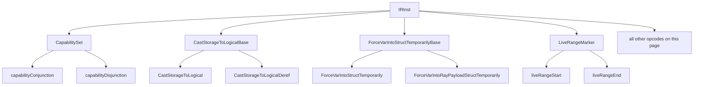

# Miscellaneous

This page is the catch-all reference for Slang IR opcodes that do not
naturally belong to any sibling `ir-reference/` family page:
variadic-generic value-pack helpers, type-introspection predicates,
compile-time size/align/count queries, storage-type and descriptor-heap
casts, generic annotation infrastructure, liveness markers, string
hashing, work-graph record access and barrier-flag conversion, the
compiler-internal memoization dictionary, and CPU-side kernel launches.

The intended reader is a compiler engineer who needs to look up one of
these opcodes and could not find it in [types.md](types.md),
[values.md](values.md), [control-flow.md](control-flow.md),
[structure.md](structure.md),
[generics-and-existentials.md](generics-and-existentials.md),
[resources-and-atomics.md](resources-and-atomics.md),
[differentiation.md](differentiation.md),
[decorations.md](decorations.md), or [metadata.md](metadata.md).

## Source

These opcodes are scattered throughout
[slang-ir-insts.lua](../../../../source/slang/slang-ir-insts.lua) rather
than living in one named group. The infrastructure they rely on
(`IRInst`, the op-flag bitfield, `IRBuilder`) is in
[slang-ir.h](../../../../source/slang/slang-ir.h) and
[slang-ir.cpp](../../../../source/slang/slang-ir.cpp). Lowering in
[slang-lower-to-ir.cpp](../../../../source/slang/slang-lower-to-ir.cpp)
produces most of them, either from a dedicated `visit*` (for example
`visitIsTypeExpr` at line 7420, `visitPackQueryExpr` at 6052,
`visitShapePackTransformExpr` at 6074, `visitDispatchKernelExpr` at
5972, `visitRequireCapabilityStmt` at 9629) or from a call to a
core-module function declared with `__intrinsic_op($(kIROp_...))`. The
remainder are introduced by IR passes, and the `AST origin` column names
the specific pass for each rather than using the retired catch-all
`(synthesized)`; the handful of opcodes nothing in `source/` constructs
are marked **no producer at HEAD**.

A note on the **C++ wrapper** column: every opcode on this page has an
`IRFoo` wrapper, so no row needs an em-dash. Fiddle generates the
wrapper for each opcode whose struct is not already written by hand in
[slang-ir-insts.h](../../../../source/slang/slang-ir-insts.h), and when
the Lua entry sets no explicit `struct_name` the generated name is the
entry name in PascalCase with an `IR` prefix (`getStringHash` yields
`IRGetStringHash`); where a `struct_name` is set it wins, so
`allocTorchTensor` yields `IRAllocateTorchTensor`. See
[../cross-cutting/ir-instructions.md](../cross-cutting/ir-instructions.md).
Named operand accessors are generated from the Lua operand list too, so
they exist whether or not the struct is hand-written: `IRIsType` is
declared by hand with an empty body, and `getValue()` /
`getValueWitness()` / `getTypeOperand()` / `getTargetWitness()` are
generated into it from its four Lua operand names.

A dozen of these wrappers are nevertheless spelled out by hand in
[slang-ir-insts.h](../../../../source/slang/slang-ir-insts.h), and each
of those twelve rows carries a trailing `‡` in the **C++ wrapper**
column below: `IRAnnotation` (line 740), `IRDispatchKernel` (749),
`IRTorchTensorGetView` (761), `IRDifferentiableTypeDictionaryItem`
(770), `IRAlignOf` (1788), `IRExpand` (2378), `IREach` (2388),
`IRLiveRangeStart` / `IRLiveRangeEnd` (2629, 2649), `IRIsType` (2635),
and `IRCompilerDictionaryValue` / `IRCompilerDictionaryEntry`
(3084, 3090). Their abstract parents `IRLiveRangeMarker` (2609) and
`IRCastStorageToLogicalBase` (2701) are hand-written too, but appear
only in `## Family hierarchy`, never as a table row.
Some are hand-written to add behavior the operand list cannot express —
`IRExpand::getBlocks()` reaches the inst's children,
`IRDispatchKernel::getArgsList()` slices off the three leading operands,
`IRCompilerDictionaryEntry::getValue()` walks children and skips
poisoned cache rows. Others (`IRAlignOf`, `IRIsType`,
`IRCompilerDictionaryValue`) have an empty body and exist only to define
the type that fiddle forward-declares and injects accessors into.

Because this is the catch-all page, its opcodes arrive from unusually
many places. Besides the IR core it rests on the core-module sources
declaring the `__intrinsic_op` entry points
([core.meta.slang](../../../../source/slang/core.meta.slang),
[hlsl.meta.slang](../../../../source/slang/hlsl.meta.slang),
[diff.meta.slang](../../../../source/slang/diff.meta.slang),
[workgraph.slang](../../../../source/standard-modules/experimental/workgraph.slang)),
and the emitters
[slang-emit-hlsl.cpp](../../../../source/slang/slang-emit-hlsl.cpp),
[slang-emit-hlsl-prelude.cpp](../../../../source/slang/slang-emit-hlsl-prelude.cpp),
and
[slang-emit-torch.cpp](../../../../source/slang/slang-emit-torch.cpp).

One residual gap is deliberate. The `slang-ir-*.cpp` passes cited per
opcode below are *not* watched, because that glob changes on nearly
every IR commit and would leave this page permanently stale, which
would make the staleness signal useless rather than useful. The
practical consequence is that a pass newly constructing an opcode this
page currently records as having **no producer at HEAD** will not mark
the page stale, so treat those particular claims as the ones most
worth re-verifying.

## Family hierarchy

Only four of the opcodes on this page are Lua grouping parents, so the
hierarchy is shallow; everything else is a direct child of `IRInst`.

The `CompilerDictionary` chain looks like a hierarchy but is run-time
containment rather than Lua nesting: a dictionary parents its scope and
an entry parents its value, while an entry reaches its scope through a
key *operand*.

## Opcodes

### System opcodes

| Opcode | C++ wrapper | Operands | Flags | AST origin | Summary |
| --- | --- | --- | --- | --- | --- |
| `nop` | `IRNop` | — | | **no producer at HEAD** | No-op placeholder; `kIROp_Nop` occurs in `source/` only as a sentinel in op-mapping tables and comparisons, never as a constructed instruction. |
| `Unrecognized` | `IRUnrecognized` | — | | IR deserialization ([slang-serialize-ir.cpp](../../../../source/slang/slang-serialize-ir.cpp)) | Placeholder substituted when a serialized module names a stable opcode name this build does not define; should not appear except immediately after deserialization. |

### Capability sets

Concrete children of the top-level `CapabilitySet` group, built by
`IRBuilder::getCapabilityValue` (`slang-ir.cpp` line 2669) to encode a
*compacted* capability set — the minimal atom list that
re-expands to the same set — in disjunction-of-conjunctions form. One
`capabilityConjunction` is built per atom set, and a lone conjunction is
returned directly with no `capabilityDisjunction` wrapper; both produce
a `CapabilitySetType` value. This group is distinct from the
`CapabilitySet` *type* opcode in [types.md](types.md).

| Opcode | C++ wrapper | Operands | Flags | AST origin | Summary |
| --- | --- | --- | --- | --- | --- |
| `capabilityConjunction` | `IRCapabilityConjunction` | (variadic) | H | `RequireCapabilityStmt` via `visitRequireCapabilityStmt` ([slang-lower-to-ir.cpp](../../../../source/slang/slang-lower-to-ir.cpp) line 9629), which calls `IRBuilder::getCapabilityValue` (`slang-ir.cpp` line 2669) | An AND of capability atoms, each operand an `int` capability-atom value. |
| `capabilityDisjunction` | `IRCapabilityDisjunction` | (variadic) | H | `IRBuilder::getCapabilityValue` (`slang-ir.cpp` line 2705), reached from `visitRequireCapabilityStmt` | An OR of `capabilityConjunction` operands; the outer level of the normal form. |

### Tensor and runtime helpers

These wrap host-side runtime constructs (Torch tensors, the CUDA
stream, the array-list builder) plus the opaque-handle allocator.
Except for `makeTensorView` and `TorchGetCudaStream`, which the PyTorch
host-binding pass
([slang-ir-pytorch-cpp-binding.cpp](../../../../source/slang/slang-ir-pytorch-cpp-binding.cpp))
introduces, and `makeArrayList`, which nothing produces at HEAD, each
comes from lowering a call to a core-module declaration carrying
`__intrinsic_op($(kIROp_...))`.

| Opcode | C++ wrapper | Operands | Flags | AST origin | Summary |
| --- | --- | --- | --- | --- | --- |
| `makeArrayList` | `IRMakeArrayList` | (variadic) | | **no producer at HEAD** | Builds an array-list value; `IRBuilder::emitMakeArrayList` is the only producer and has no callers at HEAD. |
| `makeTensorView` | `IRMakeTensorView` | — | | The PyTorch binding pass ([slang-ir-pytorch-cpp-binding.cpp](../../../../source/slang/slang-ir-pytorch-cpp-binding.cpp) lines 472 and 595) | Wraps a Torch tensor as a `TensorView`; the Lua entry names no operand, and `emitMakeTensorView` passes exactly one, the tensor. |
| `allocTorchTensor` | `IRAllocateTorchTensor` | (variadic) | | core-module `TorchTensor<T>::alloc` / `emptyLike` | Allocates a Torch tensor host-side; operands are the extents (or the tensor to imitate). |
| `TorchGetCudaStream` | `IRTorchGetCudaStream` | — | | `generateCppBindingForFunc` in the PyTorch binding pass ([slang-ir-pytorch-cpp-binding.cpp](../../../../source/slang/slang-ir-pytorch-cpp-binding.cpp) line 465) | Returns the current Torch CUDA stream, typed `Ptr<void>`. |
| `TorchTensorGetView` | `IRTorchTensorGetView`‡ | (variadic) | | core-module `TorchTensor<T>::getView`, `TensorView<T>` converting `__init` | Produces a `TensorView` over the Torch tensor in its single operand. |
| `allocateOpaqueHandle` | `IRAllocateOpaqueHandle` | — | | core-module `RayQuery::__init` / `HitObject::__init` | Materializes a fresh opaque handle for a type with no constructor expression. |

### Pack and expansion

These implement the mechanics behind Slang's variadic-generic value
packs: the `MakeWitnessPack` constructor — its value-pack counterpart
`makeValuePack` is owned by [values.md](values.md) — and the
`Expand` / `Each` projection pair are the two sides of pack
manipulation, while the `ExtractFirst` / `ExtractLast` / `Trim*` /
`Shape*` helpers manipulate pack shapes for tensor-style indexing.
Almost all come from AST lowering: the `Val` visitors in
`slang-lower-to-ir.cpp` lines 2042-2380 lower the `*IntVal` / `*Type` /
`*SubtypeWitness` forms, and `visitPackQueryExpr` (line 6052) and
`visitShapePackTransformExpr` (line 6074) lower the surface syntax.

| Opcode | C++ wrapper | Operands | Flags | AST origin | Summary |
| --- | --- | --- | --- | --- | --- |
| `Expand` | `IRExpand`‡ | `value` | | `ExpandExpr`, `ExpandType`, `ExpandIntValPack` | Expands a pattern over its captured-pack operands; the Lua entry names one operand while the builder supplies a variadic capture list (see the callout below), and the pattern body lives in child blocks. |
| `Each` | `IREach`‡ | `value` | H | `EachType`, `EachIntVal`, per-element witness (line 2318) | Projects one slot of a pack; only these `Val`-level forms produce it, never an `each` written in a value position (see the callout below). |
| `MakeWitnessPack` | `IRMakeWitnessPack` | (variadic) | H | `TypePackSubtypeWitness` | Bundles witness tables into one witness-pack value typed as the matching `TypePack`. |
| `PackBranch` | `IRPackBranch` | `pack, emptyValue, nonEmptyValue` | H | `PackBranchType` (line 2226), `PackBranchSubtypeWitness` (2363) | Selects between two values by whether the pack is statically empty, so no run-time length test survives. |
| `ExtractFirstFromPack` | `IRExtractFirstFromPack` | `pack, witness` | H | `FirstExpr`, `FirstIntVal` | Returns the first slot of a non-empty pack. |
| `ExtractLastFromPack` | `IRExtractLastFromPack` | `pack, witness` | H | `LastExpr`, `LastIntVal` | Returns the last slot of a non-empty pack. |
| `TrimFirstOfPack` | `IRTrimFirstOfPack` | `pack, witness` | H | `TrimFirstExpr`, `TrimFirstIntValPack`, `TrimFirstTypePack`, `TrimFirstSubtypeWitness` | Returns a pack with the first slot removed. |
| `TrimLastOfPack` | `IRTrimLastOfPack` | `pack, witness` | H | `TrimLastExpr`, `TrimLastIntValPack`, `TrimLastTypePack`, `TrimLastSubtypeWitness` | Returns a pack with the last slot removed. |
| `ShapeConcat` | `IRShapeConcat` | `leftPack, rightPack, axis` | H | `ShapeConcatExpr`, `ShapeConcatIntValPack` | Concatenates two pack shapes along an axis. |
| `ShapePermute` | `IRShapePermute` | `pack, order` | H | `ShapePermuteExpr`, `ShapePermuteIntValPack` | Permutes a pack shape's dimensions; operand 1 is the order pack. |
| `ShapeSwap` | `IRShapeSwap` | `pack, dim0, dim1` | H | `ShapeSwapExpr`, `ShapeSwapIntValPack` | Swaps two dimensions of a pack shape. |
| `ShapeReduce` | `IRShapeReduce` | `pack, axis` | H | `ShapeReduceExpr`, `ShapeReduceIntValPack` | Drops one axis from a pack shape. |
| `NonEmptyPackWitness` | `IRNonEmptyPackWitness` | `pack` | H | Pack lowering via `emitNonEmptyPackWitness` ([slang-lower-to-ir.cpp](../../../../source/slang/slang-lower-to-ir.cpp) line 2056) | Witness that a pack is non-empty; `emitNonEmptyPackWitness` (line 2056) builds one per pack query above. |

### Type queries and predicates

Compile-time inspection of an IR value's type. Apart from `IsType`,
these come from generic `__intrinsic_op` declarations in
[core.meta.slang](../../../../source/slang/core.meta.slang) (lines
3882-3986): each `__isX_impl<T>(T t)` intrinsic is wrapped by an
`[__unsafeForceInlineEarly]` `__isX<T>()` helper passing
`__declVal<T>()`, so the emitted inst carries the queried type in its
operand's type, and `slang-ir-peephole.cpp` (lines 1870-1948) folds it
to a boolean constant once that type is concrete. That fold first
unwraps a vector or matrix operand type to its element type (lines
1879-1882 and 1923-1926) and only then applies the predicate, so at
this commit the scalar predicates below answer for the element type of
a vector or matrix, and `IsVector` folds to `false` for every concrete
type because the value it tests has already been replaced by the
element type.

| Opcode | C++ wrapper | Operands | Flags | AST origin | Summary |
| --- | --- | --- | --- | --- | --- |
| `IsType` | `IRIsType`‡ | `value, valueWitness, typeOperand, targetWitness?` | | `IsTypeExpr` (the `is` operator), line 7420 | Tests whether a value's runtime type is (or conforms to) a target type. |
| `TypeEquals` | `IRTypeEquals` | `type1, type2` | | core-module `__type_equals_impl` | Boolean test of type equality. |
| `IsInt` | `IRIsInt` | `value` | | core-module `__isInt_impl` | True for an integer, or for a vector/matrix of integers. |
| `IsBool` | `IRIsBool` | `value` | | core-module `__isBool_impl` | True for `bool`, or for a vector/matrix of `bool`. |
| `IsFloat` | `IRIsFloat` | `value` | | core-module `__isFloat_impl` | True for a floating-point type, or for a vector/matrix of them. |
| `IsCoopFloat` | `IRIsCoopFloat` | `value` | | core-module `__isCoopFloat_impl` | True for a floating-point or packed float type (`fp8`, `bf16`), or for a vector/matrix of them. |
| `IsHalf` | `IRIsHalf` | `value` | | core-module `__isHalf_impl` | True for `half`, or for a vector/matrix of `half`. |
| `IsUnsignedInt` | `IRIsUnsignedInt` | `value` | | core-module `__isUnsignedInt_impl` | True for an unsigned integer, or for a vector/matrix of them. |
| `IsSignedInt` | `IRIsSignedInt` | `value` | | core-module `__isSignedInt_impl` | True for a signed integer, or for a vector/matrix of them. |
| `IsVector` | `IRIsVector` | `value` | | core-module `__isVector_impl` | Folds to `false` for every concrete type at this commit, because the fold unwraps a vector to its element type before testing. |

### Size, alignment, count

Compile-time queries on a type or array. `visitSizeOfLikeExpr`
(`slang-lower-to-ir.cpp` line 5997) handles all three
`SizeOfLikeExpr` subclasses and emits an
inst only when the AST-side natural-layout computation cannot already
produce a constant; otherwise it folds to an integer literal during
lowering.

The `dataLayout` operand is optional in the Lua entry but not in the
dump: when the surface call names only a type, the checker fills the
operand in with `ScalarDataLayout`
([slang-check-expr.cpp](../../../../source/slang/slang-check-expr.cpp)
line 6652), so `sizeof(T)` on a still-generic `T` prints as
`sizeOf(%T, ScalarLayout)` — and the same choice is what lets the
natural-layout fold above apply to the one-argument form, since the
test at the top of `visitSizeOfLikeExpr` treats a null layout and
`ScalarDataLayoutType` alike. The two-argument `sizeof(T, L)` form
takes any implementation of `IBufferDataLayout`:
`DefaultDataLayout`, `DefaultPushConstantDataLayout`,
`Std140DataLayout`, `Std430DataLayout`, `ScalarDataLayout`, and
`CDataLayout`
([hlsl.meta.slang](../../../../source/slang/hlsl.meta.slang) lines
28-71, several of them `[require]`-gated). Each is `__intrinsic_type`d
to the matching layout *type* opcode, so `sizeof(T, Std140DataLayout)`
prints as `sizeOf(%T, Std140Layout)`.

| Opcode | C++ wrapper | Operands | Flags | AST origin | Summary |
| --- | --- | --- | --- | --- | --- |
| `sizeOf` | `IRSizeOf` | `type, dataLayout?` | H | `SizeOfExpr` | Compile-time byte size of the operand type under the given data layout. |
| `alignOf` | `IRAlignOf`‡ | `baseOp, dataLayout?` | H | `AlignOfExpr` | Compile-time alignment of the operand type under the given data layout. |
| `countOf` | `IRCountOf` | `type` | | `CountOfExpr`, `CountOfIntVal` | Element count of a fixed-size array, vector, or type pack; for a value pack the operand is the pack value. |
| `GetArrayLength` | `IRGetArrayLength` | `array` | | core-module `Array<T>::getCount` | Length of an array. The `GetArrayLengthExpr` AST node does *not* produce it — `visitGetArrayLengthExpr` (line 5989) returns the `IRArrayType` count directly. |

### Storage-type legalization casts

Introduced by the
[slang-ir-lower-buffer-element-type.cpp](../../../../source/slang/slang-ir-lower-buffer-element-type.cpp)
pass to convert between user-declared types and the storage-layout types
buffer locations require on each target, together with the casts that
wrap and unwrap a descriptor-heap index. `CastStorageToLogicalBase` is
the grouping parent of the first two rows; see the callout below for what
distinguishes them and for the accessors on
`IRCastStorageToLogicalBase`.

The four *descriptor-handle* conversions — `CastUInt64ToDescriptorHandle`,
`CastDescriptorHandleToUInt64`, `CastDescriptorHandleToResource`, and
`CastResourceToDescriptorHandle` — are **not** listed here. They are
ordinary conversions and [values.md](values.md#conversions) owns them;
this page covers only the opcodes no sibling page claims. The four
`Cast*Untyped{Resource,Sampler}Handle*` rows below are a different
mechanism (the untyped `ResourceDescriptorHeap` / `SamplerDescriptorHeap`
subscript) and are documented here.

| Opcode | C++ wrapper | Operands | Flags | AST origin | Summary |
| --- | --- | --- | --- | --- | --- |
| `CastStorageToLogical` | `IRCastStorageToLogical` | (variadic, `min=2`) | | The buffer-element-type lowering pass ([slang-ir-lower-buffer-element-type.cpp](../../../../source/slang/slang-ir-lower-buffer-element-type.cpp), e.g. line 1091) | Retypes a `Ptr<StorageType>` as a `Ptr<LogicalType>` at a buffer boundary. |
| `CastStorageToLogicalDeref` | `IRCastStorageToLogicalDeref` | (variadic, `min=2`) | | The buffer-element-type lowering pass ([slang-ir-lower-buffer-element-type.cpp](../../../../source/slang/slang-ir-lower-buffer-element-type.cpp) lines 1470 and 1712) | The same conversion fused with a load: equivalent to `load(CastStorageToLogical(addr))`. |
| `MakeStorageTypeLoweringConfig` | `IRMakeStorageTypeLoweringConfig` | `addressSpace, layoutRule, lowerToPhysicalType` | H | `emitTypeLoweringConfigToIR` in the buffer-element-type lowering pass ([slang-ir-lower-buffer-element-type.cpp](../../../../source/slang/slang-ir-lower-buffer-element-type.cpp) line 1174) | The lowering policy the two casts above take; hoistable, so identical policies dedupe. |
| `CastUIntToUntypedResourceHandle` | `IRCastUIntToUntypedResourceHandle` | `index` | | core-module `UntypedResourceHandle::__init(uint)` | Wraps a `uint` heap index as an untyped resource handle; from `ResourceDescriptorHeap[i]`. |
| `CastUntypedResourceHandleToUInt` | `IRCastUntypedResourceHandleToUInt` | `handle` | | core-module `__getUntypedResourceHandleIndex` | Recovers the `uint` index in an untyped resource handle. |
| `CastUIntToUntypedSamplerHandle` | `IRCastUIntToUntypedSamplerHandle` | `index` | | core-module `UntypedSamplerHandle::__init(uint)` | Wraps a `uint` heap index as an untyped sampler handle; from `SamplerDescriptorHeap[j]`. |
| `CastUntypedSamplerHandleToUInt` | `IRCastUntypedSamplerHandleToUInt` | `handle` | | core-module `__getUntypedSamplerHandleIndex` | Recovers the `uint` index in an untyped sampler handle. |
| `TreatAsDynamicUniform` | `IRTreatAsDynamicUniform` | `value` | | core-module `asDynamicUniform<T>` | Marks a value dynamically uniform; read by `slang-ir-uniformity.cpp`. |
| `GetLegalizedSPIRVGlobalParamAddr` | `IRGetLegalizedSPIRVGlobalParamAddr` | (variadic, `min=1`) | | core-module `__getLegalizedSPIRVGlobalParamAddr` | Legalized address of the global parameter in its single operand, for SPIR-V. |

### Variable struct-wrapping legalization

Concrete children of the `ForceVarIntoStructTemporarilyBase` parent,
wrapping a variable so a callee expecting a struct receives one. The
`slang-ir-hlsl-legalize.cpp` pass either unwraps the argument, when its
base type is already a `StructType`, or materializes a temporary
single-field struct and copies the value back for `out`/`inout`
parameters.

Both opcodes come from core-module helpers written for the core
module's own use:
`Ref<T> __forceVarIntoStructTemporarily(inout T maybeStruct)` and
`Ref<T> __forceVarIntoRayPayloadStructTemporarily(inout T maybeStruct)`
([hlsl.meta.slang](../../../../source/slang/hlsl.meta.slang) lines
19654-19663). Every call site is the payload argument of an HLSL
ray-tracing intrinsic — `__traceRayHLSL` (line 19749) and the
`HitObject` trace / invoke wrappers (22802, 23739, 23815) — and that
argument position is also the only one the legalizer rewrites, since
it walks the arguments of each `Call`
(`slang-ir-hlsl-legalize.cpp` line 150). A wrapper reached any other
way is left in place and survives to emit.

| Opcode | C++ wrapper | Operands | Flags | AST origin | Summary |
| --- | --- | --- | --- | --- | --- |
| `ForceVarIntoStructTemporarily` | `IRForceVarIntoStructTemporarily` | `var` | | core-module `__forceVarIntoStructTemporarily` | Forces a variable to be passed as a struct temporary. |
| `ForceVarIntoRayPayloadStructTemporarily` | `IRForceVarIntoRayPayloadStructTemporarily` | `var` | | core-module `__forceVarIntoRayPayloadStructTemporarily` | As above, also giving the wrapper struct the `RayPayload` decoration and default payload access qualifiers. |

### Annotations

Opcodes IR passes use to attach information to other instructions
without modifying them. Most are introduced by the differentiation
passes (see [differentiation.md](differentiation.md)), but the mechanism
is general.

| Opcode | C++ wrapper | Operands | Flags | AST origin | Summary |
| --- | --- | --- | --- | --- | --- |
| `Annotation` | `IRAnnotation`‡ | (variadic, `min=2`) | H | decl lowering for a decl's associated value ([slang-lower-to-ir.cpp](../../../../source/slang/slang-lower-to-ir.cpp) line 4941), plus the forward-mode autodiff pass for the `DifferentialType` / `DifferentialZero` / `DifferentialAdd` / `DifferentialPairType` annotations ([slang-ir-autodiff-fwd.cpp](../../../../source/slang/slang-ir-autodiff-fwd.cpp) lines 34-51) | Generic annotation; `addAnnotation` builds target, `AnnotationKind` as a `uint` literal, and value. |
| `WitnessTableAnnotation` | `IRWitnessTableAnnotation` | (variadic, `min=2`) | H | **no producer at HEAD** | Attaches a witness table to another inst; marked TODO in the Lua file. Nothing in `source/` constructs it — the opcode appears only in the Lua definition and the stable-name table. |
| `DifferentiableTypeAnnotation` | `IRDifferentiableTypeAnnotation` | `baseType, witness` | H | **no producer at HEAD** | Would annotate a type with an `IDifferentiable` witness for run-time differentiable types, but nothing constructs it. |
| `DifferentiableTypeDictionaryItem` | `IRDifferentiableTypeDictionaryItem`‡ | `concreteType, witness` | | **no producer at HEAD**; its builders `IRBuilder::addDifferentiableTypeDictionaryDecoration` and `addDifferentiableTypeEntry` ([slang-ir.cpp](../../../../source/slang/slang-ir.cpp) lines 5187 and 5192) have no callers anywhere, and the only other reference is a validator case in [slang-ir-validate.cpp](../../../../source/slang/slang-ir-validate.cpp) line 280 | One entry in autodiff's differentiable-type dictionary. |

### Liveness markers

Introduced by the liveness pass to bracket a value's live range, so
later passes (autodiff rematerialization, register-allocation hints) can
reason about lifetimes. Both concrete children of the `LiveRangeMarker`
grouping parent carry the marked value in operand 0, read through
`IRLiveRangeMarker::getReferenced()`. Note that `liveRangeStart` declares
`min_operands = 2` in the Lua file while `IRBuilder::emitLiveRangeStart`
(`slang-ir.cpp` line 3682) constructs the inst with that one operand;
the builder shape is the one actually produced.

| Opcode | C++ wrapper | Operands | Flags | AST origin | Summary |
| --- | --- | --- | --- | --- | --- |
| `liveRangeStart` | `IRLiveRangeStart`‡ | (variadic, `min=2`) | | The liveness pass ([slang-ir-liveness.cpp](../../../../source/slang/slang-ir-liveness.cpp) line 1663) and phi elimination ([slang-ir-eliminate-phis.cpp](../../../../source/slang/slang-ir-eliminate-phis.cpp) line 1029) | Marks the beginning of a value's live range. |
| `liveRangeEnd` | `IRLiveRangeEnd`‡ | `referenced` | | The liveness pass ([slang-ir-liveness.cpp](../../../../source/slang/slang-ir-liveness.cpp) lines 632 and 643) | Marks the end of a value's live range; there may be several ends per start. |

### String hashing

| Opcode | C++ wrapper | Operands | Flags | AST origin | Summary |
| --- | --- | --- | --- | --- | --- |
| `getStringHash` | `IRGetStringHash` | `stringLit: IRStringLit` | | core-module `getStringHash(String)` | Stable compile-time hash of a string literal. |

### Kernel launch

CPU-side launch opcodes produced by the host-shader / CUDA backends.

| Opcode | C++ wrapper | Operands | Flags | AST origin | Summary |
| --- | --- | --- | --- | --- | --- |
| `DispatchKernel` | `IRDispatchKernel`‡ | `baseFn, threadGroupSize, dispatchSize` | | `DispatchKernelExpr` via `visitDispatchKernelExpr` ([slang-lower-to-ir.cpp](../../../../source/slang/slang-lower-to-ir.cpp) line 5972); also the PyTorch binding pass ([slang-ir-pytorch-cpp-binding.cpp](../../../../source/slang/slang-ir-pytorch-cpp-binding.cpp) lines 1064 and 1217) | Host-side kernel dispatch; the Lua entry names only the first three, and `IRDispatchKernel::getArgsList()` slices the trailing call arguments off. |
| `CudaKernelLaunch` | `IRCudaKernelLaunch` | `kernel, gridDimX, gridDimY, gridDimZ, blockDimX, blockDimY` | | PyTorch binding pass: `IRBuilder::emitCudaKernelLaunch` ([slang-ir.cpp](../../../../source/slang/slang-ir.cpp) line 3778) called from [slang-ir-pytorch-cpp-binding.cpp](../../../../source/slang/slang-ir-pytorch-cpp-binding.cpp) line 460, consumed in [slang-emit-torch.cpp](../../../../source/slang/slang-emit-torch.cpp) line 71 | CUDA kernel launch consumed by the Torch emitter; see the callout for the builder-vs-Lua operand discrepancy. |

### Work-graph records and barrier flags

Work-graph support (Shader Model 6.8 node shaders) is declared in
[workgraph.slang](../../../../source/standard-modules/experimental/workgraph.slang).
Its ten *record types* belong to the `WorkGraphRecordTypeBase` group and
are documented in [types.md](types.md); the three opcodes below are the
value-level operations, all HLSL-only.

| Opcode | C++ wrapper | Operands | Flags | AST origin | Summary |
| --- | --- | --- | --- | --- | --- |
| `nodeOutputRecordGetElementPtr` | `IRNodeOutputRecordGetElementPtr` | `base, index` | | `__subscript` `ref` accessor on `ThreadNodeOutputRecords` / `GroupNodeOutputRecords` (workgraph.slang lines 141, 174) | Addresses one output record as an l-value; emitted as `base.Get(index)`. |
| `getEnumBarrierMemoryTypeFlags` | `IRGetEnumBarrierMemoryTypeFlags` | `flags` | H | core-module `GetEnumBarrierMemoryTypeFlags` | Turns a compile-time `BarrierMemoryTypeFlags` value into the HLSL named-constant expression for those bits. |
| `getEnumBarrierSemanticFlags` | `IRGetEnumBarrierSemanticFlags` | `flags` | H | core-module `GetEnumBarrierSemanticFlags` | Turns a compile-time `BarrierSemanticFlags` value into the HLSL named-constant expression for those bits. |

### Compiler dictionary and late capability requirements

The `CompilerDictionary` family is a compiler-internal memoization table
materialized *in the IR*, so cache keys are ordinary insts and benefit
from hoistable deduplication. The dictionary is created and torn down by
[slang-ir-translate.cpp](../../../../source/slang/slang-ir-translate.cpp)
and reached through `IRModule::getTranslationDict()`
([slang-ir.h](../../../../source/slang/slang-ir.h) line 2242); the
`IRBuilder` entry points are `fetchCompilerDictionaryEntry`,
`addCompilerDictionaryEntry`, `setCompilerDictionaryEntryValue`, and
`tryLookupCompilerDictionaryValue` (`slang-ir-insts.h` lines
3603-3616). `LateRequireCapability` is unrelated but shares the
after-everything-else timing; its checker lives in
[slang-ir-late-require-capability.cpp](../../../../source/slang/slang-ir-late-require-capability.cpp).

| Opcode | C++ wrapper | Operands | Flags | AST origin | Summary |
| --- | --- | --- | --- | --- | --- |
| `CompilerDictionary` | `IRCompilerDictionary` | — | P | `initializeTranslationDictionary` ([slang-ir-translate.cpp](../../../../source/slang/slang-ir-translate.cpp) line 16) | One memoization table; parents a single `CompilerDictionaryScope`. |
| `CompilerDictionaryScope` | `IRCompilerDictionaryScope` | — | P | `initializeTranslationDictionary` ([slang-ir-translate.cpp](../../../../source/slang/slang-ir-translate.cpp) line 27) | Scopes a dictionary's entries so entries of different scopes cannot alias after hoisting. |
| `CompilerDictionaryEntry` | `IRCompilerDictionaryEntry`‡ | (variadic) | HP | `IRBuilder::_getCompilerDictionaryEntry` (`slang-ir.cpp` line 3371), reached from `fetchCompilerDictionaryEntry` and `addCompilerDictionaryEntry` | One cache row whose operands are the key: scope, the memoized inst's opcode as an integer, then its operands. |
| `CompilerDictionaryValue` | `IRCompilerDictionaryValue`‡ | `value` | | `IRBuilder::setCompilerDictionaryEntryValue` and `addCompilerDictionaryEntry` (`slang-ir.cpp` lines 3436 and 3461) | Child of an entry holding the cached result *weakly*; DCE may rewrite it to `Poison`, which `IRCompilerDictionaryEntry::getValue()` skips. |
| `LateRequireCapability` | `IRLateRequireCapability` | `capabilitySet: IRCapabilitySet` | | `RequireCapabilityStmt` (line 9629) | Capability requirement checked after linking, specialization, and DCE by `processLateRequireCapabilityInsts`. |

### Coverage gaps against sibling pages

Every concrete Lua entry no other `ir-reference/` page claims is listed
above. One ownership note remains, so this page is not mistaken for
complete coverage:
`nodeOutputRecordGetElementPtr` sits in the Lua file beside
`meshOutputRef`, which
[resources-and-atomics.md](resources-and-atomics.md) owns, but no
sibling page claims the record accessor itself, so it stays here;
`getNaturalAlignment` and `makeValuePack` are deliberately absent from
the tables above because
[resources-and-atomics.md](resources-and-atomics.md) and
[values.md](values.md) already own them.

## Notable opcodes

### `Expand` and `Each`

`Expand` is not the one-operand projection its Lua entry
(`operands = { { "value" } }`) suggests: `IRBuilder::emitExpandInst`
(`slang-ir.cpp` line 3963) builds it with a *variadic* list of captured
packs, and `IRExpand` (`slang-ir-insts.h` line 2378) exposes
`getCaptureCount()` / `getCapture(i)` for those operands plus
`getBlocks()` for the pattern body it owns as children, so an
`Expand` is closer to a small nested region than to an ordinary value
inst. `Each` is the dual, projecting one slot out of a captured pack
(read through `IREach::getElement()`); `IRBuilder::emitEachInst` takes
an optional explicit index as a second operand and passes one operand
when that index is null. Both come out of lowering and are consumed by
[slang-ir-lower-expand-type.cpp](../../../../source/slang/slang-ir-lower-expand-type.cpp),
which re-emits the pattern once per slot once the pack length is known.

`Each` is that dual at the `Val` level only. Its three producers are
`visitEachIntVal` (`slang-lower-to-ir.cpp` line 2198), `visitEachType`
(2206), and `visitEachSubtypeWitness` (2316); an `each` written in a
*value* position reaches none of them. `visitExpandExpr` (line 6571)
gives the `Expand` region's block an `int` parameter and records it as
the current expansion index, and `visitEachExpr` (line 6560) then
projects the captured pack with `getTupleElement(pack, index)` against
that parameter — which is the form a dump of an expansion body shows.

### `PackBranch`

`PackBranch` is a *static* conditional on whether its `pack` operand is
empty: the value is `emptyValue` when the pack length is statically zero
and `nonEmptyValue` otherwise. Lowering emits it from two different
places with two different result types, both through
`IRBuilder::emitPackBranchInst` (`slang-ir.cpp` line 3983) and both with
exactly three operands: `visitPackBranchType`
([slang-lower-to-ir.cpp](../../../../source/slang/slang-lower-to-ir.cpp)
line 2226) types the inst as `TypeKind`, so the *type* differs between
the two cases, while `visitPackBranchSubtypeWitness` (line 2363) types it
as a `WitnessTableType`, so the *conformance witness* differs. The
`pack` operand may itself be a type pack or a value pack.

`maybeSpecializePackBranch`
([slang-ir-specialize.cpp](../../../../source/slang/slang-ir-specialize.cpp)
line 990) resolves the branch by asking `getPackBranchCardinality` (line
946) about operand 0: an `Empty` verdict replaces the inst with operand
1, `NonEmpty` with operand 2, and `Unknown` — a pack that still contains
a generic parameter or an unexpanded pack — leaves the inst alone for a
later round of the fixpoint. This is what lets a generic behave
differently for the zero-element pack without any code ever testing a
pack length at run time.

### `MakeWitnessPack`

The witness-table analogue of `makeValuePack`, built by the inline
`IRBuilder::emitMakeWitnessPack`
([slang-ir-insts.h](../../../../source/slang/slang-ir-insts.h) line
3900) from a variadic list of witness operands. The one thing worth
knowing is its result type: `visitTypePackSubtypeWitness`
([slang-lower-to-ir.cpp](../../../../source/slang/slang-lower-to-ir.cpp)
line 2269) lowers each element witness, collects each lowered witness's
own `getFullType()`, and types the pack as a `TypePack` of those witness
table types — so a witness pack is a pack *of* witness tables, not a
witness table over a pack.

Downstream code treats it as a pack constructor alongside `makeValuePack`
and `MakeTuple`: `emitGetTupleElement` (`slang-ir.cpp` line 4760) folds
an in-range element access straight to the corresponding operand, and
peephole does the same for `ExtractFirstFromPack` / `ExtractLastFromPack`
and rebuilds a narrower pack for the `Trim*` forms through
`buildSlicedPack(base, kIROp_TypePack, kIROp_MakeWitnessPack)`
([slang-ir-peephole.cpp](../../../../source/slang/slang-ir-peephole.cpp)
line 570). Witness packs are what keep a generic's parameter list compact
when several conformance witnesses must travel together.

### `IsType`

The IR encoding of the user-level `is` operator on existentials and
dynamic interfaces. `IRBuilder::emitIsType` (`slang-ir.cpp` line 5709)
always passes all four operands and types the result `bool`. `IRIsType`
([slang-ir-insts.h](../../../../source/slang/slang-ir-insts.h) line 2635)
is a good illustration of the wrapper-column note above: it is
hand-written, yet it declares no accessors of its own — `getValue()`,
`getValueWitness()`, `getTypeOperand()`, and `getTargetWitness()` are
generated from the Lua operand names and injected into it.

The reason the inst carries witnesses in addition to the type is that
the two consumers need different information. Peephole
([slang-ir-peephole.cpp](../../../../source/slang/slang-ir-peephole.cpp)
line 1186) folds the test to `true` when the value's data type already
equals `typeOperand`. Everything that survives is rewritten by
`lowerIsTypeInsts`
([slang-ir-lower-dynamic-dispatch-insts.cpp](../../../../source/slang/slang-ir-lower-dynamic-dispatch-insts.cpp)
line 1548) into an equality between `getSequentialID` of the value
witness and `getSequentialID` of the target witness — a witness
comparison, not a type comparison — and insts whose witness conforms to
a COM interface type are left for the COM path instead.

### Storage / logical casts

These two are *pseudo* instructions that exist only inside
[slang-ir-lower-buffer-element-type.cpp](../../../../source/slang/slang-ir-lower-buffer-element-type.cpp),
whose header comment (lines 119-127) gives their contract: for
`Ptr<StorageType> addr`, `CastStorageToLogical(addr)` has type
`Ptr<LogicalType>`, and `CastStorageToLogicalDeref(addr)` is equivalent
to `load(CastStorageToLogical(addr))`. The fused deref form is not a
convenience — it is what lets the pass push a conversion *past* a `load`.
Consider a buffer element that is loaded and then has a single field
extracted from it: rather than translating the whole struct from storage
layout to logical layout, the pass rewrites the `load` into a
`CastStorageToLogicalDeref`, then pushes that through the `fieldExtract`
so only the one member is translated (worked example at lines 128-152 of
the same file).

Both children take a `MakeStorageTypeLoweringConfig` operand pinning down
the address space, the layout rule, and whether the logical type should
be lowered to its physical form; `IRCastStorageToLogicalBase`
([slang-ir-insts.h](../../../../source/slang/slang-ir-insts.h) line 2701)
reads the two operands as `getVal()` and `getLayoutConfig()`. The
builders `emitCastStorageToLogical` (`slang-ir.cpp` line 6687) and
`emitCastStorageToLogicalDeref` (line 6698) short-circuit to the original
value, or to a plain `load`, when the storage and logical types already
agree.

Neither opcode reaches a backend: `materializeStorageToLogicalCasts`
(line 2153 of the same pass, called from line 1896) rewrites every
surviving cast into a call to a synthesized `unpackStorage` or
`packStorage` function, which is why no emitter has a case for them.

### `getStringHash`

There is no dedicated `Expr` node: the AST origin is a call to the
core-module `int getStringHash(String string)` declared with
`__intrinsic_op($(kIROp_GetStringHash))` in
[core.meta.slang](../../../../source/slang/core.meta.slang) line 3444,
and the Lua entry declares exactly one operand typed `IRStringLit`.
`checkGetStringHashInsts`
([slang-ir-string-hash.cpp](../../../../source/slang/slang-ir-string-hash.cpp))
enforces that restriction, reporting
`Diagnostics::GetStringHashMustBeOnStringLiteral` for an operand that
did not fold to a literal — which is what makes the result a stable
compile-time hash of the literal's bytes, so reflection and capability
code can key on a string by hash without carrying the bytes to the
backend.

### `CudaKernelLaunch`

Produced by `IRBuilder::emitCudaKernelLaunch` (`slang-ir.cpp` line
3778), whose only caller is the PyTorch host-binding pass
(`slang-ir-pytorch-cpp-binding.cpp` line 460) — the same pass that
supplies the stream operand from a `TorchGetCudaStream` inst. The Lua
entry names six operands (`kernel,
gridDimX, gridDimY, gridDimZ, blockDimX, blockDimY`, which the Operands
column follows), but the builder helper and the Torch emitter both use a
**five**-operand encoding: operand 0 is the function, operands 1-2 are
bit-cast to `dim3` grid and block dimensions, operand 3 is the packed
argument array, and operand 4 is the stream. The builder shape is the
one actually constructed and consumed, by
[slang-emit-torch.cpp](../../../../source/slang/slang-emit-torch.cpp);
no IR pass introspects it.

### `Annotation`

The useful shape of `Annotation` is not visible from the Lua entry's
bare `min_operands = 2`. `IRBuilder::addAnnotation` (`slang-ir.cpp` line
3484) always builds three operands, matching the accessors on the
hand-written `IRAnnotation` wrapper (`slang-ir-insts.h` line 740):
`getTarget()` is the annotated inst, `getConformanceID()` is an
`AnnotationKind` stored as a `uint` literal, and `getInst()` is the
annotation value. That middle operand lets one target carry several
unrelated annotations, and `tryLookupAnnotation(target, kind)` retrieves
one by that key rather than by operand position, through a module-level
cache that `addAnnotation` invalidates. Every `AnnotationKind`
(`slang-type-system-shared.h` line 216) is differentiability-related, and
a note on the enum records that `cloneAnnotations` in the IR linker relies
on that, skipping module-scope annotations entirely for a program that
does not use auto-diff. `DifferentiableTypeAnnotation` and
`WitnessTableAnnotation` are separate opcodes with fixed payload shapes
rather than `AnnotationKind` values of this one.

### `getEnumBarrierMemoryTypeFlags` and `getEnumBarrierSemanticFlags`

These two opcodes exist so that HLSL output for the work-graph
`Barrier()` intrinsic reads `Barrier(UAV_MEMORY, GROUP_SYNC)` rather
than `Barrier(1, 1)`: DXC maps named constants at parse time, so a
baked-in numeric value would break silently if that internal mapping
changed. What the IR carries is the folded numeric bitmask of the flag
set; the opcode is what defers the *name* choice to emit, where the
emitter maps each known bit back to its HLSL spelling.

The wiring has three parts. The C++ enums `BarrierMemoryTypeFlags`
and `BarrierSemanticFlags`
([slang-type-system-shared.h](../../../../source/slang/slang-type-system-shared.h)
lines 12 and 42) are mirrored as Slang `enum`s of the same names in
[workgraph.slang](../../../../source/standard-modules/experimental/workgraph.slang)
(lines 277 and 289) whose enumerator spellings are the HLSL names. The
numeric values are written out in both places by hand and must be kept
in sync manually, as the doc comments at `workgraph.slang` lines
275-276 and `slang-type-system-shared.h` lines 10-11 both say. The
`static_assert`s in the C++ header (lines 23-37 for the memory-type
flags, 52-61 for the semantic flags) pin only the C++ side: each one
compares a C++ enumerator against a literal in the same file, so
editing the Slang values alone does not trip them and the divergence
would show up as wrong HLSL output rather than a compile error. Beside
those enums, `GetEnumBarrierMemoryTypeFlags` and
`GetEnumBarrierSemanticFlags` (lines 300-307) are `internal` functions
declared with `__intrinsic_op(getEnumBarrierMemoryTypeFlags)` and
`__intrinsic_op(getEnumBarrierSemanticFlags)` — mnemonics matching the
Lua keys exactly — which `Barrier()` calls on its two `constexpr`
parameters.

At emit, `tryEmitInstExprImpl`
([slang-emit-hlsl.cpp](../../../../source/slang/slang-emit-hlsl.cpp)
lines 1177-1193) requires the operand to have folded to an `IRIntLit`
and hands the value to `emitNamedMemoryTypeFlagSet` or
`emitNamedSemanticFlagSet`, which are declared in
[slang-emit-hlsl.h](../../../../source/slang/slang-emit-hlsl.h) (lines 93
and 95) and defined in
[slang-emit-hlsl-prelude.cpp](../../../../source/slang/slang-emit-hlsl-prelude.cpp)
(lines 553 and 586). They special-case the whole-set values
`ALL_MEMORY` and `REORDER` and otherwise join one name per set bit with
`|`, taking each name from a bit-to-name mapping that release-asserts on
an unnamed bit or a value outside the known mask. Nothing on this path
derives a name from an operand index or an enumerator position.

### Untyped descriptor-heap handle casts

`CastUIntToUntypedResourceHandle`, `CastUntypedResourceHandleToUInt`,
`CastUIntToUntypedSamplerHandle`, and `CastUntypedSamplerHandleToUInt`
are an internal representation only. Indexing
`ResourceDescriptorHeap[i]` yields an `UntypedResourceHandle` whose
value *is* the wrapped `uint` heap index (the type is nullary — see the
`UntypedResourceHandle` type opcode in [types.md](types.md)), and the
concrete resource type is recovered later from the conversion target.
`lowerUntypedResourceHandleToUInt`
([slang-ir-lower-dynamic-resource-heap.cpp](../../../../source/slang/slang-ir-lower-dynamic-resource-heap.cpp)
line 96, run from
[slang-emit.cpp](../../../../source/slang/slang-emit.cpp) line 1950)
forwards each cast to its `uint` operand and removes it, and
`slang-ir-peephole.cpp` already folds a wrap immediately followed by an
unwrap. Each emitter answers a surviving cast with `SLANG_UNEXPECTED`,
so these opcodes should never reach target code.

### `CompilerDictionaryEntry`

The dictionary opcodes are worth a callout because they use hoisting
as the hash function. `IRBuilder::_getCompilerDictionaryEntry`
(`slang-ir.cpp` line 3371) emits a `CompilerDictionaryEntry` whose
operands are the key list built
by `addCompilerDictionaryEntryKeys` (line 3392): the dictionary's scope
inst, the memoized inst's opcode as a `uint` literal, then that inst's
operands. Because the opcode is `hoistable`, emitting the same key
twice returns the *same* entry inst, so a lookup is an emit plus a
check of whether the entry already has a value. The opcode
discriminator keeps two different opcodes over identical operands from
colliding, and it is a strong operand so dead-code elimination cannot
collect and recreate it between an insertion and a later lookup.

## See also

- [../cross-cutting/ir-instructions.md](../cross-cutting/ir-instructions.md)
  — the schema, op flags, hoistable / global / parent conventions, and
  the "add an opcode" workflow.
- [types.md](types.md) — the type opcodes that the queries above operate
  on (`sizeOf`, `alignOf`, `IsType`, the work-graph record types, and the
  `UntypedResourceHandle` / `UntypedSamplerHandle` types).
- [values.md](values.md#conversions) — the *Conversions* table, which
  owns the four descriptor-handle conversions this page deliberately
  does not list.
- [generics-and-existentials.md](generics-and-existentials.md) — the
  generic / existential machinery the pack helpers cooperate with.
- [differentiation.md](differentiation.md) — the autodiff family that
  introduces most of the `Differentiable*Annotation` opcodes.
- [resources-and-atomics.md](resources-and-atomics.md) — the
  descriptor-heap loads that the heap-handle casts sit next to in the
  Lua file, and the owner of `getNaturalStride` / `getNaturalAlignment`.
- [../pipeline/04-ast-to-ir.md](../pipeline/04-ast-to-ir.md) — the
  AST-to-IR step that produces most of these opcodes, including every
  `core-module` intrinsic origin in the tables above.
- [../pipeline/05-ir-passes.md](../pipeline/05-ir-passes.md) — the IR
  passes that introduce the pass-produced opcodes above.
- [../../../design/ir.md](../../../design/ir.md) — the design rationale
  for the IR, including hoistable-instruction semantics.
- [../glossary.md](../glossary.md) — `parent instruction`, `hoistable
  instruction`, `value pack`, `target intrinsic`.
