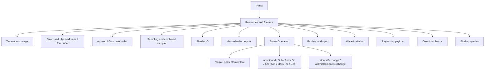

# Resources and Atomics

This page is the per-opcode reference for IR opcodes that operate on
GPU resources (textures, samplers, structured / byte-address /
append / consume buffers), atomic operations and synchronization
barriers, raytracing payload accessors, wave-intrinsic mask
operations, and the descriptor-heap query opcodes used by bindless
backends.

The intended reader is a compiler engineer reading IR around a
resource-bound expression (a texture sample, a buffer load, an
atomic operation, ...) or working on a backend that emits these
opcodes.

## Source

The opcodes documented here are scattered through
[slang-ir-insts.lua](../../../../source/slang/slang-ir-insts.lua):

- `AtomicOperation` group at line ~1100, plus the coverage markers
  `IncrementCoverageCounter` (line ~1140),
  `IncrementFunctionCoverageCounter` (line ~1145), and
  `IncrementBranchCoverageCounter` (line ~1158), each also synthesized
  as an atomic add.
- Image and texture access opcodes (`imageSubscript`, `imageLoad`,
  `imageStore`, `ImageTexelPointer`, `SubpassLoad`) at lines
  ~1209-1221.
- Buffer access opcodes (`byteAddressBufferLoad/Store`,
  `structuredBuffer*`, `rwstructuredBuffer*`,
  `StructuredBufferAppend/Consume/GetDimensions`) at lines ~1229-1274.
- Resource modifiers and queries (`nonUniformResourceIndex`,
  `getNaturalStride`, `castDynamicResource`) at lines ~1195,
  ~1276-1277.
- Mesh-shader outputs at lines ~1278-1284.
- Texture-sampling shortcuts (`sample`, `sampleGrad`) and
  wave-intrinsic mask ops at lines ~1536-1541.
- Memory barriers (`GroupMemoryBarrierWithGroupSync`,
  `ControlBarrier`) at lines ~1542-1543.
- Raytracing-payload accessors at lines ~1548-1563.
- Texture-access tagging helpers at lines ~1583-1591.
- Descriptor-heap and buffer-pointer helpers at lines ~1007-1024 and
  ~2696-2700.
- Combined sampler accessors at lines ~1060-1061; combined-sampler
  constructor at line ~1000.
- `GetWorkGroupSize`, `GetCurrentStage` (entry-point introspection)
  at lines ~1081-1083.
- `BindingQuery` (`getRegisterIndex`, `getRegisterSpace`) at line
  ~1639.

C++ wrappers are declared in
[slang-ir-insts.h](../../../../source/slang/slang-ir-insts.h). The
opcodes are introduced both from
[slang-lower-to-ir.cpp](../../../../source/slang/slang-lower-to-ir.cpp)
(when lowering user-facing intrinsics on resource types) and from
IR passes (`slang-ir-resource-legalize.cpp`, the per-target
backend-specific lowering passes).

## Family hierarchy



## Opcodes

### Texture and image

| Opcode | C++ wrapper | Operands | Flags | AST origin | Summary |
| --- | --- | --- | --- | --- | --- |
| `imageSubscript` | — | `image, coord, sampleCoord?` | | `IndexExpr` on a `RWTexture*` in `slang-lower-to-ir.cpp` | Returns a pointer-like value for a texel of an image; used as the lvalue side of `image[coord] = ...`. |
| `imageLoad` | — | `image, coord, auxCoord1?, auxCoord2?` | | `Texture*::Load` method invocations | Loads a texel from an image. |
| `imageStore` | — | `image, coord, value` | | `RWTexture*` element-store lowering | Stores a value to a texel of an image. |
| `ImageTexelPointer` | — | `image, coord, sample` | | GLSL `imageAtomic*` lowering | Forms a pointer to a texel of an image so atomic ops can target it; lowers directly to `SpvOpImageTexelPointer` at emit time. |
| `SubpassLoad` | `SubpassLoad` | `subpassInput, sample?` | | `SubpassInput*::SubpassLoad` method (raster-input attachment access) | Loads a fragment-shader input attachment value; the optional `sample` operand selects an MSAA sample. Per-target lowering is covered in [../pipeline/06-emit.md](../pipeline/06-emit.md). |
| `MetalCastToDepthTexture` | — | `texture` | | (synthesized) | Metal-backend-specific cast from a regular texture to a depth texture. |
| `IsTextureAccess` | — | (variadic, `min=1`) | | (synthesized) | True if the operand was produced by a texture-access opcode; used by the texture-access legalization pass. |
| `IsTextureScalarAccess` | — | (variadic, `min=1`) | | (synthesized) | True if the texture access yields a scalar element. |
| `IsTextureArrayAccess` | — | (variadic, `min=1`) | | (synthesized) | True if the texture access targets an array slice. |
| `ExtractTextureFromTextureAccess` | — | (variadic, `min=1`) | | (synthesized) | Extracts the underlying texture from a texture-access value. |
| `ExtractCoordFromTextureAccess` | — | (variadic, `min=1`) | | (synthesized) | Extracts the coordinate operand. |
| `ExtractArrayCoordFromTextureAccess` | — | (variadic, `min=1`) | | (synthesized) | Extracts the array-slice coordinate. |

### Sampling and combined samplers

| Opcode | C++ wrapper | Operands | Flags | AST origin | Summary |
| --- | --- | --- | --- | --- | --- |
| `sample` | — | `texture, sampler, coord` | | `Texture*::Sample` method | Implicit-LOD texture sample. |
| `sampleGrad` | — | `texture, sampler, coord, gradX` | | `Texture*::SampleGrad` method | Explicit-gradient texture sample. |
| `MakeCombinedTextureSamplerFromHandle` | — | `handle` | | (synthesized) | Constructs a `SamplerState`-paired texture value from a runtime handle. |
| `CombinedTextureSamplerGetTexture` | — | `sampler` | | (synthesized) | Projects the texture half of a combined texture/sampler. |
| `CombinedTextureSamplerGetSampler` | — | `sampler` | | (synthesized) | Projects the sampler half of a combined texture/sampler. |
| `makeCombinedTextureSampler` | — | `texture, sampler` | | `texture.combine(sampler)` lowering in `slang-lower-to-ir.cpp` | Pairs a texture and sampler into a combined value. |

### Buffer load and store

| Opcode | C++ wrapper | Operands | Flags | AST origin | Summary |
| --- | --- | --- | --- | --- | --- |
| `byteAddressBufferLoad` | — | `buffer, offset, alignment` | | `ByteAddressBuffer::Load*` methods | Loads ordinary-data of the result type at `offset` bytes. |
| `byteAddressBufferStore` | — | `buffer, offset, value, alignment` | | `RWByteAddressBuffer::Store*` methods | Stores ordinary-data at `offset` bytes. |
| `structuredBufferLoad` | — | (variadic, `min=2`) | | `StructuredBuffer::Load` method | Loads the element at `index` from a structured buffer. |
| `structuredBufferLoadStatus` | — | `buffer, index, status` | | `StructuredBuffer::Load` with status method | Same as `structuredBufferLoad` but produces a `(value, status)` pair. |
| `rwstructuredBufferLoad` | `RWStructuredBufferLoad` | (variadic, `min=2`) | | `RWStructuredBuffer::Load` method | Loads from a writable structured buffer. |
| `rwstructuredBufferLoadStatus` | `RWStructuredBufferLoadStatus` | (variadic, `min=3`) | | `RWStructuredBuffer::Load` with status | Load with status from a writable structured buffer. |
| `rwstructuredBufferStore` | `RWStructuredBufferStore` | `structuredBuffer, index, val` | | `rwBuf[i] = val` lowering in `slang-lower-to-ir.cpp` | Stores `val` at `index`. |
| `rwstructuredBufferGetElementPtr` | `RWStructuredBufferGetElementPtr` | `base, index` | | `IndexExpr` on `RWStructuredBuffer` in `slang-lower-to-ir.cpp` | Returns a pointer to the `index`-th element; lvalue counterpart of `rwstructuredBufferLoad`. |
| `StructuredBufferGetDimensions` | — | `buffer` | | `StructuredBuffer::GetDimensions` method | Returns the element count of a structured buffer. |

### Append and consume buffers

| Opcode | C++ wrapper | Operands | Flags | AST origin | Summary |
| --- | --- | --- | --- | --- | --- |
| `StructuredBufferAppend` | — | `buffer, element?` | | `AppendStructuredBuffer::Append` method | Appends an element; the element operand is optional because some lowerings split write and append. |
| `StructuredBufferConsume` | — | `buffer` | | `ConsumeStructuredBuffer::Consume` method | Consumes (pops) one element from the buffer. |

### Resource queries and modifiers

| Opcode | C++ wrapper | Operands | Flags | AST origin | Summary |
| --- | --- | --- | --- | --- | --- |
| `nonUniformResourceIndex` | — | `index` | | `NonUniformResourceIndexExpr` in `slang-lower-to-ir.cpp` | Marks a resource index as non-uniform across waves. |
| `getNaturalStride` | — | `type` | | (synthesized) | Returns the natural stride of a resource element type. |
| `castDynamicResource` | — | `resource` | | (synthesized) | Casts a typed resource into the dynamic-resource form. |
| `getEquivalentStructuredBuffer` | — | (variadic, `min=1`) | | (synthesized) | Converts another buffer (e.g. `ByteAddressBuffer`) into a structurally-equivalent `StructuredBuffer` value. |
| `getStructuredBufferPtr` | — | (variadic, `min=1`) | | (synthesized) | Returns a `T[]` pointer to the underlying data of a structured buffer. |
| `getUntypedBufferPtr` | — | (variadic, `min=1`) | | (synthesized) | Returns a `uint[]` pointer to the underlying data of a byte-address buffer. |

### Shader IO

| Opcode | C++ wrapper | Operands | Flags | AST origin | Summary |
| --- | --- | --- | --- | --- | --- |
| `global_param` | — | (variadic) | G | Module-scope shader parameter declarations (see also [structure.md](structure.md)) | Module-scope shader parameter (uniform, push-constant, descriptor binding). |
| `GetWorkGroupSize` | — | — | H | (synthesized; materialized during `translateGlobalVaryingVar`) | Returns the workgroup size of the calling entry point. |
| `GetCurrentStage` | — | — | | (synthesized) | Returns the pipeline stage of the calling entry point. |
| `GetPerVertexInputArray` | — | `ref` | H | (synthesized) | Returns the per-vertex input array for a `pervertex` / per-vertex varying input. |
| `ResolveVaryingInputRef` | — | `ref` | H | (synthesized) | Placeholder reference to a varying input; the `resolveVaryingInputRef` pass rewrites it to the actual `global_param`. |

### Mesh-shader outputs

| Opcode | C++ wrapper | Operands | Flags | AST origin | Summary |
| --- | --- | --- | --- | --- | --- |
| `meshOutputRef` | — | `base, index` | | Mesh-shader output assignment in `slang-lower-to-ir.cpp` | Reference to an output slot of a mesh-shader output array. |
| `meshOutputSet` | — | `base, index, elementValue` | | Mesh-shader output assignment | Writes one element of a mesh-shader output array. |
| `metalSetVertex` | — | `index, elementValue` | | (synthesized for Metal backend) | Metal-specific vertex-output write. |
| `metalSetPrimitive` | — | `index, elementValue` | | (synthesized for Metal backend) | Metal-specific primitive-output write. |
| `metalSetIndices` | — | `index, elementValue` | | (synthesized for Metal backend) | Metal-specific index-output write. |

### Atomic operations

All atomic ops live under the `AtomicOperation` parent group and
share a common shape: the first operand is a pointer to the target
location, and subsequent operands carry the value(s) and memory
ordering. The ordering is the standard `IRMemoryOrder` enum from
[slang-ir.h](../../../../source/slang/slang-ir.h):

```cpp
enum IRMemoryOrder
{
    kIRMemoryOrder_Relaxed = 0,
    kIRMemoryOrder_Acquire = 1,
    kIRMemoryOrder_Release = 2,
    kIRMemoryOrder_AcquireRelease = 3,
    kIRMemoryOrder_SeqCst = 4,
};
```

| Opcode | C++ wrapper | Operands | Flags | AST origin | Summary |
| --- | --- | --- | --- | --- | --- |
| `atomicLoad` | — | `ptr, memoryOrder` | | Atomic intrinsic lowering in `slang-lower-to-ir.cpp` | Atomically reads from `ptr`. |
| `atomicStore` | — | `ptr, val, memoryOrder` | | Atomic intrinsic lowering | Atomically writes to `ptr`. |
| `atomicExchange` | — | `ptr, val, memoryOrder` | | Atomic intrinsic lowering | Atomically writes and returns the previous value. |
| `atomicCompareExchange` | — | `ptr, expected, desired, memoryOrderEqual, memoryOrderUnequal` | | `InterlockedCompareExchange` intrinsic | Atomic CAS; returns the value previously stored. |
| `atomicAdd` | — | `ptr, val, memoryOrder` | | `InterlockedAdd` intrinsic | Atomically adds `val` to `*ptr`. |
| `atomicSub` | — | `ptr, val, memoryOrder` | | Atomic intrinsic lowering | Atomically subtracts. |
| `atomicAnd` | — | `ptr, val, memoryOrder` | | `InterlockedAnd` intrinsic | Atomic bitwise AND. |
| `atomicOr` | — | `ptr, val, memoryOrder` | | `InterlockedOr` intrinsic | Atomic bitwise OR. |
| `atomicXor` | — | `ptr, val, memoryOrder` | | `InterlockedXor` intrinsic | Atomic bitwise XOR. |
| `atomicMin` | — | `ptr, val, memoryOrder` | | `InterlockedMin` intrinsic | Atomic minimum. |
| `atomicMax` | — | `ptr, val, memoryOrder` | | `InterlockedMax` intrinsic | Atomic maximum. |
| `atomicInc` | — | `ptr, memoryOrder` | | `InterlockedAdd` (with `1` constant) | Atomic increment. |
| `atomicDec` | — | `ptr, memoryOrder` | | `InterlockedAdd` (with `-1` constant) | Atomic decrement. |
| `IncrementCoverageCounter` | — | — | | (synthesized when line coverage is on) | Line-coverage marker rewritten to `atomicAdd` on the synthesized coverage buffer; documented in the Lua comment block. |
| `IncrementFunctionCoverageCounter` | — | `functionName, functionMangledName` | | (synthesized when function coverage is on) | Function-entry coverage marker; carries display and mangled names as operands so later passes need no AST access. |
| `IncrementBranchCoverageCounter` | — | `branchSiteID, branchArmID, branchArmKind` | | (synthesized when branch coverage is on) | Branch-arm coverage marker; site/arm ids are local to the emitted metadata and the arm kind distinguishes true/false/case for LCOV export. |
| `MetalAtomicCast` | — | (variadic, `min=1`) | | (synthesized for Metal backend) | Cast to the atomic-typed view of a value, required by Metal. |

### Barriers and synchronization

| Opcode | C++ wrapper | Operands | Flags | AST origin | Summary |
| --- | --- | --- | --- | --- | --- |
| `GroupMemoryBarrierWithGroupSync` | — | — | | `GroupMemoryBarrierWithGroupSync` intrinsic | Memory barrier across the workgroup, with thread-sync. |
| `ControlBarrier` | — | — | | `ControlBarrier`-style intrinsics | Generic control-flow barrier; backend chooses the concrete fence. |
| `BeginFragmentShaderInterlock` | — | — | | `BeginFragmentShaderInterlock` intrinsic | Opens a rasterizer-ordered critical section in a fragment shader. |
| `EndFragmentShaderInterlock` | `EndFragmentShaderInterlock` | — | | `EndFragmentShaderInterlock` intrinsic | Closes the rasterizer-ordered critical section opened by `BeginFragmentShaderInterlock`. |

### Cooperative matrix and vector

| Opcode | C++ wrapper | Operands | Flags | AST origin | Summary |
| --- | --- | --- | --- | --- | --- |
| `CoopMatMapElementIFunc` | — | (variadic, `min=2`) | | core-module `CoopMat.mapElement` | Maps a per-element function over a cooperative matrix. |
| `CoopMatMulAdd` | — | `matA, matB, matC, saturatingAccumulation` | | core-module `CoopMat.mulAdd` | Fused multiply-add on cooperative matrices. |
| `CoopVecMatMulAdd` | — | `input, inputInterpretation, inputInterpretationPackingFactor, matrixPtr, matrixOffset, matrixInterpretation, k, memoryLayout, transpose, matrixStride, biasPtr?, biasOffset?, biasInterpretation?` | | core-module `CoopVec.matMulAdd` | Cooperative-vector matrix-multiply-add with optional bias. |
| `CoopVecOuterProductAccumulate` | — | `matrixPtr, matrixOffset, a, b, memoryLayout, matrixInterpretation, matrixStride` | | core-module `CoopVec.outerProductAccumulate` | Outer-product accumulate into a cooperative matrix in memory. |
| `CoopVecReduceSumAccumulate` | — | `bufferPtr, offset, value` | | core-module `CoopVec.reduceSumAccumulate` | Reduce-sum accumulate of a cooperative vector into a memory location. |

### Wave intrinsics

| Opcode | C++ wrapper | Operands | Flags | AST origin | Summary |
| --- | --- | --- | --- | --- | --- |
| `waveGetActiveMask` | — | — | | `WaveGetActiveMask` intrinsic | Returns the active-thread mask. |
| `waveMaskBallot` | — | `mask, condition` | | `WaveMaskBallot` intrinsic | Returns the mask of lanes where `condition` is true. |
| `waveMaskMatch` | — | `mask, value` | | `WaveMaskMatch` intrinsic | Returns the mask of lanes whose `value` matches. |

### Raytracing payload

| Opcode | C++ wrapper | Operands | Flags | AST origin | Summary |
| --- | --- | --- | --- | --- | --- |
| `getOptiXRayPayloadPtr` | — | — | H | (synthesized for OptiX backend) | Returns a pointer to the OptiX payload data (two-register form). |
| `getOptiXHitAttribute` | — | (variadic, `min=2`) | | (synthesized for OptiX backend) | Loads one hit attribute (type, index). |
| `getOptiXSbtDataPointer` | `GetOptiXSbtDataPtr` | — | | (synthesized for OptiX backend) | Returns a pointer to shader-binding-table record data. |
| `getOptiXPayloadRegister` | — | (variadic, `min=1`) | | (synthesized for OptiX backend) | Reads a uint32 from OptiX payload register N. |
| `setOptiXPayloadRegister` | — | (variadic, `min=2`) | | (synthesized for OptiX backend) | Writes a uint32 to OptiX payload register N. |
| `GetVulkanRayTracingPayloadLocation` | — | (variadic, `min=1`) | | (synthesized for Vulkan raytracing) | Returns the binding location of a Vulkan raytracing payload. |

### Descriptor heaps

| Opcode | C++ wrapper | Operands | Flags | AST origin | Summary |
| --- | --- | --- | --- | --- | --- |
| `LoadResourceDescriptorFromHeap` | — | `index` | | (synthesized for bindless backends) | Loads a typed resource descriptor by heap index. |
| `LoadSamplerDescriptorFromHeap` | — | `index` | | (synthesized for bindless backends) | Loads a sampler descriptor by heap index. |
| `SPIRVLoadDescriptorFromHeap` | — | `heap, index` | | (synthesized for SPIR-V bindless) | Loads a descriptor from a SPIR-V resource heap. |
| `SPIRVLoadTexelPointerFromHeap` | — | `heap, index, textureType, coord, sampleIndex` | | (synthesized for SPIR-V bindless) | Loads a texel pointer from a SPIR-V resource heap. |
| `SPIRVResourceHeap` | — | — | H | (synthesized for SPIR-V bindless) | Reference to the SPIR-V resource heap. |
| `SPIRVSamplerHeap` | — | — | H | (synthesized for SPIR-V bindless) | Reference to the SPIR-V sampler heap. |

### Binding queries

`BindingQuery` is the grouping parent for `getRegisterIndex` and
`getRegisterSpace` (see the Lua entry for which targets honor each
variant); only its concrete children appear in the table.

| Opcode | C++ wrapper | Operands | Flags | AST origin | Summary |
| --- | --- | --- | --- | --- | --- |
| `getRegisterIndex` | — | (variadic, `min=1`) | | (synthesized) | Returns the register index a resource is bound to. |
| `getRegisterSpace` | — | (variadic, `min=1`) | | (synthesized) | Returns the register space a resource is bound to. |

## Notable opcodes

### `imageLoad` and `imageStore`

`imageLoad(image, coord, ...)` and `imageStore(image, coord, value)`
are the IR-level read and write opcodes for image-typed resources.
The coordinate operand carries the full coordinate vector
(including array slice for array textures); subsequent optional
operands carry sample index and offset where the underlying API
supports them. Both opcodes are produced by lowering `image[coord]`
expressions and `image[coord] = value` assignments. How each backend
emits them is covered in [../pipeline/06-emit.md](../pipeline/06-emit.md).

### `sample` and `sampleGrad`

In this source revision the texture-sampling shortcuts are `sample`
and `sampleGrad`. `sample(texture, sampler, coord)` is the
*implicit-LOD* form: the mip level is selected automatically from
screen-space derivatives, so it is only valid where derivatives are
available. `sampleGrad(texture, sampler, coord, gradX)` is the
*explicit-gradient* form: the caller supplies the `gradX`
derivative operand that drives LOD selection. The opcode has a
fixed four-operand shape in this revision; richer gradient/offset/bias
semantics live in core-module sampling intrinsics rather than as
extra operands on this IR opcode. A fixed explicit-LOD sample is expressed
through the ordinary core-module sampling intrinsics rather than a
dedicated opcode in this revision.

### `rwstructuredBufferGetElementPtr`

`rwstructuredBufferGetElementPtr(base, index)` is the lvalue
counterpart of `rwstructuredBufferLoad`. It returns a pointer to
the element at the given index so that subsequent `Store` /
`FieldAddress` / `GetElementPtr` opcodes can apply. Without this
lvalue form, mutating one field of a struct stored inside a
`RWStructuredBuffer<S>` would force a full read-modify-write of
the whole struct.

### `atomicCompareExchange`

`atomicCompareExchange(ptr, expected, desired, memoryOrderEqual,
memoryOrderUnequal)` is the IR encoding of the CAS primitive. The
`ptr`/`expected`/`desired` triple is exactly the one emitted by
HLSL's `InterlockedCompareExchange`, followed by the two
`IRMemoryOrder` operands for the matched and unmatched cases; the
returned value
is the value previously stored, which the user code typically
compares to `expected` to decide whether the swap succeeded.

### `global_param` and `EntryPointParamDecoration` (cross-link)

The shader-IO opcode hierarchy ultimately bottoms out at the
`global_param` opcode (see [structure.md](structure.md) for its
structural role); entry-point-origin information is carried by the
`EntryPointParamDecoration` decoration on a `global_param`, not by a
separate opcode. The layout opcodes documented in
[metadata.md](metadata.md) attach to `global_param` instances to
record their resource binding; backend emit walks the children of
each `global_param` to discover them.

### `nonUniformResourceIndex`

`nonUniformResourceIndex(index)` is the IR encoding of HLSL's
`NonUniformResourceIndex` intrinsic. It is a no-op at the value
level — the operand and result share the same type — but carries
a flag that backends translate into the `NonUniform` decoration
(SPIR-V) or the corresponding HLSL annotation. The
[metadata.md](metadata.md) page's `NonUniformAttr` is the typed
attribute equivalent that attaches to a layout.

### `LoadResourceDescriptorFromHeap`

`LoadResourceDescriptorFromHeap(index)` is the IR form of indexing
into a bindless resource heap. The result type carries the
expected resource type, so the backend can emit the appropriate
descriptor cast. The
`SPIRV*FromHeap` and `MakeCombinedTextureSamplerFromHandle`
opcodes are the SPIR-V variants used when the heap is exposed as
a typed array of descriptors.

### `ControlBarrier` vs `GroupMemoryBarrierWithGroupSync`

`ControlBarrier` is the generic synchronization barrier; each
backend turns it into the concrete fence/barrier instruction for
its target (see [../pipeline/06-emit.md](../pipeline/06-emit.md)).
`GroupMemoryBarrierWithGroupSync` is the dedicated opcode for the
HLSL spelling — most modern code uses `ControlBarrier` and lets the
backend decide.

## See also

- [../cross-cutting/ir-instructions.md](../cross-cutting/ir-instructions.md)
  — schema, op flags (`H` hoistable on the heap and binding-query
  opcodes), and the "add an opcode" workflow.
- [types.md](types.md) — the resource type opcodes
  (`TextureType`, `SamplerStateType`,
  `StructuredBufferType`/`RWStructuredBufferType`,
  `ByteAddressBufferType`/`RWByteAddressBufferType`,
  `RaytracingAccelerationStructureType`, etc.) that the resource
  opcodes operate on.
- [values.md](values.md) — `Var`, `FieldAddress`, `GetElementPtr`,
  and the rest of the memory machinery that surrounds buffer and
  texture access.
- [metadata.md](metadata.md) — `varLayout`, `EntryPointLayout`,
  `userSemantic`, `systemValueSemantic` — the layout opcodes that
  attach to `global_param` instances.
- [decorations.md](decorations.md) — `LayoutDecoration`, the
  binding decorations, and `TargetIntrinsicDecoration` that
  determines which backend implements each resource opcode.
- [../pipeline/04-ast-to-ir.md](../pipeline/04-ast-to-ir.md) — how
  resource method calls and atomic intrinsics lower into the
  opcodes documented here.
- [../pipeline/06-emit.md](../pipeline/06-emit.md) — how each
  backend consumes the resource opcodes during emission.
- [../glossary.md](../glossary.md) — definitions of
  `target intrinsic`, `entry point`, `hoistable instruction`.
