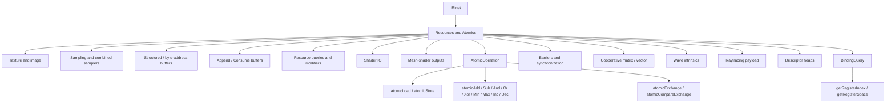

# Resources and Atomics

This page is the per-opcode reference for the IR opcodes that *operate on*
GPU resources — texture and image access, structured / byte-address /
append / consume buffer access, sampling, atomics and synchronization
barriers, mesh-shader and varying-input plumbing, raytracing payload
accessors, wave-mask intrinsics, cooperative matrix/vector operations, and
the descriptor-heap and binding queries used by bindless backends.

The intended reader is a compiler engineer reading IR around a
resource-bound expression (a texture sample, a buffer load, an atomic
operation) or working on a backend that consumes these opcodes.

The resource *types* these opcodes operate on are not documented here. They
belong to [types.md](types.md) — see its
[resource and texture types](types.md#resource-and-texture-types),
[sampler and buffer-layout types](types.md#sampler-and-buffer-layout-types),
and [pointer types](types.md#pointer-types) sections.

## Source

Every opcode below is declared in
[slang-ir-insts.lua](../../../../source/slang/slang-ir-insts.lua). The
family is not one contiguous block; it is spread across the file:

| Region | Lua lines | Contents |
| --- | --- | --- |
| Descriptor heaps | 1093-1114 | `LoadResourceDescriptorFromHeap`, `LoadSamplerDescriptorFromHeap`, `SPIRVLoadDescriptorFromHeap`, `SPIRVLoadTexelPointerFromHeap`, `SPIRVResourceHeap`, `SPIRVSamplerHeap` |
| Combined samplers | 1086, 1115, 1146-1147 | `makeCombinedTextureSampler`, `MakeCombinedTextureSamplerFromHandle`, `CombinedTextureSamplerGetTexture`/`GetSampler` |
| Entry-point introspection | 1167-1169 | `GetWorkGroupSize`, `GetCurrentStage` |
| `AtomicOperation` group | 1186-1212 | `atomicLoad` … `atomicDec` |
| Coverage markers | 1226-1253 | `IncrementCoverageCounter`, `IncrementFunctionCoverageCounter`, `IncrementBranchCoverageCounter` |
| Dynamic-resource cast | 1281 | `castDynamicResource` |
| Image access | 1295-1316 | `imageSubscript`, `imageLoad`, `imageStore`, `imageGatherOffset`, `ImageTexelPointer`, `SubpassLoad` |
| Buffer access | 1324-1369 | `byteAddressBuffer*`, `structuredBuffer*`, `rwstructuredBuffer*`, `StructuredBufferAppend`/`Consume`/`GetDimensions` |
| Queries, mesh output, Metal | 1371-1382 | `nonUniformResourceIndex`, `getNaturalStride`, `getNaturalAlignment`, `meshOutputRef`/`Set`, `metalSet*`, `MetalCastToDepthTexture` |
| Wave mask, sampling, barriers | 1631-1640 | `waveGetActiveMask`, `waveMaskBallot`, `waveMaskMatch`, `sample`, `sampleGrad`, `GroupMemoryBarrierWithGroupSync`, `ControlBarrier` |
| Raytracing payload | 1645-1660 | `getOptiX*`, `setOptiXPayloadRegister`, `GetVulkanRayTracingPayloadLocation` |
| Varying-input helpers | 1663-1668 | `GetPerVertexInputArray`, `ResolveVaryingInputRef` |
| Texture-access helpers | 1679-1685 | `MetalAtomicCast`, `IsTexture*Access`, `Extract*FromTextureAccess` |
| Cooperative matrix/vector | 1691-1732 | `CoopMatMapElementIFunc`, `CoopMatMulAdd`, `CoopVecMatMulAdd`, `CoopVecOuterProductAccumulate`, `CoopVecReduceSumAccumulate` |
| `BindingQuery` group | 1736-1750 | `getRegisterIndex`, `getRegisterSpace` |
| Buffer-pointer helpers | 2870-2874 | `getEquivalentStructuredBuffer`, `getStructuredBufferPtr`, `getUntypedBufferPtr` |
| Fragment-shader interlock | 2969-2971 | `BeginFragmentShaderInterlock`, `EndFragmentShaderInterlock` |
| `global_param` | 903 | Module-scope shader parameter |

C++ wrappers live in
[slang-ir-insts.h](../../../../source/slang/slang-ir-insts.h) — see
[C++ wrappers and accessors](#c-wrappers-and-accessors) below for how
hand-written and generated wrappers differ. The `IRMemoryOrder` enum that
atomics use, and the `IRBuilder` helpers that construct many of these
opcodes, are in
[slang-ir.h](../../../../source/slang/slang-ir.h) and
[slang-ir.cpp](../../../../source/slang/slang-ir.cpp).

Most opcodes on this page have **no dedicated `visit*` method** in
[slang-lower-to-ir.cpp](../../../../source/slang/slang-lower-to-ir.cpp).
They originate from `__intrinsic_op(...)` declarations in the core module —
[core.meta.slang](../../../../source/slang/core.meta.slang),
[hlsl.meta.slang](../../../../source/slang/hlsl.meta.slang), and
[glsl.meta.slang](../../../../source/slang/glsl.meta.slang) — which
`slang-lower-to-ir.cpp` turns into the named opcode through
`emitIntrinsicInst` when it lowers the call. The remainder are synthesized
by IR passes. The "AST origin" column names the actual producer in each
case.

### C++ wrappers and accessors

Every opcode in this family has an `IRFoo` C++ wrapper. There is no such
thing as an opcode without one, so this page never writes an em-dash in
that column. The distinction that matters is *where the struct is
declared*:

- **Hand-written** — the struct is spelled out in
  [slang-ir-insts.h](../../../../source/slang/slang-ir-insts.h) with a
  `FIDDLE()` / `FIDDLE(leafInst())` pair, so it can add extra members.
  Shown in **bold** in the tables below.
- **Generated** — the struct is emitted into
  `build/source/slang/fiddle/slang-ir-insts.h.fiddle` by the template near
  the end of [slang-ir-insts.h](../../../../source/slang/slang-ir-insts.h)
  (line ~3113), driven by `getAllOtherInstStructsData()` in
  `source/slang/slang-ir.h.lua`. Shown in plain text.

Named operand accessors are generated for **both** kinds, from the Lua
`operands` list: hand-written structs receive them as the body of the
`FIDDLE(leafInst())` macro, generated structs receive them inline. So
`IRImageStore` gets `getImage()`/`getCoord()`/`getValue()` even though its
struct body in the header shows only two hand-written members.

The two paths differ in one important way for **optional** operands. A
generated struct gets a null-returning guard:

```cpp
IRInst* getElement() { return getOperandCount() > 1 ? getOperand(1) : nullptr; }
```

A hand-written struct gets the unguarded form (`return getOperand(2);`),
which reads out of bounds when the operand is absent. That is why
`IRImageSubscript` and `IRImageLoad` hand-write `hasSampleCoord()`,
`hasAuxCoord1()`, and `hasAuxCoord2()` predicates — callers must test them
before calling the accessor.

The generated enumerator is `kIROp_` + the entry's `struct_name`, which is
*not* always the Lua key. In this family the differing pairs are
`global_param` → `kIROp_GlobalParam`, `getOptiXSbtDataPointer` →
`kIROp_GetOptiXSbtDataPtr`, and the lowercase mnemonics whose `struct_name`
is capitalized (`imageLoad` → `kIROp_ImageLoad`, `atomicAdd` →
`kIROp_AtomicAdd`, `rwstructuredBufferLoad` →
`kIROp_RWStructuredBufferLoad`, and so on).

### Reading the operand column

- A plain name (`buffer`) is declared in the Lua `operands` list, so a
  matching `getBuffer()` accessor exists.
- A trailing `?` marks an operand declared `optional = true`.
- A name in square brackets (`[index]`) is **not** declared in Lua — the
  entry only sets `min_operands`, so no named accessor is generated and
  consumers use `getOperand(i)`. The name given is the semantic role taken
  from the producer or consumer.
- `—` means nullary.

## Family hierarchy

Only two entries on this page are Lua *grouping* parents, and neither has
its own `kIROp_` enumerator — they generate `kIROp_First…`/`kIROp_Last…`
range bounds instead.


```mermaid
flowchart TD
  IRInst --> ResAtom[Resources and Atomics]
  ResAtom --> Images[Texture and image]
  ResAtom --> Samplers["Sampling and combined samplers"]
  ResAtom --> Buffers["Structured / byte-address buffers"]
  ResAtom --> AppendConsume["Append / Consume buffers"]
  ResAtom --> Queries[Resource queries and modifiers]
  ResAtom --> ShaderIO[Shader IO]
  ResAtom --> MeshOut[Mesh-shader outputs]
  ResAtom --> AtomicOperation
  ResAtom --> Barriers[Barriers and synchronization]
  ResAtom --> Coop["Cooperative matrix / vector"]
  ResAtom --> WaveOps[Wave intrinsics]
  ResAtom --> RayTracing[Raytracing payload]
  ResAtom --> Descriptors[Descriptor heaps]
  ResAtom --> BindingQuery
  AtomicOperation --> atomicLoadStore["atomicLoad / atomicStore"]
  AtomicOperation --> atomicRMW["atomicAdd / Sub / And / Or / Xor / Min / Max / Inc / Dec"]
  AtomicOperation --> atomicCmpSwap["atomicExchange / atomicCompareExchange"]
  BindingQuery --> RegQueries["getRegisterIndex / getRegisterSpace"]
```

## Opcodes

### Texture and image

| Opcode | C++ wrapper | Operands | Flags | AST origin | Summary |
| --- | --- | --- | --- | --- | --- |
| `imageSubscript` | **`IRImageSubscript`** | `image, coord, sampleCoord?` | | `__intrinsic_op` on the `_Texture` subscript `__ref` accessors, [hlsl.meta.slang](../../../../source/slang/hlsl.meta.slang) lines 5367, 5528, 19413 | Pointer-like value for one texel, so `image[coord]` can appear as an lvalue. Legalized away before emit. |
| `imageLoad` | **`IRImageLoad`** | `image, coord, auxCoord1?, auxCoord2?` | | `IRBuilder::emitImageLoad`, called only from [slang-ir-legalize-image-subscript.cpp](../../../../source/slang/slang-ir-legalize-image-subscript.cpp) lines 123, 157 | Loads a texel. `auxCoord1` is the sample coord on GLSL/SPIR-V and the array-or-sample coord on Metal; `auxCoord2` is the Metal sample coord. |
| `imageStore` | **`IRImageStore`** | `image, coord, value` (+ up to two undeclared aux coords) | | `__intrinsic_op` on the Metal `__metalImageStore` / `__metalImageStoreArray` intrinsics, [hlsl.meta.slang](../../../../source/slang/hlsl.meta.slang) lines 5230, 5234; also `IRBuilder::emitImageStore` from the image-subscript legalization pass | Stores a texel. See [`imageStore` carries undeclared operands](#imagestore-carries-undeclared-operands). |
| `imageGatherOffset` | `IRImageGatherOffset` | `sampledImage, location, component, offset` | | `__intrinsic_op`, [hlsl.meta.slang](../../../../source/slang/hlsl.meta.slang) line 2301 | Gathers four texels at `location` shifted by a texel `offset`. See [`imageGatherOffset`](#imagegatheroffset). |
| `ImageTexelPointer` | `IRImageTexelPointer` | `image, coord, sample` | | `__intrinsic_op`, [glsl.meta.slang](../../../../source/slang/glsl.meta.slang) line 4505 | Forms a pointer to a texel so an atomic can target it; emits as `OpImageTexelPointer`. |
| `SubpassLoad` | `IRSubpassLoad` | `subpassInput, sample?` | | `__intrinsic_op`, [hlsl.meta.slang](../../../../source/slang/hlsl.meta.slang) lines 22687, 22699 | Reads a fragment-shader input attachment; the optional operand selects an MSAA sample. |
| `MetalCastToDepthTexture` | `IRMetalCastToDepthTexture` | `texture` | | `__intrinsic_op`, [hlsl.meta.slang](../../../../source/slang/hlsl.meta.slang) line 1121 | Reinterprets a texture as a Metal depth texture. |
| `IsTextureAccess` | `IRIsTextureAccess` | `[value]` | | (no producer at HEAD) | Declared but unreferenced; see [unused texture-access helpers](#unused-texture-access-helpers). |
| `IsTextureScalarAccess` | `IRIsTextureScalarAccess` | `[value]` | | (no producer at HEAD) | Same. |
| `IsTextureArrayAccess` | `IRIsTextureArrayAccess` | `[value]` | | (no producer at HEAD) | Same. |
| `ExtractTextureFromTextureAccess` | `IRExtractTextureFromTextureAccess` | `[textureAccess]` | | core-module declaration only, [hlsl.meta.slang](../../../../source/slang/hlsl.meta.slang) line 11890 | Declared, never called; see [unused texture-access helpers](#unused-texture-access-helpers). |
| `ExtractCoordFromTextureAccess` | `IRExtractCoordFromTextureAccess` | `[textureAccess]` | | core-module declaration only, line 11896 | Same. |
| `ExtractArrayCoordFromTextureAccess` | `IRExtractArrayCoordFromTextureAccess` | `[textureAccess]` | | core-module declaration only, line 11902 | Same. |

### Sampling and combined samplers

| Opcode | C++ wrapper | Operands | Flags | AST origin | Summary |
| --- | --- | --- | --- | --- | --- |
| `sample` | `IRSample` | `texture, sampler, coord` | | (no producer or consumer at HEAD) | See [`sample` and `sampleGrad`](#sample-and-samplegrad). |
| `sampleGrad` | `IRSampleGrad` | `texture, sampler, coord, gradX` | | (no producer or consumer at HEAD) | Same. |
| `makeCombinedTextureSampler` | `IRMakeCombinedTextureSampler` | `texture, sampler` | | `IRBuilder::emitMakeCombinedTextureSampler` from [slang-ir-spirv-legalize.cpp](../../../../source/slang/slang-ir-spirv-legalize.cpp) line 1861 and [slang-ir-float-non-uniform-resource-index.cpp](../../../../source/slang/slang-ir-float-non-uniform-resource-index.cpp) line 358 | Pairs a separate texture and sampler into one combined value. |
| `MakeCombinedTextureSamplerFromHandle` | `IRMakeCombinedTextureSamplerFromHandle` | `handle` | | `__intrinsic_op`, [hlsl.meta.slang](../../../../source/slang/hlsl.meta.slang) line 27687 | Builds a combined texture/sampler from a descriptor handle. |
| `CombinedTextureSamplerGetTexture` | `IRCombinedTextureSamplerGetTexture` | `sampler` | | `__intrinsic_op`, [hlsl.meta.slang](../../../../source/slang/hlsl.meta.slang) lines 1185, 2294 | Projects the texture half. Note the Lua operand is named `sampler` even though it holds the *combined* value. |
| `CombinedTextureSamplerGetSampler` | `IRCombinedTextureSamplerGetSampler` | `sampler` | | `__intrinsic_op`, [hlsl.meta.slang](../../../../source/slang/hlsl.meta.slang) lines 1188, 1191 | Projects the sampler half; both are consumed and removed by [slang-ir-lower-combined-texture-sampler.cpp](../../../../source/slang/slang-ir-lower-combined-texture-sampler.cpp). |

### Buffer load and store

| Opcode | C++ wrapper | Operands | Flags | AST origin | Summary |
| --- | --- | --- | --- | --- | --- |
| `byteAddressBufferLoad` | `IRByteAddressBufferLoad` | `buffer, offset, alignment` | | `InvokeExpr` on the buffer's `Load` method — `visitInvokeExpr`, [slang-lower-to-ir.cpp](../../../../source/slang/slang-lower-to-ir.cpp) line 7172, via the `__intrinsic_op` at [hlsl.meta.slang](../../../../source/slang/hlsl.meta.slang) lines 5906-5914 | Loads ordinary data of the result type at `offset` bytes. |
| `byteAddressBufferStore` | `IRByteAddressBufferStore` | `buffer, offset, alignment, value` | | `IRBuilder::emitByteAddressBufferStore`, [slang-ir.cpp](../../../../source/slang/slang-ir.cpp) lines 3303, 3312 | Stores ordinary data at `offset` bytes. **The generated accessors are swapped** — see [`byteAddressBufferStore` operand naming](#byteaddressbufferstore-operand-naming). |
| `structuredBufferLoad` | `IRStructuredBufferLoad` | `[buffer], [index]` | | `__intrinsic_op`, [hlsl.meta.slang](../../../../source/slang/hlsl.meta.slang) lines 5989, 6019 | Loads the element at `index`. |
| `structuredBufferLoadStatus` | `IRStructuredBufferLoadStatus` | `buffer, index, status` | | `__intrinsic_op`, [hlsl.meta.slang](../../../../source/slang/hlsl.meta.slang) line 6007 | Load that also writes a residency-status output. |
| `rwstructuredBufferLoad` | `IRRWStructuredBufferLoad` | `[buffer], [index]` | | `__intrinsic_op`, [hlsl.meta.slang](../../../../source/slang/hlsl.meta.slang) line 7249 | Loads from a writable structured buffer. |
| `rwstructuredBufferLoadStatus` | `IRRWStructuredBufferLoadStatus` | `[buffer], [index], [status]` | | `__intrinsic_op`, [hlsl.meta.slang](../../../../source/slang/hlsl.meta.slang) line 7267 | Load with status from a writable structured buffer. |
| `rwstructuredBufferStore` | **`IRRWStructuredBufferStore`** | `structuredBuffer, index, val` | | `emitIntrinsicInst` in [slang-ir-byte-address-legalize.cpp](../../../../source/slang/slang-ir-byte-address-legalize.cpp) line 1708 | Stores `val` at `index`. Has no core-module origin — it is synthesized when a store through a buffer pointer is legalized back into a buffer operation, then rewritten again by the SPIR-V, CPU, and buffer-element-type lowering passes. |
| `rwstructuredBufferGetElementPtr` | **`IRRWStructuredBufferGetElementPtr`** | `base, index` | | `__intrinsic_op`, [hlsl.meta.slang](../../../../source/slang/hlsl.meta.slang) lines 5942, 5946, and the subscript `__ref` accessor at line 7283 | Pointer to the `index`-th element; see [`rwstructuredBufferGetElementPtr`](#rwstructuredbuffergetelementptr). |
| `StructuredBufferGetDimensions` | **`IRStructuredBufferGetDimensions`** | `buffer` | | `__intrinsic_op`, [hlsl.meta.slang](../../../../source/slang/hlsl.meta.slang) lines 80, 85, 89 | Returns element count and stride. |

### Append and consume buffers

| Opcode | C++ wrapper | Operands | Flags | AST origin | Summary |
| --- | --- | --- | --- | --- | --- |
| `StructuredBufferAppend` | **`IRStructuredBufferAppend`** | `buffer, element?` | | `__intrinsic_op` on `AppendStructuredBuffer.Append`, [hlsl.meta.slang](../../../../source/slang/hlsl.meta.slang) line 127 | Appends one element. The `element` operand is declared optional but every producer supplies it and the emitters read `getOperand(1)` unconditionally. |
| `StructuredBufferConsume` | **`IRStructuredBufferConsume`** | `buffer` | | `__intrinsic_op` on `ConsumeStructuredBuffer.Consume`, [hlsl.meta.slang](../../../../source/slang/hlsl.meta.slang) line 6053 | Pops one element. |

### Resource queries and modifiers

| Opcode | C++ wrapper | Operands | Flags | AST origin | Summary |
| --- | --- | --- | --- | --- | --- |
| `nonUniformResourceIndex` | `IRNonUniformResourceIndex` | `index` | | `__intrinsic_op`, [hlsl.meta.slang](../../../../source/slang/hlsl.meta.slang) lines 13941, 27811 and [glsl.meta.slang](../../../../source/slang/glsl.meta.slang) line 10693 | Marks a resource index as divergent; see [`nonUniformResourceIndex`](#nonuniformresourceindex). |
| `getNaturalStride` | `IRGetNaturalStride` | `type` | | `__intrinsic_op` on `__naturalStrideOf_impl`, [core.meta.slang](../../../../source/slang/core.meta.slang) line 3989 | Byte stride of the operand's natural layout; folded to a literal by peephole. |
| `getNaturalAlignment` | `IRGetNaturalAlignment` | `type` | | `__intrinsic_op` on `__naturalAlignmentOf_impl`, [core.meta.slang](../../../../source/slang/core.meta.slang) line 4000 | Power-of-two alignment guaranteed by the natural layout; see [`getNaturalStride` and `getNaturalAlignment`](#getnaturalstride-and-getnaturalalignment). |
| `castDynamicResource` | `IRCastDynamicResource` | `resource` | | `__intrinsic_op` on `__DynamicResource.as` / `.asOpaqueDescriptor`, [hlsl.meta.slang](../../../../source/slang/hlsl.meta.slang) lines 27341, 27344, 27360 | Narrows a `__DynamicResource` to a concrete resource type. |
| `getEquivalentStructuredBuffer` | `IRGetEquivalentStructuredBuffer` | `[buffer]` | | `__intrinsic_op`, [hlsl.meta.slang](../../../../source/slang/hlsl.meta.slang) lines 10206-10212 | Views a byte-address buffer as a structured buffer; consumed and removed by [slang-ir-byte-address-legalize.cpp](../../../../source/slang/slang-ir-byte-address-legalize.cpp). |
| `getStructuredBufferPtr` | `IRGetStructuredBufferPtr` | `[buffer]` | | `__intrinsic_op`, [hlsl.meta.slang](../../../../source/slang/hlsl.meta.slang) lines 5934, 5938 | `T*` pointer to a structured buffer's data. |
| `getUntypedBufferPtr` | `IRGetUntypedBufferPtr` | `[buffer]` | | `__intrinsic_op`, [hlsl.meta.slang](../../../../source/slang/hlsl.meta.slang) lines 5926, 5930 | `uint*` pointer to a byte-address buffer's data. |
| `getRegisterIndex` | **`IRGetRegisterIndex`** | `[resource]` | | `__intrinsic_op` on `__getRegisterIndex`, [hlsl.meta.slang](../../../../source/slang/hlsl.meta.slang) lines 26386-26387 | Register index the resource is bound to. Child of the `BindingQuery` group. |
| `getRegisterSpace` | **`IRGetRegisterSpace`** | `[resource]` | | `__intrinsic_op` on `__getRegisterSpace`, [hlsl.meta.slang](../../../../source/slang/hlsl.meta.slang) lines 26383-26384 | Register space the resource is bound to. Child of the `BindingQuery` group. |

### Shader IO

| Opcode | C++ wrapper | Operands | Flags | AST origin | Summary |
| --- | --- | --- | --- | --- | --- |
| `global_param` | **`IRGlobalParam`** | — | G | `VarDecl` at module scope — `visitVarDecl` ([slang-lower-to-ir.cpp](../../../../source/slang/slang-lower-to-ir.cpp) line 11927) routes it to `lowerGlobalVarDecl` and then `lowerGlobalShaderParam`, which calls `createGlobalParam` at line 11588 | Module-scope shader parameter. Its enumerator is `kIROp_GlobalParam`; see [`global_param` and `EntryPointParamDecoration` (cross-link)](#global_param-and-entrypointparamdecoration-cross-link). |
| `GetWorkGroupSize` | `IRGetWorkGroupSize` | — | H | `__intrinsic_op`, [hlsl.meta.slang](../../../../source/slang/hlsl.meta.slang) line 7830 | Workgroup size of the calling entry point. Hoistable and nullary, so `materializeGetWorkGroupSize` in [slang-ir-translate-global-varying-var.cpp](../../../../source/slang/slang-ir-translate-global-varying-var.cpp) (line 34) replaces it once the referencing entry point is known. |
| `GetCurrentStage` | `IRGetCurrentStage` | — | | `IRBuilder::emitGetCurrentStage`, called from [slang-lower-to-ir.cpp](../../../../source/slang/slang-lower-to-ir.cpp) line 9340 when lowering `__target_switch`-style stage dispatch | Pipeline stage of the calling entry point; folded away by `slang-ir-specialize-stage-switch.cpp`. |
| `GetPerVertexInputArray` | `IRGetPerVertexInputArray` | `[attribute]` | H | `__intrinsic_op`, [hlsl.meta.slang](../../../../source/slang/hlsl.meta.slang) line 11700 | Array view of a `nointerpolation` input across the primitive's vertices. |
| `ResolveVaryingInputRef` | `IRResolveVaryingInputRef` | `[attribute]` | H | `__intrinsic_op`, [hlsl.meta.slang](../../../../source/slang/hlsl.meta.slang) line 11697 | Placeholder reference to a varying input, rewritten to the real parameter by varying-param legalization. |

### Mesh-shader outputs

| Opcode | C++ wrapper | Operands | Flags | AST origin | Summary |
| --- | --- | --- | --- | --- | --- |
| `meshOutputRef` | **`IRMeshOutputRef`** | `base, index` | | `__intrinsic_op` on the mesh output-array subscript `__ref` accessors, [core.meta.slang](../../../../source/slang/core.meta.slang) lines 2677, 2715 | Reference to one slot of a mesh output array. The hand-written wrapper adds `getOutputType()`, which unwraps the result pointer type. |
| `meshOutputSet` | **`IRMeshOutputSet`** | `base, index, elementValue` | | `__intrinsic_op`, [core.meta.slang](../../../../source/slang/core.meta.slang) lines 2652, 2695, 2730 | Writes one element of a mesh output array. |
| `metalSetVertex` | **`IRMetalSetVertex`** | `index, elementValue` | | `__intrinsic_op`, [core.meta.slang](../../../../source/slang/core.meta.slang) line 2649 | Metal `_slang_mesh.set_vertex` write. |
| `metalSetPrimitive` | **`IRMetalSetPrimitive`** | `index, elementValue` | | (no producer at HEAD) | Metal primitive-output write; consumed by [slang-emit-metal.cpp](../../../../source/slang/slang-emit-metal.cpp) but never emitted — see [the `metalSet*` builder helpers](#the-metalset-builder-helpers). |
| `metalSetIndices` | **`IRMetalSetIndices`** | `index, elementValue` | | (no producer at HEAD) | Metal index-output write; same situation. |

### Atomic operations

All thirteen atomics are children of the Lua `AtomicOperation` group (lines
1186-1212). Operand 0 is always the destination pointer, which is the only
thing `validateAtomicOperations` in
[slang-ir-validate.cpp](../../../../source/slang/slang-ir-validate.cpp)
(line 538) checks. The **memory-order operand is real but undeclared**: the
Lua `operands` lists stop at the value operands, so the trailing
`MemoryOrder` argument that every core-module declaration passes has no
generated accessor and is read positionally by the backends. See
[the atomic memory-order operand](#the-atomic-memory-order-operand).

The ordering value is the `IRMemoryOrder` enum from
[slang-ir.h](../../../../source/slang/slang-ir.h) line 72:

```cpp
enum IRMemoryOrder
{
    kIRMemoryOrder_Relaxed = 0,
    kIRMemoryOrder_Acquire = 1,
    kIRMemoryOrder_Release = 2,
    kIRMemoryOrder_AcquireRelease = 3,
    kIRMemoryOrder_SeqCst = 4,
};
```

There is no memory-*scope* operand. The SPIR-V backend hard-codes
`SpvScopeDevice` in every atomic case
([slang-emit-spirv.cpp](../../../../source/slang/slang-emit-spirv.cpp),
`emitMemorySemanticMask` at line 4462 and its call sites).

Each atomic has two producer surfaces, both in the core module and both
declared with the same `__intrinsic_op`:

- The free `__atomic_*<T>` intrinsics in
  [hlsl.meta.slang](../../../../source/slang/hlsl.meta.slang) lines
  5691-5717. These are what the HLSL-compatible `Interlocked*` functions
  call; see [`Interlocked*` is a wrapper, not an opcode](#interlocked-is-a-wrapper-not-an-opcode).
- The `Atomic<T>` methods in
  [core.meta.slang](../../../../source/slang/core.meta.slang) lines
  4103-4243, split across the base `struct Atomic<T : IAtomicable>` and two
  extensions. `load`, `store`, `exchange`, and `compareExchange` are
  available for every `IAtomicable` `T`; `add`, `sub`, `max`, `min` require
  `IArithmeticAtomicable`; `and`, `or`, `xor`, `increment`, `decrement`
  require `IBitAtomicable`. That last split is why `Atomic<float>.and(v)`
  is rejected as a missing member rather than as a bad argument type.

| Opcode | C++ wrapper | Operands | Flags | AST origin | Summary |
| --- | --- | --- | --- | --- | --- |
| `atomicLoad` | **`IRAtomicLoad`** | `[ptr]`, `[order]` | | `Atomic<T>.load`, [core.meta.slang](../../../../source/slang/core.meta.slang) line 4103 | Atomically reads `*ptr`. |
| `atomicStore` | **`IRAtomicStore`** | `[ptr]`, `[val]`, `[order]` | | `Atomic<T>.store`, line 4107 | Atomically writes `*ptr`. |
| `atomicExchange` | **`IRAtomicExchange`** | `[ptr]`, `[val]`, `[order]` | | `Atomic<T>.exchange` (line 4112) and `__atomic_exchange` | Writes and returns the previous value. |
| `atomicCompareExchange` | `IRAtomicCompareExchange` | `ptr, expected, desired`, `[successOrder]`, `[failOrder]` | | `Atomic<T>.compareExchange` (line 4125) and `__atomic_compare_exchange` | CAS; see [`atomicCompareExchange`](#atomiccompareexchange). |
| `atomicAdd` | `IRAtomicAdd` | `ptr, val`, `[order]` | | `Atomic<T>.add` (line 4138) and `__atomic_add` | Atomic add, returning the old value. |
| `atomicSub` | `IRAtomicSub` | `ptr, val`, `[order]` | | `Atomic<T>.sub` (line 4143) and `__atomic_sub` | Atomic subtract. |
| `atomicAnd` | `IRAtomicAnd` | `ptr, val`, `[order]` | | `Atomic<T>.and` (line 4220) and `__atomic_and` | Atomic bitwise AND. |
| `atomicOr` | `IRAtomicOr` | `ptr, val`, `[order]` | | `Atomic<T>.or` (line 4226) and `__atomic_or` | Atomic bitwise OR. |
| `atomicXor` | `IRAtomicXor` | `ptr, val`, `[order]` | | `Atomic<T>.xor` (line 4232) and `__atomic_xor` | Atomic bitwise XOR. |
| `atomicMin` | `IRAtomicMin` | `ptr, val`, `[order]` | | `Atomic<T>.min` (line 4153) and `__atomic_min` | Atomic minimum. |
| `atomicMax` | `IRAtomicMax` | `ptr, val`, `[order]` | | `Atomic<T>.max` (line 4148) and `__atomic_max` | Atomic maximum. |
| `atomicInc` | `IRAtomicInc` | `ptr`, `[order]` | | `Atomic<T>.increment` (line 4237) and `__atomic_increment` | Atomic increment; emits `OpAtomicIIncrement` on SPIR-V. |
| `atomicDec` | `IRAtomicDec` | `ptr`, `[order]` | | `Atomic<T>.decrement` (line 4242) and `__atomic_decrement` | Atomic decrement. |
| `MetalAtomicCast` | `IRMetalAtomicCast` | `[value]` | | (no producer at HEAD) | Reinterprets a value as Metal's `atomic<T>`; consumed by [slang-emit-metal.cpp](../../../../source/slang/slang-emit-metal.cpp) line 451 and [slang-emit-c-like.cpp](../../../../source/slang/slang-emit-c-like.cpp) line 3261 but never emitted. |

The `atomic_reduce` family in the core module
([hlsl.meta.slang](../../../../source/slang/hlsl.meta.slang) line 5719
onward, and the `Atomic<T>.reduce*` methods) adds **no** opcodes. Each is a
`[ForceInline]` function whose `__target_switch` emits inline CUDA `red.*`
assembly for CUDA and otherwise falls through to the matching
`__atomic_*` intrinsic, so the IR ends up with an ordinary `atomicAdd` and
friends whose result is unused.

Coverage markers also lower to atomic adds, but only after the coverage
instrumentation pass runs:

| Opcode | C++ wrapper | Operands | Flags | AST origin | Summary |
| --- | --- | --- | --- | --- | --- |
| `IncrementCoverageCounter` | `IRIncrementCoverageCounter` | — | | `IRBuilder::emitIncrementCoverageCounter` from [slang-lower-to-ir.cpp](../../../../source/slang/slang-lower-to-ir.cpp) line 9987 | Line-coverage marker. Carries no operands — its position is the standard per-instruction `sourceLoc`, which `stripDebugInfo` never removes. `slang-ir-coverage-instrument.cpp` rewrites it into an atomic add on the synthesized `__slang_coverage` buffer. |
| `IncrementFunctionCoverageCounter` | `IRIncrementFunctionCoverageCounter` | `functionName, functionMangledName` (both `IRStringLit`) | | Function-entry lowering when function coverage is on | Function-entry marker; names are operands so later passes need no AST access. |
| `IncrementBranchCoverageCounter` | `IRIncrementBranchCoverageCounter` | `branchSiteID, branchArmID, branchArmKind` (all `IRIntLit`) | | Branch lowering when branch coverage is on | Branch-arm marker; the arm kind lets LCOV export distinguish true/false/case arms. |

### Barriers and synchronization

| Opcode | C++ wrapper | Operands | Flags | AST origin | Summary |
| --- | --- | --- | --- | --- | --- |
| `ControlBarrier` | `IRControlBarrier` | — | | `IRBuilder::emitIntrinsicInst` in [slang-ir-glsl-legalize.cpp](../../../../source/slang/slang-ir-glsl-legalize.cpp) line 1260 | Execution-plus-memory barrier synthesized when GLSL legalization needs a sync point; emitted as `barrier()` / `OpControlBarrier`. |
| `GroupMemoryBarrierWithGroupSync` | `IRGroupMemoryBarrierWithGroupSync` | — | | (no producer at HEAD) | See [`ControlBarrier` vs `GroupMemoryBarrierWithGroupSync`](#controlbarrier-vs-groupmemorybarrierwithgroupsync). |
| `BeginFragmentShaderInterlock` | `IRBeginFragmentShaderInterlock` | — | | `__intrinsic_op`, [core.meta.slang](../../../../source/slang/core.meta.slang) line 3537 | Opens a rasterizer-ordered critical section. |
| `EndFragmentShaderInterlock` | `IREndFragmentShaderInterlock` | — | | `__intrinsic_op`, [core.meta.slang](../../../../source/slang/core.meta.slang) line 3542 | Closes the section opened above. |

The general-purpose `Barrier(memoryType, semantics)` intrinsic is not on
this page: its flag arguments are carried by the
`getEnumBarrierMemoryTypeFlags` / `getEnumBarrierSemanticFlags` opcodes,
documented in
[misc.md](misc.md#getenumbarriermemorytypeflags-and-getenumbarriersemanticflags).

### Cooperative matrix and vector

| Opcode | C++ wrapper | Operands | Flags | AST origin | Summary |
| --- | --- | --- | --- | --- | --- |
| `CoopMatMapElementIFunc` | **`IRCoopMatMapElementIFunc`** | `[coopMat]`, `[iFuncCall]`, `[iFuncThis]?` | | `__intrinsic_op`, [hlsl.meta.slang](../../../../source/slang/hlsl.meta.slang) lines 28714, 30174, 30177 | Applies an `IFunc` element-wise over a cooperative matrix. The hand-written wrapper exposes `getCoopMat()`, `getIFuncCall()`, `getIFuncThis()`, and `hasIFuncThis()`; `getTuple()` is an alias for operand 0 for the multi-matrix overload. |
| `CoopMatMulAdd` | `IRCoopMatMulAdd` | `matA, matB, matC, saturatingAccumulation` | | `__intrinsic_op`, [hlsl.meta.slang](../../../../source/slang/hlsl.meta.slang) line 30114 | Fused multiply-add on cooperative matrices. |
| `CoopVecMatMulAdd` | `IRCoopVecMatMulAdd` | `input, inputInterpretation, inputInterpretationPackingFactor, matrixPtr, matrixOffset, matrixInterpretation, k, memoryLayout, transpose, matrixStride, biasPtr?, biasOffset?, biasInterpretation?` | | `__intrinsic_op`, [hlsl.meta.slang](../../../../source/slang/hlsl.meta.slang) lines 32676, 32690, 32704 | Cooperative-vector matrix-multiply-add with optional bias. |
| `CoopVecOuterProductAccumulate` | `IRCoopVecOuterProductAccumulate` | `matrixPtr, matrixOffset, a, b, memoryLayout, matrixInterpretation, matrixStride` | | `__intrinsic_op` on the cooperative-vector outer-product intrinsic | Accumulates the outer product of `a` and `b` into a matrix in memory. |
| `CoopVecReduceSumAccumulate` | `IRCoopVecReduceSumAccumulate` | `bufferPtr, offset, value` | | `__intrinsic_op` on the cooperative-vector reduce-sum intrinsic | Accumulates a reduce-sum into a memory location. |

### Wave intrinsics

Only the three *mask* opcodes live here; the rest of the wave intrinsics
stay as core-module calls until backend emit.

| Opcode | C++ wrapper | Operands | Flags | AST origin | Summary |
| --- | --- | --- | --- | --- | --- |
| `waveGetActiveMask` | `IRWaveGetActiveMask` | — | | `__intrinsic_op`, [hlsl.meta.slang](../../../../source/slang/hlsl.meta.slang) line 15526 | Mask of currently active lanes. |
| `waveMaskBallot` | `IRWaveMaskBallot` | `mask, condition` | | `IRBuilder::emitWaveMaskBallot` from [slang-ir-synthesize-active-mask.cpp](../../../../source/slang/slang-ir-synthesize-active-mask.cpp) lines 750, 1217, 1796, 1833 | Mask of lanes in `mask` for which `condition` holds; the active-mask synthesis pass threads these through control flow for CUDA. |
| `waveMaskMatch` | `IRWaveMaskMatch` | `mask, value` | | `IRBuilder::emitWaveMaskMatch` from the same pass, line 1450 | Mask of lanes in `mask` sharing the same `value`. |

### Raytracing payload

| Opcode | C++ wrapper | Operands | Flags | AST origin | Summary |
| --- | --- | --- | --- | --- | --- |
| `getOptiXRayPayloadPtr` | `IRGetOptiXRayPayloadPtr` | — | H | [slang-ir-legalize-varying-params.cpp](../../../../source/slang/slang-ir-legalize-varying-params.cpp) lines 2330, 2345 | Pointer to the OptiX payload struct reassembled from payload registers. |
| `getOptiXHitAttribute` | `IRGetOptiXHitAttribute` | `[type], [index]` | | [slang-ir-legalize-varying-params.cpp](../../../../source/slang/slang-ir-legalize-varying-params.cpp) line 2151 | Reads one hit attribute. Operand 0 is the *type* inst to fetch and operand 1 the attribute index — an unusual shape, since the type is normally the result type rather than an operand. |
| `getOptiXSbtDataPointer` | `IRGetOptiXSbtDataPtr` | — | | [slang-ir-optix-entry-point-uniforms.cpp](../../../../source/slang/slang-ir-optix-entry-point-uniforms.cpp) line 230 | Pointer to the shader-binding-table record holding entry-point uniforms. Enumerator is `kIROp_GetOptiXSbtDataPtr`. |
| `getOptiXPayloadRegister` | `IRGetOptiXPayloadRegister` | `[registerIndex]` | | [slang-ir-legalize-varying-params.cpp](../../../../source/slang/slang-ir-legalize-varying-params.cpp) lines 1297-1368 | Reads one 32-bit OptiX payload register. |
| `setOptiXPayloadRegister` | `IRSetOptiXPayloadRegister` | `[registerIndex]`, `[value]` | | [slang-ir-legalize-varying-params.cpp](../../../../source/slang/slang-ir-legalize-varying-params.cpp) lines 1547-1624 | Writes one 32-bit OptiX payload register. |
| `GetVulkanRayTracingPayloadLocation` | `IRGetVulkanRayTracingPayloadLocation` | `[payload]` | | `__intrinsic_op` on `__callablePayloadLocation`, [hlsl.meta.slang](../../../../source/slang/hlsl.meta.slang) line 19599 | Location index assigned to a Vulkan raytracing / callable payload. |

### Descriptor heaps

| Opcode | C++ wrapper | Operands | Flags | AST origin | Summary |
| --- | --- | --- | --- | --- | --- |
| `LoadResourceDescriptorFromHeap` | `IRLoadResourceDescriptorFromHeap` | `index` | | `__intrinsic_op`, [hlsl.meta.slang](../../../../source/slang/hlsl.meta.slang) line 27672 | Loads a resource descriptor by heap index; see [`LoadResourceDescriptorFromHeap`](#loadresourcedescriptorfromheap). |
| `LoadSamplerDescriptorFromHeap` | `IRLoadSamplerDescriptorFromHeap` | `index` | | `__intrinsic_op`, [hlsl.meta.slang](../../../../source/slang/hlsl.meta.slang) line 27668 | Loads a sampler descriptor by heap index. |
| `SPIRVLoadDescriptorFromHeap` | `IRSPIRVLoadDescriptorFromHeap` | `heap, index` | | `__intrinsic_op`, [hlsl.meta.slang](../../../../source/slang/hlsl.meta.slang) line 27676, plus `IRBuilder::emitLoadDescriptorFromHeap` | Loads a descriptor out of an explicit SPIR-V heap array. |
| `SPIRVLoadTexelPointerFromHeap` | `IRSPIRVLoadTexelPointerFromHeap` | `heap, index, textureType, coord, sampleIndex` | | `IRBuilder::emitSPIRVLoadTexelPointerFromHeap` from [slang-ir-spirv-legalize.cpp](../../../../source/slang/slang-ir-spirv-legalize.cpp) line 1482 | Forms a texel pointer directly from a heap descriptor so an atomic can target a bindless image. |
| `SPIRVResourceHeap` | `IRSPIRVResourceHeap` | — | H | `IRBuilder::emitSPIRVResourceDescriptorHeap` from [slang-ir-spirv-legalize.cpp](../../../../source/slang/slang-ir-spirv-legalize.cpp) line 1854 | The implicit SPIR-V resource-descriptor array. Note the builder helper is named `emitSPIRVResourceDescriptorHeap`, not `emitSPIRVResourceHeap`. |
| `SPIRVSamplerHeap` | `IRSPIRVSamplerHeap` | — | H | `IRBuilder::emitSPIRVSamplerDescriptorHeap` from the same site, line 1858 | The implicit SPIR-V sampler-descriptor array. |

The conversions between descriptor handles and integers
(`CastUInt2ToDescriptorHandle`, `CastDescriptorHandleToUInt64`,
`CastDescriptorHandleToResource`, and their inverses) are documented in
[values.md](values.md#conversions). The four untyped-handle casts
(`CastUIntToUntypedResourceHandle` and friends) are documented in
[misc.md](misc.md#untyped-descriptor-heap-handle-casts).

## Notable opcodes

### `imageSubscript`, `imageLoad`, and `imageStore`

`imageSubscript(image, coord, sampleCoord?)` is what the front end produces
for `image[coord]`. It is not the load itself — it models a *pointer to a
texel*, which is what makes `image[coord] = v` and `image[coord] += v` type
as lvalues. It comes from the `__ref` subscript accessor on `_Texture` in
[hlsl.meta.slang](../../../../source/slang/hlsl.meta.slang) (line 5367 for
the single-coordinate form, line 5528 for the `[coord, sampleIndex]`
multi-sample form), not from a dedicated `visitIndexExpr` case.

Most targets have no such pointer, so
[slang-ir-legalize-image-subscript.cpp](../../../../source/slang/slang-ir-legalize-image-subscript.cpp)
rewrites each `imageSubscript` into explicit `imageLoad` /
`imageStore` pairs: for a read-modify-write it emits `imageLoad` (lines
123, 157), applies the operation, then emits `imageStore` (lines 142, 170).
`imageLoad` therefore has **no** core-module origin at all — the only
caller of `IRBuilder::emitImageLoad` is that pass.

### `imageStore` carries undeclared operands

The Lua entry for `imageStore` declares exactly three operands, `image`,
`coord`, and `value`. The real instruction can be longer.
`IRBuilder::emitImageStore` takes a `ShortList<IRInst*>` and its doc
comment spells the shape out as
`{ image, coord, value, [optional] separateArrayCoord, [optional] separateSampleCoord }`,
and the hand-written `IRImageStore` in
[slang-ir-insts.h](../../../../source/slang/slang-ir-insts.h) (line 2013)
adds `hasAuxCoord1()` / `getAuxCoord1()` reading operand 3 — an operand the
Lua never mentions.

The producer that actually supplies it is the core module's Metal array
store, `__metalImageStoreArray(This val, vector<uint,N> location, T value,
uint arrayIndex)` at
[hlsl.meta.slang](../../../../source/slang/hlsl.meta.slang) line 5230,
whose fourth argument lands in operand 3. The Metal backend then emits
`tex.write(value, coord, auxCoord1)`. Reading operand counts off the Lua
declaration alone will therefore understate this opcode.

### `imageGatherOffset`

`imageGatherOffset(sampledImage, location, component, offset)` gathers the
same `component` of the four texels surrounding `location`, displaced by a
whole-texel `offset`. The interesting operand is `offset`: it may be either
a compile-time constant or a runtime value, and the backends distinguish the
two cases (see [../pipeline/06-emit.md](../pipeline/06-emit.md)). It is the
newest opcode in this family and its only producer is the `__intrinsic_op`
declaration at
[hlsl.meta.slang](../../../../source/slang/hlsl.meta.slang) line 2301.

### `sample` and `sampleGrad`

`sample(texture, sampler, coord)` and
`sampleGrad(texture, sampler, coord, gradX)` are declared in the Lua at
lines 1637-1638 and have full generated wrappers, but at this commit **no
code creates or consumes them**: `rg kIROp_Sample` finds only the Lua
entry, the stable-name table, and the generated files. Texture sampling
reaches the backends as ordinary core-module calls with a
`TargetIntrinsicDecoration`, not through these opcodes. Treat a `sample` in
an IR dump as a signal that something unexpected happened, and do not model
new sampling work on them without first re-checking whether they have been
wired up.

### Unused texture-access helpers

The same holds for the six texture-access helpers at Lua lines 1680-1685.
`IsTextureAccess`, `IsTextureScalarAccess`, and `IsTextureArrayAccess` have
no reference anywhere outside the Lua and generated files.
`ExtractTextureFromTextureAccess`, `ExtractCoordFromTextureAccess`, and
`ExtractArrayCoordFromTextureAccess` do have core-module declarations
(`__extractTextureFromTextureAccess` and friends,
[hlsl.meta.slang](../../../../source/slang/hlsl.meta.slang) lines
11890-11902), but nothing in the core module or the compiler calls them, so
they can only appear if user code names the underscore-prefixed intrinsic
directly. No backend consumes any of the six.

### `byteAddressBufferStore` operand naming

The Lua entry (line 1332) reads
`operands = { { "buffer" }, { "offset" }, { "value" }, { "alignment" } }`,
but the comment two lines above it, `IRBuilder::emitByteAddressBufferStore`
([slang-ir.cpp](../../../../source/slang/slang-ir.cpp) lines 3303 and
3312), and every consumer all agree on the opposite order —
`buffer, offset, alignment, value`. The builder's three-argument overload
inserts a literal `0` alignment at index 2 and puts the value at index 3;
the HLSL emitter writes `.Store(getOperand(1), getOperand(count - 1))`.

Because the FIDDLE accessors are generated straight from the Lua names,
`IRByteAddressBufferStore::getValue()` returns the **alignment** and
`getAlignment()` returns the **value**. Nothing calls either accessor
today, so the mismatch is latent rather than an active miscompile, but the
first caller to trust the names will get the wrong operand. Use
`getOperand(2)` for alignment and `getOperand(3)` for the value.

### `rwstructuredBufferGetElementPtr`

`rwstructuredBufferGetElementPtr(base, index)` is the lvalue counterpart of
`rwstructuredBufferLoad`, returning a pointer to element `index` so that
ordinary `Store`, `FieldAddress`, and `GetElementPtr` opcodes can be
chained onto it. Without it, mutating one field of a struct held in a
`RWStructuredBuffer<S>` would require reading the whole struct, editing it,
and writing it all back. It has two origins: the explicit
buffer-pointer intrinsics at
[hlsl.meta.slang](../../../../source/slang/hlsl.meta.slang) lines 5942 and
5946, and the `__ref` subscript accessor at line 7283 that makes
`buf[i].field = v` work.

### The atomic memory-order operand

The Lua `operands` list for `atomicAdd` is just `{ ptr, val }`, yet every
core-module declaration takes a third argument —
`__atomic_add<T>(__ref T val, T value, MemoryOrder order = MemoryOrder.Relaxed)`.
Because the default is materialized at the call site during checking, the
operand is always present in the lowered IR; it simply has no name in the
Lua, so no `getMemoryOrder()` accessor is generated and the hand-written
wrappers in [slang-ir-insts.h](../../../../source/slang/slang-ir-insts.h)
(`IRAtomicOperation` at line 1832 through `IRAtomicExchange` at line 1874)
do not add one either.

Backends therefore index it positionally. The layout is: `atomicLoad`,
`atomicInc`, and `atomicDec` put the order at operand 1; `atomicStore`,
`atomicExchange`, and the seven read-modify-write atomics put it at operand
2; `atomicCompareExchange` puts the success order at operand 3 and the
failure order at operand 4. Those positions are exactly what
[slang-emit-spirv.cpp](../../../../source/slang/slang-emit-spirv.cpp)
passes to `emitMemorySemanticMask` at lines 5555, 5575, 5598, 5627, 5651,
5677, 5679, and 5708.

### `atomicCompareExchange`

`atomicCompareExchange` is the only atomic with two memory orders. The Lua
names the first three operands `ptr`, `expected`, and `desired`; operands 3
and 4 are the success and failure orders, matching the core-module
signature `compareExchange(T compareValue, T newValue, MemoryOrder
successOrder, MemoryOrder failOrder)` at
[core.meta.slang](../../../../source/slang/core.meta.slang) line 4125. The
core module documents two constraints the IR does not enforce:
`successOrder` must be at least as strong as `failOrder`, and `failOrder`
may not be `Release` or `AcquireRelease`. The result is the value that was
previously stored, so callers compare it against `expected` to learn
whether the swap happened.

### `Interlocked*` is a wrapper, not an opcode

HLSL's `InterlockedAdd`, `InterlockedAnd`, `InterlockedOr`,
`InterlockedXor`, `InterlockedMax`, `InterlockedMin`, and
`InterlockedExchange` are not `__intrinsic_op` declarations. They are
`[ForceInline]` Slang functions generated by a loop in
[hlsl.meta.slang](../../../../source/slang/hlsl.meta.slang) (lines
11925-11961) whose bodies call the corresponding `__atomic_*` intrinsic:

```slang
void InterlockedAdd<T:IArithmeticAtomicable>(__ref T dest, T value, out T original_value)
{
    original_value = __atomic_add(dest, value);
}
```

The practical consequence when reading a dump: immediately after AST
lowering you see `call %InterlockedAdd(...)`, not `atomicAdd`. The opcode
appears only once inlining has run. If you want a surface that lowers
straight to the opcode, use `Atomic<T>` — `counter.add(1)` becomes an
`atomicAdd` with no intervening call.

Note also that one `atomicAdd` in the IR corresponds to one *statement*,
not one thread. Contention across a dispatch is implicit in the launch;
the IR carries no fan-out.

### `getNaturalStride` and `getNaturalAlignment`

These two form a family and are documented together here because their
shared operand name is misleading. The Lua names the single operand `type`,
but it is a **value**, not a type inst: the core-module declarations are
`int __naturalStrideOf_impl(T v)` and `int __naturalAlignmentOf_impl(T v)`
([core.meta.slang](../../../../source/slang/core.meta.slang) lines 3989 and
4000), and the `[__unsafeForceInlineEarly]` wrappers `__naturalStrideOf<T>()`
and `__naturalAlignmentOf<T>()` pass `__declVal<T>()` — a placeholder value
of the type. The opcode inspects the operand's type, not the operand.

`getNaturalStride` yields the byte stride of `T`'s natural layout;
`getNaturalAlignment` yields the largest power-of-two alignment that layout
guarantees, so `float4` gives 16, `float2` and `half4` give 8, and `float3`
gives 4 because its 12-byte stride is not a power of two. Both are folded
to literals by
[slang-ir-peephole.cpp](../../../../source/slang/slang-ir-peephole.cpp)
(lines 1804 and 1830) and neither survives to emit.

`getNaturalAlignment` is documented here rather than on
[misc.md](misc.md#size-alignment-count) because it is the same family as
`getNaturalStride`, which this page already owns. Its Lua neighbour
`nodeOutputRecordGetElementPtr` (line 1376) belongs to the work-graph
record machinery and stays on
[misc.md](misc.md#work-graph-records-and-barrier-flags).

### `nonUniformResourceIndex`

`nonUniformResourceIndex(index)` is the IR form of HLSL's
`NonUniformResourceIndex`. It is a value-level identity — result and
operand share a type — that exists purely to carry the information that
the index diverges across lanes, so backends can scalarize the access
correctly (SPIR-V attaches a `NonUniform` decoration; HLSL re-emits the
intrinsic). It has three declaration sites because HLSL permits it on
non-integer types too:
[hlsl.meta.slang](../../../../source/slang/hlsl.meta.slang) line 13941 for
`__BuiltinArithmeticType`, line 27811 for the permissive overload, and
[glsl.meta.slang](../../../../source/slang/glsl.meta.slang) line 10693 for
the GLSL spelling.

### `LoadResourceDescriptorFromHeap`

`LoadResourceDescriptorFromHeap(index)` indexes a bindless resource heap.
The single operand is the heap index; the *result type* carries the
resource type the descriptor is to be interpreted as, which is how the
backend knows which descriptor cast to emit. On D3D12 that is enough,
because the heap is implicit. SPIR-V needs the heap array to be named, so
`SPIRVLoadDescriptorFromHeap(heap, index)` takes it as an explicit operand
and `SPIRVResourceHeap` / `SPIRVSamplerHeap` are the hoistable
nullary opcodes that stand for the two implicit arrays.

### `global_param` and `EntryPointParamDecoration` (cross-link)

The shader-IO hierarchy bottoms out at `global_param`, whose enumerator is
`kIROp_GlobalParam` — the one place in this family where the Lua key and
the `struct_name` differ enough to trip up a search. Its structural role is
covered in [structure.md](structure.md#global-state). Entry-point
provenance is not a separate opcode: it is an `EntryPointParamDecoration`
attached to the `global_param`. The layout opcodes in
[metadata.md](metadata.md#varlayout-and-entrypointlayout) likewise attach
as children, and backend emit walks those children to recover the binding.

### `ControlBarrier` vs `GroupMemoryBarrierWithGroupSync`

These two look like a matched pair but only one of them is live.
`ControlBarrier` is synthesized by
[slang-ir-glsl-legalize.cpp](../../../../source/slang/slang-ir-glsl-legalize.cpp)
(line 1260) when legalization needs to insert a sync point, and both the
GLSL and SPIR-V backends emit it.

`GroupMemoryBarrierWithGroupSync` has **no producer** at this commit. The
core-module function of the same name
([hlsl.meta.slang](../../../../source/slang/hlsl.meta.slang) line 11867)
is implemented with `__intrinsic_asm` per target, not `__intrinsic_op`, so
calling it never creates the opcode. The only reference is a consumer arm
in [slang-emit-c-like.cpp](../../../../source/slang/slang-emit-c-like.cpp)
(line 2743) that cannot currently be reached.

### The `metalSet*` builder helpers

Of the three Metal mesh-output opcodes, only `metalSetVertex` has a
producer — the `__intrinsic_op` at
[core.meta.slang](../../../../source/slang/core.meta.slang) line 2649.
`metalSetPrimitive` and `metalSetIndices` are consumed by
[slang-emit-metal.cpp](../../../../source/slang/slang-emit-metal.cpp) but
nothing creates them. The `IRBuilder::emitMetalSetPrimitive` and
`emitMetalSetIndices` helpers that would create them are declared and
defined but never called, and both pass `kIROp_MetalSetVertex` to
`createInst` rather than their own opcode, so they would produce the wrong
instruction if they were called. This is a latent source bug, noted here
so a reader is not misled by the helper names.

### `fixedArgCount` in the generated op-info table

`IROpInfo::fixedArgCount`
([slang-ir.h](../../../../source/slang/slang-ir.h) line 101) is documented
as "how many required arguments are there", but the generator computes it
as `#value.operands`, counting optional entries too. So the table records 3
for `imageSubscript` and 2 for `StructuredBufferAppend` even though those
opcodes are legal with 2 and 1 operands respectively. The field is not read
anywhere in the compiler, so nothing depends on the inaccuracy — but do not
use it to derive a minimum operand count.

## See also

- [../cross-cutting/ir-instructions.md](../cross-cutting/ir-instructions.md)
  — the IR schema, the op-flag bits (`H` hoistable, `P` parent, `G`
  global), how FIDDLE generates wrappers, and the workflow for adding an
  opcode. Note that opcodes serialize through the stable-name table in
  `slang-ir-insts-stable-names.lua`, so inserting a new opcode does not
  change what reaches disk.
- [types.md](types.md) — the resource, sampler, and buffer *types* these
  opcodes operate on, including the
  [nine-operand `TextureType`](types.md#texturetype-nine-operands) and the
  warning that `TextureFootprintType`'s operand named `elementType`
  actually holds the dimension count.
- [values.md](values.md) — `Var`, `FieldAddress`, `GetElementPtr`, `Store`
  and the rest of the [memory machinery](values.md#memory) that surrounds
  buffer and texture access, plus the
  [descriptor-handle conversions](values.md#conversions).
- [misc.md](misc.md) — the
  [untyped descriptor-heap handle casts](misc.md#untyped-descriptor-heap-handle-casts),
  the [barrier flag opcodes](misc.md#getenumbarriermemorytypeflags-and-getenumbarriersemanticflags),
  and the [work-graph record opcodes](misc.md#work-graph-records-and-barrier-flags)
  including `nodeOutputRecordGetElementPtr`.
- [metadata.md](metadata.md) — `varLayout`, `EntryPointLayout`,
  `userSemantic`, and `systemValueSemantic`, the layout opcodes that attach
  to `global_param`.
- [decorations.md](decorations.md) —
  [`TargetIntrinsicDecoration`](decorations.md#targetintrinsic-targetintrinsicdecoration),
  which is how the sampling and wave intrinsics that have no opcode reach
  the backends, and the
  [binding decorations](decorations.md#layout-and-binding).
- [../pipeline/04-ast-to-ir.md](../pipeline/04-ast-to-ir.md) — how a
  resource method call becomes an `__intrinsic_op`-declared opcode.
- [../ast-reference/expressions.md](../ast-reference/expressions.md) — the
  `IndexExpr` and `InvokeExpr` nodes behind subscript and method-call
  lowering.
- [../pipeline/06-emit.md](../pipeline/06-emit.md) — how each backend
  consumes these opcodes.
- [../glossary.md](../glossary.md) — `target intrinsic`, `entry point`,
  `hoistable instruction`.
