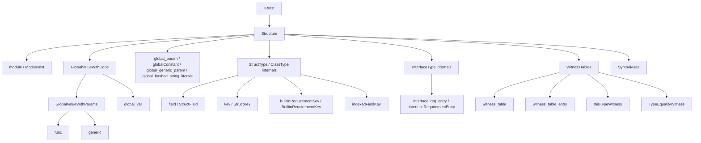

# Structure

This page is the per-opcode reference for IR opcodes that organize
the module: the module itself, functions and generics, global
variables and constants, struct / class / interface containers, and
the witness-table machinery that connects them. The intended reader
is a compiler engineer reading IR around a function or type
definition, or writing an IR pass that walks the top-level structure
of a module.

## Source

The structural opcodes are declared in four regions of
[slang-ir-insts.lua](../../../../source/slang/slang-ir-insts.lua):

- The container opcodes that live inside the `Type` family: `struct`
  (line 738), `class` (752), and `interface` (754). Their type-side
  rows belong to [types.md](types.md); this page covers their role as
  containers of `field`, `key`, and `interface_req_entry`.
- The `GlobalValueWithCode` group, lines 883-902: the abstract
  `GlobalValueWithParams` (887) holding `func` (890) and `generic`
  (897), plus `global_var` (900).
- The module-scope cluster that follows it, lines 903-949:
  `global_param`, `globalConstant`, `key` / `StructKey`,
  `builtinRequirementKey`, `global_generic_param`, `witness_table`,
  `indexedFieldKey`, `thisTypeWitness`, `TypeEqualityWitness`,
  `global_hashed_string_literals`, `module` / `ModuleInst`, and
  `SymbolAlias`. (`block`, declared at line 944 in the middle of this
  cluster, belongs to [control-flow.md](control-flow.md).)
- The member and entry opcodes, which sit later among the ordinary
  value opcodes: `call` (1148), `witness_table_entry` (1157),
  `interface_req_entry` (1158-1164), `param` (1170), and `field` /
  `StructField` (1171).

The C++ wrappers are split across two headers. Hand-written wrappers
in [slang-ir.h](../../../../source/slang/slang-ir.h) cover
`IRStructKey` (line 1668), `IRStructField` (1682), `IRStructType`
(1704), `IRClassType` (1714), `IRThisTypeWitness` (1732),
`IRInterfaceRequirementEntry` (1740), `IRInterfaceType` (1748),
`IRIndexedFieldKey` (1767), `IRGlobalValueWithCode` (1821),
`IRGlobalValueWithParams` (1833), `IRFunc` (1850), `IRModuleInst`
(1929), and `IRParam` (1170). Hand-written wrappers in
[slang-ir-insts.h](../../../../source/slang/slang-ir-insts.h) cover
`IRBuiltinRequirementKey` (486), `IRCall` (1794), `IRGlobalVar`
(2266), `IRGlobalParam` (2286), `IRGlobalConstant` (2300),
`IRWitnessTableEntry` (2310), `IRWitnessTable` (2326), and
`IRGlobalGenericParam` (2364). The remaining structural wrappers —
`IRGeneric`, `IRTypeEqualityWitness`, `IRGlobalHashedStringLiterals`,
and `IRSymbolAlias` — are emitted by the FIDDLE generator rather than
written by hand. Either way the generator supplies one accessor per
named Lua operand, so `IRWitnessTableEntry::getRequirementKey()` and
`IRCall::getCallee()` exist even though the hand-written struct bodies
do not spell them out (see
[../cross-cutting/ir-instructions.md](../cross-cutting/ir-instructions.md)
for how that generation works).

`IRBuilder` is declared in
[slang-ir-insts.h](../../../../source/slang/slang-ir-insts.h) (line
3158) and only forward-declared in
[slang-ir.h](../../../../source/slang/slang-ir.h) (line 37); its
bodies are mostly in
[slang-ir.cpp](../../../../source/slang/slang-ir.cpp). The structural
creation helpers are `createFunc`, `createGeneric`, `createStructType`,
`createClassType`, `createInterfaceType`, `createStructKey`,
`createStructField`, `createWitnessTable`, `createWitnessTableEntry`,
`createInterfaceRequirementEntry`, `createGlobalVar`,
`createGlobalParam`, `emitGlobalConstant`, `createThisTypeWitness`,
`getTypeEqualityWitness`, `getBuiltinRequirementKey`,
`getIndexedFieldKey`, and `emitSymbolAlias`. There is deliberately no
`IRBuilder` helper for the `module` opcode: the root inst is allocated
by `IRModule::create`
([slang-ir.h](../../../../source/slang/slang-ir.h) line 2136,
[slang-ir.cpp](../../../../source/slang/slang-ir.cpp) line 5051).

Lowering from the AST is in
[slang-lower-to-ir.cpp](../../../../source/slang/slang-lower-to-ir.cpp):
`lowerFuncDecl` (line 14711) for any `FunctionDeclBase`,
`visitGenericDecl` (14722) for generics, `visitAggTypeDecl` (12381)
for struct / class types, `visitInterfaceDecl` (12061) for interface
types, `visitInheritanceDecl` (11199) together with `lowerWitnessTable`
(11087) for conformances, and `lowerGlobalVarDecl` (11743) for
module-scope variables — which routes a shader parameter to
`lowerGlobalShaderParam` (11582) and a `static const` to
`lowerGlobalConstantDecl` (11741). The module itself is created in
`generateIRForTranslationUnit` (15386), whose member declarations are
lowered through `ensureAllDeclsRec` (15346).

Requirement keys are produced by `getInterfaceRequirementKey` (line
1713), which returns an `IRInst*` rather than an `IRStructKey*`: an
ordinary requirement lowers to a `StructKey` (created at line 1814 and
given a `key_<mangled>` linkage name at 1818), but a recognized
built-in requirement lowers to the hoistable `BuiltinRequirementKey`
instead.

Two helpers this page has to name are outside its manifest
`watched_paths`, so changing them will not mark this page stale:
`findWitnessTableEntry` in
[slang-ir-util.h](../../../../source/slang/slang-ir-util.h) (line 397),
which is how consumers read a witness table by key, and
`SpecializationOptions::lowerWitnessLookups` in
[slang-ir-specialize.h](../../../../source/slang/slang-ir-specialize.h)
(line 19), which controls when witness lookups are resolved away.
Both should be added to this document's `watched_paths`.

## Family hierarchy

`GlobalValueWithCode` and `GlobalValueWithParams` are the only
abstract intermediates in this family; the other boxes above group
opcodes for the reader and do not correspond to Lua parent entries.

## Opcodes

Flag codes are `H` hoistable, `P` parent, `G` global, taken from the
generated `IROpInfo` table. Note that the `parent` flag is not a
containment test: `witness_table` and `global_var` both own children
(witness entries and initializer blocks respectively) without carrying
it, and no code in `source/` reads the flag back — child ownership is
expressed by the wrapper's accessors, such as
`IRWitnessTable::getEntries()` and
`IRGlobalValueWithCode::getBlocks()`.

### Module

| Opcode | C++ wrapper | Operands | Flags | AST origin | Summary |
| --- | --- | --- | --- | --- | --- |
| `module` | `IRModuleInst` | — | P | `ModuleDecl`, via `generateIRForTranslationUnit` | Top-level container; children are every other module-scope instruction. |

### Functions and generics

| Opcode | C++ wrapper | Operands | Flags | AST origin | Summary |
| --- | --- | --- | --- | --- | --- |
| `func` | `IRFunc` | — | P | any `FunctionDeclBase` (`FuncDecl`, `ConstructorDecl`, `AccessorDecl`, `SynthesizedFuncDecl`) via `lowerFuncDecl`, including the synthesized `FuncDecl` that checking stores on a lambda | Function; children are blocks. The signature is the inst's own `FuncType`, not an operand. |
| `generic` | `IRGeneric` | — | P | `GenericDecl` via `visitGenericDecl` | Function-shaped instruction whose single block computes a type-level value; ends with `return_val` / `IRReturn`. |
| `param` | `IRParam` | — | | `ParamDecl`, plus block-parameter introduction | Function or block parameter; always a child of a `block`. Documented in detail in [control-flow.md](control-flow.md). |
| `call` | `IRCall` | `callee` plus a variadic argument tail | | `InvokeExpr` via `visitInvokeExprImpl` and `emitCallToDeclRef` | Calls `callee` with the remaining operands as arguments; result type is the call's own type. |

### Global state

| Opcode | C++ wrapper | Operands | Flags | AST origin | Summary |
| --- | --- | --- | --- | --- | --- |
| `global_var` | `IRGlobalVar` | — | G | a module-scope `VarDecl` that is neither a shader parameter nor `static const`, via `lowerGlobalVarDecl`, and a mutable function-`static` local, via `lowerFunctionStaticVarDecl` | Module-scope mutable variable; its type is a `PtrType` and an initializer lives in child blocks. |
| `global_param` | `IRGlobalParam` | — | G | a module-scope shader-parameter `VarDecl`, via `lowerGlobalShaderParam` | Module-scope uniform parameter; unlike `global_var` it *is* the value, not its address. |
| `globalConstant` | `IRGlobalConstant` | `value` (optional; unnamed in Lua, read by `getValue()`) | G | a `static const` module-scope `VarDecl`, via `lowerGlobalConstantDecl`, and a function-`static` `const`, via `lowerFunctionStaticConstVarDecl` | Module-scope constant; with no operand it is an `extern` constant defined in another module. |
| `global_generic_param` | `IRGlobalGenericParam` | — | G | `GlobalGenericParamDecl` / `GlobalGenericValueParamDecl` | Declares a generic parameter at module level; bound by `bind_global_generic_param`. Note the producer is *not* `GenericTypeParamDecl` — `GlobalGenericParamDecl` ([slang-lower-to-ir.cpp](../../../../source/slang/slang-lower-to-ir.cpp) line 10878) derives from `AggTypeDecl` while `GlobalGenericValueParamDecl` (line 10885) derives from `VarDeclBase`, and constraint decls parented by one also lower here. [generics-and-existentials.md](generics-and-existentials.md) owns the declaration/binding pair in full. |
| `global_hashed_string_literals` | `IRGlobalHashedStringLiterals` | (variadic) | | (synthesized) | Container for the module's hashed-string-literal pool; a module holds at most one. |

### Struct internals

The `StructType` and `ClassType` *type* opcodes are documented as
types in [types.md](types.md); here we describe their role as parent
containers that own `field` children.

| Opcode | C++ wrapper | Operands | Flags | AST origin | Summary |
| --- | --- | --- | --- | --- | --- |
| `struct` (container) | `IRStructType` | — (children: `field`) | P | `StructDecl` via `visitAggTypeDecl` | Owns the struct's `field` children, read back by `getFields()`. See [types.md](types.md) for its type-side semantics. |
| `class` (container) | `IRClassType` | — (children: `field`) | P | `ClassDecl` via `visitAggTypeDecl` | Owns the class's `field` children; cross-linked to [types.md](types.md). |
| `field` | `IRStructField` | `key, fieldType` (unnamed in Lua; `min_operands = 2`) | | a member `VarDeclBase`, and an `InheritanceDecl` for the leading base-type member | Declares one named member of a `struct` / `class` parent. |
| `key` | `IRStructKey` | — | G | a member `VarDeclBase`, an `InheritanceDecl`, or an interface requirement via `getInterfaceRequirementKey` | Identity for a field or interface requirement; carries `key_<mangled>` linkage so the member is addressable across compilation units. |
| `builtinRequirementKey` | `IRBuiltinRequirementKey` | `kindOperand` | H | `getInterfaceRequirementKey` for a `BuiltinRequirementModifier`-tagged requirement | Key for a recognized built-in interface requirement (e.g. an `IDifferentiable` member); deduplicated by construction from its `BuiltinRequirementKind` operand. |
| `indexedFieldKey` | `IRIndexedFieldKey` | `baseType, index` | H | `lowerTypeLayout` | Placeholder key for the *n*-th field of a tuple-like type, replaced when that type is materialized into a `struct`. Its only producer is the `getIndexedFieldKey` call in `lowerTypeLayout` ([slang-lower-to-ir.cpp](../../../../source/slang/slang-lower-to-ir.cpp) line 16173), so it originates in layout lowering rather than being synthesized from nowhere. |

Note that a `struct` does not own its `key` children: keys are
`global`, so they sit at module scope where code outside the struct can
reference them, and a `field` points at its key by operand.

### Interface internals

The `InterfaceType` *type* opcode is documented in
[types.md](types.md); here we describe its role as the carrier of
`interface_req_entry` operands.

| Opcode | C++ wrapper | Operands | Flags | AST origin | Summary |
| --- | --- | --- | --- | --- | --- |
| `interface` | `IRInterfaceType` | `interface_req_entry...` (variadic) | G | `InterfaceDecl` via `visitInterfaceDecl` | Interface declaration; its operands are the requirement entries, counted by `getRequirementCount()`. |
| `interface_req_entry` | `IRInterfaceRequirementEntry` | `requirementKey, requirementVal` | G | (synthesized as part of `InterfaceDecl` lowering) | One requirement slot of an interface; `requirementKey` is an `IRStructKey` or a hoistable `IRBuiltinRequirementKey`. Cross-link to [generics-and-existentials.md](generics-and-existentials.md). |

### Witness tables and witness facts

`witness_table` and its companion opcodes are also documented from
the dispatch side in
[generics-and-existentials.md](generics-and-existentials.md); the
rows below describe their structural role.

| Opcode | C++ wrapper | Operands | Flags | AST origin | Summary |
| --- | --- | --- | --- | --- | --- |
| `witness_table` | `IRWitnessTable` | `concreteType` (unnamed in Lua; read by `getConcreteType()`) plus children: `witness_table_entry` | H | `InheritanceDecl` via `visitInheritanceDecl` / `lowerWitnessTable` | Conformance of `concreteType` to the interface carried in its result type; owns one entry per requirement. Hoistable so identical conformances dedupe. |
| `witness_table_entry` | `IRWitnessTableEntry` | `requirementKey, satisfyingVal` | | (synthesized) | One row of a `witness_table`. |
| `thisTypeWitness` | `IRThisTypeWitness` | — (see note) | | (synthesized inside `InterfaceDecl` lowering) | Placeholder witness that `ThisType` implements the enclosing interface; only valid inside an interface definition. The interface is carried in the *result type*, not an operand: `IRBuilder::createThisTypeWitness` ([slang-ir.cpp](../../../../source/slang/slang-ir.cpp) line 5298) builds the inst with zero operands and result type `getWitnessTableType(interfaceType)`. The Lua entry declares a `type` operand that no producer ever supplies, so `IRThisTypeWitness::getConstraintType()` would read operand 0 out of range; nothing calls it, so the bug is latent. |
| `TypeEqualityWitness` | `IRTypeEqualityWitness` | `subType, superType` | H | `TypeEqualityWitness` (`Val`) | Witness certifying two types are equal. Lowered by `visitTypeEqualityWitness` ([slang-lower-to-ir.cpp](../../../../source/slang/slang-lower-to-ir.cpp) line 2398) from the AST `Val` of the same name, so it has a direct origin rather than being synthesized. |

### Symbol aliasing

| Opcode | C++ wrapper | Operands | Flags | AST origin | Summary |
| --- | --- | --- | --- | --- | --- |
| `SymbolAlias` | `IRSymbolAlias` | `symbol` | | an `AggTypeDecl` with an `aliasedType`, and an `InheritanceDecl` nested in one | Module-level alias of another symbol under a different mangled name. Must be eliminated by the linker — every use is replaced with the canonical symbol. |

## Notable opcodes

### `func`

`func` is a parent opcode that owns the blocks of a function body
and (via its result type, a `FuncType` instance) carries the
function signature. The first block in the body is the entry
block; its `Param` children are the function parameters in
declaration order, which is exactly what
`IRGlobalValueWithParams::getFirstParam` / `getParams` in
[slang-ir.cpp](../../../../source/slang/slang-ir.cpp) (line 803)
return — they forward to the *first block*, not to `func` itself, so a
function's parameters are always block parameters. `isDefinition()`
distinguishes a definition from a declaration by testing whether any
block exists at all. Function-level decorations
(`NameHintDecoration`, `KeepAliveDecoration`,
`TargetIntrinsicDecoration`, ...) attach to the `func` inst rather
than to its body.

### `generic`

`generic` is structurally the same as `func` — a parent opcode
that owns blocks — but its body is interpreted as type-level
computation. In practice each `generic` holds a single block, and
that block ends with a `return_val` (`IRReturn`) whose operand is
the result of the type-level computation; `findGenericReturnVal`
in [slang-ir.cpp](../../../../source/slang/slang-ir.cpp) (line 9888)
reads it back as the terminator's value, and
`findInnerMostGenericReturnVal` repeats that for nested generics.
`specialize` (see
[generics-and-existentials.md](generics-and-existentials.md))
applies arguments to a `generic` value; the specialization pass
replaces matched applications with the concrete result of the
generic's `return_val`.

A `generic` is not only how a `GenericDecl` is lowered. An individual
interface requirement can also be generic — a differentiability
constraint on a generic interface method, for instance — and in that
case lowering builds a requirement-local `IRGeneric` and stores *that*
as the witness-table entry value. Uses of such a requirement therefore
read `specialize(lookupWitness(table, key), methodArgs...)` rather
than a flat `lookupWitness`. See
[../pipeline/04-ast-to-ir.md](../pipeline/04-ast-to-ir.md) for the
lowering path that produces this shape.

### `module` / `ModuleInst`

`module` is the IR-level root. Its Lua entry carries
`struct_name = "ModuleInst"`, so the generated enumerator is
`kIROp_ModuleInst` rather than `kIROp_Module` — as with `key` /
`kIROp_StructKey` and `field` / `kIROp_StructField`, the enum tag
follows the wrapper name, not the mnemonic. Every
other module-scope instruction — `func`, `generic`, `global_var`,
`global_param`, `globalConstant`, `witness_table`, `struct`,
`interface`, ... — is a child of a `module`, reachable through
`IRModuleInst::getGlobalInsts()`. The module's decorations carry
import / export information used by the linker; the module is also the
unit that serialization writes and reads (see
[../cross-cutting/serialization.md](../cross-cutting/serialization.md)).

The `IRModule` owning the `module` inst (in
[slang-ir.h](../../../../source/slang/slang-ir.h)) can build a
`ModuleLinkingInfo` acceleration cache (`_getOrCreateLinkingInfo`)
that pre-indexes the module-scope structure the linker repeatedly
scans for: module-scope annotations by target inst
(`getAnnotationsForTarget`), the `global_param` instructions
(`getGlobalParams`), `HLSLExportDecoration` globals (`getHLSLExports`),
`KnownBuiltinDecoration` globals (`getKnownBuiltins`), and the single
`global_hashed_string_literals` aggregate
(`getGlobalHashedStringLiterals`). The cache assumes the module is
not mutated after it is built; callers that change module-scope state
must `_invalidateLinkingInfo`.

A module also records the IR semantics version it was built against:
`m_version` is initialized to `k_maxSupportedModuleVersion`, and the
supported range is `k_minSupportedModuleVersion` (4) ..
`k_maxSupportedModuleVersion` (28). That range tracks module
*semantics*, not the opcode numbering — opcodes are serialized through
stable names, so adding one does not by itself invalidate an existing
`.slang-module`. See
[../cross-cutting/ir-instructions.md](../cross-cutting/ir-instructions.md)
for the versioning rule in full.

### `key` / `StructKey`

`StructKey` is the identity of a struct field or an interface
requirement. Unlike a string name, a `StructKey` is a globally
linkable IR value: two `StructKey` instances for the same source-
level name in two different modules compare equal after linking,
because lowering gives each one a `key_<mangled>` linkage name. Field
access opcodes (`FieldAddress`, `FieldExtract`, see
[values.md](values.md)) use the key as their selector, which
makes structural reorganization (e.g. struct splitting) a
key-rewriting task rather than a string-rewriting task. A struct's
first `field` may be keyed by an `InheritanceDecl`'s key rather than a
member's, which is how a derived `struct` embeds its direct base.

### `builtinRequirementKey` / `BuiltinRequirementKey`

`BuiltinRequirementKey` is the requirement-key variant for a
recognized built-in interface requirement — for example the
`Differential` associated type, `dzero`, or `dadd` of
`IDifferentiable`. Unlike a `StructKey`, which is a distinct
`global` symbol per requirement decl unified across modules by its
`key_<mangled>` linkage name, a `BuiltinRequirementKey` is
hoistable: its identity is its single `kindOperand` (an `IRIntLit`
holding a `BuiltinRequirementKind` value, read back by `getKind()`), so
it is deduplicated by construction and the same logical built-in
requirement always resolves to one key inst — even across decls and the
precompiled-core-module boundary. `getInterfaceRequirementKey` in
[slang-lower-to-ir.cpp](../../../../source/slang/slang-lower-to-ir.cpp)
emits it via `IRBuilder::getBuiltinRequirementKey` and tags it with
an `IRBuiltinRequirementDecoration` (see
[decorations.md](decorations.md)) so role-scanning consumers (e.g.
autodiff) can find the requirement by role rather than by entry
order. Because either key kind can appear, the `lookupKey` operand
of `lookupWitness`-style dispatch is typed `IRInst`, not
`IRStructKey`.

### `witness_table`

`witness_table` records that one concrete type conforms to one
interface. Operand 0 is the concrete (sub) type, read back via
`getConcreteType()`; the interface it satisfies is *not* an operand
but is carried in the instruction's result type — a
`WitnessTableType` whose conformance interface is read back via
`getConformanceType()`. That split is visible in the builder signature
`createWitnessTable(IRType* baseType, IRType* subType)`, which turns
`baseType` into the result type and `subType` into operand 0. Its
children are the `witness_table_entry` instructions, one per interface
requirement, that map each `requirementKey` to the satisfying function
or value. The opcode is hoistable, so the same type-and-interface pair
shares a single witness table across all uses.

A witness table is an unordered key-to-value map, and consumers must
treat it that way: read an entry with `findWitnessTableEntry(table,
key)` from
[slang-ir-util.h](../../../../source/slang/slang-ir-util.h), never by
child position. The entry order is not part of the representation, and
lowering does not guarantee it matches the `interface_req_entry` order
on the interface type. `specializeModule` is what eventually resolves a
`lookupWitness` against a concrete table, gated on
`SpecializationOptions::lowerWitnessLookups`.

### `witness_table_entry` vs `interface_req_entry`

`interface_req_entry` is an operand of an `InterfaceType` and
declares one requirement — the `requirementKey` (a `StructKey`, or
a `BuiltinRequirementKey` for a built-in requirement) plus the
requirement's type (`requirementVal`).
`witness_table_entry` lives inside a `witness_table` parent and
*satisfies* a requirement — pairing the same `requirementKey` with
the concrete implementing function or value. The two opcodes are
the interface-side and implementation-side halves of the same
key-driven dispatch table, and neither side should be indexed
positionally.

The requirement list on an `InterfaceType` is one entry per
requirement-bearing direct member: a property or subscript
contributes one entry per accessor rather than one for itself, and
an `InterfaceDefaultImplDecl` member is skipped entirely. An
associated-type bound such as `associatedtype A :
IBar` is represented as a *sibling* requirement of `A` rather than a
member of it, so no extra entries are synthesized for it; its entry
carries a `WitnessTableType(bound)` requirement value. See
[../pipeline/04-ast-to-ir.md](../pipeline/04-ast-to-ir.md) for the
lowering rules that decide which decls become entries.

### `SymbolAlias`

`SymbolAlias` records that one symbol should be linked as if it
were another. Lowering — not linking — creates it: a link-time type
alias such as `export struct Foo : IFoo = FooImpl` reaches
`visitAggTypeDecl`, which lowers the aliased type and wraps it in
`emitSymbolAlias`, and `visitInheritanceDecl` does the same for the
conformance witness nested inside that alias. Each alias then gets the
import or export linkage decoration for the name it stands in for. The
linking pass in `slang-ir-link.cpp` resolves an alias by cloning the
value of its `symbol` operand instead of the alias itself, so no
`SymbolAlias` survives past linking.

## See also

- [../cross-cutting/ir-instructions.md](../cross-cutting/ir-instructions.md)
  — schema, op flags, wrapper generation, module versioning, and the
  hoistable / global conventions that determine which opcodes here are
  deduplicated.
- [types.md](types.md) — `StructType`, `ClassType`,
  `InterfaceType` as type opcodes (their type-system role
  complements the container role documented here).
- [control-flow.md](control-flow.md) — `block`, `Param`, and the
  terminator family that populate a `func`'s body.
- [generics-and-existentials.md](generics-and-existentials.md) —
  `specialize`, `lookupWitness`, `bind_global_generic_param`, and the
  existential-extract opcodes that consume the witness tables
  documented here.
- [values.md](values.md) — `FieldAddress`, `FieldExtract`,
  `GetElementPtr`, and other opcodes that consume `field`
  and `key`.
- [../pipeline/04-ast-to-ir.md](../pipeline/04-ast-to-ir.md) — how
  declarations lower into `func` / `generic` / `struct` /
  `interface` / `witness_table`.
- [../pipeline/05-ir-passes.md](../pipeline/05-ir-passes.md) —
  linking, specialization, and the passes that eliminate
  `SymbolAlias` and inline `generic` bodies.
- [../ast-reference/declarations.md](../ast-reference/declarations.md)
  — the `FunctionDeclBase`, `AggTypeDecl`, `InterfaceDecl`,
  `InheritanceDecl`, and `VarDecl` classes named in the AST-origin
  column.
- [../../../design/decl-refs.md](../../../design/decl-refs.md) —
  rationale for keying members by `StructKey` rather than by name.
- [../../../design/ir.md](../../../design/ir.md) — design rationale
  for the parent / hoistable / global instruction model.
- [../glossary.md](../glossary.md) — definitions of `parent
  instruction`, `linkage`, `module`, `witness table`,
  `decl-ref`.
