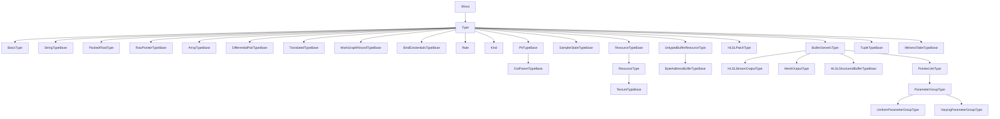

# Types

This page is the per-opcode reference for the IR `Type` family —
the type system of the Slang intermediate representation. Slang IR
makes types first-class IR values: every `IRType` is just an
`IRInst` whose result type is one of the `Kind` opcodes. The type
opcodes documented here are the building blocks of those values.
The intended reader is a compiler engineer reading IR and needing
to identify a type opcode, or writing an IR pass or backend that
manipulates types.

## Source

The entire `Type` family lives under the top-level `Type` entry that
opens at lines 19-20 of
[slang-ir-insts.lua](../../../../source/slang/slang-ir-insts.lua) and
whose entry closes at line 881. It holds **170** concrete opcodes
at `source_commit`, out of 857 in the whole instruction set — by far
the largest single family. Most leaf type opcodes are hoistable:
identical types deduplicate to one IR value, which lets an IR
type-equality check be a pointer comparison. The exceptions are the
parent/container and global entries (`Enum`, `struct`, `class` are
`parent`; `interface` is `global`) and three unflagged helper entries
(`AfterBaseType`, `MakeTensorAddressingTensorLayout`,
`MakeTensorAddressingTensorView`); the per-opcode Flags column below is
the authoritative state.

Two spelling conventions matter when reading this page against the
source. First, the generated `IROp` enumerator is `kIROp_` plus the
entry's `struct_name`, **not** its Lua key — `instEnums` in
[slang-ir.h.lua](../../../../source/slang/slang-ir.h.lua) (line 276)
emits `kIROp_$(value.struct_name)`. So the Lua key `Vec` becomes
`kIROp_VectorType`, `Array` becomes `kIROp_ArrayType`, and the key
`TextureShapeCubeDType` becomes `kIROp_TextureShapeCubeType`. The Lua
key survives as the _mnemonic_ printed by `-dump-ir`. Second, the
C++ wrapper is `IR` plus the same `struct_name`; where `struct_name`
is omitted, `process` in
[slang-ir-insts.lua](../../../../source/slang/slang-ir-insts.lua)
(line 3448) derives it from the key with `to_pascal_case`.

**Every** type opcode has a C++ wrapper. Sixteen leaf wrappers in this
family are hand-written — `IRSubpassInputType`,
`IRGLSLShaderStorageBufferType`, `IRFuncType`,
`IRTensorAddressingTensorViewType`, `IRStructType`, `IRClassType`,
`IRThisType`, `IRInterfaceType`, `IRConjunctionType`,
`IRExpandTypeOrVal`, `IRWitnessTableType` and `IRBoundInterfaceType` in
[slang-ir.h](../../../../source/slang/slang-ir.h), plus `IRSetTagType`,
`IRTaggedUnionType`, `IRElementOfSetType` and `IRUntaggedUnionType` in
[slang-ir-insts.h](../../../../source/slang/slang-ir-insts.h) (lines
3050-3081) — together with the abstract intermediates
(`IRType`, `IRBasicType`, `IRPtrTypeBase`, `IRResourceTypeBase`,
`IRArrayTypeBase`, `IRBuiltinGenericType`, ...). The remaining 154
leaves are emitted by the FIDDLE template at
[slang-ir-insts.h](../../../../source/slang/slang-ir-insts.h) lines
3113-3154, which gives each one an `isaImpl`, a `kOp` constant, and one
accessor per named Lua operand (`getElementType()`,
`getElementCount()`, ...). Note that this is why the family's wrappers
are split across two headers: the intermediates and the historically
hand-tuned leaves live in `slang-ir.h`, not in `slang-ir-insts.h`.

Builder helpers follow the same pattern. A second FIDDLE template
(same header, line 3313) generates `IRBuilder::get<StructName>(...)`
for every leaf type opcode — `getVectorType`, `getArrayType`,
`getMetalPackedVectorType`, `getSetTagType`, and so on — driven by
`getBasicTypesForBuilderMethods` in
[slang-ir.h.lua](../../../../source/slang/slang-ir.h.lua) (line 327).
Nine leaves are excluded there (line 333) because they need
hand-written logic and are declared in
[slang-ir-insts.h](../../../../source/slang/slang-ir-insts.h) /
defined in [slang-ir.cpp](../../../../source/slang/slang-ir.cpp)
instead: `BindExistentialsType`, `BoundInterfaceType`,
`BackwardDiffIntermediateContextType`, `AttributedType`,
`RefParamType`, `BorrowInParamType`, `FuncType`, and the two
identity-semantics types `StructType` and `ClassType`, which use
`createStructType` / `createClassType` rather than a deduplicating
`get*`.

Lowering from AST types is in
[slang-lower-to-ir.cpp](../../../../source/slang/slang-lower-to-ir.cpp).
The type visitor there has a small number of hand-written cases
(`visitBasicExpressionType` line 2839, `visitVectorExpressionType`
line 2844, `visitMatrixExpressionType` line 2852,
`visitArrayExpressionType` line 2861, `visitPtrType` line 2760,
`visitTupleType` line 2817, `visitValuePackType` line 2811,
`visitDifferentialPairType` line 2682) and one general mechanism that
covers most of the rest: `visitDeclRefType` (line 2796) checks for an
`IntrinsicTypeModifier` — the `__intrinsic_type(...)` attribute in the
core-module sources — and routes such a type to
`lowerSimpleIntrinsicType` (line 2879), which takes the opcode straight
out of the modifier and turns each generic argument of the `DeclRef`
into an operand of the IR type, in declaration order.
`visitResourceType`, `visitSamplerStateType`, `visitBuiltinGenericType`,
`visitUntypedBufferResourceType`, `visitHLSLPatchType` and
`visitMeshOutputType` (lines 2904-2921) all just delegate to it. The
AST-side classes these come from are catalogued in
[../ast-reference/types.md](../ast-reference/types.md).

The core-module sources that carry those `__intrinsic_type(...)`
attributes are in this page's manifest `watched_paths`:
`source/slang/core.meta.slang`, `source/slang/hlsl.meta.slang` and
[workgraph.slang](../../../../source/standard-modules/experimental/workgraph.slang)
(which declares the ten `WorkGraphRecordTypeBase` opcodes) all
resolve, so a change to any of them marks this page stale. The one
remaining omission is `source/slang/slang-ir.h.lua`, which owns both
the `kIROp_*` naming rule cited above (`instEnums`, line 276) and the
`flagMap` behind this page's Flags column (lines 228-234); the
manifest should add it.

## Family hierarchy

The nodes below are the abstract intermediate group entries the Lua
file nests under `Type`; the many concrete leaf opcodes that sit
directly under `Type` between them (`CapabilitySet`, `DynamicType`,
`AnyValueType`, `Func`, `BasicBlock`, `Vec`, `Mat`, `MetalPackedVec`,
`Atomic`, `DescriptorHandle`, `UntypedResourceHandle`,
`UntypedSamplerHandle`, the layout markers, `struct`, `class`,
`interface`, the set-theoretic types, ...) appear in the `## Opcodes`
tables rather than here.

## Opcodes

Two markers appear in the tables below:

- `†` on an operand name means the Lua entry does **not** declare that
  operand (it declares none, or uses `min_operands`); the name and
  index come from the C++ wrapper's accessors or from the construction
  site, which are the authoritative source in that case.
- `‡` after a wrapper name means the wrapper is hand-written rather
  than FIDDLE-generated, so its accessor names may differ from the Lua
  operand names.

One rule governs how every opcode below appears in `-dump-ir`.
`shouldFoldInstIntoUses`
([slang-ir.cpp](../../../../source/slang/slang-ir.cpp) lines
7822-7859) folds _all_ types into their use sites, and `dumpInstExpr`
(line 8275) prints a folded inst as its mnemonic followed by its
operand list — so a type reads as `Mnemonic(operand, ...)` at each
use (`Enum(Int)`, `StructuredBuffer(Float, Std140Layout, ...)`) and a
nullary type as the bare mnemonic (`Float`, `UntypedResourceHandle`).
The exceptions are the four _nominal_ type opcodes `struct`, `class`,
`GLSLShaderStorageBuffer` and `interface`, which are excluded from
folding and instead get their own top-level definition line that use
sites refer to by `%id`. Of those four only the first three are also
printed with their children in braces by `dumpIRParentInst` (the
special-case switch at line 8296); `interface` takes the ordinary path,
so it prints as `let %I : Type = interface(...)` with its requirement
entries in the operand list.

### Basic scalar types

All `BasicType` children are hoistable; one IR value per scalar type
per module. `IRBuilder::getBasicType(BaseType)` maps an AST `BaseType`
to the right opcode, and the generated per-type helpers
(`getVoidType`, `getIntType`, ...) wrap it.

| Opcode          | C++ wrapper       | Operands | Flags | AST origin                                                                                                 | Summary                                                                                                                        |
| --------------- | ----------------- | -------- | ----- | ---------------------------------------------------------------------------------------------------------- | ------------------------------------------------------------------------------------------------------------------------------ |
| `Void`          | `IRVoidType`      | —        | H     | `BasicExpressionType(Void)` (`visitBasicExpressionType`, line 2839, which calls `IRBuilder::getBasicType`) | The `void` type.                                                                                                               |
| `Bool`          | `IRBoolType`      | —        | H     | `BasicExpressionType(Bool)`                                                                                | `bool`.                                                                                                                        |
| `Int8`          | `IRInt8Type`      | —        | H     | `BasicExpressionType(Int8)`                                                                                | 8-bit signed integer.                                                                                                          |
| `Int16`         | `IRInt16Type`     | —        | H     | `BasicExpressionType(Int16)`                                                                               | 16-bit signed integer.                                                                                                         |
| `Int`           | `IRIntType`       | —        | H     | `BasicExpressionType(Int)`                                                                                 | Platform-default-width signed integer (always 32-bit currently).                                                               |
| `Int64`         | `IRInt64Type`     | —        | H     | `BasicExpressionType(Int64)`                                                                               | 64-bit signed integer.                                                                                                         |
| `UInt8`         | `IRUInt8Type`     | —        | H     | `BasicExpressionType(UInt8)`                                                                               | 8-bit unsigned integer.                                                                                                        |
| `UInt16`        | `IRUInt16Type`    | —        | H     | `BasicExpressionType(UInt16)`                                                                              | 16-bit unsigned integer.                                                                                                       |
| `UInt`          | `IRUIntType`      | —        | H     | `BasicExpressionType(UInt)`                                                                                | 32-bit unsigned integer.                                                                                                       |
| `UInt64`        | `IRUInt64Type`    | —        | H     | `BasicExpressionType(UInt64)`                                                                              | 64-bit unsigned integer.                                                                                                       |
| `Half`          | `IRHalfType`      | —        | H     | `BasicExpressionType(Half)`                                                                                | 16-bit floating-point.                                                                                                         |
| `Float`         | `IRFloatType`     | —        | H     | `BasicExpressionType(Float)`                                                                               | 32-bit floating-point.                                                                                                         |
| `Double`        | `IRDoubleType`    | —        | H     | `BasicExpressionType(Double)`                                                                              | 64-bit floating-point.                                                                                                         |
| `Char`          | `IRCharType`      | —        | H     | `BasicExpressionType(Char)`                                                                                | Character type used by string-literal element type.                                                                            |
| `IntPtr`        | `IRIntPtrType`    | —        | H     | `BasicExpressionType(IntPtr)`, spelled `intptr_t` in source                                                | Signed integer with pointer-equivalent width; `ssize_t` is a typedef of it (`core.meta.slang` line 24).                        |
| `UIntPtr`       | `IRUIntPtrType`   | —        | H     | `BasicExpressionType(UIntPtr)`, spelled `uintptr_t` in source                                              | Unsigned integer with pointer-equivalent width; `size_t` and `usize_t` are typedefs of it (`core.meta.slang` lines 20-22).     |
| `AfterBaseType` | `IRAfterBaseType` | —        |       | —                                                                                                          | Sentinel opcode just past the `BasicType` range; not a real type and never created, only a boundary for opcode classification. |

### Storage-only floating-point

All three are ordinary public core-module `struct`s
([core.meta.slang](../../../../source/slang/core.meta.slang) lines
1705-1751, declared under `//@public:`), so the names are usable
directly in shader source — a
`struct S { BFloat16 b; FloatE4M3 e; FloatE5M2 f; }` gives three fields
of three distinct opcodes rather than three aliases of `Half`. What
they do _not_ get is arithmetic: each conforms only to
`IFloatingPointCoopElement`, not to `__BuiltinArithmeticType`, so a
value has to be converted to a built-in floating-point type first
(`float(s.b)`), through the `extension<T : __BuiltinFloatingPointType>`
constructors at line 1754. Each also carries `[require(...)]`
capability gates — `spvFloat8EXT` / `cuda_sm_8_9` for the two 8-bit
forms, `spvBFloat16KHR` / `cuda_sm_8_0` for `BFloat16`.

| Opcode          | C++ wrapper       | Operands | Flags | AST origin                                                      | Summary                                  |
| --------------- | ----------------- | -------- | ----- | --------------------------------------------------------------- | ---------------------------------------- |
| `FloatE4M3Type` | `IRFloatE4M3Type` | —        | H     | core-module `FloatE4M3` (`lowerSimpleIntrinsicType`, line 2879) | 8-bit float (E4M3 layout); storage-only. |
| `FloatE5M2Type` | `IRFloatE5M2Type` | —        | H     | core-module `FloatE5M2`                                         | 8-bit float (E5M2 layout); storage-only. |
| `BFloat16Type`  | `IRBFloat16Type`  | —        | H     | core-module `BFloat16`                                          | bfloat16; storage-only on most targets.  |

### Strings and dynamic types

| Opcode          | C++ wrapper           | Operands | Flags | AST origin                                                   | Summary                                                                                                                                           |
| --------------- | --------------------- | -------- | ----- | ------------------------------------------------------------ | ------------------------------------------------------------------------------------------------------------------------------------------------- |
| `String`        | `IRStringType`        | —        | H     | core-module `String` (`lowerSimpleIntrinsicType`, line 2879) | Slang-language string.                                                                                                                            |
| `NativeString`  | `IRNativeStringType`  | —        | H     | core-module `NativeString`                                   | Unowned raw C-style string.                                                                                                                       |
| `DynamicType`   | `IRDynamicType`       | —        | H     | (synthesized)                                                | Type of values whose static type cannot be determined; consumed by the existential pass.                                                          |
| `AnyValueType`  | `IRAnyValueType`      | `size`   | H     | (synthesized)                                                | Type-erased value blob of a given size, used to marshal existential values across boundaries.                                                     |
| `CapabilitySet` | `IRCapabilitySetType` | —        | H     | (synthesized)                                                | Type of a capability-set value; produced by `IRBuilder::getCapabilityValue` in [slang-ir.cpp](../../../../source/slang/slang-ir.cpp) (line 2672). |

### Raw and RTTI pointers

| Opcode                    | C++ wrapper                 | Operands      | Flags | AST origin                                                    | Summary                                                                                                                                             |
| ------------------------- | --------------------------- | ------------- | ----- | ------------------------------------------------------------- | --------------------------------------------------------------------------------------------------------------------------------------------------- |
| `RawPointerType`          | `IRRawPointerType`          | —             | H     | core-module `NullPtr` (`lowerSimpleIntrinsicType`, line 2879) | Untyped pointer; also the lowered form of `nullptr`'s type, whose core-module declaration carries both `__magic_type(NullPtrType)` and this opcode. |
| `RTTIPointerType`         | `IRRTTIPointerType`         | `rTTIOperand` | H     | (synthesized)                                                 | Pointer to a runtime type-info object; see [generics-and-existentials.md](generics-and-existentials.md).                                            |
| `AfterRawPointerTypeBase` | `IRAfterRawPointerTypeBase` | —             | H     | —                                                             | Sentinel opcode just past the `RawPointerTypeBase` range; never created.                                                                            |

### Arrays

Both are built by `IRBuilder::getArrayTypeBase`
([slang-ir-insts.h](../../../../source/slang/slang-ir-insts.h) line 3534) or by the generated `getArrayType` / `getUnsizedArrayType`.

| Opcode         | C++ wrapper          | Operands                             | Flags | AST origin                                                                  | Summary              |
| -------------- | -------------------- | ------------------------------------ | ----- | --------------------------------------------------------------------------- | -------------------- |
| `Array`        | `IRArrayType`        | `elementType, elementCount, stride?` | H     | `ArrayExpressionType` (with extent) (`visitArrayExpressionType`, line 2861) | Fixed-size array.    |
| `UnsizedArray` | `IRUnsizedArrayType` | `elementType, stride?`               | H     | `ArrayExpressionType` (extent unknown)                                      | Runtime-sized array. |

### Functions and basic blocks

| Opcode       | C++ wrapper        | Operands                                                 | Flags | AST origin                                       | Summary                                                                             |
| ------------ | ------------------ | -------------------------------------------------------- | ----- | ------------------------------------------------ | ----------------------------------------------------------------------------------- |
| `Func`       | `IRFuncType`‡      | `resultType, paramTypes...`, optional trailing `IRAttr`† | H     | `FuncType` AST node (`visitFuncType`, line 2718) | Function type; result type first, then parameter types, then an optional attribute. |
| `BasicBlock` | `IRBasicBlockType` | —                                                        | H     | (synthesized)                                    | The type of an `IRBlock` value (i.e. of a branch target).                           |

### Vectors, matrices, and composite

| Opcode           | C++ wrapper               | Operands                                     | Flags | AST origin                                                                                                                                                                                                                                                                                                                                                            | Summary                                                                                                                                                                                                                                                                                                                                                                 |
| ---------------- | ------------------------- | -------------------------------------------- | ----- | --------------------------------------------------------------------------------------------------------------------------------------------------------------------------------------------------------------------------------------------------------------------------------------------------------------------------------------------------------------------- | ----------------------------------------------------------------------------------------------------------------------------------------------------------------------------------------------------------------------------------------------------------------------------------------------------------------------------------------------------------------------- |
| `Vec`            | `IRVectorType`            | `elementType, elementCount`                  | H     | `VectorExpressionType`                                                                                                                                                                                                                                                                                                                                                | Fixed-length vector.                                                                                                                                                                                                                                                                                                                                                    |
| `Mat`            | `IRMatrixType`            | `elementType, rowCount, columnCount, layout` | H     | `MatrixExpressionType`                                                                                                                                                                                                                                                                                                                                                | Fixed-shape matrix; `layout` is an int literal selecting row-major / column-major.                                                                                                                                                                                                                                                                                      |
| `MetalPackedVec` | `IRMetalPackedVectorType` | `elementType, elementCount`                  | H     | (synthesized)                                                                                                                                                                                                                                                                                                                                                         | Element-aligned, unpadded vector storage type for Metal device buffers; emitted as MSL `packed_T<N>`.                                                                                                                                                                                                                                                                   |
| `Atomic`         | `IRAtomicType`            | `elementType`                                | H     | core-module `Atomic<T>`                                                                                                                                                                                                                                                                                                                                               | Atomic-typed view of an element type.                                                                                                                                                                                                                                                                                                                                   |
| `Result`         | `IRResultType`            | `valueType, errorType`                       | H     | No AST type and no source spelling: a function's `throws E` clause lowers to `Func(T, params..., FuncThrowTypeAttr(E))` (`_lowerInfoFromFuncParameters`, line 4814), and the error-handling pass ([slang-ir-lower-error-handling.cpp](../../../../source/slang/slang-ir-lower-error-handling.cpp) lines 43 and 93) rewrites that into `Func(Result(T, E), params...)` | Sum of a success value type and an error type; `int f(int) throws MyErr` ends up as `Func(Result(Int, Enum(...)), Int)`.                                                                                                                                                                                                                                                |
| `Optional`       | `IROptionalType`          | `valueType`                                  | H     | `OptionalType` (`Optional<T>`)                                                                                                                                                                                                                                                                                                                                        | Value-or-none.                                                                                                                                                                                                                                                                                                                                                          |
| `Conditional`    | `IRConditionalType`       | `valueType, hasValue`                        | H     | (synthesized)                                                                                                                                                                                                                                                                                                                                                         | Static-condition-tagged optional; `hasValue` is an `IRInst`-valued condition.                                                                                                                                                                                                                                                                                           |
| `Enum`           | `IREnumType`              | `tagType`                                    | P     | `EnumDecl` (`visitEnumDecl`, line 12352)                                                                                                                                                                                                                                                                                                                              | Enum type; the tag type is its only content — flagged `parent`, but nothing puts the cases inside it.                                                                                                                                                                                                                                                                   |
| `Conjunction`    | `IRConjunctionType`‡      | `caseTypes...`†                              | H     | `AndType` AST node — the `&` type operator, e.g. the generic constraint `T : IA & IB` (`visitAndType`, line 2997)                                                                                                                                                                                                                                                     | Logical AND of types; `getCaseCount()` / `getCaseType(i)` read all operands. Rarely visible: `emitGenericConstraintValue` (line 12789) decomposes a conjunction used as a generic constraint into one `witness_table` parameter per case plus a `MakeTuple` of the witnesses, so the lowered generic's signature holds the separate constraints, not the `Conjunction`. |
| `Attributed`     | `IRAttributedType`        | `baseType, attrs...`†                        | H     | `unorm` / `snorm` / `Aligned` and other type modifiers                                                                                                                                                                                                                                                                                                                | A base type with one or more attached `Attr` opcodes (see [metadata.md](metadata.md)); built by `getAttributedType(baseType, count, attributes)`.                                                                                                                                                                                                                       |

### Work-graph record types

The `WorkGraphRecordTypeBase` subgroup
([slang-ir-insts.lua](../../../../source/slang/slang-ir-insts.lua)
lines 231-280) carries the ten D3D12 work-graph node input/output
record types. Every one of them is declared in
[workgraph.slang](../../../../source/standard-modules/experimental/workgraph.slang)
with `__intrinsic_type(...)` and **no** `__magic_type(...)`, so at the
AST level they are ordinary `DeclRefType`s with no dedicated C++ `Type`
subclass — their only compiler-side identity is the opcode in this
table, and `lowerSimpleIntrinsicType` is what creates it. That is why
[../ast-reference/types.md](../ast-reference/types.md) records the
absence of `NodeOutputArray` / `EmptyNodeOutputArray` on the AST side
and this page is their only home in the reference. The subgroup is
hoistable, and each `elementType` operand is the record struct `T`
supplied as the single generic argument. The node _attributes_
(`nodeLaunch`, `nodeID`, `maxRecords`, ...) are decorations, not types;
see [decorations.md](decorations.md).

| Opcode                    | C++ wrapper                     | Operands      | Flags | AST origin                                                                       | Summary                                                                     |
| ------------------------- | ------------------------------- | ------------- | ----- | -------------------------------------------------------------------------------- | --------------------------------------------------------------------------- |
| `DispatchNodeInputRecord` | `IRDispatchNodeInputRecordType` | `elementType` | H     | core-module `DispatchNodeInputRecord<T>` (`lowerSimpleIntrinsicType`, line 2879) | Read-only input record shared by a broadcasting node's whole dispatch grid. |
| `ThreadNodeInputRecord`   | `IRThreadNodeInputRecordType`   | `elementType` | H     | core-module `ThreadNodeInputRecord<T>`                                           | Per-thread input record of a thread-launch node.                            |
| `GroupNodeInputRecords`   | `IRGroupNodeInputRecordsType`   | `elementType` | H     | core-module `GroupNodeInputRecords<T>`                                           | Indexable array of input records for a coalescing node's group.             |
| `EmptyNodeInput`          | `IREmptyNodeInputType`          | —             | H     | core-module `EmptyNodeInput`                                                     | Input declaration for a node whose records carry no payload.                |
| `ThreadNodeOutputRecords` | `IRThreadNodeOutputRecordsType` | `elementType` | H     | core-module `ThreadNodeOutputRecords<T>`                                         | Per-thread allocation of output records.                                    |
| `GroupNodeOutputRecords`  | `IRGroupNodeOutputRecordsType`  | `elementType` | H     | core-module `GroupNodeOutputRecords<T>`                                          | Per-group allocation of output records.                                     |
| `NodeOutput`              | `IRNodeOutputType`              | `elementType` | H     | core-module `NodeOutput<T>`                                                      | Handle to one output node that records can be allocated for.                |
| `NodeOutputArray`         | `IRNodeOutputArrayType`         | `elementType` | H     | core-module `NodeOutputArray<T>`                                                 | Indexable array of `NodeOutput<T>` handles for a node array.                |
| `EmptyNodeOutput`         | `IREmptyNodeOutputType`         | —             | H     | core-module `EmptyNodeOutput`                                                    | Output node whose records carry no payload.                                 |
| `EmptyNodeOutputArray`    | `IREmptyNodeOutputArrayType`    | —             | H     | core-module `EmptyNodeOutputArray`                                               | Indexable array of empty output nodes.                                      |

### Differentiation types

The context-channel types are keyed by the function they belong to;
`BackwardDiffIntermediateContextType` is the one excluded from the
generated builders and has a hand-written
`IRBuilder::getBackwardDiffIntermediateContextType`.

Which of the three context-channel _families_ a function gets is
decided at semantic-checking time, by the differentiation attribute on
the primal function. Each arm of the checker's
`IBackwardDifferentiable` extension synthesis sets the `irOp` of the
two structs it synthesizes — `BwdCallable` and `MinimalContext` —
directly
([slang-check-decl.cpp](../../../../source/slang/slang-check-decl.cpp)
lines 15142-15183, 15227-15268 and 19210-19277):

| Attribute on the primal function                         | `BwdCallable` opcode                         | `MinimalContext` opcode                       |
| -------------------------------------------------------- | -------------------------------------------- | --------------------------------------------- |
| `[Differentiable]`, `[BackwardDifferentiable]`           | `BackwardDiffIntermediateContextType`        | `BackwardDiffMinimalContextType`              |
| `[TreatAsDifferentiable]`                                | `TrivialBackwardDiffIntermediateContextType` | `TrivialBackwardDiffMinimalContextType`       |
| `[BackwardDerivative(fn)]`, `[BackwardDerivativeOf(fn)]` | `BackwardContextFromLegacyBwdDiffFunc`       | `BackwardMinimalContextFromLegacyBwdDiffFunc` |

The two columns are _not_ alternatives: both structs are synthesized
for every differentiable function, and the function's
`IBackwardDifferentiable` witness table names both. For
`[Differentiable] float f(float x) { return x * x; }`, a `-dump-ir`
of a shader that calls `bwd_diff(f)` prints
`witness_table_entry(%30,BackwardDiffIntermediateContextType(%f))`
and `witness_table_entry(%29,BackwardDiffMinimalContextType(%f))` in
the same `witness_table`. Re-marking `f` `[TreatAsDifferentiable]`
replaces both with the `Trivial*` pair; moving the derivative into a
user-written `[BackwardDerivative(f_bwd)]` replaces them with the
`FromLegacy*` pair, which carries the user function as its second
operand (`BackwardContextFromLegacyBwdDiffFunc(%f, %f_bwd_diff)`).

The pair divides by role, not by state size. `apply_bwd` returns the
minimal context beside the primal result
(`Func(tuple_type(Float, BackwardDiffMinimalContextType(%f)), Float)`),
`remat` expands that into the full one
(`Func(BackwardDiffIntermediateContextType(%f), BackwardDiffMinimalContextType(%f), Float)`),
and the propagate function takes the full one.

| Opcode                                        | C++ wrapper                                     | Operands                                             | Flags | AST origin                                                      | Summary                                                                                                                                                                                                                                                                 |
| --------------------------------------------- | ----------------------------------------------- | ---------------------------------------------------- | ----- | --------------------------------------------------------------- | ----------------------------------------------------------------------------------------------------------------------------------------------------------------------------------------------------------------------------------------------------------------------- |
| `DiffPair`                                    | `IRDifferentialPairType`                        | `valueType, witnessTable`                            | H     | `DifferentialPairType` AST node                                 | Type of a `{primal, differential}` pair value; accessors are `getValueType()` / `getWitness()`.                                                                                                                                                                         |
| `DiffRefPair`                                 | `IRDifferentialPtrPairType`                     | `valueType, witnessTable`                            | H     | `DifferentialPtrPairType` AST node                              | Type of a pair of pointer-typed primal and differential.                                                                                                                                                                                                                |
| `BackwardDiffIntermediateContextType`         | `IRBackwardDiffIntermediateContextType`         | `func`                                               | H     | (synthesized)                                                   | Reverse-mode primal-side context channel for `func`.                                                                                                                                                                                                                    |
| `TrivialBackwardDiffIntermediateContextType`  | `IRTrivialBackwardDiffIntermediateContextType`  | `func`                                               | H     | (synthesized)                                                   | Trivial-context variant.                                                                                                                                                                                                                                                |
| `BackwardContextFromLegacyBwdDiffFunc`        | `IRBackwardContextFromLegacyBwdDiffFunc`        | `func, legacyBwdDiffFunc`                            | H     | (synthesized)                                                   | Bridges a legacy reverse-mode function to the current context channel.                                                                                                                                                                                                  |
| `BackwardDiffMinimalContextType`              | `IRBackwardDiffMinimalContextType`              | `func`                                               | H     | (synthesized)                                                   | Minimal context channel used when only adjoints flow back.                                                                                                                                                                                                              |
| `TrivialBackwardDiffMinimalContextType`       | `IRTrivialBackwardDiffMinimalContextType`       | `func`                                               | H     | (synthesized)                                                   | Trivial-minimal-context variant.                                                                                                                                                                                                                                        |
| `BackwardMinimalContextFromLegacyBwdDiffFunc` | `IRBackwardMinimalContextFromLegacyBwdDiffFunc` | `func, legacyBwdDiffFunc`                            | H     | (synthesized)                                                   | Bridges a legacy function to the minimal-context channel.                                                                                                                                                                                                               |
| `ForwardDiffFuncType`                         | `IRForwardDiffFuncType`                         | `baseFuncType`†                                      | H     | `FwdDiffFuncType` (`visitFwdDiffFuncType`, line 2515)           | Type of a forward-mode derivative function, derived from the base function type.                                                                                                                                                                                        |
| `BackwardDiffFuncType`                        | `IRBackwardDiffFuncType`                        | `baseFuncType`†                                      | H     | `BwdDiffFuncType` (`visitBwdDiffFuncType`, line 2522)           | Type of a reverse-mode adjoint function.                                                                                                                                                                                                                                |
| `ApplyForBwdFuncType`                         | `IRApplyForBwdFuncType`                         | `baseFuncType, contextType`†                         | H     | `ApplyForBwdFuncType` (`visitApplyForBwdFuncType`, line 2529)   | Type of a closure for reverse-mode application.                                                                                                                                                                                                                         |
| `BwdCallableFuncType`                         | `IRBwdCallableFuncType`                         | `baseFuncType, contextType`†                         | H     | `BwdCallableFuncType` (`visitBwdCallableFuncType`, line 2540)   | Callable-via-reverse-mode function type.                                                                                                                                                                                                                                |
| `RematFuncType`                               | `IRRematFuncType`                               | `baseFuncType, minimalContextType, fullContextType`† | H     | core-module `RematFuncType<FType, MinimalCtxType, FullCtxType>` | Rematerialization function type: the primal function plus the two checkpoint-context types reverse-mode autodiff threads through it. Built directly by the autodiff passes (`slang-ir-autodiff-unzip.cpp` line 914 emits it with three arguments), not by AST lowering. |

### Tensor and torch-tensor types

| Opcode                             | C++ wrapper                          | Operands                                   | Flags | AST origin                                                          | Summary                                                                                                       |
| ---------------------------------- | ------------------------------------ | ------------------------------------------ | ----- | ------------------------------------------------------------------- | ------------------------------------------------------------------------------------------------------------- |
| `TensorView`                       | `IRTensorViewType`                   | `elementType`                              | H     | core-module `TensorView<T>` (`lowerSimpleIntrinsicType`, line 2879) | GPU view of a tensor.                                                                                         |
| `TorchTensor`                      | `IRTorchTensorType`                  | `elementType`†                             | H     | core-module `TorchTensor<T>`                                        | PyTorch tensor handle; the generic argument becomes operand 0 even though the Lua entry declares no operands. |
| `ArrayListVector`                  | `IRArrayListType`                    | `elementType`                              | H     | —                                                                   | Declared but inert: nothing in `source/` creates, consumes or names this opcode at `source_commit`.           |
| `TensorAddressingTensorLayoutType` | `IRTensorAddressingTensorLayoutType` | `dimension, clampMode`                     | H     | (synthesized)                                                       | Tensor-addressing layout descriptor.                                                                          |
| `TensorAddressingTensorViewType`   | `IRTensorAddressingTensorViewType`‡  | `dimension, hasDimension, permutation...`† | H     | (synthesized)                                                       | Tensor-addressing view descriptor; `getPermutation(i)` reads operand `2 + i`.                                 |
| `MakeTensorAddressingTensorLayout` | `IRMakeTensorAddressingTensorLayout` | —                                          |       | (synthesized)                                                       | Helper that materializes a tensor layout (not strictly a type, but nested in the type subtree).               |
| `MakeTensorAddressingTensorView`   | `IRMakeTensorAddressingTensorView`   | —                                          |       | (synthesized)                                                       | Helper that materializes a tensor view.                                                                       |

### Existentials and interfaces

`interface` is the one row here that is visible as its own line in a
dump. Being nominal it is never folded into its uses, and
`visitInterfaceDecl` allocates it with one operand per requirement and
then emits the entries immediately _before_ it
([slang-lower-to-ir.cpp](../../../../source/slang/slang-lower-to-ir.cpp)
lines 12124-12130), so the entries print as their own top-level
`interface_req_entry(<requirement key>, <requirement type>)` lines and
the `interface` line lists them by `%id`. For `interface IShape { float
area(); }` the entry for `area` is
`interface_req_entry(%key, Func(Float, this_type(%IShape)))`.

| Opcode             | C++ wrapper              | Operands                                                          | Flags | AST origin                                         | Summary                                                                                                                                                                                     |
| ------------------ | ------------------------ | ----------------------------------------------------------------- | ----- | -------------------------------------------------- | ------------------------------------------------------------------------------------------------------------------------------------------------------------------------------------------- |
| `BindExistentials` | `IRBindExistentialsType` | `baseType, (type, witness) pairs...`†                             | H     | (synthesized)                                      | `BindExistentials<B, T0, w0, ...>`; binds each of `B`'s existential parameters.                                                                                                             |
| `BoundInterface`   | `IRBoundInterfaceType`‡  | `interfaceType, concreteType, witnessTable`† (`min_operands = 3`) | H     | (synthesized)                                      | Specialization of `BindExistentials` where the base is known to be an interface.                                                                                                            |
| `interface`        | `IRInterfaceType`‡       | `requirements: interface_req_entry...`†                           | G     | `InterfaceDecl` (`visitInterfaceDecl`, line 12061) | Interface type; requirements are operands (`getRequirementCount()` is `getOperandCount()`), not children — see [structure.md](structure.md) for the contrast with `witness_table` children. |
| `associated_type`  | `IRAssociatedType`       | `constraintTypes...`                                              | H     | `AssocTypeDecl` lowering                           | Associated type of an interface.                                                                                                                                                            |
| `this_type`        | `IRThisType`‡            | `interfaceType`                                                   | H     | `ThisType` AST node                                | The "self" type of an interface or extension; the accessor is spelled `getConstraintType()`.                                                                                                |
| `rtti_type`        | `IRRTTIType`             | —                                                                 | H     | (synthesized)                                      | Type of `IRRTTIObject` values.                                                                                                                                                              |
| `rtti_handle_type` | `IRRTTIHandleType`       | —                                                                 | H     | (synthesized)                                      | Integer-keyed handle to an RTTI object.                                                                                                                                                     |

### Witness-table types

Both are built by `IRBuilder::getWitnessTableType`.

| Opcode               | C++ wrapper            | Operands   | Flags | AST origin                                                              | Summary                                                                                                                |
| -------------------- | ---------------------- | ---------- | ----- | ----------------------------------------------------------------------- | ---------------------------------------------------------------------------------------------------------------------- |
| `witness_table_t`    | `IRWitnessTableType`‡  | `baseType` | H     | `SubtypeWitness` lowering (`IRBuilder::getWitnessTableType`, line 2395) | Type of a `witness_table` value parameterized by the interface it conforms to; the accessor is `getConformanceType()`. |
| `witness_table_id_t` | `IRWitnessTableIDType` | `baseType` | H     | (synthesized)                                                           | Integer-id form of a witness-table type; used during dynamic-dispatch lowering before being replaced with `uint`.      |

### Pointer types

The first five entries share `PtrTypeBase`'s four-operand layout, and
`IRPtrTypeBase`
([slang-ir.h](../../../../source/slang/slang-ir.h) line 1583) reads
them with `getValueType()`, `getAccessQualifier()`, `getAddressSpace()`
and `getDataLayout()`, defaulting to `AccessQualifier::ReadWrite` and
`AddressSpace::Generic` when the optional operands are absent. The
four parameter-mode variants are not chosen from a dedicated AST type
alone: `lowerFuncType`-style parameter lowering switches on
`paramInfo.actualParamPassingModeToUse` at
[slang-lower-to-ir.cpp](../../../../source/slang/slang-lower-to-ir.cpp)
line 4727 and wraps the parameter's lowered type accordingly.

| Opcode                  | C++ wrapper                   | Operands                                                                | Flags | AST origin                                               | Summary                                                                                                           |
| ----------------------- | ----------------------------- | ----------------------------------------------------------------------- | ----- | -------------------------------------------------------- | ----------------------------------------------------------------------------------------------------------------- |
| `Ptr`                   | `IRPtrType`                   | `valueType, accessQualifierOperand?, addressSpaceOperand?, dataLayout?` | H     | `PtrType` AST node (`visitPtrType`, line 2760)           | Pointer to a value of `valueType`.                                                                                |
| `RefParam`              | `IRRefParamType`              | (same as `Ptr`)                                                         | H     | `RefParamType` (`ParamPassingMode::Ref`)                 | `ref` parameter type.                                                                                             |
| `BorrowInParam`         | `IRBorrowInParamType`         | (same as `Ptr`)                                                         | H     | `BorrowInParamType` (`ParamPassingMode::BorrowIn`)       | Read-only borrowed `in` parameter type.                                                                           |
| `PseudoPtr`             | `IRPseudoPtrType`             | (same as `Ptr`)                                                         | H     | (synthesized)                                            | Logical pointer on targets that cannot represent real pointers; legalized away by the buffer-element-type passes. |
| `SPIRVUntypedPtr`       | `IRSPIRVUntypedPtrType`       | (same as `Ptr`)                                                         | H     | (synthesized)                                            | Pointer that keeps a logical pointee type in the IR but is emitted as `OpTypeUntypedPointerKHR`.                  |
| `OutParam`              | `IROutParamType`              | `valueType`                                                             | H     | `OutParamType` (`ParamPassingMode::Out`)                 | `out` parameter type.                                                                                             |
| `BorrowInOutParam`      | `IRBorrowInOutParamType`      | `valueType`                                                             | H     | `BorrowInOutParamType` (`ParamPassingMode::BorrowInOut`) | `inout` parameter type (read/write borrow).                                                                       |
| `ComPtr`                | `IRComPtrType`                | `valueType`                                                             | H     | core-module `ComPtr<T>`                                  | COM reference-counted pointer.                                                                                    |
| `NativePtr`             | `IRNativePtrType`             | `valueType`                                                             | H     | core-module `NativePtr<T>`                               | Native pointer to a managed resource.                                                                             |
| `DescriptorHandle`      | `IRDescriptorHandleType`      | `resourceType`                                                          | H     | core-module `DescriptorHandle<T>`                        | Bindless handle to an opaque resource.                                                                            |
| `UntypedResourceHandle` | `IRUntypedResourceHandleType` | —                                                                       | H     | core-module `UntypedResourceHandle`                      | Opaque handle produced by `ResourceDescriptorHeap[i]`; nullary, because the heap index lives in the value.        |
| `UntypedSamplerHandle`  | `IRUntypedSamplerHandleType`  | —                                                                       | H     | core-module `UntypedSamplerHandle`                       | Sampler-side counterpart produced by `SamplerDescriptorHeap[j]`.                                                  |

### Sampler and buffer-layout types

Six of the buffer-layout markers are real core-module types that
satisfy `IBufferDataLayout`
([hlsl.meta.slang](../../../../source/slang/hlsl.meta.slang) lines
23-71) and reach the IR through `lowerSimpleIntrinsicType`; the other
four are chosen by the target layout logic in
[slang-ir-layout.cpp](../../../../source/slang/slang-ir-layout.cpp)
(lines 1030-1061) and have no source spelling.

Where a named marker lands is the buffer type's data-layout operand,
not a different buffer opcode: `L` is the second generic parameter of
`StructuredBuffer<T, L : IBufferDataLayout = DefaultDataLayout>`
(same file, line 5970), so `StructuredBuffer<float, Std140DataLayout>
b;` gives `b` the type `StructuredBuffer(Float, Std140Layout, ...)`
while an unannotated `RWStructuredBuffer<float>` gets
`RWStructuredBuffer(Float, DefaultLayout, ...)`. Two of the six are
themselves capability-gated — `Std140DataLayout` and
`Std430DataLayout` carry `[require(spirv)]` / `[require(glsl)]`.

| Opcode                      | C++ wrapper                             | Operands | Flags | AST origin                                                         | Summary                                                      |
| --------------------------- | --------------------------------------- | -------- | ----- | ------------------------------------------------------------------ | ------------------------------------------------------------ |
| `SamplerState`              | `IRSamplerStateType`                    | —        | H     | core-module `SamplerState` (`lowerSimpleIntrinsicType`, line 2879) | Sampler state.                                               |
| `SamplerComparisonState`    | `IRSamplerComparisonStateType`          | —        | H     | core-module `SamplerComparisonState`                               | Comparison-style sampler state.                              |
| `GLSLAtomicUint`            | `IRGLSLAtomicUintType`                  | —        | H     | GLSL-module `atomic_uint`                                          | GLSL atomic-counter placeholder; mangled during compilation. |
| `DefaultLayout`             | `IRDefaultBufferLayoutType`             | —        | H     | core-module `DefaultDataLayout`                                    | Default buffer-layout marker.                                |
| `DefaultPushConstantLayout` | `IRDefaultPushConstantBufferLayoutType` | —        | H     | core-module `DefaultPushConstantDataLayout`                        | Default push-constant layout marker.                         |
| `Std140Layout`              | `IRStd140BufferLayoutType`              | —        | H     | core-module `Std140DataLayout`                                     | std140 layout marker.                                        |
| `Std430Layout`              | `IRStd430BufferLayoutType`              | —        | H     | core-module `Std430DataLayout`                                     | std430 layout marker.                                        |
| `ScalarLayout`              | `IRScalarBufferLayoutType`              | —        | H     | core-module `ScalarDataLayout`                                     | Scalar layout marker.                                        |
| `CLayout`                   | `IRCBufferLayoutType`                   | —        | H     | core-module `CDataLayout`                                          | C-style buffer layout marker.                                |
| `D3DConstantBufferLayout`   | `IRD3DConstantBufferLayoutType`         | —        | H     | (synthesized)                                                      | D3D constant-buffer layout marker.                           |
| `MetalParameterBlockLayout` | `IRMetalParameterBlockLayoutType`       | —        | H     | (synthesized)                                                      | Metal parameter-block layout marker.                         |
| `CUDALayout`                | `IRCUDABufferLayoutType`                | —        | H     | (synthesized)                                                      | CUDA buffer layout marker.                                   |
| `LLVMLayout`                | `IRLLVMBufferLayoutType`                | —        | H     | (synthesized)                                                      | LLVM buffer layout marker.                                   |

### Resource and texture types

Nearly every row here is a core-module type declared with
`__intrinsic_type(...)`, so the operands are exactly the generic
arguments of that declaration in order. Several of the wrappers get
their accessors from an abstract intermediate rather than from their own
Lua entry: `IRBuiltinGenericType` supplies `getElementType()` (operand
0), `IRUniformParameterGroupType` and
`IRHLSLStructuredBufferTypeBase` add `getDataLayout()` (operand 1 if
present), `IRHLSLPatchType` adds `getElementCount()`, and
`IRMeshOutputType` adds `getMaxElementCount()`.

| Opcode                               | C++ wrapper                                    | Operands                                                                                      | Flags | AST origin                                                                            | Summary                                                                                                                                                                                                                                                                        |
| ------------------------------------ | ---------------------------------------------- | --------------------------------------------------------------------------------------------- | ----- | ------------------------------------------------------------------------------------- | ------------------------------------------------------------------------------------------------------------------------------------------------------------------------------------------------------------------------------------------------------------------------------ |
| `SubpassInputType`                   | `IRSubpassInputType`‡                          | `elementType, isMultisampleInst`                                                              | H     | core-module `SubpassInput` / `SubpassInputMS`                                         | Vulkan subpass input type.                                                                                                                                                                                                                                                     |
| `TextureFootprintType`               | `IRTextureFootprintType`                       | `elementType`                                                                                 | H     | core-module `__TextureFootprintData<let ND : int>` (`hlsl.meta.slang` line 26462)     | Texture-footprint query result type. The Lua operand is _named_ `elementType`, but the single generic argument `lowerSimpleIntrinsicType` puts there is the dimension count `ND`, an `IRIntLit` — so `getElementType()` returns the dimensionality, not an element type.       |
| `TextureShape1DType`                 | `IRTextureShape1DType`                         | —                                                                                             | H     | (synthesized)                                                                         | Shape marker used as `TextureType`'s `shape` operand for `Texture1D`.                                                                                                                                                                                                          |
| `TextureShape2DType`                 | `IRTextureShape2DType`                         | —                                                                                             | H     | (synthesized)                                                                         | Shape marker for `Texture2D`.                                                                                                                                                                                                                                                  |
| `TextureShape3DType`                 | `IRTextureShape3DType`                         | —                                                                                             | H     | (synthesized)                                                                         | Shape marker for `Texture3D`.                                                                                                                                                                                                                                                  |
| `TextureShapeCubeDType`              | `IRTextureShapeCubeType`                       | —                                                                                             | H     | (synthesized)                                                                         | Shape marker for `TextureCube`; note the enum is `kIROp_TextureShapeCubeType`, without the `D`.                                                                                                                                                                                |
| `TextureShapeBufferType`             | `IRTextureShapeBufferType`                     | —                                                                                             | H     | (synthesized)                                                                         | Shape marker for `Buffer<T>`.                                                                                                                                                                                                                                                  |
| `TextureType`                        | `IRTextureType`                                | `elementType, shape, isArray, isMS, sampleCount, accessOperand, isShadow, isCombined, format` | H     | `TextureType` AST node                                                                | Texture type; every attribute is a separate operand so one opcode covers all variants.                                                                                                                                                                                         |
| `GLSLImageType`                      | `IRGLSLImageType`                              | same nine-operand layout as `TextureType`†                                                    | H     | (synthesized)                                                                         | GLSL image-type counterpart of `TextureType`; the only entry in the file with `use_other = true`, whose extra opcode-word bits hold the resource's `TextureFlavor`.                                                                                                            |
| `ByteAddressBuffer`                  | `IRHLSLByteAddressBufferType`                  | —                                                                                             | H     | core-module `ByteAddressBuffer`                                                       | `ByteAddressBuffer`.                                                                                                                                                                                                                                                           |
| `RWByteAddressBuffer`                | `IRHLSLRWByteAddressBufferType`                | —                                                                                             | H     | core-module `RWByteAddressBuffer`                                                     | `RWByteAddressBuffer`.                                                                                                                                                                                                                                                         |
| `RasterizerOrderedByteAddressBuffer` | `IRHLSLRasterizerOrderedByteAddressBufferType` | —                                                                                             | H     | core-module `RasterizerOrderedByteAddressBuffer`                                      | `RasterizerOrderedByteAddressBuffer`.                                                                                                                                                                                                                                          |
| `RaytracingAccelerationStructure`    | `IRRaytracingAccelerationStructureType`        | —                                                                                             | H     | core-module `RaytracingAccelerationStructure`                                         | Raytracing acceleration structure.                                                                                                                                                                                                                                             |
| `InputPatch`                         | `IRHLSLInputPatchType`                         | `elementType, elementCount`                                                                   | H     | `HLSLInputPatchType`                                                                  | HLSL `InputPatch<T,N>`.                                                                                                                                                                                                                                                        |
| `OutputPatch`                        | `IRHLSLOutputPatchType`                        | `elementType, elementCount`                                                                   | H     | `HLSLOutputPatchType`                                                                 | HLSL `OutputPatch<T,N>`.                                                                                                                                                                                                                                                       |
| `GLSLInputAttachment`                | `IRGLSLInputAttachmentType`                    | —                                                                                             | H     | `GLSLInputAttachmentType`                                                             | GLSL input attachment. Only consumer located at `source_commit` is the unsupported-inst check in [slang-ir-check-unsupported-inst.cpp](../../../../source/slang/slang-ir-check-unsupported-inst.cpp); no producer was found in the watched paths.                              |
| `PointStream`                        | `IRHLSLPointStreamType`                        | `elementType`                                                                                 | H     | core-module `PointStream<T>`                                                          | HLSL geometry-shader point stream.                                                                                                                                                                                                                                             |
| `LineStream`                         | `IRHLSLLineStreamType`                         | `elementType`                                                                                 | H     | core-module `LineStream<T>`                                                           | HLSL geometry-shader line stream.                                                                                                                                                                                                                                              |
| `TriangleStream`                     | `IRHLSLTriangleStreamType`                     | `elementType`                                                                                 | H     | core-module `TriangleStream<T>`                                                       | HLSL geometry-shader triangle stream.                                                                                                                                                                                                                                          |
| `Vertices`                           | `IRVerticesType`                               | `elementType, maxVertices`                                                                    | H     | core-module `OutputVertices<T, N>` (`core.meta.slang` line 2647)                      | Mesh-shader vertex output array.                                                                                                                                                                                                                                               |
| `Indices`                            | `IRIndicesType`                                | `elementType, maxIndices`                                                                     | H     | core-module `OutputIndices<T, N>` (`core.meta.slang` line 2687)                       | Mesh-shader index output array.                                                                                                                                                                                                                                                |
| `Primitives`                         | `IRPrimitivesType`                             | `elementType, maxPrimitives`                                                                  | H     | core-module `OutputPrimitives<T, N>` (`core.meta.slang` line 2725)                    | Mesh-shader primitive output array.                                                                                                                                                                                                                                            |
| `metal::mesh`                        | `IRMetalMeshType`                              | `verticesType, primitivesType, numVertices, numPrimitives, topology`                          | H     | (synthesized)                                                                         | Metal mesh-shader mesh-output type, built by varying-param legalization ([slang-ir-legalize-varying-params.cpp](../../../../source/slang/slang-ir-legalize-varying-params.cpp) line 4718) when it rewrites the three mesh output arrays above into one Metal `mesh` parameter. |
| `mesh_grid_properties`               | `IRMetalMeshGridPropertiesType`                | —                                                                                             | H     | (synthesized)                                                                         | Metal mesh-grid-properties type, built by the same pass (line 4590).                                                                                                                                                                                                           |
| `StructuredBuffer`                   | `IRHLSLStructuredBufferType`                   | `elementType, dataLayout?`†                                                                   | H     | core-module `StructuredBuffer<T, L>`                                                  | HLSL `StructuredBuffer<T>`; `L` is the SPIR-V data layout.                                                                                                                                                                                                                     |
| `RWStructuredBuffer`                 | `IRHLSLRWStructuredBufferType`                 | `elementType, dataLayout?`†                                                                   | H     | core-module `RWStructuredBuffer<T, L>`                                                | HLSL `RWStructuredBuffer<T>`.                                                                                                                                                                                                                                                  |
| `RasterizerOrderedStructuredBuffer`  | `IRHLSLRasterizerOrderedStructuredBufferType`  | `elementType, dataLayout?`†                                                                   | H     | core-module `RasterizerOrderedStructuredBuffer<T, L>`                                 | HLSL `RasterizerOrderedStructuredBuffer<T>`.                                                                                                                                                                                                                                   |
| `AppendStructuredBuffer`             | `IRHLSLAppendStructuredBufferType`             | `elementType, dataLayout?`†                                                                   | H     | core-module `AppendStructuredBuffer<T, L>`                                            | HLSL `AppendStructuredBuffer<T>`.                                                                                                                                                                                                                                              |
| `ConsumeStructuredBuffer`            | `IRHLSLConsumeStructuredBufferType`            | `elementType, dataLayout?`†                                                                   | H     | core-module `ConsumeStructuredBuffer<T, L>`                                           | HLSL `ConsumeStructuredBuffer<T>`.                                                                                                                                                                                                                                             |
| `ConstantBuffer`                     | `IRConstantBufferType`                         | `elementType, layoutType`                                                                     | H     | core-module `ConstantBuffer<T, L>`                                                    | `ConstantBuffer<T>`.                                                                                                                                                                                                                                                           |
| `TextureBuffer`                      | `IRTextureBufferType`                          | `elementType`                                                                                 | H     | core-module `TextureBuffer<T>`                                                        | `TextureBuffer<T>`.                                                                                                                                                                                                                                                            |
| `ParameterBlock`                     | `IRParameterBlockType`                         | `elementType, dataLayout?`† (`min_operands = 1`)                                              | H     | core-module `ParameterBlock<T>`                                                       | `ParameterBlock<T>`.                                                                                                                                                                                                                                                           |
| `GLSLInputParameterGroup`            | `IRGLSLInputParameterGroupType`                | `elementType`†                                                                                | H     | —                                                                                     | GLSL input parameter group. No producer was found in the watched paths at `source_commit`; only the `ParameterGroupType` base class relies on it.                                                                                                                              |
| `GLSLOutputParameterGroup`           | `IRGLSLOutputParameterGroupType`               | `elementType`†                                                                                | H     | (synthesized)                                                                         | GLSL output parameter group, built by the hand-written `IRBuilder::getGLSLOutputParameterGroupType` ([slang-ir.cpp](../../../../source/slang/slang-ir.cpp) line 3023) during GLSL varying-output legalization.                                                                 |
| `GLSLShaderStorageBuffer`            | `IRGLSLShaderStorageBufferType`‡               | `valueType, dataLayout?`                                                                      | H     | core-module `GLSLShaderStorageBuffer` (`hlsl.meta.slang` line 77)                     | GLSL shader storage buffer.                                                                                                                                                                                                                                                    |
| `RayQuery`                           | `IRRayQueryType`                               | `rayFlags`† (`min_operands = 1`)                                                              | H     | core-module `RayQuery<let rayFlagsGeneric>`                                           | Raytracing query state; the operand is the compile-time ray-flags value.                                                                                                                                                                                                       |
| `HitObject`                          | `IRHitObjectType`                              | —                                                                                             | H     | core-module `HitObject`                                                               | Raytracing hit object.                                                                                                                                                                                                                                                         |
| `CoopVectorType`                     | `IRCoopVectorType`                             | `elementType, elementCount`                                                                   | H     | core-module `CoopVec<T, let N : int>`                                                 | Cooperative vector type.                                                                                                                                                                                                                                                       |
| `CoopMatrixType`                     | `IRCoopMatrixType`                             | `elementType, scope, rowCount, columnCount, matrixUse`                                        | H     | core-module `CoopMat<T, let S : MemoryScope, let M, let N, let R : CoopMatMatrixUse>` | Cooperative matrix type; the five operands are exactly that generic argument list.                                                                                                                                                                                             |
| `DynamicResource`                    | `IRDynamicResourceType`                        | `kind`†                                                                                       | H     | core-module `__DynamicResource<let kind = __DynamicResourceKind.General>`             | Opaque resource type that can be dynamically cast to a concrete resource type. The Lua entry declares no operands, but the `kind` generic argument still becomes operand 0; no accessor reads it at `source_commit`.                                                           |

### Struct and class containers

The struct and class opcodes act both as types and as parent
containers for their field and key children. The container side is
documented in [structure.md](structure.md); the rows here describe
their role as types. `interface` is documented above under
_Existentials and interfaces_, and as a container in
[structure.md](structure.md). Both are built by
`IRBuilder::createStructType` / `createClassType` — they have identity
semantics, so they are excluded from the deduplicating generated
builders.

| Opcode   | C++ wrapper     | Operands            | Flags | AST origin                                     | Summary                                                       |
| -------- | --------------- | ------------------- | ----- | ---------------------------------------------- | ------------------------------------------------------------- |
| `struct` | `IRStructType`‡ | (children: `field`) | P     | `AggTypeDecl` (`visitAggTypeDecl`, line 12381) | User-defined struct type; `getFields()` filters the children. |
| `class`  | `IRClassType`‡  | (children: `field`) | P     | `AggTypeDecl` for a `class`                    | User-defined class type.                                      |

### Tuples, packs, and target tuples

| Opcode            | C++ wrapper          | Operands                         | Flags | AST origin                                                 | Summary                                                                                                                                  |
| ----------------- | -------------------- | -------------------------------- | ----- | ---------------------------------------------------------- | ---------------------------------------------------------------------------------------------------------------------------------------- |
| `tuple_type`      | `IRTupleType`        | `types...`                       | H     | `TupleType` AST node (`visitTupleType`, line 2817)         | Heterogeneous tuple; elements are read with `GetTupleElement`.                                                                           |
| `TypePack`        | `IRTypePack`         | `types...`                       | H     | `ConcreteTypePack` / `TypePack`                            | Variadic-generic type pack; satisfies a flattening identity.                                                                             |
| `TargetTuple`     | `IRTargetTupleType`  | `types...`                       | H     | (synthesized)                                              | Tuple type that survives target-tuple lowering instead of being expanded to a struct.                                                    |
| `TupleName`       | `IRTupleNameType`    | `name`                           | H     | (synthesized)                                              | Sentinel last operand of a `tuple_type` carrying a custom struct name for lowering; created by the autodiff unzip pass.                  |
| `ValuePackType`   | `IRValuePackType`    | `elementType`                    | H     | `ValuePackType` AST node (`visitValuePackType`, line 2811) | Type of a variadic-generic value-pack parameter; see also [misc.md](misc.md).                                                            |
| `ExpandTypeOrVal` | `IRExpandTypeOrVal`‡ | `patternType, capturedPacks...`† | H     | `ExpandType` / expand `Val` lowering (lines 2186, 2220)    | Type-side representation of an `expand T` over one or more captured packs; `getPatternType()`, `getCaptureCount()`, `getCaptureType(i)`. |

### SPIR-V literals and kinds

The four `Kind` entries are the "types of types". Note that two of
their Lua keys (`Type` and `Rate`) repeat the names of enclosing group
entries, so their mnemonics collide in IR dumps while their
enumerators do not: they are `kIROp_TypeKind` and `kIROp_RateKind`.

| Opcode              | C++ wrapper               | Operands    | Flags | AST origin    | Summary                                                                                                                                                                                                                                        |
| ------------------- | ------------------------- | ----------- | ----- | ------------- | ---------------------------------------------------------------------------------------------------------------------------------------------------------------------------------------------------------------------------------------------- |
| `spirvLiteralType`  | `IRSPIRVLiteralType`      | `valueType` | H     | (synthesized) | Marks a value type that must be emitted as a SPIR-V literal operand; created by `getSPIRVLiteralType` in [slang-ir-glsl-liveness.cpp](../../../../source/slang/slang-ir-glsl-liveness.cpp) and printed as `spirv_literal` by the GLSL emitter. |
| `type_t`            | `IRTypeType`              | —           | H     | (synthesized) | Type of a type — the type of `IRType`-valued operands such as generic arguments.                                                                                                                                                               |
| `Type`              | `IRTypeKind`              | —           | H     | (synthesized) | Kind of ordinary types.                                                                                                                                                                                                                        |
| `TypeParameterPack` | `IRTypeParameterPackKind` | —           | H     | (synthesized) | Kind of type-parameter packs.                                                                                                                                                                                                                  |
| `Rate`              | `IRRateKind`              | —           | H     | (synthesized) | Kind of `Rate` values.                                                                                                                                                                                                                         |
| `Generic`           | `IRGenericKind`           | —           | H     | (synthesized) | Kind of generic values.                                                                                                                                                                                                                        |

### Rates and rate-qualified types

| Opcode             | C++ wrapper           | Operands          | Flags | AST origin                                                                             | Summary                                                         |
| ------------------ | --------------------- | ----------------- | ----- | -------------------------------------------------------------------------------------- | --------------------------------------------------------------- |
| `ConstExpr`        | `IRConstExprRate`     | —                 | H     | `constexpr` rate qualifier (`getRateQualifiedType` over `getConstExprRate`, line 4556) | Compile-time-constant rate.                                     |
| `SpecConst`        | `IRSpecConstRate`     | —                 | H     | specialization-constant qualifier                                                      | Specialization-constant rate (Vulkan).                          |
| `GroupShared`      | `IRGroupSharedRate`   | —                 | H     | `groupshared` modifier                                                                 | Group-shared (workgroup) memory rate.                           |
| `ActualGlobalRate` | `IRActualGlobalRate`  | —                 | H     | (synthesized)                                                                          | The actual global rate; used to distinguish module-scope state. |
| `RateQualified`    | `IRRateQualifiedType` | `rate, valueType` | H     | (synthesized)                                                                          | A value type plus a `Rate` qualifier.                           |

### Set-theoretic types

These types represent membership and tagging in sets of types or
witness tables; the type-flow specialization passes use them to
narrow existential possibilities. Their wrappers are hand-written in
[slang-ir-insts.h](../../../../source/slang/slang-ir-insts.h) and each
takes a single `IRSetBase` operand — the set opcodes themselves
(`TypeSet`, `WitnessTableSet`, ...) belong to
[generics-and-existentials.md](generics-and-existentials.md).

| Opcode              | C++ wrapper            | Operands                    | Flags | AST origin    | Summary                                                                            |
| ------------------- | ---------------------- | --------------------------- | ----- | ------------- | ---------------------------------------------------------------------------------- |
| `UntaggedUnionType` | `IRUntaggedUnionType`‡ | `set`†                      | H     | (synthesized) | Type whose value's type is one of those in the operand set; union without a tag.   |
| `ElementOfSetType`  | `IRElementOfSetType`‡  | `set`†                      | H     | (synthesized) | Type whose value must be an element of the operand set.                            |
| `SetTagType`        | `IRSetTagType`‡        | `set`†                      | H     | (synthesized) | Tag type for a set; a value of this type picks one element of the set at run time. |
| `TaggedUnionType`   | `IRTaggedUnionType`‡   | `witnessTableSet, typeSet`† | H     | (synthesized) | Tagged union; the witness-table set comes **first**.                               |
| `OptionalNoneType`  | `IROptionalNoneType`   | —                           | H     | (synthesized) | Optional value statically known to be `none`.                                      |

## Notable opcodes

### `Vec` and `Mat`

`Vec(elementType, elementCount)` is the IR encoding of HLSL
`vector<T,N>`. `Mat(elementType, rowCount, columnCount, layout)`
adds two shape operands and a `layout` int literal holding a
`SlangMatrixLayoutMode` value — `0` unknown, `1` row-major, `2`
column-major, the same three values the core module splices into
`kRowMajorMatrixLayout` / `kColumnMajorMatrixLayout`
([core.meta.slang](../../../../source/slang/core.meta.slang) lines
2295-2296). The fourth generic parameter of `matrix<T, R, C, L>`
defaults to _unknown_ (line 2301) and `visitMatrixExpressionType`
(line 2858) lowers whatever the AST holds straight into operand 3, so
a plain `float4x4` lowers with `0`; a `row_major` / `column_major`
modifier pins `1` / `2` at check time, and `specializeMatrixLayout`
rewrites a surviving `0` to the target's `-matrix-layout-row-major` /
`-matrix-layout-column-major` setting (row-major when unset) before
emit. Both types are hoistable, so the same vector type appears as a
single IR value across the module — which is why structural
type-equality is implemented as an `IRInst*` comparison.

### `MetalPackedVec`

`MetalPackedVec(elementType, elementCount)` mirrors `Vec` in shape but
carries Metal's natural (scalar-aligned, tightly packed) buffer layout
rather than the std-style padded layout of a plain `Vec` — for example a
3-vector of 32-bit floats occupies 12 bytes with no trailing padding. It
has no AST origin; it is synthesized by the Metal buffer-element-type
legalization in
[slang-ir-lower-buffer-element-type.cpp](../../../../source/slang/slang-ir-lower-buffer-element-type.cpp)
via the generated `IRBuilder::getMetalPackedVectorType` when rewriting
the element type of a Metal device buffer. Its size and layout
contribution are computed in
[slang-ir-layout.cpp](../../../../source/slang/slang-ir-layout.cpp), and
the Metal emitter in
[slang-emit-metal.cpp](../../../../source/slang/slang-emit-metal.cpp)
prints it as MSL `packed_T<N>` (e.g. `packed_float3`).

### `Func`

`Func(resultType, paramTypes...)` is the IR's function-type encoding.
The result type is the leading operand and the remaining operands are
parameter types in declaration order — but the operand list may also
carry **one trailing attribute**, typically an `IRFuncThrowTypeAttr`
recording a `throws` clause. `IRFuncType`
([slang-ir.h](../../../../source/slang/slang-ir.h) lines 1626-1647)
distinguishes it from a parameter type by whether it derives from
`IRAttr`, and `getParamCount()` / `getParamType(i)` / `getParamTypes()`
skip it so callers only see real parameters; `getAttr()` returns it. Do
not read the last operand as a parameter type. `Func` is hoistable, so
two functions with identical signatures share one type value, and it is
one of the nine types excluded from the generated builder methods —
`getFuncType` is hand-written because the result and parameters have
historically been passed in the opposite order.

### `Array` vs `UnsizedArray`

`Array(elementType, elementCount, stride?)` represents a fixed-size
array; `elementCount` is typically an integer literal. `UnsizedArray`
omits the `elementCount` operand and represents an array of
runtime extent — the common form on the GPU side of variable-size
buffer access. The optional trailing `stride` operand records the
per-element stride for layout purposes, at index 2 for `Array` and
index 1 for `UnsizedArray`; `IRArrayTypeBase::getArrayStride()` keys
off the opcode to pick the right index, which is why code should call
that accessor rather than indexing operands directly.

### `Enum`

`Enum(tagType)` is a _parent_ opcode (`P` flag). Its single operand
is the `tagType` — the underlying integer type that stores the
enum's value — and it is built by `IRBuilder::createEnumType` from
that tag type during `EnumDecl` lowering
([slang-lower-to-ir.cpp](../../../../source/slang/slang-lower-to-ir.cpp)
line 12364). The cases are neither operands nor children. The `P` flag
only means the opcode _can_ hold children; `createEnumType`
([slang-ir.cpp](../../../../source/slang/slang-ir.cpp) line 5337)
creates the inst with the tag-type operand alone, and
`visitEnumCaseDecl` (line 12334) lowers each case to the value of its
tag expression — an ordinary constant whose _type_ is the `Enum`, not a
member of it. So there is nothing to enumerate on the inst, and because
`Enum` is not one of the nominal opcodes it is folded into its uses:
`enum Color { Red = 3, Green = 7 }` shows up only as `Enum(Int)`
wherever the type is mentioned.

### `Ptr` and the access-qualifier / address-space operands

`Ptr(valueType, accessQualifier?, addressSpace?, dataLayout?)`
carries up to three optional `IRIntLit` operands beyond the
pointee type. `accessQualifier` distinguishes read-only / write-only /
read-write pointers; `addressSpace` records the target-specific
storage class (global, shared, constant, ...); `dataLayout`
points to a buffer-layout marker (`Std140Layout`,
`D3DConstantBufferLayout`, ...) when the pointer is into a
laid-out buffer. Because the operands are optional and positional,
`IRPtrTypeBase` supplies defaults — `AccessQualifier::ReadWrite` and
`AddressSpace::Generic` — for a pointer created with fewer operands, so
`hasAddressSpace()` is the right way to ask whether an address space
was really recorded.

### `SPIRVUntypedPtr`

`SPIRVUntypedPtr` has exactly `Ptr`'s operand layout and, like `Ptr`,
keeps the logical pointee type and data layout in the IR; what differs
is emission. The SPIR-V backend writes it as
`OpTypeUntypedPointerKHR` and lowers field and element addresses
through `OpUntypedAccessChainKHR`
([slang-emit-spirv.cpp](../../../../source/slang/slang-emit-spirv.cpp)).
It is never produced by lowering:
`processConstantBufferDescriptorHeapLoad` in
`slang-ir-spirv-legalize.cpp` (lines 1301-1337) retypes a
`ConstantBuffer<T>` fetched from a descriptor heap to a Uniform
`SPIRVUntypedPtr` so the uniform-buffer descriptor kind survives while
nested arrays are still addressed logically, without a pointer-type
`ArrayStride`. The same pass propagates the untyped-ness: taking a
field or element address off an untyped base produces another
`SPIRVUntypedPtr` rather than a `Ptr`. The heap fetch alone does not
trigger any of this. That pass only rewrites a
`SPIRVLoadDescriptorFromHeap` typed by a `ConstantBuffer`, and the only
thing that emits one is the `case spvDescriptorHeapEXT` arm of the
`__target_switch` in `defaultGetDescriptorFromHandle`
([hlsl.meta.slang](../../../../source/slang/hlsl.meta.slang) lines
27708-27807) — a capability that is `SPV_EXT_descriptor_heap +
SPV_KHR_untyped_pointers`. A plain `-target spirv` compile of
`ConstantBuffer<T> cb = ResourceDescriptorHeap[i];` takes the default
`__castDescriptorHandleToResource` arm instead, and emits no
`OpTypeUntypedPointerKHR` at all.

### `UntypedResourceHandle` and `UntypedSamplerHandle`

These two nullary types are the IR identity of the values that
`ResourceDescriptorHeap[i]` and `SamplerDescriptorHeap[j]` yield. They
are deliberately opaque and carry no operand — the `uint` heap index
lives in the _value_, not in the type, and is moved in and out by the
four conversion opcodes `CastUIntToUntypedResourceHandle`,
`CastUntypedResourceHandleToUInt`, `CastUIntToUntypedSamplerHandle` and
`CastUntypedSamplerHandleToUInt`, which are catalogued in
[misc.md](misc.md). Neither type reaches a backend:
`lowerUntypedResourceHandleToUInt`
([slang-ir-lower-dynamic-resource-heap.cpp](../../../../source/slang/slang-ir-lower-dynamic-resource-heap.cpp),
run from [slang-emit.cpp](../../../../source/slang/slang-emit.cpp) line 1950) forwards each cast to its `uint` operand and removes it, and layout
and emit treat a survivor as an internal error. Where they _are_ visible
is a lowering-stage `-dump-ir` snapshot: the heap subscripts are
declared to return them
([hlsl.meta.slang](../../../../source/slang/hlsl.meta.slang) lines
27590-27607), so the value `ResourceDescriptorHeap[i]` produces is a
`let` typed `UntypedResourceHandle` feeding the conversion call, and the
concrete resource type (`RWStructuredBuffer(UInt, ...)`) appears only on
the result of that conversion, never on the handle. Unlike the work-graph
record types, these two _are_ also bound to C++ `Type` subclasses by
`__magic_type(UntypedResourceHandleType)` /
`__magic_type(UntypedSamplerHandleType)` in
[hlsl.meta.slang](../../../../source/slang/hlsl.meta.slang) (lines
27558 and 27567), so they appear on
[../ast-reference/types.md](../ast-reference/types.md) as well; that
page documents the AST classes, this one the opcodes.

### The work-graph record types

The ten `WorkGraphRecordTypeBase` opcodes are unusual in this family
for having no AST-side counterpart class at all. Each is declared in
[workgraph.slang](../../../../source/standard-modules/experimental/workgraph.slang)
with `__intrinsic_type(...)` only — for example `NodeOutputArray` at
lines 223-226 and `EmptyNodeOutputArray` at lines 261-264 — so the
checker sees a plain `DeclRefType` over a core-module `struct`, and the
opcode is first materialized when `lowerSimpleIntrinsicType` reads the
`IntrinsicTypeModifier` and turns the single generic argument `T` into
operand 0. The three `Empty*` variants are nullary because their records
have no payload. Two decorations reserved for stable serialization,
`workGraphRecordType` and `workGraphRecordElementType`, name the old
representation these opcodes replaced; new code uses the type opcodes.

None of the ten is reachable from a plain compile. Producing one takes
four things together: `import experimental.workgraph;`, the
`-experimental-feature` option (the module is declared
`[ExperimentalModule]`, which
[slang-lower-to-ir.cpp](../../../../source/slang/slang-lower-to-ir.cpp)
line 15449 turns into an `ExperimentalModuleDecoration` and the module
loader rejects without the option), a `[shader("node")]` entry point
compiled with `-stage node`, and a profile of SM 6.8 or later —
`-profile lib_6_8` — because the `node` stage capability is defined as
`_node + _sm_6_8`.

### `AnyValueType`

`AnyValueType(size)` represents a fixed-size, type-erased value
blob. The `size` operand records the maximum size in bytes that
the blob must accommodate; the existential-elimination pass
chooses `size` from the union of concrete types that can flow
through the existential at a given point.

### `BindExistentialsType` / `BoundInterface`

`BindExistentials<B, T0, w0, T1, w1, ...>` binds each of `B`'s
existential type parameters to a `(concrete-type, witness-table)`
pair; `IRBindExistentialsTypeBase` exposes the base as operand 0 and
the rest through `getExistentialArgCount()` / `getExistentialArg(i)`,
so the pairs are read by role rather than by raw index.
`BoundInterface` is the specialized form where `B` is known to be an
interface type, and its `min_operands = 3` shape is read as
`getInterfaceType()` / `getConcreteType()` / `getWitnessTable()`.
Together they encode partial specialization of a generic existential
without committing to a full replacement of the existential type. Both
are excluded from the generated builder methods because
`getBindExistentialsType` simplifies interface bases immediately and
`getBoundInterfaceType` skips wrapping for `__Dynamic` types.

### `RateQualified`

`RateQualifiedType(rate, valueType)` is the IR's encoding of
compile-time-vs-runtime distinctions. A value of type
`RateQualified(ConstExprRate, int)` is an `int` known at compile time;
a value of type `RateQualified(SpecConstRate, int)` is known at
specialization time. The IR keeps the rate as a type operand rather
than a separate qualifier so that the deduplication machinery treats
two rate-equal types as identical IR values. Rationale is in
[../../../design/ir.md](../../../design/ir.md).

### `TextureType` (nine operands)

`TextureType` is the parametric texture-type opcode. Its operand
list is intentionally long
(`elementType, shape, isArray, isMS, sampleCount, accessOperand,
isShadow, isCombined, format`) so that every texture variant
collapses to one opcode. The positions are not folklore: they are
named constants (`kCoreModule_TextureShapeParameterIndex` = 1 through
`kCoreModule_TextureFormatParameterIndex` = 8) shared between the core
module and `IRResourceTypeBase`
([slang-ir.h](../../../../source/slang/slang-ir.h) lines 1364-1434),
which wraps them as `getShapeInst()`, `getIsArrayInst()`,
`isMultisample()`, `getAccess()`, and so on. Lowering passes that need
to know whether something is "an array texture" or "a multisample
texture" should call those accessors rather than matching against many
distinct type opcodes or indexing operands by hand.

### `TaggedUnionType` operand order

The Lua comment for `TaggedUnionType` describes it as
`TaggedUnionType(typeSet, witnessTableSet)`, but the actual operand
order is the reverse. `IRBuilder::getTaggedUnionType(IRWitnessTableSet*
tables, IRTypeSet* types)`
([slang-ir-insts.h](../../../../source/slang/slang-ir-insts.h) line 4579) stores `tables` at operand 0 and `types` at operand 1, and
`IRTaggedUnionType::getWitnessTableSet()` / `getTypeSet()` (line 3058)
read them back that way. Use the accessors; positional reads based on
the comment will swap the two sets.

### `BackwardDiffIntermediateContextType`

The reverse-mode autodiff pipeline threads recorded primal-side
state through the call graph via _context channels_. Each
function's context-channel type is one of the `*Context*` types
above, keyed by the function value. Which family the pair comes from
is fixed by the attribute on the primal function, as tabulated under
[Differentiation types](#differentiation-types); a later pass decides
only the _contents_. `MinimalContext` "will hold the same data as
`BwdCallable`" when the checker synthesizes it, and "the backward
diff translation pass will later determine exactly what goes in the
minimal context"
([slang-check-decl.cpp](../../../../source/slang/slang-check-decl.cpp)
lines 3727-3728).

## See also

- [../cross-cutting/ir-instructions.md](../cross-cutting/ir-instructions.md)
  — schema, the `process` defaults, `min_operands`, op flags, module
  versioning, and the "add an opcode" workflow; the hoistable-flag
  explanation is especially relevant since nearly every type opcode
  here is hoistable.
- [values.md](values.md) — every value has one of the types
  documented here; the make/extract opcodes operate on these
  types.
- [structure.md](structure.md) — the container side of `struct`,
  `class`, and `interface`.
- [generics-and-existentials.md](generics-and-existentials.md) —
  `BindExistentials`, `BoundInterface`, `AnyValueType`,
  `DynamicType`, the `RTTI*` types, the `*Set` opcodes that the
  set-theoretic types take as their operand, and the existential
  construction / destructuring opcodes.
- [resources-and-atomics.md](resources-and-atomics.md) — the
  opcodes that consume the resource and texture types above.
- [misc.md](misc.md) — the four
  `Cast*Untyped{Resource,Sampler}Handle*` conversion opcodes and the
  descriptor-heap load opcodes.
- [differentiation.md](differentiation.md) — opcodes that
  construct and project values of the differentiation types
  documented here.
- [decorations.md](decorations.md) — the work-graph node attributes
  (`nodeLaunch`, `nodeID`, `nodeDispatchGrid`, `maxRecords`, ...) that
  annotate functions using the work-graph record types.
- [metadata.md](metadata.md) — the `Attr` family that
  `AttributedType` attaches to a base type, and the layout
  opcodes referenced by `Ptr`'s `dataLayout` operand.
- [../ast-reference/types.md](../ast-reference/types.md) — the
  AST-side `Type` family that lowers to the opcodes here, and the
  `__magic_type` versus `__intrinsic_type` distinction that decides
  which types get a row there as well as here.
- [../pipeline/04-ast-to-ir.md](../pipeline/04-ast-to-ir.md) —
  how AST types lower to IR types.
- [../../../design/ir.md](../../../design/ir.md) — rationale for typing
  IR values, type-equality-by-pointer, and the hoistable-type
  hierarchy.
- [../../../design/ir-instruction-definition.md](../../../design/ir-instruction-definition.md)
  — the full schema description for the Lua entries.
- [../glossary.md](../glossary.md) — definitions of `hoistable
instruction`, `existential type`, `decl-ref`, `kind`, `rate`,
  `witness table`.
