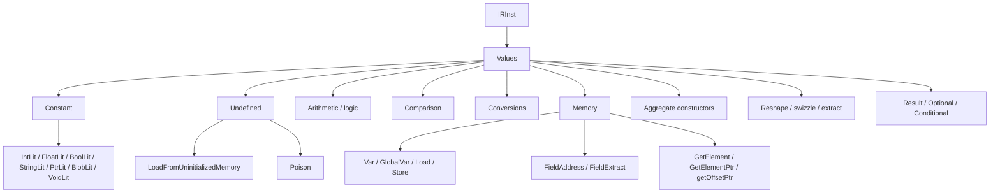

# Values

This page is the per-opcode reference for Slang IR value-producing
opcodes that are not types, not control-flow, not structural, not
GPU resource ops, and not autodiff-specific: literals, arithmetic
and logic, comparisons, conversions, memory access, aggregate
constructors and projections, and a handful of bit-manipulation
helpers.

The intended reader is a compiler engineer reading IR around an
ordinary expression — a numeric computation, a struct-field access,
a vector construction, or a type cast — and needs to identify each
opcode it produces.

## Source

The opcodes documented here are spread through
[slang-ir-insts.lua](../../../../source/slang/slang-ir-insts.lua):

- `Constant` group at line ~838 (literals).
- `Undefined` group at line ~857 plus `defaultConstruct` at line
  ~899.
- Memory and field opcodes at lines ~1056-1066 and ~1151-1166.
- Arithmetic, comparison, bit and logical ops at lines ~1423-1478.
- Conversion opcodes at lines ~2510-2538.
- Result / Optional / Conditional makers and getters at lines
  ~1020-1030.
- Aggregate constructors (`makeVector`, `makeMatrix`, `makeArray`,
  `makeStruct`, `makeTuple`, ...) at lines ~948-970.
- Swizzle / reshape opcodes at lines ~1267-1318.

C++ wrappers are declared in
[slang-ir-insts.h](../../../../source/slang/slang-ir-insts.h). Builder
helpers (`IRBuilder::emitAdd`, `IRBuilder::emitLoad`,
`IRBuilder::emitMakeStruct`, ...) are in
[slang-ir.cpp](../../../../source/slang/slang-ir.cpp).

Lowering from the AST is in
[slang-lower-to-ir.cpp](../../../../source/slang/slang-lower-to-ir.cpp):
the `visit*Expr` family and the `tryLowerIntrinsic*` helpers
produce most of these opcodes. Literal opcodes carry their value
inline on the `IRInst` itself (see the per-class layout in
[slang-ir-insts.h](../../../../source/slang/slang-ir-insts.h)) rather
than as ordinary operands; this is the single case in the IR where
an instruction's payload is not visible through the operand list.

## Family hierarchy

## Opcodes

### Literals (`Constant` group)

Literals are hoistable so two `IntLit 42` produce the same IR value.
Each literal stores its payload (integer, float, bytes, ...) inline
on the `IRInst`, *not* in the operand list.

| Opcode | C++ wrapper | Operands | Flags | AST origin | Summary |
| --- | --- | --- | --- | --- | --- |
| `boolConst` | `BoolLit` | (payload: bool) | H | `BoolLiteralExpr` in `slang-lower-to-ir.cpp` | `true` / `false`. |
| `integer_constant` | `IntLit` | (payload: int64) | H | `IntegerLiteralExpr` | Integer literal; signedness encoded in the result type. |
| `float_constant` | `FloatLit` | (payload: double) | H | `FloatingPointLiteralExpr` | Floating-point literal. |
| `ptr_constant` | `PtrLit` | (payload: pointer bits) | H | `NullPtrExpr` and other pointer-constant lowerings | Pointer constant (e.g. `nullptr`). |
| `void_constant` | `VoidLit` | — | H | `VoidLiteralExpr` | The unique `void` value. |
| `string_constant` | `StringLit` | (payload: bytes) | H | `StringLiteralExpr` | String constant; bytes inline. |
| `blob_constant` | `BlobLit` | (payload: bytes) | H | (synthesized) | Arbitrary blob literal; used by embedded-IR support. |

### Undefined and default-construct

`Undefined` is the grouping parent of `LoadFromUninitializedMemory`
and `Poison`; only its concrete children are listed here.

| Opcode | C++ wrapper | Operands | Flags | AST origin | Summary |
| --- | --- | --- | --- | --- | --- |
| `LoadFromUninitializedMemory` | — | — | | (synthesized) | A load from uninitialized memory; like LLVM's `freeze(undef)`. Frontend diagnostics surface uses. |
| `Poison` | — | — | | (synthesized) | Infectious undefined value; analogue of LLVM `poison`. |
| `defaultConstruct` | — | — | | `DefaultConstructExpr` and synthesized in IR passes | Produces a default-initialized value of the result type. |

### Arithmetic and bitwise

| Opcode | C++ wrapper | Operands | Flags | AST origin | Summary |
| --- | --- | --- | --- | --- | --- |
| `add` | `Add` | `left, right` | | `InfixExpr` (`+`) in `slang-lower-to-ir.cpp` | Addition. |
| `sub` | `Sub` | `left, right` | | `InfixExpr` (`-`) | Subtraction. |
| `mul` | `Mul` | `left, right` | | `InfixExpr` (`*`) | Multiplication. |
| `div` | `Div` | `left, right` | | `InfixExpr` (`/`) | Division (signed / unsigned / floating-point keyed by operand types). |
| `irem` | `IRem` | `left, right` | | `InfixExpr` (`%` on integers) | Integer remainder; *not* modulus. The Lua comment notes the distinction. |
| `frem` | `FRem` | `left, right` | | `InfixExpr` (`%` on floats) | Floating-point remainder. |
| `neg` | `Neg` | `value` | | `PrefixExpr` (`-`) | Unary negation. |
| `shl` | `Lsh` | `value, amount` | | `InfixExpr` (`<<`) | Left-shift. |
| `shr` | `Rsh` | `value, amount` | | `InfixExpr` (`>>`) | Right-shift (arithmetic / logical chosen by operand signedness). |
| `and` | `BitAnd` | `left, right` | | `InfixExpr` (`&`) | Bitwise AND. |
| `or` | `BitOr` | `left, right` | | `InfixExpr` (`\|`) | Bitwise OR. |
| `xor` | `BitXor` | `left, right` | | `InfixExpr` (`^`) | Bitwise XOR. |
| `bitnot` | `BitNot` | `value` | | `PrefixExpr` (`~`) | Bitwise NOT. |
| `not` | — | `value` | | `PrefixExpr` (`!`) | Logical NOT. |
| `bitfieldExtract` | — | `value, offset, count` | | `BitfieldExtract` intrinsic | Extracts a bit-field. |
| `bitfieldInsert` | — | `base, insert, offset, count` | | `BitfieldInsert` intrinsic | Inserts a bit-field into `base`. |

### Logical

| Opcode | C++ wrapper | Operands | Flags | AST origin | Summary |
| --- | --- | --- | --- | --- | --- |
| `logicalAnd` | `And` | `left, right` | | `InfixExpr` (`&&`) | Short-circuit logical AND. |
| `logicalOr` | `Or` | `left, right` | | `InfixExpr` (`\|\|`) | Short-circuit logical OR. |
| `select` | `Select` | `condition, trueResult, falseResult` | | `SelectExpr` and ternary `cond ? a : b` lowering | Branch-free conditional selection. |

### Comparison

| Opcode | C++ wrapper | Operands | Flags | AST origin | Summary |
| --- | --- | --- | --- | --- | --- |
| `cmpEQ` | `Eql` | `left, right` | | `InfixExpr` (`==`) | Equality. |
| `cmpNE` | `Neq` | `left, right` | | `InfixExpr` (`!=`) | Inequality. |
| `cmpLT` | `Less` | `left, right` | | `InfixExpr` (`<`) | Less-than. |
| `cmpLE` | `Leq` | `left, right` | | `InfixExpr` (`<=`) | Less-or-equal. |
| `cmpGT` | `Greater` | `left, right` | | `InfixExpr` (`>`) | Greater-than. |
| `cmpGE` | `Geq` | `left, right` | | `InfixExpr` (`>=`) | Greater-or-equal. |

### Conversions

| Opcode | C++ wrapper | Operands | Flags | AST origin | Summary |
| --- | --- | --- | --- | --- | --- |
| `BuiltinCast` | — | `val` | | Implicit cast lowering in `slang-lower-to-ir.cpp` | Type-changing built-in cast; intrinsic-driven. |
| `bitCast` | — | `val` | | `BitCastExpr` and `__bit_cast` intrinsic | Reinterpret bits without changing them. |
| `reinterpret` | — | `val` | | `ReinterpretExpr` | Same bit pattern, different type tag; less restrictive than `bitCast`. |
| `ReinterpretOptional` | — | `val` | | (synthesized) | Reinterprets one optional type to another; lowered to an if-else on `hasValue`. |
| `unmodified` | — | `val` | | (synthesized) | No-op cast that hides a value's underlying provenance from later passes. |
| `outImplicitCast` | — | `value` | | Function-arg lowering for `out` parameters | Implicit cast applied at the boundary of an `out` parameter. |
| `inOutImplicitCast` | — | `value` | | Function-arg lowering for `inout` parameters | Implicit cast applied at the boundary of an `inout` parameter. |
| `intCast` | — | `value` | | Numeric-conversion lowering | Integer-to-integer cast (sign/zero extension chosen by types). |
| `floatCast` | — | `value` | | Numeric-conversion lowering | Float-to-float cast (precision change). |
| `castIntToFloat` | — | `value` | | Numeric-conversion lowering | Int-to-float conversion. |
| `castFloatToInt` | — | `value` | | Numeric-conversion lowering | Float-to-int conversion (truncation). |
| `CastPtrToBool` | — | `value` | | (synthesized) | True if the pointer operand is non-null. |
| `CastPtrToInt` | — | `value` | | (synthesized) | Reinterprets a pointer as an integer. |
| `CastIntToPtr` | — | `value` | | (synthesized) | Reinterprets an integer as a pointer. |
| `castToVoid` | — | `value` | | `CastExpr` to `void` in `slang-lower-to-ir.cpp` | Discards the operand and yields a `void` value. |
| `PtrCast` | — | `value` | | (synthesized) | Cast between pointer types of different element types. |
| `CastEnumToInt` | — | `value` | | Enum-conversion lowering | Casts an enum value to its underlying integer tag. |
| `CastIntToEnum` | — | `value` | | Enum-conversion lowering | Casts an integer to an enum type. |
| `EnumCast` | — | `value` | | Enum-conversion lowering | Casts between two enum types with the same underlying type. |
| `CastUInt2ToDescriptorHandle` | — | `value` | | (synthesized) | Packs a `uint2` as a descriptor handle. |
| `CastDescriptorHandleToUInt2` | — | `value` | | (synthesized) | Reverse of `CastUInt2ToDescriptorHandle`. |

### Memory

| Opcode | C++ wrapper | Operands | Flags | AST origin | Summary |
| --- | --- | --- | --- | --- | --- |
| `var` | `IRVar` | — | | `VarDecl` (local) in `slang-lower-to-ir.cpp` | Allocates a local variable; result type is `Ptr<T>`. |
| `global_var` | `IRGlobalVar` | (variadic) | G | `VarDecl` (module-scope) | Module-scope mutable variable; documented in [structure.md](structure.md). |
| `globalConstant` | — | (variadic) | G | `VarDecl` with `const`/`static const` at module scope | Module-scope constant; documented in [structure.md](structure.md). |
| `alloca` | — | `allocSize` | | `AllocaExpr` / dynamic-stack lowering | Dynamically-sized stack allocation. |
| `load` | — | (variadic, `min=1`) | | `DerefExpr`, `Load` builder calls | Reads through a pointer. |
| `store` | — | `ptr, val` | | `AssignExpr` lowering | Writes through a pointer. |
| `copyLogical` | — | `ptr, val` | | (synthesized) | Logical copy at a pointer location; treats the destination as a logical lvalue rather than as raw bytes. |
| `get_field` | `FieldExtract` | (variadic, `min=2`) | | `MemberExpr` on a value | Reads a struct member from a value; rvalue path. |
| `get_field_addr` | `FieldAddress` | (variadic, `min=2`) | | `MemberExpr` on an lvalue | Returns the address of a struct member; lvalue path. |
| `getElement` | — | `base, index` | | `IndexExpr` on a value | Reads the `index`-th element of an aggregate. |
| `getElementPtr` | — | `base, index` | | `IndexExpr` on an lvalue | Returns the address of the `index`-th element. |
| `getOffsetPtr` | — | `base, offset` | | (synthesized) | Pointer offset: `pBase + offset_in_elements`. |
| `getAddr` | `GetAddress` | `ptr` | | `AddrOfExpr` / `__getAddress` | Returns the operand pointer unchanged but marks it as "an address obtained explicitly". |
| `assumeAddress` | — | `addr` | | (synthesized) | Marks an address as known-valid; lowered away after validation. |
| `swizzle` | — | (variadic, `min=1`) | | `SwizzleExpr` on a value | Reads a swizzle of a vector; operand layout is `src, idx0, idx1, ...` where each index is a literal. |
| `swizzleSet` | — | (variadic, `min=2`) | | `SwizzleExpr` on an lvalue (read-modify-write) | Writes a swizzle of a vector, returning the modified vector. |
| `swizzledStore` | — | `dest, source, ...` | | `SwizzleExpr` on an lvalue (store) | Stores selected lanes through a pointer. |
| `matrixSwizzleStore` | — | `dest, source, ...` | | Matrix-element store lowering | Stores selected matrix elements through a pointer. |
| `updateElement` | — | `oldValue, elementValue` | | (synthesized) | Functional update: returns a new aggregate with one element replaced. |

### Strings and native pointers

| Opcode | C++ wrapper | Operands | Flags | AST origin | Summary |
| --- | --- | --- | --- | --- | --- |
| `makeString` | — | `nativeStringValue` | | `String(nativeString)` lowering | Constructs a `String` from a `NativeString`. |
| `getNativeStr` | — | `stringValue` | | `String.nativeString` lowering | Returns an unowned `NativeString` view of a `String`. |
| `getNativePtr` | — | `elementType` | | `ComPtr<T>`/`RefPtr<T>` accessor lowering | Returns a native pointer from a `ComPtr<T>` or `RefPtr<T>`. |
| `getManagedPtrWriteRef` | — | `ptrToManagedPtr` | | (synthesized) | Returns a write reference to a managed-pointer variable (operand must be `Ptr<ComPtr<T>>` or `Ptr<RefPtr<T>>`). |
| `ManagedPtrAttach` | — | `ptrValue` | | (synthesized) | Attaches a managed-pointer variable to a `NativePtr` without changing its reference count. |
| `ManagedPtrDetach` | — | `ptrValue` | | (synthesized) | Detaches a managed-pointer variable from its `NativePtr`. |

### Object and CUDA helpers

| Opcode | C++ wrapper | Operands | Flags | AST origin | Summary |
| --- | --- | --- | --- | --- | --- |
| `allocObj` | — | — | | (synthesized) | Allocates an object value; used by host-side and managed-pointer lowering. |
| `CUDA_LDG` | — | (variadic, `min=1`) | | (synthesized for the CUDA backend) | Read-only cached load through CUDA's `__ldg` intrinsic. |

### Aggregate constructors

| Opcode | C++ wrapper | Operands | Flags | AST origin | Summary |
| --- | --- | --- | --- | --- | --- |
| `makeVector` | — | (variadic) | | `MakeVectorExpr` / vector-constructor calls | Constructs a vector from its components. |
| `makeMatrix` | — | (variadic) | | `MakeMatrixExpr` / matrix-constructor calls | Constructs a matrix from its components. |
| `makeMatrixFromScalar` | — | `scalarVal` | | Implicit matrix-from-scalar lowering | Splats a scalar into a matrix. |
| `MakeVectorFromScalar` | — | `elementType, elementCount, scalarValue` | | Implicit vector-from-scalar lowering | Splats a scalar into a vector. |
| `makeArray` | — | (variadic) | | `MakeArrayExpr` | Constructs a fixed-size array. |
| `makeArrayFromElement` | — | `element` | | Implicit array-from-element lowering | Splats a single element into a fixed-size array. |
| `makeCoopVector` | — | (variadic) | | `MakeCoopVectorExpr` (autodiff / coop-vec intrinsic) | Constructs a cooperative-vector value. |
| `makeCoopVectorFromValuePack` | — | `valuePack` | | (synthesized) | Constructs a cooperative-vector value from a `valuePack`. |
| `makeCoopMatrixFromScalar` | — | (variadic) | | (synthesized) | Constructs a cooperative-matrix value from a scalar. |
| `makeStruct` | — | (variadic) | | `MakeStructExpr`, aggregate-initializer lowering | Constructs a struct from its field values. |
| `makeTuple` | — | (variadic) | | `MakeTupleExpr` | Constructs a tuple. |
| `makeTargetTuple` | `MakeTargetTuple` | (variadic) | | (synthesized) | Tuple-typed value keyed by target name (used by `targetSwitch`). |
| `makeUInt64` | — | `low, high` | | `MakeUInt64Expr` and synthesized | Constructs a `uint64` from two `uint32` halves. |
| `matrixReshape` | — | `matrix` | | (synthesized) | Reshapes a matrix to a different element type / shape with the same underlying storage. |
| `vectorReshape` | — | `vector` | | (synthesized) | Reshapes a vector. |
| `getTupleElement` | — | (variadic, `min=2`) | | `MemberExpr` on a tuple | Reads one element of a tuple. |
| `getTargetTupleElement` | — | (variadic) | | (synthesized) | Reads one element of a target tuple. |
| `SumVectorElements` | — | (variadic, `min=1`) | | (synthesized) | Sum of all elements of a vector. |
| `SumMatrixElements` | — | (variadic, `min=1`) | | (synthesized) | Sum of all elements of a matrix. |

### Result / Optional / Conditional helpers

| Opcode | C++ wrapper | Operands | Flags | AST origin | Summary |
| --- | --- | --- | --- | --- | --- |
| `makeResultValue` | — | `value` | | `Result<T, E>::makeValue` lowering | Constructs a `Result` holding a success value. |
| `makeResultError` | — | `errorValue` | | `Result<T, E>::makeError` lowering | Constructs a `Result` holding an error value. |
| `isResultError` | — | `resultOperand` | | `Result<T, E>::isError` | True if the `Result` holds an error. |
| `getResultValue` | — | `resultOperand` | | `Result<T, E>::value` | Reads the success value (UB if it holds an error). |
| `getResultError` | — | `resultOperand` | | `Result<T, E>::error` | Reads the error value. |
| `makeOptionalValue` | — | `value` | | `Optional<T>::makeValue` lowering | Constructs an `Optional<T>` from a value. |
| `makeOptionalNone` | — | — | | `Optional<T>::makeNone` lowering | Constructs an `Optional<T>` with no value. |
| `optionalHasValue` | — | `optionalOperand` | | `Optional<T>::hasValue` | True if the optional holds a value. |
| `getOptionalValue` | — | `optionalOperand` | | `Optional<T>::value` | Reads the value (UB if it holds none). |
| `makeConditionalValue` | — | `value` | | (synthesized) | Constructs a `Conditional` value (value present). |
| `getConditionalValue` | — | `conditionalOperand` | | (synthesized) | Reads the inner value of a `Conditional`. |
| `extractTaggedUnionTag` | — | `val` | | (synthesized; documented in [generics-and-existentials.md](generics-and-existentials.md)) | Reads the discriminator of a tagged union. |
| `extractTaggedUnionPayload` | — | `unionVal` | | (synthesized) | Reads the payload of a tagged union. |

### Constexpr arithmetic and casts

Hoistable variants of the regular arithmetic and cast opcodes used
to lower compile-time integer expressions (`IntVal` subclasses such
as `PolynomialIntVal`) so that identical compile-time values dedupe.
Operand and result types mirror their non-`constexpr` counterparts.

| Opcode | C++ wrapper | Operands | Flags | AST origin | Summary |
| --- | --- | --- | --- | --- | --- |
| `constexprAdd` | — | `left, right` | H | (synthesized) | Compile-time integer addition. |
| `constexprSub` | — | `left, right` | H | (synthesized) | Compile-time integer subtraction. |
| `constexprMul` | — | `left, right` | H | (synthesized) | Compile-time integer multiplication. |
| `constexprNeg` | — | `value` | H | (synthesized) | Compile-time unary negation. |
| `constexprDiv` | — | `left, right` | H | (synthesized) | Compile-time integer division. |
| `constexprIRem` | — | `left, right` | H | (synthesized) | Compile-time integer remainder. |
| `constexprShl` | — | `left, right` | H | (synthesized) | Compile-time left-shift. |
| `constexprShr` | — | `left, right` | H | (synthesized) | Compile-time right-shift. |
| `constexprBitAnd` | — | `left, right` | H | (synthesized) | Compile-time bitwise AND. |
| `constexprBitOr` | — | `left, right` | H | (synthesized) | Compile-time bitwise OR. |
| `constexprBitXor` | — | `left, right` | H | (synthesized) | Compile-time bitwise XOR. |
| `constexprBitNot` | — | `value` | H | (synthesized) | Compile-time bitwise NOT. |
| `constexprNot` | — | `value` | H | (synthesized) | Compile-time logical NOT. |
| `constexprEql` | — | `left, right` | H | (synthesized) | Compile-time equality. |
| `constexprNeq` | — | `left, right` | H | (synthesized) | Compile-time inequality. |
| `constexprGreater` | — | `left, right` | H | (synthesized) | Compile-time greater-than. |
| `constexprLess` | — | `left, right` | H | (synthesized) | Compile-time less-than. |
| `constexprGeq` | — | `left, right` | H | (synthesized) | Compile-time greater-or-equal. |
| `constexprLeq` | — | `left, right` | H | (synthesized) | Compile-time less-or-equal. |
| `constexprAnd` | — | `left, right` | H | (synthesized) | Compile-time logical AND. |
| `constexprOr` | — | `left, right` | H | (synthesized) | Compile-time logical OR. |
| `constexprSelect` | — | `condition, ifTrue, ifFalse` | H | (synthesized) | Compile-time branch-free selection. |
| `constexprIntCast` | — | `value` | H | (synthesized) | Compile-time integer-to-integer cast. |
| `constexprCastIntToFloat` | — | `value` | H | (synthesized) | Compile-time integer-to-float cast. |
| `constexprCastFloatToInt` | — | `value` | H | (synthesized) | Compile-time float-to-integer cast. |
| `constexprFloatCast` | — | `value` | H | (synthesized) | Compile-time float-to-float cast. |
| `constexprCastIntToEnum` | — | `value` | H | (synthesized) | Compile-time integer-to-enum cast. |
| `constexprCastEnumToInt` | — | `value` | H | (synthesized) | Compile-time enum-to-integer cast. |
| `constexprEnumCast` | — | `value` | H | (synthesized) | Compile-time enum-to-enum cast. |

## Notable opcodes

### Literal payload encoding

Every `Constant`-family opcode (`IntLit`, `FloatLit`, ...) stores
its value inline on the `IRInst` rather than as an operand. This is
the single exception to the "everything semantically relevant is an
operand" rule that the rest of the IR follows. Pass authors who
inspect operands directly will see *zero* operands on a literal —
they must call the typed accessors (`IRIntLit::getValue()`,
`IRStringLit::getStringSlice()`, ...) on the wrapper class
declared in
[slang-ir-insts.h](../../../../source/slang/slang-ir-insts.h).

### `Var` vs `GlobalVar` vs `Alloca`

`var` declares a local variable inside a function; its result type
is `Ptr<T>` for some element type `T`. `global_var` (documented in
[structure.md](structure.md)) is the module-scope counterpart.
`alloca` is the dynamically-sized form — its operand is the size in
bytes, and its result is a generic byte pointer that the backend
allocates on the local stack. Most ordinary value-local variables
become `var`; arrays of runtime size become `alloca`.

### `FieldAddress` vs `FieldExtract`

`get_field_addr` (`FieldAddress`) returns a pointer to a struct
member, so the result can flow into another `Store`,
`FieldAddress`, `GetElementPtr`, etc. `get_field` (`FieldExtract`)
returns the *value* of the member, breaking the lvalue chain.
Lowering picks one or the other based on whether the `MemberExpr`
appears in lvalue or rvalue position. Each takes a struct value /
pointer plus a `StructKey` (see [structure.md](structure.md)) as
selector.

### `GetElementPtr` vs `GetElement`

Same distinction as the `FieldAddress` / `FieldExtract` pair, but
for array indexing. `getElementPtr` returns a pointer to the array
element; `getElement` returns the element's value. Both accept
`base` and `index` as operands.

### `swizzle`, `swizzleSet`, `swizzledStore`

The three swizzle opcodes encode read, value-update, and store
forms. `swizzle src idx0 idx1 ...` reads M elements from an
N-vector to make an M-vector. `swizzleSet base src idx0 idx1 ...`
takes a vector and a smaller value pack and returns a new vector
where the selected lanes have been overwritten. `swizzledStore`
mutates memory in place; the Lua comment notes that this opcode is
expected to eventually be reduced to a write-mask operation by
moving the swizzle to the source side.

### `select`

`select(condition, trueResult, falseResult)` is the branch-free
conditional. Unlike the `ifElse` terminator (documented in
[control-flow.md](control-flow.md)), `select` is an *expression* —
it produces a value and does not affect control flow. Both result
operands must already be computed; their types must match.

### `Poison`

`Poison` is the IR's analogue of LLVM's `poison`. A poison value of
some type T behaves like a hypothetical out-of-band T-NaN: most
instructions that consume a poison operand yield a poison result,
which lets the optimizer assume the original expression had no
defined value and rewrite freely. The Lua comment notes the
exceptions (`select` and block parameters, which can pass through
a poison operand on a non-taken edge without poisoning the result).

### `defaultConstruct`

`defaultConstruct` produces a zero-initialized value of the result
type. It is the IR encoding both of the user-facing `T()` /
`T{}` expressions and of many IR-pass-introduced default values.
Backends emit this as a zero literal (for scalar types), an
all-zero aggregate, or a target-specific default — the choice is
deferred until emit.

### `MakeUInt64`

`makeUInt64(low, high)` constructs a 64-bit value from two 32-bit
halves. The opcode exists because several targets do not have a
direct `uint64` literal form; the IR carries the two halves as
explicit operands so the backend can emit either a single literal
(when supported) or the two halves combined at runtime.

## See also

- [../cross-cutting/ir-instructions.md](../cross-cutting/ir-instructions.md)
  — schema, op flags, hoistable / global / parent conventions.
- [types.md](types.md) — every value here has a type; the
  composite, scalar, and vector type opcodes that show up in the
  result types of opcodes here live there.
- [control-flow.md](control-flow.md) — `block`, `Param`, and the
  terminators that frame the value-producing opcodes documented
  here.
- [structure.md](structure.md) — `global_var`, `globalConstant`,
  `StructKey` (selector for `FieldAddress` / `FieldExtract`).
- [generics-and-existentials.md](generics-and-existentials.md) —
  `extractTaggedUnionTag` / `extractTaggedUnionPayload`,
  `packAnyValue` / `unpackAnyValue`, and other existential-side
  opcodes that share lowering paths with the value opcodes here.
- [misc.md](misc.md) — `bitfieldExtract` and `bitfieldInsert` and
  the type-introspection predicates that complement the conversion
  family.
- [../pipeline/04-ast-to-ir.md](../pipeline/04-ast-to-ir.md) — the
  expression visitors that produce these opcodes.
- [../pipeline/05-ir-passes.md](../pipeline/05-ir-passes.md) —
  constant folding, DCE, SSA construction, and other passes that
  rewrite the value opcodes documented here.
- [../../../design/ir.md](../../../design/ir.md) — design rationale for
  the literal payload encoding and the `Poison` /
  `LoadFromUninitializedMemory` distinction.
- [../glossary.md](../glossary.md) — definitions of `hoistable
  instruction`, `parent instruction`, `decl-ref`,
  `single static assignment (SSA)`.
