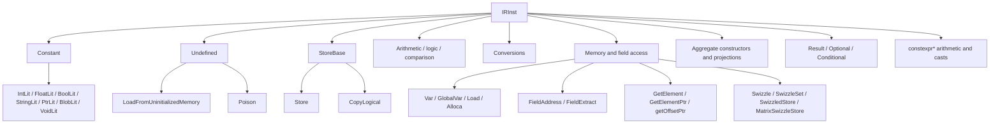

# Values

This page is the per-opcode reference for Slang IR value-producing
opcodes that are not types, not control-flow, not structural, not
GPU resource ops, and not autodiff-specific: literals, arithmetic
and logic, comparisons, conversions, memory access, aggregate
constructors and projections, and a handful of bit-manipulation
helpers.

The intended reader is a compiler engineer reading IR around an
ordinary expression — a numeric computation, a struct-field access,
a vector construction, or a type cast — and needs to identify each
opcode it produces. The `DescriptorHandle<T>` conversions are also
covered here, since a conversions table is their natural home; the
untyped descriptor-heap handle casts are not (see
[misc.md](misc.md#untyped-descriptor-heap-handle-casts)).

## Source

The opcodes documented here are spread through
[slang-ir-insts.lua](../../../../source/slang/slang-ir-insts.lua):

- `Constant` group at line 953 (literals, lines 954-965).
- `Undefined` group at line 972 (`LoadFromUninitializedMemory` at
  988, `Poison` at 1008) plus `defaultConstruct` at line 1014.
- Aggregate constructors and reshape helpers at lines 1061-1089
  (`allocObj`, `makeUInt64`, `makeVector`, `makeMatrix`,
  `matrixReshape`, `vectorReshape`, `makeArray`, `makeStruct`,
  `makeTuple`, `getTupleElement`, ...).
- Result / Optional / Conditional makers and getters at lines
  1135-1145.
- `alloca` (1150), `updateElement` (1151), `bitfieldExtract` /
  `bitfieldInsert` (1153-1154).
- `var` (1172), `load` (1173), the `StoreBase` group (1176) holding
  `store` (1178) and `copyLogical` (1179), and `CUDA_LDG` (1182).
- Field, element, and address opcodes at lines 1267-1280, followed by
  the string / native-pointer cluster at 1283-1293.
- `MakeVectorFromScalar` (1390), the swizzle family (1397-1445), and
  `SumVectorElements` / `SumMatrixElements` (1447-1449).
- Arithmetic, comparison, bit and logical ops at lines 1552-1607.
- Conversion opcodes at lines 2734-2786.
- `constexpr*` arithmetic and casts at lines 3408-3437.

Each Lua entry generates the enumerator `kIROp_` + the entry's
`struct_name`, which is *not* always the Lua key: `boolConst` becomes
`kIROp_BoolLit`, `shl` becomes `kIROp_Lsh`, `get_field` becomes
`kIROp_FieldExtract`, `and` becomes `kIROp_BitAnd`, and `logicalAnd`
becomes `kIROp_And`. Where a `struct_name` is absent the key is
converted to PascalCase (`integer_constant` → `kIROp_IntLit` comes
from an explicit `struct_name`; `makeVector` → `kIROp_MakeVector`
comes from the implicit conversion). The tables below key rows on the
Lua entry name and give the wrapper name, from which the enumerator
can be read off directly.

C++ wrappers are declared in
[slang-ir-insts.h](../../../../source/slang/slang-ir-insts.h). Every
opcode has one: the FIDDLE template at the end of that file
(`getAllOtherInstStructsData`, invoked from the template block near
line 3113) emits an `IR<struct_name>` struct for every entry that does
not already have a hand-written declaration, so an opcode is either
hand-written or generated and never wrapper-less. See
[C++ wrappers: hand-written vs generated](#c-wrappers-hand-written-vs-generated).
Builder helpers (`IRBuilder::emitCast`, `IRBuilder::emitVar`,
`IRBuilder::emitMakeStruct`, ...) are in
[slang-ir.cpp](../../../../source/slang/slang-ir.cpp).

Lowering from the AST is in
[slang-lower-to-ir.cpp](../../../../source/slang/slang-lower-to-ir.cpp).
Two producers account for most rows below, and the distinction matters
when reading the `AST origin` column:

- The `visit*Expr` / `visit*Decl` family, reached through `lowerExpr`
  and `lowerDecl`.
- `emitCallToDeclRef` (line 949), which turns a call to a core-module
  function carrying an `__intrinsic_op(...)` modifier straight into
  that opcode. Many opcodes in this family have *no* visitor at all
  and exist only because
  [core.meta.slang](../../../../source/slang/core.meta.slang),
  [hlsl.meta.slang](../../../../source/slang/hlsl.meta.slang), or
  [glsl.meta.slang](../../../../source/slang/glsl.meta.slang) declares
  an operator or function with `__intrinsic_op($(kIROp_...))`.

Literal opcodes carry their value inline on the `IRInst` itself (see
the per-class layout in
[slang-ir-insts.h](../../../../source/slang/slang-ir-insts.h)) rather
than as ordinary operands; this is the single case in the IR where
an instruction's payload is not visible through the operand list.

## Family hierarchy

Most opcodes on this page are direct children of `IRInst`; the Lua file
declares only three grouping parents in this family, `Constant`,
`Undefined`, and `StoreBase`. The remaining boxes below are the
editorial groupings this page's tables use, not Lua groups.

```mermaid
flowchart TD
  IRInst --> ConstantNode[Constant]
  IRInst --> UndefinedNode[Undefined]
  IRInst --> StoreBaseNode[StoreBase]
  IRInst --> ArithLogic["Arithmetic / logic / comparison"]
  IRInst --> Conversions
  IRInst --> Memory["Memory and field access"]
  IRInst --> Aggregates["Aggregate constructors and projections"]
  IRInst --> AlgebraicHelpers["Result / Optional / Conditional"]
  IRInst --> ConstexprOps["constexpr* arithmetic and casts"]
  ConstantNode --> Literals["IntLit / FloatLit / BoolLit / StringLit / PtrLit / BlobLit / VoidLit"]
  UndefinedNode --> uninitNode["LoadFromUninitializedMemory"]
  UndefinedNode --> PoisonNode[Poison]
  StoreBaseNode --> StoreNode[Store]
  StoreBaseNode --> CopyLogicalNode[CopyLogical]
  Memory --> AddressOps["Var / GlobalVar / Load / Alloca"]
  Memory --> FieldOps["FieldAddress / FieldExtract"]
  Memory --> ElementOps["GetElement / GetElementPtr / getOffsetPtr"]
  Memory --> SwizzleOps["Swizzle / SwizzleSet / SwizzledStore / MatrixSwizzleStore"]
```

## Opcodes

Two markers appear in the tables below, matching the convention on
[types.md](types.md):

- `†` on an operand name means the Lua entry does **not** declare that
  operand under that name (it declares none, uses `min_operands`, or
  declares a name that disagrees with what is actually built); the
  name and index come from the C++ wrapper's accessors or from the
  construction site, which are authoritative in that case.
- `‡` after a wrapper name means the wrapper is hand-written — in
  [slang-ir-insts.h](../../../../source/slang/slang-ir-insts.h), or in
  [slang-ir.h](../../../../source/slang/slang-ir.h) for the literal
  classes — rather than FIDDLE-generated, so its accessor names may
  differ from the Lua operand names. No row in this family has *no*
  wrapper.

### Literals (`Constant` group)

Two `IntLit 42` produce the same IR value: the `Constant` opcodes
are not marked with the `H` (hoistable) opcode flag, but are
deduplicated through the constant map by
`IRBuilder::_findOrEmitConstant`
([slang-ir.cpp](../../../../source/slang/slang-ir.cpp) line 2403).
Each literal stores its payload (integer, float, bytes, ...) inline on
the `IRInst`, *not* in the operand list.

| Opcode | C++ wrapper | Operands | Flags | AST origin | Summary |
| --- | --- | --- | --- | --- | --- |
| `boolConst` | `BoolLit`‡ | (payload: bool) | | `BoolLiteralExpr` (`visitBoolLiteralExpr`, line 6983) | `true` / `false`. |
| `integer_constant` | `IntLit`‡ | (payload: int64) | | `IntegerLiteralExpr` (`visitIntegerLiteralExpr`, line 6998); also `ConstantIntVal` via `lowerVal` | Integer literal; signedness encoded in the result type. |
| `float_constant` | `FloatLit`‡ | (payload: double) | | `FloatingPointLiteralExpr` (`visitFloatingPointLiteralExpr`, line 7004) | Floating-point literal. |
| `ptr_constant` | `PtrLit`‡ | (payload: pointer bits) | | `NullPtrLiteralExpr` (`visitNullPtrLiteralExpr`, line 6988) | Pointer constant (e.g. `nullptr`); also `IRBuilder::getNullPtrValue`. |
| `void_constant` | `VoidLit` | — | | `NoneLiteralExpr` (`visitNoneLiteralExpr`, line 6993) | The unique `void` value; also produced by `IRBuilder::getVoidValue` ([slang-ir.cpp](../../../../source/slang/slang-ir.cpp) line 2649) wherever a cast to `void` is discarded. |
| `string_constant` | `StringLit`‡ | (payload: bytes) | | `StringLiteralExpr` (`visitStringLiteralExpr`, line 7010) | String constant; bytes inline. |
| `blob_constant` | `BlobLit` | (payload: bytes) | | — | Arbitrary blob literal, built by `IRBuilder::getBlobValue` ([slang-ir.cpp](../../../../source/slang/slang-ir.cpp) line 2603); the only caller is `emitEmbeddedDownstreamIR` (line 4306). |

### Undefined and default-construct

`Undefined` is the grouping parent of `LoadFromUninitializedMemory`
and `Poison`; only its concrete children are listed here.

| Opcode | C++ wrapper | Operands | Flags | AST origin | Summary |
| --- | --- | --- | --- | --- | --- |
| `LoadFromUninitializedMemory` | `LoadFromUninitializedMemory` | — | | (synthesized) | A load from uninitialized memory; like LLVM's `freeze(undef)`. Frontend diagnostics surface uses. |
| `Poison` | `Poison` | — | H | (synthesized) | Infectious undefined value; analogue of LLVM `poison`. Hoistable, so all poison values of the same type dedupe to one inst (built via `IRBuilder::getPoison`). |
| `defaultConstruct` | `DefaultConstruct`‡ | — | | `DefaultConstructExpr` (`visitDefaultConstructExpr`, line 6737) and `getDefaultVal` (line 6643); also synthesized in IR passes | Produces a default-initialized value of the result type; nullary (`IRBuilder::emitDefaultConstructRaw`, [slang-ir.cpp](../../../../source/slang/slang-ir.cpp) line 4144). |

### Arithmetic and bitwise

There is no `InfixExpr` or `PrefixExpr` visitor behind these rows. An
operator in Slang source is an ordinary overloaded call, so `a + b`
checks to an `InvokeExpr` on a core-module `operator+`. Two things can
then happen, and both reach the same opcode:

- If the checker recognizes the call as one of the builtin arithmetic
  fast paths, `convertToBuiltinArithmeticOp`
  ([slang-check-expr.cpp](../../../../source/slang/slang-check-expr.cpp)
  line 4670) rewrites it to an already-checked `BuiltinOperatorExpr`
  carrying a `BuiltinOperationKind`. `lowerBuiltinOperatorExpr` (line
  5402) switches on that kind and calls `emitIntrinsicInst` with the
  opcode directly, bypassing call lowering entirely — see
  [../pipeline/04-ast-to-ir.md](../pipeline/04-ast-to-ir.md).
- Otherwise the call survives as an `InvokeExpr` and
  `emitCallToDeclRef` (line 949) reads the `__intrinsic_op($(kIROp_...))`
  modifier off the resolved core-module declaration. The `IInteger` /
  `IFloat` conformances for scalars, vectors, and matrices in
  [core.meta.slang](../../../../source/slang/core.meta.slang) are
  declared this way.

The `AST origin` column names both routes as
`BuiltinOperatorExpr` / core-module `__intrinsic_op`.

| Opcode | C++ wrapper | Operands | Flags | AST origin | Summary |
| --- | --- | --- | --- | --- | --- |
| `add` | `Add` | `left, right` | | `BuiltinOperatorExpr` (`+`) / core-module `__intrinsic_op` | Addition. |
| `sub` | `Sub` | `left, right` | | `BuiltinOperatorExpr` (`-`) / core-module `__intrinsic_op` | Subtraction. |
| `mul` | `Mul` | `left, right` | | `BuiltinOperatorExpr` (`*`) / core-module `__intrinsic_op` | Multiplication. |
| `div` | `Div` | `left, right` | | `BuiltinOperatorExpr` (`/`) / core-module `__intrinsic_op` | Division (signed / unsigned / floating-point keyed by operand types). |
| `irem` | `IRem` | `left, right` | | `BuiltinOperatorExpr` (`%` with integer element type) | Integer remainder; *not* modulus. The Lua comment notes the distinction. |
| `frem` | `FRem` | `left, right` | | `BuiltinOperatorExpr` (`%` with floating-point element type) | Floating-point remainder. `lowerBuiltinOperatorExpr` picks `FRem` over `IRem` by inspecting the *element* type of the first argument (unwrapping vector / matrix). |
| `neg` | `Neg` | `value` | | `BuiltinOperatorExpr` (unary `-`) / core-module `__intrinsic_op` | Unary negation. |
| `shl` | `Lsh` | `value, amount` | | `BuiltinOperatorExpr` (`<<`) / core-module `__intrinsic_op` | Left-shift. |
| `shr` | `Rsh` | `value, amount` | | `BuiltinOperatorExpr` (`>>`) / core-module `__intrinsic_op` | Right-shift (arithmetic / logical chosen by operand signedness). |
| `and` | `BitAnd` | `left, right` | | `BuiltinOperatorExpr` (`&`) / core-module `__intrinsic_op` | Bitwise AND. |
| `or` | `BitOr` | `left, right` | | `BuiltinOperatorExpr` (`\|`) / core-module `__intrinsic_op` | Bitwise OR. |
| `xor` | `BitXor` | `left, right` | | `BuiltinOperatorExpr` (`^`) / core-module `__intrinsic_op` | Bitwise XOR. |
| `bitnot` | `BitNot` | `value` | | `BuiltinOperatorExpr` (`~`) / core-module `__intrinsic_op` | Bitwise NOT. |
| `not` | `Not` | `value` | | `BuiltinOperatorExpr` (`!`) / core-module `__intrinsic_op` | Logical NOT. |
| `bitfieldExtract` | `BitfieldExtract` | `value, offset, count` | | core-module `bitfieldExtract` ([core.meta.slang](../../../../source/slang/core.meta.slang) line 3423) | Extracts a bit-field into the low bits of the result. |
| `bitfieldInsert` | `BitfieldInsert` | `base, insert, offset, count` | | core-module `bitfieldInsert` ([core.meta.slang](../../../../source/slang/core.meta.slang) line 3415) | Inserts the low `count` bits of `insert` into `base` at `offset`. |

### Logical

`logicalAnd` / `logicalOr` are **not** the lowering of `&&` and `||`.
Those operators check to a `LogicOperatorShortCircuitExpr`, and
`visitLogicOperatorShortCircuitExpr` (line 7127) lowers them to an
`ifElse` plus a join-block `Param` so the right-hand side is only
evaluated on the taken edge. `kIROp_And` / `kIROp_Or` come instead
from the core-module functions that deliberately do *not*
short-circuit: `IBool::and` / `IBool::or`
([core.meta.slang](../../../../source/slang/core.meta.slang) lines
1242-1243), the `vector<bool,N>` overloads (lines 2354, 2357), and the
free `and()` / `or()` functions (lines 3741, 3767).

| Opcode | C++ wrapper | Operands | Flags | AST origin | Summary |
| --- | --- | --- | --- | --- | --- |
| `logicalAnd` | `And` | `left, right` | | core-module `and` / `IBool::and` (`__intrinsic_op($(kIROp_And))`) | Boolean AND of two already-evaluated `bool` (or `vector<bool,N>`) operands; no short-circuiting. |
| `logicalOr` | `Or` | `left, right` | | core-module `or` / `IBool::or` (`__intrinsic_op($(kIROp_Or))`) | Boolean OR of two already-evaluated operands; no short-circuiting. |
| `select` | `Select`‡ | `condition, trueResult, falseResult` | | `SelectExpr` (`visitSelectExpr`, line 7090) when the condition is not a `BasicExpressionType`, or at global scope; declared `__intrinsic_op(select)` on `operator?:` and `select()` ([core.meta.slang](../../../../source/slang/core.meta.slang) lines 1060-1071) | Branch-free conditional selection. |

### Comparison

Same two routes as the arithmetic table above.

| Opcode | C++ wrapper | Operands | Flags | AST origin | Summary |
| --- | --- | --- | --- | --- | --- |
| `cmpEQ` | `Eql` | `left, right` | | `BuiltinOperatorExpr` (`==`) / core-module `__intrinsic_op` | Equality. |
| `cmpNE` | `Neq` | `left, right` | | `BuiltinOperatorExpr` (`!=`) / core-module `__intrinsic_op` | Inequality; also emitted by `emitCast` for a float-to-`bool` cast (compare against `defaultConstruct`). |
| `cmpLT` | `Less` | `left, right` | | `BuiltinOperatorExpr` (`<`) / core-module `__intrinsic_op` | Less-than. |
| `cmpLE` | `Leq` | `left, right` | | `BuiltinOperatorExpr` (`<=`) / core-module `__intrinsic_op` | Less-or-equal. |
| `cmpGT` | `Greater` | `left, right` | | `BuiltinOperatorExpr` (`>`) / core-module `__intrinsic_op` | Greater-than. |
| `cmpGE` | `Geq` | `left, right` | | `BuiltinOperatorExpr` (`>=`) / core-module `__intrinsic_op` | Greater-or-equal. |

### Conversions

Most numeric conversions are chosen by `IRBuilder::emitCast`
([slang-ir.cpp](../../../../source/slang/slang-ir.cpp) line 4368),
which maps a (from, to) pair of `TypeCastStyle` values through a
`static const OpSeq opMap[5][5]` table (line 4422) covering the five
data-carrying styles `Int`, `Float`, `Bool`, `Ptr`, and `Enum`. An
entry may name two opcodes, in which case the cast lowers to a pair
(for example `Ptr` → `Float` becomes `CastPtrToInt` followed by
`CastIntToFloat`). `Bool` → `Bool` is `kIROp_Nop`, i.e. the operand is
returned unchanged, and `Float` → `Bool` is a `cmpNE` against
`defaultConstruct`. Casts to `void` never reach the table; see
[Live-but-unproduced opcodes](#live-but-unproduced-opcodes).

Three rows that used to appear here — `CastStorageToLogical`,
`CastStorageToLogicalDeref`, and `TreatAsDynamicUniform` — are owned by
[misc.md](misc.md): see
[misc.md#storage-type-legalization-casts](misc.md#storage-type-legalization-casts)
and [misc.md#annotations](misc.md#annotations). The four *untyped*
descriptor-heap handle casts added for the
`ResourceDescriptorHeap` / `SamplerDescriptorHeap` direct-index syntax
are also owned there:
[misc.md#untyped-descriptor-heap-handle-casts](misc.md#untyped-descriptor-heap-handle-casts).
The `DescriptorHandle<T>` conversions below *are* owned by this page.

| Opcode | C++ wrapper | Operands | Flags | AST origin | Summary |
| --- | --- | --- | --- | --- | --- |
| `BuiltinCast` | `BuiltinCast` | `val` | | `BuiltinCastExpr` (`visitBuiltinCastExpr`, line 7185) | Fallback emitted by `emitCast` when either side's `TypeCastStyle` is `Unknown` (i.e. not a scalar / pointer / enum), leaving the conversion for a later pass. |
| `bitCast` | `BitCast` | `val` | | core-module `__intrinsic_op($(kIROp_BitCast))` declarations, e.g. the GLSL `*BitsTo*` family ([glsl.meta.slang](../../../../source/slang/glsl.meta.slang) line 832 onward) | Reinterpret bits without changing them; also the `Ptr` → `Ptr` entry of the `emitCast` table, and `IRBuilder::emitBitCast` ([slang-ir.cpp](../../../../source/slang/slang-ir.cpp) line 6646). There is no `BitCastExpr` AST node. |
| `reinterpret` | `Reinterpret` | `val` | | core-module `reinterpret<T,U>` ([core.meta.slang](../../../../source/slang/core.meta.slang) line 3406) | Same bit pattern, different type tag; less restrictive than `bitCast` (any scalar / vector / matrix / struct / array). There is no `ReinterpretExpr` AST node. |
| `ReinterpretOptional` | `ReinterpretOptional` | `val` | | **no producer at HEAD** | Covariant `Optional<T>` → `Optional<U>` conversion. The comment at [slang-ir-typeflow-set.cpp](../../../../source/slang/slang-ir-typeflow-set.cpp) line 266 says the set-upcast path emits it, but the code returns `openOptional(...)`, which builds the if-else directly; `lowerReinterpretOptional` only consumes instances that never appear. See [live-but-unproduced opcodes](#live-but-unproduced-opcodes). |
| `unmodified` | `Unmodified` | `val` | | core-module `unused` / `unmodified` ([core.meta.slang](../../../../source/slang/core.meta.slang) lines 3431, 3438) | No-op cast that marks an `out` / `inout` parameter as deliberately untouched, silencing the uninitialized-use warning. |
| `outImplicitCast` | `OutImplicitCast` | `baseAddress`† | | `out`-argument lowering in `tryGetAddress` (line 10181) | Implicit cast at the boundary of an `out` parameter. Despite the Lua name `value` the operand is the *address* of the caller's variable, and the result type is a `Ptr`. |
| `inOutImplicitCast` | `InOutImplicitCast` | `baseAddress`† | | `inout` / borrowed-`inout` argument lowering in `tryGetAddress` (line 10177) | The `inout` counterpart; same pointer-in / pointer-out shape. |
| `intCast` | `IntCast`‡ | `value` | | `emitCast` table (Int→Int, Int→Bool, Bool→Int) | Integer-to-integer cast (sign / zero extension chosen by types). |
| `floatCast` | `FloatCast`‡ | `value` | | `emitCast` table (Float→Float) | Float-to-float cast (precision change). |
| `castIntToFloat` | `CastIntToFloat`‡ | `value` | | `emitCast` table (Int→Float, Bool→Float) | Int-to-float conversion. |
| `castFloatToInt` | `CastFloatToInt`‡ | `value` | | `emitCast` table (Float→Int) | Float-to-int conversion (truncation). |
| `CastPtrToBool` | `CastPtrToBool` | `value` | | `emitCast` table (Ptr→Bool); `IRBuilder::emitCastPtrToBool` ([slang-ir.cpp](../../../../source/slang/slang-ir.cpp) line 6653) | True if the pointer operand is non-null. |
| `CastPtrToInt` | `CastPtrToInt` | `value` | | `emitCast` table (Ptr→Int); `IRBuilder::emitCastPtrToInt` (line 6660) | Reinterprets a pointer as an integer. |
| `CastIntToPtr` | `CastIntToPtr` | `value` | | `emitCast` table (Int→Ptr, Bool→Ptr); `IRBuilder::emitCastIntToPtr` (line 6667) | Reinterprets an integer as a pointer. |
| `castToVoid` | `CastToVoid` | `value` | | — (declared but never emitted; see [Live-but-unproduced opcodes](#live-but-unproduced-opcodes)) | Would discard its operand and yield `void`. `(void)expr` produces a `void_constant` instead. |
| `PtrCast` | `PtrCast` | `value` | | — (no producer at `source_commit`) | Cast between pointer types of different element types; only the emitters and instruction-classification switches mention it. |
| `CastEnumToInt` | `CastEnumToInt` | `value` | | `emitCast` table (Enum→Int and the first half of Enum→Float / Enum→Bool / Enum→Ptr) | Casts an enum value to its underlying integer tag. |
| `CastIntToEnum` | `CastIntToEnum` | `value` | | `emitCast` table (Int→Enum, Bool→Enum, and the second half of Float→Enum / Ptr→Enum) | Casts an integer to an enum type. |
| `EnumCast` | `EnumCast` | `value` | | `emitCast` table (Enum→Enum) | Casts between two enum types with the same underlying type. |
| `CastUInt2ToDescriptorHandle` | `CastUInt2ToDescriptorHandle` | `value` | | `DescriptorHandle<T>.__init(uint2)` ([hlsl.meta.slang](../../../../source/slang/hlsl.meta.slang) line 27475) | Packs a `uint2` as a descriptor handle. |
| `CastDescriptorHandleToUInt2` | `CastDescriptorHandleToUInt2` | `value` | | `uint2.__init(DescriptorHandle<T>)` ([hlsl.meta.slang](../../../../source/slang/hlsl.meta.slang) line 27531) | Unpacks a descriptor handle to a `uint2`. |
| `CastUInt64ToDescriptorHandle` | `CastUInt64ToDescriptorHandle` | `value` | | `DescriptorHandle<T>.__init(uint64_t)` ([hlsl.meta.slang](../../../../source/slang/hlsl.meta.slang) line 27482) | Packs a `uint64_t` as a descriptor handle. |
| `CastDescriptorHandleToUInt64` | `CastDescriptorHandleToUInt64` | `value` | | `uint64_t.__init(DescriptorHandle<T>)` ([hlsl.meta.slang](../../../../source/slang/hlsl.meta.slang) line 27540) | Unpacks a descriptor handle to a `uint64_t`. |
| `CastDescriptorHandleToResource` | `CastDescriptorHandleToResource` | `handle` | | `__castDescriptorHandleToResource<T>` ([hlsl.meta.slang](../../../../source/slang/hlsl.meta.slang) line 27690); also synthesized by Metal parameter-block lowering | Turns a descriptor handle into the resource it names. |
| `CastResourceToDescriptorHandle` | `CastResourceToDescriptorHandle` | `resource` | | (synthesized) | The reverse direction; has no core-module spelling and is only produced by Metal parameter-block lowering. |

### Memory

| Opcode | C++ wrapper | Operands | Flags | AST origin | Summary |
| --- | --- | --- | --- | --- | --- |
| `var` | `Var`‡ | — | | `VarDecl` (local, `visitVarDecl`, line 11927), plus temporaries created throughout lowering | Allocates a local variable; result type is `Ptr<T>` (`IRVar::getDataType()` casts to `IRPtrType`). Built by `IRBuilder::emitVar` ([slang-ir.cpp](../../../../source/slang/slang-ir.cpp) line 5485). |
| `global_var` | `GlobalVar`‡ | (variadic) | G | `VarDecl` (module-scope) | Module-scope mutable variable; documented in [structure.md](structure.md#global-state). |
| `globalConstant` | `GlobalConstant`‡ | (variadic) | G | `VarDecl` with `const` / `static const` at module scope | Module-scope constant; documented in [structure.md](structure.md#global-state). |
| `alloca` | `Alloca`‡ | `rttiObject`† | | — (no producer at `source_commit`) | Stack allocation sized from an RTTI object. The Lua names the operand `allocSize`, but `IRBuilder::emitAlloca` ([slang-ir.cpp](../../../../source/slang/slang-ir.cpp) line 4037) takes an RTTI object pointer, and the C++ backend emits `alloca(<operand>->typeSize)`. See [`Var` vs `GlobalVar` vs `Alloca`](#var-vs-globalvar-vs-alloca). |
| `load` | `Load`‡ | `ptr`, optional trailing alignment / access attrs† (`min=1`) | | `DerefExpr` (`visitDerefExpr`, line 6411) and every rvalue read of an lvalue via `getSimpleVal` | Reads through a pointer. `IRLoad` stores its pointer as a named `IRUse ptr` field; extra operands beyond the first are attributes, not values. |
| `store` | `Store`‡ | `ptr, val` | | Assignment lowering (`assign`, line 10237) | Writes through a pointer. Child of the `StoreBase` group (Lua line 1176), which is where the `ptr, val` names come from. |
| `copyLogical` | `CopyLogical` | `dest, srcPtr`†, optional load attrs | | (synthesized) | Copies a whole value between two *pointers*, member by member, without reinterpreting bytes; result type is `void`. Produced by buffer-element-type legalization ([slang-ir-lower-buffer-element-type.cpp](../../../../source/slang/slang-ir-lower-buffer-element-type.cpp) lines 1442, 1936) and built by `IRBuilder::emitCopyLogical` ([slang-ir.cpp](../../../../source/slang/slang-ir.cpp) line 5647). Because it inherits `IRStoreBase`, `getVal()` returns the *source pointer*, not a value — the inherited name misleads. |
| `get_field` | `FieldExtract`‡ | `base, field`† (`min=2`) | | `MemberExpr` on a value (`visitMemberExpr`, line 6365) | Reads a struct member from a value; rvalue path. `field` is a `StructKey`. |
| `get_field_addr` | `FieldAddress`‡ | `base, field`† (`min=2`) | | `MemberExpr` on an lvalue (`visitMemberExpr`, line 6365) | Returns the address of a struct member; lvalue path. |
| `getElement` | `GetElement`‡ | `base, index` | | `IndexExpr` on a value (`visitIndexExpr`, line 6349) | Reads the `index`-th element of an aggregate. The hand-written wrapper declares no accessors, so consumers read `getOperand(0)` / `getOperand(1)` directly. |
| `getElementPtr` | `GetElementPtr`‡ | `base, index` | | `IndexExpr` on an lvalue (`visitIndexExpr`, line 6349) | Returns the address of the `index`-th element. Also accessor-less. |
| `getOffsetPtr` | `GetOffsetPtr`‡ | `base, offset` | | core-module `__getOffsetPtr` / pointer `operator+` ([core.meta.slang](../../../../source/slang/core.meta.slang) lines 1497, 1615, 3005 — `__getElementPtr`, `__getOffsetPtr`, and pointer `operator+`), which `emitCallToDeclRef` special-cases by opcode at line 977 | Pointer offset: `pBase + offset_in_elements`. |
| `getAddr` | `GetAddress` | `ptr` | | — (no producer at `source_commit`) | Would mark a pointer as "an address obtained explicitly". `IRBuilder::emitGetAddress` ([slang-ir.cpp](../../../../source/slang/slang-ir.cpp) line 6062) has no callers; `__getAddress` lowers to `assumeAddress` instead. |
| `assumeAddress` | `AssumeAddress` | `addr` | | `__getAddress(...)` address-of lowering (line 5821) | Marks an address as obtained via `__getAddress` so IR validation can reject cases the target disallows (a local variable, a function parameter); lowered away to its operand after validation. |
| `swizzle` | `Swizzle`‡ | `base, index0, index1, ...`† (`min=1`) | | `SwizzleExpr` (`visitSwizzleExpr`, line 7933 for rvalues, line 7794 for lvalues) | Reads a swizzle of a vector. `getBase()` is operand 0; `getElementIndex(i)` is operand `i + 1`, and `getElementCount()` is `getOperandCount() - 1`. Each index is an integer literal. |
| `swizzleSet` | `SwizzleSet`‡ | `base, source, index0, ...`† (`min=2`) | | Assignment to a swizzle lvalue (`assign`, line 10315) | Returns a copy of `base` with the selected lanes replaced by `source`. `getElementIndex(i)` is operand `i + 2`. |
| `swizzledStore` | `SwizzledStore`‡ | `dest, source, index0, ...` (`min=2`) | | Assignment to a swizzle lvalue when the destination is addressable (`assign`, line 10260) | Stores selected lanes through a pointer. The Lua comment notes this is expected to be reduced to a write-mask form eventually. |
| `matrixSwizzleStore` | `MatrixSwizzleStore`‡ | `dest, source, (row, col)...` (`min=2`) | | Assignment to a matrix-swizzle lvalue (`assign`, line 10392) | Stores selected matrix elements through a pointer. Indices come in *pairs*: `getElementRow(i)` is operand `2 + 2i` and `getElementCol(i)` is operand `2 + 2i + 1`, so `getElementCount()` is `(getOperandCount() - 2) / 2`. |
| `updateElement` | `UpdateElement`‡ | `base, newElement, accessKey0, ...`† | | (synthesized) | Functional update: returns a copy of `base` with one nested element replaced. See [`updateElement`](#updateelement). |

### Strings and native pointers

| Opcode | C++ wrapper | Operands | Flags | AST origin | Summary |
| --- | --- | --- | --- | --- | --- |
| `makeString` | `MakeString` | `nativeStringValue` | | core-module `String.__init(NativeString)` ([core.meta.slang](../../../../source/slang/core.meta.slang) lines 2101-2113) | Constructs a `String` from a `NativeString`. |
| `getNativeStr` | `GetNativeStr` | `stringValue` | | core-module `String.getNativeStr` ([core.meta.slang](../../../../source/slang/core.meta.slang) line 2176); `IRBuilder::emitGetNativeString` ([slang-ir.cpp](../../../../source/slang/slang-ir.cpp) line 4737) | Returns an unowned `NativeString` view of a `String`. |
| `getNativePtr` | `GetNativePtr`‡ | `managedPtr`† | | core-module `ComPtr<T>` accessor ([core.meta.slang](../../../../source/slang/core.meta.slang) line 2070) | Returns a native pointer from a `ComPtr<T>` / interface / `ExtractExistentialType` value. `IRBuilder::emitGetNativePtr` ([slang-ir.cpp](../../../../source/slang/slang-ir.cpp) line 7014) derives the result type from the operand's type, so the Lua name `elementType` describes the *result*, not the operand. |
| `getManagedPtrWriteRef` | `GetManagedPtrWriteRef`‡ | `ptrToManagedPtr` | | (synthesized) | Returns a write reference to a managed-pointer variable (operand must be `Ptr<ComPtr<T>>` or `Ptr<RefPtr<T>>`); built by `IRBuilder::emitGetManagedPtrWriteRef` ([slang-ir.cpp](../../../../source/slang/slang-ir.cpp) line 7053). |
| `ManagedPtrAttach` | `ManagedPtrAttach` | `ptrValue`, `nativeValue`† | | core-module `__attach` ([core.meta.slang](../../../../source/slang/core.meta.slang) line 2075) | Attaches a managed-pointer variable to a `NativePtr` without changing its reference count. `IRBuilder::emitManagedPtrAttach` ([slang-ir.cpp](../../../../source/slang/slang-ir.cpp) line 7042) builds *two* operands although the Lua declares one. |
| `ManagedPtrDetach` | `ManagedPtrDetach` | `ptrValue` | | (synthesized) | Detaches a managed-pointer variable from its `NativePtr`. |

### Object and CUDA helpers

| Opcode | C++ wrapper | Operands | Flags | AST origin | Summary |
| --- | --- | --- | --- | --- | --- |
| `allocObj` | `AllocObj` | — | | (synthesized) | Allocates an object value (`IRBuilder::emitAllocObj`, [slang-ir.cpp](../../../../source/slang/slang-ir.cpp) line 5480); used by host-side and managed-pointer lowering. |
| `CUDA_LDG` | `CUDALDG` | `elementPtr`† (`min=1`) | | (synthesized) | Read-only cached load through CUDA's `__ldg` intrinsic, introduced by the CUDA immutable-load pass ([slang-ir-cuda-immutable-load.cpp](../../../../source/slang/slang-ir-cuda-immutable-load.cpp) line 140). Note the `struct_name` drops the underscore: the enumerator is `kIROp_CUDALDG`. |

### Aggregate constructors

The `make*` opcodes have two producers. `visitInitializerListExpr`
(line 6768) picks one per aggregate kind when lowering `{ ... }`
syntax, and `getDefaultVal` (line 6643) does the same for
default-initialization. Separately, the vector / matrix / array
constructors declared with `__intrinsic_op` in the core module reach the
same opcodes through `emitCallToDeclRef`, which is how `float3(x, y, z)`
becomes a `makeVector`.

| Opcode | C++ wrapper | Operands | Flags | AST origin | Summary |
| --- | --- | --- | --- | --- | --- |
| `makeVector` | `MakeVector` | `components...`† | | `InitializerListExpr` (line 6863) and `MatrixSwizzleExpr` (line 7926); core-module `vector` constructors ([core.meta.slang](../../../../source/slang/core.meta.slang) line 2761 onward) | Constructs a vector from its components. |
| `makeMatrix` | `MakeMatrix` | `components...`† | | `InitializerListExpr` (line 6887); core-module `matrix.__init` overloads, emitted by the generator loop at [core.meta.slang](../../../../source/slang/core.meta.slang) lines 2840, 2852 | Constructs a matrix from its components (rows or scalars). |
| `makeMatrixFromScalar` | `MakeMatrixFromScalar` | `scalarVal` | | Core-module `matrix.__init(T)` ([core.meta.slang](../../../../source/slang/core.meta.slang) lines 2305, 2496); also `emitDefaultConstruct` for matrix types | Splats a scalar into a matrix. |
| `MakeVectorFromScalar` | `MakeVectorFromScalar` | `scalarValue`† | | Core-module `vector.__init(T)` ([core.meta.slang](../../../../source/slang/core.meta.slang) line 2282, [hlsl.meta.slang](../../../../source/slang/hlsl.meta.slang) line 626) | Splats a scalar into a vector. **The Lua operand list is wrong**: it declares `elementType, elementCount, scalarValue`, but `IRBuilder::emitMakeVectorFromScalar` ([slang-ir.cpp](../../../../source/slang/slang-ir.cpp) line 4856) builds a single operand and takes the element type and count from the result type. |
| `makeArray` | `MakeArray` | `elements...`† | | `InitializerListExpr` (line 6840); core-module `__makeArray` ([hlsl.meta.slang](../../../../source/slang/hlsl.meta.slang) line 3887) | Constructs a fixed-size array. |
| `makeArrayFromElement` | `MakeArrayFromElement` | `element` | | `MakeArrayFromElementExpr` (`visitMakeArrayFromElementExpr`, line 6757); core-module array-splat intrinsic ([diff.meta.slang](../../../../source/slang/diff.meta.slang) line 1359); also `getDefaultVal` for array types (line 6672) | Splats a single element into a fixed-size array. |
| `makeCoopVector` | `MakeCoopVector` | `components...`† | | `InitializerListExpr` (line 6910) | Constructs a cooperative-vector value. |
| `makeCoopVectorFromValuePack` | `MakeCoopVectorFromValuePack` | `valuePack` | | Core-module coop-vector intrinsic ([hlsl.meta.slang](../../../../source/slang/hlsl.meta.slang) line 31970) | Constructs a cooperative-vector value from a `valuePack`. |
| `makeCoopMatrixFromScalar` | `MakeCoopMatrixFromScalar` | `scalarValue`† | | (synthesized) | Constructs a cooperative-matrix value from a scalar (`IRBuilder::emitMakeCoopMatrixFromScalar`, [slang-ir.cpp](../../../../source/slang/slang-ir.cpp) line 4931). |
| `makeStruct` | `MakeStruct` | `fieldValues...`† | | `InitializerListExpr` (line 6970) and `getDefaultVal` (line 6731) | Constructs a struct from its field values, in declaration order. |
| `makeTuple` | `MakeTuple` | `elements...`† | | `TupleExpr` (`visitTupleExpr`, line 6519) and `InitializerListExpr` (line 6965); core-module tuple constructors ([core.meta.slang](../../../../source/slang/core.meta.slang) lines 1943, 1948) | Constructs a tuple. |
| `makeTargetTuple` | `MakeTargetTuple` | `elements...`† | | (synthesized) | Tuple-typed value keyed by target name, used by `targetSwitch` (see [control-flow.md](control-flow.md#switch-and-targetswitch)); built by `IRBuilder::emitMakeTargetTuple` ([slang-ir.cpp](../../../../source/slang/slang-ir.cpp) line 4708). |
| `makeValuePack` | `MakeValuePack` | `elements...`† | H | `PackExpr` (`visitPackExpr`, line 6542); also pass-synthesized | Constructs a value-pack aggregate; hoistable, so identical packs dedupe. Also produced by pack slicing in the peephole pass and by autodiff transposition. |
| `makeCombinedTextureSampler` | `MakeCombinedTextureSampler` | `texture, sampler` | | Core-module combined-sampler constructor ([hlsl.meta.slang](../../../../source/slang/hlsl.meta.slang) line 2286) | Bundles a texture and a sampler into a combined texture-sampler value. |
| `makeUInt64` | `MakeUInt64` | `low, high` | | (synthesized) | Constructs a `uint64` from two `uint32` halves (`IRBuilder::emitMakeUInt64`, [slang-ir.cpp](../../../../source/slang/slang-ir.cpp) line 4675). There is no `MakeUInt64Expr` AST node. |
| `SumVectorElements` | `SumVectorElements` | `vector`† (`min=1`) | | (synthesized) | Sum of all elements of a vector; introduced by autodiff transposition ([slang-ir-autodiff-transpose.cpp](../../../../source/slang/slang-ir-autodiff-transpose.cpp) line 1766). |
| `SumMatrixElements` | `SumMatrixElements` | `matrix`† (`min=1`) | | (synthesized) | Sum of all elements of a matrix; introduced by autodiff transposition (line 1855). |

### Reshape and pack helpers

| Opcode | C++ wrapper | Operands | Flags | AST origin | Summary |
| --- | --- | --- | --- | --- | --- |
| `matrixReshape` | `MatrixReshape` | `matrix` | | Core-module `matrix.__init(matrix<T,R,C,L>)` reshaping overloads, generated at [core.meta.slang](../../../../source/slang/core.meta.slang) line 2867 | Reshapes a matrix to a different row / column count with the same element type. |
| `vectorReshape` | `VectorReshape` | `vector` | | (synthesized) | Reshapes a vector (`IRBuilder::emitVectorReshape`, [slang-ir.cpp](../../../../source/slang/slang-ir.cpp) line 4596). |
| `getTupleElement` | `GetTupleElement`‡ | `tuple, elementIndex`† (`min=2`) | | `MemberExpr` on a tuple; `EachExpr` (`visitEachExpr`, line 6554) | Reads one element of a tuple. |
| `getTargetTupleElement` | `GetTargetTupleElement`‡ | `tuple, elementIndex`† | | (synthesized) | Reads one element of a target tuple (`IRBuilder::emitTargetTupleGetElement`, [slang-ir.cpp](../../../../source/slang/slang-ir.cpp) line 4715). |

### Result / Optional / Conditional helpers

These follow the core-module route: the `Result<T, E>`, `Optional<T>`,
and `Conditional<T>` declarations in
[core.meta.slang](../../../../source/slang/core.meta.slang) carry
`__intrinsic_op($(kIROp_...))` on their members, so the opcode appears
when `emitCallToDeclRef` lowers the member call. `Optional<T>` values
also arise from `MakeOptionalExpr` (`visitMakeOptionalExpr`, line 7017).

| Opcode | C++ wrapper | Operands | Flags | AST origin | Summary |
| --- | --- | --- | --- | --- | --- |
| `makeResultValue` | `MakeResultValue`‡ | `value` | | `Result<T, E>` success constructor | Constructs a `Result` holding a success value. |
| `makeResultError` | `MakeResultError`‡ | `errorValue` | | `Result<T, E>` error constructor | Constructs a `Result` holding an error value. |
| `isResultError` | `IsResultError`‡ | `resultOperand` | | `Result<T, E>::isError` | True if the `Result` holds an error. |
| `getResultValue` | `GetResultValue`‡ | `resultOperand` | | `Result<T, E>::value` | Reads the success value (UB if it holds an error). |
| `getResultError` | `GetResultError`‡ | `resultOperand` | | `Result<T, E>::error` | Reads the error value. |
| `makeOptionalValue` | `MakeOptionalValue`‡ | `value` | | `MakeOptionalExpr` (line 7017); core-module `Optional<T>` constructor ([core.meta.slang](../../../../source/slang/core.meta.slang) line 1842) | Constructs an `Optional<T>` from a value. |
| `makeOptionalNone` | `MakeOptionalNone`‡ | — | | `MakeOptionalExpr` with no value (line 7031) and `Optional<T>` coercion lowering (line 7074), via `IRBuilder::emitMakeOptionalNone` ([slang-ir.cpp](../../../../source/slang/slang-ir.cpp) line 4851) | Constructs an `Optional<T>` with no value. |
| `optionalHasValue` | `OptionalHasValue`‡ | `optionalOperand` | | `Optional<T>::hasValue` ([core.meta.slang](../../../../source/slang/core.meta.slang) line 1830) | True if the optional holds a value. |
| `getOptionalValue` | `GetOptionalValue`‡ | `optionalOperand` | | `Optional<T>::value` | Reads the value (UB if it holds none). |
| `makeConditionalValue` | `MakeConditionalValue` | `value` | | Core-module `Conditional<T>` constructor ([core.meta.slang](../../../../source/slang/core.meta.slang) line 1886) | Constructs a `Conditional` value (value present). |
| `getConditionalValue` | `GetConditionalValue` | `conditionalOperand` | | Core-module `Conditional<T>::value` ([core.meta.slang](../../../../source/slang/core.meta.slang) line 1881) | Reads the inner value of a `Conditional`. |

`extractTaggedUnionTag` and `extractTaggedUnionPayload` sit next to
these in the Lua file (lines 2732-2733) but belong to the existential
representation and are tabulated on
[generics-and-existentials.md](generics-and-existentials.md#existential-destructuring),
which also records that their `IRBuilder` emitters have no callers at
`source_commit`.

### Constexpr arithmetic and casts

Hoistable variants of the regular arithmetic and cast opcodes used
to lower compile-time integer expressions (`IntVal` subclasses) so
that identical compile-time values dedupe. Operand and result types
mirror their non-`constexpr` counterparts. These opcodes are produced
by `lowerVal` in
[slang-lower-to-ir.cpp](../../../../source/slang/slang-lower-to-ir.cpp),
not by an expression visitor: `visitBuiltinOperationIntVal` (line
1901) maps a
`BuiltinOperationIntVal` (the checked, folded form of a constant
operator expression — see [../ast-reference/expressions.md](../ast-reference/expressions.md))
to the matching `constexpr*` op keyed on its `BuiltinOperationKind`;
`visitPolynomialIntVal` (line 2003) emits `constexprMul` /
`constexprAdd` to materialize each term; and `visitTypeCastIntVal`
(line 1969) calls `IRBuilder::emitConstexprCast`
([slang-ir.cpp](../../../../source/slang/slang-ir.cpp) line 4491),
whose `opMap[4][4]` table (line 4518) picks the typed `constexpr*Cast`
op (e.g. `constexprIntCast`, `constexprCastIntToFloat`) for the
from/to pair — four styles here rather than five, because `Ptr` and
`Void` cannot appear in an `IntVal`. Every wrapper in this family is
FIDDLE-generated. The `AST origin` column below records the
originating `IntVal` subclass.

| Opcode | C++ wrapper | Operands | Flags | AST origin | Summary |
| --- | --- | --- | --- | --- | --- |
| `constexprAdd` | `ConstexprAdd` | `left, right` | H | `BuiltinOperationIntVal` (`+`); `PolynomialIntVal` | Compile-time integer addition. |
| `constexprSub` | `ConstexprSub` | `left, right` | H | `BuiltinOperationIntVal` (`-`) | Compile-time integer subtraction. |
| `constexprMul` | `ConstexprMul` | `left, right` | H | `BuiltinOperationIntVal` (`*`); `PolynomialIntVal` | Compile-time integer multiplication. |
| `constexprNeg` | `ConstexprNeg` | `value` | H | `BuiltinOperationIntVal` (`-`) | Compile-time unary negation. |
| `constexprDiv` | `ConstexprDiv` | `left, right` | H | `BuiltinOperationIntVal` (`/`) | Compile-time integer division. |
| `constexprIRem` | `ConstexprIRem` | `left, right` | H | `BuiltinOperationIntVal` (`%`) | Compile-time integer remainder. |
| `constexprShl` | `ConstexprShl` | `left, right` | H | `BuiltinOperationIntVal` (`<<`) | Compile-time left-shift. |
| `constexprShr` | `ConstexprShr` | `left, right` | H | `BuiltinOperationIntVal` (`>>`) | Compile-time right-shift. |
| `constexprBitAnd` | `ConstexprBitAnd` | `left, right` | H | `BuiltinOperationIntVal` (`&`) | Compile-time bitwise AND. |
| `constexprBitOr` | `ConstexprBitOr` | `left, right` | H | `BuiltinOperationIntVal` (`\|`) | Compile-time bitwise OR. |
| `constexprBitXor` | `ConstexprBitXor` | `left, right` | H | `BuiltinOperationIntVal` (`^`) | Compile-time bitwise XOR. |
| `constexprBitNot` | `ConstexprBitNot` | `value` | H | `BuiltinOperationIntVal` (`~`) | Compile-time bitwise NOT. |
| `constexprNot` | `ConstexprNot` | `value` | H | `BuiltinOperationIntVal` (`!`) | Compile-time logical NOT. |
| `constexprEql` | `ConstexprEql` | `left, right` | H | `BuiltinOperationIntVal` (`==`) | Compile-time equality. |
| `constexprNeq` | `ConstexprNeq` | `left, right` | H | `BuiltinOperationIntVal` (`!=`) | Compile-time inequality. |
| `constexprGreater` | `ConstexprGreater` | `left, right` | H | `BuiltinOperationIntVal` (`>`) | Compile-time greater-than. |
| `constexprLess` | `ConstexprLess` | `left, right` | H | `BuiltinOperationIntVal` (`<`) | Compile-time less-than. |
| `constexprGeq` | `ConstexprGeq` | `left, right` | H | `BuiltinOperationIntVal` (`>=`) | Compile-time greater-or-equal. |
| `constexprLeq` | `ConstexprLeq` | `left, right` | H | `BuiltinOperationIntVal` (`<=`) | Compile-time less-or-equal. |
| `constexprAnd` | `ConstexprAnd` | `left, right` | H | `BuiltinOperationIntVal` (`&&`) | Compile-time logical AND. |
| `constexprOr` | `ConstexprOr` | `left, right` | H | `BuiltinOperationIntVal` (`\|\|`) | Compile-time logical OR. |
| `constexprSelect` | `ConstexprSelect` | `condition, ifTrue, ifFalse` | H | `BuiltinOperationIntVal` (`?:`) | Compile-time branch-free selection. |
| `constexprIntCast` | `ConstexprIntCast` | `value` | H | `TypeCastIntVal` (via `emitConstexprCast`) | Compile-time integer-to-integer cast. |
| `constexprCastIntToFloat` | `ConstexprCastIntToFloat` | `value` | H | `TypeCastIntVal` | Compile-time integer-to-float cast. |
| `constexprCastFloatToInt` | `ConstexprCastFloatToInt` | `value` | H | `TypeCastIntVal` | Compile-time float-to-integer cast. |
| `constexprFloatCast` | `ConstexprFloatCast` | `value` | H | `TypeCastIntVal` | Compile-time float-to-float cast. |
| `constexprCastIntToEnum` | `ConstexprCastIntToEnum` | `value` | H | `TypeCastIntVal` | Compile-time integer-to-enum cast. |
| `constexprCastEnumToInt` | `ConstexprCastEnumToInt` | `value` | H | `TypeCastIntVal` | Compile-time enum-to-integer cast. |
| `constexprEnumCast` | `ConstexprEnumCast` | `value` | H | `TypeCastIntVal` | Compile-time enum-to-enum cast. |

## Notable opcodes

### Literal payload encoding

Every `Constant`-family opcode (`IntLit`, `FloatLit`, ...) stores
its value inline on the `IRInst` rather than as an operand. This is
the single exception to the "everything semantically relevant is an
operand" rule that the rest of the IR follows. Pass authors who
inspect operands directly will see *zero* operands on a literal —
they must call the typed accessors (`IRIntLit::getValue()`,
`IRStringLit::getStringSlice()`, ...) on the wrapper class. Unusually
for this family, those classes live in
[slang-ir.h](../../../../source/slang/slang-ir.h) rather than
`slang-ir-insts.h`: `IRConstant` at line 1045 holds the payload union,
and `IRIntLit`, `IRFloatLit`, `IRBoolLit`, `IRStringLit`, and `IRPtrLit`
derive from it at lines 1109-1146. `IRVoidLit` and `IRBlobLit` carry no
distinct payload accessors and are FIDDLE-generated.

### C++ wrappers: hand-written vs generated

Every opcode on this page has an `IR<struct_name>` wrapper struct;
none is wrapper-less. The FIDDLE template near the end of
[slang-ir-insts.h](../../../../source/slang/slang-ir-insts.h) (line
3113) walks the whole Lua instruction tree via
`getAllOtherInstStructsData` in
[slang-ir.h.lua](../../../../source/slang/slang-ir.h.lua) and emits a
struct for every entry whose `IR<struct_name>` is not already declared
by hand, so hand-written and generated wrappers are mutually exclusive
by construction rather than by a static exclusion list — the check is
literally `if not Slang["IR" .. struct_name]`. In this family the
hand-written minority (marked `‡` above) is roughly the literals (in
[slang-ir.h](../../../../source/slang/slang-ir.h)), the memory and
field opcodes, the swizzles, the `Result` / `Optional` accessors, and
the four numeric casts
`intCast` / `floatCast` / `castIntToFloat` / `castFloatToInt`.

The distinction matters for two reasons. First, a generated wrapper's
accessors are derived from the Lua `operands` list, so an entry that
declares no operand names (or uses only `min_operands`) yields a
wrapper with no accessors at all and consumers must call
`getOperand(i)` — that is why several rows above carry `†`. Second, a
hand-written wrapper ignores the Lua operand names entirely, so where
the two disagree the wrapper wins: `IRAlloca` and `IRUpdateElement`
are the clearest cases on this page.

### `Var` vs `GlobalVar` vs `Alloca`

`var` declares a local variable inside a function; its result type
is `Ptr<T>` for some element type `T`, which `IRVar::getDataType()`
returns as an `IRPtrType`. `global_var` (documented in
[structure.md](structure.md#global-state)) is the module-scope
counterpart. Ordinary value-typed local variables always become `var`;
`IRBuilder::emitVar`
([slang-ir.cpp](../../../../source/slang/slang-ir.cpp) line 5485) is
called both from `visitVarDecl` and from the many places in lowering
that need a temporary.

`alloca` is *not* the dynamically-sized form of `var`, despite the
Lua operand name `allocSize`. Its single operand is an RTTI object
pointer: `IRBuilder::emitAlloca` (line 4037) is declared as
`emitAlloca(IRInst* type, IRInst* rttiObjPtr)` and stores the RTTI
pointer, and the C++ backend emits `alloca(<operand>->typeSize)`, i.e.
the size is read out of the RTTI object at run time rather than passed
in. `emitAlloca` has no callers at `source_commit`, so no `alloca`
reaches the backends today; see
[Live-but-unproduced opcodes](#live-but-unproduced-opcodes).

### `FieldAddress` vs `FieldExtract`

`get_field_addr` (`FieldAddress`) returns a pointer to a struct
member, so the result can flow into another `Store`,
`FieldAddress`, `GetElementPtr`, etc. `get_field` (`FieldExtract`)
returns the *value* of the member, breaking the lvalue chain.
Lowering picks one or the other based on whether the `MemberExpr`
appears in lvalue or rvalue position. Each takes a struct value /
pointer plus a `StructKey` (see
[structure.md](structure.md#key--structkey)) as selector. Both
wrappers are hand-written and expose the operands as named `IRUse`
fields (`base`, `field`) rather than through Lua-derived accessors,
which is why the Lua entries carry only `min_operands = 2`.

### `GetElementPtr` vs `GetElement`

Same distinction as the `FieldAddress` / `FieldExtract` pair, but
for array indexing. `getElementPtr` returns a pointer to the array
element; `getElement` returns the element's value. Both accept
`base` and `index` as operands. Unlike the field pair, both wrappers
are hand-written *and* empty: `IRGetElement`, `IRGetElementPtr`, and
`IRGetOffsetPtr` declare no accessors at all, so the Lua `base, index`
names are documentation only and consumers call `getOperand(0)` /
`getOperand(1)`.

### `swizzle`, `swizzleSet`, `swizzledStore`

The three swizzle opcodes encode read, value-update, and store
forms. `swizzle base idx0 idx1 ...` reads M elements from an
N-vector to make an M-vector; `IRSwizzle` exposes `getBase()`,
`getElementCount()` (operand count minus one), and
`getElementIndex(i)` (operand `i + 1`).
`swizzleSet base source idx0 idx1 ...` takes a vector and a smaller
value pack and returns a new vector where the selected lanes have been
overwritten, so its indices start at operand 2. `swizzledStore`
mutates memory in place and has the same `dest, source, indices...`
shape; the Lua comment notes that this opcode is expected to
eventually be reduced to a write-mask operation by moving the swizzle
to the source side. `matrixSwizzleStore` is the matrix analogue, and
is the one member of the group whose trailing operands are *pairs*:
`IRMatrixSwizzleStore::getElementRow(i)` and `getElementCol(i)` read
operands `2 + 2i` and `2 + 2i + 1`, so a reader who assumes one index
per element will double-count.

### `updateElement`

`updateElement` is a functional update: it returns a copy of an
aggregate with one nested element replaced, so the surrounding code
stays in SSA form instead of needing a `var` plus `store`. The Lua
entry declares two operands, `oldValue` and `elementValue`, and both
names undersell the instruction. `IRBuilder::emitUpdateElement`
([slang-ir.cpp](../../../../source/slang/slang-ir.cpp) line 6037)
builds `base`, then `newElement`, then an arbitrarily long *access
chain* of struct keys and element indices, and the hand-written
`IRUpdateElement` reads that chain back with `getAccessKey(i)` (from
operand 2), `getAccessKeyCount()`, and `getAccessChain()`. The
single-index overload (line 6018) is the same shape with a chain of
length one. Nothing reads operands 0 and 1 through Lua-derived names,
because the hand-written wrapper does not generate any.

### `select`

`select(condition, trueResult, falseResult)` is the branch-free
conditional. Unlike the `ifElse` terminator (documented in
[control-flow.md](control-flow.md)), `select` is an *expression* —
it produces a value and does not affect control flow. Both result
operands must already be computed; their types must match. Note that
`visitSelectExpr` (line 7090) only emits this opcode when the
*condition* is not a `BasicExpressionType` — in practice a
`vector<bool,N>` or `matrix<bool,R,C>` condition — or when there is no
enclosing function, i.e. at global (constant) scope. Both of those
cases fall through to `visitInvokeExpr`, which reaches the opcode via
the `__intrinsic_op(select)` declarations on `operator?:` and
`select()`. A scalar `SelectExpr` inside a function instead lowers to
an `ifElse` with `then` / `else` blocks and a join-block `Param`,
because Slang's scalar `?:` does short-circuit even though HLSL's does
not.

### `Poison`

`Poison` is the IR's analogue of LLVM's `poison`. A poison value of
some type T behaves like a hypothetical out-of-band T-NaN: most
instructions that consume a poison operand yield a poison result,
which lets the optimizer assume the original expression had no
defined value and rewrite freely. The Lua comment notes the
exceptions (`select` and block parameters, which can pass through
a poison operand on a non-taken edge without poisoning the result).
`Poison` is hoistable, so every poison value of a given type
deduplicates to a single inst; it is constructed through
`IRBuilder::getPoison` (declared at
[slang-ir-insts.h](../../../../source/slang/slang-ir-insts.h) line
4019, defined at
[slang-ir.cpp](../../../../source/slang/slang-ir.cpp) line 3296),
whose `get`-prefixed name reflects the deduplicated, hoistable
construction.

### `defaultConstruct`

`defaultConstruct` produces a default-initialized value of the result
type. The Lua comment is careful to say *initialized* rather than
*zeroed*, and to restrict the opcode to types "where default
construction is a meaningful thing to do"; backends emit a zero
literal, an all-zero aggregate, or a target-specific default, and the
choice is deferred until emit. It is the IR encoding both of the
user-facing `T()` / `T{}` expressions and of many IR-pass-introduced
default values.

The opcode is often *avoided* rather than emitted.
`IRBuilder::emitDefaultConstruct`
([slang-ir.cpp](../../../../source/slang/slang-ir.cpp) line 4149)
recurses into the result type first and builds a concrete aggregate
where it can — `makeStruct` for a struct, `MakeVectorFromScalar` for a
vector, `makeMatrixFromScalar` for a matrix, `makeOptionalNone` for an
`Optional<T>` — and only falls back to `kIROp_DefaultConstruct` (via
`emitDefaultConstructRaw`, line 4144) when its `fallback` argument is
set. So a `defaultConstruct` in the IR usually means the type was one
it could not decompose.

### `MakeUInt64`

`makeUInt64(low, high)` constructs a 64-bit value from two 32-bit
halves. The opcode exists because several targets do not have a
direct `uint64` literal form; the IR carries the two halves as
explicit operands so the backend can emit either a single literal
(when supported) or the two halves combined at runtime.

### Descriptor-handle conversions

`DescriptorHandle<T>` — the `kIROp_DescriptorHandleType` type, owned by
[types.md](types.md#pointer-types) and declared at
[hlsl.meta.slang](../../../../source/slang/hlsl.meta.slang) line 27470
— is an opaque bindless handle. Six opcodes on this page, in three pairs,
convert to and from it, and this page is their only full treatment —
[misc.md](misc.md#storage-type-legalization-casts) cross-links here
rather than repeating them.

Two are the pack / unpack pair for a 64-bit handle:
`CastUInt64ToDescriptorHandle` is the `DescriptorHandle<T>.__init(uint64_t)`
constructor and `CastDescriptorHandleToUInt64` is the matching
`uint64_t.__init(DescriptorHandle<T>)` extension, so user code writes
an ordinary initialization and the IR gets a one-operand cast. They are
gated on `spvBindlessTextureNV` and `cuda`, which is why the `uint2`
pair (`CastUInt2ToDescriptorHandle` / `CastDescriptorHandleToUInt2`)
exists alongside them for the targets that spell a handle as two
32-bit words.

The other two convert between a handle and the resource it names.
`CastDescriptorHandleToResource` has a core-module spelling,
`__castDescriptorHandleToResource<T>`
([hlsl.meta.slang](../../../../source/slang/hlsl.meta.slang) line
27690), so it can appear directly from user or core-module code.
`CastResourceToDescriptorHandle` has none: it is produced only by the
Metal parameter-block buffer-element-type legalization
([slang-ir-lower-buffer-element-type.cpp](../../../../source/slang/slang-ir-lower-buffer-element-type.cpp) lines 3253-3254; see
[../pipeline/05-ir-passes.md](../pipeline/05-ir-passes.md) for what that
pass does). That is why its `AST origin` is `(synthesized)` while its
inverse is not.

These six are distinct from the four *untyped* handle casts
(`CastUIntToUntypedResourceHandle` and friends) added for the
`ResourceDescriptorHeap` / `SamplerDescriptorHeap` direct-index syntax,
which are owned by
[misc.md](misc.md#untyped-descriptor-heap-handle-casts); the
`UntypedResourceHandle` / `UntypedSamplerHandle` *types* are owned by
[types.md](types.md#untypedresourcehandle-and-untypedsamplerhandle).

### Live-but-unproduced opcodes

Five opcodes in this family are fully declared — they have a Lua entry,
a wrapper, a stable name, and emitter support — but nothing constructs
them at `source_commit`. Reading IR you will never meet them; reading
the emitters you will.

`castToVoid` is the most likely to mislead, because a core-module
declaration *does* name it: `void`'s `__init(T)` carries
`__intrinsic_op($(kIROp_CastToVoid))`
([core.meta.slang](../../../../source/slang/core.meta.slang) line
1359). Both paths that would honour that declaration intercept it
instead. `emitCallToDeclRef` has an explicit `case kIROp_CastToVoid`
(line 980) that asserts one argument and returns
`builder->getVoidValue()`, and `IRBuilder::emitCast`
([slang-ir.cpp](../../../../source/slang/slang-ir.cpp) line 4368)
returns `getVoidValue()` as soon as the target style is
`TypeCastStyle::Void`. The `opMap` table was narrowed from `[5][6]` to
`[5][5]` to delete the column that would have selected this opcode, and
its comment now says so. The reasoning both sites give is
representational: `void` has one canonical spelling, so a
data-carrying cast to `void` would be a second representation of a
value that already has exactly one. Side effects of the operand are
preserved because they are already separate instructions.
[../pipeline/04-ast-to-ir.md](../pipeline/04-ast-to-ir.md) describes
the same interception from the lowering side.

`PtrCast` and `getAddr` have no producer of any kind: for `getAddr`,
`IRBuilder::emitGetAddress` (line 6062) exists but is never called,
and `__getAddress(...)` lowers to `assumeAddress` instead so that IR
validation can diagnose taking the address of something the target
forbids. `alloca` is the fourth, discussed under
[`Var` vs `GlobalVar` vs `Alloca`](#var-vs-globalvar-vs-alloca).
`ReinterpretOptional` is the fifth: its only would-be producer,
the typeflow set-upcast path
([slang-ir-typeflow-set.cpp](../../../../source/slang/slang-ir-typeflow-set.cpp)
line 266), carries a comment saying it emits the opcode but calls
`openOptional` and builds the if-else itself, so the stale comment is a
source bug and `lowerReinterpretOptional` never has anything to lower.

The rows for these opcodes are kept rather than deleted because the
opcodes are live in the enum and in the stable-name table
([slang-ir-insts-stable-names.lua](../../../../source/slang/slang-ir-insts-stable-names.lua)), so a reader who finds
one in a switch statement still needs to know what it would mean.

### `constexpr*` family

These opcodes are worth calling out because they are the one family
here that no `Expr` visitor ever reaches. They come from `lowerVal`,
which walks the *checked, folded* `IntVal` representation of a
compile-time expression rather than its surface syntax — see the
[table intro above](#constexpr-arithmetic-and-casts) for the exact
visitors and the cast table. Two mappings are easy to get wrong when
reading `visitBuiltinOperationIntVal`: `BuiltinOperationKind::Mod`
becomes `constexprIRem` (never `constexprFRem`, which does not exist,
since an `IntVal` is integral by construction), and
`BuiltinOperationKind::Conditional` becomes `constexprSelect`. Note
also that `constexprAnd` / `constexprOr` *are* produced from `&&` and
`||` inside a constant expression, which is the opposite of the runtime
`logicalAnd` / `logicalOr` situation described above — there is no
control flow to short-circuit through in an `IntVal`. All of these
opcodes are hoistable so that equal compile-time values deduplicate to
one inst, mirroring the literal opcodes' own deduplication through the
constant map.

## See also

- [../cross-cutting/ir-instructions.md](../cross-cutting/ir-instructions.md)
  — schema, op flags, hoistable / global / parent conventions.
- [types.md](types.md) — every value here has a type; the
  composite, scalar, and vector type opcodes that show up in the
  result types of opcodes here live there.
- [control-flow.md](control-flow.md) — `block`, `Param`, and the
  terminators that frame the value-producing opcodes documented
  here.
- [structure.md](structure.md#global-state) — `global_var`,
  `globalConstant`, and (at
  [structure.md#key--structkey](structure.md#key--structkey)) the
  `StructKey` selector for `FieldAddress` / `FieldExtract`.
- [generics-and-existentials.md](generics-and-existentials.md#existential-destructuring)
  — `extractTaggedUnionTag` / `extractTaggedUnionPayload`,
  `packAnyValue` / `unpackAnyValue`, and other existential-side
  opcodes that share lowering paths with the value opcodes here.
- [misc.md](misc.md) — the type-introspection predicates
  ([misc.md#type-queries-and-predicates](misc.md#type-queries-and-predicates)),
  the storage / logical legalization casts and
  `TreatAsDynamicUniform`
  ([misc.md#storage-type-legalization-casts](misc.md#storage-type-legalization-casts),
  [misc.md#annotations](misc.md#annotations)), and the untyped
  descriptor-heap handle casts
  ([misc.md#untyped-descriptor-heap-handle-casts](misc.md#untyped-descriptor-heap-handle-casts)).
- [../pipeline/04-ast-to-ir.md](../pipeline/04-ast-to-ir.md) — the
  expression visitors that produce these opcodes.
- [../pipeline/05-ir-passes.md](../pipeline/05-ir-passes.md) —
  constant folding, DCE, SSA construction, and other passes that
  rewrite the value opcodes documented here.
- [../../../design/ir.md](../../../design/ir.md) — design rationale for
  the literal payload encoding and the `Poison` /
  `LoadFromUninitializedMemory` distinction.
- [../glossary.md](../glossary.md) — definitions of `hoistable
  instruction`, `parent instruction`, `decl-ref`,
  `single static assignment (SSA)`.
