# Name Resolution

This subtree documents the *algorithmic* rules by which Slang turns
an identifier in source text into a resolved `DeclRef`. The pages
here cover what gets considered, in what order, how shadowing works,
how visibility filters candidates, and how the multi-candidate result
of lookup is narrowed to a single best match by overload resolution.

The intended reader is a contributor who is modifying lookup,
visibility, or overload-resolution rules; a new contributor trying to
understand a name-resolution-related diagnostic such as
"declaration not accessible" or "ambiguous reference"; or anyone
chasing a question of the shape "why does `foo` resolve to this decl
and not that one?".

This subtree is the *what* of name resolution. The *where* in the
compile flow is covered by
[../pipeline/02-parse-ast.md](../pipeline/02-parse-ast.md) (which
builds the scope chain during parsing) and
[../pipeline/03-semantic-check.md](../pipeline/03-semantic-check.md)
(which orchestrates the lookup calls during semantic checking). For
the per-class shape of `Scope`, `DeclRef`, and `LookupResult`, see
[../ast-reference/base.md](../ast-reference/base.md). For surface
grammar, see
[../syntax-reference/grammar.md](../syntax-reference/grammar.md).

## Pages

| Page | Topic | Primary source |
| --- | --- | --- |
| [scopes.md](scopes.md) | The `Scope` data structure and how parsing builds the scope chain | `slang-ast-base.h`, `slang-parser.cpp` |
| [lookup.md](lookup.md) | Unqualified and member lookup; masks, options, breadcrumbs, shadowing | `slang-lookup.{h,cpp}` |
| [visibility.md](visibility.md) | `public` / `internal` / `private` modifiers and the visibility filter | `slang-ast-modifier.h`, `slang-check-decl.cpp` |
| [overload-resolution.md](overload-resolution.md) | Candidate filtering and conversion-cost ranking | `slang-check-overload.cpp` |

## Flow diagram

```mermaid
flowchart LR
  ident["Identifier in source"]
  scopeWalk["Scope walk and sibling chain"]
  raw["raw LookupResult"]
  visFilter["Visibility filter"]
  filtered["filtered LookupResult"]
  overload["Overload resolution"]
  ranked["DeclRef + breadcrumbs"]
  ident --> scopeWalk
  scopeWalk -->|"see scopes.md"| raw
  raw -->|"see lookup.md"| visFilter
  visFilter -->|"see visibility.md"| filtered
  filtered -->|"see overload-resolution.md"| overload
  overload --> ranked
```

The arrows show the rough phases. In the actual compiler some of
these phases are interleaved — for example, `lookup.md` describes
how shadowing is enforced *during* the scope walk, and
`visibility.md` describes how `TryCheckOverloadCandidateVisibility`
applies a second visibility check *inside* overload resolution. The
pages have inline cross-references where the boundary is not strict.

## Where this fits in the pipeline

Name resolution runs inside the semantic-checking phase. The parser
([../pipeline/02-parse-ast.md](../pipeline/02-parse-ast.md)) is
responsible for building the `Scope` chain as the AST is constructed;
[scopes.md](scopes.md) documents exactly which AST nodes own a
scope and how the parser threads them. The checker
([../pipeline/03-semantic-check.md](../pipeline/03-semantic-check.md))
is responsible for actually calling the lookup entry points,
filtering the results, and ranking overloads; the four pages here
document the rules those calls follow.

Downstream, the resolved `DeclRef` flows into AST-to-IR lowering
([../pipeline/04-ast-to-ir.md](../pipeline/04-ast-to-ir.md)) where
breadcrumb chains are turned into concrete IR access patterns.
Cross-cutting consumers of `DeclRef` are documented in
[../cross-cutting/ir-instructions.md](../cross-cutting/ir-instructions.md).

## Related glossary terms

The glossary covers the vocabulary used across this subtree. The
entries most directly relevant:

- [`scope`](../glossary.md) — the `Scope` data structure.
- [`shadowing`](../glossary.md) — when one decl obscures another of
  the same name.
- [`lookup mask`](../glossary.md), [`lookup options`](../glossary.md),
  [`lookup breadcrumb`](../glossary.md) — the filtering and
  navigation primitives used by lookup.
- [`transparent member`](../glossary.md) — the modifier that drives
  the `cbuffer`-style member injection rule.
- [`visibility`](../glossary.md) — `public`, `internal`,
  `private` and the `VisibilityModifier` class hierarchy.
- [`overload resolution`](../glossary.md),
  [`conversion cost`](../glossary.md),
  [`partial generic application`](../glossary.md) — the algorithm
  and its inputs.
- [`decl-ref`](../glossary.md), [`lookup result`](../glossary.md),
  [`name resolution`](../glossary.md) — the data structures that the
  process produces.
