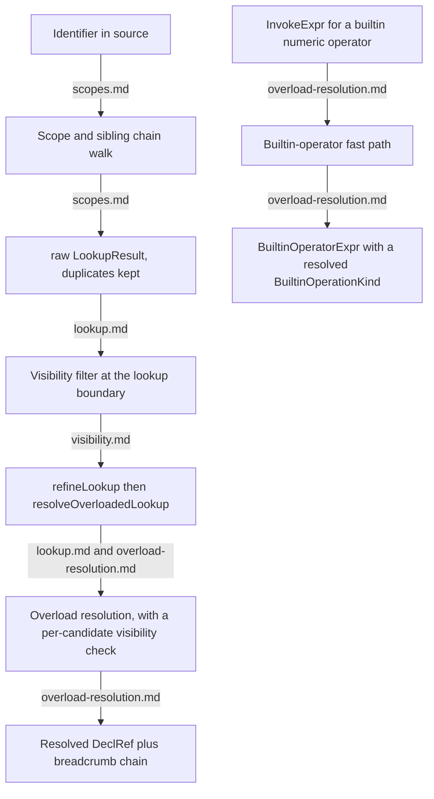

# Name Resolution

This subtree documents the _algorithmic rules_ by which Slang turns an
identifier in source text into a resolved `DeclRef`, and is written for
a compiler contributor working on or debugging those rules. The pages here
cover which declarations are considered and in what order, how
shadowing works, how visibility filters candidates, and how a
`LookupResult` holding several candidates is narrowed to a single best
match. This is the _what rules_ half of name resolution; the _where in
the compile flow_ half lives in
[../pipeline/02-parse-ast.md](../pipeline/02-parse-ast.md) (which
builds the scope chain while parsing) and
[../pipeline/03-semantic-check.md](../pipeline/03-semantic-check.md)
(which issues the lookup calls during checking).

The intended reader is a contributor who is modifying lookup,
visibility, or overload-resolution rules; a new contributor trying to
understand a name-resolution diagnostic such as "declaration is not
visible" or "ambiguous reference"; or anyone chasing a question of the
shape "why does `foo` resolve to this decl and not that one?". For the
per-class shape of `Scope`, `Decl`, `DeclRef`, and `LookupResult`, see
[../ast-reference/base.md](../ast-reference/base.md). For surface
grammar, see
[../syntax-reference/grammar.md](../syntax-reference/grammar.md).

Read the four pages in pipeline order: [scopes.md](scopes.md) is the
foundation, describing the chain of `Scope` records that everything
else walks; [lookup.md](lookup.md) walks that chain and produces a raw
`LookupResult`; [visibility.md](visibility.md) says which of those
items the requesting scope is allowed to see; and
[overload-resolution.md](overload-resolution.md) ranks the survivors.
The split is a reading order, not a hard phase boundary — visibility
filtering and the narrowing of duplicate lookup items each run partly
on either side of the lookup/overload line, and builtin operators skip
overload resolution entirely. See
[Where the boundaries blur](#where-the-boundaries-blur) below before
assuming a mechanism lives wholly on one page.

## Pages

| Page                                             | Topic                                                                                                            | Primary source                                                                                                                                                                                                      |
| ------------------------------------------------ | ---------------------------------------------------------------------------------------------------------------- | ------------------------------------------------------------------------------------------------------------------------------------------------------------------------------------------------------------------- |
| [scopes.md](scopes.md)                           | The `Scope` record, which AST nodes own a scope, sibling scopes, and the order scopes are consulted              | [slang-ast-base.h](../../../../source/slang/slang-ast-base.h), [slang-parser.cpp](../../../../source/slang/slang-parser.cpp), [slang-check-decl.cpp](../../../../source/slang/slang-check-decl.cpp)                 |
| [lookup.md](lookup.md)                           | The lookup entry points; masks and option bits, inheritance and transparent-member walks, breadcrumbs, shadowing | [slang-lookup.h](../../../../source/slang/slang-lookup.h), [slang-lookup.cpp](../../../../source/slang/slang-lookup.cpp)                                                                                            |
| [visibility.md](visibility.md)                   | `public` / `internal` / `private`, the per-language-version defaults, and where the visibility filter runs       | [slang-ast-modifier.h](../../../../source/slang/slang-ast-modifier.h), [slang-check-decl.cpp](../../../../source/slang/slang-check-decl.cpp), [slang-check-expr.cpp](../../../../source/slang/slang-check-expr.cpp) |
| [overload-resolution.md](overload-resolution.md) | Candidate filtering, conversion-cost ranking, partial generic application, operator overloading                  | [slang-check-overload.cpp](../../../../source/slang/slang-check-overload.cpp), [slang-check-expr.cpp](../../../../source/slang/slang-check-expr.cpp)                                                                |

## Flow diagram

```mermaid
flowchart TD
  ident["Identifier in source"]
  scopeWalk["Scope and sibling chain walk"]
  raw["raw LookupResult, duplicates kept"]
  visFilter["Visibility filter at the lookup boundary"]
  narrow["refineLookup then resolveOverloadedLookup"]
  overload["Overload resolution, with a per-candidate visibility check"]
  ranked["Resolved DeclRef plus breadcrumb chain"]
  invoke["InvokeExpr for a builtin numeric operator"]
  fast["Builtin-operator fast path"]
  builtin["BuiltinOperatorExpr with a resolved BuiltinOperationKind"]
  ident -->|"scopes.md"| scopeWalk
  scopeWalk -->|"scopes.md"| raw
  raw -->|"lookup.md"| visFilter
  visFilter -->|"visibility.md"| narrow
  narrow -->|"lookup.md and overload-resolution.md"| overload
  overload -->|"overload-resolution.md"| ranked
  invoke -->|"overload-resolution.md"| fast
  fast -->|"overload-resolution.md"| builtin
```

### Where the boundaries blur

- **Visibility is consulted twice.** Once on the lookup result, via
  `filterLookupResultByVisibilityAndDiagnose` and the shared
  `isDeclVisibleFromScope` predicate, and again per surviving overload
  candidate, via `TryCheckOverloadCandidateVisibility` — see
  [visibility.md#where-visibility-is-filtered](visibility.md#where-visibility-is-filtered).
- **Deduplication is two independent layers.** The facet list of a
  type is deduplicated by origin when the inheritance graph is built,
  so a base reached along several inheritance paths contributes one
  facet. Nothing dedupes at the `LookupResult` level: the same
  declaration found along two paths yields two items with different
  breadcrumb chains. What prunes them is the chain
  `refineLookup` -> `resolveOverloadedLookup` ->
  `CompareLookupResultItems`, which discards strictly worse paths but
  keeps items that compare equal, leaving those for overload resolution
  or an ambiguity diagnostic; the chain straddles the two pages — see
  [lookup.md#deduplication](lookup.md#deduplication) and
  [overload-resolution.md#relationship-to-lookup](overload-resolution.md#relationship-to-lookup).
- **Builtin operators handled by the fast path never reach overload
  resolution.** Checking an `InvokeExpr` first attempts two rewrites;
  on success the expression is replaced by a fully checked
  `BuiltinOperatorExpr`, and no candidate set is ever collected — see
  [overload-resolution.md#the-builtin-operator-fast-path](overload-resolution.md#the-builtin-operator-fast-path).
  The fast path declines some builtin-operand cases on purpose: in GLSL
  operator scope, matrix operators and vector equality return null so
  the `glsl` module's overloads apply. Those, together with
  user-defined operators, take the general `operator OP` path in
  [overload-resolution.md#the-general-path](overload-resolution.md#the-general-path).
- **Sibling scopes are wired in a check phase of their own.** They are
  not all built by the parser: namespaces and `using` decls acquire
  their `nextSibling` links when a decl is driven to
  `DeclCheckState::ScopesWired`
  ([slang-ast-support-types.h](../../../../source/slang/slang-ast-support-types.h)),
  a state that sits between modifier checking and signature checking.
  Imported modules are spliced in later, by
  `SemanticsDeclHeaderVisitor::visitImportDecl` at
  `DeclCheckState::SignatureChecked` — see [scopes.md#sibling-scopes](scopes.md#sibling-scopes) and
  [scopes.md#scope-walking-order-during-lookup](scopes.md#scope-walking-order-during-lookup).
- **Lookup from the parser is weaker than lookup from the checker.**
  Parsing is two-stage: function bodies are captured as token spans
  and re-parsed later, and a lookup issued while there is no
  `SemanticsVisitor` yet sees direct members only — no bases, no
  extensions. See
  [lookup.md#edge-cases-and-failure-modes](lookup.md#edge-cases-and-failure-modes)
  and
  [scopes.md#edge-cases-and-failure-modes](scopes.md#edge-cases-and-failure-modes).

## Where this fits in the pipeline

Name resolution runs inside the semantic-checking phase. The parser
([../pipeline/02-parse-ast.md](../pipeline/02-parse-ast.md)) builds
most of the `Scope` chain as the AST is constructed;
[scopes.md](scopes.md) documents which AST nodes own a scope, how the
parser threads them, and which links are instead added later during
checking. The checker
([../pipeline/03-semantic-check.md](../pipeline/03-semantic-check.md))
calls the lookup entry points, filters the results, and ranks
overloads; the four pages here document the rules those calls follow.
The data structures they operate on — `Scope`, `Decl`, `DeclRef`,
`LookupResult` — are catalogued in
[../ast-reference/base.md](../ast-reference/base.md).

Downstream, the resolved `DeclRef` — with its breadcrumb chain already
expanded into concrete AST access expressions during checking (see
[lookup.md#breadcrumbs](lookup.md#breadcrumbs)) — flows into AST-to-IR
lowering
([../pipeline/04-ast-to-ir.md](../pipeline/04-ast-to-ir.md)).
Cross-cutting consumers of `DeclRef` are documented in
[../cross-cutting/ir-instructions.md](../cross-cutting/ir-instructions.md).

## Related glossary terms

The glossary covers the vocabulary used across this subtree. The
entries most directly relevant:

- [`scope`](../glossary.md) — the `Scope` data structure.
- [`shadowing`](../glossary.md) — when one decl obscures another of
  the same name.
- [`lookup mask`](../glossary.md), [`lookup options`](../glossary.md),
  [`lookup breadcrumb`](../glossary.md) — the filtering and
  navigation primitives used by lookup.
- [`transparent member`](../glossary.md) — the modifier that drives
  the `cbuffer`-style member injection rule.
- [`visibility`](../glossary.md) — `public`, `internal`, `private`,
  the `VisibilityModifier` class hierarchy, and the `DeclVisibility`
  enum the checker reasons about.
- [`overload resolution`](../glossary.md),
  [`conversion cost`](../glossary.md),
  [`partial generic application`](../glossary.md) — the ranking
  algorithm and its inputs.
- [`decl-ref`](../glossary.md), [`lookup result`](../glossary.md),
  [`name resolution`](../glossary.md) — the data structures the
  process produces.
