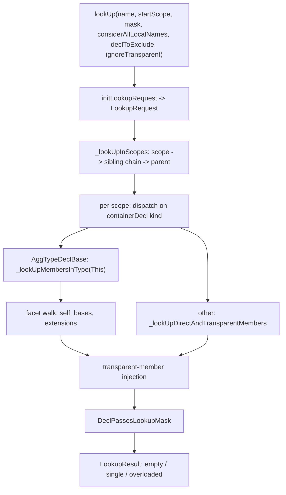

# Lookup

This document specifies Slang's name-lookup algorithm: the entry
points exposed by `slang-lookup.h`, the request and result types, the
per-step pipeline that walks scopes, inheritance facets, and
transparent members, and the shadowing rules that decide which decls
are visible at a given source location. The intended reader is a
developer modifying lookup behavior, a contributor adding a new
lookup-aware feature (a new modifier, a new declaration kind, a new
inheritance rule), or someone chasing an ambiguous-reference
diagnostic.

Visibility filtering on lookup results is described in
[visibility.md](visibility.md). Overload ranking that consumes a
multi-item `LookupResult` is described in
[overload-resolution.md](overload-resolution.md). The shape of the
scope chain that lookup walks is described in
[scopes.md](scopes.md).

## Source

The four entry points plus the two `AddToLookupResult` overloads are
declared in
[slang-lookup.h](../../../../source/slang/slang-lookup.h) and
implemented in
[slang-lookup.cpp](../../../../source/slang/slang-lookup.cpp). The
data structures (`LookupMask`, `LookupOptions`, `LookupRequest`,
`LookupResult`, `LookupResultItem`, `LookupResultItem_Breadcrumb`)
live in
[slang-ast-support-types.h](../../../../source/slang/slang-ast-support-types.h).
The per-decl `hiddenFromLookup` flag and the
`_prevInContainerWithSameName` link are on `Decl` in
[slang-ast-base.h](../../../../source/slang/slang-ast-base.h); the
member-list accessors lookup calls are on `ContainerDecl` in
[slang-ast-decl.h](../../../../source/slang/slang-ast-decl.h) /
[slang-ast-decl.cpp](../../../../source/slang/slang-ast-decl.cpp); the
transparent-member and lookup-suppressing modifiers are in
[slang-ast-modifier.h](../../../../source/slang/slang-ast-modifier.h).
The linearized inheritance information that member lookup iterates is
computed in
[slang-check-inheritance.cpp](../../../../source/slang/slang-check-inheritance.cpp).

Diagnostics raised on lookup results are declared in
[slang-diagnostics.lua](../../../../source/slang/slang-diagnostics.lua).

Four further pieces of machinery round out the source inventory and
are cited below: the
`Facet` / `FacetList` / `InheritanceInfo` declarations in
[slang-check-impl.h](../../../../source/slang/slang-check-impl.h)
(lines 525-763); the post-lookup narrowing and filtering steps in
[slang-check-expr.cpp](../../../../source/slang/slang-check-expr.cpp)
(`resolveOverloadedLookup`, `filterLookupResultByCheckedOptional`,
`diagnoseAmbiguousReference`); the `CompareLookupResultItems`
comparator in
[slang-check-overload.cpp](../../../../source/slang/slang-check-overload.cpp);
and the two parser helpers that drive lookup before semantic checking
begins, in
[slang-parser.cpp](../../../../source/slang/slang-parser.cpp).

## Concepts

- **Entry points.** Four functions declared in
  [slang-lookup.h](../../../../source/slang/slang-lookup.h):
  - `lookUp` (lines 17-25) — unqualified name lookup starting from a
    `Scope*`. Note that it does _not_ take a `LookupOptions`; it takes
    two `bool` parameters, `considerAllLocalNamesInScope` and
    `ignoreTransparentMembers`, and folds them into the corresponding
    `LookupOptions` bits itself
    ([slang-lookup.cpp](../../../../source/slang/slang-lookup.cpp)
    lines 1071-1091).
  - `lookUpMember` (lines 28-35) — qualified lookup of `name` against
    a `Type*`. This is the entry point that accepts a full
    `LookupOptions`.
  - `lookUpDirectAndTransparentMembers` (lines 38-45) — direct lookup
    in one `ContainerDecl`, with transparent-member injection but
    without inheritance or extension walks. It has no `LookupOptions`
    parameter, so it always runs with `LookupOptions::None`
    ([slang-lookup.cpp](../../../../source/slang/slang-lookup.cpp)
    lines 308-329).
  - `refineLookup` (line 13) — re-filter an existing `LookupResult`
    against a different `LookupMask`. The first three drive lookup;
    this one is a post-filter.

  `AddToLookupResult` (lines 60-61) is also exported, in an
  item-at-a-time and a merge-a-whole-result overload, because callers
  that build results outside `slang-lookup.cpp` (the visibility and
  optional-constraint filters) need to accumulate items the same way.

- `LookupRequest`
  ([slang-ast-support-types.h](../../../../source/slang/slang-ast-support-types.h)
  lines 1562-1582) — the parameter bundle threaded through the lookup
  implementation: `semantics`, `scope`, `endScope`, `declToExclude`,
  `mask`, `options`, plus the two predicates `isCompletionRequest()`
  and `shouldConsiderAllLocalNames()`. Built by `initLookupRequest`
  ([slang-lookup.cpp](../../../../source/slang/slang-lookup.cpp) lines
  285-305), which also auto-sets the `Completion` option when the
  name being looked up matches the session's completion token. Two
  fields deserve a note:
  - `endScope` is never assigned by any caller at `source_commit`, so
    the scope walk always runs until the parent chain reaches null.
  - `declToExclude` is threaded from
    `SemanticsContext::getDeclToExcludeFromLookup`
    ([slang-check-impl.h](../../../../source/slang/slang-check-impl.h)
    lines 1469-1481) and exists so that a declaration being checked
    cannot find itself — the header's example is `typedef Foo Foo;`.
  - `semantics` may be null. Lookup performed from the parser has no
    `SemanticsVisitor` yet, and that changes behavior in two places
    (see step 4 of "Unqualified lookup" and "Member lookup" below).
- `LookupMask`
  ([slang-ast-support-types.h](../../../../source/slang/slang-ast-support-types.h)
  lines 1307-1316) — a `uint8_t` bitset selecting which categories
  of decl pass the filter. The bits are:
  - `type = 0x1` — `AggTypeDecl` / `SimpleTypeDecl`.
  - `Function = 0x2` — `FunctionDeclBase` subclasses.
  - `Value = 0x4` — everything that is neither a type, a function, an
    attribute, a syntax decl, nor a semantic decl (variables,
    parameters, fields, ...); it is the fall-through case.
  - `Attribute = 0x8` — `AttributeDecl`, the declarations
    introduced by `attribute_syntax [name(...)]` in
    [core.meta.slang](../../../../source/slang/core.meta.slang) (line
    4599 declares `[numthreads]`). Source reaches them only by writing
    `[name(...)]` on a declaration
    ([slang-ast-decl.h line
    1168](../../../../source/slang/slang-ast-decl.h)).
  - `SyntaxDecl = 0x10` — keyword-introducing `SyntaxDecl`. The parser
    asks for this bit on its own when reading the modifier list of a
    parameter declaration, so that only a keyword decl can begin a
    modifier there
    ([slang-parser.cpp lines 5059 and
    7655](../../../../source/slang/slang-parser.cpp)).
  - `Semantic = 0x20` — `SemanticDecl`, the
    `semantic sv_position { ... }` declarations in
    [core.meta.slang](../../../../source/slang/core.meta.slang) (line 5001) that record which types and stages a `: SV_*` annotation on a
    shader parameter is valid for
    ([slang-ast-decl.h line
    729](../../../../source/slang/slang-ast-decl.h)).
  - `Default = type | Function | Value | SyntaxDecl` — the mask the
    parser and most checker entry points use.

  `Attribute` and `Semantic` are the two bits _outside_ `Default`, so
  only a caller that names them can reach those decls: an ordinary
  identifier spelled like an attribute neither hides the attribute nor
  is hidden by it. `type`, `Function`, and `Value` are already inside
  `Default`, so a use site that needs exactly one of those categories
  usually narrows the result after the fact through `refineLookup`
  rather than at the lookup call — the operand of `fwd_diff(...)` /
  `bwd_diff(...)` is resolved that way with `LookupMask::Function`
  ([slang-check-expr.cpp line
  6012](../../../../source/slang/slang-check-expr.cpp)).

  Classification happens in `DeclPassesLookupMask`
  ([slang-lookup.cpp](../../../../source/slang/slang-lookup.cpp) lines
  41-93). The mask test is not the first thing that function does: the
  `extern`-related rejections at lines 43-54 run before any bit is
  consulted, and `FileDecl` is hard-coded never to pass (lines 79-83).

- `LookupOptions`
  ([slang-ast-support-types.h](../../../../source/slang/slang-ast-support-types.h)
  lines 1319-1334) — a `uint8_t` bitset of behavior flags. Besides
  `None = 0` there are six:
  - `IgnoreBaseInterfaces` (1 << 0) — skip inherited interface
    members.
  - `Completion` (1 << 1) — return every applicable decl in a
    container rather than only same-named ones, and do not stop the
    outward scope walk on the first hit; used by the language server.
  - `NoDeref` (1 << 2) — do not auto-dereference pointer-like types.
  - `ConsiderAllLocalNamesInScope` (1 << 3) — bypass the
    `hiddenFromLookup` / check-state shadowing test so that lookup
    can succeed while scopes are still under construction during
    parsing.
  - `IgnoreInheritance` (1 << 4) — return only direct members of a
    `struct` (plus `extension`s on the same type).
  - `IgnoreTransparentMembers` (1 << 5) — skip transparent-member
    injection.
- `LookupResultItem`
  ([slang-ast-support-types.h](../../../../source/slang/slang-ast-support-types.h)
  lines 1425-1503) — one found decl plus an optional breadcrumb
  chain (`DeclRef<Decl> declRef`,
  `RefPtr<LookupResultItem_Breadcrumb> breadcrumbs`). It exposes
  `Breadcrumb` as a nested typedef for the free-standing
  `LookupResultItem_Breadcrumb` class.
- `LookupResultItem_Breadcrumb`
  ([slang-ast-support-types.h](../../../../source/slang/slang-ast-support-types.h)
  lines 1341-1422) — a navigation step recorded during lookup. Its
  `Kind` enum (lines 1344-1370) has four values:
  - `Member` — lookup saw a transparent in-scope decl and looked
    through it, so the final expression needs `obj.field`.
  - `Deref` — lookup auto-dereferenced a pointer-like type, so the
    final expression needs `(*obj)`.
  - `SuperType` — lookup walked from a sub-type to a super-type via
    a `subtypeWitness`, so the final expression must reflect that
    super-typing.
  - `This` — lookup considered an in-scope member of an enclosing
    type, so the final expression needs an implicit `this`/`This`.

  Breadcrumb instances chain via
  `RefPtr<LookupResultItem_Breadcrumb> next` and carry a
  `ThisParameterMode` (lines 1378-1385) describing whether `this` is
  `ImmutableValue`, `MutableValue`, or the `This` `Type`.

- `LookupResult`
  ([slang-ast-support-types.h](../../../../source/slang/slang-ast-support-types.h)
  lines 1509-1556) — single-or-multi container for found items. A
  result is _valid_ when `item.declRef.getDecl()` is non-null, and
  _overloaded_ when `items.getCount() > 1`. The invariant documented
  at lines 1518-1520 is that when `items` is in use it holds _all_ the
  items and `item` duplicates one of them (in practice the first);
  `items` is left entirely empty in the single-result case so that no
  heap allocation happens. `begin()`/`end()` hide the distinction from
  callers.
- `Facet` / `FacetList` / `InheritanceInfo`
  ([slang-check-impl.h](../../../../source/slang/slang-check-impl.h)
  lines 525-763) — the linearized inheritance information member
  lookup iterates. A facet is a `(kind, directness, origin,
subtypeWitness, declRefForMemberLookup)` record; `origin` is the
  type and/or `DeclRef` whose members the facet contributes. `kind`
  is `Type` or `Extension`; `directness` is `Self` (0), `Direct` (1),
  or a larger indirection count. The list is singly linked through
  `FacetImpl::next` and is deduplicated by origin at construction
  time — `originsMatch` / `FacetList::containsMatchFor`
  ([slang-check-inheritance.cpp](../../../../source/slang/slang-check-inheritance.cpp)
  lines 1877-1976) — so a base interface reached through two
  inheritance paths yields exactly one facet.

## Algorithm

### Unqualified lookup



`lookUp`
([slang-lookup.cpp](../../../../source/slang/slang-lookup.cpp) lines
1071-1091) converts its two `bool` parameters into `LookupOptions`,
builds a `LookupRequest`, and calls `_lookUpInScopes`
([slang-lookup.cpp](../../../../source/slang/slang-lookup.cpp) lines
786-1069). The implementation does the following, in order:

1. **Iterate over scopes.** The outer loop walks
   `request.scope` to `request.endScope` via the `parent` chain
   ([slang-lookup.cpp line
   801](../../../../source/slang/slang-lookup.cpp)). Because no caller
   sets `endScope`, the walk in practice terminates at the module
   root.
2. **Iterate over sibling scopes.** At each scope, the inner loop
   walks `nextSibling` from the current link so that sibling
   `NamespaceDecl`s, `using`-injected namespaces, and imported-module
   scopes are consulted at the same level
   ([slang-lookup.cpp line
   806](../../../../source/slang/slang-lookup.cpp)). See
   [scopes.md#sibling-scopes](scopes.md#sibling-scopes) for how those
   siblings get linked.
3. **Skip dummy and re-visited file scopes.** A null
   `containerDecl` is a sentinel that links siblings; it is
   skipped (lines 816-817). The first `FileDecl` encountered is
   remembered, and a later re-encounter of that _same_ `FileDecl` is
   skipped so that a file whose scope appears twice on the chain is
   not searched twice
   ([slang-lookup.cpp lines
   819-829](../../../../source/slang/slang-lookup.cpp)).
4. **Dispatch on container kind.** Each `containerDecl` is first
   turned into a `DeclRef` by `createDefaultSubstitutionsIfNeeded`
   (lines 836-840). If the result is an `AggTypeDeclBase` — for
   example lookup happening _inside_ a `struct`, `class`, `interface`,
   `enum`, or `extension` — the request is rewritten to perform member lookup
   against the corresponding `Type*`, with a
   `Breadcrumb::Kind::This` breadcrumb that records the implicit
   `this`/`This` of the enclosing decl
   ([slang-lookup.cpp lines
   851-930](../../../../source/slang/slang-lookup.cpp)). Otherwise the
   request falls through to
   `_lookUpDirectAndTransparentMembers`
   ([slang-lookup.cpp lines
   931-945](../../../../source/slang/slang-lookup.cpp)).
5. **Update `thisParameterMode`.** Before stepping to the parent
   scope, the loop updates `thisParameterMode` based on the
   container it just left: `ConstructorDecl` and `SetterDecl` give a
   mutable `this`; a `FunctionDeclBase` consults
   `isEffectivelyStatic`, `[mutating]`, and `[ref]`; and stepping out
   of a nested `AggTypeDeclBase` leaves only the `This` type
   ([slang-lookup.cpp lines
   976-1049](../../../../source/slang/slang-lookup.cpp)).
6. **Short-circuit on a non-overloadable hit.** After visiting one
   scope and its siblings, if the result is valid and is neither
   overloaded, nor overloadable per `_isDeclOverloadable`
   ([slang-lookup.cpp lines
   766-784](../../../../source/slang/slang-lookup.cpp)), nor a
   completion request, lookup stops walking outwards
   ([slang-lookup.cpp lines
   1052-1065](../../../../source/slang/slang-lookup.cpp)). Callables
   (and generics wrapping them) are overloadable, so they continue to
   accumulate candidates from outer scopes; types and variables do
   not.
7. **Result.** The accumulated `LookupResult` is returned. Lookup
   itself never diagnoses; every diagnostic named on this page is
   raised by a caller.

`_lookUpDirectAndTransparentMembers`
([slang-lookup.cpp](../../../../source/slang/slang-lookup.cpp) lines
189-283) does the per-container work for the non-type branch:

- In completion mode it iterates _every_ direct member via
  `getDirectMemberDecls` (lines 198-214); otherwise it iterates only
  members whose name matches `request.name`, using
  `ContainerDecl::getDirectMemberDeclsOfName` (declared at
  [slang-ast-decl.h line
  191](../../../../source/slang/slang-ast-decl.h), defined at
  [slang-ast-decl.cpp line
  372](../../../../source/slang/slang-ast-decl.cpp)), which walks the
  same-name list threaded through
  `Decl::_prevInContainerWithSameName`
  ([slang-ast-base.h](../../../../source/slang/slang-ast-base.h) line
  790).
- Each candidate is filtered through `_isUncheckedLocalVar` to
  enforce block-local shadowing (see "Shadowing rules" below). In the
  named-lookup branch that test additionally requires
  `request.semantics` to be non-null (line 228), so a parse-time
  lookup never suppresses a local on check-state grounds.
- Each candidate is compared against `request.declToExclude`, then
  filtered through `DeclPassesLookupMask`. That filter also drops
  decls carrying `ExtensionExternVarModifier` and rejects
  `ExternModifier`-tagged members of `extension`s unconditionally
  ([slang-lookup.cpp lines
  43-54](../../../../source/slang/slang-lookup.cpp)).
- After direct members, the function walks
  `ContainerDecl::getTransparentDirectMemberDecls` and recurses into
  each transparent value via `_lookUpMembersInValue`, recording a
  `Breadcrumb::Kind::Member` step. Transparent-member injection is
  skipped when the mask includes `Attribute` or when
  `IgnoreTransparentMembers` is set
  ([slang-lookup.cpp lines
  246-282](../../../../source/slang/slang-lookup.cpp)).

### Member lookup

`lookUpMember(astBuilder, semantics, name, type, sourceScope, mask,
options)`
([slang-lookup.cpp](../../../../source/slang/slang-lookup.cpp) lines
1093-1106) is the entry point for `obj.name`. It calls
`_lookUpMembersInType` (lines 722-736), which only null-checks the
type and forwards to `_lookUpMembersInSuperTypeImpl` (lines 578-709).
That function is where the dispatch on type shape happens:

- **`DeclRefType`.** Lookup delegates to
  `_lookUpMembersInSuperTypeDeclImpl` (lines 513-576), described
  below.
- **`EachType` / `FirstPackElementType` / `LastPackElementType` /
  `PackBranchType`.** Lookup canonicalizes the type and enters the
  facet walk for the canonicalized form
  ([slang-lookup.cpp lines
  625-686](../../../../source/slang/slang-lookup.cpp)). All four of
  these arms return early when `request.semantics` is null, because
  computing `InheritanceInfo` requires the shared semantics context.
- **`ModifiedType`.** Modifiers are transparent to lookup; the facet
  walk runs on the modified type directly
  ([slang-lookup.cpp lines
  641-654](../../../../source/slang/slang-lookup.cpp)). Exactly three
  spellings produce one: `unorm`, `snorm`, and `no_diff`, the only
  modifiers `checkTypeModifier` turns into a modifier `Val`
  ([slang-check-expr.cpp lines
  9356-9375](../../../../source/slang/slang-check-expr.cpp)). The
  parser moves such a modifier off the declaration and onto its type
  expression (`_moveTypeModifiersToTypeExpr`,
  [slang-parser.cpp line
  3300](../../../../source/slang/slang-parser.cpp)), so a member
  access on a value declared `no_diff S` reaches this arm. The
  compiler also introduces `no_diff` on its own while building
  derivative function types (`getBackwardDiffFuncType`,
  [slang-check-expr.cpp lines
  5711-5776](../../../../source/slang/slang-check-expr.cpp)).
- **`ExtractExistentialType`.** The implicit `ThisType` decl-ref of
  the underlying interface is the target of lookup, so that
  associated types in a found member's signature resolve against a
  comparable substitution
  ([slang-lookup.cpp lines
  687-702](../../../../source/slang/slang-lookup.cpp)). The source
  shape that produces one is a variable, parameter, or field declared
  with an interface type: `maybeOpenExistential`
  ([slang-check-expr.cpp line
  240](../../../../source/slang/slang-check-expr.cpp)) rewrites a
  member-access base whose type is a `DeclRefType` of an
  `InterfaceDecl` into an `ExtractExistentialValueExpr` typed
  `ExtractExistentialType` (lines 197-206), and it runs on the base of
  every member access (line 8824) and static member access (line
  8744).

  ```
  interface ICounter { int val(); }
  struct S : ICounter { int val() { return 5; } }
  ICounter c = S();   // `c` has existential type
  int n = c.val();    // member lookup takes this arm
  ```

- **`AndType`.** Unexpected at lookup time;
  `visitGenericTypeConstraintDecl` is supposed to have flattened it
  earlier, so the arm is a `SLANG_UNEXPECTED`.
- Anything else — including `ErrorType` — falls off the end of the
  chain and contributes no items.

**Lookup in a decl.** `_lookUpMembersInSuperTypeDeclImpl` (lines
513-576) handles three cases in order. First, the name `This` in
anything other than an `InterfaceDecl` resolves to the decl-ref
itself (lines 522-529). Second, if `request.semantics` is null — the
parse-time case — it does a direct-members-only lookup on an
`AggTypeDeclBase` and returns, without consulting bases or
extensions (lines 531-549). Otherwise it drives the decl to
`DeclCheckState::ReadyForLookup` via `ensureDecl` (line 551), asks
`SharedSemanticsContext::getInheritanceInfo` for the linearized facet
list — keyed on the `ExtensionDecl` decl-ref for an extension, and on
the canonical self type otherwise (lines 556-566) — and hands off to
the facet walk.

**Facet walk.** `_lookupMembersInSuperTypeFacets`
([slang-lookup.cpp lines
393-511](../../../../source/slang/slang-lookup.cpp)) iterates
`inheritanceInfo.facets`. For each facet it:

- Skips facets with no `ContainerDecl` decl-ref, and facets missing
  either a type or a `subtypeWitness` (lines 406-416).
- Skips interface facets when `IgnoreBaseInterfaces` is set (lines
  421-425).
- Skips non-`Self` facets when `IgnoreInheritance` is set, with a
  special case that keeps an `extension` whose target type equals the
  self type (lines 428-446).
- Skips facets whose `subtypeWitness` is a `DeclaredSubtypeWitness`
  over an inheritance decl carrying `IgnoreForLookupModifier` — the
  synthetic tag-type inheritance on `enum`s
  ([slang-lookup.cpp lines
  459-464](../../../../source/slang/slang-lookup.cpp)).
- Treats an inherited `This` specially: when the facet's container is
  a `ThisTypeDecl` and the name is `This`, an inherited candidate is
  suppressed entirely if the self type is an interface (an
  interface's own `This` must not be made ambiguous by its bases),
  and otherwise the facet's decl-ref _is_ the result
  ([slang-lookup.cpp lines
  473-489](../../../../source/slang/slang-lookup.cpp)).
- For a non-`Self` facet of `Facet::Kind::Type`, prepends a
  `Breadcrumb::Kind::SuperType` step carrying the `subtypeWitness`
  (lines 493-500).
- Calls `_lookUpDirectAndTransparentMembers` on the facet's
  container, using `facet->declRefForMemberLookup` as the parent
  decl-ref (lines 502-509).

**How interface requirements arrive.** An interface facet does not
inject its requirements as a separate step; the injection is encoded
in the parent decl-ref. `FacetImpl::init`
([slang-lookup.cpp lines
351-375](../../../../source/slang/slang-lookup.cpp)) calls
`_maybeSpecializeSuperTypeDeclRef` (lines 332-349) for every
non-`Self` facet, which replaces an interface's plain decl-ref with a
`LookupDeclRef` built from the interface's `ThisTypeDecl` and the
facet's `subtypeWitness`. Members found through that facet therefore
come back already specialized to the concrete conforming type. See
[../ast-reference/values.md#declref-family-and-the-four-shapes-a-decl-ref-can-take](../ast-reference/values.md#declref-family-and-the-four-shapes-a-decl-ref-can-take)
for the four decl-ref shapes and
[../ast-reference/values.md#witness-family](../ast-reference/values.md#witness-family)
for the witness values involved.

**Pointer auto-dereference.** Before the per-type dispatch above,
`_lookUpMembersInSuperTypeImpl`
([slang-lookup.cpp lines
586-609](../../../../source/slang/slang-lookup.cpp)) calls
`getPointedToTypeIfCanImplicitDeref(superType)`. If the type is
pointer-like and `NoDeref` is not set, a `Deref` breadcrumb is
prepended and lookup recurses on the pointee; a valid result there
short-circuits the rest of the dispatch. The `_lookUpInScopes`
dispatcher forces `NoDeref` when the enclosing scope is an
`ExtensionDecl`
([slang-lookup.cpp lines
913-921](../../../../source/slang/slang-lookup.cpp)) so that the
extension's `This` refers to the extension target itself, not the
pointed-to type.

**`ThisType` for interfaces.** When the enclosing scope is an
`InterfaceDecl`, `_lookUpInScopes` rewrites the lookup to go through
the interface's `ThisTypeDecl` (the abstract self-type of the
interface). The `This` breadcrumb is suppressed in that case because
the rewritten decl-ref already encodes the navigation
([slang-lookup.cpp lines
889-905](../../../../source/slang/slang-lookup.cpp)).
`InterfaceDefaultImplDecl` triggers a separate path that looks up in
the explicit `This` parameter instead of the interface itself
([slang-lookup.cpp lines
947-974](../../../../source/slang/slang-lookup.cpp)).

### Transparent members

A `TransparentModifier`
([slang-ast-modifier.h](../../../../source/slang/slang-ast-modifier.h)
line 118) on a member of a `ContainerDecl` causes its own members to
be searched whenever the parent is searched. The canonical example
documented in
[slang-ast-support-types.h lines
1437-1451](../../../../source/slang/slang-ast-support-types.h) is an
HLSL `cbuffer C { float4 f; }`: the compiler lowers this to

```
struct Anon0 { float4 f; };
__transparent ConstantBuffer<Anon0> anon1;
```

so that an unqualified reference to `f` resolves through
`anon1.f` via a chain of two breadcrumbs:

1. `Member` — `f` lives one struct member deep through `anon1`; the
   transparent member is recorded first.
2. `Deref` — `ConstantBuffer<Anon0>` is pointer-like, so lookup
   dereferences it.

`__transparent` is not a source-writable modifier — no keyword in the
parser's tables introduces one. The single site that creates a
`TransparentModifier` is `ParseBufferBlockDecl`
([slang-parser.cpp line
4159](../../../../source/slang/slang-parser.cpp)), which backs the
`cbuffer` and `tbuffer` declaration keywords
([slang-parser.cpp lines
10727-10728](../../../../source/slang/slang-parser.cpp)) and the GLSL
interface-block forms that route to the same helper from
`ParseDeclWithModifiers` (lines 5868-5891). Every transparent member
in a user program therefore comes from one of those buffer-block
declarations.

`ContainerDecl::getTransparentDirectMemberDecls`
([slang-ast-decl.h line
212](../../../../source/slang/slang-ast-decl.h), defined at
[slang-ast-decl.cpp line
423](../../../../source/slang/slang-ast-decl.cpp)) returns the cached
list of direct members carrying `TransparentModifier`; the cache is
populated when the container's lookup accelerators are rebuilt
([slang-ast-decl.cpp lines
301-304](../../../../source/slang/slang-ast-decl.cpp)). The lookup
side
([slang-lookup.cpp lines
258-282](../../../../source/slang/slang-lookup.cpp)) walks that list,
prepends a `Member` breadcrumb, and recurses via
`_lookUpMembersInValue`. The recursion is short-circuited when:

- the request's `mask` includes `Attribute` (transparent-member
  recursion is forbidden for attributes to avoid infinite recursion
  on transparent types that themselves contain attribute members),
  or
- the request's `options` include `IgnoreTransparentMembers`. The one
  context that sets that option is the check of a declaration's base
  clause when the declaration itself carries `TransparentModifier`,
  where looking back through the transparent member would be circular
  (`excludeTransparentMembersFromLookup`,
  [slang-check-decl.cpp lines
  4798-4804](../../../../source/slang/slang-check-decl.cpp)); it
  reaches lookup through `visitVarExpr`
  ([slang-check-expr.cpp line
  5342](../../../../source/slang/slang-check-expr.cpp)).

### Breadcrumbs

Each lookup result item carries a singly-linked list of
`LookupResultItem_Breadcrumb` nodes. The checker walks the list to
synthesize the canonical AST expression. For the `cbuffer` example
above, an unqualified `f` becomes the equivalent of `(*anon1).f`:

- `Member` -> `Deref` -> (decl `f`).

For an unqualified `g` defined on `Self` inside a method, the
breadcrumb is just `This`, marking that the rewritten expression
needs an implicit `this.g`. The `ThisParameterMode` field on the
breadcrumb records whether `this` is `ImmutableValue`,
`MutableValue`, or the `This` type — set per the enclosing
function's `[mutating]` / `[ref]` / `static` modifiers as described
in step 5 of "Unqualified lookup" above.

For lookup through an interface base via `subtypeWitness`, the
breadcrumb is `SuperType` and carries the witness as its `val`. That
field is also what
`SemanticsVisitor::filterLookupResultByCheckedOptional`
([slang-check-expr.cpp](../../../../source/slang/slang-check-expr.cpp)
lines 1349-1373) inspects: it walks each item's breadcrumb chain and
drops the item when any `SubtypeWitness` on it comes from an
`optional` constraint that the surrounding code has not yet checked.

`CreateLookupResultItem`
([slang-lookup.cpp lines
146-165](../../../../source/slang/slang-lookup.cpp)) reverses the
on-stack `BreadcrumbInfo` chain (declared at lines 29-37) when
constructing the heap-allocated linked list, so the final order
matches the navigation order from the user's source expression to the
found decl.

## Shadowing rules

### Block-local shadowing

Inside a `BlockStmt`, decls are temporarily hidden by setting
`Decl::hiddenFromLookup`
([slang-ast-base.h](../../../../source/slang/slang-ast-base.h) line
803). `SemanticsStmtVisitor::visitBlockStmt`
([slang-check-stmt.cpp](../../../../source/slang/slang-check-stmt.cpp)
lines 82-119) sets the flag on every `DeclStmt` in the block's
`SeqStmt` body before checking that body (lines 106-116), and
`visitDeclStmt` (lines 58-80) clears it as the checker walks past each
declaration (line 73). The flag is only ever written by these two
statement visitors plus `visitCatchStmt` (line 670), which clears it
on a `catch` clause's error variable.

Lookup honors the flag via `_isUncheckedLocalVar`
([slang-lookup.cpp](../../../../source/slang/slang-lookup.cpp) lines
175-181), which treats a decl as not-yet-declared when it is
`Unchecked`, currently being checked, _or_ `hiddenFromLookup`, and
when `isLocalVar` holds for it.

`LookupOptions::ConsiderAllLocalNamesInScope` lets a caller bypass
this check. The one caller that sets it is `tryLookUpSyntaxDecl`
([slang-parser.cpp](../../../../source/slang/slang-parser.cpp) lines
1115-1144), which also passes a null `SemanticsVisitor`: during
parsing, decls inserted so far have no meaningful check state, so the
flag lets the parser see them anyway when deciding whether an
identifier names a `SyntaxDecl`.

### Container-level overload accumulation

Decls with the same name inside one `ContainerDecl` do not shadow
each other; they accumulate into a `LookupResult` and become an
overload set. The chain is implemented by the
`Decl::_prevInContainerWithSameName` field
([slang-ast-base.h line
790](../../../../source/slang/slang-ast-base.h)). It is populated
lazily when a container's lookup accelerators are rebuilt —
`ContainerDeclDirectMemberDecls::_ensureLookupAcceleratorsAreValid`
([slang-ast-decl.cpp](../../../../source/slang/slang-ast-decl.cpp)
lines 260-343, writing the field at line 331) — and not by
`addDirectMemberDecl` (line 409), which only appends to the member
list. The same pass deliberately skips a `GenericDecl`'s `inner`
member (lines 312-320) so that a generic and its inner decl do not
both answer to the generic's name. `getDirectMemberDeclsOfName`
([slang-ast-decl.cpp line
372](../../../../source/slang/slang-ast-decl.cpp)) exposes the chain
as an iterable list, and lookup consumes it at
[slang-lookup.cpp line
223](../../../../source/slang/slang-lookup.cpp).

#### Deduplication

`AddToLookupResult`
([slang-lookup.cpp lines
95-113](../../../../source/slang/slang-lookup.cpp)) appends each
incoming `LookupResultItem` to the result without comparing it
against previously-collected items, so lookup performs no
deduplication of its own. Duplicates are prevented — or not — at two
other layers:

- **Within member lookup**, the facet list is already deduplicated by
  origin (`originsMatch`,
  [slang-check-inheritance.cpp lines
  1877-1934](../../../../source/slang/slang-check-inheritance.cpp)),
  so a base type reached through several inheritance paths
  contributes one facet and its members appear once.
- **Across lookup paths**, nothing dedupes. The same `DeclRef` reached
  both directly from an enclosing scope and through a transparent
  member appears twice, with different breadcrumb chains. Separately,
  lookup can return competing items for _different_ declarations, such
  as an interface requirement alongside the concrete member that
  satisfies it. Narrowing is the caller's job:
  `SemanticsVisitor::_resolveOverloadedExprImpl`
  ([slang-check-expr.cpp](../../../../source/slang/slang-check-expr.cpp)
  lines 1519-1537) first calls `refineLookup` to drop items that do
  not match the contextually expected `LookupMask`, then
  `resolveOverloadedLookup` (lines 1396-1473), which keeps only the
  pairwise-incomparable items under `CompareLookupResultItems`. That
  comparator is where a concrete method beats the interface
  requirement it satisfies
  ([slang-check-overload.cpp](../../../../source/slang/slang-check-overload.cpp)
  lines 1944-1958); see
  [overload-resolution.md#tie-breaking-comparator](overload-resolution.md#tie-breaking-comparator).

Keeping every breadcrumb path visible through lookup is what lets
these later phases produce accurate ambiguity diagnostics.

### Module and namespace

Multiple `namespace Foo {}` declarations under the same parent
container parse into the same `NamespaceDecl` — the parser reuses the
first one it finds in that parent. Namespaces that cannot be merged
that way (same-named namespaces in different `FileDecl`s of one module,
same-named namespaces in different modules, and the targets of a
`using` declaration) are instead attached to the scope chain as
siblings, and
the inner loop of step 2 above is what makes them reachable. The
wiring happens in `SemanticsDeclScopeWiringVisitor`
([slang-check-decl.cpp](../../../../source/slang/slang-check-decl.cpp)
lines 17325-17427), a dedicated check phase that runs to
`DeclCheckState::ScopesWired`, which sits between `ModifiersChecked` and
`SignatureChecked`
([slang-ast-support-types.h](../../../../source/slang/slang-ast-support-types.h)
lines 492-506). The whole module is driven to `ScopesWired` before any
declaration advances past it — the state loop at
[slang-check-decl.cpp lines
5244-5321](../../../../source/slang/slang-check-decl.cpp) runs
`ensureAllDeclsRec` once per state, in order. Wiring therefore
completes before any signature is checked, so lookups performed while
resolving declaration headers already see the complete sibling chain.
That ordering is intentional and user-visible: a `using` declaration
may appear _after_ the declaration whose header depends on it, and the
header still resolves.

```
namespace NS { struct Widget { int v; }; }
Widget makeW(int n) { Widget w; w.v = n; return w; }  // resolves
using namespace NS;
```

`addSiblingScopeForContainerDecl` (declared at
[slang-ast-decl.h line
1192](../../../../source/slang/slang-ast-decl.h), called at
[slang-check-decl.cpp line
17416](../../../../source/slang/slang-check-decl.cpp) for namespaces
and line 17355 for `using`) is the constructor for those links, and
`importModuleIntoScope` (line 17032) filters what an `import`
re-exports through `isOwnModuleOrIncludedFileScope` (line 17066).
[scopes.md#sibling-scopes](scopes.md#sibling-scopes) owns the details;
[visibility.md](visibility.md) owns the reachability rules the filter
upholds.

### Interface requirements vs default implementations

A user-provided extension member can shadow an interface default
implementation. The relevant special case is
`InterfaceDefaultImplDecl`
([slang-ast-decl.h line
944](../../../../source/slang/slang-ast-decl.h)): when lookup is
performed from inside one, `_lookUpInScopes` looks up in the explicit
`This` type parameter, then advances the scope cursor past every
scope up to and including the enclosing `InterfaceDecl` and breaks
out of the sibling loop
([slang-lookup.cpp lines
947-974](../../../../source/slang/slang-lookup.cpp)), so the
interface's own requirement declarations are never consulted and a
witness override on a conforming type wins over the default.

### Keyword vs identifier

Keywords are `SyntaxDecl`s registered in the core module; they
share the identifier namespace with user decls, so shadowing is
decided by ordinary lookup rather than by a separate keyword table
(see
[../ast-reference/declarations.md#syntaxdecl-and-the-syntax-as-declaration-model](../ast-reference/declarations.md#syntaxdecl-and-the-syntax-as-declaration-model)).
Two parser helpers use lookup in opposite directions:

- `tryLookUpSyntaxDecl`
  ([slang-parser.cpp](../../../../source/slang/slang-parser.cpp) lines
  1115-1144) asks with `considerAllLocalNamesInScope = true` and
  rejects the result unless the single found decl is a `SyntaxDecl`.
  A local of the same name therefore wins, because it is found first
  and is not a `SyntaxDecl`.
- `isKeywordAvailable`
  ([slang-parser.cpp](../../../../source/slang/slang-parser.cpp) lines
  9652-9665) treats a _contextual_ keyword as available only when
  plain lookup of that identifier finds nothing at all, so any user
  declaration of the name disables the keyword.

### Generic parameters

Generic parameters live in the `GenericDecl`'s own scope and are
seen as direct members of that scope. A reference to `T` from
inside the generic's inner decl resolves through the inner scope's
parent (the `GenericDecl` scope), shadowing any same-named decl in
the enclosing scope. A reference to `T` from a sibling of the outer
decl never finds the generic parameter because that scope chain
does not pass through the `GenericDecl`.

## Edge cases and failure modes

- **`LookupResult` with multiple items matching the mask.** Returned
  as overloaded; ranking is deferred to
  [overload-resolution.md](overload-resolution.md). When such a result
  is later re-filtered against a narrower `LookupMask` and only one
  item matches, `refineLookup`
  ([slang-lookup.cpp lines
  128-144](../../../../source/slang/slang-lookup.cpp)) drops every
  item failing `DeclPassesLookupMask` silently and returns the single
  survivor — no diagnostic is raised for the filtered-out candidates.
  `refineLookup` also returns its input unchanged when the input is
  invalid or not overloaded. Its caller in the checker is
  `SemanticsVisitor::_resolveOverloadedExprImpl`
  ([slang-check-expr.cpp line
  1542](../../../../source/slang/slang-check-expr.cpp)), which is
  handed the narrower mask by the use site; the operand of
  `fwd_diff(...)` / `bwd_diff(...)` asks for `LookupMask::Function`
  that way
  ([slang-check-expr.cpp line
  6012](../../../../source/slang/slang-check-expr.cpp)), so a
  same-named non-function candidate is dropped there without a
  diagnostic.
- **Ambiguous reference at use site.** When narrowing leaves more than
  one candidate and the context needs exactly one, the checker calls
  `diagnoseAmbiguousReference`
  ([slang-check-expr.cpp](../../../../source/slang/slang-check-expr.cpp)
  lines 1489-1504), which emits `Diagnostics::AmbiguousReference`
  (`ambiguous-reference`, code 39999,
  [slang-diagnostics.lua lines
  4036-4041](../../../../source/slang/slang-diagnostics.lua)) followed
  by one `OverloadCandidate` note per surviving item; the
  single-argument `diagnoseAmbiguousReference` wrapper (lines
  1506-1517) is what sets the expression's type to the error type. A
  `NamespaceDecl` first item is
  exempted (lines 1475-1487) because an overloaded namespace reference
  is legitimate.
- **Forward reference inside a `BlockStmt`.** Using `b` before its
  `DeclStmt` reaches the lookup with `hiddenFromLookup = true`;
  `_isUncheckedLocalVar` skips the decl, so lookup returns either
  the decl from an outer scope or empty. The checker's
  `Diagnostics::UndefinedIdentifier` takes over from there, with a
  "did you mean" suggestion produced by the separate scope walk in
  `findClosestInScopeName` (see
  [scopes.md#scope-walking-order-during-lookup](scopes.md#scope-walking-order-during-lookup)).
- **`FileDecl` returns no hits.** `DeclPassesLookupMask` rejects
  `FileDecl` unconditionally
  ([slang-lookup.cpp lines
  79-83](../../../../source/slang/slang-lookup.cpp)) — its members are
  found through its sibling-linked module scope, not by directly
  looking up "the file" as a name.
- **`ExtensionExternVarModifier` and `ExternModifier` in
  extensions.** Both are filtered out at the very start of
  `DeclPassesLookupMask`
  ([slang-lookup.cpp lines
  43-54](../../../../source/slang/slang-lookup.cpp)), before any mask
  bit is consulted, so an `extern` member of an `extension` is never
  even considered a candidate.
- **Member lookup on `ErrorType`.** `ErrorType` is a direct `Type`
  subclass, not a `DeclRefType`, so it matches none of the arms in
  `_lookUpMembersInSuperTypeImpl` and lookup silently returns empty
  rather than cascading a second error.
- **Member lookup with no semantics context.** A parse-time
  `lookUpMember` on a `DeclRefType` reaches
  `_lookUpMembersInSuperTypeDeclImpl` with `request.semantics == null`
  and only sees direct members
  ([slang-lookup.cpp lines
  531-549](../../../../source/slang/slang-lookup.cpp)); inherited and
  extension members are simply absent. The pack-type arms return
  nothing at all in that state.
- **Transparent-member recursion when looking up an attribute.**
  Forbidden by the early return at
  [slang-lookup.cpp lines
  246-250](../../../../source/slang/slang-lookup.cpp): otherwise a
  transparent member that is itself an attribute target could
  trigger infinite recursion.
- **`AndType` reaching the type dispatch.** Signals a constraint-
  flattening bug; `_lookUpMembersInSuperTypeImpl` triggers
  `SLANG_UNEXPECTED("AndType should have been flattened ...")`
  ([slang-lookup.cpp lines
  703-708](../../../../source/slang/slang-lookup.cpp)).
- **`IgnoreForLookupModifier` on a base.** The synthetic tag-type
  inheritance on `enum`s carries this modifier
  ([slang-check-decl.cpp line
  12291](../../../../source/slang/slang-check-decl.cpp)) and is
  therefore filtered twice: once when the linearized facet list is
  built
  ([slang-check-inheritance.cpp line
  865](../../../../source/slang/slang-check-inheritance.cpp)) and
  again defensively in the facet walk
  ([slang-lookup.cpp lines
  459-464](../../../../source/slang/slang-lookup.cpp)), so the
  underlying integer type is not surfaced as a base when looking up
  enum members. See
  [visibility.md#interaction-with-ignoreforlookupmodifier](visibility.md#interaction-with-ignoreforlookupmodifier).
- **Inherited `This` in a derived interface.** Without the
  suppression at
  [slang-lookup.cpp lines
  473-483](../../../../source/slang/slang-lookup.cpp), an interface
  that inherits from another interface would find both `This`
  declarations and plain `This` would become ambiguous.
- **Unchecked `optional` constraint on the path to a member.** The
  member is found by lookup but removed afterwards by
  `filterLookupResultByCheckedOptional`; if that empties an
  otherwise-valid result, the diagnosing wrapper reports
  `Diagnostics::RequiredConstraintIsNotChecked`
  ([slang-check-expr.cpp](../../../../source/slang/slang-check-expr.cpp)
  lines 1383-1402), except in language-server mode where the
  unfiltered result is returned instead. The constraint is written
  with `optional` after `where`
  ([slang-parser.cpp line
  1947](../../../../source/slang/slang-parser.cpp)), and the witness
  it produces counts as checked only inside an enclosing `if` whose
  predicate is an `is` test naming the same sub- and super-type
  (`isWitnessUncheckedOptional`,
  [slang-check-expr.cpp lines
  1311-1355](../../../../source/slang/slang-check-expr.cpp)):

  ```
  interface IPrintable { int code(); }

  int f<T>(T v) where optional T : IPrintable
  { return v.code(); }                                 // rejected

  int g<T>(T v) where optional T : IPrintable
  { if (T is IPrintable) return v.code(); return -1; } // accepted
  ```

## See also

- [scopes.md](scopes.md) — the scope chain that lookup walks.
- [visibility.md](visibility.md) — visibility filtering applied to
  lookup results; see
  [visibility.md#where-visibility-is-filtered](visibility.md#where-visibility-is-filtered).
- [overload-resolution.md](overload-resolution.md) — ranking of
  the overloaded `LookupResult` lookup may return; see
  [overload-resolution.md#probe-phase-where-candidates-come-from](overload-resolution.md#probe-phase-where-candidates-come-from).
- [../ast-reference/base.md](../ast-reference/base.md) — reference
  for `Decl`, `Scope`, and the support types `DeclRef`,
  `LookupResult`.
- [../ast-reference/values.md](../ast-reference/values.md) —
  reference for `LookupDeclRef` and the witness-related `Val`
  family.
- [../ast-reference/declarations.md](../ast-reference/declarations.md)
  — reference for `ContainerDecl`, `NamespaceDecl`, `FileDecl`,
  `InterfaceDefaultImplDecl`, and `SyntaxDecl`.
- [../ast-reference/modifiers.md](../ast-reference/modifiers.md) —
  reference for `TransparentModifier`, `IgnoreForLookupModifier`,
  and the extension/extern modifiers.
- [../pipeline/03-semantic-check.md](../pipeline/03-semantic-check.md)
  — pipeline-level overview of where lookup runs.
- [../glossary.md](../glossary.md) — entries for `lookup result`,
  `lookup mask`, `lookup options`, `lookup breadcrumb`,
  `transparent member`, `shadowing`.
