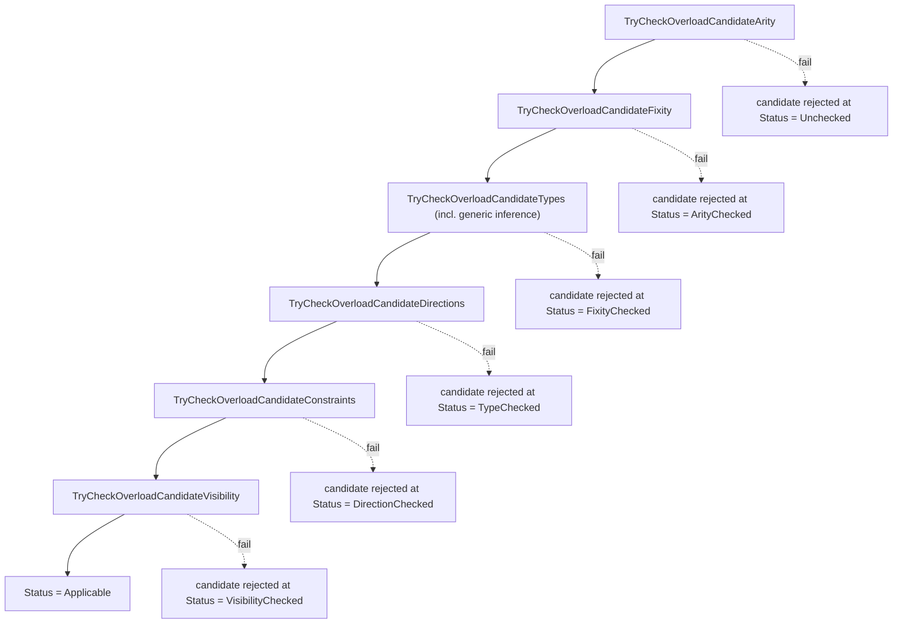

# Overload Resolution

This document specifies how Slang narrows a `LookupResult` containing
multiple candidates to a single best candidate (or to a structured
ambiguity error). It covers the candidate filter pipeline, the
conversion-cost ranking, partial generic application, operator
overloading, and how failures are reported.

The intended reader is a developer modifying overload-resolution
logic, adding a new candidate flavor or a new filter step, or chasing
an ambiguous-overload diagnostic.

Where overload candidates come from is described in
[lookup.md](lookup.md). The visibility filter that interleaves with
this pipeline is described in [visibility.md](visibility.md).

## Source

The candidate type, status, flags, and resolve-context are declared
in [slang-check-impl.h](../../../../source/slang/slang-check-impl.h)
(`OverloadCandidate` line 272, `OverloadResolveContext` line 3030,
`ResolvedOperatorOverload` line 339, `TypeCheckingCache` line 354).
The filter pipeline, candidate construction, and comparator are in
[slang-check-overload.cpp](../../../../source/slang/slang-check-overload.cpp).
The `ConversionCost` enum and conversion-cost utilities live in
[slang-ast-support-types.h](../../../../source/slang/slang-ast-support-types.h)
(lines 89-170+) and
[slang-check-conversion.cpp](../../../../source/slang/slang-check-conversion.cpp).
`PartiallyAppliedGenericExpr` is in
[slang-ast-expr.h](../../../../source/slang/slang-ast-expr.h) line 951.

## Concepts

- `OverloadCandidate`
  ([slang-check-impl.h line
  272](../../../../source/slang/slang-check-impl.h)) — one candidate the
  resolver is evaluating. Key fields:
  - `Flavor flavor` — one of `Func`, `Generic`,
    `UnspecializedGeneric`, `Expr` (lines 274-280).
  - `Status status` — pipeline progress; one of
    `GenericArgumentInferenceFailed`, `Unchecked`, `ArityChecked`,
    `FixityChecked`, `TypeChecked`, `DirectionChecked`,
    `VisibilityChecked`, `Applicable` (lines 283-294).
  - `Flags flags` — bitset; today only `IsPartiallyAppliedGeneric =
    1 << 0` (lines 296-301).
  - `LookupResultItem item` — the underlying `DeclRef` + breadcrumb
    chain returned from lookup (line 304).
  - `Expr* exprVal` — for `Flavor::Expr` candidates (e.g. a function
    value passed as an argument).
  - `FuncType* funcType` — function type when the candidate is a
    function value rather than a declared callable.
  - `Type* resultType` — the result type of the call if this
    candidate is chosen.
  - `ConversionCost conversionCostSum` — the per-argument
    implicit-conversion costs accumulated by
    `TryCheckOverloadCandidateTypes`.
  - `SubstitutionSet subst` — the inferred substitution; used by
    generic candidates to avoid re-running inference in
    `CompleteOverloadCandidate`.
  - `Index explicitGenericArgCount` (line 336) — for a generic
    candidate, the number of leading ordinary generic arguments the
    caller supplied explicitly (the rest are filled from parameter
    defaults). Positional arguments make the explicit set a prefix.
    `TryCheckGenericOverloadCandidateTypes` records this boundary; it
    starts at `-1` (not yet computed) and
    `TryCheckOverloadCandidateConstraints` hands the prefix to the
    generic constraint solver so defaults and witness arguments are
    resolved by the solver's fixpoint rather than a linear pass.
- `OverloadResolveContext`
  ([slang-check-impl.h line
  3030](../../../../source/slang/slang-check-impl.h)) — the bundle of
  call-site state passed to every filter step. Key fields:
  - `Mode mode` — `JustTrying` or `ForReal` (lines 3032-3040).
    `JustTrying` silently rejects bad candidates; `ForReal` emits
    diagnostics for each rejection. Most of pipeline runs in
    `JustTrying` to score candidates; `CompleteOverloadCandidate`
    switches to `ForReal` once the best candidate is chosen.
  - `Scope* sourceScope` — the requesting scope, used by the
    visibility step (line 3051).
  - `Index argCount`, `List<Expr*>* args`, `Type** argTypes` — call-
    site arguments (lines 3054-3056).
  - `OverloadCandidate* bestCandidate`,
    `List<OverloadCandidate> bestCandidates` — the running winner
    plus the equally-best siblings if there is an ambiguity (lines
    3098-3101).
- `ConversionCost`
  ([slang-ast-support-types.h line
  89](../../../../source/slang/slang-ast-support-types.h)) — `unsigned
  int`. Specific levels are defined as `kConversionCost_*`
  enumerators (lines 90-170+), summing across arguments. Threshold
  `kConversionCost_GeneralConversion` (900) is the implicit-
  conversion ceiling: anything at or above is rejected for implicit
  use by `canConvertImplicitly`
  ([slang-check-conversion.cpp line
  3135](../../../../source/slang/slang-check-conversion.cpp)).
  `kConversionCost_Explicit` (90000) is the "explicit cast only"
  marker; `kConversionCost_Impossible` represents "no conversion
  exists".
- `CoercionSite`
  ([slang-check-impl.h line
  363](../../../../source/slang/slang-check-impl.h)) — `General`,
  `Assignment`, `Argument`, `Return`, `Initializer`,
  `ExplicitCoercion`. Cost computation can vary per site (for
  example, an explicit cast at `ExplicitCoercion` permits the
  expensive `kConversionCost_Explicit` conversions).
- `ResolvedOperatorOverload` /
  `TypeCheckingCache::resolvedOperatorOverloadCache`
  ([slang-check-impl.h lines
  339-362](../../../../source/slang/slang-check-impl.h)) — per-`Linkage`
  cache that memoizes operator overload resolution by operand types,
  so a hot expression like `a + b` does not re-run the filter
  pipeline on every encounter.
- `PartiallyAppliedGenericExpr`
  ([slang-ast-expr.h line
  951](../../../../source/slang/slang-ast-expr.h)) — the AST node
  representing a generic that has been bound to some but not all of
  its parameters; the resolver produces one when a candidate is
  matched but not enough type information is available to
  monomorphize it.

## Algorithm

The resolver runs in two phases: a *probe* phase that scores every
candidate in `JustTrying` mode, and a *finalize* phase that re-runs
the pipeline on the winning candidate in `ForReal` mode and produces
the AST node for the call.

### Probe phase: `TryCheckOverloadCandidate`

`SemanticsVisitor::TryCheckOverloadCandidate`
([slang-check-overload.cpp line
1319](../../../../source/slang/slang-check-overload.cpp)) is the
inner driver. It advances `candidate.status` step-by-step, returning
as soon as any step fails:

The individual steps:

1. **`TryCheckOverloadCandidateArity`**
   ([slang-check-overload.cpp line
   145](../../../../source/slang/slang-check-overload.cpp)) — verifies
   the call has between `required` and `allowed` arguments. Trailing
   defaults can pad up to `allowed`; variadic parameters allow any
   count >= `required`. Failures in `ForReal` mode emit
   `not-enough-arguments-for-call` /
   `too-many-arguments-for-call`;
   in `JustTrying` mode the candidate is dropped silently.
2. **`TryCheckOverloadCandidateFixity`**
   ([slang-check-overload.cpp line
   225](../../../../source/slang/slang-check-overload.cpp)) — for
   operator calls only, checks that prefix / postfix / infix
   modifiers on the candidate match the call form. Catches things
   like calling an `infix` operator in prefix position.
3. **`TryCheckOverloadCandidateTypes`**
   ([slang-check-overload.cpp line
   763](../../../../source/slang/slang-check-overload.cpp)) — the
   per-argument type/coercion check.
   - For `Flavor::Generic`, the step delegates to
     `TryCheckGenericOverloadCandidateTypes`
     ([slang-check-overload.cpp line
     299](../../../../source/slang/slang-check-overload.cpp)) to
     infer the missing generic arguments. When inference fails, the
     adder records a separate `Flavor::UnspecializedGeneric`
     candidate carrying `Status::GenericArgumentInferenceFailed`
     ([slang-check-overload.cpp lines
     2846-2851](../../../../source/slang/slang-check-overload.cpp)) so
     the failure can be diagnosed later.
   - For every argument, the step calls `canCoerce(paramType,
     argType, arg, &cost)`
     ([slang-check-overload.cpp lines
     833-837](../../../../source/slang/slang-check-overload.cpp)) and
     accumulates the reported `cost` into
     `candidate.conversionCostSum`. If `canCoerce` reports that no
     coercion is possible, the candidate is dropped (silently in
     `JustTrying`; in `ForReal` the re-check `coerce`s the argument
     and emits a conversion-error diagnostic).
4. **`TryCheckOverloadCandidateDirections`**
   ([slang-check-overload.cpp line
   1008](../../../../source/slang/slang-check-overload.cpp)) — despite
   its name, the source comment notes that general argument/parameter
   l-value checking is currently done elsewhere; this step only checks
   the mutability of the implicit `this` parameter. A `[mutating]`
   method invoked on an immutable base expression is rejected here,
   and in `ForReal` mode emits `MutatingMethodOnImmutableValue` (plus
   a `MutatingMethodOnFunctionInputParameter` warning/error for a
   mutating call on a function input parameter)
   ([slang-check-overload.cpp lines
   1026-1075](../../../../source/slang/slang-check-overload.cpp)).
5. **`TryCheckOverloadCandidateConstraints`**
   ([slang-check-overload.cpp line
   1082](../../../../source/slang/slang-check-overload.cpp)) — for an
   explicit generic application `G<A, B>`, this step validates the
   `where`-clauses on `G`'s parameters against the inferred
   substitutions and fills in any generic arguments left to defaults.
   For an *outermost* generic (no enclosing `GenericDecl` parent), it
   resolves defaults and witness arguments through the generic
   constraint solver `trySolveGenericArguments`
   ([slang-check-overload.cpp line
   2765](../../../../source/slang/slang-check-overload.cpp)) — the same
   fixpoint loop used for inferred generic arguments — rather than a
   per-constraint linear pass. It passes only the explicitly-provided
   ordinary prefix (`candidate.explicitGenericArgCount` arguments) via
   `setProvidedArg`, which installs each as a fixed
   `CallerProvidedOrdinaryArg` so a user-written self-reference
   argument is not overridden by a parameter's default; the solver
   then fills the remaining defaults. The solved substitution replaces
   `candidate.subst`. The solver's `solveCost` is deliberately *not*
   folded into `conversionCostSum` (doing so would shift overload
   ranking and break ties that should stay ambiguous). On solver
   failure the step falls through to the legacy per-constraint loop —
   which visits constraints once in declaration order — so `ForReal`
   mode can emit a precise diagnostic (the solver reports none) and
   `JustTrying` mode rejects the candidate. Nested generic
   applications (the parent chain contains a `GenericDecl`) keep the
   linear pass.
6. **`TryCheckOverloadCandidateVisibility`**
   ([slang-check-overload.cpp lines
   265-287](../../../../source/slang/slang-check-overload.cpp)) —
   delegates to
   `isDeclVisibleFromScope(candidate.item.declRef, context.sourceScope)`.
   In `ForReal` mode emits diagnostic `decl-is-not-visible`
   (`slang-diagnostics.lua` 30600); in `JustTrying` mode just
   returns false. See [visibility.md](visibility.md) for the rule.
7. **`TryCheckOverloadCandidateClassNewMatchUp`**
   ([slang-check-overload.cpp lines
   107-143](../../../../source/slang/slang-check-overload.cpp)) —
   runs only in the finalize / `ForReal` re-check inside
   `CompleteOverloadCandidate`, not in the probe phase. It
   distinguishes `Class()` / `Class.new()` syntax from a plain
   constructor call so the right AST form is emitted. See
   "Finalize phase" below for the full sequencing.

A candidate that survives every probe-phase step is tagged
`Status::Applicable` with its total `conversionCostSum` populated,
ready for ranking. `TryCheckOverloadCandidateClassNewMatchUp` is
*not* part of probe-phase filtering; it gates only the
finalize-phase AST construction.

`AddOverloadCandidateInner`
([slang-check-impl.h line
3204](../../../../source/slang/slang-check-impl.h)) is the call site
that runs `TryCheckOverloadCandidate` and either:

- discards the candidate if it failed before any candidate has yet
  reached `Applicable`;
- adopts it as `context.bestCandidate` if its `status` /
  `conversionCostSum` strictly beat the current best (via
  `CompareOverloadCandidates`);
- appends it to `context.bestCandidates` if it is tied with the
  current best;
- discards it if it is strictly worse.

### Probe phase: where candidates come from

The resolver populates candidate sets via family-specific helpers
in [slang-check-overload.cpp](../../../../source/slang/slang-check-overload.cpp):

- `AddDeclRefOverloadCandidates` — iterates a `LookupResult` of
  function decls and runs each through the pipeline.
- `AddFuncOverloadCandidate(LookupResultItem, DeclRef<CallableDecl>, ..., baseCost)`
  (line 2320) — single-callable variant.
- `AddCtorOverloadCandidate` (line 2422) — calls that go through a
  `ConstructorDecl`. The owning `Type` is captured in the candidate
  so the resolver can produce a constructor-invocation expression.
- `AddFuncOverloadCandidate(FuncType*, ..., baseCost)` — first-class
  function values; the candidate's `funcType` is set and `flavor`
  is `Expr`.
- `AddHigherOrderOverloadCandidates` — `__fwd_diff`,
  `__bwd_diff`-style operators that wrap a callee.

Each helper accepts a `baseCost` (`ConversionCost`) that is added to
the candidate's accumulated cost. Member-access lookups bias against
deep base-class hits and pointer auto-derefs by adding small
`kConversionCost_*` increments here.

### Finalize phase: `CompleteOverloadCandidate`

Once the probe phase finishes with exactly one
`context.bestCandidate`, `CompleteOverloadCandidate`
([slang-check-overload.cpp lines
1389-1560+](../../../../source/slang/slang-check-overload.cpp)) flips
`context.mode = ForReal` and re-runs the full pipeline starting from
`TryCheckOverloadCandidateClassNewMatchUp`
([slang-check-overload.cpp lines
107-143](../../../../source/slang/slang-check-overload.cpp)). The
`ClassNewMatchUp` step is only required in `ForReal` mode: it
distinguishes `Class()` / `Class.new()` syntax from a plain
constructor call so the right AST node is emitted.

The `ForReal` re-check is what produces user-visible diagnostics for
the chosen candidate. If even the best candidate fails (e.g. its
`Status::GenericArgumentInferenceFailed` was the *least bad* score),
the path emits `generic-argument-inference-failed` (`slang-
diagnostics.lua` 39999) together with a
`generic-signature-tried` note.

After `ForReal` succeeds, `CompleteOverloadCandidate` constructs the
final AST node:

- `Flavor::Func` -> `ConstructLookupResultExpr` + the call form
  (`InvokeExpr` / `MemberExpr.invoke`).
- `Flavor::Generic` -> wraps the result in a
  `PartiallyAppliedGenericExpr` when the
  `IsPartiallyAppliedGeneric` flag is set
  ([slang-check-overload.cpp line
  1547](../../../../source/slang/slang-check-overload.cpp)),
  otherwise a fully specialized generic decl-ref.
- `Flavor::Expr` -> uses `candidate.exprVal` directly as the callee.

A `Flavor::UnspecializedGeneric` candidate (the recorded
failed-inference candidate) never reaches this construction switch:
its `Status::GenericArgumentInferenceFailed` is handled by the early
error path at the top of `CompleteOverloadCandidate`
([slang-check-overload.cpp lines
1394-1405](../../../../source/slang/slang-check-overload.cpp)).

## Conversion costs

The `ConversionCost` enum
([slang-ast-support-types.h line
89](../../../../source/slang/slang-ast-support-types.h)) is `unsigned
int`. Overload candidate probing computes each per-argument cost via
`canCoerce` and accumulates the reported cost into the candidate's
ranking sum (see the type-check step above); a too-high implicit
conversion can still be reported as *possible* so that an overload
involving it is selected over one without, with the cost diagnosed
later when the result is reified
([slang-check-conversion.cpp lines
2551-2556](../../../../source/slang/slang-check-conversion.cpp)). The
full enum, in source-declaration order:

| Constant | Numeric | Meaning |
| --- | --- | --- |
| `kConversionCost_None` | 0 | identity |
| `kConversionCost_GenericParamUpcast` | 1 | up-cast through a generic parameter |
| `kConversionCost_LambdaToFunc` | 1 | lambda used where a `Func` value is expected |
| `kConversionCost_UnconstraintGenericParam` | 20 | binding to an unconstrained generic parameter |
| `kConversionCost_SizedArrayToUnsizedArray` | 30 | sized -> unsized array |
| `kConversionCost_MatrixLayout` | 5 | matrix layout adapter |
| `kConversionCost_GetRef` | 5 | extracting a reference from a buffer-like type |
| `kConversionCost_ImplicitDereference` | 10 | dereferencing a pointer-like value |
| `kConversionCost_InRangeIntLitConversion` | 23 | int literal fits in target integer type |
| `kConversionCost_InRangeIntLitSignedToUnsignedConversion` | 32 | signed lit -> unsigned target |
| `kConversionCost_InRangeIntLitUnsignedToSignedConversion` | 81 | unsigned lit -> signed target |
| `kConversionCost_MutablePtrToConstPtr` | 20 | mutable ptr -> const ptr |
| `kConversionCost_CastToInterface` | 50 | concrete type -> conforming interface |
| `kConversionCost_BoolToInt` | 120 | `bool` -> int (deliberately cheaper to break ties) |
| `kConversionCost_RankPromotion` | 150 | rank-preserving numeric promotion |
| `kConversionCost_NoneToOptional` | 150 | none -> Optional |
| `kConversionCost_ValToOptional` | 150 | T -> Optional |
| `kConversionCost_NullPtrToPtr` | 150 | nullptr -> ptr |
| `kConversionCost_PtrToVoidPtr` | 150 | T* -> void* |
| `kConversionCost_FailedOptionalConstraint` | 150 | optional constraint did not match |
| `kConversionCost_UnsignedToSignedPromotion` | 200 | promoting unsigned to wider signed |
| `kConversionCost_SameSizeUnsignedToSignedConversion` | 300 | same-size unsigned -> signed |
| `kConversionCost_SignedToUnsignedConversion` | 250 | signed -> unsigned of same/greater size |
| `kConversionCost_IntegerToFloatConversion` | 400 | int -> float |
| `kConversionCost_PtrToBool` | 400 | pointer -> bool |
| `kConversionCost_IntegerTruncate` | 450 | int -> narrower int |
| `kConversionCost_IntegerToHalfConversion` | 500 | int -> half |
| `kConversionCost_ParameterPack` | 500 | binding to a parameter pack |
| `kConversionCost_Default` | 500 | user-defined conversion default |
| `kConversionCost_GeneralConversion` | 900 | implicit ceiling (anything `>=` rejected by `canConvertImplicitly`) |
| `kConversionCost_Explicit` | 90000 | explicit cast only; never accepted implicitly |
| `kConversionCost_OneVectorToScalar` | 1 | additive when downcasting a 1-vector to a scalar |
| `kConversionCost_ScalarToVector` | 2 | additive when promoting a scalar to a vector |
| `kConversionCost_ScalarToMatrix` | 10 | additive when promoting a scalar to a matrix |
| `kConversionCost_ScalarIntegerToFloatMatrix` | 410 | `kConversionCost_IntegerToFloatConversion + kConversionCost_ScalarToMatrix`. |
| `kConversionCost_ScalarToCoopVector` | 1 | additive when promoting a scalar to a cooperative vector |
| `kConversionCost_LValueCast` | 800 | additive when casting an l-value |
| `kConversionCost_TypeCoercionConstraint` | 1000 | cost contributed by a type-coercion constraint |
| `kConversionCost_TypeCoercionConstraintPlusScalarToVector` | 1002 | `kConversionCost_TypeCoercionConstraint + kConversionCost_ScalarToVector`. |
| `kConversionCost_Impossible` | `0xFFFFFFFF` | "no conversion exists"; never summed because the candidate is rejected before reaching ranking |

`canConvertImplicitly`
([slang-check-conversion.cpp line
3135](../../../../source/slang/slang-check-conversion.cpp)) is the
binary "is this allowed implicitly" predicate: anything cheaper than
`kConversionCost_GeneralConversion` is allowed implicitly, anything
at or above is not. Cost levels beyond `Explicit` exist for
discouraged conversions that must remain reachable (some test
infrastructure compares against `kConversionCost_Impossible`).

### Tie-breaking comparator

`CompareOverloadCandidates`
([slang-check-overload.cpp line
2088](../../../../source/slang/slang-check-overload.cpp)) is a
total-ordering comparator on two candidates of the same `Status`:

1. **Status difference.** A candidate with a higher `Status` wins
   (so an `Applicable` candidate is always preferred to an
   `ArityChecked` one).
2. **Conversion-cost sum.** Lower `conversionCostSum` wins.
3. **`CompareLookupResultItems`**
   ([slang-check-overload.cpp line
   1696](../../../../source/slang/slang-check-overload.cpp)) — lexical
   "how was the candidate found" comparison. Prefers shadowing
   members of a closer scope over an outer one; prefers an override
   of an inherited member.
4. **Implicit conversion preference.** If exactly one candidate is
   marked `ImplicitConversionModifier`, that one wins. This is what
   lets a user-supplied `__implicit_conversion` overload be selected
   in preference to a builtin one with the same cost.
5. **`compareOverloadCandidateSpecificity`**
   ([slang-check-overload.cpp line
   1922](../../../../source/slang/slang-check-overload.cpp)) — structural
   preference: non-generic > generic, non-variadic > variadic, fewer
   default parameters > more.
6. **`getExportRank`** — `export` decls are preferred to `extern`
   decls of the same name.
7. **Scope distance.** For non-generic flavors, the comparator
   computes the lexical    distance from the call site to each
   declaration and prefers the closer one. The comment at
   [slang-check-overload.cpp lines
   2175-2209](../../../../source/slang/slang-check-overload.cpp)
   explains why this step is skipped for generic candidates: the
   first pass of generic-candidate filtering is keyed on parameter
   list shape rather than actual applicability, so applying scope
   distance there would prefer the wrong candidate.

If every step returns zero, the candidates are considered equally
good; the caller will eventually emit an ambiguous-overload
diagnostic.

## Partial generic application

When the call expression supplies arguments that pin down some but
not all of a generic's parameters,
`TryCheckGenericOverloadCandidateTypes`
([slang-check-overload.cpp lines
299+](../../../../source/slang/slang-check-overload.cpp)) may produce a
candidate that is *partially specialized*. In that case the helpers
set `candidate.flags |= OverloadCandidate::Flag::IsPartiallyAppliedGeneric`
at four sites in [slang-check-overload.cpp](../../../../source/slang/slang-check-overload.cpp)
(lines 413, 490, 578, 665), and `CompleteOverloadCandidate`
wraps the result in `PartiallyAppliedGenericExpr`
([slang-check-overload.cpp line
1547](../../../../source/slang/slang-check-overload.cpp)).

A `PartiallyAppliedGenericExpr` carries `baseGenericDeclRef` (the
generic being applied) plus `providedOrdinaryArgs`, the already-
provided ordinary-argument prefix; witness arguments are
deliberately *not* stored on the node and are formed later, after the
remaining ordinary arguments are inferred
([slang-ast-expr.h lines
955-964](../../../../source/slang/slang-ast-expr.h)). The surrounding
context (for
example, an explicit type ascription, a later
`GenericAppExpr<...>`, or another argument that pins the type) is
expected to close the remaining holes. Overload resolution treats a
fully resolved generic application as an invariant once checking
completes; how an unresolved residual is handled by later phases is
documented in
[../pipeline/04-ast-to-ir.md](../pipeline/04-ast-to-ir.md).

## Operator overloading

Operator expressions
(`+`, `-`, `*`, `[]`, `==`, etc.) reach overload resolution through
the same `OverloadResolveContext` machinery as named calls, but with
two extras:

- The candidate set is collected via member lookup on the operands'
  types using the operator's name (the parser maps `a + b` to a call
  expression with the appropriate operator-keyed `Name`).
- A `ResolvedOperatorOverload`
  ([slang-check-impl.h line
  339](../../../../source/slang/slang-check-impl.h)) cache memoizes the
  result, keyed by `OperatorOverloadCacheKey`
  ([slang-check-impl.h lines
  197-209](../../../../source/slang/slang-check-impl.h)), which
  captures `operatorName`, `isGLSLMode`, and a two-entry
  `BasicTypeKey` operand pair. The cached `operatorName` is not the
  surface operator name: `fromOperatorExpr` derives it from the
  `IntrinsicOpModifier` (`intrinsicOp->op`) found on an applicable
  overloaded definition
  ([slang-check-impl.h lines
  230-264](../../../../source/slang/slang-check-impl.h)). The cache lives
  in `TypeCheckingCache::resolvedOperatorOverloadCache`
  ([slang-check-impl.h line
  356](../../../../source/slang/slang-check-impl.h)) and is populated /
  consulted in
  [slang-check-overload.cpp lines
  3172 and 3434](../../../../source/slang/slang-check-overload.cpp).
  Each cached entry carries a `cacheVersion` because
  `OverloadCandidate` values are not portable across linkages; a
  newer linkage invalidates the entry by bumping
  `TypeCheckingCache::version`.

Implicit `this` is supplied automatically for non-static member
operator overloads: the lookup that produced the candidate left a
`Breadcrumb::Kind::This` step on the item, and
`CompleteOverloadCandidate` consumes it when constructing the
`InvokeExpr`. The `ThisParameterMode` recorded on the breadcrumb
(see [lookup.md](lookup.md)) is what makes a `[mutating]` operator
overload reject a `const` left operand.

## Edge cases and failure modes

- **Two `Applicable` candidates with identical cost / specificity /
  scope.** `CompareOverloadCandidates` returns 0; the candidate is
  appended to `context.bestCandidates`. After the probe phase the
  caller emits `ambiguous-overload-for-name-with-args`
  (`slang-diagnostics.lua` 39999) or
  `ambiguous-overload-with-args` (39999), depending on whether the
  callee name is known. Each tied candidate is shown as a separate
  note.
- **No candidate is `Applicable`.** When a single candidate scores
  best, its `Status` says which step failed first and the resolver
  re-runs the pipeline in `ForReal` mode on that candidate (via
  `CompleteOverloadCandidate`) so the user sees the most-specific
  diagnostic (a per-argument coercion failure rather than a generic
  "no overload" message). When several non-applicable candidates tie
  for best, the resolver instead emits
  `NoApplicableOverloadForNameWithArgs` (or `NoApplicableWithArgs`
  when the callee name is unknown) directly, without calling
  `CompleteOverloadCandidate`
  ([slang-check-overload.cpp lines
  3296-3311](../../../../source/slang/slang-check-overload.cpp)).
- **Generic-argument inference failure.** The candidate ends at
  `Status::GenericArgumentInferenceFailed`.
  `CompleteOverloadCandidate` emits
  `generic-argument-inference-failed` together with a
  `generic-signature-tried` note that prints the generic signature
  via `ASTPrinter::getDeclSignatureString`
  ([slang-check-overload.cpp lines
  1394-1407](../../../../source/slang/slang-check-overload.cpp)).
- **A candidate matches but is hidden by visibility.** In
  `JustTrying` it is silently dropped; in `ForReal` it emits
  `decl-is-not-visible` (30600). Other candidates of lower
  applicability may still win, so the user sometimes sees the
  invisible-decl diagnostic followed by acceptance of a different
  candidate.
- **Argument that needs a chain of conversions.** Each argument's
  conversion must first be accepted by `canConvertImplicitly`
  ([slang-check-conversion.cpp lines
  3135-3140](../../../../source/slang/slang-check-conversion.cpp)),
  which rejects anything at or above
  `kConversionCost_GeneralConversion` (900). Only the per-argument
  costs that pass this check are then summed into the candidate's
  `conversionCostSum` for ranking ([slang-check-overload.cpp line
  837](../../../../source/slang/slang-check-overload.cpp)) — that
  sum has no separate ceiling.
- **First-class function value vs declared callable of the same
  signature.** Both are `Applicable` with identical
  `conversionCostSum`; `CompareLookupResultItems` and
  `compareOverloadCandidateSpecificity` are the deciding factors —
  the function value typically loses to the declared overload
  because the declared overload is closer in scope.
- **Generic candidate plus non-generic candidate.** Scope-distance
  tie-breaking is *skipped* when at least one candidate is
  `Generic` or `UnspecializedGeneric`
  ([slang-check-overload.cpp lines
  2201-2204](../../../../source/slang/slang-check-overload.cpp)). Other
  steps (cost, specificity) still apply; if they tie, the candidates
  are reported ambiguous.
- **Operator overload cache stale.** A newer
  `TypeCheckingCache::version` invalidates older entries; the
  resolver recreates the candidate from the cached `decl`. The
  cache is a performance optimization only — correctness does not
  depend on it.
- **`PartiallyAppliedGenericExpr` left unresolved.** Overload
  resolution relies on the surrounding context closing the remaining
  generic holes; leaving a residual unresolved is a correctness
  invariant violation, not a feature. Downstream handling is
  described in
  [../pipeline/04-ast-to-ir.md](../pipeline/04-ast-to-ir.md).

## See also

- [lookup.md](lookup.md) — the lookup that produces the candidate
  set the resolver narrows.
- [visibility.md](visibility.md) — the visibility filter integrated
  with `TryCheckOverloadCandidateVisibility`.
- [scopes.md](scopes.md) — the scope chain that determines the
  lexical distance used in tie-breaking.
- [../ast-reference/expressions.md](../ast-reference/expressions.md)
  — per-class reference for `InvokeExpr`,
  `PartiallyAppliedGenericExpr`, `OverloadedExpr`,
  `GenericAppExpr`.
- [../ast-reference/values.md](../ast-reference/values.md) — the
  `Val` family that backs `SubstitutionSet` and witness arguments
  used during generic inference.
- [../pipeline/03-semantic-check.md](../pipeline/03-semantic-check.md)
  — pipeline-level overview of where overload resolution sits.
- [../glossary.md](../glossary.md) — entries for
  `overload resolution`, `conversion cost`,
  `partial generic application`, `decl-ref`, `lookup result`.
