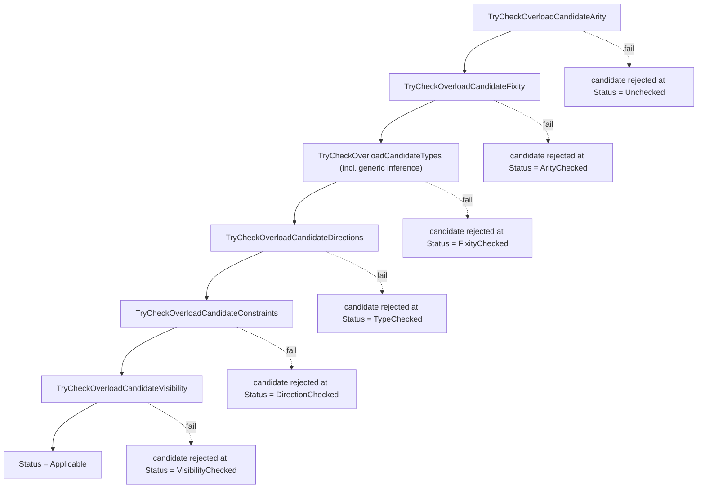

# Overload Resolution

This document specifies how Slang narrows a `LookupResult` containing
multiple candidates to a single best candidate (or to a structured
ambiguity error). It covers the candidate filter pipeline, the
conversion-cost ranking, partial generic application, operator
overloading, and how failures are reported. It also covers the one
large *bypass* of that machinery: builtin operators on the numeric
scalar, vector, and matrix operand shapes that
`convertToBuiltinArithmeticOp` accepts are rewritten during checking and
never enter overload resolution at all. Operand shapes the fast path
declines — GLSL-scope matrix operators and vector equality, and
mixed-type shifts — fall through to the general path.
The intended reader is a developer modifying overload-resolution
logic, adding a new candidate flavor or a new filter step, or chasing
an ambiguous-overload diagnostic.

Where overload candidates come from is described in
[lookup.md](lookup.md); note that lookup deliberately leaves duplicate
`LookupResult` items in place, and collapsing them is this page's job
(see [Relationship to lookup](#relationship-to-lookup)). The
visibility filter that interleaves with this pipeline is described in
[visibility.md](visibility.md).

## Source

The candidate type, its per-candidate failure records, and the
resolve-context are declared in
[slang-check-impl.h](../../../../source/slang/slang-check-impl.h)
(`GenericArgumentInferenceFailure` line 216, `OverloadCandidate`
line 384, `CoercionSite` line 486, `OverloadResolveContext`
line 3248). The filter pipeline, candidate construction, and
comparator are in
[slang-check-overload.cpp](../../../../source/slang/slang-check-overload.cpp).
The `ConversionCost` typedef and its `kConversionCost_*` levels live in
[slang-ast-support-types.h](../../../../source/slang/slang-ast-support-types.h)
(lines 90-192); the code that computes a cost for a specific pair of
types is in
[slang-check-conversion.cpp](../../../../source/slang/slang-check-conversion.cpp).
`PartiallyAppliedGenericExpr` is in
[slang-ast-expr.h](../../../../source/slang/slang-ast-expr.h) line 988,
and the fast-path `BuiltinOperatorExpr` node is at line 289 of the same
header, carrying the `BuiltinOperationKind` enum declared in
[slang-ast-support-types.h](../../../../source/slang/slang-ast-support-types.h)
line 1909.

Two implementations central to this page live in
[slang-check-expr.cpp](../../../../source/slang/slang-check-expr.cpp)
rather than in `slang-check-overload.cpp`: the builtin-operator fast path
(`convertToBuiltinArithmeticOp` and its helpers, declared in
`slang-check-impl.h` lines 3927-3982), and `resolveOverloadedLookup` /
`filterLookupResultByCheckedOptional`.

## Concepts

- `OverloadCandidate`
  ([slang-check-impl.h line
  384](../../../../source/slang/slang-check-impl.h)) — one candidate the
  resolver is evaluating. Key fields:
  - `Flavor flavor` — one of `Func`, `Generic`,
    `UnspecializedGeneric`, `Expr` (lines 386-392).
  - `Status status` — pipeline progress; one of
    `GenericArgumentInferenceFailed`, `Unchecked`, `ArityChecked`,
    `FixityChecked`, `TypeChecked`, `DirectionChecked`,
    `VisibilityChecked`, `Applicable` (lines 395-405).
  - `Flags flags` — bitset; today only `IsPartiallyAppliedGeneric =
    1 << 0` (lines 408-413).
  - `LookupResultItem item` — the underlying `DeclRef` + breadcrumb
    chain returned from lookup (line 416).
  - `Expr* exprVal` — for `Flavor::Expr` candidates (e.g. a function
    value passed as an argument).
  - `FuncType* funcType` — function type when the candidate is a
    function value rather than a declared callable.
  - `Type* resultType` — the result type of the call if this
    candidate is chosen.
  - `ConversionCost conversionCostSum` — the per-argument
    implicit-conversion costs accumulated by
    `TryCheckOverloadCandidateTypes`.
  - `SubstitutionSet subst` — the inferred substitution; used by
    generic candidates to avoid re-running inference in
    `CompleteOverloadCandidate`.
  - `Index explicitGenericArgCount` (line 448) — for a generic
    candidate, the number of leading ordinary generic arguments the
    caller supplied explicitly (the rest are filled from parameter
    defaults). Positional arguments make the explicit set a prefix.
    `TryCheckGenericOverloadCandidateTypes` records this boundary; it
    starts at `-1` (not yet computed) and
    `TryCheckOverloadCandidateConstraints` hands the prefix to the
    generic constraint solver so defaults and witness arguments are
    resolved by the solver's fixpoint rather than a linear pass.
  - `GenericArgumentInferenceFailure genericInferenceFailure`
    (line 454) — the focused reason a generic candidate failed
    (see the next bullet).
  - `Index argMismatchArgIndex`, `Type* argMismatchExpectedType`,
    `Type* argMismatchActualType` (lines 461-463) — the first
    argument that failed to type-check while trying this candidate,
    recorded so a "no applicable overload" diagnostic can name the
    offending argument and both types rather than only the callee.
- `GenericArgumentInferenceFailure`
  ([slang-check-impl.h line
  216](../../../../source/slang/slang-check-impl.h)) — a tagged union
  recording *why* generic-argument inference failed for one
  candidate, so the diagnostic can be specific instead of a blanket
  "could not specialize". `Kind` is one of `None`,
  `VariadicPackCountMismatch`, `GenericArityMismatch`,
  `OrdinaryGenericParamNotInferred`,
  `InterfaceConformanceNotSatisfied`,
  `GenericConstraintNotSatisfied`, or
  `GenericParamUnificationConflict` (lines 218-227), and each payload
  stores only the offending values (counts, the parameter or
  constraint `Decl*`, or the substituted sub/super types). Formatting
  is deliberately deferred to `CompleteOverloadCandidate` so
  speculative candidates never pay for it. Every payload is required
  to be trivially copyable and the default constructor `memset`s the
  whole object, because `OverloadCandidate` values get copied inside
  standard-library algorithms and a `kind`-switched copy trips GCC's
  `-Werror=maybe-uninitialized` (lines 309-334).
- `OverloadResolveContext`
  ([slang-check-impl.h line
  3248](../../../../source/slang/slang-check-impl.h)) — the bundle of
  call-site state passed to every filter step. Key fields:
  - `Mode mode` — `JustTrying` or `ForReal` (lines 3250-3257,
    field at line 3311). `JustTrying` silently rejects bad
    candidates; `ForReal` emits diagnostics for each rejection. Most
    of the pipeline runs in `JustTrying` to score candidates;
    `CompleteOverloadCandidate` switches to `ForReal` once the best
    candidate is chosen.
  - `Scope* sourceScope` — the requesting scope, used by the
    visibility step (line 3269).
  - `Index argCount`, `List<Expr*>* args`, `Type** argTypes` — call-
    site arguments (lines 3272-3274), read through `getArgType` /
    `getArgTypeForInference` and matched against a parameter list by
    `matchArgumentsToParams` (lines 3278-3303).
  - `OverloadCandidate* bestCandidate`,
    `List<OverloadCandidate> bestCandidates` — the running winner
    plus the equally-best siblings if there is an ambiguity (lines
    3316-3319).
- `ConversionCost`
  ([slang-ast-support-types.h line
  90](../../../../source/slang/slang-ast-support-types.h)) — `unsigned
  int`. Specific levels are defined as `kConversionCost_*`
  enumerators (lines 94-192), summing across arguments. Threshold
  `kConversionCost_GeneralConversion` (900) is the implicit-
  conversion ceiling: anything at or above is rejected for implicit
  use by `canConvertImplicitly`
  ([slang-check-conversion.cpp line
  3328](../../../../source/slang/slang-check-conversion.cpp)).
  `kConversionCost_Explicit` (90000) is the "explicit cast only"
  marker; `kConversionCost_Impossible` represents "no conversion
  exists".
- `CoercionSite`
  ([slang-check-impl.h line
  486](../../../../source/slang/slang-check-impl.h)) — `General`,
  `Assignment`, `Argument`, `Return`, `Initializer`,
  `ExplicitCoercion`. Cost computation can vary per site (for
  example, an explicit cast at `ExplicitCoercion` permits the
  expensive `kConversionCost_Explicit` conversions).
- `BuiltinOperatorExpr` / `BuiltinOperationKind`
  ([slang-ast-expr.h line
  289](../../../../source/slang/slang-ast-expr.h),
  [slang-ast-support-types.h line
  1909](../../../../source/slang/slang-ast-support-types.h)) — the
  checked-AST node and operation tag produced by the
  builtin-operator fast path, which bypasses this page's pipeline
  entirely for the common case. See
  [Operator overloading](#operator-overloading).
- `PartiallyAppliedGenericExpr`
  ([slang-ast-expr.h line
  988](../../../../source/slang/slang-ast-expr.h)) — the AST node
  representing a generic that has been bound to some but not all of
  its parameters; the resolver produces one when a candidate is
  matched but not enough type information is available to
  monomorphize it.

## Algorithm

The resolver runs in two phases: a *probe* phase that scores every
candidate in `JustTrying` mode, and a *finalize* phase that re-runs
the pipeline on the winning candidate in `ForReal` mode and produces
the AST node for the call.

### Probe phase: `TryCheckOverloadCandidate`

`SemanticsVisitor::TryCheckOverloadCandidate`
([slang-check-overload.cpp line
1426](../../../../source/slang/slang-check-overload.cpp)) is the
inner driver. It advances `candidate.status` step-by-step, returning
as soon as any step fails:

```mermaid
flowchart TB
  arity["TryCheckOverloadCandidateArity"]
  fix["TryCheckOverloadCandidateFixity"]
  types["TryCheckOverloadCandidateTypes (incl. generic inference)"]
  dirs["TryCheckOverloadCandidateDirections"]
  cstr["TryCheckOverloadCandidateConstraints"]
  vis["TryCheckOverloadCandidateVisibility"]
  applicable["Status = Applicable"]
  arity --> fix --> types --> dirs --> cstr --> vis --> applicable
  arity -. fail .-> reject1["candidate rejected at Status = Unchecked"]
  fix -. fail .-> reject2["candidate rejected at Status = ArityChecked"]
  types -. fail .-> reject3["candidate rejected at Status = FixityChecked"]
  dirs -. fail .-> reject4["candidate rejected at Status = TypeChecked"]
  cstr -. fail .-> reject5["candidate rejected at Status = DirectionChecked"]
  vis -. fail .-> reject6["candidate rejected at Status = VisibilityChecked"]
```

The individual steps:

1. **`TryCheckOverloadCandidateArity`**
   ([slang-check-overload.cpp line
   145](../../../../source/slang/slang-check-overload.cpp)) — verifies
   the call has between `required` and `allowed` arguments, as computed
   by `CountParameters`. Trailing defaults can pad up to `allowed`; an
   `allowed` of `-1` means unbounded, so a variadic callable accepts any
   count >= `required`. Failures in `ForReal` mode emit
   `Diagnostics::NotEnoughArguments` or `Diagnostics::TooManyArguments`
   plus a `Diagnostics::OverloadCandidate` note naming the candidate;
   in `JustTrying` mode the candidate is dropped silently.
2. **`TryCheckOverloadCandidateFixity`**
   ([slang-check-overload.cpp line
   225](../../../../source/slang/slang-check-overload.cpp)) — applies
   only when the original expression is a `PrefixExpr` or
   `PostfixExpr`, and requires the candidate declaration to carry the
   matching `PrefixModifier` / `PostfixModifier`. Any other call form
   (including an ordinary `InfixExpr`) passes unconditionally, so this
   step is what stops `-x` from binding to a postfix-only
   `operator-`. `ForReal` mode emits
   `Diagnostics::ExpectedPrefixOperator` or
   `Diagnostics::ExpectedPostfixOperator`.
3. **`TryCheckOverloadCandidateTypes`**
   ([slang-check-overload.cpp line
   807](../../../../source/slang/slang-check-overload.cpp)) — the
   per-argument type/coercion check. Arguments are first paired with
   parameters by `OverloadResolveContext::matchArgumentsToParams`,
   which is also what lets a brace initializer such as `f({1, 2})`
   be matched against a struct parameter instead of being rejected
   outright.
   - For `Flavor::Generic`, the step delegates to
     `TryCheckGenericOverloadCandidateTypes`
     ([slang-check-overload.cpp line
     299](../../../../source/slang/slang-check-overload.cpp)) to
     infer the missing generic arguments. When inference fails, the
     adder records a separate `Flavor::UnspecializedGeneric`
     candidate carrying `Status::GenericArgumentInferenceFailed`
     ([slang-check-overload.cpp lines
     3090-3091](../../../../source/slang/slang-check-overload.cpp)) so
     the failure can be diagnosed later. In `ForReal` mode the step
     also diagnoses directly: an explicit generic-argument list whose
     length falls outside the generic's allowed range gets
     `Diagnostics::GenericArgumentListArityMismatch`, and any other
     specialization failure gets `Diagnostics::CannotSpecializeGeneric`
     ([slang-check-overload.cpp lines
     406-426](../../../../source/slang/slang-check-overload.cpp)).
     These are distinct from the `UnspecializedGeneric` failure
     diagnostics selected later by the reporting path.
   - For every argument, the step calls `canCoerce(paramType,
     argType, arg.argExpr, &cost)`
     ([slang-check-overload.cpp line
     907](../../../../source/slang/slang-check-overload.cpp)) and
     accumulates the reported `cost` into
     `candidate.conversionCostSum`. If `canCoerce` reports that no
     coercion is possible, the local `recordArgMismatch` helper stores
     the argument index and the expected / actual types on the
     candidate (lines 903-911) and the candidate is dropped (silently
     in `JustTrying`; in `ForReal` the re-check `coerce`s the argument
     at `CoercionSite::Argument` and emits a conversion-error
     diagnostic). Those recorded types are what a later "no applicable
     overload" note prints per candidate.
   - When `context.disallowNestedConversions` is set the step demands
     `paramType->equals(argType)` instead of calling `canCoerce`
     (line 901), which is how the checker forbids stacking one
     user-defined conversion on top of another.
4. **`TryCheckOverloadCandidateDirections`**
   ([slang-check-overload.cpp line
   1083](../../../../source/slang/slang-check-overload.cpp)) — despite
   its name, the source comment notes that general argument/parameter
   l-value checking is currently done elsewhere; this step only checks
   the mutability of the implicit `this` parameter. A `[mutating]`
   method invoked on an immutable base expression is rejected here,
   and in `ForReal` mode emits
   `Diagnostics::MutatingMethodOnImmutableValue` (plus
   `MutatingMethodOnFunctionInputParameterError` or
   `MutatingMethodOnFunctionInputParameterWarning` for a mutating call
   on a legacy-syntax function input parameter)
   ([slang-check-overload.cpp lines
   1109-1145](../../../../source/slang/slang-check-overload.cpp)).
5. **`TryCheckOverloadCandidateConstraints`**
   ([slang-check-overload.cpp line
   1157](../../../../source/slang/slang-check-overload.cpp)) — for an
   explicit generic application `G<A, B>`, this step validates the
   `where`-clauses on `G`'s parameters against the inferred
   substitutions and fills in any generic arguments left to defaults.
   For an *outermost* generic (no enclosing `GenericDecl` parent), it
   resolves defaults and witness arguments through the generic
   constraint solver `trySolveGenericArguments`
   ([slang-check-impl.h line
   3239](../../../../source/slang/slang-check-impl.h), called at
   [slang-check-overload.cpp line
   1233](../../../../source/slang/slang-check-overload.cpp)) — the same
   fixpoint loop used for inferred generic arguments — rather than a
   per-constraint linear pass. It passes only the explicitly-provided
   ordinary prefix (`candidate.explicitGenericArgCount` arguments) via
   `setProvidedArg`, which installs each as a fixed
   `CallerProvidedOrdinaryArg` so a user-written self-reference
   argument is not overridden by a parameter's default; the solver
   then fills the remaining defaults. The solved substitution replaces
   `candidate.subst`. The solver's `solveCost` is deliberately *not*
   folded into `conversionCostSum` (doing so would shift overload
   ranking and break ties that should stay ambiguous). On solver
   failure the step falls through to the legacy per-constraint loop —
   which visits constraints once in declaration order — so `ForReal`
   mode can emit a precise diagnostic, principally
   `Diagnostics::TypeArgumentDoesNotConformToInterface` for an
   unsatisfied conformance ([slang-check-overload.cpp line
   1303](../../../../source/slang/slang-check-overload.cpp)), since
   the solver itself reports none, and
   `JustTrying` mode rejects the candidate. Nested generic
   applications (the parent chain contains a `GenericDecl`) keep the
   linear pass.
6. **`TryCheckOverloadCandidateVisibility`**
   ([slang-check-overload.cpp lines
   265-287](../../../../source/slang/slang-check-overload.cpp)) —
   delegates to
   `isDeclVisibleFromScope(candidate.item.declRef, context.sourceScope)`.
   In `ForReal` mode emits `Diagnostics::DeclIsNotVisible`
   (`decl-is-not-visible`,
   [slang-diagnostics.lua line
   2335](../../../../source/slang/slang-diagnostics.lua)); in
   `JustTrying` mode it just returns false. See
   [visibility.md](visibility.md) for the rule.
7. **`TryCheckOverloadCandidateClassNewMatchUp`**
   ([slang-check-overload.cpp lines
   107-143](../../../../source/slang/slang-check-overload.cpp)) —
   runs only in the finalize / `ForReal` re-check inside
   `CompleteOverloadCandidate`, not in the probe phase. It enforces
   the pairing between `new` and `class`: a `NewExpr` whose candidate
   does not construct a `ClassDecl` type gets
   `Diagnostics::NewCanOnlyBeUsedToInitializeAClass`, and a plain
   constructor call that *does* construct a class gets
   `Diagnostics::ClassCanOnlyBeInitializedWithNew`. See
   "Finalize phase" below for the full sequencing.

A candidate that survives every probe-phase step is tagged
`Status::Applicable` with its total `conversionCostSum` populated,
ready for ranking. `TryCheckOverloadCandidateClassNewMatchUp` is
*not* part of probe-phase filtering; it gates only the
finalize-phase AST construction.

`AddOverloadCandidateInner`
([slang-check-impl.h line
3422](../../../../source/slang/slang-check-impl.h), defined at
[slang-check-overload.cpp line
2442](../../../../source/slang/slang-check-overload.cpp)) maintains the
running winner. `AddOverloadCandidate` (line 2525) runs
`TryCheckOverloadCandidate`, adds the helper's `baseCost` to
`conversionCostSum`, and hands the result to
`AddOverloadCandidateInner`, which compares the new candidate against
whatever is currently held using `CompareOverloadCandidates`:

- Every existing entry the new candidate strictly beats is removed
  from `context.bestCandidates`; if any existing entry strictly beats
  the new candidate, the new one is dropped. A debug assertion checks
  that these two outcomes never both happen, since that would mean
  "better than" is not transitive.
- A kept candidate becomes `context.bestCandidateStorage` /
  `context.bestCandidate` when nothing was held, is appended to
  `context.bestCandidates` when the set is already ambiguous, or
  converts a unique `bestCandidate` into a two-element
  `bestCandidates` list when it ties (lines 2505-2522).

Note that this runs for *every* candidate, applicable or not: a
non-applicable candidate is still kept when nothing better exists,
which is what lets the failure paths in
[Edge cases](#edge-cases-and-failure-modes) report the least-bad
candidate rather than a bare "no overload".

### Probe phase: where candidates come from

The resolver populates candidate sets via family-specific helpers
in [slang-check-overload.cpp](../../../../source/slang/slang-check-overload.cpp):

- `AddDeclRefOverloadCandidates` (line 3098) — takes a single
  `LookupResultItem` and dispatches on the kind of declaration it
  names: function aliases, callables, aggregate types, generics,
  typedefs, generic type parameters, and function-valued parameters.
  `AddOverloadCandidates` (line 3166) is the helper that iterates a
  whole `LookupResult`, calling this one per item.
- `AddFuncOverloadCandidate(LookupResultItem, DeclRef<CallableDecl>, ..., baseCost)`
  (line 2539) — single-callable variant.
- `AddCtorOverloadCandidate` (line 2641) — calls that go through a
  `ConstructorDecl`. The result `Type` is passed in so the resolver
  can produce a constructor-invocation expression.
- `AddFuncOverloadCandidate(FuncType*, ..., baseCost)` (line 2612) —
  first-class function values; the candidate's `funcType` is set and
  `flavor` is `Expr`. When there is an actual function-valued
  expression to carry, the sibling `AddFuncExprOverloadCandidate`
  (line 2625) is used instead, which additionally stores it in
  `exprVal`; that is the path a function-typed `ParamDecl` takes
  (line 3151).
- `AddHigherOrderOverloadCandidates` (line 3254) — `__fwd_diff`,
  `__bwd_diff`-style operators that wrap a callee.

Each helper accepts a `baseCost` (`ConversionCost`) that
`AddOverloadCandidate` adds to the candidate's accumulated cost
([slang-check-overload.cpp line
2533](../../../../source/slang/slang-check-overload.cpp)). The
ordinary lookup, function-value, and higher-order entry points all
pass `kConversionCost_None` (lines 3174-3215); today the only
nontrivial `baseCost` is the one `inferGenericArguments` reports for
the inferred generic arguments, which is then forwarded to the
specialized candidate (lines 3061-3081).

### Finalize phase: `CompleteOverloadCandidate`

Once the probe phase finishes with exactly one
`context.bestCandidate`, `CompleteOverloadCandidate`
([slang-check-overload.cpp line
1496](../../../../source/slang/slang-check-overload.cpp)) flips
`context.mode = ForReal` and re-runs the full pipeline starting from
`TryCheckOverloadCandidateClassNewMatchUp`
([slang-check-overload.cpp lines
107-143](../../../../source/slang/slang-check-overload.cpp), its only
call site being line 1629), then arity, fixity, types, directions,
constraints, and visibility in that order (lines 1632-1648), jumping to
the shared error label on the first failure. The `ClassNewMatchUp` step
is reached only here, and only in `ForReal` mode: it rejects a `new`
expression whose candidate does not construct a `class`, and a plain
`C(...)` call whose candidate does, so the resulting AST form and the
surface syntax always agree.

The `ForReal` re-check is what produces user-visible diagnostics for
the chosen candidate. If even the best candidate fails because its
`Status` is `GenericArgumentInferenceFailed`, the switch at the top of
`CompleteOverloadCandidate` (lines 1510-1610) turns the recorded
`candidate.genericInferenceFailure` into a *focused* diagnostic —
see [Edge cases](#edge-cases-and-failure-modes) for the per-`Kind`
mapping — and only a `Kind::None` (nothing recorded) falls through to
the blanket `Diagnostics::GenericArgumentInferenceFailed`
("could not specialize generic for arguments of type ...",
[slang-diagnostics.lua line
4030](../../../../source/slang/slang-diagnostics.lua)) at line 1616.
Every arm also emits a `Diagnostics::GenericSignatureTried` note
rendered by `ASTPrinter::getDeclSignatureString`.

After `ForReal` succeeds, `CompleteOverloadCandidate` constructs the
final AST node:

- `Flavor::Func` and `Flavor::Generic` first rebuild the callee with
  `ConstructLookupResultExpr` (line 1656), which replays the item's
  breadcrumb chain. `Flavor::Func` then reuses `context.originalExpr`
  as the call node when it already is an `InvokeExpr`, and otherwise
  creates a fresh one over the call-site arguments (line 1676).
- `Flavor::Generic` -> wraps the result in a
  `PartiallyAppliedGenericExpr` when the
  `IsPartiallyAppliedGeneric` flag is set
  ([slang-check-overload.cpp lines
  1764-1766](../../../../source/slang/slang-check-overload.cpp)),
  otherwise a fully specialized generic decl-ref built by
  `createGenericDeclRef` (line 1456, called at line 1781).
- `Flavor::Expr` -> uses `candidate.exprVal` directly as the callee
  (no `ConstructLookupResultExpr` step, since there is no
  `LookupResultItem`), with the same reuse-or-create `InvokeExpr`
  handling (line 1746).

A `Flavor::UnspecializedGeneric` candidate (the recorded
failed-inference candidate) never reaches this construction switch:
its `Status::GenericArgumentInferenceFailed` is handled by the early
error path at the top of `CompleteOverloadCandidate`
([slang-check-overload.cpp lines
1500-1625](../../../../source/slang/slang-check-overload.cpp)).

## Conversion costs

The `ConversionCost` enum
([slang-ast-support-types.h line
89](../../../../source/slang/slang-ast-support-types.h)) is `unsigned
int`. Overload candidate probing computes each per-argument cost via
`canCoerce` ([slang-check-conversion.cpp line
3092](../../../../source/slang/slang-check-conversion.cpp)) and
accumulates the reported cost into the candidate's ranking sum (see the
type-check step above). An *ambiguous* conversion — several
user-declared initializers on the target type tie for cheapest — is
deliberately reported as *possible* while probing, so that an overload
requiring it can still be ranked; it only fails when the checker asks
for the coerced expression, at which point
`Diagnostics::AmbiguousConversion` plus one `SeeDeclarationOf` note per
tied initializer is emitted ([slang-check-conversion.cpp lines
2677-2699](../../../../source/slang/slang-check-conversion.cpp)). The
full enum, in source-declaration order:

| Constant | Numeric | Meaning |
| --- | --- | --- |
| `kConversionCost_None` | 0 | identity |
| `kConversionCost_GenericParamUpcast` | 1 | up-cast through a generic parameter |
| `kConversionCost_LambdaToFunc` | 1 | lambda used where a `Func` value is expected |
| `kConversionCost_UnconstraintGenericParam` | 20 | binding to an unconstrained generic parameter |
| `kConversionCost_SizedArrayToUnsizedArray` | 30 | sized -> unsized array |
| `kConversionCost_MatrixLayout` | 5 | matrix layout adapter |
| `kConversionCost_GetRef` | 5 | extracting a reference from a buffer-like type |
| `kConversionCost_ImplicitDereference` | 10 | dereferencing a pointer-like value |
| `kConversionCost_InRangeIntLitConversion` | 23 | int literal fits in target integer type |
| `kConversionCost_InRangeIntLitSignedToUnsignedConversion` | 32 | signed lit -> unsigned target |
| `kConversionCost_InRangeIntLitUnsignedToSignedConversion` | 81 | unsigned lit -> signed target |
| `kConversionCost_MutablePtrToConstPtr` | 20 | mutable ptr -> const ptr |
| `kConversionCost_CastToInterface` | 50 | concrete type -> conforming interface |
| `kConversionCost_BoolToInt` | 120 | `bool` -> int (deliberately cheaper to break ties) |
| `kConversionCost_RankPromotion` | 150 | lossless promotion to a higher rank within the same conversion kind |
| `kConversionCost_NoneToOptional` | 150 | none -> Optional |
| `kConversionCost_ValToOptional` | 150 | T -> Optional |
| `kConversionCost_NullPtrToPtr` | 150 | nullptr -> ptr |
| `kConversionCost_PtrToVoidPtr` | 150 | T* -> void* |
| `kConversionCost_FailedOptionalConstraint` | 150 | optional constraint did not match |
| `kConversionCost_UnsignedToSignedPromotion` | 200 | promoting unsigned to wider signed |
| `kConversionCost_SameSizeUnsignedToSignedConversion` | 300 | same-size unsigned -> signed |
| `kConversionCost_SignedToUnsignedConversion` | 250 | signed -> unsigned of same/greater size |
| `kConversionCost_IntegerToFloatConversion` | 400 | int -> float |
| `kConversionCost_PtrToBool` | 400 | pointer -> bool |
| `kConversionCost_IntegerTruncate` | 450 | int -> narrower int |
| `kConversionCost_IntegerToHalfConversion` | 500 | int -> half |
| `kConversionCost_ParameterPack` | 500 | binding to a parameter pack |
| `kConversionCost_Default` | 500 | user-defined conversion default |
| `kConversionCost_GeneralConversion` | 900 | implicit ceiling (anything `>=` rejected by `canConvertImplicitly`) |
| `kConversionCost_Explicit` | 90000 | explicit cast only; never accepted implicitly |
| `kConversionCost_OneVectorToScalar` | 1 | additive when downcasting a 1-vector to a scalar |
| `kConversionCost_ScalarToVector` | 2 | additive when promoting a scalar to a vector |
| `kConversionCost_ScalarToMatrix` | 10 | additive when promoting a scalar to a matrix |
| `kConversionCost_ScalarIntegerToFloatMatrix` | 410 | `kConversionCost_IntegerToFloatConversion + kConversionCost_ScalarToMatrix`. |
| `kConversionCost_ScalarToCoopVector` | 1 | additive when promoting a scalar to a cooperative vector |
| `kConversionCost_LValueCast` | 800 | additive when casting an l-value |
| `kConversionCost_TypeCoercionConstraint` | 1000 | cost contributed by a type-coercion constraint |
| `kConversionCost_TypeCoercionConstraintPlusScalarToVector` | 1002 | `kConversionCost_TypeCoercionConstraint + kConversionCost_ScalarToVector`. |
| `kConversionCost_Impossible` | `0xFFFFFFFF` | "no conversion exists"; never summed because the candidate is rejected before reaching ranking |

`canConvertImplicitly`
([slang-check-conversion.cpp line
3328](../../../../source/slang/slang-check-conversion.cpp)) is the
binary "is this allowed implicitly" predicate: anything cheaper than
`kConversionCost_GeneralConversion` is allowed implicitly, anything
at or above is not. Cost levels beyond `Explicit` exist for
discouraged conversions that must remain reachable (some test
infrastructure compares against `kConversionCost_Impossible`).

### Conversions that do not have their own cost level

Not every conversion the ranking sees is one of the named levels
above. Three shapes worth knowing about, because they affect which
candidate wins:

- **`Optional<T>` -> `Optional<U>` covariance.** When the inner types
  differ, `_coerce` recursively probes `T` -> `U` and reports
  `innerCost + 1` ([slang-check-conversion.cpp lines
  2090-2133](../../../../source/slang/slang-check-conversion.cpp)). The
  `+ 1` is what keeps an exact `Optional<T>` -> `Optional<T>` match
  (cost 0) strictly cheaper than the covariant form while still
  ranking the covariant form below any direct non-`Optional`
  conversion. The probe runs with diagnostics suppressed, and the
  inner conversion is re-run in build mode only when the coerced
  expression is actually needed.
- **Parameter-group auto-dereference.** A `ConstantBuffer<X>` /
  `ParameterBlock<X>` source is first implicitly dereferenced to `X`
  and only then converted onward
  ([slang-check-conversion.cpp lines
  2375-2418](../../../../source/slang/slang-check-conversion.cpp)),
  charging `kConversionCost_ImplicitDereference` (10) so an overload on
  `ConstantBuffer<Foo>` still beats one on `Foo`. A `TODO` at lines
  2364-2373 records the consequence: because this branch funnels all
  parameter-group coercion into the dereference path, a user-declared
  initializer that *takes* a parameter-group type (the
  `DescriptorHandle` case) is never considered by the conversion
  search — such a conversion has to be reached some other way.
- **Deliberately rejected initializer forms.** The cost model can pick
  a *surprising* winner when a cheap scalar-to-vector promotion makes an
  unintended overload viable: `float4(f2, f)` used to resolve by
  promoting the scalar `f` to a `float2` (cost
  `kConversionCost_ScalarToVector`), silently duplicating it. The fix
  is not a cost change but an explicit *declaration*: `vector<T,4>` in
  `core.meta.slang` now declares the `(vector<T,2>, T)` and
  `(T, vector<T,2>)` forms outright, so overload resolution binds to
  them instead of promoting, and marks them `[deprecated]` (Slang
  ≤ 2025) and `[RemovedSince(2026, ...)]`. Making that reachable
  required the explicit-constructor path to stop swallowing
  diagnostics: `createInvokeExprForExplicitCtor` type-checks the
  constructor against a temporary `DiagnosticSink` so a genuine
  overload-match failure can fall back to the legacy initializer-list
  path, and now forwards the temporary sink's contents to the real sink
  once it commits to the constructor — including warning-severity
  output, which previously vanished
  ([slang-check-conversion.cpp lines
  783-833](../../../../source/slang/slang-check-conversion.cpp)).
  The forwarding is skipped when `outExpr == nullptr`, so a `canCoerce`
  viability probe stays silent.

### Short-circuiting a doomed conversion search

The last resort inside `_coerce` is to run a nested overload
resolution over the target type's initializers via
`AddTypeOverloadCandidates` ([slang-check-conversion.cpp line
2634](../../../../source/slang/slang-check-conversion.cpp)). Because
overload ranking coerces each argument against *every* candidate's
parameter type, ranking an operator on a constrained generic `T`
against the many concrete builtin `operator OP(float, float)`-style
overloads would drive one full recursive search per rejected
candidate. A guard just above the search fast-rejects that case: at a
non-explicit `CoercionSite`, when `toType` is a scalar
`BasicExpressionType` other than `bool` and `fromType` is a decl-ref
to a `GenericTypeParamDeclBase`, `_coerce` returns failure immediately
([slang-check-conversion.cpp lines
2560-2568](../../../../source/slang/slang-check-conversion.cpp)). The
soundness argument is spelled out in the comment above it: the
exact-match, subtype-witness, and type-equality-witness paths have all
already failed, nested conversions are disallowed at implicit sites, and
no scalar builtin declares an implicit initializer taking an opaque
generic parameter. `bool` is excluded because `core.meta.slang` does
declare `__init<T : __EnumType>(T)`, and `DeclRefType` scalars such as
`BFloat16` stay on the search path because they do declare generic
initializers. This is a pure performance guard: it changes no
resolution outcome, only how long a doomed search takes.

### Tie-breaking comparator

`CompareOverloadCandidates`
([slang-check-overload.cpp line
2307](../../../../source/slang/slang-check-overload.cpp)) is the
comparator. Step 1 applies to any pair; steps 2-8 run only when both
candidates are `Status::Applicable`:

1. **Status difference.** A candidate with a higher `Status` wins
   (so an `Applicable` candidate is always preferred to an
   `ArityChecked` one) (line 2310).
2. **Conversion-cost sum.** Lower `conversionCostSum` wins (line
   2328). The source carries a `TODO` noting that this should
   eventually be refined into a per-argument test — "better" would
   then mean cheaper for at least one argument and no more expensive
   for any — rather than a comparison of the sums.
3. **`CompareLookupResultItems`**
   ([slang-check-overload.cpp line
   1915](../../../../source/slang/slang-check-overload.cpp), called at
   line 2371) — a "how was the candidate found" comparison that turns
   on the declaration's kind of home rather than its lexical distance
   (that is step 7). It prefers a concrete member over an interface
   requirement it satisfies, a non-`extern` decl over an `extern` one,
   a non-extension decl over an extension member (and an ordinary
   extension over a free-form `extension<T> T` one), any decl over a
   module decl, and the more derived interface when both candidates
   are interface requirements. It returns "equal" outright when either
   candidate is a generic callable. This is the step that
   collapses the multiple `LookupResult` items that
   [lookup.md](lookup.md) deliberately does *not* deduplicate; see
   [Relationship to lookup](#relationship-to-lookup) below.
4. **Implicit conversion preference.** If exactly one candidate is
   marked `ImplicitConversionModifier`, that one wins (lines
   2377-2382). This is what lets a user-supplied
   `__implicit_conversion` overload be selected in preference to a
   builtin one with the same cost.
5. **`compareOverloadCandidateSpecificity`**
   ([slang-check-overload.cpp line
   2141](../../../../source/slang/slang-check-overload.cpp), called at
   line 2384) — structural preference, implementing exactly one rule:
   it compares `getSpecializedParamCount` on the two items and prefers
   the smaller count (lines 2214-2217). That count is 0 unless the
   decl-ref is the inner declaration of a generic, in which case it is
   that generic's required parameter count (line 1839), so a
   non-generic candidate beats a specialized generic one. Variadicness
   and default-parameter counts are *not* consulted; the long comment
   above the function describes a more general "A applicable implies B
   applicable" rule that is not implemented, and states the
   simplification backwards (it says *more* generic parameters win).
6. **`getExportRank`** (line 2231, called at line 2390) — the source
   comment says an `export` decl is preferred to an `extern` one, but
   as implemented the helper only fires when the *left* candidate
   carries `ExternModifier` and the right carries
   `HLSLExportModifier`, and then returns `-1`, which this comparator
   reads as "prefer the left candidate" — the `extern` one. Every
   other combination returns 0.
7. **Scope distance.** For non-generic flavors, `getScopeRank`
   computes the distance from the call site to each declaration in the
   scope tree and prefers the closer one (line 2428). The comment at
   [slang-check-overload.cpp lines
   2404-2426](../../../../source/slang/slang-check-overload.cpp)
   explains why this step and the next are skipped when either
   candidate is `Generic` or `UnspecializedGeneric`: the first pass of
   generic-candidate filtering matches on generic-parameter shape
   rather than actual applicability, so several structurally
   unrelated generics survive it, and ranking them by scope would
   pick the wrong one before the second pass has narrowed the set.
8. **`getOverloadRank`.** A final `__prefer` / overload-rank
   comparison on the decl-refs, again only for non-generic flavors
   (lines 2433-2436).

If every step returns zero, the candidates are considered equally
good; the caller will eventually emit an ambiguous-overload
diagnostic.

### Relationship to lookup

The two systems divide the work of collapsing duplicates as follows.
Lookup deduplicates the *facet list* by origin when a type's
inheritance graph is built, so a base reached through several
inheritance paths contributes only one facet (see
[lookup.md#deduplication](lookup.md#deduplication)). It does **not**
deduplicate at the `LookupResult` level: a name genuinely found along
several paths yields several `LookupResultItem`s, and collapsing them
is this page's job. The chain is `refineLookup` ->
`resolveOverloadedLookup` -> `CompareLookupResultItems`, where the
first two live in
[slang-check-expr.cpp](../../../../source/slang/slang-check-expr.cpp)
and the last is comparator step 3 above. A consequence visible in
diagnostics: `context.bestCandidates` can hold the same declaration
more than once, which is why the "no applicable overload" reporting
path dedups by rendered signature string before printing notes (see
[Edge cases](#edge-cases-and-failure-modes)).

## Partial generic application

When the call expression supplies arguments that pin down some but
not all of a generic's parameters,
`TryCheckGenericOverloadCandidateTypes`
([slang-check-overload.cpp lines
299+](../../../../source/slang/slang-check-overload.cpp)) may produce a
candidate that is *partially specialized*. In that case the helpers
set `candidate.flags |= OverloadCandidate::Flag::IsPartiallyAppliedGeneric`
at four sites in [slang-check-overload.cpp](../../../../source/slang/slang-check-overload.cpp)
(lines 457, 534, 622, 709), and `CompleteOverloadCandidate`
wraps the result in `PartiallyAppliedGenericExpr`
([slang-check-overload.cpp lines
1764-1766](../../../../source/slang/slang-check-overload.cpp)).
`TryCheckOverloadCandidateConstraints` also short-circuits on the flag
(lines 1174-1175), because a later pass of overload resolution — such
as applying the partially applied generic to actual arguments — is what
supplies the information constraint checking still needs.

A `PartiallyAppliedGenericExpr` carries `baseGenericDeclRef` (the
generic being applied) plus `providedOrdinaryArgs`, the already-
provided ordinary-argument prefix; witness arguments are
deliberately *not* stored on the node and are formed later, after the
remaining ordinary arguments are inferred
([slang-ast-expr.h lines
996-1001](../../../../source/slang/slang-ast-expr.h)). The one path
that closes the remaining holes is using the partial as the callee of a
later invocation: `AddOverloadCandidates` recognizes a
`PartiallyAppliedGenericExpr` and hands its `baseGenericDeclRef` plus
`providedOrdinaryArgs` to `addOverloadCandidatesForCallToGeneric`, so
call-site inference solves the remaining ordinary arguments and all
witness arguments together
([slang-check-overload.cpp lines
3228-3239](../../../../source/slang/slang-check-overload.cpp)).
Overload resolution treats a
fully resolved generic application as an invariant once checking
completes; how an unresolved residual is handled by later phases is
documented in
[../pipeline/04-ast-to-ir.md](../pipeline/04-ast-to-ir.md).

## Operator overloading

The parser turns `a + b` into an `InvokeExpr` (specifically an
`InfixExpr` / `PrefixExpr` / `PostfixExpr`, all `OperatorExpr`
subclasses) whose `functionExpr` is a `VarExpr` naming the operator.
From there, checking splits into a fast path and the general path.

### The builtin-operator fast path

Most operators in real shader code are builtin arithmetic, comparison,
bitwise, shift, or unary ops on numeric scalars, vectors, and matrices,
and routing each one through full `operator OP` overload resolution
(candidate collection, inference, coercion) is a large front-end cost.
`SemanticsExprVisitor::visitInvokeExpr` therefore tries two rewrites
*before* collecting any candidates: `convertToLogicOperatorExpr` for
the short-circuiting `&&` / `||`, then `convertToBuiltinArithmeticOp`.
When the latter succeeds, the expression is replaced by a fully checked
`BuiltinOperatorExpr` and overload resolution never runs for it.
`visitBuiltinOperatorExpr` is a no-op, because the node arrives with its
operation kind, operands, and result type already resolved.

`BuiltinOperatorExpr`
([slang-ast-expr.h line
289](../../../../source/slang/slang-ast-expr.h)) has just two pieces of
data: a `BuiltinOperationKind op` and the 1 or 2 operands in
`arguments`. Carrying the resolved kind means the operator-name string
is mapped to a kind exactly once, at creation, by
`getBuiltinOperationKindFromString(opText, arity)`
([slang-ast-support-types.h line
1957](../../../../source/slang/slang-ast-support-types.h)); the `arity`
argument is what distinguishes prefix `-` (`Neg`) from binary `-`
(`Sub`). Every consumer afterwards — constant folding through
`BuiltinOperationIntVal`, IR lowering, for-loop trip-count inference —
reads the kind rather than re-parsing a name.

The recognized set is `+ - * / %`, `== != < > <= >=`, `& | ^ << >>`,
and unary `- ! ~` on builtin integer / floating-point / bool scalars,
vectors, and matrices. `BuiltinOperationKind` also has `Conditional`,
`And`, and `Or` members, but those are never produced by the fast path
(`?:` is not infix and `&&` / `||` short-circuit); they exist so a
*resolved* call on them can still fold to a compile-time constant, for
example `cond ? N : M` in an array size
([slang-ast-support-types.h lines
1930-1940](../../../../source/slang/slang-ast-support-types.h)).
`Unknown` is the "not a fast-path operator" sentinel and is never
stored on a node.

Operands of different builtin types are reconciled first.
`getBuiltinArithmeticCommonType` computes the type that overload
resolution would have converged on (the usual arithmetic conversions:
float beats int; among ints the larger size wins, and on a size tie the
unsigned type wins), and `coerceOperandsOfBuiltinBinaryExpr` coerces
each operand to *its own shape* with that common element base — so a
`vector * scalar` stays a two-shape operation the backend can lower to
a vector-times-scalar instruction rather than being broadened to
vector-times-vector
([slang-check-impl.h lines
3949-3977](../../../../source/slang/slang-check-impl.h)). The result
type is the operand type for arithmetic and bitwise ops, and the
same-shape `bool` type (scalar `bool`, `vector<bool,N>`,
`matrix<bool,R,C>`) for comparisons.

`convertToBuiltinArithmeticOp` returns null — falling back to the
general path below — for:

- the short-circuiting `&&` / `||` (already handled by
  `convertToLogicOperatorExpr`);
- user-defined operand types, and mixed shapes that are not
  broadcast-compatible;
- mixed-type shift operands, because `a << b` keeps the type of `a`
  and converts the shift amount independently, an asymmetry the
  common-type rule does not model;
- in GLSL operator scope only, matrix operands and vector equality
  (`==` / `!=`), whose semantics the `glsl` module owns —
  `isGLSLOperatorScope` is true when `-allow-glsl` is set or the
  `glsl` module is in scope, since its `operator*` overloads make
  `mat * mat` an algebraic matrix product.

Two operand shapes are *diagnosed* by the fast path rather than handed
back: a bitwise or shift operator with a builtin floating-point operand,
and unary `~` on a builtin floating-point operand, both emit
`Diagnostics::BitwiseOperatorRequiresIntegerOperands`
([slang-diagnostics.lua line
3974](../../../../source/slang/slang-diagnostics.lua)). Letting those
fall through would produce a confusing "no overload for `operator~`"
instead.

The fast path and its helpers are declared in
[slang-check-impl.h](../../../../source/slang/slang-check-impl.h) lines
3927-3982 and defined in
[slang-check-expr.cpp](../../../../source/slang/slang-check-expr.cpp)
(`convertToBuiltinArithmeticOp` at line 4670, the `visitInvokeExpr`
call site at line 5072).

There is no operator-resolution *cache*. Earlier revisions memoized
operator overload resolution in
`TypeCheckingCache::resolvedOperatorOverloadCache`, keyed on the
operand types; that cache has been removed, and at `source_commit`
`TypeCheckingCache`
([slang-check-impl.h line
481](../../../../source/slang/slang-check-impl.h)) holds only
`conversionCostCache`, a `Dictionary<BasicTypeKeyPair, ConversionCost>`
that `canCoerce` consults and fills for scalar and vector operand pairs
([slang-check-conversion.cpp lines
3098-3165](../../../../source/slang/slang-check-conversion.cpp)).
The fast path replaces the cache: instead of remembering the answer for
a pair of operand types, the common case never asks the question.

One artifact of that removal is still in the header. The
`ResolvedOperatorOverload` struct
([slang-check-impl.h lines
466-479](../../../../source/slang/slang-check-impl.h)) is declared but
has no remaining reference anywhere in `source/`, and its comments
still describe the deleted cache — including the `cacheVersion` field
and a `TypeCheckingCache` "version" that no longer exists. Do not read
it as documentation of current behavior.

### The general path

Operators that the fast path declines reach overload resolution through
the same `OverloadResolveContext` machinery as named calls. The
candidate set is collected via lookup of the operator-keyed `Name` (so
a user-declared `operator+` on a `struct` is found as an ordinary
member), and every step of the pipeline in
[Algorithm](#algorithm) applies unchanged, including
`TryCheckOverloadCandidateFixity`, which exists specifically for this
case: it rejects a candidate whose `prefix` / `postfix` modifiers do
not match the call form, emitting
`Diagnostics::ExpectedPrefixOperator` /
`Diagnostics::ExpectedPostfixOperator`
([slang-check-overload.cpp lines
241 and 254](../../../../source/slang/slang-check-overload.cpp)).

Implicit `this` is supplied automatically for non-static member
operator overloads: the lookup that produced the candidate left a
`Breadcrumb::Kind::This` step on the item (carrying a
`ThisParameterMode` of `ImmutableValue`, `MutableValue`, or `Type` —
see [lookup.md](lookup.md)), and `CompleteOverloadCandidate` replays
that breadcrumb chain through `ConstructLookupResultExpr` when it
builds the `InvokeExpr` callee (line 1656). Rejecting a `[mutating]`
operator overload applied to an immutable left operand is a separate
concern, handled by `TryCheckOverloadCandidateDirections`: it tests
`context.baseExpr->type.isLeftValue` for any callee that
`isEffectivelyStatic` says is a member and `isEffectivelyMutating`
says mutates (lines 1101-1113).

## Edge cases and failure modes

- **Two `Applicable` candidates with identical cost / specificity /
  scope.** `CompareOverloadCandidates` returns 0; the candidate is
  appended to `context.bestCandidates`. After the probe phase the
  caller emits `Diagnostics::AmbiguousOverloadForNameWithArgs`
  ("ambiguous call to '...' with arguments of type ...",
  [slang-diagnostics.lua line
  3959](../../../../source/slang/slang-diagnostics.lua)) or
  `Diagnostics::AmbiguousOverloadWithArgs` (line 3967) when the
  callee name is unknown
  ([slang-check-overload.cpp lines
  3595-3660](../../../../source/slang/slang-check-overload.cpp)). Each
  tied candidate is listed as a `Candidate` variadic note, capped at
  10 with a trailing `Diagnostics::MoreOverloadCandidates` note for
  the remainder.
- **No candidate is `Applicable`.** When a single candidate scores
  best, its `Status` says which step failed first and the resolver
  re-runs the pipeline in `ForReal` mode on that candidate (via
  `CompleteOverloadCandidate`) so the user sees the most-specific
  diagnostic (a per-argument coercion failure rather than a generic
  "no overload" message). When several non-applicable candidates tie
  for best, the resolver instead emits
  `Diagnostics::NoApplicableOverloadForNameWithArgs` (or
  `NoApplicableWithArgs` when the callee name is unknown) directly,
  without calling `CompleteOverloadCandidate`
  ([slang-check-overload.cpp lines
  3503-3519](../../../../source/slang/slang-check-overload.cpp)).
- **Which argument was wrong.** Under that "no applicable overload"
  error, each candidate is printed as a `Diagnostics::OverloadCandidate`
  note, and when the type-check step recorded a mismatch on that
  candidate it is followed by
  `Diagnostics::OverloadCandidateArgumentTypeMismatch` —
  "argument N does not match: expected 'X', got 'Y'"
  ([slang-diagnostics.lua line
  4002](../../../../source/slang/slang-diagnostics.lua)) — built from
  the candidate's `argMismatchArgIndex` /
  `argMismatchExpectedType` / `argMismatchActualType` fields
  ([slang-check-overload.cpp lines
  3575-3583](../../../../source/slang/slang-check-overload.cpp)).
  Three details of this reporting path are load-bearing: candidates
  are sorted by `status` with the declaration's source location as a
  deterministic tie-breaker, so output does not vary across builds;
  duplicates are removed by *rendered signature string* rather than by
  `Decl*`, because `declRef.getDecl()` strips substitutions and two
  specializations of one generic (`foo<float>` versus `foo<int>`) would
  otherwise collapse into a single note and hide a genuinely different
  per-argument mismatch; and the trailing "N more" count is
  accumulated in the same pass so it counts unique candidates only
  (lines 3524-3592).
- **Generic-argument inference failure.** The candidate ends at
  `Status::GenericArgumentInferenceFailed`, and the reason recorded in
  `candidate.genericInferenceFailure` selects the diagnostic
  `CompleteOverloadCandidate` emits
  ([slang-check-overload.cpp lines
  1510-1625](../../../../source/slang/slang-check-overload.cpp)):

  | `GenericArgumentInferenceFailure::Kind` | Diagnostic |
  | --- | --- |
  | `VariadicPackCountMismatch` | `Diagnostics::VariadicPackCountDoesNotMatch` — "expected N elements, but pack argument has M" |
  | `GenericArityMismatch` | `Diagnostics::GenericSpecializationArityMismatch` — "wrong number of arguments in call to generic function" |
  | `OrdinaryGenericParamNotInferred` | `Diagnostics::GenericParameterCouldNotBeInferred` — names the parameter that stayed undetermined |
  | `GenericConstraintNotSatisfied` | `Diagnostics::GenericArgumentDoesNotSatisfyConstraint`, plus a `SeeGenericConstraintDeclaration` note |
  | `GenericParamUnificationConflict` | `Diagnostics::GenericParameterUnificationConflict` — reports both conflicting deductions |
  | `InterfaceConformanceNotSatisfied` | `Diagnostics::TypeArgumentDoesNotConformToInterface` |
  | `None` (nothing recorded) | fallback `Diagnostics::GenericArgumentInferenceFailed` — "could not specialize generic for arguments of type ..." |

  Every arm additionally emits a `Diagnostics::GenericSignatureTried`
  note printing the signature via
  `ASTPrinter::getDeclSignatureString`. Formatting happens only on
  this selected-candidate path, so a candidate that is probed and
  discarded never pays for it.
- **A pack argument whose length violates a `countof` constraint.**
  This is the `VariadicPackCountMismatch` row above: the pack-count
  constraint is solved as part of generic-argument inference, so a
  mismatch makes the candidate non-viable at
  `Status::GenericArgumentInferenceFailed` rather than being reported
  as a separate arity error. The counts are captured at the failure
  site and formatted later.
- **A candidate matches but is hidden by visibility.** In
  `JustTrying` it is silently dropped; in `ForReal` it emits
  `Diagnostics::DeclIsNotVisible`. When *no* candidate applies and
  some were invisible, the reporting path calls them out explicitly
  with `Diagnostics::InvisibleOverloadCandidate` rather than listing
  them as ordinary candidates
  ([slang-check-overload.cpp lines
  3676-3680](../../../../source/slang/slang-check-overload.cpp)).
- **Argument that needs a chain of conversions.** Probing applies no
  per-argument cost ceiling. It calls `canCoerce(paramType, argType,
  arg.argExpr, &cost)` and adds the reported `cost` directly into the
  candidate's `conversionCostSum` for ranking
  ([slang-check-overload.cpp lines
  907-912](../../../../source/slang/slang-check-overload.cpp)); the
  candidate is dropped only when `canCoerce` itself reports that no
  coercion exists, and the accumulated sum has no ceiling either.
  `canConvertImplicitly` ([slang-check-conversion.cpp lines
  3328-3344](../../../../source/slang/slang-check-conversion.cpp)),
  which rejects anything at or above
  `kConversionCost_GeneralConversion` (900), is a separate predicate
  serving its own callers (generic constraint solving); it is never
  called from `slang-check-overload.cpp`. Stacking two user-defined
  conversions is prevented separately, by `disallowNestedConversions`.
- **Generic candidate plus non-generic candidate.** Scope-distance and
  overload-rank tie-breaking are *skipped* when at least one candidate
  is `Generic` or `UnspecializedGeneric`
  ([slang-check-overload.cpp lines
  2420-2426](../../../../source/slang/slang-check-overload.cpp)). Other
  steps (cost, specificity) still apply; if they tie, the candidates
  are reported ambiguous.
- **A builtin operator that "has no overload".** Because the fast path
  runs before candidate collection, some operator errors never come
  from overload resolution at all. `float << int` or `~1.0f` are
  diagnosed as
  `Diagnostics::BitwiseOperatorRequiresIntegerOperands` by
  `convertToBuiltinArithmeticOp` rather than surfacing as a "no
  overload for `operator<<`" message. Conversely, if a builtin
  operator is mis-rewritten by the fast path, no overload-resolution
  diagnostic will mention it — see
  [The builtin-operator fast path](#the-builtin-operator-fast-path)
  for the exact conditions under which the fast path declines and
  normal resolution resumes.
- **`[NoDiscard]` does not affect resolution.** The attribute is
  checked after a call has already been resolved, by
  `maybeDiagnoseDiscardedNoDiscardResult`
  ([slang-check-impl.h line
  4055](../../../../source/slang/slang-check-impl.h)) from statement
  checking. It never makes a candidate more or less viable and it
  contributes no conversion cost.
- **`PartiallyAppliedGenericExpr` left unresolved.** Overload
  resolution relies on the surrounding context closing the remaining
  generic holes; leaving a residual unresolved is a correctness
  invariant violation, not a feature. Downstream handling is
  described in
  [../pipeline/04-ast-to-ir.md](../pipeline/04-ast-to-ir.md).

## See also

- [lookup.md](lookup.md) — the lookup that produces the candidate
  set the resolver narrows; see
  [lookup.md#deduplication](lookup.md#deduplication) for the facet-level
  dedup that happens *before* this page's comparator runs.
- [visibility.md](visibility.md) — the visibility filter integrated
  with `TryCheckOverloadCandidateVisibility`.
- [scopes.md](scopes.md) — the scope chain that determines the
  lexical distance used in tie-breaking; see
  [scopes.md#sibling-scopes](scopes.md#sibling-scopes).
- [../ast-reference/expressions.md](../ast-reference/expressions.md)
  — per-class reference for `InvokeExpr`, `BuiltinOperatorExpr`,
  `PartiallyAppliedGenericExpr`, `OverloadedExpr`,
  `GenericAppExpr`.
- [../ast-reference/values.md](../ast-reference/values.md) — the
  `Val` family that backs `SubstitutionSet` and witness arguments
  used during generic inference.
- [../pipeline/03-semantic-check.md](../pipeline/03-semantic-check.md)
  — pipeline-level overview of where overload resolution sits.
- [../glossary.md](../glossary.md) — entries for
  `overload resolution`, `conversion cost`,
  `partial generic application`, `decl-ref`, `lookup result`.
