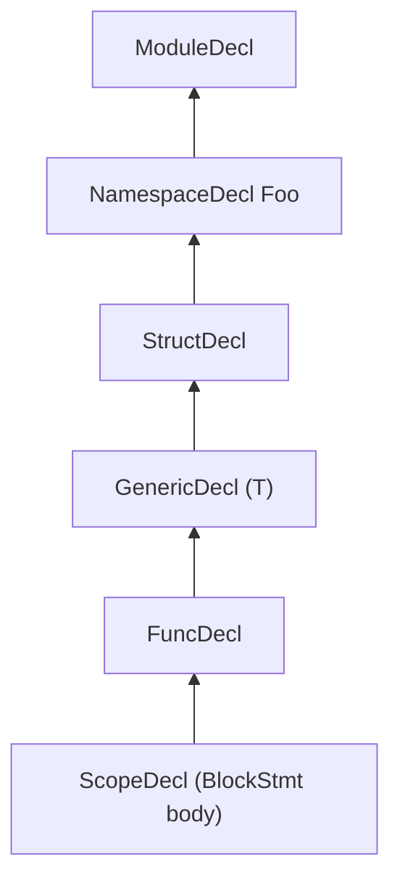

# Scopes

This document describes the `Scope` data structure that drives Slang's
name resolution, the AST node kinds that introduce a new scope, and how
the parser threads scopes through the AST as it builds it. The
intended reader is a developer modifying scope construction, adding a
new scope-bearing AST node, or trying to understand why a given
identifier is in scope at a particular source location.

For the lookup algorithm itself, see [lookup.md](lookup.md). For
visibility filtering, see [visibility.md](visibility.md). For how the
overall pipeline gets here, see
[../pipeline/02-parse-ast.md](../pipeline/02-parse-ast.md).

## Source

Scopes are declared in
[slang-ast-base.h](../../../../source/slang/slang-ast-base.h). The
`Decl` subclasses that own scopes are declared in
[slang-ast-decl.h](../../../../source/slang/slang-ast-decl.h), and the
`Stmt` subclasses that own scopes are declared in
[slang-ast-stmt.h](../../../../source/slang/slang-ast-stmt.h). Scope
construction during parsing happens in
[slang-parser.cpp](../../../../source/slang/slang-parser.cpp); the
`addSiblingScopeForContainerDecl` helper used by semantic-checking and
session/module setup code is defined in
[slang-check-expr.cpp](../../../../source/slang/slang-check-expr.cpp).

## Concepts

- `Scope` (lines 112-128 of
  [slang-ast-base.h](../../../../source/slang/slang-ast-base.h)) — a
  three-field record:
  - `ContainerDecl* containerDecl` (line 121) — the decl whose members
    are the contents of this scope.
  - `Scope* parent` (line 124) — the next scope to consult when a name
    is not found in `containerDecl`.
  - `Scope* nextSibling` (line 127) — the next scope to consult at the
    *same* level before falling through to `parent` (see "Sibling
    scopes" below). The comment in the header notes that `containerDecl`
    is deliberately an unowned pointer so a `Scope` cannot keep an AST
    node alive.
- `ContainerDecl` (abstract, declared in
  [slang-ast-decl.h](../../../../source/slang/slang-ast-decl.h)) — the
  `Decl` subclass that has child decls. Every `ContainerDecl` carries
  an `ownedScope` field whose `containerDecl` points back to the owning
  decl. This is the canonical way an AST node "owns" a scope.
- `ScopeDecl` (line 590 of
  [slang-ast-decl.h](../../../../source/slang/slang-ast-decl.h)) — a
  synthetic `ContainerDecl` used to attach a scope to a statement.
  `ScopeDecl` instances do not appear in the surface syntax; they are
  created by the parser for any statement that introduces a local
  scope.
- `ScopeStmt` (abstract, lines 16-21 of
  [slang-ast-stmt.h](../../../../source/slang/slang-ast-stmt.h)) — the
  abstract base of statements that own a scope. It carries a single
  `ScopeDecl* scopeDecl` field; the actual `Scope*` is
  `scopeDecl->ownedScope`.
- `BlockStmt` (line 41 of
  [slang-ast-stmt.h](../../../../source/slang/slang-ast-stmt.h)) — the
  concrete `{ ... }` block; the most common `ScopeStmt`.

## Rules

### Scope-bearing AST nodes

The nodes listed below either own a `Scope` directly (a `ContainerDecl`
via `ownedScope`) or declare a `ScopeStmt::scopeDecl` field. The
"How the scope is attached" column distinguishes a node that *always*
gets a fresh scope from one whose `scopeDecl` field is only populated on
some parser paths — see the notes after the table and the edge-case
section for the statements where the parser does not push a fresh scope.
Citations point at the concrete class in the header.

| Node kind | Header | How the scope is attached |
| --- | --- | --- |
| `ModuleDecl` | [slang-ast-decl.h](../../../../source/slang/slang-ast-decl.h) (line 807) | `ContainerDecl::ownedScope` |
| `NamespaceDecl` | [slang-ast-decl.h](../../../../source/slang/slang-ast-decl.h) (line 799) | `ContainerDecl::ownedScope` |
| `FileDecl` | [slang-ast-decl.h](../../../../source/slang/slang-ast-decl.h) (line 854) | `ContainerDecl::ownedScope` |
| `AggTypeDecl` and its subclasses `StructDecl`, `ClassDecl`, `InterfaceDecl`, `EnumDecl`, `SynthesizedStructDecl`, `GLSLInterfaceBlockDecl`, `AssocTypeDecl`, `GlobalGenericParamDecl` | [slang-ast-decl.h](../../../../source/slang/slang-ast-decl.h) (`ExtensionDecl`-family base `AggTypeDeclBase` at line 367, plus `SynthesizedStructDecl` line 420, `GLSLInterfaceBlockDecl` line 434, `AssocTypeDecl` line 567, `GlobalGenericParamDecl` line 575) | `ContainerDecl::ownedScope` |
| `ExtensionDecl` | [slang-ast-decl.h](../../../../source/slang/slang-ast-decl.h) (line 367) | `ContainerDecl::ownedScope` |
| `GenericDecl` | [slang-ast-decl.h](../../../../source/slang/slang-ast-decl.h) (line 929) | `ContainerDecl::ownedScope`; the scope contains the generic parameters |
| `CallableDecl` and its subclasses `FuncDecl`, `ConstructorDecl`, `SubscriptDecl`, `AccessorDecl`, `FuncAliasDecl` | [slang-ast-decl.h](../../../../source/slang/slang-ast-decl.h) (line 612 onward; `FuncAliasDecl` line 653) | `ContainerDecl::ownedScope`; the scope contains the parameter decls |
| `PropertyDecl` | [slang-ast-decl.h](../../../../source/slang/slang-ast-decl.h) (line 698) | `ContainerDecl::ownedScope` |
| `SemanticDecl`, `AttributeDecl` | [slang-ast-decl.h](../../../../source/slang/slang-ast-decl.h) (`SemanticDecl` line 732, `AttributeDecl` line 1112; both direct `ContainerDecl` subclasses) | `ContainerDecl::ownedScope` |
| `ScopeDecl` | [slang-ast-decl.h](../../../../source/slang/slang-ast-decl.h) (line 590) | `ContainerDecl::ownedScope`; attached to a `ScopeStmt` |
| `BlockStmt` | [slang-ast-stmt.h](../../../../source/slang/slang-ast-stmt.h) (line 41) | `ScopeStmt::scopeDecl`; the parser always pushes a fresh `ScopeDecl` in `parseBlockStatement` ([slang-parser.cpp](../../../../source/slang/slang-parser.cpp) line 7118) |
| `ForStmt`, `UnscopedForStmt` | [slang-ast-stmt.h](../../../../source/slang/slang-ast-stmt.h) (lines 216-231) | `ScopeStmt::scopeDecl`; `Parser::ParseForStatement` ([slang-parser.cpp](../../../../source/slang/slang-parser.cpp) line 7380) assigns `scopeDecl` but only pushes it for the scoped `ForStmt` — `UnscopedForStmt` reuses the parent scope for HLSL compatibility |
| `WhileStmt`, `DoWhileStmt` | [slang-ast-stmt.h](../../../../source/slang/slang-ast-stmt.h) (lines 234-247) | declare `ScopeStmt::scopeDecl` (via `LoopStmt` -> `BreakableStmt` -> `ScopeStmt`), but the parser (`ParseWhileStatement`, `ParseDoWhileStatement`) does **not** create or assign a fresh `ScopeDecl`; the loop body owns its own scope only when it is a `BlockStmt` |
| `CompileTimeForStmt` | [slang-ast-stmt.h](../../../../source/slang/slang-ast-stmt.h) (line 251) | `ScopeStmt::scopeDecl` |
| `GpuForeachStmt` | [slang-ast-stmt.h](../../../../source/slang/slang-ast-stmt.h) (line 198) | `ScopeStmt::scopeDecl` |
| `SwitchStmt`, `TargetSwitchStmt`, `StageSwitchStmt` (`BreakableStmt` subclasses) | [slang-ast-stmt.h](../../../../source/slang/slang-ast-stmt.h) (lines 116-154) | declare `ScopeStmt::scopeDecl`, but the parser does not assign it: `ParseSwitchStmt` ([slang-parser.cpp](../../../../source/slang/slang-parser.cpp) line 6560) gives the body a scoped `BlockStmt`, and `parseTargetSwitchStmtImpl` (line 6591) creates a per-case `ScopeDecl` rather than one on the statement |
| `CatchStmt` (catch handler) | [slang-ast-stmt.h](../../../../source/slang/slang-ast-stmt.h) (line 306); a fresh `ScopeDecl` is pushed in `Parser::ParseDoCatchStatement` ([slang-parser.cpp](../../../../source/slang/slang-parser.cpp) line 7470) | indirect, through the surrounding `ScopeDecl` the parser creates |
| `parseIfLetStatement` (synthetic) | [slang-parser.cpp](../../../../source/slang/slang-parser.cpp) (line 7272) | a fresh `ScopeDecl` is pushed for the unwrapped variable |
| `LambdaExpr` (parameter scope) | the parser creates and pushes `lambdaExpr->paramScopeDecl` in `parseLambdaExpr` ([slang-parser.cpp](../../../../source/slang/slang-parser.cpp) lines 8621-8622); `LambdaDecl` itself ([slang-ast-decl.h](../../../../source/slang/slang-ast-decl.h) line 682) is a `StructDecl` and owns a scope as an aggregate | dedicated `ScopeDecl` for the lambda parameter list, owned by the expression, not by `LambdaDecl` |

Several AST nodes do *not* own a fresh scope even though syntactically
they look like they might:

- `IfStmt` ([slang-ast-stmt.h](../../../../source/slang/slang-ast-stmt.h)
  line 83) does not own a scope; its branch bodies parse as
  `BlockStmt`s that own one. `if (let x = ...)`
  is the exception: `Parser::parseIfLetStatement`
  ([slang-parser.cpp](../../../../source/slang/slang-parser.cpp) line
  7272) synthesizes additional `ScopeDecl`s for the unwrapped
  variable.
- `SeqStmt`, `DeclStmt`, and other `Stmt` subclasses that are not
  `ScopeStmt` simply live inside the enclosing scope.

### Parser scope construction

The parser carries the current scope pointer as a member field
([slang-parser.cpp](../../../../source/slang/slang-parser.cpp) lines
120-122):

- `Parser::currentScope` (line 122) — scope where new decl definitions
  are inserted.
- `Parser::currentLookupScope` (line 121) — scope where in-parser
  expression lookup starts (kept in sync with `currentScope` via
  `resetLookupScope`, line 141).
- `Parser::outerScope` (line 120) — the initial scope at the start of
  parsing.

Three helper methods push and pop scopes
([slang-parser.cpp](../../../../source/slang/slang-parser.cpp) lines
143-169):

- `PushScope(ContainerDecl*)` (line 143) — allocates a new `Scope`,
  links its `parent` to `currentScope`, writes itself back into
  `containerDecl->ownedScope`, and updates `currentScope`.
- `pushScopeAndSetParent(ContainerDecl*)` (line 159) — same plus
  assigning `containerDecl->parentDecl = currentScope->containerDecl`
  before pushing. This is the helper most parsing code calls.
- `PopScope()` (line 165) — restores `currentScope = currentScope->parent`.

A representative chain that arises in a Slang file is shown below.
Each box is the `ContainerDecl` referenced by a `Scope::containerDecl`,
and arrows point from a child scope to its `parent`.

The same parser-call chain that produces this looks roughly like:
`parseNamespaceDecl` -> `parseDeclBody`/`parseAggTypeDecl` ->
`parseOptGenericDecl` -> `parseFuncDecl` -> `parseBlockStatement`,
each calling `pushScopeAndSetParent` for the node it introduces and
matching `PopScope` on the way out.

### Sibling scopes

`Scope::nextSibling` lets one scope chain consult several containers
at the same nesting level. The constructor is the free function
`addSiblingScopeForContainerDecl` defined in
[slang-check-expr.cpp](../../../../source/slang/slang-check-expr.cpp)
(lines 316-337); it allocates a fresh `Scope`, points it at the
secondary `ContainerDecl`, and splices it into the existing
`nextSibling` list of the destination scope. A convenience overload
that takes a destination `ContainerDecl*` simply forwards to
`dest->ownedScope`.

Four concrete uses of sibling scopes are visible in the source:

1. **`FileDecl` per source file in a multi-file module.** A module
   that is split across multiple `__include`d files has one
   `ModuleDecl` plus one `FileDecl` per source file. Each `FileDecl`
   is attached to the module's scope as a sibling so that lookup
   inside the module sees the union of all files'
   members — see
   [slang-session.cpp](../../../../source/slang/slang-session.cpp)
   line 2245 and `SemanticsVisitor::importFileDeclIntoScope` in
   [slang-check-decl.cpp](../../../../source/slang/slang-check-decl.cpp)
   line 16663.
2. **Imported modules.** When module B imports module A, the
   checker adds A's scope as a sibling of B's scope so that names
   from A are reachable in B without explicit qualification — see
   `SemanticsVisitor::importModuleIntoScope` in
   [slang-check-decl.cpp](../../../../source/slang/slang-check-decl.cpp)
   line 16672.
3. **Multiple `namespace Foo {}` declarations of the same logical
   namespace.** When the same namespace name reappears, the parser
   reuses the existing `NamespaceDecl`
   (`parseNamespaceDecl`,
   [slang-parser.cpp](../../../../source/slang/slang-parser.cpp) line
   4418) so that further declarations are inserted into the same
   container. The semantic checker links siblings in
   `SemanticsDeclScopeWiringVisitor::visitNamespaceDecl`
   ([slang-check-decl.cpp](../../../../source/slang/slang-check-decl.cpp)
   line 17024, calling `addSiblingScopeForContainerDecl` at line 17051)
   when more than one `NamespaceDecl` exists.
4. **`using` declarations.** `SemanticsDeclScopeWiringVisitor::visitUsingDecl`
   ([slang-check-decl.cpp](../../../../source/slang/slang-check-decl.cpp)
   line 16960) checks the `using` argument and, for each
   namespace-like (`NamespaceDeclBase`) target it names, calls
   `addSiblingScopeForContainerDecl` (line 16990) to splice that
   namespace's owned/sibling scopes into the `using` decl's scope, so
   the namespace's members become reachable without qualification.

### Implicit scopes

A few intermediate scopes have no direct surface-syntax representation
but are still created at parse time:

- **Generic parameter list.** `parseOptGenericDecl`
  ([slang-parser.cpp](../../../../source/slang/slang-parser.cpp) line
  1777) creates a `GenericDecl` and pushes its scope *before* parsing
  the inner decl. The generic parameters live in the `GenericDecl`'s
  scope; the inner decl's own scope is its child.
- **Extension body.** `ExtensionDecl` owns its own scope, but the
  members of the type it extends are *not* in the extension's scope
  chain; they are reached through member lookup at check time.
- **Interface requirement list.** `InterfaceDecl` owns a single scope
  for its requirements; the default-impl bodies parse against a
  derived `InterfaceDefaultImplDecl` ([slang-ast-decl.h line
  944](../../../../source/slang/slang-ast-decl.h)) that is itself a
  `GenericDecl` subclass and thus has its own scope. An associated
  type's constraint clause does *not* go into the
  `AssocTypeDecl`'s own scope: when `parseAssocType`
  ([slang-parser.cpp](../../../../source/slang/slang-parser.cpp) line
  4280) sees that the current scope's `containerDecl` is an
  `InterfaceDecl`, it sets `constraintTarget` to the *enclosing
  interface* so each `GenericTypeConstraintDecl`
  ([slang-ast-decl.h line 979](../../../../source/slang/slang-ast-decl.h))
  produced by `associatedtype A : IBar` or `associatedtype A where A : IBar`
  becomes a sibling member of the associated type. The dedicated
  `__constraint` keyword (`parseInterfaceConstraintDecl`,
  [slang-parser.cpp](../../../../source/slang/slang-parser.cpp) line
  4322) inserts a `GenericTypeConstraintDecl` directly into the
  interface scope the same way. All three surface forms therefore land
  in one scope as parallel requirement members.
- **`if (let x = ...)` desugaring.** `parseIfLetStatement`
  ([slang-parser.cpp](../../../../source/slang/slang-parser.cpp) line
  7272) creates `ScopeDecl`s for the temporary `$OptVar` binding and
  for the user-visible unwrapped variable inside the positive branch.

### Scope walking order during lookup

Lookup walks the chain in a fixed order, defined by the lookup entry
points (see [lookup.md](lookup.md)):

1. Visit `currentScope` itself: its `containerDecl`'s direct members.
2. Walk `currentScope->nextSibling` until null, repeating step 1 for
   each sibling.
3. Move to `currentScope->parent` and repeat from step 1.
4. Stop when the parent chain reaches `nullptr`.

The same `parent`-then-`nextSibling` traversal is reused outside the
main lookup path by `findClosestInScopeName` in
[slang-check-expr.cpp](../../../../source/slang/slang-check-expr.cpp)
(line 5137): when a `VarExpr` fails to resolve, the checker walks the
scope chain (skipping the core module so its thousands of builtins do
not produce spurious matches) looking for a sufficiently close
edit-distance spelling and attaches a "did you mean" suggestion to the
`Diagnostics::UndefinedIdentifier` diagnostic (line 5296).

The detailed lookup algorithm — masks, inheritance walks,
transparent-member injection, deduplication — lives in
[lookup.md](lookup.md). This page only states the order in which scopes
are consulted.

## Edge cases and failure modes

- **Empty block scope.** A `BlockStmt` whose body contains zero
  declarations still has a fresh `ScopeDecl`. This matters because
  the per-decl `Decl::hiddenFromLookup` flag
  ([slang-ast-base.h](../../../../source/slang/slang-ast-base.h) line
  803) is set on entry to the block; see
  [slang-check-stmt.cpp](../../../../source/slang/slang-check-stmt.cpp)
  lines 73-113 for the entry/clear logic. The flag is cleared as the
  checker walks past each `DeclStmt`; the lookup-side check is in
  [slang-lookup.cpp](../../../../source/slang/slang-lookup.cpp) line 179.
- **`UnscopedForStmt`.** When the source language is HLSL,
  `Parser::ParseForStatement`
  ([slang-parser.cpp](../../../../source/slang/slang-parser.cpp) line
  7380) creates an `UnscopedForStmt` and *skips* the
  `pushScopeAndSetParent` call, so the `for` loop's initialization
  variable leaks into the surrounding scope as HLSL semantics demand.
- **Multiple `namespace Foo {}` siblings.** `parseNamespaceDecl`
  ([slang-parser.cpp](../../../../source/slang/slang-parser.cpp) line
  4418) reuses the first `NamespaceDecl` it finds in the parent, so
  all subsequent declarations parse into the same `ContainerDecl`.
  Lookup still has to walk sibling-linked `NamespaceDecl`s across
  modules; that is what `addSiblingScopeForContainerDecl` is for.
- **`GenericDecl` parameter scope vs inner-decl scope.** A reference
  to a generic type parameter `T` inside the inner decl resolves
  through the inner scope's `parent`, which is the `GenericDecl`'s
  scope. A sibling of the outer decl that mentions `T` cannot reach
  it — its scope chain does not pass through the `GenericDecl`.
- **`__constraint` subject must not be `This`.** A
  `GenericTypeConstraintDecl` is only allowed as a child of an
  `InterfaceDecl` (or of a `GenericDecl`); `isDeclAllowed`
  ([slang-parser.cpp](../../../../source/slang/slang-parser.cpp))
  enforces the placement. When the relocated decl lands
  in the interface scope, the header visitor
  `SemanticsDeclHeaderVisitor::visitGenericTypeConstraintDecl`
  ([slang-check-decl.cpp](../../../../source/slang/slang-check-decl.cpp)
  line 4415) further rejects a `__constraint` whose subject resolves to
  the bare `This` type — that is the role of the inheritance clause —
  diagnosing `Diagnostics::ConstraintSubjectCannotBeThisType`
  ([slang-check-decl.cpp](../../../../source/slang/slang-check-decl.cpp)
  line 4433) and replacing the subject with the error type. Constraints
  on associated types (e.g. `This.A : IBar`) are permitted.
- **`ExtensionDecl` members are not in the extension's scope chain.**
  Lookup *into* a type that has an active extension must walk the
  extension's members explicitly; the extension scope is not
  configured as a sibling of the extended type's scope. The relevant
  helper is in [slang-lookup.cpp](../../../../source/slang/slang-lookup.cpp)
  and is documented in [lookup.md](lookup.md).
- **`UsingDecl`.** A `using` declaration ([slang-ast-decl.h line
  861](../../../../source/slang/slang-ast-decl.h)) captures
  `parser->currentScope` at parse time (see `parseUsingDecl` in
  [slang-parser.cpp](../../../../source/slang/slang-parser.cpp) line
  4530). The injection into the surrounding scope happens at check
  time, not at parse time:
  `SemanticsDeclScopeWiringVisitor::visitUsingDecl`
  ([slang-check-decl.cpp](../../../../source/slang/slang-check-decl.cpp)
  line 16960) adds each named namespace/module as a sibling scope via
  `addSiblingScopeForContainerDecl`. If the argument does not resolve
  to any namespace-like entity, no sibling is added and the checker
  diagnoses `Diagnostics::ExpectedANamespace`
  ([slang-check-decl.cpp](../../../../source/slang/slang-check-decl.cpp)
  line 17019). The current scope at parse time and the scope into which
  names are eventually injected may differ if the enclosing decl is
  later reorganized (e.g. by sibling-namespace collapse).
- **`UnparsedStmt`.** A function body left as an `UnparsedStmt` at
  parse time captures both `currentScope` and `outerScope` ([slang-
  ast-stmt.h](../../../../source/slang/slang-ast-stmt.h) lines 53-61);
  these are restored when `parseUnparsedStmt` runs the deferred parse.
- **Empty parser scope.** Pushing a `Scope` whose `containerDecl`
  is null is not supported. `Parser::PushScope` requires the
  `ContainerDecl*` overload to allocate one; the bare-`Scope*`
  overload (line 153) exists only for restoring a pre-built scope.

## See also

- [lookup.md](lookup.md) — the lookup algorithm that walks the
  scope chain.
- [visibility.md](visibility.md) — the visibility filter that runs
  on top of lookup.
- [overload-resolution.md](overload-resolution.md) — overload
  ranking that consumes filtered lookup results.
- [../ast-reference/base.md](../ast-reference/base.md) — the
  reference for `NodeBase`, `Decl`, `Scope`, and other base types.
- [../ast-reference/declarations.md](../ast-reference/declarations.md)
  — per-class reference for every `Decl` subclass.
- [../ast-reference/statements.md](../ast-reference/statements.md)
  — per-class reference for every `Stmt` subclass.
- [../pipeline/02-parse-ast.md](../pipeline/02-parse-ast.md) — the
  parsing-stage overview that drives scope construction.
- [../glossary.md](../glossary.md) — glossary entries for
  `scope`, `decl-ref`, `lookup result`, `name resolution`.
