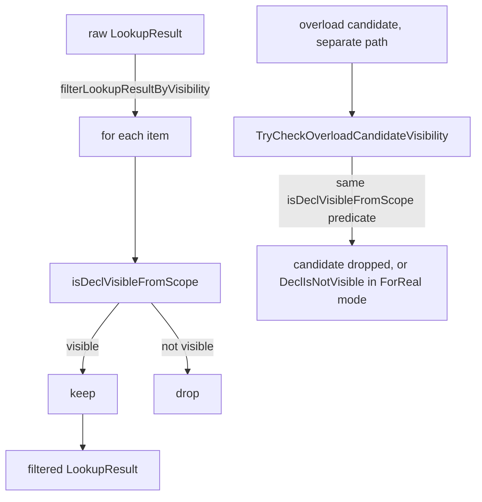

# Visibility

This document covers Slang's declaration visibility rules: which
`public` / `private` / `internal` keyword each decl carries, the
defaults per language version, and where in the resolution pipeline
visibility filtering happens. The intended reader is a developer
adding or modifying a visibility-related diagnostic, a language
designer reasoning about cross-module access, or anyone wondering why
a declaration in another module is or is not reachable.

Lookup itself is described in [lookup.md](lookup.md); overload-
resolution-time visibility filtering is described in
[overload-resolution.md](overload-resolution.md). This page is the
single source for *what* counts as visible.

## Source

Visibility modifiers are declared in
[slang-ast-modifier.h](../../../../source/slang/slang-ast-modifier.h)
(lines 49-67). The `DeclVisibility` enum that the rest of the
compiler reasons about is in
[slang-ast-support-types.h](../../../../source/slang/slang-ast-support-types.h)
(lines 1896-1902). The classification helper `getDeclVisibility` and
the per-module default-visibility setup live in
[slang-check-decl.cpp](../../../../source/slang/slang-check-decl.cpp);
the visibility filter applied to lookup results and the
`isDeclVisibleFromScope` predicate live in
[slang-check-expr.cpp](../../../../source/slang/slang-check-expr.cpp);
the overload-time check sits in
[slang-check-overload.cpp](../../../../source/slang/slang-check-overload.cpp);
per-decl visibility validation is in
[slang-check-modifier.cpp](../../../../source/slang/slang-check-modifier.cpp).

## Concepts

- `VisibilityModifier` (abstract,
  [slang-ast-modifier.h](../../../../source/slang/slang-ast-modifier.h)
  line 49) — base class for visibility keywords. The three concrete
  subclasses are `PublicModifier` (line 55), `PrivateModifier`
  (line 61), and `InternalModifier` (line 67). Each is an empty
  marker class.
- `DeclVisibility`
  ([slang-ast-support-types.h](../../../../source/slang/slang-ast-support-types.h)
  lines 1896-1902) — internal enum with values `Private`, `Internal`,
  `Public`, and the alias `Default = Internal`. The numeric order
  is `Private < Internal < Public`; `Math::Min` over visibility
  values is used throughout to compute the effective visibility of a
  composite (e.g. a parameterized type).
- `ModuleDecl::defaultVisibility`
  ([slang-ast-decl.h](../../../../source/slang/slang-ast-decl.h) line
  835) — `DeclVisibility` field that records the default visibility
  applied to members of the module that carry no explicit modifier.
  Initialized to `DeclVisibility::Internal` at declaration time and
  overridden during semantic checking as described below.
- `SlangLanguageVersion languageVersion`
  ([slang-ast-decl.h](../../../../source/slang/slang-ast-decl.h) line
  833) — the per-module language-version field. A `module` declaration
  carries no version of its own: the field is initialized from the
  compile request's `LanguageVersion` compiler option, and the parser
  then upgrades a legacy value to 2025 when the file uses one of the
  modern constructs that require it (both steps live outside this
  page's watched paths, in `slang-compile-request.cpp` and
  `slang-parser.cpp`). The
  legacy version constant `SLANG_LANGUAGE_VERSION_LEGACY` is
  `2018` in [slang.h](../../../../include/slang.h) (line 5759 at
  `source_commit`); the same enum defines `SLANG_LANGUAGE_VERSION_2025`,
  `SLANG_LANGUAGE_VERSION_2026`, `SLANG_LANGUAGE_VERSION_LATEST` (an
  alias for 2026), and `SLANG_LANGUAGE_VERSION_DEFAULT` as
  `SLANG_LANGUAGE_VERSION_LEGACY` — so the documented language default
  is still 2018. The misspelled `SLANG_LANGAUGE_VERSION_DEFAULT` is
  retained beside it purely for source compatibility, per the public-API
  rule that a released name is never removed.
  `SlangGlobalSessionDesc::minLanguageVersion`
  defaults to `SLANG_LANGUAGE_VERSION_2025`. The visibility defaults
  below depend only on the module's resolved `languageVersion`; the
  session-level `minLanguageVersion` field records a preferred floor
  and is not consulted by the visibility-classification path in the
  watched sources.
- `IgnoreForLookupModifier`
  ([slang-ast-modifier.h](../../../../source/slang/slang-ast-modifier.h)
  line 248) — a separate modifier that hides a decl from lookup
  entirely. It is not part of the `Public` / `Internal` / `Private`
  classification but commonly mistaken for one; see
  "Interaction with `IgnoreForLookupModifier`" below.

## Rules

### Per-keyword semantics

The three keyword classifications map onto the `DeclVisibility`
levels:

- `public`: visible from any module that has imported the declaring
  module.
- `internal`: visible only inside the declaring module
  (including all of its files).
- `private`: visible only inside the declaring aggregate type
  (`struct`, `class`, `interface`, ...). A namespace is not a legal
  container for `private`: a namespace member is still a global decl
  by `isGlobalDecl`
  ([slang-check-decl.cpp](../../../../source/slang/slang-check-decl.cpp)
  lines 1567-1575), so `private` on it is rejected at the
  declaration site with `invalid-use-of-private-visibility` (see
  "Edge cases and failure modes" below).

The mapping is implemented in `getDeclVisibility`
([slang-check-decl.cpp](../../../../source/slang/slang-check-decl.cpp)
lines 21256-21320 at `source_commit`): the function walks
`decl->modifiers` and returns the first `VisibilityModifier` it finds
(lines 21280-21288).

`getDeclVisibility` also implements three structural fall-throughs:

- For an `AccessorDecl` or `EnumCaseDecl`, visibility is inherited
  from the enclosing decl (the parent-walk skips them, lines
  21269-21276).
- For a `GenericDecl`, visibility is taken from its `inner` decl
  (lines 21267-21268).
- For a generic parameter (`isGenericParam` / `GenericTypeConstraintDecl`)
  whose parent is a `GenericDecl`, visibility is the visibility of that
  generic's inner decl; a `GenericTypeConstraintDecl` with any other
  parent falls back to `Default` (lines 21258-21266).

If no explicit modifier is present, the fall-back depends on where the
decl sits and on the module's language version, in this order:

1. **Slang 2026 and later: an unmodified member of an aggregate
   inherits the aggregate's effective visibility** (lines 21289-21299).
   So in

   ```slang
   internal struct S { void f(); }
   ```

   `f` is `internal` rather than picking up the module default. The rule
   is keyed off the aggregate's *effective* visibility — the result of a
   recursive `getDeclVisibility(parentAggTypeDecl)` — so it composes
   transitively through nested aggregates. It applies only when the
   module's `languageVersion >= SLANG_LANGUAGE_VERSION_2026`, so
   existing 2025 and legacy code keeps the older behaviour.
2. **A member of an interface** inherits the interface's visibility
   (lines 21300-21304); this is the rule the 2026 aggregate rule above
   was written to mirror.
3. **Otherwise** the visibility is the module's default (see below).

### Defaults by language version

`ModuleDecl::defaultVisibility` controls the implicit visibility for
members of the module that have no explicit modifier. The default
is computed in `getDeclVisibility`
([slang-check-decl.cpp](../../../../source/slang/slang-check-decl.cpp)
lines 21305-21311):

```cpp
defaultVis = parentModule->languageVersion == SLANG_LANGUAGE_VERSION_LEGACY
                 ? DeclVisibility::Public
                 : parentModule->defaultVisibility;
```

The legacy language treats every unannotated decl as `public` — the
language predates the visibility system entirely, and existing code
relies on that behaviour. Modern versions default to `internal`
unless the module is marked `public` at the top:
`checkModule` flips the module-wide default to `public` when it
finds a `PublicModifier` on the `ModuleDecl`
([slang-check-decl.cpp](../../../../source/slang/slang-check-decl.cpp)
lines 5143-5146).

`NamespaceDecl` is unconditionally `Public`
([slang-check-decl.cpp](../../../../source/slang/slang-check-decl.cpp)
lines 21313-21318).

Nothing in the fall-back chain is conditioned on a decl being a
member of anything, so a function-local `VarDecl` takes the module
default like any other unmodified decl, and `checkVisibility` runs on
it along with every other `VarDeclBase`
([slang-check-decl.cpp](../../../../source/slang/slang-check-decl.cpp)
line 2953; a local reaches that path through the
`ensureDeclBase(..., DefinitionChecked)` in
`SemanticsStmtVisitor::visitDeclStmt`). In a module declared
`public module M;` that makes a local `public`, so the
container-level cap below rejects a local whose type is `internal`
with `use-of-less-visible-type` (30604) even though the name never
escapes the function:

```slang
public module M;
internal struct Counter { int n; }
void f() { Counter c; }   // error 30604
```

### Where visibility is filtered



Visibility is consulted at two distinct points:

1. **Lookup boundary.** Most lookup call sites in the checker pass
   their result through `filterLookupResultByVisibilityAndDiagnose`
   ([slang-check-expr.cpp](../../../../source/slang/slang-check-expr.cpp)
   lines 1279-1301), which delegates the filtering itself to
   `filterLookupResultByVisibility` (lines 1266-1277). If lookup
   returned candidates but all are
   filtered out, the function emits diagnostic
   `decl-is-not-visible` (`Diagnostics::DeclIsNotVisible`,
   `slang-diagnostics.lua` 30600) and reports the *first* offending
   decl. In language-server mode it intentionally returns the
   unfiltered result so completion can keep operating.
2. **Overload resolution.** `TryCheckOverloadCandidateVisibility`
   ([slang-check-overload.cpp](../../../../source/slang/slang-check-overload.cpp)
   lines 265-287) is invoked by the overload filter pipeline on
   every survivor of arity / type checks. In `JustTrying` mode it
   silently drops the candidate; in `ForReal` mode it emits the
   same `DeclIsNotVisible` diagnostic.

Both call sites delegate to the same predicate,
`SemanticsVisitor::isDeclVisibleFromScope(declRef, scope)`
([slang-check-expr.cpp](../../../../source/slang/slang-check-expr.cpp)
lines 1136-1264). The predicate computes the decl's
`DeclVisibility` and dispatches:

- `Public` — always visible.
- `Internal` — visible iff `getModuleDecl(decl)` equals
  `getModuleDecl(scope)`; that is, the requesting scope is part of
  the same module.
- `Private` — visible iff one of the requesting scope's parents is
  the enclosing aggregate (or namespace) that owns the decl, or the
  scope is inside an `ExtensionDecl` whose target type matches.
- Any other value (the impossible `Default` after enum lookup) —
  not visible.

The private-access check walks the requesting scope's parent chain
looking for the parent aggregate (lines 1152-1164). When the
candidate decl lives in an `ExtensionDecl`, the predicate also
resolves the extension's target type and checks for type equality
with the enclosing aggregate of the requesting scope
(lines 1179-1261, via the local `ContainerTargetTypeResolver`). This
lets `extension S { private foo() {...} }`
work when called from inside `S` itself or from another extension on
`S` — even a generic extension that specializes to `S`.

That specialization step is guarded on the *candidate's* own
container being an `ExtensionDecl` (line 1247), so it does not run in
the other direction. A `private` member declared in the body of a
generic type `G<T>` is compared as the type's own default decl-ref
`G<T>` against the requesting extension's target type, and that
comparison fails: such a member is reachable from neither
`extension G<int>` nor `extension<T> G<T>`. Only a `private` declared
in an `extension` crosses instantiations.

### Container-level cap

`SemanticsVisitor::getTypeVisibility`
([slang-check-expr.cpp](../../../../source/slang/slang-check-expr.cpp)
lines 1130-1134) computes the visibility of a `Type` by taking the
minimum of the underlying decl's visibility and the visibilities of
its declaration-reference generic arguments — the recursion only
descends into an argument that is itself a `DeclRefType`. This is what makes
`HashMap<String, InternalKey>` effectively `internal` even if
`HashMap` is `public`.

The recursion itself lives in the static helper `_getTypeVisibility`
(lines 1103-1128), which threads a `Dictionary<Type*, DeclVisibility>`
memo through the walk; `getTypeVisibility` is the thin entry point that
creates that dictionary per query. Only completed results are cached.
The reason is that generic arguments frequently repeat: in
`Pair<T, T>` both arguments point at the same canonical type DAG, so
the second edge should reuse the visibility already collected through
the first instead of traversing the whole DAG again.

`SemanticsVisitor::checkVisibility`
([slang-check-modifier.cpp](../../../../source/slang/slang-check-modifier.cpp)
lines 2325-2390) enforces the converse: a decl cannot reference a
type that is *less* visible than itself. Violations produce
diagnostic `use-of-less-visible-type`
(`Diagnostics::UseOfLessVisibleType`, code 30604). The same
function also enforces that a decl's visibility cannot exceed that of
the nearest enclosing `AggTypeDeclBase`. The search starts at the decl
itself, so an aggregate declaration is compared against itself and the
cap effectively bites on non-aggregate members. Violations produce
`decl-cannot-have-higher-visibility` (code 30601).

### Interaction with `extern` and `export`

The `extern` and `export` modifiers are distinct from the
`public` / `internal` / `private` classification and do not change a
decl's `DeclVisibility`; instead they affect lookup or cross-module
reachability directly:

- `ExternModifier`
  ([slang-ast-modifier.h](../../../../source/slang/slang-ast-modifier.h)
  line 100) and `ExtensionExternVarModifier` (line 231) mark `extern`
  decls. `DeclPassesLookupMask`
  ([slang-lookup.cpp](../../../../source/slang/slang-lookup.cpp)
  lines 41-54) always drops `ExtensionExternVarModifier` decls from
  lookup, and drops an `ExternModifier` member whose parent is an
  `ExtensionDecl`, so those `extern` members are hidden from lookup
  regardless of their visibility keyword. The user-level spelling is
  an `extern` member of an `extension`, and the resulting failure is
  an absence rather than a rejection:

  ```slang
  extension S { extern int extra; }        // error 31143 here
  int test(S s) { return s.extra; }        // error 30027 here
  ```

  The declaration itself is reported as
  `missing-original-defintion-of-extern-decl` (31143), and the use
  site as `no-member-of-name-in-type` (30027, "member not found") —
  not the `decl-is-not-visible` (30600) that a visibility rejection
  would produce.
- `HLSLExportModifier` (line 112) is the bare `export` keyword modifier
  and marks a decl for linkage;
  it records linkage intent and does not by itself raise a decl's
  `DeclVisibility`.
- `ExportedModifier` (line 142) on an `import` controls transitive
  cross-module reachability: `isModuleReachableViaExportedImports`
  ([slang-check-decl.cpp](../../../../source/slang/slang-check-decl.cpp)
  lines 9134-9161) only follows imports marked with `ExportedModifier`,
  so an `__exported import` re-exports the imported module while a
  plain `import` does not.

The non-transitivity of a plain `import` also has to be enforced on the
*scope chain*, not just on the import graph. When a module is imported,
`importModuleIntoScope` splices the imported module's scopes onto the
importing scope's sibling chain — and a transitively imported foreign
module's `FileDecl` can land on that chain too. The predicate
`isOwnModuleOrIncludedFileScope`
([slang-check-expr.cpp](../../../../source/slang/slang-check-expr.cpp)
lines 333-349) decides which of those siblings belong to a module's own
re-export surface: the module's own scope, or a `FileDecl` whose
`parentDecl` is that same module (an `__include`d file). The
`parentDecl == moduleDecl` conjunct is load-bearing — a foreign
module's `FileDecl` points at *that* module, so it is dropped no matter
how it arrived on the chain. Dropping the conjunct would re-export
those foreign files and silently make plain `import` transitive (see
shader-slang/slang#11443). It also drops `using`-spliced namespace
siblings, so a primary file's `using namespace Foo;` does not leak
through an `import`. The predicate is declared in
[slang-check-impl.h](../../../../source/slang/slang-check-impl.h) line
76, and is applied by `SemanticsVisitor::importModuleIntoScope`
([slang-check-decl.cpp](../../../../source/slang/slang-check-decl.cpp)
line 17066, in the function starting at 17032) and again during
entry-point checking
([slang-check-shader.cpp](../../../../source/slang/slang-check-shader.cpp)
line 3684).

### Generic parameters, accessors, and synthesized members

`getDeclVisibility` collapses the visibility of generic parameters
into the visibility of the generic's `inner` decl, so a generic
parameter is never independently more or less visible than the decl
it parameterizes. Similarly, `AccessorDecl` and `EnumCaseDecl` get
their visibility from their parent.

Synthesized members (interface-requirement witnesses, derivative
implementations, ...) are in most cases assigned a visibility at their
synthesis site rather than relying on the module default; where that
assignment is conditional, the synthesized decl falls through to the
normal effective/default classification described above. The requirement-
satisfaction synthesizers call
`addVisibilityModifier(synthesized, Math::Min(parentVisibility, requirementVisibility))`
when the satisfied requirement carries an explicit visibility
modifier
([slang-check-decl.cpp](../../../../source/slang/slang-check-decl.cpp)
lines 7223-7229 for a synthesized method, 8305-8311 for a property,
and 8684-8690 for a subscript), so a synthesized member is never more
visible than either its parent or the requirement it satisfies.
Synthesized differential types and fields propagate the parent
member's visibility directly via
`addVisibilityModifier(decl, getDeclVisibility(parent))`
([slang-check-decl.cpp](../../../../source/slang/slang-check-decl.cpp)
lines 3865-3867 and 3925-3926); the synthesized differential struct
and its type alias in
[slang-check-expr.cpp](../../../../source/slang/slang-check-expr.cpp)
lines 844-845 and 878 do the same. `addVisibilityModifier` itself is a
`SemanticsVisitor` method at
[slang-check-decl.cpp](../../../../source/slang/slang-check-decl.cpp)
line 3683.

### Synthesized extensions: two visibilities, not one

Synthesis that produces an `extension` rather than a plain member needs
two visibility decisions, because an extension is hoisted to module
scope where `private` is not a legal visibility at all. Consider a
private member function annotated `[Differentiable]`: the derivative is
synthesized as an extension on the function-as-type, but that extension
cannot itself be `private`.

`getSynthesizedExtensionVisibility`
([slang-check-decl.cpp](../../../../source/slang/slang-check-decl.cpp)
lines 9107-9131) resolves this by returning a
`SynthesizedExtensionVisibility` pair (lines 9069-9073) with separate
`extensionVisibility` and `memberVisibility` fields. `Public` and
`Internal` targets map both fields to themselves; a `Private` target
maps the extension to `Internal` — module-visible, so synthesis can
attach to it — while keeping the synthesized members `Private` so the
callable's API surface is unchanged. Anything else is
`SLANG_UNEXPECTED`, since `Default` should never reach it after
classification.

The related helper `getMoreRestrictiveVisibility` (lines 9075-9105)
computes the pairwise minimum of two visibilities after normalizing
`Default`, and is the shared spelling for "no more visible than either
of these two things."

### Interaction with `IgnoreForLookupModifier`

A decl that carries `IgnoreForLookupModifier`
([slang-ast-modifier.h](../../../../source/slang/slang-ast-modifier.h)
line 248) is skipped by lookup before visibility filtering even
sees it. Today the only producer of this modifier is the tag-type
  inheritance decl on enums
  ([slang-check-decl.cpp](../../../../source/slang/slang-check-decl.cpp)
  line 12291), which is excluded from lookup so the enum's tag type
does not appear as a base interface during member lookup
([slang-lookup.cpp](../../../../source/slang/slang-lookup.cpp) line
462). Visibility rules therefore never apply to such a decl.

## Edge cases and failure modes

- **`public` inside an `internal` struct.** `checkVisibility`
  rejects this: the diagnostic `decl-cannot-have-higher-visibility`
  fires at the inner decl
  ([slang-check-modifier.cpp](../../../../source/slang/slang-check-modifier.cpp)
  lines 2385-2389).
- **`private` on a decl that is not a member of a type.** The
  diagnostic `invalid-use-of-private-visibility`
  (`slang-diagnostics.lua` 30603) fires at the declaration site
  ([slang-check-modifier.cpp](../../../../source/slang/slang-check-modifier.cpp)
  lines 2188-2216) for three shapes, not just the top-level one:
  a module- or file-scope decl, a member of a `namespace` (both are
  `isGlobalDecl`), and an interface requirement. The message says
  "is not a member of a type", which is the accurate statement of
  the rule — a container is not enough, it has to be a type.
- **Visibility modifier on a node that does not accept one.** The
  diagnostic `invalid-visibility-modifier-on-type-of-decl`
  (`slang-diagnostics.lua` 36005) fires when the user marks a
  namespace `internal`, or otherwise attaches a visibility modifier
  to an unsupported node kind. `private namespace X` does *not*
  reach it: the `isGlobalDecl` test above runs first and returns, so
  a namespace — top-level or nested — is reported as 30603 instead.
  (A repeated modifier such as `public public ...` is instead caught
  by the conflict-group check, which emits `duplicate-modifier`
  (`Diagnostics::DuplicateModifier`, `slang-diagnostics.lua` 31202)
  from
  [slang-check-modifier.cpp](../../../../source/slang/slang-check-modifier.cpp)
  line 2527.)
- **Less-visible type in a more-visible signature.** A `public
  func foo(x: InternalT)` produces `use-of-less-visible-type`
  (code 30604).
- **A name found by lookup but filtered out.** `DeclIsNotVisible`
  (code 30600) is emitted by
  `filterLookupResultByVisibilityAndDiagnose` when the original
  `LookupResult` was non-empty but the filter removed every
  candidate; the diagnostic names the first removed decl. Language-
  server mode returns the unfiltered result so completion still
  shows the candidate.
- **Cross-language-version import.** A legacy-language module
  imports a modern-language module: the modern module's decls are
  still classified by their *own* `defaultVisibility`. The legacy
  caller's scope is checked by `getModuleDecl(scope)` for
  `Internal`-level access — being in a different module makes
  `internal` decls invisible, regardless of the caller's language
  version. The legacy module's *own* decls are seen as `public` by
  any caller because the legacy default is `public`.
- **`extension` on a generic type.** A `private` member declared in
  an `extension` is reachable from an extension on a different
  generic instantiation of the same type, because
  `isDeclVisibleFromScope` uses `applyExtensionToType` to align the
  candidate's container type with the requesting scope's container
  type
  ([slang-check-expr.cpp](../../../../source/slang/slang-check-expr.cpp)
  lines 1244-1251). That alignment is conditioned on the candidate
  living in an `ExtensionDecl`, so a `private` member of the generic
  type's *own* body does not get it and is rejected with
  `DeclIsNotVisible` from any extension on the type.
- **Synthesized derivative members.** When auto-diff synthesizes a
  derivative as an `extension` on a function-as-type whose owner is
  itself a struct member, `isDeclVisibleFromScope` resolves the
  parent aggregate recursively so that the derivative inherits the
  ordinary member's visibility scope (lines 1196-1213).
- **Re-exporting a non-exported decl through an alias.** A `using`
  declaration in Slang only brings a *namespace-like* container into
  scope — a namespace or a module, since modules are namespace-like —
  `visitUsingDecl`
  ([slang-check-decl.cpp](../../../../source/slang/slang-check-decl.cpp)
  lines 17338-17400) requires its argument to resolve to a
  `NamespaceDeclBase` and otherwise emits `ExpectedANamespace`
  (`slang-diagnostics.lua` 30061) — so `using SomeStruct;` is
  rejected with "expected a namespace" rather than aliasing the
  struct. A `using` does not re-export an individual `internal`
  member, so there is no `using`-specific visibility rejection in
  the watched paths. The
  source-backed rejection path for an alias that exposes a less-visible
  decl is the `FuncAliasDecl` branch of
  `validatePublicCallableOperandVisibility`
  ([slang-check-decl.cpp](../../../../source/slang/slang-check-decl.cpp)
  lines 9198-9251, with the alias branch at 9211-9223): a `public`
  alias whose target is not `Public`, or
  whose target's module is reachable only through a plain (non
  `__exported`) `import`, is rejected with
  `public-custom-derivative-uses-non-exported-import`
  (`Diagnostics::PublicCustomDerivativeUsesNonExportedImport`,
  `slang-diagnostics.lua` 31162).

  A `FuncAliasDecl` is never written by hand: it is synthesized by
  the AD-2.0 translation of a `[ForwardDerivative(...)]` or
  `[BackwardDerivative(...)]` attribute, which builds an extension on
  the primal-function-as-type and gives it an alias member naming the
  supplied derivative
  ([slang-check-decl.cpp](../../../../source/slang/slang-check-decl.cpp)
  line 19185 in `translateFwdDerivativeAttributeToAD2`, line 19139;
  the backward twin starts at 19210). The rejected shape is therefore
  a `public` primal whose derivative comes from a plainly imported
  module:

  ```slang
  import "helper";                    // not `__exported import`

  [ForwardDerivative(helper_fwd)]     // error 31162 here
  public float f(float x) { return x * x; }
  ```
- **`IgnoreForLookupModifier`.** A decl marked
  `IgnoreForLookupModifier` is invisible to lookup regardless of any
  visibility modifier; visibility analysis is therefore moot for
  such decls.

## See also

- [scopes.md](scopes.md) — the scope chain that
  `isDeclVisibleFromScope` walks.
- [lookup.md](lookup.md) — the lookup algorithm whose results are
  visibility-filtered.
- [overload-resolution.md](overload-resolution.md) — overload
  candidate filtering, which calls
  `TryCheckOverloadCandidateVisibility`.
- [../pipeline/03-semantic-check.md](../pipeline/03-semantic-check.md)
  — the semantic-checking phase that runs the visibility filters.
- [../ast-reference/modifiers.md](../ast-reference/modifiers.md) —
  per-class reference for every modifier, including the visibility
  family.
- [../ast-reference/declarations.md](../ast-reference/declarations.md)
  — per-class reference for `ModuleDecl`, `NamespaceDecl`, and the
  aggregate-type decls.
- [../glossary.md](../glossary.md) — entries for
  `visibility modifier`, `decl-ref`, `name resolution`.
