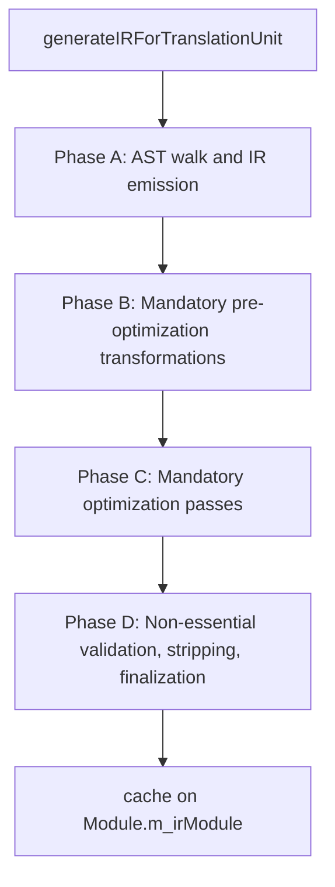
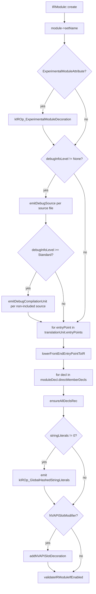
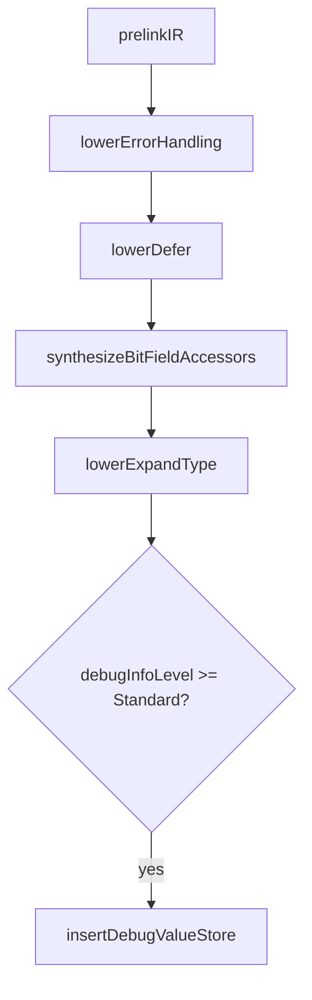
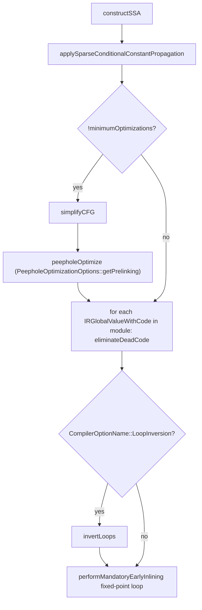
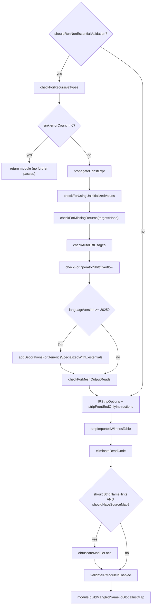
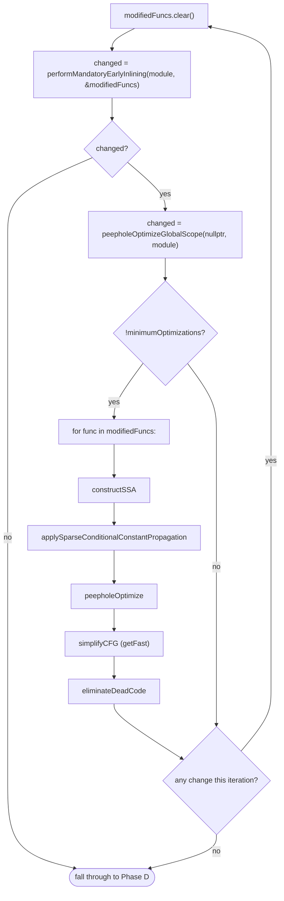

# Pre-link mandatory passes

This page documents the ordered IR-pass sequence that runs inside
`generateIRForTranslationUnit` in
[slang-lower-to-ir.cpp](../../../../source/slang/slang-lower-to-ir.cpp)
**before** the per-translation-unit IR module is cached on the
`Module` and pulled into `linkAndOptimizeIR` by `linkIR`. The
intended reader is a compiler developer who needs to find where in
the pre-link pipeline a particular pass runs, why it runs there, and
how it interacts with the mandatory-early-inlining loop. The
pipeline is **target-agnostic**: the same passes run for every
shader target. The post-link, per-target pass sequence is documented
under [../target-pipelines/](../target-pipelines).

The calls in this region are plain function calls of the form
`passName(module)` or `passName(module, sink)` — they do **not**
use the `SLANG_PASS(...)` macro that wraps the post-link passes in
[slang-emit.cpp](../../../../source/slang/slang-emit.cpp).

## Source

- [slang-lower-to-ir.cpp](../../../../source/slang/slang-lower-to-ir.cpp)
  — `generateIRForTranslationUnit` (line ~14712) is the orchestrator.
  The function is invoked once per `TranslationUnitRequest` from
  `Module::compile` and friends; its result is cached on
  `Module::m_irModule`.
- [slang-ir-link.h](../../../../source/slang/slang-ir-link.h)
  / [slang-ir-link.cpp](../../../../source/slang/slang-ir-link.cpp)
  — declares `prelinkIR`, which pulls in `[unsafeForceInlineEarly]`
  bodies and the `externalSymbolsToPrelink` set so the mandatory
  passes below can simplify them in-place.
- [slang-ir-lower-error-handling.h](../../../../source/slang/slang-ir-lower-error-handling.h)
  / [slang-ir-lower-defer.h](../../../../source/slang/slang-ir-lower-defer.h)
  / [slang-ir-bit-field-accessors.h](../../../../source/slang/slang-ir-bit-field-accessors.h)
  / [slang-ir-lower-expand-type.h](../../../../source/slang/slang-ir-lower-expand-type.h)
  / [slang-ir-insert-debug-value-store.h](../../../../source/slang/slang-ir-insert-debug-value-store.h)
  — the Phase B lowering passes.
- [slang-ir-ssa.h](../../../../source/slang/slang-ir-ssa.h)
  / [slang-ir-simplify-cfg.h](../../../../source/slang/slang-ir-simplify-cfg.h)
  / [slang-ir-peephole.h](../../../../source/slang/slang-ir-peephole.h)
  / [slang-ir-inline.h](../../../../source/slang/slang-ir-inline.h)
  / [slang-ir-strip.h](../../../../source/slang/slang-ir-strip.h)
  — the Phase C / Phase D core analyses, simplifications, and
  stripping passes.
- [slang-compiler-options.h](../../../../source/slang/slang-compiler-options.h)
  — declares the `CompilerOptionName` toggles that gate
  conditional steps below.

## High-level phase diagram

All four `Phase *` nodes live in the body of
`generateIRForTranslationUnit`. The function is called once per
translation unit; the cached `IRModule` returned by Phase D is the
input to `linkIR` (and from there `linkAndOptimizeIR`) later, once
the program is composed for a specific target.

## Phase A: AST walk and IR emission

Spans roughly lines 14734-14843 of
[slang-lower-to-ir.cpp](../../../../source/slang/slang-lower-to-ir.cpp).
This phase creates a fresh `IRModule`, optionally attaches
`kIROp_ExperimentalModuleDecoration` and per-source `DebugSource`
instructions, lowers every entry point, walks every member of the
module declaration, attaches the global hashed-string-literal
aggregate, and (when present) the NVAPI slot decoration.

| # | Pass | File | Gate | Notes |
|---|---|---|---|---|
| A1 | `IRModule::create(session)` | [slang-ir.cpp](../../../../source/slang/slang-ir.cpp) | always | Creates the empty module that the rest of the pipeline mutates. |
| A2 | `module->setName(moduleDecl->getName())` | [slang-ir.cpp](../../../../source/slang/slang-ir.cpp) | always | Records the module's source-level name. |
| A3 | `addDecoration(moduleInst, kIROp_ExperimentalModuleDecoration)` | [slang-ir.h](../../../../source/slang/slang-ir.h) | `moduleDecl->findModifier<ExperimentalModuleAttribute>()` | Marks the module as experimental. |
| A4 | `emitDebugSource(...)` per source file | [slang-ir-insts.h](../../../../source/slang/slang-ir-insts.h) | `debugInfoLevel != None` | Embeds source identity (and contents at Standard+) for SPIR-V debug. |
| A5 | `emitDebugCompilationUnit(debugSource)` per non-included source | [slang-ir-insts.h](../../../../source/slang/slang-ir-insts.h) | `debugInfoLevel >= Standard` and `!source->isIncludedFile()` | Removes the need for heuristics during SPIR-V emit. |
| A6 | `lowerFrontEndEntryPointToIR(...)` per entry point | [slang-lower-to-ir.cpp](../../../../source/slang/slang-lower-to-ir.cpp) | always | Establishes the entry-point `IRFunc` skeleton before the full decl walk so it can be referenced by later decls. |
| A7 | `ensureAllDeclsRec(context, decl)` per direct module-decl member | [slang-lower-to-ir.cpp](../../../../source/slang/slang-lower-to-ir.cpp) | always | Walks the declaration tree and lowers every public/exported symbol. |
| A8 | `emitIntrinsicInst(VoidType, kIROp_GlobalHashedStringLiterals, ...)` | [slang-ir.cpp](../../../../source/slang/slang-ir.cpp) | `sharedContext->m_stringLiterals.getCount() != 0` | Single aggregate inst that holds every hashed string literal observed during lowering. |
| A9 | `addNVAPISlotDecoration(moduleInst, registerName, spaceName)` | [slang-ir.h](../../../../source/slang/slang-ir.h) | `moduleDecl->findModifier<NVAPISlotModifier>()` | Module-level NVAPI register/space binding. |
| A10 | `validateIRModuleIfEnabled(compileRequest, module)` | [slang-ir-validate.h](../../../../source/slang/slang-ir-validate.h) | always (no-op unless validation is enabled at the compiler-option level) | Closes Phase A with a structural sanity check on the freshly emitted IR. |

The `#if 0` block at line 14830 (a `dumpIR(module, ..., "GENERATED", ...)`
call) is intentionally disabled in production builds; flip it for
debugging the pre-mandatory IR shape.

## Phase B: Mandatory pre-optimization transformations

Spans roughly lines 14865-14892. The block comment at line 14845
states the dual purpose: simplify the IR ahead of backend
compilation, **and** establish dataflow invariants the
non-essential validators in Phase D rely on.

| # | Pass | File | Gate | Notes |
|---|---|---|---|---|
| B1 | `prelinkIR(translationUnit->module, module, externalSymbolsToPrelink)` | [slang-ir-link.cpp](../../../../source/slang/slang-ir-link.cpp) | always | Imports `[unsafeForceInlineEarly]` bodies and the `externalSymbolsToPrelink` set so they are available to later passes. Distinct from the post-link `linkIR` driven by `linkAndOptimizeIR`. |
| B2 | `lowerErrorHandling(module, sink)` | [slang-ir-lower-error-handling.cpp](../../../../source/slang/slang-ir-lower-error-handling.cpp) | always | Rewrites throwing functions to return `Result<T,E>`; translates `tryCall` into `call` + `ifElse`. |
| B3 | `lowerDefer(module, sink)` | [slang-ir-lower-defer.cpp](../../../../source/slang/slang-ir-lower-defer.cpp) | always | Lowers the `defer` statement so later passes can assume linear control flow. |
| B4 | `synthesizeBitFieldAccessors(module)` | [slang-ir-bit-field-accessors.cpp](../../../../source/slang/slang-ir-bit-field-accessors.cpp) | always | Synthesizes get/set bodies for bit-field accessors. Intentionally placed before the inlining loop in Phase C so those bodies can be inlined and simplified. |
| B5 | `lowerExpandType(module)` | [slang-ir-lower-expand-type.cpp](../../../../source/slang/slang-ir-lower-expand-type.cpp) | always | Rewrites `IRExpandType` so the pattern type is nested under `IRExpand`, unifying variadic-generics specialization for both type-level and value-level expansion. |
| B6 | `insertDebugValueStore(debugValueContext, module)` | [slang-ir-insert-debug-value-store.cpp](../../../../source/slang/slang-ir-insert-debug-value-store.cpp) | `debugInfoLevel >= Standard` | Emits `DebugValue` insts that bind locals to their abstract debug variables. |

## Phase C: Mandatory optimization passes

Spans roughly lines 14898-14979. This phase establishes SSA,
constant-propagates with `applySparseConditionalConstantPropagation`,
performs an optional CFG simplification + peephole pair (gated on
`!minimumOptimizations`), runs a per-function DCE sweep, optionally
runs `invertLoops`, and finally enters the
`performMandatoryEarlyInlining` fixed-point loop.

| # | Pass | File | Gate | Notes |
|---|---|---|---|---|
| C1 | `constructSSA(module)` | [slang-ir-ssa.cpp](../../../../source/slang/slang-ir-ssa.cpp) | always | Promotes addressable locals to SSA temporaries module-wide. |
| C2 | `applySparseConditionalConstantPropagation(module, nullptr, sink)` | [slang-ir-sccp.cpp](../../../../source/slang/slang-ir-sccp.cpp) | always | SCCP over the freshly constructed SSA. |
| C3 | `simplifyCFG(module, CFGSimplificationOptions::getDefault())` | [slang-ir-simplify-cfg.cpp](../../../../source/slang/slang-ir-simplify-cfg.cpp) | `!minimumOptimizations` | Removes empty/unreachable blocks. |
| C4 | `peepholeOptimize(nullptr, module, getPrelinking())` | [slang-ir-peephole.cpp](../../../../source/slang/slang-ir-peephole.cpp) | `!minimumOptimizations` | The pre-linking peephole subset; full peephole runs post-link. |
| C5 | per-function `eliminateDeadCode(func, dceOptions)` | [slang-ir-dce.cpp](../../../../source/slang/slang-ir-dce.cpp) | always | One pass over every `IRGlobalValueWithCode` with `keepExportsAlive`, `keepLayoutsAlive`, `useFastAnalysis` all set. |
| C6 | `invertLoops(module)` | [slang-ir-loop-inversion.cpp](../../../../source/slang/slang-ir-loop-inversion.cpp) | `CompilerOptionName::LoopInversion` | Moves loop condition checks to the end of the loop and wraps the loop in an outer `if`, so SCCP can recognize loops that always execute at least once. |
| C7 | `performMandatoryEarlyInlining` fixed-point loop | [slang-ir-inline.cpp](../../../../source/slang/slang-ir-inline.cpp) | always (loop body) | Documented under [Loops in the pipeline](#loops-in-the-pipeline). Honors `[unsafeForceInlineEarly]` as a hard requirement, not a hint. |

C5 iterates over functions but not over passes; treat it as one
step in the pipeline whose effect happens to be per-function. The
`dceOptions` used here (`keepExportsAlive = true`,
`keepLayoutsAlive = true`, `useFastAnalysis = true`) are the same
options reused inside the Phase D stripping block and inside the
inlining loop.

## Phase D: Non-essential validation, stripping, and finalization

Spans roughly lines 14981-15098. Phase D first runs a block of
optional dataflow validators (gated on
`shouldRunNonEssentialValidation`), then strips front-end-only
decorations (with an obfuscation sub-gate that also requests a
source map), runs a final structural validation, and builds the
mangled-name → global-inst map used by the post-link `linkIR`.

| # | Pass | File | Gate | Notes |
|---|---|---|---|---|
| D1 | `checkForRecursiveTypes(module, sink)` | [slang-ir-check-recursion.cpp](../../../../source/slang/slang-ir-check-recursion.cpp) | `shouldRunNonEssentialValidation` | Disallows recursive type definitions. |
| D2 | early return on error | [slang-lower-to-ir.cpp](../../../../source/slang/slang-lower-to-ir.cpp) | `sink->getErrorCount() != 0` | If D1 (or any earlier diagnostic) raised an error, Phase D exits before propagation and the later passes. |
| D3 | `propagateConstExpr(module, sink)` | [slang-ir-constexpr.cpp](../../../../source/slang/slang-ir-constexpr.cpp) | `shouldRunNonEssentialValidation` | Propagates `constexpr`-ness through the dataflow and call graph. |
| D4 | `checkForUsingUninitializedValues(module, sink)` | [slang-ir-use-uninitialized-values.cpp](../../../../source/slang/slang-ir-use-uninitialized-values.cpp) | `shouldRunNonEssentialValidation` | Dataflow check that requires SSA + SCCP from Phase C. |
| D5 | `checkForMissingReturns(module, sink, CodeGenTarget::None, true)` | [slang-ir-missing-return.cpp](../../../../source/slang/slang-ir-missing-return.cpp) | `shouldRunNonEssentialValidation` | Note `target=None`: pre-link this is target-agnostic; later passes may re-run target-aware variants. |
| D6 | `checkAutoDiffUsages(module, sink)` | [slang-ir-check-differentiability.cpp](../../../../source/slang/slang-ir-check-differentiability.cpp) | `shouldRunNonEssentialValidation` | Validates bodies of `[Differentiable]` functions. |
| D7 | `checkForOperatorShiftOverflow(module, sink)` | [slang-ir-operator-shift-overflow.cpp](../../../../source/slang/slang-ir-operator-shift-overflow.cpp) | `shouldRunNonEssentialValidation` | Flags shift counts that exceed the operand width. |
| D8 | `addDecorationsForGenericsSpecializedWithExistentials(module, sink)` | [slang-ir-check-specialize-generic-with-existential.cpp](../../../../source/slang/slang-ir-check-specialize-generic-with-existential.cpp) | `shouldRunNonEssentialValidation` and `languageVersion >= 2025` | Slang 2025+ disallows specializing a generic with an existential type; this pass adds the diagnostic-bearing decoration. |
| D9 | `checkForMeshOutputReads(module, sink)` | [slang-ir-mesh-output-reads.cpp](../../../../source/slang/slang-ir-mesh-output-reads.cpp) | `shouldRunNonEssentialValidation` | Reading from mesh-shader outputs is not allowed. |
| D10 | `stripFrontEndOnlyInstructions(module, stripOptions)` | [slang-ir-strip.cpp](../../../../source/slang/slang-ir-strip.cpp) | always | `stripOptions.shouldStripNameHints = shouldObfuscateCode()`; `stripSourceLocs = false` (the obfuscation pass below produces new locs). |
| D11 | `stripImportedWitnessTable(module)` | [slang-ir-strip.cpp](../../../../source/slang/slang-ir-strip.cpp) | always | Removes witness-table bodies for imports so the linker re-instantiates them. |
| D12 | `eliminateDeadCode(module, dceOptions)` | [slang-ir-dce.cpp](../../../../source/slang/slang-ir-dce.cpp) | always | Cleans up everything orphaned by D10/D11, keeping exports and layouts. |
| D13 | `obfuscateModuleLocs(module, sourceManager)` | [slang-ir-obfuscate-loc.cpp](../../../../source/slang/slang-ir-obfuscate-loc.cpp) | `stripOptions.shouldStripNameHints && shouldHaveSourceMap()` | Generates obfuscated source locations and the matching source map. |
| D14 | `validateIRModuleIfEnabled(compileRequest, module)` | [slang-ir-validate.h](../../../../source/slang/slang-ir-validate.h) | always | Structural sanity check after stripping. |
| D15 | `module->buildMangledNameToGlobalInstMap()` | [slang-ir.cpp](../../../../source/slang/slang-ir.cpp) | always | Builds the lookup index `linkIR` later needs. |

Note that the `if (compileRequest->optionSet.shouldDumpIR())` block
between D14 and D15 (lines 15086-15096) is an optional dump, not a
pipeline step; it does not mutate the module.

## Conditional gates

### Option-set toggles

| Toggle | Accessor | Gates |
|---|---|---|
| Minimum optimizations | `linkage->m_optionSet.shouldPerformMinimumOptimizations()` | C3, C4, and the inner per-modified-function simplification cluster inside the Phase C inlining loop. |
| Non-essential validation | `linkage->m_optionSet.shouldRunNonEssentialValidation()` | D1, D3-D9. |
| Obfuscation | `linkage->m_optionSet.shouldObfuscateCode()` | The `shouldStripNameHints` flag in D10 and (with `shouldHaveSourceMap()`) D13. |
| Source map | `linkage->m_optionSet.shouldHaveSourceMap()` | D13 (only when `shouldStripNameHints` is also true). |
| Loop inversion | `linkage->m_optionSet.getBoolOption(CompilerOptionName::LoopInversion)` | C6. |
| Trace coverage | `linkage->m_optionSet.getBoolOption(CompilerOptionName::TraceCoverage)` | Sets `context->traceCoverage`; does **not** directly gate a pass in this pipeline, but propagates into per-decl lowering inside A6/A7. |
| Trace function coverage | `linkage->m_optionSet.getBoolOption(CompilerOptionName::TraceFunctionCoverage)` | Sets `context->traceFunctionCoverage`; like `TraceCoverage`, it influences per-decl lowering (function-entry counters) rather than gating a pass here. |
| Trace branch coverage | `linkage->m_optionSet.getBoolOption(CompilerOptionName::TraceBranchCoverage)` | Sets `context->traceBranchCoverage`; influences per-decl lowering (per-branch-arm counters) rather than gating a pass here. |
| Debug info | `linkage->m_optionSet.getDebugInfoLevel()` | A4 (any level above `None`), A5 (`Standard` or higher), B6 (`Standard` or higher). |

### Context predicates

| Predicate | Effect |
|---|---|
| `sink->getErrorCount() != 0` | D2 — Phase D returns early if any earlier diagnostic raised an error. |
| `moduleDecl->findModifier<ExperimentalModuleAttribute>()` | Adds `kIROp_ExperimentalModuleDecoration` (A3). |
| `moduleDecl->findModifier<NVAPISlotModifier>()` | Adds the NVAPI slot decoration (A9). |

### Per-translation-unit predicates

| Predicate | Effect |
|---|---|
| `moduleDecl->languageVersion >= SlangLanguageVersion::SLANG_LANGUAGE_VERSION_2025` | Gates D8 (`addDecorationsForGenericsSpecializedWithExistentials`). |

## Loops in the pipeline

The pre-link pipeline contains **exactly one** pass-level loop:
the `performMandatoryEarlyInlining` fixed point at lines
14953-14979.

The outer `for(;;)` reuses a single `changed` flag.
`performMandatoryEarlyInlining` sets it first; if inlining reports
`false`, the `if (changed)` block is skipped and the loop breaks
immediately. If inlining reports `true`, `changed` is then
**overwritten** by the `peepholeOptimizeGlobalScope` result — the
inlining `true` is not carried directly into the termination
test — and, when `!minimumOptimizations`, the per-modified-function
cluster (`constructSSA` → `applySparseConditionalConstantPropagation`
→ `peepholeOptimize` → `simplifyCFG` with `getFast()`) OR-assigns
its results into `changed` (the trailing `eliminateDeadCode` call
does not). The loop breaks once this final `changed` value is
`false`.

The per-function DCE sweep at C5 (line 14914-14918) iterates over
functions but not over passes — it is one pipeline step whose
effect happens to be per-function, not a loop in the pipeline
sense. The same applies to A6 (`lowerFrontEndEntryPointToIR` per
entry point) and A7 (`ensureAllDeclsRec` per module-decl member):
they are per-element iterations of a single pipeline step.

## Notable passes

### `prelinkIR`

Lives in
[slang-ir-link.cpp](../../../../source/slang/slang-ir-link.cpp).
Despite the name, it is **not** the same as the post-link
`linkIR`. `prelinkIR` runs once per translation unit, before
optimization, and only pulls in two categories of symbol from
imported modules:

- functions marked `[unsafeForceInlineEarly]` — these must be
  inlined before the mandatory-early-inlining loop runs.
- the explicit `externalSymbolsToPrelink` set populated by upstream
  lowering when it needs a foreign body inlined for semantic
  reasons.

`linkIR`, by contrast, runs inside `linkAndOptimizeIR`
(see [../target-pipelines/](../target-pipelines)) once the
program has been composed for a target, and pulls in every
referenced symbol from every imported module.

### `lowerErrorHandling`

Lives in
[slang-ir-lower-error-handling.cpp](../../../../source/slang/slang-ir-lower-error-handling.cpp).
Rewrites every throwing function so that it returns a
`Result<T,E>` value, and every `tryCall` so that it becomes an
ordinary `call` followed by an `ifElse` on the result tag. After
B2 the IR is free of `throw` / `tryCall` and downstream passes can
ignore error-handling shape entirely.

### `lowerDefer`

Lives in
[slang-ir-lower-defer.cpp](../../../../source/slang/slang-ir-lower-defer.cpp).
Removes the `defer` statement by emitting its body at every exit
path of the enclosing scope. Placed early so the SSA / CFG /
peephole passes downstream see plain straight-line code.

### `synthesizeBitFieldAccessors`

Lives in
[slang-ir-bit-field-accessors.cpp](../../../../source/slang/slang-ir-bit-field-accessors.cpp).
The accessor functions are intentionally placed **before** the
mandatory-early-inlining loop so the loop can inline them and the
inner simplification cluster can reduce the resulting shift/mask
sequences.

### `lowerExpandType`

Lives in
[slang-ir-lower-expand-type.cpp](../../../../source/slang/slang-ir-lower-expand-type.cpp).
Rewrites `IRExpandType` so the pattern type is nested **inside**
`IRExpand` as its child, instead of being a same-level sibling.
This unifies the specialization logic for variadic generics at the
type and value level — only one specialization implementation
needs to understand `IRExpand`.

### `performMandatoryEarlyInlining` and the surrounding loop

Lives in
[slang-ir-inline.cpp](../../../../source/slang/slang-ir-inline.cpp).
Inlines every call to a function marked `[unsafeForceInlineEarly]`.
For shader authors this attribute is a **hard requirement**:
functions tagged with it must not survive the pre-link pipeline.
The loop exists because inlining one body can expose another
`[unsafeForceInlineEarly]` call inside, and because the inner
simplification cluster can produce new opportunities that further
inlining benefits from.

### `stripFrontEndOnlyInstructions`

Lives in
[slang-ir-strip.cpp](../../../../source/slang/slang-ir-strip.cpp).
Removes decorations and instructions that are only meaningful to
the front end — `IRHighLevelDeclDecoration`, optionally
`IRNameHintDecoration` (when obfuscation is on), and a handful of
internal book-keeping insts. The intent is documented by the
comment at line 15024: AST-level information must not flow into
the backend.

### `obfuscateModuleLocs`

Lives in
[slang-ir-obfuscate-loc.cpp](../../../../source/slang/slang-ir-obfuscate-loc.cpp).
Runs only when both `shouldObfuscateCode()` and
`shouldHaveSourceMap()` are true — that is, the user wants
obfuscated source locations **and** the ability to map them back
to actual source via a side-channel source map. Without the source
map, locs are simply stripped; without obfuscation, locs are
preserved.

### `module->buildMangledNameToGlobalInstMap`

Lives in
[slang-ir.cpp](../../../../source/slang/slang-ir.cpp). The very last
step before the module is cached on `Module::m_irModule`. The
lookup it builds is the index `linkIR` consumes to resolve cross-
module references during the post-link pipeline.

## Adjacent constructs

### `prelinkIR` and the link step

`prelinkIR` is named for the fact that it runs **before** the
mandatory optimization passes; it does not stand in for the
post-link `linkIR`. The two functions consume different inputs
(`prelinkIR` consumes the current translation unit plus the
`externalSymbolsToPrelink` set; `linkIR` consumes the composed
program's full module set) and run at different times in the
overall flow.

### `SpecializedComponentTypeIRGenContext::process`

Lives at line ~15112 of
[slang-lower-to-ir.cpp](../../../../source/slang/slang-lower-to-ir.cpp).
This routine builds a small IR module for a
`SpecializedComponentType` that records how specialization
arguments bind to specialization parameters. It does **not** run
the mandatory-optimization passes documented on this page —
specialized-component modules carry only specialization bindings
and witness tables, and are designed to be linked in alongside
the per-translation-unit IR module before `linkAndOptimizeIR`
runs.

### `TargetProgram::createIRModuleForLayout`

Lives at line ~15661 of
[slang-lower-to-ir.cpp](../../../../source/slang/slang-lower-to-ir.cpp).
It produces a separate, per-target IR module whose only contents
are `IRLayoutDecoration`s on stub globals and entry points; it
does **not** copy the executable IR and it does **not** run the
mandatory passes. See [04c-layout-ir.md](04c-layout-ir.md) for
the full deep dive.

## See also

- [03-semantic-check.md](03-semantic-check.md)
- [04-ast-to-ir.md](04-ast-to-ir.md)
- [05-ir-passes.md](05-ir-passes.md)
- [04c-layout-ir.md](04c-layout-ir.md)
- [../ir-reference/index.md](../ir-reference/index.md)
- [../target-pipelines/index.md](../target-pipelines/index.md)
