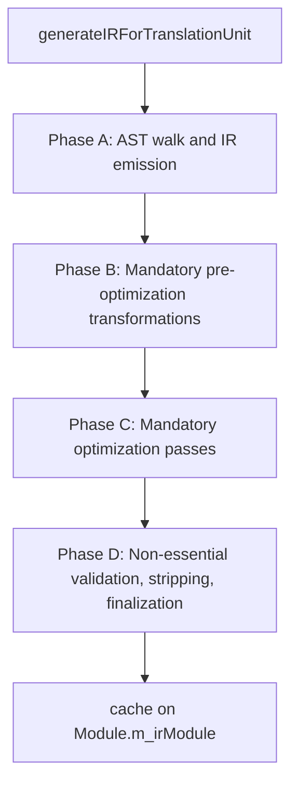
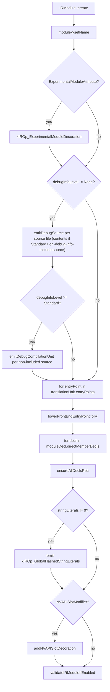
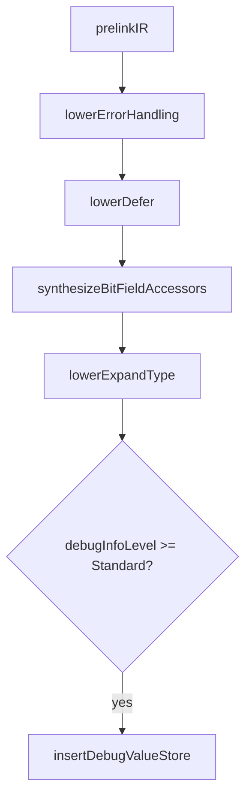
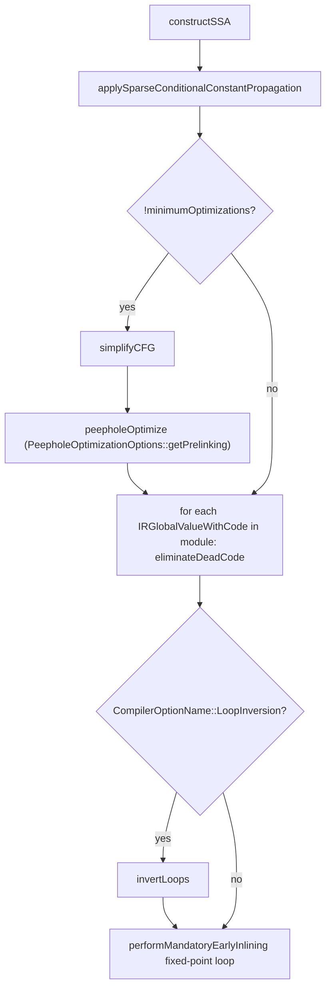
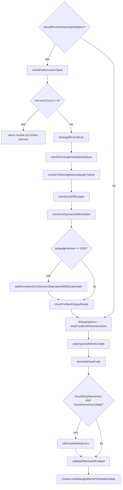
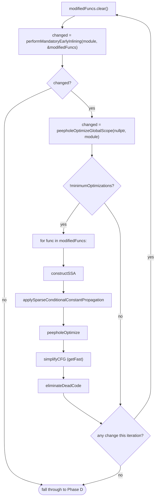

# Pre-link mandatory passes

This page documents the ordered IR-pass sequence that runs inside
`generateIRForTranslationUnit` in
[slang-lower-to-ir.cpp](../../../../source/slang/slang-lower-to-ir.cpp)
**before** the per-translation-unit IR module is cached on the
`Module` and pulled into `linkAndOptimizeIR` by `linkIR`. The
intended reader is a compiler developer who needs to find where in
the pre-link pipeline a particular pass runs, why it runs there, and
how it interacts with the mandatory-early-inlining loop. The
pipeline is **target-agnostic**: the same passes run for every
shader target. The post-link, per-target pass sequence is documented
under [../target-pipelines/](../target-pipelines).

The calls in this region are plain function calls of the form
`passName(module)` or `passName(module, sink)` — they do **not**
use the `SLANG_PASS(...)` macro that wraps the post-link passes in
[slang-emit.cpp](../../../../source/slang/slang-emit.cpp).

## Source

- [slang-lower-to-ir.cpp](../../../../source/slang/slang-lower-to-ir.cpp)
  — `generateIRForTranslationUnit` (line 15386) is the orchestrator.
  The function is invoked once per `TranslationUnitRequest`, from
  `FrontEndCompileRequest::generateIR` in
  [slang-compile-request.cpp](../../../../source/slang/slang-compile-request.cpp)
  for the translation units of a front-end request, and from the
  imported-module loading path in
  [slang-session.cpp](../../../../source/slang/slang-session.cpp);
  its result is cached on `Module::m_irModule`.
- [slang-ir-link.h](../../../../source/slang/slang-ir-link.h)
  (line 35) / [slang-ir-link.cpp](../../../../source/slang/slang-ir-link.cpp)
  (line 2589) — declare and define `prelinkIR`, which pulls in the
  `externalSymbolsToPrelink` set — the `[unsafeForceInlineEarly]`
  functions reached from other modules — so the mandatory passes
  below can simplify them in-place.
- [slang-ir-lower-error-handling.h](../../../../source/slang/slang-ir-lower-error-handling.h)
  / [slang-ir-lower-defer.h](../../../../source/slang/slang-ir-lower-defer.h)
  / [slang-ir-bit-field-accessors.h](../../../../source/slang/slang-ir-bit-field-accessors.h)
  / [slang-ir-lower-expand-type.h](../../../../source/slang/slang-ir-lower-expand-type.h)
  / [slang-ir-insert-debug-value-store.h](../../../../source/slang/slang-ir-insert-debug-value-store.h)
  — the Phase B lowering passes.
- [slang-ir-ssa.h](../../../../source/slang/slang-ir-ssa.h)
  / [slang-ir-simplify-cfg.h](../../../../source/slang/slang-ir-simplify-cfg.h)
  / [slang-ir-peephole.h](../../../../source/slang/slang-ir-peephole.h)
  / [slang-ir-inline.h](../../../../source/slang/slang-ir-inline.h)
  / [slang-ir-strip.h](../../../../source/slang/slang-ir-strip.h)
  — the Phase C / Phase D core analyses, simplifications, and
  stripping passes.
- [slang-compiler-options.h](../../../../source/slang/slang-compiler-options.h)
  — declares the `CompilerOptionName` toggles that gate
  conditional steps below.

## High-level phase diagram

```mermaid
flowchart TD
  entry[generateIRForTranslationUnit]
  entry --> phaseA["Phase A: AST walk and IR emission"]
  phaseA --> phaseB["Phase B: Mandatory pre-optimization transformations"]
  phaseB --> phaseC["Phase C: Mandatory optimization passes"]
  phaseC --> phaseD["Phase D: Non-essential validation, stripping, finalization"]
  phaseD --> cache["cache on Module.m_irModule"]
```

All four `Phase *` nodes live in the body of
`generateIRForTranslationUnit`. The function is called once per
translation unit; the cached `IRModule` returned by Phase D is the
input to `linkIR` (and from there `linkAndOptimizeIR`) later, once
the program is composed for a specific target.

## Phase A: AST walk and IR emission

Spans lines 15408-15522 of
[slang-lower-to-ir.cpp](../../../../source/slang/slang-lower-to-ir.cpp).
This phase creates a fresh `IRModule`, optionally attaches
`kIROp_ExperimentalModuleDecoration` and per-source `DebugSource`
instructions, lowers every entry point, walks every member of the
module declaration, attaches the global hashed-string-literal
aggregate, and (when present) the NVAPI slot decoration.

```mermaid
flowchart TD
  mc[IRModule::create]
  setName[module->setName]
  expGate{ExperimentalModuleAttribute?}
  expDec["kIROp_ExperimentalModuleDecoration"]
  diGate{"debugInfoLevel != None?"}
  emitDS["emitDebugSource per source file (contents if Standard+ or -debug-info-include-source)"]
  stdGate{"debugInfoLevel >= Standard?"}
  emitDCU["emitDebugCompilationUnit per non-included source"]
  epLoop["for entryPoint in translationUnit.entryPoints"]
  lfeep[lowerFrontEndEntryPointToIR]
  declLoop["for decl in moduleDecl.directMemberDecls"]
  eadr[ensureAllDeclsRec]
  slGate{stringLiterals != 0?}
  ghsl["emit kIROp_GlobalHashedStringLiterals"]
  nvGate{NVAPISlotModifier?}
  nvDec[addNVAPISlotDecoration]
  vMod[validateIRModuleIfEnabled]

  mc --> setName --> expGate
  expGate -- yes --> expDec --> diGate
  expGate -- no --> diGate
  diGate -- yes --> emitDS --> stdGate
  stdGate -- yes --> emitDCU --> epLoop
  stdGate -- no --> epLoop
  diGate -- no --> epLoop
  epLoop --> lfeep --> declLoop
  declLoop --> eadr --> slGate
  slGate -- yes --> ghsl --> nvGate
  slGate -- no --> nvGate
  nvGate -- yes --> nvDec --> vMod
  nvGate -- no --> vMod
```

| # | Pass | File | Gate | Notes |
|---|---|---|---|---|
| A1 | `IRModule::create(session)` (line 15408) | [slang-ir.cpp](../../../../source/slang/slang-ir.cpp) (line 5051) | always | Creates the empty module that the rest of the pipeline mutates. |
| A2 | `module->setName(moduleDecl->getName())` | [slang-ir.h](../../../../source/slang/slang-ir.h) (line 2208, inline) | always | Records the module's source-level name. |
| A3 | `addDecoration(moduleInst, kIROp_ExperimentalModuleDecoration)` | [slang-ir-insts.h](../../../../source/slang/slang-ir-insts.h) (line 4662, inline) | `moduleDecl->findModifier<ExperimentalModuleAttribute>()` | Marks the module as experimental. |
| A4 | `emitDebugSource(...)` per source file (line 15443) | [slang-ir.cpp](../../../../source/slang/slang-ir.cpp) (line 3535) | `debugInfoLevel != None` | Embeds the most-unique-identity path for every source file. The source *text* is carried only when `debugInfoLevel >= Standard` **or** `shouldIncludeSourceInDebugInfo()` is set; see the note below. |
| A5 | `emitDebugCompilationUnit(debugSource)` per non-included source | [slang-ir.cpp](../../../../source/slang/slang-ir.cpp) (line 3553) | `debugInfoLevel >= Standard` and `!source->isIncludedFile()` | Makes the IR the source of truth for which files are compilation units, removing the need for heuristics during SPIR-V emit. |
| A6 | `lowerFrontEndEntryPointToIR(...)` per entry point | [slang-lower-to-ir.cpp](../../../../source/slang/slang-lower-to-ir.cpp) | always | Establishes the entry-point `IRFunc` skeleton before the full decl walk so it can be referenced by later decls. |
| A7 | `ensureAllDeclsRec(context, decl)` per direct module-decl member | [slang-lower-to-ir.cpp](../../../../source/slang/slang-lower-to-ir.cpp) | always | Walks the declaration tree and lowers every public/exported symbol. |
| A8 | `emitIntrinsicInst(VoidType, kIROp_GlobalHashedStringLiterals, ...)` (line 15492) | [slang-ir.cpp](../../../../source/slang/slang-ir.cpp) (line 4136) | `sharedContext->m_stringLiterals.getCount() != 0` | Single aggregate inst that holds every hashed string literal observed during lowering. |
| A9 | `addNVAPISlotDecoration(moduleInst, registerName, spaceName)` | [slang-ir-insts.h](../../../../source/slang/slang-ir-insts.h) (line 5251) | `moduleDecl->findModifier<NVAPISlotModifier>()` | Module-level NVAPI register/space binding. |
| A10 | `validateIRModuleIfEnabled(compileRequest, module)` (line 15522) | [slang-ir-validate.cpp](../../../../source/slang/slang-ir-validate.cpp) (line 435) | always (no-op unless validation is enabled at the compiler-option level) | Closes Phase A with a structural sanity check on the freshly emitted IR. |

Two details of A4 are worth calling out. First, the debug-source
loop is the only place in the pre-link pipeline that reads the
`DebugInfoIncludeSource` option: line 15436 caches
`linkage->m_optionSet.shouldIncludeSourceInDebugInfo()` into a local
`includeSource`, and line 15445 embeds `source->getContent()` when
either `debugInfoLevel >= DebugInfoLevel::Standard` **or**
`includeSource` holds. That means `-debug-info-include-source` lets a
`Minimal`-level build carry full source text into each
`IRDebugSource` (so the SPIR-V emitter can write it out via core
`OpSource`) without promoting the whole debug-info level. The
accessor is declared in
[slang-compiler-options.h](../../../../source/slang/slang-compiler-options.h)
line 380. Second, every `IRDebugSource` produced here is recorded in
`context->shared->mapSourceFileToDebugSourceInst`, which later
per-decl lowering consults rather than re-emitting.

The `#if 0` block at line 15509 (a `dumpIR(module, ..., "GENERATED", ...)`
call) is intentionally disabled in production builds; flip it for
debugging the pre-mandatory IR shape.

## Phase B: Mandatory pre-optimization transformations

Spans lines 15544-15570. The block comment at lines 15524-15534
states the dual purpose: simplify the IR ahead of backend
compilation (and ahead of module serialization, so the effort is
amortized across every entry point that uses the module), **and**
establish the dataflow invariants the non-essential validators in
Phase D rely on.

```mermaid
flowchart TD
  pl[prelinkIR]
  leh[lowerErrorHandling]
  ld[lowerDefer]
  sbf[synthesizeBitFieldAccessors]
  let[lowerExpandType]
  diGate{"debugInfoLevel >= Standard?"}
  idvs[insertDebugValueStore]

  pl --> leh --> ld --> sbf --> let --> diGate
  diGate -- yes --> idvs
```

| # | Pass | File | Gate | Notes |
|---|---|---|---|---|
| B1 | `prelinkIR(translationUnit->module, module, externalSymbolsToPrelink)` (line 15544) | [slang-ir-link.cpp](../../../../source/slang/slang-ir-link.cpp) (line 2589) | always | Imports the bodies of the cross-module `[unsafeForceInlineEarly]` functions collected in `externalSymbolsToPrelink` so later passes can inline and simplify them. Distinct from the post-link `linkIR` driven by `linkAndOptimizeIR`. |
| B2 | `lowerErrorHandling(module, sink)` | [slang-ir-lower-error-handling.cpp](../../../../source/slang/slang-ir-lower-error-handling.cpp) | always | Rewrites throwing functions to return `Result<T,E>`; translates `tryCall` into `call` + `ifElse`. |
| B3 | `lowerDefer(module, sink)` | [slang-ir-lower-defer.cpp](../../../../source/slang/slang-ir-lower-defer.cpp) | always | Lowers the `defer` statement so later passes can assume linear control flow. |
| B4 | `synthesizeBitFieldAccessors(module)` | [slang-ir-bit-field-accessors.cpp](../../../../source/slang/slang-ir-bit-field-accessors.cpp) | always | Synthesizes get/set bodies for bit-field accessors. Intentionally placed before the inlining loop in Phase C so those bodies can be inlined and simplified. |
| B5 | `lowerExpandType(module)` | [slang-ir-lower-expand-type.cpp](../../../../source/slang/slang-ir-lower-expand-type.cpp) | always | Rewrites `IRExpandType` so the pattern type is nested under `IRExpand`, unifying variadic-generics specialization for both type-level and value-level expansion. |
| B6 | `insertDebugValueStore(debugValueContext, module)` | [slang-ir-insert-debug-value-store.cpp](../../../../source/slang/slang-ir-insert-debug-value-store.cpp) | `debugInfoLevel >= Standard` | Emits `DebugValue` insts that bind locals to their abstract debug variables. |

## Phase C: Mandatory optimization passes

Spans lines 15577-15657. This phase establishes SSA,
constant-propagates with `applySparseConditionalConstantPropagation`,
performs an optional CFG simplification + peephole pair (gated on
`!minimumOptimizations`), runs a per-function DCE sweep, optionally
runs `invertLoops`, and finally enters the
`performMandatoryEarlyInlining` fixed-point loop.

```mermaid
flowchart TD
  cssa[constructSSA]
  sccp[applySparseConditionalConstantPropagation]
  minOptGate{"!minimumOptimizations?"}
  cfg[simplifyCFG]
  peep["peepholeOptimize (PeepholeOptimizationOptions::getPrelinking)"]
  dceLoop["for each IRGlobalValueWithCode in module: eliminateDeadCode"]
  liGate{"CompilerOptionName::LoopInversion?"}
  inv[invertLoops]
  inlineLoop["performMandatoryEarlyInlining fixed-point loop"]

  cssa --> sccp --> minOptGate
  minOptGate -- yes --> cfg --> peep --> dceLoop
  minOptGate -- no --> dceLoop
  dceLoop --> liGate
  liGate -- yes --> inv --> inlineLoop
  liGate -- no --> inlineLoop
```

| # | Pass | File | Gate | Notes |
|---|---|---|---|---|
| C1 | `constructSSA(module)` | [slang-ir-ssa.cpp](../../../../source/slang/slang-ir-ssa.cpp) | always | Promotes addressable locals to SSA temporaries module-wide. |
| C2 | `applySparseConditionalConstantPropagation(module, nullptr, sink)` | [slang-ir-sccp.cpp](../../../../source/slang/slang-ir-sccp.cpp) | always | SCCP over the freshly constructed SSA. |
| C3 | `simplifyCFG(module, CFGSimplificationOptions::getDefault())` | [slang-ir-simplify-cfg.cpp](../../../../source/slang/slang-ir-simplify-cfg.cpp) | `!minimumOptimizations` | Removes empty/unreachable blocks. |
| C4 | `peepholeOptimize(nullptr, module, getPrelinking())` | [slang-ir-peephole.cpp](../../../../source/slang/slang-ir-peephole.cpp) | `!minimumOptimizations` | The pre-linking peephole subset; full peephole runs post-link. |
| C5 | per-function `eliminateDeadCode(func, dceOptions)` (lines 15593-15597) | [slang-ir-dce.cpp](../../../../source/slang/slang-ir-dce.cpp) | always | One pass over every `IRGlobalValueWithCode` in `module->getGlobalInsts()`, with `keepExportsAlive`, `keepLayoutsAlive`, `useFastAnalysis` all set (lines 15588-15591). |
| C6 | `invertLoops(module)` | [slang-ir-loop-inversion.cpp](../../../../source/slang/slang-ir-loop-inversion.cpp) | `CompilerOptionName::LoopInversion` | Moves loop condition checks to the end of the loop and wraps the loop in an outer `if`, so SCCP can recognize loops that always execute at least once. |
| C7 | `performMandatoryEarlyInlining` fixed-point loop (lines 15632-15658) | [slang-ir-inline.cpp](../../../../source/slang/slang-ir-inline.cpp) (line 1020) | always (loop body) | Called as `performMandatoryEarlyInlining(module, &modifiedFuncs.getHashSet())`. Documented under [Loops in the pipeline](#loops-in-the-pipeline). Honors `[unsafeForceInlineEarly]` as a hard requirement, not a hint. |

C5 iterates over functions but not over passes; treat it as one
step in the pipeline whose effect happens to be per-function. The
`dceOptions` used here (`keepExportsAlive = true`,
`keepLayoutsAlive = true`, `useFastAnalysis = true`) are the same
options reused inside the Phase D stripping block and inside the
inlining loop.

## Phase D: Non-essential validation, stripping, and finalization

Spans lines 15660-15777. Phase D first runs a block of
optional dataflow validators (gated on
`shouldRunNonEssentialValidation`), then strips front-end-only
decorations (with an obfuscation sub-gate that also requests a
source map), runs a final structural validation, and builds the
mangled-name → global-inst map used by the post-link `linkIR`.

```mermaid
flowchart TD
  neGate{"shouldRunNonEssentialValidation?"}
  crt[checkForRecursiveTypes]
  errGate{"sink.errorCount != 0?"}
  earlyExit["return module (no further passes)"]
  pce[propagateConstExpr]
  cuv[checkForUsingUninitializedValues]
  cmr["checkForMissingReturns(target=None)"]
  cau[checkAutoDiffUsages]
  cso[checkForOperatorShiftOverflow]
  lv2025{"languageVersion >= 2025?"}
  adge[addDecorationsForGenericsSpecializedWithExistentials]
  cmor[checkForMeshOutputReads]
  strip["IRStripOptions + stripFrontEndOnlyInstructions"]
  siwt[stripImportedWitnessTable]
  dceFinal[eliminateDeadCode]
  obGate{"shouldStripNameHints AND shouldHaveSourceMap?"}
  obfs[obfuscateModuleLocs]
  vMod[validateIRModuleIfEnabled]
  bmn[module.buildMangledNameToGlobalInstMap]

  neGate -- yes --> crt --> errGate
  errGate -- yes --> earlyExit
  errGate -- no --> pce --> cuv --> cmr --> cau --> cso --> lv2025
  lv2025 -- yes --> adge --> cmor
  lv2025 -- no --> cmor
  cmor --> strip
  neGate -- no --> strip
  strip --> siwt --> dceFinal --> obGate
  obGate -- yes --> obfs --> vMod
  obGate -- no --> vMod
  vMod --> bmn
```

| # | Pass | File | Gate | Notes |
|---|---|---|---|---|
| D1 | `checkForRecursiveTypes(module, sink)` | [slang-ir-check-recursion.cpp](../../../../source/slang/slang-ir-check-recursion.cpp) | `shouldRunNonEssentialValidation` | Disallows recursive type definitions. |
| D2 | early return on error (lines 15665-15666) | [slang-lower-to-ir.cpp](../../../../source/slang/slang-lower-to-ir.cpp) | `sink->getErrorCount() != 0` | If D1 (or any earlier diagnostic) raised an error, Phase D exits before propagation and the later passes. |
| D3 | `propagateConstExpr(module, sink)` | [slang-ir-constexpr.cpp](../../../../source/slang/slang-ir-constexpr.cpp) | `shouldRunNonEssentialValidation` | Propagates `constexpr`-ness through the dataflow and call graph. |
| D4 | `checkForUsingUninitializedValues(module, sink)` | [slang-ir-use-uninitialized-values.cpp](../../../../source/slang/slang-ir-use-uninitialized-values.cpp) | `shouldRunNonEssentialValidation` | Dataflow check that requires SSA + SCCP from Phase C. |
| D5 | `checkForMissingReturns(module, sink, CodeGenTarget::None, true)` | [slang-ir-missing-return.cpp](../../../../source/slang/slang-ir-missing-return.cpp) | `shouldRunNonEssentialValidation` | Note `target=None`: pre-link this is target-agnostic; later passes may re-run target-aware variants. |
| D6 | `checkAutoDiffUsages(module, sink)` | [slang-ir-check-differentiability.cpp](../../../../source/slang/slang-ir-check-differentiability.cpp) | `shouldRunNonEssentialValidation` | Validates bodies of `[Differentiable]` functions. |
| D7 | `checkForOperatorShiftOverflow(module, sink)` | [slang-ir-operator-shift-overflow.cpp](../../../../source/slang/slang-ir-operator-shift-overflow.cpp) | `shouldRunNonEssentialValidation` | Flags shift counts that exceed the operand width. |
| D8 | `addDecorationsForGenericsSpecializedWithExistentials(module, sink)` | [slang-ir-check-specialize-generic-with-existential.cpp](../../../../source/slang/slang-ir-check-specialize-generic-with-existential.cpp) | `shouldRunNonEssentialValidation` and `languageVersion >= 2025` | Slang 2025+ disallows specializing a generic with an existential type; this pass adds the diagnostic-bearing decoration. |
| D9 | `checkForMeshOutputReads(module, sink)` | [slang-ir-mesh-output-reads.cpp](../../../../source/slang/slang-ir-mesh-output-reads.cpp) | `shouldRunNonEssentialValidation` | Reading from mesh-shader outputs is not allowed. |
| D10 | `stripFrontEndOnlyInstructions(module, stripOptions)` (line 15730) | [slang-ir-strip.cpp](../../../../source/slang/slang-ir-strip.cpp) (line 50) | always | `stripOptions.shouldStripNameHints = shouldObfuscateCode()` (line 15720); `stripSourceLocs = false` (line 15729 — the obfuscation pass below produces new locs). |
| D11 | `stripImportedWitnessTable(module)` | [slang-ir-strip.cpp](../../../../source/slang/slang-ir-strip.cpp) (line 55) | always | For every global witness table (or generic returning one) that carries `IRImportDecoration`, removes the *nested* witness tables held directly as its children; the table's other entries are left in place. |
| D12 | `eliminateDeadCode(module, dceOptions)` | [slang-ir-dce.cpp](../../../../source/slang/slang-ir-dce.cpp) | always | Cleans up everything orphaned by D10/D11, keeping exports and layouts. |
| D13 | `obfuscateModuleLocs(module, sourceManager)` | [slang-ir-obfuscate-loc.cpp](../../../../source/slang/slang-ir-obfuscate-loc.cpp) | `stripOptions.shouldStripNameHints && shouldHaveSourceMap()` | Generates obfuscated source locations and the matching source map. |
| D14 | `validateIRModuleIfEnabled(compileRequest, module)` (line 15761) | [slang-ir-validate.cpp](../../../../source/slang/slang-ir-validate.cpp) (line 435) | always | Structural sanity check after stripping. |
| D15 | `module->buildMangledNameToGlobalInstMap()` (line 15777) | [slang-ir.cpp](../../../../source/slang/slang-ir.cpp) (line 5161) | always | Builds the lookup index `linkIR` later needs. |

Note that the `if (compileRequest->optionSet.shouldDumpIR())` block
between D14 and D15 (lines 15765-15775, tagged `"LOWER-TO-IR"`) is an
optional dump, not a pipeline step; it does not mutate the module.

## Conditional gates

### Option-set toggles

| Toggle | Accessor | Gates |
|---|---|---|
| Minimum optimizations | `linkage->m_optionSet.shouldPerformMinimumOptimizations()` | C3, C4, and the inner per-modified-function simplification cluster inside the Phase C inlining loop. |
| Non-essential validation | `linkage->m_optionSet.shouldRunNonEssentialValidation()` | D1, D3-D9. |
| Obfuscation | `linkage->m_optionSet.shouldObfuscateCode()` | The `shouldStripNameHints` flag in D10 and (with `shouldHaveSourceMap()`) D13. |
| Source map | `linkage->m_optionSet.shouldHaveSourceMap()` | D13 (only when `shouldStripNameHints` is also true). |
| Loop inversion | `linkage->m_optionSet.getBoolOption(CompilerOptionName::LoopInversion)` | C6. |
| Trace coverage | `linkage->m_optionSet.getBoolOption(CompilerOptionName::TraceCoverage)` | Sets `context->traceCoverage`; does **not** directly gate a pass in this pipeline, but propagates into per-decl lowering inside A6/A7. |
| Trace function coverage | `linkage->m_optionSet.getBoolOption(CompilerOptionName::TraceFunctionCoverage)` | Sets `context->traceFunctionCoverage`; like `TraceCoverage`, it influences per-decl lowering (function-entry counters) rather than gating a pass here. |
| Trace branch coverage | `linkage->m_optionSet.getBoolOption(CompilerOptionName::TraceBranchCoverage)` | Sets `context->traceBranchCoverage`; influences per-decl lowering (per-branch-arm counters) rather than gating a pass here. |
| Debug info | `linkage->m_optionSet.getDebugInfoLevel()` | A4 (any level above `None`), A5 (`Standard` or higher), B6 (`Standard` or higher). The level is cached once on `context->debugInfoLevel` at line 15416 and every gate below reads that field. |
| Include source in debug info | `linkage->m_optionSet.shouldIncludeSourceInDebugInfo()`, i.e. `getBoolOption(CompilerOptionName::DebugInfoIncludeSource)` | Not a pass gate: it widens A4 so that `IRDebugSource` carries the source *text* even at `Minimal` debug-info level. It does **not** enable A4 on its own — `debugInfoLevel != None` is still required. |

### Context predicates

| Predicate | Effect |
|---|---|
| `sink->getErrorCount() != 0` | D2 — Phase D returns early if any earlier diagnostic raised an error. |
| `moduleDecl->findModifier<ExperimentalModuleAttribute>()` | Adds `kIROp_ExperimentalModuleDecoration` (A3). |
| `moduleDecl->findModifier<NVAPISlotModifier>()` | Adds the NVAPI slot decoration (A9). |

### Per-translation-unit predicates

| Predicate | Effect |
|---|---|
| `moduleDecl->languageVersion >= SlangLanguageVersion::SLANG_LANGUAGE_VERSION_2025` | Gates D8 (`addDecorationsForGenericsSpecializedWithExistentials`). |

## Loops in the pipeline

The pre-link pipeline contains **exactly one** pass-level loop:
the unbounded `for(;;)` `performMandatoryEarlyInlining` fixed point
at lines 15632-15658. There is no iteration count cap; termination
depends entirely on the passes reporting no further change.

```mermaid
flowchart TD
  start["modifiedFuncs.clear()"]
  pmei["changed = performMandatoryEarlyInlining(module, &modifiedFuncs)"]
  changedGate{changed?}
  pogs["changed = peepholeOptimizeGlobalScope(nullptr, module)"]
  minOptGate{"!minimumOptimizations?"}
  funcLoop["for func in modifiedFuncs:"]
  fcssa[constructSSA]
  fsccp[applySparseConditionalConstantPropagation]
  fpeep[peepholeOptimize]
  fcfg["simplifyCFG (getFast)"]
  fdce[eliminateDeadCode]
  endGate{any change this iteration?}
  done([fall through to Phase D])

  start --> pmei --> changedGate
  changedGate -- no --> done
  changedGate -- yes --> pogs --> minOptGate
  minOptGate -- yes --> funcLoop --> fcssa --> fsccp --> fpeep --> fcfg --> fdce --> endGate
  minOptGate -- no --> endGate
  endGate -- yes --> start
  endGate -- no --> done
```

The outer `for(;;)` reuses a single `changed` flag.
`performMandatoryEarlyInlining` sets it first; if inlining reports
`false`, the `if (changed)` block is skipped and the loop breaks
immediately. If inlining reports `true`, `changed` is then
**overwritten** by the `peepholeOptimizeGlobalScope` result — the
inlining `true` is not carried directly into the termination
test — and, when `!minimumOptimizations`, the per-modified-function
cluster (`constructSSA` → `applySparseConditionalConstantPropagation`
→ `peepholeOptimize` → `simplifyCFG` with `getFast()`) OR-assigns
its results into `changed` (the trailing `eliminateDeadCode` call
does not). The loop breaks once this final `changed` value is
`false`.

The per-function DCE sweep at C5 (lines 15593-15597) iterates over
functions but not over passes — it is one pipeline step whose
effect happens to be per-function, not a loop in the pipeline
sense. The same applies to A6 (`lowerFrontEndEntryPointToIR` per
entry point) and A7 (`ensureAllDeclsRec` per module-decl member):
they are per-element iterations of a single pipeline step.

## Notable passes

### `prelinkIR`

Lives at line 2589 of
[slang-ir-link.cpp](../../../../source/slang/slang-ir-link.cpp).
Despite the name, it is **not** the same as the post-link
`linkIR` (line 2155 of the same file). `prelinkIR` runs once per
translation unit, before optimization, and its entire work list is
the `externalSymbolsToPrelink` list it is handed. That list has
exactly one producer: `lowerFuncDeclInContext` at line 13784 of
[slang-lower-to-ir.cpp](../../../../source/slang/slang-lower-to-ir.cpp)
adds the imported `IRFunc` (line 13811) whenever it is about to lower
a decl that is both in a different module and
`[__unsafeForceInlineEarly]`, as decided by `isDeclInDifferentModule`
and `isForceInlineEarly` at line 13791. So `[unsafeForceInlineEarly]` and
`externalSymbolsToPrelink` are not two independent categories — the
list *is* the set of cross-module force-inline-early functions whose
bodies the mandatory-early-inlining loop in Phase C will need.

For each entry, `prelinkIR` looks up the same mangled name in the
current module, strips that placeholder's `IRLinkageDecoration`,
clones the imported definition in its place, and
`replaceUsesWith`es the placeholder (lines 2638-2661). The
placeholder is deliberately left parented in the module tree until
after `replaceUsesWith` so that insts nested inside it — for
example a `specialize` inside a generic's body that refers to the
generic itself — do not become orphaned mid-clone.

Cloning is shallow by default. `IRPrelinkContext::maybeCloneValue`
(line 2470) overrides the generic spec-context behavior so that a
`kIROp_Func` is cloned *with* its body only when it carries
`IRUnsafeForceInlineEarlyDecoration` (lines 2552-2563); every other
referenced symbol is cloned as a bodiless declaration marked
`[Import]`. That is what keeps prelink from transitively dragging in
an imported module's whole call graph.

`linkIR`, by contrast, runs inside `linkAndOptimizeIR`
(see [../target-pipelines/](../target-pipelines)) once the
program has been composed for a target, and pulls in every
referenced symbol from every imported module.

Before cloning, `prelinkIR` calls `_ensureLinkingInfo()` on every
stable input module (the current module's dependencies plus the
core modules), but **not** on `irModule` itself (lines 2613-2633) —
prelink mutates `irModule` by replacing declarations with cloned
definitions, and the per-module linking-info cache assumes the
module is frozen once built. The linking-info cache (a module-owned
acceleration structure built once per module) lets both `prelinkIR`
and `linkIR` look up exported symbols, global params, known
builtins, and per-target annotations without rescanning the global
instruction list or walking high-fanout use lists. It is a
performance cache only; it does not change which symbols are
imported.

#### Why prelink never prunes auto-diff artifacts

`IRSharedSpecContext` (line 45) carries an `isFinalCodegenLink`
flag (line 67) that is **false** for `prelinkIR` and set to `true`
only by `linkIR` (line 2225). The flag feeds
`canPruneAutodiffLinkArtifacts()` (line 84), which is
`isFinalCodegenLink && !useAutodiff`. Two clone-time decisions read
that predicate:

- `cloneAnnotations` (line 228) returns without cloning any
  module-scope `IRAnnotation` when pruning is allowed. Every
  `AnnotationKind` is differentiability-related, so the skip is
  wholesale; a `static_assert` on `AnnotationKind::CountOf` guards
  against a future non-autodiff kind being dropped silently.
- `shouldDeepCloneWitnessTable` (line 729) returns
  `!canPruneAutodiffLinkArtifacts()` for a witness table whose
  `IRKnownBuiltinDecoration` names a differentiable interface
  (`isDifferentiableInterfaceBuiltin` in
  [slang-ast-support-types.h](../../../../source/slang/slang-ast-support-types.h)
  line 259). Deep-cloning such a table drags the entire derivative
  closure of its concrete type through every downstream pass. The
  differentiable-interface arm is reached only after the
  unconditional keep-alive cases (user `export`, COM interface,
  dynamic-dispatch type conformance), which return `true` first
  because their entries can never be recovered on demand. Even when
  the arm does allow pruning, deferral is partial:
  `cloneWitnessTableImpl` still eagerly clones entries keyed by an
  `IRBuiltinRequirementKey` (`Differential`, `dzero`, `dadd`), which
  have no mangled name to defer on; only the mangled-name-keyed
  derivative methods are held back.

Because `prelinkIR` leaves `isFinalCodegenLink` false, both
decisions behave as if the program used auto-diff: prelink always
clones annotations and always deep-clones differentiable-interface
witness tables. This is deliberate. The module `prelinkIR` mutates
is the one cached on `Module::m_irModule`; it stays live past the
link, can be serialized (the core module is), and is reused for
every subsequent target and entry point, so it must remain complete
and self-consistent. Pruning is only sound in `linkIR`, whose output
is a throw-away per-target copy where deferred witness-table entries
can be cloned on demand by mangled name.

Note that `prelinkIR` still computes
`sharedContext.useAutodiff = doesModuleUseAutodiff(irModule)` at
line 2595, and `doesModuleUseAutodiff` (line 2119) is now a full
recursive walk of the module inst tree via `containsTranslateInst`
(line 2091) rather than a scan of module-scope insts only, because
an `IRTranslateBase` request cannot hoist out of a generic body it
depends on. Since `useAutodiff` is only ever read through
`canPruneAutodiffLinkArtifacts()`, and that predicate is
short-circuited to `false` by `isFinalCodegenLink` inside prelink,
the value prelink computes has no observable effect on prelink's
output.

### `lowerErrorHandling`

Lives at line 236 of
[slang-ir-lower-error-handling.cpp](../../../../source/slang/slang-ir-lower-error-handling.cpp).
Rewrites every throwing function so that it returns a
`Result<T,E>` value, and every `tryCall` so that it becomes an
ordinary `call` followed by an `ifElse` on the result tag. After
B2 the IR is free of `throw` / `tryCall` and downstream passes can
ignore error-handling shape entirely.

### `lowerDefer`

Lives at line 277 of
[slang-ir-lower-defer.cpp](../../../../source/slang/slang-ir-lower-defer.cpp),
and is declared with a precise contract in
[slang-ir-lower-defer.h](../../../../source/slang/slang-ir-lower-defer.h):
for each `IRDefer`, it duplicates the defer's child instructions to
the end of every dominated block whose terminator jumps somewhere the
defer does not dominate — that is, at every point where control
leaves the deferred region — and then removes all `IRDefer` insts.
Because it rewrites blocks, it invalidates cached analyses on each
function it touches. Running it here means no downstream pass has to
know that `IRDefer` exists.

### `synthesizeBitFieldAccessors`

Lives at line 163 of
[slang-ir-bit-field-accessors.cpp](../../../../source/slang/slang-ir-bit-field-accessors.cpp).
The accessor functions are intentionally placed **before** the
mandatory-early-inlining loop so the loop can inline them and the
inner simplification cluster can reduce the resulting shift/mask
sequences.

### `lowerExpandType`

Lives at line 146 of
[slang-ir-lower-expand-type.cpp](../../../../source/slang/slang-ir-lower-expand-type.cpp).
Rewrites `IRExpandType` so the pattern type is nested **inside**
`IRExpand` as its child, instead of being a same-level sibling.
This unifies the specialization logic for variadic generics at the
type and value level — only one specialization implementation
needs to understand `IRExpand`.

### `performMandatoryEarlyInlining` and the surrounding loop

Lives at line 1020 of
[slang-ir-inline.cpp](../../../../source/slang/slang-ir-inline.cpp).
Inlines every call to a function marked `[unsafeForceInlineEarly]`.
For shader authors this attribute is a **hard requirement**:
functions tagged with it must not survive the pre-link pipeline.
The loop exists because inlining one body can expose another
`[unsafeForceInlineEarly]` call inside, and because the inner
simplification cluster can produce new opportunities that further
inlining benefits from.

### `stripFrontEndOnlyInstructions`

Lives at line 50 of
[slang-ir-strip.cpp](../../../../source/slang/slang-ir-strip.cpp);
the decision is made by `_shouldStripInst` (line 11), which walks
the whole module inst tree. "Front-end-only" is a short, explicit
list: `IRHighLevelDeclDecoration` and `IRInParamProxyVarDecoration`
are always removed, and `IRNameHintDecoration` is removed only when
`options.shouldStripNameHints` is set. The pass can also clear every
`sourceLoc` when `options.stripSourceLocs` is set, but the pre-link
caller never asks for that (line 15729 sets it to `false`
unconditionally). The intent is documented by the comment at lines
15696-15710 of
[slang-lower-to-ir.cpp](../../../../source/slang/slang-lower-to-ir.cpp):
the mandatory passes use `IRHighLevelDeclDecoration` to point
diagnostics back at AST-level code, but letting that information
reach code generation would blur the layering, so it is dropped at
the phase boundary.

### `obfuscateModuleLocs`

Lives at line 64 of
[slang-ir-obfuscate-loc.cpp](../../../../source/slang/slang-ir-obfuscate-loc.cpp);
called at line 15747. Runs only when both `shouldObfuscateCode()` and
`shouldHaveSourceMap()` are true — that is, the user wants
obfuscated source locations **and** the ability to map them back
to actual source via a side-channel source map. This pre-link
stripping block sets `stripOptions.stripSourceLocs = false`
unconditionally, so locs are never stripped here; if obfuscation is
enabled without a source map, name hints are stripped but
`obfuscateModuleLocs` does not run and the original locs are left in
place.

### `module->buildMangledNameToGlobalInstMap`

Lives at line 5161 of
[slang-ir.cpp](../../../../source/slang/slang-ir.cpp) and is called
at line 15777, the very last statement before
`generateIRForTranslationUnit` returns the module for caching on
`Module::m_irModule`. The
lookup it builds is the index `linkIR` consumes to resolve cross-
module references during the post-link pipeline.

## Adjacent constructs

### `prelinkIR` and the link step

`prelinkIR` is named for the fact that it runs **before** the
mandatory optimization passes; it does not stand in for the
post-link `linkIR`. The two functions consume different inputs
(`prelinkIR` consumes the current translation unit plus the
`externalSymbolsToPrelink` set; `linkIR` consumes the composed
program's full module set) and run at different times in the
overall flow. They also differ in how much of what they touch they
are allowed to discard: `linkIR` announces itself as the final
code-generation link by setting
`IRSharedSpecContext::isFinalCodegenLink`, which licenses it to
prune auto-diff link artifacts from a program that never
differentiates, while `prelinkIR` leaves the flag false because its
output is the long-lived, potentially serialized module IR. See
[`prelinkIR`](#prelinkir) above for the mechanism.

### `SpecializedComponentTypeIRGenContext::process`

Lives at line 15783 of
[slang-lower-to-ir.cpp](../../../../source/slang/slang-lower-to-ir.cpp)
(its `process` method begins at line 15791, and the public entry
point `generateIRForSpecializedComponentType` at line 15920). This
routine builds a
small IR module for a
`SpecializedComponentType` that records how specialization
arguments bind to specialization parameters. It does **not** run
the mandatory-optimization passes documented on this page —
specialized-component modules carry only specialization bindings
and witness tables, and are designed to be linked in alongside
the per-translation-unit IR module before `linkAndOptimizeIR`
runs. The only step it shares with Phase D is
`module->buildMangledNameToGlobalInstMap()` (line 15821), which it
needs for the same reason: `linkIR` resolves cross-module references
by mangled name.

### `TargetProgram::createIRModuleForLayout`

Lives at line 16353 of
[slang-lower-to-ir.cpp](../../../../source/slang/slang-lower-to-ir.cpp).
It produces a separate, per-target IR module that carries target
layout metadata: import stubs for globals and entry points, the
`IRLayoutDecoration`s on those stubs and on the module instruction
together with the layout instructions they reference, and
capability decorations on the entry-point stubs that need them. It
contains no executable bodies, does **not** copy the executable IR,
and does **not** run the mandatory passes. See [04c-layout-ir.md](04c-layout-ir.md) for
the full deep dive.

## See also

- [03-semantic-check.md](03-semantic-check.md)
- [04-ast-to-ir.md](04-ast-to-ir.md)
- [05-ir-passes.md](05-ir-passes.md)
- [04c-layout-ir.md](04c-layout-ir.md)
- [../ir-reference/index.md](../ir-reference/index.md)
- [../target-pipelines/index.md](../target-pipelines/index.md)
