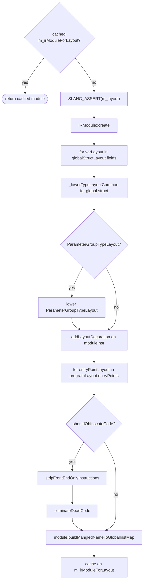

# Layout IR module construction

This page documents the **layout IR module** built by
`TargetProgram::createIRModuleForLayout`
([slang-lower-to-ir.cpp](../../../../source/slang/slang-lower-to-ir.cpp)
line ~15661). The layout IR module is a sibling of the
per-translation-unit executable IR module described in
[04-ast-to-ir.md](04-ast-to-ir.md); its only job is to carry
`IRLayoutDecoration`s on stub globals and entry-point functions for
**one specific target's** chosen layout rules. The intended reader
is a compiler developer or tools author who needs to understand
how Slang materializes layout information into IR form and what
guarantees this module does (and does not) provide.

## Source

- [slang-lower-to-ir.cpp](../../../../source/slang/slang-lower-to-ir.cpp)
  — `TargetProgram::createIRModuleForLayout` (line ~15661) is the
  constructor; the obfuscation gate is at line ~15810; the cache
  store is at line ~15827.
- [slang-target-program.h](../../../../source/slang/slang-target-program.h)
  — declares the cache field `m_irModuleForLayout` (line ~147),
  the lazy accessor `getOrCreateIRModuleForLayout` (line ~109),
  and the read-only peek `getExistingIRModuleForLayout`
  (line ~111).
- [slang-parameter-binding.cpp](../../../../source/slang/slang-parameter-binding.cpp)
  — produces the `ProgramLayout` instance (`m_layout`) that
  `createIRModuleForLayout` walks; the function asserts that
  `m_layout` is non-null before proceeding.

## Why this module exists

- Layout is **target-specific**. The same source program can have
  different binding numbers, register spaces, byte offsets, and
  entry-point parameter mappings for D3D11, D3D12, Vulkan, Metal,
  WebGPU, and CUDA.
- Carrying layout information **inside** an IR module makes it
  queryable by the reflection API and consumable by the linker,
  rather than requiring callers to hold a parallel
  `ProgramLayout` data structure alongside every IR module.
- Keeping it in a **separate** module avoids contaminating the
  per-translation-unit executable IR — which is cached on the
  `Module` and shared across all targets — with target-specific
  decoration that would otherwise have to be stripped per target.

## When it is built

- **Lazy.** The first call to
  `TargetProgram::getOrCreateIRModuleForLayout(sink)` on a
  `TargetProgram` instance builds the module and stores it on
  `m_irModuleForLayout`; subsequent calls return the cached
  reference (line 15663-15664).
- The caller must first ensure that `m_layout` (the
  `ProgramLayout`) has been computed; the function `SLANG_ASSERT`s
  that `m_layout` is non-null (line 15667) and then bails out with
  `nullptr` if it would somehow have been cleared (line 15670-15671).
- Built **after** semantic check, parameter binding, and per-module
  IR generation — that is, after all the
  [04-ast-to-ir.md](04-ast-to-ir.md) and
  [04b-pre-link-passes.md](04b-pre-link-passes.md) work has
  finished for every translation unit involved. It is **not** fed
  into `linkAndOptimizeIR`; it is consumed directly by reflection
  and by callers (such as the linker or downstream tools) that
  need a layout-decorated view of the program.

## Construction flow



## Per-global-parameter steps

For each `varLayout` in `globalStructLayout->fields` (lines
15708-15728 of `createIRModuleForLayout`):

| # | Step | Function | Notes |
|---|---|---|---|
| 1 | Materialize stub `IRGlobalVar` | `materialize(context, ensureDecl(context, varDecl.getDecl())).val` | Produces an `[import(...)]` stub when no definition is present in the layout-IR module. Fails with `SLANG_UNEXPECTED("unhandled value flavor")` if `materialize` returns null. |
| 2 | Lower the variable layout | `lowerVarLayout(context, varLayout)` | Produces an `IRVarLayout` instruction that encodes the per-variable layout (binding, space, byte offset, ...). |
| 3 | Attach `IRLayoutDecoration` | `builder->addLayoutDecoration(irVar, irLayout)` | The decoration is what makes the layout queryable on the stub. |
| 4 | Record in the global type-layout builder | `globalStructTypeLayoutBuilder.addField(irVar, irLayout)` | Feeds the module-level `IRStructTypeLayout` built right after the loop via `_lowerTypeLayoutCommon`. |

## Global-scope type layout

After the global-parameter loop, the function builds an
`IRStructTypeLayout` for the whole global scope:

```cpp
auto irGlobalStructTypeLayout =
    _lowerTypeLayoutCommon(&globalStructTypeLayoutBuilder, globalStructLayout);
```

When the global scope is wrapped in a parameter group (a constant
buffer or push-constant block), the module's layout decoration is
an `IRParameterGroupTypeLayout` rather than the raw struct layout
(lines 15735-15753). The parameter-group builder calls:

- `setContainerVarLayout(lowerVarLayout(context, paramGroupTypeLayout->containerVarLayout))`
- `setElementVarLayout(irElementVarLayout)` where
  `irElementVarLayout = lowerVarLayout(context, paramGroupTypeLayout->elementVarLayout, irElementTypeLayout)`
- `setOffsetElementTypeLayout(lowerTypeLayout(context, paramGroupTypeLayout->offsetElementTypeLayout))`

The result becomes `irGlobalScopeTypeLayout`, which is then
attached to the module instance via:

```cpp
builder->addLayoutDecoration(irModule->getModuleInst(), irGlobalScopeVarLayout);
```

## Per-entry-point steps

For each `entryPointLayout` in `programLayout->entryPoints` (lines
15763-15807):

| # | Step | Function | Notes |
|---|---|---|---|
| 1 | Skip if no AST | `if (!funcDeclRef) continue;` | Deserialized entry points have no AST-level information; the layout-IR module cannot synthesize a stub for them. |
| 2 | Skip unspecialized generics | `if (isUnspecializedGenericFuncDeclRef(funcDeclRef)) continue;` | Generic entry points without specialization arguments do not yet have a concrete layout. |
| 3 | Lower the function type | `lowerType(context, getFuncType(astBuilder, funcDeclRef))` | Produces an `IRFuncType`. |
| 4 | Materialize the stub function | `getSimpleVal(context, emitDeclRef(context, funcDeclRef, irFuncType))` | Produces an `IRFunc` skeleton; usually `[import(...)]`. |
| 5 | Attach import linkage if missing | `if (!irFunc->findDecoration<IRLinkageDecoration>()) builder->addImportDecoration(irFunc, mangledName)` | Wires the stub to its real implementation in the executable IR module by mangled name. |
| 6 | Forward capability atoms | iterate `inferredCapabilityRequirements` and call `builder->addRequireCapabilityAtomDecoration` for each atom in `[_spirv_1_0, latestSpirvAtom]` or `[metallib_2_3, latestMetalAtom]` | Lets the layout module advertise the SPIR-V / Metal capability set per entry point. Other targets do **not** get capability decorations on layout-module entry points (see [Caveats and gotchas](#caveats-and-gotchas)). |
| 7 | Lower the entry-point layout | `lowerEntryPointLayout(context, entryPointLayout)` | Produces an `IREntryPointLayout` that encodes parameter bindings and stage. |
| 8 | Attach `IRLayoutDecoration` | `builder->addLayoutDecoration(irFunc, irEntryPointLayout)` | The decoration the reflection API and the linker query. |

## Optional obfuscation pass

When `linkage->m_optionSet.shouldObfuscateCode()` is true (lines
15810-15826):

```cpp
IRStripOptions stripOptions;
stripOptions.shouldStripNameHints = true;
stripOptions.stripSourceLocs = true;

stripFrontEndOnlyInstructions(irModule, stripOptions);

IRDeadCodeEliminationOptions options;
options.keepExportsAlive = true;
options.keepLayoutsAlive = true;
eliminateDeadCode(irModule, options);
```

Note two differences from the executable-module strip block in
[04b-pre-link-passes.md](04b-pre-link-passes.md):

- `stripSourceLocs = true` (in 04b it is `false`, because the
  executable module needs locs preserved for the obfuscated source
  map). The layout module has no separate obfuscated source map of
  its own, so it strips locs outright.
- `shouldStripNameHints = true` unconditionally inside the gate (in
  04b it is `= shouldObfuscateCode()`, but here the entire block is
  already inside the `shouldObfuscateCode()` test).

The DCE options `keepExportsAlive = true` and
`keepLayoutsAlive = true` are essential — the `IRLayoutDecoration`s
just attached are what the rest of the program will query.

## What this module is not

- **Not** the per-module IR. The executable IR cached on
  `Module::m_irModule` is produced by `generateIRForTranslationUnit`
  (see [04b-pre-link-passes.md](04b-pre-link-passes.md)); the
  layout IR module is built separately by `createIRModuleForLayout`.
- **Not** fed into `linkAndOptimizeIR`. The post-link target
  legalization pipelines documented under
  [../target-pipelines/](../target-pipelines) consume the per-module
  IR, not the layout IR.
- **No function bodies for user-defined functions.** The entry-point
  `IRFunc` instances are stubs; their only purpose is to anchor an
  `IRLayoutDecoration` and (for SPIR-V / Metal) capability
  decorations.
- **No mandatory optimization passes.** The
  `constructSSA` → SCCP → CFG-simplify → peephole → DCE →
  early-inlining-loop sequence documented in
  [04b-pre-link-passes.md](04b-pre-link-passes.md) does **not** run
  here. The only post-construction work is the optional obfuscation
  block and `buildMangledNameToGlobalInstMap`.

## Cache and reuse

The result is cached on
`TargetProgram::m_irModuleForLayout`. A second call to
`getOrCreateIRModuleForLayout(sink)` for the same `TargetProgram`
returns the same module without re-running construction. Different
`TargetProgram` instances (one per target) build independent
layout IR modules, so a session compiling for both D3D12 and Vulkan
holds two independent layout IR modules in memory.

Use `getExistingIRModuleForLayout()` if you need to peek at the
cache without forcing construction (declared near line 111 of
[slang-target-program.h](../../../../source/slang/slang-target-program.h));
it returns `nullptr` when nothing has been built yet.

## Caveats and gotchas

- **Materialize failure is a hard error.** If `materialize` cannot
  produce a value for a global parameter the function calls
  `SLANG_UNEXPECTED("unhandled value flavor")` — a real failure
  mode if the per-module IR cache feeding the layout walk is
  corrupted or out of sync.
- **`m_layout` must be set.** Callers that bypass
  `getOrCreateIRModuleForLayout` and invoke
  `createIRModuleForLayout` directly will crash on the
  `SLANG_ASSERT(m_layout)` at line 15667 if the program layout has
  not been built.
- **Capability decorations are SPIR-V- and Metal-only.** The atom
  filter at lines 15796-15797
  (`atom >= _spirv_1_0 && atom <= latestSpirvAtom`,
  `atom >= metallib_2_3 && atom <= latestMetalAtom`) means HLSL,
  WGSL, and CUDA layout-module entry points do **not** carry
  capability decorations. Tools that rely on per-entry-point
  capability metadata for those targets need to consult the
  executable IR module or the AST-level inferred capability set
  directly.
- **`buildMangledNameToGlobalInstMap` runs unconditionally.** Even
  in the no-obfuscation path, the function ends with
  `irModule->buildMangledNameToGlobalInstMap()` (line 15827) so
  consumers always get a usable mangled-name index.

## See also

- [03-semantic-check.md](03-semantic-check.md)
- [04-ast-to-ir.md](04-ast-to-ir.md)
- [04b-pre-link-passes.md](04b-pre-link-passes.md)
- [../cross-cutting/targets.md](../cross-cutting/targets.md)
- [../ir-reference/index.md](../ir-reference/index.md)
- [../target-pipelines/index.md](../target-pipelines/index.md)
