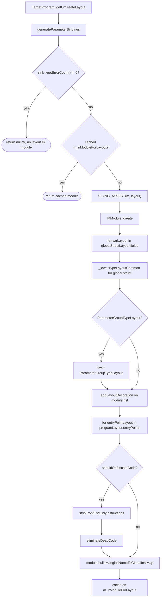

# Layout IR module construction

This page documents the **layout IR module** built by
`TargetProgram::createIRModuleForLayout`
([slang-lower-to-ir.cpp](../../../../source/slang/slang-lower-to-ir.cpp)
line 16353), together with the parameter-binding pass that computes
the `ProgramLayout` it consumes
([slang-parameter-binding.cpp](../../../../source/slang/slang-parameter-binding.cpp)).
The layout IR module is a sibling of the per-translation-unit
executable IR module described in
[04-ast-to-ir.md](04-ast-to-ir.md); its only job is to carry
`IRLayoutDecoration`s on stub globals and entry-point functions for
**one specific target's** chosen layout rules. The intended reader
is a compiler developer or tools author who needs to understand
how Slang assigns binding locations to shader parameters, how it
materializes the resulting layout into IR form, and what
guarantees this module does (and does not) provide.

Opcode-level detail for the `Layout`, `TypeLayout`, and `Attr` IR
families is **not** repeated here — see
[../ir-reference/metadata.md](../ir-reference/metadata.md), which
owns those families. This page covers the *target-independent*
layout-IR mechanism; per-target codegen behavior belongs to
[../target-pipelines/index.md](../target-pipelines/index.md), and
the capability/profile model belongs to
[../cross-cutting/targets.md](../cross-cutting/targets.md). The one
class of target-specific material that *is* covered here is the
Vulkan **binding model** (`vk::binding`,
`vk::input_attachment_index`), because that is parameter-binding
behavior rather than emit behavior.

## Source

- [slang-lower-to-ir.cpp](../../../../source/slang/slang-lower-to-ir.cpp)
  — `TargetProgram::createIRModuleForLayout` (line 16353) is the
  constructor; the global-parameter loop is at lines 16400-16420,
  the entry-point loop at 16455-16499, the obfuscation gate at
  16502-16518, and the cache store at 16520.
- [slang-target-program.h](../../../../source/slang/slang-target-program.h)
  — declares the lazy accessor `getOrCreateIRModuleForLayout`
  (line 102), the read-only peek `getExistingIRModuleForLayout`
  (line 104), the `private` constructor
  `createIRModuleForLayout` (line 119), and the cache field
  `m_irModuleForLayout` (line 140).
- [slang-parameter-binding.cpp](../../../../source/slang/slang-parameter-binding.cpp)
  — computes the `ProgramLayout` instance (`m_layout`) that
  `createIRModuleForLayout` walks.
  `generateParameterBindings(TargetProgram*, DiagnosticSink*)`
  (line 4453) is the entry point that returns the `ProgramLayout`;
  `TargetProgram::getOrCreateLayout` (line 4840) is what stores it
  in `m_layout` and then immediately drives
  `createIRModuleForLayout`. `createIRModuleForLayout` asserts that
  `m_layout` is non-null before proceeding.
- [slang-type-layout.cpp](../../../../source/slang/slang-type-layout.cpp)
  — computes the per-type `TypeLayout` objects that parameter
  binding assembles into a `ProgramLayout`. This file is **not**
  in the page's manifest `watched_paths`; see
  [Manifest coverage](#manifest-coverage).
- [slang-diagnostics.lua](../../../../source/slang/slang-diagnostics.lua)
  — owns the diagnostic definitions that parameter binding emits.
  (Diagnostics moved to this Lua definition file; the generated
  [slang-diagnostics.h](../../../../source/slang/slang-diagnostics.h)
  is no longer where new messages are declared.)

## Parameter binding: producing the `ProgramLayout`

`createIRModuleForLayout` is a *transcription* step: every binding
number, register space, and byte offset it writes into IR was
already decided by
[slang-parameter-binding.cpp](../../../../source/slang/slang-parameter-binding.cpp).
Understanding the layout IR module therefore requires knowing what
that pass guarantees.

`generateParameterBindings(TargetProgram*, DiagnosticSink*)`
(line 4453) drives the following ordered stages inside one
`ParameterBindingContext`:

| # | Stage | Anchor | What it does |
|---|---|---|---|
| 1 | Collect parameters | `collectParameters` (line 4506), then `collectSpecializationParams` (line 4516) | Builds the `sharedContext.parameters` list and the `programLayout->entryPoints` array; entry points are treated much like global parameters. |
| 2 | Reserve explicit global bindings | `_generateParameterBindings` (line 1587), called per parameter at line 4540 | Honors `register`/`vk::binding`/`layout(binding=)` on *global* parameters, recording them in the used-range sets before anything is auto-allocated. |
| 3 | Reserve explicit entry-point bindings | `addExplicitVkBindingsForEntryPointParameters` (line 1574), called at line 4544 | Added by PR #11712; see [Explicit `vk::binding` on entry-point parameters](#explicit-vkbinding-on-entry-point-parameters). |
| 4 | Decide whether a default space is needed | `_calcNeedsDefaultSpace` (line 4196), consumed at lines 4706-4707 | Determines whether descriptor set 0 must be reserved for implicitly-placed parameters. |
| 5 | Allocate the default space / constant buffer | `allocateUnusedSpaces` (line 855) at line 4740 | Claims the first unused space. |
| 6 | Complete the remaining bindings | `_completeBindings` (line 4092) at line 4765 | Auto-allocates every resource kind not already placed. |
| 7 | Place the bindless descriptor heap | lines 4809-4834, gated on the target implying `CapabilityName::descriptor_handle` | Scans upward for the first space not in `usedSpaces`, starting from the requested `-bindless-space-index`, and places the heap there. When that is not the requested space and the option was given explicitly, it warns with `Diagnostics::RequestedBindlessSpaceIndexUnavailable` — warning `39012`, "requested bindless space index '~requested' is unavailable, using the next available index '~available'." Either way `programLayout->bindlessSpaceIndex` is set to the space actually chosen. |

Two bookkeeping structures matter for reading the rest of this
section, because they are independent and are easy to conflate:

- **`usedSpaces`** — the set of whole descriptor sets / register
  spaces that are occupied. It is populated only by
  `markSpaceUsed` (line 850) and `allocateUnusedSpaces` (line 855),
  and it is what the bindless-heap and default-space logic consult.
- **the per-space used-range sets** (`usedResourceRanges`, indexed
  by `LayoutResourceKind`) — track occupied *index ranges within* a
  space, and drive overlap diagnostics. Recording a range does
  **not** mark the space used.

### Explicit `vk::binding` on entry-point parameters

Before PR #11712 (`c3037d220`), `[[vk::binding(binding, set)]]` on
an entry-point *parameter* was accepted by the parser and then
silently ignored by binding: the parameter received a positionally
defaulted binding. It is now honored on targets for which
`doesTargetSupportVkBindingOnEntryPointParameters` returns true —
defined in
[slang-type-layout.cpp](../../../../source/slang/slang-type-layout.cpp)
line 3370 as `isKhronosTarget(target) || isWGPUTarget(target)`,
i.e. SPIR-V/GLSL and WGSL. Every other target still ignores the
attribute in this position:

```slang
[numthreads(1, 1, 1)]
void main([[vk::binding(3, 1)]] uniform StructuredBuffer<int> inBuf) { }
```

For `-target spirv` `inBuf` is decorated `Binding 3` /
`DescriptorSet 1`; for `-target hlsl` the request is dropped and the
parameter is placed positionally as `register(t0)`, with the
ignored-attribute warning below reported against it.

The mechanism is a parallel completion path for entry points that
carry at least one honored annotation:

- `isVkBindingEntryPointParameterResourceKind` (line 1416) fixes
  the closed set of resource kinds an entry-point `vk::binding` can
  position: `DescriptorTableSlot` for a plain resource, buffer, or
  sampler, and `SubElementRegisterSpace` for a whole-space
  parameter such as a `ParameterBlock`.
- `findVkBindingEntryPointParameterResourceInfo` (line 1433)
  chooses which single resource info the annotation positions,
  preferring the descriptor slot; the register-space case applies
  only when there is no descriptor slot.
- `hasSupportedVkBindingOnEntryPointParameter` (line 1450)
  combines the target gate, the presence of the attribute, and the
  requirement that the parameter's type actually consumes a
  descriptor-shaped resource.
- `addExplicitVkBindingForEntryPointParameter` (line 1482)
  performs the reservation for one parameter. A `SubpassInput`
  consumes *two* kinds at once, so this function reserves both the
  descriptor slot and the `InputAttachmentIndex`.
- `entryPointHasSupportedVkBindingParameters` (line 1894) selects
  between the two completion paths at line 4003: entry points with
  an honored annotation go through
  `completeBindingsForEntryPointParameters` (line 1939), which
  completes parameter-by-parameter; all others take the ordinary
  aggregate `completeBindingsForParameter` path.
- Inside the per-parameter path,
  `removeNonExplicitEntryPointParameterDescriptorOffsets`
  (line 1914) drops the synthetic *field-relative* descriptor
  offsets so that implicit parameters get real bindings allocated
  from the global context, while
  `copyExistingBindingInfoFromParameter` (line 1841) re-seeds the
  already-reserved explicit bindings so completion does not
  overwrite them. Together these are what let one entry point mix
  explicitly- and implicitly-bound parameters.

The default-space calculation learned about this too:
`isEntryPointParameterResourceExplicitlyBoundByVkBinding`
(line 4132) and `allEntryPointParametersOfKindAreExplicitlyVkBound`
(line 4161) let `_calcNeedsDefaultSpace` subtract kinds that are
fully placed by explicit annotations, so an entry point whose
parameters are all explicitly bound no longer forces a default set.

Whether the annotation is *ignorable* is diagnosed separately, in
[slang-check-shader.cpp](../../../../source/slang/slang-check-shader.cpp):
`isVkBindingCompatibleEntryPointParameterType` (line 920) decides
which parameter types can have a binding placed at all, and
`Diagnostics::UnhandledModOnEntryPointParameter` (line 2341) —
warning `38010`, "modifier on entry point parameter is
unsupported" — still fires for the rest (for example a plain
varying scalar), and for programs where not every target in the
`Linkage` honors the attribute.

### `vk::input_attachment_index` and descriptor-space occupancy

A Vulkan input-attachment index is not a descriptor-set-bound
resource — it lowers to `OpDecorateInputAttachmentIndex` only,
never `OpDecorateDescriptorSet` — but the `semanticInfo.space` that
reaches the binding code for `LayoutResourceKind::InputAttachmentIndex`
is a hardcoded placeholder `0`, because the producers have no
descriptor set to supply. PR #11871 (`6a222eaf1`) corrected two
consumers that were treating that placeholder as a real request for
descriptor set 0:

- `addExplicitParameterBinding` (line 877) now skips
  `markSpaceUsed` for `InputAttachmentIndex` (the guard is at
  line 947). The index range is still recorded in the used-range
  set immediately afterwards (line 952), so overlap detection is
  unaffected: two parameters that ask for the same attachment index
  still draw `Diagnostics::ParameterBindingsOverlap` (line 986) —
  warning `39001`, "explicit binding overlap".

  ```slang
  float4 main(
      [[vk::binding(7, 3)]] [[vk::input_attachment_index(5)]] SubpassInput<float4> a,
      [[vk::binding(8, 3)]] [[vk::input_attachment_index(5)]] SubpassInput<float4> b)
      : SV_Target { return a.SubpassLoad() + b.SubpassLoad(); }
  ```

- `doesEntryPointParameterResourceNeedDefaultSpace` (line 4106)
  now returns `false` for `InputAttachmentIndex` (line 4124),
  alongside the sibling non-descriptor-space kinds
  `PushConstantBuffer`, `RegisterSpace`,
  `SubElementRegisterSpace`, `VaryingInput`, `VaryingOutput`,
  `HitAttributes`, and `RayPayload`. Every other kind falls through
  the `default:` arm and returns `true`.

The observable effect is that a `SubpassInput` entry-point
parameter no longer causes descriptor set 0 to be reported
unavailable to the bindless descriptor heap. The source comment at
lines 938-946 records that the exclusion is deliberately narrow:
`VaryingInput`/`VaryingOutput` (with `[[vk::location]]`) and
`SpecializationConstant` (with `[[vk::constant_id]]`) reach the
same branch with the same placeholder `space == 0` via
`addExplicitParameterBindings_GLSL` (line 1140) and share the
latent pattern, but widening the guard was left as a separate
change.

### Diagnosed failures during binding

Parameter binding can fail with diagnostics rather than producing a
`ProgramLayout`; in that case `getOrCreateLayout` returns `nullptr`
after checking `sink->getErrorCount()`, and **no layout IR module is
built**.

The newest such failure is ray-tracing entry-point parameters on
targets that have no layout rules for them. A layout rules family
returns `nullptr` from `getRayPayloadParameterRules`,
`getCallablePayloadParameterRules`, or
`getHitAttributesParameterRules` when the target does not support
that parameter kind. `processEntryPointVaryingParameter`
(line 2358) previously passed the null straight into
`createTypeLayoutWith`, which dereferences it — a segfault with no
diagnostic. PR #12280 (`c3791ed4e`) added three null checks (lines
2441, 2448, 2480) that instead call
`diagnoseUnsupportedRayTracingParameter` (line 2346), which emits
`Diagnostics::TargetDoesNotSupportRayTracingParameters` — error
`39032`, declared in
[slang-diagnostics.lua](../../../../source/slang/slang-diagnostics.lua)
with the message "the current compilation target does not support
ray tracing entry point parameters for the '~stage' stage". A
`SLANG_RELEASE_ASSERT(rules)` was also added at the top of
`createTypeLayoutWith` in
[slang-type-layout.cpp](../../../../source/slang/slang-type-layout.cpp)
as a backstop for any future null-rules caller.

The Metal, CPU, and LLVM layout-rules families return `nullptr` from
all three accessors, and the CUDA family from
`getCallablePayloadParameterRules` alone; the SPIR-V/GLSL,
HLSL/DXIL, and WGSL families supply all three. So this entry point
compiles for `-target spirv` but is rejected with error `39032` for
`-target metal` and `-target cpp`:

```slang
struct Payload { float4 color; }

[shader("miss")]
void main(inout Payload payload) { payload.color = float4(1, 0, 0, 1); }
```

Note that this is a *target*-limitation diagnostic, distinct from
the pre-existing stage-limitation diagnostics (for example the
`in`-only-callable case), because callable and hit stages do
support these parameters on SPIR-V, HLSL, and GLSL.

## Why this module exists

- Layout is **target-specific**. The same source program can have
  different binding numbers, register spaces, byte offsets, and
  entry-point parameter mappings for D3D11, D3D12, Vulkan, Metal,
  WebGPU, and CUDA.
- Carrying layout information **inside** an IR module makes it
  queryable by the reflection API and consumable by the linker,
  rather than requiring callers to hold a parallel
  `ProgramLayout` data structure alongside every IR module.
- Keeping it in a **separate** module avoids contaminating the
  per-translation-unit executable IR — which is cached on the
  `Module` and shared across all targets — with target-specific
  decoration that would otherwise have to be stripped per target.

## When it is built

- **Built together with the `ProgramLayout`, not separately.**
  `TargetProgram::getOrCreateLayout`
  ([slang-parameter-binding.cpp](../../../../source/slang/slang-parameter-binding.cpp)
  line 4840) computes `m_layout` via `generateParameterBindings`
  and then, in the same call, populates `m_irModuleForLayout`:

  ```cpp
  if (m_layout && !m_irModuleForLayout)
  {
      m_irModuleForLayout = createIRModuleForLayout(sink);
  }
  ```

  So *any* caller that asks for the program layout also pays for
  the layout IR module. `getOrCreateIRModuleForLayout`
  ([slang-lower-to-ir.cpp](../../../../source/slang/slang-lower-to-ir.cpp)
  line 15993) is a two-line wrapper that calls `getOrCreateLayout`
  and then returns the now-populated field; it does not itself
  invoke the constructor.
- **Nothing is built when binding failed.** `getOrCreateLayout`
  returns `nullptr` immediately after `generateParameterBindings`
  if `sink->getErrorCount() != 0`, before the
  `createIRModuleForLayout` call — so a program that hits, say, the
  ray-tracing-parameter diagnostic above never produces a layout IR
  module. The absence is directly observable: a `-dump-ir` run of
  such a program prints the `### LOWER-TO-IR:` block emitted at the
  end of `generateIRForTranslationUnit` (line 15800) and then stops,
  with no `EntryPointLayout(`, `structTypeLayout(` or `[layout(`
  anywhere in the output.
- `createIRModuleForLayout` itself returns the cached module
  immediately if one already exists (lines 16355-16356) and
  otherwise builds it and stores it on `m_irModuleForLayout`. It
  `SLANG_ASSERT`s that `m_layout` is non-null (line 16359) and then
  bails out with `nullptr` if it would somehow have been cleared
  (lines 16362-16363).
- Ordered **after** semantic check and parameter binding. The
  per-translation-unit executable IR is not a prerequisite of the
  construction itself, but it is what the `[import(...)]` stubs are
  meant to resolve against, so in practice the layout module is
  built once the work in [04-ast-to-ir.md](04-ast-to-ir.md) and
  [04b-pre-link-passes.md](04b-pre-link-passes.md) has finished for
  the modules involved. It does not run the pre-link mandatory
  optimization sequence; it is consumed by reflection and by
  `linkIR`, which adds an existing layout module to its module list
  so layout-decorated global symbols participate in linking
  ([slang-ir-link.cpp](../../../../source/slang/slang-ir-link.cpp)
  lines 2208-2210).

## Construction flow

The entry into this flow is `getOrCreateLayout`, which computes the
`ProgramLayout` first and only reaches `createIRModuleForLayout`
when binding produced no errors:


```mermaid
flowchart TD
  gol[TargetProgram::getOrCreateLayout]
  gpb[generateParameterBindings]
  errGate{"sink->getErrorCount() != 0?"}
  bail([return nullptr, no layout IR module])
  cache{cached m_irModuleForLayout?}
  hit([return cached module])
  assertLayout["SLANG_ASSERT(m_layout)"]
  mc[IRModule::create]
  gpLoop["for varLayout in globalStructLayout.fields"]
  gstl[_lowerTypeLayoutCommon for global struct]
  pgGate{ParameterGroupTypeLayout?}
  pgBuilder["lower ParameterGroupTypeLayout"]
  modDec["addLayoutDecoration on moduleInst"]
  epLoop["for entryPointLayout in programLayout.entryPoints"]
  obfGate{shouldObfuscateCode?}
  strip[stripFrontEndOnlyInstructions]
  dce[eliminateDeadCode]
  bmn[module.buildMangledNameToGlobalInstMap]
  store[cache on m_irModuleForLayout]

  gol --> gpb --> errGate
  errGate -- yes --> bail
  errGate -- no --> cache
  cache -- yes --> hit
  cache -- no --> assertLayout --> mc --> gpLoop --> gstl --> pgGate
  pgGate -- yes --> pgBuilder --> modDec
  pgGate -- no --> modDec
  modDec --> epLoop --> obfGate
  obfGate -- yes --> strip --> dce --> bmn
  obfGate -- no --> bmn
  bmn --> store
```

## Per-global-parameter steps

For each `varLayout` in `globalStructLayout->fields` (lines
16400-16420 of `createIRModuleForLayout`), where
`globalStructLayout` comes from
`getScopeStructLayout(programLayout)` at line 16396:

| # | Step | Function | Notes |
|---|---|---|---|
| 1 | Materialize stub `IRGlobalVar` | `materialize(context, ensureDecl(context, varDecl.getDecl())).val` | Produces an `[import(...)]` stub when no definition is present in the layout-IR module. Fails with `SLANG_UNEXPECTED("unhandled value flavor")` if `materialize` returns null. |
| 2 | Lower the variable layout | `lowerVarLayout(context, varLayout)` | Produces an `IRVarLayout` instruction that encodes the per-variable layout (binding, space, byte offset, ...). |
| 3 | Attach `IRLayoutDecoration` | `builder->addLayoutDecoration(irVar, irLayout)` | The decoration is what makes the layout queryable on the stub. |
| 4 | Record in the global type-layout builder | `globalStructTypeLayoutBuilder.addField(irVar, irLayout)` | Feeds the module-level `IRStructTypeLayout` built right after the loop via `_lowerTypeLayoutCommon`. |

## Global-scope type layout

After the global-parameter loop, the function builds an
`IRStructTypeLayout` for the whole global scope:

```cpp
auto irGlobalStructTypeLayout =
    _lowerTypeLayoutCommon(&globalStructTypeLayoutBuilder, globalStructLayout);
```

When the global scope is wrapped in a parameter group (a constant
buffer or push-constant block), the module's layout decoration is
an `IRParameterGroupTypeLayout` rather than the raw struct layout
(lines 16427-16445). The parameter-group builder calls:

- `setContainerVarLayout(lowerVarLayout(context, paramGroupTypeLayout->containerVarLayout))`
- `setElementVarLayout(irElementVarLayout)` where
  `irElementVarLayout = lowerVarLayout(context, paramGroupTypeLayout->elementVarLayout, irElementTypeLayout)`
- `setOffsetElementTypeLayout(lowerTypeLayout(context, paramGroupTypeLayout->offsetElementTypeLayout))`

The result becomes `irGlobalScopeTypeLayout`, which is then
attached to the module instance via:

```cpp
builder->addLayoutDecoration(irModule->getModuleInst(), irGlobalScopeVarLayout);
```

## Per-entry-point steps

For each `entryPointLayout` in `programLayout->entryPoints` (lines
16455-16499):

| # | Step | Function | Notes |
|---|---|---|---|
| 1 | Skip if no AST | `if (!funcDeclRef) continue;` | Deserialized entry points have no AST-level information; the layout-IR module cannot synthesize a stub for them. |
| 2 | Skip unspecialized generics | `if (isUnspecializedGenericFuncDeclRef(funcDeclRef)) continue;` | Generic entry points without specialization arguments do not yet have a concrete layout. |
| 3 | Lower the function type | `lowerType(context, getFuncType(astBuilder, funcDeclRef))` | Produces an `IRFuncType`. |
| 4 | Materialize the stub function | `getSimpleVal(context, emitDeclRef(context, funcDeclRef, irFuncType))` | Produces an `IRFunc` skeleton; usually `[import(...)]`. |
| 5 | Attach import linkage if missing | `if (!irFunc->findDecoration<IRLinkageDecoration>()) builder->addImportDecoration(irFunc, mangledName)` | Wires the stub to its real implementation in the executable IR module by mangled name. |
| 6 | Forward capability atoms | iterate `inferredCapabilityRequirements` and call `builder->addRequireCapabilityAtomDecoration` for each atom in `[_spirv_1_0, latestSpirvAtom]` or `[metallib_2_3, latestMetalAtom]` | Lets the layout module advertise the SPIR-V / Metal capability set per entry point. Other targets do **not** get capability decorations on layout-module entry points (see [Caveats and gotchas](#caveats-and-gotchas)). |
| 7 | Lower the entry-point layout | `lowerEntryPointLayout(context, entryPointLayout)` | Produces an `IREntryPointLayout` that encodes parameter bindings and stage. |
| 8 | Attach `IRLayoutDecoration` | `builder->addLayoutDecoration(irFunc, irEntryPointLayout)` | The decoration the reflection API and the linker query. |

## Optional obfuscation pass

When `linkage->m_optionSet.shouldObfuscateCode()` is true (lines
16502-16518):

```cpp
IRStripOptions stripOptions;
stripOptions.shouldStripNameHints = true;
stripOptions.stripSourceLocs = true;

stripFrontEndOnlyInstructions(irModule, stripOptions);

IRDeadCodeEliminationOptions options;
options.keepExportsAlive = true;
options.keepLayoutsAlive = true;
eliminateDeadCode(irModule, options);
```

Note two differences from the executable-module strip block in
[04b-pre-link-passes.md](04b-pre-link-passes.md):

- `stripSourceLocs = true`, whereas the executable-module block sets
  it to `false` (line 15729) because that module needs locs
  preserved for the obfuscated source map (line 15744). The layout
  module has no separate obfuscated source map of its own, so it
  strips locs outright.
- `shouldStripNameHints = true` unconditionally inside the gate,
  whereas the executable-module block assigns it
  `linkage->m_optionSet.shouldObfuscateCode()` (line 15720); here
  the entire block is already inside the `shouldObfuscateCode()`
  test.

The DCE options `keepExportsAlive = true` and
`keepLayoutsAlive = true` are essential — the `IRLayoutDecoration`s
just attached are what the rest of the program will query.

Nothing about this block is separately observable from outside the
compiler: the layout module is never dumped on its own (see
[Caveats and gotchas](#caveats-and-gotchas)), and the executable
module's strip block is gated on the same `shouldObfuscateCode()`
option (line 15748), so with `-obfuscate` both modules lose their
name hints together.

## What this module is not

- **Not** the per-module IR. The executable IR cached on
  `Module::m_irModule` is produced by `generateIRForTranslationUnit`
  (see [04b-pre-link-passes.md](04b-pre-link-passes.md)); the
  layout IR module is built separately by `createIRModuleForLayout`.
- **Not** the executable IR optimized by `linkAndOptimizeIR`. The
  post-link target legalization pipelines documented under
  [../target-pipelines/](../target-pipelines) operate on the
  per-module IR; `linkIR` does, however, pull an existing layout
  module into its symbol set so its `IRLayoutDecoration`s are visible
  during linking
  ([slang-ir-link.cpp](../../../../source/slang/slang-ir-link.cpp)
  lines 2208-2210).
- **No function bodies for user-defined functions.** The entry-point
  `IRFunc` instances are stubs; their only purpose is to anchor an
  `IRLayoutDecoration` and (for SPIR-V / Metal) capability
  decorations.
- **No mandatory optimization passes.** The
  `constructSSA` → SCCP → CFG-simplify → peephole → DCE →
  early-inlining-loop sequence documented in
  [04b-pre-link-passes.md](04b-pre-link-passes.md) does **not** run
  here. The only post-construction work is the optional obfuscation
  block and `buildMangledNameToGlobalInstMap`.

## Cache and reuse

The result is cached on
`TargetProgram::m_irModuleForLayout`. A second call to
`getOrCreateIRModuleForLayout(sink)` for the same `TargetProgram`
returns the same module without re-running construction. Different
`TargetProgram` instances (one per target) build independent
layout IR modules, so a session compiling for both D3D12 and Vulkan
holds two independent layout IR modules in memory.

Note that `createIRModuleForLayout` is `private` (declared at
line 119 of
[slang-target-program.h](../../../../source/slang/slang-target-program.h));
the only in-tree caller is `getOrCreateLayout`.

Use `getExistingIRModuleForLayout()` if you need to peek at the
cache without forcing construction (declared at line 104 of
[slang-target-program.h](../../../../source/slang/slang-target-program.h));
it returns `nullptr` when nothing has been built yet.

## Caveats and gotchas

- **Materialize failure is a hard error.** If `materialize` cannot
  produce a value for a global parameter the function calls
  `SLANG_UNEXPECTED("unhandled value flavor")` — a real failure
  mode if the per-module IR cache feeding the layout walk is
  corrupted or out of sync.
- **`m_layout` must be set.** The `SLANG_ASSERT(m_layout)` at
  line 16359 is followed by a redundant `if (!programLayout) return
  nullptr;` at lines 16362-16363, so in a release build a missing
  layout returns `nullptr` rather than crashing; in a debug build
  the assert fires first.
- **Capability decorations are SPIR-V- and Metal-only.** The atom
  filter at lines 16488-16489
  (`atom >= _spirv_1_0 && atom <= latestSpirvAtom`,
  `atom >= metallib_2_3 && atom <= latestMetalAtom`) means HLSL,
  WGSL, and CUDA layout-module entry points do **not** carry
  capability decorations. Tools that rely on per-entry-point
  capability metadata for those targets need to consult the
  executable IR module or the AST-level inferred capability set
  directly. The decoration is `IRRequireCapabilityAtomDecoration`
  (`kIROp_RequireCapabilityAtomDecoration`), which the IR dumper
  prints as `[requireCapabilityAtom(...)]`. There is no observation
  point at which it can be attributed to the *layout* module:
  `createIRModuleForLayout` never calls `dumpIR`, and by the first
  post-link snapshot `linkIR` has merged the layout module into the
  executable module's.
- **`buildMangledNameToGlobalInstMap` runs unconditionally.** Even
  in the no-obfuscation path, the function ends with
  `irModule->buildMangledNameToGlobalInstMap()` (line 16519) so
  consumers always get a usable mangled-name index.
- **The entry-point loop asserts on non-`FuncDecl` entry points.**
  After the two `continue` guards, line 16481 does
  `SLANG_ASSERT(as<FuncDecl>(funcDeclRef.getDecl()))` before reading
  `inferredCapabilityRequirements`. An entry-point layout whose decl
  is not a `FuncDecl` would therefore assert in a debug build and
  then dereference a null `asFuncDecl` in a release build.

## Option gates

Only a small number of compiler options affect this stage. They are
declared in
[slang-compiler-options.h](../../../../source/slang/slang-compiler-options.h):

| Gate | CLI spelling | Accessor | Effect |
|---|---|---|---|
| `CompilerOptionName::Obfuscate` | `-obfuscate` | `shouldObfuscateCode()` (line 361) | Enables the strip + DCE block at the end of `createIRModuleForLayout`, and is also passed to the `SharedIRGenContext` constructor at line 16375. |
| `CompilerOptionName::BindlessSpaceIndex` | `-bindless-space-index <index>` | `getIntOption(...)` at [slang-parameter-binding.cpp](../../../../source/slang/slang-parameter-binding.cpp) line 4815 | Requests a specific descriptor space for the bindless descriptor heap; parameter binding honors it only if that space is not already in `usedSpaces`. |

The CLI spellings come from the option table in
[slang-options.cpp](../../../../source/slang/slang-options.cpp)
(lines 839 and 922), not from the option header.

Other options in that header — including the
`shouldIncludeSourceInDebugInfo()` accessor at line 380, which
wraps `CompilerOptionName::DebugInfoIncludeSource` — belong to debug
information and codegen, not to layout, and have no effect on either
parameter binding or the layout IR module.

## Manifest coverage

The page's manifest `watched_paths` are
`slang-lower-to-ir.cpp`, `slang-target-program.h`,
`slang-parameter-binding.cpp`, and `slang-compiler-options.h`. That
set does not cover everything this page must cite:

- [slang-type-layout.cpp](../../../../source/slang/slang-type-layout.cpp)
  computes the `TypeLayout` objects parameter binding assembles, owns
  `createTypeLayoutWith`, and owns the
  `doesTargetSupportVkBindingOnEntryPointParameters` target gate.
- [slang-diagnostics.lua](../../../../source/slang/slang-diagnostics.lua)
  is where the binding diagnostics (including error `39032`) are
  declared.
- [slang-check-shader.cpp](../../../../source/slang/slang-check-shader.cpp)
  owns the "attribute ignored" warnings for annotations that binding
  cannot honor.
- [slang-ir-link.cpp](../../../../source/slang/slang-ir-link.cpp)
  is the consumer that pulls the layout module into linking.
- [slang-parameter-binding.h](../../../../source/slang/slang-parameter-binding.h)
  declares the public `generateParameterBindings` entry point.
- [slang-options.cpp](../../../../source/slang/slang-options.cpp)
  maps the `CompilerOptionName` gates onto their command-line
  spellings.

Those six paths should be added to the manifest entry for this
page.

## See also

- [03-semantic-check.md](03-semantic-check.md)
- [04-ast-to-ir.md](04-ast-to-ir.md)
- [04b-pre-link-passes.md](04b-pre-link-passes.md)
- [../cross-cutting/targets.md](../cross-cutting/targets.md)
- [../ir-reference/index.md](../ir-reference/index.md)
- [../ir-reference/metadata.md](../ir-reference/metadata.md) — the
  `Layout`, `TypeLayout`, and `Attr` opcode families this page's IR
  instructions belong to
- [../target-pipelines/index.md](../target-pipelines/index.md)
