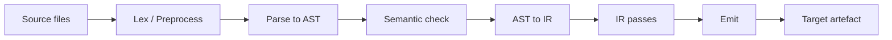

# Compilation Pipeline Overview

This document is the index to the per-stage pipeline documents under
[pipeline/](.). It traces the flow of data from a source buffer to an
emitted target artefact and points at the file(s) that drive each
stage. It is written for a reader who knows what a compiler is in
general but has not yet mapped Slang's pipeline onto its source layout;
readers who want depth should follow the per-stage links.

## End-to-end flow

The diagram is conceptual — actual control flow weaves checking and
parsing together (see [02-parse-ast.md](02-parse-ast.md) for the
two-stage parser) and the IR pass list is target-sensitive. The
ordering here reflects the dominant data hand-off, not strict
sequencing.

## Stages

### Lex / Preprocess

Reads source buffers and produces a flat array of `Token`. Lexing,
preprocessing, and `#include` resolution all complete before parsing
begins.

Driven by:

- [slang-lexer.cpp](../../../../source/compiler-core/slang-lexer.cpp)
  (lexer)
- [slang-preprocessor.cpp](../../../../source/slang/slang-preprocessor.cpp)
  (preprocessor and `#include`)
- [slang-include-system.cpp](../../../../source/compiler-core/slang-include-system.cpp)
  (path resolution)

Detail: [01-lex-preprocess.md](01-lex-preprocess.md).

### Parse to AST

Recursive-descent parsing produces a strongly-typed AST. Slang uses a
two-stage strategy, selected by `ParsingStage` (`Decl` or `Body`): at
the decl-parsing stage a function body is captured as raw tokens in an
`UnparsedStmt`; at the body-parsing stage that token list is re-parsed
lazily under the supervision of the semantic checker so that generic /
comparison disambiguation has type information to lean on.

Driven by:

- [slang-parser.cpp](../../../../source/slang/slang-parser.cpp)
- the `slang-ast-*.h` headers under
  [source/slang/](../../../../source/slang) (AST data model)

Detail: [02-parse-ast.md](02-parse-ast.md).

### Semantic check

A family of `SemanticsVisitor` subclasses split across
`slang-check-*.cpp` resolves names, attaches types, validates
modifiers, performs overload resolution and conformance checking, and
synthesizes default conformance witnesses and generated members.

Driven by:

- [slang-check.cpp](../../../../source/slang/slang-check.cpp)
- the per-concern files
  ([slang-check-decl.cpp](../../../../source/slang/slang-check-decl.cpp),
  [slang-check-expr.cpp](../../../../source/slang/slang-check-expr.cpp),
  [slang-check-stmt.cpp](../../../../source/slang/slang-check-stmt.cpp),
  ..., [slang-check-shader.cpp](../../../../source/slang/slang-check-shader.cpp))

Detail: [03-semantic-check.md](03-semantic-check.md).

### AST → IR lowering

The checked AST is walked by the lowering visitor, which emits Slang
IR via `IRBuilder`. Decls become `IRGlobalVar` / `IRFunc` /
`IRStructType` / `IRGeneric`; control-flow statements create basic
blocks and branches while ordinary statements emit instructions into
the current block; expressions become SSA value instructions, with
block parameters carrying values across control-flow edges.

Driven by:

- [slang-lower-to-ir.cpp](../../../../source/slang/slang-lower-to-ir.cpp)
- [slang-ir.cpp](../../../../source/slang/slang-ir.cpp) (`IRBuilder`,
  hoistable / global value deduplication)

Detail: [04-ast-to-ir.md](04-ast-to-ir.md).

### IR passes

The `linkAndOptimizeIR` function in
[slang-emit.cpp](../../../../source/slang/slang-emit.cpp) (line 970 at
`source_commit`) drives a long, target-sensitive sequence of IR
transformations between lowering and emit. The
[source/slang/](../../../../source/slang) directory contains roughly
160 `slang-ir-*.cpp` files implementing analyses, validations,
specializations, legalizations, and target-specific lowerings.

Driven by:

- [slang-emit.cpp](../../../../source/slang/slang-emit.cpp) (orchestrator)
- the `slang-ir-*` family (individual passes)

Detail: [05-ir-passes.md](05-ir-passes.md).

### Emit

`CodeGenContext::emitEntryPoints` selects a dispatch path per
`TargetRequest`. Textual targets go to `emitEntryPointsSourceFromIR`
([slang-emit.cpp](../../../../source/slang/slang-emit.cpp) line 2746 at
`source_commit`), which picks a C-like source emitter — HLSL, GLSL,
Metal, WGSL, C++, CUDA, or Torch glue. Binary and non-source targets
(direct SPIR-V, downstream-compiled DXIL/DXBC/metallib/PTX, LLVM IR /
native via `slang-llvm`, and VM bytecode) are dispatched separately.

Driven by:

- [slang-code-gen.cpp](../../../../source/slang/slang-code-gen.cpp)
  (per-target dispatcher; defines `CodeGenContext::emitEntryPoints`
  and `_emitEntryPoints`)
- [slang-emit.cpp](../../../../source/slang/slang-emit.cpp) (linked-IR
  and pass orchestration, plus the C-like source-emitter selection in
  `emitEntryPointsSourceFromIR`)
- one `slang-emit-<target>.cpp` per backend
  ([source/slang/](../../../../source/slang))

Detail: [06-emit.md](06-emit.md).

## Driver entry points

The high-level objects that orchestrate the stages above live in
[source/slang/](../../../../source/slang):

- [slang-compile-request.h](../../../../source/slang/slang-compile-request.h)
  declares `FrontEndCompileRequest` / `CompileRequestBase`.
  `CompileRequestBase` holds the `Linkage` that owns the session and
  supplies the source manager, name pool, and file system used
  throughout parse and check;
  [slang-compile-request.cpp](../../../../source/slang/slang-compile-request.cpp)
  implements them and orchestrates the per-translation-unit front-
  end work. Its `checkAllTranslationUnits` (line 498 at
  `source_commit`) calls `checkTranslationUnit` once per unchecked
  translation unit, adding each checked module to the
  `LoadedModuleDictionary` so that later `import` decls can find it,
  and finishes with `checkEntryPoints()` before lowering.
- [slang-end-to-end-request.h](../../../../source/slang/slang-end-to-end-request.h)
  declares `EndToEndCompileRequest`, which is what a single `slangc`
  invocation (or `slang::ICompileRequest`) becomes. Its
  implementation lives in
  [slang-end-to-end-request.cpp](../../../../source/slang/slang-end-to-end-request.cpp).
- [slang-module.h](../../../../source/slang/slang-module.h) declares
  `Module`, the result object the front-end produces (AST + IR) and
  the implementation of `IModule` from
  [include/slang.h](../../../../include/slang.h).
- [slang-code-gen.cpp](../../../../source/slang/slang-code-gen.cpp) is
  the back-end target dispatcher invoked once the front-end has
  produced a composite `IComponentType` for the targets to be
  generated;
  [slang-emit.cpp](../../../../source/slang/slang-emit.cpp) is the
  linked-IR and IR-pass orchestrator it calls into, and also selects
  the C-like source emitter for textual targets.

The architecture-level introduction of these objects is in
[../architecture/overview.md](../architecture/overview.md).

## Cross-cutting concerns

Several concerns touch every stage. They live in
[../cross-cutting/](../cross-cutting) instead of in any one stage doc:

- **Diagnostics** — every stage reports through `DiagnosticSink`. See
  [../cross-cutting/diagnostics.md](../cross-cutting/diagnostics.md).
- **IR instructions** — the opcode catalog
  ([../cross-cutting/ir-instructions.md](../cross-cutting/ir-instructions.md))
  is shared by lowering, every IR pass, and emit.
- **Targets and capabilities** — choices about target / profile shape
  what the back-end stages do
  ([../cross-cutting/targets.md](../cross-cutting/targets.md)).
- **Core module / preludes** — provide built-in types and intrinsics
  to the front-end and inject text into emitted code
  ([../cross-cutting/core-module.md](../cross-cutting/core-module.md)).
- **Serialization** — both AST and IR can be saved / loaded across
  pipeline stages
  ([../cross-cutting/serialization.md](../cross-cutting/serialization.md)).
