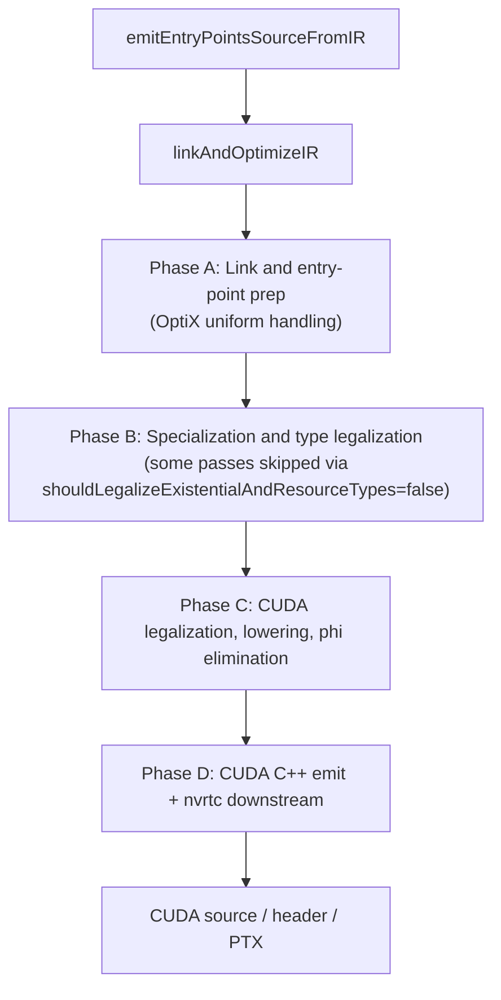
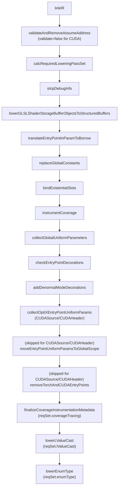
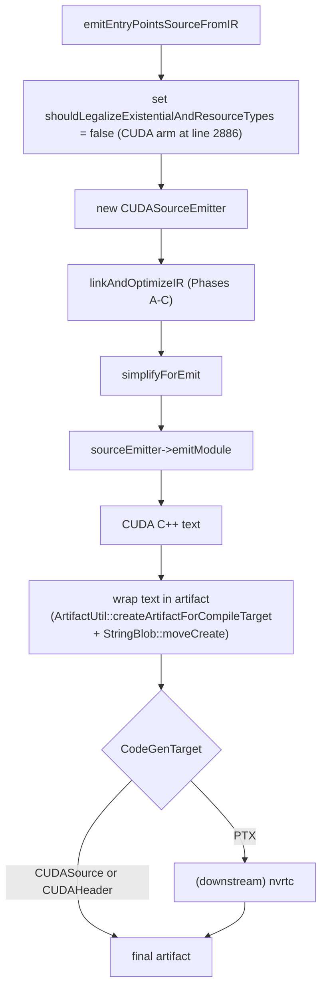

# CUDA Target Pipeline

This page documents the ordered IR-pass and downstream-binary
sequence executed when Slang compiles for the CUDA target family.
It is written for compiler developers who need to locate the CUDA
pass order, the gate that selects a given pass, and the OptiX
handling within it.
The corresponding `CodeGenTarget` values are `CUDASource`,
`CUDAHeader`, and `PTX` — spelled `-target cuda` (or `cu`),
`-target cuh`, and `-target ptx` on the `slangc` command line
([slang-type-text-util.cpp line 82-84](../../../../source/core/slang-type-text-util.cpp)).
A final `PTX` request does **not** drive
`linkAndOptimizeIR` or the emit pipeline with `CodeGenTarget::PTX`
directly: `emitWithDownstreamForEntryPoints` first maps `PTX` to
its source target via `_getDefaultSourceForTarget`, which returns
`CodeGenTarget::CUDASource`
([slang-code-gen.cpp line 268-269](../../../../source/slang/slang-code-gen.cpp)),
then runs `emitEntryPointsSource` on a `CodeGenContext` built with
that `CUDASource` target
([slang-code-gen.cpp line 534-538](../../../../source/slang/slang-code-gen.cpp)).
The whole IR pipeline described below therefore sees
`CUDASource`, and the resulting CUDA C++ source is handed to nvrtc
(or the runtime CUDA compiler) for PTX generation as a separate
downstream step. `CUDAHeader` is emitted the same way through the
`CUDASource` IR pipeline; the only switch arms that name `PTX`
explicitly are `linkAndOptimizeIR`'s `synthesizeActiveMask` switch
(line 2160-2162), which would not be reached with `PTX` under the
ordinary downstream path. All three targets share most of the IR
pipeline via `isCUDATarget(targetRequest)`.

This page complements
[../pipeline/05-ir-passes.md](../pipeline/05-ir-passes.md), which
is an unordered topical catalog of every IR pass. The pass sequence
below is **not** an unconditional list: a large and growing number
of the backend passes are gated on flags in the
`RequiredLoweringPassSet` predicate computed by
`calcRequiredLoweringPassSet` (line 405 of
[slang-emit.cpp](../../../../source/slang/slang-emit.cpp)), so a
pass runs only when the linked IR actually contains the construct
it handles. The `Gate` column of every phase table records which
flag, if any, selects each pass; see
[Conditional gates](#conditional-gates) for the consolidated list
and for how the flags are computed. Branches in
`linkAndOptimizeIR` gated on a sibling target (SPIR-V, HLSL,
Metal, WGSL, GLSL, pure CPP / Host) are filtered out of the
diagrams and tables below. CUDA shares a few arms with CPU /
Metal (`undoParameterCopy`, `transformParamsToConstRef`,
`introduceExplicitGlobalContext`); those passes are included
because they reach CUDA, but the other targets in those arms are
documented on their own pages.

## Source

- [slang-emit.cpp](../../../../source/slang/slang-emit.cpp) —
  `linkAndOptimizeIR` (line 970) is the orchestrator;
  `calcRequiredLoweringPassSet` (line 405) computes the
  per-module gate predicate it consults;
  `emitEntryPointsSourceFromIR` (line 2746) constructs the
  `CUDASourceEmitter` and emits CUDA C++ text.
- [slang-emit-cuda.cpp](../../../../source/slang/slang-emit-cuda.cpp)
  — `CUDASourceEmitter` implementation.
- [slang-emit-cpp.cpp](../../../../source/slang/slang-emit-cpp.cpp)
  — `CPPSourceEmitter` base class that `CUDASourceEmitter`
  inherits from.
- [slang-emit-c-like.cpp](../../../../source/slang/slang-emit-c-like.cpp)
  — shared C-like emitter base.
- [slang-ir-cuda-immutable-load.cpp](../../../../source/slang/slang-ir-cuda-immutable-load.cpp)
  — `lowerImmutableBufferLoadForCUDA`.
- [slang-ir-legalize-varying-params.cpp](../../../../source/slang/slang-ir-legalize-varying-params.cpp)
  — `legalizeEntryPointVaryingParamsForCUDA`.
- [slang-ir-optix-entry-point-uniforms.cpp](../../../../source/slang/slang-ir-optix-entry-point-uniforms.cpp)
  — `collectOptiXEntryPointUniformParams`.
- [slang-ir-pytorch-cpp-binding.cpp](../../../../source/slang/slang-ir-pytorch-cpp-binding.cpp)
  — `removeTorchAndCUDAEntryPoints`, `removeTorchKernels`,
  `lowerBuiltinTypesForKernelEntryPoints`, `handleAutoBindNames`.
- [slang-ir-synthesize-active-mask.cpp](../../../../source/slang/slang-ir-synthesize-active-mask.cpp)
  — `synthesizeActiveMask`.
- [slang-target-program.h](../../../../source/slang/slang-target-program.h)
  / [slang-compiler-options.h](../../../../source/slang/slang-compiler-options.h)
  — gate sources.

## High-level phase diagram



A defining feature of the CUDA pipeline: at line 2886 of
`slang-emit.cpp`, `emitEntryPointsSourceFromIR` sets
`shouldLegalizeExistentialAndResourceTypes = false` for the CUDA
arm, which causes several Phase-B passes inside
`linkAndOptimizeIR` to take their `else` branches.

## Phase A: Link and entry-point prep

Spans roughly lines 1005-1344 of
[slang-emit.cpp](../../../../source/slang/slang-emit.cpp) — from the
`linkIR` call to `lowerEnumType`. CUDA has
two arms it hits in this phase that other shader targets do not:

Because a final `PTX` request runs this pipeline with
`CodeGenTarget::CUDASource` (see the intro), the `CUDASource` arms
below describe the behavior for all three CUDA targets in the
ordinary downstream path; `PTX` never reaches these switches as
`CodeGenTarget::PTX`.

- `collectOptiXEntryPointUniformParams` runs at line 1264
  (`case CUDASource: case CUDAHeader:` at lines 1262-1263) instead
  of `collectEntryPointUniformParams`. This handles OptiX's
  Shader Binding Table (SBT) entry-point uniform parameters
  through a CUDA/OptiX-specific scheme.
- `moveEntryPointUniformParamsToGlobalScope` is **skipped** for
  `CUDASource` / `CUDAHeader` (they are in the explicit case list
  at lines 1291-1292 whose only statement is `break`; the pass is
  in the `default` arm of the same switch, at line 1285).

`CUDASource` / `CUDAHeader` are also in the explicit case list for
the `removeTorchAndCUDAEntryPoints` switch (lines 1305-1306) and
thus **skip** that pass too — their entry points are valid CUDA
kernels; the pass itself is at line 1311 in the `default` arm.



| #   | Pass                                                     | File                                                                                                            | Gate                                       | Notes                                                                                                                                                                                                                                                                                                                                                                                                                                                                                                                                                                                                                                                                                                                                                                                                                                                                                                                                                                                                                                                                                                                                 |
| --- | -------------------------------------------------------- | --------------------------------------------------------------------------------------------------------------- | ------------------------------------------ | ------------------------------------------------------------------------------------------------------------------------------------------------------------------------------------------------------------------------------------------------------------------------------------------------------------------------------------------------------------------------------------------------------------------------------------------------------------------------------------------------------------------------------------------------------------------------------------------------------------------------------------------------------------------------------------------------------------------------------------------------------------------------------------------------------------------------------------------------------------------------------------------------------------------------------------------------------------------------------------------------------------------------------------------------------------------------------------------------------------------------------------- |
| 1   | `linkIR`                                                 | [slang-ir-link.cpp](../../../../source/slang/slang-ir-link.cpp)                                                 | (always)                                   | Plain call at line 1005, not a `SLANG_PASS`. Its result feeds the first `calcRequiredLoweringPassSet` scan at line 1049.                                                                                                                                                                                                                                                                                                                                                                                                                                                                                                                                                                                                                                                                                                                                                                                                                                                                                                                                                                                                              |
| 2   | `validateAndRemoveAssumeAddress`                         | [slang-ir-validate.cpp](../../../../source/slang/slang-ir-validate.cpp)                                         | (always)                                   | **`validate = false` for CUDA** (line 1038: `!isCPUTarget(targetRequest) && !isCUDATarget(targetRequest)`); contrast with HLSL / Metal / WGSL / SPIR-V which validate.                                                                                                                                                                                                                                                                                                                                                                                                                                                                                                                                                                                                                                                                                                                                                                                                                                                                                                                                                                |
| 3   | `stripDebugInfo`                                         | [slang-ir-strip-debug-info.cpp](../../../../source/slang/slang-ir-strip-debug-info.cpp)                         | `reqSet.debugInfo && DebugInfoLevel::None` |                                                                                                                                                                                                                                                                                                                                                                                                                                                                                                                                                                                                                                                                                                                                                                                                                                                                                                                                                                                                                                                                                                                                       |
| 4   | `lowerGLSLShaderStorageBufferObjectsToStructuredBuffers` | [slang-ir-lower-glsl-ssbo-types.cpp](../../../../source/slang/slang-ir-lower-glsl-ssbo-types.cpp)               | `!isKhronosTarget && reqSet.glslSSBO`      | CUDA is non-Khronos.                                                                                                                                                                                                                                                                                                                                                                                                                                                                                                                                                                                                                                                                                                                                                                                                                                                                                                                                                                                                                                                                                                                  |
| 5   | `translateEntryPointInParamToBorrow`                     | [slang-ir-transform-params-to-constref.cpp](../../../../source/slang/slang-ir-transform-params-to-constref.cpp) | (always)                                   |                                                                                                                                                                                                                                                                                                                                                                                                                                                                                                                                                                                                                                                                                                                                                                                                                                                                                                                                                                                                                                                                                                                                       |
| 6   | `replaceGlobalConstants`                                 | [slang-ir-link.cpp](../../../../source/slang/slang-ir-link.cpp)                                                 | (always)                                   |                                                                                                                                                                                                                                                                                                                                                                                                                                                                                                                                                                                                                                                                                                                                                                                                                                                                                                                                                                                                                                                                                                                                       |
| 7   | `bindExistentialSlots`                                   | [slang-ir-bind-existentials.cpp](../../../../source/slang/slang-ir-bind-existentials.cpp)                       | `reqSet.bindExistential`                   |                                                                                                                                                                                                                                                                                                                                                                                                                                                                                                                                                                                                                                                                                                                                                                                                                                                                                                                                                                                                                                                                                                                                       |
| 8   | `instrumentCoverage`                                     | [slang-ir-coverage-instrument.cpp](../../../../source/slang/slang-ir-coverage-instrument.cpp)                   | `reqSet.coverageTracing`                   | The coverage buffer is packed into `GlobalParams` for CUDA. The call (line 1216) forwards a per-counter byte width (`counterByteWidth`, defaulting to `kDefaultCoverageCounterByteWidth = 8` from the `TraceCoverageCounterByteWidth` option) and a `coverageBoolean` flag (`TraceCoverageBoolean`, off by default).                                                                                                                                                                                                                                                                                                                                                                                                                                                                                                                                                                                                                                                                                                                                                                                                                  |
| 9   | `collectGlobalUniformParameters`                         | [slang-ir-collect-global-uniforms.cpp](../../../../source/slang/slang-ir-collect-global-uniforms.cpp)           | (always)                                   |                                                                                                                                                                                                                                                                                                                                                                                                                                                                                                                                                                                                                                                                                                                                                                                                                                                                                                                                                                                                                                                                                                                                       |
| 10  | `checkEntryPointDecorations`                             | [slang-ir-entry-point-decorations.cpp](../../../../source/slang/slang-ir-entry-point-decorations.cpp)           | (always)                                   |                                                                                                                                                                                                                                                                                                                                                                                                                                                                                                                                                                                                                                                                                                                                                                                                                                                                                                                                                                                                                                                                                                                                       |
| 11  | `addDenormalModeDecorations`                             | [slang-emit.cpp](../../../../source/slang/slang-emit.cpp)                                                       | (always)                                   | Static helper.                                                                                                                                                                                                                                                                                                                                                                                                                                                                                                                                                                                                                                                                                                                                                                                                                                                                                                                                                                                                                                                                                                                        |
| 12  | `collectOptiXEntryPointUniformParams`                    | [slang-ir-optix-entry-point-uniforms.cpp](../../../../source/slang/slang-ir-optix-entry-point-uniforms.cpp)     | `case CUDASource / CUDAHeader` (line 1264) | All CUDA targets (incl. final `PTX`, which runs as `CUDASource`). Replaces `collectEntryPointUniformParams`; `moveEntryPointUniformParamsToGlobalScope` and `removeTorchAndCUDAEntryPoints` are both skipped for these arms.                                                                                                                                                                                                                                                                                                                                                                                                                                                                                                                                                                                                                                                                                                                                                                                                                                                                                                          |
| 13  | `finalizeCoverageInstrumentationMetadata`                | [slang-ir-coverage-instrument.cpp](../../../../source/slang/slang-ir-coverage-instrument.cpp)                   | `reqSet.coverageTracing`                   | **Material on CUDA.** Runs after entry-point uniform packing (where the coverage buffer is folded into `GlobalParams`) to fill the `uniformOffset` / `uniformStride` fields of the coverage buffer's synthetic-resource record on the post-emit metadata, which the host runtime reads to bind the buffer at dispatch time. CUDA is one of only two targets that _diagnose_ a failure here: when `tryGetCoverageUniformBindingInfo` finds no uniform layout and `isCPUTarget \|\| isCUDATarget`, the pass emits `Diagnostics::CoverageUniformLayoutUnavailable` — **`E45105`** — instead of silently leaving the record unset. Coverage instrumentation is enabled by `CompilerOptionName::TraceCoverage` / `TraceFunctionCoverage` / `TraceBranchCoverage` (slangc `-trace-coverage`, `-trace-function-coverage`, `-trace-branch-coverage`), which `CodeGenContext::shouldTraceAnyCoverage` reads ([slang-code-gen.cpp](../../../../source/slang/slang-code-gen.cpp) line 1440-1446); `reqSet.coverageTracing` itself is set by the `kIROp_Increment*CoverageCounter` opcodes those options introduce (slang-emit.cpp line 598-601). |
| 14  | `lowerLValueCast`                                        | [slang-ir-lower-l-value-cast.cpp](../../../../source/slang/slang-ir-lower-l-value-cast.cpp)                     | `reqSet.lValueCast` (line 1337)            | Newly gated. `kIROp_InOutImplicitCast` / `kIROp_OutImplicitCast` are front-end-only, so the flag cannot be a false negative.                                                                                                                                                                                                                                                                                                                                                                                                                                                                                                                                                                                                                                                                                                                                                                                                                                                                                                                                                                                                          |
| 15  | `lowerEnumType`                                          | [slang-ir-lower-enum-type.cpp](../../../../source/slang/slang-ir-lower-enum-type.cpp)                           | `reqSet.enumType` (line 1343)              | The flag is now also set by `kIROp_CastEnumToInt` / `kIROp_CastIntToEnum` / `kIROp_EnumCast`, so the pass still runs when constant folding removed the last live `IREnumType` but left a cast behind.                                                                                                                                                                                                                                                                                                                                                                                                                                                                                                                                                                                                                                                                                                                                                                                                                                                                                                                                 |

Filtered out for CUDA in this phase: the HostCPPSource / HostVM /
HostLLVMIR / HostObjectCode / HostHostCallable arm of the
`collectEntryPointUniformParams` switch; the
CPPSource / CPPHeader / ShaderLLVMIR / ShaderObjectCode /
ShaderHostCallable arms (which run `collectEntryPointUniformParams`
with `alwaysCreateCollectedParam = true`).

## Phase B: Specialization and type legalization

Spans roughly lines 1357-1986 of `slang-emit.cpp` — from the first
`simplifyIR` to `checkStaticAssert`. The second
`calcRequiredLoweringPassSet` scan runs mid-phase at line 1520,
after specialization has resolved generics; the flags it sets are
accumulated on top of the post-link scan rather than replacing
them, so several later gates in this phase and in Phase C read
flags established by either scan. CUDA's divergence from the
SPIR-V / Metal / WGSL / HLSL paths is most visible here:

1. `generateDerivativeWrappers` runs at line 1383 (CUDA /
   CUDAHeader / PyTorch arm at lines 1377-1379) if
   `reqSet.derivativePyBindWrapper`.
2. `lowerCooperativeVectors`: for `CUDASource` it runs **only** if
   the target caps do not imply `optix_coopvec` (line 1691),
   so on OptiX targets with hardware cooperative-vector support
   Slang preserves the IR-level instruction. A final `PTX`
   request runs this switch as `CUDASource` and so takes that
   gated arm. Only `CUDAHeader`, which is not a named case, falls
   through the `default` arm (line 1695) and runs
   `lowerCooperativeVectors` unconditionally.
3. `lowerBuiltinTypesForKernelEntryPoints`, `removeTorchKernels`,
   and `handleAutoBindNames` run for CUDA at lines 1532-1534
   (`case CUDASource: case CUDAHeader:` at lines 1530-1531). These strip
   Slang-only shader types from kernel signatures, remove any
   PyTorch entry points that leaked in, and apply auto-bind
   name handling.
4. `inferAnyValueSizeWhereNecessary` and most of the standard
   Phase-B inventory run as usual.
5. `lowerCombinedTextureSamplers` is **skipped** for CUDA. The
   `default` arm of the switch at line 1758 only
   `[[fallthrough]]`s into the named HLSL / Metal / WGSL cases
   when `ArtifactDescUtil::isCpuLikeTarget(artifactDesc)` (line 1761) holds, and CUDA is **not** CPU-like: a CUDA source or
   header artifact is `Kind::Source` with payload `CUDA`
   ([slang-artifact-desc-util.cpp](../../../../source/compiler-core/slang-artifact-desc-util.cpp)
   lines 306-309), while for `ArtifactKind::Source` the predicate
   accepts only payload `C` or `Cpp` (line 612). The `default` arm
   therefore breaks before reaching the pass. That same predicate
   is why `performTypeInlining` and `checkGetStringHashInsts`
   **do** run for CUDA (rows 42a and 42b of the phase table).
6. The Slang-emit caller (`emitEntryPointsSourceFromIR`) sets
   `options.shouldLegalizeExistentialAndResourceTypes = false`
   for CUDA at line 2886. Inside `linkAndOptimizeIR`, this
   causes:
   - `legalizeExistentialTypeLayout` to skip.
   - `legalizeResourceTypes` to skip.
   - The Metal-only `legalizeEmptyTypes` arm inside the block
     does not apply.
   - The CPU/CUDA fallback `legalizeEmptyTypes` (line 1911)
     runs instead.
7. `inlineGlobalConstantsForLegalization` is forced for
   `CUDASource` at lines 1791-1795 (`target == CUDASource ||
(isCPUTarget(targetRequest) && isKernelTarget(target)) ||
options.shouldLegalizeExistentialAndResourceTypes`). A final
   `PTX` request runs this as `CUDASource` and so takes the
   short-circuit. Because
   `shouldLegalizeExistentialAndResourceTypes` is `false` for the
   CUDA source language (line 2886), only `CUDAHeader` does
   **not** run this pass.
8. `wrapStructuredBuffersOfMatrices` and
   `wrapCBufferElementsForMetal` are both **skipped** (HLSL /
   Metal only).
9. Three passes in this phase are now selected by
   `RequiredLoweringPassSet` flags rather than running
   unconditionally: `finalizeAutoDiffPass` (`reqSet.autodiff`,
   with `stripAutoDiffDecorations` on the `else` arm),
   `lowerSumVectorMatrixInsts` (`reqSet.sumVectorMatrix`), and
   `lowerTaggedUnionTypes` (`reqSet.taggedUnion`).
   `lowerAppendConsumeStructuredBuffers` gained a second
   conjunct (`reqSet.appendConsumeStructuredBuffer`) alongside its
   existing `target != HLSL` test. See
   [The autodiff gate](#the-autodiff-gate) for why this matters
   most on CUDA.

```mermaid
flowchart TD
  s1[simplifyIR default]
  vu[validateUniformity]
  sML[specializeMatrixLayout]
  fSC[fuseCallsToSaturatedCooperation]
  gDW["generateDerivativeWrappers (CUDA arm)"]
  cAP[checkAutodiffPatterns]
  dCC[diagnoseCircularConformances]
  sM[specializeModule]
  sHOP[specializeHigherOrderParameters]
  adGate{reqSet.autodiff}
  fADP[finalizeAutoDiffPass]
  sADD[stripAutoDiffDecorations]
  lMSS[lowerMatrixSwizzleStores]
  dce1[eliminateDeadCode]
  fS[finalizeSpecialization]
  lDTI["lowerDiffTypeInfoInsts<br/>(reqSet.autodiff)"]
  lCT[lowerConditionalType]
  lRO[lowerReinterpretOptional]
  cONU[checkForOptionalNoneUsage]
  lOT[lowerOptionalType]
  lRT[lowerResultType]
  reqSet2[calcRequiredLoweringPassSet]
  lBTK["lowerBuiltinTypesForKernelEntryPoints (CUDA arm)"]
  rTK[removeTorchKernels]
  hABN[handleAutoBindNames]
  dUR[detectUninitializedResources]
  rAIDD[removeAvailableInDownstreamModuleDecorations]
  checks["checkForRecursive* checkForOutOfBoundAccess<br/>checkForMissingReturns checkForInvalidShaderParameterType"]
  iAVS[inferAnyValueSizeWhereNecessary]
  uPWT[unpinWitnessTables]
  lSVMI["lowerSumVectorMatrixInsts<br/>(reqSet.sumVectorMatrix)"]
  minOptGateA{"!minimalOptimization"}
  s2a[simplifyIR fast]
  dceGen["eliminateDeadCode<br/>(else if reqSet.generics)"]
  lTUT["lowerTaggedUnionTypes<br/>(reqSet.taggedUnion)"]
  lUUT[lowerUntaggedUnionTypes]
  lR[lowerReinterpret]
  lSIDC[lowerSequentialIDTagCasts]
  lTI[lowerTagInsts]
  lTT[lowerTagTypes]
  dce3[eliminateDeadCode]
  lE[lowerExistentials]
  rWUI[removeWeakUseInsts]
  pTIN["performTypeInlining<br/>(!isCpuLikeTarget; CUDA is not CPU-like)"]
  cGSHI["checkGetStringHashInsts<br/>(!isCpuLikeTarget && shouldRunNonEssentialValidation)"]
  dce4[eliminateDeadCode]
  lTu[lowerTuples]
  gAVMF[generateAnyValueMarshallingFunctions]
  sSS[specializeStageSwitch]
  lCV["lowerCooperativeVectors<br/>(CUDASource if !optix_coopvec; CUDAHeader always)"]
  pFI1[performForceInlining]
  minOptGate{fastIRSimplificationOptions.minimalOptimization}
  sccp[applySparseConditionalConstantPropagation]
  dce_min[eliminateDeadCode]
  s2b[simplifyIR default]
  lACSB["lowerAppendConsumeStructuredBuffers<br/>(reqSet.appendConsumeStructuredBuffer)"]
  lCTS["(skipped) lowerCombinedTextureSamplers<br/>default arm breaks: CUDA is not CPU-like"]
  aUTHD["addUserTypeHintDecorations<br/>(VulkanEmitReflection)"]
  lEA[legalizeEmptyArray]
  lVT[legalizeVectorTypes]
  iGC["inlineGlobalConstantsForLegalization<br/>(CUDASource only; lines 1791-1795)"]
  skipETL["(skipped) legalizeExistentialTypeLayout<br/>shouldLegalizeExistentialAndResourceTypes=false"]
  skipRT["(skipped) legalizeResourceTypes<br/>shouldLegalizeExistentialAndResourceTypes=false"]
  lET_cpu["legalizeEmptyTypes<br/>(CPU/CUDA else branch, line 1911)"]
  lMT[legalizeMatrixTypes]
  minOptGateB{minimalOptimization}
  s2c[simplifyIR fast]
  dceLegal[eliminateDeadCode]
  lURH["lowerUntypedResourceHandleToUInt<br/>(reqSet.untypedResourceHandle)"]
  lDRH[lowerDynamicResourceHeap]
  sRU[specializeResourceUsage]
  sFBLA1[specializeFuncsForBufferLoadArgs]
  dBL[deferBufferLoad]
  sAP[specializeArrayParameters]
  cSA[checkStaticAssert]

  s1 --> vu --> sML --> fSC --> gDW --> cAP --> dCC --> sM --> sHOP --> adGate
  adGate -->|true| fADP --> lMSS
  adGate -->|false| sADD --> lMSS
  lMSS --> dce1 --> fS --> lDTI --> lCT --> lRO --> cONU --> lOT --> lRT --> reqSet2 --> lBTK --> rTK --> hABN --> dUR --> rAIDD --> checks --> iAVS --> uPWT --> lSVMI --> minOptGateA
  minOptGateA -->|true| s2a --> lTUT
  minOptGateA -->|false| dceGen --> lTUT
  lTUT --> lUUT --> lR --> lSIDC --> lTI --> lTT --> dce3 --> lE --> rWUI --> pTIN --> cGSHI --> dce4 --> lTu --> gAVMF --> sSS --> lCV --> pFI1 --> minOptGate
  minOptGate -->|true| sccp --> dce_min --> lACSB
  minOptGate -->|false| s2b --> lACSB
  lACSB --> lCTS --> aUTHD --> lEA --> lVT --> iGC --> skipETL --> skipRT --> lET_cpu --> lMT --> minOptGateB
  minOptGateB -->|true| dceLegal --> lURH
  minOptGateB -->|false| s2c --> lURH
  lURH --> lDRH --> sRU --> sFBLA1 --> dBL --> sAP --> cSA
```



(Conditional gates omitted from the diagram for readability;
see the conditional-gates table.)

| #   | Pass                                           | File                                                                                                                                | Gate                                                                                                                                            | Notes                                                                                                                                                                                                                                                                                                                                                                                                                                                     |
| --- | ---------------------------------------------- | ----------------------------------------------------------------------------------------------------------------------------------- | ----------------------------------------------------------------------------------------------------------------------------------------------- | --------------------------------------------------------------------------------------------------------------------------------------------------------------------------------------------------------------------------------------------------------------------------------------------------------------------------------------------------------------------------------------------------------------------------------------------------------- |
| 1   | `simplifyIR`                                   | [slang-ir-ssa-simplification.cpp](../../../../source/slang/slang-ir-ssa-simplification.cpp)                                         | (always)                                                                                                                                        |                                                                                                                                                                                                                                                                                                                                                                                                                                                           |
| 2   | `validateUniformity`                           | [slang-ir-uniformity.cpp](../../../../source/slang/slang-ir-uniformity.cpp)                                                         | `getBoolOption(ValidateUniformity)`                                                                                                             |                                                                                                                                                                                                                                                                                                                                                                                                                                                           |
| 3   | `specializeMatrixLayout`                       | [slang-ir-specialize-matrix-layout.cpp](../../../../source/slang/slang-ir-specialize-matrix-layout.cpp)                             | (always)                                                                                                                                        |                                                                                                                                                                                                                                                                                                                                                                                                                                                           |
| 4   | `fuseCallsToSaturatedCooperation`              | [slang-ir-fuse-satcoop.cpp](../../../../source/slang/slang-ir-fuse-satcoop.cpp)                                                     | `!shouldPerformMinimumOptimizations`                                                                                                            |                                                                                                                                                                                                                                                                                                                                                                                                                                                           |
| 5   | `generateDerivativeWrappers`                   | [slang-ir-autodiff.cpp](../../../../source/slang/slang-ir-autodiff.cpp)                                                             | `reqSet.derivativePyBindWrapper && case CUDASource / CUDAHeader / PyTorchCppBinding` (line 1383)                                                | **CUDA/PyTorch only.**                                                                                                                                                                                                                                                                                                                                                                                                                                    |
| 6   | `checkAutodiffPatterns`                        | [slang-ir-check-differentiability.cpp](../../../../source/slang/slang-ir-check-differentiability.cpp)                               | `reqSet.autodiff`                                                                                                                               |                                                                                                                                                                                                                                                                                                                                                                                                                                                           |
| 7   | `diagnoseCircularConformances`                 | [slang-ir-any-value-inference.cpp](../../../../source/slang/slang-ir-any-value-inference.cpp)                                       | (always)                                                                                                                                        |                                                                                                                                                                                                                                                                                                                                                                                                                                                           |
| 8   | `specializeModule`                             | [slang-ir-specialize.cpp](../../../../source/slang/slang-ir-specialize.cpp)                                                         | `!isSpecializationDisabled()`                                                                                                                   |                                                                                                                                                                                                                                                                                                                                                                                                                                                           |
| 9   | `specializeHigherOrderParameters`              | [slang-ir-defunctionalization.cpp](../../../../source/slang/slang-ir-defunctionalization.cpp)                                       | `reqSet.higherOrderFunc`                                                                                                                        |                                                                                                                                                                                                                                                                                                                                                                                                                                                           |
| 10a | `finalizeAutoDiffPass`                         | [slang-ir-autodiff.cpp](../../../../source/slang/slang-ir-autodiff.cpp)                                                             | `reqSet.autodiff` (line 1446)                                                                                                                   | **Newly gated.** Runs `processPairTypes`, `removeDetachInsts`, and `removeTypeAnnotations`; skipped entirely for modules with no autodiff IR.                                                                                                                                                                                                                                                                                                             |
| 10b | `stripAutoDiffDecorations`                     | [slang-ir-autodiff.cpp](../../../../source/slang/slang-ir-autodiff.cpp)                                                             | `!reqSet.autodiff` (`else` arm, line 1452)                                                                                                      | Runs _instead of_ row 10a. Removes the `Export` / `HLSLExport` / `KeepAlive` pins on the linked-in `[__AutoDiffBuiltin]` core-module types so row 12's DCE can drop them.                                                                                                                                                                                                                                                                                 |
| 11  | `lowerMatrixSwizzleStores`                     | [slang-ir-lower-matrix-swizzle-store.cpp](../../../../source/slang/slang-ir-lower-matrix-swizzle-store.cpp)                         | `reqSet.matrixSwizzleStore`                                                                                                                     |                                                                                                                                                                                                                                                                                                                                                                                                                                                           |
| 12  | `eliminateDeadCode`                            | [slang-ir-dce.cpp](../../../../source/slang/slang-ir-dce.cpp)                                                                       | (always)                                                                                                                                        |                                                                                                                                                                                                                                                                                                                                                                                                                                                           |
| 13  | `finalizeSpecialization`                       | [slang-ir-specialize.cpp](../../../../source/slang/slang-ir-specialize.cpp)                                                         | (always)                                                                                                                                        |                                                                                                                                                                                                                                                                                                                                                                                                                                                           |
| 14  | `lowerDiffTypeInfoInsts`                       | [slang-ir-autodiff.cpp](../../../../source/slang/slang-ir-autodiff.cpp)                                                             | `reqSet.autodiff` (line 1465)                                                                                                                   | Direct call, not a `SLANG_PASS`. **Newly gated**, on the same flag as row 10a.                                                                                                                                                                                                                                                                                                                                                                            |
| 15  | `lowerConditionalType`                         | [slang-ir-lower-conditional-type.cpp](../../../../source/slang/slang-ir-lower-conditional-type.cpp)                                 | `reqSet.conditionalType`                                                                                                                        |                                                                                                                                                                                                                                                                                                                                                                                                                                                           |
| 16  | `lowerReinterpretOptional`                     | [slang-ir-lower-reinterpret.cpp](../../../../source/slang/slang-ir-lower-reinterpret.cpp)                                           | `reqSet.optionalType`                                                                                                                           |                                                                                                                                                                                                                                                                                                                                                                                                                                                           |
| 17  | `checkForOptionalNoneUsage`                    | [slang-ir-check-optional-none-usage.cpp](../../../../source/slang/slang-ir-check-optional-none-usage.cpp)                           | `shouldRunNonEssentialValidation()`                                                                                                             |                                                                                                                                                                                                                                                                                                                                                                                                                                                           |
| 18  | `lowerOptionalType`                            | [slang-ir-lower-optional-type.cpp](../../../../source/slang/slang-ir-lower-optional-type.cpp)                                       | `reqSet.optionalType`                                                                                                                           |                                                                                                                                                                                                                                                                                                                                                                                                                                                           |
| 19  | `lowerResultType`                              | [slang-ir-lower-result-type.cpp](../../../../source/slang/slang-ir-lower-result-type.cpp)                                           | `reqSet.resultType`                                                                                                                             | Now runs **after** `lowerOptionalType`: depends on accurate `getAnyValueSize()` results, which requires Optional lowering first.                                                                                                                                                                                                                                                                                                                          |
| 20  | `lowerBuiltinTypesForKernelEntryPoints`        | [slang-ir-pytorch-cpp-binding.cpp](../../../../source/slang/slang-ir-pytorch-cpp-binding.cpp)                                       | `case CUDASource / CUDAHeader` (line 1532)                                                                                                      | **CUDA-arm + PyTorch arm.** Strips Slang shader types from kernel signatures.                                                                                                                                                                                                                                                                                                                                                                             |
| 21  | `removeTorchKernels`                           | [slang-ir-pytorch-cpp-binding.cpp](../../../../source/slang/slang-ir-pytorch-cpp-binding.cpp)                                       | `case CUDASource / CUDAHeader` (line 1533)                                                                                                      | Removes any PyTorch entry points still present.                                                                                                                                                                                                                                                                                                                                                                                                           |
| 22  | `handleAutoBindNames`                          | [slang-ir-pytorch-cpp-binding.cpp](../../../../source/slang/slang-ir-pytorch-cpp-binding.cpp)                                       | `case CUDASource / CUDAHeader` (line 1534)                                                                                                      |                                                                                                                                                                                                                                                                                                                                                                                                                                                           |
| 23  | `detectUninitializedResources`                 | [slang-ir-detect-uninitialized-resources.cpp](../../../../source/slang/slang-ir-detect-uninitialized-resources.cpp)                 | (always)                                                                                                                                        |                                                                                                                                                                                                                                                                                                                                                                                                                                                           |
| 24  | `removeAvailableInDownstreamModuleDecorations` | [slang-ir-redundancy-removal.cpp](../../../../source/slang/slang-ir-redundancy-removal.cpp)                                         | `removeAvailableInDownstreamIR`                                                                                                                 |                                                                                                                                                                                                                                                                                                                                                                                                                                                           |
| 25  | `checkForRecursiveTypes`                       | [slang-ir-check-recursion.cpp](../../../../source/slang/slang-ir-check-recursion.cpp)                                               | `shouldRunNonEssentialValidation()`                                                                                                             |                                                                                                                                                                                                                                                                                                                                                                                                                                                           |
| 26  | `checkForRecursiveFunctions`                   | [slang-ir-check-recursion.cpp](../../../../source/slang/slang-ir-check-recursion.cpp)                                               | `shouldRunNonEssentialValidation()`                                                                                                             |                                                                                                                                                                                                                                                                                                                                                                                                                                                           |
| 27  | `checkForOutOfBoundAccess`                     | [slang-check-out-of-bound-access.cpp](../../../../source/slang/slang-check-out-of-bound-access.cpp)                                 | `shouldRunNonEssentialValidation()`                                                                                                             |                                                                                                                                                                                                                                                                                                                                                                                                                                                           |
| 28  | `checkForMissingReturns`                       | [slang-ir-missing-return.cpp](../../../../source/slang/slang-ir-missing-return.cpp)                                                 | `reqSet.missingReturn`                                                                                                                          |                                                                                                                                                                                                                                                                                                                                                                                                                                                           |
| 29  | `checkForInvalidShaderParameterType`           | [slang-ir-check-shader-parameter-type.cpp](../../../../source/slang/slang-ir-check-shader-parameter-type.cpp)                       | `shouldRunNonEssentialValidation()`                                                                                                             |                                                                                                                                                                                                                                                                                                                                                                                                                                                           |
| 30  | `inferAnyValueSizeWhereNecessary`              | [slang-ir-any-value-inference.cpp](../../../../source/slang/slang-ir-any-value-inference.cpp)                                       | (always)                                                                                                                                        |                                                                                                                                                                                                                                                                                                                                                                                                                                                           |
| 31  | `unpinWitnessTables`                           | [slang-ir-strip-legalization-insts.cpp](../../../../source/slang/slang-ir-strip-legalization-insts.cpp)                             | (always)                                                                                                                                        |                                                                                                                                                                                                                                                                                                                                                                                                                                                           |
| 32  | `lowerSumVectorMatrixInsts`                    | [slang-emit.cpp](../../../../source/slang/slang-emit.cpp)                                                                           | `reqSet.sumVectorMatrix` (line 1586)                                                                                                            | Static helper. **Newly gated**; `kIROp_SumVectorElements` / `kIROp_SumMatrixElements` are produced only by the autodiff transpose pass, which runs before the line-1520 scan.                                                                                                                                                                                                                                                                             |
| 33a | `simplifyIR`                                   | [slang-ir-ssa-simplification.cpp](../../../../source/slang/slang-ir-ssa-simplification.cpp)                                         | `!fastIRSimplificationOptions.minimalOptimization` (line 1589)                                                                                  | `minimalOptimization` comes from `CompilerOptionName::MinimumSlangOptimization`, read through `CompilerOptionSet::shouldPerformMinimumOptimizations()` ([slang-compiler-options.h](../../../../source/slang/slang-compiler-options.h) line 363) and copied onto `fastIRSimplificationOptions` at line 1350; the `slangc` spelling is `-minimum-slang-optimization`. The same flag selects rows 49 / 49a / 49b and 57a / 57b below, and row 26 of Phase C. |
| 33b | `eliminateDeadCode`                            | [slang-ir-dce.cpp](../../../../source/slang/slang-ir-dce.cpp)                                                                       | `else if (requiredLoweringPassSet.generics)` (lines 1593-1595)                                                                                  | Runs _instead of_ row 33a in minimal-optimization mode, and only when the module had generics to specialize; otherwise neither row runs.                                                                                                                                                                                                                                                                                                                  |
| 34  | `lowerTaggedUnionTypes`                        | [slang-ir-lower-dynamic-dispatch-insts.cpp](../../../../source/slang/slang-ir-lower-dynamic-dispatch-insts.cpp)                     | `reqSet.taggedUnion` (line 1606)                                                                                                                | **Newly gated.** When it returns `true` it sets `reqSet.reinterpret`, which selects row 36; skipping the pass therefore also correctly leaves `reinterpret` untouched.                                                                                                                                                                                                                                                                                    |
| 35  | `lowerUntaggedUnionTypes`                      | [slang-ir-lower-dynamic-dispatch-insts.cpp](../../../../source/slang/slang-ir-lower-dynamic-dispatch-insts.cpp)                     | (always)                                                                                                                                        |                                                                                                                                                                                                                                                                                                                                                                                                                                                           |
| 36  | `lowerReinterpret`                             | [slang-ir-lower-reinterpret.cpp](../../../../source/slang/slang-ir-lower-reinterpret.cpp)                                           | `reqSet.reinterpret`                                                                                                                            |                                                                                                                                                                                                                                                                                                                                                                                                                                                           |
| 37  | `lowerSequentialIDTagCasts`                    | [slang-ir-lower-dynamic-dispatch-insts.cpp](../../../../source/slang/slang-ir-lower-dynamic-dispatch-insts.cpp)                     | (always)                                                                                                                                        |                                                                                                                                                                                                                                                                                                                                                                                                                                                           |
| 38  | `lowerTagInsts`                                | [slang-ir-lower-dynamic-dispatch-insts.cpp](../../../../source/slang/slang-ir-lower-dynamic-dispatch-insts.cpp)                     | (always)                                                                                                                                        |                                                                                                                                                                                                                                                                                                                                                                                                                                                           |
| 39  | `lowerTagTypes`                                | [slang-ir-lower-dynamic-dispatch-insts.cpp](../../../../source/slang/slang-ir-lower-dynamic-dispatch-insts.cpp)                     | (always)                                                                                                                                        |                                                                                                                                                                                                                                                                                                                                                                                                                                                           |
| 40  | `eliminateDeadCode`                            | [slang-ir-dce.cpp](../../../../source/slang/slang-ir-dce.cpp)                                                                       | (always)                                                                                                                                        |                                                                                                                                                                                                                                                                                                                                                                                                                                                           |
| 41  | `lowerExistentials`                            | [slang-ir-lower-dynamic-dispatch-insts.cpp](../../../../source/slang/slang-ir-lower-dynamic-dispatch-insts.cpp)                     | (always)                                                                                                                                        |                                                                                                                                                                                                                                                                                                                                                                                                                                                           |
| 42  | `removeWeakUseInsts`                           | [slang-ir-redundancy-removal.cpp](../../../../source/slang/slang-ir-redundancy-removal.cpp)                                         | (always)                                                                                                                                        |                                                                                                                                                                                                                                                                                                                                                                                                                                                           |
| 42a | `performTypeInlining`                          | [slang-ir-inline.cpp](../../../../source/slang/slang-ir-inline.cpp)                                                                 | `!ArtifactDescUtil::isCpuLikeTarget(artifactDesc)` (line 1636)                                                                                  | **Runs for CUDA.** A CUDA source/header artifact is `Kind::Source` with payload `CUDA`, and the predicate accepts only `C` / `Cpp` for source kinds, so CUDA is not CPU-like. Inlines so that string calls/returns reduce to `getStringHash(stringLiteral)`.                                                                                                                                                                                              |
| 42b | `checkGetStringHashInsts`                      | [slang-ir-string-hash.cpp](../../../../source/slang/slang-ir-string-hash.cpp)                                                       | `!ArtifactDescUtil::isCpuLikeTarget(artifactDesc) && shouldRunNonEssentialValidation()` (lines 1646-1647)                                       | **Runs for CUDA** whenever non-essential validation is enabled; verifies row 42a left every `getStringHash` operand a string literal.                                                                                                                                                                                                                                                                                                                     |
| 43  | `eliminateDeadCode`                            | [slang-ir-dce.cpp](../../../../source/slang/slang-ir-dce.cpp)                                                                       | (always, direct call)                                                                                                                           |                                                                                                                                                                                                                                                                                                                                                                                                                                                           |
| 44  | `lowerTuples`                                  | [slang-ir-lower-tuple-types.cpp](../../../../source/slang/slang-ir-lower-tuple-types.cpp)                                           | (always)                                                                                                                                        |                                                                                                                                                                                                                                                                                                                                                                                                                                                           |
| 45  | `generateAnyValueMarshallingFunctions`         | [slang-ir-any-value-marshalling.cpp](../../../../source/slang/slang-ir-any-value-marshalling.cpp)                                   | (always)                                                                                                                                        |                                                                                                                                                                                                                                                                                                                                                                                                                                                           |
| 46  | `specializeStageSwitch`                        | [slang-ir-specialize-stage-switch.cpp](../../../../source/slang/slang-ir-specialize-stage-switch.cpp)                               | `reqSet.specializeStageSwitch`                                                                                                                  |                                                                                                                                                                                                                                                                                                                                                                                                                                                           |
| 47  | `lowerCooperativeVectors`                      | [slang-ir-lower-coopvec.cpp](../../../../source/slang/slang-ir-lower-coopvec.cpp)                                                   | `case CUDASource && !targetCaps.implies(optix_coopvec)` (line 1691); **`CUDAHeader` runs it unconditionally via the `default` arm (line 1695)** | For `CUDASource` (and final `PTX`, which runs as `CUDASource`) it fires only when OptiX hardware cooperative-vector support is absent; `CUDAHeader` always runs it.                                                                                                                                                                                                                                                                                       |
| 48  | `performForceInlining`                         | [slang-ir-inline.cpp](../../../../source/slang/slang-ir-inline.cpp)                                                                 | (always)                                                                                                                                        |                                                                                                                                                                                                                                                                                                                                                                                                                                                           |
| 49a | `applySparseConditionalConstantPropagation`    | [slang-ir-sccp.cpp](../../../../source/slang/slang-ir-sccp.cpp)                                                                     | `fastIRSimplificationOptions.minimalOptimization` (line 1712)                                                                                   | Minimal-optimization arm: cleans up dead branches revealed by force-inlining so dead `static_assert`s do not falsely fire.                                                                                                                                                                                                                                                                                                                                |
| 49b | `eliminateDeadCode`                            | [slang-ir-dce.cpp](../../../../source/slang/slang-ir-dce.cpp)                                                                       | `fastIRSimplificationOptions.minimalOptimization` (line 1717)                                                                                   | Paired with `applySparseConditionalConstantPropagation` in the minimal-optimization arm.                                                                                                                                                                                                                                                                                                                                                                  |
| 49  | `simplifyIR`                                   | [slang-ir-ssa-simplification.cpp](../../../../source/slang/slang-ir-ssa-simplification.cpp)                                         | `!fastIRSimplificationOptions.minimalOptimization` (else arm, line 1721)                                                                        | Runs only when not in minimal-optimization mode (the alternative to rows 49a/49b).                                                                                                                                                                                                                                                                                                                                                                        |
| 50  | `lowerAppendConsumeStructuredBuffers`          | [slang-ir-lower-append-consume-structured-buffer.cpp](../../../../source/slang/slang-ir-lower-append-consume-structured-buffer.cpp) | `target != HLSL && reqSet.appendConsumeStructuredBuffer` (line 1753)                                                                            | The `reqSet` conjunct is new; `HLSLAppendStructuredBuffer` / `HLSLConsumeStructuredBuffer` are front-end-only types, so the flag cannot be a false negative.                                                                                                                                                                                                                                                                                              |
| -   | _(skip)_ `lowerCombinedTextureSamplers`        | [slang-ir-lower-combined-texture-sampler.cpp](../../../../source/slang/slang-ir-lower-combined-texture-sampler.cpp)                 | `default` arm of the switch at line 1758 breaks unless `isCpuLikeTarget(artifactDesc)` (line 1761)                                              | Never reached on CUDA: the named cases are HLSL / Metal* / WGSL, and CUDA is not CPU-like, so the `reqSet.combinedTextureSamplers` test at line 1769 is not evaluated.                                                                                                                                                                                                                                                                                    |
| 51b | `addUserTypeHintDecorations`                   | [slang-emit.cpp](../../../../source/slang/slang-emit.cpp)                                                                           | `getBoolOption(CompilerOptionName::VulkanEmitReflection)` (line 1777)                                                                           | No CUDA-excluding gate: runs for CUDA whenever `VulkanEmitReflection` is set. Static helper.                                                                                                                                                                                                                                                                                                                                                              |
| 52  | `legalizeEmptyArray`                           | [slang-ir-legalize-empty-array.cpp](../../../../source/slang/slang-ir-legalize-empty-array.cpp)                                     | (always)                                                                                                                                        |                                                                                                                                                                                                                                                                                                                                                                                                                                                           |
| 53  | `legalizeVectorTypes`                          | [slang-ir-legalize-vector-types.cpp](../../../../source/slang/slang-ir-legalize-vector-types.cpp)                                   | (always)                                                                                                                                        |                                                                                                                                                                                                                                                                                                                                                                                                                                                           |
| 54  | `inlineGlobalConstantsForLegalization`         | [slang-ir-legalize-global-values.cpp](../../../../source/slang/slang-ir-legalize-global-values.cpp)                                 | `target == CUDASource \|\| (isCPUTarget && isKernelTarget) \|\| shouldLegalizeExistentialAndResourceTypes` (lines 1791-1793)                    | **Forced for `CUDASource`** (and final `PTX`, which runs as `CUDASource`) to avoid dynamic `__device__` initialization (rejected by nvrtc); `CUDAHeader` skips it because `shouldLegalizeExistentialAndResourceTypes` is `false` for CUDA.                                                                                                                                                                                                                |
| -   | _(skip)_ `legalizeExistentialTypeLayout`       | [slang-ir-legalize-types.cpp](../../../../source/slang/slang-ir-legalize-types.cpp)                                                 | `shouldLegalizeExistentialAndResourceTypes = false`                                                                                             | CUDA's C++ template system handles existentials.                                                                                                                                                                                                                                                                                                                                                                                                          |
| -   | _(skip)_ `legalizeResourceTypes`               | [slang-ir-legalize-types.cpp](../../../../source/slang/slang-ir-legalize-types.cpp)                                                 | `shouldLegalizeExistentialAndResourceTypes = false`                                                                                             | CUDA's resource handles are direct CUDA types.                                                                                                                                                                                                                                                                                                                                                                                                            |
| 55  | `legalizeEmptyTypes`                           | [slang-ir-legalize-types.cpp](../../../../source/slang/slang-ir-legalize-types.cpp)                                                 | `!shouldLegalizeExistentialAndResourceTypes` (else branch at line 1911)                                                                         | Eliminates empty types not part of the public interface.                                                                                                                                                                                                                                                                                                                                                                                                  |
| 56  | `legalizeMatrixTypes`                          | [slang-ir-legalize-matrix-types.cpp](../../../../source/slang/slang-ir-legalize-matrix-types.cpp)                                   | (always)                                                                                                                                        |                                                                                                                                                                                                                                                                                                                                                                                                                                                           |
| 57a | `eliminateDeadCode`                            | [slang-ir-dce.cpp](../../../../source/slang/slang-ir-dce.cpp)                                                                       | `fastIRSimplificationOptions.minimalOptimization` (lines 1938-1939)                                                                             | Minimal-optimization arm; the mutually exclusive alternative to row 57b.                                                                                                                                                                                                                                                                                                                                                                                  |
| 57b | `simplifyIR`                                   | [slang-ir-ssa-simplification.cpp](../../../../source/slang/slang-ir-ssa-simplification.cpp)                                         | `else` arm of the same test (lines 1940-1941)                                                                                                   | Cleans up temporaries created by specialization and type legalization.                                                                                                                                                                                                                                                                                                                                                                                    |
| 57c | `lowerUntypedResourceHandleToUInt`             | [slang-ir-lower-dynamic-resource-heap.cpp](../../../../source/slang/slang-ir-lower-dynamic-resource-heap.cpp)                       | `reqSet.untypedResourceHandle` (line 1949)                                                                                                      | Ensures no untyped `ResourceDescriptorHeap[i]` / `SamplerDescriptorHeap[j]` handle survives to emit; lowers any the peephole did not already collapse to its `uint` index.                                                                                                                                                                                                                                                                                |
| 58  | `lowerDynamicResourceHeap`                     | [slang-ir-lower-dynamic-resource-heap.cpp](../../../../source/slang/slang-ir-lower-dynamic-resource-heap.cpp)                       | `reqSet.dynamicResourceHeap` (line 1952)                                                                                                        |                                                                                                                                                                                                                                                                                                                                                                                                                                                           |
| 59  | `specializeResourceUsage`                      | [slang-ir-specialize-resources.cpp](../../../../source/slang/slang-ir-specialize-resources.cpp)                                     | (always)                                                                                                                                        |                                                                                                                                                                                                                                                                                                                                                                                                                                                           |
| 60  | `specializeFuncsForBufferLoadArgs`             | [slang-ir-specialize-buffer-load-arg.cpp](../../../../source/slang/slang-ir-specialize-buffer-load-arg.cpp)                         | (always)                                                                                                                                        |                                                                                                                                                                                                                                                                                                                                                                                                                                                           |
| 61  | `deferBufferLoad`                              | [slang-ir-defer-buffer-load.cpp](../../../../source/slang/slang-ir-defer-buffer-load.cpp)                                           | (always)                                                                                                                                        |                                                                                                                                                                                                                                                                                                                                                                                                                                                           |
| 62  | `specializeArrayParameters`                    | [slang-ir-specialize-arrays.cpp](../../../../source/slang/slang-ir-specialize-arrays.cpp)                                           | (always)                                                                                                                                        |                                                                                                                                                                                                                                                                                                                                                                                                                                                           |
| 63  | `checkStaticAssert`                            | [slang-emit.cpp](../../../../source/slang/slang-emit.cpp)                                                                           | (always)                                                                                                                                        | Direct call (line 1986), not `SLANG_PASS`. Processes `static_assert` after specialization, when the information it needs is available.                                                                                                                                                                                                                                                                                                                    |

Filtered out for CUDA in this phase: the
`legalizeNonVectorCompositeSelect` HLSL-only arm; the CPP /
HostCPP arms (`lowerComInterfaces`,
`generateDllImportFuncs`, `generateDllExportFuncs`); the
PyTorch-only arm
(`generateHostFunctionsForAutoBindCuda`, `generatePyTorchCppBinding`);
the HostVM early return; the HLSL
`wrapStructuredBuffersOfMatrices` arm; the Metal
`wrapCBufferElementsForMetal` arm; the HLSL / SPIR-V
`legalizeEmptyRayPayloadsForHLSL` arm; the HLSL
`legalizeNonStructParameterToStructForHLSL` arm; the Metal-only
`legalizeEmptyTypes` arm and the Metal-only
`lowerBufferElementTypeToStorageType (MetalParameterBlock)`
invocation; the CPU-LLVM
`lowerBufferElementTypeToStorageType (LLVM)` invocation.

## Phase C: CUDA legalization, lowering, phi elimination

Spans roughly lines 2017-2739 of `slang-emit.cpp` — from the
`reqSet.byteAddressBuffer` gate to `checkUnsupportedInst`. CUDA has
**no single legalization driver** function; the target-specific
work is concentrated in three passes: `synthesizeActiveMask`
(line 2164), `legalizeEntryPointVaryingParamsForCUDA` (line
2252), and `lowerImmutableBufferLoadForCUDA` (line 2514). CUDA
shares Phase-C arms with CPU and Metal at several places:
`undoParameterCopy` (line 2340),
`transformParamsToConstRef` (line 2345), and the fallthrough to
`moveGlobalVarInitializationToEntryPoints` +
`introduceExplicitGlobalContext` (lines 2352-2353).

```mermaid
flowchart TD
  babbGate{reqSet.byteAddressBuffer}
  lBABOps_cuda["legalizeByteAddressBufferOps<br/>(default options for CUDA)"]
  vAO[validateAtomicOperations]
  sAM[synthesizeActiveMask]
  rTF["(skipped) resolveTextureFormat<br/>GLSL/SPIRV/WGSL only"]
  gvvGate{reqSet.globalVaryingVar}
  tGVV[translateGlobalVaryingVar]
  rvirGate{reqSet.resolveVaryingInputRef}
  rvir[resolveVaryingInputRef]
  fEPC[fixEntryPointCallsites]
  lEPVPCUDA[legalizeEntryPointVaryingParamsForCUDA]
  fNRI[floatNonUniformResourceIndex]
  lLAO_skip["(skipped) legalizeLogicalAndOr<br/>CUDA not in any arm"]
  lISub_skip["(skipped) legalizeImageSubscript<br/>Metal/GLSL/SPIRV only"]
  uPC[undoParameterCopy]
  tPCRef[transformParamsToConstRef]
  mGVI[moveGlobalVarInitializationToEntryPoints]
  iEGC[introduceExplicitGlobalContext]
  sLOI[stripLegalizationOnlyInstructions]
  vVAM[validateVectorsAndMatrices]
  dce7[eliminateDeadCode]
  pLRC["processLateRequireCapabilityInsts<br/>(reqSet.lateRequireCapability)"]
  cUV[cleanUpVoidType]
  bqGate{reqSet.bindingQuery}
  lBQ[lowerBindingQueries]
  meshGate{reqSet.meshOutput}
  lMO[legalizeMeshOutputTypes]
  bcGate{reqSet.bitcast}
  lBC[lowerBitCast]
  lART[legalizeArrayReturnType]
  lUBL_skip["(skipped) legalizeUniformBufferLoad<br/>Khronos/HLSL only"]
  lBETST_def["lowerBufferElementTypeToStorageType<br/>(Default policy)"]
  lIBLCUDA[lowerImmutableBufferLoadForCUDA]
  pFI2[performForceInlining]
  eMB[eliminateMultiLevelBreak]
  s2d[simplifyIR with removeTrivialSingleIterationLoops]
  lET2[legalizeEmptyTypes]
  livenessStartGate{shouldTrackLiveness}
  lStart["LivenessUtil::addVariableRangeStarts"]
  ePhi["eliminatePhis (default options)"]
  livenessEndGate{shouldTrackLiveness}
  lEnd["LivenessUtil::addRangeEnds"]
  sNSIR[simplifyNonSSAIR]
  aVSC[applyVariableScopeCorrection]
  cCM[collectCooperativeMetadata]
  uNEI[unexportNonEmbeddableIR]
  cM[collectMetadata]
  cUI[checkUnsupportedInst]

  babbGate -->|true| lBABOps_cuda --> vAO
  babbGate -->|false| vAO
  vAO --> sAM --> rTF --> gvvGate
  gvvGate -->|true| tGVV --> rvirGate
  gvvGate -->|false| rvirGate
  rvirGate -->|true| rvir --> fEPC
  rvirGate -->|false| fEPC
  fEPC --> lEPVPCUDA --> fNRI --> lLAO_skip --> lISub_skip --> uPC --> tPCRef --> mGVI --> iEGC --> sLOI --> vVAM --> dce7 --> pLRC --> cUV --> bqGate
  bqGate -->|true| lBQ --> meshGate
  bqGate -->|false| meshGate
  meshGate -->|true| lMO --> bcGate
  meshGate -->|false| bcGate
  bcGate -->|true| lBC --> lART
  bcGate -->|false| lART
  lART --> lUBL_skip --> lBETST_def --> lIBLCUDA --> pFI2 --> eMB --> s2d --> lET2 --> livenessStartGate
  livenessStartGate -->|true| lStart --> ePhi
  livenessStartGate -->|false| ePhi
  ePhi --> livenessEndGate
  livenessEndGate -->|true| lEnd --> sNSIR
  livenessEndGate -->|false| sNSIR
  sNSIR --> aVSC --> cCM --> uNEI --> cM --> cUI
```



| #   | Pass                                       | File                                                                                                                    | Gate                                                                               | Notes                                                                                                                                                                                                                                                                                                                                                                                                                                    |
| --- | ------------------------------------------ | ----------------------------------------------------------------------------------------------------------------------- | ---------------------------------------------------------------------------------- | ---------------------------------------------------------------------------------------------------------------------------------------------------------------------------------------------------------------------------------------------------------------------------------------------------------------------------------------------------------------------------------------------------------------------------------------- |
| 1   | `legalizeByteAddressBufferOps`             | [slang-ir-byte-address-legalize.cpp](../../../../source/slang/slang-ir-byte-address-legalize.cpp)                       | `reqSet.byteAddressBuffer`                                                         | CUDA uses **default** options (CUDA is in the `default` arm of both byte-address-buffer switches).                                                                                                                                                                                                                                                                                                                                       |
| 2   | `validateAtomicOperations`                 | [slang-ir-validate.cpp](../../../../source/slang/slang-ir-validate.cpp)                                                 | `target != SPIRV && target != SPIRVAssembly`                                       | `skipFuncParamValidation = true`.                                                                                                                                                                                                                                                                                                                                                                                                        |
| 3   | `synthesizeActiveMask`                     | [slang-ir-synthesize-active-mask.cpp](../../../../source/slang/slang-ir-synthesize-active-mask.cpp)                     | `case CUDASource / CUDAHeader / PTX` (cases at lines 2160-2162, pass at line 2164) | **CUDA-only.** Replaces implicit active-mask references with an explicit warp-mask parameter.                                                                                                                                                                                                                                                                                                                                            |
| 4   | `translateGlobalVaryingVar`                | [slang-ir-translate-global-varying-var.cpp](../../../../source/slang/slang-ir-translate-global-varying-var.cpp)         | `reqSet.globalVaryingVar`                                                          | Runs after specialization, not in Phase A.                                                                                                                                                                                                                                                                                                                                                                                               |
| 5   | `resolveVaryingInputRef`                   | [slang-ir-resolve-varying-input-ref.cpp](../../../../source/slang/slang-ir-resolve-varying-input-ref.cpp)               | `reqSet.resolveVaryingInputRef`                                                    |                                                                                                                                                                                                                                                                                                                                                                                                                                          |
| 6   | `fixEntryPointCallsites`                   | [slang-ir-fix-entrypoint-callsite.cpp](../../../../source/slang/slang-ir-fix-entrypoint-callsite.cpp)                   | (always)                                                                           |                                                                                                                                                                                                                                                                                                                                                                                                                                          |
| 7   | `legalizeEntryPointVaryingParamsForCUDA`   | [slang-ir-legalize-varying-params.cpp](../../../../source/slang/slang-ir-legalize-varying-params.cpp)                   | `case CUDASource / CUDAHeader` (cases at lines 2249-2250, pass at line 2252)       | **CUDA-only.** Also performs the OptiX terminate-inlining step described under [Notable passes](#legalizeentrypointvaryingparamsforcuda).                                                                                                                                                                                                                                                                                                |
| 8   | `floatNonUniformResourceIndex`             | [slang-ir-float-non-uniform-resource-index.cpp](../../../../source/slang/slang-ir-float-non-uniform-resource-index.cpp) | `!isSPIRV(target)` (line 2272; true for CUDA)                                      | Runs for every non-SPIR-V target with `NonUniformResourceIndexFloatMode::Textual`, before the narrower four-way `legalizeLogicalAndOr` gate.                                                                                                                                                                                                                                                                                             |
| 9   | `undoParameterCopy`                        | [slang-ir-undo-param-copy.cpp](../../../../source/slang/slang-ir-undo-param-copy.cpp)                                   | (CPU / CUDA / Metal arm; cases at lines 2336-2337, pass at line 2340)              | Removes explicit `inout` copy-in / copy-out wrappers in favor of pass-by-pointer.                                                                                                                                                                                                                                                                                                                                                        |
| 10  | `transformParamsToConstRef`                | [slang-ir-transform-params-to-constref.cpp](../../../../source/slang/slang-ir-transform-params-to-constref.cpp)         | `isCPUTarget \|\| isCUDATarget \|\| isMetalTarget` (line 2342, pass at line 2345)  | Struct parameters to const-ref for performance.                                                                                                                                                                                                                                                                                                                                                                                          |
| 11  | `moveGlobalVarInitializationToEntryPoints` | [slang-ir-explicit-global-init.cpp](../../../../source/slang/slang-ir-explicit-global-init.cpp)                         | (Metal/CUDA/CPP arm fallthrough into the ShaderLLVMIR arm at line 2352)            |                                                                                                                                                                                                                                                                                                                                                                                                                                          |
| 12  | `introduceExplicitGlobalContext`           | [slang-ir-explicit-global-context.cpp](../../../../source/slang/slang-ir-explicit-global-context.cpp)                   | (same fallthrough, line 2353)                                                      | `target = CUDASource / CUDAHeader`.                                                                                                                                                                                                                                                                                                                                                                                                      |
| 13  | `stripLegalizationOnlyInstructions`        | [slang-ir-strip-legalization-insts.cpp](../../../../source/slang/slang-ir-strip-legalization-insts.cpp)                 | (always)                                                                           |                                                                                                                                                                                                                                                                                                                                                                                                                                          |
| 14  | `validateVectorsAndMatrices`               | [slang-ir-validate.cpp](../../../../source/slang/slang-ir-validate.cpp)                                                 | (always)                                                                           |                                                                                                                                                                                                                                                                                                                                                                                                                                          |
| 15  | `eliminateDeadCode`                        | [slang-ir-dce.cpp](../../../../source/slang/slang-ir-dce.cpp)                                                           | (always)                                                                           |                                                                                                                                                                                                                                                                                                                                                                                                                                          |
| 16  | `processLateRequireCapabilityInsts`        | [slang-ir-late-require-capability.cpp](../../../../source/slang/slang-ir-late-require-capability.cpp)                   | `reqSet.lateRequireCapability` (line 2415)                                         | **Newly gated** on the presence of `kIROp_LateRequireCapability`; with no such inst the pass is a pure no-op and no diagnostic is lost.                                                                                                                                                                                                                                                                                                  |
| 17  | `cleanUpVoidType`                          | [slang-ir-cleanup-void.cpp](../../../../source/slang/slang-ir-cleanup-void.cpp)                                         | (always)                                                                           |                                                                                                                                                                                                                                                                                                                                                                                                                                          |
| 18  | `lowerBindingQueries`                      | [slang-ir-lower-binding-query.cpp](../../../../source/slang/slang-ir-lower-binding-query.cpp)                           | `reqSet.bindingQuery`                                                              |                                                                                                                                                                                                                                                                                                                                                                                                                                          |
| 19  | `legalizeMeshOutputTypes`                  | [slang-ir-legalize-mesh-outputs.cpp](../../../../source/slang/slang-ir-legalize-mesh-outputs.cpp)                       | `reqSet.meshOutput`                                                                | Rare for CUDA.                                                                                                                                                                                                                                                                                                                                                                                                                           |
| 20  | `lowerBitCast`                             | [slang-ir-lower-bit-cast.cpp](../../../../source/slang/slang-ir-lower-bit-cast.cpp)                                     | `reqSet.bitcast`                                                                   |                                                                                                                                                                                                                                                                                                                                                                                                                                          |
| 21  | `legalizeArrayReturnType`                  | [slang-ir-legalize-array-return-type.cpp](../../../../source/slang/slang-ir-legalize-array-return-type.cpp)             | `!isMetalTarget && !isSPIRV` (true for CUDA)                                       |                                                                                                                                                                                                                                                                                                                                                                                                                                          |
| 22  | `lowerBufferElementTypeToStorageType`      | [slang-ir-lower-buffer-element-type.cpp](../../../../source/slang/slang-ir-lower-buffer-element-type.cpp)               | (always; pass at line 2476)                                                        | `loweringPolicyKind = Default` for CUDA. The policy is selected by a four-way branch at lines 2464-2474: `WGSL` (WGPU), `KhronosTarget`, `Metal` (when `isMetalTarget`), else `Default`. CUDA matches none of the named branches and falls through to `Default`.                                                                                                                                                                         |
| 23  | `lowerImmutableBufferLoadForCUDA`          | [slang-ir-cuda-immutable-load.cpp](../../../../source/slang/slang-ir-cuda-immutable-load.cpp)                           | `isCUDATarget(targetRequest)` (line 2512, pass at line 2514)                       | **CUDA-only.** Translates immutable buffer loads to use `__ldg` for cache-hint performance.                                                                                                                                                                                                                                                                                                                                              |
| 24  | `performForceInlining`                     | [slang-ir-inline.cpp](../../../../source/slang/slang-ir-inline.cpp)                                                     | (always)                                                                           |                                                                                                                                                                                                                                                                                                                                                                                                                                          |
| 25  | `eliminateMultiLevelBreak`                 | [slang-ir-eliminate-multilevel-break.cpp](../../../../source/slang/slang-ir-eliminate-multilevel-break.cpp)             | (always)                                                                           |                                                                                                                                                                                                                                                                                                                                                                                                                                          |
| 26  | `simplifyIR`                               | [slang-ir-ssa-simplification.cpp](../../../../source/slang/slang-ir-ssa-simplification.cpp)                             | `!minimalOptimization`                                                             | With `removeTrivialSingleIterationLoops = true`.                                                                                                                                                                                                                                                                                                                                                                                         |
| 27  | `legalizeEmptyTypes`                       | [slang-ir-legalize-types.cpp](../../../../source/slang/slang-ir-legalize-types.cpp)                                     | (always; for AD 2.0, line 2542)                                                    | Second invocation (the first ran in Phase B's else branch).                                                                                                                                                                                                                                                                                                                                                                              |
| 28  | `LivenessUtil::addVariableRangeStarts`     | [slang-ir-liveness.cpp](../../../../source/slang/slang-ir-liveness.cpp)                                                 | `codeGenContext->shouldTrackLiveness()`                                            | Inserts `IRLiveRangeStart` markers (line 2566) immediately before `eliminatePhis` (line 2576).                                                                                                                                                                                                                                                                                                                                           |
| 29  | `eliminatePhis`                            | [slang-ir-eliminate-phis.cpp](../../../../source/slang/slang-ir-eliminate-phis.cpp)                                     | (always)                                                                           | **Default options.**                                                                                                                                                                                                                                                                                                                                                                                                                     |
| 30  | `LivenessUtil::addRangeEnds`               | [slang-ir-liveness.cpp](../../../../source/slang/slang-ir-liveness.cpp)                                                 | `codeGenContext->shouldTrackLiveness()`                                            | Inserts `IRLiveRangeEnd` markers after phi elimination.                                                                                                                                                                                                                                                                                                                                                                                  |
| 31  | `simplifyNonSSAIR`                         | [slang-ir-ssa-simplification.cpp](../../../../source/slang/slang-ir-ssa-simplification.cpp)                             | (always)                                                                           |                                                                                                                                                                                                                                                                                                                                                                                                                                          |
| 32  | `applyVariableScopeCorrection`             | [slang-ir-variable-scope-correction.cpp](../../../../source/slang/slang-ir-variable-scope-correction.cpp)               | `target != SPIRV && target != SPIRVAssembly` (true for CUDA)                       |                                                                                                                                                                                                                                                                                                                                                                                                                                          |
| 33  | `collectCooperativeMetadata`               | [slang-ir-metadata.cpp](../../../../source/slang/slang-ir-metadata.cpp)                                                 | `targetCaps implies cooperative_matrix or cooperative_vector`                      | OptiX cooperative-vector capability fires this.                                                                                                                                                                                                                                                                                                                                                                                          |
| 34  | `unexportNonEmbeddableIR`                  | [slang-emit.cpp](../../../../source/slang/slang-emit.cpp)                                                               | `EmbedDownstreamIR`                                                                |                                                                                                                                                                                                                                                                                                                                                                                                                                          |
| 35  | `collectMetadata`                          | [slang-ir-metadata.cpp](../../../../source/slang/slang-ir-metadata.cpp)                                                 | (always)                                                                           | Called as `collectMetadata(targetProgram, *metadata)` (line 2736); it receives the `TargetProgram` so metadata collection can consult the layout. When the target caps imply `descriptor_handle` (and `target != PyTorchCppBinding`), the immediately preceding block forces `targetProgram->getOrCreateLayout(sink)` so a layout exists before collection; an ordinary CUDA target without `descriptor_handle` skips that forcing step. |
| 36  | `checkUnsupportedInst`                     | [slang-ir-check-unsupported-inst.cpp](../../../../source/slang/slang-ir-check-unsupported-inst.cpp)                     | `!shouldPerformMinimumOptimizations()`                                             |                                                                                                                                                                                                                                                                                                                                                                                                                                          |

Filtered out for CUDA in this phase: `lowerCPUResourceTypes` (CPU
LLVM only); `resolveTextureFormat` (GLSL/SPIR-V/WGSL only);
`legalizeEntryPointsForGLSL` (GLSL/SPIR-V only);
`legalizeIRForMetal`, `legalizeIRForWGSL` (their respective
targets); `legalizeEntryPointVaryingParamsForCPU` (CPU only);
`legalizeLogicalAndOr` (only the four-way D3D / Khronos / WGPU /
Metal arm at line 2277 — CUDA is none of those, so this pass
skips, even though the preceding `floatNonUniformResourceIndex`
at line 2272 does fire for CUDA);
`legalizeDynamicResourcesForGLSL` (Khronos only);
`legalizeImageSubscript` (Metal/GLSL/SPIR-V only);
`legalizeConstantBufferLoadForGLSL`,
`legalizeDispatchMeshPayloadForGLSL` (GLSL/SPIR-V only);
`convertEntryPointPtrParamsToRawPtrs` (CPP only);
`removeRawDefaultConstructors` (SPIR-V direct emit / CPU LLVM);
`performGLSLResourceReturnFunctionInlining` (Khronos only);
`legalizeUniformBufferLoad`, `invertYOfPositionOutput`,
`rcpWOfPositionInput` (Khronos / HLSL only);
`specializeAddressSpace*` (GLSL / Metal / WGSL arms);
`specializeFuncsForBufferLoadArgs` second invocation (SPIR-V
direct emit only); `performIntrinsicFunctionInlining` (SPIR-V
direct emit only);
`legalizeModesOfNonCopyableOpaqueTypedParamsForGLSL` (via-GLSL
only); `applyGLSLLiveness` (Khronos only);
`replaceLocationIntrinsicsWithRaytracingObject` (SPIR-V only).

## Phase D: CUDA emit and downstream tools

Phase D begins immediately after `linkAndOptimizeIR` returns. The
emitter dispatched here is `CUDASourceEmitter` (constructed at
line 2841 of `slang-emit.cpp`), which inherits from
`CPPSourceEmitter` ([slang-emit-cpp.cpp](../../../../source/slang/slang-emit-cpp.cpp))
because CUDA source is a superset of C++. The emitter walks the
IR and writes CUDA C++ text. For `PTX`, the downstream chain
hands the text to nvrtc (the NVIDIA runtime compiler) or the
runtime CUDA compiler to produce PTX assembly.

Because the CUDA emitter is a thin specialization of the C++
emitter, two behaviors CUDA inherits from `CPPSourceEmitter` are
worth knowing when reading emitted CUDA:

- **Multi-component swizzle bases are never folded.**
  `CPPSourceEmitter::shouldFoldInstIntoUseSites` returns `false`
  for any value used as the base of an `IRSwizzle` with more than
  one element. C++/CUDA has no native `.xyz` read form, so the
  `kIROp_Swizzle` handler builds the result element by element
  (`float3{ base.x, base.y, base.z }`); folding the base would
  textually duplicate a texture fetch or buffer load once per
  component. This brings CUDA to parity with SPIR-V's single
  `OpVectorShuffle` and HLSL's native swizzle.
- **`precise` is dropped with a warning.**
  `CPPSourceEmitter::emitTempModifiers` finds any
  `IRPreciseDecoration` on a temporary and diagnoses
  `PreciseQualifierUnsupportedOnTarget`
  ([slang-diagnostics.lua](../../../../source/slang/slang-diagnostics.lua)),
  because C/C++ — and therefore CUDA — has no `precise` keyword.
  The diagnostic is a **warning**, `E56005` (`'precise' qualifier
is not supported on target 'cuda'`): `emitTempModifiers`
  diagnoses and returns without writing anything
  ([slang-emit-cpp.cpp](../../../../source/slang/slang-emit-cpp.cpp)
  line 1305-1314), so the qualifier is dropped, the temporary and
  its value are still emitted, and the compile continues.
  Only the HLSL and GLSL C-like emitters emit the qualifier.



| #   | Pass                                                                                              | File                                                                                                                              | Gate                        | Notes                                                                                                                                                                  |
| --- | ------------------------------------------------------------------------------------------------- | --------------------------------------------------------------------------------------------------------------------------------- | --------------------------- | ---------------------------------------------------------------------------------------------------------------------------------------------------------------------- |
| 1   | `emitEntryPointsSourceFromIR`                                                                     | [slang-emit.cpp](../../../../source/slang/slang-emit.cpp)                                                                         | (entry point)               | Defined at line 2746; sets `shouldLegalizeExistentialAndResourceTypes = false` for the CUDA arm at line 2886.                                                          |
| 2   | `new CUDASourceEmitter`                                                                           | [slang-emit-cuda.cpp](../../../../source/slang/slang-emit-cuda.cpp)                                                               | `case SourceLanguage::CUDA` | Constructed at line 2841.                                                                                                                                              |
| 3   | `sourceEmitter->init`                                                                             | [slang-emit-c-like.cpp](../../../../source/slang/slang-emit-c-like.cpp)                                                           | (always)                    |                                                                                                                                                                        |
| 4   | `linkAndOptimizeIR`                                                                               | [slang-emit.cpp](../../../../source/slang/slang-emit.cpp)                                                                         | (always)                    | Runs Phases A-C.                                                                                                                                                       |
| 5   | `simplifyForEmit`                                                                                 | [slang-ir-ssa-simplification.cpp](../../../../source/slang/slang-ir-ssa-simplification.cpp)                                       | (always)                    | Line 2895, immediately after `linkAndOptimizeIR` returns.                                                                                                              |
| 6   | `sourceEmitter->emitModule`                                                                       | [slang-emit-cuda.cpp](../../../../source/slang/slang-emit-cuda.cpp) (overriding `slang-emit-cpp.cpp` and `slang-emit-c-like.cpp`) | (always)                    | Walks IR and writes CUDA C++ text.                                                                                                                                     |
| 7   | wrap text in artifact (`ArtifactUtil::createArtifactForCompileTarget` + `StringBlob::moveCreate`) | [slang-emit.cpp](../../../../source/slang/slang-emit.cpp)                                                                         | (always)                    | Inside `emitEntryPointsSourceFromIR` (lines 2972-2973): wraps the emitted CUDA C++ text directly as an `IArtifact`. Not the SPIR-V-only `createArtifactFromIR` helper. |
| 8   | `compile` (nvrtc)                                                                                 | (downstream)                                                                                                                      | `target == PTX`             | Downstream-compile path invokes nvrtc to translate the CUDA C++ source into PTX assembly.                                                                              |

The `CUDASource` and `CUDAHeader` targets stop at the text
artifact; only `PTX` invokes nvrtc.

## Adjacent targets

Targets adjacent to CUDA that share some code paths but have
their own emit arms and are **out of scope** for this page:

- **`PyTorchCppBinding`** — shares the
  `generateDerivativeWrappers` arm at line 1383 and runs its own
  cluster of passes
  (`generateHostFunctionsForAutoBindCuda`,
  `lowerBuiltinTypesForKernelEntryPoints`,
  `generatePyTorchCppBinding`,
  `handleAutoBindNames`) in Phase B at lines 1525-1528
  (`removeTorchKernels` is **not** in the PyTorch arm; it runs only
  in the `CUDASource` / `CUDAHeader` arm). Emit arm
  is `TorchCppSourceEmitter` ([slang-emit-torch.cpp](../../../../source/slang/slang-emit-torch.cpp)),
  selected at [slang-emit.cpp line
  2859](../../../../source/slang/slang-emit.cpp); it extends the
  C-like emitter family with the `TorchCppBinding` artifact style.
  It is also the only emitter that consumes `kIROp_CudaKernelLaunch`
  — produced by `IRBuilder::emitCudaKernelLaunch` from
  [slang-ir-pytorch-cpp-binding.cpp](../../../../source/slang/slang-ir-pytorch-cpp-binding.cpp)
  line 460 — which it writes as a `cudaLaunchKernel` call. The CUDA
  emitter never sees that opcode; its own kernel-launch syntax
  (`fn<<<grid, block>>>(args)`) comes from `kIROp_DispatchKernel`
  in [slang-emit-cuda.cpp](../../../../source/slang/slang-emit-cuda.cpp)
  line 1389. Two things produce that opcode: the
  `__dispatch_kernel` expression keyword — the kernel function and
  two launch sizes in parentheses, then the call argument list
  (see [../ast-reference/expressions.md](../ast-reference/expressions.md))
  — and `generateCUDAWrapperForFunc` (line 1009), which emits one
  into the host wrapper it generates for each `[AutoPyBindCUDA]`
  kernel (line 1064). On the PyTorch arm neither survives to text:
  `generateCppBindingForFunc` rewrites every `IRDispatchKernel`
  into `kIROp_CudaKernelLaunch` before emit (lines 438-462), so
  `-target torch` emits `AT_CUDA_CHECK(cudaLaunchKernel(...))` and
  no `<<<`.

  On the `CUDASource` / `CUDAHeader` arm it does survive. A
  hand-written `__dispatch_kernel` in an ordinary
  `[shader("compute")]` entry point is not a `[TorchEntryPoint]`,
  so `removeTorchKernels` never sees it, and `-target cuda` emits
  the launch verbatim:

  ```
  myKernel_0<<<make_uint3 (1U, 1U, 1U), make_uint3 (32U, 1U, 1U)>>>()
  ```

  Note the operand order inverts. The surface is
  `__dispatch_kernel(fn, dispatchSize, threadGroupSize)`
  ([slang-parser.cpp](../../../../source/slang/slang-parser.cpp)
  lines 3225-3227), while `<<<...>>>` takes CUDA's grid-then-block
  pair — so the call above was written with `dispatchSize` of
  `uint3(32,1,1)` and `threadGroupSize` of `uint3(1,1,1)`.

- **OptiX** — OptiX never has its own `CodeGenTarget` value: it
  runs through `CUDASource` / `CUDAHeader` / `PTX` and is selected
  by _stage_, not by a target switch. The `raytracing` capability
  alias is `GL_EXT_ray_tracing | _sm_6_3 | cuda`
  ([slang-capabilities.capdef](../../../../source/slang/slang-capabilities.capdef)
  line 1361) — `cuda` is one of its arms, so a ray-tracing entry
  point is available on this target family without any extra
  opt-in. Only two `optix_`-prefixed atoms exist, and both are
  feature gates rather than pipeline selectors: `optix_coopvec`
  (line 260, implies `_cuda_sm_9_0`), which suppresses
  `lowerCooperativeVectors` in Phase B, and
  `optix_multilevel_traversal` (line 262). The behavioural
  divergences are `collectOptiXEntryPointUniformParams` in Phase A
  and the payload handling inside
  `legalizeEntryPointVaryingParamsForCUDA` in Phase C. Note the
  stage coverage is narrower than other targets': CUDA/OptiX
  supports `anyhit` and `intersection` but not `closesthit` for
  the ray-object accessors (capdef line 2710). See
  [../cross-cutting/targets.md#profiles](../cross-cutting/targets.md#profiles)
  for how profiles and `-capability` combine to produce these
  atoms.
- **`CPPSource` / `CPPHeader`** — emit the same C-like text but
  hit the explicit case list at lines 1507-1513 in Phase B
  (`lowerComInterfaces`, `generateDllImportFuncs`,
  `generateDllExportFuncs`) and the
  `case CPPSource / CPPHeader / HostCPPSource` arm in the
  entry-point-uniform switch with
  `alwaysCreateCollectedParam = true`. Emit arm is
  `CPPSourceEmitter`.
- **`HostVM`** — early-returns from `linkAndOptimizeIR` at line
  1666 after a final `performForceInlining` + `simplifyIR`. No
  Phase C or D in this page's sense.
- **`HostLLVMIR` / `HostObjectCode` / `HostHostCallable` /
  `ShaderLLVMIR` / `ShaderObjectCode` / `ShaderHostCallable` /
  `ShaderSharedLibrary` / `HostExecutable` / `HostSharedLibrary`**
  — go through the CPU/LLVM downstream path; shares the
  `isCPUTargetViaLLVM` early `lowerBufferElementTypeToStorageType
(LLVM)` invocation in Phase B and `lowerCPUResourceTypes` in
  Phase C.

These adjacent targets are not drawn in the CUDA diagrams above.

## Conditional gates

### `requiredLoweringPassSet.*` flags

`RequiredLoweringPassSet` is a plain struct of `bool`s declared at
line 52 of
[slang-code-gen.h](../../../../source/slang/slang-code-gen.h) and
owned by the `CodeGenContext`
(`getRequiredLoweringPassSet`). It is populated by
`calcRequiredLoweringPassSet` (line 405 of
[slang-emit.cpp](../../../../source/slang/slang-emit.cpp)), which
walks every instruction in the linked module and sets a flag when
it sees an opcode that a given pass exists to handle. It runs twice
inside `linkAndOptimizeIR`: once immediately after `linkIR` (line 1049) and once after specialization (line 1520). The flags
**accumulate** — the second scan does not reset the struct — so a
construct seen by either scan keeps its pass enabled.

The correctness argument each gate relies on is that no pass
between the last scan and the gated call site can synthesize the
opcode in question; a gate can therefore be stale-_true_ (the
construct was dead-code-eliminated after a scan, making the pass a
no-op walk) but never stale-_false_. The in-source comments at each
gated call site spell out the specific producer for that flag.

| Gate                            | Passes it controls                                                                                                                                                              |
| ------------------------------- | ------------------------------------------------------------------------------------------------------------------------------------------------------------------------------- |
| `debugInfo`                     | `stripDebugInfo` (Phase A) with `DebugInfoLevel::None`.                                                                                                                         |
| `glslSSBO`                      | `lowerGLSLShaderStorageBufferObjectsToStructuredBuffers`.                                                                                                                       |
| `globalVaryingVar`              | `translateGlobalVaryingVar`.                                                                                                                                                    |
| `resolveVaryingInputRef`        | `resolveVaryingInputRef`.                                                                                                                                                       |
| `bindExistential`               | `bindExistentialSlots`.                                                                                                                                                         |
| `coverageTracing`               | `instrumentCoverage` and `finalizeCoverageInstrumentationMetadata` (Phase A).                                                                                                   |
| `enumType`                      | `lowerEnumType`. Also set by `kIROp_CastEnumToInt` / `kIROp_CastIntToEnum` / `kIROp_EnumCast`, not only by `kIROp_EnumType`.                                                    |
| `autodiff`                      | `checkAutodiffPatterns`, `finalizeAutoDiffPass` (with `stripAutoDiffDecorations` on the `else` arm), and `lowerDiffTypeInfoInsts`. See [The autodiff gate](#the-autodiff-gate). |
| `lValueCast`                    | `lowerLValueCast` (Phase A).                                                                                                                                                    |
| `sumVectorMatrix`               | `lowerSumVectorMatrixInsts` (Phase B).                                                                                                                                          |
| `taggedUnion`                   | `lowerTaggedUnionTypes` (Phase B), and transitively `reinterpret`.                                                                                                              |
| `appendConsumeStructuredBuffer` | `lowerAppendConsumeStructuredBuffers` (Phase B), in conjunction with `target != HLSL`.                                                                                          |
| `untypedResourceHandle`         | `lowerUntypedResourceHandleToUInt` (Phase B).                                                                                                                                   |
| `lateRequireCapability`         | `processLateRequireCapabilityInsts` (Phase C).                                                                                                                                  |
| `higherOrderFunc`               | `specializeHigherOrderParameters`.                                                                                                                                              |
| `generics`                      | The post-`lowerSumVectorMatrixInsts` `eliminateDeadCode` (Phase B, line 1595), which only runs on the minimal-optimization arm.                                                 |
| `matrixSwizzleStore`            | `lowerMatrixSwizzleStores`.                                                                                                                                                     |
| `resultType`                    | `lowerResultType`.                                                                                                                                                              |
| `conditionalType`               | `lowerConditionalType`.                                                                                                                                                         |
| `optionalType`                  | `lowerReinterpretOptional`, `lowerOptionalType`.                                                                                                                                |
| `missingReturn`                 | `checkForMissingReturns`.                                                                                                                                                       |
| `reinterpret`                   | `lowerReinterpret`.                                                                                                                                                             |
| `specializeStageSwitch`         | `specializeStageSwitch`.                                                                                                                                                        |
| `combinedTextureSamplers`       | Nothing on CUDA: `lowerCombinedTextureSamplers` sits behind the HLSL / Metal* / WGSL + CPU-like switch arm, which CUDA does not enter.                                          |
| `dynamicResourceHeap`           | `lowerDynamicResourceHeap`.                                                                                                                                                     |
| `byteAddressBuffer`             | `legalizeByteAddressBufferOps`.                                                                                                                                                 |
| `bindingQuery`                  | `lowerBindingQueries`.                                                                                                                                                          |
| `meshOutput`                    | `legalizeMeshOutputTypes`.                                                                                                                                                      |
| `bitcast`                       | `lowerBitCast`.                                                                                                                                                                 |
| `derivativePyBindWrapper`       | `generateDerivativeWrappers` (Phase B).                                                                                                                                         |

Flags that exist but **never gate a CUDA pass**:
`nonVectorCompositeSelect` (HLSL only),
`existentialTypeLayout` (skipped because
`shouldLegalizeExistentialAndResourceTypes = false`),
`dynamicResource` (Khronos only).

### Option-set toggles and emit-side options

| Gate                                                    | Passes it controls                                                                                                                                                                                                                                                                                                                                                                                                                                                                                                                                      |
| ------------------------------------------------------- | ------------------------------------------------------------------------------------------------------------------------------------------------------------------------------------------------------------------------------------------------------------------------------------------------------------------------------------------------------------------------------------------------------------------------------------------------------------------------------------------------------------------------------------------------------- |
| `shouldEmitSeparateDebugInfo()`                         | Emit `IRBuildIdentifier`.                                                                                                                                                                                                                                                                                                                                                                                                                                                                                                                               |
| `getBoolOption(ValidateUniformity)`                     | `validateUniformity`. slangc `-validate-uniformity`.                                                                                                                                                                                                                                                                                                                                                                                                                                                                                                    |
| `getBoolOption(PreserveParameters)`                     | DCE keep-alive option.                                                                                                                                                                                                                                                                                                                                                                                                                                                                                                                                  |
| `getBoolOption(EmbedDownstreamIR)`                      | `unexportNonEmbeddableIR`. slangc `-embed-downstream-ir`.                                                                                                                                                                                                                                                                                                                                                                                                                                                                                               |
| `getBoolOption(VulkanEmitReflection)`                   | `addUserTypeHintDecorations` (Phase B, line 1777; no CUDA-excluding gate). slangc `-fspv-reflect`.                                                                                                                                                                                                                                                                                                                                                                                                                                                      |
| `TraceCoverageCounterByteWidth`                         | Per-counter byte width forwarded to `instrumentCoverage`; defaults to `kDefaultCoverageCounterByteWidth = 8`. Must be 4 or 8, else `linkAndOptimizeIR` diagnoses `CoverageCounterWidthBytesInvalid` (**`E45114`**) and fails. The slangc spelling is `-trace-coverage-counter-width <bits>`, which accepts only 32 or 64 and stores the corresponding byte width, rejecting anything else as `E45113` before this check; `E45114` is therefore reachable only from a host that sets the API option directly (comment at slang-emit.cpp line 1171-1179). |
| `TraceCoverageBoolean`                                  | Boolean coverage flag forwarded to `instrumentCoverage` (off by default): record whether each entry executed (non-atomic store of 1) instead of an exact count. slangc `-trace-coverage-boolean`.                                                                                                                                                                                                                                                                                                                                                       |
| `shouldRunNonEssentialValidation()`                     | `checkForOptionalNoneUsage`, `checkForRecursive*`, `checkForOutOfBoundAccess`, `checkForInvalidShaderParameterType`.                                                                                                                                                                                                                                                                                                                                                                                                                                    |
| `shouldPerformMinimumOptimizations()`                   | Gates `fuseCallsToSaturatedCooperation` and `checkUnsupportedInst`.                                                                                                                                                                                                                                                                                                                                                                                                                                                                                     |
| `fastIRSimplificationOptions.minimalOptimization`       | Selects between full `simplifyIR` and minimal SCCP+DCE.                                                                                                                                                                                                                                                                                                                                                                                                                                                                                                 |
| **`options.shouldLegalizeExistentialAndResourceTypes`** | Set to `false` for CUDA at line 2886 of `slang-emit.cpp`. Skips `legalizeExistentialTypeLayout`, `legalizeResourceTypes`, and the Metal-only `legalizeEmptyTypes` arm inside the conditional block; routes Phase B through the `else` branch which still runs `legalizeEmptyTypes`.                                                                                                                                                                                                                                                                     |

### Context predicates and capability gates

| Gate                                                              | Passes it controls                                                                                                                                                                                                                                                                                                                                             |
| ----------------------------------------------------------------- | -------------------------------------------------------------------------------------------------------------------------------------------------------------------------------------------------------------------------------------------------------------------------------------------------------------------------------------------------------------- |
| `!codeGenContext->isSpecializationDisabled()`                     | `specializeModule`.                                                                                                                                                                                                                                                                                                                                            |
| `codeGenContext->shouldTrackLiveness()`                           | `LivenessUtil::addVariableRangeStarts/addRangeEnds`.                                                                                                                                                                                                                                                                                                           |
| `codeGenContext->removeAvailableInDownstreamIR`                   | `removeAvailableInDownstreamModuleDecorations`.                                                                                                                                                                                                                                                                                                                |
| `targetCaps` implies `cooperative_matrix` or `cooperative_vector` | `collectCooperativeMetadata`.                                                                                                                                                                                                                                                                                                                                  |
| `ArtifactDescUtil::isCpuLikeTarget(artifactDesc)`                 | **False for CUDA** (source/header artifacts are `Kind::Source` with payload `CUDA`; the predicate accepts only `C` / `Cpp` for source kinds). Negated, it selects `performTypeInlining` (line 1636) and `checkGetStringHashInsts` (line 1646); asserted, it would open the combined-texture-sampler fallthrough (line 1761), which CUDA therefore never takes. |
| `targetCaps` implies `optix_coopvec`                              | Negated: gates `lowerCooperativeVectors` for `CUDASource` only (final `PTX` runs as `CUDASource`); only `CUDAHeader` runs that pass unconditionally via the `default` arm.                                                                                                                                                                                     |

Capability atoms and profiles themselves — how they are declared,
combined, and matched against a target — are documented on
[../cross-cutting/targets.md](../cross-cutting/targets.md); this
page only records which pass a given capability selects on CUDA.

### CUDA-specific runtime predicates

| Gate                                 | Where evaluated                                                                   | Effect                                                                                                                                                                                                                                                                                                                                         |
| ------------------------------------ | --------------------------------------------------------------------------------- | ---------------------------------------------------------------------------------------------------------------------------------------------------------------------------------------------------------------------------------------------------------------------------------------------------------------------------------------------- |
| `isCUDATarget(targetRequest)`        | Lines 1038, 2342, 2512                                                            | Selects CUDA-specific arms: skip of `validateAndRemoveAssumeAddress` validation, share `transformParamsToConstRef` with CPU/Metal, `lowerImmutableBufferLoadForCUDA`.                                                                                                                                                                          |
| `target == CUDASource` (singled out) | Lines 1687, 1791                                                                  | Gates the conditional `lowerCooperativeVectors` arm; gates the `inlineGlobalConstantsForLegalization` short-circuit. Final `PTX` runs as `CUDASource` and so matches both.                                                                                                                                                                     |
| `target == CUDASource / CUDAHeader`  | Lines 1262-1263, 1291-1292, 1305-1306, 1530-1531, 2160-2161, 2249-2250, 2336-2337 | Gates `collectOptiXEntryPointUniformParams`, the `moveEntryPointUniformParamsToGlobalScope` skip, the `removeTorchAndCUDAEntryPoints` skip, the `lowerBuiltinTypesForKernelEntryPoints / removeTorchKernels / handleAutoBindNames` cluster, `synthesizeActiveMask`, `legalizeEntryPointVaryingParamsForCUDA`, and the `undoParameterCopy` arm. |
| `target == PTX` (singled out)        | `synthesizeActiveMask` switch (line 2162)                                         | The only switch arm inside `linkAndOptimizeIR` that names `PTX`; unreachable under the ordinary downstream path, which runs as `CUDASource`.                                                                                                                                                                                                   |
| `target == PTX`                      | Downstream compile                                                                | Triggers nvrtc invocation.                                                                                                                                                                                                                                                                                                                     |

## Loops in the pipeline

`linkAndOptimizeIR` itself invokes no pass more than once for
CUDA: `synthesizeActiveMask`,
`legalizeEntryPointVaryingParamsForCUDA`, and
`lowerImmutableBufferLoadForCUDA` are each called exactly once by
the orchestrator, and there is no CUDA legalization driver that
the orchestrator re-runs. nvrtc / the runtime CUDA compiler runs
its own optimization loops, but those are out of scope.

One CUDA pass does, however, host a fixed-point loop internally.
`legalizeEntryPointVaryingParamsForCUDA` first calls
`inlineShaderTerminatingCalleesForRayEntryPoints` (line 2576 of
[slang-ir-legalize-varying-params.cpp](../../../../source/slang/slang-ir-legalize-varying-params.cpp)),
which runs `for (bool changed = true; changed;)` at lines
1939-1958. Each iteration rescans the entry point's blocks,
collects every `IRCall` whose resolved callee transitively reaches
a shader-terminating intrinsic
(`funcReachesShaderTerminatingIntrinsic`, guarded against cycles
by a `visited` set), then inlines all of them; `changed` is set
when any `inlineCall` succeeded. Because every terminate-reaching
call present in the entry point is inlined on each iteration, the
maximum entry-point-to-terminate call-nesting depth strictly
decreases by one per iteration, and the terminate-reaching
subgraph is acyclic, so the loop converges. The declared bound is
`Index maxIterations = reachable.getCount() + 1` (line 1937),
enforced only by `SLANG_ASSERT(iterationCount++ <= maxIterations)`
(line 1941) — a deliberately generous debug-build cap rather than
a tight worst case. The orchestrator still invokes the enclosing
pass exactly once.

## Notable passes

### The autodiff gate

`finalizeAutoDiffPass` and `lowerDiffTypeInfoInsts` are the two
autodiff finalization steps in `linkAndOptimizeIR`, and both are
now gated on `requiredLoweringPassSet.autodiff` (lines 1446 and
1465). This gate matters more on CUDA than on any other target,
because CUDA is where Slang's differentiable programming and the
PyTorch bindings are used; it is precisely the CUDA compiles that
_do_ contain autodiff IR and therefore never take the skip path.

`calcRequiredLoweringPassSet` sets the flag when the walk sees any
`IRTranslateBase`, `IRTranslatedTypeBase`,
`IRDifferentialPairTypeBase`, `IRMakeDifferentialPairBase`,
`IRDifferentialPairGetDifferentialBase`, or
`IRDifferentialPairGetPrimalBase`; when it sees an
`IRAttributedType` carrying an `IRNoDiffAttr`; and for the
single-opcode cases `kIROp_Annotation`, `kIROp_DetachDerivative`,
and `kIROp_DiffTypeInfo`. The base-class checks deliberately
match the base rather than enumerating leaves, so a new leaf
opcode added under one of those bases is covered automatically.
The coverage is broader than "the module calls `fwd_diff` or
`bwd_diff`": direct `DifferentialPair` use and a bare `no_diff`
type also set it.

The `else` arm is not empty. Even a module with no autodiff
constructs links in the core-module `[__AutoDiffBuiltin]` types
(for example `NullDifferential`), whose `Export` / `HLSLExport` /
`KeepAlive` decorations pin them against DCE. So the skip path
runs `stripAutoDiffDecorations` directly — it needs no
`AutoDiffSharedContext` — and the `eliminateDeadCode` at line 1456
can then drop the unused builtins. What is skipped on that path is
the `AutoDiffSharedContext` construction and the whole-module work
`finalizeAutoDiffPass` performs (line 1174 of
[slang-ir-autodiff.cpp](../../../../source/slang/slang-ir-autodiff.cpp)):
`processPairTypes`, `removeDetachInsts`, `removeTypeAnnotations`,
`stripNoDiffTypeAttribute`, its own call to
`stripAutoDiffDecorations`, and `releaseDifferentiableInterfaces`.
Only that last-but-one step is duplicated on the skip path. See
[../ir-reference/differentiation.md](../ir-reference/differentiation.md)
for the opcodes involved.

### `collectOptiXEntryPointUniformParams`

Defined in
[slang-ir-optix-entry-point-uniforms.cpp](../../../../source/slang/slang-ir-optix-entry-point-uniforms.cpp).
For OptiX programs, ray-tracing entry-point uniforms are bound
through the Shader Binding Table (SBT) rather than as ordinary
arguments. `collectOptiXEntryPointUniformParams` (line 276) is a
modified copy of `collectEntryPointUniformParams` from
[slang-ir-entry-point-uniforms.cpp](../../../../source/slang/slang-ir-entry-point-uniforms.cpp):
it walks each entry point's parameters, gathers every parameter
that `isVaryingParameter(paramLayout)` reports as **non**-varying
into one collected `struct` type, and rewrites each use as a
field access off `kIROp_GetOptiXSbtDataPtr` (line 230) — the
pointer to the entry point's SBT record. There is no opt-in
attribute; the uniform/varying split _is_ the selection rule.
Parameters that are varying are skipped and left on the entry
point, which on OptiX means exactly the ray payload and the hit
attributes (see the comment at lines 110-118). Because this call
replaces `collectEntryPointUniformParams`, CUDA also skips
`moveEntryPointUniformParamsToGlobalScope`: the collected
parameter is already a global.

### `synthesizeActiveMask`

Defined in
[slang-ir-synthesize-active-mask.cpp](../../../../source/slang/slang-ir-synthesize-active-mask.cpp).
PTX subgroup intrinsics (e.g. `__shfl_sync`, `__ballot_sync`)
require an explicit thread-mask. This pass converts IR-level
"active mask" references into a synthesized mask parameter that
flows through call sites, so the emitter does not need to invent
mask values at code-gen time.

### `legalizeEntryPointVaryingParamsForCUDA`

Defined in
[slang-ir-legalize-varying-params.cpp](../../../../source/slang/slang-ir-legalize-varying-params.cpp).
Restructures kernel-entry-point parameter shapes so they match
CUDA's calling convention: `gl_*` / `SV_*` semantic-bound
varying parameters become explicit kernel arguments where
applicable, and the rest are emitted as builtin references
(`threadIdx`, `blockIdx`, etc.).

The entry function at line 2570 does two things in order. First it
calls `inlineShaderTerminatingCalleesForRayEntryPoints` (declared
at line 1849), then it runs the ordinary `processModule`. The
inlining step exists because of how OptiX ray payloads are written
back. `CUDAEntryPointVaryingParamLegalizeContext::emitPayloadWritebacks`
(line 2002) inserts the payload write-back immediately before each
shader-terminating call (`IgnoreHit` / `AcceptHitAndEndSearch`),
but it only scans the entry point's _own_ blocks. A terminating
call buried inside an ordinary (non-`[ForceInline]`) callee was
therefore missed, and the ray terminated before the entry-point
epilogue wrote the payload back, silently dropping the caller's
payload mutations. The pre-pass walks the call graph with
`funcReachesShaderTerminatingIntrinsic` (line 1771) — resolving
each callee through `getResolvedCalleeFunc` (line 1752), which
unwraps a `specialize` around a function — and inlines every
terminate-reaching callee into the ray entry point, reproducing
exactly the codegen that an explicit `[ForceInline]` already
produced. When a terminate-reaching callee cannot be flattened
(a recursive chain, or a call `inlineCall` cannot inline), the
pass reports
`Diagnostics::ShaderTerminatingIntrinsicInNoninlinableCallee`
([slang-diagnostics.lua](../../../../source/slang/slang-diagnostics.lua))
at line 1995 rather than miscompiling silently. The recursive arm
is shadowed in practice: a recursive callee is rejected far
earlier by `checkForRecursiveFunctions` (Phase B, row 26) with
`E55201`, so the cycle check at line 1917 is there to guarantee
this pass terminates, not to produce a user-visible diagnostic
(the comment at lines 1912-1916 says so). The shape that does
reach the diagnostic is a terminate-reaching call `inlineCall`
declines to flatten.

The shared base class `EntryPointVaryingParamLegalizeContext`,
which the CUDA context derives from, also legalizes the
entry-point _result_ before the parameter loop runs. Diagnostics
raised from that position must not read the per-parameter
`m_param`, so the base clears `m_param` / `m_paramLayout` at the
start of each entry point and routes unsupported-varying
diagnostics through `getUnsupportedVaryingDiagnosticLoc`, which
falls back to the entry-point function's `sourceLoc`. The CUDA
context's hit-attribute path, where a parameter is always present
by construction, asserts that with `SLANG_RELEASE_ASSERT`.

### `lowerBuiltinTypesForKernelEntryPoints`, `removeTorchKernels`, `handleAutoBindNames`

Phase B, lines 1532-1534. All three are defined in
[slang-ir-pytorch-cpp-binding.cpp](../../../../source/slang/slang-ir-pytorch-cpp-binding.cpp)
and all three select their work by decoration, not by target, so
on a CUDA compile with no `slangpy` bindings in the module they
are no-ops.

`lowerBuiltinTypesForKernelEntryPoints` (line 1102) collects the
functions carrying an `IRCudaKernelDecoration` — the `[CudaKernel]`
attribute — and rewrites each parameter whose type is a Slang
builtin aggregate into a plain CUDA-representable equivalent,
using `lowerType` from
[slang-ir-lower-cuda-builtin-types.cpp](../../../../source/slang/slang-ir-lower-cuda-builtin-types.cpp)
(vector, matrix, and struct types each have their own
`lower*Type` entry point). It does not delete the original type:
`LoweredBuiltinTypeInfo::convertLoweredToOriginal` is a generated
conversion function, and the pass calls it at the top of the
kernel body so the body keeps operating on the original type
while the _signature_ is CUDA-clean.

`removeTorchKernels` (line 1318) deletes every global function
carrying an `IRTorchEntryPointDecoration`. On the CUDA arm the
kernel side is what survives, so the host-side Torch entry points
are dropped; the `PyTorchCppBinding` arm keeps them and drops
nothing.

`handleAutoBindNames` (line 1332) is the smaller of the three: for
each global with an `IRAutoPyBindCudaDecoration` (the
`[AutoPyBindCUDA]` attribute, `core.meta.slang` line 4833) it
rewrites the function's `ExternCpp` name to `__kernel__<name>`,
freeing the original name for the generated host wrapper, then
removes the autobind decoration.

The rewrite touches the `ExternCpp` linkage name only, and only
when the kernel already carries one (line 1342). That name reaches
emitted text through the `IRExternCppDecoration` branch of
`CLikeSourceEmitter::generateName`
([slang-emit-c-like.cpp](../../../../source/slang/slang-emit-c-like.cpp)
line 1251), which an entry point never reaches: the
`IREntryPointDecoration` branch above it (line 1219) returns
first. An `[AutoPyBindCUDA] [CudaKernel]` function compiled as the
selected entry point for `-target cuda` therefore still emits as
`extern "C" __global__ void myKernel(...)`, with no prefix — the
rename is not observable in CUDA source text. It matters on the
`PyTorchCppBinding` arm, where `generateCUDAWrapperForFunc` (line 1009) hands the _original_ `ExternCpp` name to the generated host
wrapper (lines 1090-1093) and dispatches the renamed kernel.

### `lowerImmutableBufferLoadForCUDA`

Phase C, line 2514, gated only on `isCUDATarget(targetRequest)` —
this is the one pass in `linkAndOptimizeIR` that exists solely for
this target family. It rewrites a load whose root address
`isPointerToImmutableLocation` accepts — both a plain `kIROp_Load`
and a `kIROp_StructuredBufferLoad`, the latter first turned into
an element pointer — into CUDA's `__ldg` read-only-cache load,
represented in the IR as `kIROp_CUDALDG`
([slang-ir-cuda-immutable-load.cpp](../../../../source/slang/slang-ir-cuda-immutable-load.cpp)
line 140).

The rewrite is type-directed, because `__ldg` only accepts a fixed
set of operand types. A scalar (`float`, `half`, `double`, the
sized int/uint types, `bool`, `char`) maps straight to
`kIROp_CUDALDG`. A vector maps directly only when it has a
corresponding CUDA vector type; otherwise the pass emits one
`kIROp_CUDALDG` per element and reassembles the vector. Anything
larger gets a generated per-type load function, name-hinted
`slang_ldg`, which the emitter renders as an ordinary function
call.

The types `createLoadFuncForType` recognizes are exactly those:
the scalars listed above, `kIROp_VectorType`, `kIROp_MatrixType`,
`kIROp_ArrayType`, and `kIROp_StructType` (lines 85-266). Any
other type op falls off the end of the switch and yields an empty
`LoadMethod` (line 269), and an array or struct whose element or
field walk hits one discards the half-built load function and
returns empty as well (lines 231-235 and 257-261). So the
unrewritten arm belongs to a load of an opaque leaf — a resource
handle or a pointer, say — not to any composite built out of the
five recognized ops. In that case `processInst` leaves the
original `kIROp_Load` / `kIROp_StructuredBufferLoad` exactly as it
found it (lines 292-330), so this is a best-effort optimization
rather than a legalization: correctness does not depend on it.

### `undoParameterCopy` and `transformParamsToConstRef`

CUDA shares this arm with CPU and Metal (line 2340). Slang's
front end emits explicit copy-in / copy-out wrappers for `inout`
parameters; `undoParameterCopy` rewrites them as pass-by-pointer
(which CUDA C++ accepts directly) and
`transformParamsToConstRef` converts struct parameters to
const-references for performance.

### Effect of `shouldLegalizeExistentialAndResourceTypes = false`

Line 2886 of `slang-emit.cpp`. CUDA's C++-based type system
handles existential (interface-typed) values and resource types
directly through templates and CUDA primitive types; Slang's
generic legalization (`legalizeExistentialTypeLayout`,
`legalizeResourceTypes`) would produce shapes that nvrtc does
not need and that the CUDA emitter is not prepared to handle.
The skipped passes are:

- `inlineGlobalConstantsForLegalization` — `CUDASource` still runs
  it via the `target == CUDASource` short-circuit at line 1791
  (final `PTX` runs as `CUDASource` and so runs it too); only
  `CUDAHeader` skips it.
- `legalizeExistentialTypeLayout` — skipped.
- `legalizeResourceTypes` — skipped.
- The Metal-only `legalizeEmptyTypes` arm inside the conditional
  block — does not apply.
- The `validateStructuredBufferResourceTypes` call inside the
  block (line 1879) — does not run.

The `else` branch at line 1911 runs `legalizeEmptyTypes`
to eliminate empty types not part of the public interface;
later, line 2542 runs `legalizeEmptyTypes` again
unconditionally for AD 2.0 needs.

### `eliminatePhis` with default options

CUDA uses the default `PhiEliminationOptions`. The emitted CUDA
C++ uses explicit per-branch assignments to function-local
variables; nvrtc applies its own SSA optimizations downstream.

### `inlineGlobalConstantsForLegalization` for CUDA

Lines 1791-1793 contain an explicit short-circuit:
`target == CUDASource ||
(isCPUTarget(targetRequest) && isKernelTarget(target)) ||
options.shouldLegalizeExistentialAndResourceTypes`. `CUDASource` always
runs the inline-global-constants pass because nvrtc rejects
dynamic initialization of `__device__` variables; the constants
must be inlined at every use site before emit. A final `PTX`
request runs this pipeline as `CUDASource` and so runs it too.
Only `CUDAHeader` does not match the short-circuit and, because
`shouldLegalizeExistentialAndResourceTypes` is `false` for CUDA,
skips the pass.

### Downstream nvrtc

For `CodeGenTarget::PTX`, Slang's downstream compile path invokes
nvrtc (or the runtime CUDA compiler) with the emitted CUDA C++
source. Validation of the CUDA C++ is delegated entirely to
nvrtc; Slang does not check for nvrtc-specific syntax errors.

## See also

- [../pipeline/04-ast-to-ir.md](../pipeline/04-ast-to-ir.md) —
  AST → IR lowering.
- [../pipeline/05-ir-passes.md](../pipeline/05-ir-passes.md) —
  unordered topical catalog of IR passes.
- [../pipeline/06-emit.md](../pipeline/06-emit.md) — backend emit
  overview.
- [../cross-cutting/targets.md](../cross-cutting/targets.md) —
  per-target options, capability sets, and target predicates.
- [../ir-reference/index.md](../ir-reference/index.md) —
  per-opcode catalog.
- [../ir-reference/differentiation.md](../ir-reference/differentiation.md)
  — the autodiff opcodes that set `requiredLoweringPassSet.autodiff`.
- [spirv.md](spirv.md), [hlsl.md](hlsl.md), [metal.md](metal.md),
  [wgsl.md](wgsl.md) — peer per-target pipeline pages.
- [index.md](index.md) — cross-target navigation hub.
