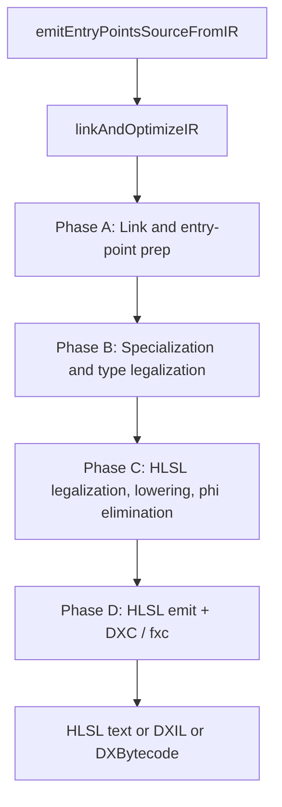
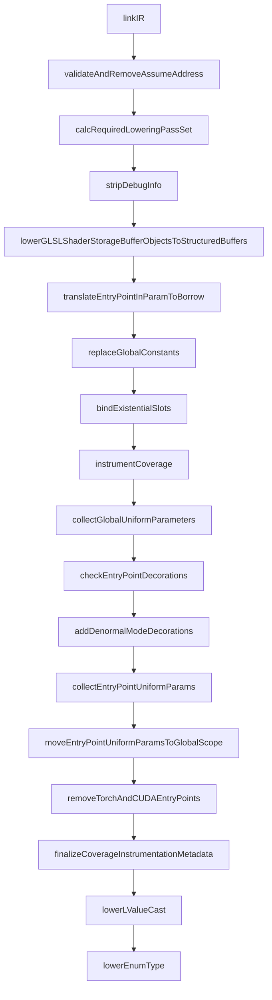
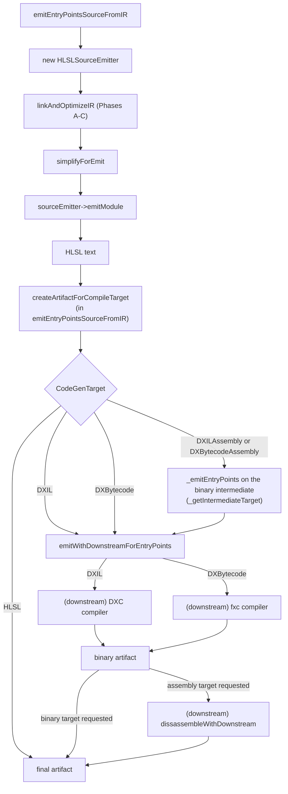

# HLSL Target Pipeline

This page documents the ordered IR-pass and downstream-binary
sequence executed when Slang compiles for the HLSL target. It is
written for a compiler developer who needs to find where in the
HLSL codegen pipeline a particular pass runs, what condition
selects it, and how the emitted HLSL source flows into DXC (DXIL)
or fxc (DXBytecode). Inside
`linkAndOptimizeIR` the only target-enum that ever appears is
`CodeGenTarget::HLSL`; downstream binary requests
(`CodeGenTarget::DXIL` for DXC and `CodeGenTarget::DXBytecode` for
the legacy fxc compiler) ride the same IR path; the emitted HLSL
text is wrapped into an `IArtifact` in `emitEntryPointsSourceFromIR`,
and the downstream-binary requests diverge only in the
downstream-compile dispatch (`emitWithDownstreamForEntryPoints`).
HLSL is detected via `isD3DTarget(targetRequest)` for several
internal predicate checks.

This page complements
[../pipeline/05-ir-passes.md](../pipeline/05-ir-passes.md), which
is an unordered topical catalog of every IR pass. Branches in
`linkAndOptimizeIR` gated on a sibling target (SPIR-V, Metal,
WGSL, CUDA, CPU, GLSL, PyTorch) are filtered out of the diagrams
and tables below.

**The sequence below is not an unconditional list.** A large and
growing share of the passes reachable for HLSL run only when the
linked IR actually contains the construct the pass handles. That
predicate is the `RequiredLoweringPassSet` struct declared in
[slang-code-gen.h](../../../../source/slang/slang-code-gen.h)
(lines 52-88, 34 boolean flags), computed by the recursive
`calcRequiredLoweringPassSet` walk at
[slang-emit.cpp](../../../../source/slang/slang-emit.cpp) line 405
and invoked twice inside `linkAndOptimizeIR` — once immediately
after `linkIR` (line 1049) and once after specialization
(line 1520). Flags **accumulate**: the second call does not reset
the struct, so a construct seen by the first scan keeps its flag
set even after specialization deletes it. That asymmetry is
deliberate: it makes each gate safe against false negatives (a
needed lowering is never skipped) at the cost of occasional
stale-true gates, which cost only a no-op module walk. When you
read the phase tables, treat a `reqSet.*` entry in the **Gate**
column as "this pass is skipped entirely on modules that never
used the feature", not as an optimization hint.

## Source

- [slang-emit.cpp](../../../../source/slang/slang-emit.cpp) —
  `linkAndOptimizeIR` (line 970) is the orchestrator;
  `emitEntryPointsSourceFromIR` (line 2746) constructs the
  `HLSLSourceEmitter` and emits HLSL text;
  `calcRequiredLoweringPassSet` (line 405) computes the gate
  predicate.
- [slang-code-gen.h](../../../../source/slang/slang-code-gen.h) —
  declares `RequiredLoweringPassSet` (the `reqSet.*` gates) and
  `CodeGenContext`.
- [slang-emit-hlsl.cpp](../../../../source/slang/slang-emit-hlsl.cpp)
  — `HLSLSourceEmitter` implementation.
- [slang-emit-hlsl-prelude.cpp](../../../../source/slang/slang-emit-hlsl-prelude.cpp)
  — `HLSLSourceEmitter` members that map IR constructs to HLSL
  *named* constants and type spellings:
  `emitWorkGraphRecordType` (line 539) plus its
  `getWorkGraphRecordTypeName` table (line 509), and
  `emitNamedMemoryTypeFlagSet` / `emitNamedSemanticFlagSet`
  (lines 553 and 586).
- [slang-emit-c-like.cpp](../../../../source/slang/slang-emit-c-like.cpp)
  — shared C-like emitter base class.
- [slang-ir-hlsl-legalize.cpp](../../../../source/slang/slang-ir-hlsl-legalize.cpp)
  — HLSL legalization helpers:
  `legalizeNonStructParameterToStructForHLSL`,
  `legalizeEmptyRayPayloadsForHLSL`,
  `legalizeRayPayloadAccessQualifiersForHLSL` (line 341), and
  `validateBarrierFlagsForHLSL` (line 69).
- [slang-ir-wrap-structured-buffers.cpp](../../../../source/slang/slang-ir-wrap-structured-buffers.cpp)
  — `wrapStructuredBuffersOfMatrices`, the HLSL-only structured-buffer-of-matrices wrapper.
- [slang-ir-legalize-binary-operator.cpp](../../../../source/slang/slang-ir-legalize-binary-operator.cpp)
  — `legalizeLogicalAndOr` runs for HLSL.
- [slang-target-program.h](../../../../source/slang/slang-target-program.h)
  / [slang-compiler-options.h](../../../../source/slang/slang-compiler-options.h)
  — gate sources.

## High-level phase diagram



Unlike Metal and WGSL, HLSL has **no single legalization driver**
function. The HLSL-specific transformations are spread across
several individual `SLANG_PASS` calls in Phases B and C.

## Phase A: Link and entry-point prep

Spans roughly lines 1005-1344 of
[slang-emit.cpp](../../../../source/slang/slang-emit.cpp), from the
`linkIR` call to `lowerEnumType`. HLSL hits the `default` arm of
every per-target switch in this phase. HLSL is non-Khronos, so the
`!isKhronosTarget && reqSet.glslSSBO` gate at line 1057 lets
`lowerGLSLShaderStorageBufferObjectsToStructuredBuffers` fire. The
first `calcRequiredLoweringPassSet` scan happens at line 1049,
before the first gated pass in the phase, so every `reqSet.*` gate
below is evaluated against freshly linked IR.



(Conditional gates are omitted from the diagram for readability;
see the conditional-gates table below for the full set.)

| # | Pass | File | Gate | Notes |
| --- | --- | --- | --- | --- |
| 1 | `linkIR` | [slang-ir-link.cpp](../../../../source/slang/slang-ir-link.cpp) | (always) | |
| 2 | `validateAndRemoveAssumeAddress` | [slang-ir-validate.cpp](../../../../source/slang/slang-ir-validate.cpp) | (always) | Line 1039. Its `validate` argument is `!isCPUTarget && !isCUDATarget` (line 1038), so HLSL passes `true`. |
| 3 | `stripDebugInfo` | [slang-ir-strip-debug-info.cpp](../../../../source/slang/slang-ir-strip-debug-info.cpp) | `reqSet.debugInfo && DebugInfoLevel::None` | |
| 4 | `lowerGLSLShaderStorageBufferObjectsToStructuredBuffers` | [slang-ir-lower-glsl-ssbo-types.cpp](../../../../source/slang/slang-ir-lower-glsl-ssbo-types.cpp) | `!isKhronosTarget && reqSet.glslSSBO` | HLSL is non-Khronos. |
| 5 | `translateEntryPointInParamToBorrow` | [slang-ir-transform-params-to-constref.cpp](../../../../source/slang/slang-ir-transform-params-to-constref.cpp) | (always) | |
| 6 | `replaceGlobalConstants` | [slang-ir-link.cpp](../../../../source/slang/slang-ir-link.cpp) | (always) | |
| 7 | `bindExistentialSlots` | [slang-ir-bind-existentials.cpp](../../../../source/slang/slang-ir-bind-existentials.cpp) | `reqSet.bindExistential` | |
| 8 | `instrumentCoverage` | [slang-ir-coverage-instrument.cpp](../../../../source/slang/slang-ir-coverage-instrument.cpp) | `reqSet.coverageTracing` | Receives a counter byte-width (`TraceCoverageCounterByteWidth`, default uint64; only 4 or 8 are valid — anything else raises `CoverageCounterWidthBytesInvalid`, **E45114**) and a boolean-coverage flag (`TraceCoverageBoolean`, off by default, spelled `-trace-coverage-boolean`) resolved inside the `reqSet.coverageTracing` block that opens at line 1109; the pass call itself is at line 1216. The `slangc` spelling of the width option is `-trace-coverage-counter-width`, which takes *bits* (32 or 64) and stores the corresponding byte width; the CLI parser rejects any other bit count as **E45113** before the byte width reaches this block, so E45114 is reachable only from a host that sets the API option directly. |
| 9 | `collectGlobalUniformParameters` | [slang-ir-collect-global-uniforms.cpp](../../../../source/slang/slang-ir-collect-global-uniforms.cpp) | (always) | |
| 10 | `checkEntryPointDecorations` | [slang-ir-entry-point-decorations.cpp](../../../../source/slang/slang-ir-entry-point-decorations.cpp) | (always) | |
| 11 | `addDenormalModeDecorations` | [slang-emit.cpp](../../../../source/slang/slang-emit.cpp) | (always) | Static helper (line 754). The call is unconditional but the body returns immediately unless one of the fp16 / fp32 / fp64 denormal modes is something other than `FloatingPointDenormalMode::Any` (line 764). The `FpDenormalPreserve` / `FpDenormalFlushToZero` decorations it then attaches to entry points are consumed only by the SPIR-V emitter ([slang-emit-spirv.cpp](../../../../source/slang/slang-emit-spirv.cpp) lines 6425 and 6443); nothing in the HLSL emitter reads them, so they leave no marker in emitted HLSL text. |
| 12 | `collectEntryPointUniformParams` | [slang-ir-entry-point-uniforms.cpp](../../../../source/slang/slang-ir-entry-point-uniforms.cpp) | (always, HLSL via `default` arm) | |
| 13 | `moveEntryPointUniformParamsToGlobalScope` | [slang-ir-entry-point-uniforms.cpp](../../../../source/slang/slang-ir-entry-point-uniforms.cpp) | (always, HLSL via `default` arm) | |
| 14 | `removeTorchAndCUDAEntryPoints` | [slang-ir-pytorch-cpp-binding.cpp](../../../../source/slang/slang-ir-pytorch-cpp-binding.cpp) | (always, HLSL via `default` arm) | |
| 15 | `finalizeCoverageInstrumentationMetadata` | [slang-ir-coverage-instrument.cpp](../../../../source/slang/slang-ir-coverage-instrument.cpp) | `reqSet.coverageTracing` | Post-packing pass that fills CPU/CUDA uniform-marshaling fields on the coverage `ArtifactPostEmitMetadata`. No-op for HLSL in practice. |
| 16 | `lowerLValueCast` | [slang-ir-lower-l-value-cast.cpp](../../../../source/slang/slang-ir-lower-l-value-cast.cpp) | `reqSet.lValueCast` (line 1337) | Flag is set by `kIROp_InOutImplicitCast` / `kIROp_OutImplicitCast` (line 618); previously unconditional. |
| 17 | `lowerEnumType` | [slang-ir-lower-enum-type.cpp](../../../../source/slang/slang-ir-lower-enum-type.cpp) | `reqSet.enumType` (line 1343) | |

Filtered out for HLSL in this phase: the CUDA / CUDAHeader arm of
the entry-point-param switch
(`collectOptiXEntryPointUniformParams`); the CPP / Host* arms.

## Phase B: Specialization and type legalization

Spans roughly lines 1357-1999 of `slang-emit.cpp`, from the first
`simplifyIR` to `wrapStructuredBuffersOfMatrices`. HLSL hits
unique arms in several places:

- `legalizeNonVectorCompositeSelect` runs (line 1498,
  `case CodeGenTarget::HLSL`).
- `lowerCooperativeVectors` is **skipped** for HLSL (line 1685,
  `case CodeGenTarget::HLSL: break;`). HLSL's cooperative-vector
  support is exposed via intrinsics that DXC understands directly,
  so Slang does not lower them.
- `validateBarrierFlagsForHLSL` runs (line 1735), gated on
  `(target == HLSL || isD3DTarget) && reqSet.barrierFlagValidation`.
  This is a *diagnostic* pass, not a transform, and it returns
  `SLANG_FAIL` immediately when it reports an error.
- `lowerCombinedTextureSamplers` fires (HLSL in the
  HLSL/Metal/WGSL arm at line 1770).
- `lowerAppendConsumeStructuredBuffers` is **skipped**
  (`target != HLSL` is false): HLSL has native
  `AppendStructuredBuffer<T>` and `ConsumeStructuredBuffer<T>`
  types.
- Inside the `shouldLegalizeExistentialAndResourceTypes` block:
  - `legalizeEmptyRayPayloadsForHLSL` runs (HLSL is in the
    `isD3DTarget || isSPIRV` arm at line 1845).
  - `legalizeNonStructParameterToStructForHLSL` runs (line 1854,
    `isD3DTarget` only).
  - `legalizeRayPayloadAccessQualifiersForHLSL` runs (line 1868)
    for DX profiles at shader model 6.7 or newer.
- `wrapStructuredBuffersOfMatrices` runs (HLSL-only arm at line
  1999).

The second `calcRequiredLoweringPassSet` scan sits in the middle of
this phase (line 1520), which is why gates such as
`reqSet.taggedUnion` and `reqSet.barrierFlagValidation` — both
evaluated after that point — can see constructs that specialization
introduced.

```mermaid
flowchart TD
  s1[simplifyIR default]
  vu[validateUniformity]
  sML[specializeMatrixLayout]
  fSC[fuseCallsToSaturatedCooperation]
  cAP[checkAutodiffPatterns]
  dCC[diagnoseCircularConformances]
  sM[specializeModule]
  sHOP[specializeHigherOrderParameters]
  adGate{reqSet.autodiff}
  fADP[finalizeAutoDiffPass]
  sADD[stripAutoDiffDecorations]
  lMSS[lowerMatrixSwizzleStores]
  dce1[eliminateDeadCode]
  fS[finalizeSpecialization]
  lDTI[lowerDiffTypeInfoInsts]
  lCT[lowerConditionalType]
  lRO[lowerReinterpretOptional]
  cONU[checkForOptionalNoneUsage]
  lOT[lowerOptionalType]
  lRT[lowerResultType]
  lNVCS["legalizeNonVectorCompositeSelect (HLSL only)"]
  lRPAQ["legalizeRayPayloadAccessQualifiersForHLSL<br/>(DX SM 6.7+ only)"]
  bfvGate{"reqSet.barrierFlagValidation<br/>(HLSL / D3D only)"}
  vBFH[validateBarrierFlagsForHLSL]
  lURH[lowerUntypedResourceHandleToUInt]
  reqSet2[calcRequiredLoweringPassSet]
  dUR[detectUninitializedResources]
  rAIDD[removeAvailableInDownstreamModuleDecorations]
  checks["checkForRecursive* checkForOutOfBoundAccess<br/>checkForMissingReturns checkForInvalidShaderParameterType"]
  iAVS[inferAnyValueSizeWhereNecessary]
  uPWT[unpinWitnessTables]
  lSVMI[lowerSumVectorMatrixInsts]
  s2aGate{"!fastIRSimplificationOptions.minimalOptimization"}
  s2a[simplifyIR fast]
  dce2a[eliminateDeadCode]
  lTUT[lowerTaggedUnionTypes]
  lUUT[lowerUntaggedUnionTypes]
  lR[lowerReinterpret]
  lSIDC[lowerSequentialIDTagCasts]
  lTI[lowerTagInsts]
  lTT[lowerTagTypes]
  dce3[eliminateDeadCode]
  lE[lowerExistentials]
  rWUI[removeWeakUseInsts]
  pTIN[performTypeInlining]
  cGSHI[checkGetStringHashInsts]
  dce4[eliminateDeadCode]
  lTu[lowerTuples]
  gAVMF[generateAnyValueMarshallingFunctions]
  sSS[specializeStageSwitch]
  lCV_skip["(skipped) lowerCooperativeVectors HLSL break"]
  pFI1[performForceInlining]
  minOptGate{fastIRSimplificationOptions.minimalOptimization}
  sccp["applySparseConditionalConstantPropagation"]
  dceMinOpt[eliminateDeadCode]
  s2b[simplifyIR default]
  lACSB_skip["(skipped) lowerAppendConsumeStructuredBuffers HLSL has native"]
  lCTS[lowerCombinedTextureSamplers]
  vERGate{getBoolOption VulkanEmitReflection}
  aUTHD[addUserTypeHintDecorations]
  lEA[legalizeEmptyArray]
  lVT[legalizeVectorTypes]
  iGC[inlineGlobalConstantsForLegalization]
  lERP[legalizeEmptyRayPayloadsForHLSL]
  lNSP[legalizeNonStructParameterToStructForHLSL]
  lETL[legalizeExistentialTypeLayout]
  vSBRT[validateStructuredBufferResourceTypes]
  lRTR[legalizeResourceTypes]
  lMT[legalizeMatrixTypes]
  s2cGate{fastIRSimplificationOptions.minimalOptimization}
  s2c[simplifyIR fast]
  dce2c[eliminateDeadCode]
  lDRH[lowerDynamicResourceHeap]
  sRU[specializeResourceUsage]
  sFBLA1[specializeFuncsForBufferLoadArgs]
  dBL[deferBufferLoad]
  sAP[specializeArrayParameters]
  cSA[checkStaticAssert]
  wSBoM[wrapStructuredBuffersOfMatrices]

  s1 --> vu --> sML --> fSC --> cAP --> dCC --> sM --> sHOP --> adGate
  adGate -->|true| fADP --> lMSS
  adGate -->|false| sADD --> lMSS
  lMSS --> dce1 --> fS --> lDTI --> lCT --> lRO --> cONU --> lOT --> lRT --> lNVCS --> reqSet2 --> dUR --> rAIDD --> checks --> iAVS --> uPWT --> lSVMI --> s2aGate
  s2aGate -->|true| s2a --> lTUT
  s2aGate -->|"false, and reqSet.generics"| dce2a --> lTUT
  lTUT --> lUUT --> lR --> lSIDC --> lTI --> lTT --> dce3 --> lE --> rWUI --> pTIN --> cGSHI --> dce4 --> lTu --> gAVMF --> sSS --> lCV_skip --> pFI1 --> minOptGate
  minOptGate -->|true| sccp --> dceMinOpt --> bfvGate
  minOptGate -->|false| s2b --> bfvGate
  bfvGate -->|true| vBFH --> lACSB_skip
  bfvGate -->|false| lACSB_skip
  lACSB_skip --> lCTS --> vERGate
  vERGate -->|true| aUTHD --> lEA
  vERGate -->|false| lEA
  lEA --> lVT --> iGC --> lERP --> lNSP --> lRPAQ --> lETL --> vSBRT --> lRTR --> lMT --> s2cGate
  s2cGate -->|true| dce2c --> lURH
  s2cGate -->|false| s2c --> lURH
  lURH --> lDRH --> sRU --> sFBLA1 --> dBL --> sAP --> cSA --> wSBoM
```



| # | Pass | File | Gate | Notes |
| --- | --- | --- | --- | --- |
| 1 | `simplifyIR` | [slang-ir-ssa-simplification.cpp](../../../../source/slang/slang-ir-ssa-simplification.cpp) | (always) | `defaultIRSimplificationOptions`. |
| 2 | `validateUniformity` | [slang-ir-uniformity.cpp](../../../../source/slang/slang-ir-uniformity.cpp) | `getBoolOption(ValidateUniformity)` | |
| 3 | `specializeMatrixLayout` | [slang-ir-specialize-matrix-layout.cpp](../../../../source/slang/slang-ir-specialize-matrix-layout.cpp) | (always) | |
| 4 | `fuseCallsToSaturatedCooperation` | [slang-ir-fuse-satcoop.cpp](../../../../source/slang/slang-ir-fuse-satcoop.cpp) | `!shouldPerformMinimumOptimizations` | |
| 5 | `checkAutodiffPatterns` | [slang-ir-check-differentiability.cpp](../../../../source/slang/slang-ir-check-differentiability.cpp) | `reqSet.autodiff` (line 1390) | |
| 6 | `diagnoseCircularConformances` | [slang-ir-any-value-inference.cpp](../../../../source/slang/slang-ir-any-value-inference.cpp) | (always) | |
| 7 | `specializeModule` | [slang-ir-specialize.cpp](../../../../source/slang/slang-ir-specialize.cpp) | `!isSpecializationDisabled()` | |
| 8 | `specializeHigherOrderParameters` | [slang-ir-defunctionalization.cpp](../../../../source/slang/slang-ir-defunctionalization.cpp) | `reqSet.higherOrderFunc` | |
| 9 | `finalizeAutoDiffPass` | [slang-ir-autodiff.cpp](../../../../source/slang/slang-ir-autodiff.cpp) | `reqSet.autodiff` (line 1446) | Exactly one of this row and the next always runs. |
| 10 | `stripAutoDiffDecorations` | [slang-ir-autodiff.cpp](../../../../source/slang/slang-ir-autodiff.cpp) | `!reqSet.autodiff` (the `else` arm at line 1452) | Removes the autodiff-only decorations that would otherwise pin `[__AutoDiffBuiltin]` types alive through DCE. |
| 11 | `lowerMatrixSwizzleStores` | [slang-ir-lower-matrix-swizzle-store.cpp](../../../../source/slang/slang-ir-lower-matrix-swizzle-store.cpp) | `reqSet.matrixSwizzleStore` | |
| 12 | `eliminateDeadCode` | [slang-ir-dce.cpp](../../../../source/slang/slang-ir-dce.cpp) | (always) | |
| 13 | `finalizeSpecialization` | [slang-ir-specialize.cpp](../../../../source/slang/slang-ir-specialize.cpp) | (always) | |
| 14 | `lowerDiffTypeInfoInsts` | [slang-emit.cpp](../../../../source/slang/slang-emit.cpp) (line 852) | `reqSet.autodiff` (line 1465) | Direct call, not `SLANG_PASS`. Defined locally in `slang-emit.cpp`, not in `slang-ir-autodiff.cpp`. |
| 15 | `lowerConditionalType` | [slang-ir-lower-conditional-type.cpp](../../../../source/slang/slang-ir-lower-conditional-type.cpp) | `reqSet.conditionalType` | |
| 16 | `lowerReinterpretOptional` | [slang-ir-lower-reinterpret.cpp](../../../../source/slang/slang-ir-lower-reinterpret.cpp) | `reqSet.optionalType` | |
| 17 | `checkForOptionalNoneUsage` | [slang-ir-check-optional-none-usage.cpp](../../../../source/slang/slang-ir-check-optional-none-usage.cpp) | `shouldRunNonEssentialValidation()` | |
| 18 | `lowerOptionalType` | [slang-ir-lower-optional-type.cpp](../../../../source/slang/slang-ir-lower-optional-type.cpp) | `reqSet.optionalType` | |
| 19 | `lowerResultType` | [slang-ir-lower-result-type.cpp](../../../../source/slang/slang-ir-lower-result-type.cpp) | `reqSet.resultType` | Now runs **after** `lowerOptionalType`: depends on accurate `getAnyValueSize()` results. |
| 20 | `legalizeNonVectorCompositeSelect` | [slang-ir-legalize-composite-select.cpp](../../../../source/slang/slang-ir-legalize-composite-select.cpp) | `reqSet.nonVectorCompositeSelect && target == HLSL` (lines 1493, 1497) | **HLSL-only.** DXC's `select` is only defined on vectors. |
| 21 | `detectUninitializedResources` | [slang-ir-detect-uninitialized-resources.cpp](../../../../source/slang/slang-ir-detect-uninitialized-resources.cpp) | (always) | |
| 22 | `removeAvailableInDownstreamModuleDecorations` | [slang-ir-redundancy-removal.cpp](../../../../source/slang/slang-ir-redundancy-removal.cpp) | `removeAvailableInDownstreamIR` | |
| 23 | `checkForRecursiveTypes` | [slang-ir-check-recursion.cpp](../../../../source/slang/slang-ir-check-recursion.cpp) | `shouldRunNonEssentialValidation()` | |
| 24 | `checkForRecursiveFunctions` | [slang-ir-check-recursion.cpp](../../../../source/slang/slang-ir-check-recursion.cpp) | `shouldRunNonEssentialValidation()` | |
| 25 | `checkForOutOfBoundAccess` | [slang-check-out-of-bound-access.cpp](../../../../source/slang/slang-check-out-of-bound-access.cpp) | `shouldRunNonEssentialValidation()` | |
| 26 | `checkForMissingReturns` | [slang-ir-missing-return.cpp](../../../../source/slang/slang-ir-missing-return.cpp) | `reqSet.missingReturn` | |
| 27 | `checkForInvalidShaderParameterType` | [slang-ir-check-shader-parameter-type.cpp](../../../../source/slang/slang-ir-check-shader-parameter-type.cpp) | `shouldRunNonEssentialValidation()` | |
| 28 | `inferAnyValueSizeWhereNecessary` | [slang-ir-any-value-inference.cpp](../../../../source/slang/slang-ir-any-value-inference.cpp) | (always) | |
| 29 | `unpinWitnessTables` | [slang-ir-strip-legalization-insts.cpp](../../../../source/slang/slang-ir-strip-legalization-insts.cpp) | (always) | |
| 30 | `lowerSumVectorMatrixInsts` | [slang-emit.cpp](../../../../source/slang/slang-emit.cpp) | `reqSet.sumVectorMatrix` (line 1586) | Static helper. Flag set by `kIROp_SumVectorElements` / `kIROp_SumMatrixElements` (line 620). |
| 31 | `simplifyIR` | [slang-ir-ssa-simplification.cpp](../../../../source/slang/slang-ir-ssa-simplification.cpp) | `!minimalOptimization` (line 1591) | `fastIRSimplificationOptions`. |
| 32 | `eliminateDeadCode` | [slang-ir-dce.cpp](../../../../source/slang/slang-ir-dce.cpp) | `minimalOptimization && reqSet.generics` (the `else if` arm at line 1593) | Mutually exclusive with the row above; in minimal-optimization mode with no generics in the module, neither runs. |
| 33 | `lowerTaggedUnionTypes` | [slang-ir-lower-dynamic-dispatch-insts.cpp](../../../../source/slang/slang-ir-lower-dynamic-dispatch-insts.cpp) | `reqSet.taggedUnion` (line 1606) | When it reports that it lowered something, the caller sets `reqSet.reinterpret = true` (line 1609) so row 33 below fires — the one place a gate flag is written by a pass result rather than by a scan. |
| 34 | `lowerUntaggedUnionTypes` | [slang-ir-lower-dynamic-dispatch-insts.cpp](../../../../source/slang/slang-ir-lower-dynamic-dispatch-insts.cpp) | (always) | |
| 35 | `lowerReinterpret` | [slang-ir-lower-reinterpret.cpp](../../../../source/slang/slang-ir-lower-reinterpret.cpp) | `reqSet.reinterpret` | |
| 36 | `lowerSequentialIDTagCasts` | [slang-ir-lower-dynamic-dispatch-insts.cpp](../../../../source/slang/slang-ir-lower-dynamic-dispatch-insts.cpp) | (always) | |
| 37 | `lowerTagInsts` | [slang-ir-lower-dynamic-dispatch-insts.cpp](../../../../source/slang/slang-ir-lower-dynamic-dispatch-insts.cpp) | (always) | |
| 38 | `lowerTagTypes` | [slang-ir-lower-dynamic-dispatch-insts.cpp](../../../../source/slang/slang-ir-lower-dynamic-dispatch-insts.cpp) | (always) | |
| 39 | `eliminateDeadCode` | [slang-ir-dce.cpp](../../../../source/slang/slang-ir-dce.cpp) | (always) | |
| 40 | `lowerExistentials` | [slang-ir-lower-dynamic-dispatch-insts.cpp](../../../../source/slang/slang-ir-lower-dynamic-dispatch-insts.cpp) | (always) | |
| 41 | `removeWeakUseInsts` | [slang-ir-redundancy-removal.cpp](../../../../source/slang/slang-ir-redundancy-removal.cpp) | (always) | |
| 42 | `performTypeInlining` | [slang-ir-inline.cpp](../../../../source/slang/slang-ir-inline.cpp) | `!isCpuLikeTarget` (true for HLSL) | |
| 43 | `checkGetStringHashInsts` | [slang-ir-string-hash.cpp](../../../../source/slang/slang-ir-string-hash.cpp) | `!isCpuLikeTarget && shouldRunNonEssentialValidation()` | |
| 44 | `lowerTuples` | [slang-ir-lower-tuple-types.cpp](../../../../source/slang/slang-ir-lower-tuple-types.cpp) | (always) | |
| 45 | `generateAnyValueMarshallingFunctions` | [slang-ir-any-value-marshalling.cpp](../../../../source/slang/slang-ir-any-value-marshalling.cpp) | (always) | |
| 46 | `specializeStageSwitch` | [slang-ir-specialize-stage-switch.cpp](../../../../source/slang/slang-ir-specialize-stage-switch.cpp) | `reqSet.specializeStageSwitch` | |
| - | *(skip)* `lowerCooperativeVectors` | [slang-ir-lower-coopvec.cpp](../../../../source/slang/slang-ir-lower-coopvec.cpp) | HLSL is the explicit `case HLSL: break;` arm at line 1685. | DXC handles cooperative vectors directly. |
| 47 | `performForceInlining` | [slang-ir-inline.cpp](../../../../source/slang/slang-ir-inline.cpp) | (always) | |
| 48 | `applySparseConditionalConstantPropagation` | [slang-ir-sccp.cpp](../../../../source/slang/slang-ir-sccp.cpp) | `fastIRSimplificationOptions.minimalOptimization` | Minimal-optimization branch (lines 1705-1718); cleans up dead branches revealed by force-inlining before `static_assert` checks. |
| 49 | `eliminateDeadCode` | [slang-ir-dce.cpp](../../../../source/slang/slang-ir-dce.cpp) | `fastIRSimplificationOptions.minimalOptimization` | Minimal-optimization branch; paired with the SCCP pass above. |
| 50 | `simplifyIR` | [slang-ir-ssa-simplification.cpp](../../../../source/slang/slang-ir-ssa-simplification.cpp) | `!minimalOptimization` (the `else` arm at line 1721) | Full simplification when not in minimal-optimization mode. |
| 51 | `validateBarrierFlagsForHLSL` | [slang-ir-hlsl-legalize.cpp](../../../../source/slang/slang-ir-hlsl-legalize.cpp) | `(target == HLSL \|\| isD3DTarget) && reqSet.barrierFlagValidation` (lines 1732-1733) | **HLSL/D3D only.** Diagnostic-only; `linkAndOptimizeIR` returns `SLANG_FAIL` at line 1737 if it reported an error. |
| - | *(skip)* `lowerAppendConsumeStructuredBuffers` | [slang-ir-lower-append-consume-structured-buffer.cpp](../../../../source/slang/slang-ir-lower-append-consume-structured-buffer.cpp) | `target != HLSL && reqSet.appendConsumeStructuredBuffer` (line 1753) is false for HLSL. | HLSL has native types. The `reqSet` conjunct is new; it does not change the HLSL outcome, but it means the pass no longer walks the module on other targets that never used the types. |
| 52 | `lowerCombinedTextureSamplers` | [slang-ir-lower-combined-texture-sampler.cpp](../../../../source/slang/slang-ir-lower-combined-texture-sampler.cpp) | `reqSet.combinedTextureSamplers` (HLSL arm at lines 1764-1770) | |
| 53 | `addUserTypeHintDecorations` | [slang-ir-user-type-hint.cpp](../../../../source/slang/slang-ir-user-type-hint.cpp) | `getBoolOption(VulkanEmitReflection)` (line 1774) | Rare for HLSL; only when Vulkan-style reflection is requested. |
| 54 | `legalizeEmptyArray` | [slang-ir-legalize-empty-array.cpp](../../../../source/slang/slang-ir-legalize-empty-array.cpp) | (always) | |
| 55 | `legalizeVectorTypes` | [slang-ir-legalize-vector-types.cpp](../../../../source/slang/slang-ir-legalize-vector-types.cpp) | (always) | |
| 56 | `inlineGlobalConstantsForLegalization` | [slang-ir-legalize-global-values.cpp](../../../../source/slang/slang-ir-legalize-global-values.cpp) | `shouldLegalizeExistentialAndResourceTypes` (default `true`) | |
| 57 | `legalizeEmptyRayPayloadsForHLSL` | [slang-ir-hlsl-legalize.cpp](../../../../source/slang/slang-ir-hlsl-legalize.cpp) | `isD3DTarget \|\| isSPIRV` (line 1845; HLSL is `isD3DTarget`) | Adds dummy fields to empty ray payloads for DXIL + NVAPI compatibility. |
| 58 | `legalizeNonStructParameterToStructForHLSL` | [slang-ir-hlsl-legalize.cpp](../../../../source/slang/slang-ir-hlsl-legalize.cpp) | `isD3DTarget` (line 1852) | **HLSL/DXIL only.** |
| 59 | `legalizeRayPayloadAccessQualifiersForHLSL` | [slang-ir-hlsl-legalize.cpp](../../../../source/slang/slang-ir-hlsl-legalize.cpp) | `isD3DTarget && profile.getFamily() == ProfileFamily::DX && profile.getVersion() >= ProfileVersion::DX_6_7` (lines 1862-1868) | **HLSL/DXIL only.** The profile is resolved by `getEffectiveTargetProfile(targetProgram->getTargetReq(), targetProgram->getOptionSet())` at the gate, not read off the target request directly. |
| 60 | `legalizeExistentialTypeLayout` | [slang-ir-legalize-types.cpp](../../../../source/slang/slang-ir-legalize-types.cpp) | `reqSet.existentialTypeLayout` (line 1872) | Must run after row 58, which unwraps `ForceVarIntoRayPayloadStructTemporarily` before this pass drops empty struct parameters. |
| 61 | `validateStructuredBufferResourceTypes` | [slang-ir-validate.cpp](../../../../source/slang/slang-ir-validate.cpp) | (always) | Direct call at line 1879, not `SLANG_PASS`. |
| 62 | `legalizeResourceTypes` | [slang-ir-legalize-types.cpp](../../../../source/slang/slang-ir-legalize-types.cpp) | (always) | |
| 63 | `legalizeMatrixTypes` | [slang-ir-legalize-matrix-types.cpp](../../../../source/slang/slang-ir-legalize-matrix-types.cpp) | (always) | Line 1931. |
| 64 | `eliminateDeadCode` | [slang-ir-dce.cpp](../../../../source/slang/slang-ir-dce.cpp) | `minimalOptimization` (the `if` arm at line 1938) | `deadCodeEliminationOptions`. |
| 65 | `simplifyIR` | [slang-ir-ssa-simplification.cpp](../../../../source/slang/slang-ir-ssa-simplification.cpp) | `!minimalOptimization` (the `else` arm at line 1941) | Mutually exclusive with the row above. |
| 66 | `lowerUntypedResourceHandleToUInt` | [slang-ir-lower-dynamic-resource-heap.cpp](../../../../source/slang/slang-ir-lower-dynamic-resource-heap.cpp) | `reqSet.untypedResourceHandle` (line 1949) | Guarantees no untyped `ResourceDescriptorHeap[i]` / `SamplerDescriptorHeap[j]` handle survives to emit: lowers any that peephole did not already collapse to its underlying `uint` index. |
| 67 | `lowerDynamicResourceHeap` | [slang-ir-lower-dynamic-resource-heap.cpp](../../../../source/slang/slang-ir-lower-dynamic-resource-heap.cpp) | `reqSet.dynamicResourceHeap` (line 1952) | |
| 68 | `specializeResourceUsage` | [slang-ir-specialize-resources.cpp](../../../../source/slang/slang-ir-specialize-resources.cpp) | (always) | |
| 69 | `specializeFuncsForBufferLoadArgs` | [slang-ir-specialize-buffer-load-arg.cpp](../../../../source/slang/slang-ir-specialize-buffer-load-arg.cpp) | (always) | |
| 70 | `deferBufferLoad` | [slang-ir-defer-buffer-load.cpp](../../../../source/slang/slang-ir-defer-buffer-load.cpp) | (always) | |
| 71 | `specializeArrayParameters` | [slang-ir-specialize-arrays.cpp](../../../../source/slang/slang-ir-specialize-arrays.cpp) | (always) | |
| 72 | `checkStaticAssert` | [slang-emit.cpp](../../../../source/slang/slang-emit.cpp) | (always) | Direct call (not `SLANG_PASS`) at line 1986; defined at line 655. Processes `static_assert` after specialization. |
| 73 | `wrapStructuredBuffersOfMatrices` | [slang-ir-wrap-structured-buffers.cpp](../../../../source/slang/slang-ir-wrap-structured-buffers.cpp) | `case HLSL` (lines 1990-1999) | **HLSL-only.** Wraps structured buffers whose element type is a matrix so that the `#pragma pack_matrix` directive applies. |

Filtered out for HLSL in this phase: the CUDA-derivative-wrapper
arm; PyTorch / CUDA passes; CPP/HostCPP arms
(`lowerComInterfaces`, `generateDllImportFuncs`,
`generateDllExportFuncs`); the HostVM early return at line 1666
(which runs `performForceInlining` + `simplifyIR` and returns
`SLANG_OK` without reaching any of the target-dependent passes
below); the Metal-only `legalizeEmptyTypes` arm at line 1901 and
the CPU/CUDA `legalizeEmptyTypes` at line 1911 — HLSL takes the
`shouldLegalizeExistentialAndResourceTypes` branch, so it reaches
`legalizeEmptyTypes` only later, in Phase C; the Metal-only
`lowerBufferElementTypeToStorageType (MetalParameterBlock)`
invocation at line 1813; the Metal-only
`wrapCBufferElementsForMetal`; CPU-LLVM
`lowerBufferElementTypeToStorageType (LLVM)` at line 1925.

## Phase C: HLSL legalization, lowering, phi elimination

Spans roughly lines 2017-2739 of `slang-emit.cpp`, from the
byte-address-buffer legalization block to `checkUnsupportedInst`.
HLSL has no single legalization driver; the target-specific work
consists of several individual passes spread through this phase.
HLSL is in the `default` arm of the per-target legalization switch
at line 2202, so neither `legalizeEntryPointsForGLSL` nor
`legalizeIRForMetal` nor `legalizeIRForWGSL` runs; HLSL relies on
DXC to interpret the emitted source. The most notable
HLSL-specific gates are `legalizeUniformBufferLoad` (line 2454,
HLSL is in the `isKhronosTarget || target == HLSL` arm) and the
optional `useBitCastFromUInt = true` for fxc-era profiles
(`ProfileVersion::DX_5_0` and earlier).

```mermaid
flowchart TD
  babbGate{reqSet.byteAddressBuffer}
  lBABOps_hlsl["legalizeByteAddressBufferOps<br/>(HLSL default options;<br/>useBitCastFromUInt=true for DX <= 5.0)"]
  vAO[validateAtomicOperations]
  gvvGate{reqSet.globalVaryingVar}
  tGVV[translateGlobalVaryingVar]
  rvirGate{reqSet.resolveVaryingInputRef}
  rvir[resolveVaryingInputRef]
  fEPC[fixEntryPointCallsites]
  fNRI[floatNonUniformResourceIndex]
  lLAO[legalizeLogicalAndOr]
  mGVI[moveGlobalVarInitializationToEntryPoints]
  sLOI[stripLegalizationOnlyInstructions]
  vVAM[validateVectorsAndMatrices]
  dce7[eliminateDeadCode]
  pLRC[processLateRequireCapabilityInsts]
  cUV[cleanUpVoidType]
  bqGate{reqSet.bindingQuery}
  lBQ[lowerBindingQueries]
  meshGate{reqSet.meshOutput}
  lMO[legalizeMeshOutputTypes]
  bcGate{reqSet.bitcast}
  lBC[lowerBitCast]
  lART[legalizeArrayReturnType]
  lUBL[legalizeUniformBufferLoad]
  optYGate{VulkanInvertY}
  iY[invertYOfPositionOutput]
  optWGate{VulkanUseDxPositionW}
  rcpW[rcpWOfPositionInput]
  lBETST_def["lowerBufferElementTypeToStorageType<br/>(Default policy)"]
  pFI2[performForceInlining]
  eMB[eliminateMultiLevelBreak]
  s2d[simplifyIR with removeTrivialSingleIterationLoops]
  lET2[legalizeEmptyTypes]
  livenessStartGate{shouldTrackLiveness}
  lStart["LivenessUtil::addVariableRangeStarts"]
  ePhi["eliminatePhis (default options)"]
  livenessEndGate{shouldTrackLiveness}
  lEnd["LivenessUtil::addRangeEnds"]
  sNSIR[simplifyNonSSAIR]
  aVSC[applyVariableScopeCorrection]
  cCM[collectCooperativeMetadata]
  uNEI[unexportNonEmbeddableIR]
  dhGate{"target != PyTorch &&<br/>targetCaps imply descriptor_handle"}
  eLayout["getOrCreateLayout"]
  cM["collectMetadata(targetProgram, *metadata)"]
  cUI[checkUnsupportedInst]

  babbGate -->|true| lBABOps_hlsl --> vAO
  babbGate -->|false| vAO
  vAO --> gvvGate
  gvvGate -->|true| tGVV --> rvirGate
  gvvGate -->|false| rvirGate
  rvirGate -->|true| rvir --> fEPC
  rvirGate -->|false| fEPC
  fEPC --> fNRI --> lLAO --> mGVI --> sLOI --> vVAM --> dce7 --> pLRC --> cUV --> bqGate
  bqGate -->|true| lBQ --> meshGate
  bqGate -->|false| meshGate
  meshGate -->|true| lMO --> bcGate
  meshGate -->|false| bcGate
  bcGate -->|true| lBC --> lART
  bcGate -->|false| lART
  lART --> lUBL --> optYGate
  optYGate -->|true| iY --> optWGate
  optYGate -->|false| optWGate
  optWGate -->|true| rcpW --> lBETST_def
  optWGate -->|false| lBETST_def
  lBETST_def --> pFI2 --> eMB --> s2d --> lET2 --> livenessStartGate
  livenessStartGate -->|true| lStart --> ePhi
  livenessStartGate -->|false| ePhi
  ePhi --> livenessEndGate
  livenessEndGate -->|true| lEnd --> sNSIR
  livenessEndGate -->|false| sNSIR
  sNSIR --> aVSC --> cCM --> uNEI --> dhGate
  dhGate -->|true| eLayout --> cM
  dhGate -->|false| cM
  cM --> cUI
```



| # | Pass | File | Gate | Notes |
| --- | --- | --- | --- | --- |
| 1 | `legalizeByteAddressBufferOps` | [slang-ir-byte-address-legalize.cpp](../../../../source/slang/slang-ir-byte-address-legalize.cpp) | `reqSet.byteAddressBuffer` (line 2017) | Pass call at line 2127. HLSL options: defaults except `useBitCastFromUInt = true` if `profile.getFamily() == DX && profile.getVersion() <= DX_5_0` (fxc/early DXC), set in the `case CodeGenTarget::HLSL` arm of the second options switch at lines 2102-2121. |
| 2 | `validateAtomicOperations` | [slang-ir-validate.cpp](../../../../source/slang/slang-ir-validate.cpp) | `target != SPIRV && target != SPIRVAssembly` (line 2148) | Called with `skipFuncParamValidation = true`. |
| 3 | `translateGlobalVaryingVar` | [slang-ir-translate-global-varying-var.cpp](../../../../source/slang/slang-ir-translate-global-varying-var.cpp) | `reqSet.globalVaryingVar` (line 2187) | Runs after specialization, not in Phase A. |
| 4 | `resolveVaryingInputRef` | [slang-ir-resolve-varying-input-ref.cpp](../../../../source/slang/slang-ir-resolve-varying-input-ref.cpp) | `reqSet.resolveVaryingInputRef` (line 2190) | |
| 5 | `fixEntryPointCallsites` | [slang-ir-fix-entrypoint-callsite.cpp](../../../../source/slang/slang-ir-fix-entrypoint-callsite.cpp) | (always) | Line 2193. |
| 6 | `floatNonUniformResourceIndex` | [slang-ir-float-non-uniform-resource-index.cpp](../../../../source/slang/slang-ir-float-non-uniform-resource-index.cpp) | `!isSPIRV(target)` (line 2270) | `NonUniformResourceIndexFloatMode::Textual` for the `NonUniformResourceIndex(...)` HLSL intrinsic: the marker is kept as a call in the emitted text rather than lowered away, so a user-written `textures[NonUniformResourceIndex(idx)].Sample(samp, uv)` reaches DXC with the wrapper intact. No stage restricts the idiom — `NonUniformResourceIndex` is declared `[require(cpp_cuda_glsl_hlsl_spirv, nonuniformqualifier)]` in [hlsl.meta.slang](../../../../source/slang/hlsl.meta.slang) (line 13949) and the pass gate is only `!isSPIRV(target)`. |
| 7 | `legalizeLogicalAndOr` | [slang-ir-legalize-binary-operator.cpp](../../../../source/slang/slang-ir-legalize-binary-operator.cpp) | `isD3DTarget \|\| isKhronosTarget \|\| isWGPUTarget \|\| isMetalTarget` (lines 2275-2277; HLSL qualifies as `isD3DTarget`) | DXC short-circuit-evaluates `&&` and `\|\|` on scalars only. |
| 8 | `moveGlobalVarInitializationToEntryPoints` | [slang-ir-explicit-global-init.cpp](../../../../source/slang/slang-ir-explicit-global-init.cpp) | HLSL / GLSL / WGSL arm at lines 2319-2322 | |
| 9 | `stripLegalizationOnlyInstructions` | [slang-ir-strip-legalization-insts.cpp](../../../../source/slang/slang-ir-strip-legalization-insts.cpp) | (always) | Line 2365. |
| 10 | `validateVectorsAndMatrices` | [slang-ir-validate.cpp](../../../../source/slang/slang-ir-validate.cpp) | (always) | Line 2394. |
| 11 | `eliminateDeadCode` | [slang-ir-dce.cpp](../../../../source/slang/slang-ir-dce.cpp) | (always) | Line 2404. |
| 12 | `processLateRequireCapabilityInsts` | [slang-ir-late-require-capability.cpp](../../../../source/slang/slang-ir-late-require-capability.cpp) | `reqSet.lateRequireCapability` (line 2415) | Flag set by `kIROp_LateRequireCapability` (line 624); previously unconditional. |
| 13 | `cleanUpVoidType` | [slang-ir-cleanup-void.cpp](../../../../source/slang/slang-ir-cleanup-void.cpp) | (always) | Line 2418. |
| 14 | `lowerBindingQueries` | [slang-ir-lower-binding-query.cpp](../../../../source/slang/slang-ir-lower-binding-query.cpp) | `reqSet.bindingQuery` (line 2432) | |
| 15 | `legalizeMeshOutputTypes` | [slang-ir-legalize-mesh-outputs.cpp](../../../../source/slang/slang-ir-legalize-mesh-outputs.cpp) | `reqSet.meshOutput` (line 2440) | |
| 16 | `lowerBitCast` | [slang-ir-lower-bit-cast.cpp](../../../../source/slang/slang-ir-lower-bit-cast.cpp) | `reqSet.bitcast` (line 2446) | |
| 17 | `legalizeArrayReturnType` | [slang-ir-legalize-array-return-type.cpp](../../../../source/slang/slang-ir-legalize-array-return-type.cpp) | `!isMetalTarget && !isSPIRV` (line 2451; true for HLSL) | DXC disallows array return values. |
| 18 | `legalizeUniformBufferLoad` | [slang-ir-legalize-uniform-buffer-load.cpp](../../../../source/slang/slang-ir-legalize-uniform-buffer-load.cpp) | `isKhronosTarget \|\| target == HLSL` (line 2454) | |
| 19 | `invertYOfPositionOutput` | [slang-ir-vk-invert-y.cpp](../../../../source/slang/slang-ir-vk-invert-y.cpp) | `(isKhronosTarget \|\| HLSL) && VulkanInvertY` (line 2457) | Rare for HLSL; for cross-API porting workflows. |
| 20 | `rcpWOfPositionInput` | [slang-ir-vk-invert-y.cpp](../../../../source/slang/slang-ir-vk-invert-y.cpp) | `(isKhronosTarget \|\| HLSL) && VulkanUseDxPositionW` (line 2459) | |
| 21 | `lowerBufferElementTypeToStorageType` | [slang-ir-lower-buffer-element-type.cpp](../../../../source/slang/slang-ir-lower-buffer-element-type.cpp) | (always) | Line 2476; `loweringPolicyKind = Default` — HLSL falls through the WGPU / Khronos / Metal chain at lines 2464-2475 to the `else`. |
| 22 | `performForceInlining` | [slang-ir-inline.cpp](../../../../source/slang/slang-ir-inline.cpp) | (always) | Line 2517. |
| 23 | `eliminateMultiLevelBreak` | [slang-ir-eliminate-multilevel-break.cpp](../../../../source/slang/slang-ir-eliminate-multilevel-break.cpp) | (always) | Line 2524. |
| 24 | `simplifyIR` | [slang-ir-ssa-simplification.cpp](../../../../source/slang/slang-ir-ssa-simplification.cpp) | `!minimalOptimization` (line 2530) | With `removeTrivialSingleIterationLoops = true`. |
| 25 | `legalizeEmptyTypes` | [slang-ir-legalize-types.cpp](../../../../source/slang/slang-ir-legalize-types.cpp) | (always) | Line 2542. This is HLSL's only `legalizeEmptyTypes` invocation; the two earlier calls in Phase B are Metal-only and CPU/CUDA-only. |
| 26 | `LivenessUtil::addVariableRangeStarts` | [slang-ir-liveness.cpp](../../../../source/slang/slang-ir-liveness.cpp) | `codeGenContext->shouldTrackLiveness()` (line 2564) | Inserts `IRLiveRangeStart` markers immediately before `eliminatePhis` so the explicit temporaries it introduces inherit live-range start positions. |
| 27 | `eliminatePhis` | [slang-ir-eliminate-phis.cpp](../../../../source/slang/slang-ir-eliminate-phis.cpp) | (always) | Line 2576. **Default options.** The `PhiEliminationOptions` overrides at lines 2571-2575 apply only when `isKhronosTarget && emitSpirvDirectly`, so HLSL gets neither `useRegisterAllocation` nor `eliminateCompositeTypedPhiOnly = false`. |
| 28 | `LivenessUtil::addRangeEnds` | [slang-ir-liveness.cpp](../../../../source/slang/slang-ir-liveness.cpp) | `codeGenContext->shouldTrackLiveness()` (line 2580) | Inserts `IRLiveRangeEnd` markers after phi elimination, paired with the range-start markers added in row 26. |
| 29 | `simplifyNonSSAIR` | [slang-ir-ssa-simplification.cpp](../../../../source/slang/slang-ir-ssa-simplification.cpp) | (always) | Line 2620. |
| 30 | `applyVariableScopeCorrection` | [slang-ir-variable-scope-correction.cpp](../../../../source/slang/slang-ir-variable-scope-correction.cpp) | `target != SPIRV && target != SPIRVAssembly` (line 2695) | Line 2703. |
| 31 | `collectCooperativeMetadata` | [slang-ir-metadata.cpp](../../../../source/slang/slang-ir-metadata.cpp) | `targetCaps` implies `cooperative_matrix` or `cooperative_vector` (lines 2710-2716) | HLSL exposes cooperative matrices via DXR / DXC extensions. |
| 32 | `unexportNonEmbeddableIR` | [slang-emit.cpp](../../../../source/slang/slang-emit.cpp) | `EmbedDownstreamIR` (line 2721) | |
| 33 | `getOrCreateLayout` | [slang-target-program.h](../../../../source/slang/slang-target-program.h) (defined in [slang-parameter-binding.cpp](../../../../source/slang/slang-parameter-binding.cpp)) | `target != PyTorchCppBinding && targetCaps` imply `descriptor_handle` (lines 2726-2734) | Ensures the program layout exists before `collectMetadata` reads it; fires for HLSL when the target capabilities imply `descriptor_handle`. Returns `SLANG_FAIL` if layout creation fails. |
| 34 | `collectMetadata` | [slang-ir-metadata.cpp](../../../../source/slang/slang-ir-metadata.cpp) | (always) | Line 2736. Takes `targetProgram` as its first argument, so it can consult the program layout when emitting descriptor-handle metadata. |
| 35 | `checkUnsupportedInst` | [slang-ir-check-unsupported-inst.cpp](../../../../source/slang/slang-ir-check-unsupported-inst.cpp) | `!shouldPerformMinimumOptimizations()` (line 2738) | Last pass in `linkAndOptimizeIR`. |

Filtered out for HLSL in this phase: `synthesizeActiveMask` (CUDA
only); `resolveTextureFormat` (GLSL / SPIR-V / WGSL only);
`legalizeEntryPointsForGLSL` (GLSL/SPIR-V only);
`legalizeIRForMetal` (Metal only);
`legalizeEntryPointVaryingParamsForCPU` (CPU only);
`legalizeEntryPointVaryingParamsForCUDA` (CUDA only);
`legalizeIRForWGSL` (WGSL only);
`legalizeDynamicResourcesForGLSL` (Khronos only);
`legalizeImageSubscript` (Metal/GLSL/SPIR-V only);
`legalizeConstantBufferLoadForGLSL` and
`legalizeDispatchMeshPayloadForGLSL` (GLSL/SPIR-V only);
`legalizeBoolSwitchForTargetsRequiringIntSwitch`
([slang-ir-glsl-legalize.cpp](../../../../source/slang/slang-ir-glsl-legalize.cpp),
called at line 2223 for GLSL/SPIR-V and line 2261 for WGSL) — those
targets require an integer `switch` selector, whereas HLSL accepts a
`switch` on a `bool` directly, so no rewrite is needed;
the Metal-only late block at lines 2651-2687, which re-runs
`lowerBufferElementTypeToStorageType` (`MetalPointerLowering`),
`performForceInlining`, a **second** `eliminatePhis`, and a second
`simplifyNonSSAIR` — HLSL runs each of `eliminatePhis` and
`simplifyNonSSAIR` exactly once;
`introduceExplicitGlobalContext` (SPIR-V experimental and
CPU/Metal/CUDA fallthrough);
`transformParamsToConstRef` (SPIR-V / CPU / CUDA / Metal only);
`undoParameterCopy` (CPU/CUDA/Metal only);
`removeRawDefaultConstructors` (SPIR-V direct emit / CPU LLVM);
`performGLSLResourceReturnFunctionInlining` (Khronos only);
`specializeAddressSpace`, `specializeAddressSpaceForMetal`,
`specializeAddressSpaceForWGSL` (their respective targets);
`specializeFuncsForBufferLoadArgs` second invocation (SPIR-V
direct emit only); `lowerImmutableBufferLoadForCUDA` (CUDA only);
`performIntrinsicFunctionInlining` (SPIR-V direct emit only);
`legalizeModesOfNonCopyableOpaqueTypedParamsForGLSL` (via-GLSL
only); `applyGLSLLiveness` (Khronos only);
`replaceLocationIntrinsicsWithRaytracingObject` (SPIR-V only).

## Phase D: HLSL emit and downstream tools

Phase D begins immediately after `linkAndOptimizeIR` returns to
`emitEntryPointsSourceFromIR` (line 2746). The `HLSLSourceEmitter`
(constructed at line 2836 of `slang-emit.cpp`) walks the IR and
produces HLSL text. The downstream chain depends on which
`CodeGenTarget` was requested:

- `CodeGenTarget::HLSL` — stop at the text artifact.
- `CodeGenTarget::DXIL` — invoke DXC to compile HLSL into DXIL
  (the modern path; shader model 6.0 and later).
- `CodeGenTarget::DXBytecode` — invoke fxc to compile HLSL into
  D3D bytecode (the legacy path; shader model 5.x and earlier).
- `CodeGenTarget::DXILAssembly` / `CodeGenTarget::DXBytecodeAssembly`
  — neither reaches `emitWithDownstreamForEntryPoints` directly.
  `CodeGenContext::_emitEntryPoints` (line 1119 of
  [slang-code-gen.cpp](../../../../source/slang/slang-code-gen.cpp))
  first recurses on the binary intermediate returned by
  `_getIntermediateTarget` (line 1077: `DXILAssembly` maps to
  `DXIL`, `DXBytecodeAssembly` to `DXBytecode`), then hands that
  binary to `ArtifactOutputUtil::dissassembleWithDownstream`
  (line 1137).



| # | Pass | File | Gate | Notes |
| --- | --- | --- | --- | --- |
| 1 | `emitEntryPointsSourceFromIR` | [slang-emit.cpp](../../../../source/slang/slang-emit.cpp) | (entry point) | Line 2746. |
| 2 | `new HLSLSourceEmitter` | [slang-emit-hlsl.cpp](../../../../source/slang/slang-emit-hlsl.cpp) | `case SourceLanguage::HLSL` (line 2834) | Constructed at line 2836. |
| 3 | `sourceEmitter->init` | [slang-emit-c-like.cpp](../../../../source/slang/slang-emit-c-like.cpp) | (always) | Line 2870. |
| 4 | `linkAndOptimizeIR` | [slang-emit.cpp](../../../../source/slang/slang-emit.cpp) | (always) | Line 2890. Runs Phases A-C. |
| 5 | `simplifyForEmit` | [slang-ir-ssa-simplification.cpp](../../../../source/slang/slang-ir-ssa-simplification.cpp) | (always) | Line 2895. |
| 6 | `sourceEmitter->emitModule` | [slang-emit-c-like.cpp](../../../../source/slang/slang-emit-c-like.cpp) (+ HLSL overrides in `slang-emit-hlsl.cpp`) | (always) | Line 2903. Walks IR and writes HLSL text; prelude comes from `slang-emit-hlsl-prelude.cpp`. |
| 7 | `createArtifactForCompileTarget` | [slang-emit.cpp](../../../../source/slang/slang-emit.cpp) | (always) | At line 2972 of `emitEntryPointsSourceFromIR`; wraps the HLSL text as an `IArtifact`. (`createArtifactFromIR` is the SPIR-V-direct helper and is not on the HLSL path.) |
| 8 | `_emitEntryPoints` (intermediate recursion) | [slang-code-gen.cpp](../../../../source/slang/slang-code-gen.cpp) | `target == DXILAssembly \|\| target == DXBytecodeAssembly` | Lines 1119-1131: re-enters `_emitEntryPoints` on the binary intermediate (`DXIL` / `DXBytecode`) before any disassembly. |
| 9 | `compile` (DXC) | (downstream) | `target == DXIL` (line 1191) | Reached via `emitWithDownstreamForEntryPoints` after `_getDefaultSourceForTarget` maps the target to `CodeGenTarget::HLSL`. DXC is the default for SM 6.0+; output is DXIL bytecode. |
| 10 | `compile` (fxc) | (downstream) | `target == DXBytecode` (line 1192) | Reached via `emitWithDownstreamForEntryPoints`. Legacy path; fxc compiles HLSL into D3D bytecode for SM 5.x. |
| 11 | `dissassembleWithDownstream` | (downstream) | `target == DXILAssembly \|\| target == DXBytecodeAssembly` | Line 1137 of `slang-code-gen.cpp`: disassembles the binary produced by row 8 into the requested assembly text. |

Neither spirv-link nor spirv-val nor spirv-opt apply to HLSL.
Slang still validates and optimizes its own IR before emitting text
— `validateVectorsAndMatrices` and `eliminateDeadCode` at lines
2394-2404 of `slang-emit.cpp`, and `checkUnsupportedInst` at line
2739 — but validation and optimization *of the emitted HLSL* is
delegated to DXC or fxc.

### Shape of the emitted file

The module text produced by `emitModule` is not the whole artifact.
`emitEntryPointsSourceFromIR` stitches the file together in a fixed
order at lines 2938-2969 of
[slang-emit.cpp](../../../../source/slang/slang-emit.cpp): front
matter, then the language prelude, then `emitPreModule`, then the
module code. So every HLSL artifact opens with whatever
`HLSLSourceEmitter::emitFrontMatterImpl`
([slang-emit-hlsl.cpp](../../../../source/slang/slang-emit-hlsl.cpp)
line 2534) wrote:

- A `#pragma pack_matrix(...)` directive, always, whose argument
  follows `CompilerOptionSet::getMatrixLayoutMode()` (lines
  2588-2597). Under `slangc` that resolves to `column_major`.
- Immediately *before* the pragma, and only when emit found an
  `IRRequiresNVAPIDecoration` on some instruction,
  `#define SLANG_HLSL_ENABLE_NVAPI 1` and
  `#define NV_HITOBJECT_USE_MACRO_API 1` (lines 2536-2547), plus
  `#define NV_SHADER_EXTN_SLOT` / `NV_SHADER_EXTN_REGISTER_SPACE`
  when an `IRNVAPISlotDecoration` supplies them.

The HLSL prelude that follows guards its `#include "nvHLSLExtns.h"`
behind `#ifdef SLANG_HLSL_ENABLE_NVAPI`, so the include is present
in every artifact but inert unless the front matter defined the
macro. `emitGlobalInstImpl` (line 2600) mirrors that: a global
carrying `IRNVAPIMagicDecoration` is wrapped in
`#ifndef SLANG_HLSL_ENABLE_NVAPI` so the prelude's NVAPI
declarations win when the header is live.

Within the module text, resource types keep their HLSL native
spellings rather than being renamed.
`HLSLSourceEmitter::_emitHLSLTextureType` (line 320) composes the
name from an access prefix (`RW`, `RasterizerOrdered`, `Append`,
`Consume`, `Feedback`), a base shape (`Texture1D`, `Texture2D`,
`Texture3D`, `TextureCube`, `Buffer`), then `MS`, then `Array`, then
`<ElementType>` with the sample count appended when it is non-zero —
so `Texture2DArray`, `TextureCubeArray`, `Texture2DMS<T, N>` and
`RWTexture1D/2D/3D` all fall out of one composition rather than a
per-variant table. Samplers emit as `SamplerState` /
`SamplerComparisonState` (lines 1931-1943). Each binds through
`_emitHLSLRegisterSemantic` (line 83), which maps
`LayoutResourceKind` to the register class letter: `ConstantBuffer`
to `b`, `ShaderResource` to `t`, `UnorderedAccess` to `u`,
`SamplerState` to `s` (lines 170-183). An unhandled kind is a
diagnosed internal error, not a silent fallback. Intrinsic method
spellings are not rewritten at emit
either; `Sample`, `SampleLevel`, `SampleGrad`, `Load`, the `Gather*`
family, `SampleCmp` and `SampleCmpLevelZero` are carried through as
the `__intrinsic_asm` strings attached to their declarations in
[hlsl.meta.slang](../../../../source/slang/hlsl.meta.slang) — line
1408 for `.Sample`, line 4370 for the spliced
`.Gather$(compareFunc)$(componentFunc)` family.

### Emitting HLSL named constants rather than integers

DXC resolves HLSL's named constants (attribute strings, barrier
flag identifiers, work-graph record type names) at parse time, so
the numeric value behind a name is DXC's internal detail and may
change. The HLSL backend therefore never bakes an integer where the
HLSL source spelling is a name: the IR carries the *name* (an
`IRStringLit`, or an intrinsic-backed operation the emitter can map)
and the emitter reconstructs the spelling. Three instances of that
pattern are worth knowing when reading emitter output:

- **Entry-point attributes.** `emitEntryPointAttributesImpl`
  ([slang-emit-hlsl.cpp](../../../../source/slang/slang-emit-hlsl.cpp)
  line 429) writes `[shader("<stageName>")]` for DX profiles at
  shader model 6.1 or newer, and unconditionally for the `node`
  stage (line 438) — a node entry point always needs the attribute
  regardless of the declared profile version. For a node entry
  point it then emits `[NodeLaunch("...")]` by copying the string
  operand of `IRNodeLaunchDecoration` verbatim
  (`launchDecor->getMode()->getStringSlice()`, lines 586-591), so
  the output reads `[NodeLaunch("broadcasting")]` and never
  `[NodeLaunch(0)]`. `[NodeMaxDispatchGrid(x, y, z)]` follows from
  `IRNodeMaxDispatchGridDecoration`, where the operands genuinely
  are integers.
- **Work-graph record types.** `emitWorkGraphRecordType`
  ([slang-emit-hlsl-prelude.cpp](../../../../source/slang/slang-emit-hlsl-prelude.cpp)
  line 539) emits the HLSL type name followed by an optional
  `<ElementType>` argument. The opcode → name table is
  `getWorkGraphRecordTypeName` (line 509) and covers ten record
  type opcodes: `DispatchNodeInputRecord`, `ThreadNodeInputRecord`,
  `GroupNodeInputRecords`, `EmptyNodeInput`,
  `ThreadNodeOutputRecords`, `GroupNodeOutputRecords`,
  `NodeOutput`, `NodeOutputArray`, `EmptyNodeOutput`, and
  `EmptyNodeOutputArray`. The element type is recovered through
  `getWorkGraphRecordElementType`, and an opcode outside the table
  is an internal error (`SLANG_UNEXPECTED`) rather than a silent
  fallback. The dispatch into this helper is the record-type arm of
  `emitSimpleTypeImpl` at
  [slang-emit-hlsl.cpp](../../../../source/slang/slang-emit-hlsl.cpp)
  lines 1869-1880.
- **Barrier flag sets.** `tryEmitInstExprImpl`
  ([slang-emit-hlsl.cpp](../../../../source/slang/slang-emit-hlsl.cpp)
  line 1134) handles `kIROp_GetEnumBarrierMemoryTypeFlags` and
  `kIROp_GetEnumBarrierSemanticFlags` (lines 1177-1195) by reading
  the constant behind the operand with `getBarrierFlagValueInst`
  and delegating to `emitNamedMemoryTypeFlagSet` /
  `emitNamedSemanticFlagSet`
  ([slang-emit-hlsl-prelude.cpp](../../../../source/slang/slang-emit-hlsl-prelude.cpp)
  lines 553 and 586). Those write the all-bits shorthand
  (`ALL_MEMORY`, `REORDER`) when the value matches it exactly, and
  otherwise a `|`-joined list of per-bit names from
  `getBarrierMemoryTypeFlagName` (line 432). Each helper wraps its
  own output in parentheses regardless of which form it took, so
  the flag argument always arrives parenthesised at the call site:

  ```
  Barrier((ALL_MEMORY), (REORDER));
  Barrier((UAV_MEMORY | NODE_INPUT_MEMORY), (GROUP_SYNC | DEVICE_SCOPE));
  ```

  Both assert that the
  emit-side name table covers every known flag bit and that the
  incoming value is a valid flag set, which is why
  `validateBarrierFlagsForHLSL` (Phase B row 51) must run first: it
  diagnoses a flag set with no HLSL spelling as a user-facing error
  so the emitter's `SLANG_RELEASE_ASSERT` is unreachable in
  practice.

The helpers `getBarrierFlagValueInst` and
`isValidBarrierMemoryTypeFlags` that both the validation pass and
the emitter share live in
[slang-ir-util-hlsl.cpp](../../../../source/slang/slang-ir-util-hlsl.cpp).
The `node` stage itself — the `node` capability atom and the
`Node` profile stage that make these attributes reachable — is
described in
[../cross-cutting/targets.md](../cross-cutting/targets.md); this
page covers only how the HLSL backend spells them.

## Conditional gates

### `requiredLoweringPassSet.*` flags

`RequiredLoweringPassSet` declares 34 flags
([slang-code-gen.h](../../../../source/slang/slang-code-gen.h) lines
52-88). The table below lists the ones that gate a pass on the HLSL
path, in roughly pipeline order, with the IR construct whose
presence sets the flag during `calcRequiredLoweringPassSet`. Where a
gate was made conditional recently — that is, where the pass used to
run unconditionally — the row says so, because those are the rows
most likely to contradict older notes or an older reading of this
page.

| Gate | Set by | Passes it controls |
| --- | --- | --- |
| `debugInfo` | the eleven `kIROp_Debug*` opcodes (`DebugValue`, `DebugVar`, `DebugLine`, `DebugLocationDecoration`, `DebugSource`, `DebugInlinedAt`, `DebugScope`, `DebugNoScope`, `DebugFunction`, `DebugBuildIdentifier`, `DebugCompilationUnit`) | `stripDebugInfo` (Phase A) with `DebugInfoLevel::None`. |
| `glslSSBO` | `kIROp_GLSLShaderStorageBufferType` | `lowerGLSLShaderStorageBufferObjectsToStructuredBuffers` (Phase A) — fires for HLSL. |
| `bindExistential` | `kIROp_BindExistentialSlotsDecoration` | `bindExistentialSlots`. |
| `coverageTracing` | `kIROp_IncrementCoverageCounter`, `kIROp_IncrementFunctionCoverageCounter`, `kIROp_IncrementBranchCoverageCounter` | `instrumentCoverage` and `finalizeCoverageInstrumentationMetadata` (Phase A). |
| `lValueCast` | `kIROp_InOutImplicitCast`, `kIROp_OutImplicitCast` | `lowerLValueCast` — **newly gated**; previously unconditional. |
| `enumType` | `kIROp_EnumType`, plus the `kIROp_CastEnumToInt` / `kIROp_CastIntToEnum` / `kIROp_EnumCast` casts | `lowerEnumType`. The casts matter because constant folding can delete the last live `IREnumType` and leave a degenerate cast behind, which would strand at emit if only the type were flagged. |
| `autodiff` | `IRTranslateBase`, `IRTranslatedTypeBase`, `IRDifferentialPairTypeBase`, `IRMakeDifferentialPairBase`, `IRDifferentialPairGetDifferentialBase`, `IRDifferentialPairGetPrimalBase` (matched by base class so new leaf opcodes keep matching), an `IRAttributedType` carrying `IRNoDiffAttr`, and the single opcodes `kIROp_Annotation`, `kIROp_DetachDerivative`, `kIROp_BackwardDifferentiate`, `kIROp_ForwardDifferentiate`, `kIROp_DiffTypeInfo` | `checkAutodiffPatterns`, `finalizeAutoDiffPass`, `lowerDiffTypeInfoInsts` — **newly gated**. When the flag is clear, the `else` arm runs `stripAutoDiffDecorations` instead of `finalizeAutoDiffPass`, so autodiff-only decorations that pin builtins alive are still removed before DCE. |
| `higherOrderFunc` | a `kIROp_Param` whose data type is an `IRFuncType` | `specializeHigherOrderParameters`. |
| `matrixSwizzleStore` | `kIROp_MatrixSwizzleStore` | `lowerMatrixSwizzleStores`. |
| `conditionalType` | `kIROp_ConditionalType` | `lowerConditionalType`. |
| `optionalType` | `kIROp_OptionalType` | `lowerReinterpretOptional`, `lowerOptionalType`. |
| `resultType` | `kIROp_ResultType` | `lowerResultType`. |
| `nonVectorCompositeSelect` | `kIROp_Select` whose type is not scalar or vector | `legalizeNonVectorCompositeSelect` — **HLSL is the only target that fires this pass.** |
| `missingReturn` | `kIROp_MissingReturn` | `checkForMissingReturns`. |
| `sumVectorMatrix` | `kIROp_SumVectorElements`, `kIROp_SumMatrixElements` | `lowerSumVectorMatrixInsts` — **newly gated**; previously unconditional. |
| `generics` | the existential opcodes (`kIROp_MakeExistential`, `kIROp_ExtractExistential*`, `kIROp_WrapExistential`, `kIROp_CreateExistentialObject`, `kIROp_LookupWitnessMethod`), `kIROp_Specialize` when the specialized callee has no target-intrinsic decoration, and the existential-layout opcodes below | The bare `eliminateDeadCode` that substitutes for `simplifyIR` in minimal-optimization mode (line 1593). |
| `taggedUnion` | `kIROp_TaggedUnionType`, `kIROp_MakeTaggedUnion`, `kIROp_Get*FromTaggedUnion`, `kIROp_CastInterfaceToTaggedUnionPtr` | `lowerTaggedUnionTypes` — **newly gated**; previously unconditional. |
| `reinterpret` | `kIROp_Reinterpret` | `lowerReinterpret`. Also set imperatively by `lowerTaggedUnionTypes` reporting that it lowered something. |
| `specializeStageSwitch` | `kIROp_GetCurrentStage` | `specializeStageSwitch`. |
| `barrierFlagValidation` | `kIROp_GetEnumBarrierMemoryTypeFlags`, `kIROp_GetEnumBarrierSemanticFlags` | `validateBarrierFlagsForHLSL` — **HLSL / D3D only**, and new. |
| `combinedTextureSamplers` | a `kIROp_TextureType` whose `isCombined` operand is a non-zero literal, or is not a literal at all — and only on non-Khronos targets, so HLSL qualifies | `lowerCombinedTextureSamplers`. |
| `existentialTypeLayout` | `kIROp_PseudoPtrType`, `kIROp_BoundInterfaceType`, `kIROp_BindExistentialsType`, `kIROp_BindExistentialSlotsDecoration` | `legalizeExistentialTypeLayout`. |
| `untypedResourceHandle` | `kIROp_UntypedResourceHandleType`, `kIROp_UntypedSamplerHandleType`, and the four `Cast*UntypedResource/SamplerHandle*` casts | `lowerUntypedResourceHandleToUInt`. |
| `dynamicResourceHeap` | `kIROp_GetDynamicResourceHeap` | `lowerDynamicResourceHeap`. |
| `byteAddressBuffer` | `kIROp_ByteAddressBufferLoad`/`Store`, `kIROp_HLSL(RW)ByteAddressBufferType` | `legalizeByteAddressBufferOps`. |
| `globalVaryingVar` | `kIROp_GlobalInputDecoration`, `kIROp_GlobalOutputDecoration`, `kIROp_GetWorkGroupSize` | `translateGlobalVaryingVar`. |
| `resolveVaryingInputRef` | `kIROp_ResolveVaryingInputRef` | `resolveVaryingInputRef`. |
| `lateRequireCapability` | `kIROp_LateRequireCapability` | `processLateRequireCapabilityInsts` — **newly gated**; previously unconditional. |
| `bindingQuery` | `kIROp_GetRegisterIndex`, `kIROp_GetRegisterSpace` | `lowerBindingQueries`. |
| `meshOutput` | `kIROp_VerticesType`, `kIROp_IndicesType`, `kIROp_PrimitivesType` | `legalizeMeshOutputTypes`. |
| `bitcast` | `kIROp_BitCast` | `lowerBitCast`. |

Flags that exist but **never gate an HLSL pass**:
`derivativePyBindWrapper` (PyTorch);
`dynamicResource` (Khronos only — `legalizeDynamicResourcesForGLSL`);
`appendConsumeStructuredBuffer` (the pass it gates is in the
`target != HLSL` arm, so for HLSL the target test already
short-circuits the flag).

### Option-set toggles

| Gate | Passes it controls |
| --- | --- |
| `shouldEmitSeparateDebugInfo()` | Emit `IRBuildIdentifier`. |
| `getBoolOption(ValidateUniformity)` | `validateUniformity`. |
| `getBoolOption(PreserveParameters)` | DCE keep-alive option. |
| `getBoolOption(VulkanInvertY)` | `invertYOfPositionOutput` (also applies under the HLSL arm for cross-API workflows). |
| `getBoolOption(VulkanUseDxPositionW)` | `rcpWOfPositionInput`. |
| `getBoolOption(VulkanEmitReflection)` | `addUserTypeHintDecorations` (Phase B). Set by `-fspv-reflect`. The `IRUserTypeNameDecoration` it adds is read only by the SPIR-V emitter, so on the HLSL path the option changes nothing in the emitted text. |
| `getBoolOption(EmbedDownstreamIR)` | `unexportNonEmbeddableIR`. Set by `-embed-downstream-ir`. The pass only strips `IRPublicDecoration` / `IRDownstreamModuleExportDecoration` from functions whose signature mentions a structured-buffer or matrix type (lines 707-752), neither of which has an HLSL spelling — it narrows the export set of the embedded IR and leaves the emitted HLSL text unchanged. |
| `shouldRunNonEssentialValidation()` | `checkForOptionalNoneUsage`, `checkForRecursive*`, `checkForOutOfBoundAccess`, `checkForInvalidShaderParameterType`, `checkGetStringHashInsts`. |
| `shouldPerformMinimumOptimizations()` | Gates `fuseCallsToSaturatedCooperation` and `checkUnsupportedInst`. |
| `fastIRSimplificationOptions.minimalOptimization` | Selects between full `simplifyIR` and minimal SCCP+DCE. |

### Profile predicates (HLSL-specific)

Both rows resolve the profile with
`getEffectiveTargetProfile(targetProgram->getTargetReq(), targetProgram->getOptionSet())`
at the gate itself, so a profile set through a command-line option is
honored.

| Gate | Where evaluated | Effect |
| --- | --- | --- |
| `profile.getFamily() == ProfileFamily::DX && profile.getVersion() <= ProfileVersion::DX_5_0` | `case CodeGenTarget::HLSL` arm of the second `legalizeByteAddressBufferOps` options switch (lines 2102-2121) | Sets `useBitCastFromUInt = true` for fxc / early-DXC profiles, since they lack templated `.Load<T>` on byte-address buffers. |
| `profile.getFamily() == ProfileFamily::DX && profile.getVersion() >= ProfileVersion::DX_6_7` | Inside the `isD3DTarget` arm of the existential/resource legalization block (lines 1862-1868) | Selects `legalizeRayPayloadAccessQualifiersForHLSL`. Shader model 6.7 requires every member of a `[raypayload]` struct to carry both a `read(...)` and a `write(...)` qualifier. |
| `profile.getVersion() >= ProfileVersion::DX_6_1 \|\| stage == Stage::Node` | `emitEntryPointAttributesImpl` ([slang-emit-hlsl.cpp](../../../../source/slang/slang-emit-hlsl.cpp) line 438) | Selects whether `[shader("<stage>")]` is emitted at all. A `node` entry point always gets it, independent of the declared profile version. The `node` disjunct is defensive rather than reachable: the public `node` stage atom is `_node + _sm_6_8`, so a capability-checked node compile is already at shader model 6.8 and the version test decides first. Do not go looking for a sub-6.1 node compile. |

### Context predicates and capability gates

| Gate | Passes it controls |
| --- | --- |
| `!codeGenContext->isSpecializationDisabled()` | `specializeModule`. |
| `codeGenContext->shouldTrackLiveness()` | `LivenessUtil::addVariableRangeStarts/addRangeEnds`. |
| `codeGenContext->removeAvailableInDownstreamIR` | `removeAvailableInDownstreamModuleDecorations`. |
| `targetCaps` implies `cooperative_matrix` or `cooperative_vector` | `collectCooperativeMetadata`. |
| `targetCaps` implies `descriptor_handle` (and `target != PyTorchCppBinding`) | `getOrCreateLayout` before `collectMetadata`. The `descriptor_handle` atom is an alias over `glsl_spirv \| _sm_6_6 \| cpp \| cuda \| metal \| wgsl`, so on an HLSL target the only disjunct that can fire is `_sm_6_6` — a DX profile at shader model 6.6 or newer turns the gate on, and nothing else does. The user-facing construct it exists for is `DescriptorHandle<T>` ([hlsl.meta.slang](../../../../source/slang/hlsl.meta.slang) line 27478), whose operations carry `[require(glsl_hlsl_spirv_wgsl, descriptor_handle)]`. |

### HLSL-specific runtime predicates

| Gate | Where evaluated | Effect |
| --- | --- | --- |
| `isD3DTarget(targetRequest)` | Lines 1732, 1845, 1852, 1862, 2275 | Gates `validateBarrierFlagsForHLSL`, `legalizeEmptyRayPayloadsForHLSL`, `legalizeNonStructParameterToStructForHLSL`, `legalizeRayPayloadAccessQualifiersForHLSL`, `legalizeLogicalAndOr`. |
| `target == CodeGenTarget::HLSL` | Lines 1497, 1685, 1732, 1753, 1764, 1990, 2102, 2319, 2454 | Gates `legalizeNonVectorCompositeSelect`, the skip of `lowerCooperativeVectors`, `validateBarrierFlagsForHLSL`, the skip of `lowerAppendConsumeStructuredBuffers`, `lowerCombinedTextureSamplers`, `wrapStructuredBuffersOfMatrices`, the byte-address-buffer `useBitCastFromUInt` decision, `moveGlobalVarInitializationToEntryPoints`, and `legalizeUniformBufferLoad`. |

## Loops in the pipeline

HLSL has **no iterative passes** in `linkAndOptimizeIR`. Unlike
SPIR-V, there is no `simplifyIRForSpirvLegalization` loop. There
is also no HLSL legalization driver function to host such a loop;
HLSL relies on the downstream DXC / fxc compiler for further
optimization. DXC and fxc have their own optimization loops, but
those are out of scope.

Two things in the sequence can look like a loop on a first reading
and are not:

- The two `calcRequiredLoweringPassSet` scans (lines 1049 and 1520)
  are not a fixed-point iteration. The second is a single extra
  scan that lets post-specialization constructs turn gates on;
  because the flags accumulate rather than reset, the second scan
  can only ever add flags, so there is nothing to converge.
- `lowerTaggedUnionTypes` writing `requiredLoweringPassSet.reinterpret`
  at line 1609 is a forward hand-off to `lowerReinterpret` five
  lines later, not a re-entry into an earlier phase. It is the only
  place where a gate flag is set by a pass result rather than by a
  scan of the module.

## Notable passes

### `legalizeNonVectorCompositeSelect`

HLSL is the only target that runs this pass (line 1498). DXC's
`select` intrinsic is only defined on vector operands; this pass
rewrites IR `select` instructions whose condition is a non-vector
composite (e.g. a matrix or struct) into element-wise selects
that DXC will accept. The gate flag is set by
`calcRequiredLoweringPassSet` only for a `kIROp_Select` whose
result type fails `isScalarOrVectorType` (line 596), so an
ordinary scalar ternary never triggers the walk.

### `lowerCombinedTextureSamplers`

HLSL appears in the HLSL / Metal / WGSL arm of the
`lowerCombinedTextureSamplers` switch (lines 1764-1770). HLSL has
separate `Texture2D` and `SamplerState` declarations; this pass
splits the IR's GLSL-style combined `sampler2D` into the
HLSL-style separable pair. Note that the `combinedTextureSamplers`
flag is itself only set on non-Khronos targets, so the gate and
the switch arm agree by construction.

### `validateBarrierFlagsForHLSL`

Runs at line 1735 for HLSL and the other D3D targets when
`reqSet.barrierFlagValidation` is set, which happens whenever the
module contains a `kIROp_GetEnumBarrierMemoryTypeFlags` or
`kIROp_GetEnumBarrierSemanticFlags` instruction. Unlike its
neighbours in Phase B it does not transform the IR: it checks each
barrier flag operand against `isValidBarrierMemoryTypeFlags` /
`isValidBarrierSemanticFlags` from
[slang-ir-util-hlsl.cpp](../../../../source/slang/slang-ir-util-hlsl.cpp)
and reports a diagnostic for a set that has no HLSL named-constant
spelling: **E31117** (`invalid 'BarrierMemoryTypeFlags' value`) for
the memory-type arm and **E31116**
(`invalid 'BarrierSemanticFlags' value`) for the semantic arm. The
attached message enumerates the spellable bits with their hex
values — for the memory-type arm, "expected a combination of
`UAV_MEMORY` (0x1), `GROUP_SHARED_MEMORY` (0x2),
`NODE_INPUT_MEMORY` (0x4), `NODE_OUTPUT_MEMORY` (0x8), or
`ALL_MEMORY` (0xf)" — so the diagnostic doubles as the name table's
documentation. `linkAndOptimizeIR` then returns `SLANG_FAIL` at line
1737 rather than continuing, because the corresponding emit path in
`emitNamedMemoryTypeFlagSet` asserts validity rather than
degrading. This front-half/back-half split is what lets the emitter
stay a straight name lookup.

### `legalizeEmptyRayPayloadsForHLSL`

Inside the existential-type-legalization block (line 1845), the
`isD3DTarget || isSPIRV` arm runs this pass. The narrower
requirement recorded in the implementation is DXIL/HLSL **with
NVAPI**: the `NvInvokeHitObject` macro expects a payload argument,
so an empty payload struct is not usable (line 254 of
`slang-ir-hlsl-legalize.cpp`). The pass adds a dummy field to any
empty payload struct. The implementation lives in
[slang-ir-hlsl-legalize.cpp](../../../../source/slang/slang-ir-hlsl-legalize.cpp).

### `legalizeNonStructParameterToStructForHLSL`

Inside the existential-type-legalization block (line 1852), the
`isD3DTarget` arm runs this pass. DXC requires that the
parameters of DXR shader stages (anyhit, closesthit, etc.) be
struct types; this pass wraps non-struct parameters in
single-field struct types and unwraps inside the entry point.
The pass also unwraps `ForceVarIntoRayPayloadStructTemporarily`
instructions before `legalizeExistentialTypeLayout` removes empty
struct parameters.

### `legalizeRayPayloadAccessQualifiersForHLSL`

Runs at line 1868, immediately after the previous pass, but only
for a DX profile at shader model 6.7 or newer. Shader model 6.7
requires every member of a `[raypayload]` struct to declare both a
`read(...)` and a `write(...)` payload access qualifier. Slang
already fills qualifiers at `TraceRay`-style call sites, but that
call-site pass only sees payload structs reachable through such a
call. A user-authored struct with one-sided qualifiers that is only
ever consumed by a hit shader — the situation you get when a shader
library is compiled per stage — reaches emit with a partial
qualifier set and DXC rejects it. This pass therefore walks every
`[raypayload]` struct structurally and fills whichever side is
missing, rather than relying on reachability from a call site.

The fill is not a copy of the author-written side: it is always the
full stage list `caller, anyhit, closesthit, miss`
(`addDefaultPayloadAccessQualifiersToField`, lines 91-122 of
[slang-ir-hlsl-legalize.cpp](../../../../source/slang/slang-ir-hlsl-legalize.cpp)),
and a field that already carries both sides is left untouched. So

```slang
[raypayload]
struct HitPayload { float3 readSide : read(caller); };
```

emits at shader model 6.7 as a field spelled
`read(caller) : write(caller, anyhit, closesthit, miss)` — the
author's `read(caller)` preserved exactly, the absent `write` side
filled wide. At shader model 6.6 the pass does not run and no
qualifiers are emitted at all.

### `wrapStructuredBuffersOfMatrices`

Lines 1990-1999, HLSL-only. fxc (and to a lesser extent DXC) does
not respect the `#pragma pack_matrix` directive when a
`StructuredBuffer<T>` has element type `T == matrixNxM<...>`.
This pass wraps such structured buffers in a single-field struct
so the `#pragma` applies correctly.

The wrapper struct is synthesized without a name hint, so it picks
up the emitter's fallback name for an unnamed instruction — `_S`
followed by the instruction id
([slang-emit-c-like.cpp](../../../../source/slang/slang-emit-c-like.cpp)
lines 1290-1292). That is what a reader should look for:
`RWStructuredBuffer<float4x4> outBuf;` reaches the emitted HLSL as a
`struct _S<N> { float4x4 _S<M>; };` declaration followed by
`RWStructuredBuffer<_S<N> > outBuf_<K> : register(u0)`, not as any
`row_major` / `column_major` keyword on the buffer. The same
fallback naming rule applies to every anonymous struct the backend
synthesizes, not just this pass.

The other synthesized name a reader meets near matrices belongs to
a different pass. A matrix reached through a *buffer* element type
is rewritten by `lowerBufferElementTypeToStorageType` (Phase C row
21) into a storage struct with a single `data` field, whose name is
built at
[slang-ir-lower-buffer-element-type.cpp](../../../../source/slang/slang-ir-lower-buffer-element-type.cpp)
lines 2781-2789 as
`_MatrixStorage_<element><R>x<C>[_ColMajor][_logical]<layoutRule>`,
carrying the emitter's uniquing suffix like any other name hint. On
HLSL the layout rule spells `natural` (line 446), and the rewrite
happens only when the matrix layout differs from the compile's
default (lines 2607-2617): a `row_major float3x4` in a
`ConstantBuffer` emits as
`struct _MatrixStorage_float3x4natural_0 { float4 data_0[int(3)]; };`
under the default column-major layout, and the same field declared
`column_major` emits as `_MatrixStorage_float3x4_ColMajornatural_0`
under `-matrix-layout-row-major`. A matrix that already matches the
default layout is not wrapped at all.

### `legalizeUniformBufferLoad`

Line 2456, inside the `isKhronosTarget || target == HLSL` gate at
line 2454. It finds every `IRLoad` whose pointer operand has
`IRConstantBufferType` with a struct element type and replaces the
whole-object load with a per-field `IRFieldAddress` + `IRLoad`
sequence recombined by `makeStruct`. Loads of a constant buffer
whose element type is not a struct are left alone. Splitting the
load here keeps the emitter from having to spell a whole-buffer
load, which HLSL has no direct syntax for.

The rewrite *is* visible in the emitted text. `kIROp_MakeStruct` is
on the emitter's never-fold list
([slang-emit-c-like.cpp](../../../../source/slang/slang-emit-c-like.cpp)
lines 1535-1541), so the recombined struct cannot be folded into its
use; it materialises as a local declaration whose initializer is the
brace-list written at lines 2934-2951, named by the same `_S<N>`
fallback rule as the wrapper struct above. Reading a whole
`ConstantBuffer<S>` for `struct S { float4 a; int2 b; float c; }`
therefore reaches the HLSL text as

```hlsl
S_0 _S1 = { gCB_0.a_0, gCB_0.b_0, gCB_0.c_0 };
```

— one member read per field, in field order — never as a
whole-object copy of the `cbuffer` variable, since the pass has
already replaced that load. A constant buffer whose element type is
not a struct, such as `ConstantBuffer<float4>`, keeps its
whole-object load and its uses read the `cbuffer` variable directly.

### `legalizeByteAddressBufferOps` for HLSL

HLSL uses the **default** options (none of
`scalarizeVectorLoadStore`,
`treatGetEquivalentStructuredBufferAsGetThis`,
`translateToStructuredBufferOps`, or `lowerBasicTypeOps` is set),
except when targeting the fxc-era profile family DX_5_0 or earlier
— then `useBitCastFromUInt = true` is set (line 2117) because those
compilers lack templated `.Load<T>` on byte-address buffers. HLSL
reaches the pass through the `default` arm of the first options
switch (line 2028), which sets nothing unless the target is CPU
via LLVM.

### `legalizeLogicalAndOr`

HLSL reaches this pass through the four-way predicate at lines
2275-2277 (`isD3DTarget || isKhronosTarget || isWGPUTarget ||
isMetalTarget`) because DXC short-circuit-evaluates `&&` and `||`
only on scalars. The pass emits no selects. For a vector operand
whose element type is not `bool` it casts the operand to
`vector<bool,N>` (lines 200-211 of
`slang-ir-legalize-binary-operator.cpp`) and, when the result type
is likewise a non-`bool` vector, rebuilds the `And` / `Or` with a
`vector<bool,N>` result and casts back (lines 227-245). When the
operands are lowered matrices — arrays of vectors — it extracts
each element, applies a per-element `And` / `Or`, and reassembles
the array with `emitMakeArray` (lines 246-291).

What lands in the HLSL text is decided later, in
`tryEmitInstExprImpl`
([slang-emit-hlsl.cpp](../../../../source/slang/slang-emit-hlsl.cpp)
lines 1262-1288), and the operand shape is what selects the form:

- A scalar `bool` `And` / `Or` takes the `as<IRBasicType>` early
  return and falls through to the shared C-like path, which writes
  the infix `&&` / `||`
  ([slang-emit-c-like.cpp](../../../../source/slang/slang-emit-c-like.cpp)
  lines 2605-2616).
- A vector result — the shape the `vector<bool,N>` cast above
  produces — is written as the HLSL 2021 intrinsic call
  `and(a, b)` / `or(a, b)` instead, because `&&` and `||` are
  scalar-only there. This form requires shader model 6.0 or newer
  *and* `isTargetHLSL2018`; when either fails the emitter returns
  `false` and the infix operator is used after all.
- A lowered matrix reaches emit as the `MakeArray` the pass built,
  so each row is its own `And` / `Or` — spelled by the same rule as
  the vector case — inside an array-construction expression, rather
  than one whole-matrix operator.

### `eliminatePhis` with default options

HLSL accepts the default `PhiEliminationOptions`. The overrides at
lines 2571-2575 — `eliminateCompositeTypedPhiOnly = false` and
`useRegisterAllocation = true` — are applied only when
`isKhronosTarget(targetRequest) && emitSpirvDirectly`, so HLSL never
sees them. The emitted HLSL uses explicit per-branch assignments to
function-local variables, which DXC then re-SSA's during its own
optimizations. HLSL calls `eliminatePhis` exactly once; the second
call at line 2677 is inside the Metal-only pointer-lowering block.

### `applyVariableScopeCorrection`

Runs for HLSL (line 2703, `target != SPIRV`). The pass repairs
values that are defined inside a loop but used after it: a use is
"out of scope" when its block is dominated by the loop's break
block (`_isOutOfScopeUse`, lines 137-157 of
`slang-ir-variable-scope-correction.cpp`). It then applies one of
three repairs (lines 178-244): an `IRVar` is hoisted to the start
of the function so its stores keep defining it; a non-address
instruction of storable type is spilled through a
function-entry variable and reloaded at each out-of-scope use; and
anything else is cloned immediately before each use, with its
operands pushed back onto the worklist.

The first two repairs share an insertion point,
`entryBlock->getFirstOrdinaryInst()` (line 116), and an `IRVar` is
on the emitter's never-fold list
([slang-emit-c-like.cpp](../../../../source/slang/slang-emit-c-like.cpp)
lines 1462-1470), so both surface in the emitted HLSL the same way:
a local declaration lifted to the top of the function body, ahead
of the loop that computes the value, with the loop body assigning
into it and the post-loop use reading it back. There is no marker
of any kind for the repair — the only signature is a declaration
that sits outside the block its initializer belongs to. The third
repair leaves no declaration at all; the instruction is simply
duplicated at each use site.

### Downstream DXC / fxc

Slang emits HLSL text; all validation, optimization, and
bytecode generation is delegated. DXC is the modern path
(SM 6.0+); fxc is the legacy path (SM 5.x and earlier).

## See also

- [../pipeline/04-ast-to-ir.md](../pipeline/04-ast-to-ir.md) —
  AST → IR lowering.
- [../pipeline/05-ir-passes.md](../pipeline/05-ir-passes.md) —
  unordered topical catalog of IR passes.
- [../pipeline/06-emit.md](../pipeline/06-emit.md) — backend emit
  overview.
- [../cross-cutting/targets.md](../cross-cutting/targets.md) —
  per-target options, capability sets, and target predicates,
  including the `node` capability atom and profile stage that the
  work-graph attributes described above depend on.
- [../../../user-guide/09-targets.md](../../../user-guide/09-targets.md)
  — user-facing description of the supported targets. There is no
  `a2-*-hlsl-target-specific.md` counterpart to the SPIR-V, Metal,
  WGSL, and GLSL target-specific user-guide chapters; the closest
  HLSL-specific user documentation is
  [../../../user-guide/a1-01-matrix-layout.md](../../../user-guide/a1-01-matrix-layout.md),
  which covers the `#pragma pack_matrix` behavior that
  `wrapStructuredBuffersOfMatrices` exists to preserve.
- [../ir-reference/index.md](../ir-reference/index.md) —
  per-opcode catalog.
- [spirv.md](spirv.md), [metal.md](metal.md), [wgsl.md](wgsl.md),
  [cuda.md](cuda.md) — peer per-target pipeline pages.
- [index.md](index.md) — cross-target navigation hub.
