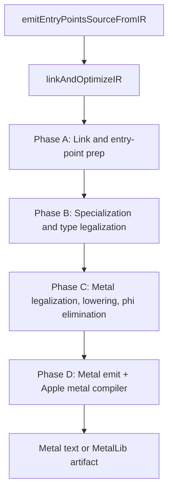
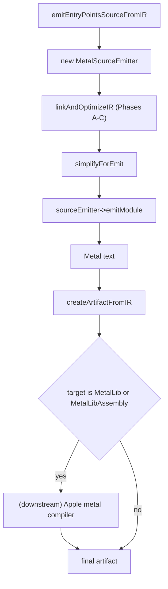

# Metal Target Pipeline

This page documents the ordered IR-pass and downstream-binary
sequence executed when Slang compiles for the Metal target family.
The corresponding `CodeGenTarget` values are `Metal`, `MetalLib`,
and `MetalLibAssembly`. All three share the same IR pipeline; they
differ only in the downstream tool that consumes the emitted
Metal text. The shared predicate inside `linkAndOptimizeIR` is
`isMetalTarget(targetRequest)` (see
[slang-type-layout.cpp](../../../../source/slang/slang-type-layout.cpp)
line 3223).

This page complements
[../pipeline/05-ir-passes.md](../pipeline/05-ir-passes.md), which
is an unordered topical catalog of every IR pass. Branches in
`linkAndOptimizeIR` gated on a sibling target (SPIR-V, HLSL,
WGSL, CUDA, CPU, GLSL, PyTorch) are filtered out of the diagrams
and tables below.

## Source

- [slang-emit.cpp](../../../../source/slang/slang-emit.cpp) —
  `linkAndOptimizeIR` (line ~893) is the orchestrator;
  `emitEntryPointsSourceFromIR` (line ~2418) constructs the
  `MetalSourceEmitter` and emits Metal text.
- [slang-emit-metal.cpp](../../../../source/slang/slang-emit-metal.cpp)
  — `MetalSourceEmitter` implementation.
- [slang-emit-metal-prelude.cpp](../../../../source/slang/slang-emit-metal-prelude.cpp)
  — Metal-specific prelude emission.
- [slang-emit-c-like.cpp](../../../../source/slang/slang-emit-c-like.cpp)
  — shared C-like emitter base class.
- [slang-ir-metal-legalize.cpp](../../../../source/slang/slang-ir-metal-legalize.cpp)
  — `legalizeIRForMetal` (line ~250) is the central Metal
  legalization driver.
- [slang-ir-legalize-varying-params.cpp](../../../../source/slang/slang-ir-legalize-varying-params.cpp)
  — `legalizeEntryPointVaryingParamsForMetal`.
- [slang-ir-legalize-binary-operator.cpp](../../../../source/slang/slang-ir-legalize-binary-operator.cpp)
  — `legalizeLogicalAndOr` runs for Metal.
- [slang-target-program.h](../../../../source/slang/slang-target-program.h)
  / [slang-compiler-options.h](../../../../source/slang/slang-compiler-options.h)
  — gate sources.

## High-level phase diagram

Phase A and Phase B are nearly identical to the corresponding
phases on the WGSL page; Metal's divergence is concentrated in
Phase C (`legalizeIRForMetal`, `specializeAddressSpaceForMetal`)
and several Phase-B passes that only run for Metal
(`wrapCBufferElementsForMetal`, the `legalizeEmptyTypes` Metal
arm, the `MetalParameterBlock` buffer-element policy).

## Phase A: Link and entry-point prep

Spans roughly lines 928-1205 of
[slang-emit.cpp](../../../../source/slang/slang-emit.cpp). Metal
hits the `default` arm of every per-target switch in this phase.
Like WGSL, Metal is non-Khronos, so the
`!isKhronosTarget && reqSet.glslSSBO` gate at line 979 lets
`lowerGLSLShaderStorageBufferObjectsToStructuredBuffers` fire.

```mermaid
flowchart TD
  linkIRn[linkIR]
  vaaa[validateAndRemoveAssumeAddress]
  reqSet1[calcRequiredLoweringPassSet]
  diGate{reqSet.debugInfo and DebugInfoLevel::None}
  stripDI[stripDebugInfo]
  ssboGate{"!isKhronosTarget and reqSet.glslSSBO"}
  ssbo[lowerGLSLShaderStorageBufferObjectsToStructuredBuffers]
  tEPInBorrow[translateEntryPointInParamToBorrow]
  gvvGate{reqSet.globalVaryingVar}
  tGVV[translateGlobalVaryingVar]
  rvirGate{reqSet.resolveVaryingInputRef}
  rvir[resolveVaryingInputRef]
  fEPC[fixEntryPointCallsites]
  rGC[replaceGlobalConstants]
  beGate{reqSet.bindExistential}
  bES[bindExistentialSlots]
  covGate{reqSet.coverageTracing}
  iC[instrumentCoverage]
  cGUP[collectGlobalUniformParameters]
  cEPD[checkEntryPointDecorations]
  aDMD[addDenormalModeDecorations]
  cEPUP[collectEntryPointUniformParams]
  mEPUP[moveEntryPointUniformParamsToGlobalScope]
  rTCEP[removeTorchAndCUDAEntryPoints]
  covGate2{reqSet.coverageTracing}
  fCIM[finalizeCoverageInstrumentationMetadata]
  lLVC[lowerLValueCast]
  enumGate{reqSet.enumType}
  lET[lowerEnumType]

  linkIRn --> vaaa --> reqSet1 --> diGate
  diGate -->|true| stripDI --> ssboGate
  diGate -->|false| ssboGate
  ssboGate -->|true| ssbo --> tEPInBorrow
  ssboGate -->|false| tEPInBorrow
  tEPInBorrow --> gvvGate
  gvvGate -->|true| tGVV --> rvirGate
  gvvGate -->|false| rvirGate
  rvirGate -->|true| rvir --> fEPC
  rvirGate -->|false| fEPC
  fEPC --> rGC --> beGate
  beGate -->|true| bES --> covGate
  beGate -->|false| covGate
  covGate -->|true| iC --> cGUP
  covGate -->|false| cGUP
  cGUP --> cEPD --> aDMD --> cEPUP --> mEPUP --> rTCEP --> covGate2
  covGate2 -->|true| fCIM --> lLVC
  covGate2 -->|false| lLVC
  lLVC --> enumGate
  enumGate -->|true| lET
```

| # | Pass | File | Gate | Notes |
| --- | --- | --- | --- | --- |
| 1 | `linkIR` | [slang-ir-link.cpp](../../../../source/slang/slang-ir-link.cpp) | (always) | |
| 2 | `validateAndRemoveAssumeAddress` | [slang-ir-validate.cpp](../../../../source/slang/slang-ir-validate.cpp) | (always) | `validate=true` (Metal is non-CPU/CUDA). |
| 3 | `stripDebugInfo` | [slang-ir-strip-debug-info.cpp](../../../../source/slang/slang-ir-strip-debug-info.cpp) | `reqSet.debugInfo && DebugInfoLevel::None` | |
| 4 | `lowerGLSLShaderStorageBufferObjectsToStructuredBuffers` | [slang-ir-lower-glsl-ssbo-types.cpp](../../../../source/slang/slang-ir-lower-glsl-ssbo-types.cpp) | `!isKhronosTarget && reqSet.glslSSBO` | Metal is non-Khronos. |
| 5 | `translateEntryPointInParamToBorrow` | [slang-ir-transform-params-to-constref.cpp](../../../../source/slang/slang-ir-transform-params-to-constref.cpp) | (always) | |
| 6 | `translateGlobalVaryingVar` | [slang-ir-translate-global-varying-var.cpp](../../../../source/slang/slang-ir-translate-global-varying-var.cpp) | `reqSet.globalVaryingVar` | |
| 7 | `resolveVaryingInputRef` | [slang-ir-resolve-varying-input-ref.cpp](../../../../source/slang/slang-ir-resolve-varying-input-ref.cpp) | `reqSet.resolveVaryingInputRef` | |
| 8 | `fixEntryPointCallsites` | [slang-ir-fix-entrypoint-callsite.cpp](../../../../source/slang/slang-ir-fix-entrypoint-callsite.cpp) | (always) | |
| 9 | `replaceGlobalConstants` | [slang-ir-link.cpp](../../../../source/slang/slang-ir-link.cpp) | (always) | |
| 10 | `bindExistentialSlots` | [slang-ir-bind-existentials.cpp](../../../../source/slang/slang-ir-bind-existentials.cpp) | `reqSet.bindExistential` | |
| 11 | `instrumentCoverage` | [slang-ir-coverage-instrument.cpp](../../../../source/slang/slang-ir-coverage-instrument.cpp) | `reqSet.coverageTracing` | |
| 12 | `collectGlobalUniformParameters` | [slang-ir-collect-global-uniforms.cpp](../../../../source/slang/slang-ir-collect-global-uniforms.cpp) | (always) | |
| 13 | `checkEntryPointDecorations` | [slang-ir-entry-point-decorations.cpp](../../../../source/slang/slang-ir-entry-point-decorations.cpp) | (always) | |
| 14 | `addDenormalModeDecorations` | [slang-emit.cpp](../../../../source/slang/slang-emit.cpp) | (always) | Static helper at line ~678. |
| 15 | `collectEntryPointUniformParams` | [slang-ir-entry-point-uniforms.cpp](../../../../source/slang/slang-ir-entry-point-uniforms.cpp) | (always, Metal via `default` arm) | |
| 16 | `moveEntryPointUniformParamsToGlobalScope` | [slang-ir-entry-point-uniforms.cpp](../../../../source/slang/slang-ir-entry-point-uniforms.cpp) | (always, Metal via `default` arm) | |
| 17 | `removeTorchAndCUDAEntryPoints` | [slang-ir-pytorch-cpp-binding.cpp](../../../../source/slang/slang-ir-pytorch-cpp-binding.cpp) | (always, Metal via `default` arm) | |
| 18 | `finalizeCoverageInstrumentationMetadata` | [slang-ir-coverage-instrument.cpp](../../../../source/slang/slang-ir-coverage-instrument.cpp) | `reqSet.coverageTracing` | Runs after entry-point uniform packing; fills CPU/CUDA uniform-marshaling fields on the coverage `ArtifactPostEmitMetadata` produced by step 11. No-op for Metal in practice. |
| 19 | `lowerLValueCast` | [slang-ir-lower-l-value-cast.cpp](../../../../source/slang/slang-ir-lower-l-value-cast.cpp) | (always) | |
| 20 | `lowerEnumType` | [slang-ir-lower-enum-type.cpp](../../../../source/slang/slang-ir-lower-enum-type.cpp) | `reqSet.enumType` | |

Filtered out for Metal in this phase: the CUDA / CUDAHeader arm
of the entry-point-param switch
(`collectOptiXEntryPointUniformParams`); the CPP / Host* arms.

## Phase B: Specialization and type legalization

Spans roughly lines 1207-1773 of `slang-emit.cpp`. Metal hits the
`default` arm at most decision points and runs
`lowerCooperativeVectors` (the `default` arm of line 1452-1466).
Metal-specific decisions:

- `lowerCombinedTextureSamplers` fires (Metal is in the
  HLSL / Metal / WGSL arm at line ~1517).
- `lowerAppendConsumeStructuredBuffers` fires
  (`target != HLSL` is true for Metal).
- Inside the `shouldLegalizeExistentialAndResourceTypes` block at
  line ~1551, the `isMetalTarget(targetRequest)` arm runs an
  extra `lowerBufferElementTypeToStorageType` with
  `BufferElementTypeLoweringPolicyKind::MetalParameterBlock`
  (line ~1565) to translate resource-typed fields inside
  parameter blocks into descriptor handles before the general
  resource legalization.
- `legalizeEmptyTypes` runs in two places for Metal:
  - The Metal arm of the inner switch at line ~1633 (after
    `legalizeResourceTypes`, under
    `shouldLegalizeExistentialAndResourceTypes`).
  - The unconditional invocation later in Phase C.
- `wrapCBufferElementsForMetal` fires (line ~1735).
  Note that `MetalLibAssembly` is **not** in the case list at
  lines 1731-1735; only `Metal` and `MetalLib` are. This is a
  minor inconsistency — `MetalLibAssembly` goes through the
  default arm and skips this pass.

```mermaid
flowchart TD
  s1[simplifyIR default]
  vu[validateUniformity]
  sML[specializeMatrixLayout]
  fSC[fuseCallsToSaturatedCooperation]
  cAP[checkAutodiffPatterns]
  dCC[diagnoseCircularConformances]
  sM[specializeModule]
  sHOP[specializeHigherOrderParameters]
  fADP[finalizeAutoDiffPass]
  lMSS[lowerMatrixSwizzleStores]
  dce1[eliminateDeadCode]
  fS[finalizeSpecialization]
  lDTI[lowerDiffTypeInfoInsts]
  lCT[lowerConditionalType]
  lRO[lowerReinterpretOptional]
  cONU[checkForOptionalNoneUsage]
  lOT[lowerOptionalType]
  lRT[lowerResultType]
  reqSet2[calcRequiredLoweringPassSet]
  dUR[detectUninitializedResources]
  rAIDD[removeAvailableInDownstreamModuleDecorations]
  checks["checkForRecursive* checkForOutOfBoundAccess<br/>checkForMissingReturns checkForInvalidShaderParameterType"]
  iAVS[inferAnyValueSizeWhereNecessary]
  uPWT[unpinWitnessTables]
  lSVMI[lowerSumVectorMatrixInsts]
  s2a[simplifyIR fast]
  lTUT[lowerTaggedUnionTypes]
  lUUT[lowerUntaggedUnionTypes]
  lR[lowerReinterpret]
  lSIDC[lowerSequentialIDTagCasts]
  lTI[lowerTagInsts]
  lTT[lowerTagTypes]
  dce3[eliminateDeadCode]
  lE[lowerExistentials]
  rWUI[removeWeakUseInsts]
  pTIN[performTypeInlining]
  cGSHI[checkGetStringHashInsts]
  dce4[eliminateDeadCode]
  lTu[lowerTuples]
  gAVMF[generateAnyValueMarshallingFunctions]
  sSS[specializeStageSwitch]
  lCV[lowerCooperativeVectors]
  pFI1[performForceInlining]
  s2b[simplifyIR default]
  lACSB[lowerAppendConsumeStructuredBuffers]
  lCTS[lowerCombinedTextureSamplers]
  lEA[legalizeEmptyArray]
  lVT[legalizeVectorTypes]
  iGC[inlineGlobalConstantsForLegalization]
  lBETST_Metal["lowerBufferElementTypeToStorageType<br/>(MetalParameterBlock policy)"]
  lETL[legalizeExistentialTypeLayout]
  vSBRT[validateStructuredBufferResourceTypes]
  lRTR[legalizeResourceTypes]
  lET_Metal["legalizeEmptyTypes (Metal arm)"]
  lMT[legalizeMatrixTypes]
  s2c[simplifyIR fast]
  lDRH[lowerDynamicResourceHeap]
  sRU[specializeResourceUsage]
  sFBLA1[specializeFuncsForBufferLoadArgs]
  dBL[deferBufferLoad]
  sAP[specializeArrayParameters]
  cSA[checkStaticAssert]
  wCBE[wrapCBufferElementsForMetal]

  s1 --> vu --> sML --> fSC --> cAP --> dCC --> sM --> sHOP --> fADP --> lMSS --> dce1 --> fS --> lDTI --> lCT --> lRO --> cONU --> lOT --> lRT --> reqSet2 --> dUR --> rAIDD --> checks --> iAVS --> uPWT --> lSVMI --> s2a --> lTUT --> lUUT --> lR --> lSIDC --> lTI --> lTT --> dce3 --> lE --> rWUI --> pTIN --> cGSHI --> dce4 --> lTu --> gAVMF --> sSS --> lCV --> pFI1 --> s2b --> lACSB --> lCTS --> lEA --> lVT --> iGC --> lBETST_Metal --> lETL --> vSBRT --> lRTR --> lET_Metal --> lMT --> s2c --> lDRH --> sRU --> sFBLA1 --> dBL --> sAP --> cSA --> wCBE
```

(Conditional gates are omitted from the diagram for readability;
see the conditional-gates table below for the full set.)

| # | Pass | File | Gate | Notes |
| --- | --- | --- | --- | --- |
| 1 | `simplifyIR` | [slang-ir-ssa-simplification.cpp](../../../../source/slang/slang-ir-ssa-simplification.cpp) | (always) | `defaultIRSimplificationOptions`. |
| 2 | `validateUniformity` | [slang-ir-uniformity.cpp](../../../../source/slang/slang-ir-uniformity.cpp) | `getBoolOption(ValidateUniformity)` | |
| 3 | `specializeMatrixLayout` | [slang-ir-specialize-matrix-layout.cpp](../../../../source/slang/slang-ir-specialize-matrix-layout.cpp) | (always) | |
| 4 | `fuseCallsToSaturatedCooperation` | [slang-ir-fuse-satcoop.cpp](../../../../source/slang/slang-ir-fuse-satcoop.cpp) | `!shouldPerformMinimumOptimizations` | |
| 5 | `checkAutodiffPatterns` | [slang-ir-check-differentiability.cpp](../../../../source/slang/slang-ir-check-differentiability.cpp) | `reqSet.autodiff` | |
| 6 | `diagnoseCircularConformances` | [slang-ir-any-value-inference.cpp](../../../../source/slang/slang-ir-any-value-inference.cpp) | (always) | |
| 7 | `specializeModule` | [slang-ir-specialize.cpp](../../../../source/slang/slang-ir-specialize.cpp) | `!isSpecializationDisabled()` | |
| 8 | `specializeHigherOrderParameters` | [slang-ir-defunctionalization.cpp](../../../../source/slang/slang-ir-defunctionalization.cpp) | `reqSet.higherOrderFunc` | |
| 9 | `finalizeAutoDiffPass` | [slang-ir-autodiff.cpp](../../../../source/slang/slang-ir-autodiff.cpp) | (always) | |
| 10 | `lowerMatrixSwizzleStores` | [slang-ir-lower-matrix-swizzle-store.cpp](../../../../source/slang/slang-ir-lower-matrix-swizzle-store.cpp) | `reqSet.matrixSwizzleStore` | |
| 11 | `eliminateDeadCode` | [slang-ir-dce.cpp](../../../../source/slang/slang-ir-dce.cpp) | (always) | |
| 12 | `finalizeSpecialization` | [slang-ir-specialize.cpp](../../../../source/slang/slang-ir-specialize.cpp) | (always) | |
| 13 | `lowerDiffTypeInfoInsts` | [slang-ir-autodiff.cpp](../../../../source/slang/slang-ir-autodiff.cpp) | (always) | Direct call. |
| 14 | `lowerConditionalType` | [slang-ir-lower-conditional-type.cpp](../../../../source/slang/slang-ir-lower-conditional-type.cpp) | `reqSet.conditionalType` | |
| 15 | `lowerReinterpretOptional` | [slang-ir-lower-reinterpret.cpp](../../../../source/slang/slang-ir-lower-reinterpret.cpp) | `reqSet.optionalType` | |
| 16 | `checkForOptionalNoneUsage` | [slang-ir-check-optional-none-usage.cpp](../../../../source/slang/slang-ir-check-optional-none-usage.cpp) | `shouldRunNonEssentialValidation()` | |
| 17 | `lowerOptionalType` | [slang-ir-lower-optional-type.cpp](../../../../source/slang/slang-ir-lower-optional-type.cpp) | `reqSet.optionalType` | |
| 18 | `lowerResultType` | [slang-ir-lower-result-type.cpp](../../../../source/slang/slang-ir-lower-result-type.cpp) | `reqSet.resultType` | Now runs **after** `lowerOptionalType`: depends on accurate `getAnyValueSize()` results, which requires Optional lowering first. |
| 19 | `detectUninitializedResources` | [slang-ir-detect-uninitialized-resources.cpp](../../../../source/slang/slang-ir-detect-uninitialized-resources.cpp) | (always) | |
| 20 | `removeAvailableInDownstreamModuleDecorations` | [slang-ir-redundancy-removal.cpp](../../../../source/slang/slang-ir-redundancy-removal.cpp) | `removeAvailableInDownstreamIR` | |
| 21 | `checkForRecursiveTypes` | [slang-ir-check-recursion.cpp](../../../../source/slang/slang-ir-check-recursion.cpp) | `shouldRunNonEssentialValidation()` | |
| 22 | `checkForRecursiveFunctions` | [slang-ir-check-recursion.cpp](../../../../source/slang/slang-ir-check-recursion.cpp) | `shouldRunNonEssentialValidation()` | |
| 23 | `checkForOutOfBoundAccess` | [slang-check-out-of-bound-access.cpp](../../../../source/slang/slang-check-out-of-bound-access.cpp) | `shouldRunNonEssentialValidation()` | |
| 24 | `checkForMissingReturns` | [slang-ir-missing-return.cpp](../../../../source/slang/slang-ir-missing-return.cpp) | `reqSet.missingReturn` | |
| 25 | `checkForInvalidShaderParameterType` | [slang-ir-check-shader-parameter-type.cpp](../../../../source/slang/slang-ir-check-shader-parameter-type.cpp) | `shouldRunNonEssentialValidation()` | |
| 26 | `inferAnyValueSizeWhereNecessary` | [slang-ir-any-value-inference.cpp](../../../../source/slang/slang-ir-any-value-inference.cpp) | (always) | |
| 27 | `unpinWitnessTables` | [slang-ir-strip-legalization-insts.cpp](../../../../source/slang/slang-ir-strip-legalization-insts.cpp) | (always) | |
| 28 | `lowerSumVectorMatrixInsts` | [slang-emit.cpp](../../../../source/slang/slang-emit.cpp) | (always) | Static helper. |
| 29 | `simplifyIR` | [slang-ir-ssa-simplification.cpp](../../../../source/slang/slang-ir-ssa-simplification.cpp) | `!minimalOptimization` | `fastIRSimplificationOptions`. |
| 30 | `lowerTaggedUnionTypes` | [slang-ir-lower-dynamic-dispatch-insts.cpp](../../../../source/slang/slang-ir-lower-dynamic-dispatch-insts.cpp) | (always) | |
| 31 | `lowerUntaggedUnionTypes` | [slang-ir-lower-dynamic-dispatch-insts.cpp](../../../../source/slang/slang-ir-lower-dynamic-dispatch-insts.cpp) | (always) | |
| 32 | `lowerReinterpret` | [slang-ir-lower-reinterpret.cpp](../../../../source/slang/slang-ir-lower-reinterpret.cpp) | `reqSet.reinterpret` | |
| 33 | `lowerSequentialIDTagCasts` | [slang-ir-lower-dynamic-dispatch-insts.cpp](../../../../source/slang/slang-ir-lower-dynamic-dispatch-insts.cpp) | (always) | |
| 34 | `lowerTagInsts` | [slang-ir-lower-dynamic-dispatch-insts.cpp](../../../../source/slang/slang-ir-lower-dynamic-dispatch-insts.cpp) | (always) | |
| 35 | `lowerTagTypes` | [slang-ir-lower-dynamic-dispatch-insts.cpp](../../../../source/slang/slang-ir-lower-dynamic-dispatch-insts.cpp) | (always) | |
| 36 | `eliminateDeadCode` | [slang-ir-dce.cpp](../../../../source/slang/slang-ir-dce.cpp) | (always) | |
| 37 | `lowerExistentials` | [slang-ir-lower-dynamic-dispatch-insts.cpp](../../../../source/slang/slang-ir-lower-dynamic-dispatch-insts.cpp) | (always) | |
| 38 | `removeWeakUseInsts` | [slang-ir-redundancy-removal.cpp](../../../../source/slang/slang-ir-redundancy-removal.cpp) | (always) | |
| 39 | `performTypeInlining` | [slang-ir-inline.cpp](../../../../source/slang/slang-ir-inline.cpp) | `!isCpuLikeTarget` (true for Metal) | |
| 40 | `checkGetStringHashInsts` | [slang-ir-string-hash.cpp](../../../../source/slang/slang-ir-string-hash.cpp) | `!isCpuLikeTarget && shouldRunNonEssentialValidation()` | |
| 41 | `lowerTuples` | [slang-ir-lower-tuple-types.cpp](../../../../source/slang/slang-ir-lower-tuple-types.cpp) | (always) | |
| 42 | `generateAnyValueMarshallingFunctions` | [slang-ir-any-value-marshalling.cpp](../../../../source/slang/slang-ir-any-value-marshalling.cpp) | (always) | |
| 43 | `specializeStageSwitch` | [slang-ir-specialize-stage-switch.cpp](../../../../source/slang/slang-ir-specialize-stage-switch.cpp) | `reqSet.specializeStageSwitch` | |
| 44 | `lowerCooperativeVectors` | [slang-ir-lower-coopvec.cpp](../../../../source/slang/slang-ir-lower-coopvec.cpp) | (always, Metal via `default` arm at line ~1465) | |
| 45 | `performForceInlining` | [slang-ir-inline.cpp](../../../../source/slang/slang-ir-inline.cpp) | (always) | |
| 46 | `simplifyIR` | [slang-ir-ssa-simplification.cpp](../../../../source/slang/slang-ir-ssa-simplification.cpp) | `!minimalOptimization` | |
| 47 | `lowerAppendConsumeStructuredBuffers` | [slang-ir-lower-append-consume-structured-buffer.cpp](../../../../source/slang/slang-ir-lower-append-consume-structured-buffer.cpp) | `target != HLSL` | |
| 48 | `lowerCombinedTextureSamplers` | [slang-ir-lower-combined-texture-sampler.cpp](../../../../source/slang/slang-ir-lower-combined-texture-sampler.cpp) | `reqSet.combinedTextureSamplers` (Metal arm at line ~1517) | |
| 49 | `legalizeEmptyArray` | [slang-ir-legalize-empty-array.cpp](../../../../source/slang/slang-ir-legalize-empty-array.cpp) | (always) | |
| 50 | `legalizeVectorTypes` | [slang-ir-legalize-vector-types.cpp](../../../../source/slang/slang-ir-legalize-vector-types.cpp) | (always) | |
| 51 | `inlineGlobalConstantsForLegalization` | [slang-ir-legalize-global-values.cpp](../../../../source/slang/slang-ir-legalize-global-values.cpp) | `shouldLegalizeExistentialAndResourceTypes` (default `true` for Metal) | |
| 52 | `lowerBufferElementTypeToStorageType` | [slang-ir-lower-buffer-element-type.cpp](../../../../source/slang/slang-ir-lower-buffer-element-type.cpp) | `isMetalTarget` | Inside the existential/resource block at line ~1565; `loweringPolicyKind = MetalParameterBlock`. **Metal-only first invocation.** |
| 53 | `legalizeExistentialTypeLayout` | [slang-ir-legalize-types.cpp](../../../../source/slang/slang-ir-legalize-types.cpp) | `reqSet.existentialTypeLayout` | |
| 54 | `validateStructuredBufferResourceTypes` | [slang-ir-validate.cpp](../../../../source/slang/slang-ir-validate.cpp) | (always) | Direct call. |
| 55 | `legalizeResourceTypes` | [slang-ir-legalize-types.cpp](../../../../source/slang/slang-ir-legalize-types.cpp) | (always) | |
| 56 | `legalizeEmptyTypes` (Metal arm) | [slang-ir-legalize-types.cpp](../../../../source/slang/slang-ir-legalize-types.cpp) | `case Metal / MetalLib / MetalLibAssembly` (line ~1633) | **Metal-only**; runs again unconditionally later. |
| 57 | `legalizeMatrixTypes` | [slang-ir-legalize-matrix-types.cpp](../../../../source/slang/slang-ir-legalize-matrix-types.cpp) | (always) | |
| 58 | `simplifyIR` | [slang-ir-ssa-simplification.cpp](../../../../source/slang/slang-ir-ssa-simplification.cpp) | `!minimalOptimization` | `fastIRSimplificationOptions`. |
| 59 | `lowerDynamicResourceHeap` | [slang-ir-lower-dynamic-resource-heap.cpp](../../../../source/slang/slang-ir-lower-dynamic-resource-heap.cpp) | `reqSet.dynamicResourceHeap` | |
| 60 | `specializeResourceUsage` | [slang-ir-specialize-resources.cpp](../../../../source/slang/slang-ir-specialize-resources.cpp) | (always) | |
| 61 | `specializeFuncsForBufferLoadArgs` | [slang-ir-specialize-buffer-load-arg.cpp](../../../../source/slang/slang-ir-specialize-buffer-load-arg.cpp) | (always) | |
| 62 | `deferBufferLoad` | [slang-ir-defer-buffer-load.cpp](../../../../source/slang/slang-ir-defer-buffer-load.cpp) | (always) | |
| 63 | `specializeArrayParameters` | [slang-ir-specialize-arrays.cpp](../../../../source/slang/slang-ir-specialize-arrays.cpp) | (always) | |
| 64 | `wrapCBufferElementsForMetal` | [slang-ir-metal-legalize.cpp](../../../../source/slang/slang-ir-metal-legalize.cpp) | `target == Metal || target == MetalLib` (line ~1731) | **`MetalLibAssembly` is omitted from the case list.** |

Filtered out for Metal in this phase: the
`CUDASource / CUDAHeader / PyTorchCppBinding` derivative-wrapper
arm; CUDA / PyTorch passes; the
`legalizeNonVectorCompositeSelect` HLSL-only arm; the CPP/Host
CPP `lowerComInterfaces` / `generateDllImportFuncs` /
`generateDllExportFuncs` arms; the HostVM early return; the
HLSL `wrapStructuredBuffersOfMatrices` arm; the SPIR-V / HLSL /
D3D `legalizeEmptyRayPayloadsForHLSL` arm; the HLSL
`legalizeNonStructParameterToStructForHLSL` arm.

## Phase C: Metal legalization, lowering, phi elimination

Spans roughly lines 1798-2413 of `slang-emit.cpp`. Metal's
central legalizer is `legalizeIRForMetal` (line ~1995, defined at
line ~285 of
[slang-ir-metal-legalize.cpp](../../../../source/slang/slang-ir-metal-legalize.cpp)).
Metal's parameter handling at line ~2041 is more elaborate than
the other shader targets: Metal goes through `undoParameterCopy`,
then (because `isMetalTarget` is true) `transformParamsToConstRef`,
then **falls through** to the
`ShaderLLVMIR / ShaderObjectCode / ShaderHostCallable` arm which
runs `moveGlobalVarInitializationToEntryPoints` and
`introduceExplicitGlobalContext`.

```mermaid
flowchart TD
  babbGate{reqSet.byteAddressBuffer}
  lBABOps["legalizeByteAddressBufferOps<br/>(Metal options)"]
  vAO[validateAtomicOperations]
  syncCheck["(skipped) synthesizeActiveMask CUDA-only"]
  rTF["(skipped) resolveTextureFormat GLSL/SPIRV/WGSL only"]
  lIRMetal[legalizeIRForMetal]
  fNRI[floatNonUniformResourceIndex]
  lLAO[legalizeLogicalAndOr]
  lISub[legalizeImageSubscript]
  uPC[undoParameterCopy]
  tPCRef[transformParamsToConstRef]
  mGVI[moveGlobalVarInitializationToEntryPoints]
  iEGC[introduceExplicitGlobalContext]
  sLOI[stripLegalizationOnlyInstructions]
  vVAM[validateVectorsAndMatrices]
  dce7[eliminateDeadCode]
  pLRC[processLateRequireCapabilityInsts]
  cUV[cleanUpVoidType]
  bqGate{reqSet.bindingQuery}
  lBQ[lowerBindingQueries]
  meshGate{reqSet.meshOutput}
  lMO[legalizeMeshOutputTypes]
  bcGate{reqSet.bitcast}
  lBC[lowerBitCast]
  lART["(skipped) legalizeArrayReturnType<br/>!isMetalTarget && !isSPIRV"]
  lBETST_def["lowerBufferElementTypeToStorageType<br/>(Default policy)"]
  sASMetal[specializeAddressSpaceForMetal]
  pFI2[performForceInlining]
  eMB[eliminateMultiLevelBreak]
  s2d[simplifyIR with removeTrivialSingleIterationLoops]
  lET2[legalizeEmptyTypes]
  livenessStartGate{shouldTrackLiveness}
  lStart["LivenessUtil::addVariableRangeStarts"]
  ePhi["eliminatePhis (default options)"]
  livenessEndGate{shouldTrackLiveness}
  lEnd["LivenessUtil::addRangeEnds"]
  sNSIR[simplifyNonSSAIR]
  aVSC[applyVariableScopeCorrection]
  cCM[collectCooperativeMetadata]
  uNEI[unexportNonEmbeddableIR]
  cM[collectMetadata]
  cUI[checkUnsupportedInst]

  babbGate -->|true| lBABOps --> vAO
  babbGate -->|false| vAO
  vAO --> syncCheck --> rTF --> lIRMetal --> fNRI --> lLAO --> lISub --> uPC --> tPCRef --> mGVI --> iEGC --> sLOI --> vVAM --> dce7 --> pLRC --> cUV --> bqGate
  bqGate -->|true| lBQ --> meshGate
  bqGate -->|false| meshGate
  meshGate -->|true| lMO --> bcGate
  meshGate -->|false| bcGate
  bcGate -->|true| lBC --> lART
  bcGate -->|false| lART
  lART --> lBETST_def --> sASMetal --> pFI2 --> eMB --> s2d --> lET2 --> livenessStartGate
  livenessStartGate -->|true| lStart --> ePhi
  livenessStartGate -->|false| ePhi
  ePhi --> livenessEndGate
  livenessEndGate -->|true| lEnd --> sNSIR
  livenessEndGate -->|false| sNSIR
  sNSIR --> aVSC --> cCM --> uNEI --> cM --> cUI
```

| # | Pass | File | Gate | Notes |
| --- | --- | --- | --- | --- |
| 1 | `legalizeByteAddressBufferOps` | [slang-ir-byte-address-legalize.cpp](../../../../source/slang/slang-ir-byte-address-legalize.cpp) | `reqSet.byteAddressBuffer` | Metal options: `scalarizeVectorLoadStore=true`, `treatGetEquivalentStructuredBufferAsGetThis=true`, `translateToStructuredBufferOps=false`, `lowerBasicTypeOps=true`. |
| 2 | `validateAtomicOperations` | [slang-ir-validate.cpp](../../../../source/slang/slang-ir-validate.cpp) | `target != SPIRV && target != SPIRVAssembly` | `skipFuncParamValidation = true`. |
| 3 | `legalizeImageSubscript` | [slang-ir-legalize-image-subscript.cpp](../../../../source/slang/slang-ir-legalize-image-subscript.cpp) | (`Metal` / `MetalLib` / `MetalLibAssembly` / `GLSL` / `SPIRV` / `SPIRVAssembly` arm) | Metal needs this because MSL uses Metal-specific texture access patterns. |
| 4 | `legalizeIRForMetal` | [slang-ir-metal-legalize.cpp](../../../../source/slang/slang-ir-metal-legalize.cpp) | (`Metal` / `MetalLib` / `MetalLibAssembly` arm at line ~1942) | The central Metal legalizer. |
| 5 | `floatNonUniformResourceIndex` | [slang-ir-float-non-uniform-resource-index.cpp](../../../../source/slang/slang-ir-float-non-uniform-resource-index.cpp) | `!isSPIRV(target)` (true for Metal) | `NonUniformResourceIndexFloatMode::Textual`. |
| 6 | `legalizeLogicalAndOr` | [slang-ir-legalize-binary-operator.cpp](../../../../source/slang/slang-ir-legalize-binary-operator.cpp) | `isMetalTarget` (in the four-way arm at line ~1983) | |
| 7 | `undoParameterCopy` | [slang-ir-undo-param-copy.cpp](../../../../source/slang/slang-ir-undo-param-copy.cpp) | (CPU / CUDA / Metal arm at line ~2041) | |
| 8 | `transformParamsToConstRef` | [slang-ir-transform-params-to-constref.cpp](../../../../source/slang/slang-ir-transform-params-to-constref.cpp) | `isCPUTarget || isCUDATarget || isMetalTarget` (line ~2050) | |
| 9 | `moveGlobalVarInitializationToEntryPoints` | [slang-ir-explicit-global-init.cpp](../../../../source/slang/slang-ir-explicit-global-init.cpp) | (via `[[fallthrough]]` from Metal arm into ShaderLLVMIR arm at line ~2060) | |
| 10 | `introduceExplicitGlobalContext` | [slang-ir-explicit-global-context.cpp](../../../../source/slang/slang-ir-explicit-global-context.cpp) | (same fallthrough) | `target = Metal`. |
| 11 | `stripLegalizationOnlyInstructions` | [slang-ir-strip-legalization-insts.cpp](../../../../source/slang/slang-ir-strip-legalization-insts.cpp) | (always) | |
| 12 | `validateVectorsAndMatrices` | [slang-ir-validate.cpp](../../../../source/slang/slang-ir-validate.cpp) | (always) | |
| 13 | `eliminateDeadCode` | [slang-ir-dce.cpp](../../../../source/slang/slang-ir-dce.cpp) | (always) | |
| 14 | `processLateRequireCapabilityInsts` | [slang-ir-late-require-capability.cpp](../../../../source/slang/slang-ir-late-require-capability.cpp) | (always) | |
| 15 | `cleanUpVoidType` | [slang-ir-cleanup-void.cpp](../../../../source/slang/slang-ir-cleanup-void.cpp) | (always) | |
| 16 | `lowerBindingQueries` | [slang-ir-lower-binding-query.cpp](../../../../source/slang/slang-ir-lower-binding-query.cpp) | `reqSet.bindingQuery` | |
| 17 | `legalizeMeshOutputTypes` | [slang-ir-legalize-mesh-outputs.cpp](../../../../source/slang/slang-ir-legalize-mesh-outputs.cpp) | `reqSet.meshOutput` | |
| 18 | `lowerBitCast` | [slang-ir-lower-bit-cast.cpp](../../../../source/slang/slang-ir-lower-bit-cast.cpp) | `reqSet.bitcast` | |
| 19 | `lowerBufferElementTypeToStorageType` | [slang-ir-lower-buffer-element-type.cpp](../../../../source/slang/slang-ir-lower-buffer-element-type.cpp) | (always) | `loweringPolicyKind = Default` for Metal (Metal is not WGPU or Khronos). |
| 20 | `specializeAddressSpaceForMetal` | [slang-ir-specialize-address-space.cpp](../../../../source/slang/slang-ir-specialize-address-space.cpp) | `isMetalTarget` (line ~2185) | |
| 21 | `performForceInlining` | [slang-ir-inline.cpp](../../../../source/slang/slang-ir-inline.cpp) | (always) | |
| 22 | `eliminateMultiLevelBreak` | [slang-ir-eliminate-multilevel-break.cpp](../../../../source/slang/slang-ir-eliminate-multilevel-break.cpp) | (always) | |
| 23 | `simplifyIR` | [slang-ir-ssa-simplification.cpp](../../../../source/slang/slang-ir-ssa-simplification.cpp) | `!minimalOptimization` | With `removeTrivialSingleIterationLoops = true`. |
| 24 | `legalizeEmptyTypes` | [slang-ir-legalize-types.cpp](../../../../source/slang/slang-ir-legalize-types.cpp) | (always; for AD 2.0) | Second invocation; first ran in Phase B. |
| 25 | `LivenessUtil::addVariableRangeStarts` | [slang-ir-liveness.cpp](../../../../source/slang/slang-ir-liveness.cpp) | `codeGenContext->shouldTrackLiveness()` | Inserts `IRLiveRangeStart` markers immediately before `eliminatePhis` ([slang-emit.cpp lines 2307-2325](../../../../source/slang/slang-emit.cpp)). |
| 26 | `eliminatePhis` | [slang-ir-eliminate-phis.cpp](../../../../source/slang/slang-ir-eliminate-phis.cpp) | (always) | **Default options** (contrast with SPIR-V). |
| 27 | `LivenessUtil::addRangeEnds` | [slang-ir-liveness.cpp](../../../../source/slang/slang-ir-liveness.cpp) | `codeGenContext->shouldTrackLiveness()` | Inserts `IRLiveRangeEnd` markers after phi elimination. |
| 28 | `simplifyNonSSAIR` | [slang-ir-ssa-simplification.cpp](../../../../source/slang/slang-ir-ssa-simplification.cpp) | (always) | |
| 29 | `applyVariableScopeCorrection` | [slang-ir-variable-scope-correction.cpp](../../../../source/slang/slang-ir-variable-scope-correction.cpp) | `target != SPIRV && target != SPIRVAssembly` | |
| 30 | `collectCooperativeMetadata` | [slang-ir-metadata.cpp](../../../../source/slang/slang-ir-metadata.cpp) | `targetCaps implies cooperative_matrix or cooperative_vector` | |
| 31 | `unexportNonEmbeddableIR` | [slang-emit.cpp](../../../../source/slang/slang-emit.cpp) | `EmbedDownstreamIR` | |
| 32 | `collectMetadata` | [slang-ir-metadata.cpp](../../../../source/slang/slang-ir-metadata.cpp) | (always) | |
| 33 | `checkUnsupportedInst` | [slang-ir-check-unsupported-inst.cpp](../../../../source/slang/slang-ir-check-unsupported-inst.cpp) | `!shouldPerformMinimumOptimizations()` | |

Filtered out for Metal in this phase: `lowerCPUResourceTypes`
(CPU LLVM only); `synthesizeActiveMask` (CUDA only);
`resolveTextureFormat` (GLSL / SPIR-V / WGSL only);
`legalizeEntryPointsForGLSL` (GLSL/SPIR-V only);
`legalizeEntryPointVaryingParamsForCPU` /
`legalizeEntryPointVaryingParamsForCUDA` / `legalizeIRForWGSL`
(their respective targets); `legalizeDynamicResourcesForGLSL`
(Khronos only); `legalizeConstantBufferLoadForGLSL` /
`legalizeDispatchMeshPayloadForGLSL` (GLSL/SPIR-V only);
`legalizeUniformBufferLoad` / `invertYOfPositionOutput` /
`rcpWOfPositionInput` (Khronos / HLSL only);
`legalizeArrayReturnType` (`!isMetalTarget && !isSPIRV` excludes
Metal); `specializeFuncsForBufferLoadArgs` second invocation
(SPIR-V direct emit only); `lowerImmutableBufferLoadForCUDA`
(CUDA only); `performIntrinsicFunctionInlining` (SPIR-V direct
emit only);
`legalizeModesOfNonCopyableOpaqueTypedParamsForGLSL` (via-GLSL
only); `applyGLSLLiveness` (Khronos only);
`replaceLocationIntrinsicsWithRaytracingObject` (SPIR-V only);
`convertEntryPointPtrParamsToRawPtrs` (CPP only).

## Phase D: Metal emit and downstream tools

Phase D begins immediately after `linkAndOptimizeIR` returns to
`emitEntryPointsSourceFromIR`. The `MetalSourceEmitter`
(constructed at line ~2517 of `slang-emit.cpp`) walks the IR and
produces Metal text. `MetalSourceEmitter::emitFuncParamLayoutImpl`
(line ~145 of
[slang-emit-metal.cpp](../../../../source/slang/slang-emit-metal.cpp))
unwraps `IRDescriptorHandleType` before the per-resource-kind
attribute selection, so bindless `DescriptorHandle<T>`-wrapped
buffer / texture / sampler parameters still receive their
`[[buffer(N)]]` / `[[texture(N)]]` / `[[sampler(N)]]` MSL
attribute (otherwise they would render as plain pointer arguments
with no binding slot, even though their layout record carries one).
For an unlayout-decorated parameter that carries a
`TargetSystemValueDecoration`, `emitFuncParamLayoutImpl` now falls
through to `maybeEmitSystemSemantic`, which is what emits the
`[[color(N)]]` attribute for the fragment parameters
synthesized by `legalizeSubpassInputsForMetal`.
`tryEmitInstStmtImpl` rejects any surviving `kIROp_SubpassLoad`
with `SLANG_DIAGNOSE_UNEXPECTED("SubpassLoad should have been
lowered before Metal emission")` — by the time emit runs, every
`SubpassLoad` should already have been replaced by the lowering
pass above. For `MetalLib` and `MetalLibAssembly` the text is then
handed to Apple's `metal` command-line compiler to produce a
`.metallib` (or its disassembly).

| # | Pass / step | File | Gate | Notes |
| --- | --- | --- | --- | --- |
| 1 | `emitEntryPointsSourceFromIR` | [slang-emit.cpp](../../../../source/slang/slang-emit.cpp) | (entry point) | |
| 2 | `new MetalSourceEmitter` | [slang-emit-metal.cpp](../../../../source/slang/slang-emit-metal.cpp) | `case SourceLanguage::Metal` | Constructed at line ~2517. |
| 3 | `sourceEmitter->init` | [slang-emit-c-like.cpp](../../../../source/slang/slang-emit-c-like.cpp) | (always) | |
| 4 | `linkAndOptimizeIR` | [slang-emit.cpp](../../../../source/slang/slang-emit.cpp) | (always) | Runs Phases A-C. |
| 5 | `simplifyForEmit` | [slang-ir-ssa-simplification.cpp](../../../../source/slang/slang-ir-ssa-simplification.cpp) | (always) | |
| 6 | `sourceEmitter->emitModule` | [slang-emit-c-like.cpp](../../../../source/slang/slang-emit-c-like.cpp) (+ overrides in `slang-emit-metal.cpp`) | (always) | Walks IR and writes Metal text; Metal prelude comes from `slang-emit-metal-prelude.cpp`. |
| 7 | `createArtifactFromIR` | [slang-emit.cpp](../../../../source/slang/slang-emit.cpp) | (always) | Wraps the Metal text as an `IArtifact`. |
| 8 | `compile` (Apple `metal`) | (downstream) | `target == MetalLib || target == MetalLibAssembly` | Downstream-compile path invokes Apple's `metal` command-line compiler. |

The bare `Metal` target stops at the text artifact; the downstream
compiler is required only for `MetalLib*`.

## Conditional gates

### `requiredLoweringPassSet.*` flags

| Gate | Passes it controls |
| --- | --- |
| `debugInfo` | `stripDebugInfo` (Phase A) with `DebugInfoLevel::None`. |
| `glslSSBO` | `lowerGLSLShaderStorageBufferObjectsToStructuredBuffers` (Phase A) — fires for Metal (non-Khronos). |
| `globalVaryingVar` | `translateGlobalVaryingVar`. |
| `resolveVaryingInputRef` | `resolveVaryingInputRef`. |
| `bindExistential` | `bindExistentialSlots`. |
| `coverageTracing` | `instrumentCoverage` and `finalizeCoverageInstrumentationMetadata` (Phase A). |
| `enumType` | `lowerEnumType`. |
| `autodiff` | `checkAutodiffPatterns`. |
| `higherOrderFunc` | `specializeHigherOrderParameters`. |
| `matrixSwizzleStore` | `lowerMatrixSwizzleStores`. |
| `resultType` | `lowerResultType`. |
| `conditionalType` | `lowerConditionalType`. |
| `optionalType` | `lowerReinterpretOptional`, `lowerOptionalType`. |
| `missingReturn` | `checkForMissingReturns`. |
| `reinterpret` | `lowerReinterpret`. |
| `specializeStageSwitch` | `specializeStageSwitch`. |
| `existentialTypeLayout` | `legalizeExistentialTypeLayout`. |
| `combinedTextureSamplers` | `lowerCombinedTextureSamplers`. |
| `dynamicResourceHeap` | `lowerDynamicResourceHeap`. |
| `byteAddressBuffer` | `legalizeByteAddressBufferOps`. |
| `bindingQuery` | `lowerBindingQueries`. |
| `meshOutput` | `legalizeMeshOutputTypes`. |
| `bitcast` | `lowerBitCast`. |

Flags that exist but **never gate a Metal pass**:
`nonVectorCompositeSelect` (HLSL only),
`derivativePyBindWrapper` (PyTorch),
`dynamicResource` (Khronos only).

### Option-set toggles

| Gate | Passes it controls |
| --- | --- |
| `shouldEmitSeparateDebugInfo()` | Emit `IRBuildIdentifier`. |
| `getBoolOption(ValidateUniformity)` | `validateUniformity`. |
| `getBoolOption(PreserveParameters)` | DCE keep-alive option. |
| `getBoolOption(EmbedDownstreamIR)` | `unexportNonEmbeddableIR`. |
| `getBoolOption(EnableExperimentalPasses)` | (would gate `introduceExplicitGlobalContext` for SPIR-V; **Metal already runs the pass via fallthrough**). |
| `shouldRunNonEssentialValidation()` | `checkForOptionalNoneUsage`, `checkForRecursive*`, `checkForOutOfBoundAccess`, `checkForInvalidShaderParameterType`, `checkGetStringHashInsts`. |
| `shouldPerformMinimumOptimizations()` | Gates `fuseCallsToSaturatedCooperation` and `checkUnsupportedInst`. |
| `fastIRSimplificationOptions.minimalOptimization` | Selects between full `simplifyIR` and minimal SCCP+DCE. |

### Context predicates and capability gates

| Gate | Passes it controls |
| --- | --- |
| `!codeGenContext->isSpecializationDisabled()` | `specializeModule`. |
| `codeGenContext->shouldTrackLiveness()` | `LivenessUtil::addVariableRangeStarts/addRangeEnds`. |
| `codeGenContext->removeAvailableInDownstreamIR` | `removeAvailableInDownstreamModuleDecorations`. |
| `targetCaps` implies `cooperative_matrix` or `cooperative_vector` | `collectCooperativeMetadata`. Metal supports cooperative matrices under specific extensions. |

### Metal-specific runtime predicates

| Gate | Where evaluated | Effect |
| --- | --- | --- |
| `isMetalTarget(targetRequest)` | Multiple sites (line 1553, 1984, 2050, 2185) | Selects Metal-specific arms: `lowerBufferElementTypeToStorageType` with `MetalParameterBlock` policy in Phase B, `legalizeLogicalAndOr`, `transformParamsToConstRef`, `specializeAddressSpaceForMetal`. |
| `target == Metal / MetalLib` (line ~1731) | `wrapCBufferElementsForMetal` switch | Only `Metal` and `MetalLib` fire this pass; `MetalLibAssembly` skips. |
| `target == Metal / MetalLib / MetalLibAssembly` (line ~1635) | `legalizeEmptyTypes` Metal arm inside existential/resource block | Distinct from the unconditional `legalizeEmptyTypes` later. |
| `target == MetalLib / MetalLibAssembly` | Downstream compile | Triggers Apple `metal` compiler invocation. |

## Loops in the pipeline

Metal has **no iterative passes** in `linkAndOptimizeIR`. Like
WGSL, the central `legalizeIRForMetal` driver is single-pass:
ripgrep finds no `while` or `do { ... } while` loops in
[slang-ir-metal-legalize.cpp](../../../../source/slang/slang-ir-metal-legalize.cpp).
The downstream Apple `metal` compiler may run its own
optimization loops, but those are out of scope.

## Notable passes

### `legalizeIRForMetal`

The single Metal-only legalization driver, defined at line ~285
of
[slang-ir-metal-legalize.cpp](../../../../source/slang/slang-ir-metal-legalize.cpp).
It walks the module once and performs:

- **Subpass-input lowering for frame-buffer fetch** via
  `legalizeSubpassInputsForMetal` (defined in the same file).
  Each `IRGlobalParam` of type `IRSubpassInputType` is turned
  into an entry-point fragment parameter with a
  `[[color(N)]]` system-value decoration (where `N` is the
  `InputAttachmentIndex` from the layout decoration), and every
  `kIROp_SubpassLoad` use is rewritten into a direct reference
  to that new parameter. Subpass inputs reachable from a
  non-fragment entry point produce
  `Diagnostics::SubpassInputUsedOutsideEntryPoint`;
  multisampled subpass loads produce
  `Diagnostics::MultisampledSubpassInputNotSupportedOnMetal`.
  Metal does not have a native `subpassLoad` intrinsic; instead
  Slang maps the construct onto Metal's frame-buffer-fetch
  feature (the per-fragment `[[color(N)]]` input).
- Entry-point varying-param legalization via
  `legalizeEntryPointVaryingParamsForMetal` (defined in
  [slang-ir-legalize-varying-params.cpp](../../../../source/slang/slang-ir-legalize-varying-params.cpp)).
- Restructuring of `[[buffer(N)]]`, `[[texture(N)]]`,
  `[[sampler(N)]]`, and `[[stage_in]]` annotations to match
  MSL conventions.
- Synthesizing the per-entry-point parameter struct that
  MetalSourceEmitter expects.
- Fix-ups for cross-thread-group memory access patterns and
  argument-buffer layout.

### `specializeAddressSpaceForMetal`

Runs at line ~2187 of `slang-emit.cpp`. Metal has explicit
address spaces (`device`, `constant`, `threadgroup`, `thread`)
that must annotate IR pointers before emit. Like WGSL, Metal does
this in `linkAndOptimizeIR`, whereas SPIR-V defers it to
`legalizeIRForSPIRV`.

### Metal-specific `lowerBufferElementTypeToStorageType`

Inside the `shouldLegalizeExistentialAndResourceTypes` block at
line ~1565, Metal alone runs an extra
`lowerBufferElementTypeToStorageType` invocation with
`MetalParameterBlock` policy **before** the general
`legalizeResourceTypes`. This pre-translates resource-typed
fields inside parameter blocks into descriptor handles so the
subsequent resource legalization does not disturb them. Metal is
modeled as "bindful for constant buffers, bindless for parameter
blocks", and this two-step lowering implements that hybrid.

### `wrapCBufferElementsForMetal`

Metal disallows
`constant T*` where `T` is a `StructuredBuffer<U>` directly
(among other restrictions on constant-buffer element types).
This pass wraps such elements into a separate `struct` so that
the emitted MSL is valid.
**Note**: the case list at line 1731-1735 includes `Metal` and
`MetalLib` but **omits** `MetalLibAssembly`. As a practical
matter, `MetalLibAssembly` is the disassembled form of
`MetalLib`, so the binary path always produces the wrapper; but
a direct request for `MetalLibAssembly` would not get the wrap.

### `legalizeEmptyTypes` runs twice

Once at line ~1638 inside the
`shouldLegalizeExistentialAndResourceTypes` block (Metal-only
arm), and again at line ~2238 unconditionally (added for AD 2.0
empty types). Both invocations are real; the second is a
safety-net for empty types introduced by Phase-C passes.

### `undoParameterCopy` + `transformParamsToConstRef`

Metal is in the CPU / CUDA / Metal arm at line ~2041 because the
downstream Apple `metal` compiler benefits from pass-by-pointer
patterns familiar to C++. `undoParameterCopy` removes the
explicit copy-in/copy-out wrappers Slang introduced for `inout`
parameters in the front end, and `transformParamsToConstRef`
converts struct parameters to const-references for performance.

### `legalizeImageSubscript`

Runs at line ~2001 in the Metal / GLSL / SPIR-V arm. MSL uses
`texture2d<T>::read(uint2)` rather than a generic subscript
operator; this pass rewrites IR-level `imageSubscript` into the
target-appropriate texture-access form before emit.

### `eliminatePhis` with default options

Metal accepts the default `PhiEliminationOptions`. The emitted
MSL uses explicit per-branch assignments to function-local
variables, which is what the default elimination produces.

### `DescriptorHandle<T>` parameter-binding emission

`MetalSourceEmitter::emitFuncParamLayoutImpl` (line ~145 of
[slang-emit-metal.cpp](../../../../source/slang/slang-emit-metal.cpp))
unwraps `IRDescriptorHandleType` before the per-resource-kind
type tests. `DescriptorHandle<T>` is Slang's bindless wrapper for
resource types: on Metal it is laid out as if it were `T` and
must take the same `[[buffer(N)]]` / `[[texture(N)]]` /
`[[sampler(N)]]` attribute as `T` would. Without this unwrap,
the per-kind `as<IRPtrTypeBase>` / `as<IRHLSLStructuredBufferTypeBase>`
checks would fall through, the `if` body would not fire, and the
parameter would be emitted without any binding-slot annotation —
which the Apple `metal` compiler then rejects (or silently
mis-binds). The fix preserves every other entry-point layout
decision; bindless `DescriptorHandle` parameters now look
identical to their bindful equivalents in the emitted MSL.

### Downstream Apple `metal` compiler

For `MetalLib` and `MetalLibAssembly`, Slang's downstream compile
path invokes Apple's `metal` command-line tool to translate the
emitted Metal text into a `.metallib`. Slang does not validate
the Metal source it emits; all MSL grammar checking and
optimization is delegated to the Apple tool.

## See also

- [../pipeline/04-ast-to-ir.md](../pipeline/04-ast-to-ir.md) —
  AST → IR lowering.
- [../pipeline/05-ir-passes.md](../pipeline/05-ir-passes.md) —
  unordered topical catalog of IR passes.
- [../pipeline/06-emit.md](../pipeline/06-emit.md) — backend emit
  overview.
- [../cross-cutting/targets.md](../cross-cutting/targets.md) —
  per-target options, capability sets, and target predicates.
- [../ir-reference/index.md](../ir-reference/index.md) —
  per-opcode catalog.
- [spirv.md](spirv.md), [hlsl.md](hlsl.md), [wgsl.md](wgsl.md),
  [cuda.md](cuda.md) — peer per-target pipeline pages.
- [index.md](index.md) — cross-target navigation hub.
